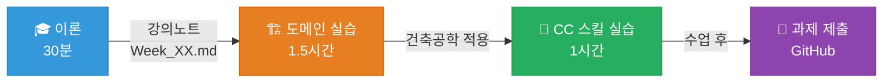
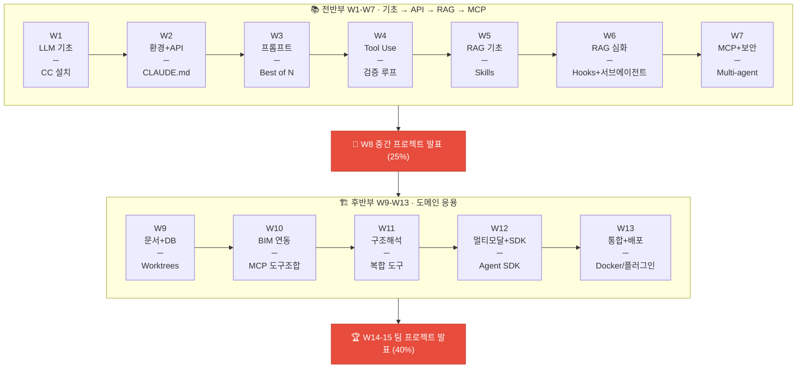
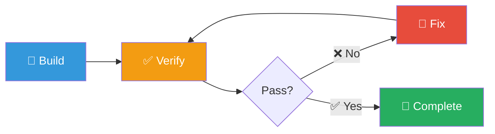
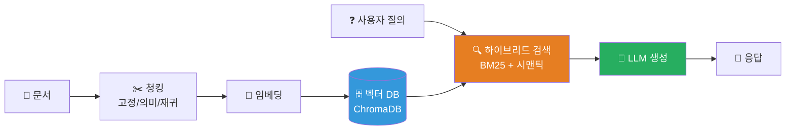
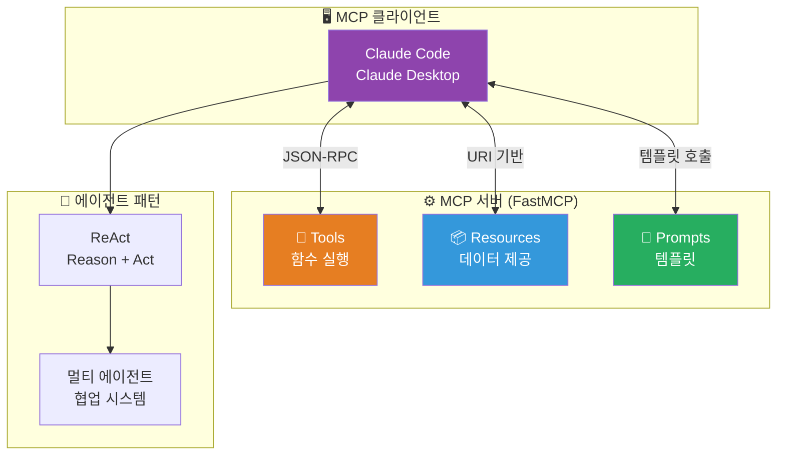
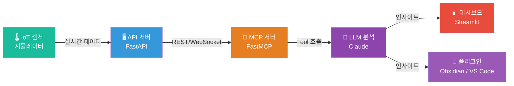
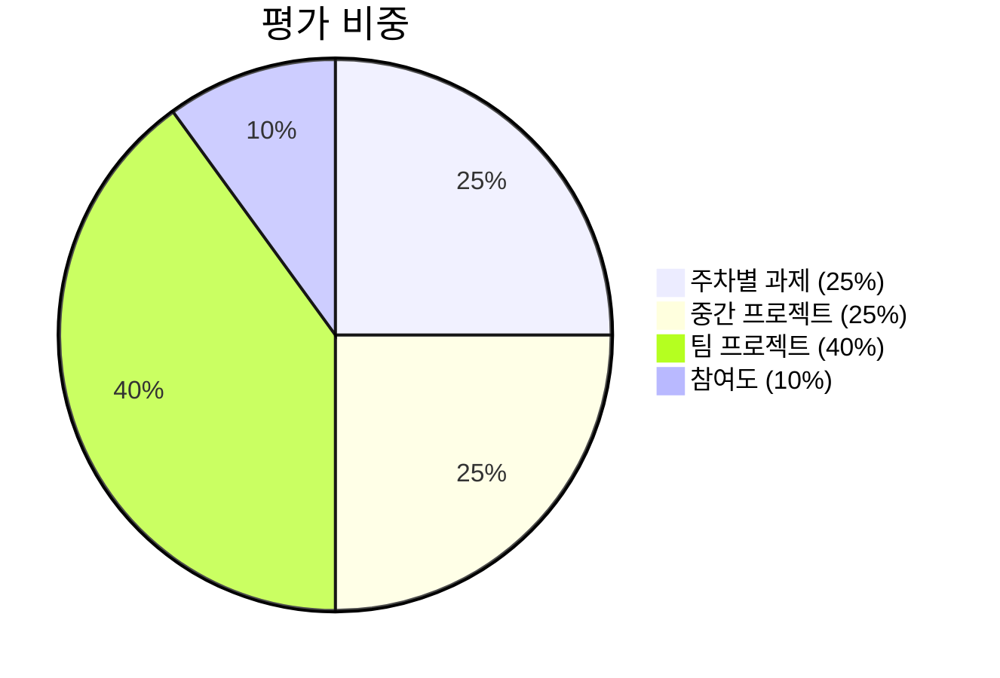
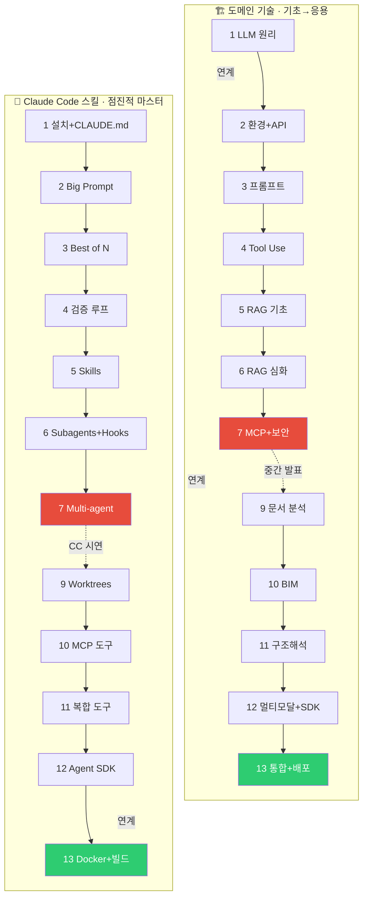

# 대형언어모델활용건축공학인공지능구현
## Implementation of Artificial Intelligence in Architectural Engineering Using Large Language Models

**대학원 과정 강의안 v2.3 (15주)**

---

## 강의 개요

### 기본 정보

| 항목 | 내용 |
|-----|------|
| 강의명 | 대형언어모델활용건축공학인공지능구현 |
| 대상 | 건축공학 대학원생 |
| 기간 | 15주 (주 3시간) |
| 형식 | **워크숍형** — 이론 30분 + 실습 2시간+ |
| 키워드 | LLM, Claude Code, Skills, MCP, RAG, Agent SDK, Supabase, 건축공학, AI 에이전트 |

### 강의 설명

본 강의는 대형언어모델(LLM)을 건축공학 실무에 적용하는 역량을 기른다. **Claude Code를 주력 개발 도구**로 사용하여, 프롬프트 엔지니어링부터 API 활용, RAG 시스템 구축, MCP 서버 연동, Agentic Workflow에 이르기까지 최신 LLM 활용 기법을 **직접 만들며** 학습한다.

### 수업 철학

```
┌─────────────────────────────────────────────────────────┐
│  "AI를 배우는 가장 좋은 방법은 AI와 함께 만드는 것이다"  │
│                                                         │
│  매주 수업 = 이론(30분) + Claude Code 워크숍(2시간+)    │
│  학생은 Claude Code로 직접 코딩하며 배운다               │
│  강의자는 실시간으로 돌아다니며 코칭한다                  │
└─────────────────────────────────────────────────────────┘
```

### 수업 운영 패턴



> *Anthropic 참고 자료 URL은 강의노트에 포함 (자율 학습용)*

### 듀얼 트랙 구조

매주 수업은 **두 개의 트랙**을 병행한다:

| 트랙 | 설명 | 예시 |
|------|------|------|
| 🏗️ **도메인 주제** | 건축공학 + LLM 기술 내용 | RAG, MCP, API 등 |
| 🤖 **Claude Code 스킬** | Claude Code 활용 능력 점진적 향상 | CLAUDE.md → Skills → Subagents → Agent SDK |



### 활용 LLM 플랫폼

| 플랫폼 | 모델/도구 | 주요 활용 |
|-------|----------|----------|
| Anthropic | Claude 4.5/4.6, **Claude Code** | **메인 개발 도구**, API, MCP |
| Google | AI Studio, Gemini 2.5 Pro, NotebookLM | 프롬프트 실험, 긴 컨텍스트, No-code RAG |
| OpenAI | GPT-4o | API 비교 (선택) |

### 선수 지식

- Python 프로그래밍 기초 이상 (중급 권장, 부족해도 Claude Code가 보완)
- 건축공학 기본 지식 (구조, 시공, 관리)
- Git 기초 (2주차에서 보충)

### 수강 전 준비사항

> [!action] 첫 수업 전 필수 셋업
> 1. **Claude Pro 구독** ($20/월) — Claude Code 포함
> 2. **VS Code** 설치 + Python 확장
> 3. **GitHub** 계정 생성
> 4. **Google AI Studio** 계정 (aistudio.google.com)
> 5. **Node.js** 설치 (Claude Code 설치에 필요)
> 6. **Supabase** 계정 생성 (supabase.com, 무료)
> 7. **Docker Desktop** 설치 (13주차부터 사용)

---

## 커리큘럼 개요

### 전반부 (W1-W7): 기초 → API → RAG → MCP

|  주차  | 도메인 주제 | Claude Code 스킬 | 참고 Anthropic 자료 | 평가 |
| :---: | --------- | --------------- | ----------------- | :---: |
| 1 | LLM 원리 + CC 체험 | CC 설치 + CLAUDE.md 기초 | CC in Action, Building S1 | 과제 |
| 2 | 개발환경 + Python API 첫 호출 | CLAUDE.md 심화 + Big Prompt | Building S1 | 과제 |
| 3 | 프롬프트 전략 + Streamlit UI | Best of N | Building S2 | 과제 |
| 4 | Tool Use + Streaming + 비용 관리 | 검증 루프 | Building S3 | 과제 |
| 5 | RAG 기초 + 하이브리드 검색 | Skills & Commands | Building S4 | 과제 |
| 6 | RAG 심화 + 평가(LLM-as-Judge) | Subagents + Hooks | Intro to MCP | 과제 |
| 7 | MCP 서버 개발 + 에이전트 + 보안 | Multi-agent + Agent SDK 소개 | Building S5 | 과제 |

### 중간 (W8)

| 주차 | 내용 | 평가 |
| :---: | --- | :---: |
| **8** | **중간 프로젝트 발표** | **25%** |

### 후반부 (W9-W13): 도메인 응용

|  주차  | 도메인 주제 | Claude Code 스킬 | 참고 Anthropic 자료 | 평가 |
| :---: | --------- | --------------- | ----------------- | :---: |
| 9 | 건설 문서 분석 + DB 기초 | Git Worktrees 병렬 개발 | Building S6 | — |
| 10 | BIM 연동 (IFC + MCP) | MCP 도구 조합 | MCP Advanced (전반) | 과제 |
| 11 | 구조해석 연동 (Midas + MCP) | 복합 도구 조합 | MCP Advanced (후반) | 과제 |
| 12 | 멀티모달 + Agent SDK | Agent SDK 실습 | Building S7 | — |
| 13 | 통합 시스템 + 배포 (Docker/플러그인) | 통합 빌드 + 배포 | — | 과제 |

### 마무리 (W14-15)

| 주차 | 내용 | 평가 |
| :---: | --- | :---: |
| **14-15** | **팀 프로젝트 개발 및 발표** | **40%** |

---

## 상세 주차별 강의 계획

> [!method] 실러버스 vs 강의노트 역할 분리
> - **실러버스 (이 문서)**: 큰 그림, 주요 주제, 참고 URL (주차당 20-30줄)
> - **강의노트 (Week_XX.md)**: 상세 이론, 코드 예제, 실습 절차 (주차당 100-200줄)

---

### 주차 1: LLM 원리 + Claude Code 체험

#### 도메인 주제
- Transformer와 Attention 메커니즘 (직관적 이해)
- 토큰화, 컨텍스트 윈도우, 모델의 한계 (환각, 지식 단절일)
- 주요 플랫폼 비교 (Claude, GPT, Gemini)
- 프롬프트 엔지니어링: Zero-shot, Few-shot, Chain-of-Thought
- 세 플랫폼 비교 실습 (Claude.ai, ChatGPT, AI Studio)

#### Claude Code 스킬: 설치 + CLAUDE.md 기초
- Claude Code 설치, 기본 명령어, 첫 대화
- 간단한 건축 계산기를 Claude Code로 만들어보기
- CLAUDE.md 개념 소개 (2주차에서 심화)

> [!ref] 참고 Anthropic 자료
> - 🎓 **Claude Code in Action** (1h, 15강) — CC 사용법 전반, 가장 접근 쉬움
>   https://anthropic.skilljar.com/claude-code-in-action
> - 🎓 **Building with Claude API — S1** (API 기초) — 인증, 요청, 대화, 시스템 프롬프트
>   https://anthropic.skilljar.com/claude-with-the-anthropic-api
> - 📓 Prompt Engineering Tutorial (GitHub Notebook)
>   https://github.com/anthropics/courses/tree/master/prompt_engineering_interactive_tutorial

#### 과제
1. 건축 시방서 요약을 위한 최적 프롬프트 개발 (세 플랫폼 비교)
2. Claude Code로 건축 단위 변환 유틸리티 만들기 (GitHub 저장소 제출)

---

### 주차 2: 개발환경 + Python API 첫 호출

#### 도메인 주제
- 개발 워크플로우 전체 구조 (VS Code, Git, 가상환경)
- Git 버전 관리 기본 개념
- 환경변수와 API 키 보안 관리 (.env, .gitignore)
- Python에서 Claude API 첫 호출 (anthropic 패키지)
- 클라이언트-서버 아키텍처 기초

#### Claude Code 스킬: CLAUDE.md 심화 + Big Prompt
- CLAUDE.md 작성법 (프로젝트 구조, 코딩 컨벤션, 기술 스택)
- Big Prompt로 전체 앱 한 번에 만들기
- "함수 하나 만들어줘"가 아니라 "앱 하나 만들어줘"로 사고 전환

> [!ref] 참고 Anthropic 자료
> - 🎓 **Building with Claude API — S1** (API 기초) — 계속
>   https://anthropic.skilljar.com/claude-with-the-anthropic-api
> - 📓 API Fundamentals (GitHub Notebook)
>   https://github.com/anthropics/courses/tree/master/anthropic_api_fundamentals

#### 과제
1. 개인 GitHub 저장소 + CLAUDE.md 작성
2. Claude API 첫 호출 스크립트 (환경변수 관리 포함)
3. Big Prompt로 건축 법규 검토 앱 생성 후 결과 스크린샷

---

### 주차 3: 프롬프트 전략 + Streamlit UI

#### 도메인 주제
- 프롬프트 엔지니어링 심화: 역할 지정, 출력 형식 제어, 멀티턴 전략
- 시스템 프롬프트 설계 패턴
- 구조화된 출력(JSON) 유도 및 파싱
- Streamlit 기초: 입력 폼, 결과 표시, 레이아웃
- FastAPI + Streamlit 연동 패턴

#### Claude Code 스킬: Best of N
- 동일 기능을 여러 번 다르게 만들어 비교
- 각 버전의 장점을 조합하여 최적 결과 도출
- AI 코딩의 비용 효율성 (여러 버전 시도가 합리적)

> [!ref] 참고 Anthropic 자료
> - 🎓 **Building with Claude API — S2** (프롬프트 엔지니어링 & 평가)
>   https://anthropic.skilljar.com/claude-with-the-anthropic-api
> - 📓 Real World Prompting (GitHub Notebook)
>   https://github.com/anthropics/courses/tree/master/real_world_prompting

#### 과제
FastAPI + Streamlit 법규 검토 앱 + Best of N 3버전 비교 보고서

---

### 주차 4: Tool Use + Streaming + 비용 관리

#### 도메인 주제
- Tool Use / Function Calling 아키텍처
- 도구 정의, 멀티턴 도구 호출, 결과 처리
- Streaming 응답의 원리와 UX (Streamlit 통합)
- 토큰 비용 구조: 모델 티어링 (Haiku/Sonnet/Opus)
- Prompt Caching으로 비용 90% 절감

#### Claude Code 스킬: 검증 루프
- Build → Verify → Fix → Verify 패턴
- Claude Code에게 자기가 만든 코드를 실행·검증시키기
- 테스트 코드 자동 작성 및 실행



> [!ref] 참고 Anthropic 자료
> - 🎓 **Building with Claude API — S3** (Tool Use) — 커스텀 도구, 멀티턴, 배치 호출
>   https://anthropic.skilljar.com/claude-with-the-anthropic-api
> - 📓 Tool Use (GitHub Notebook)
>   https://github.com/anthropics/courses/tree/master/tool_use

#### 과제
1. Streaming 챗봇 + Tool Use 통합 앱 구현
2. 검증 루프로 테스트까지 자동 완성 (GitHub 제출)

---

### 주차 5: RAG 기초 + 하이브리드 검색

#### 도메인 주제
- 벡터 임베딩 원리와 유사도 계산
- 문서 청킹 전략 (고정 크기, 의미 기반, 재귀적)
- 벡터 데이터베이스 (ChromaDB)
- 하이브리드 검색 (키워드 BM25 + 시맨틱)
- NotebookLM으로 No-code RAG 체험 → 직접 구현 비교



#### Claude Code 스킬: Skills & Commands
- `.claude/commands/` (기존) → `.claude/skills/` (확장) 관계 이해
- SKILL.md 구조: YAML frontmatter + markdown 본문
- Skills vs Commands: 자동 호출, 보조 파일, 크로스 플랫폼 지원
- `disable-model-invocation`, `user-invocable` 등 프론트매터 설정
- RAG 테스트 스킬 작성 실습 (SKILL.md + 템플릿 + 스크립트)

> [!ref] 참고 Anthropic 자료
> - 🎓 **Building with Claude API — S4** (RAG) — 청킹, 임베딩, 하이브리드 검색, 리랭킹
>   https://anthropic.skilljar.com/claude-with-the-anthropic-api
> - 📝 Blog: Contextual Retrieval
>   https://www.anthropic.com/news/contextual-retrieval
> - 📝 Skills 공식 문서: https://code.claude.com/docs/en/skills
> - 📝 Skills 가이드: https://resources.anthropic.com/hubfs/The-Complete-Guide-to-Building-Skill-for-Claude.pdf

#### 과제
1. NotebookLM vs 직접 RAG 비교 보고서
2. CC Commands + 검증 루프로 RAG 시스템 구축 (GitHub 제출)

---

### 주차 6: RAG 심화 + 평가 (LLM-as-Judge)

#### 도메인 주제
- 고급 RAG: Query Transformation, Re-ranking
- 긴 컨텍스트 vs RAG 선택 기준
- RAG 평가 방법론: LLM-as-Judge (Relevance, Faithfulness, Completeness)
- 테스트 세트 기반 자동 평가 파이프라인

#### Claude Code 스킬: Subagents + Hooks
- Claude Code 안에서 별도 에이전트 생성하여 독립 작업 수행
- 서브에이전트에게 조사, 분석, 코드 작성 위임
- RAG 평가를 서브에이전트로 병렬 실행
- **Hooks 시스템**: PreToolUse, PostWrite 등 이벤트 기반 자동화
  - 코드 저장 시 자동 포맷팅 (Black)
  - 파일 쓰기 전 보안 검사 (.env 보호)
- Skills에서 `context: fork`로 서브에이전트 격리 실행

> [!ref] 참고 Anthropic 자료
> - 🎓 **Intro to MCP** (1h, 16강) — MCP 기초, 서버/클라이언트 (**W7 실습 전 사전학습**)
>   https://anthropic.skilljar.com/introduction-to-model-context-protocol
> - 📓 Prompt Evaluations (GitHub Notebook)
>   https://github.com/anthropics/courses/tree/master/prompt_evaluations
> - 📝 Hooks 공식 문서: https://code.claude.com/docs/en/hooks

#### 과제
KDS 건축구조기준 기반 하이브리드 RAG + LLM-as-Judge 평가 결과 포함 (GitHub 제출)

---

### 주차 7: MCP 서버 개발 + 에이전트 + 보안

#### 도메인 주제
- MCP(Model Context Protocol) 구조: Tools, Resources, Prompts
- FastMCP로 건축 법규 MCP 서버 개발
- 에이전트 아키텍처: ReAct 패턴, 단일 vs 멀티 에이전트
- LLM 시스템 보안: Direct/Indirect Injection, Jailbreak, 방어 전략
- Claude Desktop / Claude Code에서 MCP 서버 연동



#### Claude Code 스킬: Multi-agent + Agent SDK 소개
- Multi-agent orchestration 패턴: Orchestrator-Worker, Agent Teams
- 서브에이전트 역할 분화: 코드 작성 vs 검증 vs 리뷰
- Worktree 격리로 병렬 에이전트 충돌 방지
- **Claude Agent SDK 소개** (Python)
  - Agent SDK vs Python SDK 차이점
  - 기본 구조: 에이전트 생성 → 도구 연결 → 실행
  - W12에서 실습 예고

> [!ref] 참고 Anthropic 자료
> - 🎓 **Building with Claude API — S5** (MCP 통합) — MCP 서버/클라이언트, 풀 라이프사이클
>   https://anthropic.skilljar.com/claude-with-the-anthropic-api
> - 📝 Blog: Building Effective Agents
>   https://www.anthropic.com/engineering/building-effective-agents
> - 📝 Agent SDK: https://platform.claude.com/docs/en/agent-sdk/overview
> - 📝 Agent Teams: https://code.claude.com/docs/en/agent-teams

#### 중간 프로젝트 안내

```
주제: 건축공학 AI 시스템 구현 (RAG 또는 MCP 활용)
기간: 7주차 ~ 8주차 (1주)  |  팀 구성: 2-3인
발표: 8주차 수업 시간 (팀당 10분)  |  배점: 25%

필수 요구사항:
1. RAG 또는 MCP 중 1개 이상 포함
2. Claude Code로 개발 (CLAUDE.md + Skills/Commands 필수)
3. Streamlit 등 작동 데모
4. Claude Code 활용 과정 시연 포함
```

#### 과제
중간 프로젝트 팀 구성, 주제 선정, CLAUDE.md 초안 + 아키텍처 다이어그램

---

### 주차 8: 중간 프로젝트 발표

| 시간 | 내용 |
|-----|------|
| 0:00-1:30 | 중간 프로젝트 발표 (팀당 10분) |
| 1:30-2:00 | 휴식 및 동료 평가 |
| 2:00-3:00 | 우수 사례 분석 + Claude Code 팁 공유 |

**평가 기준**

| 항목 | 배점 | 세부 기준 |
|-----|:----:|----------|
| 기술 통합도 | 25% | 1-7주차 학습 내용 활용 |
| 구현 완성도 | 25% | 코드 품질, 실행 가능성 |
| Claude Code 활용도 | 20% | CLAUDE.md, Skills, Commands, 검증 루프 등 |
| 발표 및 시연 | 20% | 명확한 설명, 데모 성공 |
| 동료 평가 | 10% | 다른 팀의 평가 |

---

### 주차 9: 건설 문서 분석 + DB 기초

#### 도메인 주제
- 건설 문서 유형별 처리 전략 (시방서, 계약서, 보고서)
- 시방서 자동 요약 시스템
- 계약서 비교 분석 (주요 조항 대조)
- **데이터베이스 기초: Supabase 소개**
  - PostgreSQL + pgvector + Auth 통합 플랫폼
  - ChromaDB(로컬) → pgvector(클라우드) 마이그레이션
  - 문서 분석 결과를 Supabase에 저장하는 파이프라인
  - 무료 티어로 프로젝트 운영 (500MB)

#### Claude Code 스킬: Git Worktrees 병렬 개발
- Git Worktree로 하나의 저장소에서 여러 브랜치 동시 작업
- Claude Code 서브에이전트를 각 worktree에서 실행하여 병렬 개발
- 기능별 분리 개발 → merge → 충돌 해결

> [!ref] 참고 Anthropic 자료
> - 🎓 **Building with Claude API — S6** (CC & Computer Use) — CC 가속, Computer Use, MCP 통합
>   https://anthropic.skilljar.com/claude-with-the-anthropic-api

#### 과제 없음 (팀 프로젝트 준비 기간)

---

### 주차 10: BIM 연동 (IFC + MCP)

#### 도메인 주제
- IFC 데이터 구조 개요
- ifcopenshell로 IFC 파일 파싱 (공간, 벽체, 물량)
- BIM 질의 MCP 서버 개발 (load_ifc_model, get_spaces, calculate_quantity)
- Claude Code + 자체 MCP 서버 연동

#### Claude Code 스킬: MCP 도구 조합
- Claude Code에 자체 MCP 서버 연결
- 자연어로 BIM 데이터 질의 ("3층의 모든 공간과 면적을 알려줘")

> [!ref] 참고 Anthropic 자료
> - 🎓 **MCP Advanced Topics** (전반) — Sampling, Transports
>   https://anthropic.skilljar.com/model-context-protocol-advanced-topics

#### 과제
IFC 파일 검색 + 물량 계산 MCP 서버 구현 (GitHub 제출)

---

### 주차 11: 구조해석 연동 (Midas + MCP)

#### 도메인 주제
- 구조해석 데이터 흐름 (입력 → 해석 → 출력)
- Midas MGT 파일 파싱 (절점, 요소, 부재력)
- 구조해석 MCP 서버 개발 (load_model, get_max_forces, check_capacity)
- BIM + 구조해석 MCP를 동시 연결하여 복합 질의

#### Claude Code 스킬: 복합 도구 조합
- 두 개 이상의 MCP 서버를 Claude Code에 동시 연결
- 크로스-도메인 질의 처리

> [!ref] 참고 Anthropic 자료
> - 🎓 **MCP Advanced Topics** (후반) — 프로덕션 배포, 고급 패턴
>   https://anthropic.skilljar.com/model-context-protocol-advanced-topics

#### 과제
Midas MGT 파싱 + 해석 결과 보고 MCP 서버 구현 (GitHub 제출)

---

### 주차 12: 멀티모달 + Agent SDK 실습

#### 도메인 주제
- 멀티모달 입력의 가능성과 한계
- 파라메트릭 설계 개요 (Grasshopper, Dynamo 소개 수준)
- **Claude Agent SDK 실습** (Python)
  - 커스텀 에이전트 정의 → 도구(MCP) 연결 → 실행
  - 건축 도면 분석 에이전트 만들기
  - 에이전트에 Skills 주입 (`skills` 필드)
  - Guardrails: 도구 권한 제어, 안전 장치

#### Claude Code 스킬: Agent SDK 실습
- Agent SDK로 프로그래밍 방식 에이전트 구축
- Skills를 에이전트에 주입하여 도메인 전문성 부여
- 에이전트 테스트 및 디버깅 패턴

> [!ref] 참고 Anthropic 자료
> - 🎓 **Building with Claude API — S7** (Agents & Workflows)
>   https://anthropic.skilljar.com/claude-with-the-anthropic-api
> - 📝 Agent SDK 문서: https://platform.claude.com/docs/en/agent-sdk/overview
> - 📝 Blog: Building Agents with the Claude Agent SDK
>   https://www.anthropic.com/engineering/building-agents-with-the-claude-agent-sdk
> - 📓 Cookbook: Vision (getting_started, best_practices)
>   https://github.com/anthropics/anthropic-cookbook

#### 과제 없음 (팀 프로젝트 준비 기간)

---

### 주차 13: 통합 시스템 + 배포

#### 도메인 주제
- 디지털 트윈 = API + MCP + 실시간 데이터의 통합
- IoT 센서 시뮬레이터 → API → MCP → LLM 파이프라인 (축약)
- **배포 기초 (3가지 경로 택 1)**
  - **경로 A — Docker + Cloud**: Dockerfile 작성, 이미지 빌드, Railway / Fly.io 배포
  - **경로 B — Obsidian 플러그인**: TypeScript 기초, Obsidian Plugin API, LLM API 연동
  - **경로 C — VS Code Extension**: Extension API 기초, Webview, LLM API 연동
  - (공통) Supabase 연동: DB + Auth + pgvector 통합
  - (공통) 환경변수 관리 (로컬 .env → 클라우드 시크릿 / 플러그인 설정)
  - (공통) CORS, HTTPS 기본 설정

> [!tip] 플러그인 경로 안내
> 경로 B·C는 TypeScript 기반이지만, **Claude Code가 scaffolding과 코드 생성을 대부분 처리**하므로 TypeScript 사전 경험 없이도 시도 가능. 핵심은 "LLM API를 기존 도구에 심는 경험".



#### 배포 경로별 실습 내용

| | 경로 A: Docker + Cloud | 경로 B: Obsidian 플러그인 | 경로 C: VS Code Extension |
|---|---|---|---|
| 언어 | Python | TypeScript | TypeScript |
| 난이도 | ★★☆ | ★★★ | ★★★ |
| 산출물 | 배포 URL | .obsidian/plugins/ 설치 가능 플러그인 | .vsix 파일 |
| 핵심 학습 | 컨테이너화, CI/CD | 이벤트 기반 아키텍처, Plugin API | Extension API, Webview |
| LLM 연동 | API 서버 내부 | 플러그인에서 Claude API 직접 호출 | Extension에서 Claude API 호출 |
| CC 활용 | Dockerfile 자동 생성 | 플러그인 scaffold + 코드 생성 | Extension scaffold + 코드 생성 |

#### Claude Code 스킬: 통합 빌드 + 배포
- 여러 컴포넌트를 하나의 Big Prompt로 통합 생성
- (경로 A) Dockerfile + docker-compose 자동 생성
- (경로 B/C) Claude Code로 플러그인/Extension 프로젝트 scaffolding
  - `npm init obsidian-plugin` 또는 `yo code` 대신 Claude Code가 전체 구조 생성
  - manifest.json, main.ts, settings 등 boilerplate 자동 작성
- Claude Code로 배포 스크립트 작성 및 검증

#### 과제
다음 중 택 1 (GitHub 제출):
1. 시뮬레이터 → API → MCP → LLM 전체 파이프라인 + Docker 배포
2. 건축공학 AI 기능이 포함된 Obsidian 플러그인 (예: 논문 요약, 구조 계산 사이드바)
3. 건축공학 AI 기능이 포함된 VS Code Extension (예: 코드 검증, 설계 기준 조회)

---

### 주차 14-15: 팀 프로젝트 개발 및 발표

#### 14주차: 개발 집중
- 팀별 아키텍처 리뷰 (강의자 피드백)
- Claude Code + Git Worktrees로 병렬 개발
- 중간 점검: 데모 가능 수준 확인

#### 15주차: 발표 및 마무리
- 팀별 15분 발표 + 5분 질의응답
- **Claude Code 활용 과정 시연 필수 (3분)**
- 동료 평가
- 실무 적용 전략 (Docker 기초, 비용 최적화, AI 윤리)

**필수 결과물**
```
1. GitHub 저장소 (CLAUDE.md + .claude/skills/ 최소 2개 + README.md)
2. 작동 데모 (Streamlit 앱 + Supabase 연동)
3. 발표 자료 (시스템 아키텍처 + 데모 + Claude Code 활용)
4. (가산점) 배포 결과물 — 다음 중 택 1 이상:
   - Docker 컨테이너 또는 Cloud 배포 URL
   - Obsidian 플러그인 (.zip, 설치 가능 상태)
   - VS Code Extension (.vsix 파일)
```

**평가 기준 (40%)**

| 항목 | 배점 | 세부 기준 |
|-----|:----:|----------|
| 기술 구현 | 30% | 다양한 기술 통합, 완성도, **Supabase 연동 필수** |
| 건축공학 적용성 | 20% | 실무 활용 가능성 |
| Claude Code 워크플로우 | 20% | Skills, Subagents, Hooks, Worktrees 등 |
| 발표 및 문서화 | 20% | 발표 품질, README, 코드 문서, **배포(Docker/플러그인/Extension) 시 가산점** |
| 동료 평가 | 10% | 다른 팀의 평가 |

---

## 평가 체계

| 항목 | 비중 | 세부 내용 |
|-----|:----:|----------|
| 주차별 과제 | **25%** | 8회 (1-7, 10-11, 13주차) |
| **중간 프로젝트** | **25%** | 8주차 발표 |
| 팀 프로젝트 | **40%** | 14-15주차 |
| 참여도 | **10%** | 수업 참여, 동료 평가 |



---

## Anthropic 교육 자료 난이도 순서 및 주차 매핑

> [!finding] v2.1 핵심 변경
> Anthropic Skilljar 코스의 난이도 순서에 맞춰 전체 주차를 재배치하고,
> 각 주차에 참고 URL을 명시함. 실제 강의 내용은 강의노트(Week_XX.md)에서 직접 제작.

| 순서 | Anthropic 자료 | 시간 | 난이도 | 매핑 주차 |
|:---:|---------------|------|:---:|:---:|
| 1 | **Claude Code in Action** | 1h, 15강 | ★☆☆ | **W1** |
| 2 | **Building — S1** (API 기초) | ~1.5h, 16강 | ★☆☆ | **W1-2** |
| 3 | **Building — S2** (프롬프트 & 평가) | ~1.5h, 16강 | ★★☆ | **W3** |
| 4 | **Building — S3** (Tool Use) | ~1.2h, 14강 | ★★☆ | **W4** |
| 5 | **Building — S4** (RAG) | ~1h, 10강 | ★★★ | **W5** |
| 6 | **Intro to MCP** | 1h, 16강 | ★★☆ | **W6** (사전학습) |
| 7 | **Building — S5** (MCP 통합) | ~1h, 12강 | ★★★ | **W7** |
| 8 | **Building — S6** (CC & Computer Use) | ~0.8h, 8강 | ★★☆ | **W9** |
| 9 | **MCP Advanced Topics** | 1.1h, 15강 | ★★★ | **W10-11** |
| 10 | **Building — S7** (Agents & Workflows) | ~1h, 11강 | ★★★ | **W12** |

### Anthropic 공식 자료 URL

> [!gdrive] Anthropic Skilljar 코스 URL
> - Building with Claude API: https://anthropic.skilljar.com/claude-with-the-anthropic-api
> - Claude Code in Action: https://anthropic.skilljar.com/claude-code-in-action
> - Intro to MCP: https://anthropic.skilljar.com/introduction-to-model-context-protocol
> - MCP Advanced: https://anthropic.skilljar.com/model-context-protocol-advanced-topics
> - GitHub Courses: https://github.com/anthropics/courses
> - Anthropic Cookbook: https://github.com/anthropics/anthropic-cookbook

### GitHub Notebook 매핑

| Notebook | URL | 매핑 주차 |
|----------|-----|:---:|
| Prompt Engineering Tutorial | https://github.com/anthropics/courses/tree/master/prompt_engineering_interactive_tutorial | W1 |
| API Fundamentals | https://github.com/anthropics/courses/tree/master/anthropic_api_fundamentals | W2 |
| Real World Prompting | https://github.com/anthropics/courses/tree/master/real_world_prompting | W3 |
| Tool Use | https://github.com/anthropics/courses/tree/master/tool_use | W4 |
| Prompt Evaluations | https://github.com/anthropics/courses/tree/master/prompt_evaluations | W6 |

---

## 듀얼 트랙 연계 구조



### Claude Code 스킬 점진적 진행

```mermaid
graph LR
    subgraph Beginner["🟢 초급 · W1-3"]
        B1["설치/첫 대화"]
        B2["CLAUDE.md<br/>기초→심화"]
        B3["Big Prompt"]
        B4["Best of N"]
    end

    subgraph Intermediate["🟡 중급 · W4-7"]
        I1["검증 루프"]
        I2["Skills & Commands"]
        I3["Subagents + Hooks"]
        I4["Multi-agent"]
    end

    subgraph Advanced["🔴 고급 · W9-13"]
        A1["Git Worktrees"]
        A2["MCP 도구 조합"]
        A3["Agent SDK"]
        A4["배포<br/>Docker/플러그인"]
    end

    Beginner -->|"기본기 확립"| Intermediate
    Intermediate -->|"자동화 역량"| Advanced

    style Beginner fill:#D5F5E3,stroke:#27AE60
    style Intermediate fill:#FEF9E7,stroke:#F39C12
    style Advanced fill:#FADBD8,stroke:#E74C3C
```



---

## 외부 대학/기업 자료 (보충용)

| 주차 | 외부 자료 | 활용 방법 |
|:---:|----------|----------|
| 1 | Stanford CME295 L3 (YouTube) | LLM 이론 보충 영상 |
| 5 | Stanford CME295 L7 (YouTube) | RAG + Agents 이론 영상 |
| 6-7 | HuggingFace MCP Course | MCP 추가 실습 |
| 7 | Stanford CS329T 보안 강연 | 보안 심화 참고 |
| 10 | UVA CS6501 Building AI Agents | MCP 실습 참고 |

### Google 제품 통합

| 주차 | Google 제품 | 활용 목적 |
|:---:|------------|----------|
| 1 | AI Studio | 프롬프트 실험, 플랫폼 비교 |
| 4 | Gemini API | 멀티 API 전략, 긴 컨텍스트 |
| 5 | NotebookLM | No-code RAG 체험 |
| 6 | Gemini 1M | 긴 컨텍스트 vs RAG 비교 |

---

## 학생 비용 안내

| 항목 | 예상 비용 | 비고 |
|-----|----------|------|
| Claude Pro | $20/월 × 4개월 = $80 | Claude Code 포함 |
| API 크레딧 (과제용) | ~$20-50 총액 | 모델 티어링으로 절약 |
| Google AI Studio | 무료 | 무료 티어 충분 |
| NotebookLM | 무료 | |
| GitHub | 무료 | 학생 Pro 무료 |
| Supabase | 무료 | Free 티어 (500MB DB, pgvector 포함) |
| Railway/Fly.io | 무료 | Starter 플랜 충분 |
| Docker Desktop | 무료 | 개인 사용 무료 |
| **합계** | **~$100-130 / 학기** | |

> [!action] 비용 절감 팁
> - Claude Code의 /cost 명령으로 사용량 추적
> - 간단한 작업은 Haiku 모델 사용
> - Prompt Caching 적극 활용
> - Google AI Studio 무료 티어를 실험용으로 활용

---

## 참고 자료

### 공식 문서

- Anthropic Docs: https://docs.anthropic.com
- Anthropic Academy: https://www.anthropic.com/learn
- Claude Code Docs: https://docs.anthropic.com/en/docs/claude-code
- MCP Specification: https://modelcontextprotocol.io
- Google AI Studio: https://aistudio.google.com
- NotebookLM: https://notebooklm.google.com
- LangChain: https://python.langchain.com
- FastAPI: https://fastapi.tiangolo.com
- Streamlit: https://docs.streamlit.io

### Claude Code 참고 자료

- Claude Code Best Practices: https://github.com/awattar/claude-code-best-practices
- Anthropic Engineering Blog: https://www.anthropic.com/engineering
- Building Effective Agents: https://www.anthropic.com/engineering/building-effective-agents
- Effective Context Engineering: https://www.anthropic.com/engineering/effective-context-engineering-for-ai-agents

### Claude Skills & Agent SDK

- Skills 공식 문서: https://code.claude.com/docs/en/skills
- Agent SDK: https://platform.claude.com/docs/en/agent-sdk/overview
- Hooks: https://code.claude.com/docs/en/hooks
- Agent Teams: https://code.claude.com/docs/en/agent-teams
- Skills 가이드: https://resources.anthropic.com/hubfs/The-Complete-Guide-to-Building-Skill-for-Claude.pdf

### 배포 & 데이터베이스

- Supabase Docs: https://supabase.com/docs
- pgvector: https://github.com/pgvector/pgvector
- Docker Get Started: https://docs.docker.com/get-started
- Railway Docs: https://docs.railway.com

### 플러그인 개발 (W13 경로 B·C)

- Obsidian Plugin Developer Docs: https://docs.obsidian.md/Plugins
- Obsidian Sample Plugin: https://github.com/obsidianmd/obsidian-sample-plugin
- VS Code Extension API: https://code.visualstudio.com/api
- VS Code Extension Samples: https://github.com/microsoft/vscode-extension-samples

### 건축공학 관련

- KDS 건축구조기준
- IFC 스펙 (buildingSMART)
- Midas API 문서

---

## 버전 정보

- **버전**: 2.3
- **작성일**: 2026-03-10
- **변경 이력**:
  - v1.0: 초기 커리큘럼 (기초→응용 15주)
  - v1.1: Google 제품군 통합
  - v1.2: 8주차 중간 프로젝트
  - v1.3: 실무 기술 스택 보강 (Streamlit, Streaming, 비용, 보안)
  - v2.0: 전면 개편 (Claude Code 듀얼 트랙, 워크숍형 전환, 외부 자료 연계)
  - **v2.3: 플러그인 배포 경로 추가**
    - W13 배포를 3경로 택1로 확장 (Docker / Obsidian 플러그인 / VS Code Extension)
    - Claude Code scaffolding으로 TypeScript 진입장벽 완화
    - 팀 프로젝트 가산점에 플러그인/Extension 배포 추가
    - 플러그인 개발 참고 자료 추가
  - **v2.2: Skills, Agent SDK, DB/배포 보완**
    - Claude Skills 시스템 도입 (W5: Commands → Skills & Commands)
    - Agent 생태계 확장 (W6: Hooks, W7: Multi-agent + Agent SDK 소개, W12: Agent SDK 실습)
    - Supabase/pgvector 도입 (W9, 팀 프로젝트 필수)
    - Docker + Cloud 배포 추가 (W13, 팀 프로젝트 가산점)
    - 파라메트릭 설계 축소 → Agent SDK 실습으로 대체 (W12)
  - **v2.1: Anthropic 교육 자료 기반 재배치**
    - Anthropic Skilljar 코스 난이도 순서에 맞춰 주차 재배치
    - Claude Code in Action → W1 (가장 쉬운 자료로 첫 수업 연계)
    - Building S1~S7을 W1~W12에 분해하여 참고 URL 배치
    - Intro to MCP → W6 (W7 MCP 실습 전 사전학습 유도)
    - MCP Advanced → W10-11 참고
    - 각 주차에 Anthropic 참고 자료 URL 명시
    - 실러버스를 큰 그림 수준으로 간결화 (상세 코드는 강의노트 Week_XX.md로 이관)
    - W1에 CLAUDE.md 기초 추가 (W2에서 심화), W3에서 프롬프트 전략 독립
    - 수업 운영 패턴 명시 (이론 30분 + 도메인 실습 1.5h + CC 스킬 1h)
