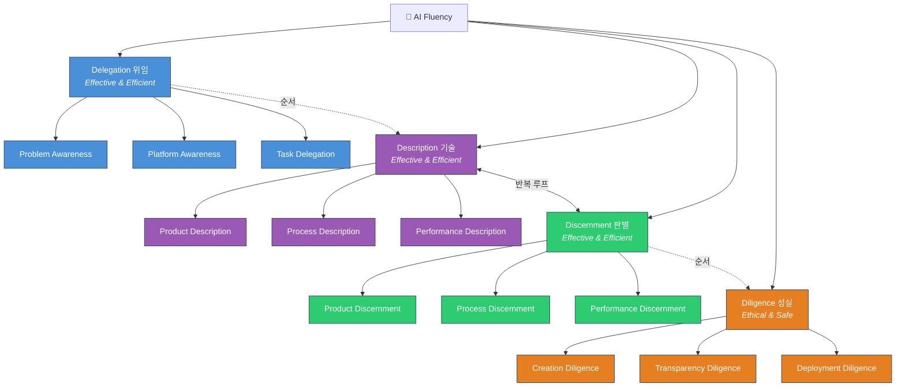
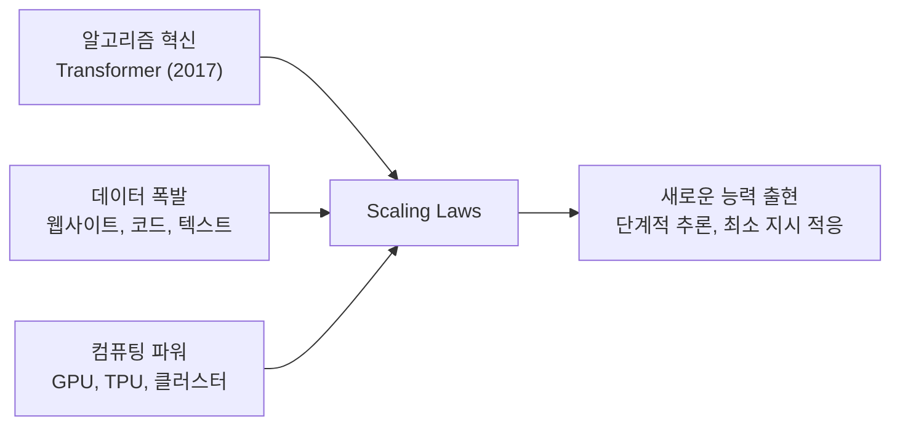
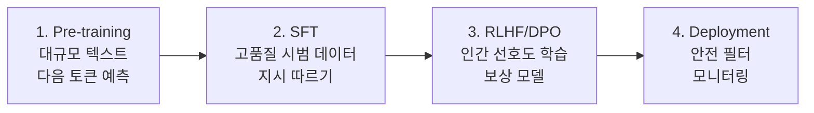
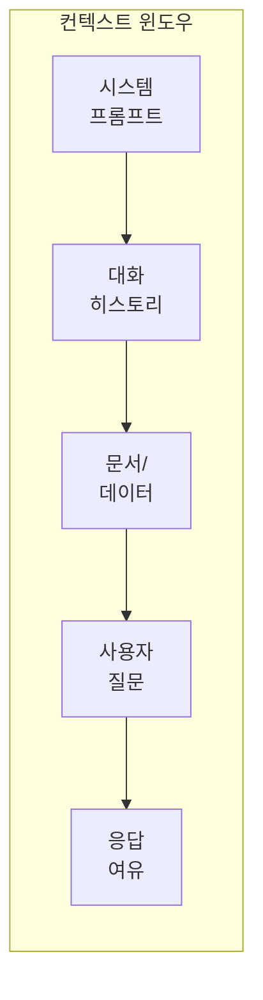
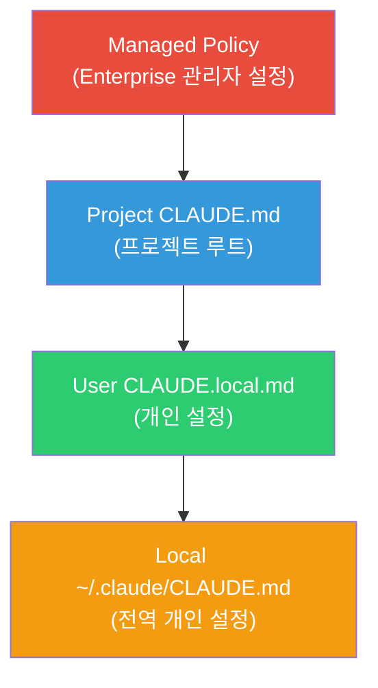

# 1주차: AI 활용 전략과 프롬프트 엔지니어링

---

## 📌 강의 중점

- **AI Fluency**와 4D Framework를 통한 AI 활용 전략 수립
- AI의 작동 원리와 한계 이해 → 더 나은 프롬프트로 연결
- **프롬프트 엔지니어링 6가지 핵심 기법** (건축공학 도메인 예시)
- **Claude Code**에서의 프롬프트 엔지니어링 — CLAUDE.md, 슬래시 명령, 단축키

---

## 🎯 학습 목표

학습 완료 후 다음을 수행할 수 있습니다:

- 4D Framework로 AI 활용 작업을 전략적으로 분석할 수 있다
- AI의 강점과 한계를 설명하고, 한계를 고려한 프롬프트를 설계할 수 있다
- 6가지 프롬프트 기법을 적용하여 건축공학 프롬프트를 점진적으로 개선할 수 있다
- Claude Code의 기본 명령어와 CLAUDE.md 개념을 이해하고 활용할 수 있다

---

## [Chapter 1] AI 활용 전략 — 4D Framework

### 1.1 AI Fluency란?

> [!tip] AI Fluency = AI 시스템과 **효과적**(Effective), **효율적**(Efficient), **윤리적**(Ethical), **안전하게**(Safe) 상호작용하는 능력

AI를 단순한 도구가 아닌 **문제 해결 파트너**로 접근한다. 유행하는 프롬프트 팁이 아닌, 기술이 변해도 유효한 **근본적 프레임워크**가 필요하다.

**이 수업에서 기대하는 것:**
1. AI 상호작용을 가이드할 프레임워크 보유
2. AI를 언제, 어떻게 활용할지 결정하는 자신감
3. 인간-AI 협업을 위한 실용적 스킬
4. 협업 결과에 대한 평가와 책임 능력

> [!ref] 소스: [Anthropic AI Fluency Course](https://www.anthropic.com/ai-fluency) — Lessons 1, 2A, 2B

### 1.2 4D Framework

![[ai-fluency/thumb-L02B-4d-framework.jpg]]
*The 4D Framework: Delegation, Description, Discernment, Diligence*

| 역량                   | 핵심 질문                 | 초점                    | 건축공학 예시                                   | 일반 예시 |
| -------------------- | --------------------- | --------------------- | ----------------------------------------- | --- |
| **Delegation** (위임)  | 언제, 어떻게 AI를 활용할 것인가?  | Effective & Efficient | 구조계산서 초안 검토를 AI에 위임, 최종 판정은 구조기술사         | 보고서 초안 작성을 AI에 위임, 최종 검토는 본인 |
| **Description** (기술) | AI에게 어떻게 명확히 소통할 것인가? | Effective & Efficient | "기둥 설계해줘" → 설계 조건, 적용 기준, 출력 형식을 명시한 프롬프트 | GPA 계산 시 학점 체계(4.5만점), 과목 학점수, 성적 등급을 명시 |
| **Discernment** (판별) | AI 출력물을 어떻게 평가할 것인가?  | Effective & Efficient | AI 산출 철근량이 KDS 기준 최소/최대 철근비를 만족하는지 검토     | AI가 산출한 GPA를 엑셀/손계산으로 교차 검증 |
| **Diligence** (성실)   | AI 사용의 책임을 어떻게 질 것인가? | Ethical & Safe        | AI가 생성한 구조 검토 보고서에 구조기술사 검증 필수            | AI 보조 분석임을 보고서에 명시 |



> [!finding] Description ↔ Discernment 반복 루프
> Description이 필요를 전달하는 것이라면, Discernment는 그 필요가 충족되었는지 평가하는 것. Discernment가 문제를 발견하면 → 더 나은 Description이 해결책.

> [!question] Delegation의 핵심 질문
> AI를 활용하기 전에 스스로에게 물어야 할 질문:
> - 정확히 무엇을 달성하려 하는가?
> - 성공은 어떤 모습인가?
> - 단순하지만 시간 소모적인 영역은? (→ Automation)
> - 불확실성이 있어 사고 파트너가 필요한 영역은? (→ Augmentation)
> - 비판적 판단이 필요한 영역은? (→ 인간만)

> [!finding] 가장 효과적인 AI 협업자는 자신의 분야 전문가가 먼저이고, AI 위임자가 그 다음이다.

### 1.3 AI 상호작용 3가지 모드

![[ai-fluency/slide-01-01.webp]]
*Three ways to interact with AI: Automation, Augmentation, Agency*

| 방식                    | 설명                  | 건축공학 예시                  | 일반 예시                   |
| --------------------- | ------------------- | ------------------------ | ----------------------- |
| **Automation** (자동화)  | AI가 지시에 따라 특정 작업 수행 | 시방서 자동 요약, 물량 산출표 생성     | 이메일 자동 분류, 문서 서식 변환     |
| **Augmentation** (증강) | 인간과 AI가 함께 협업       | 구조 설계 대안 탐색, 내진 성능 분석 토론 | 에세이 구조 함께 잡기, 데이터 해석 토론 |
| **Agency** (에이전시)     | AI가 독립적으로 행동        | 코드 자동 수정, 문서 분류 에이전트     | 코드 자동 리팩토링, 파일 정리 에이전트  |

> [!tip] Augmentation과 Agency가 AI의 고유 역량을 가장 잘 활용하며, 가장 효과적인 결과를 낳는 경우가 많다.

### 1.4 4D × 3모드 매트릭스

|                 | Automation | Augmentation | Agency      |
| --------------- | ---------- | ------------ | ----------- |
| **Delegation**  | 명확한 작업 정의  | 협업 영역 식별     | 행동 패턴 설정    |
| **Description** | 구체적 지시     | 맥락 풍부한 대화    | 지식/행동 규칙 정의 |
| **Discernment** | 결과물 검증     | 협업 과정 평가     | 자율 행동 모니터링  |
| **Diligence**   | 출력 책임      | 공동 창작 투명성    | 에이전트 행동 책임  |

#### 매트릭스 활용법

이 매트릭스는 AI 활용 전략을 **체계적으로 수립**하기 위한 도구다. 각 셀은 특정 상호작용 모드(열)에서 특정 역량(행)을 어떻게 발휘해야 하는지를 보여준다.

- **가로(모드)로 읽기**: 하나의 AI 활용 방식에서 4D를 모두 고려했는지 점검한다. 예를 들어 Automation으로 물량 산출을 하려면, 작업을 명확히 정의하고(Delegation), 구체적 지시를 작성하고(Description), 결과를 검증하고(Discernment), 출력에 대한 책임을 진다(Diligence).
- **세로(역량)로 읽기**: 하나의 D가 모드별로 어떻게 달라지는지 파악한다. 예를 들어 Description은 Automation에서는 "구체적 지시"(명확한 입출력 정의)이지만, Augmentation에서는 "맥락 풍부한 대화"(배경지식 공유, 불확실성 표현)로 변한다.

**활용 시나리오** — 학기 과제에서 GPA를 계산하려 할 때:
1. 모드 선택: 단순 계산은 **Automation**, 성적 분석·해석은 **Augmentation**
2. 해당 열의 4D를 순서대로 점검:
   - Delegation: GPA 계산 공식 적용은 AI, 학사경고 판정 기준 확인은 본인
   - Description: 학점 체계(4.5만점), 각 과목 학점수와 성적을 구체적으로 제시
   - Discernment: 산출된 GPA를 손계산으로 교차 검증
   - Diligence: AI 보조 계산임을 명시

> [!tip] 매트릭스 활용 전략
> 새로운 AI 활용 작업이 생기면 이 매트릭스에 대입해보세요:
> 1. 어떤 **모드**가 적합한지 결정 (자동화? 협업? 에이전시?)
> 2. 해당 열의 **4개 행**을 위에서 아래로 순서대로 점검
> 3. 빠진 항목이 있으면 → 그 부분이 위험 요소가 될 수 있음

---

## [Chapter 2] AI의 원리, 작동방식, 한계

### 2.1 생성형 AI란?

- **기존 AI** (분류): 이메일을 스팸/정상으로 분류
- **생성형 AI** (생성): 새로운 이메일, 코드, 보고서를 작성

생성형 AI는 데이터베이스에서 답을 검색하는 것이 아닌, **통계적 패턴에 기반해 새 텍스트를 생성**한다.

### 2.2 LLM을 가능하게 한 3가지 요소

![[ai-fluency/slide-01-03.webp]]
*Three pillars that made AI possible: Algorithms, Data, Computation*



### 2.3 학습 과정

#### Transformer 핵심 원리

**Transformer**는 "Attention Is All You Need" (2017) 논문에서 제안된 아키텍처다. 핵심은 **Self-Attention** 메커니즘으로, 문장의 각 단어가 다른 모든 단어와의 관련성을 동시에 계산한다. 예를 들어 "은행에서 돈을 인출했다"에서 "은행"이 금융기관임을 "돈"과 "인출"에 주의를 기울여 파악한다. 이전 RNN/LSTM이 단어를 순차 처리한 것과 달리, 모든 위치를 동시에 참조하므로 **병렬 처리**가 가능하고 **장거리 의존성**을 잘 포착한다.

> [!ref] Transformer 시각화 도구
> [Transformer Explainer](https://poloclub.github.io/transformer-explainer/) — 브라우저에서 Self-Attention 작동 과정을 인터랙티브하게 체험할 수 있다.

#### 현대 LLM 학습 파이프라인 (4단계)

| 단계                                  | 내용                           | 핵심                         |
| ----------------------------------- | ---------------------------- | -------------------------- |
| **1. Pre-training**                 | 수조 개의 토큰으로 "다음 토큰 예측" 학습     | 언어 구조, 세계 지식, 추론 패턴 습득     |
| **2. Supervised Fine-tuning (SFT)** | 전문가가 작성한 고품질 시범 데이터로 학습      | 지시를 따르고 유용한 형식으로 응답하는 법 학습 |
| **3. RLHF / DPO**                   | 인간 피드백으로 보상 모델 학습 → 선호 응답 강화 | 유해 출력 억제, 인간 선호에 맞춘 응답 생성  |
| **4. Deployment + Safety**          | 안전 필터, 모니터링, 사용자 피드백 반영      | 실사용 환경에서의 지속적 개선           |



> [!ref] 참고 자료
> - RLHF 상세 설명: [HuggingFace RLHF Blog](https://huggingface.co/blog/rlhf)
> - InstructGPT 논문: [Training language models to follow instructions (2022)](https://arxiv.org/abs/2203.02155)
> - Transformer 원논문: [Attention Is All You Need (2017)](https://arxiv.org/abs/1706.03762)

### 2.4 핵심 특성: Context Window

**Context Window**는 AI의 작업 기억 — 프롬프트 + 응답 + 공유 정보를 포함하여 한 번에 처리할 수 있는 최대 토큰 수이다.



**주요 모델별 컨텍스트 윈도우** (2026년 기준):

| 모델 | 컨텍스트 윈도우 | 출력 토큰 | 주요 특징 |
|---|---|---|---|
| **Claude 4.6 Opus** | 200K | 32,000 | 최고 추론, 복잡한 분석, 코딩 |
| **Claude 4.6 Sonnet** | 200K | 16,384 | 균형잡힌 성능, 빠른 응답 |
| **Claude 4.5 Haiku** | 200K | 8,192 | 경량·저비용, 빠른 처리 |
| **GPT-4o** | 128K | 16,384 | 멀티모달, 넓은 생태계 |
| **GPT-4.1** | 1M | 32,768 | 대형 컨텍스트, 엄격한 포맷 준수 |
| **o3** | 200K | 100K | 추론 특화, 수학·코딩 강점 |
| **Gemini 2.5 Pro** | 1M (→2M) | 65,536 | 초대형 컨텍스트, 멀티모달 |
| **Gemini 2.5 Flash** | 1M | 65,536 | 경량, 빠른 추론 |

**모델별 특징 요약**:
- **Claude 4.6 Opus**: 가장 강력한 추론 능력. 복잡한 코드 분석, 장문의 학술 텍스트 처리, 다단계 논리 문제에 최적. 비용이 높지만 품질이 우수.
- **Claude 4.6 Sonnet**: 속도와 품질의 균형. 일상적인 코딩, 문서 작성, 분석 작업에 가장 많이 사용. Claude Code 기본 모델.
- **Claude 4.5 Haiku**: 빠른 응답이 필요한 간단한 작업, 대량 처리, 실시간 챗봇에 적합. 비용 효율적.
- **GPT-4o**: OpenAI의 주력 모델. 이미지·음성 입출력 지원, 방대한 플러그인/API 생태계.
- **GPT-4.1**: 100만 토큰 컨텍스트로 대규모 코드베이스 분석 가능. 구조화된 출력(JSON 등) 준수율이 높음.
- **o3**: 수학, 과학, 코딩 문제에서 뛰어난 추론 성능. "생각하는 시간"을 사용하여 복잡한 문제 해결.
- **Gemini 2.5 Pro**: Google의 최신 모델. 최대 200만 토큰 컨텍스트(미리보기). 멀티모달(텍스트, 이미지, 비디오, 오디오).
- **Gemini 2.5 Flash**: Gemini Pro의 경량 버전. 빠른 추론과 대형 컨텍스트를 저비용으로 제공.

> [!tip] 모델 선택 가이드
> - **복잡한 분석·설계 검토**: Claude Opus, o3 — 정확한 추론이 핵심인 작업
> - **일상적 코딩·문서 작성**: Claude Sonnet, GPT-4o — 속도와 품질의 균형
> - **대규모 문서 처리**: GPT-4.1, Gemini Pro — 100만+ 토큰 컨텍스트 활용
> - **빠른 반복 작업·챗봇**: Claude Haiku, Gemini Flash — 저비용·빠른 응답
> - **멀티모달 (이미지/영상 분석)**: GPT-4o, Gemini Pro — 다양한 입력 형식 지원

### 2.5 AI의 강점

- **언어 능력**: 보고서 작성, 요약, 번역, 복잡한 주제 설명
- **작업 전환**: 시 작성 → 구조 계산 → 비즈니스 분석 (추가 훈련 없이)
- **대화 맥락 유지**: 이전 대화 내용 기억 및 활용
- **외부 도구 연결**: 웹 검색, 파일 처리, 코드 실행

### 2.6 AI의 한계

| 한계                    | 설명                      | 건축공학에서의 영향         | 일반적 영향                   |
| --------------------- | ----------------------- | ------------------ | ------------------------ |
| **Knowledge Cutoff**  | 훈련 데이터 이후의 정보 없음        | 최신 KDS 개정사항 미반영 가능 | 최근 뉴스, 신규 법령 반영 불가       |
| **Hallucination**     | 그럴듯하지만 부정확한 정보를 자신있게 말함 | 존재하지 않는 기준 조항 인용   | 가짜 참고문헌 인용, 잘못된 통계 제시    |
| **Context Window 제한** | 한 번에 처리할 수 있는 정보량 한계    | 대형 계산서 전체 처리 불가    | 긴 보고서의 앞부분 내용을 뒷부분에서 잊음  |
| **비결정성**              | 같은 질문에 다른 답변            | 동일 조건 재계산 시 다른 결과  | 같은 질문에 매번 다른 답변 형식·내용    |
| **복잡한 추론**            | 다단계 수학/논리 문제에서 약점       | 복잡한 하중조합 계산 오류 가능  | GPA 가중평균 계산, 복리 이자 계산 오류 |

### 2.7 인간-AI 상호보완

> [!tip] 상호보완 원칙
> - **인간**: 비판적 사고, 판단력, 창의성, 윤리적 감독, 도메인 전문성
> - **AI**: 속도, 규모, 패턴 인식, 방대한 정보 처리, 반복 작업

> [!finding] Bridge
> 이러한 한계를 이해하면 → 한계를 보완하는 **더 나은 프롬프트 전략**으로 연결된다.

---

## [Chapter 3] Prompt Engineering 전략

> [!ref] 소스: [AI Fluency L7](https://www.anthropic.com/ai-fluency)

### 6가지 핵심 기법 — RC 기둥 설계 검토로 시연

> **관통 문제**: 지상 10층 업무시설 RC 기둥 — 설계 축력 3,000kN, 설계 모멘트 200kN·m, 층고 4.0m, fck=27MPa, fy=400MPa

![[ai-fluency/slide-02-02.webp]]
*Foundational prompting tips: 6가지 핵심 프롬프팅 기법*

### 3.1 맥락 제공 (Give Context)

**Before** — 맥락 없는 요청:
```
RC기둥 설계해줘
```

**After** — 맥락이 풍부한 요청:
```
지상 10층 업무시설의 1층 RC 기둥을 설계해줘.

건물 정보:
- 구조 시스템: 철근콘크리트 라멘 구조
- 내진등급: 특등급 (내진설계범주 D)
- 적용 기준: KDS 14 20 00 (콘크리트구조 설계기준)

설계 조건:
- 설계 축력 (Pu): 3,000 kN
- 설계 모멘트 (Mu): 200 kN·m
- 층고: 4.0m
- 콘크리트 강도 (fck): 27 MPa
- 철근 항복강도 (fy): 400 MPa
```

> [!example] 일반 예시 — GPA 계산
> **Before**: `GPA 계산해줘`
> **After**:
> ```
> 2025-1학기 GPA를 계산해줘.
>
> 학점 체계: 4.5 만점
> 등급별 평점: A+(4.5), A(4.0), B+(3.5), B(3.0), C+(2.5), C(2.0), D+(1.5), D(1.0), F(0.0)
>
> 과목별 성적:
> - 구조역학 (3학점): A+
> - 건축계획 (3학점): B+
> - 프로그래밍 (2학점): A
> - 영어회화 (2학점): B
> ```

### 3.2 좋은 예시 보여주기 (Show Examples)

Few-shot prompting — 유사 결과 예시를 포함하여 원하는 출력 형식을 보여준다:

```
건축 구조 부재를 분류합니다.

예시 1:
입력: H300x150x6.5x9
분류: H형강, 높이 300mm, 폭 150mm, 웨브 6.5mm, 플랜지 9mm

예시 2:
입력: ㄷ200x80x7.5x11
분류: C형강, 높이 200mm, 폭 80mm, 웨브 7.5mm, 플랜지 11mm

입력: W400x200x8x13
분류:
```

> [!tip] 먼저 예시 없이 시도해보고, 원하는 스타일/형식이 필요할 때 예시를 추가한다.

> [!example] 일반 예시 — GPA 계산 결과 포맷
> ```
> 아래 형식으로 GPA 계산 결과를 보여줘.
>
> 예시:
> | 과목 | 학점 | 성적 | 평점 | 학점×평점 |
> |---|---|---|---|---|
> | 미적분학 | 3 | A+ | 4.5 | 13.5 |
> | 물리학 | 3 | B+ | 3.5 | 10.5 |
> | **합계** | **6** | | | **24.0** |
> | **GPA** | | | | **4.00** |
> ```

### 3.3 출력 제약 명시 (Specify Output Constraints)

형식, 길이, 단위, 기준 조항 등을 구체적으로 명시한다:

```
RC기둥 설계 결과를 다음 형식으로 제시하세요:

1. 적용 기준: KDS 조항번호 명시
2. 결과 표:
| 검토항목 | 기준값 | 적용값 | 판정 | 비고 |
3. 모든 수치에 단위 표기 (kN, mm, MPa)
4. 불확실한 가정은 명시적으로 표기
```

> [!example] 일반 예시 — GPA 출력 제약
> ```
> GPA 계산 결과를 다음 형식으로 제시하세요:
> 1. 과목별 상세표 (표 형식)
> 2. GPA는 소수점 2자리까지 표시
> 3. 학사경고 판정 포함 (GPA < 1.75 시 경고)
> 4. 각 과목의 학점×평점 계산 과정을 보여줄 것
> ```

### 3.4 단계별 분해 (Break into Steps)

Chain-of-Thought (CoT) — 복잡한 문제를 단계별로 분해:

```
다음 조건의 RC 기둥을 설계하세요.

조건:
- 설계 축력: 3,000kN
- 설계 모멘트: 200kN·m
- 층고: 4.0m
- fck: 27MPa, fy: 400MPa

단계별로 수행하세요:
1단계: 예상 단면 크기 가정
2단계: 세장비 검토
3단계: 소요 철근량 산정
4단계: 배근 상세 결정
5단계: 강도 검증

각 단계의 계산 과정과 결과를 보여주세요.
```

> [!example] 일반 예시 — GPA 단계별 분해
> ```
> 다음 성적 데이터로 GPA를 계산하세요.
> [성적 데이터...]
>
> 단계별로 수행하세요:
> 1단계: 각 과목의 원점수를 등급으로 변환
> 2단계: 등급을 평점으로 변환 (4.5 만점 체계)
> 3단계: 각 과목의 학점 × 평점 계산
> 4단계: 총 학점×평점 합 ÷ 총 학점수 = GPA
> 5단계: 학사경고 여부 판정 (GPA < 1.75)
>
> 각 단계의 계산 과정을 보여주세요.
> ```

### 3.5 먼저 생각하도록 요청 (Ask to Think First)

"답하기 전에 생각하라"고 명시적으로 요청한다:

```
답하기 전에 다음을 먼저 고려해주세요:
- 세장비 제한 (KDS 14 20 00)
- 최소/최대 철근비 (ρmin = 0.01, ρmax = 0.08)
- 배근 시 피복두께 및 간격 제약
- 축력과 모멘트의 상호작용

이 조건들을 충분히 고려한 후 설계를 진행하세요.
```

> [!method] 핵심: **실행 전에** 생각하게 하는 것이 중요하다. 실행 후 설명과는 다르다.

> [!example] 일반 예시 — GPA 계산 전 고려사항
> ```
> 답하기 전에 다음을 먼저 고려해주세요:
> - F학점 과목도 GPA 계산에 포함하는가?
> - 재수강 과목은 어떻게 처리하는가? (원래 성적 대체? 평균?)
> - 계절학기 과목도 포함하는가?
> - Pass/Fail 과목은 GPA에서 제외하는가?
>
> 이 조건들을 확인한 후 계산을 진행하세요.
> ```

### 3.6 역할/스타일/톤 정의 (Define Role)

시스템 프롬프트로 AI의 역할을 정의한다:

```
당신은 건축구조 전문 AI 엔지니어입니다.

## 역할
- 건축구조설계기준(KDS 41)에 따른 구조 검토
- 내진설계 및 하중 조합 분석
- 부재 단면 설계 및 검증

## 응답 규칙
1. 모든 계산에 적용 기준 명시 (예: KDS 41 17 00)
2. 단위를 항상 표기 (kN, mm, MPa)
3. 불확실한 경우 가정 조건 명시
4. 안전측 설계 원칙 준수

## 출력 형식
- 계산 과정: 단계별 상세 설명
- 결과: 표 형식으로 정리
- 검토 의견: 기준 만족 여부 판정
```

> [!example] 일반 예시 — GPA 계산 역할 정의
> ```
> 당신은 대학 학사관리 전문 AI 어시스턴트입니다.
>
> ## 역할
> - 성적 데이터 분석 및 GPA 산출
> - 학사경고/제적 판정 기준 적용
> - 졸업요건 충족 여부 확인
>
> ## 응답 규칙
> 1. GPA는 소수점 2자리까지 표시
> 2. 학점 체계(4.5만점)를 명시
> 3. 재수강·F학점 처리 방법을 명시
> 4. 학사경고 기준 (GPA < 1.75) 자동 판정
> ```

### 3.7 구조화 프롬프트의 진화 — Self-Correction Loop

**단계 1: 기본 구조화 프롬프트** (역할 + 임무 + 문제정의 + 출력형식)

```
# 역할(Role):
당신은 구조 공학 및 유한요소해석(FEA) 분야의 전문가입니다.

# 임무(Task):
캔틸레버 보 문제의 파라미터를 분석하여 결과를 JSON으로 출력하십시오.

# 문제 정의(Problem Definition):
- 길이 (L): 2.0 m, 단면: 0.1m × 0.1m
- 탄성계수 (E): 210 GPa, 하중 (P): 100 kN (자유단)

# 출력 형식(Output Format):
JSON — 키: "처짐(mm)", "최대굽힘응력(MPa)"
```

**단계 2: 검증 루프 추가** (Self-Correction Loop)

```
# 워크플로우(Workflow):
[1단계: 문제 분석] 모든 파라미터를 정확히 인식
[2단계: 초기 계산] 표준 재료역학 공식으로 계산
[3단계: 논리 검증 및 오류 수정 (Self-Correction)]
  - 공식 확인: δ = PL³/3EI, σ = Mc/I
  - 단위 변환 검증: GPa→Pa, kN→N, m→mm
  - 수치 계산 검증: 모든 산술 연산 재수행
  → 오류 발견 시 즉시 수정
[4단계: 최종 출력 생성] 검증 통과 결과만 출력
```

> [!finding] 핵심 통찰
> 검증 루프(Self-Correction Loop)를 추가하면 단위 변환 오류, 공식 착오 등 AI의 수학적 실수를 줄일 수 있다. 이는 Chapter 2에서 다룬 "복잡한 추론"의 한계를 프롬프트로 보완하는 전략이다.

### 3.8 비밀 무기: AI에게 프롬프트 개선 요청

```
나는 RC기둥 설계 검토를 AI에게 요청하려고 해.
최선의 결과를 얻기 위해 어떻게 프롬프트를 작성해야 할지 모르겠어.
효과적인 프롬프트를 만드는 걸 도와줄 수 있어?
```

> [!tip] AI 자체가 프롬프트 전문가다. 막힐 때는 AI에게 도움을 요청하라.

### 3.9 흔한 실수 4가지

1. **AI가 마음을 읽을 수 있다고 가정** — 맥락을 명시하지 않으면 일반적 답변만 나온다
2. **하나의 프롬프트에 관련 없는 여러 작업 과적** — 한 번에 한 가지씩
3. **성공의 모습을 너무 모호하게 설명** — 구체적 출력 형식과 기준 제시
4. **이전 응답에 대한 피드백 미제공** — Description ↔ Discernment 반복 루프 활용

---

## [Chapter 4] Claude Code에서의 Prompt Engineering

> [!ref] 소스: [Claude Code in Action](https://anthropic.skilljar.com/claude-code-in-action) (Lessons 6-9)

### 4.0 Claude Code 설치 가이드

#### Windows 설치

**사전 요구**: [Git for Windows](https://gitforwindows.org/) 설치 필수 — Claude Code가 내부적으로 Git Bash를 사용한다.

**설치 명령** (PowerShell에서 실행):
```powershell
irm https://claude.ai/install.ps1 | iex
```

**Windows 트러블슈팅**:
- Git Bash가 PATH에 없으면 설치 실패 → Git for Windows 설치 후 재시도
- SSL/TLS 오류 시: PowerShell 관리자 모드에서 `[Net.ServicePointManager]::SecurityProtocol = [Net.SecurityProtocolType]::Tls12` 실행

**설치 확인**:
```bash
claude --version
claude doctor    # 환경 진단
```

#### macOS 설치

**사전 요구**: macOS 13.0 이상

**방법 A** (권장 — 자동 업데이트):
```bash
curl -fsSL https://claude.ai/install.sh | bash
```

**방법 B** (Homebrew):
```bash
brew install --cask claude-code
```

#### VS Code 확장 설치

Extensions 마켓플레이스에서 "Claude Code" 검색 (publisher: Anthropic), 또는 직접 설치:
```
vscode:extension/anthropic.claude-code
```

**주요 기능**: 인라인 diff 표시, `@파일` 멘션으로 컨텍스트 추가, Plan 모드 리뷰, 대화 히스토리 관리

> [!ref] VS Code 확장 문서: [Claude Code for VS Code](https://code.claude.com/docs/en/vs-code)

#### Antigravity (Google) — 참고

Google의 에이전트 기반 개발 IDE. Gemini 모델 기반으로 AI 자동완성, 자연어 코드 명령, 브라우저 자동화를 지원한다. 현재 무료 사용 가능하며 Claude Code와 병행 사용할 수 있다.

#### 계정 요구사항

Claude Code를 사용하려면 다음 중 하나의 계정이 필요하다:
- **Claude Pro / Max** (개인 구독)
- **Claude Teams / Enterprise** (팀·기업 구독)
- **Anthropic Console** (API 키 기반)

> [!action] 무료 Claude.ai 계정으로는 Claude Code를 사용할 수 없다.

> [!ref] 설치 문서
> - [Claude Code 개요](https://code.claude.com/docs/en/overview)
> - [설치 가이드](https://code.claude.com/docs/en/setup)

---

### 4.1 핵심 개념: CLAUDE.md = 영속적 프롬프트 엔지니어링

> [!finding] CLAUDE.md는 Claude Code에 대한 **프로젝트 메모리** 역할을 한다.
> 잘 작성하면 매번 컨텍스트를 반복 설명할 필요가 없고 일관된 코딩 스타일을 유지할 수 있다.

Chapter 3의 6가지 기법이 CLAUDE.md에 직접 대응한다:

| 프롬프트 기법 | CLAUDE.md 대응 |
|---|---|
| 맥락 제공 | 프로젝트 구조, 기술 스택, 아키텍처 설명 |
| 예시 보여주기 | 코드 스니펫, 패턴 예시 포함 |
| 출력 제약 명시 | 코딩 컨벤션, 파일 명명 규칙 |
| 단계별 분해 | 작업 워크플로우, 검증 절차 |
| 먼저 생각하라 | "변경 전 기존 코드 분석" 규칙 |
| 역할 정의 | 프로젝트 도메인, 전문가 역할 설정 |

### 4.2 CLAUDE.md 개요

**`/init` 명령**: 코드베이스를 분석하여 `CLAUDE.md`를 자동 생성한다 (목적, 아키텍처, 명령어, 패턴 포함).

| CLAUDE.md 유형          | 용도                     | 공유 여부  |
| --------------------- | ---------------------- | ------ |
| `CLAUDE.md`           | `/init`으로 생성, 소스 제어 커밋 | 팀 공유   |
| `CLAUDE.local.md`     | 개인 지시사항                | 공유 안 됨 |
| `~/.claude/CLAUDE.md` | 모든 프로젝트에 적용            | 개인 전역  |

#### 작동 원리

CLAUDE.md는 **강제 설정이 아닌 컨텍스트**다. 세션 시작 시 시스템 프롬프트 이후 사용자 메시지로 주입되며, Claude가 이를 참고하여 행동한다. 구체적이고 검증 가능한 지시일수록 준수율이 높다.

**로딩 메커니즘**:
1. 프로젝트 루트에서 **디렉토리 트리를 위로 탐색**하며 모든 CLAUDE.md를 로딩
2. 하위 디렉토리의 CLAUDE.md는 해당 파일에 접근할 때 **on-demand 로딩**
3. `~/.claude/CLAUDE.md` (전역)은 항상 로딩

#### 계층 구조



#### 작성 모범 사례

- **200줄 이하** 유지 — 너무 길면 컨텍스트를 낭비하고 준수율이 떨어짐
- **구체적·검증 가능한 지시**: "좋은 코드를 작성하라" ✗ → "변수명에 단위를 포함하라 (예: `force_kN`)" ✓
- **`@import`** 활용: 별도 파일로 분리하여 관리 가능
- **불필요한 내용 제거**: 프로젝트와 무관한 일반적 지시는 효과 없음

> [!ref] 참고 문서
> - [Claude Code Memory](https://code.claude.com/docs/en/memory)
> - [Claude Code Best Practices](https://code.claude.com/docs/en/best-practices)

### 4.3 `#` 메모리 모드

CLAUDE.md에 지시사항을 **자동 병합**한다. 프롬프트에서 `#`으로 시작하면 CLAUDE.md에 저장된다:

```
# KDS 14 20 00 기준으로 설계할 것
# 모든 계산에 단위를 명시할 것
```

### 4.4 `@` 파일 멘션

관련 파일 컨텍스트를 프롬프트에 직접 포함시킨다:

```
@requirements.txt 를 참고해서 의존성 설치해줘
```

### 4.5 주요 슬래시 명령어

| 명령어        | 기능                                        |
| ---------- | ----------------------------------------- |
| `/help`    | 도움말 표시                                    |
| `/clear`   | 대화 완전 초기화                                 |
| `/compact` | 대화 요약 (핵심 정보 보존)                          |
| `/context` | 컨텍스트 사용량, 토큰 통계, MCP 도구, 메모리 파일, 스킬 목록 표시 |
| `/init`    | CLAUDE.md 자동 생성                           |
| `/model`   | 사용 모델 변경 (예: sonnet → opus)               |
| `/resume`  | 이전 대화 이어서 시작                              |
| `/review`  | 최근 변경사항 코드 리뷰                             |
| `/fast`    | 빠른 모드 토글 (같은 모델, 출력 속도 증가)                |

> [!tip] `/context` 상세
> 현재 세션의 상태를 한눈에 파악할 수 있다:
> - **컨텍스트 사용량**: 전체 컨텍스트 윈도우 대비 사용 비율 (%)
> - **카테고리별 토큰**: 시스템 프롬프트, 대화, 도구 결과 등 항목별 토큰 수
> - **MCP 도구**: 연결된 MCP 서버와 사용 가능한 도구 목록
> - **메모리 파일**: 로드된 CLAUDE.md 및 메모리 파일 경로
> - **스킬**: 사용 가능한 슬래시 명령어(스킬) 목록
> - 세션이 길어질수록 컨텍스트 사용량이 증가 → `/compact`로 압축 권장

### 4.6 키보드 단축키

| 단축키 | 동작 | 사용 시점 |
|---|---|---|
| `Escape` 1번 | Claude 중단, 방향 전환 | 잘못된 방향으로 진행 중일 때 |
| `Escape` 2번 | 대화 되감기 (이전 지점으로 복귀) | 불필요한 기록 제거 |
| `Shift+Tab` 2번 | Planning Mode 활성화 | 넓은 코드베이스 이해, 멀티스텝 구현 |
| `Ctrl+V` | 스크린샷 붙여넣기 | 에러 화면, UI 참조 |

### 4.7 Thinking Modes

프롬프트에 키워드를 포함하여 사고 깊이를 조절한다:

| 레벨  | 키워드          | 적합한 상황        |
| --- | ------------ | ------------- |
| 1   | Think        | 간단한 질문        |
| 2   | Think more   | 중간 난이도        |
| 3   | Think a lot  | 복잡한 로직        |
| 4   | Think longer | 디버깅           |
| 5   | Ultrathink   | 알고리즘, 아키텍처 설계 |

### 4.8 Plan Mode

`Shift+Tab` 2번으로 **Plan Mode**에 진입한다 (§4.6 단축키 참조). Plan Mode에서는 코드를 직접 수정하지 않고 **계획만 세우는 모드**로 동작한다.

**활용 시점**:
- 넓은 코드베이스를 파악해야 할 때
- 멀티스텝 구현 전략을 수립할 때
- 변경의 영향 범위를 먼저 분석하고 싶을 때

**워크플로우**: Plan Mode에서 Claude가 제안한 계획을 검토 → 승인 → 실행 모드로 전환하여 실제 코드 수정

### 4.9 Permission 모드

Claude Code는 파일 수정이나 명령어 실행 시 **권한 확인** 방식을 3단계로 제공한다:

| 모드 | 파일 수정 | 명령 실행 | 적합한 상황 |
|---|---|---|---|
| **Ask** (기본) | 매번 확인 | 매번 확인 | 안전 최우선, 초보자 |
| **Auto-accept** | 자동 허용 | 확인 (위험 명령만) | 익숙한 프로젝트, 신뢰도 높을 때 |
| **Yolo** | 모두 자동 | 모두 자동 | 실험/학습, 일회성 프로젝트 |

- **Ask Mode**: 기본 모드. 모든 파일 수정과 명령 실행 전에 승인을 요청한다.
- **Auto-accept Mode**: 읽기·쓰기·명령 실행을 자동 허용하되, 위험한 명령(삭제 등)은 확인한다.
- **Yolo Mode** (`--dangerously-skip-permissions`): 모든 권한을 자동 허용한다. 학습/실험 용도에 적합.

> [!action] 수업에서는 **Ask 모드**(기본)를 사용하세요. 각 작업을 확인하며 진행하면 Claude Code의 동작을 더 잘 이해할 수 있습니다.

### 4.10 Custom Commands

프로젝트에 맞는 **커스텀 슬래시 명령어**를 만들어 반복 작업을 자동화할 수 있다.

#### 파일 구조

`.claude/commands/` 폴더에 **순수 마크다운 파일**(.md)을 생성한다. 파일명이 곧 명령어 이름이 된다:

```
프로젝트/
├── .claude/
│   └── commands/
│       ├── review.md      → /review 로 호출
│       ├── kds-check.md   → /kds-check 로 호출
│       └── gpa-check.md   → /gpa-check 로 호출
└── ...
```

명령어 파일은 YAML frontmatter 없이, 마크다운 본문만 작성하면 된다:

```markdown
다음 파일을 리뷰해주세요: $ARGUMENTS

## 리뷰 기준
- 코드 품질 및 가독성
- 잠재적 버그
- 성능 이슈
```

호출 방법: Claude Code에서 `/review src/main.py` 입력 → `$ARGUMENTS`에 `src/main.py`가 전달된다.

#### 인자 전달

`$ARGUMENTS` 플레이스홀더를 사용하여 명령어 호출 시 인자를 전달한다:

```
/review src/main.py
```
→ 파일 내용의 `$ARGUMENTS`가 `src/main.py`로 치환되어 Claude에게 전달됨

#### Project vs User 범위

| 위치 | 범위 | 공유 |
|---|---|---|
| `.claude/commands/` (프로젝트) | 해당 프로젝트에서만 사용 | 팀원과 공유 (Git 커밋) |
| `~/.claude/commands/` (사용자) | 모든 프로젝트에서 사용 | 개인 전용 |

#### 예시

**1. 코드 리뷰** (`.claude/commands/review.md`):
```markdown
$ARGUMENTS 파일의 코드를 리뷰하세요.

검토 항목:
- 버그 가능성
- 성능 이슈
- 가독성 및 구조
- 개선안 제시
```

**2. KDS 기준 검토** (`.claude/commands/kds-check.md`):
```markdown
다음 설계 결과를 KDS 기준으로 검토하세요:
$ARGUMENTS

검토 항목: 최소/최대 철근비, 세장비, 피복두께, 간격 제한
```

**3. GPA 검토** (`.claude/commands/gpa-check.md`):
```markdown
다음 성적 데이터의 GPA를 검토하세요:
$ARGUMENTS

검토 항목: 4.5만점 체계, 가중평균 계산, 학사경고 판정 (GPA < 1.75)
```

> [!tip] 향후 Custom Commands는 **Skills 시스템**으로 발전하여 도구 제한, 자동화 등 고급 기능을 지원한다 (후반부 주차에서 다룸).

> [!ref] 참고: [Claude Code Slash Commands](https://code.claude.com/docs/en/slash-commands)

### 4.11 건축공학 프로젝트 CLAUDE.md 예시

```markdown
# 프로젝트: RC 구조설계 검토 도구

## 기술 스택
- Python 3.12, FastAPI, Streamlit
- 설계 기준: KDS 14 20 00, KDS 41 17 00

## 코딩 규칙
- 모든 구조 계산 함수에 적용 기준 조항번호 주석
- 단위는 SI 단위 사용 (N, mm, MPa)
- 변수명에 단위 포함 (예: force_kN, length_mm)

## 워크플로우
- 새 기능 추가 시: 기존 코드 분석 → 구현 → 테스트 → 검증
- 구조 계산 변경 시: KDS 기준 조항 확인 필수
```

---

## 💻 실습 — 관통 문제: "RC 기둥 설계 검토"

> [!method] 모든 실습이 **동일한 관통 문제**를 다른 관점에서 다룹니다.
> - **건축공학 전공**: RC 기둥 설계 검토
> - **비전공 / 대안**: GPA 계산 및 성적 분석 (아래 [대안 문제] 참조)

**관통 문제 A — RC 기둥 설계 검토** (건축공학):

**관통 문제 설정**:

| 항목            | 값            |
| ------------- | ------------ |
| 건물            | 지상 10층 업무시설  |
| 부재            | 1층 RC 기둥     |
| 설계 축력 (Pu)    | 3,000 kN     |
| 설계 모멘트 (Mu)   | 200 kN·m     |
| 층고            | 4.0 m        |
| 콘크리트 강도 (fck) | 27 MPa       |
| 철근 항복강도 (fy)  | 400 MPa      |
| 적용 기준         | KDS 14 20 00 |

**관통 문제 B — GPA 계산 및 성적 분석** (비전공 대안):

| 항목 | 값 |
|---|---|
| 주제 | 대학 성적(GPA) 계산 및 분석 |
| 데이터 | 5명 학생 × 4과목 점수 + 학점 (A+~F) |
| 학점 체계 | 4.5 만점 |
| 목표 | 과목별 평균, 학생별 GPA, 석차, 학사경고 판별 |
| 출력 형식 | 표 형식 결과 + 판정 |
| **검증 방법** | 손계산 또는 엑셀로 즉시 확인 가능 |

> [!finding] GPA 관통 문제가 적합한 이유
> - 모든 학생이 학점 체계를 이해하고 있음
> - 산술 결과를 손으로 계산하여 AI 출력을 **즉시 검증** 가능
> - 프롬프트 기법 적용 시 품질 차이가 명확히 드러남 ("GPA 계산해줘" vs 학점 체계·과목·가중치를 명시한 프롬프트)
> - Claude Code 실습에서도 Python 프로그램으로 자연스럽게 연결

**GPA 계산용 샘플 데이터**:

| 학생 | 구조역학 (3학점) | 건축계획 (3학점) | 프로그래밍 (2학점) | 영어 (2학점) |
|---|---|---|---|---|
| 김철수 | A+ | B+ | A | B |
| 이영희 | B | A | A+ | A+ |
| 박민수 | C+ | B | B+ | A |
| 정수진 | A | A+ | B | B+ |
| 최동현 | D+ | C | F | C+ |

**정답 (검증용)**: GPA = Σ(학점×평점) ÷ Σ(학점)
- 김철수: (3×4.5 + 3×3.5 + 2×4.0 + 2×3.0) ÷ 10 = 38.0 ÷ 10 = **3.80**
- 이영희: (3×3.0 + 3×4.0 + 2×4.5 + 2×4.5) ÷ 10 = 39.0 ÷ 10 = **3.90**
- 박민수: (3×2.5 + 3×3.0 + 2×3.5 + 2×4.0) ÷ 10 = 31.5 ÷ 10 = **3.15**
- 정수진: (3×4.0 + 3×4.5 + 2×3.0 + 2×3.5) ÷ 10 = 38.5 ÷ 10 = **3.85**
- 최동현: (3×1.5 + 3×2.0 + 2×0.0 + 2×2.5) ÷ 10 = 15.5 ÷ 10 = **1.55** → 학사경고!

| 순서  | 실습 내용                                                | 시간  | 연계   |
| --- | ---------------------------------------------------- | --- | ---- |
| 1   | **4D 분석**: RC기둥 설계 검토를 4D Framework로 분석              | 20분 | Ch.1 |
| 2   | **AI 한계 체험**: 동일 문제를 3개 플랫폼에 던져 환각·오류 발견             | 20분 | Ch.2 |
| 3   | **프롬프트 6단계 개선**: 6가지 기법을 하나씩 적용하며 점진 개선              | 30분 | Ch.3 |
| 4   | **Claude Code 첫 체험**: CC 설치 → CLAUDE.md → RC기둥 문제 해결 | 40분 | Ch.4 |
| 5   | **비밀 무기**: 최선의 프롬프트를 AI에게 "더 개선해줘" 요청                | 10분 | 통합   |

### 실습 1: 4D 분석 (20분) → Ch.1

RC기둥 설계 검토 작업을 4D Framework로 분석하세요:

| 4D              | 질문                                 | 작성  |
| --------------- | ---------------------------------- | --- |
| **Delegation**  | 이 작업에서 AI에 위임할 부분은? 인간만이 해야 할 판단은? |     |
| **Description** | AI에게 어떤 맥락과 조건을 제공해야 하는가?          |     |
| **Discernment** | AI 결과를 어떤 기준으로 검증할 것인가?            |     |
| **Diligence**   | AI 활용 사실을 어떻게 투명하게 밝힐 것인가?         |     |

> [!tip] 각 D에 대해 구체적으로 생각해보세요
> - **Delegation**: 단면 가정, 철근량 산정 → AI 위임 가능? / 최종 안전성 판정 → 인간만?
> - **Description**: 설계 조건(축력, 모멘트), 적용 기준(KDS), 출력 형식(표) 등
> - **Discernment**: KDS 최소/최대 철근비, 세장비 한계 등의 검증 기준
> - **Diligence**: "AI 보조 설계, 구조기술사 최종 검증" 표기 등

**제출**: 작성한 4D 분석표를 제출하세요. 각 항목에 대해 **최소 2문장** 이상 작성하세요.

> [!example] [대안 문제] GPA 계산을 4D로 분석
> 위 GPA 계산 작업을 4D Framework로 분석하세요:
>
> | 4D | 질문 | 작성 |
> |---|---|---|
> | **Delegation** | GPA 계산에서 AI에 위임할 부분은? 본인이 직접 확인할 부분은? | |
> | **Description** | AI에게 어떤 정보를 제공해야 하는가? (학점 체계, 과목 정보 등) | |
> | **Discernment** | AI 결과를 어떤 방법으로 검증할 것인가? (손계산, 엑셀 등) | |
> | **Diligence** | AI 활용 사실을 어떻게 밝힐 것인가? | |

### 실습 2: AI 한계 체험 (20분) → Ch.2

동일한 RC기둥 문제를 **Claude, GPT, Gemini**에 그대로 던져보고 한계를 관찰하세요.

**프롬프트** (세 플랫폼에 동일하게 입력):
```
다음 조건의 RC 기둥을 설계하세요:
설계 축력 3,000kN, 설계 모멘트 200kN·m,
층고 4.0m, fck=27MPa, fy=400MPa
```

**체크리스트**:
- [ ] 환각(Hallucination): 존재하지 않는 기준 조항 인용?
- [ ] 계산 오류: 철근량, 강도 계산이 정확한가?
- [ ] 기준 착오: 적용한 설계 기준이 올바른가? (KDS vs ACI vs EC2)
- [ ] 비결정성: 같은 질문을 2번 던져 다른 답변이 나오는가?
- [ ] 단위 혼동: SI 단위를 일관되게 사용했는가?

**비교표 작성**:

| 관찰 항목        | Claude | GPT | Gemini |
| ------------ | ------ | --- | ------ |
| 적용 기준        |        |     |        |
| 가정한 단면 크기    |        |     |        |
| 산출 철근량       |        |     |        |
| 계산 정확도 (0-5) |        |     |        |
| 발견된 한계/오류    |        |     |        |

**토론 질문**:
1. 세 플랫폼 중 가장 정확한 결과를 보인 것은? 그 이유는?
2. 공통적으로 발견된 한계는?
3. 이 한계를 **프롬프트로** 어떻게 보완할 수 있을까? (→ 실습 3으로 연결)

**제출**: 비교표 + 토론 질문 답변을 제출하세요. 각 플랫폼의 응답 **스크린샷**을 첨부하세요.

> [!example] [대안 문제] GPA 계산으로 AI 한계 체험
> 동일한 GPA 계산 요청을 **Claude, GPT, Gemini**에 던져보세요:
> ```
> 다음 학생들의 GPA를 계산해줘:
> 김철수: 구조역학(3학점) A+, 건축계획(3학점) B+, 프로그래밍(2학점) A, 영어(2학점) B
> 이영희: 구조역학(3학점) B, 건축계획(3학점) A, 프로그래밍(2학점) A+, 영어(2학점) A+
> ```
> **관찰 포인트**: 가중평균 계산이 정확한가? 학점 체계(4.3? 4.5?)를 어떻게 가정했는가? 세 플랫폼의 결과가 일치하는가?

### 실습 3: 프롬프트 6단계 개선 (30분) → Ch.3

"RC기둥 설계해줘"에서 시작하여 6가지 기법을 **하나씩** 적용하며 점진 개선합니다.

> [!method] 진행 방법
> 하나의 AI 플랫폼(Claude 권장)에서 6단계를 순차적으로 진행하세요. 각 단계마다 **새 대화**를 시작하세요.

#### 단계 0: 기준선 (기법 없음)

```
RC기둥 설계해줘
```

#### 단계 1: 맥락 제공 (Give Context)

Ch.3.1과 동일한 프롬프트를 사용합니다:

```
지상 10층 업무시설의 1층 RC 기둥을 설계해줘.

건물 정보:
- 구조 시스템: 철근콘크리트 라멘 구조
- 내진등급: 특등급 (내진설계범주 D)
- 적용 기준: KDS 14 20 00 (콘크리트구조 설계기준)

설계 조건:
- 설계 축력 (Pu): 3,000 kN
- 설계 모멘트 (Mu): 200 kN·m
- 층고: 4.0m
- 콘크리트 강도 (fck): 27 MPa
- 철근 항복강도 (fy): 400 MPa
```

#### 단계 2: 예시 보여주기 (Show Examples)

단계 1의 프롬프트에 아래 내용을 **추가**:

```
참고로 유사한 설계 결과 예시입니다:

예시 — 500x500 기둥 (Pu=2,000kN, Mu=150kN·m):
- 단면: 500x500mm
- 주근: 8-D25 (균등 배치)
- 띠철근: D10@200
- 철근비: 2.03%
- Pu/φPn = 0.78, Mu/φMn = 0.65 → OK
```

#### 단계 3: 출력 제약 명시 (Specify Output Constraints)

단계 2의 프롬프트에 아래 내용을 **추가**:

```
결과를 다음 형식으로 제시하세요:

1. 적용 기준: KDS 조항번호 명시
2. 결과 표:
| 검토항목 | 기준값 | 적용값 | 판정 | 비고 |
3. 모든 수치에 단위 표기 (kN, mm, MPa)
4. 불확실한 가정은 명시적으로 표기
```

#### 단계 4: 단계별 분해 (Break into Steps)

단계 3의 프롬프트에 아래 내용을 **추가**:

```
단계별로 수행하세요:
1단계: 예상 단면 크기 가정
2단계: 세장비 검토
3단계: 소요 철근량 산정
4단계: 배근 상세 결정
5단계: 강도 검증

각 단계의 계산 과정과 결과를 보여주세요.
```

#### 단계 5: 먼저 생각하도록 요청 (Ask to Think First)

단계 4의 프롬프트에 아래 내용을 **추가**:

```
답하기 전에 다음을 먼저 고려해주세요:
- 세장비 제한 (KDS 14 20 00)
- 최소/최대 철근비 (ρmin = 0.01, ρmax = 0.08)
- 배근 시 피복두께 및 간격 제약
- 축력과 모멘트의 상호작용

이 조건들을 충분히 고려한 후 설계를 진행하세요.
```

#### 단계 6: 역할/스타일/톤 정의 (Define Role)

단계 5의 프롬프트 **맨 앞에** 아래 내용을 **추가**:

```
당신은 건축구조 전문 AI 엔지니어입니다.

## 역할
- 건축구조설계기준(KDS 14 20 00)에 따른 구조 검토
- 내진설계 및 하중 조합 분석
- 부재 단면 설계 및 검증

## 응답 규칙
1. 모든 계산에 적용 기준 조항번호 명시
2. 단위를 항상 표기 (kN, mm, MPa)
3. 불확실한 경우 가정 조건 명시
4. 안전측 설계 원칙 준수
```

#### 결과 기록표

| 단계 | 적용 기법 | 추가 내용 | 결과 품질 변화 (메모) |
|---|---|---|---|
| 0 | 없음 | "RC기둥 설계해줘" | |
| 1 | 맥락 제공 | 건물 정보, 설계 조건, 적용 기준 | |
| 2 | 예시 | 유사 설계 결과 포맷 제시 | |
| 3 | 출력 제약 | KDS 조항번호 + 표 형식 + 단위 | |
| 4 | 단계별 분해 | 5단계 CoT | |
| 5 | 먼저 생각 | 세장비, 최소철근비, 배근 제약 고려 | |
| 6 | 역할 정의 | 구조기술사 역할 시스템 프롬프트 | |

**제출**: 각 단계의 프롬프트와 AI 응답 요약을 제출하세요. 결과 기록표의 "결과 품질 변화" 열을 채우세요. **가장 큰 품질 개선**이 일어난 단계는? 그 이유는?

> [!example] [대안 문제] GPA 계산 프롬프트 6단계 개선
> **단계 0** (기준선): `GPA 계산해줘`
> **단계 1** (맥락): 학점 체계(4.5만점), 과목명·학점수·성적 명시
> **단계 2** (예시): §3.2의 GPA 결과 포맷 예시 포함
> **단계 3** (출력 제약): 표 형식, 소수점 2자리, 학사경고 판정 포함
> **단계 4** (단계별 분해): 원점수→등급→평점→가중평균→GPA 순서
> **단계 5** (먼저 생각): F학점 포함 여부, 재수강 반영, 계절학기 처리 고려
> **단계 6** (역할 정의): "학사관리 전문 AI 어시스턴트" 역할 부여
>
> 각 단계에서 결과 정확도가 어떻게 변하는지 관찰하세요. 특히 **학점 체계 가정**(4.3 vs 4.5)이 달라지는 시점에 주목하세요.

### 실습 4: Claude Code 첫 체험 (40분) → Ch.4

#### Part A — 설치 및 설정 (15분)

**A-1. Claude Code 설치 확인**

터미널에서 실행:

```bash
claude --version
```

> [!action] 설치가 안 되어 있다면 §4.0의 설치 가이드를 참고하세요.
> - Windows: `irm https://claude.ai/install.ps1 | iex` (PowerShell)
> - macOS: `curl -fsSL https://claude.ai/install.sh | bash`

**A-2. 프로젝트 폴더 생성**

```bash
mkdir rc-column-review
cd rc-column-review
```

**A-3. Claude Code 실행 및 인증**

```bash
claude
```

처음 실행 시 인증 절차를 따르세요.

**A-4. CLAUDE.md 자동 생성**

Claude Code 내에서:

```
/init
```

**A-5. CLAUDE.md에 구조 전문가 역할 추가**

`#` 메모리 모드로 지시사항을 추가:

```
# 이 프로젝트는 건축구조 설계 검토 도구이다. KDS 14 20 00 기준을 적용한다.
# 모든 계산에 단위를 명시할 것 (kN, mm, MPa)
# 안전측 설계 원칙을 준수할 것
```

---

#### Part B — RC기둥 문제 해결 (15분)

**B-1. 동일 문제 입력**

Claude Code에 다음 프롬프트를 입력:

```
지상 10층 업무시설의 1층 RC 기둥을 설계해줘.

설계 조건:
- 설계 축력 (Pu): 3,000 kN
- 설계 모멘트 (Mu): 200 kN·m
- 층고: 4.0m
- fck: 27 MPa, fy: 400 MPa
- 적용 기준: KDS 14 20 00

단계별로 수행하고, 결과를 표 형식으로 정리해줘.
```

**B-2. 컨텍스트 확인**

```
/context
```

**B-3. 결과 검토 체크포인트**

- [ ] 계산 과정이 올바른가?
- [ ] CLAUDE.md의 지시사항이 반영되었는가? (단위 표기, KDS 기준 등)
- [ ] 추가 질문으로 결과를 보완해보세요.

---

#### Part C — 비교 (10분)

**C-1.** [Claude.ai](https://claude.ai)에서 Part B와 **동일한 프롬프트**를 입력하세요.

**C-2. 비교표 작성**

| 비교 항목 | Claude Code | Claude.ai (웹) |
|---|---|---|
| KDS 기준 적용 여부 | | |
| 단위 표기 일관성 | | |
| 계산 정확도 (0~5) | | |
| 출력 형식 | | |
| CLAUDE.md 맥락 반영 | O / X | 해당없음 |
| 주요 차이점 | | |

**C-3. 핵심 관찰**

> [!question] 생각해볼 질문
> - CLAUDE.md가 있는 Claude Code와 없는 웹 버전의 결과 차이는?
> - 이 차이가 **Ch.3의 어떤 프롬프트 기법**에 해당하는가?
> - CLAUDE.md는 매 대화마다 반복 입력해야 하는 맥락을 어떻게 대체하는가?

**제출**: Part A 과정 스크린샷 (CLAUDE.md 내용 포함) + Part B 결과 스크린샷 + Part C 비교표 및 핵심 관찰 답변 (스크린샷 총 3종)

> [!example] [대안 문제] Claude Code로 GPA 계산기 만들기
> Part B에서 RC 기둥 문제 대신 다음 프롬프트를 사용하세요:
> ```
> GPA 계산기를 Python으로 만들어줘.
>
> 요구사항:
> - 4.5만점 학점 체계 (A+=4.5, A=4.0, ..., F=0.0)
> - 여러 학생의 과목별 성적 입력
> - 학생별 GPA 산출 (가중평균)
> - 학사경고 판정 (GPA < 1.75)
> - 결과를 표 형식으로 출력
> ```
> CLAUDE.md에는 `# 이 프로젝트는 GPA 계산기이다. 4.5만점 체계를 사용한다.`를 추가하세요.

### 실습 5: 비밀 무기 (10분) → 통합

실습 3에서 완성한 최선의 프롬프트를 AI에게 **"더 개선해줘"**라고 요청하고, 개선 전후를 비교합니다.

**Step 1: 최선의 프롬프트 준비**

실습 3의 단계 6에서 완성한 프롬프트를 복사하세요.

**Step 2: AI에게 개선 요청**

아래 프롬프트를 입력하세요:

```
나는 RC기둥 설계 검토를 AI에게 요청하려고 해.
아래는 내가 만든 프롬프트인데, 최선의 결과를 얻기 위해 이 프롬프트를 더 개선해줄 수 있어?

---
[여기에 실습 3 단계 6의 프롬프트 붙여넣기]
---

개선 사항을 설명하고, 개선된 전체 프롬프트를 보여줘.
```

**Step 3: 개선된 프롬프트로 테스트**

AI가 제안한 개선 프롬프트를 **새 대화**에 입력하여 결과를 비교하세요.

**비교표**:

| 비교 항목 | 개선 전 (실습 3 단계 6) | 개선 후 (AI 제안) |
|---|---|---|
| 프롬프트 길이 | | |
| 새로 추가된 요소 | — | |
| 결과 정확도 (0~5) | | |
| 결과 상세도 (0~5) | | |
| 핵심 차이점 | | |

**토론 질문**:
1. AI가 어떤 개선을 제안했는가?
2. 그 개선이 **6가지 기법 중 어디에** 해당하는가?
3. "AI에게 프롬프트 개선을 요청하는 것"은 4D Framework의 어떤 D에 해당하는가?

**제출**: 비교표 + 토론 질문 답변 + 개선 전후 프롬프트 전문

> [!example] [대안 문제] GPA 프롬프트 개선 요청
> 실습 3 대안에서 완성한 GPA 계산 프롬프트를 AI에게 "더 개선해줘"라고 요청하세요.
> 관찰 포인트: AI가 어떤 **엣지 케이스**(재수강, P/F, 계절학기)를 추가로 제안하는가?

### 시간 배분 총괄 (2시간 30분)

| 구분 | 내용 | 시간 |
|---|---|---|
| 이론 | Ch.1-4 강의 | 30분 |
| 실습 | 실습 1-5 | 2시간 |

---

## 📝 과제

### 과제 1: 프롬프트 설계 (제출)

자신의 **전공/관심 분야 문서를 분석**하기 위한 **최적 프롬프트**를 개발하세요.

> [!tip] 주제 예시
> - **건축공학**: 시방서, KDS 기준서
> - **경영**: 재무제표, 사업계획서
> - **법학**: 판례문, 법률 조문
> - **이공계**: 실험 보고서, 논문 초록
> - **인문계**: 학술 논문, 원전 텍스트
> - 위 예시 외에도 본인 전공/관심 분야의 문서를 자유롭게 선택하세요.

**요구사항**:
1. **6가지 기법 중 최소 3가지 이상** 적용
2. **Claude, GPT, Gemini** 세 플랫폼에서 동일 프롬프트 테스트
3. 각 플랫폼별 응답 품질 비교 (정확성, 상세도, 형식)
4. 본인의 평가 및 용도별 추천

**제출 양식**:

**1) 프롬프트 전문**

```
[여기에 작성한 프롬프트 붙여넣기]
```

**적용한 기법 체크리스트**:
- [ ] 맥락 제공
- [ ] 예시 보여주기
- [ ] 출력 제약 명시
- [ ] 단계별 분해
- [ ] 먼저 생각하도록 요청
- [ ] 역할/스타일/톤 정의

**2) 플랫폼별 비교표**

| 비교 항목 | Claude | GPT | Gemini |
|---|---|---|---|
| 정확성 (0~5) | | | |
| 상세도 (0~5) | | | |
| 형식 준수 (0~5) | | | |
| 주요 장점 | | | |
| 주요 단점 | | | |

**3) 평가 및 추천**

- 종합 평가:
- 용도별 추천:
  - 빠른 요약이 필요할 때 →
  - 정확한 기준 인용이 필요할 때 →
  - 상세한 분석이 필요할 때 →

**제출 방법**: PDF 또는 Word, 각 플랫폼 응답 **스크린샷 첨부** 필수

### 과제 2: Claude Code 실습 (ZIP 제출)

Claude Code로 **건축 단위 변환 유틸리티** 만들기:

**필수 기능**:

| 변환 | 예시 |
|---|---|
| kN ↔ N | 3000 kN → 3,000,000 N |
| MPa ↔ kPa | 27 MPa → 27,000 kPa |
| mm ↔ m | 4000 mm → 4.0 m |
| kN·m ↔ N·mm | 200 kN·m → 200,000,000 N·mm |
| mm² ↔ cm² | 500 mm² → 5.0 cm² |

**진행 가이드**:

**Step 1: 프로젝트 폴더 생성**

```bash
mkdir unit-converter
cd unit-converter
```

**Step 2: Claude Code로 CLAUDE.md 생성**

```bash
claude
```

```
/init
```

CLAUDE.md에 추가:
```
# 건축공학 단위 변환 도구를 Python으로 구현한다.
# SI 단위 체계를 기본으로 한다.
```

**Step 3: Claude Code로 코드 생성**

예시 프롬프트:
```
건축공학에서 자주 사용하는 단위 변환 유틸리티를 Python으로 만들어줘.
kN↔N, MPa↔kPa, mm↔m, kN·m↔N·mm, mm²↔cm² 변환을 지원하고,
커맨드라인에서 사용할 수 있게 해줘.
```

> [!tip] Claude Code가 파일을 생성하거나 명령어를 실행할 때 승인을 요청합니다. 내용을 확인하고 승인(y)하세요.

**Step 4: 폴더 정리 및 제출 준비**

1. 프로젝트 폴더 내 파일이 모두 있는지 확인 (CLAUDE.md, Python 파일 등)
2. Claude Code 사용 과정 **스크린샷**을 프로젝트 폴더에 저장
3. 프로젝트 폴더를 **ZIP으로 압축**하여 LMS에 업로드

**평가 기준**:

| 항목 | 배점 | 기준 |
|---|---|---|
| 기능 완성도 | 40% | 5개 이상 단위 변환 정상 동작 |
| CLAUDE.md 품질 | 20% | 프로젝트 맥락, 코딩 규칙 명시 |
| 코드 품질 | 20% | 가독성, 구조, 에러 처리 |
| 과정 문서화 | 20% | 스크린샷 충실도 (CLAUDE.md 생성, 코드 생성, 실행 결과) |

**제출 방법**: 프로젝트 폴더를 **ZIP으로 압축**하여 LMS에 업로드 + Claude Code 사용 과정 **스크린샷** 포함

> [!example] [대안 과제] Claude Code로 GPA 계산기 만들기
> 건축 단위 변환 대신 다음 프로젝트를 진행하세요:
> ```
> GPA 계산기를 Python으로 만들어줘.
>
> 요구사항:
> - 4.5만점 학점 체계 (A+=4.5, A=4.0, ..., F=0.0)
> - 여러 학생의 과목별 성적 입력
> - 학생별 GPA 산출 (가중평균)
> - 학사경고 판정 (GPA < 1.75)
> - 결과를 표 형식으로 출력
> ```
> CLAUDE.md에는 `# 이 프로젝트는 GPA 계산기이다. 4.5만점 체계를 사용한다.`를 추가하세요.
> 나머지 진행 과정(Step 1~4)과 평가 기준은 동일합니다.

---

## 🤖 CC 스킬: CC 설치 + CLAUDE.md 기초

> [!finding] 이번 주 CC 스킬
> - Claude Code 설치 (https://claude.ai/install.sh 또는 npm)
> - 기본 명령어: `claude`, `/help`, `/clear`, `/context`, `Shift+Tab`, `Esc`
> - CLAUDE.md 개념 소개 (`/init`, `#` 메모리, `@` 멘션)
> - Claude Code로 간단한 건축 계산기 만들기
> - **2주차 예고**: CLAUDE.md 심화 작성법 + Big Prompt

---

## 📚 Anthropic 참고 자료

> [!ref] Anthropic Skilljar 코스 (자율 학습)
> - 🎓 **AI Fluency** (무료, ~1.1시간) — 4D Framework, AI 원리, 프롬프팅 기법
>   https://www.anthropic.com/ai-fluency
> - 🎓 **Claude Code in Action** (1h, 15강) — CC 사용법 전반
>   https://anthropic.skilljar.com/claude-code-in-action
> - 🎓 **Building with Claude API — S1** (API 기초)
>   https://anthropic.skilljar.com/claude-with-the-anthropic-api
> - 📓 Prompt Engineering Tutorial
>   https://github.com/anthropics/courses/tree/master/prompt_engineering_interactive_tutorial

### 📚 추가 참고

- [Anthropic Prompt Engineering Guide](https://docs.anthropic.com/claude/docs/prompt-engineering)
- [Claude Code 공식 문서](https://code.claude.com/docs/en/overview)
- [Attention Is All You Need (원논문)](https://arxiv.org/abs/1706.03762)
- [InstructGPT 논문](https://arxiv.org/abs/2203.02155)
- [The Illustrated Transformer (Jay Alammar)](https://jalammar.github.io/illustrated-transformer/)
- [Transformer Explainer (인터랙티브)](https://poloclub.github.io/transformer-explainer/)
- [3Blue1Brown: Transformers 시각화](https://www.youtube.com/watch?v=wjZofJX0v4M)
- [HuggingFace RLHF Blog](https://huggingface.co/blog/rlhf)
- [Anthropic Research: Claude's Character](https://www.anthropic.com/research/claude-character)
- [Google Gemini](https://gemini.google.com/)
- [OpenAI Platform](https://platform.openai.com/)
