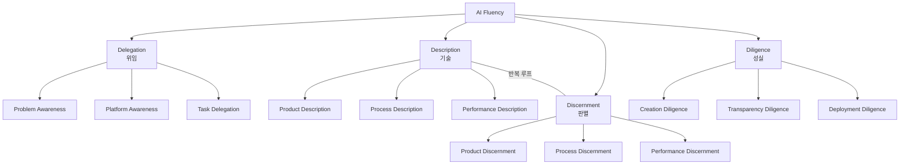
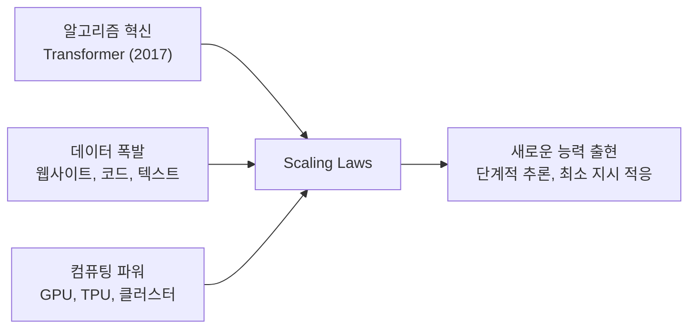
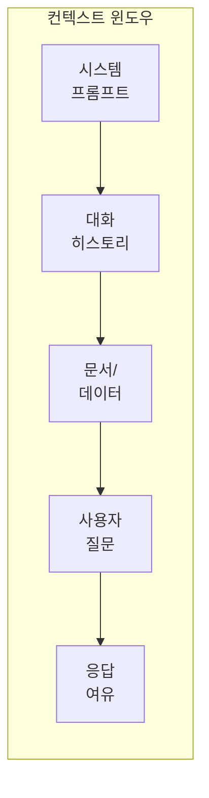

# 1주차: AI 활용 전략과 프롬프트 엔지니어링

---

## 📌 강의 중점

- **AI Fluency**와 4D Framework를 통한 AI 활용 전략 수립
- AI의 작동 원리와 한계 이해 → 더 나은 프롬프트로 연결
- **프롬프트 엔지니어링 6가지 핵심 기법** (건축공학 도메인 예시)
- **Claude Code**에서의 프롬프트 엔지니어링 — CLAUDE.md, 슬래시 명령, 단축키

---

## 🎯 학습 목표

학습 완료 후 다음을 수행할 수 있습니다:

- 4D Framework로 AI 활용 작업을 전략적으로 분석할 수 있다
- AI의 강점과 한계를 설명하고, 한계를 고려한 프롬프트를 설계할 수 있다
- 6가지 프롬프트 기법을 적용하여 건축공학 프롬프트를 점진적으로 개선할 수 있다
- Claude Code의 기본 명령어와 CLAUDE.md 개념을 이해하고 활용할 수 있다

---

## [Chapter 1] AI 활용 전략 — 4D Framework

### 1.1 AI Fluency란?

> [!tip] AI Fluency = AI 시스템과 **효과적**(Effective), **효율적**(Efficient), **윤리적**(Ethical), **안전하게**(Safe) 상호작용하는 능력

AI를 단순한 도구가 아닌 **문제 해결 파트너**로 접근한다. 유행하는 프롬프트 팁이 아닌, 기술이 변해도 유효한 **근본적 프레임워크**가 필요하다.

**이 수업에서 기대하는 것:**
1. AI 상호작용을 가이드할 프레임워크 보유
2. AI를 언제, 어떻게 활용할지 결정하는 자신감
3. 인간-AI 협업을 위한 실용적 스킬
4. 협업 결과에 대한 평가와 책임 능력

> [!ref] 소스: [Anthropic AI Fluency Course](https://www.anthropic.com/ai-fluency) — Lessons 1, 2A, 2B

### 1.2 4D Framework

![[ai-fluency/thumb-L02B-4d-framework.jpg]]
*The 4D Framework: Delegation, Description, Discernment, Diligence*

| 역량                   | 핵심 질문                 | 초점                    | 건축공학 예시                                   |
| -------------------- | --------------------- | --------------------- | ----------------------------------------- |
| **Delegation** (위임)  | 언제, 어떻게 AI를 활용할 것인가?  | Effective & Efficient | 구조계산서 초안 검토를 AI에 위임, 최종 판정은 구조기술사         |
| **Description** (기술) | AI에게 어떻게 명확히 소통할 것인가? | Effective & Efficient | "기둥 설계해줘" → 설계 조건, 적용 기준, 출력 형식을 명시한 프롬프트 |
| **Discernment** (판별) | AI 출력물을 어떻게 평가할 것인가?  | Effective & Efficient | AI 산출 철근량이 KDS 기준 최소/최대 철근비를 만족하는지 검토     |
| **Diligence** (성실)   | AI 사용의 책임을 어떻게 질 것인가? | Ethical & Safe        | AI가 생성한 구조 검토 보고서에 구조기술사 검증 필수            |



> [!finding] Description ↔ Discernment 반복 루프
> Description이 필요를 전달하는 것이라면, Discernment는 그 필요가 충족되었는지 평가하는 것. Discernment가 문제를 발견하면 → 더 나은 Description이 해결책.

> [!question] Delegation의 핵심 질문
> AI를 활용하기 전에 스스로에게 물어야 할 질문:
> - 정확히 무엇을 달성하려 하는가?
> - 성공은 어떤 모습인가?
> - 단순하지만 시간 소모적인 영역은? (→ Automation)
> - 불확실성이 있어 사고 파트너가 필요한 영역은? (→ Augmentation)
> - 비판적 판단이 필요한 영역은? (→ 인간만)

> [!finding] 가장 효과적인 AI 협업자는 자신의 분야 전문가가 먼저이고, AI 위임자가 그 다음이다.

### 1.3 AI 상호작용 3가지 모드

![[ai-fluency/slide-01-01.webp]]
*Three ways to interact with AI: Automation, Augmentation, Agency*

| 방식                    | 설명                  | 건축공학 예시                  |
| --------------------- | ------------------- | ------------------------ |
| **Automation** (자동화)  | AI가 지시에 따라 특정 작업 수행 | 시방서 자동 요약, 물량 산출표 생성     |
| **Augmentation** (증강) | 인간과 AI가 함께 협업       | 구조 설계 대안 탐색, 내진 성능 분석 토론 |
| **Agency** (에이전시)     | AI가 독립적으로 행동        | 코드 자동 수정, 문서 분류 에이전트     |

> [!tip] Augmentation과 Agency가 AI의 고유 역량을 가장 잘 활용하며, 가장 효과적인 결과를 낳는 경우가 많다.

### 1.4 4D × 3모드 매트릭스

|                 | Automation | Augmentation | Agency      |
| --------------- | ---------- | ------------ | ----------- |
| **Delegation**  | 명확한 작업 정의  | 협업 영역 식별     | 행동 패턴 설정    |
| **Description** | 구체적 지시     | 맥락 풍부한 대화    | 지식/행동 규칙 정의 |
| **Discernment** | 결과물 검증     | 협업 과정 평가     | 자율 행동 모니터링  |
| **Diligence**   | 출력 책임      | 공동 창작 투명성    | 에이전트 행동 책임  |

---

## [Chapter 2] AI의 원리, 작동방식, 한계

### 2.1 생성형 AI란?

- **기존 AI** (분류): 이메일을 스팸/정상으로 분류
- **생성형 AI** (생성): 새로운 이메일, 코드, 보고서를 작성

생성형 AI는 데이터베이스에서 답을 검색하는 것이 아닌, **통계적 패턴에 기반해 새 텍스트를 생성**한다.

### 2.2 LLM을 가능하게 한 3가지 요소

![[ai-fluency/slide-01-03.webp]]
*Three pillars that made AI possible: Algorithms, Data, Computation*



**Transformer**는 "Attention Is All You Need" (2017) 논문에서 제안된 아키텍처로, 텍스트의 모든 위치를 동시에 참조(Self-Attention)하여 병렬 처리가 가능하다. 이전의 RNN/LSTM이 단어를 순차적으로 처리한 것과 달리, Transformer는 문장 전체를 한 번에 보면서 단어 간 관계를 파악한다.

### 2.3 학습 과정

| 단계 | 내용 |
|---|---|
| **Pre-training** | 수십억 텍스트 예시의 통계적 패턴 학습 → 언어/지식의 복잡한 맵 구축 |
| **Fine-tuning** | 지시 따르기, 유용한 응답, 유해 콘텐츠 방지 학습 (RLHF) |
| **Deployment** | 사용자와의 상호작용 |

### 2.4 핵심 특성: Context Window

**Context Window**는 AI의 작업 기억 — 프롬프트 + 응답 + 공유 정보를 포함하여 한 번에 처리할 수 있는 최대 토큰 수이다.



**주요 모델별 컨텍스트 윈도우** (2026년 기준):

| 모델 | 컨텍스트 윈도우 | 출력 토큰 한도 | 특징 |
|---|---|---|---|
| **Claude 4.5/4.6 Sonnet** | 200K | 16,384 | 최고 수준 코딩, 긴 문서 처리 |
| **Claude 4.6 Opus** | 200K | 32,000 | 최고 추론 능력, 복잡한 분석 |
| **GPT-4o** | 128K | 16,384 | 빠른 응답, 넓은 생태계 |
| **Gemini 2.5 Pro** | 1M | 65,536 | 초대형 컨텍스트, 멀티모달 |

### 2.5 AI의 강점

- **언어 능력**: 보고서 작성, 요약, 번역, 복잡한 주제 설명
- **작업 전환**: 시 작성 → 구조 계산 → 비즈니스 분석 (추가 훈련 없이)
- **대화 맥락 유지**: 이전 대화 내용 기억 및 활용
- **외부 도구 연결**: 웹 검색, 파일 처리, 코드 실행

### 2.6 AI의 한계

| 한계                    | 설명                      | 건축공학에서의 영향         |
| --------------------- | ----------------------- | ------------------ |
| **Knowledge Cutoff**  | 훈련 데이터 이후의 정보 없음        | 최신 KDS 개정사항 미반영 가능 |
| **Hallucination**     | 그럴듯하지만 부정확한 정보를 자신있게 말함 | 존재하지 않는 기준 조항 인용   |
| **Context Window 제한** | 한 번에 처리할 수 있는 정보량 한계    | 대형 계산서 전체 처리 불가    |
| **비결정성**              | 같은 질문에 다른 답변            | 동일 조건 재계산 시 다른 결과  |
| **복잡한 추론**            | 다단계 수학/논리 문제에서 약점       | 복잡한 하중조합 계산 오류 가능  |

### 2.7 인간-AI 상호보완

> [!tip] 상호보완 원칙
> - **인간**: 비판적 사고, 판단력, 창의성, 윤리적 감독, 도메인 전문성
> - **AI**: 속도, 규모, 패턴 인식, 방대한 정보 처리, 반복 작업

> [!finding] Bridge
> 이러한 한계를 이해하면 → 한계를 보완하는 **더 나은 프롬프트 전략**으로 연결된다.

---

## [Chapter 3] Prompt Engineering 전략

> [!ref] 소스: [AI Fluency L7](https://www.anthropic.com/ai-fluency)

### 6가지 핵심 기법 — RC 기둥 설계 검토로 시연

> **관통 문제**: 지상 10층 업무시설 RC 기둥 — 설계 축력 3,000kN, 설계 모멘트 200kN·m, 층고 4.0m, fck=27MPa, fy=400MPa

![[ai-fluency/slide-02-02.webp]]
*Foundational prompting tips: 6가지 핵심 프롬프팅 기법*

### 3.1 맥락 제공 (Give Context)

**Before** — 맥락 없는 요청:
```
RC기둥 설계해줘
```

**After** — 맥락이 풍부한 요청:
```
지상 10층 업무시설의 1층 RC 기둥을 설계해줘.

건물 정보:
- 구조 시스템: 철근콘크리트 라멘 구조
- 내진등급: 특등급 (내진설계범주 D)
- 적용 기준: KDS 14 20 00 (콘크리트구조 설계기준)

설계 조건:
- 설계 축력 (Pu): 3,000 kN
- 설계 모멘트 (Mu): 200 kN·m
- 층고: 4.0m
- 콘크리트 강도 (fck): 27 MPa
- 철근 항복강도 (fy): 400 MPa
```

### 3.2 좋은 예시 보여주기 (Show Examples)

Few-shot prompting — 유사 결과 예시를 포함하여 원하는 출력 형식을 보여준다:

```
건축 구조 부재를 분류합니다.

예시 1:
입력: H300x150x6.5x9
분류: H형강, 높이 300mm, 폭 150mm, 웨브 6.5mm, 플랜지 9mm

예시 2:
입력: ㄷ200x80x7.5x11
분류: C형강, 높이 200mm, 폭 80mm, 웨브 7.5mm, 플랜지 11mm

입력: W400x200x8x13
분류:
```

> [!tip] 먼저 예시 없이 시도해보고, 원하는 스타일/형식이 필요할 때 예시를 추가한다.

### 3.3 출력 제약 명시 (Specify Output Constraints)

형식, 길이, 단위, 기준 조항 등을 구체적으로 명시한다:

```
RC기둥 설계 결과를 다음 형식으로 제시하세요:

1. 적용 기준: KDS 조항번호 명시
2. 결과 표:
| 검토항목 | 기준값 | 적용값 | 판정 | 비고 |
3. 모든 수치에 단위 표기 (kN, mm, MPa)
4. 불확실한 가정은 명시적으로 표기
```

### 3.4 단계별 분해 (Break into Steps)

Chain-of-Thought (CoT) — 복잡한 문제를 단계별로 분해:

```
다음 조건의 RC 기둥을 설계하세요.

조건:
- 설계 축력: 3,000kN
- 설계 모멘트: 200kN·m
- 층고: 4.0m
- fck: 27MPa, fy: 400MPa

단계별로 수행하세요:
1단계: 예상 단면 크기 가정
2단계: 세장비 검토
3단계: 소요 철근량 산정
4단계: 배근 상세 결정
5단계: 강도 검증

각 단계의 계산 과정과 결과를 보여주세요.
```

### 3.5 먼저 생각하도록 요청 (Ask to Think First)

"답하기 전에 생각하라"고 명시적으로 요청한다:

```
답하기 전에 다음을 먼저 고려해주세요:
- 세장비 제한 (KDS 14 20 00)
- 최소/최대 철근비 (ρmin = 0.01, ρmax = 0.08)
- 배근 시 피복두께 및 간격 제약
- 축력과 모멘트의 상호작용

이 조건들을 충분히 고려한 후 설계를 진행하세요.
```

> [!method] 핵심: **실행 전에** 생각하게 하는 것이 중요하다. 실행 후 설명과는 다르다.

### 3.6 역할/스타일/톤 정의 (Define Role)

시스템 프롬프트로 AI의 역할을 정의한다:

```
당신은 건축구조 전문 AI 엔지니어입니다.

## 역할
- 건축구조설계기준(KDS 41)에 따른 구조 검토
- 내진설계 및 하중 조합 분석
- 부재 단면 설계 및 검증

## 응답 규칙
1. 모든 계산에 적용 기준 명시 (예: KDS 41 17 00)
2. 단위를 항상 표기 (kN, mm, MPa)
3. 불확실한 경우 가정 조건 명시
4. 안전측 설계 원칙 준수

## 출력 형식
- 계산 과정: 단계별 상세 설명
- 결과: 표 형식으로 정리
- 검토 의견: 기준 만족 여부 판정
```


### 3.7 구조화 프롬프트의 진화 — Self-Correction Loop

**단계 1: 기본 구조화 프롬프트** (역할 + 임무 + 문제정의 + 출력형식)

```
# 역할(Role):
당신은 구조 공학 및 유한요소해석(FEA) 분야의 전문가입니다.

# 임무(Task):
캔틸레버 보 문제의 파라미터를 분석하여 결과를 JSON으로 출력하십시오.

# 문제 정의(Problem Definition):
- 길이 (L): 2.0 m, 단면: 0.1m × 0.1m
- 탄성계수 (E): 210 GPa, 하중 (P): 100 kN (자유단)

# 출력 형식(Output Format):
JSON — 키: "처짐(mm)", "최대굽힘응력(MPa)"
```

**단계 2: 검증 루프 추가** (Self-Correction Loop)

```
# 워크플로우(Workflow):
[1단계: 문제 분석] 모든 파라미터를 정확히 인식
[2단계: 초기 계산] 표준 재료역학 공식으로 계산
[3단계: 논리 검증 및 오류 수정 (Self-Correction)]
  - 공식 확인: δ = PL³/3EI, σ = Mc/I
  - 단위 변환 검증: GPa→Pa, kN→N, m→mm
  - 수치 계산 검증: 모든 산술 연산 재수행
  → 오류 발견 시 즉시 수정
[4단계: 최종 출력 생성] 검증 통과 결과만 출력
```

> [!finding] 핵심 통찰
> 검증 루프(Self-Correction Loop)를 추가하면 단위 변환 오류, 공식 착오 등 AI의 수학적 실수를 줄일 수 있다. 이는 Chapter 2에서 다룬 "복잡한 추론"의 한계를 프롬프트로 보완하는 전략이다.

### 3.8 비밀 무기: AI에게 프롬프트 개선 요청

```
나는 RC기둥 설계 검토를 AI에게 요청하려고 해.
최선의 결과를 얻기 위해 어떻게 프롬프트를 작성해야 할지 모르겠어.
효과적인 프롬프트를 만드는 걸 도와줄 수 있어?
```

> [!tip] AI 자체가 프롬프트 전문가다. 막힐 때는 AI에게 도움을 요청하라.

### 3.9 흔한 실수 4가지

1. **AI가 마음을 읽을 수 있다고 가정** — 맥락을 명시하지 않으면 일반적 답변만 나온다
2. **하나의 프롬프트에 관련 없는 여러 작업 과적** — 한 번에 한 가지씩
3. **성공의 모습을 너무 모호하게 설명** — 구체적 출력 형식과 기준 제시
4. **이전 응답에 대한 피드백 미제공** — Description ↔ Discernment 반복 루프 활용

---

## [Chapter 4] Claude Code에서의 Prompt Engineering

> [!ref] 소스: [Claude Code in Action](https://anthropic.skilljar.com/claude-code-in-action) (Lessons 6-9)

### 4.1 핵심 개념: CLAUDE.md = 영속적 프롬프트 엔지니어링

> [!finding] CLAUDE.md는 Claude Code에 대한 **프로젝트 메모리** 역할을 한다.
> 잘 작성하면 매번 컨텍스트를 반복 설명할 필요가 없고 일관된 코딩 스타일을 유지할 수 있다.

Chapter 3의 6가지 기법이 CLAUDE.md에 직접 대응한다:

| 프롬프트 기법 | CLAUDE.md 대응 |
|---|---|
| 맥락 제공 | 프로젝트 구조, 기술 스택, 아키텍처 설명 |
| 예시 보여주기 | 코드 스니펫, 패턴 예시 포함 |
| 출력 제약 명시 | 코딩 컨벤션, 파일 명명 규칙 |
| 단계별 분해 | 작업 워크플로우, 검증 절차 |
| 먼저 생각하라 | "변경 전 기존 코드 분석" 규칙 |
| 역할 정의 | 프로젝트 도메인, 전문가 역할 설정 |

### 4.2 CLAUDE.md 개요

**`/init` 명령**: 코드베이스를 분석하여 `CLAUDE.md`를 자동 생성한다 (목적, 아키텍처, 명령어, 패턴 포함).

| CLAUDE.md 유형 | 용도 | 공유 여부 |
|---|---|---|
| `CLAUDE.md` | `/init`으로 생성, 소스 제어 커밋 | 팀 공유 |
| `CLAUDE.local.md` | 개인 지시사항 | 공유 안 됨 |
| `~/.claude/CLAUDE.md` | 모든 프로젝트에 적용 | 개인 전역 |

### 4.3 `#` 메모리 모드

CLAUDE.md에 지시사항을 **자동 병합**한다. 프롬프트에서 `#`으로 시작하면 CLAUDE.md에 저장된다:

```
# KDS 14 20 00 기준으로 설계할 것
# 모든 계산에 단위를 명시할 것
```

### 4.4 `@` 파일 멘션

관련 파일 컨텍스트를 프롬프트에 직접 포함시킨다:

```
@requirements.txt 를 참고해서 의존성 설치해줘
```

### 4.5 주요 슬래시 명령어

| 명령어        | 기능               |
| ---------- | ---------------- |
| `/help`    | 도움말 표시           |
| `/clear`   | 대화 완전 초기화        |
| `/compact` | 대화 요약 (핵심 정보 보존) |
| `/cost`    | 현재 세션 비용 확인      |
| `/init`    | CLAUDE.md 자동 생성  |

### 4.6 키보드 단축키

| 단축키 | 동작 | 사용 시점 |
|---|---|---|
| `Escape` 1번 | Claude 중단, 방향 전환 | 잘못된 방향으로 진행 중일 때 |
| `Escape` 2번 | 대화 되감기 (이전 지점으로 복귀) | 불필요한 기록 제거 |
| `Shift+Tab` 2번 | Planning Mode 활성화 | 넓은 코드베이스 이해, 멀티스텝 구현 |
| `Ctrl+V` | 스크린샷 붙여넣기 | 에러 화면, UI 참조 |

### 4.7 Thinking Modes

프롬프트에 키워드를 포함하여 사고 깊이를 조절한다:

| 레벨 | 키워드 | 적합한 상황 |
|---|---|---|
| 1 | Think | 간단한 질문 |
| 2 | Think more | 중간 난이도 |
| 3 | Think a lot | 복잡한 로직 |
| 4 | Think longer | 디버깅 |
| 5 | Ultrathink | 알고리즘, 아키텍처 설계 |

### 4.8 Custom Commands

`.claude/commands/` 폴더에 마크다운 파일을 생성하면, 파일명이 곧 명령어가 된다:

```
.claude/commands/review.md → /review 명령으로 호출
```

`$ARGUMENTS` 플레이스홀더로 인자를 전달할 수 있다.

### 4.9 건축공학 프로젝트 CLAUDE.md 예시

```markdown
# 프로젝트: RC 구조설계 검토 도구

## 기술 스택
- Python 3.12, FastAPI, Streamlit
- 설계 기준: KDS 14 20 00, KDS 41 17 00

## 코딩 규칙
- 모든 구조 계산 함수에 적용 기준 조항번호 주석
- 단위는 SI 단위 사용 (N, mm, MPa)
- 변수명에 단위 포함 (예: force_kN, length_mm)

## 워크플로우
- 새 기능 추가 시: 기존 코드 분석 → 구현 → 테스트 → 검증
- 구조 계산 변경 시: KDS 기준 조항 확인 필수
```

---

## 💻 실습 — 관통 문제: "RC 기둥 설계 검토"

> [!method] 모든 실습이 **동일한 RC 기둥 설계 검토 문제**를 다른 관점에서 다룹니다.

**관통 문제 설정**:

| 항목            | 값            |
| ------------- | ------------ |
| 건물            | 지상 10층 업무시설  |
| 부재            | 1층 RC 기둥     |
| 설계 축력 (Pu)    | 3,000 kN     |
| 설계 모멘트 (Mu)   | 200 kN·m     |
| 층고            | 4.0 m        |
| 콘크리트 강도 (fck) | 27 MPa       |
| 철근 항복강도 (fy)  | 400 MPa      |
| 적용 기준         | KDS 14 20 00 |

| 순서  | 실습 내용                                                | 시간  | 연계   |
| --- | ---------------------------------------------------- | --- | ---- |
| 1   | **4D 분석**: RC기둥 설계 검토를 4D Framework로 분석              | 20분 | Ch.1 |
| 2   | **AI 한계 체험**: 동일 문제를 3개 플랫폼에 던져 환각·오류 발견             | 20분 | Ch.2 |
| 3   | **프롬프트 6단계 개선**: 6가지 기법을 하나씩 적용하며 점진 개선              | 30분 | Ch.3 |
| 4   | **Claude Code 첫 체험**: CC 설치 → CLAUDE.md → RC기둥 문제 해결 | 40분 | Ch.4 |
| 5   | **비밀 무기**: 최선의 프롬프트를 AI에게 "더 개선해줘" 요청                | 10분 | 통합   |

### 실습 1: 4D 분석 (20분) → Ch.1

RC기둥 설계 검토 작업을 4D Framework로 분석하세요:

| 4D              | 질문                                 | 작성  |
| --------------- | ---------------------------------- | --- |
| **Delegation**  | 이 작업에서 AI에 위임할 부분은? 인간만이 해야 할 판단은? |     |
| **Description** | AI에게 어떤 맥락과 조건을 제공해야 하는가?          |     |
| **Discernment** | AI 결과를 어떤 기준으로 검증할 것인가?            |     |
| **Diligence**   | AI 활용 사실을 어떻게 투명하게 밝힐 것인가?         |     |

### 실습 2: AI 한계 체험 (20분) → Ch.2

동일한 RC기둥 문제를 **Claude, GPT, Gemini**에 그대로 던져보고 한계를 관찰하세요.

**프롬프트** (세 플랫폼에 동일하게 입력):
```
다음 조건의 RC 기둥을 설계하세요:
설계 축력 3,000kN, 설계 모멘트 200kN·m,
층고 4.0m, fck=27MPa, fy=400MPa
```

**체크리스트**:
- [ ] 환각(Hallucination): 존재하지 않는 기준 조항 인용?
- [ ] 계산 오류: 철근량, 강도 계산이 정확한가?
- [ ] 기준 착오: 적용한 설계 기준이 올바른가? (KDS vs ACI vs EC2)
- [ ] 비결정성: 같은 질문을 2번 던져 다른 답변이 나오는가?
- [ ] 단위 혼동: SI 단위를 일관되게 사용했는가?

**비교표 작성**:

| 관찰 항목 | Claude | GPT | Gemini |
|---|---|---|---|
| 적용 기준 | | | |
| 가정한 단면 크기 | | | |
| 산출 철근량 | | | |
| 계산 정확도 (0-5) | | | |
| 발견된 한계/오류 | | | |

### 실습 3: 프롬프트 6단계 개선 (30분) → Ch.3

"RC기둥 설계해줘"에서 시작하여 6가지 기법을 **하나씩** 적용하며 점진 개선:

| 단계  | 적용 기법  | 추가 내용                | 결과 품질 변화 |
| --- | ------ | -------------------- | -------- |
| 0   | 없음     | "RC기둥 설계해줘"          |          |
| 1   | 맥락 제공  | 건물 정보, 설계 조건, 적용 기준  |          |
| 2   | 예시     | 유사 설계 결과 포맷 제시       |          |
| 3   | 출력 제약  | KDS 조항번호 + 표 형식 + 단위 |          |
| 4   | 단계별 분해 | 5단계 CoT              |          |
| 5   | 먼저 생각  | 세장비, 최소철근비, 배근 제약 고려 |          |
| 6   | 역할 정의  | 구조기술사 역할 시스템 프롬프트    |          |

### 실습 4: Claude Code 첫 체험 (40분) → Ch.4

**Part A — 설치 및 설정 (15분)**:
1. Claude Code 설치 확인 (`claude --version`)
2. 프로젝트 폴더 생성: `mkdir rc-column-review && cd rc-column-review`
3. `claude` 실행 → 첫 인증
4. `/init`으로 CLAUDE.md 자동 생성
5. `#`으로 CLAUDE.md에 구조 전문가 역할 추가:
   ```
   # 이 프로젝트는 건축구조 설계 검토 도구이다. KDS 14 20 00 기준을 적용한다.
   ```

**Part B — RC기둥 문제 해결 (15분)**:
6. 동일 RC기둥 문제를 Claude Code에 입력
7. `/cost`로 사용 비용 확인
8. 결과 검토 및 추가 질문

**Part C — 비교 (10분)**:
9. 웹 버전(Claude.ai)에서 동일 문제 입력
10. Claude Code vs 웹 버전 결과 비교 — CLAUDE.md 맥락 유무의 차이 관찰

### 실습 5: 비밀 무기 (10분) → 통합

실습 3에서 만든 최선의 프롬프트를 AI에게 "이 프롬프트를 더 개선해줘"라고 요청하고, 개선 전후를 비교하세요.

### 시간 배분 총괄 (2시간 30분)

| 구분 | 내용 | 시간 |
|---|---|---|
| 이론 | Ch.1-4 강의 | 30분 |
| 실습 | 실습 1-5 | 2시간 |

---

## 📝 과제

### 과제 1: 프롬프트 설계 (제출)

건축 시방서 요약을 위한 **최적 프롬프트**를 개발하세요:
- Claude, GPT, Gemini 세 플랫폼에서 동일 프롬프트 테스트
- 각 플랫폼별 응답 품질 비교 (정확성, 상세도, 형식)
- 6가지 기법 중 최소 3가지 이상 적용
- 본인의 평가 및 용도별 추천

### 과제 2: Claude Code 실습 (폴더 압축 제출)

Claude Code로 **건축 단위 변환 유틸리티** 만들기:

**수행 절차:**

```
# 1단계: 프로젝트 폴더 생성 및 Claude Code 시작
mkdir rc-unit-converter
cd rc-unit-converter
claude
```

```
# 2단계: CLAUDE.md 생성 (Claude Code 안에서)
/init
```

```
# 3단계: CLAUDE.md에 도메인 맥락 추가 (Claude Code 안에서)
# 이 프로젝트는 건축공학 단위 변환 도구이다.
# SI 단위(N, mm, MPa)를 기본으로 사용한다.
# Python으로 작성한다.
```

```
# 4단계: Claude Code에게 프로그램 작성 요청 (프롬프트 예시)
건축공학에서 자주 사용하는 단위 변환 프로그램을 만들어줘.

기능:
- 힘: kN ↔ N
- 응력: MPa ↔ kPa ↔ GPa
- 길이: mm ↔ m ↔ cm

터미널에서 실행하면 변환할 값, 원래 단위, 변환 단위를 입력받아
결과를 출력하는 방식으로 만들어줘.
```

```
# 5단계: 프로그램 실행 확인 (Claude Code 안에서)
만든 프로그램을 실행해서 kN을 N으로 변환하는 테스트를 보여줘
```

> [!tip] Claude Code가 파일을 생성하거나 명령어를 실행할 때 승인을 요청합니다. 내용을 확인하고 승인(y)하세요.

**제출물:**
- 프로젝트 폴더 전체를 압축(zip)하여 e-campus 제출
- 반드시 포함: CLAUDE.md, 생성된 Python 파일
- Claude Code 사용 과정 스크린샷 3장 이상 (CLAUDE.md 생성, 코드 생성, 실행 결과)

---

## 🤖 CC 스킬: CC 설치 + CLAUDE.md 기초

> [!finding] 이번 주 CC 스킬
> - Claude Code 설치 (https://claude.ai/install.sh 또는 npm)
> - 기본 명령어: `claude`, `/help`, `/clear`, `/cost`, `Shift+Tab`, `Esc`
> - CLAUDE.md 개념 소개 (`/init`, `#` 메모리, `@` 멘션)
> - Claude Code로 간단한 건축 계산기 만들기
> - **2주차 예고**: CLAUDE.md 심화 작성법 + Big Prompt

---

## 📚 Anthropic 참고 자료

> [!ref] Anthropic Skilljar 코스 (자율 학습)
> - 🎓 **AI Fluency** (무료, ~1.1시간) — 4D Framework, AI 원리, 프롬프팅 기법
>   https://www.anthropic.com/ai-fluency
> - 🎓 **Claude Code in Action** (1h, 15강) — CC 사용법 전반
>   https://anthropic.skilljar.com/claude-code-in-action
> - 🎓 **Building with Claude API — S1** (API 기초)
>   https://anthropic.skilljar.com/claude-with-the-anthropic-api
> - 📓 Prompt Engineering Tutorial
>   https://github.com/anthropics/courses/tree/master/prompt_engineering_interactive_tutorial

### 📚 추가 참고

- [Anthropic Prompt Engineering Guide](https://docs.anthropic.com/claude/docs/prompt-engineering)
- [Attention Is All You Need (원논문)](https://arxiv.org/abs/1706.03762)
- [The Illustrated Transformer (Jay Alammar)](https://jalammar.github.io/illustrated-transformer/)
- [3Blue1Brown: Transformers 시각화](https://www.youtube.com/watch?v=wjZofJX0v4M)
