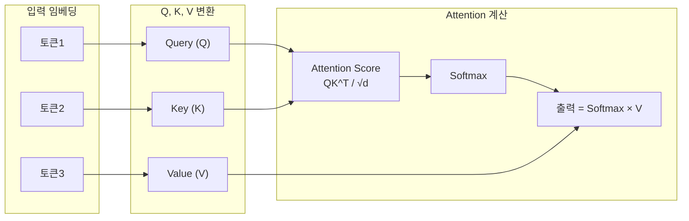
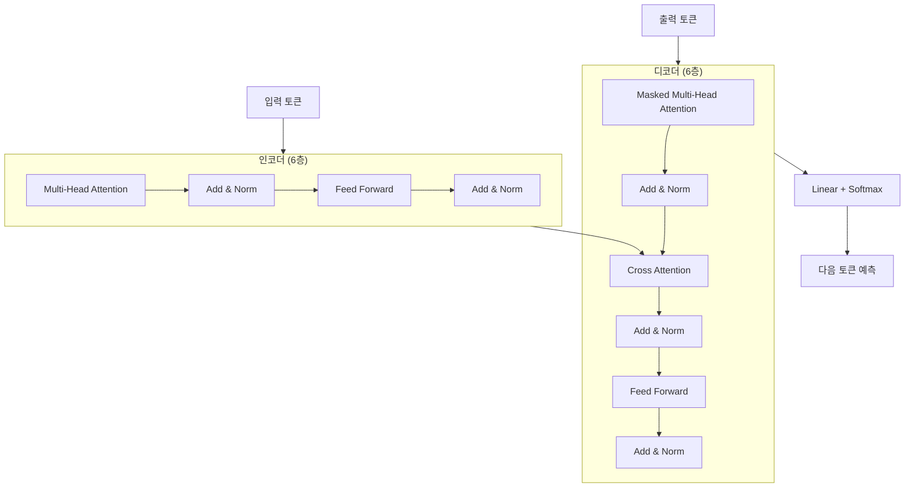
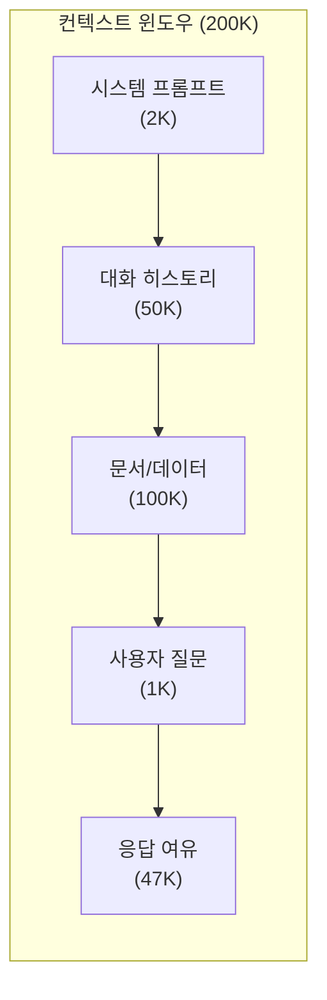
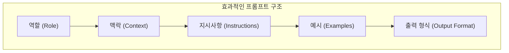
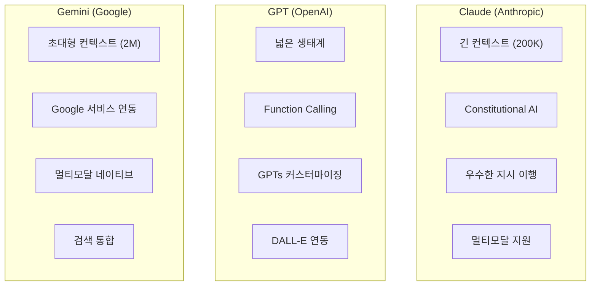

# 1주차: LLM 원리와 프롬프트 엔지니어링

---

## 📌 강의 중점

- **Transformer 아키텍처**와 Self-Attention 메커니즘의 작동 원리
- **토큰화(Tokenization)**와 컨텍스트 윈도우의 개념
- **프롬프트 엔지니어링** 기법 (Zero-shot, Few-shot, Chain-of-Thought)
- **LLM 플랫폼 비교**: Claude, GPT, Gemini의 특성과 활용

---

## 🎯 학습 목표

학습 완료 후 다음을 수행할 수 있습니다:

- LLM의 핵심 작동 원리(Attention, Tokenization)를 설명할 수 있다
- 효과적인 프롬프트를 설계하고 개선할 수 있다
- 각 LLM 플랫폼의 특성을 파악하고 용도에 맞게 선택할 수 있다
- 건축공학 도메인에 적합한 프롬프트를 작성할 수 있다

---

## [Chapter 1] Transformer 아키텍처

### 1.1 딥러닝에서 Transformer로의 진화

기존 RNN/LSTM 기반 모델의 한계:
- **순차적 처리**: 긴 시퀀스에서 병렬화 불가능
- **장기 의존성 문제**: 먼 거리의 정보 손실
- **기울기 소실**: 깊은 네트워크에서 학습 어려움

2017년 Google의 "Attention Is All You Need" 논문에서 Transformer 제안:
- **Self-Attention**: 모든 위치를 동시에 참조
- **병렬 처리**: GPU 활용 극대화
- **위치 인코딩**: 순서 정보 보존

### 1.2 Self-Attention 메커니즘



**핵심 수식**:
$$\text{Attention}(Q, K, V) = \text{softmax}\left(\frac{QK^T}{\sqrt{d_k}}\right)V$$

- **Query (Q)**: "내가 찾고 싶은 정보"
- **Key (K)**: "내가 가진 정보의 인덱스"
- **Value (V)**: "실제 정보 내용"
- **√d_k**: 스케일링 팩터 (기울기 안정화)

### 1.3 Multi-Head Attention

여러 개의 Attention을 병렬로 수행하여 다양한 관점에서 정보 수집:

```python
# Multi-Head Attention 의사 코드
def multi_head_attention(Q, K, V, num_heads=8):
    heads = []
    for i in range(num_heads):
        # 각 head는 다른 선형 변환 적용
        Q_i = linear_Q[i](Q)
        K_i = linear_K[i](K)
        V_i = linear_V[i](V)
        head_i = attention(Q_i, K_i, V_i)
        heads.append(head_i)

    # 모든 head 결합
    concat = concatenate(heads)
    output = linear_out(concat)
    return output
```

### 1.4 Transformer 전체 구조



### 📚 참고 자료

- [Attention Is All You Need (원논문)](https://arxiv.org/abs/1706.03762)
- [The Illustrated Transformer (Jay Alammar)](https://jalammar.github.io/illustrated-transformer/)
- [3Blue1Brown: Transformers 시각화](https://www.youtube.com/watch?v=wjZofJX0v4M)
- [Anthropic: Constitutional AI 논문](https://arxiv.org/abs/2212.08073)

---

## [Chapter 2] 토큰화와 컨텍스트 윈도우

### 2.1 토큰화(Tokenization) 이해

**토큰화**란 텍스트를 모델이 처리할 수 있는 단위로 분할하는 과정:

```python
# 토큰화 예시 (tiktoken 라이브러리)
import tiktoken

# GPT-4용 인코더
enc = tiktoken.encoding_for_model("gpt-4")

text = "건축구조설계기준(KDS 41 10 00)에 따른 내진설계"
tokens = enc.encode(text)

print(f"토큰 수: {len(tokens)}")
print(f"토큰 목록: {tokens}")
print(f"디코딩: {[enc.decode([t]) for t in tokens]}")
```

**주요 토큰화 방식**:

| 방식 | 특징 | 사용 모델 |
|------|------|----------|
| **BPE** (Byte Pair Encoding) | 빈도 기반 서브워드 분할 | GPT, Claude |
| **WordPiece** | 확률 기반 서브워드 | BERT |
| **SentencePiece** | 언어 무관 토큰화 | T5, Gemini |

### 2.2 컨텍스트 윈도우

**컨텍스트 윈도우**는 모델이 한 번에 처리할 수 있는 최대 토큰 수:



**주요 모델별 컨텍스트 윈도우**:

| 모델 | 컨텍스트 윈도우 | 출력 토큰 한도 |
|------|----------------|---------------|
| **Claude 3.5 Sonnet** | 200K | 8,192 |
| **GPT-4 Turbo** | 128K | 4,096 |
| **Gemini 1.5 Pro** | 2M | 8,192 |
| **GPT-4o** | 128K | 16,384 |

### 2.3 토큰 비용 최적화

```python
# 토큰 수 예측 및 비용 계산
def estimate_cost(text: str, model: str = "claude-3-5-sonnet"):
    enc = tiktoken.encoding_for_model("gpt-4")  # 근사치
    tokens = len(enc.encode(text))

    # Claude 3.5 Sonnet 가격 (2024년 기준)
    prices = {
        "claude-3-5-sonnet": {"input": 3.0, "output": 15.0},  # per 1M tokens
        "gpt-4-turbo": {"input": 10.0, "output": 30.0},
    }

    input_cost = (tokens / 1_000_000) * prices[model]["input"]
    return {"tokens": tokens, "estimated_cost_usd": input_cost}
```

### 📚 참고 자료

- [OpenAI Tokenizer](https://platform.openai.com/tokenizer)
- [Anthropic Token Counting](https://docs.anthropic.com/claude/docs/counting-tokens)
- [tiktoken GitHub](https://github.com/openai/tiktoken)

---

## [Chapter 3] 프롬프트 엔지니어링 기법

### 3.1 프롬프트 구성 요소



### 3.2 Zero-shot vs Few-shot

**Zero-shot**: 예시 없이 직접 질문

```python
zero_shot_prompt = """
다음 건축 도면의 부재를 분류하세요:
W400x200x8x13

답변:
"""
```

**Few-shot**: 예시를 포함한 질문

```python
few_shot_prompt = """
건축 구조 부재를 분류합니다.

예시 1:
입력: H300x150x6.5x9
분류: H형강, 높이 300mm, 폭 150mm, 웨브 6.5mm, 플랜지 9mm

예시 2:
입력: ㄷ200x80x7.5x11
분류: C형강, 높이 200mm, 폭 80mm, 웨브 7.5mm, 플랜지 11mm

입력: W400x200x8x13
분류:
"""
```

### 3.3 Chain-of-Thought (CoT)

복잡한 문제를 단계별로 분해:

```python
cot_prompt = """
건축물의 기둥 축하중을 계산하세요.

건물 정보:
- 층수: 10층
- 바닥 면적: 30m x 40m = 1,200m²
- 고정하중: 5kN/m²
- 활하중: 2.5kN/m²
- 기둥 간격: 8m x 10m

단계별로 계산해 주세요:

1단계: 기둥 1개가 담당하는 면적 계산
2단계: 층당 하중 계산 (고정하중 + 활하중)
3단계: 전체 층에 대한 누적 하중 계산
4단계: 하중계수 적용 (1.2D + 1.6L)
5단계: 최종 설계 축하중 산정

각 단계의 계산 과정과 결과를 보여주세요.
"""
```

### 3.4 시스템 프롬프트 설계

```python
system_prompt = """
당신은 건축구조 전문 AI 엔지니어입니다.

## 역할
- 건축구조설계기준(KDS 41)에 따른 구조 검토
- 내진설계 및 하중 조합 분석
- 부재 단면 설계 및 검증

## 응답 규칙
1. 모든 계산에 적용 기준 명시 (예: KDS 41 17 00)
2. 단위를 항상 표기 (kN, mm, MPa)
3. 불확실한 경우 가정 조건 명시
4. 안전측 설계 원칙 준수

## 출력 형식
- 계산 과정: 단계별 상세 설명
- 결과: 표 형식으로 정리
- 검토 의견: 기준 만족 여부 판정
"""
```

### 3.5 건축공학 프롬프트 예시

```python
# 구조 계산서 검토 프롬프트
review_prompt = """
[구조계산서 검토 요청]

## 검토 대상
- 프로젝트: 지상 15층 업무시설
- 구조 시스템: 철골 모멘트 골조
- 내진등급: 특등급

## 검토 항목
1. 고정하중 산정의 적정성
2. 활하중 적용 기준 (KDS 41 12 00)
3. 지진하중 산정 (KDS 41 17 00)
4. 하중조합의 적절성

## 첨부 자료
{calculation_sheet}

위 자료를 검토하고 다음 형식으로 결과를 제시하세요:

| 검토항목 | 기준값 | 적용값 | 판정 | 비고 |
|---------|--------|--------|------|------|
"""
```

### 📚 참고 자료

- [Anthropic Prompt Engineering Guide](https://docs.anthropic.com/claude/docs/prompt-engineering)
- [OpenAI Prompt Engineering](https://platform.openai.com/docs/guides/prompt-engineering)
- [Prompt Engineering Guide (GitHub)](https://github.com/dair-ai/Prompt-Engineering-Guide)
- [Chain-of-Thought 원논문](https://arxiv.org/abs/2201.11903)

---

## [Chapter 4] LLM 플랫폼 비교

### 4.1 주요 플랫폼 특성



### 4.2 상세 비교표

| 항목 | Claude 3.5 Sonnet | GPT-4 Turbo | Gemini 1.5 Pro |
|------|-------------------|-------------|----------------|
| **컨텍스트** | 200K | 128K | 2M |
| **가격 (입력)** | $3/1M | $10/1M | $3.5/1M |
| **가격 (출력)** | $15/1M | $30/1M | $10.5/1M |
| **멀티모달** | 이미지, PDF | 이미지 | 이미지, 비디오, 오디오 |
| **코딩 능력** | ★★★★★ | ★★★★☆ | ★★★★☆ |
| **긴 문서 처리** | ★★★★★ | ★★★★☆ | ★★★★★ |
| **한국어** | ★★★★☆ | ★★★★★ | ★★★★☆ |
| **API 안정성** | ★★★★★ | ★★★★★ | ★★★★☆ |

### 4.3 용도별 추천

| 용도 | 추천 모델 | 이유 |
|------|----------|------|
| **긴 문서 분석** | Claude / Gemini | 대용량 컨텍스트 |
| **코드 생성** | Claude 3.5 | 최고 수준 코딩 능력 |
| **실시간 대화** | GPT-4o | 빠른 응답 속도 |
| **멀티모달** | Gemini | 비디오/오디오 지원 |
| **건축 도면 분석** | Claude | 이미지+긴 설명 조합 |

### 4.4 API 비교 예시

```python
# Claude API
import anthropic

client = anthropic.Anthropic()
response = client.messages.create(
    model="claude-3-5-sonnet-20241022",
    max_tokens=1024,
    messages=[
        {"role": "user", "content": "안녕하세요"}
    ]
)

# OpenAI API
from openai import OpenAI

client = OpenAI()
response = client.chat.completions.create(
    model="gpt-4-turbo",
    messages=[
        {"role": "user", "content": "안녕하세요"}
    ]
)

# Google Gemini API
import google.generativeai as genai

genai.configure(api_key="YOUR_KEY")
model = genai.GenerativeModel("gemini-1.5-pro")
response = model.generate_content("안녕하세요")
```

### 📚 참고 자료

- [Anthropic Claude Documentation](https://docs.anthropic.com/)
- [OpenAI API Reference](https://platform.openai.com/docs/api-reference)
- [Google AI for Developers](https://ai.google.dev/)
- [LLM Leaderboard (Chatbot Arena)](https://chat.lmsys.org/?leaderboard)

---

## 💻 실습 코드

### 실습 1: Google AI Studio에서 프롬프트 테스트

1. [Google AI Studio](https://aistudio.google.com/) 접속
2. 새 프롬프트 생성
3. 다음 프롬프트 테스트:

```
당신은 건축 구조 전문가입니다.

다음 철골 부재의 단면 특성을 설명해 주세요:
- 부재명: H-400x200x8x13
- 재질: SS400

포함할 내용:
1. 단면 형상 설명
2. 주요 치수 (높이, 폭, 웨브 두께, 플랜지 두께)
3. 단면적, 단면2차모멘트
4. 적용 가능한 구조 용도
```

### 실습 2: 프롬프트 비교 실험

다음 3가지 프롬프트의 결과를 비교하세요:

**프롬프트 A** (단순):
```
철근콘크리트 기둥 설계해줘
```

**프롬프트 B** (상세):
```
다음 조건의 철근콘크리트 기둥을 설계하세요:
- 설계 축력: 3,000kN
- 설계 모멘트: 200kN·m
- 층고: 4.0m
- 콘크리트 강도: 27MPa
- 철근 항복강도: 400MPa
```

**프롬프트 C** (CoT):
```
다음 조건의 철근콘크리트 기둥을 설계하세요.

조건:
- 설계 축력: 3,000kN
- 설계 모멘트: 200kN·m
- 층고: 4.0m
- 콘크리트 강도: 27MPa
- 철근 항복강도: 400MPa

단계별로 수행하세요:
1. 예상 단면 크기 가정
2. 세장비 검토
3. 소요 철근량 산정
4. 배근 상세 결정
5. 강도 검증
```

### 실습 3: 토큰 수 측정

```python
# 실습: 토큰 수 측정하기
import tiktoken

def count_tokens(text: str) -> dict:
    """다양한 모델의 토큰 수를 비교"""
    encoders = {
        "cl100k_base (GPT-4)": tiktoken.get_encoding("cl100k_base"),
        "p50k_base (GPT-3)": tiktoken.get_encoding("p50k_base"),
    }

    results = {}
    for name, enc in encoders.items():
        tokens = enc.encode(text)
        results[name] = {
            "token_count": len(tokens),
            "avg_chars_per_token": len(text) / len(tokens)
        }
    return results

# 테스트
sample_texts = [
    "Hello, how are you?",
    "건축구조설계기준에 따른 내진설계",
    "The quick brown fox jumps over the lazy dog."
]

for text in sample_texts:
    print(f"\n텍스트: {text}")
    print(f"결과: {count_tokens(text)}")
```

---

## 📝 과제

### 과제 1: 프롬프트 설계 (제출)

다음 중 하나를 선택하여 프롬프트를 설계하세요:

1. **건축 법규 Q&A 봇**: 건축법/건축물의 피난·방화구조 등의 기준에 관한 규칙 질의응답
2. **구조 부재 분류기**: 입력된 부재 기호를 분석하여 상세 정보 출력
3. **견적 검토 보조**: 건축 공사 견적서 항목 검토 및 누락 확인

**제출물**:
- 시스템 프롬프트 (역할, 규칙, 출력 형식)
- 사용자 프롬프트 예시 3개
- 테스트 결과 스크린샷

### 과제 2: 플랫폼 비교 (제출)

동일한 건축 관련 질문을 Claude, GPT, Gemini에서 테스트하고 비교 보고서 작성:

- 질문 내용
- 각 플랫폼별 응답
- 응답 품질 비교 (정확성, 상세도, 형식)
- 본인의 평가 및 용도별 추천

---

## 🔗 추가 학습 자료

### 공식 문서
- [Anthropic Claude Docs](https://docs.anthropic.com/)
- [OpenAI Documentation](https://platform.openai.com/docs)
- [Google AI Documentation](https://ai.google.dev/docs)

### 튜토리얼
- [Prompt Engineering Guide](https://www.promptingguide.ai/)
- [DeepLearning.AI Short Courses](https://www.deeplearning.ai/short-courses/)

### GitHub 저장소
- [awesome-chatgpt-prompts](https://github.com/f/awesome-chatgpt-prompts)
- [LangChain](https://github.com/langchain-ai/langchain)

### 논문
- [Attention Is All You Need](https://arxiv.org/abs/1706.03762)
- [Chain-of-Thought Prompting](https://arxiv.org/abs/2201.11903)
- [Constitutional AI](https://arxiv.org/abs/2212.08073)

---

## 🚀 발전 전략 (Development Strategies)

### 전략 1: 실전 토큰화 워크샵 구축

**목표**: 건축공학 용어의 토큰화 특성을 직접 분석하여 비용 최적화 전략 수립

**실습 내용**:
```python
# 건축공학 도메인별 토큰 효율성 분석
import tiktoken

def analyze_domain_tokenization():
    """건축공학 도메인 용어의 토큰화 패턴 분석"""

    test_cases = {
        "한글_전문용어": [
            "철근콘크리트 구조설계",
            "내진설계특등급",
            "건축구조기준"
        ],
        "영문_전문용어": [
            "Reinforced Concrete Design",
            "Seismic Design Category",
            "Building Code Requirements"
        ],
        "혼합_표기": [
            "RC구조 설계",
            "KDS 41 17 00 기준",
            "H-400x200x8x13 단면"
        ],
        "수식_기호": [
            "σ = M·y / I",
            "Pu = 0.85·f'c·Ag",
            "λ = KL/r"
        ]
    }

    enc = tiktoken.encoding_for_model("gpt-4")

    for category, terms in test_cases.items():
        print(f"\n### {category}")
        for term in terms:
            tokens = enc.encode(term)
            efficiency = len(term) / len(tokens)
            print(f"- 원문: {term}")
            print(f"  토큰 수: {len(tokens)}, 효율: {efficiency:.2f} chars/token")
            print(f"  토큰: {[enc.decode([t]) for t in tokens]}")

analyze_domain_tokenization()
```

**응용 과제**:
- 프로젝트 문서(시방서, 계산서)를 샘플링하여 토큰 효율성 분석
- 한글 vs 영문 기술 용어의 토큰 비용 비교
- 최적화된 프롬프트 작성 가이드라인 도출

**예상 성과**: 프롬프트 설계 시 토큰 사용량 20-30% 절감, API 비용 최적화

---

### 전략 2: 건축공학 프롬프트 템플릿 라이브러리 개발

**목표**: 반복적으로 사용되는 건축공학 작업을 위한 재사용 가능한 프롬프트 템플릿 구축

**템플릿 카테고리**:

1. **구조 검토 템플릿**
```python
STRUCTURAL_REVIEW_TEMPLATE = """
[구조 검토 요청]

## 프로젝트 정보
- 프로젝트명: {project_name}
- 건물 용도: {building_type}
- 구조 시스템: {structural_system}
- 내진등급: {seismic_category}

## 검토 범위
{review_scope}

## 적용 기준
- KDS 41 10 00: 건축구조기준 총칙
- KDS 41 17 00: 건축물 내진설계
- {additional_codes}

## 검토 요청사항
{review_items}

## 출력 형식
| 항목 | 기준값 | 적용값 | 판정 | 비고 |
|------|--------|--------|------|------|

검토 의견 및 개선 권고사항을 제시해 주세요.
"""
```

2. **하중 계산 템플릿**
```python
LOAD_CALCULATION_TEMPLATE = """
[하중 계산 요청]

## 건물 조건
- 구조 형식: {structure_type}
- 층수: {num_floors}층
- 층고: {floor_height}m
- 바닥 면적: {floor_area}m²

## 하중 조건
- 고정하중: {dead_load}kN/m²
- 활하중: {live_load}kN/m² (용도: {usage})
- 지역: {location} (적설량: {snow_load})

## 계산 요청
{calculation_request}

단계별로 계산 과정을 보여주고, 각 단계에서 적용한 기준을 명시하세요.
"""
```

**실습 과제**:
- 본인의 전공 분야에 맞는 프롬프트 템플릿 5개 이상 개발
- 템플릿에 실제 프로젝트 데이터 적용하여 검증
- GitHub 저장소에 템플릿 라이브러리 구축

**예상 성과**: 반복 작업 시간 50% 단축, 프롬프트 품질 표준화

---

### 전략 3: Multi-Model 벤치마킹 시스템 구축

**목표**: 건축공학 특화 질문에 대한 LLM 모델별 성능 비교 데이터베이스 구축

**벤치마크 프레임워크**:
```python
class ArchitecturalEngineeringBenchmark:
    """건축공학 LLM 벤치마크 시스템"""

    def __init__(self):
        self.models = ["claude-3-5-sonnet", "gpt-4-turbo", "gemini-1.5-pro"]
        self.test_categories = {
            "구조계산": ["기둥설계", "보설계", "내진해석"],
            "법규검토": ["건축법", "소방법", "피난규정"],
            "도면해석": ["구조도", "평면도", "상세도"],
            "코드생성": ["Python 구조해석", "Excel 계산서", "데이터 분석"]
        }

    def evaluate_response(self, question: str, model: str) -> dict:
        """응답 품질 평가"""
        response = self.call_model(model, question)

        return {
            "accuracy": self.check_technical_accuracy(response),
            "completeness": self.check_completeness(response),
            "code_standard": self.check_code_compliance(response),
            "clarity": self.check_clarity(response),
            "token_efficiency": self.measure_token_efficiency(response)
        }

    def generate_benchmark_report(self):
        """벤치마크 보고서 생성"""
        results = []
        for category, tasks in self.test_categories.items():
            for task in tasks:
                for model in self.models:
                    result = self.evaluate_response(task, model)
                    results.append({
                        "category": category,
                        "task": task,
                        "model": model,
                        **result
                    })
        return pd.DataFrame(results)
```

**실습 계획**:
1. **Week 1-2**: 테스트 케이스 20개 개발 (구조계산, 법규, 도면해석)
2. **Week 3-4**: 3개 모델에서 동일 질문 테스트 및 결과 수집
3. **Week 5**: 정량적 평가 지표 개발 (정확도, 완성도, 효율성)
4. **Week 6**: 시각화 대시보드 구축 (Streamlit)

**평가 지표**:
- 기술 정확도 (0-100점): 기준 준수, 계산 정확성
- 완성도 (0-100점): 요구사항 충족도
- 토큰 효율성: 응답 품질 대비 토큰 사용량
- 응답 시간: 평균 응답 속도

**예상 성과**: 프로젝트별 최적 모델 선택 가이드라인, 비용-성능 최적화

---

### 전략 4: Interactive Chain-of-Thought 학습 시스템

**목표**: 복잡한 건축공학 문제 해결 과정을 단계별로 학습하는 인터랙티브 시스템 개발

**학습 시나리오 예시**:
```python
# 대화형 구조설계 학습 시스템
class InteractiveStructuralDesign:
    """단계별 구조설계 학습 프롬프트 생성기"""

    def __init__(self, problem_type: str):
        self.problem_type = problem_type
        self.steps = self.define_steps()
        self.current_step = 0

    def define_steps(self) -> list:
        """문제 유형별 해결 단계 정의"""
        if self.problem_type == "rc_column_design":
            return [
                {
                    "step": 1,
                    "title": "설계 조건 확인",
                    "prompt": "다음 설계 조건을 검토하고 누락된 정보를 확인하세요:\n{conditions}",
                    "learning_goal": "설계 전 필수 정보 체크리스트 습득"
                },
                {
                    "step": 2,
                    "title": "예비 단면 가정",
                    "prompt": "축력 {axial_load}kN과 모멘트 {moment}kN·m을 고려하여 적절한 단면 크기를 가정하세요. 일반적으로 사용되는 경험식을 활용하세요.",
                    "learning_goal": "경험식 및 실무 노하우 학습"
                },
                {
                    "step": 3,
                    "title": "세장비 검토",
                    "prompt": "가정한 단면 {section}에 대해 KDS 41 10 00의 세장비 제한을 검토하세요. 층고 {height}m를 고려하여 유효좌굴길이를 계산하세요.",
                    "learning_goal": "좌굴 이론 및 기준 적용 능력"
                },
                {
                    "step": 4,
                    "title": "철근량 산정",
                    "prompt": "단면력 {forces}에 대해 소요 철근량을 계산하세요. 상호작용도표를 활용하거나 반복계산법을 사용하세요.",
                    "learning_goal": "철근콘크리트 휨-압축 이론"
                },
                {
                    "step": 5,
                    "title": "배근 상세",
                    "prompt": "계산된 철근량 {rebar_area}mm²를 실제 배근으로 결정하세요. 피복두께, 간격 제한, 시공성을 고려하세요.",
                    "learning_goal": "배근 상세 및 시공성 고려"
                },
                {
                    "step": 6,
                    "title": "강도 검증",
                    "prompt": "최종 결정된 단면 {final_section}의 공칭강도를 계산하고 설계강도와 비교하세요.",
                    "learning_goal": "강도설계법 검증 절차"
                }
            ]
        # 다른 문제 유형 추가...

    def generate_step_prompt(self, user_data: dict) -> str:
        """현재 단계의 프롬프트 생성"""
        step_info = self.steps[self.current_step]
        prompt = f"""
# {step_info['title']} (Step {step_info['step']}/{len(self.steps)})

{step_info['prompt'].format(**user_data)}

## 학습 목표
{step_info['learning_goal']}

## 답변 형식
1. 이론적 배경 간략 설명
2. 단계별 계산 과정
3. 적용 기준 명시
4. 결과 및 판정

다음 단계로 진행하기 전에 현재 단계를 완료하세요.
"""
        return prompt
```

**실습 활용**:
- 6개 이상의 설계 시나리오 개발 (기둥, 보, 슬래브, 기초, 내진, 풍하중)
- 각 단계별 LLM 응답 품질 평가
- 학습자 피드백 수집 및 프롬프트 개선

**예상 성과**: 복잡한 설계 문제 해결 능력 향상, 단계별 학습 효과 극대화

---

### 전략 5: 도메인 특화 Few-Shot 예시 데이터베이스 구축

**목표**: 건축공학 도메인의 고품질 Few-Shot 예시를 체계적으로 수집하고 관리

**데이터베이스 구조**:
```python
few_shot_database = {
    "structural_member_classification": {
        "task_description": "건축 구조 부재 기호 분류 및 해석",
        "examples": [
            {
                "input": "H-400x200x8x13",
                "output": {
                    "type": "H형강 (Wide Flange)",
                    "dimensions": {
                        "height": "400mm",
                        "width": "200mm",
                        "web_thickness": "8mm",
                        "flange_thickness": "13mm"
                    },
                    "properties": "단면적: 84.12cm², Ix: 23,700cm⁴",
                    "applications": ["기둥", "보", "트러스 현재"]
                }
            },
            {
                "input": "D22@200",
                "output": {
                    "type": "이형철근 배근",
                    "dimensions": {
                        "diameter": "22mm (D22)",
                        "spacing": "200mm 간격"
                    },
                    "properties": "철근 단면적: 387mm²/개, 단위폭당: 1,935mm²/m",
                    "applications": ["슬래브 주근", "보 스터럽", "벽체 배근"]
                }
            }
            # 20개 이상의 예시...
        ],
        "prompt_template": """
건축 구조 부재 기호를 분류하고 상세 정보를 제공합니다.

예시 1:
{example_1}

예시 2:
{example_2}

입력: {user_input}
분류:
"""
    },

    "load_combination": {
        "task_description": "KDS 41 기준 하중조합 적용",
        "examples": [
            {
                "input": {
                    "dead_load": "5.0 kN/m²",
                    "live_load": "2.5 kN/m²",
                    "seismic_load": "1.2 kN/m²",
                    "design_method": "강도설계법"
                },
                "output": {
                    "combinations": [
                        "1.2D + 1.6L = 1.2(5.0) + 1.6(2.5) = 10.0 kN/m²",
                        "1.2D + 1.0L + 1.0E = 1.2(5.0) + 1.0(2.5) + 1.0(1.2) = 9.7 kN/m²",
                        "0.9D + 1.0E = 0.9(5.0) + 1.0(1.2) = 5.7 kN/m²"
                    ],
                    "governing": "1.2D + 1.6L = 10.0 kN/m²",
                    "reference": "KDS 41 10 00 Table 0305.5.1"
                }
            }
            # 추가 예시...
        ]
    }
    # 다른 작업 유형 추가...
}
```

**데이터 수집 전략**:
1. **실무 문서 마이닝**: 실제 구조계산서, 설계도서에서 패턴 추출
2. **기준서 예제**: KDS, 건축구조기준 예제 문제 수집
3. **전문가 검증**: 구조기술사 검토를 거친 고품질 예시
4. **지속적 업데이트**: 수업 중 발견된 좋은 예시 추가

**활용 방안**:
```python
def apply_few_shot_learning(task_type: str, user_input: str, num_examples: int = 3):
    """Few-Shot 학습 프롬프트 자동 생성"""

    task_data = few_shot_database[task_type]
    selected_examples = random.sample(task_data["examples"], num_examples)

    prompt = f"{task_data['task_description']}\n\n"

    for i, example in enumerate(selected_examples, 1):
        prompt += f"예시 {i}:\n"
        prompt += f"입력: {example['input']}\n"
        prompt += f"출력: {example['output']}\n\n"

    prompt += f"입력: {user_input}\n출력:"

    return prompt
```

**예상 성과**: Zero-Shot 대비 정확도 30-40% 향상, 일관된 출력 형식

---

### 전략 6: 실시간 API 비용 모니터링 및 최적화 도구

**목표**: LLM API 사용 비용을 실시간으로 추적하고 최적화 권장사항을 제공하는 도구 개발

**모니터링 시스템**:
```python
class LLMCostMonitor:
    """LLM API 비용 실시간 모니터링"""

    def __init__(self):
        self.pricing = {
            "claude-3-5-sonnet-20241022": {
                "input": 3.00,   # per 1M tokens
                "output": 15.00
            },
            "gpt-4-turbo-2024-04-09": {
                "input": 10.00,
                "output": 30.00
            },
            "gemini-1.5-pro": {
                "input": 3.50,
                "output": 10.50
            }
        }
        self.usage_history = []

    def estimate_cost(self, prompt: str, expected_output_tokens: int, model: str) -> dict:
        """비용 사전 추정"""
        enc = tiktoken.encoding_for_model("gpt-4")
        input_tokens = len(enc.encode(prompt))

        input_cost = (input_tokens / 1_000_000) * self.pricing[model]["input"]
        output_cost = (expected_output_tokens / 1_000_000) * self.pricing[model]["output"]
        total_cost = input_cost + output_cost

        return {
            "model": model,
            "input_tokens": input_tokens,
            "output_tokens": expected_output_tokens,
            "input_cost_usd": input_cost,
            "output_cost_usd": output_cost,
            "total_cost_usd": total_cost,
            "cost_krw": total_cost * 1300  # 환율 적용
        }

    def recommend_optimization(self, prompt: str) -> dict:
        """비용 최적화 권장사항"""
        recommendations = []

        # 1. 중복 정보 체크
        if self.detect_redundancy(prompt):
            recommendations.append({
                "type": "redundancy",
                "savings": "10-20%",
                "action": "중복된 컨텍스트 제거"
            })

        # 2. 시스템 프롬프트 최적화
        if len(prompt) > 5000:
            recommendations.append({
                "type": "compression",
                "savings": "20-30%",
                "action": "시스템 프롬프트를 압축하거나 캐싱 활용"
            })

        # 3. 모델 선택 최적화
        simple_task = self.classify_task_complexity(prompt)
        if simple_task:
            recommendations.append({
                "type": "model_downgrade",
                "savings": "50-70%",
                "action": "단순 작업은 Claude Haiku 또는 GPT-3.5 사용"
            })

        return {
            "total_potential_savings": sum([int(r["savings"].split("-")[0]) for r in recommendations]),
            "recommendations": recommendations
        }

    def generate_usage_report(self, period: str = "weekly") -> pd.DataFrame:
        """사용량 리포트 생성"""
        df = pd.DataFrame(self.usage_history)

        summary = df.groupby("model").agg({
            "input_tokens": "sum",
            "output_tokens": "sum",
            "cost_usd": "sum"
        })

        return summary
```

**실습 통합**:
- 모든 API 호출 전 비용 예측 출력
- 주간/월간 사용량 리포트 자동 생성
- 예산 초과 시 알림 및 대체 모델 추천

**예상 성과**: API 비용 30-50% 절감, 예산 관리 투명성 확보

---

### 전략 7: 건축공학 멀티모달 프롬프트 실험실

**목표**: 텍스트+이미지 결합 프롬프트의 효과를 건축공학 도메인에서 검증

**실험 시나리오**:

1. **구조 도면 분석**
```python
multimodal_prompt_structure_drawing = """
[첨부된 구조 도면 이미지 참조]

## 분석 요청사항
1. 구조 시스템 식별 (라멘, 벽식, 가새 골조 등)
2. 주요 부재 단면 읽기
3. 하중 전달 경로 설명
4. 설계 개선 제안

## 출력 형식
### 1. 구조 시스템 개요
- 형식: [식별된 구조 시스템]
- 특징: [시스템의 장단점]

### 2. 주요 부재 목록
| 부재 종류 | 부재 기호 | 위치 | 비고 |
|-----------|----------|------|------|

### 3. 하중 전달 경로
[순서도 또는 텍스트 설명]

### 4. 개선 제안
[3개 이상의 구체적 제안]
"""
```

2. **균열 진단**
```python
multimodal_prompt_crack_diagnosis = """
[첨부된 균열 사진 참조]

## 진단 기준
- 균열 폭, 길이, 방향
- 발생 위치 (슬래브, 보, 기둥, 벽체)
- 균열 패턴 (수평, 수직, 사선, 망상)

## 분석 요청
1. 균열 원인 추정 (건조수축, 온도, 구조적 문제)
2. 위험도 평가 (경미, 보통, 심각)
3. 보수 방법 제안
4. 추가 조사 필요 사항

이미지를 상세히 분석하여 근거를 명확히 제시하세요.
"""
```

3. **시공 품질 검사**
```python
multimodal_prompt_quality_inspection = """
[첨부된 시공 현장 사진 참조]

## 검사 항목
- 배근 간격 및 피복두께
- 거푸집 정렬 상태
- 이음/정착 길이
- 시공 오차

## 검사 기준
- 건축구조기준 KDS 14 20 00
- 콘크리트구조기준 KDS 14 20 10

검사 결과를 표로 정리하고 부적합 사항에 대한 시정 조치를 제시하세요.
"""
```

**실험 계획**:
- 각 시나리오별로 텍스트 전용 vs 멀티모달 프롬프트 비교
- Claude, GPT-4V, Gemini의 이미지 이해 능력 벤치마킹
- 정확도, 상세도, 실용성 평가

**데이터 수집**:
- 실제 프로젝트 도면 10개 이상
- 시공 현장 사진 20개 이상
- 전문가 검증 답안 확보

**예상 성과**: 멀티모달 활용 시 분석 정확도 40-60% 향상, 새로운 응용 분야 발굴

---

## 📊 전략 실행 로드맵

| 주차 | 전략 1 | 전략 2 | 전략 3 | 전략 4 | 전략 5 | 전략 6 | 전략 7 |
|------|--------|--------|--------|--------|--------|--------|--------|
| 1-2주 | 토큰 분석 도구 개발 | 기본 템플릿 5개 | 테스트케이스 설계 | 시나리오 1개 개발 | 예시 20개 수집 | 모니터링 도구 기본 | 시나리오 정의 |
| 3-4주 | 도메인별 최적화 | 템플릿 검증 | 모델별 테스트 | 시나리오 3개 확장 | 데이터베이스 구축 | 최적화 알고리즘 | 이미지 데이터 수집 |
| 5-6주 | 가이드라인 작성 | 라이브러리 배포 | 평가지표 개발 | 인터랙티브 UI | Few-Shot 자동화 | 리포트 자동화 | 실험 및 평가 |

**통합 목표**: 학기 말까지 건축공학 특화 LLM 활용 프레임워크 완성

---

## 💡 실전 적용 팁

1. **시작은 작게, 반복적으로 개선**: 완벽한 프롬프트를 한 번에 만들려 하지 말고, 작은 실험을 반복하여 점진적으로 개선

2. **로그 기록 습관화**: 모든 프롬프트-응답을 기록하여 패턴 분석 및 재사용

3. **도메인 지식 우선**: LLM 기술보다 건축공학 도메인 지식이 더 중요. 기술 질문의 타당성을 먼저 검증

4. **비용 의식**: 실험 초기부터 비용 모니터링 습관을 들여 예산 초과 방지

5. **협업 및 공유**: 개발한 프롬프트, 코드, 데이터를 동료들과 공유하여 집단 지성 활용

6. **지속적 학습**: LLM 기술은 빠르게 발전하므로 최신 논문, 블로그, 커뮤니티 동향 추적

7. **윤리적 사용**: LLM 생성 결과를 맹신하지 않고 항상 전문가 검증 후 활용
