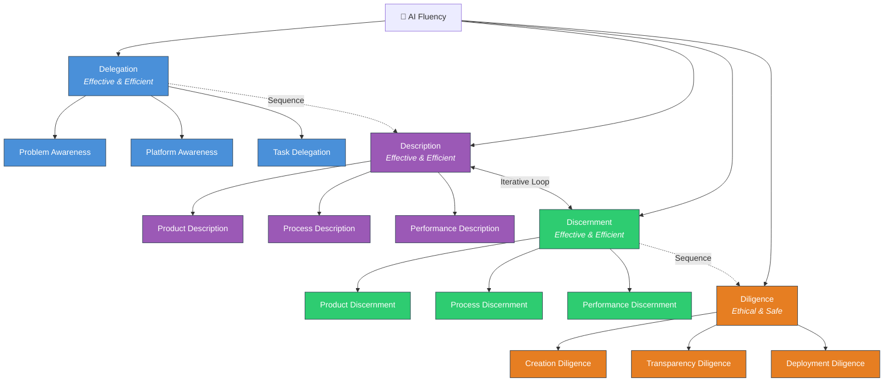
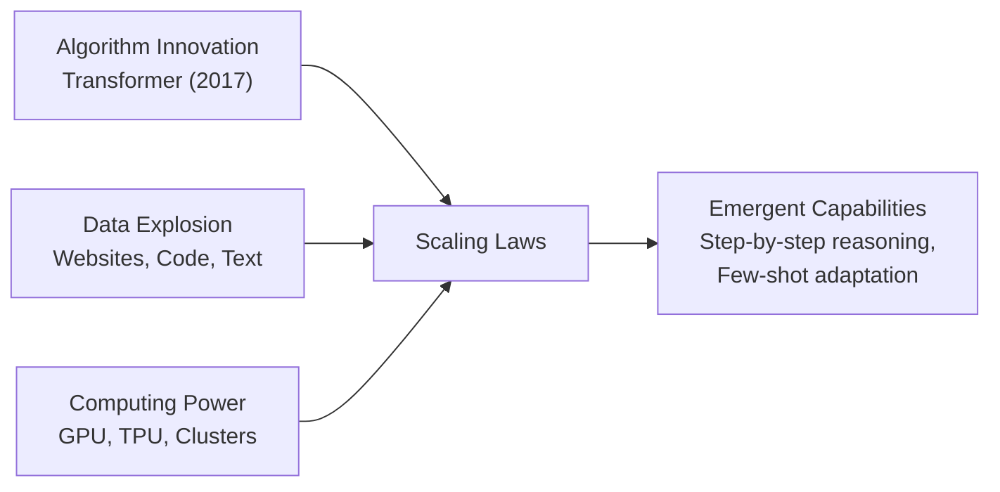
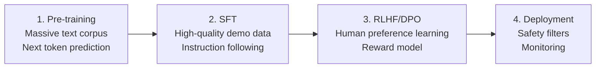
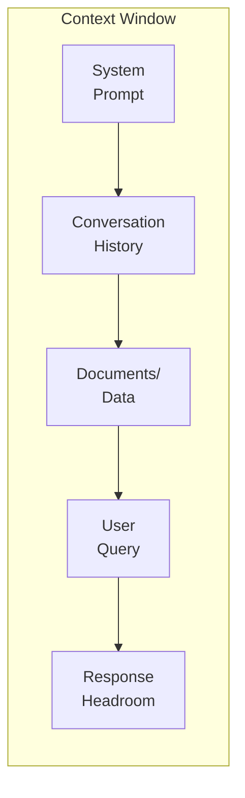
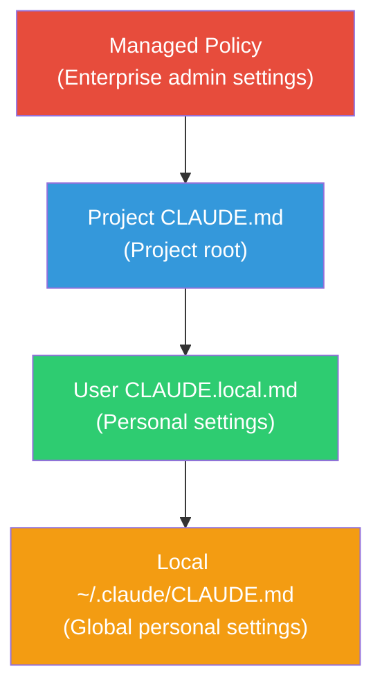

# Week 1: AI Utilization Strategy & Prompt Engineering

---

## 📌 Lecture Focus

- AI utilization strategy through **AI Fluency** and the 4D Framework
- Understanding how AI works and its limitations → leading to better prompts
- **6 Core Prompt Engineering Techniques** (with Architectural Engineering domain examples)
- **Prompt Engineering in Claude Code** — CLAUDE.md, slash commands, shortcuts

---

## 🎯 Learning Objectives

After completing this lesson, you will be able to:

- Strategically analyze AI utilization tasks using the 4D Framework
- Explain AI's strengths and limitations, and design prompts that account for those limitations
- Apply 6 prompting techniques to progressively improve architectural engineering prompts
- Understand and use Claude Code's basic commands and the CLAUDE.md concept

---

## [Chapter 1] AI Utilization Strategy — 4D Framework

### 1.1 What is AI Fluency?

> [!tip] AI Fluency = The ability to interact with AI systems **Effectively**, **Efficiently**, **Ethically**, and **Safely**

Approach AI not as a simple tool, but as a **problem-solving partner**. Rather than chasing trending prompt tips, we need a **fundamental framework** that remains valid even as technologies change.

**What we expect from this course:**
1. A framework to guide AI interactions
2. Confidence in deciding when and how to use AI
3. Practical skills for human-AI collaboration
4. Ability to evaluate and take responsibility for collaboration outcomes

> [!ref] Source: [Anthropic AI Fluency Course](https://www.anthropic.com/ai-fluency) — Lessons 1, 2A, 2B

### 1.2 4D Framework


*The 4D Framework: Delegation, Description, Discernment, Diligence*

| Competency | Key Question | Focus | Architectural Engineering Example | General Example |
|---|---|---|---|---|
| **Delegation** | When and how should I use AI? | Effective & Efficient | Delegate structural calculation draft review to AI; final judgment by licensed structural engineer | Delegate report drafting to AI; final review by yourself |
| **Description** | How do I communicate clearly with AI? | Effective & Efficient | "Design a column" → Specify design conditions, applicable standards, and output format | When calculating GPA, specify grading scale (4.5 max), credit hours, and grade levels |
| **Discernment** | How do I evaluate AI output? | Effective & Efficient | Verify that AI-calculated rebar amount satisfies KDS minimum/maximum reinforcement ratios | Cross-verify AI-calculated GPA with spreadsheet or manual calculation |
| **Diligence** | How do I take responsibility for AI use? | Ethical & Safe | Structural engineer verification is mandatory for AI-generated structural review reports | Clearly state that AI-assisted analysis was used in the report |



> [!finding] Description ↔ Discernment Iterative Loop
> If Description is about conveying your needs, Discernment is about evaluating whether those needs were met. When Discernment identifies a problem → a better Description is the solution.

> [!question] Key Questions for Delegation
> Questions to ask yourself before using AI:
> - What exactly am I trying to achieve?
> - What does success look like?
> - Which areas are simple but time-consuming? (→ Automation)
> - Which areas involve uncertainty and need a thinking partner? (→ Augmentation)
> - Which areas require critical judgment? (→ Human only)

> [!finding] The most effective AI collaborators are domain experts first, and AI delegators second.

### 1.3 Three Modes of AI Interaction


*Three ways to interact with AI: Automation, Augmentation, Agency*

| Mode | Description | Architectural Engineering Example | General Example |
|---|---|---|---|
| **Automation** | AI performs a specific task as instructed | Auto-summarize specifications, generate quantity takeoff sheets | Auto-classify emails, convert document formats |
| **Augmentation** | Human and AI collaborate together | Explore structural design alternatives, discuss seismic performance analysis | Co-develop essay structure, discuss data interpretation |
| **Agency** | AI acts independently | Auto-fix code, document classification agent | Auto-refactor code, file organization agent |

> [!tip] Augmentation and Agency often leverage AI's unique capabilities most effectively and produce the best results.

### 1.4 4D × 3-Mode Matrix

|                 | Automation | Augmentation | Agency |
|---|---|---|---|
| **Delegation**  | Define clear tasks | Identify collaboration areas | Set behavior patterns |
| **Description** | Specific instructions | Context-rich conversation | Define knowledge/behavior rules |
| **Discernment** | Verify deliverables | Evaluate collaboration process | Monitor autonomous actions |
| **Diligence**   | Output accountability | Co-creation transparency | Agent behavior accountability |

#### How to Use the Matrix

This matrix is a tool for **systematically developing** AI utilization strategies. Each cell shows how to exercise a specific competency (row) in a specific interaction mode (column).

- **Read horizontally (by mode)**: Check whether all 4Ds are considered for a given AI usage mode. For example, when using Automation for quantity estimation, you need to clearly define the task (Delegation), write specific instructions (Description), verify results (Discernment), and take responsibility for the output (Diligence).
- **Read vertically (by competency)**: Understand how one D varies across modes. For example, Description in Automation is "specific instructions" (clear I/O definitions), while in Augmentation it becomes "context-rich conversation" (sharing background knowledge, expressing uncertainty).

**Usage Scenario** — Calculating GPA for a semester assignment:
1. Mode selection: Simple calculation → **Automation**; grade analysis/interpretation → **Augmentation**
2. Check the 4Ds in order for each column:
   - Delegation: AI applies the GPA formula; you verify academic probation criteria
   - Description: Specify grading scale (4.5 max), credit hours per course, and grades
   - Discernment: Cross-verify the calculated GPA with manual calculation
   - Diligence: Note that AI-assisted calculation was used

> [!tip] Matrix Usage Strategy
> When a new AI task arises, map it onto this matrix:
> 1. Decide which **mode** is appropriate (Automation? Augmentation? Agency?)
> 2. Check the **4 rows** in that column from top to bottom
> 3. If any item is missing → that could be a risk factor

---

## [Chapter 2] Principles, Mechanisms, and Limitations of AI

### 2.1 What is Generative AI?

- **Traditional AI** (classification): Classifies emails as spam/not spam
- **Generative AI** (generation): Creates new emails, code, and reports

Generative AI doesn't retrieve answers from a database—it **generates new text based on statistical patterns**.

### 2.2 Three Pillars That Made LLMs Possible


*Three pillars that made AI possible: Algorithms, Data, Computation*



### 2.3 Training Process

#### Core Principle of Transformers

The **Transformer** is an architecture proposed in the "Attention Is All You Need" (2017) paper. The key is the **Self-Attention** mechanism, where each word in a sentence simultaneously calculates its relevance to every other word. For example, in "I withdrew money from the bank," Self-Attention helps determine that "bank" refers to a financial institution by attending to "money" and "withdrew." Unlike previous RNN/LSTM models that processed words sequentially, Transformers reference all positions simultaneously, enabling **parallel processing** and better capturing of **long-range dependencies**.

> [!ref] Transformer Visualization Tool
> [Transformer Explainer](https://poloclub.github.io/transformer-explainer/) — Interactively experience how Self-Attention works in your browser.

#### Modern LLM Training Pipeline (4 Stages)

| Stage | Content | Key Aspect |
|---|---|---|
| **1. Pre-training** | "Next token prediction" learning on trillions of tokens | Acquires language structure, world knowledge, reasoning patterns |
| **2. Supervised Fine-tuning (SFT)** | Learning from expert-written high-quality demonstration data | Learns to follow instructions and respond in useful formats |
| **3. RLHF / DPO** | Reward model training via human feedback → reinforcing preferred responses | Suppressing harmful output, generating responses aligned with human preferences |
| **4. Deployment + Safety** | Safety filters, monitoring, incorporating user feedback | Continuous improvement in production environments |



> [!ref] References
> - RLHF detailed explanation: [HuggingFace RLHF Blog](https://huggingface.co/blog/rlhf)
> - InstructGPT paper: [Training language models to follow instructions (2022)](https://arxiv.org/abs/2203.02155)
> - Transformer original paper: [Attention Is All You Need (2017)](https://arxiv.org/abs/1706.03762)

### 2.4 Key Characteristic: Context Window

The **Context Window** is AI's working memory — the maximum number of tokens that can be processed at once, including the prompt + response + shared information.



**Context Windows by Major Model** (as of 2026):

| Model | Context Window | Output Tokens | Key Features |
|---|---|---|---|
| **Claude 4.6 Opus** | 200K | 32,000 | Best reasoning, complex analysis, coding |
| **Claude 4.6 Sonnet** | 200K | 16,384 | Balanced performance, fast responses |
| **Claude 4.5 Haiku** | 200K | 8,192 | Lightweight, low-cost, fast processing |
| **GPT-4o** | 128K | 16,384 | Multimodal, broad ecosystem |
| **GPT-4.1** | 1M | 32,768 | Large context, strict format compliance |
| **o3** | 200K | 100K | Reasoning-specialized, strong in math & coding |
| **Gemini 2.5 Pro** | 1M (→2M) | 65,536 | Ultra-large context, multimodal |
| **Gemini 2.5 Flash** | 1M | 65,536 | Lightweight, fast reasoning |

**Model Characteristics Summary**:
- **Claude 4.6 Opus**: Most powerful reasoning ability. Optimal for complex code analysis, lengthy academic text processing, and multi-step logic problems. Higher cost but superior quality.
- **Claude 4.6 Sonnet**: Balance of speed and quality. Most commonly used for everyday coding, document writing, and analysis tasks. Default model for Claude Code.
- **Claude 4.5 Haiku**: Suited for quick-response simple tasks, batch processing, and real-time chatbots. Cost-effective.
- **GPT-4o**: OpenAI's flagship model. Supports image/voice I/O with an extensive plugin/API ecosystem.
- **GPT-4.1**: Analyze large codebases with 1M token context. High compliance rate for structured outputs (JSON, etc.).
- **o3**: Outstanding reasoning performance on math, science, and coding problems. Uses "thinking time" to solve complex problems.
- **Gemini 2.5 Pro**: Google's latest model. Up to 2M token context (preview). Multimodal (text, image, video, audio).
- **Gemini 2.5 Flash**: Lightweight version of Gemini Pro. Fast reasoning and large context at lower cost.

> [!tip] Model Selection Guide
> - **Complex analysis & design review**: Claude Opus, o3 — When accurate reasoning is key
> - **Everyday coding & document writing**: Claude Sonnet, GPT-4o — Balance of speed and quality
> - **Large-scale document processing**: GPT-4.1, Gemini Pro — Leverage 1M+ token context
> - **Fast iterative tasks & chatbots**: Claude Haiku, Gemini Flash — Low-cost, fast response
> - **Multimodal (image/video analysis)**: GPT-4o, Gemini Pro — Support for diverse input formats

### 2.5 AI Strengths

- **Language capabilities**: Report writing, summarization, translation, explaining complex topics
- **Task switching**: Poetry writing → structural calculation → business analysis (no additional training needed)
- **Conversation context retention**: Remembers and utilizes previous conversation content
- **External tool integration**: Web search, file processing, code execution

### 2.6 AI Limitations

| Limitation | Description | Impact on Architectural Engineering | General Impact |
|---|---|---|---|
| **Knowledge Cutoff** | No information after training data cutoff | May not reflect latest KDS revisions | Cannot reflect recent news or new regulations |
| **Hallucination** | Confidently states plausible but inaccurate information | Cites nonexistent standard provisions | Fabricated references, incorrect statistics |
| **Context Window Limit** | Limited amount of information processable at once | Cannot process entire large calculation sheets | Forgets earlier parts of long reports in later sections |
| **Non-determinism** | Different answers to the same question | Different results when recalculating under identical conditions | Different answer format/content each time for the same question |
| **Complex Reasoning** | Weakness in multi-step math/logic problems | Possible errors in complex load combination calculations | Errors in weighted GPA calculation, compound interest calculation |

### 2.7 Human-AI Complementarity

> [!tip] Complementarity Principle
> - **Human**: Critical thinking, judgment, creativity, ethical oversight, domain expertise
> - **AI**: Speed, scale, pattern recognition, massive information processing, repetitive tasks

> [!finding] Bridge
> Understanding these limitations → leads to **better prompt strategies** that compensate for them.

---

## [Chapter 3] Prompt Engineering Strategies

> [!ref] Source: [AI Fluency L7](https://www.anthropic.com/ai-fluency)

### 6 Core Techniques — Demonstrated with RC Column Design Review

> **Running Problem**: 10-story office building RC column — Design axial force 3,000kN, Design moment 200kN·m, Story height 4.0m, fck=27MPa, fy=400MPa


*Foundational prompting tips: 6 Core Prompting Techniques*

### 3.1 Give Context

**Before** — Request without context:
```
Design an RC column
```

**After** — Context-rich request:
```
Design a 1st-floor RC column for a 10-story office building.

Building Information:
- Structural system: Reinforced concrete moment frame
- Seismic design category: Special (SDC D)
- Applicable standard: KDS 14 20 00 (Concrete Structure Design Code)

Design Conditions:
- Design axial force (Pu): 3,000 kN
- Design moment (Mu): 200 kN·m
- Story height: 4.0 m
- Concrete compressive strength (fck): 27 MPa
- Rebar yield strength (fy): 400 MPa
```

> [!example] General Example — GPA Calculation
> **Before**: `Calculate my GPA`
> **After**:
> ```
> Calculate my Spring 2025 semester GPA.
>
> Grading scale: 4.5 maximum
> Grade points: A+(4.5), A(4.0), B+(3.5), B(3.0), C+(2.5), C(2.0), D+(1.5), D(1.0), F(0.0)
>
> Courses and grades:
> - Structural Mechanics (3 credits): A+
> - Architectural Planning (3 credits): B+
> - Programming (2 credits): A
> - English Conversation (2 credits): B
> ```

### 3.2 Show Examples (Few-shot Prompting)

Few-shot prompting — Include similar result examples to show the desired output format:

```
Classify structural members in architecture.

Example 1:
Input: H300x150x6.5x9
Classification: H-beam, height 300mm, width 150mm, web 6.5mm, flange 9mm

Example 2:
Input: C200x80x7.5x11
Classification: C-channel, height 200mm, width 80mm, web 7.5mm, flange 11mm

Input: W400x200x8x13
Classification:
```

> [!tip] Try without examples first, then add examples when you need a specific style/format.

> [!example] General Example — GPA Calculation Result Format
> ```
> Show the GPA calculation results in the following format.
>
> Example:
> | Course | Credits | Grade | Points | Credits × Points |
> |---|---|---|---|---|
> | Calculus | 3 | A+ | 4.5 | 13.5 |
> | Physics | 3 | B+ | 3.5 | 10.5 |
> | **Total** | **6** | | | **24.0** |
> | **GPA** | | | | **4.00** |
> ```

### 3.3 Specify Output Constraints

Explicitly specify format, length, units, standard provisions, etc.:

```
Present the RC column design results in the following format:

1. Applicable standard: Specify KDS clause numbers
2. Results table:
| Review Item | Standard Value | Applied Value | Pass/Fail | Remarks |
3. Include units for all numerical values (kN, mm, MPa)
4. Explicitly state any uncertain assumptions
```

> [!example] General Example — GPA Output Constraints
> ```
> Present the GPA calculation results in the following format:
> 1. Detailed table by course (table format)
> 2. Display GPA to 2 decimal places
> 3. Include academic probation determination (warning if GPA < 1.75)
> 4. Show the Credits × Points calculation process for each course
> ```

### 3.4 Break into Steps (Chain-of-Thought)

Chain-of-Thought (CoT) — Break complex problems into steps:

```
Design an RC column with the following conditions.

Conditions:
- Design axial force: 3,000kN
- Design moment: 200kN·m
- Story height: 4.0m
- fck: 27MPa, fy: 400MPa

Perform step by step:
Step 1: Assume expected cross-section size
Step 2: Slenderness ratio check
Step 3: Calculate required reinforcement
Step 4: Determine reinforcement details
Step 5: Strength verification

Show the calculation process and results for each step.
```

> [!example] General Example — GPA Step-by-Step Breakdown
> ```
> Calculate GPA from the following grade data.
> [Grade data...]
>
> Perform step by step:
> Step 1: Convert each course's raw score to a letter grade
> Step 2: Convert letter grades to grade points (4.5 max scale)
> Step 3: Calculate Credits × Points for each course
> Step 4: Total Credits×Points ÷ Total Credits = GPA
> Step 5: Determine academic probation (GPA < 1.75)
>
> Show the calculation process for each step.
> ```

### 3.5 Ask to Think First

Explicitly request "think before answering":

```
Before answering, please consider the following first:
- Slenderness ratio limits (KDS 14 20 00)
- Minimum/maximum reinforcement ratios (ρmin = 0.01, ρmax = 0.08)
- Cover thickness and spacing constraints for reinforcement detailing
- Interaction between axial force and moment

Proceed with the design only after fully considering these conditions.
```

> [!method] Key: It is important to make the AI **think before acting**. This is different from explaining after the fact.

> [!example] General Example — Considerations Before GPA Calculation
> ```
> Before answering, please consider the following first:
> - Are F-grade courses included in GPA calculation?
> - How are retaken courses handled? (Replace original grade? Average?)
> - Are summer/winter session courses included?
> - Are Pass/Fail courses excluded from GPA?
>
> Confirm these conditions before proceeding with the calculation.
> ```

### 3.6 Define Role/Style/Tone

Define AI's role with a system prompt:

```
You are an AI structural engineering specialist.

## Role
- Structural review per Korean Design Standard (KDS 41)
- Seismic design and load combination analysis
- Member cross-section design and verification

## Response Rules
1. Specify applicable standard clause numbers for all calculations (e.g., KDS 41 17 00)
2. Always include units (kN, mm, MPa)
3. Explicitly state assumptions when uncertain
4. Follow conservative design principles

## Output Format
- Calculation process: Step-by-step detailed explanation
- Results: Organized in table format
- Review comments: Pass/fail determination against standards
```

> [!example] General Example — GPA Calculation Role Definition
> ```
> You are a university academic management AI assistant.
>
> ## Role
> - Grade data analysis and GPA calculation
> - Apply academic probation/dismissal criteria
> - Check graduation requirement fulfillment
>
> ## Response Rules
> 1. Display GPA to 2 decimal places
> 2. Specify grading scale (4.5 maximum)
> 3. State handling method for retakes and F grades
> 4. Automatically determine academic probation (GPA < 1.75)
> ```

### 3.7 Evolution of Structured Prompts — Self-Correction Loop

**Stage 1: Basic Structured Prompt** (Role + Task + Problem Definition + Output Format)

```
# Role:
You are an expert in structural engineering and finite element analysis (FEA).

# Task:
Analyze the parameters of a cantilever beam problem and output results in JSON.

# Problem Definition:
- Length (L): 2.0 m, Cross-section: 0.1m × 0.1m
- Elastic modulus (E): 210 GPa, Load (P): 100 kN (at free end)

# Output Format:
JSON — Keys: "deflection(mm)", "max_bending_stress(MPa)"
```

**Stage 2: Add Verification Loop** (Self-Correction Loop)

```
# Workflow:
[Step 1: Problem Analysis] Accurately identify all parameters
[Step 2: Initial Calculation] Calculate using standard mechanics of materials formulas
[Step 3: Logic Verification and Error Correction (Self-Correction)]
  - Formula check: δ = PL³/3EI, σ = Mc/I
  - Unit conversion verification: GPa→Pa, kN→N, m→mm
  - Numerical computation verification: Re-perform all arithmetic operations
  → Immediately correct any errors found
[Step 4: Final Output Generation] Output only verified results
```

> [!finding] Key Insight
> Adding a verification loop (Self-Correction Loop) can reduce AI's mathematical errors such as unit conversion mistakes and formula errors. This is a prompt strategy to compensate for the "complex reasoning" limitation discussed in Chapter 2.

### 3.8 Secret Weapon: Ask AI to Improve Your Prompt

```
I want to ask AI to review an RC column design.
I'm not sure how to write the best prompt for optimal results.
Can you help me create an effective prompt?
```

> [!tip] AI itself is a prompt expert. When stuck, ask AI for help.

### 3.9 Four Common Mistakes

1. **Assuming AI can read your mind** — Without explicit context, you'll only get generic answers
2. **Overloading a single prompt with multiple unrelated tasks** — One task at a time
3. **Describing success too vaguely** — Provide specific output formats and criteria
4. **Not providing feedback on previous responses** — Utilize the Description ↔ Discernment iterative loop

---

## [Chapter 4] Prompt Engineering in Claude Code

> [!ref] Source: [Claude Code in Action](https://anthropic.skilljar.com/claude-code-in-action) (Lessons 6-9)

### 4.0 Claude Code Installation Guide

#### Windows Installation

**Prerequisites**: [Git for Windows](https://gitforwindows.org/) must be installed — Claude Code internally uses Git Bash.

**Installation command** (run in PowerShell):
```powershell
irm https://claude.ai/install.ps1 | iex
```

**Windows Troubleshooting**:
- If Git Bash is not in PATH, installation will fail → Install Git for Windows and retry
- For SSL/TLS errors: Run `[Net.ServicePointManager]::SecurityProtocol = [Net.SecurityProtocolType]::Tls12` in Administrator PowerShell

**Verify installation**:
```bash
claude --version
claude doctor    # Environment diagnostics
```

#### macOS Installation

**Prerequisites**: macOS 13.0 or later

**Method A** (Recommended — auto-updates):
```bash
curl -fsSL https://claude.ai/install.sh | bash
```

**Method B** (Homebrew):
```bash
brew install --cask claude-code
```

#### VS Code Extension Installation

Search for "Claude Code" in the Extensions marketplace (publisher: Anthropic), or install directly:
```
vscode:extension/anthropic.claude-code
```

**Key features**: Inline diff display, `@file` mentions for adding context, Plan mode review, conversation history management

> [!ref] VS Code extension docs: [Claude Code for VS Code](https://code.claude.com/docs/en/vs-code)

#### Antigravity (Google) — Reference

Google's agent-based development IDE. Based on Gemini models, it supports AI autocomplete, natural language code commands, and browser automation. Currently free to use and can be used alongside Claude Code.

#### Account Requirements

Using Claude Code requires one of the following accounts:
- **Claude Pro / Max** (personal subscription)
- **Claude Teams / Enterprise** (team/enterprise subscription)
- **Anthropic Console** (API key-based)

> [!action] Claude Code cannot be used with a free Claude.ai account.

> [!ref] Installation Documentation
> - [Claude Code Overview](https://code.claude.com/docs/en/overview)
> - [Installation Guide](https://code.claude.com/docs/en/setup)

---

### 4.1 Core Concept: CLAUDE.md = Persistent Prompt Engineering

> [!finding] CLAUDE.md serves as **project memory** for Claude Code.
> When well-written, you don't need to repeatedly explain context each time, and you can maintain a consistent coding style.

The 6 techniques from Chapter 3 directly map to CLAUDE.md:

| Prompt Technique | CLAUDE.md Mapping |
|---|---|
| Give context | Project structure, tech stack, architecture description |
| Show examples | Code snippets, pattern examples |
| Specify output constraints | Coding conventions, file naming rules |
| Break into steps | Workflow, verification procedures |
| Ask to think first | "Analyze existing code before making changes" rule |
| Define role | Project domain, expert role definition |

### 4.2 CLAUDE.md Overview

**`/init` command**: Analyzes the codebase and auto-generates a `CLAUDE.md` (including purpose, architecture, commands, and patterns).

| CLAUDE.md Type | Purpose | Shared? |
|---|---|---|
| `CLAUDE.md` | Generated with `/init`, committed to source control | Team-shared |
| `CLAUDE.local.md` | Personal instructions | Not shared |
| `~/.claude/CLAUDE.md` | Applied to all projects | Personal global |

#### How It Works

CLAUDE.md is **context, not enforced configuration**. It is injected as a user message after the system prompt at session start, and Claude references it to guide its behavior. The more specific and verifiable the instructions, the higher the compliance rate.

**Loading Mechanism**:
1. **Traverses the directory tree upward** from the project root, loading all CLAUDE.md files
2. CLAUDE.md in subdirectories is **loaded on-demand** when those files are accessed
3. `~/.claude/CLAUDE.md` (global) is always loaded

#### Hierarchy



#### Best Practices

- Keep it **under 200 lines** — Too long wastes context and reduces compliance
- **Specific, verifiable instructions**: "Write good code" ✗ → "Include units in variable names (e.g., `force_kN`)" ✓
- Use **`@import`**: Split into separate files for easier management
- **Remove unnecessary content**: Generic instructions unrelated to the project are ineffective

> [!ref] Reference Documentation
> - [Claude Code Memory](https://code.claude.com/docs/en/memory)
> - [Claude Code Best Practices](https://code.claude.com/docs/en/best-practices)

### 4.3 `#` Memory Mode

**Automatically merges** instructions into CLAUDE.md. Starting a prompt with `#` saves it to CLAUDE.md:

```
# Design according to KDS 14 20 00 standards
# Always include units in all calculations
```

### 4.4 `@` File Mentions

Directly include relevant file context in your prompt:

```
@requirements.txt Install the dependencies from this file
```

### 4.5 Key Slash Commands

| Command | Function |
|---|---|
| `/help` | Display help |
| `/clear` | Completely reset conversation |
| `/compact` | Summarize conversation (preserving key information) |
| `/context` | Show context usage, token statistics, MCP tools, memory files, skill list |
| `/init` | Auto-generate CLAUDE.md |
| `/model` | Change model (e.g., sonnet → opus) |
| `/resume` | Continue from a previous conversation |
| `/review` | Code review of recent changes |
| `/fast` | Toggle fast mode (same model, faster output speed) |

> [!tip] `/context` Details
> Get a quick overview of the current session state:
> - **Context usage**: Percentage of total context window used (%)
> - **Tokens by category**: Token count for system prompt, conversation, tool results, etc.
> - **MCP tools**: Connected MCP servers and available tool list
> - **Memory files**: Loaded CLAUDE.md and memory file paths
> - **Skills**: List of available slash commands (skills)
> - As sessions get longer, context usage increases → Recommend compressing with `/compact`

### 4.6 Keyboard Shortcuts

| Shortcut | Action | When to Use |
|---|---|---|
| `Escape` ×1 | Stop Claude, redirect | When heading in the wrong direction |
| `Escape` ×2 | Rewind conversation (return to previous point) | Remove unnecessary history |
| `Shift+Tab` ×2 | Activate Planning Mode | Understanding large codebases, multi-step implementation |
| `Ctrl+V` | Paste screenshot | Error screens, UI references |

### 4.7 Thinking Modes

Control thinking depth by including keywords in your prompt:

| Level | Keyword | Suitable Situation |
|---|---|---|
| 1 | Think | Simple questions |
| 2 | Think more | Medium difficulty |
| 3 | Think a lot | Complex logic |
| 4 | Think longer | Debugging |
| 5 | Ultrathink | Algorithms, architecture design |

### 4.8 Plan Mode

Enter **Plan Mode** with `Shift+Tab` ×2 (see §4.6 Keyboard Shortcuts). In Plan Mode, Claude only **creates plans** without directly modifying code.

**When to use**:
- When you need to understand a large codebase
- When establishing multi-step implementation strategies
- When you want to analyze the scope of impact before making changes

**Workflow**: Review Claude's proposed plan in Plan Mode → Approve → Switch to execution mode for actual code modifications

### 4.9 Permission Modes

Claude Code provides 3 levels of **permission confirmation** for file modifications and command execution:

| Mode | File Modification | Command Execution | Suitable Situation |
|---|---|---|---|
| **Ask** (default) | Confirm every time | Confirm every time | Safety first, beginners |
| **Auto-accept** | Auto-allow | Confirm (dangerous commands only) | Familiar projects, high trust |
| **Yolo** | All auto | All auto | Experimentation/learning, throwaway projects |

- **Ask Mode**: Default mode. Requests approval before all file modifications and command executions.
- **Auto-accept Mode**: Auto-allows read/write/command execution, but confirms dangerous commands (deletions, etc.).
- **Yolo Mode** (`--dangerously-skip-permissions`): Auto-allows all permissions. Suitable for learning/experimentation.

> [!action] In class, use **Ask Mode** (default). Confirming each action as you go helps you better understand how Claude Code operates.

### 4.10 Custom Commands

Create **custom slash commands** tailored to your project to automate repetitive tasks.

#### File Structure

Create **plain markdown files** (.md) in the `.claude/commands/` folder. The filename becomes the command name:

```
project/
├── .claude/
│   └── commands/
│       ├── review.md      → Called with /review
│       ├── kds-check.md   → Called with /kds-check
│       └── gpa-check.md   → Called with /gpa-check
└── ...
```

Command files are written as markdown body only, without YAML frontmatter:

```markdown
Please review the following file: $ARGUMENTS

## Review Criteria
- Code quality and readability
- Potential bugs
- Performance issues
```

How to call: Enter `/review src/main.py` in Claude Code → `$ARGUMENTS` is replaced with `src/main.py`.

#### Passing Arguments

Use the `$ARGUMENTS` placeholder to pass arguments when calling a command:

```
/review src/main.py
```
→ `$ARGUMENTS` in the file content is substituted with `src/main.py` and passed to Claude

#### Project vs User Scope

| Location | Scope | Sharing |
|---|---|---|
| `.claude/commands/` (project) | Only in that project | Shared with team (Git commit) |
| `~/.claude/commands/` (user) | Across all projects | Personal only |

#### Examples

**1. Code Review** (`.claude/commands/review.md`):
```markdown
Review the code in the $ARGUMENTS file.

Review items:
- Bug potential
- Performance issues
- Readability and structure
- Suggest improvements
```

**2. KDS Standard Check** (`.claude/commands/kds-check.md`):
```markdown
Review the following design results against KDS standards:
$ARGUMENTS

Review items: Minimum/maximum reinforcement ratio, slenderness ratio, cover thickness, spacing limits
```

**3. GPA Check** (`.claude/commands/gpa-check.md`):
```markdown
Review the GPA from the following grade data:
$ARGUMENTS

Review items: 4.5 max grading scale, weighted average calculation, academic probation determination (GPA < 1.75)
```

> [!tip] In the future, Custom Commands will evolve into a **Skills system** supporting advanced features like tool restrictions and automation (covered in later weeks).

> [!ref] Reference: [Claude Code Slash Commands](https://code.claude.com/docs/en/slash-commands)

### 4.11 Architectural Engineering Project CLAUDE.md Example

```markdown
# Project: RC Structural Design Review Tool

## Tech Stack
- Python 3.12, FastAPI, Streamlit
- Design standards: KDS 14 20 00, KDS 41 17 00

## Coding Rules
- Comment applicable standard clause numbers on all structural calculation functions
- Use SI units (N, mm, MPa)
- Include units in variable names (e.g., force_kN, length_mm)

## Workflow
- When adding new features: Analyze existing code → Implement → Test → Verify
- When changing structural calculations: Must verify against KDS standard clauses
```

---

## 💻 Lab Exercises — Running Problem: "RC Column Design Review"

> [!method] All exercises address the **same running problem** from different perspectives.
> - **Architectural Engineering majors**: RC column design review
> - **Non-majors / Alternative**: GPA calculation and grade analysis (see [Alternative Problem] below)

**Running Problem A — RC Column Design Review** (Architectural Engineering):

**Running Problem Setup**:

| Item | Value |
|---|---|
| Building | 10-story office building |
| Member | 1st floor RC column |
| Design axial force (Pu) | 3,000 kN |
| Design moment (Mu) | 200 kN·m |
| Story height | 4.0 m |
| Concrete strength (fck) | 27 MPa |
| Rebar yield strength (fy) | 400 MPa |
| Applicable standard | KDS 14 20 00 |

**Running Problem B — GPA Calculation and Grade Analysis** (Non-major Alternative):

| Item | Value |
|---|---|
| Topic | University GPA calculation and analysis |
| Data | 5 students × 4 courses with scores + grades (A+~F) |
| Grading scale | 4.5 maximum |
| Goal | Course averages, student GPAs, rankings, academic probation check |
| Output format | Table format results + determination |
| **Verification method** | Immediately verifiable by hand calculation or Excel |

> [!finding] Why the GPA Running Problem Works Well
> - All students understand the grading system
> - Arithmetic results can be manually calculated to **immediately verify** AI output
> - Quality differences are clearly visible when applying prompting techniques ("Calculate GPA" vs a prompt specifying grading scale, courses, and weights)
> - Naturally connects to Python programming in Claude Code exercises

**Sample Data for GPA Calculation**:

| Student | Structural Mechanics (3 cr.) | Architectural Planning (3 cr.) | Programming (2 cr.) | English (2 cr.) |
|---|---|---|---|---|
| Kim Cheolsu | A+ | B+ | A | B |
| Lee Younghee | B | A | A+ | A+ |
| Park Minsu | C+ | B | B+ | A |
| Jung Sujin | A | A+ | B | B+ |
| Choi Donghyun | D+ | C | F | C+ |

**Answers (for verification)**: GPA = Σ(Credits × Points) ÷ Σ(Credits)
- Kim Cheolsu: (3×4.5 + 3×3.5 + 2×4.0 + 2×3.0) ÷ 10 = 38.0 ÷ 10 = **3.80**
- Lee Younghee: (3×3.0 + 3×4.0 + 2×4.5 + 2×4.5) ÷ 10 = 39.0 ÷ 10 = **3.90**
- Park Minsu: (3×2.5 + 3×3.0 + 2×3.5 + 2×4.0) ÷ 10 = 31.5 ÷ 10 = **3.15**
- Jung Sujin: (3×4.0 + 3×4.5 + 2×3.0 + 2×3.5) ÷ 10 = 38.5 ÷ 10 = **3.85**
- Choi Donghyun: (3×1.5 + 3×2.0 + 2×0.0 + 2×2.5) ÷ 10 = 15.5 ÷ 10 = **1.55** → Academic Probation!

| Order | Exercise Content | Time | Link |
|---|---|---|---|
| 1 | **4D Analysis**: Analyze RC column design review using 4D Framework | 20 min | Ch.1 |
| 2 | **Experience AI Limitations**: Submit the same problem to 3 platforms and find hallucinations/errors | 20 min | Ch.2 |
| 3 | **6-Step Prompt Improvement**: Apply 6 techniques one by one for progressive improvement | 30 min | Ch.3 |
| 4 | **First Claude Code Experience**: Install CC → CLAUDE.md → Solve RC column problem | 40 min | Ch.4 |
| 5 | **Secret Weapon**: Ask AI to "improve" your best prompt | 10 min | Integrated |

### Exercise 1: 4D Analysis (20 min) → Ch.1

Analyze the RC column design review task using the 4D Framework:

| 4D | Question | Your Answer |
|---|---|---|
| **Delegation** | What parts of this task can be delegated to AI? What judgments must only humans make? | |
| **Description** | What context and conditions should you provide to AI? | |
| **Discernment** | What criteria will you use to verify AI results? | |
| **Diligence** | How will you transparently disclose AI usage? | |

> [!tip] Think specifically about each D
> - **Delegation**: Cross-section assumption, rebar amount calculation → Delegable to AI? / Final safety determination → Human only?
> - **Description**: Design conditions (axial force, moment), applicable standards (KDS), output format (table), etc.
> - **Discernment**: Verification criteria such as KDS min/max reinforcement ratio, slenderness limits, etc.
> - **Diligence**: Notations such as "AI-assisted design, licensed structural engineer final verification"

**Submission**: Submit your completed 4D analysis table. Write **at least 2 sentences** for each item.

> [!example] [Alternative Problem] Analyze GPA Calculation with 4D
> Analyze the GPA calculation task above using the 4D Framework:
>
> | 4D | Question | Your Answer |
> |---|---|---|
> | **Delegation** | What parts of GPA calculation can be delegated to AI? What should you verify yourself? | |
> | **Description** | What information should you provide to AI? (grading scale, course info, etc.) | |
> | **Discernment** | How will you verify AI results? (manual calculation, Excel, etc.) | |
> | **Diligence** | How will you disclose AI usage? | |

### Exercise 2: Experience AI Limitations (20 min) → Ch.2

Submit the same RC column problem to **Claude, GPT, and Gemini** and observe the limitations.

**Prompt** (input identically to all three platforms):
```
Design an RC column with the following conditions:
Design axial force 3,000kN, Design moment 200kN·m,
Story height 4.0m, fck=27MPa, fy=400MPa
```

**Checklist**:
- [ ] Hallucination: Cites nonexistent standard provisions?
- [ ] Calculation errors: Is the rebar amount and strength calculation accurate?
- [ ] Standard confusion: Is the applied design standard correct? (KDS vs ACI vs EC2)
- [ ] Non-determinism: Ask the same question twice—do you get different answers?
- [ ] Unit confusion: Are SI units used consistently?

**Comparison Table**:

| Observation Item | Claude | GPT | Gemini |
|---|---|---|---|
| Applied standard | | | |
| Assumed cross-section size | | | |
| Calculated rebar amount | | | |
| Calculation accuracy (0-5) | | | |
| Limitations/errors found | | | |

**Discussion Questions**:
1. Which platform gave the most accurate results? Why?
2. What limitations were commonly found across all platforms?
3. How can these limitations be **compensated through prompting**? (→ Links to Exercise 3)

**Submission**: Comparison table + discussion question answers. Attach **screenshots** of each platform's response.

> [!example] [Alternative Problem] Experience AI Limitations with GPA Calculation
> Submit the same GPA calculation request to **Claude, GPT, and Gemini**:
> ```
> Calculate the GPA for the following students:
> Kim Cheolsu: Structural Mechanics(3 cr.) A+, Architectural Planning(3 cr.) B+, Programming(2 cr.) A, English(2 cr.) B
> Lee Younghee: Structural Mechanics(3 cr.) B, Architectural Planning(3 cr.) A, Programming(2 cr.) A+, English(2 cr.) A+
> ```
> **Observation points**: Is the weighted average calculation accurate? What grading scale was assumed (4.3? 4.5?)? Do results match across the three platforms?

### Exercise 3: 6-Step Prompt Improvement (30 min) → Ch.3

Starting from "Design an RC column," apply the 6 techniques **one by one** for progressive improvement.

> [!method] How to proceed
> Use a single AI platform (Claude recommended) and go through all 6 steps sequentially. Start a **new conversation** for each step.

#### Step 0: Baseline (No techniques)

```
Design an RC column
```

#### Step 1: Give Context

Use the same prompt as Ch.3.1:

```
Design a 1st-floor RC column for a 10-story office building.

Building Information:
- Structural system: Reinforced concrete moment frame
- Seismic design category: Special (SDC D)
- Applicable standard: KDS 14 20 00 (Concrete Structure Design Code)

Design Conditions:
- Design axial force (Pu): 3,000 kN
- Design moment (Mu): 200 kN·m
- Story height: 4.0 m
- Concrete compressive strength (fck): 27 MPa
- Rebar yield strength (fy): 400 MPa
```

#### Step 2: Show Examples

**Add** the following to the Step 1 prompt:

```
Here is a similar design result for reference:

Example — 500x500 column (Pu=2,000kN, Mu=150kN·m):
- Cross-section: 500x500mm
- Main rebar: 8-D25 (evenly distributed)
- Ties: D10@200
- Reinforcement ratio: 2.03%
- Pu/φPn = 0.78, Mu/φMn = 0.65 → OK
```

#### Step 3: Specify Output Constraints

**Add** the following to the Step 2 prompt:

```
Present results in the following format:

1. Applicable standard: Specify KDS clause numbers
2. Results table:
| Review Item | Standard Value | Applied Value | Pass/Fail | Remarks |
3. Include units for all numerical values (kN, mm, MPa)
4. Explicitly state any uncertain assumptions
```

#### Step 4: Break into Steps

**Add** the following to the Step 3 prompt:

```
Perform step by step:
Step 1: Assume expected cross-section size
Step 2: Slenderness ratio check
Step 3: Calculate required reinforcement
Step 4: Determine reinforcement details
Step 5: Strength verification

Show the calculation process and results for each step.
```

#### Step 5: Ask to Think First

**Add** the following to the Step 4 prompt:

```
Before answering, please consider the following first:
- Slenderness ratio limits (KDS 14 20 00)
- Minimum/maximum reinforcement ratios (ρmin = 0.01, ρmax = 0.08)
- Cover thickness and spacing constraints for reinforcement detailing
- Interaction between axial force and moment

Proceed with the design only after fully considering these conditions.
```

#### Step 6: Define Role/Style/Tone

**Add** the following to the **beginning** of the Step 5 prompt:

```
You are an AI structural engineering specialist.

## Role
- Structural review per KDS 14 20 00 (Concrete Structure Design Code)
- Seismic design and load combination analysis
- Member cross-section design and verification

## Response Rules
1. Specify applicable standard clause numbers for all calculations
2. Always include units (kN, mm, MPa)
3. Explicitly state assumptions when uncertain
4. Follow conservative design principles
```

#### Results Record Table

| Step | Technique Applied | Added Content | Result Quality Change (Notes) |
|---|---|---|---|
| 0 | None | "Design an RC column" | |
| 1 | Give context | Building info, design conditions, applicable standards | |
| 2 | Show examples | Similar design result format | |
| 3 | Output constraints | KDS clause numbers + table format + units | |
| 4 | Break into steps | 5-step CoT | |
| 5 | Think first | Slenderness, min. rebar ratio, detailing constraints | |
| 6 | Define role | Structural engineer role system prompt | |

**Submission**: Submit prompts and AI response summaries for each step. Fill in the "Result Quality Change" column. Which step showed the **biggest quality improvement**? Why?

> [!example] [Alternative Problem] 6-Step GPA Calculation Prompt Improvement
> **Step 0** (baseline): `Calculate my GPA`
> **Step 1** (context): Specify grading scale (4.5 max), course names, credit hours, grades
> **Step 2** (examples): Include GPA result format example from §3.2
> **Step 3** (output constraints): Table format, 2 decimal places, include academic probation check
> **Step 4** (break into steps): Raw score → grade → points → weighted average → GPA sequence
> **Step 5** (think first): Consider F grade inclusion, retake handling, summer session treatment
> **Step 6** (define role): Assign "academic management AI assistant" role
>
> Observe how result accuracy changes at each step. Pay particular attention to when the **grading scale assumption** (4.3 vs 4.5) changes.

### Exercise 4: First Claude Code Experience (40 min) → Ch.4

#### Part A — Installation and Setup (15 min)

**A-1. Verify Claude Code Installation**

Run in terminal:

```bash
claude --version
```

> [!action] If not installed, refer to the installation guide in §4.0.
> - Windows: `irm https://claude.ai/install.ps1 | iex` (PowerShell)
> - macOS: `curl -fsSL https://claude.ai/install.sh | bash`

**A-2. Create Project Folder**

```bash
mkdir rc-column-review
cd rc-column-review
```

**A-3. Launch Claude Code and Authenticate**

```bash
claude
```

Follow the authentication process on first launch.

**A-4. Auto-generate CLAUDE.md**

Inside Claude Code:

```
/init
```

**A-5. Add Structural Expert Role to CLAUDE.md**

Use `#` memory mode to add instructions:

```
# This project is a structural design review tool. Apply KDS 14 20 00 standards.
# Always include units in all calculations (kN, mm, MPa)
# Follow conservative design principles
```

---

#### Part B — Solve the RC Column Problem (15 min)

**B-1. Input the Same Problem**

Enter the following prompt in Claude Code:

```
Design a 1st-floor RC column for a 10-story office building.

Design Conditions:
- Design axial force (Pu): 3,000 kN
- Design moment (Mu): 200 kN·m
- Story height: 4.0 m
- fck: 27 MPa, fy: 400 MPa
- Applicable standard: KDS 14 20 00

Perform step by step and organize results in table format.
```

**B-2. Check Context**

```
/context
```

**B-3. Result Review Checkpoint**

- [ ] Is the calculation process correct?
- [ ] Are CLAUDE.md instructions reflected? (unit notation, KDS standard, etc.)
- [ ] Try asking follow-up questions to refine the results.

---

#### Part C — Comparison (10 min)

**C-1.** Enter the **same prompt** as Part B on [Claude.ai](https://claude.ai).

**C-2. Comparison Table**

| Comparison Item | Claude Code | Claude.ai (Web) |
|---|---|---|
| KDS standard applied? | | |
| Unit notation consistency | | |
| Calculation accuracy (0~5) | | |
| Output format | | |
| CLAUDE.md context reflected | O / X | N/A |
| Key differences | | |

**C-3. Key Observations**

> [!question] Questions to Consider
> - What is the difference in results between Claude Code (with CLAUDE.md) and the web version (without)?
> - Which **Ch.3 prompt technique** does this difference correspond to?
> - How does CLAUDE.md replace the context that would otherwise need to be repeated in every conversation?

**Submission**: Part A process screenshots (including CLAUDE.md content) + Part B result screenshots + Part C comparison table and key observation answers (3 types of screenshots total)

> [!example] [Alternative Problem] Build a GPA Calculator with Claude Code
> In Part B, use the following prompt instead of the RC column problem:
> ```
> Build a GPA calculator in Python.
>
> Requirements:
> - 4.5 maximum grading scale (A+=4.5, A=4.0, ..., F=0.0)
> - Input grades for multiple students by course
> - Calculate GPA per student (weighted average)
> - Determine academic probation (GPA < 1.75)
> - Output results in table format
> ```
> Add `# This project is a GPA calculator. Uses a 4.5 maximum grading scale.` to CLAUDE.md.

### Exercise 5: Secret Weapon (10 min) → Integrated

Take the best prompt you completed in Exercise 3 and ask AI to **"improve it further"**, then compare before and after.

**Step 1: Prepare Your Best Prompt**

Copy the prompt completed in Exercise 3, Step 6.

**Step 2: Ask AI for Improvement**

Enter the following prompt:

```
I want to ask AI to review an RC column design.
Below is a prompt I created. Can you help me improve it for the best possible results?

---
[Paste your Exercise 3, Step 6 prompt here]
---

Explain the improvements and show me the complete improved prompt.
```

**Step 3: Test the Improved Prompt**

Enter the AI-suggested improved prompt in a **new conversation** and compare the results.

**Comparison Table**:

| Comparison Item | Before Improvement (Exercise 3, Step 6) | After Improvement (AI Suggestion) |
|---|---|---|
| Prompt length | | |
| Newly added elements | — | |
| Result accuracy (0~5) | | |
| Result detail level (0~5) | | |
| Key differences | | |

**Discussion Questions**:
1. What improvements did the AI suggest?
2. Which of the **6 techniques** do those improvements correspond to?
3. Which D in the 4D Framework does "asking AI to improve your prompt" correspond to?

**Submission**: Comparison table + discussion question answers + full text of prompts before and after improvement

> [!example] [Alternative Problem] GPA Prompt Improvement Request
> Ask AI to "improve" the completed GPA calculation prompt from Exercise 3 alternative.
> Observation point: What additional **edge cases** (retakes, P/F, summer sessions) does the AI suggest?

### Time Allocation Summary (2 hours 30 minutes)

| Category | Content | Time |
|---|---|---|
| Theory | Ch.1-4 Lecture | 30 min |
| Lab | Exercises 1-5 | 2 hours |

---

## 📝 Assignments

### Assignment 1: Prompt Design (Submission)

Develop an **optimal prompt** for analyzing a **document in your major/area of interest**.

> [!tip] Topic Examples
> - **Architectural Engineering**: Specifications, KDS design standards
> - **Business**: Financial statements, business plans
> - **Law**: Case law, legal provisions
> - **STEM**: Lab reports, paper abstracts
> - **Humanities**: Academic papers, primary source texts
> - Feel free to choose any document from your major/area of interest beyond these examples.

**Requirements**:
1. Apply **at least 3 of the 6 techniques**
2. Test the same prompt on **Claude, GPT, and Gemini**
3. Compare response quality across platforms (accuracy, detail, format)
4. Your own evaluation and recommendations by use case

**Submission Format**:

**1) Full Prompt Text**

```
[Paste your prompt here]
```

**Techniques Applied Checklist**:
- [ ] Give context
- [ ] Show examples
- [ ] Specify output constraints
- [ ] Break into steps
- [ ] Ask to think first
- [ ] Define role/style/tone

**2) Platform Comparison Table**

| Comparison Item | Claude | GPT | Gemini |
|---|---|---|---|
| Accuracy (0~5) | | | |
| Detail (0~5) | | | |
| Format compliance (0~5) | | | |
| Key strengths | | | |
| Key weaknesses | | | |

**3) Evaluation and Recommendations**

- Overall evaluation:
- Recommendations by use case:
  - When a quick summary is needed →
  - When accurate standard citations are needed →
  - When detailed analysis is needed →

**Submission method**: PDF or Word, with **screenshots** of each platform's response attached

### Assignment 2: Claude Code Lab (ZIP Submission)

Build a **structural engineering unit converter** with Claude Code:

**Required Functions**:

| Conversion | Example |
|---|---|
| kN ↔ N | 3000 kN → 3,000,000 N |
| MPa ↔ kPa | 27 MPa → 27,000 kPa |
| mm ↔ m | 4000 mm → 4.0 m |
| kN·m ↔ N·mm | 200 kN·m → 200,000,000 N·mm |
| mm² ↔ cm² | 500 mm² → 5.0 cm² |

**Step-by-Step Guide**:

**Step 1: Create Project Folder**

```bash
mkdir unit-converter
cd unit-converter
```

**Step 2: Generate CLAUDE.md with Claude Code**

```bash
claude
```

```
/init
```

Add to CLAUDE.md:
```
# This is an architectural engineering unit conversion tool implemented in Python.
# SI unit system is the default.
```

**Step 3: Generate Code with Claude Code**

Example prompt:
```
Build a Python unit conversion utility for commonly used architectural engineering units.
Support conversions for kN↔N, MPa↔kPa, mm↔m, kN·m↔N·mm, mm²↔cm²,
and make it usable from the command line.
```

> [!tip] Claude Code will request approval when creating files or executing commands. Review the content and approve (y).

**Step 4: Organize and Prepare for Submission**

1. Verify all files are in the project folder (CLAUDE.md, Python files, etc.)
2. Save **screenshots** of the Claude Code usage process in the project folder
3. **Compress** the project folder into a **ZIP** and upload to LMS

**Grading Criteria**:

| Item | Weight | Criteria |
|---|---|---|
| Feature completeness | 40% | 5+ unit conversions working correctly |
| CLAUDE.md quality | 20% | Project context, coding rules specified |
| Code quality | 20% | Readability, structure, error handling |
| Process documentation | 20% | Screenshot completeness (CLAUDE.md generation, code generation, execution results) |

**Submission method**: Compress project folder into **ZIP** and upload to LMS + include **screenshots** of Claude Code usage process

> [!example] [Alternative Assignment] Build a GPA Calculator with Claude Code
> Instead of the unit converter, work on the following project:
> ```
> Build a GPA calculator in Python.
>
> Requirements:
> - 4.5 maximum grading scale (A+=4.5, A=4.0, ..., F=0.0)
> - Input grades for multiple students by course
> - Calculate GPA per student (weighted average)
> - Determine academic probation (GPA < 1.75)
> - Output results in table format
> ```
> Add `# This project is a GPA calculator. Uses a 4.5 maximum grading scale.` to CLAUDE.md.
> The remaining process (Steps 1-4) and grading criteria are identical.

---

## 🤖 CC Skills: CC Installation + CLAUDE.md Basics

> [!finding] This Week's CC Skills
> - Install Claude Code (https://claude.ai/install.sh or npm)
> - Basic commands: `claude`, `/help`, `/clear`, `/context`, `Shift+Tab`, `Esc`
> - Introduction to CLAUDE.md concept (`/init`, `#` memory, `@` mentions)
> - Build a simple architectural calculator with Claude Code
> - **Week 2 Preview**: Advanced CLAUDE.md writing + Big Prompt

---

## 📚 Anthropic Reference Materials

> [!ref] Anthropic Skilljar Courses (Self-study)
> - 🎓 **AI Fluency** (Free, ~1.1 hours) — 4D Framework, AI principles, prompting techniques
>   https://www.anthropic.com/ai-fluency
> - 🎓 **Claude Code in Action** (1h, 15 lessons) — Comprehensive CC usage
>   https://anthropic.skilljar.com/claude-code-in-action
> - 🎓 **Building with Claude API — S1** (API basics)
>   https://anthropic.skilljar.com/claude-with-the-anthropic-api
> - 📓 Prompt Engineering Tutorial
>   https://github.com/anthropics/courses/tree/master/prompt_engineering_interactive_tutorial

### 📚 Additional References

- [Anthropic Prompt Engineering Guide](https://docs.anthropic.com/claude/docs/prompt-engineering)
- [Claude Code Official Documentation](https://code.claude.com/docs/en/overview)
- [Attention Is All You Need (Original Paper)](https://arxiv.org/abs/1706.03762)
- [InstructGPT Paper](https://arxiv.org/abs/2203.02155)
- [The Illustrated Transformer (Jay Alammar)](https://jalammar.github.io/illustrated-transformer/)
- [Transformer Explainer (Interactive)](https://poloclub.github.io/transformer-explainer/)
- [3Blue1Brown: Transformers Visualization](https://www.youtube.com/watch?v=wjZofJX0v4M)
- [HuggingFace RLHF Blog](https://huggingface.co/blog/rlhf)
- [Anthropic Research: Claude's Character](https://www.anthropic.com/research/claude-character)
- [Google Gemini](https://gemini.google.com/)
- [OpenAI Platform](https://platform.openai.com/)
