# 2주차: Claude API 기초 — Building with the Claude API (S1)

---

## 📌 강의 중점

- **Claude API** 아키텍처와 요청-응답 흐름 (5단계 Request Flow)
- **모델 패밀리**: Haiku, Sonnet, Opus의 특성과 선택 기준
- API 키 관리와 **보안 모범 사례** (.env, python-dotenv)
- **멀티턴 대화** (Multi-Turn Conversation) 구현과 상태 관리
- **시스템 프롬프트** (System Prompt)로 Claude의 역할과 행동 커스터마이징
- **Temperature** 파라미터와 **스트리밍** (Streaming) 응답
- **프리필링** (Prefilling)과 **정지 시퀀스** (Stop Sequences)로 출력 제어
- **구조화된 데이터** (JSON) 추출 기법

---

## 🎯 학습 목표

학습 완료 후 다음을 수행할 수 있습니다:

- Claude API의 요청 흐름 5단계를 설명하고, 각 단계의 역할을 이해할 수 있다
- API 키를 안전하게 관리하고, Python에서 첫 API 호출을 수행할 수 있다
- Claude의 무상태 (Stateless) 특성을 이해하고, 멀티턴 대화를 직접 구현할 수 있다
- 시스템 프롬프트를 설계하여 건축공학 도메인 전문 어시스턴트를 구축할 수 있다
- Temperature를 용도별로 적절히 설정하고, 스트리밍으로 실시간 응답을 구현할 수 있다
- 프리필링과 정지 시퀀스를 조합하여 순수한 JSON 데이터를 추출할 수 있다
- 위 기법들을 통합한 건축구조 도메인 챗봇을 구현할 수 있다

---

## 🤔 왜 배우는가? — "AI에게 코드로 말하기"

> [!question] Week 01에서 AI에게 **자연어로 말하는 법**을 배웠다. Week 02에서는 AI에게 **Python 코드로 말하는 법**을 배운다.

### 프롬프트 vs API

| Week 01: 프롬프트 엔지니어링 | Week 02: API 프로그래밍 |
| ------------------- | ------------------ |
| Claude.ai 채팅창에서 입력  | Python 코드로 API 호출  |
| 한 번에 한 가지 작업        | 반복·자동화 가능          |
| 수동 복사/붙여넣기          | 프로그래밍적 응답 처리       |
| 개인 사용               | **앱/서비스에 통합**      |

### 건축공학에서의 의미

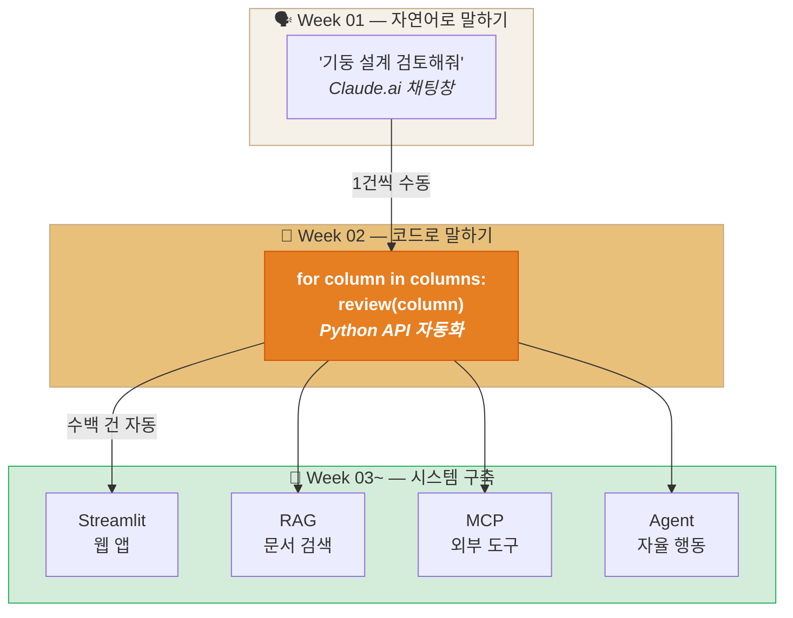

API를 사용하면 **수백 개의 구조 부재를 자동으로 검토**하고, 검토 결과를 **JSON으로 파싱하여 스프레드시트에 저장**하고, **Streamlit 웹 앱으로 시각화**할 수 있다. 이것이 "AI와 프로그래밍의 만남"이다.

### Anthropic Skilljar 코스

이 강의노트는 Anthropic 공식 교육 플랫폼 Skilljar의 **"Building with the Claude API" Section 1: Getting Started with Claude** (16개 레슨)을 기반으로 구성되었다.

> [!ref] 소스 매핑
> - 온라인 코스: [Building with the Claude API](https://anthropic.skilljar.com/claude-with-the-anthropic-api)
> - GitHub 실습: [anthropic_api_fundamentals](https://github.com/anthropics/courses/tree/master/anthropic_api_fundamentals)
> - 실라버스 매핑: **Building — S1 (API 기초) → W1-2** (v2.3 기준)

---

## [Chapter 1] API 기초와 첫 호출

### 1.1 과정 개요 (Course Overview)

> [!abstract] Building with the Claude API
> Anthropic 공식 Skilljar 과정으로, Claude API의 전체 스펙트럼을 다루는 종합 과정이다.
> - **84개 강의**, 8.1시간 비디오, 10개 퀴즈
> - 기초 → 대화 관리 → 프롬프트 엔지니어링 → 도구 사용 → 에이전트까지 단계적 학습
> - Python SDK 중심, 실습 코드 포함

이 과정은 7개 섹션 (Section)으로 구성되며, 본 강의노트는 **Section 1: Getting Started**를 다룬다.

| 섹션     | 주제                              | 레슨 수 | 매핑 주차  |
| ------ | ------------------------------- | :--: | :----: |
| **S1** | **Getting Started with Claude** |  16  | **W2** |
| S2     | Prompt Engineering & Evaluation |  16  |   W3   |
| S3     | Tool Use with Claude            |  14  |   W4   |
| S4     | Retrieval Augmented Generation  |  10  |   W5   |
| S5     | Model Context Protocol          |  12  |   W7   |
| S6     | Claude Code & Computer Use      |  8   |   W9   |
| S7     | Agents and Workflows            |  11  |  W12   |

> [!ref] 소스
> - Skilljar L01: Welcome to Building with the Claude API

---

### 1.2 Claude 모델 패밀리 (Model Family)

Claude는 용도와 성능에 따라 3가지 모델 티어를 제공한다. 각 모델은 **속도-비용-성능** 트레이드오프가 다르다.

| 모델         | 특성       | 속도  | 비용  | 용도                | 모델명 예시              |
| ---------- | -------- | --- | --- | ----------------- | ------------------- |
| **Haiku**  | 빠르고 경제적  | ⚡⚡⚡ | $   | 분류, 요약, 간단한 Q&A   | `claude-haiku-4-5`  |
| **Sonnet** | 균형 잡힌 성능 | ⚡⚡  | $$  | 코딩, 분석, 일반 업무     | `claude-sonnet-4-0` |
| **Opus**   | 최고 성능    | ⚡   | $$$ | 복잡한 추론, 연구, 장문 분석 | `claude-opus-4-0`   |

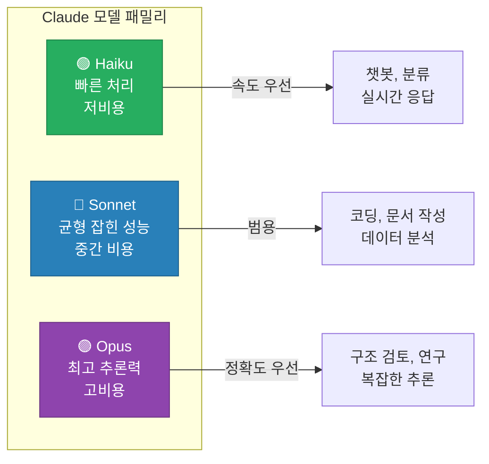

> [!tip] 모델 선택 전략
> - **프로토타이핑 단계**: Sonnet으로 시작 (빠른 반복, 합리적 비용)
> - **대량 처리**: Haiku로 전환 (수천 건의 문서 분류, 요약)
> - **정밀 분석**: Opus로 업그레이드 (구조 검토, 복잡한 계산 검증)
> - 모델명 규칙: `claude-{tier}-{version}` (예: `claude-sonnet-4-0`)

> [!ref] 소스
> - Skilljar L02: Overview of Claude Models

---

### 1.3 API 요청 흐름 — 5단계 (Five-Step Request Flow)

Claude API와의 모든 상호작용은 동일한 5단계 흐름을 따른다.

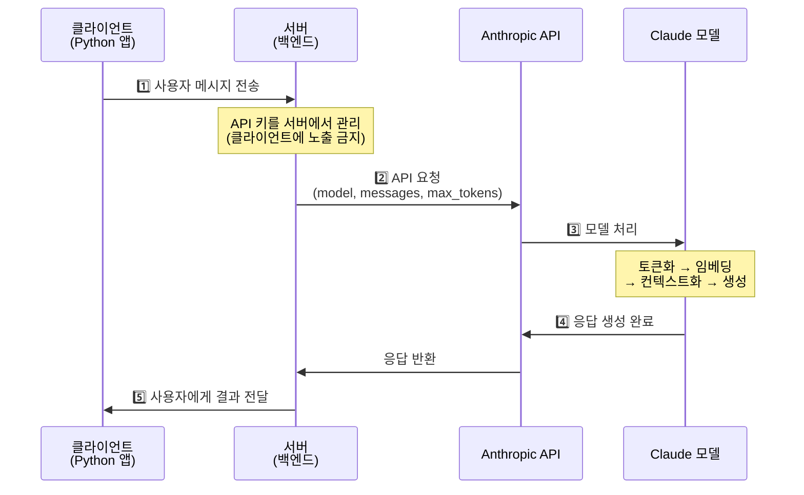

---

#### Step 1: Request to Server — 클라이언트 → 서버

![[assets/skilljar-s1/skilljar-s1-L03-step1-request-to-server.png]]
*Step 1: 웹/모바일 앱에서 사용자 메시지가 서버로 전송된다*

사용자가 채팅 인터페이스에서 "Send"를 클릭하면, 메시지는 **먼저 개발자의 서버로** 전송된다.

> [!question] 클라이언트에서 직접 API를 호출하면 안 되나?
> API 키가 클라이언트 코드 (JavaScript, 모바일 앱)에 포함되면 **누구나 추출 가능**하다.
> - 브라우저 개발자 도구에서 네트워크 탭을 열면 API 키가 노출
> - 악의적 사용자가 키를 탈취하여 과도한 API 호출 → **과금 폭탄**
> - 서버를 경유하면 키는 서버에만 존재하고, 클라이언트는 키를 알 수 없음

---

#### Step 2: Request to Anthropic API — 서버 → API

![[assets/skilljar-s1/skilljar-s1-L03-step2-request-to-api.png]]
*Step 2: 서버가 Anthropic SDK를 통해 API에 요청을 전송한다. 4가지 필수 필드를 포함해야 한다.*

서버는 Anthropic SDK (Python, TypeScript 등) 또는 HTTP 요청으로 API를 호출한다. 모든 요청에는 4가지 필수 필드가 포함되어야 한다:

| 필드 (Field) | 용도 (Purpose) |
|---|---|
| **API Key** | Anthropic에 요청을 식별하는 인증 키 |
| **Model** | 사용할 모델명 (예: `claude-sonnet-4-0`) |
| **Messages** | 사용자 입력 텍스트가 담긴 메시지 리스트 |
| **Max Tokens** | Claude가 생성할 수 있는 최대 토큰 수 |

---

#### Step 3: Model Processing — Claude 내부 처리

Anthropic API가 요청을 수신하면, Claude 모델은 4단계 파이프라인을 거쳐 응답을 생성한다.

**3-1. 토큰화 (Tokenization) + 임베딩 (Embedding)**

![[assets/skilljar-s1/skilljar-s1-L03-step3-embedding.png]]
*Step 3a: 입력 텍스트를 토큰으로 분할하고, 각 토큰을 고차원 임베딩 벡터로 변환한다*

| 단계 | 처리 | 설명 |
|---|---|---|
| **토큰화** (Tokenization) | 텍스트 → 토큰 | "건축공학" → ["건축", "공학"] (서브워드 분할) |
| **임베딩** (Embedding) | 토큰 → 벡터 | 각 토큰을 고차원 숫자 벡터로 변환 — 의미의 수치적 표현 |
| **컨텍스트화** (Contextualization) | 벡터 간 관계 계산 | Self-Attention으로 주변 토큰과의 관련성을 반영하여 임베딩 정제 |

**3-2. 생성 (Generation)**

![[assets/skilljar-s1/skilljar-s1-L03-step3-generation.png]]
*Step 3b: 컨텍스트화된 임베딩이 출력 레이어를 거쳐 다음 토큰의 확률 분포를 생성한다*

생성 단계에서 Claude는:
1. 컨텍스트화된 임베딩을 **Output Layer**에 전달
2. 가능한 모든 다음 토큰에 대한 **확률 분포**를 계산 (예: "Quantum" 30%, "Great" 23%, "Are" 19%, ...)
3. 확률과 **제어된 무작위성** (temperature)을 사용하여 하나의 토큰을 선택
4. 선택된 토큰을 시퀀스에 추가하고 **전체 과정을 반복**

**3-3. 생성 중단 조건**

![[assets/skilljar-s1/skilljar-s1-L03-step3-stop-conditions.png]]
*Step 3c: 매 토큰 생성 후 3가지 중단 조건을 확인한다*

각 토큰을 생성한 후, Claude는 다음 3가지 조건을 확인하여 계속 생성할지 결정한다:

| 조건                 | 설명                    | `stop_reason`     |
| ------------------ | --------------------- | ----------------- |
| `max_tokens` 도달    | 설정한 최대 토큰 수에 도달       | `"max_tokens"`    |
| 자연 종료 (EOS)        | End of Sequence 토큰 생성 | `"end_turn"`      |
| `stop_sequence` 매칭 | 지정한 정지 문자열이 출력에 등장    | `"stop_sequence"` |

> [!finding] `max_tokens`는 안전 한도
> `max_tokens`는 "이만큼 생성하라"는 목표가 아니라, "이 이상은 절대 생성하지 마라"는 **안전 한도 (Safety Limit)**이다. Claude는 자연스러운 종료 지점에서 스스로 멈추며, `max_tokens`는 무한 생성을 방지하는 상한선이다.

---

#### Step 4: Response to Server — API → 서버

![[assets/skilljar-s1/skilljar-s1-L03-step4-response-to-server.png]]
*Step 4: Anthropic API가 생성 결과를 서버로 반환한다. 응답에는 Message, Usage, Stop Reason이 포함된다.*

생성이 완료되면 API는 다음 데이터를 포함한 응답을 서버로 반환한다:

| 데이터 (Data) | 용도 (Purpose) |
|---|---|
| **Message** | 생성된 텍스트가 담긴 "assistant" 메시지 |
| **Usage** | 입력 + 출력 토큰 수 (비용 추적용) |
| **Stop Reason** | 생성이 중단된 이유 (`end_turn`, `max_tokens`, `stop_sequence`) |

---

#### Step 5: Response to Client — 서버 → 클라이언트

![[assets/skilljar-s1/skilljar-s1-L03-step5-response-to-client.png]]
*Step 5: 서버가 생성된 텍스트를 클라이언트 앱으로 전달하여 사용자에게 표시한다*

서버는 Claude의 응답을 처리 (저장, 필터링 등)한 후 클라이언트 앱으로 전달한다. 사용자는 채팅 인터페이스에서 AI의 응답을 확인한다.

> [!ref] 소스
> - Skilljar L03: Accessing the API (5:18 비디오 프레임 캡처 포함)

---

### 1.4 API 키 발급과 환경 설정

#### API 키 발급 절차

1. [Anthropic Console](https://console.anthropic.com) 접속
2. Settings → API Keys → **Create Key**
3. 키 이름 지정 (예: `lec-llm-ae-ai`) → 생성
4. 표시되는 키를 **즉시 복사** (다시 볼 수 없음)

> [!method] API 키 보안 관리
> API 키는 절대로 코드에 직접 작성하지 않는다. `.env` 파일에 저장하고, `.gitignore`에 등록한다.
>
> ```bash
> # .env 파일 생성
> echo 'ANTHROPIC_API_KEY="sk-ant-api03-..."' > .env
>
> # .gitignore에 추가 (Git에 올리지 않음)
> echo '.env' >> .gitignore
> ```

#### 개발 환경 구성

```bash
# 1. 가상환경 생성 및 활성화
python -m venv .venv
source .venv/bin/activate  # Windows: .venv\Scripts\activate

# 2. 필수 패키지 설치
pip install anthropic python-dotenv
```

`.env` 파일:
```
ANTHROPIC_API_KEY="sk-ant-api03-your-key-here"
```

> [!ref] 소스
> - Skilljar L04: Getting an API Key

---

### 1.5 첫 API 호출 (First Request)

#### 기본 설정 코드

```python
# === 기본 설정 (모든 예제에서 재사용) ===
from dotenv import load_dotenv
load_dotenv()  # .env 파일에서 환경변수 로드

from anthropic import Anthropic

client = Anthropic()  # ANTHROPIC_API_KEY 환경변수 자동 인식
model = "claude-sonnet-4-0"
```

> [!tip] `Anthropic()` 클라이언트 생성 시 API 키를 직접 전달할 수도 있지만, 환경변수 방식이 더 안전하다.
> ```python
> # 권장하지 않음 (키가 코드에 노출)
> client = Anthropic(api_key="sk-ant-api03-...")
>
> # 권장 (환경변수에서 자동 로드)
> client = Anthropic()
> ```

#### 첫 번째 메시지 전송

`client.messages.create()`에는 3가지 필수 매개변수가 있다:

| 매개변수 | 타입 | 설명 |
|---|---|---|
| `model` | `str` | 사용할 모델명 (예: `"claude-sonnet-4-0"`) |
| `max_tokens` | `int` | 최대 응답 토큰 수 (안전 한도) |
| `messages` | `list[dict]` | 대화 메시지 리스트 (`role` + `content`) |

```python
# === 첫 API 호출 ===
message = client.messages.create(
    model=model,
    max_tokens=1024,
    messages=[
        {"role": "user", "content": "Claude API에 대해 한 문장으로 설명해주세요."}
    ]
)

# 응답 텍스트 추출
print(message.content[0].text)
```

#### 응답 구조 분석

```python
# 응답 객체의 주요 속성
print(f"역할: {message.role}")              # "assistant"
print(f"응답: {message.content[0].text}")    # 실제 응답 텍스트
print(f"중단 이유: {message.stop_reason}")    # "end_turn" | "max_tokens"
print(f"입력 토큰: {message.usage.input_tokens}")   # 요청에 사용된 토큰
print(f"출력 토큰: {message.usage.output_tokens}")  # 응답에 사용된 토큰
```

> [!finding] 토큰과 비용의 관계
> API 비용은 **입력 토큰 + 출력 토큰**에 비례한다. `usage` 필드를 모니터링하면 비용을 추적할 수 있다.
> - Sonnet 기준: 입력 $3/1M 토큰, 출력 $15/1M 토큰
> - 위 예시 (25+38 토큰) 비용 ≈ $0.0006 (1원 미만)

> [!ref] 소스
> - Skilljar L05: Making a Request

---

### 1.6 건축공학 응용: 구조계산서 자동 생성

> [!method] 시나리오: RC 기둥 설계 검토 자동화
> 실무에서 수백 개의 기둥에 대해 반복적인 설계 검토를 수행해야 할 때, API를 통해 각 기둥의 설계 적정성을 자동으로 검토할 수 있다.

```python
from dotenv import load_dotenv
load_dotenv()
from anthropic import Anthropic

client = Anthropic()
model = "claude-sonnet-4-0"

# 기둥 설계 검토 요청
column_review = client.messages.create(
    model=model,
    max_tokens=2048,
    messages=[
        {
            "role": "user",
            "content": """다음 RC 기둥의 설계 적정성을 검토해주세요.

설계 조건:
- 기둥 단면: 500mm × 500mm
- 콘크리트 강도 (fck): 24 MPa
- 철근 항복강도 (fy): 400 MPa
- 주근: 8-D25 (SD400)
- 띠철근: D10@300
- 설계 축력 (Pu): 2,500 kN
- 설계 모멘트 (Mu): 150 kN·m
- 적용 기준: KDS 14 20 20

검토 항목:
1. 축력비 검토 (최대 축력비 0.8 이하)
2. 최소/최대 철근비 검토 (0.01 ≤ ρ ≤ 0.08)
3. 띠철근 간격 적정성 (KDS 14 20 22)
4. 판정 결과를 표 형식으로 정리"""
        }
    ]
)

print(column_review.content[0].text)
print(f"\n--- 토큰 사용량 ---")
print(f"입력: {column_review.usage.input_tokens} 토큰")
print(f"출력: {column_review.usage.output_tokens} 토큰")
```

> [!tip] 실무 확장 아이디어
> 위 코드를 `for` 루프로 감싸면, **CSV 파일에서 기둥 데이터를 읽어 일괄 검토**할 수 있다. 이것이 API의 핵심 가치 — 수동 작업의 자동화 (Automation)이다.

---

## [Chapter 2] 멀티턴 대화와 시스템 프롬프트

### 2.1 Claude는 무상태 (Stateless)

> [!question] Claude에게 "아까 말한 것"을 물으면 어떻게 될까?
> Claude는 **이전 대화를 기억하지 못한다**. 매 API 호출은 완전히 독립적이며, 이전 대화의 맥락은 자동으로 전달되지 않는다. 대화를 이어가려면 **개발자가 직접 대화 이력을 관리**해야 한다.

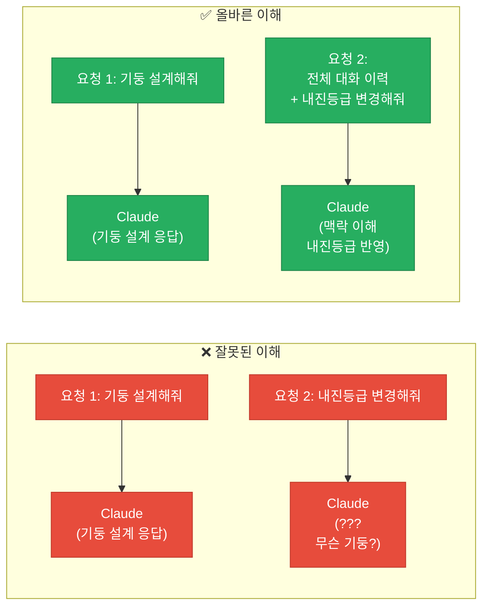

> [!finding] 핵심 원칙
> Claude API는 **무상태 (Stateless)**이다. 매 요청 시 전체 대화 이력을 `messages` 리스트에 담아 보내야 한다. 웹 UI (claude.ai)에서는 이 작업이 자동으로 처리되지만, API에서는 개발자가 직접 관리해야 한다.

---

### 2.2 멀티턴 대화 구현

#### 헬퍼 함수 (Helper Functions)

대화 이력 관리를 단순화하기 위한 3가지 헬퍼 함수를 정의한다:

```python
from dotenv import load_dotenv
load_dotenv()
from anthropic import Anthropic

client = Anthropic()
model = "claude-sonnet-4-0"

# === 헬퍼 함수 ===

def add_user_message(messages: list, text: str):
    """사용자 메시지를 대화 이력에 추가"""
    messages.append({"role": "user", "content": text})

def add_assistant_message(messages: list, text: str):
    """어시스턴트 응답을 대화 이력에 추가"""
    messages.append({"role": "assistant", "content": text})

def chat(messages: list, system: str = None) -> str:
    """대화 이력을 전송하고 응답 텍스트를 반환"""
    params = {
        "model": model,
        "max_tokens": 1000,
        "messages": messages
    }
    if system:
        params["system"] = system
    response = client.messages.create(**params)
    return response.content[0].text
```

#### 대화 흐름

```python
# === 멀티턴 대화 예시 ===
messages = []

# 1턴: 사용자 질문
add_user_message(messages, "RC 보의 설계에서 최소 철근비의 의미가 뭐야?")
response = chat(messages)
add_assistant_message(messages, response)
print(f"Claude: {response}\n")

# 2턴: 후속 질문 (이전 맥락 활용)
add_user_message(messages, "그렇다면 KDS 기준에서 최소 철근비 산정 공식은?")
response = chat(messages)
add_assistant_message(messages, response)
print(f"Claude: {response}\n")

# 3턴: 추가 질문
add_user_message(messages, "fck=30MPa, fy=400MPa일 때 실제로 계산해줘.")
response = chat(messages)
add_assistant_message(messages, response)
print(f"Claude: {response}")
```

> [!method] 대화 이력 관리 패턴
> 이 패턴을 **반드시** 지켜야 한다. 응답을 이력에 추가하지 않으면, 다음 턴에서 Claude는 자기가 한 말을 모른다.

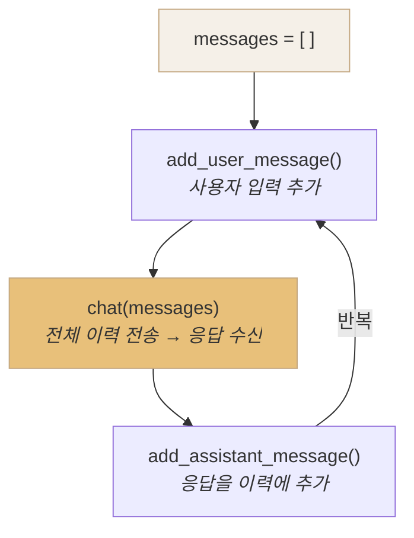

#### 대화형 챗봇 루프

```python
# === 대화형 챗봇 ===
messages = []

print("Claude 챗봇 (종료: 'quit' 또는 'q')")
print("=" * 50)

while True:
    user_input = input("\n사용자: ").strip()
    if user_input.lower() in ("quit", "q", "종료"):
        print("대화를 종료합니다.")
        break
    if not user_input:
        continue

    add_user_message(messages, user_input)
    response = chat(messages)
    add_assistant_message(messages, response)
    print(f"\nClaude: {response}")
```

> [!tip] 대화 이력이 길어지면 토큰 비용이 증가한다
> 매 요청마다 **전체 대화 이력**을 전송하므로, 대화가 길어질수록 입력 토큰이 누적된다.
> - 10턴 대화: 1~10턴의 모든 메시지가 매번 전송
> - 비용 최적화: 오래된 메시지 요약/삭제, 또는 Prompt Caching 활용 (Section 7에서 학습)

> [!ref] 소스
> - Skilljar L06: Multi-Turn Conversations
> - Skilljar L07: Chat Exercise

---

### 2.3 시스템 프롬프트 (System Prompts)

시스템 프롬프트는 Claude의 **역할, 톤, 행동 규칙**을 정의하는 특별한 지시이다. 일반 메시지 (`messages`)가 아닌 별도의 `system` 매개변수로 전달한다.

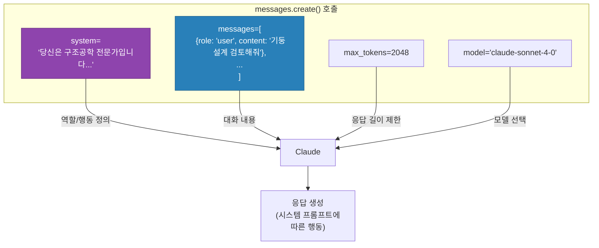

#### 시스템 프롬프트 vs 사용자 메시지

| 구분      | 시스템 프롬프트 (`system=`) | 사용자 메시지 (`messages`) |
| ------- | -------------------- | -------------------- |
| **위치**  | `system` 매개변수 (별도)   | `messages` 리스트 내부    |
| **역할**  | Claude의 인격/행동 정의     | 실제 대화 내용             |
| **지속성** | 모든 턴에 일괄 적용          | 턴마다 변화               |
| **비유**  | 직원 채용 시 직무기술서 (JD)   | 일상적인 업무 지시           |

#### 수학 튜터 예시

```python
# === 시스템 프롬프트 예시: 수학 튜터 ===
system_prompt = """당신은 인내심 있는 수학 튜터입니다.

행동 규칙:
- 학생의 질문에 직접 답을 주지 마세요
- 힌트와 가이드 질문으로 단계별로 유도하세요
- 학생이 스스로 답을 찾도록 도와주세요
- 격려하는 톤을 유지하세요
"""

messages = []
add_user_message(messages, "3x + 7 = 22 를 풀어줘")
response = chat(messages, system=system_prompt)
print(response)
```

> [!ref] 소스
> - Skilljar L08: System Prompts
> - Skilljar L09: System Prompts Exercise

---

### 2.4 건축공학 응용: KDS 기반 구조 검토 어시스턴트

> [!method] 시나리오: 구조기술사 AI 어시스턴트
> 시스템 프롬프트로 **KDS 구조 설계기준에 정통한 구조공학 전문가** 역할을 부여하고, 멀티턴 대화로 설계 조건을 점진적으로 변경하며 검토한다.

```python
# === 구조 검토 전문 시스템 프롬프트 ===
structural_system = """당신은 한국 건축구조 설계기준(KDS)에 정통한 구조공학 전문 AI 어시스턴트입니다.

전문 분야:
- 콘크리트구조 설계기준 (KDS 14 20 00)
- 내진설계 기준 (KDS 41 17 00)
- 하중 기준 (KDS 41 10 15)

행동 규칙:
1. 모든 검토에 적용 KDS 조항 번호를 명시하세요
2. 계산 과정을 단계별로 보여주세요
3. 결과를 검토항목별 표로 정리하세요
4. 설계 부적합 시 개선 방안을 제안하세요
5. 불확실한 가정은 명시적으로 표기하세요
"""

# === 멀티턴 구조 검토 ===
messages = []

# 1턴: 초기 설계 조건 검토 요청
add_user_message(messages, """다음 RC 기둥의 설계 적정성을 검토해주세요.

- 기둥 단면: 500mm × 500mm
- 콘크리트 강도 (fck): 24 MPa
- 주근: 8-D25 (SD400)
- 설계 축력 (Pu): 2,500 kN
- 설계 모멘트 (Mu): 150 kN·m
- 내진등급: 일반 (내진설계범주 C)""")

response1 = chat(messages, system=structural_system)
add_assistant_message(messages, response1)
print("=== 1턴: 초기 설계 검토 ===")
print(response1)

# 2턴: 내진등급 변경에 따른 재검토
add_user_message(messages, """내진등급이 '특등급 (내진설계범주 D)'으로 변경되었습니다.
변경된 조건에서 기존 설계가 여전히 적합한지 재검토해주세요.""")

response2 = chat(messages, system=structural_system)
add_assistant_message(messages, response2)
print("\n=== 2턴: 내진등급 변경 재검토 ===")
print(response2)

# 3턴: 개선안 요청
add_user_message(messages, "부적합 항목에 대한 개선안을 제시해주세요.")

response3 = chat(messages, system=structural_system)
add_assistant_message(messages, response3)
print("\n=== 3턴: 개선안 ===")
print(response3)
```

> [!finding] 멀티턴 대화의 위력
> Claude는 1턴의 검토 결과를 기억하고 있으므로, 2턴에서 "내진등급만 변경"이라는 간결한 요청만으로 **전체 맥락을 유지한 채** 재검토를 수행한다.

---

## [Chapter 3] 파라미터 튜닝과 스트리밍

### 3.1 Temperature — 창의성 vs 정확성의 조절 다이얼

#### Claude의 텍스트 생성 3단계

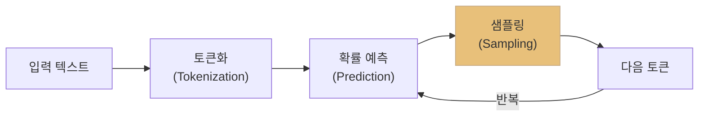

> [!method] 토큰 생성 3단계
> 1. **토큰화 (Tokenization)**: 입력 텍스트를 토큰 단위로 분할
> 2. **확률 예측 (Prediction)**: 각 가능한 다음 토큰에 대한 확률 분포 계산
> 3. **샘플링 (Sampling)**: 확률 분포에서 다음 토큰을 선택 — **이 단계에서 temperature가 작용**

#### Temperature의 효과

Temperature는 확률 분포의 **뾰족함(sharpness)**을 조절한다:

| Temperature | 효과 | 건축공학 비유 |
|-------------|------|--------------|
| **0.0** | 최고 확률 토큰을 항상 선택 (결정적) | 설계기준서 — 정해진 답만 |
| **0.0 ~ 0.3** | 상위 소수 토큰에 집중 | 구조계산 — 검증된 방법만 |
| **0.4 ~ 0.7** | 적당한 다양성 | 설계 대안 검토 — 합리적 범위 내 |
| **0.8 ~ 1.0** | 확률이 고르게 분산 → 다양한 선택 | 초기 아이디어 스케치 — 자유롭게 |

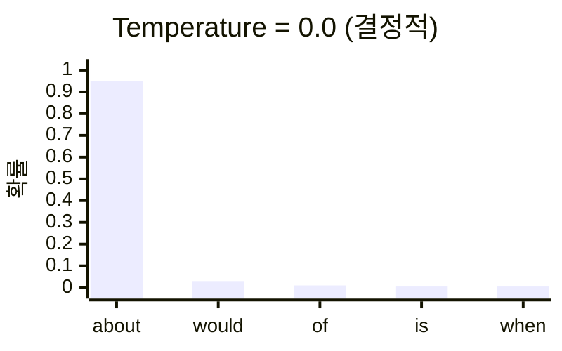

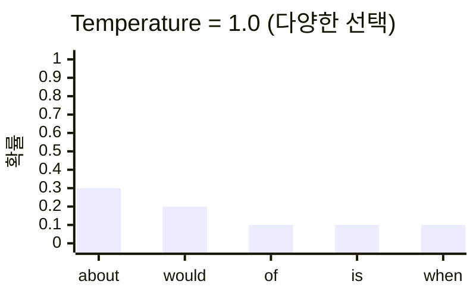

> [!tip] 용도별 Temperature 가이드
> - **구조 계산, 데이터 추출, 코드 생성**: `0.0 ~ 0.3` (정확성 우선)
> - **요약, 교육 콘텐츠, 문제 해결**: `0.4 ~ 0.7` (균형)
> - **브레인스토밍, 창작, 마케팅 카피**: `0.8 ~ 1.0` (창의성 우선)

#### Temperature를 포함한 chat 함수

```python
def chat(messages, system=None, temperature=1.0):
    """Claude API 호출 (temperature 포함)"""
    params = {
        "model": model,
        "max_tokens": 1000,
        "messages": messages,
        "temperature": temperature
    }
    if system:
        params["system"] = system
    return client.messages.create(**params).content[0].text
```

> [!finding] Temperature 기본값
> Anthropic API의 temperature 기본값은 `1.0`이다. 명시적으로 설정하지 않으면 최대 다양성이 적용되므로, **정확성이 중요한 공학 작업에서는 반드시 낮은 값을 지정**해야 한다.

#### 건축공학 적용 — Temperature 비교 실험

```python
# 구조 계산 — 정확성 우선 (temperature = 0.0)
messages_calc = []
add_user_message(messages_calc,
    "500x500 RC 기둥, fc'=24MPa, fy=400MPa일 때 "
    "축 하중 강도 Pn을 KDS 기준으로 계산하라."
)
result_precise = chat(messages_calc, temperature=0.0)
print("=== Temperature 0.0 (구조 계산) ===")
print(result_precise)

# 설계 아이디어 — 창의성 우선 (temperature = 0.9)
messages_idea = []
add_user_message(messages_idea,
    "20층 주거 건물의 횡력저항시스템으로 "
    "가능한 구조 대안을 브레인스토밍하라."
)
result_creative = chat(messages_idea, temperature=0.9)
print("\n=== Temperature 0.9 (브레인스토밍) ===")
print(result_creative)
```

> [!ref] 소스
> - Skilljar L10: Temperature

---

### 3.2 응답 스트리밍 (Response Streaming)

#### 왜 스트리밍이 필요한가?

일반적인 API 호출은 **전체 응답이 생성될 때까지 기다린 후** 한 번에 반환한다. 긴 응답에서는 **10~30초의 대기 시간**이 발생한다.

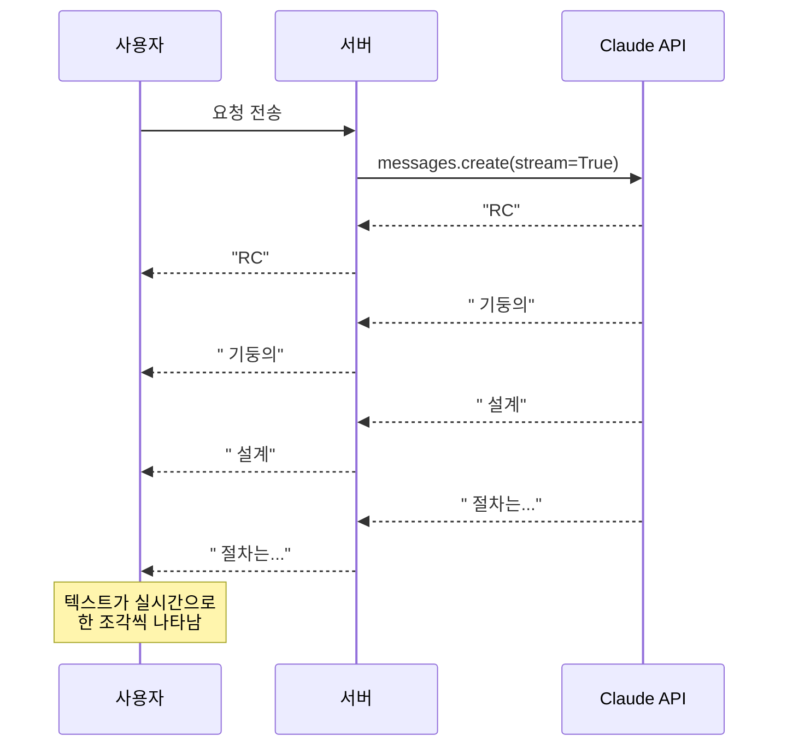

#### 스트림 이벤트 구조

| 이벤트 | 설명 | 포함 데이터 |
|--------|------|-------------|
| `message_start` | 메시지 시작 | 모델명, 역할 |
| `content_block_start` | 콘텐츠 블록 시작 | 블록 인덱스, 타입 |
| `content_block_delta` | **텍스트 조각 전달** (반복) | `delta.text` |
| `content_block_stop` | 콘텐츠 블록 종료 | 블록 인덱스 |
| `message_delta` | 메시지 메타데이터 | `stop_reason`, 사용량 |
| `message_stop` | 메시지 완전 종료 | — |

#### 기본 스트리밍 — Raw Events

```python
messages = []
add_user_message(messages, "RC 보의 처짐 검토 절차를 설명하라.")

stream = client.messages.create(
    model=model,
    max_tokens=1000,
    messages=messages,
    stream=True
)

for event in stream:
    print(event)  # 각 이벤트 객체 출력
```

#### 간편 스트리밍 — text_stream

대부분의 경우 텍스트 조각만 필요하다:

```python
messages = []
add_user_message(messages, "RC 보의 처짐 검토 절차를 3단계로 설명하라.")

with client.messages.stream(
    model=model,
    max_tokens=1000,
    messages=messages
) as stream:
    for text in stream.text_stream:
        print(text, end="", flush=True)  # 실시간 출력

print()  # 줄바꿈
```

> [!tip] `flush=True`의 역할
> Python의 `print()`는 기본적으로 줄바꿈까지 출력을 버퍼링한다. `flush=True`를 설정하면 **각 텍스트 조각이 즉시 화면에 표시**된다.

#### 스트리밍 후 최종 메시지 활용

```python
with client.messages.stream(
    model=model,
    max_tokens=1000,
    messages=messages
) as stream:
    for text in stream.text_stream:
        print(text, end="", flush=True)

    # 스트림 종료 후 최종 메시지 획득
    final_message = stream.get_final_message()

print(f"\n\n--- 메타데이터 ---")
print(f"모델: {final_message.model}")
print(f"종료 사유: {final_message.stop_reason}")
print(f"입력 토큰: {final_message.usage.input_tokens}")
print(f"출력 토큰: {final_message.usage.output_tokens}")
```

> [!ref] 소스
> - Skilljar L11: Response Streaming

---

## [Chapter 4] 출력 제어와 구조화된 데이터

### 4.1 프리필링 (Prefilled Assistant Messages)

프리필링은 `assistant` 메시지의 시작 부분을 개발자가 미리 제공하여, Claude가 **그 지점부터 이어서 작성**하도록 유도하는 기법이다.

![[assets/skilljar-s1/skilljar-s1-02-02.webp]]
*프리필링 개념: assistant 메시지를 미리 제공하여 응답 방향 유도*

> [!finding] 핵심 동작 원리
> - Claude는 프리필된 텍스트를 **반복하지 않는다** — 그 지점부터 이어서 생성한다
> - 프리필된 내용이 Claude의 "이미 말한 것"으로 인식되어, 그 방향을 유지한다
> - 이를 통해 응답의 **형식, 관점, 시작 패턴**을 정밀하게 제어할 수 있다

```python
# 프리필링 없이 — Claude가 자유롭게 양쪽 입장을 다룸
messages_free = []
add_user_message(messages_free, "차와 커피 중 뭐가 더 나은가?")
print("=== 프리필링 없음 ===")
print(chat(messages_free))

# 프리필링 적용 — "커피가 더 나은데, 그 이유는"으로 시작 강제
messages_prefill = []
add_user_message(messages_prefill, "차와 커피 중 뭐가 더 나은가?")
add_assistant_message(messages_prefill, "커피가 더 나은데, 그 이유는")
print("\n=== 프리필링 적용 ===")
answer = chat(messages_prefill)
print("커피가 더 나은데, 그 이유는" + answer)
```

> [!tip] 응답 조립 주의사항
> Claude는 프리필된 텍스트를 응답에 포함하지 않는다. 최종 출력을 구성할 때 **프리필 텍스트 + 생성된 텍스트**를 직접 결합해야 한다.

> [!ref] 소스
> - Skilljar L12: Controlling Model Output

---

### 4.2 정지 시퀀스 (Stop Sequences)

정지 시퀀스는 Claude가 응답 생성 중 특정 문자열을 만나면 **즉시 생성을 중단**하게 한다.

| 종료 조건 | `stop_reason` 값 | 설명 |
|-----------|------------------|------|
| 자연 종료 | `"end_turn"` | Claude가 응답을 자연스럽게 완료 |
| 토큰 한도 | `"max_tokens"` | `max_tokens`에 도달하여 잘림 |
| **정지 시퀀스** | `"stop_sequence"` | 지정한 문자열이 생성되어 중단 |

```python
def chat(messages, system=None, temperature=1.0, stop_sequences=[]):
    """Claude API 호출 (stop_sequences 포함)"""
    params = {
        "model": model, "max_tokens": 1000,
        "messages": messages, "temperature": temperature
    }
    if system:
        params["system"] = system
    if stop_sequences:
        params["stop_sequences"] = stop_sequences
    return client.messages.create(**params).content[0].text

# 1부터 10까지 세기 — "5"에서 중단
messages = []
add_user_message(messages, "1부터 10까지 세어라.")
result = chat(messages, stop_sequences=["5"])
print(result)
# 출력: "1, 2, 3, 4, "  (5는 포함되지 않음)
```

---

### 4.3 구조화된 데이터 추출 — 프리필링 + 정지 시퀀스 조합

Claude에게 JSON을 요청하면 설명 텍스트가 함께 출력되는 문제가 있다. **프리필 + 정지 시퀀스 콤보**로 순수한 데이터만 추출한다.

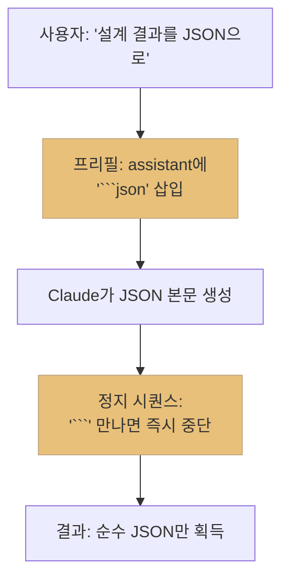

```python
import json

messages = []
add_user_message(messages,
    "500x500 RC 기둥 설계 결과를 JSON으로 출력하라. "
    "fc'=24MPa, fy=400MPa, 주근 8-D25."
)
# 프리필: JSON 코드 블록의 시작 부분
add_assistant_message(messages, "```json\n")

# 정지 시퀀스: 코드 블록 종료 마커
raw_text = chat(messages, stop_sequences=["```"], temperature=0.0)

# 파싱
data = json.loads(raw_text.strip())
print(json.dumps(data, indent=2, ensure_ascii=False))
```

> [!finding] 이 기법이 작동하는 이유
> 1. **프리필** `` ```json `` 이 있으므로 Claude는 "이미 JSON 코드 블록을 열었다"고 인식
> 2. Claude는 자연스럽게 JSON 본문을 생성
> 3. JSON이 끝나면 코드 블록을 닫으려 `` ``` ``을 생성 → **정지 시퀀스에 걸려 중단**
> 4. 결과물에는 순수 JSON만 남음 → `json.loads()`로 바로 파싱 가능

#### 다양한 형식에 적용

| 출력 형식 | 프리필 (assistant) | 정지 시퀀스 |
|-----------|-------------------|-------------|
| JSON | `` ```json\n `` | `` ``` `` |
| Python 코드 | `` ```python\n `` | `` ``` `` |
| CSV | `` ```csv\n `` | `` ``` `` |
| XML | `<root>` | `</root>` |

#### 건축공학 적용 — 비정형 텍스트에서 구조 데이터 추출

```python
import json

# 비정형 구조 검토 메모
unstructured_text = """
오늘 현장 미팅에서 3층 기둥 C3에 대해 논의함.
현재 단면 400x400인데 축력이 예상보다 크게 나옴.
김 소장이 500x500으로 변경 요청. 콘크리트는 30MPa로 상향.
철근은 8-D25에서 12-D29로 변경 필요할 듯.
다음 주 화요일까지 변경 도면 제출해야 함.
"""

messages = []
add_user_message(messages,
    f"다음 비정형 메모에서 구조 변경 정보를 JSON으로 추출하라:\n\n"
    f"{unstructured_text}\n\n"
    f"JSON 키: member_id, floor, original_section, revised_section, "
    f"original_rebar, revised_rebar, concrete_grade, deadline, requester"
)
add_assistant_message(messages, "```json\n")

raw = chat(messages, stop_sequences=["```"], temperature=0.0)
change_order = json.loads(raw.strip())
print(json.dumps(change_order, indent=2, ensure_ascii=False))
```

> [!tip] 실무 활용
> 이 패턴을 확장하면 **구조 설계변경서 자동 생성**, **시공 일보 데이터 추출**, **회의록 액션 아이템 정리** 등에 바로 적용할 수 있다.

> [!ref] 소스
> - Skilljar L12: Controlling Model Output
> - Skilljar L13: Structured Data
> - Skilljar L14: Structured Data Exercise

---

## [Chapter 5] 종합 실습과 자가진단

### 5.1 대화형 챗봇 종합 구현

Section 1에서 배운 모든 기법을 하나의 프로그램으로 통합한다:

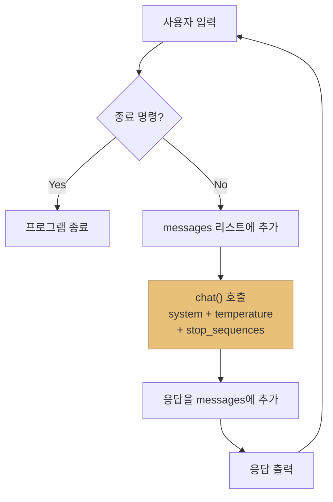

```python
from dotenv import load_dotenv
load_dotenv()
from anthropic import Anthropic

client = Anthropic()
model = "claude-sonnet-4-0"

def chat(messages, system=None, temperature=1.0, stop_sequences=[]):
    """Claude API 호출 — 모든 파라미터 통합"""
    params = {
        "model": model, "max_tokens": 2000,
        "messages": messages, "temperature": temperature
    }
    if system:
        params["system"] = system
    if stop_sequences:
        params["stop_sequences"] = stop_sequences
    return client.messages.create(**params).content[0].text

system = (
    "당신은 건축구조공학 전문 AI 어시스턴트입니다.\n"
    "KDS 14 20 (콘크리트 구조 설계기준)에 따라 답변합니다.\n"
    "계산이 필요한 경우 단계별로 풀이 과정을 보여주세요.\n"
    "단위를 반드시 명시하고, 가정사항을 먼저 기술하세요."
)

messages = []
print("=== 건축구조 AI 어시스턴트 ===")
print("종료하려면 'quit'를 입력하세요.\n")

while True:
    user_input = input("You: ").strip()
    if not user_input:
        continue
    if user_input.lower() in ["quit", "exit"]:
        print("대화를 종료합니다.")
        break

    messages.append({"role": "user", "content": user_input})
    answer = chat(messages, system=system, temperature=0.3)
    messages.append({"role": "assistant", "content": answer})
    print(f"\nClaude: {answer}\n")
```

---

### 5.2 스트리밍 버전 챗봇

```python
from dotenv import load_dotenv
load_dotenv()
from anthropic import Anthropic

client = Anthropic()
model = "claude-sonnet-4-0"

system = (
    "당신은 건축구조공학 전문 AI 어시스턴트입니다. "
    "KDS 14 20 기준에 따라 답변합니다."
)

messages = []
print("=== 건축구조 AI (스트리밍 모드) ===\n")

while True:
    user_input = input("You: ").strip()
    if not user_input:
        continue
    if user_input.lower() in ["quit", "exit"]:
        break

    messages.append({"role": "user", "content": user_input})

    print("Claude: ", end="")
    with client.messages.stream(
        model=model,
        max_tokens=2000,
        system=system,
        messages=messages,
        temperature=0.3
    ) as stream:
        full_response = ""
        for text in stream.text_stream:
            print(text, end="", flush=True)
            full_response += text

        final = stream.get_final_message()

    messages.append({"role": "assistant", "content": full_response})
    print(f"\n[토큰: 입력 {final.usage.input_tokens} / "
          f"출력 {final.usage.output_tokens}]\n")
```

---

### 5.3 자가진단 퀴즈 — Section 1 핵심 점검

> [!question] Q1. `client.messages.create()`의 필수 파라미터 3가지는?
> **답**: `model`, `max_tokens`, `messages`

> [!question] Q2. `system` 프롬프트는 `messages` 리스트 안에 포함되는가?
> **답**: 아니다. `system`은 `messages.create()`의 **별도 파라미터**로 전달된다.

> [!question] Q3. `temperature=0.0`과 `temperature=1.0`의 차이를 설명하라.
> **답**: `0.0`은 항상 최고 확률 토큰을 선택하여 결정적(deterministic) 출력을 생성. `1.0`은 확률 분포를 그대로 사용하여 다양한 출력을 생성.

> [!question] Q4. Claude는 이전 대화를 자동으로 기억하는가?
> **답**: 아니다. Claude API는 무상태(stateless). 매 호출 시 `messages` 리스트에 이전 대화 전체를 포함해야 한다.

> [!question] Q5. `stop_reason`의 3가지 값과 의미는?
> **답**: `"end_turn"` (자연 종료), `"max_tokens"` (한도 도달), `"stop_sequence"` (정지 시퀀스 매칭)

> [!question] Q6. 프리필링 (Prefilling)의 원리를 설명하라.
> **답**: `messages` 리스트 마지막에 `assistant` 역할 메시지를 추가하면, Claude가 그 텍스트를 "이미 말한 것"으로 인식하고 이어서 생성. 프리필 텍스트는 응답에 반복되지 않음.

> [!question] Q7. 구조화된 데이터 추출 시 프리필 + 정지 시퀀스를 조합하는 이유는?
> **답**: 프리필로 코드 블록 시작(`` ```json ``)을 제공하면 Claude가 바로 JSON을 생성하고, 정지 시퀀스(`` ``` ``)로 종료 시 중단시키면 순수 JSON만 얻을 수 있다.

> [!question] Q8. `stream.text_stream`과 raw 이벤트 스트림의 차이는?
> **답**: Raw 이벤트(`stream=True`)는 모든 이벤트 객체를 반환. `text_stream`은 텍스트 조각만 추출하는 편의 인터페이스.

---

### 5.4 건축공학 도메인 종합 과제

> [!action] 과제: 구조 부재 설계 검토 챗봇

아래 요구사항을 충족하는 **구조 부재 설계 검토 챗봇**을 구현하라.

| 항목 | 세부 사항 |
|------|-----------|
| System Prompt | KDS 14 20 기준 역할 부여, 계산 과정 단계별 표시 |
| Temperature | `0.2` (공학적 정확성 중심) |
| 스트리밍 | 실시간 응답 표시 + 토큰 사용량 출력 |
| JSON 출력 모드 | `/json` 명령어 입력 시 설계 결과를 JSON으로 반환 |
| 대화 유지 | 이전 대화 맥락을 유지하여 후속 질문 처리 |

**테스트 시나리오:**
```
You: 350x600 보, fc'=27MPa, fy=400MPa, Mu=380kN·m 휨 설계를 검토해줘
Claude: (스트리밍으로 단계별 계산 과정 출력)

You: 전단력 Vu=250kN도 검토해줘
Claude: (이전 대화 맥락 유지, 전단 설계 추가 검토)

You: /json 위 검토 결과를 구조화된 데이터로 정리해줘
Claude (JSON 모드):
{
  "beam_design": {
    "section": {"b_mm": 350, "d_mm": 600},
    "flexure": {"Mu_kNm": 380, "As_required_mm2": 2145, "bars": "5-D25"},
    "shear": {"Vu_kN": 250, "stirrup": "D10@200"},
    "check": {"flexure": "OK", "shear": "OK"}
  }
}
```

---

### 5.5 Section 1 학습 내용 정리

| 학습 항목 | 핵심 키워드 | 건축공학 적용 |
|-----------|-------------|---------------|
| API 호출 | `model`, `max_tokens`, `messages` | 기본 구조 질의 응답 |
| 시스템 프롬프트 | 역할 부여, 행동 제어 | KDS 기준 전문가 역할 |
| 대화 관리 | 무상태, 히스토리 리스트 | 다단계 설계 검토 |
| Temperature | 0.0~1.0, 정확성 vs 창의성 | 계산(0.0) vs 아이디어(0.9) |
| 스트리밍 | `text_stream`, 실시간 UX | 긴 계산서 실시간 표시 |
| 프리필링 | assistant 메시지 선제공 | 출력 형식 강제 |
| 정지 시퀀스 | `stop_sequences`, 조기 종료 | JSON/코드 깔끔 추출 |
| 조합 기법 | 프리필 + 정지 시퀀스 | 설계 결과 자동 파싱 |

```mermaid
graph LR
    subgraph Ch1["Ch.1: API 기초"]
        A["모델 선택"] --> B["API 키 설정"]
        B --> C["첫 호출"]
    end

    subgraph Ch2["Ch.2: 대화 관리"]
        D["무상태 이해"] --> E["멀티턴"]
        E --> F["시스템 프롬프트"]
    end

    subgraph Ch3["Ch.3: 파라미터"]
        G["Temperature"] --> H["스트리밍"]
    end

    subgraph Ch4["Ch.4: 출력 제어"]
        I["프리필링"] --> J["정지 시퀀스"]
        J --> K["JSON 추출"]
    end

    C --> D
    F --> G
    H --> I
    K --> L["Ch.5: 종합"]

    classDef ch1 fill:#2980b9,stroke:#1f618d,color:#fff
    classDef ch2 fill:#8e44ad,stroke:#6c3483,color:#fff
    classDef ch3 fill:#e67e22,stroke:#d35400,color:#fff
    classDef ch4 fill:#27ae60,stroke:#1e8449,color:#fff

    class A,B,C ch1
    class D,E,F ch2
    class G,H ch3
    class I,J,K ch4
```

---

## 📝 실습 과제

| 과제                              | 위치                               | 설명                   |
| ------------------------------- | -------------------------------- | -------------------- |
| 기존 001-requests.ipynb           | `03-Exercises/Week_02/`          | API 첫 호출 실습          |
| 기존 002_system_prompt.ipynb      | `03-Exercises/Week_02/`          | 시스템 프롬프트 실습          |
| 기존 003_temperature.ipynb        | `03-Exercises/Week_02/`          | Temperature 비교 실습    |
| 기존 004_streaming.ipynb          | `03-Exercises/Week_02/`          | 스트리밍 실습              |
| 기존 005_controlling_output.ipynb | `03-Exercises/Week_02/`          | 프리필링/정지 시퀀스 실습       |
| 기존 006_structured_data.ipynb    | `03-Exercises/Week_02/`          | 구조화된 데이터 추출 실습       |
| Skilljar S1 실습                  | `03-Exercises/Week_02/skilljar/` | Skilljar 코스 기반 추가 실습 |

---

## 📚 참고 자료

> [!ref] 공식 문서
> - [Anthropic API Reference — Messages](https://docs.anthropic.com/en/api/messages)
> - [Anthropic API — Streaming](https://docs.anthropic.com/en/api/messages-streaming)
> - [Anthropic Python SDK](https://github.com/anthropics/anthropic-sdk-python)

> [!ref] Anthropic 교육 자료
> - [Building with the Claude API (Skilljar)](https://anthropic.skilljar.com/claude-with-the-anthropic-api)
> - [API Fundamentals Notebooks (GitHub)](https://github.com/anthropics/courses/tree/master/anthropic_api_fundamentals)

> [!ref] 건축공학 기준
> - [KDS 14 20 — 콘크리트구조 설계기준](https://www.kcsc.re.kr)
> - [KDS 41 17 — 건축물 내진설계기준](https://www.kcsc.re.kr)

---

## Related

- [[Week_01|1주차: AI 활용 전략과 프롬프트 엔지니어링]]
- [[Week_03|3주차: 프롬프트 엔지니어링 & 평가 (S2)]]
- [[00-Syllabus/LLM_AE_AI_Implementation_Syllabus_v2.3|실라버스 v2.3]]
