# Week 02: Claude API Fundamentals — Building with the Claude API (S1)

---

## 📌 Lecture Focus

- **Claude API** architecture and request-response flow (5-Step Request Flow)
- **Model family**: Characteristics and selection criteria for Haiku, Sonnet, and Opus
- API key management and **security best practices** (.env, python-dotenv)
- **Multi-turn conversation** implementation and state management
- Customizing Claude's role and behavior with **system prompts**
- **Temperature** parameter and **streaming** responses
- Controlling output with **prefilling** and **stop sequences**
- **Structured data** (JSON) extraction techniques

---

## 🎯 Learning Objectives

After completing this lesson, you will be able to:

- Explain the 5 steps of the Claude API request flow and understand the role of each step
- Manage API keys securely and perform your first API call in Python
- Understand Claude's stateless nature and implement multi-turn conversations
- Design system prompts to build architectural engineering domain-specific assistants
- Set temperature appropriately for different use cases and implement real-time responses via streaming
- Combine prefilling and stop sequences to extract pure JSON data
- Build an integrated structural engineering domain chatbot using all the above techniques

---

## 🤔 Why Learn This? — "Speaking to AI with Code"

> [!question] In Week 01, we learned how to speak to AI using **natural language**. In Week 02, we learn how to speak to AI using **Python code**.

### Prompting vs API

| Week 01: Prompt Engineering | Week 02: API Programming |
| ------------------- | ------------------ |
| Input via Claude.ai chat window | API calls via Python code |
| One task at a time | Repeatable and automatable |
| Manual copy/paste | Programmatic response handling |
| Personal use | **Integration into apps/services** |

### Significance in Architectural Engineering

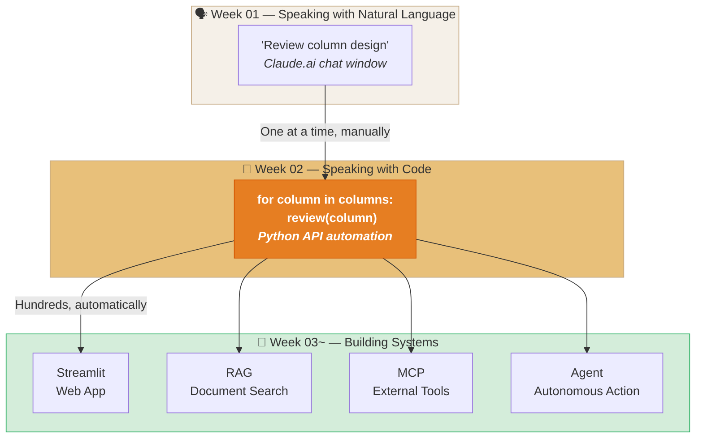

With the API, you can **automatically review hundreds of structural members**, **parse the review results into JSON and save them to a spreadsheet**, and **visualize them in a Streamlit web app**. This is "the meeting of AI and programming."

### Anthropic Skilljar Course

This lecture note is based on Anthropic's official training platform Skilljar: **"Building with the Claude API" Section 1: Getting Started with Claude** (16 lessons).

> [!ref] Source Mapping
> - Online course: [Building with the Claude API](https://anthropic.skilljar.com/claude-with-the-anthropic-api)
> - GitHub exercises: [anthropic_api_fundamentals](https://github.com/anthropics/courses/tree/master/anthropic_api_fundamentals)
> - Syllabus mapping: **Building — S1 (API Fundamentals) → W1-2** (based on v2.3)

---

## [Chapter 1] API Fundamentals and First Call

### 1.1 Course Overview

> [!abstract] Building with the Claude API
> An official Anthropic Skilljar course providing comprehensive coverage of the full Claude API spectrum.
> - **84 lessons**, 8.1 hours of video, 10 quizzes
> - Step-by-step learning from basics → conversation management → prompt engineering → tool use → agents
> - Python SDK-focused, includes hands-on code

This course consists of 7 Sections, and this lecture note covers **Section 1: Getting Started**.

| Section | Topic | Lessons | Mapped Week |
| ------ | ------------------------------- | :--: | :----: |
| **S1** | **Getting Started with Claude** | 16 | **W2** |
| S2 | Prompt Engineering & Evaluation | 16 | W3 |
| S3 | Tool Use with Claude | 14 | W4 |
| S4 | Retrieval Augmented Generation | 10 | W5 |
| S5 | Model Context Protocol | 12 | W7 |
| S6 | Claude Code & Computer Use | 8 | W9 |
| S7 | Agents and Workflows | 11 | W12 |

> [!ref] Source
> - Skilljar L01: Welcome to Building with the Claude API

---

### 1.2 Claude Model Family

Claude offers 3 model tiers based on use case and performance. Each model has different **speed-cost-performance** trade-offs.

| Model | Characteristics | Speed | Cost | Use Cases | Model Name Example |
| ---------- | -------- | --- | --- | ----------------- | ------------------- |
| **Haiku** | Fast and economical | ⚡⚡⚡ | $ | Classification, summarization, simple Q&A | `claude-haiku-4-5` |
| **Sonnet** | Balanced performance | ⚡⚡ | $$ | Coding, analysis, general tasks | `claude-sonnet-4-0` |
| **Opus** | Highest performance | ⚡ | $$$ | Complex reasoning, research, long-form analysis | `claude-opus-4-0` |

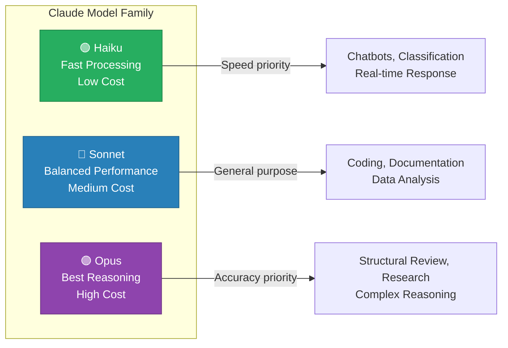

> [!tip] Model Selection Strategy
> - **Prototyping phase**: Start with Sonnet (fast iteration, reasonable cost)
> - **Batch processing**: Switch to Haiku (thousands of document classifications, summarizations)
> - **Precision analysis**: Upgrade to Opus (structural review, complex calculation verification)
> - Model naming convention: `claude-{tier}-{version}` (e.g., `claude-sonnet-4-0`)

> [!ref] Source
> - Skilljar L02: Overview of Claude Models

---

### 1.3 API Request Flow — 5 Steps (Five-Step Request Flow)

All interactions with the Claude API follow the same 5-step flow.

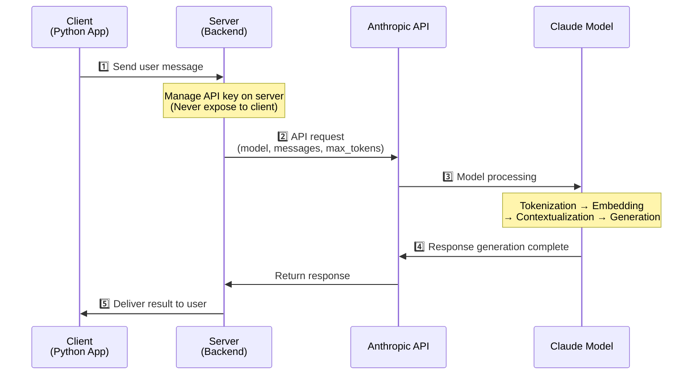

---

#### Step 1: Request to Server — Client → Server


*Step 1: User message is sent from the web/mobile app to the server*

When a user clicks "Send" in the chat interface, the message is sent **first to the developer's server**.

> [!question] Can't we call the API directly from the client?
> If the API key is included in client code (JavaScript, mobile app), **anyone can extract it**.
> - Opening the Network tab in browser developer tools exposes the API key
> - Malicious users can steal the key and make excessive API calls → **billing explosion**
> - Routing through a server keeps the key only on the server; the client never sees it

---

#### Step 2: Request to Anthropic API — Server → API


*Step 2: The server sends a request to the API via the Anthropic SDK. Four required fields must be included.*

The server calls the API using the Anthropic SDK (Python, TypeScript, etc.) or HTTP requests. Every request must include 4 required fields:

| Field | Purpose |
|---|---|
| **API Key** | Authentication key identifying the request to Anthropic |
| **Model** | Model name to use (e.g., `claude-sonnet-4-0`) |
| **Messages** | Message list containing user input text |
| **Max Tokens** | Maximum number of tokens Claude can generate |

---

#### Step 3: Model Processing — Claude Internal Processing

When the Anthropic API receives the request, the Claude model generates a response through a 4-stage pipeline.

**3-1. Tokenization + Embedding**


*Step 3a: Input text is split into tokens, and each token is converted into a high-dimensional embedding vector*

| Stage | Process | Description |
|---|---|---|
| **Tokenization** | Text → Tokens | "architectural engineering" → ["archit", "ectural", " engineering"] (subword splitting) |
| **Embedding** | Tokens → Vectors | Each token is converted into a high-dimensional numerical vector — a numerical representation of meaning |
| **Contextualization** | Computing inter-vector relationships | Self-Attention reflects relevance to surrounding tokens to refine embeddings |

**3-2. Generation**


*Step 3b: Contextualized embeddings pass through the output layer to produce a probability distribution over next tokens*

In the generation stage, Claude:
1. Passes contextualized embeddings to the **Output Layer**
2. Computes a **probability distribution** over all possible next tokens (e.g., "Quantum" 30%, "Great" 23%, "Are" 19%, ...)
3. Selects one token using the probability and **controlled randomness** (temperature)
4. Appends the selected token to the sequence and **repeats the entire process**

**3-3. Generation Stop Conditions**


*Step 3c: After each token generation, 3 stop conditions are checked*

After generating each token, Claude checks the following 3 conditions to decide whether to continue:

| Condition | Description | `stop_reason` |
| ------------------ | --------------------- | ----------------- |
| `max_tokens` reached | Reached the set maximum token count | `"max_tokens"` |
| Natural end (EOS) | Generated an End of Sequence token | `"end_turn"` |
| `stop_sequence` match | A specified stop string appeared in the output | `"stop_sequence"` |

> [!finding] `max_tokens` is a safety limit
> `max_tokens` is not a target saying "generate this much," but a **safety limit** saying "never generate more than this." Claude stops on its own at natural endpoints; `max_tokens` is just an upper bound to prevent infinite generation.

---

#### Step 4: Response to Server — API → Server


*Step 4: The Anthropic API returns the generation result to the server. The response includes Message, Usage, and Stop Reason.*

Once generation is complete, the API returns the following data to the server:

| Data | Purpose |
|---|---|
| **Message** | The "assistant" message containing the generated text |
| **Usage** | Input + output token counts (for cost tracking) |
| **Stop Reason** | Why generation stopped (`end_turn`, `max_tokens`, `stop_sequence`) |

---

#### Step 5: Response to Client — Server → Client


*Step 5: The server delivers the generated text to the client app for display to the user*

The server processes Claude's response (storage, filtering, etc.) and then delivers it to the client app. The user sees the AI's response in the chat interface.

> [!ref] Source
> - Skilljar L03: Accessing the API (includes 5:18 video frame captures)

---

### 1.4 API Key Issuance and Environment Setup

#### API Key Issuance Procedure

1. Go to [Anthropic Console](https://console.anthropic.com)
2. Settings → API Keys → **Create Key**
3. Name the key (e.g., `lec-llm-ae-ai`) → Create
4. **Immediately copy** the displayed key (it cannot be viewed again)

> [!method] API Key Security Management
> Never write API keys directly in code. Store them in a `.env` file and register it in `.gitignore`.
>
> ```bash
> # Create .env file
> echo 'ANTHROPIC_API_KEY="sk-ant-api03-..."' > .env
>
> # Add to .gitignore (don't push to Git)
> echo '.env' >> .gitignore
> ```

#### Development Environment Setup

```bash
# 1. Create and activate virtual environment
python -m venv .venv
source .venv/bin/activate  # Windows: .venv\Scripts\activate

# 2. Install required packages
pip install anthropic python-dotenv
```

`.env` file:
```
ANTHROPIC_API_KEY="sk-ant-api03-your-key-here"
```

> [!ref] Source
> - Skilljar L04: Getting an API Key

---

### 1.5 First API Call (First Request)

#### Basic Setup Code

```python
# === Basic setup (reusable in all examples) ===
from dotenv import load_dotenv
load_dotenv()  # Load environment variables from .env file

from anthropic import Anthropic

client = Anthropic()  # Automatically reads ANTHROPIC_API_KEY env var
model = "claude-sonnet-4-0"
```

> [!tip] You can also pass the API key directly when creating the `Anthropic()` client, but the environment variable approach is safer.
> ```python
> # Not recommended (key exposed in code)
> client = Anthropic(api_key="sk-ant-api03-...")
>
> # Recommended (auto-loaded from environment variable)
> client = Anthropic()
> ```

#### Sending the First Message

`client.messages.create()` requires 3 mandatory parameters:

| Parameter | Type | Description |
|---|---|---|
| `model` | `str` | Model name to use (e.g., `"claude-sonnet-4-0"`) |
| `max_tokens` | `int` | Maximum response token count (safety limit) |
| `messages` | `list[dict]` | Conversation message list (`role` + `content`) |

```python
# === First API call ===
message = client.messages.create(
    model=model,
    max_tokens=1024,
    messages=[
        {"role": "user", "content": "Explain the Claude API in one sentence."}
    ]
)

# Extract response text
print(message.content[0].text)
```

#### Response Structure Analysis

```python
# Key attributes of the response object
print(f"Role: {message.role}")              # "assistant"
print(f"Response: {message.content[0].text}")    # Actual response text
print(f"Stop reason: {message.stop_reason}")    # "end_turn" | "max_tokens"
print(f"Input tokens: {message.usage.input_tokens}")   # Tokens used for request
print(f"Output tokens: {message.usage.output_tokens}")  # Tokens used for response
```

> [!finding] Relationship Between Tokens and Cost
> API costs are proportional to **input tokens + output tokens**. Monitoring the `usage` field allows you to track costs.
> - Sonnet pricing: Input $3/1M tokens, Output $15/1M tokens
> - Above example (25+38 tokens) cost ≈ $0.0006 (less than 1 cent)

> [!ref] Source
> - Skilljar L05: Making a Request

---

### 1.6 Architectural Engineering Application: Automated Structural Calculation Reports

> [!method] Scenario: RC Column Design Review Automation
> In practice, when you need to perform repetitive design reviews for hundreds of columns, you can use the API to automatically review the design adequacy of each column.

```python
from dotenv import load_dotenv
load_dotenv()
from anthropic import Anthropic

client = Anthropic()
model = "claude-sonnet-4-0"

# Column design review request
column_review = client.messages.create(
    model=model,
    max_tokens=2048,
    messages=[
        {
            "role": "user",
            "content": """Please review the design adequacy of the following RC column.

Design conditions:
- Column section: 500mm × 500mm
- Concrete strength (f'c): 24 MPa
- Rebar yield strength (fy): 400 MPa
- Main bars: 8-D25 (SD400)
- Ties: D10@300
- Design axial force (Pu): 2,500 kN
- Design moment (Mu): 150 kN·m
- Applicable standard: KDS 14 20 20

Review items:
1. Axial force ratio check (maximum axial ratio ≤ 0.8)
2. Min/max reinforcement ratio check (0.01 ≤ ρ ≤ 0.08)
3. Tie spacing adequacy (KDS 14 20 22)
4. Summarize results in table format"""
        }
    ]
)

print(column_review.content[0].text)
print(f"\n--- Token Usage ---")
print(f"Input: {column_review.usage.input_tokens} tokens")
print(f"Output: {column_review.usage.output_tokens} tokens")
```

> [!tip] Practical Extension Ideas
> Wrapping the above code in a `for` loop allows you to **read column data from a CSV file and review them in batch**. This is the core value of the API — automation of manual work.

---

## [Chapter 2] Multi-Turn Conversations and System Prompts

### 2.1 Claude is Stateless

> [!question] What happens when you ask Claude about "what you said earlier"?
> Claude **does not remember previous conversations**. Each API call is completely independent, and context from previous conversations is not automatically carried over. To continue a conversation, the **developer must manage the conversation history directly**.

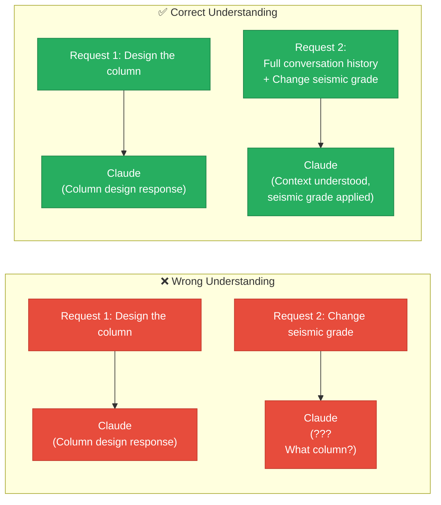

> [!finding] Core Principle
> The Claude API is **stateless**. With every request, the entire conversation history must be included in the `messages` list. In the web UI (claude.ai), this is handled automatically, but with the API, the developer must manage it manually.

---

### 2.2 Multi-Turn Conversation Implementation

#### Helper Functions

Define 3 helper functions to simplify conversation history management:

```python
from dotenv import load_dotenv
load_dotenv()
from anthropic import Anthropic

client = Anthropic()
model = "claude-sonnet-4-0"

# === Helper Functions ===

def add_user_message(messages: list, text: str):
    """Add a user message to the conversation history"""
    messages.append({"role": "user", "content": text})

def add_assistant_message(messages: list, text: str):
    """Add an assistant response to the conversation history"""
    messages.append({"role": "assistant", "content": text})

def chat(messages: list, system: str = None) -> str:
    """Send conversation history and return response text"""
    params = {
        "model": model,
        "max_tokens": 1000,
        "messages": messages
    }
    if system:
        params["system"] = system
    response = client.messages.create(**params)
    return response.content[0].text
```

#### Conversation Flow

```python
# === Multi-turn conversation example ===
messages = []

# Turn 1: User question
add_user_message(messages, "What is the significance of the minimum reinforcement ratio in RC beam design?")
response = chat(messages)
add_assistant_message(messages, response)
print(f"Claude: {response}\n")

# Turn 2: Follow-up question (using previous context)
add_user_message(messages, "Then, what is the formula for calculating the minimum reinforcement ratio according to KDS?")
response = chat(messages)
add_assistant_message(messages, response)
print(f"Claude: {response}\n")

# Turn 3: Additional question
add_user_message(messages, "Calculate it for f'c=30MPa, fy=400MPa.")
response = chat(messages)
add_assistant_message(messages, response)
print(f"Claude: {response}")
```

> [!method] Conversation History Management Pattern
> This pattern **must** be followed. If you don't add the response to the history, Claude won't know what it said in the next turn.

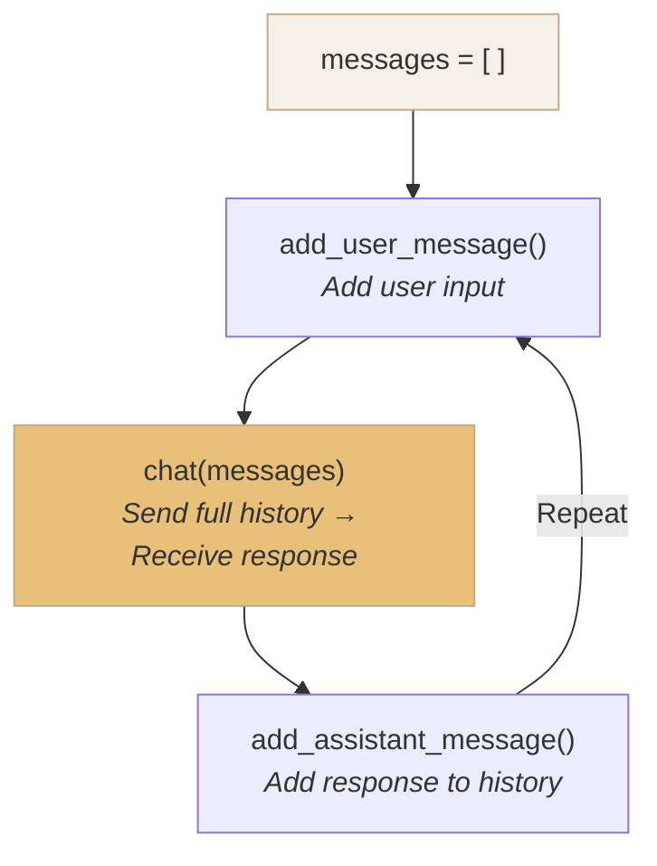

#### Interactive Chatbot Loop

```python
# === Interactive Chatbot ===
messages = []

print("Claude Chatbot (exit: 'quit' or 'q')")
print("=" * 50)

while True:
    user_input = input("\nUser: ").strip()
    if user_input.lower() in ("quit", "q", "exit"):
        print("Ending conversation.")
        break
    if not user_input:
        continue

    add_user_message(messages, user_input)
    response = chat(messages)
    add_assistant_message(messages, response)
    print(f"\nClaude: {response}")
```

> [!tip] Longer conversations increase token costs
> Since the **entire conversation history** is sent with every request, input tokens accumulate as the conversation grows.
> - 10-turn conversation: All messages from turns 1~10 are sent each time
> - Cost optimization: Summarize/delete old messages, or use Prompt Caching (covered in Section 7)

> [!ref] Source
> - Skilljar L06: Multi-Turn Conversations
> - Skilljar L07: Chat Exercise

---

### 2.3 System Prompts

A system prompt is a special instruction that defines Claude's **role, tone, and behavioral rules**. It is passed through a separate `system` parameter, not within the regular `messages`.

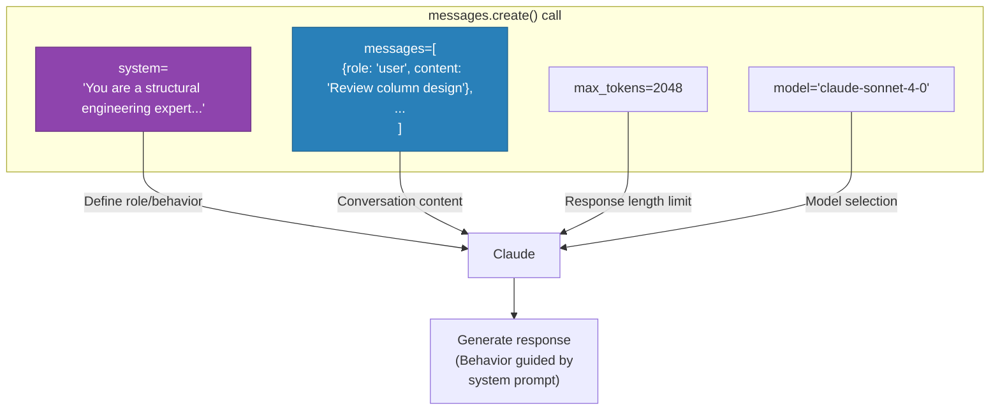

#### System Prompt vs User Message

| Aspect | System Prompt (`system=`) | User Message (`messages`) |
| ------- | -------------------- | -------------------- |
| **Location** | Separate `system` parameter | Inside `messages` list |
| **Role** | Defines Claude's persona/behavior | Actual conversation content |
| **Persistence** | Applied uniformly across all turns | Changes per turn |
| **Analogy** | Job description (JD) when hiring | Day-to-day work instructions |

#### Math Tutor Example

```python
# === System Prompt Example: Math Tutor ===
system_prompt = """You are a patient math tutor.

Behavioral rules:
- Don't give the student the answer directly
- Guide them step by step with hints and guiding questions
- Help the student find the answer on their own
- Maintain an encouraging tone
"""

messages = []
add_user_message(messages, "Solve 3x + 7 = 22 for me")
response = chat(messages, system=system_prompt)
print(response)
```

> [!ref] Source
> - Skilljar L08: System Prompts
> - Skilljar L09: System Prompts Exercise

---

### 2.4 Architectural Engineering Application: KDS-Based Structural Review Assistant

> [!method] Scenario: Structural Engineer AI Assistant
> Assign the role of a **structural engineering expert well-versed in KDS structural design standards** via system prompt, and review design conditions progressively through multi-turn conversation.

```python
# === Structural Review Expert System Prompt ===
structural_system = """You are a structural engineering AI assistant with deep expertise in Korean Building Structure Design Standards (KDS).

Areas of expertise:
- Concrete Structure Design Standards (KDS 14 20 00)
- Seismic Design Standards (KDS 41 17 00)
- Load Standards (KDS 41 10 15)

Behavioral rules:
1. Cite the applicable KDS clause number for all reviews
2. Show calculation processes step by step
3. Organize results in a table by review item
4. Suggest improvement measures when design is non-compliant
5. Explicitly state uncertain assumptions
"""

# === Multi-turn Structural Review ===
messages = []

# Turn 1: Initial design review request
add_user_message(messages, """Please review the design adequacy of the following RC column.

- Column section: 500mm × 500mm
- Concrete strength (f'c): 24 MPa
- Main bars: 8-D25 (SD400)
- Design axial force (Pu): 2,500 kN
- Design moment (Mu): 150 kN·m
- Seismic grade: Ordinary (Seismic Design Category C)""")

response1 = chat(messages, system=structural_system)
add_assistant_message(messages, response1)
print("=== Turn 1: Initial Design Review ===")
print(response1)

# Turn 2: Re-review with changed seismic grade
add_user_message(messages, """The seismic grade has been changed to 'Special (Seismic Design Category D)'.
Please re-review whether the existing design is still adequate under the revised conditions.""")

response2 = chat(messages, system=structural_system)
add_assistant_message(messages, response2)
print("\n=== Turn 2: Seismic Grade Change Re-review ===")
print(response2)

# Turn 3: Request for improvement plan
add_user_message(messages, "Please suggest improvement measures for non-compliant items.")

response3 = chat(messages, system=structural_system)
add_assistant_message(messages, response3)
print("\n=== Turn 3: Improvement Plan ===")
print(response3)
```

> [!finding] The Power of Multi-Turn Conversations
> Since Claude remembers the review results from Turn 1, a concise request like "change seismic grade only" in Turn 2 is sufficient for it to perform the re-review **while maintaining the full context**.

---

## [Chapter 3] Parameter Tuning and Streaming

### 3.1 Temperature — The Creativity vs Accuracy Dial

#### Claude's 3-Stage Text Generation

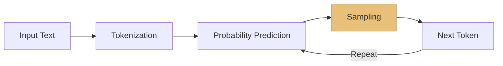

> [!method] 3 Stages of Token Generation
> 1. **Tokenization**: Split input text into token units
> 2. **Probability Prediction**: Compute probability distribution over each possible next token
> 3. **Sampling**: Select the next token from the probability distribution — **this is where temperature comes into play**

#### Effect of Temperature

Temperature adjusts the **sharpness** of the probability distribution:

| Temperature | Effect | Architectural Engineering Analogy |
|-------------|------|--------------|
| **0.0** | Always selects the highest probability token (deterministic) | Design code — only predetermined answers |
| **0.0 ~ 0.3** | Concentrates on a few top tokens | Structural calculation — only proven methods |
| **0.4 ~ 0.7** | Moderate diversity | Design alternative review — within reasonable range |
| **0.8 ~ 1.0** | Probabilities spread evenly → diverse selections | Initial idea sketch — free exploration |

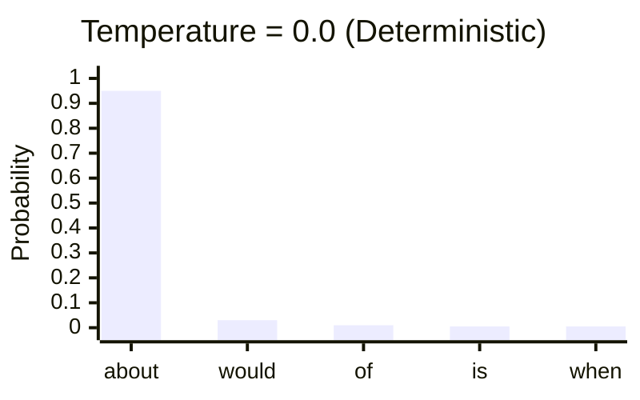

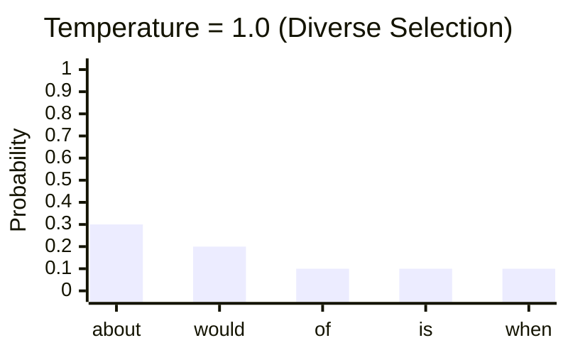

> [!tip] Temperature Guide by Use Case
> - **Structural calculations, data extraction, code generation**: `0.0 ~ 0.3` (accuracy first)
> - **Summarization, educational content, problem-solving**: `0.4 ~ 0.7` (balance)
> - **Brainstorming, creative writing, marketing copy**: `0.8 ~ 1.0` (creativity first)

#### Chat Function with Temperature

```python
def chat(messages, system=None, temperature=1.0):
    """Claude API call (with temperature)"""
    params = {
        "model": model,
        "max_tokens": 1000,
        "messages": messages,
        "temperature": temperature
    }
    if system:
        params["system"] = system
    return client.messages.create(**params).content[0].text
```

> [!finding] Temperature Default Value
> The Anthropic API's default temperature is `1.0`. If not explicitly set, maximum diversity is applied, so **for accuracy-critical engineering tasks, you must specify a low value**.

#### Architectural Engineering Application — Temperature Comparison Experiment

```python
# Structural calculation — accuracy first (temperature = 0.0)
messages_calc = []
add_user_message(messages_calc,
    "Calculate the axial load capacity Pn of a 500x500 RC column "
    "with f'c=24MPa, fy=400MPa according to KDS standards."
)
result_precise = chat(messages_calc, temperature=0.0)
print("=== Temperature 0.0 (Structural Calculation) ===")
print(result_precise)

# Design ideas — creativity first (temperature = 0.9)
messages_idea = []
add_user_message(messages_idea,
    "Brainstorm possible structural alternatives for the "
    "lateral force resisting system of a 20-story residential building."
)
result_creative = chat(messages_idea, temperature=0.9)
print("\n=== Temperature 0.9 (Brainstorming) ===")
print(result_creative)
```

> [!ref] Source
> - Skilljar L10: Temperature

---

### 3.2 Response Streaming

#### Why Is Streaming Needed?

A typical API call **waits until the entire response is generated** before returning it all at once. For long responses, this results in **10~30 seconds of waiting time**.

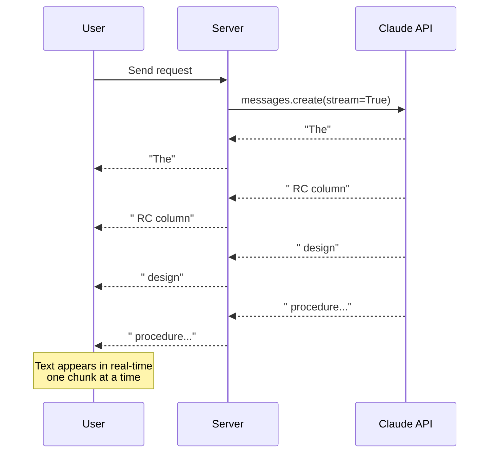

#### Stream Event Structure

| Event | Description | Included Data |
|--------|------|-------------|
| `message_start` | Message begins | Model name, role |
| `content_block_start` | Content block begins | Block index, type |
| `content_block_delta` | **Text chunk delivered** (repeated) | `delta.text` |
| `content_block_stop` | Content block ends | Block index |
| `message_delta` | Message metadata | `stop_reason`, usage |
| `message_stop` | Message fully complete | — |

#### Basic Streaming — Raw Events

```python
messages = []
add_user_message(messages, "Explain the deflection review procedure for RC beams.")

stream = client.messages.create(
    model=model,
    max_tokens=1000,
    messages=messages,
    stream=True
)

for event in stream:
    print(event)  # Print each event object
```

#### Simplified Streaming — text_stream

In most cases, only text chunks are needed:

```python
messages = []
add_user_message(messages, "Explain the RC beam deflection review procedure in 3 steps.")

with client.messages.stream(
    model=model,
    max_tokens=1000,
    messages=messages
) as stream:
    for text in stream.text_stream:
        print(text, end="", flush=True)  # Real-time output

print()  # Newline
```

> [!tip] Role of `flush=True`
> Python's `print()` buffers output until a newline by default. Setting `flush=True` ensures **each text chunk is immediately displayed on screen**.

#### Using the Final Message After Streaming

```python
with client.messages.stream(
    model=model,
    max_tokens=1000,
    messages=messages
) as stream:
    for text in stream.text_stream:
        print(text, end="", flush=True)

    # Obtain final message after stream ends
    final_message = stream.get_final_message()

print(f"\n\n--- Metadata ---")
print(f"Model: {final_message.model}")
print(f"Stop reason: {final_message.stop_reason}")
print(f"Input tokens: {final_message.usage.input_tokens}")
print(f"Output tokens: {final_message.usage.output_tokens}")
```

> [!ref] Source
> - Skilljar L11: Response Streaming

---

## [Chapter 4] Output Control and Structured Data


*Skilljar L12 --- Controlling Model Output overview: prefilling and stop sequences shape the output format*

### 4.1 Prefilling (Prefilled Assistant Messages)

Prefilling is a technique where the developer pre-provides the beginning of an `assistant` message, guiding Claude to **continue writing from that point**.


*Prefilling concept: Pre-providing an assistant message to guide the response direction*

> [!finding] Core Operating Principle
> - Claude **does not repeat** the prefilled text — it continues generating from that point
> - The prefilled content is recognized as "what Claude has already said," maintaining that direction
> - This allows precise control over the response's **format, perspective, and starting pattern**

```python
# Without prefilling — Claude freely addresses both sides
messages_free = []
add_user_message(messages_free, "Which is better, tea or coffee?")
print("=== Without Prefilling ===")
print(chat(messages_free))

# With prefilling — Force starting with "Coffee is better because"
messages_prefill = []
add_user_message(messages_prefill, "Which is better, tea or coffee?")
add_assistant_message(messages_prefill, "Coffee is better because")
print("\n=== With Prefilling ===")
answer = chat(messages_prefill)
print("Coffee is better because" + answer)
```

> [!tip] Response Assembly Note
> Claude does not include the prefilled text in its response. When composing the final output, you must manually concatenate **prefill text + generated text**.

> [!ref] Source
> - Skilljar L12: Controlling Model Output

---

### 4.2 Stop Sequences

Stop sequences cause Claude to **immediately stop generating** when it encounters a specific string during response generation.

| End Condition | `stop_reason` Value | Description |
|-----------|------------------|------|
| Natural end | `"end_turn"` | Claude naturally completed the response |
| Token limit | `"max_tokens"` | Reached `max_tokens` and was cut off |
| **Stop sequence** | `"stop_sequence"` | Specified string was generated, causing a halt |

```python
def chat(messages, system=None, temperature=1.0, stop_sequences=[]):
    """Claude API call (with stop_sequences)"""
    params = {
        "model": model, "max_tokens": 1000,
        "messages": messages, "temperature": temperature
    }
    if system:
        params["system"] = system
    if stop_sequences:
        params["stop_sequences"] = stop_sequences
    return client.messages.create(**params).content[0].text

# Count from 1 to 10 — stop at "5"
messages = []
add_user_message(messages, "Count from 1 to 10.")
result = chat(messages, stop_sequences=["5"])
print(result)
# Output: "1, 2, 3, 4, "  (5 is not included)
```

---

### 4.3 Structured Data Extraction — Combining Prefilling + Stop Sequences


*Prefill + stop sequence combo --- the pure-JSON extraction flow*

When asking Claude for JSON, explanatory text often comes along with it. The **prefill + stop sequence combo** extracts only the pure data.

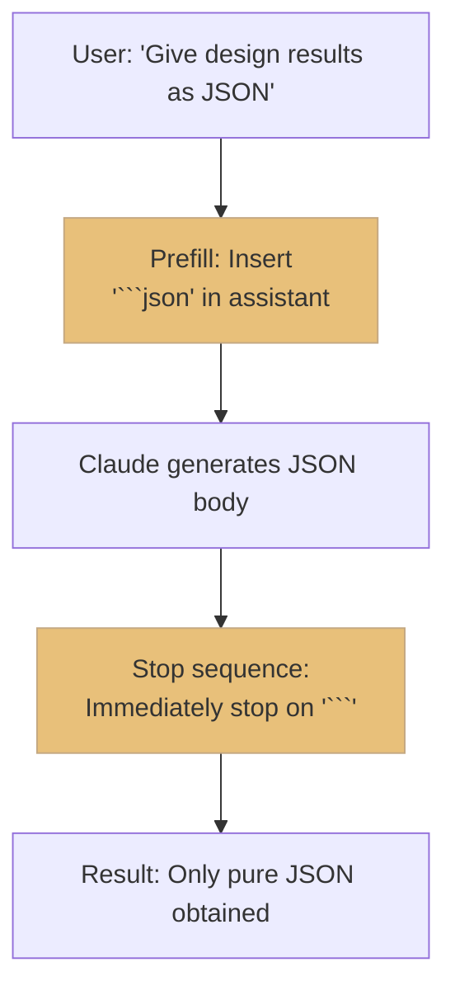

```python
import json

messages = []
add_user_message(messages,
    "Output the design results of a 500x500 RC column as JSON. "
    "f'c=24MPa, fy=400MPa, main bars 8-D25."
)
# Prefill: Beginning of a JSON code block
add_assistant_message(messages, "```json\n")

# Stop sequence: Code block closing marker
raw_text = chat(messages, stop_sequences=["```"], temperature=0.0)

# Parse
data = json.loads(raw_text.strip())
print(json.dumps(data, indent=2, ensure_ascii=False))
```

> [!finding] Why This Technique Works
> 1. The **prefill** `` ```json `` makes Claude recognize that "a JSON code block has already been opened"
> 2. Claude naturally generates the JSON body
> 3. When the JSON ends, it tries to close the code block with `` ``` `` → **caught by the stop sequence**
> 4. Only pure JSON remains in the result → directly parseable with `json.loads()`

#### Applying to Various Formats

| Output Format | Prefill (assistant) | Stop Sequence |
|-----------|-------------------|-------------|
| JSON | `` ```json\n `` | `` ``` `` |
| Python code | `` ```python\n `` | `` ``` `` |
| CSV | `` ```csv\n `` | `` ``` `` |
| XML | `<root>` | `</root>` |

#### Architectural Engineering Application — Extracting Structural Data from Unstructured Text

```python
import json

# Unstructured structural review memo
unstructured_text = """
Discussed column C3 on the 3rd floor at today's site meeting.
Current section is 400x400 but the axial force came in larger than expected.
Director Kim requested a change to 500x500. Concrete upgraded to 30MPa.
Rebar likely needs to change from 8-D25 to 12-D29.
Must submit revised drawings by next Tuesday.
"""

messages = []
add_user_message(messages,
    f"Extract structural change information from the following unstructured memo as JSON:\n\n"
    f"{unstructured_text}\n\n"
    f"JSON keys: member_id, floor, original_section, revised_section, "
    f"original_rebar, revised_rebar, concrete_grade, deadline, requester"
)
add_assistant_message(messages, "```json\n")

raw = chat(messages, stop_sequences=["```"], temperature=0.0)
change_order = json.loads(raw.strip())
print(json.dumps(change_order, indent=2, ensure_ascii=False))
```

> [!tip] Practical Applications
> Extending this pattern enables **automated design change order generation**, **construction daily report data extraction**, **meeting minutes action item organization**, and more.

> [!ref] Source
> - Skilljar L12: Controlling Model Output
> - Skilljar L13: Structured Data
> - Skilljar L14: Structured Data Exercise

---

## [Chapter 5] Comprehensive Practice and Self-Assessment

### 5.1 Integrated Interactive Chatbot

Integrating all techniques learned in Section 1 into a single program:

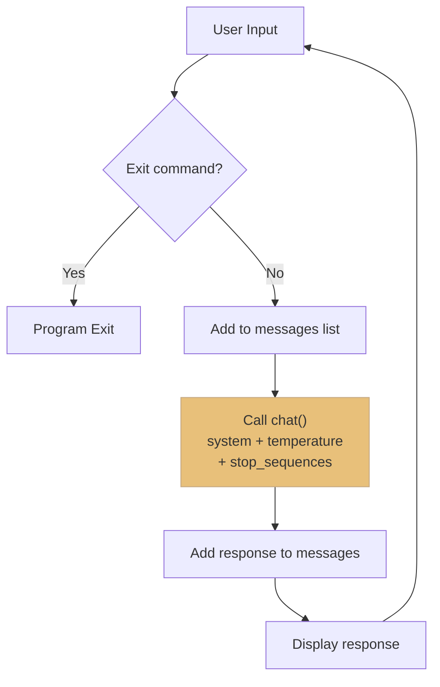

```python
from dotenv import load_dotenv
load_dotenv()
from anthropic import Anthropic

client = Anthropic()
model = "claude-sonnet-4-0"

def chat(messages, system=None, temperature=1.0, stop_sequences=[]):
    """Claude API call — all parameters integrated"""
    params = {
        "model": model, "max_tokens": 2000,
        "messages": messages, "temperature": temperature
    }
    if system:
        params["system"] = system
    if stop_sequences:
        params["stop_sequences"] = stop_sequences
    return client.messages.create(**params).content[0].text

system = (
    "You are an AI assistant specializing in structural engineering.\n"
    "You answer according to KDS 14 20 (Concrete Structure Design Standards).\n"
    "When calculations are required, show the step-by-step solution process.\n"
    "Always specify units and state assumptions first."
)

messages = []
print("=== Structural Engineering AI Assistant ===")
print("Type 'quit' to exit.\n")

while True:
    user_input = input("You: ").strip()
    if not user_input:
        continue
    if user_input.lower() in ["quit", "exit"]:
        print("Ending conversation.")
        break

    messages.append({"role": "user", "content": user_input})
    answer = chat(messages, system=system, temperature=0.3)
    messages.append({"role": "assistant", "content": answer})
    print(f"\nClaude: {answer}\n")
```

---

### 5.2 Streaming Version Chatbot

```python
from dotenv import load_dotenv
load_dotenv()
from anthropic import Anthropic

client = Anthropic()
model = "claude-sonnet-4-0"

system = (
    "You are an AI assistant specializing in structural engineering. "
    "You answer according to KDS 14 20 standards."
)

messages = []
print("=== Structural Engineering AI (Streaming Mode) ===\n")

while True:
    user_input = input("You: ").strip()
    if not user_input:
        continue
    if user_input.lower() in ["quit", "exit"]:
        break

    messages.append({"role": "user", "content": user_input})

    print("Claude: ", end="")
    with client.messages.stream(
        model=model,
        max_tokens=2000,
        system=system,
        messages=messages,
        temperature=0.3
    ) as stream:
        full_response = ""
        for text in stream.text_stream:
            print(text, end="", flush=True)
            full_response += text

        final = stream.get_final_message()

    messages.append({"role": "assistant", "content": full_response})
    print(f"\n[Tokens: Input {final.usage.input_tokens} / "
          f"Output {final.usage.output_tokens}]\n")
```

---

### 5.3 Self-Assessment Quiz — Section 1 Core Check

> [!question] Q1. What are the 3 required parameters for `client.messages.create()`?
> **Answer**: `model`, `max_tokens`, `messages`

> [!question] Q2. Is the `system` prompt included inside the `messages` list?
> **Answer**: No. `system` is passed as a **separate parameter** to `messages.create()`.

> [!question] Q3. Explain the difference between `temperature=0.0` and `temperature=1.0`.
> **Answer**: `0.0` always selects the highest probability token, producing deterministic output. `1.0` uses the probability distribution as-is, generating diverse outputs.

> [!question] Q4. Does Claude automatically remember previous conversations?
> **Answer**: No. The Claude API is stateless. The entire previous conversation must be included in the `messages` list with every call.

> [!question] Q5. What are the 3 values of `stop_reason` and their meanings?
> **Answer**: `"end_turn"` (natural end), `"max_tokens"` (limit reached), `"stop_sequence"` (stop sequence match)

> [!question] Q6. Explain the principle of Prefilling.
> **Answer**: Adding an `assistant` role message at the end of the `messages` list makes Claude recognize it as "already said" and continue from there. The prefilled text is not repeated in the response.

> [!question] Q7. Why combine prefilling + stop sequences for structured data extraction?
> **Answer**: Providing a code block start (`` ```json ``) as a prefill makes Claude generate JSON immediately, and the stop sequence (`` ``` ``) halts it at the end, yielding only pure JSON that can be parsed directly.

> [!question] Q8. What is the difference between `stream.text_stream` and raw event streaming?
> **Answer**: Raw events (`stream=True`) return all event objects. `text_stream` is a convenience interface that extracts only text chunks.

---

### 5.4 Architectural Engineering Domain Comprehensive Assignment

> [!action] Assignment: Structural Member Design Review Chatbot

Implement a **structural member design review chatbot** that meets the following requirements.

| Item | Details |
|------|-----------|
| System Prompt | Assign KDS 14 20 expert role, show calculations step by step |
| Temperature | `0.2` (engineering accuracy focus) |
| Streaming | Real-time response display + token usage output |
| JSON Output Mode | Return design results as JSON when `/json` command is input |
| Conversation Persistence | Maintain previous conversation context for follow-up questions |

**Test Scenario:**
```
You: Review the flexural design for a 350x600 beam, f'c=27MPa, fy=400MPa, Mu=380kN·m
Claude: (Step-by-step calculation process via streaming)

You: Also review shear force Vu=250kN
Claude: (Maintains previous context, adds shear design review)

You: /json Organize the above review results as structured data
Claude (JSON mode):
{
  "beam_design": {
    "section": {"b_mm": 350, "d_mm": 600},
    "flexure": {"Mu_kNm": 380, "As_required_mm2": 2145, "bars": "5-D25"},
    "shear": {"Vu_kN": 250, "stirrup": "D10@200"},
    "check": {"flexure": "OK", "shear": "OK"}
  }
}
```

---

### 5.5 Section 1 Learning Summary

| Topic | Key Concepts | Architectural Engineering Application |
|-----------|-------------|---------------|
| API Call | `model`, `max_tokens`, `messages` | Basic structural Q&A |
| System Prompt | Role assignment, behavior control | KDS expert role |
| Conversation Management | Stateless, history list | Multi-stage design review |
| Temperature | 0.0~1.0, accuracy vs creativity | Calculation (0.0) vs Ideas (0.9) |
| Streaming | `text_stream`, real-time UX | Real-time display of long calculations |
| Prefilling | Pre-providing assistant message | Forcing output format |
| Stop Sequences | `stop_sequences`, early termination | Clean JSON/code extraction |
| Combined Technique | Prefill + stop sequences | Automated design result parsing |

```mermaid
graph LR
    subgraph Ch1["Ch.1: API Basics"]
        A["Model Selection"] --> B["API Key Setup"]
        B --> C["First Call"]
    end

    subgraph Ch2["Ch.2: Conversation Management"]
        D["Understanding Stateless"] --> E["Multi-Turn"]
        E --> F["System Prompt"]
    end

    subgraph Ch3["Ch.3: Parameters"]
        G["Temperature"] --> H["Streaming"]
    end

    subgraph Ch4["Ch.4: Output Control"]
        I["Prefilling"] --> J["Stop Sequences"]
        J --> K["JSON Extraction"]
    end

    C --> D
    F --> G
    H --> I
    K --> L["Ch.5: Integration"]

    classDef ch1 fill:#2980b9,stroke:#1f618d,color:#fff
    classDef ch2 fill:#8e44ad,stroke:#6c3483,color:#fff
    classDef ch3 fill:#e67e22,stroke:#d35400,color:#fff
    classDef ch4 fill:#27ae60,stroke:#1e8449,color:#fff

    class A,B,C ch1
    class D,E,F ch2
    class G,H ch3
    class I,J,K ch4
```

---

## 📝 Lab Exercises

| Exercise | Location | Description |
| ------------------------------- | -------------------------------- | -------------------- |
| 001-requests.ipynb | `03-Exercises/Week_02/` | First API call practice |
| 002_system_prompt.ipynb | `03-Exercises/Week_02/` | System prompt practice |
| 003_temperature.ipynb | `03-Exercises/Week_02/` | Temperature comparison practice |
| 004_streaming.ipynb | `03-Exercises/Week_02/` | Streaming practice |
| 005_controlling_output.ipynb | `03-Exercises/Week_02/` | Prefilling/stop sequence practice |
| 006_structured_data.ipynb | `03-Exercises/Week_02/` | Structured data extraction practice |
| Skilljar S1 Exercises | `03-Exercises/Week_02/skilljar/` | Additional exercises based on Skilljar course |

---

## 📚 References

> [!ref] Official Documentation
> - [Anthropic API Reference — Messages](https://docs.anthropic.com/en/api/messages)
> - [Anthropic API — Streaming](https://docs.anthropic.com/en/api/messages-streaming)
> - [Anthropic Python SDK](https://github.com/anthropics/anthropic-sdk-python)

> [!ref] Anthropic Educational Materials
> - [Building with the Claude API (Skilljar)](https://anthropic.skilljar.com/claude-with-the-anthropic-api)
> - [API Fundamentals Notebooks (GitHub)](https://github.com/anthropics/courses/tree/master/anthropic_api_fundamentals)

> [!ref] Architectural Engineering Standards
> - [KDS 14 20 — Concrete Structure Design Standards](https://www.kcsc.re.kr)
> - [KDS 41 17 — Building Seismic Design Standards](https://www.kcsc.re.kr)

---

## Related

- [[Week_01|Week 01: AI Strategy and Prompt Engineering]]
- [[Week_03|Week 03: Prompt Engineering & Evaluation (S2)]]
- [[00-Syllabus/LLM_AE_AI_Implementation_Syllabus_v2.3|Syllabus v2.3]]
