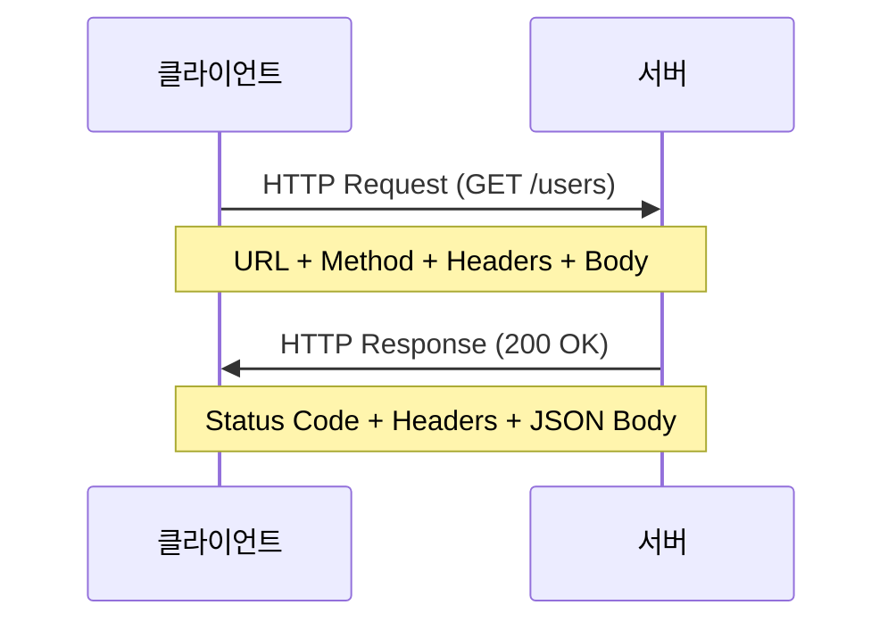
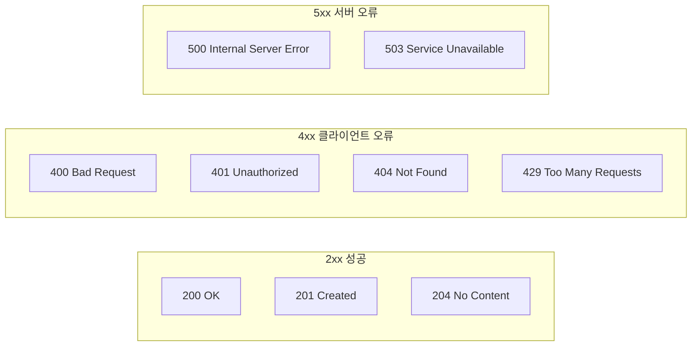
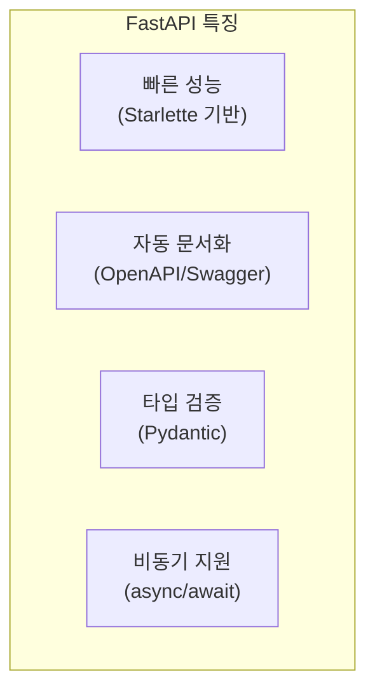
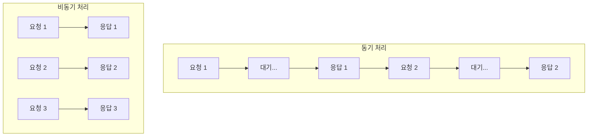
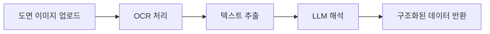

# 3주차: Python API 통신 기초

---

## 📌 강의 중점

- **REST API** 개념과 HTTP 프로토콜 이해
- **httpx/requests** 라이브러리를 활용한 API 호출
- **FastAPI**로 간단한 웹 서버 구축
- **비동기 처리**와 에러 핸들링

---

## 🎯 학습 목표

학습 완료 후 다음을 수행할 수 있습니다:

- REST API의 구조와 HTTP 메서드를 설명할 수 있다
- Python으로 외부 API를 호출하고 응답을 처리할 수 있다
- FastAPI를 사용하여 간단한 웹 서버를 구축할 수 있다
- 비동기 API 호출을 구현할 수 있다

---

## [Chapter 1] REST API 기초

### 1.1 REST API란?

**REST** (Representational State Transfer): 웹 서비스 설계를 위한 아키텍처 스타일



### 1.2 HTTP 메서드

| 메서드 | 용도 | 예시 |
|--------|------|------|
| **GET** | 리소스 조회 | `GET /api/buildings` |
| **POST** | 리소스 생성 | `POST /api/buildings` |
| **PUT** | 리소스 전체 수정 | `PUT /api/buildings/1` |
| **PATCH** | 리소스 일부 수정 | `PATCH /api/buildings/1` |
| **DELETE** | 리소스 삭제 | `DELETE /api/buildings/1` |

### 1.3 HTTP 상태 코드



### 1.4 JSON 데이터 형식

```json
{
  "building": {
    "id": 1,
    "name": "테크노 타워",
    "floors": 25,
    "structure_type": "철골 모멘트 골조",
    "location": {
      "city": "서울",
      "district": "강남구"
    },
    "members": [
      {"type": "column", "section": "H-400x400x13x21"},
      {"type": "beam", "section": "H-500x200x10x16"}
    ]
  }
}
```

### 📚 참고 자료

- [REST API Tutorial](https://restfulapi.net/)
- [HTTP MDN Documentation](https://developer.mozilla.org/en-US/docs/Web/HTTP)
- [JSON Specification](https://www.json.org/)

---

## [Chapter 2] Python HTTP 클라이언트

### 2.1 requests 라이브러리

```python
import requests

# GET 요청
response = requests.get("https://api.example.com/buildings")
print(response.status_code)  # 200
print(response.json())       # JSON 파싱

# POST 요청
data = {
    "name": "신규 빌딩",
    "floors": 10
}
response = requests.post(
    "https://api.example.com/buildings",
    json=data,
    headers={"Authorization": "Bearer token123"}
)

# 에러 처리
response.raise_for_status()  # 4xx/5xx에서 예외 발생
```

### 2.2 httpx 라이브러리 (권장)

```python
import httpx

# 동기 클라이언트
with httpx.Client() as client:
    response = client.get("https://api.example.com/buildings")
    data = response.json()

# 비동기 클라이언트
import asyncio

async def fetch_buildings():
    async with httpx.AsyncClient() as client:
        response = await client.get("https://api.example.com/buildings")
        return response.json()

# 실행
result = asyncio.run(fetch_buildings())
```

### 2.3 LLM API 호출 예시

```python
import httpx
from pydantic import BaseModel


class Message(BaseModel):
    role: str
    content: str


class ClaudeClient:
    """Claude API 클라이언트"""

    BASE_URL = "https://api.anthropic.com/v1"

    def __init__(self, api_key: str):
        self.api_key = api_key
        self.headers = {
            "x-api-key": api_key,
            "anthropic-version": "2023-06-01",
            "content-type": "application/json"
        }

    def chat(self, messages: list[Message], model: str = "claude-3-5-sonnet-20241022"):
        """메시지 전송"""
        with httpx.Client(timeout=60.0) as client:
            response = client.post(
                f"{self.BASE_URL}/messages",
                headers=self.headers,
                json={
                    "model": model,
                    "max_tokens": 4096,
                    "messages": [m.model_dump() for m in messages]
                }
            )
            response.raise_for_status()
            return response.json()

    async def chat_async(self, messages: list[Message], model: str = "claude-3-5-sonnet-20241022"):
        """비동기 메시지 전송"""
        async with httpx.AsyncClient(timeout=60.0) as client:
            response = await client.post(
                f"{self.BASE_URL}/messages",
                headers=self.headers,
                json={
                    "model": model,
                    "max_tokens": 4096,
                    "messages": [m.model_dump() for m in messages]
                }
            )
            response.raise_for_status()
            return response.json()


# 사용 예시
client = ClaudeClient(api_key="sk-ant-...")
messages = [Message(role="user", content="안녕하세요")]
response = client.chat(messages)
print(response["content"][0]["text"])
```

### 2.4 재시도 및 에러 처리

```python
import httpx
from tenacity import retry, stop_after_attempt, wait_exponential


class RobustAPIClient:
    """재시도 로직이 포함된 API 클라이언트"""

    def __init__(self, base_url: str, api_key: str):
        self.base_url = base_url
        self.api_key = api_key

    @retry(
        stop=stop_after_attempt(3),
        wait=wait_exponential(multiplier=1, min=2, max=10)
    )
    def request(self, method: str, endpoint: str, **kwargs):
        """재시도가 포함된 HTTP 요청"""
        with httpx.Client(timeout=30.0) as client:
            response = client.request(
                method,
                f"{self.base_url}{endpoint}",
                headers={"Authorization": f"Bearer {self.api_key}"},
                **kwargs
            )

            # Rate limit 처리
            if response.status_code == 429:
                retry_after = int(response.headers.get("Retry-After", 5))
                raise httpx.HTTPStatusError(
                    f"Rate limited. Retry after {retry_after}s",
                    request=response.request,
                    response=response
                )

            response.raise_for_status()
            return response.json()

    def get(self, endpoint: str, **kwargs):
        return self.request("GET", endpoint, **kwargs)

    def post(self, endpoint: str, **kwargs):
        return self.request("POST", endpoint, **kwargs)
```

### 📚 참고 자료

- [httpx Documentation](https://www.python-httpx.org/)
- [requests Documentation](https://requests.readthedocs.io/)
- [tenacity - Retry Library](https://tenacity.readthedocs.io/)

---

## [Chapter 3] FastAPI 웹 서버

### 3.1 FastAPI 소개



### 3.2 기본 서버 구축

```python
# main.py
from fastapi import FastAPI, HTTPException
from pydantic import BaseModel

app = FastAPI(
    title="건축 AI API",
    description="건축공학 LLM 서비스 API",
    version="1.0.0"
)


# 데이터 모델 정의
class Building(BaseModel):
    name: str
    floors: int
    structure_type: str


class BuildingResponse(BaseModel):
    id: int
    name: str
    floors: int
    structure_type: str


# 임시 데이터 저장소
buildings_db: dict[int, Building] = {}
current_id = 0


# 엔드포인트 정의
@app.get("/")
def read_root():
    return {"message": "건축 AI API에 오신 것을 환영합니다"}


@app.get("/buildings", response_model=list[BuildingResponse])
def list_buildings():
    """모든 건물 조회"""
    return [
        BuildingResponse(id=id, **building.model_dump())
        for id, building in buildings_db.items()
    ]


@app.get("/buildings/{building_id}", response_model=BuildingResponse)
def get_building(building_id: int):
    """특정 건물 조회"""
    if building_id not in buildings_db:
        raise HTTPException(status_code=404, detail="건물을 찾을 수 없습니다")
    return BuildingResponse(id=building_id, **buildings_db[building_id].model_dump())


@app.post("/buildings", response_model=BuildingResponse, status_code=201)
def create_building(building: Building):
    """새 건물 등록"""
    global current_id
    current_id += 1
    buildings_db[current_id] = building
    return BuildingResponse(id=current_id, **building.model_dump())


@app.delete("/buildings/{building_id}")
def delete_building(building_id: int):
    """건물 삭제"""
    if building_id not in buildings_db:
        raise HTTPException(status_code=404, detail="건물을 찾을 수 없습니다")
    del buildings_db[building_id]
    return {"message": "삭제되었습니다"}
```

### 3.3 서버 실행

```bash
# 개발 모드 (자동 재시작)
uvicorn main:app --reload --port 8000

# 프로덕션 모드
uvicorn main:app --host 0.0.0.0 --port 8000 --workers 4
```

**접속 URL**:
- API: http://localhost:8000
- Swagger 문서: http://localhost:8000/docs
- ReDoc 문서: http://localhost:8000/redoc

### 3.4 의존성 주입

```python
from fastapi import Depends
from functools import lru_cache
import anthropic


class Settings:
    anthropic_api_key: str = "sk-ant-..."


@lru_cache
def get_settings() -> Settings:
    return Settings()


def get_llm_client(settings: Settings = Depends(get_settings)):
    return anthropic.Anthropic(api_key=settings.anthropic_api_key)


@app.post("/analyze")
async def analyze_structure(
    query: str,
    client: anthropic.Anthropic = Depends(get_llm_client)
):
    """구조 분석 요청"""
    response = client.messages.create(
        model="claude-3-5-sonnet-20241022",
        max_tokens=1024,
        system="당신은 건축구조 전문가입니다.",
        messages=[{"role": "user", "content": query}]
    )
    return {"analysis": response.content[0].text}
```

### 3.5 미들웨어와 CORS

```python
from fastapi import FastAPI
from fastapi.middleware.cors import CORSMiddleware
import time
import logging

app = FastAPI()

# CORS 설정
app.add_middleware(
    CORSMiddleware,
    allow_origins=["http://localhost:3000"],  # 프론트엔드 URL
    allow_credentials=True,
    allow_methods=["*"],
    allow_headers=["*"],
)


# 요청 로깅 미들웨어
@app.middleware("http")
async def log_requests(request, call_next):
    start_time = time.time()
    response = await call_next(request)
    process_time = time.time() - start_time

    logging.info(
        f"{request.method} {request.url.path} "
        f"- {response.status_code} - {process_time:.3f}s"
    )
    return response
```

### 📚 참고 자료

- [FastAPI Documentation](https://fastapi.tiangolo.com/)
- [Pydantic Documentation](https://docs.pydantic.dev/)
- [Uvicorn Documentation](https://www.uvicorn.org/)

---

## [Chapter 4] 비동기 프로그래밍

### 4.1 동기 vs 비동기



### 4.2 asyncio 기본

```python
import asyncio

async def fetch_data(name: str, delay: float) -> str:
    """비동기 데이터 fetch 시뮬레이션"""
    print(f"[{name}] 요청 시작")
    await asyncio.sleep(delay)  # 비차단 대기
    print(f"[{name}] 응답 완료")
    return f"{name} 결과"


async def main():
    # 순차 실행 (느림)
    result1 = await fetch_data("A", 1)
    result2 = await fetch_data("B", 1)
    # 총 2초 소요

    # 병렬 실행 (빠름)
    results = await asyncio.gather(
        fetch_data("A", 1),
        fetch_data("B", 1),
        fetch_data("C", 1),
    )
    # 총 1초 소요


asyncio.run(main())
```

### 4.3 비동기 HTTP 클라이언트

```python
import asyncio
import httpx


async def fetch_multiple_apis():
    """여러 API를 동시에 호출"""

    urls = [
        "https://api.example.com/buildings",
        "https://api.example.com/materials",
        "https://api.example.com/codes",
    ]

    async with httpx.AsyncClient() as client:
        # 모든 요청을 동시에 실행
        tasks = [client.get(url) for url in urls]
        responses = await asyncio.gather(*tasks)

        results = {}
        for url, response in zip(urls, responses):
            if response.status_code == 200:
                results[url] = response.json()

        return results


# 실행
results = asyncio.run(fetch_multiple_apis())
```

### 4.4 FastAPI 비동기 엔드포인트

```python
from fastapi import FastAPI
import httpx
import anthropic

app = FastAPI()


# 비동기 LLM 호출
@app.post("/chat")
async def chat(message: str):
    """비동기 채팅 엔드포인트"""
    client = anthropic.AsyncAnthropic()

    response = await client.messages.create(
        model="claude-3-5-sonnet-20241022",
        max_tokens=1024,
        messages=[{"role": "user", "content": message}]
    )

    return {"response": response.content[0].text}


# 여러 LLM 동시 호출
@app.post("/multi-analyze")
async def multi_analyze(queries: list[str]):
    """여러 질문을 동시에 분석"""
    client = anthropic.AsyncAnthropic()

    async def analyze(query: str):
        response = await client.messages.create(
            model="claude-3-5-sonnet-20241022",
            max_tokens=512,
            messages=[{"role": "user", "content": query}]
        )
        return response.content[0].text

    # 모든 분석을 동시에 실행
    tasks = [analyze(q) for q in queries]
    results = await asyncio.gather(*tasks)

    return {"results": list(zip(queries, results))}
```

### 4.5 스트리밍 응답

```python
from fastapi import FastAPI
from fastapi.responses import StreamingResponse
import anthropic

app = FastAPI()


@app.post("/stream")
async def stream_chat(message: str):
    """스트리밍 채팅 응답"""

    async def generate():
        client = anthropic.AsyncAnthropic()

        async with client.messages.stream(
            model="claude-3-5-sonnet-20241022",
            max_tokens=1024,
            messages=[{"role": "user", "content": message}]
        ) as stream:
            async for text in stream.text_stream:
                yield text

    return StreamingResponse(
        generate(),
        media_type="text/event-stream"
    )
```

### 📚 참고 자료

- [Python asyncio Documentation](https://docs.python.org/3/library/asyncio.html)
- [Real Python - Async IO](https://realpython.com/async-io-python/)
- [FastAPI Async](https://fastapi.tiangolo.com/async/)

---

## 💻 실습 코드

### 실습 1: 공공 API 호출

```python
# practice/fetch_public_api.py
"""공공 API 호출 실습"""

import httpx
import json


def fetch_building_codes():
    """국가법령정보센터 건축법 조회 (예시)"""

    # 실제 API URL로 대체 필요
    url = "https://api.example.com/codes"

    params = {
        "category": "건축법",
        "keyword": "내진설계"
    }

    with httpx.Client(timeout=30.0) as client:
        try:
            response = client.get(url, params=params)
            response.raise_for_status()

            data = response.json()
            print(json.dumps(data, indent=2, ensure_ascii=False))
            return data

        except httpx.HTTPStatusError as e:
            print(f"HTTP 오류: {e.response.status_code}")
        except httpx.RequestError as e:
            print(f"요청 오류: {e}")

    return None


if __name__ == "__main__":
    fetch_building_codes()
```

### 실습 2: 간단한 REST API 서버

```python
# practice/simple_api.py
"""건축 정보 REST API"""

from fastapi import FastAPI, HTTPException, Query
from pydantic import BaseModel
from enum import Enum

app = FastAPI(title="건축 정보 API")


# Enum 정의
class StructureType(str, Enum):
    STEEL_FRAME = "철골 구조"
    RC = "철근콘크리트 구조"
    SRC = "철골철근콘크리트 구조"
    WOOD = "목구조"


# 데이터 모델
class StructuralMember(BaseModel):
    name: str
    section: str
    material: str
    length: float  # mm


class Building(BaseModel):
    name: str
    floors: int
    structure_type: StructureType
    total_area: float  # m²
    members: list[StructuralMember] = []


# 데이터베이스 시뮬레이션
buildings: dict[int, Building] = {
    1: Building(
        name="테크노 타워",
        floors=25,
        structure_type=StructureType.STEEL_FRAME,
        total_area=15000.0,
        members=[
            StructuralMember(
                name="기둥 C1",
                section="H-400x400x13x21",
                material="SM490",
                length=4000
            )
        ]
    )
}


# 엔드포인트
@app.get("/buildings")
def list_buildings(
    structure_type: StructureType | None = None,
    min_floors: int = Query(default=0, ge=0),
):
    """건물 목록 조회 (필터링 가능)"""
    result = []
    for id, building in buildings.items():
        if structure_type and building.structure_type != structure_type:
            continue
        if building.floors < min_floors:
            continue
        result.append({"id": id, **building.model_dump()})
    return result


@app.get("/buildings/{building_id}")
def get_building(building_id: int):
    """건물 상세 조회"""
    if building_id not in buildings:
        raise HTTPException(status_code=404, detail="건물을 찾을 수 없습니다")
    return {"id": building_id, **buildings[building_id].model_dump()}


@app.post("/buildings", status_code=201)
def create_building(building: Building):
    """건물 등록"""
    new_id = max(buildings.keys(), default=0) + 1
    buildings[new_id] = building
    return {"id": new_id, "message": "건물이 등록되었습니다"}


@app.get("/buildings/{building_id}/members")
def get_members(building_id: int):
    """건물의 구조 부재 조회"""
    if building_id not in buildings:
        raise HTTPException(status_code=404, detail="건물을 찾을 수 없습니다")
    return buildings[building_id].members


# 실행: uvicorn practice.simple_api:app --reload
```

### 실습 3: LLM API 래퍼 서버

```python
# practice/llm_api_server.py
"""LLM API 래퍼 서버"""

from fastapi import FastAPI, HTTPException, Depends
from pydantic import BaseModel
from pydantic_settings import BaseSettings
import anthropic


class Settings(BaseSettings):
    anthropic_api_key: str

    class Config:
        env_file = ".env"


class ChatRequest(BaseModel):
    message: str
    system_prompt: str = "당신은 건축구조 전문가입니다."
    max_tokens: int = 1024


class ChatResponse(BaseModel):
    response: str
    usage: dict


app = FastAPI(title="건축 AI 채팅 API")


def get_settings():
    return Settings()


def get_client(settings: Settings = Depends(get_settings)):
    return anthropic.Anthropic(api_key=settings.anthropic_api_key)


@app.post("/chat", response_model=ChatResponse)
async def chat(request: ChatRequest, client=Depends(get_client)):
    """LLM 채팅"""
    try:
        response = client.messages.create(
            model="claude-3-5-sonnet-20241022",
            max_tokens=request.max_tokens,
            system=request.system_prompt,
            messages=[{"role": "user", "content": request.message}]
        )

        return ChatResponse(
            response=response.content[0].text,
            usage={
                "input_tokens": response.usage.input_tokens,
                "output_tokens": response.usage.output_tokens
            }
        )

    except anthropic.APIError as e:
        raise HTTPException(status_code=500, detail=str(e))


@app.post("/analyze-member")
async def analyze_member(
    section: str,
    client=Depends(get_client)
):
    """구조 부재 분석"""
    prompt = f"""
    다음 구조 부재의 단면 특성을 분석해 주세요:
    부재 단면: {section}

    포함할 내용:
    1. 단면 형상 설명
    2. 주요 치수 (높이, 폭, 두께 등)
    3. 예상 용도
    4. 주의사항
    """

    response = client.messages.create(
        model="claude-3-5-sonnet-20241022",
        max_tokens=1024,
        system="당신은 건축구조 전문가입니다. 정확한 기술 정보를 제공합니다.",
        messages=[{"role": "user", "content": prompt}]
    )

    return {
        "section": section,
        "analysis": response.content[0].text
    }


# 실행: uvicorn practice.llm_api_server:app --reload
```

### 실습 4: 비동기 병렬 처리

```python
# practice/async_demo.py
"""비동기 처리 데모"""

import asyncio
import httpx
import time


async def simulate_api_call(name: str, delay: float) -> dict:
    """API 호출 시뮬레이션"""
    print(f"[{name}] 요청 시작...")
    await asyncio.sleep(delay)
    print(f"[{name}] 응답 완료!")
    return {"name": name, "data": f"결과_{name}"}


async def demo_sequential():
    """순차 처리 (느림)"""
    print("\n=== 순차 처리 ===")
    start = time.time()

    result1 = await simulate_api_call("API_1", 1.0)
    result2 = await simulate_api_call("API_2", 1.0)
    result3 = await simulate_api_call("API_3", 1.0)

    elapsed = time.time() - start
    print(f"총 소요 시간: {elapsed:.2f}초")
    return [result1, result2, result3]


async def demo_concurrent():
    """병렬 처리 (빠름)"""
    print("\n=== 병렬 처리 ===")
    start = time.time()

    results = await asyncio.gather(
        simulate_api_call("API_1", 1.0),
        simulate_api_call("API_2", 1.0),
        simulate_api_call("API_3", 1.0),
    )

    elapsed = time.time() - start
    print(f"총 소요 시간: {elapsed:.2f}초")
    return results


async def main():
    # 순차 처리: 약 3초
    await demo_sequential()

    # 병렬 처리: 약 1초
    await demo_concurrent()


if __name__ == "__main__":
    asyncio.run(main())
```

---

## 📝 과제

### 과제 1: REST API 클라이언트 (제출)

1. 공공 API (예: 기상청, 국가법령정보센터) 중 하나 선택
2. httpx를 사용하여 API 클라이언트 구현
3. 에러 처리 및 재시도 로직 포함

**제출물**:
- Python 코드 파일
- 실행 결과 스크린샷
- 사용한 API 문서 링크

### 과제 2: FastAPI 서버 구현 (제출)

1. 건축 도면/부재 정보를 관리하는 REST API 구현
2. CRUD 기능 전체 구현
3. Pydantic 모델 사용

**요구사항**:
- `GET /items` - 목록 조회
- `GET /items/{id}` - 상세 조회
- `POST /items` - 생성
- `PUT /items/{id}` - 수정
- `DELETE /items/{id}` - 삭제

**제출물**:
- Python 코드 파일
- Swagger 문서 스크린샷
- API 테스트 결과

---

## 🔗 추가 학습 자료

### 공식 문서
- [FastAPI](https://fastapi.tiangolo.com/)
- [httpx](https://www.python-httpx.org/)
- [Pydantic](https://docs.pydantic.dev/)

### 튜토리얼
- [FastAPI Tutorial (공식)](https://fastapi.tiangolo.com/tutorial/)
- [Real Python - FastAPI](https://realpython.com/fastapi-python-web-apis/)

### 영상
- [FastAPI Full Course (YouTube)](https://www.youtube.com/watch?v=7t2alSnE2-I)
- [Python Async Explained](https://www.youtube.com/watch?v=t5Bo1Je9EmE)

### GitHub
- [FastAPI Examples](https://github.com/tiangolo/fastapi)
- [httpx Examples](https://github.com/encode/httpx)

---

## 🚀 발전 전략 (Development Strategies)

### 전략 1: 실전 건축 API 통합 프로젝트

**목표**: 실제 건축 업무에 사용할 수 있는 통합 API 시스템 구축

**구현 단계**:

1. **건축물 데이터 관리 API**
```python
# advanced/building_management_api.py
from fastapi import FastAPI, HTTPException, Query
from pydantic import BaseModel, Field, validator
from datetime import date
from enum import Enum
import sqlite3

class SeismicDesignCategory(str, Enum):
    CATEGORY_I = "I등급"
    CATEGORY_II = "II등급"
    SPECIAL = "특등급"

class BuildingUse(str, Enum):
    RESIDENTIAL = "공동주택"
    COMMERCIAL = "상업시설"
    OFFICE = "업무시설"
    MIXED = "복합용도"

class StructuralSystem(BaseModel):
    type: str = Field(..., description="구조 형식")
    primary_material: str
    seismic_category: SeismicDesignCategory
    design_base_shear: float | None = Field(None, description="설계 밑면전단력 (kN)")
    fundamental_period: float | None = Field(None, description="고유주기 (초)")

class BuildingDetail(BaseModel):
    name: str
    address: str
    floors_above: int = Field(..., gt=0, description="지상층수")
    floors_below: int = Field(default=0, ge=0, description="지하층수")
    total_height: float = Field(..., gt=0, description="건물 높이 (m)")
    total_area: float = Field(..., gt=0, description="연면적 (㎡)")
    use_type: BuildingUse
    completion_date: date | None = None
    structural_system: StructuralSystem

    @validator('total_height')
    def validate_height(cls, v, values):
        if 'floors_above' in values:
            avg_floor_height = v / values['floors_above']
            if avg_floor_height > 10:
                raise ValueError('평균 층고가 10m를 초과합니다. 확인이 필요합니다.')
        return v

app = FastAPI(title="건축물 정보 관리 시스템")

# 실습: SQLite 연동, 복잡한 쿼리 필터링, 통계 API 추가
```

2. **구조 해석 결과 저장 API**
```python
class AnalysisResult(BaseModel):
    building_id: int
    analysis_type: str  # "정적해석", "동적해석", "비선형해석"
    load_case: str
    max_displacement: float  # mm
    max_drift_ratio: float
    base_shear: float  # kN
    timestamp: datetime

@app.post("/analysis-results")
async def save_analysis(result: AnalysisResult):
    # 실습: 해석 결과 저장 및 히스토리 관리
    pass
```

**실습 과제**:
- 실제 프로젝트 데이터로 건물 정보 10개 등록
- 층수별 통계 API 구현 (`GET /statistics/floors`)
- 용도별 평균 면적 조회 API 구현
- SQLite 데이터베이스 연동 및 영속성 확보

---

### 전략 2: LLM API 최적화 및 캐싱 전략

**목표**: 비용 절감 및 응답 속도 개선을 위한 지능형 캐싱 시스템

**구현 예시**:

```python
# advanced/llm_cache_wrapper.py
from functools import lru_cache
import hashlib
import json
import redis
from anthropic import Anthropic

class CachedLLMClient:
    """캐싱 기능이 포함된 LLM 클라이언트"""

    def __init__(self, api_key: str):
        self.client = Anthropic(api_key=api_key)
        self.redis_client = redis.Redis(host='localhost', port=6379, decode_responses=True)
        self.cache_ttl = 3600  # 1시간

    def _generate_cache_key(self, prompt: str, system: str) -> str:
        """프롬프트 기반 캐시 키 생성"""
        content = f"{system}|{prompt}"
        return f"llm_cache:{hashlib.sha256(content.encode()).hexdigest()}"

    async def chat_with_cache(
        self,
        prompt: str,
        system: str = "당신은 건축구조 전문가입니다.",
        use_cache: bool = True
    ) -> str:
        """캐싱이 적용된 채팅"""

        if use_cache:
            cache_key = self._generate_cache_key(prompt, system)
            cached_response = self.redis_client.get(cache_key)

            if cached_response:
                print("✅ 캐시에서 응답 반환")
                return json.loads(cached_response)

        # 캐시 미스 - LLM 호출
        print("🔄 LLM 호출 중...")
        response = self.client.messages.create(
            model="claude-3-5-sonnet-20241022",
            max_tokens=1024,
            system=system,
            messages=[{"role": "user", "content": prompt}]
        )

        result = response.content[0].text

        # 캐시 저장
        if use_cache:
            self.redis_client.setex(
                cache_key,
                self.cache_ttl,
                json.dumps(result)
            )

        return result

# 실습: 유사 질문 탐지 및 캐시 재사용
# 예: "H-400x400x13x21 단면 특성" vs "H-400x400x13x21의 특성" → 동일한 캐시 사용
```

**고급 최적화 전략**:

1. **토큰 사용량 모니터링**
```python
class TokenTracker:
    def __init__(self):
        self.daily_usage = {}

    def track(self, input_tokens: int, output_tokens: int, cost_per_1k: dict):
        """토큰 사용량 및 비용 추적"""
        date_key = datetime.now().date().isoformat()

        if date_key not in self.daily_usage:
            self.daily_usage[date_key] = {"input": 0, "output": 0, "cost": 0}

        self.daily_usage[date_key]["input"] += input_tokens
        self.daily_usage[date_key]["output"] += output_tokens
        self.daily_usage[date_key]["cost"] += (
            input_tokens / 1000 * cost_per_1k["input"] +
            output_tokens / 1000 * cost_per_1k["output"]
        )
```

2. **응답 길이 최적화**
```python
def optimize_prompt(original_prompt: str) -> str:
    """프롬프트 최적화로 토큰 절약"""
    # 불필요한 설명 제거, 핵심만 전달
    return f"[간결모드] {original_prompt}\n출력은 300자 이내로 제한."
```

**실습 과제**:
- Redis 설치 및 캐싱 시스템 구현
- 1주일간 토큰 사용량 로그 수집 및 분석
- 캐시 히트율 90% 이상 달성 전략 수립

---

### 전략 3: 비동기 처리 실전 마스터

**목표**: 대량 데이터 처리 및 다중 API 호출 최적화

**시나리오 1: 건물 100개의 내진 성능 동시 평가**

```python
# advanced/bulk_seismic_analysis.py
import asyncio
import httpx
from typing import List
from dataclasses import dataclass

@dataclass
class SeismicInput:
    building_id: int
    height: float
    structural_type: str
    seismic_zone: str

async def analyze_single_building(
    client: httpx.AsyncClient,
    building: SeismicInput
) -> dict:
    """단일 건물 내진 성능 평가"""
    prompt = f"""
    건물 정보:
    - 높이: {building.height}m
    - 구조형식: {building.structural_type}
    - 지진구역: {building.seismic_zone}

    KDS 41 17 00 기준으로 내진등급과 주요 검토사항을 200자 이내로 제시하시오.
    """

    response = await client.post(
        "http://localhost:8000/chat",
        json={"message": prompt}
    )

    return {
        "building_id": building.building_id,
        "result": response.json()
    }

async def bulk_analyze(buildings: List[SeismicInput], concurrency: int = 5):
    """대량 건물 동시 분석 (동시성 제어)"""

    semaphore = asyncio.Semaphore(concurrency)

    async def controlled_analysis(building: SeismicInput):
        async with semaphore:
            async with httpx.AsyncClient(timeout=60.0) as client:
                return await analyze_single_building(client, building)

    tasks = [controlled_analysis(b) for b in buildings]
    results = await asyncio.gather(*tasks, return_exceptions=True)

    # 에러 처리
    successes = [r for r in results if not isinstance(r, Exception)]
    failures = [r for r in results if isinstance(r, Exception)]

    print(f"✅ 성공: {len(successes)}개")
    print(f"❌ 실패: {len(failures)}개")

    return successes

# 실행
buildings = [SeismicInput(i, 30 + i*2, "철근콘크리트", "I") for i in range(100)]
results = asyncio.run(bulk_analyze(buildings, concurrency=10))
```

**시나리오 2: 다중 데이터 소스 통합**

```python
async def fetch_integrated_building_data(building_id: int):
    """여러 API에서 건물 데이터 수집"""

    async with httpx.AsyncClient() as client:
        # 병렬로 여러 API 호출
        basic_info, structural_info, code_compliance = await asyncio.gather(
            client.get(f"https://api1.com/buildings/{building_id}"),
            client.get(f"https://api2.com/structures/{building_id}"),
            client.get(f"https://api3.com/compliance/{building_id}"),
            return_exceptions=True
        )

        # 결과 통합
        integrated_data = {
            "basic": basic_info.json() if not isinstance(basic_info, Exception) else None,
            "structural": structural_info.json() if not isinstance(structural_info, Exception) else None,
            "compliance": code_compliance.json() if not isinstance(code_compliance, Exception) else None
        }

        return integrated_data
```

**실습 과제**:
- 동시성 수준(1, 5, 10, 20)별 성능 비교 실험
- 타임아웃 및 재시도 전략 구현
- 진행률 표시 기능 추가 (tqdm 라이브러리 활용)

---

### 전략 4: 건축 도면 OCR + LLM 통합 API

**목표**: 도면 이미지에서 정보 추출 후 LLM으로 해석

**시스템 구조**:



**구현 예시**:

```python
# advanced/drawing_analyzer_api.py
from fastapi import FastAPI, File, UploadFile
from fastapi.responses import JSONResponse
import anthropic
import base64
from PIL import Image
import io

app = FastAPI(title="건축 도면 분석 API")

@app.post("/analyze-drawing")
async def analyze_drawing(file: UploadFile = File(...)):
    """도면 이미지 분석"""

    # 이미지 읽기
    image_bytes = await file.read()
    image = Image.open(io.BytesIO(image_bytes))

    # Base64 인코딩
    buffered = io.BytesIO()
    image.save(buffered, format="PNG")
    image_base64 = base64.b64encode(buffered.getvalue()).decode()

    # Claude Vision API 호출
    client = anthropic.Anthropic()
    response = client.messages.create(
        model="claude-3-5-sonnet-20241022",
        max_tokens=2048,
        messages=[
            {
                "role": "user",
                "content": [
                    {
                        "type": "image",
                        "source": {
                            "type": "base64",
                            "media_type": "image/png",
                            "data": image_base64
                        }
                    },
                    {
                        "type": "text",
                        "text": """
                        이 건축 도면을 분석하여 다음 정보를 JSON 형식으로 추출하세요:

                        {
                          "drawing_type": "평면도/입면도/단면도/상세도",
                          "scale": "축척",
                          "dimensions": {"length": 0, "width": 0},
                          "structural_members": [
                            {"type": "기둥/보/벽체", "size": "치수"}
                          ],
                          "notes": ["주요 특이사항"]
                        }
                        """
                    }
                ]
            }
        ]
    )

    analysis_text = response.content[0].text

    # JSON 파싱 시도
    try:
        import json
        result = json.loads(analysis_text)
    except:
        result = {"raw_analysis": analysis_text}

    return JSONResponse(content=result)

@app.post("/compare-drawings")
async def compare_drawings(
    file1: UploadFile = File(...),
    file2: UploadFile = File(...)
):
    """두 도면 비교 분석"""
    # 실습: 설계도 vs 시공도 차이점 추출
    pass
```

**실습 과제**:
- 샘플 도면 이미지로 정보 추출 정확도 테스트
- 여러 도면 유형(평면도, 단면도, 상세도)별 프롬프트 최적화
- 추출된 데이터를 데이터베이스에 자동 저장하는 파이프라인 구축

---

### 전략 5: 실시간 협업 API with WebSocket

**목표**: 실시간 구조 검토 및 피드백 시스템

**WebSocket 기반 실시간 채팅**:

```python
# advanced/realtime_collaboration.py
from fastapi import FastAPI, WebSocket, WebSocketDisconnect
from typing import List
import asyncio
import anthropic

app = FastAPI()

class ConnectionManager:
    def __init__(self):
        self.active_connections: List[WebSocket] = []

    async def connect(self, websocket: WebSocket):
        await websocket.accept()
        self.active_connections.append(websocket)

    def disconnect(self, websocket: WebSocket):
        self.active_connections.remove(websocket)

    async def broadcast(self, message: str):
        for connection in self.active_connections:
            await connection.send_text(message)

manager = ConnectionManager()

@app.websocket("/ws/collaborate")
async def websocket_endpoint(websocket: WebSocket):
    """실시간 협업 웹소켓"""
    await manager.connect(websocket)

    try:
        while True:
            # 클라이언트로부터 메시지 수신
            data = await websocket.receive_text()

            # 구조 검토 요청인 경우 LLM 호출
            if data.startswith("/review "):
                query = data.replace("/review ", "")

                # LLM 스트리밍 응답
                client = anthropic.Anthropic()

                with client.messages.stream(
                    model="claude-3-5-sonnet-20241022",
                    max_tokens=1024,
                    messages=[{"role": "user", "content": query}]
                ) as stream:
                    for text in stream.text_stream:
                        await manager.broadcast(text)

            else:
                # 일반 채팅 메시지 브로드캐스트
                await manager.broadcast(f"User: {data}")

    except WebSocketDisconnect:
        manager.disconnect(websocket)

# 프론트엔드 연결 예시 (JavaScript)
"""
const ws = new WebSocket('ws://localhost:8000/ws/collaborate');

ws.onmessage = (event) => {
    console.log('Received:', event.data);
    document.getElementById('chat').innerHTML += event.data;
};

document.getElementById('send').onclick = () => {
    const message = document.getElementById('input').value;
    ws.send(message);
};
"""
```

**실습 과제**:
- HTML/JavaScript로 간단한 채팅 클라이언트 구현
- 사용자별 세션 관리 추가
- 구조 검토 히스토리 저장 기능 구현

---

### 전략 6: API 테스트 자동화 및 문서화

**목표**: 신뢰성 높은 API 개발을 위한 테스트 주도 개발(TDD)

**Pytest 기반 API 테스트**:

```python
# tests/test_building_api.py
import pytest
from fastapi.testclient import TestClient
from practice.simple_api import app

client = TestClient(app)

def test_list_buildings():
    """건물 목록 조회 테스트"""
    response = client.get("/buildings")
    assert response.status_code == 200
    assert isinstance(response.json(), list)

def test_create_building():
    """건물 생성 테스트"""
    new_building = {
        "name": "테스트 빌딩",
        "floors": 15,
        "structure_type": "철골 구조",
        "total_area": 5000.0,
        "members": []
    }

    response = client.post("/buildings", json=new_building)
    assert response.status_code == 201
    assert "id" in response.json()

def test_get_nonexistent_building():
    """존재하지 않는 건물 조회 테스트"""
    response = client.get("/buildings/99999")
    assert response.status_code == 404

@pytest.mark.asyncio
async def test_llm_endpoint():
    """LLM 엔드포인트 테스트 (mock 사용)"""
    from unittest.mock import AsyncMock, patch

    with patch('anthropic.Anthropic') as mock_anthropic:
        # Mock 설정
        mock_client = AsyncMock()
        mock_response = AsyncMock()
        mock_response.content = [AsyncMock(text="테스트 응답")]
        mock_client.messages.create.return_value = mock_response
        mock_anthropic.return_value = mock_client

        # 테스트 실행
        response = client.post("/chat", json={"message": "테스트"})
        assert response.status_code == 200
```

**부하 테스트 with Locust**:

```python
# tests/load_test.py
from locust import HttpUser, task, between

class BuildingAPIUser(HttpUser):
    wait_time = between(1, 3)

    @task(3)
    def list_buildings(self):
        """건물 목록 조회 (가중치 3)"""
        self.client.get("/buildings")

    @task(1)
    def create_building(self):
        """건물 생성 (가중치 1)"""
        self.client.post("/buildings", json={
            "name": "부하테스트 빌딩",
            "floors": 20,
            "structure_type": "철근콘크리트 구조",
            "total_area": 8000.0
        })

# 실행: locust -f tests/load_test.py --host=http://localhost:8000
```

**실습 과제**:
- 모든 엔드포인트에 대한 단위 테스트 작성
- 코드 커버리지 80% 이상 달성
- Locust로 100명 동시 접속 테스트 수행

---

### 전략 7: 건축 규정 검증 API 구축

**목표**: 건축법, KDS 기준 자동 검증 시스템

**규정 검증 엔진**:

```python
# advanced/code_compliance_api.py
from fastapi import FastAPI, HTTPException
from pydantic import BaseModel, validator
from enum import Enum
import anthropic

app = FastAPI(title="건축 규정 검증 API")

class BuildingCode(str, Enum):
    KBC = "한국건축구조기준(KBC)"
    KDS = "건축구조기준(KDS)"
    FIRE_CODE = "건축물의 피난·방화구조 등의 기준"

class ComplianceCheck(BaseModel):
    building_height: float  # m
    total_area: float  # m²
    use_type: str
    seismic_zone: str
    structural_type: str
    code_type: BuildingCode = BuildingCode.KDS

@app.post("/check-compliance")
async def check_compliance(request: ComplianceCheck):
    """건축 규정 준수 여부 검증"""

    # LLM을 활용한 규정 검증
    client = anthropic.Anthropic()

    prompt = f"""
    다음 건축물이 {request.code_type.value} 기준을 준수하는지 검토하세요:

    [건축물 정보]
    - 높이: {request.building_height}m
    - 연면적: {request.total_area}㎡
    - 용도: {request.use_type}
    - 지진구역: {request.seismic_zone}
    - 구조형식: {request.structural_type}

    [검토 항목]
    1. 내진등급 적용 여부
    2. 구조계산 의무 여부
    3. 특수구조건축물 해당 여부
    4. 주요 검토 규정 조항

    JSON 형식으로 응답하세요:
    {{
      "is_compliant": true/false,
      "seismic_grade": "등급",
      "special_structure": true/false,
      "required_reviews": ["항목1", "항목2"],
      "applicable_codes": ["조항1", "조항2"],
      "warnings": ["주의사항1"]
    }}
    """

    response = client.messages.create(
        model="claude-3-5-sonnet-20241022",
        max_tokens=2048,
        system="당신은 한국 건축법규 전문가입니다. 정확한 법규 해석을 제공합니다.",
        messages=[{"role": "user", "content": prompt}]
    )

    import json
    try:
        result = json.loads(response.content[0].text)
    except:
        result = {"raw_response": response.content[0].text}

    return result

@app.post("/compare-codes")
async def compare_codes(request: ComplianceCheck):
    """KBC vs KDS 기준 비교"""
    # 실습: 두 기준 간 차이점 분석
    pass
```

**실습 과제**:
- 실제 프로젝트로 규정 검증 테스트 수행
- 검증 결과를 PDF 보고서로 생성하는 기능 추가
- 규정 조항 데이터베이스 구축 및 검색 API 개발

---

## 📊 종합 프로젝트 아이디어

위 전략들을 결합한 실전 프로젝트:

### "건축 AI 어시스턴트 플랫폼"

**시스템 구성**:
1. **건물 정보 관리 API** (전략 1)
2. **LLM 기반 구조 자문 서비스** (전략 2, 3)
3. **도면 자동 분석** (전략 4)
4. **실시간 협업 기능** (전략 5)
5. **규정 자동 검증** (전략 7)

**기술 스택**:
- Backend: FastAPI + PostgreSQL
- Cache: Redis
- Message Queue: Celery (비동기 작업 처리)
- Frontend: React + WebSocket
- AI: Claude 3.5 Sonnet

**학습 로드맵**:
1. Week 3: 기본 API 구조 구축
2. Week 4-5: LLM 통합 및 최적화
3. Week 6-7: 도면 분석 기능 추가
4. Week 8: 실시간 협업 및 배포

이 발전 전략들을 단계적으로 학습하면 단순한 API 호출을 넘어 실무에서 즉시 활용 가능한 건축 AI 시스템을 구축할 수 있습니다.
