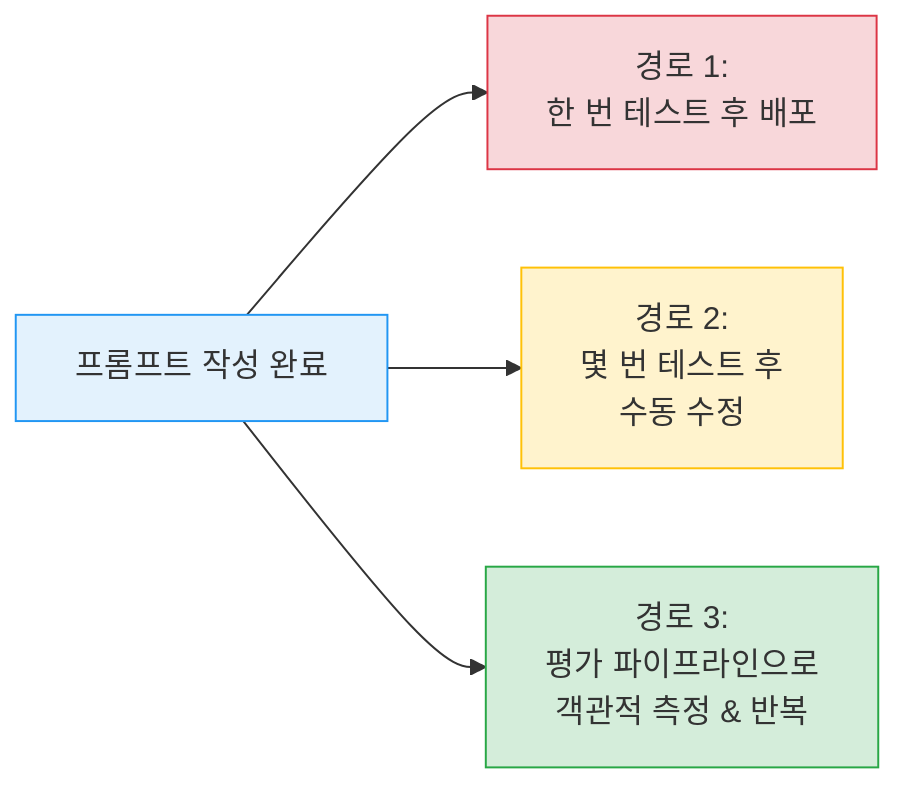
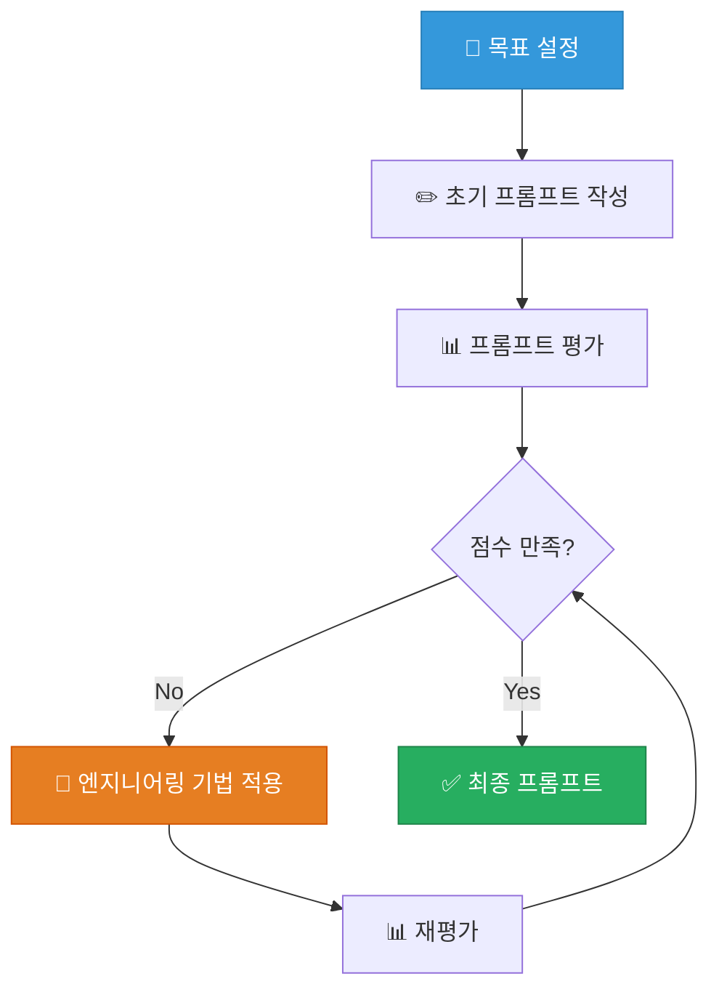
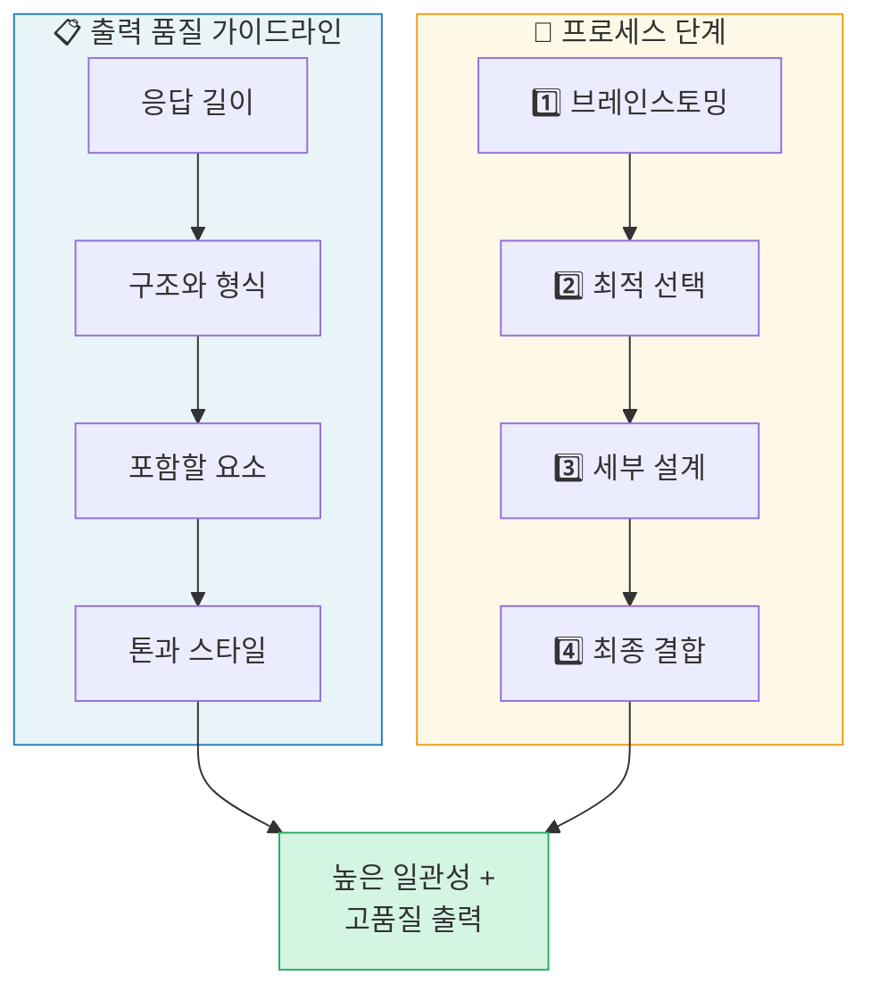
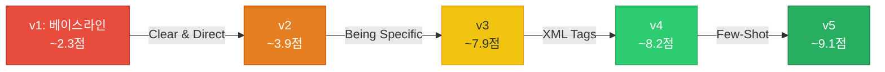
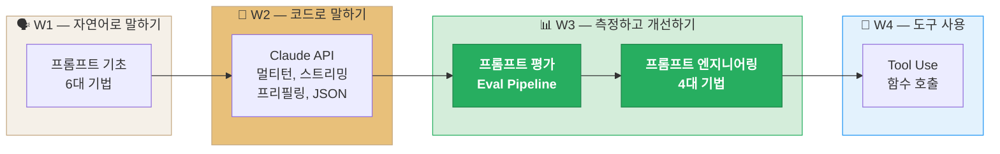

# 3주차: 프롬프트 엔지니어링과 평가 — Prompt Engineering & Evaluation (S2)

---

## 📌 강의 중점

**Ch.1 프롬프트 평가 (Prompt Evaluation)**
- **Evaluation-First 접근법**: 프롬프트를 작성하기 전에 평가 체계를 먼저 설계하는 방법론
- **평가 워크플로우** 5단계: 프롬프트 작성 → 테스트셋 생성 → Claude 실행 → 채점 → 반복 개선
- **테스트 데이터셋 생성**: 수동 작성과 Claude 활용 자동 생성 기법
- **채점 시스템 이중 구조**: 모델 기반 채점 (LLM-as-Judge) + 코드 기반 채점 (구문 검증)
- **종합 점수 설계**: 모델 채점과 코드 채점을 결합한 가중 평균 스코어링

**Ch.2 프롬프트 엔지니어링 (Prompt Engineering)**
- **명확하고 직접적으로** (Clear & Direct): 동료 테스트 — 모호함 없이 지시하기
- **구체적으로** (Being Specific): 출력 형식 가이드라인과 처리 단계 명시
- **XML 태그로 구조화**: `<instructions>`, `<context>`, `<examples>`, `<output>` 태그 활용
- **Few-Shot 예시 제공**: 3~5개 예시로 원하는 출력 패턴을 시연

**통합 사이클**: 평가 → 엔지니어링 기법 적용 → 재평가로 **측정 가능한 성능 향상** 달성

---

## 🎯 학습 목표

학습 완료 후 다음을 수행할 수 있습니다:

**Ch.1 프롬프트 평가 (Prompt Evaluation)**
- 프롬프트 엔지니어링과 프롬프트 평가의 차이를 설명하고, **Evaluation-First 접근법**의 필요성을 이해할 수 있다
- 테스트 데이터셋을 **수동 작성** 또는 **Claude 활용 자동 생성** 두 가지 방법으로 구축할 수 있다
- 평가 파이프라인 (`run_prompt` → `run_test_case` → `run_eval`)을 Python으로 직접 구현할 수 있다
- **모델 기반 채점** (LLM-as-Judge)과 **코드 기반 채점** (정규식, 키워드 검사)을 각각 구현하고, 두 점수를 가중 결합하여 종합 평가할 수 있다

**Ch.2 프롬프트 엔지니어링 (Prompt Engineering)**
- **명확성** (Clear & Direct) 원칙을 적용하여 모호하지 않은 프롬프트를 작성할 수 있다
- **구체성** (Being Specific) 원칙으로 출력 형식과 처리 단계를 명시할 수 있다
- **XML 태그**를 활용하여 프롬프트의 구조를 체계적으로 설계할 수 있다
- **Few-Shot 예시**를 효과적으로 구성하여 원하는 출력 패턴을 유도할 수 있다

**통합 역량**
- 평가 점수를 기반으로 엔지니어링 기법을 적용하고 재평가하여, **측정 가능한 성능 향상**을 달성하는 반복 사이클을 운용할 수 있다

---

## 🤔 왜 배우는가? — "좋은 프롬프트를 어떻게 증명하는가"

> [!question] Week 02에서 Claude API로 **코드로 말하는 법**을 배웠다. Week 03에서는 **좋은 프롬프트를 측정하고 개선하는 법**을 배운다.

### 프롬프트 작성 vs 프롬프트 평가

| Week 02: API 기초 | Week 03: 프롬프트 엔지니어링 & 평가 |
| --- | --- |
| Claude API 호출 방법 | 프롬프트 **품질** 측정 방법 |
| 한 번 실행하고 결과 확인 | **테스트셋으로 자동 평가** |
| 주관적 판단 ("괜찮아 보인다") | **객관적 점수** (1~10점) |
| 수동 개선 | **데이터 기반 반복 개선** |

### 왜 평가가 먼저인가?


대부분의 개발자는 프롬프트를 작성한 후 한두 번 테스트하고 "괜찮아 보인다"며 배포한다. 하지만 실제 사용자는 **예상치 못한 입력**을 보내고, 테스트하지 않은 **엣지 케이스**에서 프롬프트가 실패한다. Week 03에서는 이 문제를 **체계적으로 해결**하는 방법을 배운다.

### Anthropic Skilljar 코스

이 강의노트는 Anthropic 공식 교육 플랫폼 Skilljar의 **"Building with the Claude API" Section 2: Prompt Engineering & Evaluation** (15개 레슨)을 기반으로 구성되었다.

> [!ref] 소스 매핑
> - 온라인 코스: [Building with the Claude API](https://anthropic.skilljar.com/claude-with-the-anthropic-api)
> - GitHub 실습 (Eval): [prompt_evaluations](https://github.com/anthropics/courses/tree/master/prompt_evaluations)
> - GitHub 실습 (PE): [prompt_engineering_interactive_tutorial](https://github.com/anthropics/courses/tree/master/prompt_engineering_interactive_tutorial)
> - 실라버스 매핑: **Building — S2 (프롬프트 엔지니어링 & 평가) → W3** (v2.3 기준)

---

## [Chapter 1] 프롬프트 평가 (Prompt Evaluation)

### 1.1 프롬프트 평가란?

프롬프트를 작성하는 것은 시작에 불과하다. 신뢰할 수 있는 AI 애플리케이션을 구축하려면 두 가지 핵심 개념을 이해해야 한다: **프롬프트 엔지니어링** (Prompt Engineering)과 **프롬프트 평가** (Prompt Evaluation).


*프롬프트 엔지니어링 vs 프롬프트 평가의 두 축*

#### PE vs PE: 엔지니어링 vs 평가

| 프롬프트 엔지니어링 (Engineering) | 프롬프트 평가 (Evaluation) |
| --- | --- |
| **더 좋은 프롬프트를 작성**하는 기법 | 프롬프트의 **효과를 측정**하는 방법 |
| Multishot, XML 태그, 역할 부여 등 | 자동 테스트, 버전 비교, 오류 검출 |
| "어떻게 쓸 것인가?" | "얼마나 잘 작동하는가?" |

> [!tip] 핵심 인사이트
> 프롬프트 엔지니어링 기법을 배우기 **전에** 평가 방법을 먼저 배우는 이유: 측정 없이는 개선 여부를 알 수 없다. **"측정할 수 없으면 개선할 수 없다."**

#### 프롬프트 작성 후 3가지 경로


*프롬프트 작성 후 3가지 경로: 한 번 테스트 / 수동 검토 / 평가 파이프라인*

프롬프트를 작성한 후 취할 수 있는 세 가지 경로가 있다:



| 경로       | 설명                           | 위험도                   |
| -------- | ---------------------------- | --------------------- |
| **경로 1** | 한 번 테스트하고 배포                 | 높음 — 예상 못한 입력에 즉시 실패  |
| **경로 2** | 몇 번 테스트하고 수동 수정              | 중간 — 여전히 많은 엣지 케이스 놓침 |
| **경로 3** | 평가 파이프라인으로 객관적 점수 산출 후 반복 개선 | 낮음 — 체계적, 데이터 기반      |

> [!finding] Evaluation-First Approach
> 경로 3이 가장 많은 초기 투자를 요구하지만, 프로덕션에서의 안정성과 신뢰성에서 확실한 배당을 제공한다. **개발 중에 문제를 발견**하는 것이 **사용자가 문제를 경험한 후 수정**하는 것보다 훨씬 낫다.

> [!ref] 소스
> - Skilljar L01: Prompt evaluation (287731)

---

### 1.2 평가 워크플로우 (A Typical Eval Workflow)

프롬프트 평가는 5단계 워크플로우를 따른다. 다양한 오픈소스 도구와 유료 서비스가 있지만, 핵심 프로세스를 이해하면 작게 시작하여 필요에 따라 확장할 수 있다.


*5단계 평가 워크플로우 개요*

#### 5단계 워크플로우


#### Step 1: 프롬프트 작성 (Draft a Prompt)


*Step 1: 초기 프롬프트 작성*

개선하고자 하는 초기 프롬프트를 작성한다:

```python
prompt = f"""
Please answer the user's question:

{question}
"""
```

이 기본 프롬프트가 테스트와 개선의 **베이스라인** 역할을 한다.

#### Step 2: 테스트 데이터셋 생성 (Create an Eval Dataset)


*Step 2: 테스트 데이터셋 생성*

프롬프트가 프로덕션에서 처리할 입력 유형을 대표하는 샘플 데이터셋을 만든다:

```python
dataset = [
    {"question": "What's 2+2?"},
    {"question": "How do I make oatmeal?"},
    {"question": "How far away is the Moon?"}
]
```

실제 평가에서는 수십~수백 개의 레코드를 사용한다. 데이터셋은 **수동 작성** 또는 **Claude로 자동 생성**할 수 있다.

#### Step 3: Claude에 실행 (Feed Through Claude)


*Step 3: 데이터셋과 프롬프트를 결합하여 Claude에 전송*

데이터셋의 각 질문을 프롬프트 템플릿에 병합하여 Claude에 전송한다:

```python
# 각 테스트 케이스를 프롬프트에 결합하여 실행
for question in dataset:
    full_prompt = prompt.format(question=question["question"])
    response = chat(full_prompt)
```

#### Step 4: 채점기로 평가 (Feed Through a Grader)


*Step 4: 채점기가 질문과 응답을 검사하여 점수를 부여*

채점기가 원래 질문과 Claude의 응답을 모두 검사하여 객관적인 점수를 부여한다 (1~10점):

| 질문 | 점수 | 비고 |
| --- | --- | --- |
| "What's 2+2?" | 10 | 완벽한 답변 |
| "How do I make oatmeal?" | 4 | 개선 필요 |
| "How far away is the Moon?" | 9 | 매우 좋은 답변 |

**평균 점수**: (10 + 4 + 9) / 3 = **7.66**

#### Step 5: 프롬프트 수정 & 반복 (Change Prompt and Repeat)


*Step 5: 프롬프트를 수정하고 전체 프로세스를 반복*

베이스라인 점수를 확보한 후, 프롬프트를 수정하고 전체 프로세스를 다시 실행한다:

```python
# 개선된 프롬프트
prompt_v2 = f"""
Please answer the user's question:

{question}

Answer the question with ample detail
"""
```

개선된 프롬프트의 평균 점수가 **8.7**로 상승했다면, 추가 지시가 더 나은 응답을 이끌어냈다는 객관적 증거가 된다.


*프롬프트 버전별 점수 비교 — 객관적 측정으로 개선 확인*

> [!method] 핵심 원칙
> 이 워크플로우의 핵심 이점은 **프롬프트 성능의 객관적 측정**이다. 서로 다른 프롬프트 버전을 숫자로 비교하고, 가장 높은 점수의 버전을 사용하며, 더 나은 접근법을 계속 탐색할 수 있다.

> [!ref] 소스
> - Skilljar L02: A typical eval workflow (287736)

---

### 1.3 테스트 데이터셋 생성 (Generating Test Datasets)

> [!action] 실습 코드 — `01_prompt_evals.ipynb` 열기
> 이 섹션부터 코드를 따라가며 실행합니다. 아래 노트북의 **Cell 1~5**가 이 섹션에 해당합니다.
> 📂 `03-Exercises/Week_03/skilljar/01_prompt_evals.ipynb` (5 code cells — 환경 설정 + 데이터셋 생성)

평가 워크플로우의 첫 단계는 프롬프트와 테스트 데이터를 준비하는 것이다. AWS 관련 코드 생성 프롬프트를 예로 살펴보자.


*테스트 데이터셋 생성 — 평가 목표 설정*

#### 평가 목표 설정

프롬프트가 3가지 유형의 출력을 생성해야 한다:
- **Python 코드**
- **JSON 설정 파일**
- **정규표현식 (Regex)**

핵심 요구사항: 추가 설명이나 헤더/푸터 없이 **깨끗한 코드만** 반환해야 한다.

초기 프롬프트 (v1):

```python
prompt = f"""
Please provide a solution to the following task:
{task}
"""
```

#### 헬퍼 함수 준비

Week 02에서 배운 API 호출 패턴을 재사용한다:
```python
# Load env variables and create client
from dotenv import load_dotenv
from anthropic import Anthropic

load_dotenv()
client = Anthropic()

model = "claude-haiku-4-5"
```

```python
def add_user_message(messages, text):
    user_message = {"role": "user", "content": text}
    messages.append(user_message)

def add_assistant_message(messages, text):
    assistant_message = {"role": "assistant", "content": text}
    messages.append(assistant_message)

def chat(messages, system=None, temperature=1.0, stop_sequences=[]):
    params = {
        "model": model,
        "max_tokens": 1000,
        "messages": messages,
        "temperature": temperature
    }
    if system:
        params["system"] = system
    if stop_sequences:
        params["stop_sequences"] = stop_sequences

    response = client.messages.create(**params)
    return response.content[0].text
```

#### Claude를 활용한 자동 데이터셋 생성


*평가 데이터셋 형식 — JSON 배열로 구성된 테스트 케이스*

테스트 데이터를 생성하는 것은 더 빠른 모델 (Haiku)을 사용하기 좋은 기회다:

```python
import json  

def generate_dataset():

	prompt = """

Generate a evaluation dataset for a prompt evaluation. The dataset will be used to evaluate prompts

that generate Python, JSON, or Regex specifically for AWS-related tasks. Generate an array of JSON objects,

each representing task that requires Python, JSON, or a Regex to complete.

Example output:
```json
[
	{
		"task": "Description of task",		
	},		
	...additional
]

``` * Focus on tasks that can be solved by writing a single Python function, a single JSON object, or a regular expression.

* Focus on tasks that do not require writing much code

Please generate 3 objects.

"""
	messages = []
    add_user_message(messages, prompt)
    add_assistant_message(messages, "```json")  # 프리필링
    text = chat(messages, stop_sequences=["```"])  # 정지 시퀀스
    return json.loads(text)
```


> [!tip] Week 02 기법 재활용
> `add_assistant_message("```json")` (프리필링) + `stop_sequences=["```"]` (정지 시퀀스)를 조합하여 **순수 JSON만 추출**하는 기법은 Week 02의 구조화된 데이터 추출 기법과 동일하다.

#### 데이터셋 저장

```python
dataset = generate_dataset()

with open('dataset.json', 'w') as f:
    json.dump(dataset, f, indent=2)
```

이제 평가 실행에 사용할 체계적인 테스트 데이터가 준비되었다.

> [!ref] 소스
> - Skilljar L03: Generating test datasets (287739)

---

### 1.4 평가 실행 (Running the Eval)

데이터셋이 준비되었으니, 핵심 평가 파이프라인을 구축할 차례다. 각 테스트 케이스를 프롬프트에 병합하고, Claude에 전송하고, 결과를 채점한다.


*평가 파이프라인 실행 흐름 — 데이터셋 → 프롬프트 → Claude → 채점*

#### 3개 핵심 함수

평가 파이프라인은 3개 함수로 구성된다:


#### 1) `run_prompt` — 프롬프트 실행

테스트 케이스를 프롬프트 템플릿에 병합하여 Claude에 전송한다:

```python
def run_prompt(test_case):
    """프롬프트와 테스트 케이스를 병합하여 실행"""
    prompt = f"""
Please solve the following task:

{test_case["task"]}
"""

    messages = []
    add_user_message(messages, prompt)
    output = chat(messages)
    return output
```

#### 2) `run_test_case` — 단일 테스트 실행 + 채점

```python
def run_test_case(test_case):
    """run_prompt 호출 후 결과를 채점"""
    output = run_prompt(test_case)

    # TODO - 채점 로직 (다음 섹션에서 구현)
    score = 10  # 임시 하드코딩

    return {
        "output": output,
        "test_case": test_case,
        "score": score
    }
```

#### 3) `run_eval` — 전체 평가 실행

```python
def run_eval(dataset):
    """데이터셋의 모든 테스트 케이스를 순차 실행"""
    results = []

    for test_case in dataset:
        result = run_test_case(test_case)
        results.append(result)

    return results
```

#### 평가 실행

```python
with open("dataset.json", "r") as f:
    dataset = json.load(f)

results = run_eval(dataset)
print(json.dumps(results, indent=2))
```


*평가 결과 JSON — 출력, 테스트 케이스, 점수를 포함하는 구조화된 결과*

각 결과에는 3가지 정보가 포함된다:
- **output**: Claude의 완전한 응답
- **test_case**: 처리된 원래 테스트 케이스
- **score**: 평가 점수 (현재 하드코딩)


*아직 형식 지시가 없어 Claude의 응답이 장황한 모습*

> [!finding] 파이프라인 완성
> 이 시점에서 핵심 평가 파이프라인이 완성되었다. 하드코딩된 점수 10을 **실제 채점 로직**으로 교체하는 것이 다음 단계다.

> [!ref] 소스
> - Skilljar L04: Running the eval (287743)

---

### 1.5 모델 기반 채점 (Model Based Grading)

> [!action] 실습 코드 — `02_prompt_evals_grader.ipynb` 열기
> 이전 노트북에 **모델 채점 기능이 추가**된 버전입니다. **Cell 5~10**이 새로 추가되었습니다.
> 📂 `03-Exercises/Week_03/skilljar/02_prompt_evals_grader.ipynb` (10 code cells — +`grade_by_model`, `run_prompt`, `run_test_case`, `run_eval`)

채점 시스템은 출력 품질에 대한 **객관적 신호**를 제공한다. 채점기는 모델 출력을 받아 측정 가능한 피드백 — 보통 1~10 사이의 점수 — 를 반환한다.


*3가지 채점 유형: 코드 채점기, 모델 채점기, 사람 채점기*

#### 3가지 채점 유형

| 채점 유형 | 방법 | 장점 | 단점 |
| --- | --- | --- | --- |
| **코드 채점기** | 프로그래밍 로직으로 검증 | 빠르고 일관성 있음 | 유연성 부족 |
| **모델 채점기** | 다른 AI 모델로 평가 | 매우 유연 | 다소 변동적 |
| **사람 채점기** | 사람이 직접 검토 | 가장 유연 | 느리고 비용 높음 |

#### 평가 기준 정의


*평가 기준 정의 — Format, Valid Syntax, Task Following*

채점기를 구현하기 전에 **명확한 평가 기준**이 필요하다. 코드 생성 프롬프트의 경우:

| 기준 | 설명 | 적합한 채점기 |
| --- | --- | --- |
| **Format** | Python, JSON, 또는 Regex만 반환 (설명 없이) | 코드 채점기 |
| **Valid Syntax** | 생성된 코드가 유효한 구문인지 | 코드 채점기 |
| **Task Following** | 사용자 요청에 정확히 대응하는 코드인지 | 모델 채점기 |


*기준별 적합한 채점기 매핑 — 코드 채점기 vs 모델 채점기*

처음 두 기준은 코드 채점기가, 마지막 기준은 모델 채점기가 더 적합하다.

#### 모델 채점기 구현

```python
def grade_by_model(test_case, output):
    """LLM-as-Judge: 다른 Claude 호출로 출력을 평가"""
    eval_prompt = f"""

You are an expert AWS code reviewer. Your task is to evaluate the following AI-generated solution.  

Original Task:
<task>
{test_case["task"]}
</task> 

Solution to Evaluate:
<solution>
{output}
</solution>

Output Format
Provide your evaluation as a structured JSON object with the following fields, in this specific order:
- "strengths": An array of 1-3 key strengths
- "weaknesses": An array of 1-3 key areas for improvement
- "reasoning": A concise explanation of your overall assessment
- "score": A number between 1-10  

Respond with JSON. Keep your response concise and direct.

Example response shape:

{{
"strengths": string[],
"weaknesses": string[],
"reasoning": string,
"score": number
}}

"""

	messages = []
	add_user_message(messages, eval_prompt)
	add_assistant_message(messages, "```json")
	eval_text = chat(messages, stop_sequences=["```"])	
	return json.loads(eval_text)
```

> [!tip] 왜 강점/약점/추론을 함께 요청하는가?
> 점수만 요청하면 모델이 **중간값 (6점 부근)으로 기본 설정**하는 경향이 있다. 강점, 약점, 추론을 **점수와 함께 요청**하면 모델이 더 사려 깊게 평가하고 점수가 더 분별력 있어진다.

#### 채점을 워크플로우에 통합

```python
def run_test_case(test_case):
    output = run_prompt(test_case)

    # 모델 채점
    model_grade = grade_by_model(test_case, output)
    score = model_grade["score"]
    reasoning = model_grade["reasoning"]

    return {
        "output": output,
        "test_case": test_case,
        "score": score,
        "reasoning": reasoning
    }
```

#### 전체 평가 평균 점수 계산

```python
from statistics import mean

def run_eval(dataset):
    results = []

    for test_case in dataset:
        result = run_test_case(test_case)
        results.append(result)

    average_score = mean([result["score"] for result in results])
    print(f"Average score: {average_score}")

    return results
```

> [!ref] 소스
> - Skilljar L05: Model based grading (287742)

---

### 1.6 코드 기반 채점 (Code Based Grading)

> [!action] 실습 코드 — `03_prompt_evals_fns.ipynb` 열기
> 이전 노트북에 **코드 기반 채점 함수가 추가**된 버전입니다. **Cell 7**에 `validate_json/python/regex` + `grade_syntax`가 추가되었습니다.
> 📂 `03-Exercises/Week_03/skilljar/03_prompt_evals_fns.ipynb` (11 code cells — +구문 검증 함수 + 복합 점수)

AI가 생성한 코드를 평가할 때는 응답이 의미 있는지 확인하는 것만으로는 부족하다. 생성된 코드가 **유효한 구문**을 갖추고 **올바른 형식**을 따르는지도 검증해야 한다.


*코드 기반 채점 — Format, Valid Syntax, Task Following 3가지 검증 영역*

#### 구문 검증 함수


*구문 검증 함수 — JSON, Python, Regex 각각에 대한 파싱 테스트*

각 출력 형식 (Python, JSON, Regex)에 대한 구문 검증기를 구현한다:

```python
# Functions to validate the output structure

import re
import ast  

def validate_json(text):
	try:
		json.loads(text.strip())
		return 10
	except json.JSONDecodeError:
		return 0
		
def validate_python(text):
	try:
		ast.parse(text.strip())
		return 10
	except SyntaxError:
		return 0 

def validate_regex(text):
	try:
		re.compile(text.strip())
		return 10
	except re.error:
		return 0

def grade_syntax(response, test_case):
	format = test_case["format"]
	if format == "json":
		return validate_json(response)
	elif format == "python":
		return validate_python(response)
	else:
		return validate_regex(response)
```

> [!method] 채점 로직
> 각 함수는 텍스트를 해당 형식으로 파싱을 시도한다. 성공하면 만점 10, 실패하면 0을 반환한다. 이진 채점이지만 구문 유효성이라는 명확한 기준에 적합하다.

#### 데이터셋에 형식 정보 추가

코드 채점기가 어떤 검증기를 사용할지 알려면, 테스트 케이스에 기대 출력 형식과 평가 기준을 명시해야 한다:

```json
{
    "task": "Create a Python function to validate an AWS IAM username",
    "format": "python",
    "solution_criteria": "Key criteria for evaluating the solution"
}
```

- `format`: 코드 채점기(`grade_syntax`)가 `python`/`json`/`regex` 중 어떤 검증기를 사용할지 결정
- `solution_criteria`: 모델 채점기(`grade_by_model`)가 솔루션 품질을 평가할 때 참조하는 기준

다음과 같이 generate_dataset() 을 수정하면 format에 맞는 데이터가 생성된다: 
```python
import json  

def generate_dataset():

	prompt = """

Generate a evaluation dataset for a prompt evaluation. The dataset will be used to evaluate prompts

that generate Python, JSON, or Regex specifically for AWS-related tasks. Generate an array of JSON objects,

each representing task that requires Python, JSON, or a Regex to complete.

Example output:
```json
[
	{
	        "task": "Description of task",
	        "format": "json" or "python" or "regex",
	        "solution_criteria": "Key criteria for evaluating the solution"
	},		
	...additional
]

``` * Focus on tasks that can be solved by writing a single Python function, a single JSON object, or a regular expression.

* Focus on tasks that do not require writing much code

Please generate 3 objects.

"""
	messages = []
    add_user_message(messages, prompt)
    add_assistant_message(messages, "```json")  # 프리필링
    text = chat(messages, stop_sequences=["```"])  # 정지 시퀀스
    return json.loads(text)
```


#### 프롬프트 명확성 개선

코드만 반환하도록 프롬프트를 개선한다:

```python
prompt = f"""
Please provide a solution to the following task:
{task}

* Respond only with Python, JSON, or a plain Regex
* Do not add any comments or commentary or explanation
"""
```

프리필링으로 코드 블록 시작을 유도할 수도 있다:

```python
add_assistant_message(messages, "```code")
```

#### 모델 채점 + 코드 채점 결합

```python
model_grade = grade_by_model(test_case, output)
model_score = model_grade["score"]
syntax_score = grade_syntax(output, test_case)

# 두 점수의 평균
score = (model_score + syntax_score) / 2
```

모델 채점 (내용 품질)과 코드 채점 (기술적 정확성)에 **동일한 가중치**를 부여한다. 용도에 따라 가중치를 조정할 수 있다.

> [!finding] 종합 채점의 의미
> 베이스라인 점수 자체가 좋고 나쁨을 의미하는 것이 아니라, **프롬프트를 개선하면서 점수가 향상되는지**가 중요하다. 이것이 프롬프트 엔지니어링 진행 상황을 **정량적으로 측정**하는 방법이다.

> [!ref] 소스
> - Skilljar L06: Code based grading (287737)

---

### 1.7 종합 실습: 프롬프트 평가 (Exercise on Prompt Evals)


이 실습에서는 Chapter 1에서 배운 모든 개념을 통합하여 완전한 평가 파이프라인을 구축한다.

#### 실습 내용

1. **데이터셋 생성**: Claude를 활용하여 다양한 AWS 코드 생성 태스크 데이터셋 자동 생성
2. **평가 루프 구현**: `run_prompt` → `run_test_case` → `run_eval` 파이프라인 완성
3. **모델 채점기 구현**: LLM-as-Judge 패턴으로 출력 품질 평가
4. **코드 채점기 구현**: JSON/Python/Regex 구문 검증
5. **점수 결합**: 모델 점수와 코드 점수를 결합한 종합 평가
6. **프롬프트 개선**: 점수 기반으로 프롬프트를 수정하고 재평가

#### 실습 노트북

> [!action] 실습 코드 — `04_prompt_evals_complete.ipynb` 열기
> Ch.1 전체를 한 파일에 담은 **완성본**입니다. 이전 단계별 노트북의 모든 내용이 포함되어 있습니다.
> 📂 `03-Exercises/Week_03/skilljar/04_prompt_evals_complete.ipynb` (11 code cells — 데이터셋+실행+모델채점+코드채점+평가기준)

> [!method] Ch.1 평가 노트북 단계별 빌드업
> 수업에서는 아래 순서로 노트북을 **하나씩 교체**하며 코드가 성장하는 과정을 보여줍니다:
>
> | 단계 | 노트북 | 추가되는 기능 | 섹션 |
> | --- | --- | --- | --- |
> | ① 기초 | `01_prompt_evals.ipynb` | 환경 설정 + 데이터셋 생성 | §1.3 |
> | ② 모델 채점 | `02_prompt_evals_grader.ipynb` | +`grade_by_model`, `run_prompt/test_case/eval` | §1.5 |
> | ③ 코드 채점 | `03_prompt_evals_fns.ipynb` | +`validate_json/python/regex`, 복합 점수 | §1.6 |
> | ④ 완성 | `04_prompt_evals_complete.ipynb` | +`solution_criteria` 필드, 기준 기반 채점 | §1.7 |

> [!ref] 소스
> - Skilljar L07: Exercise on prompt evals (287738)

---

## [Chapter 2] 프롬프트 엔지니어링 기법 (Prompt Engineering Techniques)

### 2.1 프롬프트 엔지니어링 개요

> [!action] 실습 코드 — `05_prompting_baseline.ipynb` 열기
> Ch.2의 출발점입니다. **Cell 6**의 `run_prompt`가 단순한 베이스라인 프롬프트로 시작합니다.
> 📂 `03-Exercises/Week_03/skilljar/05_prompting_baseline.ipynb` (v1: 베이스라인 ~2.3점)

프롬프트 엔지니어링은 작성한 프롬프트를 **개선하여 더 안정적이고 고품질의 출력**을 얻는 과정이다. 기본 프롬프트에서 시작하여 성능을 평가하고, 체계적으로 엔지니어링 기법을 적용하여 개선하는 **반복적 정제 과정**이다.


*프롬프트 엔지니어링 개요 — 반복적 개선 프로세스*

#### 반복적 개선 사이클


*반복적 개선 사이클: 목표 설정 → 작성 → 평가 → 기법 적용 → 재평가*



각 반복에서 **한 가지 기법을 적용**하고, 평가 점수로 개선 여부를 확인한다. 이렇게 하면 어떤 기법이 가장 효과적인지 이해할 수 있다.

#### 실제 예시: 운동선수 식단 생성기

평가 시스템을 `PromptEvaluator` 클래스로 설정한다:

```python
evaluator = PromptEvaluator(max_concurrent_tasks=5)
```

> [!tip] 동시성 설정
> `max_concurrent_tasks`를 낮게 (3 정도) 시작하여 API 속도 제한 오류를 방지한다. API 쿼터가 허용하면 점차 늘린다.


*실제 예시: 운동선수 식단 생성기 — 평가 시스템 설정*

테스트 데이터를 자동 생성한다:

```python
dataset = evaluator.generate_dataset(
    task_description="Write a compact, concise 1 day meal plan for a single athlete",
    prompt_inputs_spec={
        "height": "Athlete's height in cm",
        "weight": "Athlete's weight in kg",
        "goal": "Goal of the athlete",
        "restrictions": "Dietary restrictions of the athlete"
    },
    output_file="dataset.json",
    num_cases=3  # 개발 중에는 작게, 최종 검증 시 늘린다
)
```

#### 베이스라인 프롬프트 (점수: 2.3/10)

의도적으로 단순한 첫 시도:

```python
def run_prompt(prompt_inputs):
    prompt = f"""
What should this person eat?

- Height: {prompt_inputs["height"]}
- Weight: {prompt_inputs["weight"]}
- Goal: {prompt_inputs["goal"]}
- Dietary restrictions: {prompt_inputs["restrictions"]}
"""

    messages = []
    add_user_message(messages, prompt)
    return chat(messages)
```

평가 기준을 포함하여 실행:

```python
results = evaluator.run_evaluation(
    run_prompt_function=run_prompt,
    dataset_file="dataset.json",
    extra_criteria="""
The output should include:
- Daily caloric total
- Macronutrient breakdown
- Meals with exact foods, portions, and timing
"""
)
```


*평가 리포트 — 각 테스트 케이스의 점수와 채점 근거를 보여주는 HTML 리포트*


*상세 평가 결과 — 프롬프트가 실패하는 지점과 개선 방향을 안내*

> [!finding] 베이스라인 결과
> 초기 점수 2.3/10은 흔한 결과다. 낮은 점수에 좌절하지 말 것 — 이것이 **출발점**이다. 앞으로 배울 기법을 적용하면서 점수가 꾸준히 상승하는 것을 확인할 것이다.

> [!ref] 소스
> - Skilljar L09: Prompt engineering (287745)

---

### 2.2 명확하고 직접적으로 (Being Clear and Direct)

> [!action] 실습 코드 — `06_prompting_clear.ipynb` 열기
> 베이스라인에서 **Clear & Direct 기법을 적용**한 버전입니다. Cell 6의 프롬프트 첫 줄이 변경되었습니다.
> 📂 `03-Exercises/Week_03/skilljar/06_prompting_clear.ipynb` (v2: Clear & Direct ~3.9점, +1.6)

프롬프트의 **첫 줄**이 전체 요청에서 가장 중요하다. 여기서 모든 후속 내용의 기반을 설정하고, 이것을 제대로 하면 결과가 극적으로 개선된다.


*Being Clear and Direct — 명확성과 직접성의 원칙*

#### 명확성 (Clear)

- **간단한 언어** 사용: 누구나 이해할 수 있게
- **원하는 것을 정확히** 진술: 빙빙 돌리지 않기
- **Claude의 작업을 직설적으로** 제시

> [!question]- 모호한 프롬프트 vs 명확한 프롬프트
> **모호**: "I need to know about those things people put on their roofs that use sun — those solar panel things, I think they're called"
>
> **명확**: "Write three paragraphs about how solar panels work."

#### 직접성 (Direct)

- **질문이 아닌 지시** 사용
- **동작 동사로 시작**: Write, Create, Generate, Identify

> [!question]- 간접적 vs 직접적
> **간접**: "I was reading about renewable energy and geothermal energy sounds neat. What countries use it?"
>
> **직접**: "Identify three countries that use geothermal energy. Include generation stats for each."

#### 적용: 식단 프롬프트 개선

| 버전 | 프롬프트 첫 줄 | 점수 |
| --- | --- | --- |
| Before | "What should this person eat?" | **2.32** |
| After | "Generate a one-day meal plan for an athlete that meets their dietary restrictions." | **3.92** |

개선된 버전은 Claude에게 다음을 즉시 알려준다:
- **무엇을 할지** (generate)
- **무엇을 만들지** (a meal plan)
- **핵심 제약** (one day, for an athlete, meeting dietary restrictions)

> [!tip] Golden Rule
> Claude를 **추측해야 하는 사람**이 아니라 **명확한 지시가 필요한 유능한 어시스턴트**로 대하라. 직접적인 동작 동사로 시작하고, 작업에 대해 구체적으로 표현하라.

> [!ref] 소스
> - Skilljar L10: Being clear and direct (287744)

---

### 2.3 구체적으로 (Being Specific)

> [!action] 실습 코드 — `07_prompting_specific.ipynb` 열기
> Clear & Direct에 **구체적 가이드라인 6항목을 추가**한 버전입니다. 점수가 2배 이상 상승합니다.
> 📂 `03-Exercises/Week_03/skilljar/07_prompting_specific.ipynb` (v3: Being Specific ~7.9점, +4.0)

Claude에게 원하는 것을 **구체적으로 명시**하면, 모델의 해석에 맡기는 것보다 훨씬 일관되고 고품질의 결과를 얻는다.


*Being Specific — 구체적 가이드라인의 힘*

#### 두 가지 구체화 접근법


*두 가지 구체화 접근법: 출력 품질 가이드라인 vs 프로세스 단계*



##### 1) 출력 품질 가이드라인 (Output Quality Guidelines)

출력이 갖추어야 할 **속성 목록**을 제공한다:

```
Guidelines:
1. Include accurate daily calorie amount
2. Show protein, fat, and carb amounts
3. Specify when to eat each meal
4. Use only foods that fit restrictions
5. List all portion sizes in grams
6. Keep budget-friendly if mentioned
```

##### 2) 프로세스 단계 (Process Steps)

Claude가 체계적으로 사고하도록 **구체적인 단계**를 제시한다:

```
Steps:
1. Brainstorm three talents that would create dramatic tension
2. Pick the most interesting talent
3. Outline a pivotal scene that reveals the talent
4. Brainstorm supporting character types that could increase impact
```

#### 적용 결과

| 버전 | 적용 기법 | 점수 |
| --- | --- | --- |
| v1 (베이스라인) | 없음 | **2.32** |
| v2 (명확 + 직접) | Clear & Direct | **3.92** |
| v3 (+ 구체적 가이드라인) | + Being Specific | **7.86** |

> [!finding] 점수 2배 이상 상승
> 구체적 가이드라인 추가만으로 3.92 → 7.86, 즉 **2배 이상 품질 향상**이 달성되었다. Claude에게 정확히 어떤 요소를 포함할지 알려주는 것만으로 이 정도의 차이가 난다.

#### 사용 가이드

| 상황 | 권장 접근법 |
| --- | --- |
| **거의 모든 프롬프트** | 출력 품질 가이드라인 포함 |
| **복잡한 문제 해결** | + 프로세스 단계 추가 |
| **의사결정 시나리오** | + 프로세스 단계 추가 |
| **비판적 사고 과제** | + 프로세스 단계 추가 |


*프로세스 단계 사용 시점 — 복잡한 문제일수록 단계적 접근이 효과적*

> [!ref] 소스
> - Skilljar L11: Being specific (287740)

---

### 2.4 XML 태그로 구조화 (Structure with XML Tags)

> [!action] 실습 코드 — `08_prompting_xml.ipynb` 열기
> 선수 정보를 **`<athlete_information>` XML 태그로 감싸** 데이터와 지시를 분리한 버전입니다.
> 📂 `03-Exercises/Week_03/skilljar/08_prompting_xml.ipynb` (v4: XML Tags ~8.2점, +0.3)

많은 콘텐츠를 포함하는 프롬프트를 구축할 때, Claude는 어떤 텍스트가 함께 속하는지 또는 다른 섹션이 무엇을 나타내는지 파악하기 어려울 수 있다. **XML 태그**는 프롬프트에 구조와 명확성을 추가하는 간단한 방법이다.


*XML 태그로 프롬프트 구조화 — 왜 구조가 필요한가*

#### 왜 구조화가 필요한가?

20페이지의 영업 기록을 분석하는 프롬프트를 생각해보자. 명확한 경계 없이는 Claude가 **지시사항과 데이터를 구분**하기 어렵다.


*XML 태그로 명확한 경계를 설정하여 Claude의 이해도를 높인다*

```xml
<!-- ❌ 구조 없음: 코드와 문서가 혼재 -->
Debug this code using the documentation.
Here is my code: def connect()...
And here is the API documentation: API Reference...

<!-- ✅ XML 태그로 구조화 -->
Debug this code using the documentation.

<my_code>
def connect():
    ...
</my_code>

<docs>
API Reference: ...
</docs>
```

#### 커스텀 태그명 사용

공식 XML 태그를 사용할 필요가 없다. 콘텐츠를 설명하는 **의미 있는 이름**을 만든다:

| 태그 | 용도 | 일반적 태그보다 좋은 이유 |
| --- | --- | --- |
| `<sales_records>` | 영업 데이터 | `<data>`보다 목적이 명확 |
| `<athlete_information>` | 운동선수 정보 | `<input>`보다 구체적 |
| `<my_code>` | 디버깅할 코드 | `<content>`보다 역할이 분명 |


*코드와 문서를 구분하는 실제 예시 — Not Great vs Better*

#### 실제 적용 예시

```xml
<athlete_information>
- Height: 6'2"
- Weight: 180 lbs
- Goal: Build muscle
- Dietary restrictions: Vegetarian
</athlete_information>

Generate a meal plan based on the athlete information above.
```

높이, 체중, 목표, 식이 제한이 모두 **함께 고려해야 할 관련 데이터**임이 명확해진다.

#### XML 태그 사용 시점

| 사용 권장 | 비고 |
| --- | --- |
| 대량의 컨텍스트/데이터 포함 시 | 필수 |
| 다른 유형의 콘텐츠 혼합 시 | 코드 + 문서 + 데이터 등 |
| 콘텐츠 경계를 명확히 하고 싶을 때 | 짧은 콘텐츠에도 유용 |
| 여러 변수를 보간하는 복잡한 프롬프트 | 매우 중요 |

> [!tip] 프롬프트 복잡도에 비례
> 단순한 프롬프트에서는 극적인 개선이 보이지 않을 수 있지만, 프롬프트가 **복잡해지고 다양한 콘텐츠를 포함**할수록 XML 태그의 가치가 급격히 증가한다.

> [!ref] 소스
> - Skilljar L12: Structure with XML tags (287741)

---

### 2.5 예시 제공 — Few-Shot Prompting (Providing Examples)

> [!action] 실습 코드 — `09_prompting_completed.ipynb` 열기
> XML Tags 버전에 **`<sample_input>` + `<ideal_output>` 예시를 추가**한 최종 완성본입니다.
> 📂 `03-Exercises/Week_03/skilljar/09_prompting_completed.ipynb` (v5: Few-Shot ~9.1점, +0.9)

프롬프트에 **예시를 제공**하는 것은 가장 효과적인 프롬프트 엔지니어링 기법 중 하나다. "One-Shot" 또는 "Multi-Shot" 프롬프팅이라고도 하며, Claude에게 **입력/출력 쌍 예시**를 제공하여 응답을 안내한다.


*Few-Shot 프롬프팅 — 감성 분석에서 예시의 역할*

#### 예시가 필요한 이유: 풍자(Sarcasm) 문제

감성 분석에서 "Yeah, sure, that was the best movie I've seen since 'Plan 9 from Outer Space'" 같은 트윗은 표면적으로 긍정적이지만, 실제로는 **풍자적이고 부정적**이다 (Plan 9은 역대 최악의 영화 중 하나).

#### 예시로 코너 케이스 처리


*풍자적 표현을 처리하는 예시 — 긍정 예시와 부정(풍자) 예시 제공*

```xml
Classify the sentiment of this tweet as Positive or Negative.
Handle sarcasm carefully - sarcastic statements that seem positive
should be classified as Negative.

<example>
<sample_input>Great game tonight!</sample_input>
<ideal_output>Positive</ideal_output>
</example>

<example>
<sample_input>Oh yeah, I really needed a flight delay tonight! Excellent!</sample_input>
<ideal_output>Negative</ideal_output>
</example>
```

> [!method] XML 태그 + 예시 조합
> 예시를 `<sample_input>`과 `<ideal_output>` XML 태그로 감싸면, Claude가 각 부분이 무엇을 나타내는지 **명확히 이해**한다. 이전 섹션의 XML 태그 기법과 자연스럽게 결합된다.

#### One-Shot vs Multi-Shot

| 유형 | 예시 수 | 사용 시점 |
| --- | --- | --- |
| **One-Shot** | 1개 | 기본 패턴 확립 |
| **Multi-Shot** | 2개 이상 | 다양한 엣지 케이스, 여러 유형의 유효한 응답 |

#### 평가에서 좋은 예시 찾기

프롬프트 평가를 실행하면 **최고 점수 출력**을 예시로 활용할 수 있다:


*평가 결과에서 최고 점수 출력을 찾아 예시로 활용*

1. 평가 결과에서 10점 (또는 최고 점수) 응답을 찾는다
2. 해당 입력/출력 쌍을 프롬프트의 예시로 사용한다
3. Claude가 "완벽한" 출력이 어떤 모습인지 학습한다

#### 예시에 맥락 추가

입력/출력 쌍만 제공하지 말고, **왜 그 출력이 좋은지** 설명한다:

```xml
<ideal_output>
[예시 출력 내용]
</ideal_output>

This example is well-structured, provides detailed information
on food choices and quantities, and aligns with the athlete's
goals and restrictions.
```

이 추가 맥락이 Claude가 좋은 응답의 **형식뿐 아니라 추론**까지 이해하도록 돕는다.

#### Best Practices

- XML 태그로 예시를 명확히 구조화
- 무엇을 보여주는지 명시: "Here is an example input with an ideal response"
- 가장 흔한 **실패 케이스를 다루는 예시** 포함
- 왜 그 출력이 이상적인지 **설명** 추가
- 특정 작업에 관련된 예시만 사용

> [!finding] Show, Don't Tell
> 예시는 **말로 설명하는 대신 직접 보여준다**. 원하는 것을 말로 정확히 표현하기 어려운 미묘한 요구사항도, 예시를 통해 Claude에게 훨씬 확실하게 전달할 수 있다.

> [!ref] 소스
> - Skilljar L13: Providing examples (287746)

---

### 2.6 종합 실습: 프롬프트 엔지니어링 (Exercise on Prompting)


이 실습에서는 Chapter 2에서 배운 4가지 기법을 순차적으로 적용하며 프롬프트를 개선한다.

#### 실습 과정



> [!method] Ch.2 프롬프팅 노트북 단계별 빌드업
> 수업에서는 아래 순서로 노트북을 **하나씩 교체**하며 프롬프트가 성장하는 과정을 보여줍니다:
>
> | 단계 | 노트북 | Cell 6 변경 사항 | 점수 | 섹션 |
> | --- | --- | --- | --- | --- |
> | v1 | `05_prompting_baseline.ipynb` | "What should this person eat?" | ~2.3 | §2.1 |
> | v2 | `06_prompting_clear.ipynb` | → "Generate a one-day meal plan..." | ~3.9 | §2.2 |
> | v3 | `07_prompting_specific.ipynb` | + Guidelines 6항목 | ~7.9 | §2.3 |
> | v4 | `08_prompting_xml.ipynb` | + `<athlete_information>` 태그 | ~8.2 | §2.4 |
> | v5 | `09_prompting_completed.ipynb` | + `<sample_input>/<ideal_output>` 예시 | ~9.1 | §2.5 |
>
> **학생 실습용**: `10_prompting.ipynb` (빈 템플릿 — Cell 5~7을 직접 채워보기)

> [!ref] 소스
> - Skilljar L14: Exercise on prompting (287748)

---

## [Chapter 3] 자가진단과 종합 정리

### 3.1 자가진단 퀴즈 — Prompt Evaluation

> [!question] Q1. 프롬프트 평가 워크플로우의 올바른 순서는?
> A) 테스트 데이터셋 생성 → 프롬프트 작성 → 채점기로 평가 → Claude에 실행 → 프롬프트 수정
> B) 프롬프트 작성 → Claude에 실행 → 테스트 데이터셋 생성 → 채점기로 평가 → 프롬프트 수정
> C) 프롬프트 작성 → 테스트 데이터셋 생성 → Claude에 실행 → 채점기로 평가 → 프롬프트 수정 & 반복
> D) 프롬프트 작성 → 테스트 데이터셋 생성 → 채점기로 평가 → Claude에 실행 → 프롬프트 수정
>
> > [!tip]- 정답 보기
> > **정답: C)** 프롬프트 작성 → 테스트 데이터셋 생성 → Claude에 실행 → 채점기로 평가 → 프롬프트 수정 & 반복
> >
> > 핵심: 평가는 **순환 프로세스**다. 마지막 단계에서 다시 첫 단계로 돌아가 반복한다.

> [!question] Q2. 코드 채점기 (Code Grader)와 모델 채점기 (Model Grader)의 차이는?
>
> > [!tip]- 정답 보기
> > **코드 채점기**: 프로그래밍 로직으로 검증 — 구문 검사, 길이 확인, 키워드 존재 여부 등. 빠르고 일관적이지만 유연성이 낮다.
> >
> > **모델 채점기**: 다른 AI 모델 호출로 평가 (LLM-as-Judge) — 응답 품질, 정확성, 완성도 등. 매우 유연하지만 약간의 변동성이 있다.
> >
> > 두 채점기를 **결합**하면 기술적 정확성과 내용 품질을 모두 평가할 수 있다.

> [!question] Q3. 모델 채점기에서 점수만 요청하면 안 되는 이유는?
> A) API 호출 비용이 더 많이 들기 때문에
> B) 모델이 중간값(6점 부근)으로 수렴하여 점수 분별력이 낮아지기 때문에
> C) JSON 형식으로 파싱할 수 없기 때문에
> D) 모델이 점수를 텍스트로 반환하여 숫자 변환이 필요하기 때문에
>
> > [!tip]- 정답 보기
> > **정답: B)** 모델이 **중간값 (6점 부근)으로 기본 설정**하는 경향이 있기 때문이다. 강점, 약점, 추론을 함께 요청하면 모델이 더 사려 깊게 평가하고 점수 분별력이 높아진다.

> [!question] Q4. 테스트 데이터셋을 자동 생성할 때 더 빠른 모델 (Haiku)을 사용하는 이유는?
> A) Haiku가 더 다양한 테스트 케이스를 생성하기 때문에
> B) Opus/Sonnet은 테스트 데이터 생성을 지원하지 않기 때문에
> C) 데이터 생성은 다양한 입력을 만드는 작업이므로 빠르고 저렴한 모델로 충분하기 때문에
> D) Haiku가 JSON 형식 출력에 더 특화되어 있기 때문에
>
> > [!tip]- 정답 보기
> > **정답: C)** 테스트 데이터 생성은 **최종 프롬프트의 품질을 평가하는 것이 아니라** 다양한 입력을 만드는 작업이다. 빠르고 저렴한 모델로 충분하며, 평가 속도를 크게 개선할 수 있다.

> [!question] Q5. 프리필링과 정지 시퀀스를 조합하여 JSON을 추출하는 패턴은?
>
> > [!tip]- 정답 보기
> > ```python
> > add_assistant_message(messages, "```json")  # 프리필링: JSON 코드블록 시작
> > text = chat(messages, stop_sequences=["```"])  # 정지: 코드블록 끝에서 멈춤
> > result = json.loads(text)  # 순수 JSON 파싱
> > ```
> > Week 02의 구조화된 데이터 추출 기법을 평가 파이프라인에서 재활용하는 패턴이다.

> [!ref] 소스
> - Skilljar L08: Quiz on prompt evaluation (289118)

---

### 3.2 자가진단 퀴즈 — Prompt Engineering

> [!question] Q6. "Clear and Direct" 기법의 핵심 원칙 2가지는?
>
> > [!tip]- 정답 보기
> > 1. **명확성 (Clear)**: 간단한 언어로 원하는 것을 정확히 진술
> > 2. **직접성 (Direct)**: 질문이 아닌 지시 사용, 동작 동사 (Write, Create, Generate)로 시작
> >
> > 예: "What should this person eat?" → "Generate a one-day meal plan for an athlete."

> [!question] Q7. 구체적 가이드라인 (Guidelines)과 프로세스 단계 (Steps)는 각각 언제 사용하는가?
>
> > [!tip]- 정답 보기
> > - **가이드라인**: 거의 모든 프롬프트에 사용. 출력의 길이, 형식, 포함 요소, 톤 등을 명시
> > - **프로세스 단계**: 복잡한 문제 해결, 의사결정, 비판적 사고 과제에 추가. Claude가 체계적으로 사고하도록 유도

> [!question] Q8. XML 태그가 특히 중요한 상황은?
>
> > [!tip]- 정답 보기
> > - 대량의 컨텍스트/데이터를 프롬프트에 포함할 때
> > - 코드, 문서, 데이터 등 **다른 유형의 콘텐츠를 혼합**할 때
> > - 여러 변수를 보간하는 복잡한 프롬프트를 구성할 때
> >
> > 태그명은 `<data>` 같은 일반적 이름보다 `<sales_records>`, `<athlete_information>` 같은 **설명적 이름**이 좋다.

> [!question] Q9. Few-Shot 예시에서 "좋은 예시"를 찾는 가장 효과적인 방법은?
> A) 인터넷에서 유사한 작업의 예시를 검색하여 사용한다
> B) 직접 이상적인 출력을 수동으로 작성한다
> C) 평가 결과에서 최고 점수 출력을 예시로 활용한다
> D) Claude에게 "좋은 예시를 만들어달라"고 별도 요청한다
>
> > [!tip]- 정답 보기
> > **정답: C)** 평가 결과에서 최고 점수 출력을 사용한다. 평가를 실행하면 10점 (또는 최고 점수) 응답이 있을 것이다. 이 입력/출력 쌍을 프롬프트의 예시로 활용하면 Claude가 "완벽한" 출력의 모습을 학습한다.

> [!question] Q10. 4가지 프롬프트 엔지니어링 기법 중 가장 큰 점수 향상을 가져온 기법은?
> A) Clear & Direct
> B) Being Specific
> C) XML Tags
> D) Few-Shot Examples
>
> > [!tip]- 정답 보기
> > **정답: B) Being Specific** — 구체적 가이드라인 추가만으로 +4.0점 향상 (최대)
> >
> > | 기법 | 점수 | 변화 |
> > | --- | --- | --- |
> > | 베이스라인 | ~2.3 | — |
> > | Clear & Direct | ~3.9 | +1.6 |
> > | Being Specific | ~7.9 | +4.0 |
> > | XML Tags | ~8.2 | +0.3 |
> > | Few-Shot Examples | ~9.1 | +0.9 |

> [!ref] 소스
> - Skilljar L15: Quiz on prompt engineering (289121)

---

### 3.3 Section 2 학습 내용 정리

#### 프롬프트 평가 (Chapter 1) 요약

> [!finding] 5단계 평가 파이프라인
>
> | 단계 | 개념 | 핵심 내용 | 참조 |
> | :---: | --- | --- | :---: |
> | 1 | **평가 워크플로우** | 작성 → 데이터셋 → 실행 → 채점 → 반복 | §1.2 |
> | 2 | **테스트 데이터셋** | Claude (Haiku)로 자동 생성 + 프리필링/정지 시퀀스로 JSON 추출 | §1.3 |
> | 3 | **모델 채점기** | LLM-as-Judge — 강점 + 약점 + 추론 + 점수를 함께 요청 | §1.5 |
> | 4 | **코드 채점기** | `ast.parse` · `json.loads` · `re.compile`로 구문 검증 | §1.6 |
> | 5 | **점수 결합** | `(model_score + syntax_score) / 2` 가중 평균 | §1.6 |

#### 프롬프트 엔지니어링 (Chapter 2) 요약

> [!result] 4대 기법 적용 — 점수 변화 추이 (2.3 → 9.1)
>
> | 적용 순서 | 기법 | 핵심 내용 | 점수 | 변화 |
> | :---: | --- | --- | :---: | :---: |
> | — | 베이스라인 | 단순 프롬프트 (개선 전) | **2.3** | — |
> | 1 | **Clear & Direct** | 동작 동사로 시작, 간결하고 직접적으로 | **3.9** | +1.6 |
> | 2 | **Being Specific** | 출력 가이드라인 + 프로세스 단계 명시 | **7.9** | +4.0 |
> | 3 | **XML Tags** | `<tag>`로 콘텐츠 영역 구분 | **8.2** | +0.3 |
> | 4 | **Few-Shot Examples** | `<sample_input>` + `<ideal_output>` 예시 제공 | **9.1** | +0.9 |

#### Week 01 → 02 → 03 학습 로드맵



---

## 📝 실습 과제

> 모든 노트북은 `03-Exercises/Week_03/skilljar/` 에 위치합니다.

### Ch.1 프롬프트 평가 — 단계별 빌드업


| 단계 | 노트북 파일 | 셀 | 추가 기능 | 참조 섹션 |
| --- | --- | --- | --- | --- |
| ① 기초 | `01_prompt_evals.ipynb` | 5 | 환경 설정 + 데이터셋 생성 | §1.3 |
| ② 모델 채점 | `02_prompt_evals_grader.ipynb` | 10 | +`grade_by_model`, `run_prompt/test_case/eval` | §1.5 |
| ③ 코드 채점 | `03_prompt_evals_fns.ipynb` | 11 | +`validate_json/python/regex`, 복합 점수 | §1.6 |
| ④ 완성 | `04_prompt_evals_complete.ipynb` | 11 | +`solution_criteria` 필드, 기준 기반 채점 | §1.7 |

### Ch.2 프롬프트 엔지니어링 — 단계별 빌드업


| 단계 | 노트북 파일 | Cell 6 변경 | 점수 | 참조 섹션 |
| --- | --- | --- | --- | --- |
| v1 | `05_prompting_baseline.ipynb` | "What should this person eat?" | ~2.3 | §2.1 |
| v2 | `06_prompting_clear.ipynb` | → "Generate a one-day meal plan..." | ~3.9 | §2.2 |
| v3 | `07_prompting_specific.ipynb` | + Guidelines 6항목 | ~7.9 | §2.3 |
| v4 | `08_prompting_xml.ipynb` | + `<athlete_information>` 태그 | ~8.2 | §2.4 |
| v5 | `09_prompting_completed.ipynb` | + `<sample_input>/<ideal_output>` 예시 | ~9.1 | §2.5 |

### 학생 실습용

| 노트북 파일 | 설명 |
| --- | --- |
| `10_prompting.ipynb` | 빈 템플릿 — Cell 5~7을 직접 채워보며 기법을 실습 (Meal Plan) |
| `11_prompting_example.ipynb` | **구조물 점검 보고서** — 건축공학 도메인에서 4가지 기법을 단계별 적용하는 추가 실습 |

> [!method] `11_prompting_example.ipynb` 구성
> 건축공학 학생에게 친숙한 **구조물 점검 보고서 생성** 과제를 통해 프롬프트 기법을 연습합니다:
>
> | 단계 | Cell | 기법 | 목표 점수 |
> | --- | --- | --- | --- |
> | v1 | Cell 6a | Baseline (모호한 프롬프트) | ~2–3 |
> | v2 | Cell 6b | Clear & Direct (동작 동사, 역할 부여) | ~4–5 |
> | v3 | Cell 6c | Being Specific (Guidelines 6항목) | ~7–8 |
> | v4 | Cell 6d | XML Tags + Few-Shot (완성본) | ~9+ |
>
> **입력 변수**: `building_type`, `age_years`, `num_floors`, `observed_issues`
> **도전 과제**: System Prompt 활용, 한국어 보고서, Code Grading 추가, 나만의 도메인

> [!tip] 수업 시간 실습 순서
> **Ch.1 — 평가 파이프라인 빌드업** (50분)
> 1. `01_prompt_evals.ipynb` 열기 → 데이터셋 생성 데모 (10분)
> 2. `02_prompt_evals_grader.ipynb`로 교체 → 모델 채점 실행 (15분)
> 3. `03_prompt_evals_fns.ipynb`로 교체 → 코드 채점 추가 확인 (10분)
> 4. `04_prompt_evals_complete.ipynb`로 교체 → 전체 파이프라인 데모 (15분)
>
> **Ch.2 — 프롬프트 기법 빌드업** (70분)
> 5. `05_prompting_baseline.ipynb` 열기 → 베이스라인 2.3점 확인 (10분)
> 6. `06_prompting_clear.ipynb`로 교체 → Clear & Direct 효과 확인 (10분)
> 7. `07_prompting_specific.ipynb`로 교체 → 가이드라인 효과 확인 (15분)
> 8. `08_prompting_xml.ipynb`로 교체 → XML 태그 효과 확인 (10분)
> 9. `09_prompting_completed.ipynb`로 교체 → Few-Shot으로 9.1점 달성 (10분)
> 10. `10_prompting.ipynb` 배포 → 학생 직접 실습 (15분)
> 11. `11_prompting_example.ipynb` 배포 → 건축공학 도메인 추가 실습 (과제 또는 자율)

> [!ref] 소스
> - Skilljar 다운로드: [Prompt Evals](https://anthropic.skilljar.com/claude-with-the-anthropic-api/287738) | [Prompting](https://anthropic.skilljar.com/claude-with-the-anthropic-api/287748) (로그인 필요)
> - GitHub: [prompt_evaluations](https://github.com/anthropics/courses/tree/master/prompt_evaluations) | [prompt_engineering_interactive_tutorial](https://github.com/anthropics/courses/tree/master/prompt_engineering_interactive_tutorial)

---

## 📚 참고 자료

> [!ref] 공식 문서
> - [Anthropic Prompt Engineering Guide](https://docs.anthropic.com/en/docs/build-with-claude/prompt-engineering)
> - [Anthropic Prompt Evaluation Guide](https://docs.anthropic.com/en/docs/test-and-evaluate)
> - [Anthropic API Reference — Messages](https://docs.anthropic.com/en/api/messages)

> [!ref] Anthropic 교육 자료
> - [Building with the Claude API (Skilljar)](https://anthropic.skilljar.com/claude-with-the-anthropic-api)
> - [Prompt Evaluations Notebooks (GitHub)](https://github.com/anthropics/courses/tree/master/prompt_evaluations)
> - [Prompt Engineering Tutorial (GitHub)](https://github.com/anthropics/courses/tree/master/prompt_engineering_interactive_tutorial)

---

## Related

- [[Week_02|2주차: Claude API 기초 (S1)]]
- [[Week_04|4주차: Tool Use (S3)]]
- [[00-Syllabus/LLM_AE_AI_Implementation_Syllabus_v2.3|실라버스 v2.3]]
