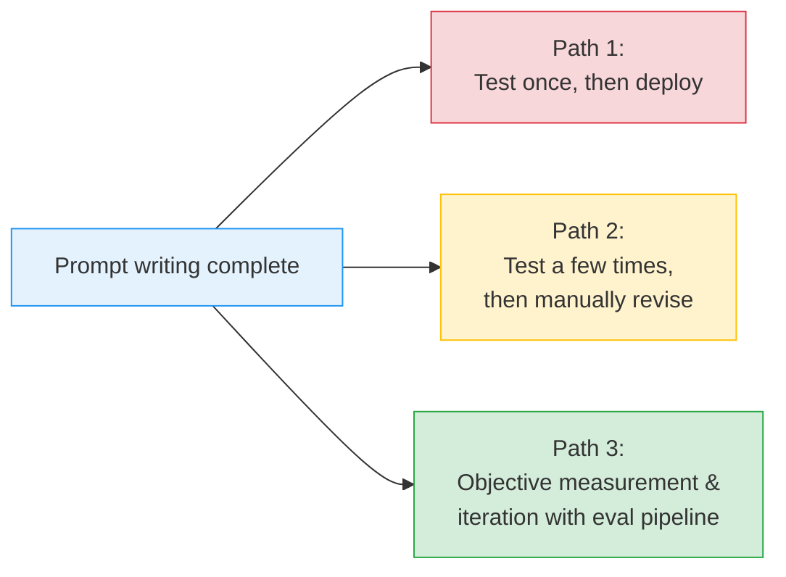
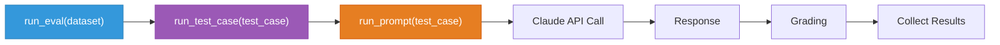
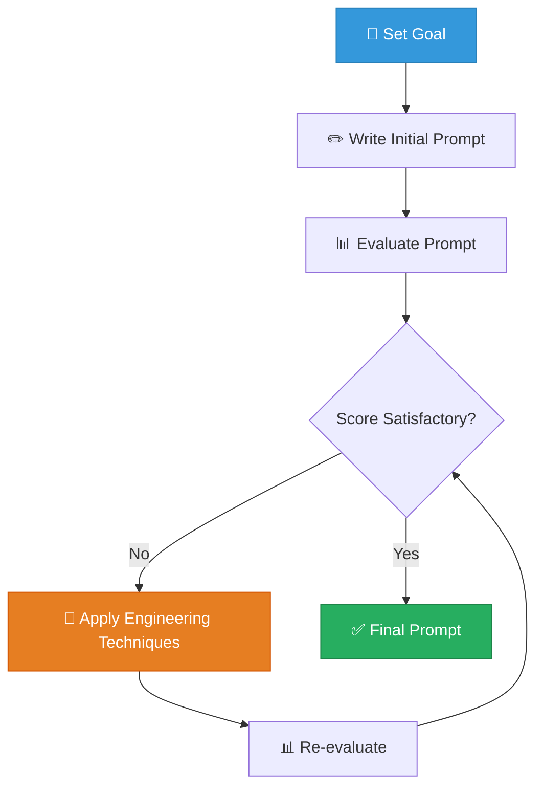
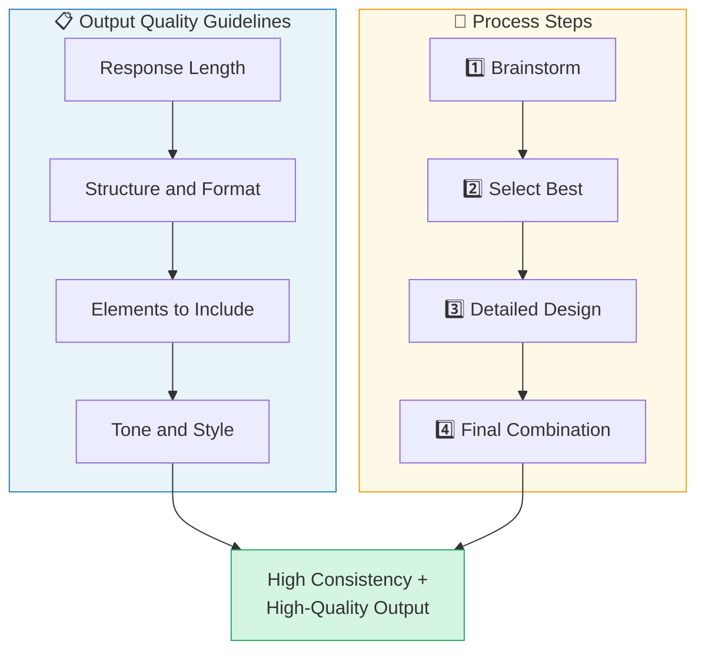
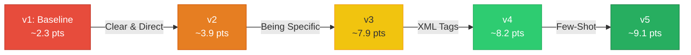
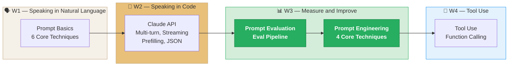

# Week 3: Prompt Engineering & Evaluation (S2)

---

## 📌 Lecture Focus

**Ch.1 Prompt Evaluation**
- **Evaluation-First Approach**: A methodology for designing the evaluation framework before writing the prompt
- **Evaluation Workflow** — 5 steps: Draft Prompt → Create Test Set → Run Claude → Grade → Iterate
- **Test Dataset Creation**: Manual authoring and automated generation using Claude
- **Dual-Structure Grading System**: Model-based grading (LLM-as-Judge) + Code-based grading (syntax validation)
- **Composite Score Design**: Weighted average scoring combining model grading and code grading

**Ch.2 Prompt Engineering**
- **Clear & Direct**: The colleague test — giving instructions without ambiguity
- **Being Specific**: Specifying output format guidelines and processing steps
- **Structuring with XML Tags**: Using `<instructions>`, `<context>`, `<examples>`, `<output>` tags
- **Providing Few-Shot Examples**: Demonstrating the desired output pattern with 3–5 examples

**Integrated Cycle**: Achieve **measurable performance improvement** through evaluation → apply engineering techniques → re-evaluation

---

## 🎯 Learning Objectives

Upon completion, you will be able to:

**Ch.1 Prompt Evaluation**
- Explain the difference between prompt engineering and prompt evaluation, and understand the need for the **Evaluation-First Approach**
- Build a test dataset using either **manual authoring** or **automated generation with Claude**
- Implement the evaluation pipeline (`run_prompt` → `run_test_case` → `run_eval`) directly in Python
- Implement **model-based grading** (LLM-as-Judge) and **code-based grading** (regex, keyword checks) separately, and combine the two scores with weighted aggregation for comprehensive evaluation

**Ch.2 Prompt Engineering**
- Apply the **Clarity** (Clear & Direct) principle to write unambiguous prompts
- Use the **Specificity** (Being Specific) principle to specify output format and processing steps
- Systematically design prompt structure using **XML tags**
- Effectively compose **Few-Shot examples** to elicit the desired output pattern

**Integrated Competency**
- Apply engineering techniques based on evaluation scores, then re-evaluate, operating an iterative cycle that achieves **measurable performance improvement**

---

## 🤔 Why Learn This? — "How Do You Prove a Prompt Is Good?"

> [!question] In Week 02, we learned **how to speak in code** with the Claude API. In Week 03, we learn **how to measure and improve good prompts**.

### Writing Prompts vs. Evaluating Prompts

| Week 02: API Fundamentals | Week 03: Prompt Engineering & Evaluation |
| --- | --- |
| How to call the Claude API | How to measure prompt **quality** |
| Run once and check the result | **Automated evaluation with a test set** |
| Subjective judgment ("looks fine") | **Objective score** (1–10) |
| Manual improvement | **Data-driven iterative improvement** |

### Why Does Evaluation Come First?

```mermaid
graph TD
    subgraph TRAP["⚠️ Common Trap"]
        A["Write a prompt"] --> B["Test once"]
        B --> C["'Looks fine'"]
        C --> D["Deploy to production"]
        D --> E["❌ Fails on unexpected input"]
    end

    subgraph EVAL["✅ Evaluation-First Approach"]
        F["Write a prompt"] --> G["Create test set"]
        G --> H["Run automated evaluation"]
        H --> I["Score: 4.2/10"]
        I --> J["Apply engineering techniques"]
        J --> K["Re-evaluate: 8.7/10"]
        K --> L["✅ Deploy with confidence"]
    end

    style TRAP fill:#fff3cd,stroke:#ffc107
    style EVAL fill:#d4edda,stroke:#27ae60

    classDef bad fill:#dc3545,stroke:#c82333,color:#fff
    classDef good fill:#28a745,stroke:#1e7e34,color:#fff
    class E bad
    class L good
```



Most developers write a prompt, test it once or twice, say "looks fine," and deploy. But real users send **unexpected inputs**, and prompts fail on **edge cases** that were never tested. In Week 03, we learn how to **systematically address** this problem.

### Anthropic Skilljar Course

This lecture note is based on **"Building with the Claude API" Section 2: Prompt Engineering & Evaluation** (15 lessons) from Anthropic's official training platform, Skilljar.

> [!ref] Source Mapping
> - Online course: [Building with the Claude API](https://anthropic.skilljar.com/claude-with-the-anthropic-api)
> - GitHub exercises (Eval): [prompt_evaluations](https://github.com/anthropics/courses/tree/master/prompt_evaluations)
> - GitHub exercises (PE): [prompt_engineering_interactive_tutorial](https://github.com/anthropics/courses/tree/master/prompt_engineering_interactive_tutorial)
> - Syllabus mapping: **Building — S2 (Prompt Engineering & Evaluation) → W3** (as of v2.3)

---

## [Chapter 1] Prompt Evaluation

### 1.1 What Is Prompt Evaluation?

Writing a prompt is just the beginning. To build reliable AI applications, you need to understand two core concepts: **Prompt Engineering** and **Prompt Evaluation**.


*The two axes of Prompt Engineering vs. Prompt Evaluation*

#### PE vs. PE: Engineering vs. Evaluation

| Prompt Engineering | Prompt Evaluation |
| --- | --- |
| Techniques for **writing better prompts** | Methods for **measuring prompt effectiveness** |
| Multishot, XML tags, role assignment, etc. | Automated testing, version comparison, error detection |
| "How should I write it?" | "How well does it work?" |

> [!tip] Key Insight
> The reason we learn evaluation methods **before** learning prompt engineering techniques: without measurement, you cannot tell whether something has improved. **"If you can't measure it, you can't improve it."**

#### 3 Paths After Writing a Prompt


*3 paths after writing a prompt: test once / manual review / evaluation pipeline*

There are three paths you can take after writing a prompt:



| Path | Description | Risk Level |
| --- | --- | --- |
| **Path 1** | Test once and deploy | High — fails immediately on unexpected input |
| **Path 2** | Test a few times and manually revise | Medium — still misses many edge cases |
| **Path 3** | Iterate with objective scores from eval pipeline | Low — systematic, data-driven |

> [!finding] Evaluation-First Approach
> Path 3 requires the most upfront investment, but delivers clear dividends in stability and reliability in production. **Finding problems during development** is far better than **fixing them after users have experienced them**.

> [!ref] Source
> - Skilljar L01: Prompt evaluation (287731)

---

### 1.2 Evaluation Workflow (A Typical Eval Workflow)

Prompt evaluation follows a 5-step workflow. There are various open-source tools and paid services available, but understanding the core process allows you to start small and scale as needed.


*Overview of the 5-step evaluation workflow*

#### 5-Step Workflow


#### Step 1: Draft a Prompt


*Step 1: Writing the initial prompt*

Write the initial prompt you want to improve:

```python
prompt = f"""
Please answer the user's question:

{question}
"""
```

This basic prompt serves as the **baseline** for testing and improvement.

#### Step 2: Create an Eval Dataset


*Step 2: Creating the test dataset*

Create a sample dataset representative of the input types the prompt will handle in production:

```python
dataset = [
    {"question": "What's 2+2?"},
    {"question": "How do I make oatmeal?"},
    {"question": "How far away is the Moon?"}
]
```

In a real evaluation, tens to hundreds of records are used. The dataset can be created by **manual authoring** or **automated generation with Claude**.

#### Step 3: Feed Through Claude


*Step 3: Combining the dataset and prompt and sending to Claude*

Merge each question from the dataset into the prompt template and send it to Claude:

```python
# Combine each test case with the prompt and run
for question in dataset:
    full_prompt = prompt.format(question=question["question"])
    response = chat(full_prompt)
```

#### Step 4: Feed Through a Grader


*Step 4: The grader inspects the question and response and assigns a score*

The grader inspects both the original question and Claude's response to assign an objective score (1–10):

| Question | Score | Note |
| --- | --- | --- |
| "What's 2+2?" | 10 | Perfect answer |
| "How do I make oatmeal?" | 4 | Needs improvement |
| "How far away is the Moon?" | 9 | Very good answer |

**Average score**: (10 + 4 + 9) / 3 = **7.66**

#### Step 5: Change Prompt and Repeat


*Step 5: Revise the prompt and repeat the entire process*

Once you have a baseline score, revise the prompt and run the entire process again:

```python
# Improved prompt
prompt_v2 = f"""
Please answer the user's question:

{question}

Answer the question with ample detail
"""
```

If the average score of the improved prompt rises to **8.7**, that becomes objective evidence that the additional instruction led to better responses.


*Score comparison by prompt version — confirming improvement through objective measurement*

> [!method] Core Principle
> The key benefit of this workflow is **objective measurement of prompt performance**. You can compare different prompt versions numerically, use the highest-scoring version, and keep exploring better approaches.

> [!ref] Source
> - Skilljar L02: A typical eval workflow (287736)

---

### 1.3 Generating Test Datasets

> [!action] Practice Code — Open `01_prompt_evals.ipynb`
> From this section onward, follow along and run the code. **Cells 1–5** of the notebook below correspond to this section.
> 📂 `03-Exercises/Week_03/skilljar/01_prompt_evals.ipynb` (5 code cells — environment setup + dataset generation)

The first step of the evaluation workflow is to prepare the prompt and test data. Let's look at an AWS-related code generation prompt as an example.


*Generating a test dataset — setting the evaluation goal*

#### Setting the Evaluation Goal

The prompt must generate 3 types of output:
- **Python code**
- **JSON configuration files**
- **Regular expressions (Regex)**

Key requirement: it must return **clean code only**, without any additional explanation or headers/footers.

Initial prompt (v1):

```python
prompt = f"""
Please provide a solution to the following task:
{task}
"""
```

#### Preparing Helper Functions

Reuse the API call pattern learned in Week 02:
```python
# Load env variables and create client
from dotenv import load_dotenv
from anthropic import Anthropic

load_dotenv()
client = Anthropic()

model = "claude-haiku-4-5"
```

```python
def add_user_message(messages, text):
    user_message = {"role": "user", "content": text}
    messages.append(user_message)

def add_assistant_message(messages, text):
    assistant_message = {"role": "assistant", "content": text}
    messages.append(assistant_message)

def chat(messages, system=None, temperature=1.0, stop_sequences=[]):
    params = {
        "model": model,
        "max_tokens": 1000,
        "messages": messages,
        "temperature": temperature
    }
    if system:
        params["system"] = system
    if stop_sequences:
        params["stop_sequences"] = stop_sequences

    response = client.messages.create(**params)
    return response.content[0].text
```

#### Automatic Dataset Generation Using Claude


*Evaluation dataset format — test cases structured as a JSON array*

Generating test data is a good opportunity to use a faster model (Haiku):

```python
import json

def generate_dataset():

	prompt = """

Generate a evaluation dataset for a prompt evaluation. The dataset will be used to evaluate prompts

that generate Python, JSON, or Regex specifically for AWS-related tasks. Generate an array of JSON objects,

each representing task that requires Python, JSON, or a Regex to complete.

Example output:
```json
[
	{
		"task": "Description of task",
	},
	...additional
]

``` * Focus on tasks that can be solved by writing a single Python function, a single JSON object, or a regular expression.

* Focus on tasks that do not require writing much code

Please generate 3 objects.

"""
	messages = []
    add_user_message(messages, prompt)
    add_assistant_message(messages, "```json")  # Prefilling
    text = chat(messages, stop_sequences=["```"])  # Stop sequences
    return json.loads(text)
```


> [!tip] Reusing Week 02 Techniques
> The technique of combining `add_assistant_message("```json")` (prefilling) + `stop_sequences=["```"]` (stop sequences) to **extract pure JSON only** is identical to the structured data extraction technique from Week 02.

#### Saving the Dataset

```python
dataset = generate_dataset()

with open('dataset.json', 'w') as f:
    json.dump(dataset, f, indent=2)
```

We now have systematic test data ready to use for running evaluations.

> [!ref] Source
> - Skilljar L03: Generating test datasets (287739)

---

### 1.4 Running the Eval

Now that the dataset is ready, it's time to build the core evaluation pipeline. We merge each test case into the prompt, send it to Claude, and grade the results.


*Evaluation pipeline execution flow — Dataset → Prompt → Claude → Grading*

#### 3 Core Functions

The evaluation pipeline consists of 3 functions:



#### 1) `run_prompt` — Execute the Prompt

Merge the test case into the prompt template and send it to Claude:

```python
def run_prompt(test_case):
    """Merge the prompt and test case and execute"""
    prompt = f"""
Please solve the following task:

{test_case["task"]}
"""

    messages = []
    add_user_message(messages, prompt)
    output = chat(messages)
    return output
```

#### 2) `run_test_case` — Run a Single Test + Grade

```python
def run_test_case(test_case):
    """Call run_prompt and grade the result"""
    output = run_prompt(test_case)

    # TODO - Grading logic (implemented in next section)
    score = 10  # Temporary hardcoded value

    return {
        "output": output,
        "test_case": test_case,
        "score": score
    }
```

#### 3) `run_eval` — Run the Full Evaluation

```python
def run_eval(dataset):
    """Run all test cases in the dataset sequentially"""
    results = []

    for test_case in dataset:
        result = run_test_case(test_case)
        results.append(result)

    return results
```

#### Running the Evaluation

```python
with open("dataset.json", "r") as f:
    dataset = json.load(f)

results = run_eval(dataset)
print(json.dumps(results, indent=2))
```


*Evaluation results JSON — structured results containing output, test case, and score*

Each result contains 3 pieces of information:
- **output**: Claude's complete response
- **test_case**: the original test case that was processed
- **score**: evaluation score (currently hardcoded)


*Claude's response is verbose because no formatting instruction has been given yet*

> [!finding] Pipeline Complete
> At this point, the core evaluation pipeline is complete. Replacing the hardcoded score of 10 with **actual grading logic** is the next step.

> [!ref] Source
> - Skilljar L04: Running the eval (287743)

---

### 1.5 Model Based Grading

> [!action] Practice Code — Open `02_prompt_evals_grader.ipynb`
> This is a version of the previous notebook **with model grading functionality added**. **Cells 5–10** are newly added.
> 📂 `03-Exercises/Week_03/skilljar/02_prompt_evals_grader.ipynb` (10 code cells — +`grade_by_model`, `run_prompt`, `run_test_case`, `run_eval`)

The grading system provides an **objective signal** about output quality. The grader receives the model output and returns measurable feedback — usually a score between 1 and 10.


*3 grading types: code grader, model grader, human grader*

#### 3 Grading Types

| Grading Type | Method | Advantages | Disadvantages |
| --- | --- | --- | --- |
| **Code Grader** | Validates with programming logic | Fast and consistent | Lacks flexibility |
| **Model Grader** | Evaluates with another AI model | Very flexible | Somewhat variable |
| **Human Grader** | Reviewed directly by a person | Most flexible | Slow and costly |

#### Defining Evaluation Criteria


*Defining evaluation criteria — Format, Valid Syntax, Task Following*

Before implementing the grader, **clear evaluation criteria** are needed. For a code generation prompt:

| Criterion | Description | Suitable Grader |
| --- | --- | --- |
| **Format** | Return only Python, JSON, or Regex (without explanation) | Code Grader |
| **Valid Syntax** | Whether the generated code has valid syntax | Code Grader |
| **Task Following** | Whether the code accurately addresses the user's request | Model Grader |


*Mapping of suitable graders per criterion — Code Grader vs Model Grader*

The first two criteria are better suited for a code grader, and the last criterion for a model grader.

#### Implementing the Model Grader

```python
def grade_by_model(test_case, output):
    """LLM-as-Judge: evaluate the output using another Claude call"""
    eval_prompt = f"""

You are an expert AWS code reviewer. Your task is to evaluate the following AI-generated solution.

Original Task:
<task>
{test_case["task"]}
</task>

Solution to Evaluate:
<solution>
{output}
</solution>

Output Format
Provide your evaluation as a structured JSON object with the following fields, in this specific order:
- "strengths": An array of 1-3 key strengths
- "weaknesses": An array of 1-3 key areas for improvement
- "reasoning": A concise explanation of your overall assessment
- "score": A number between 1-10

Respond with JSON. Keep your response concise and direct.

Example response shape:

{{
"strengths": string[],
"weaknesses": string[],
"reasoning": string,
"score": number
}}

"""

	messages = []
	add_user_message(messages, eval_prompt)
	add_assistant_message(messages, "```json")
	eval_text = chat(messages, stop_sequences=["```"])
	return json.loads(eval_text)
```

> [!tip] Why request strengths/weaknesses/reasoning together?
> If you only ask for a score, the model tends to **default to a middle value (around 6)**. Requesting strengths, weaknesses, and reasoning **together with the score** causes the model to evaluate more thoughtfully and makes the score more discriminating.

#### Integrating Grading into the Workflow

```python
def run_test_case(test_case):
    output = run_prompt(test_case)

    # Model grading
    model_grade = grade_by_model(test_case, output)
    score = model_grade["score"]
    reasoning = model_grade["reasoning"]

    return {
        "output": output,
        "test_case": test_case,
        "score": score,
        "reasoning": reasoning
    }
```

#### Calculating the Average Score Across the Full Evaluation

```python
from statistics import mean

def run_eval(dataset):
    results = []

    for test_case in dataset:
        result = run_test_case(test_case)
        results.append(result)

    average_score = mean([result["score"] for result in results])
    print(f"Average score: {average_score}")

    return results
```

> [!ref] Source
> - Skilljar L05: Model based grading (287742)

---

### 1.6 Code Based Grading

> [!action] Practice Code — Open `03_prompt_evals_fns.ipynb`
> This is a version of the previous notebook **with code-based grading functions added**. **Cell 7** adds `validate_json/python/regex` + `grade_syntax`.
> 📂 `03-Exercises/Week_03/skilljar/03_prompt_evals_fns.ipynb` (11 code cells — +syntax validation functions + composite score)

When evaluating AI-generated code, it is not enough to simply check whether the response is meaningful. We also need to verify that the generated code has **valid syntax** and follows the **correct format**.


*Code-based grading — 3 validation areas: Format, Valid Syntax, Task Following*

#### Syntax Validation Functions


*Syntax validation functions — parse tests for each of JSON, Python, and Regex*

We implement a syntax validator for each output format (Python, JSON, Regex):

```python
# Functions to validate the output structure

import re
import ast

def validate_json(text):
	try:
		json.loads(text.strip())
		return 10
	except json.JSONDecodeError:
		return 0

def validate_python(text):
	try:
		ast.parse(text.strip())
		return 10
	except SyntaxError:
		return 0

def validate_regex(text):
	try:
		re.compile(text.strip())
		return 10
	except re.error:
		return 0

def grade_syntax(response, test_case):
	format = test_case["format"]
	if format == "json":
		return validate_json(response)
	elif format == "python":
		return validate_python(response)
	else:
		return validate_regex(response)
```

> [!method] Grading Logic
> Each function attempts to parse the text in the corresponding format. If successful, it returns a perfect score of 10; if it fails, it returns 0. This is binary grading, but it is appropriate for the clear criterion of syntactic validity.

#### Adding Format Information to the Dataset

For the code grader to know which validator to use, the test case must specify the expected output format and evaluation criteria:

```json
{
    "task": "Create a Python function to validate an AWS IAM username",
    "format": "python",
    "solution_criteria": "Key criteria for evaluating the solution"
}
```

- `format`: determines which validator (`python`/`json`/`regex`) the code grader (`grade_syntax`) will use
- `solution_criteria`: the criteria referenced by the model grader (`grade_by_model`) when assessing solution quality

Modifying `generate_dataset()` as follows will produce data matched to the format:
```python
import json

def generate_dataset():

	prompt = """

Generate a evaluation dataset for a prompt evaluation. The dataset will be used to evaluate prompts

that generate Python, JSON, or Regex specifically for AWS-related tasks. Generate an array of JSON objects,

each representing task that requires Python, JSON, or a Regex to complete.

Example output:
```json
[
	{
	        "task": "Description of task",
	        "format": "json" or "python" or "regex",
	        "solution_criteria": "Key criteria for evaluating the solution"
	},
	...additional
]

``` * Focus on tasks that can be solved by writing a single Python function, a single JSON object, or a regular expression.

* Focus on tasks that do not require writing much code

Please generate 3 objects.

"""
	messages = []
    add_user_message(messages, prompt)
    add_assistant_message(messages, "```json")  # Prefilling
    text = chat(messages, stop_sequences=["```"])  # Stop sequences
    return json.loads(text)
```


#### Improving Prompt Clarity

Improve the prompt to return code only:

```python
prompt = f"""
Please provide a solution to the following task:
{task}

* Respond only with Python, JSON, or a plain Regex
* Do not add any comments or commentary or explanation
"""
```

Prefilling can also be used to prompt the model to begin a code block:

```python
add_assistant_message(messages, "```code")
```

#### Combining Model Grading + Code Grading

```python
model_grade = grade_by_model(test_case, output)
model_score = model_grade["score"]
syntax_score = grade_syntax(output, test_case)

# Average of the two scores
score = (model_score + syntax_score) / 2
```

**Equal weight** is given to model grading (content quality) and code grading (technical correctness). The weights can be adjusted depending on the use case.

> [!finding] Meaning of the Composite Score
> The baseline score itself does not indicate good or bad; what matters is **whether the score improves as the prompt is refined**. This is how progress in prompt engineering is **measured quantitatively**.

> [!ref] Source
> - Skilljar L06: Code based grading (287737)

---

### 1.7 Comprehensive Exercise: Prompt Evals (Exercise on Prompt Evals)

This exercise integrates all the concepts learned in Chapter 1 to build a complete evaluation pipeline.

#### Exercise Contents

1. **Dataset Generation**: Automatically generate diverse AWS code generation task datasets using Claude
2. **Evaluation Loop Implementation**: Complete the `run_prompt` → `run_test_case` → `run_eval` pipeline
3. **Model Grader Implementation**: Evaluate output quality using the LLM-as-Judge pattern
4. **Code Grader Implementation**: Validate JSON/Python/Regex syntax
5. **Score Combination**: Comprehensive evaluation combining model scores and code scores
6. **Prompt Improvement**: Modify prompts based on scores and re-evaluate

#### Practice Notebook

> [!action] Practice Code — Open `04_prompt_evals_complete.ipynb`
> This is the **complete version** containing all of Ch.1 in a single file. It includes all content from the previous step-by-step notebooks.
> 📂 `03-Exercises/Week_03/skilljar/04_prompt_evals_complete.ipynb` (11 code cells — dataset + execution + model grader + code grader + evaluation criteria)

> [!method] Ch.1 Evaluation Notebook Step-by-Step Build-Up
> In class, we **replace notebooks one by one** in the order below to show how the code grows:
>
> | Step | Notebook | Added Functionality | Section |
> | --- | --- | --- | --- |
> | ① Foundation | `01_prompt_evals.ipynb` | Environment setup + dataset generation | §1.3 |
> | ② Model Grading | `02_prompt_evals_grader.ipynb` | +`grade_by_model`, `run_prompt/test_case/eval` | §1.5 |
> | ③ Code Grading | `03_prompt_evals_fns.ipynb` | +`validate_json/python/regex`, composite score | §1.6 |
> | ④ Complete | `04_prompt_evals_complete.ipynb` | +`solution_criteria` field, criteria-based grading | §1.7 |

> [!ref] Source
> - Skilljar L07: Exercise on prompt evals (287738)

---

## [Chapter 2] Prompt Engineering Techniques

### 2.1 Prompt Engineering Overview

> [!action] Practice Code — Open `05_prompting_baseline.ipynb`
> This is the starting point for Ch.2. The `run_prompt` in **Cell 6** starts with a simple baseline prompt.
> 📂 `03-Exercises/Week_03/skilljar/05_prompting_baseline.ipynb` (v1: baseline ~2.3 points)

Prompt engineering is the iterative refinement process of **improving written prompts to obtain more reliable and higher-quality outputs**. Starting from a basic prompt, evaluating performance, and systematically applying engineering techniques to improve it is an **iterative refinement process**.


*Prompt Engineering Overview — Iterative Improvement Process*

#### Iterative Improvement Cycle


*Iterative Improvement Cycle: Set Goal → Write → Evaluate → Apply Techniques → Re-evaluate*



In each iteration, **apply one technique** and confirm improvement using the evaluation score. This allows you to understand which techniques are most effective.

#### Real Example: Athlete Meal Plan Generator

Set up the evaluation system as a `PromptEvaluator` class:

```python
evaluator = PromptEvaluator(max_concurrent_tasks=5)
```

> [!tip] Concurrency Setting
> Start `max_concurrent_tasks` low (around 3) to prevent API rate limit errors. Gradually increase as your API quota allows.


*Real Example: Athlete Meal Plan Generator — Evaluation System Setup*

Auto-generate test data:

```python
dataset = evaluator.generate_dataset(
    task_description="Write a compact, concise 1 day meal plan for a single athlete",
    prompt_inputs_spec={
        "height": "Athlete's height in cm",
        "weight": "Athlete's weight in kg",
        "goal": "Goal of the athlete",
        "restrictions": "Dietary restrictions of the athlete"
    },
    output_file="dataset.json",
    num_cases=3  # Keep small during development, increase for final validation
)
```

#### Baseline Prompt (Score: 2.3/10)

Intentionally simple first attempt:

```python
def run_prompt(prompt_inputs):
    prompt = f"""
What should this person eat?

- Height: {prompt_inputs["height"]}
- Weight: {prompt_inputs["weight"]}
- Goal: {prompt_inputs["goal"]}
- Dietary restrictions: {prompt_inputs["restrictions"]}
"""

    messages = []
    add_user_message(messages, prompt)
    return chat(messages)
```

Run with evaluation criteria:

```python
results = evaluator.run_evaluation(
    run_prompt_function=run_prompt,
    dataset_file="dataset.json",
    extra_criteria="""
The output should include:
- Daily caloric total
- Macronutrient breakdown
- Meals with exact foods, portions, and timing
"""
)
```


*Evaluation Report — HTML report showing scores and grading rationale for each test case*


*Detailed Evaluation Results — Guides where the prompt fails and the direction for improvement*

> [!finding] Baseline Results
> An initial score of 2.3/10 is a common result. Don't be discouraged by a low score — this is the **starting point**. You will see scores steadily rise as you apply the techniques learned ahead.

> [!ref] Source
> - Skilljar L09: Prompt engineering (287745)

---

### 2.2 Being Clear and Direct

> [!action] Practice Code — Open `06_prompting_clear.ipynb`
> This version applies the **Clear & Direct technique** from the baseline. The first line of the prompt in Cell 6 has been changed.
> 📂 `03-Exercises/Week_03/skilljar/06_prompting_clear.ipynb` (v2: Clear & Direct ~3.9 points, +1.6)

The **first line** of a prompt is the most important part of the entire request. It sets the foundation for all subsequent content, and getting it right dramatically improves results.


*Being Clear and Direct — Principles of Clarity and Directness*

#### Clarity (Clear)

- Use **simple language**: understandable to anyone
- **State exactly what you want**: don't beat around the bush
- **Present Claude's task straightforwardly**

> [!question]- Vague Prompt vs Clear Prompt
> **Vague**: "I need to know about those things people put on their roofs that use sun — those solar panel things, I think they're called"
>
> **Clear**: "Write three paragraphs about how solar panels work."

#### Directness (Direct)

- Use **instructions, not questions**
- **Start with action verbs**: Write, Create, Generate, Identify

> [!question]- Indirect vs Direct
> **Indirect**: "I was reading about renewable energy and geothermal energy sounds neat. What countries use it?"
>
> **Direct**: "Identify three countries that use geothermal energy. Include generation stats for each."

#### Application: Improving the Meal Plan Prompt

| Version | Prompt First Line | Score |
| --- | --- | --- |
| Before | "What should this person eat?" | **2.32** |
| After | "Generate a one-day meal plan for an athlete that meets their dietary restrictions." | **3.92** |

The improved version immediately tells Claude:
- **What to do** (generate)
- **What to create** (a meal plan)
- **Key constraints** (one day, for an athlete, meeting dietary restrictions)

> [!tip] Golden Rule
> Treat Claude not as someone who should have to guess, but as **a capable assistant who needs clear instructions**. Start with a direct action verb and be specific about the task.

> [!ref] Source
> - Skilljar L10: Being clear and direct (287744)

---

### 2.3 Being Specific

> [!action] Practice Code — Open `07_prompting_specific.ipynb`
> This version adds **6 specific guideline items** to Clear & Direct. The score more than doubles.
> 📂 `03-Exercises/Week_03/skilljar/07_prompting_specific.ipynb` (v3: Being Specific ~7.9 points, +4.0)

When you **specifically state** what you want from Claude, you get far more consistent and higher-quality results than leaving it to the model's interpretation.


*Being Specific — The Power of Specific Guidelines*

#### Two Specificity Approaches


*Two Specificity Approaches: Output Quality Guidelines vs Process Steps*



##### 1) Output Quality Guidelines

Provide a **list of properties** the output should have:

```
Guidelines:
1. Include accurate daily calorie amount
2. Show protein, fat, and carb amounts
3. Specify when to eat each meal
4. Use only foods that fit restrictions
5. List all portion sizes in grams
6. Keep budget-friendly if mentioned
```

##### 2) Process Steps

Provide **specific steps** for Claude to think systematically:

```
Steps:
1. Brainstorm three talents that would create dramatic tension
2. Pick the most interesting talent
3. Outline a pivotal scene that reveals the talent
4. Brainstorm supporting character types that could increase impact
```

#### Application Results

| Version | Technique Applied | Score |
| --- | --- | --- |
| v1 (Baseline) | None | **2.32** |
| v2 (Clear + Direct) | Clear & Direct | **3.92** |
| v3 (+ Specific Guidelines) | + Being Specific | **7.86** |

> [!finding] Score More Than Doubled
> Simply adding specific guidelines achieved 3.92 → 7.86, a **more than 2x quality improvement**. Just telling Claude exactly which elements to include makes this much of a difference.

#### Usage Guide

| Situation | Recommended Approach |
| --- | --- |
| **Almost all prompts** | Include output quality guidelines |
| **Complex problem solving** | + Add process steps |
| **Decision-making scenarios** | + Add process steps |
| **Critical thinking tasks** | + Add process steps |


*When to Use Process Steps — The more complex the problem, the more effective a step-by-step approach*

> [!ref] Source
> - Skilljar L11: Being specific (287740)

---

### 2.4 Structure with XML Tags

> [!action] Practice Code — Open `08_prompting_xml.ipynb`
> This version wraps athlete information in an **`<athlete_information>` XML tag** to separate data from instructions.
> 📂 `03-Exercises/Week_03/skilljar/08_prompting_xml.ipynb` (v4: XML Tags ~8.2 points, +0.3)

When building prompts that contain a lot of content, Claude may have difficulty determining which text belongs together or what different sections represent. **XML tags** are a simple way to add structure and clarity to prompts.


*Structuring Prompts with XML Tags — Why Structure is Needed*

#### Why is Structure Needed?

Consider a prompt analyzing 20 pages of sales records. Without clear boundaries, it is difficult for Claude to **distinguish instructions from data**.


*XML tags set clear boundaries to improve Claude's understanding*

```xml
<!-- ❌ No structure: code and documentation mixed -->
Debug this code using the documentation.
Here is my code: def connect()...
And here is the API documentation: API Reference...

<!-- ✅ Structured with XML tags -->
Debug this code using the documentation.

<my_code>
def connect():
    ...
</my_code>

<docs>
API Reference: ...
</docs>
```

#### Using Custom Tag Names

You don't need to use official XML tags. Create **meaningful names** that describe the content:

| Tag | Purpose | Why Better Than Generic Tags |
| --- | --- | --- |
| `<sales_records>` | Sales data | Purpose clearer than `<data>` |
| `<athlete_information>` | Athlete information | More specific than `<input>` |
| `<my_code>` | Code to debug | Role clearer than `<content>` |


*Real example of separating code and documentation — Not Great vs Better*

#### Real Application Example

```xml
<athlete_information>
- Height: 6'2"
- Weight: 180 lbs
- Goal: Build muscle
- Dietary restrictions: Vegetarian
</athlete_information>

Generate a meal plan based on the athlete information above.
```

It becomes clear that height, weight, goal, and dietary restrictions are all **related data to be considered together**.

#### When to Use XML Tags

| Recommended Use | Notes |
| --- | --- |
| When including large amounts of context/data | Essential |
| When mixing different types of content | Code + docs + data, etc. |
| When you want to clearly define content boundaries | Useful even for short content |
| Complex prompts with multiple variable interpolations | Very important |

> [!tip] Proportional to Prompt Complexity
> In simple prompts, dramatic improvements may not be visible, but as prompts **become more complex and include diverse content**, the value of XML tags increases sharply.

> [!ref] Source
> - Skilljar L12: Structure with XML tags (287741)

---

### 2.5 Providing Examples — Few-Shot Prompting

> [!action] Practice Code — Open `09_prompting_completed.ipynb`
> This is the final complete version of the XML Tags version with **`<sample_input>` + `<ideal_output>` examples added**.
> 📂 `03-Exercises/Week_03/skilljar/09_prompting_completed.ipynb` (v5: Few-Shot ~9.1 points, +0.9)

**Providing examples** in prompts is one of the most effective prompt engineering techniques. Also called "One-Shot" or "Multi-Shot" prompting, it guides Claude's responses by providing **input/output pair examples**.


*Few-Shot Prompting — The Role of Examples in Sentiment Analysis*

#### Why Examples Are Needed: The Sarcasm Problem

In sentiment analysis, a tweet like "Yeah, sure, that was the best movie I've seen since 'Plan 9 from Outer Space'" appears superficially positive, but is actually **sarcastic and negative** (Plan 9 is one of the worst movies of all time).

#### Handling Corner Cases with Examples


*Examples for handling sarcastic expressions — Providing positive examples and negative (sarcastic) examples*

```xml
Classify the sentiment of this tweet as Positive or Negative.
Handle sarcasm carefully - sarcastic statements that seem positive
should be classified as Negative.

<example>
<sample_input>Great game tonight!</sample_input>
<ideal_output>Positive</ideal_output>
</example>

<example>
<sample_input>Oh yeah, I really needed a flight delay tonight! Excellent!</sample_input>
<ideal_output>Negative</ideal_output>
</example>
```

> [!method] XML Tags + Examples Combination
> Wrapping examples in `<sample_input>` and `<ideal_output>` XML tags allows Claude to **clearly understand** what each part represents. This combines naturally with the XML tags technique from the previous section.

#### One-Shot vs Multi-Shot

| Type | Number of Examples | When to Use |
| --- | --- | --- |
| **One-Shot** | 1 | Establishing a basic pattern |
| **Multi-Shot** | 2 or more | Various edge cases, multiple types of valid responses |

#### Finding Good Examples from Evaluation

Running prompt evaluations lets you use **highest-scoring outputs** as examples:


*Find the highest-scoring output from evaluation results and use it as an example*

1. Find the 10-point (or highest-scoring) response in evaluation results
2. Use that input/output pair as an example in the prompt
3. Claude learns what a "perfect" output looks like

#### Adding Context to Examples

Don't just provide input/output pairs — also explain **why that output is good**:

```xml
<ideal_output>
[Example output content]
</ideal_output>

This example is well-structured, provides detailed information
on food choices and quantities, and aligns with the athlete's
goals and restrictions.
```

This additional context helps Claude understand not just the **format** of a good response, but also the **reasoning** behind it.

#### Best Practices

- Clearly structure examples with XML tags
- Specify what is being shown: "Here is an example input with an ideal response"
- Include examples that cover the most common **failure cases**
- Add an **explanation** of why that output is ideal
- Use only examples relevant to the specific task

> [!finding] Show, Don't Tell
> Examples **show directly instead of explaining in words**. Even subtle requirements that are difficult to express precisely in words can be conveyed to Claude far more reliably through examples.

> [!ref] Source
> - Skilljar L13: Providing examples (287746)

---

### 2.6 Comprehensive Exercise: Prompt Engineering (Exercise on Prompting)

In this exercise, the four techniques learned in Chapter 2 are applied sequentially to improve a prompt.

#### Exercise Process



> [!method] Ch.2 Prompting Notebook Step-by-Step Build-Up
> In class, notebooks are **replaced one at a time** in the following order to show how the prompt improves:
>
> | Step | Notebook | Cell 6 Change | Score | Section |
> | --- | --- | --- | --- | --- |
> | v1 | `05_prompting_baseline.ipynb` | "What should this person eat?" | ~2.3 | §2.1 |
> | v2 | `06_prompting_clear.ipynb` | → "Generate a one-day meal plan..." | ~3.9 | §2.2 |
> | v3 | `07_prompting_specific.ipynb` | + Guidelines 6 items | ~7.9 | §2.3 |
> | v4 | `08_prompting_xml.ipynb` | + `<athlete_information>` tag | ~8.2 | §2.4 |
> | v5 | `09_prompting_completed.ipynb` | + `<sample_input>/<ideal_output>` examples | ~9.1 | §2.5 |
>
> **For student practice**: `10_prompting.ipynb` (blank template — fill in Cells 5~7 yourself)

> [!ref] Source
> - Skilljar L14: Exercise on prompting (287748)

---

## [Chapter 3] Self-Assessment and Comprehensive Summary

### 3.1 Self-Assessment Quiz — Prompt Evaluation

> [!question] Q1. What is the correct order of the prompt evaluation workflow?
> A) Generate test dataset → Write prompt → Evaluate with grader → Run on Claude → Revise prompt
> B) Write prompt → Run on Claude → Generate test dataset → Evaluate with grader → Revise prompt
> C) Write prompt → Generate test dataset → Run on Claude → Evaluate with grader → Revise prompt & repeat
> D) Write prompt → Generate test dataset → Evaluate with grader → Run on Claude → Revise prompt
>
> > [!tip]- View Answer
> > **Answer: C)** Write prompt → Generate test dataset → Run on Claude → Evaluate with grader → Revise prompt & repeat
> >
> > Key point: Evaluation is a **cyclical process**. At the final step, return to the first step and repeat.

> [!question] Q2. What is the difference between a Code Grader and a Model Grader?
>
> > [!tip]- View Answer
> > **Code Grader**: Validates using programming logic — syntax checking, length verification, keyword presence, etc. Fast and consistent but less flexible.
> >
> > **Model Grader**: Evaluates by calling another AI model (LLM-as-Judge) — response quality, accuracy, completeness, etc. Very flexible but with slight variability.
> >
> > **Combining** the two graders allows evaluation of both technical correctness and content quality.

> [!question] Q3. Why is it a problem to request only a score from a model grader?
> A) Because API call costs are higher
> B) Because the model converges to a midpoint value (around 6 points), reducing score discrimination
> C) Because it cannot be parsed in JSON format
> D) Because the model returns the score as text, requiring numeric conversion
>
> > [!tip]- View Answer
> > **Answer: B)** Because the model tends to **default to a midpoint value (around 6 points)**. Requesting strengths, weaknesses, and reasoning together causes the model to evaluate more thoughtfully and improves score discrimination.

> [!question] Q4. Why is a faster model (Haiku) used when automatically generating test datasets?
> A) Because Haiku generates more diverse test cases
> B) Because Opus/Sonnet do not support test data generation
> C) Because data generation is a task of creating varied inputs, so a fast and inexpensive model is sufficient
> D) Because Haiku is more specialized for JSON format output
>
> > [!tip]- View Answer
> > **Answer: C)** Test data generation is a task of creating varied inputs, **not evaluating the quality of the final prompt**. A fast and inexpensive model is sufficient, and it can greatly improve evaluation speed.

> [!question] Q5. What is the pattern for extracting JSON by combining prefilling and stop sequences?
>
> > [!tip]- View Answer
> > ```python
> > add_assistant_message(messages, "```json")  # Prefilling: start JSON code block
> > text = chat(messages, stop_sequences=["```"])  # Stop: halt at end of code block
> > result = json.loads(text)  # Parse pure JSON
> > ```
> > This is a pattern that reuses the structured data extraction technique from Week 02 in the evaluation pipeline.

> [!ref] Source
> - Skilljar L08: Quiz on prompt evaluation (289118)

---

### 3.2 Self-Assessment Quiz — Prompt Engineering

> [!question] Q6. What are the two core principles of the "Clear and Direct" technique?
>
> > [!tip]- View Answer
> > 1. **Clarity (Clear)**: State exactly what you want in simple language
> > 2. **Directness (Direct)**: Use instructions rather than questions; start with action verbs (Write, Create, Generate)
> >
> > Example: "What should this person eat?" → "Generate a one-day meal plan for an athlete."

> [!question] Q7. When should specific Guidelines versus process Steps each be used?
>
> > [!tip]- View Answer
> > - **Guidelines**: Use in nearly every prompt. Specify output length, format, elements to include, tone, etc.
> > - **Process Steps**: Add for complex problem-solving, decision-making, and critical thinking tasks. Guides Claude to think systematically.

> [!question] Q8. In what situations are XML tags especially important?
>
> > [!tip]- View Answer
> > - When including large amounts of context/data in a prompt
> > - When **mixing different types of content** such as code, documents, and data
> > - When constructing complex prompts that interpolate multiple variables
> >
> > Descriptive tag names like `<sales_records>`, `<athlete_information>` are better than generic names like `<data>`.

> [!question] Q9. What is the most effective method for finding "good examples" in Few-Shot prompting?
> A) Search the internet for examples of similar tasks and use them
> B) Manually write ideal outputs yourself
> C) Use the highest-scoring outputs from evaluation results as examples
> D) Make a separate request to Claude to "create good examples"
>
> > [!tip]- View Answer
> > **Answer: C)** Use the highest-scoring outputs from evaluation results. When you run an evaluation, there will be responses with a score of 10 (or the highest score). Using these input/output pairs as examples in the prompt allows Claude to learn what a "perfect" output looks like.

> [!question] Q10. Which of the four prompt engineering techniques produced the largest score improvement?
> A) Clear & Direct
> B) Being Specific
> C) XML Tags
> D) Few-Shot Examples
>
> > [!tip]- View Answer
> > **Answer: B) Being Specific** — Adding specific guidelines alone improved the score by +4.0 points (the largest gain)
> >
> > | Technique | Score | Change |
> > | --- | --- | --- |
> > | Baseline | ~2.3 | — |
> > | Clear & Direct | ~3.9 | +1.6 |
> > | Being Specific | ~7.9 | +4.0 |
> > | XML Tags | ~8.2 | +0.3 |
> > | Few-Shot Examples | ~9.1 | +0.9 |

> [!ref] Source
> - Skilljar L15: Quiz on prompt engineering (289121)

---

### 3.3 Section 2 Learning Summary

#### Prompt Evaluation (Chapter 1) Summary

> [!finding] 5-Step Evaluation Pipeline
>
> | Step | Concept | Key Content | Reference |
> | :---: | --- | --- | :---: |
> | 1 | **Evaluation Workflow** | Write → Dataset → Run → Grade → Repeat | §1.2 |
> | 2 | **Test Dataset** | Auto-generate with Claude (Haiku) + extract JSON with prefilling/stop sequences | §1.3 |
> | 3 | **Model Grader** | LLM-as-Judge — request strengths + weaknesses + reasoning + score together | §1.5 |
> | 4 | **Code Grader** | Syntax validation with `ast.parse` · `json.loads` · `re.compile` | §1.6 |
> | 5 | **Score Combination** | Weighted average: `(model_score + syntax_score) / 2` | §1.6 |

#### Prompt Engineering (Chapter 2) Summary

> [!result] 4 Core Techniques Applied — Score Progression (2.3 → 9.1)
>
> | Order Applied | Technique | Key Content | Score | Change |
> | :---: | --- | --- | :---: | :---: |
> | — | Baseline | Simple prompt (before improvement) | **2.3** | — |
> | 1 | **Clear & Direct** | Start with action verb, concise and direct | **3.9** | +1.6 |
> | 2 | **Being Specific** | Output guidelines + process steps specified | **7.9** | +4.0 |
> | 3 | **XML Tags** | Separate content areas with `<tag>` | **8.2** | +0.3 |
> | 4 | **Few-Shot Examples** | Provide `<sample_input>` + `<ideal_output>` examples | **9.1** | +0.9 |

#### Week 01 → 02 → 03 Learning Roadmap



---

## 📝 Practice Assignments

> All notebooks are located in `03-Exercises/Week_03/skilljar/`.

### Ch.1 Prompt Evaluation — Step-by-Step Build-Up


| Step | Notebook File | Cell | Added Features | Reference Section |
| --- | --- | --- | --- | --- |
| ① Basics | `01_prompt_evals.ipynb` | 5 | Environment setup + dataset generation | §1.3 |
| ② Model Grading | `02_prompt_evals_grader.ipynb` | 10 | +`grade_by_model`, `run_prompt/test_case/eval` | §1.5 |
| ③ Code Grading | `03_prompt_evals_fns.ipynb` | 11 | +`validate_json/python/regex`, composite score | §1.6 |
| ④ Complete | `04_prompt_evals_complete.ipynb` | 11 | +`solution_criteria` field, criteria-based grading | §1.7 |

### Ch.2 Prompt Engineering — Step-by-Step Build-Up


| Step | Notebook File | Cell 6 Change | Score | Reference Section |
| --- | --- | --- | --- | --- |
| v1 | `05_prompting_baseline.ipynb` | "What should this person eat?" | ~2.3 | §2.1 |
| v2 | `06_prompting_clear.ipynb` | → "Generate a one-day meal plan..." | ~3.9 | §2.2 |
| v3 | `07_prompting_specific.ipynb` | + Guidelines 6 items | ~7.9 | §2.3 |
| v4 | `08_prompting_xml.ipynb` | + `<athlete_information>` tag | ~8.2 | §2.4 |
| v5 | `09_prompting_completed.ipynb` | + `<sample_input>/<ideal_output>` examples | ~9.1 | §2.5 |

### For Student Practice

| Notebook File | Description |
| --- | --- |
| `10_prompting.ipynb` | Blank template — practice the techniques by filling in Cells 5~7 yourself (Meal Plan) |
| `11_prompting_example.ipynb` | **Structural Inspection Report** — additional practice applying the 4 techniques step-by-step in the architectural engineering domain |

> [!method] `11_prompting_example.ipynb` Structure
> Practice prompting techniques through a **structural inspection report generation** task familiar to architectural engineering students:
>
> | Step | Cell | Technique | Target Score |
> | --- | --- | --- | --- |
> | v1 | Cell 6a | Baseline (vague prompt) | ~2–3 |
> | v2 | Cell 6b | Clear & Direct (action verbs, role assignment) | ~4–5 |
> | v3 | Cell 6c | Being Specific (6 Guidelines items) | ~7–8 |
> | v4 | Cell 6d | XML Tags + Few-Shot (completed version) | ~9+ |
>
> **Input variables**: `building_type`, `age_years`, `num_floors`, `observed_issues`
> **Challenge tasks**: Utilize System Prompt, Korean-language report, add Code Grading, your own domain

> [!tip] In-Class Practice Order
> **Ch.1 — Evaluation Pipeline Build-Up** (50 min)
> 1. Open `01_prompt_evals.ipynb` → dataset generation demo (10 min)
> 2. Switch to `02_prompt_evals_grader.ipynb` → run model grading (15 min)
> 3. Switch to `03_prompt_evals_fns.ipynb` → confirm addition of code grading (10 min)
> 4. Switch to `04_prompt_evals_complete.ipynb` → full pipeline demo (15 min)
>
> **Ch.2 — Prompt Technique Build-Up** (70 min)
> 5. Open `05_prompting_baseline.ipynb` → confirm baseline score of 2.3 (10 min)
> 6. Switch to `06_prompting_clear.ipynb` → confirm Clear & Direct effect (10 min)
> 7. Switch to `07_prompting_specific.ipynb` → confirm guidelines effect (15 min)
> 8. Switch to `08_prompting_xml.ipynb` → confirm XML tag effect (10 min)
> 9. Switch to `09_prompting_completed.ipynb` → achieve 9.1 points with Few-Shot (10 min)
> 10. Distribute `10_prompting.ipynb` → student hands-on practice (15 min)
> 11. Distribute `11_prompting_example.ipynb` → additional architectural engineering domain practice (assignment or self-directed)

> [!ref] Source
> - Skilljar download: [Prompt Evals](https://anthropic.skilljar.com/claude-with-the-anthropic-api/287738) | [Prompting](https://anthropic.skilljar.com/claude-with-the-anthropic-api/287748) (login required)
> - GitHub: [prompt_evaluations](https://github.com/anthropics/courses/tree/master/prompt_evaluations) | [prompt_engineering_interactive_tutorial](https://github.com/anthropics/courses/tree/master/prompt_engineering_interactive_tutorial)

---

## 📚 References

> [!ref] Official Documentation
> - [Anthropic Prompt Engineering Guide](https://docs.anthropic.com/en/docs/build-with-claude/prompt-engineering)
> - [Anthropic Prompt Evaluation Guide](https://docs.anthropic.com/en/docs/test-and-evaluate)
> - [Anthropic API Reference — Messages](https://docs.anthropic.com/en/api/messages)

> [!ref] Anthropic Educational Materials
> - [Building with the Claude API (Skilljar)](https://anthropic.skilljar.com/claude-with-the-anthropic-api)
> - [Prompt Evaluations Notebooks (GitHub)](https://github.com/anthropics/courses/tree/master/prompt_evaluations)
> - [Prompt Engineering Tutorial (GitHub)](https://github.com/anthropics/courses/tree/master/prompt_engineering_interactive_tutorial)

---

## Related

- [[Week_02|Week 2: Claude API Basics (S1)]]
- [[Week_04|Week 4: Tool Use (S3)]]
- [[00-Syllabus/LLM_AE_AI_Implementation_Syllabus_v2.3|Syllabus v2.3]]
