# 4주차: Tool Use와 함수 호출 — Tool Use with Claude (S3)

---

## 📌 강의 중점

**Ch.1 Tool Use 기초와 워크플로 (Tool Use Basics & Workflow)**
- **Tool Use 소개**: Claude의 능력을 외부 함수로 확장하는 메커니즘 — 실시간 데이터, 외부 시스템 연동
- **프로젝트: 리마인더 시스템**: 3가지 도구 (현재 시각 조회, 날짜 계산, 리마인더 설정)를 단계적으로 구축
- **도구 함수와 스키마**: Python 함수 작성 → JSON Schema로 Claude에게 설명
- **메시지 블록 처리**: TextBlock과 ToolUseBlock 구분, `tool_result` 전송
- **멀티턴 대화 루프**: `stop_reason == "tool_use"` 반복 패턴으로 완전한 워크플로 구현
- 헬퍼 함수 리팩토링과 에러 처리

**Ch.2 다중 도구와 내장 도구 (Multiple Tools & Built-in Tools)**
- **다중 도구 통합**: 3개 도구를 동시 등록하고 Claude의 자율적 도구 선택
- **텍스트 편집 도구**: Claude 내장 텍스트 편집기 — 파일 조회, 수정, 생성
- **웹 검색 도구**: Claude 내장 웹 검색 — 실시간 정보 검색, 도메인 제한, 인용

**통합 사이클**: 단일 도구 → 워크플로 루프 → 다중 도구 통합 → 내장 도구 활용

---

## 🎯 학습 목표

학습 완료 후 다음을 수행할 수 있습니다:

**Ch.1 Tool Use 기초와 워크플로**
- Tool Use의 동작 원리 (Initial Request → Tool Request → Data Retrieval → Final Response)를 설명하고 직접 구현할 수 있다
- Python 함수를 작성하고, JSON Schema 형식의 도구 스키마 (name, description, input_schema)를 정의할 수 있다
- `stop_reason == "tool_use"`를 감지하여 멀티턴 대화 루프를 완전하게 구현할 수 있다
- TextBlock과 ToolUseBlock을 구분하고, `tool_result` 메시지를 올바르게 전송할 수 있다
- 에러 발생 시 `is_error: True`로 Claude에게 전달하여 적절한 대응을 유도할 수 있다

**Ch.2 다중 도구와 내장 도구**
- 여러 도구를 동시에 등록하고, Claude가 상황에 따라 적절한 도구를 순차적으로 선택하게 할 수 있다
- Claude의 내장 텍스트 편집 도구 (`str_replace_based_edit_tool`)를 활성화하고 활용할 수 있다
- Claude의 내장 웹 검색 도구를 설정하고, 도메인 제한 및 인용 결과를 처리할 수 있다

**통합 역량**
- 리마인더 시스템 프로젝트를 통해 도구 정의 → 스키마 → 멀티턴 루프 → 다중 도구 통합의 전체 워크플로를 구현할 수 있다

---

## 🤔 왜 배우는가? — "AI에게 도구를 쥐어주다"

> [!question] Week 02-03에서 Claude에게 **대화하는 법**과 **효과적으로 지시하는 법**을 배웠다. Week 04에서는 Claude에게 **실제 도구를 사용하게 하는 법**을 배운다.

### 도구 없는 Claude의 한계

Claude는 학습 데이터에 있는 정보만 알고 있다. 사용자가 "서울의 현재 날씨는?"이라고 물으면, Claude는 "죄송합니다만, 실시간 날씨 정보에 접근할 수 없습니다"라고 답할 수밖에 없다. **Tool Use는 이 한계를 해결한다** — Claude가 외부 API, 데이터베이스, 시스템에 접근할 수 있게 만든다.

### 프롬프트 → API → Tool Use 진화

| Week 02: API 프로그래밍 | Week 03: 프롬프트 엔지니어링 | Week 04: Tool Use |
| --- | --- | --- |
| Python 코드로 API 호출 | 효과적 프롬프트 설계와 평가 | Claude가 **외부 함수를 호출** |
| 텍스트 입력 → 텍스트 출력 | 역할·구조·예시로 품질 향상 | 텍스트 + **실제 계산/데이터** |
| 정적 응답 | 정교한 지시 | **동적 행동** (함수 실행) |
| 수동 데이터 처리 | 출력 형식 제어 | **자동화된 워크플로** |

### 이번 주차의 프로젝트: 리마인더 시스템

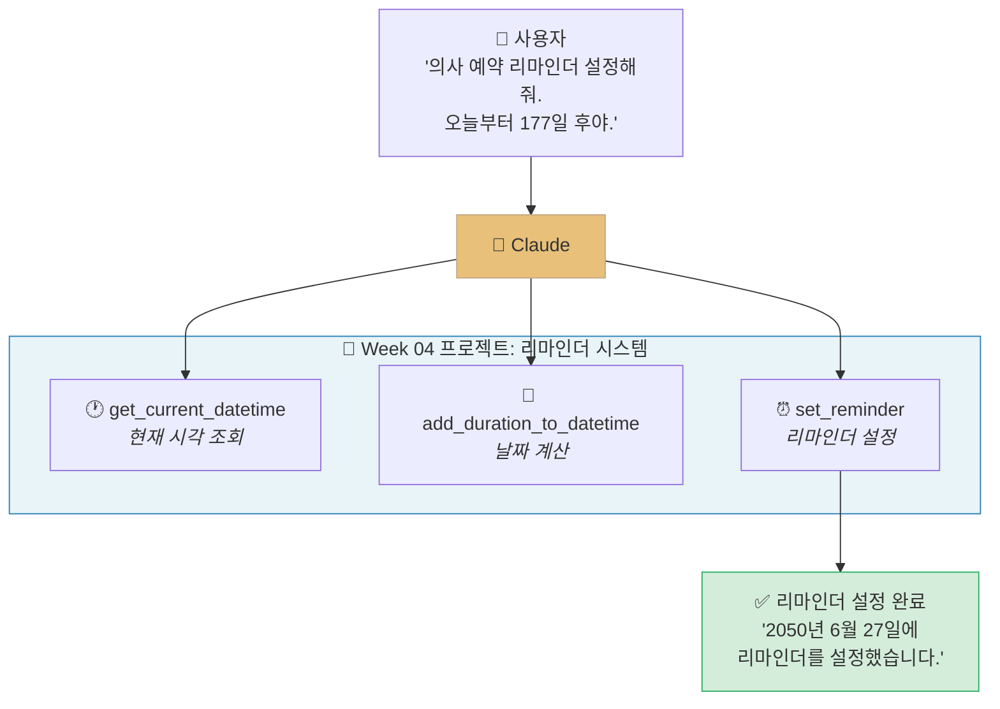

Claude는 사용자의 자연어 요청을 이해하고, 필요한 도구들을 **순서대로 호출**하여 실제 작업을 수행한다. 이번 주차에서는 이 시스템을 처음부터 끝까지 직접 구축한다.

### Anthropic Skilljar 코스

이 강의노트는 Anthropic 공식 교육 플랫폼 Skilljar의 **"Building with the Claude API" Section 3: Tool Use with Claude** (11개 레슨 + 1 퀴즈)를 기반으로 구성되었다.

> [!ref] 소스 매핑
> - 온라인 코스: [Building with the Claude API](https://anthropic.skilljar.com/claude-with-the-anthropic-api)
> - GitHub 실습: [tool_use](https://github.com/anthropics/courses/tree/master/tool_use)
> - 실라버스 매핑: **Building — S3 (Tool Use with Claude) → W4** (v2.3 기준)

---
## [Chapter 1] Tool Use 기초와 워크플로 (Lessons 1-8)

### 1.1 Tool Use 소개 (Introducing Tool Use)

Claude는 학습 데이터에 기반한 방대한 지식을 갖추고 있지만, 기본적으로 **외부 세계에 접근할 수 없다**. 현재 시간, 실시간 날씨, 데이터베이스 조회 등은 모델 자체로는 수행할 수 없는 작업이다. **Tool Use** (도구 사용, Function Calling이라고도 함)는 이 한계를 극복하는 핵심 메커니즘이다.


*Tool Use 개념 — Claude가 외부 도구를 활용하여 실시간 정보에 접근*

#### Tool Use란?

Tool Use는 Claude에게 **외부 함수(도구)를 호출할 수 있는 능력**을 부여하는 기능이다. 예를 들어, 사용자가 "서울의 현재 날씨는?"이라고 물으면:

- **Tool Use 없이**: Claude는 학습 데이터에 기반한 일반적인 날씨 정보만 제공할 수 있다
- **Tool Use 사용**: Claude가 날씨 API 도구를 호출하여 **실시간 날씨 데이터**를 가져온 후 응답한다


*날씨 예시 — Tool Use를 통해 실시간 데이터 접근*

#### Tool Use 4단계 흐름

Tool Use는 다음 **4단계 흐름**을 따른다:

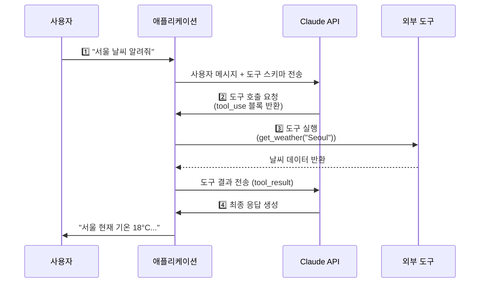

| 단계 | 설명 | 주체 |
| --- | --- | --- |
| **1. Initial Request** | 사용자 메시지 + 사용 가능한 도구 목록을 Claude에 전송 | 애플리케이션 → Claude |
| **2. Tool Request** | Claude가 어떤 도구를 어떤 파라미터로 호출할지 결정 | Claude → 애플리케이션 |
| **3. Data Retrieval** | 애플리케이션이 실제 도구 함수를 실행하여 결과 수집 | 애플리케이션 → 외부 도구 |
| **4. Final Response** | Claude가 도구 결과를 활용하여 최종 자연어 응답 생성 | Claude → 사용자 |


*Tool Use 4단계 흐름 요약*

> [!tip] 핵심 인사이트
> Claude는 도구를 **직접 실행하지 않는다**. Claude는 "이 도구를 이 파라미터로 호출해달라"고 요청하고, **실제 실행은 개발자의 애플리케이션**이 담당한다. 이 분리 덕분에 보안과 제어를 유지할 수 있다.

> [!finding] Tool Use vs 기존 접근법
> - 기존: 사용자 입력을 파싱하여 함수를 호출하는 규칙 기반 시스템
> - Tool Use: Claude가 **자연어를 이해하고 적절한 도구를 자동 선택** — 더 유연하고 확장 가능

> [!ref] 소스
> - Skilljar L01: Introducing tool use (287747)

---

### 1.2 프로젝트 개요: 리마인더 시스템 (Project Overview)

이 챕터 전체에서 만들어갈 프로젝트는 **리마인더 시스템** (Reminder System)이다. 사용자가 "30분 뒤에 회의 알림 설정해줘"와 같은 자연어 요청을 하면, Claude가 도구를 활용하여 현재 시간 파악 → 시간 계산 → 알림 설정까지 자동으로 처리하는 시스템을 구축한다.


*리마인더 시스템 프로젝트 개요*

#### 3가지 도전 과제

LLM이 리마인더 시스템을 운영하려면 해결해야 할 **3가지 근본적 한계**가 있다:

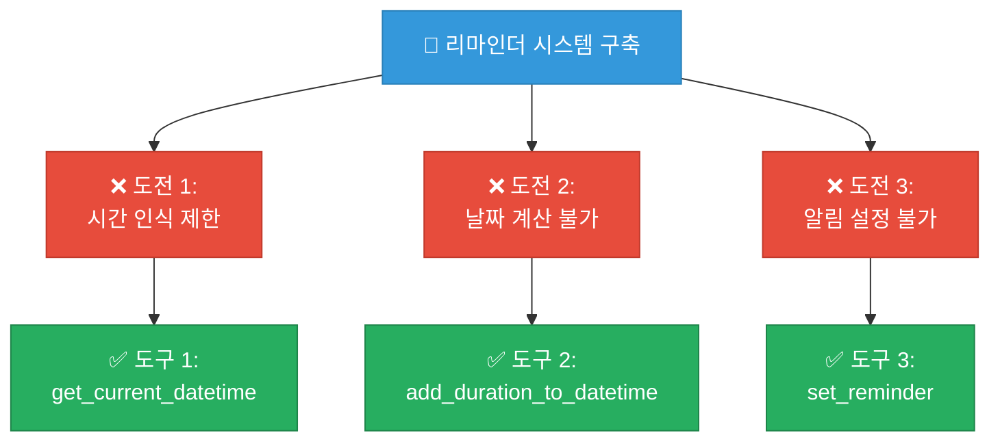

| 도전 과제 | 설명 | 해결 도구 |
| --- | --- | --- |
| **시간 인식 제한** (Limited Time Awareness) | Claude는 현재 날짜/시간을 모른다 | `get_current_datetime` |
| **날짜 계산 불가** (Date Calculation Issues) | "30분 후", "내일 오후 3시" 같은 계산이 정확하지 않다 | `add_duration_to_datetime` |
| **알림 설정 불가** (No Reminder Capability) | Claude는 외부 시스템에 알림을 설정할 수 없다 | `set_reminder` |

#### 시스템 아키텍처

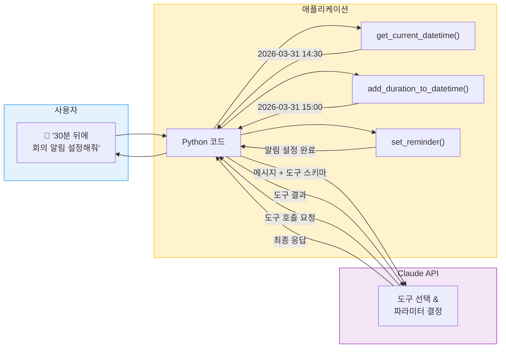


*3가지 도구로 구성된 리마인더 시스템 전체 흐름*

> [!method] 도구 설계 원칙
> 각 도구는 **하나의 명확한 책임**을 갖는다 (Single Responsibility). 복잡한 기능을 하나의 거대한 도구로 만들지 않고, **작고 조합 가능한 도구**로 분리하면 Claude가 더 정확하게 도구를 선택하고 사용할 수 있다.

> [!ref] 소스
> - Skilljar L02: Project overview (287751)

---

### 1.3 도구 함수 작성 (Tool Functions)

Tool Use의 첫 번째 단계는 **실제로 실행될 Python 함수**를 작성하는 것이다. 이 함수들은 Claude가 호출을 요청했을 때 애플리케이션이 실행하는 코드다.

*도구 함수는 일반 Python 함수이며, Claude가 직접 실행하지 않고 호출을 **요청**만 한다*

#### 핵심 원칙: 도구 함수는 일반 Python 함수

Tool Use에서 "도구"란 특별한 것이 아니다. **일반적인 Python 함수**가 그대로 도구가 된다. Claude는 이 함수의 존재와 사용법을 JSON 스키마로 알게 되고, 필요할 때 호출을 요청한다.

#### `get_current_datetime` 함수 구현

리마인더 시스템의 첫 번째 도구인 `get_current_datetime`을 구현한다:

```python
from datetime import datetime

def get_current_datetime(date_format: str = "%Y-%m-%d %H:%M:%S") -> str:
    """현재 날짜/시간을 지정된 형식으로 반환한다.

    Args:
        date_format: 날짜 형식 문자열 (strftime 포맷)
                    기본값: "%Y-%m-%d %H:%M:%S"

    Returns:
        현재 날짜/시간 문자열
    """
    current_datetime = datetime.now()
    return current_datetime.strftime(date_format)
```

```python
# 실행 예시
print(get_current_datetime())
# 출력: "2026-03-31 14:30:00"

print(get_current_datetime("%Y년 %m월 %d일"))
# 출력: "2026년 03월 31일"

print(get_current_datetime("%H:%M"))
# 출력: "14:30"
```

*위 코드의 실행 결과 — `get_current_datetime()`은 현재 날짜/시간을 지정된 포맷으로 반환한다*

#### 도구 함수 작성 Best Practices

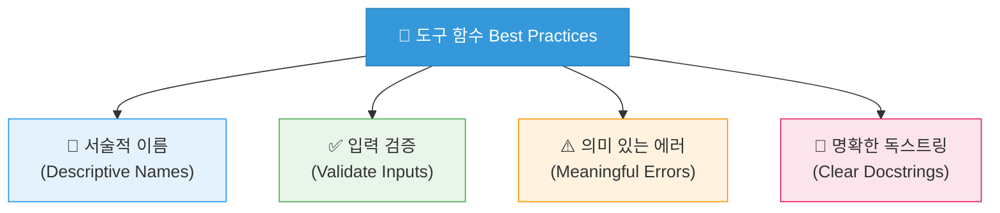

| Best Practice | 설명 | 예시 |
| --- | --- | --- |
| **서술적 이름** (Descriptive Names) | 함수명만으로 기능을 알 수 있어야 한다 | `get_current_datetime` (O) / `get_dt` (X) |
| **입력 검증** (Validate Inputs) | 잘못된 입력을 조기에 감지한다 | `if not isinstance(date_format, str): raise ValueError(...)` |
| **의미 있는 에러** (Meaningful Errors) | 에러 메시지가 문제 해결에 도움이 되어야 한다 | `"Invalid date format: '%Q' — Use strftime format like '%Y-%m-%d'"` |
| **명확한 독스트링** (Clear Docstrings) | 함수의 목적, 파라미터, 반환값을 문서화한다 | `"""현재 날짜/시간을 지정된 형식으로 반환한다."""` |

#### 입력 검증이 포함된 완성 버전

허용된 포맷만 받아들이는 **화이트리스트 방식**으로 검증한다. Claude가 임의의 포맷을 보내더라도 안전하게 거부할 수 있다:

```python
from datetime import datetime

def get_current_datetime(date_format: str = "%Y-%m-%d %H:%M:%S") -> str:
    """현재 날짜와 시간을 지정된 포맷으로 반환합니다.

    Args:
        date_format: strftime 포맷 문자열 (기본값: "%Y-%m-%d %H:%M:%S")

    Returns:
        포맷된 날짜/시간 문자열
    """
    valid_formats = [
        "%Y-%m-%d %H:%M:%S",
        "%Y-%m-%d",
        "%H:%M:%S",
        "%H:%M",
        "%Y/%m/%d",
        "%m/%d/%Y",
    ]
    if date_format not in valid_formats:
        raise ValueError(
            f"Invalid date format: {date_format}. "
            f"Valid formats: {valid_formats}"
        )
    return datetime.now().strftime(date_format)
```

> 📂 이 코드는 `S3_01_tool_functions_schemas.ipynb` Cell 3과 동일합니다.

> [!tip] 함수 품질 = 도구 품질
> 도구 함수의 품질이 곧 Tool Use의 신뢰성을 결정한다. 입력 검증, 에러 처리, 타입 힌트를 **처음부터 적용**하는 습관이 중요하다. Claude가 잘못된 파라미터를 보내더라도 시스템이 우아하게 실패(graceful failure)해야 한다.

> [!action] 실습 코드
> 📂 이 섹션의 코드를 직접 실행해보세요.
> `03-Exercises/Week_04/skilljar/S3_01_tool_functions_schemas.ipynb`

> [!ref] 소스
> - Skilljar L03: Tool functions (287756)

---

### 1.4 도구 스키마 정의 (Tool Schemas)

도구 함수를 작성했다면, 이제 Claude에게 **이 도구가 무엇이고, 어떤 파라미터를 받는지** 알려주어야 한다. 이를 위해 **JSON Schema** 형식의 도구 스키마를 정의한다.


*도구 스키마 — Claude에게 도구의 존재와 사용법을 알려주는 명세*

#### 스키마의 3가지 핵심 요소

도구 스키마는 3가지 핵심 필드로 구성된다:

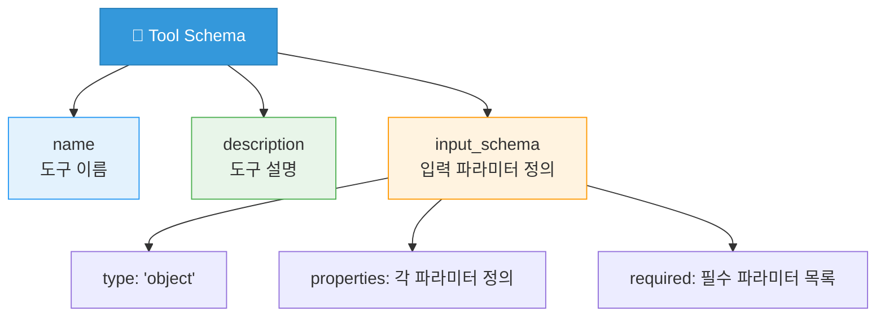

| 필드 | 설명 | 중요도 |
| --- | --- | --- |
| **name** | 도구의 고유 식별자 (함수명과 일치 권장) | 필수 |
| **description** | Claude가 도구를 **언제, 왜** 사용해야 하는지 판단하는 핵심 정보 | 매우 중요 |
| **input_schema** | JSON Schema 형식의 파라미터 명세 (타입, 설명, 기본값, 필수 여부) | 필수 |

#### `get_current_datetime` 스키마 정의

```python
get_current_datetime_schema = {
    "name": "get_current_datetime",
    "description": "Returns the current date and time in the specified format. "
                   "Use this tool when you need to know the current date or time.",
    "input_schema": {
        "type": "object",
        "properties": {
            "date_format": {
                "type": "string",
                "description": "The format string for the date/time output. "
                              "Uses Python strftime format codes. "
                              "Default: '%Y-%m-%d %H:%M:%S'",
                "default": "%Y-%m-%d %H:%M:%S"
            }
        },
        "required": []
    }
}
```

*위 스키마는 `get_current_datetime` 함수의 name, description, input_schema를 정의한다*

> [!finding] Description이 핵심이다
> `description` 필드는 Claude가 **도구 선택의 근거**로 사용하는 가장 중요한 정보다. "현재 시간을 반환하는 함수"보다 "현재 날짜/시간을 알아야 할 때 사용하는 도구"라고 쓰는 것이 Claude의 판단에 더 도움이 된다. **사용 시점과 목적**을 명확히 기술하자.

#### Claude로 스키마 자동 생성

도구 스키마를 수동으로 작성하는 것은 번거롭다. Claude 자체를 활용하여 스키마를 자동 생성할 수 있다:

```python
# Claude에게 함수 코드를 보여주고 스키마 생성 요청
prompt = """
다음 Python 함수에 대한 Anthropic Tool Use JSON 스키마를 생성해주세요:

def get_current_datetime(date_format: str = "%Y-%m-%d %H:%M:%S") -> str:
    current_datetime = datetime.now()
    return current_datetime.strftime(date_format)

JSON 스키마만 반환해주세요.
"""
```

*Claude에게 함수 코드를 보여주고 "Write a valid JSON schema spec for tool calling"이라고 요청하면 스키마를 자동 생성해준다*

#### `ToolParam` 타입 활용

Anthropic Python 라이브러리에서 제공하는 `ToolParam` 타입을 사용하면 IDE 자동완성과 타입 검사의 이점을 얻을 수 있다:

```python
from anthropic.types import ToolParam

# ToolParam 타입으로 스키마를 정의하면 IDE 지원을 받을 수 있다
get_current_datetime_tool: ToolParam = {
    "name": "get_current_datetime",
    "description": "Returns the current date and time in the specified format. "
                   "Use this tool when you need to know the current date or time.",
    "input_schema": {
        "type": "object",
        "properties": {
            "date_format": {
                "type": "string",
                "description": "The format string for the date/time output. "
                              "Uses Python strftime format codes. "
                              "Default: '%Y-%m-%d %H:%M:%S'",
                "default": "%Y-%m-%d %H:%M:%S"
            }
        },
        "required": []
    }
}
```

> [!tip] 3개 도구의 스키마 패턴
> 리마인더 시스템의 3개 도구 모두 동일한 패턴으로 스키마를 정의한다:
> - `get_current_datetime_schema`: 날짜 형식 1개 파라미터
> - `add_duration_to_datetime_schema`: 시작시간, 기간, 단위 3개 파라미터
> - `set_reminder_schema`: 시간, 메시지 2개 파라미터

> [!ref] 소스
> - Skilljar L04: Tool schemas (287753)

---

### 1.5 메시지 블록 처리 (Handling Message Blocks)

도구를 활성화한 API 호출의 응답은 기존과 **구조가 다르다**. 일반 텍스트 응답 대신 **여러 블록** (TextBlock, ToolUseBlock)이 포함될 수 있다. 이 멀티블록 메시지를 올바르게 처리하는 방법을 배운다.

#### 도구 활성화 API 호출

```python
from anthropic import Anthropic

client = Anthropic()

# tools 파라미터에 스키마 목록을 전달하여 도구를 활성화한다
response = client.messages.create(
    model=MODEL,
    max_tokens=1024,
    tools=[get_current_datetime_schema],  # 도구 스키마 전달
    messages=[
        {"role": "user", "content": "지금 몇 시야?"}
    ]
)
```

> [!finding] `tools` 파라미터
> `tools` 파라미터에 도구 스키마 리스트를 전달하면, Claude는 해당 도구들을 **사용할 수 있다는 것을 인지**한다. Claude가 도구를 사용할지 여부는 사용자의 질문과 도구의 description을 기반으로 **스스로 판단**한다.

#### 멀티블록 응답 구조

도구 호출이 포함된 응답의 `content`는 단순 문자열이 아니라 **블록 리스트**다:

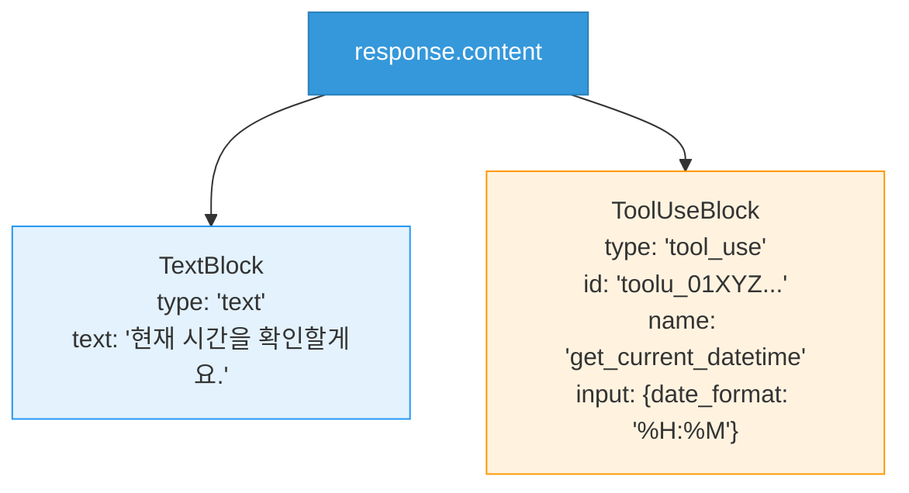


*멀티블록 응답 — TextBlock과 ToolUseBlock이 함께 반환*

#### 블록 순회 처리

```python
# 응답의 각 블록을 순회하며 타입별로 처리한다
for block in response.content:
    if block.type == "text":
        # TextBlock: Claude의 텍스트 응답
        print(f"[텍스트] {block.text}")
    elif block.type == "tool_use":
        # ToolUseBlock: 도구 호출 요청
        print(f"[도구 호출] {block.name}")
        print(f"  ID: {block.id}")
        print(f"  입력: {block.input}")
```

```
# 출력 예시
[텍스트] 현재 시간을 확인할게요.
[도구 호출] get_current_datetime
  ID: toolu_01XYZabc123
  입력: {'date_format': '%H:%M'}
```

#### ToolUseBlock의 핵심 필드

| 필드 | 설명 | 예시 |
| --- | --- | --- |
| **type** | 항상 `"tool_use"` | `"tool_use"` |
| **id** | 이 도구 호출의 고유 식별자 (결과 전송 시 필요) | `"toolu_01XYZabc123"` |
| **name** | 호출할 도구 이름 (스키마의 name과 일치) | `"get_current_datetime"` |
| **input** | Claude가 결정한 파라미터 (dict) | `{"date_format": "%H:%M"}` |

*ToolUseBlock에는 `id` (추적용), `name` (함수명), `input` (파라미터 딕셔너리), `type` ("tool_use")이 포함된다*

#### 대화 히스토리에 전체 content 보존

> [!tip] 중요: content 전체를 보존하라
> 도구 호출 응답을 대화 히스토리에 추가할 때, **`response.content` 전체**를 그대로 저장해야 한다. TextBlock만 추출하거나 ToolUseBlock을 제거하면 후속 대화에서 오류가 발생한다.

```python
# ✅ 올바른 방법: content 전체를 보존
messages.append({
    "role": "assistant",
    "content": response.content  # 전체 블록 리스트 저장
})

# ❌ 잘못된 방법: 텍스트만 추출
messages.append({
    "role": "assistant",
    "content": response.content[0].text  # 도구 블록 유실!
})
```

> [!ref] 소스
> - Skilljar L05: Handling message blocks (287757)

---

### 1.6 Tool 결과 전송 (Sending Tool Results)

Claude가 도구 호출을 요청하면, 애플리케이션이 실제로 도구를 실행하고 그 **결과를 Claude에게 다시 전송**해야 한다. 이 과정에서 사용하는 것이 `tool_result` 블록이다.

#### `tool_result` 메시지 형식

도구 실행 결과를 Claude에게 전달하는 메시지 형식:

```python
# 도구를 실행하고 결과를 수집
tool_name = block.name       # "get_current_datetime"
tool_input = block.input     # {"date_format": "%H:%M"}
tool_use_id = block.id       # "toolu_01XYZabc123"

# 실제 도구 함수 실행
result = get_current_datetime(**tool_input)
# result = "14:30"

# tool_result 메시지 구성
tool_result_message = {
    "role": "user",
    "content": [
        {
            "type": "tool_result",
            "tool_use_id": tool_use_id,  # 반드시 원래 ID와 일치해야 함
            "content": str(result)        # 문자열로 전달
        }
    ]
}
```


*tool_result 메시지 형식 — tool_use_id로 요청과 결과를 매칭*

#### 3가지 핵심 필드

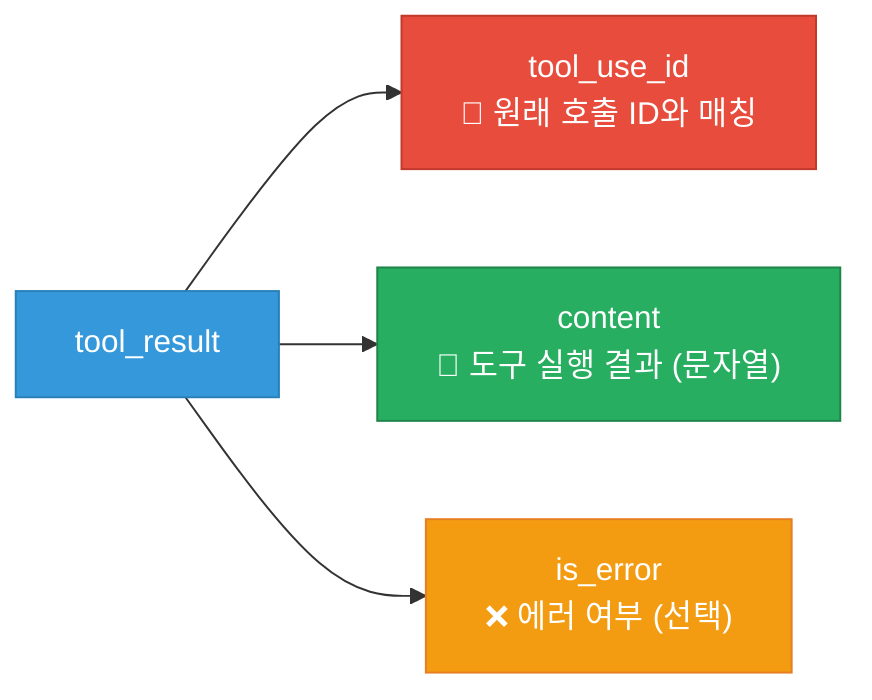

| 필드 | 설명 | 필수 여부 |
| --- | --- | --- |
| **tool_use_id** | Claude의 도구 호출 요청 ID와 **반드시 일치**해야 한다 | 필수 |
| **content** | 도구 실행 결과를 **문자열**로 전달 | 필수 |
| **is_error** | `true`이면 Claude가 에러를 인지하고 대응한다 | 선택 (기본: false) |

*`tool_use_id`는 요청과 결과를 연결하는 고유 식별자이다. 반드시 원래 ToolUseBlock의 id와 일치해야 한다*

#### 에러 처리 (`is_error`)

도구 실행이 실패한 경우, `is_error: true`로 설정하여 Claude에게 알린다:

```python
# 정상적인 결과 전송
tool_result_success = {
    "type": "tool_result",
    "tool_use_id": tool_use_id,
    "content": "2026-03-31 14:30:00"
}

# 에러 결과 전송
tool_result_error = {
    "type": "tool_result",
    "tool_use_id": tool_use_id,
    "content": "Error: Invalid date format '%Q' — "
               "Use strftime format like '%Y-%m-%d'",
    "is_error": True  # Claude가 에러를 인지하고 다른 전략 시도
}
```

> [!finding] `is_error`의 효과
> `is_error: true`를 설정하면 Claude는 에러 상황을 이해하고, **다른 파라미터로 재시도**하거나 **사용자에게 상황을 설명**하는 등 지능적으로 대응할 수 있다. 에러를 숨기지 않고 명시적으로 전달하는 것이 더 나은 사용자 경험을 만든다.

#### 다중 도구 호출 (Multiple Tool Calls)

Claude는 한 번의 응답에서 **여러 도구를 동시에 호출**할 수 있다. 각 호출은 고유한 `id`를 가지며, 모든 호출에 대해 각각 `tool_result`를 반환해야 한다:

```python
# Claude가 2개 도구를 동시에 호출한 경우
# response.content에 2개의 ToolUseBlock이 포함됨

tool_results = []
for block in response.content:
    if block.type == "tool_use":
        # 각 도구를 실행하고 결과 수집
        result = run_tool(block.name, block.input)
        tool_results.append({
            "type": "tool_result",
            "tool_use_id": block.id,  # 각 호출의 고유 ID
            "content": str(result)
        })

# 모든 결과를 하나의 메시지로 전송
messages.append({
    "role": "user",
    "content": tool_results
})
```

*Claude가 2개 이상 도구를 동시에 호출하면, 각 ToolUseBlock에 고유 ID가 부여되며 모든 결과를 tool_result로 반환해야 한다*

> [!tip] 후속 요청에도 도구 스키마 포함
> `tool_result`를 전송하는 후속 API 호출에도 **`tools` 파라미터에 도구 스키마를 포함**해야 한다. Claude가 결과를 보고 추가 도구 호출이 필요하다고 판단할 수 있기 때문이다.

> [!ref] 소스
> - Skilljar L06: Sending tool results (287752)

---

### 1.7 멀티턴 대화와 도구 (Multi-turn Conversations)

실제 리마인더 시스템에서는 단일 요청-응답이 아니라 **여러 턴에 걸친 대화**가 이루어진다. "30분 뒤에 회의 알림 설정해줘"라는 요청 하나에도 Claude는 현재 시간 확인 → 시간 계산 → 알림 설정까지 **3번의 도구 호출**이 필요하다. 이를 위한 멀티턴 패턴을 구축한다.


*멀티턴 Tool Use — 하나의 요청이 여러 도구 호출로 이어지는 흐름*

#### 멀티턴 Tool Use 패턴

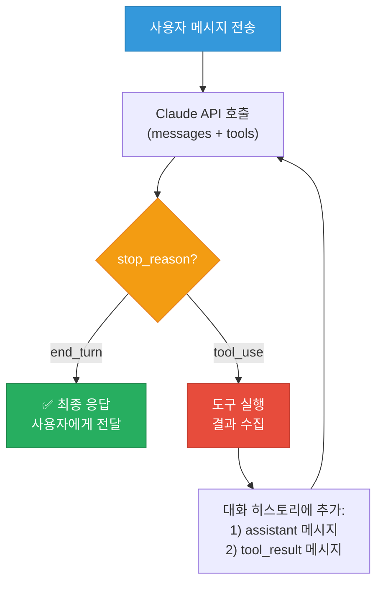

핵심 아이디어: `stop_reason`이 `"tool_use"`인 동안 **계속 루프**를 돌며 도구를 실행하고 결과를 전송한다. `stop_reason`이 `"end_turn"`이 되면 Claude가 최종 텍스트 응답을 반환한 것이므로 루프를 종료한다.

#### 헬퍼 함수 리팩토링

멀티턴 대화를 깔끔하게 관리하기 위해 헬퍼 함수를 정리한다:

```python
import anthropic

client = anthropic.Anthropic()
MODEL = "claude-haiku-4-5"  # 실습용 (실무: claude-sonnet-4-20250514 권장)

# 도구 스키마 목록
tools = [
    get_current_datetime_schema,
    add_duration_to_datetime_schema,
    set_reminder_schema
]

def add_user_message(messages, text):
    """사용자 메시지를 대화 히스토리에 추가"""
    messages.append({"role": "user", "content": text})

def add_assistant_message(messages, response):
    """어시스턴트 응답을 대화 히스토리에 추가

    주의: response.content 전체를 보존한다 (TextBlock + ToolUseBlock)
    """
    messages.append({"role": "assistant", "content": response.content})
```

#### `chat` 함수 (도구 지원)

```python
def chat(messages, system=None):
    """Claude API를 호출하고 전체 응답 객체를 반환한다.

    tools 파라미터를 항상 포함하여 도구 사용을 활성화한다.
    """
    params = {
        "model": model,
        "max_tokens": 4096,
        "messages": messages,
        "tools": tools  # 항상 도구 스키마 포함
    }
    if system:
        params["system"] = system

    response = client.messages.create(**params)
    return response
```

#### `text_from_message` 유틸리티

```python
def text_from_message(response):
    """응답에서 텍스트 블록만 추출하여 반환한다.

    ToolUseBlock은 무시하고 TextBlock의 텍스트만 결합한다.
    """
    texts = []
    for block in response.content:
        if hasattr(block, "text"):
            texts.append(block.text)
    return "\n".join(texts)
```

*리팩토링 포인트 — `chat()`은 tools 파라미터를 받고, `text_from_message()`는 TextBlock만 추출한다*

> [!method] 리팩토링 원칙
> 1. `chat` 함수는 `response` 객체 전체를 반환 (텍스트만 추출하지 않음)
> 2. `add_assistant_message`는 `response.content` 전체를 보존
> 3. `text_from_message`로 필요할 때만 텍스트를 추출
> 4. 모든 API 호출에 `tools` 파라미터를 포함

> [!ref] 소스
> - Skilljar L07: Multi-turn conversations (287750)

---

### 1.8 멀티턴 구현 (Implementing Multiple Turns)

이제 실제로 **자동 루프**를 구현하여, 사용자가 한 번 메시지를 보내면 Claude가 필요한 모든 도구를 순차적으로 호출하고 최종 응답까지 자동으로 완성하는 시스템을 만든다.

#### `run_tool` — 도구 라우팅 함수

Claude가 요청한 도구 이름에 따라 적절한 Python 함수로 **라우팅**한다:

```python
def run_tool(tool_name, tool_input):
    """도구 이름에 따라 적절한 함수를 실행한다.

    Args:
        tool_name: Claude가 요청한 도구 이름
        tool_input: Claude가 결정한 파라미터 (dict)

    Returns:
        도구 실행 결과 (문자열)
    """
    if tool_name == "get_current_datetime":
        return get_current_datetime(**tool_input)
    elif tool_name == "add_duration_to_datetime":
        return add_duration_to_datetime(**tool_input)
    elif tool_name == "set_reminder":
        return set_reminder(**tool_input)
    else:
        return f"Unknown tool: {tool_name}"
```

> [!tip] 확장 가능한 라우팅
> 도구가 많아지면 `if-elif` 대신 딕셔너리 기반 라우팅이 더 깔끔하다:
> ```python
> TOOL_REGISTRY = {
>     "get_current_datetime": get_current_datetime,
>     "add_duration_to_datetime": add_duration_to_datetime,
>     "set_reminder": set_reminder,
> }
>
> def run_tool(tool_name, tool_input):
>     if tool_name in TOOL_REGISTRY:
>         return TOOL_REGISTRY[tool_name](**tool_input)
>     return f"Unknown tool: {tool_name}"
> ```

#### `run_tools` — 다중 도구 실행

하나의 응답에 포함된 모든 ToolUseBlock을 처리한다:

```python
def run_tools(response):
    """응답에 포함된 모든 도구 호출을 실행하고 결과 블록을 반환한다.

    Args:
        response: Claude API 응답 객체

    Returns:
        tool_result 블록 리스트
    """
    tool_result_blocks = []

    for block in response.content:
        if block.type == "tool_use":
            tool_name = block.name
            tool_input = block.input
            tool_use_id = block.id

            print(f"  🔧 도구 실행: {tool_name}({tool_input})")

            try:
                result = run_tool(tool_name, tool_input)
                tool_result_blocks.append({
                    "type": "tool_result",
                    "tool_use_id": tool_use_id,
                    "content": str(result)
                })
            except Exception as e:
                # 에러 발생 시 is_error: true로 전달
                tool_result_blocks.append({
                    "type": "tool_result",
                    "tool_use_id": tool_use_id,
                    "content": f"Error: {str(e)}",
                    "is_error": True
                })

    return tool_result_blocks
```

#### `run_conversation` — 완전한 대화 루프

모든 것을 통합하는 **핵심 함수**:

```python
def run_conversation(user_message):
    """사용자 메시지를 받아 도구 호출을 포함한 완전한 대화를 실행한다.

    Args:
        user_message: 사용자의 자연어 요청

    Returns:
        Claude의 최종 텍스트 응답
    """
    messages = []
    add_user_message(messages, user_message)

    print(f"👤 사용자: {user_message}")

    while True:
        # 1. Claude API 호출
        response = chat(messages)

        # 2. 응답을 대화 히스토리에 추가
        add_assistant_message(messages, response)

        # 3. stop_reason 확인
        if response.stop_reason == "end_turn":
            # Claude가 최종 응답을 완성함 → 루프 종료
            final_text = text_from_message(response)
            print(f"🤖 Claude: {final_text}")
            return final_text

        elif response.stop_reason == "tool_use":
            # Claude가 도구 호출을 요청함 → 도구 실행
            tool_results = run_tools(response)

            # 4. 도구 결과를 대화 히스토리에 추가
            messages.append({
                "role": "user",
                "content": tool_results
            })
            # 루프 계속 → 다시 Claude API 호출
```

*위 `run_conversation`은 `stop_reason != "tool_use"`가 될 때까지 자동으로 루프를 반복한다*

#### 전체 실행 흐름 다이어그램

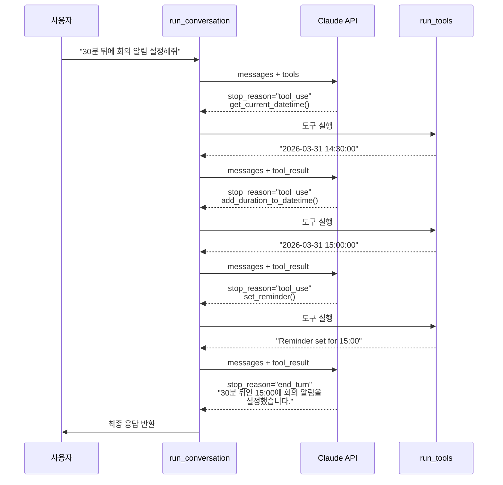

#### 실행 예시

```python
# 리마인더 시스템 실행
result = run_conversation("30분 뒤에 회의 알림 설정해줘")
```

```
👤 사용자: 30분 뒤에 회의 알림 설정해줘
  🔧 도구 실행: get_current_datetime({'date_format': '%Y-%m-%d %H:%M:%S'})
  🔧 도구 실행: add_duration_to_datetime({'start_datetime': '2026-03-31 14:30:00',
                'duration': 30, 'unit': 'minutes'})
  🔧 도구 실행: set_reminder({'datetime': '2026-03-31 15:00:00',
                'message': '회의'})
🤖 Claude: 30분 뒤인 15:00에 회의 알림을 설정했습니다!
```

> [!finding] 핵심 설계 포인트
> 1. **`stop_reason` 기반 루프**: `"tool_use"` → 도구 실행, `"end_turn"` → 종료
> 2. **에러 처리**: `try/except`로 도구 실행 실패를 안전하게 처리하고 `is_error: true`로 Claude에 전달
> 3. **확장성**: 새 도구 추가 시 `run_tool`에 라우팅만 추가하면 됨
> 4. **자율성**: Claude가 어떤 도구를 어떤 순서로 호출할지 **스스로 판단** — 개발자가 순서를 하드코딩하지 않음

> [!ref] 소스
> - Skilljar L08: Implementing multiple turns (287758)

---

### 1.9 종합 실습: Tool Use 기초 (Exercise)

> [!action] 실습: 리마인더 시스템 구축
> 이 챕터에서 배운 내용을 3개 노트북으로 단계별 실습합니다:
>
> | 노트북 | 내용 | 대응 섹션 |
> | --- | --- | --- |
> | 📂 `S3_01_tool_functions_schemas.ipynb` | 도구 함수 + 스키마 + 첫 API 호출 | §1.3~1.4 |
> | 📂 `S3_02_message_blocks_results.ipynb` | 메시지 블록 처리 + tool_result 전송 + 에러 처리 | §1.5~1.6 |
> | 📂 `S3_03_multi_turn_loop.ipynb` | 헬퍼 함수 리팩토링 + `run_conversation` 루프 완성 | §1.7~1.8 |

#### 핵심 개념 요약

```mermaid
graph TD
    subgraph CONCEPTS["Chapter 1 핵심 개념"]
        C1["1.1 Tool Use 소개<br/>4단계 흐름"]
        C2["1.2 프로젝트 개요<br/>리마인더 시스템 3도구"]
        C3["1.3 도구 함수<br/>Python 함수 작성"]
        C4["1.4 도구 스키마<br/>JSON Schema 정의"]
        C5["1.5 메시지 블록<br/>TextBlock + ToolUseBlock"]
        C6["1.6 Tool 결과<br/>tool_result + is_error"]
        C7["1.7 멀티턴 대화<br/>헬퍼 함수 리팩토링"]
        C8["1.8 멀티턴 구현<br/>run_conversation 루프"]
    end

    C1 --> C2
    C2 --> C3
    C3 --> C4
    C4 --> C5
    C5 --> C6
    C6 --> C7
    C7 --> C8

    style CONCEPTS fill:#f8f9fa,stroke:#dee2e6
    style C1 fill:#e3f2fd,stroke:#2196f3
    style C2 fill:#e3f2fd,stroke:#2196f3
    style C3 fill:#e8f5e9,stroke:#4caf50
    style C4 fill:#e8f5e9,stroke:#4caf50
    style C5 fill:#fff3e0,stroke:#ff9800
    style C6 fill:#fff3e0,stroke:#ff9800
    style C7 fill:#fce4ec,stroke:#e91e63
    style C8 fill:#fce4ec,stroke:#e91e63
```

| 개념 | 핵심 키워드 | 기억할 포인트 |
| --- | --- | --- |
| Tool Use 흐름 | Initial → Tool Request → Retrieval → Response | Claude는 도구를 직접 실행하지 않는다 |
| 도구 함수 | Python function, validation, error handling | 일반 함수가 곧 도구 |
| 도구 스키마 | name, description, input_schema | description이 가장 중요 |
| 메시지 블록 | TextBlock, ToolUseBlock | content 전체를 보존 |
| Tool 결과 | tool_use_id, content, is_error | ID 매칭 필수 |
| 멀티턴 | stop_reason, while loop | `"tool_use"` → 계속, `"end_turn"` → 종료 |
## [Chapter 2] 다중 도구와 내장 도구 (Lessons 9-11)

### 2.1 다중 도구 사용 (Using Multiple Tools)

> [!action] 실습 코드 — `S3_04_multiple_tools.ipynb` 열기
> Ch.2의 출발점입니다. Ch.1에서 만든 3가지 도구를 **모두 등록**하고 Claude가 자율적으로 조합하는 과정을 다룹니다.
> 📂 `03-Exercises/Week_04/skilljar/S3_04_multiple_tools.ipynb`

지금까지 개별 도구를 하나씩 만들었다면, 이제 3가지 도구를 **모두 tools 배열에 등록**하여 Claude가 하나의 요청에서 여러 도구를 자율적으로 조합하게 한다.


*다중 도구 등록 — Reminder System에 3가지 도구를 모두 등록*

#### Ch.1에서 만든 3가지 도구

Ch.1에서 Reminder System을 위해 3가지 도구를 개별적으로 구현했다:

```python
# 도구 1: 현재 날짜/시간 조회 (§1.3에서 구현한 것과 동일)
def get_current_datetime(date_format: str = "%Y-%m-%d %H:%M:%S") -> str:
    """현재 날짜와 시간을 지정된 포맷으로 반환합니다."""
    valid_formats = ["%Y-%m-%d %H:%M:%S", "%Y-%m-%d", "%H:%M:%S",
                     "%H:%M", "%Y/%m/%d", "%m/%d/%Y"]
    if date_format not in valid_formats:
        raise ValueError(f"Invalid date format: {date_format}. Valid: {valid_formats}")
    return datetime.now().strftime(date_format)

# 도구 2: 날짜에 기간 더하기 (§1.7에서 추가한 두 번째 도구)
def add_duration_to_datetime(
    date_str: str,
    duration_days: int = 0,
    duration_hours: int = 0,
    duration_minutes: int = 0,
) -> str:
    """주어진 날짜/시간에 기간을 더합니다."""
    dt = datetime.strptime(date_str, "%Y-%m-%d %H:%M:%S")
    dt += timedelta(days=duration_days, hours=duration_hours, minutes=duration_minutes)
    return dt.strftime("%Y-%m-%d %H:%M:%S")

# 도구 3: 리마인더 설정 (이번 레슨에서 새로 추가)
reminders = []

def set_reminder(reminder_text: str, reminder_datetime: str) -> str:
    """리마인더를 등록합니다."""
    reminder = {"text": reminder_text, "datetime": reminder_datetime}
    reminders.append(reminder)
    return f"Reminder set: '{reminder_text}' at {reminder_datetime}"
```

> 📂 이 코드는 `S3_04_multiple_tools.ipynb` Cell 2와 동일합니다.

#### tools 배열에 모두 등록

핵심은 **모든 도구 스키마를 하나의 `tools` 리스트에 포함**하고, **`run_tool` 라우터 함수에 모든 함수를 등록**하는 것이다:

```python
# 3개 도구 스키마를 모두 포함
tools = [
    get_current_datetime_tool,   # 도구 1 스키마
    add_duration_tool,           # 도구 2 스키마
    set_reminder_tool            # 도구 3 스키마
]
```

#### run_conversation 업데이트

§1.8에서 구현한 `run_conversation`에 3개 도구 스키마를 전달하면 된다. 함수 자체는 변경 없이 `tools` 파라미터만 업데이트:

```python
# 3개 도구 스키마를 모두 전달 — run_conversation 자체는 §1.8과 동일
all_tools = [
    get_current_datetime_schema,
    add_duration_to_datetime_schema,
    set_reminder_schema,
]

response, messages = run_conversation(
    "Set a reminder for my doctors appointment. Its 177 days after Jan 1st, 2050.",
    tools=all_tools,
)
```

> `run_conversation`은 §1.8에서 구현한 범용 함수이므로, 새 도구를 추가해도 코드 수정 없이 **스키마 목록만 확장**하면 된다.

#### run_tool 라우터 업데이트

```python
def run_tool(tool_name, tool_input):
    """도구 이름에 따라 적절한 함수를 실행하는 라우터"""
    if tool_name == "get_current_datetime":
        return get_current_datetime(**tool_input)
    elif tool_name == "add_duration_to_datetime":
        return add_duration_to_datetime(**tool_input)
    elif tool_name == "set_reminder":
        return set_reminder(**tool_input)
    else:
        return f"Error: Unknown tool '{tool_name}'"
```

> `**tool_input`으로 딕셔너리를 키워드 인자로 언패킹한다. Claude가 스키마에 정의된 파라미터 이름과 동일한 키를 보내므로, 이 방식이 안전하고 간결하다.

*`run_tool`은 `**tool_input` 언패킹으로 각 도구 함수에 파라미터를 전달한다*

#### 테스트: 복합 요청

이제 Claude가 **여러 도구를 순차적으로 호출**하여 복합 요청을 처리할 수 있다:

```python
result = run_conversation(
    "Set a reminder for my doctors appointment. "
    "Its 177 days after Jan 1st, 2050."
)
print(result)
```

Claude는 자동으로 다음 순서를 수행한다:
1. `add_duration_to_datetime("2050-01-01", 177)` → **"2050-06-27"** 계산
2. `set_reminder("Doctor's appointment", "2050-06-27")` → 리마인더 설정
3. 최종 응답: "I've set a reminder for your doctor's appointment on June 27, 2050."

*복합 요청 처리 — Claude가 `add_duration_to_datetime` → `set_reminder`를 순차 호출하여 177일 후 리마인더를 자동 설정*

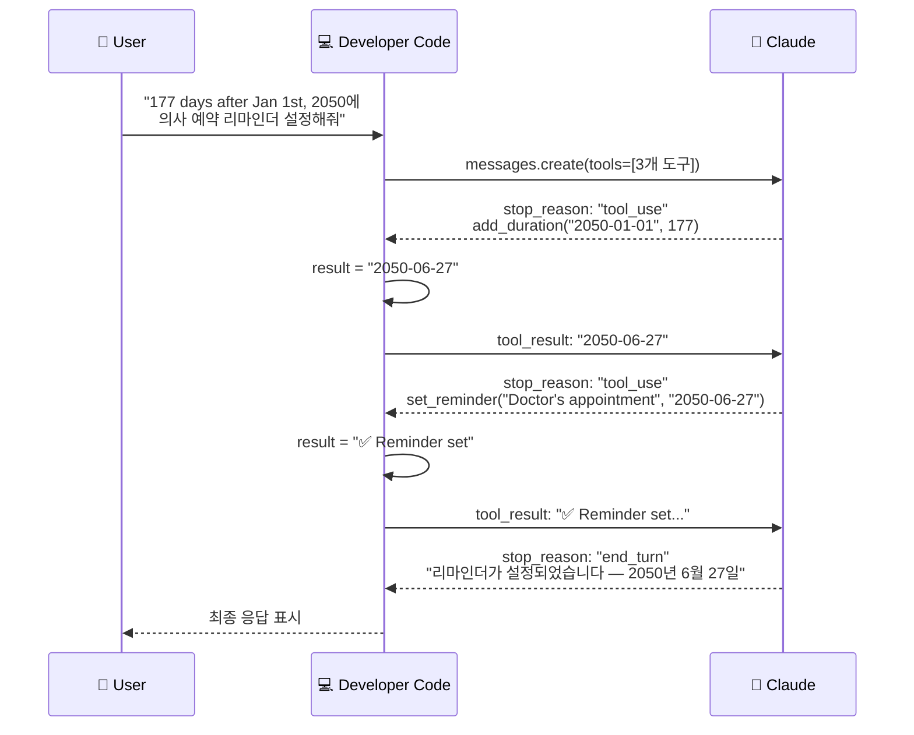

> [!finding] Claude의 자율적 도구 조합
> 3가지 도구가 등록되면 Claude는 각 도구의 `description`을 읽고 **어떤 도구를 어떤 순서로 호출할지 스스로 판단**한다. 177일 계산이 먼저 필요하다는 것을 Claude가 알아서 판단한 것이다. 개발자가 호출 순서를 지정할 필요가 없다.

> [!ref] 소스
> - Skilljar L09: Using multiple tools (287749)
> - GitHub: [06_chatbot_with_multiple_tools.ipynb](https://github.com/anthropics/courses/blob/master/tool_use/06_chatbot_with_multiple_tools.ipynb)

---

### 2.2 텍스트 편집 도구 (The Text Edit Tool)

Chapter 1에서 배운 **Client Tools** (사용자 정의 도구)와 달리, Claude는 **Built-in Tools** (내장 도구)도 지원한다. 내장 도구는 Anthropic이 스키마를 미리 정의해두었지만, **실행은 개발자 코드가 담당**하는 특별한 형태의 도구다.


*텍스트 편집 도구 — Claude의 내장 도구 중 하나*

#### Built-in Tools vs Client Tools

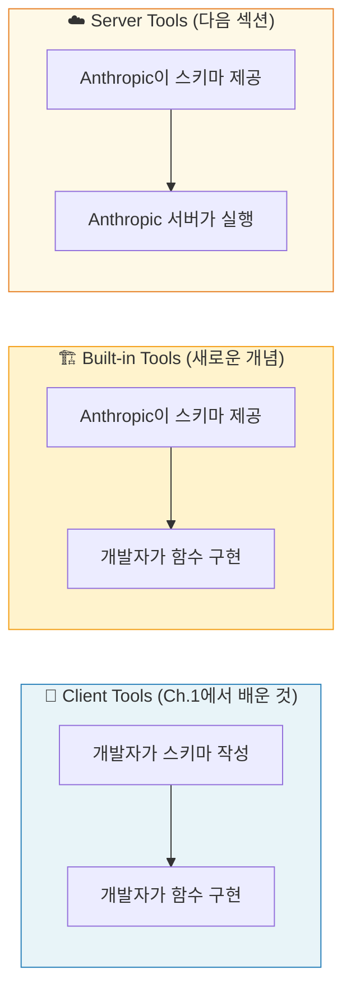

| 구분 | Client Tools | Built-in Tools | Server Tools |
| --- | --- | --- | --- |
| **스키마 정의** | 개발자 | Anthropic (내장) | Anthropic (내장) |
| **함수 구현** | 개발자 | **개발자** | Anthropic 서버 |
| **실행 위치** | 개발자 코드 | **개발자 코드** | Anthropic 서버 |
| **예시** | get_weather, calculator | **text_editor** | web_search |

> [!method] 핵심 차이
> Built-in Tools는 Client Tools와 Server Tools의 **중간 형태**다. 스키마는 Claude에게 내장되어 있지만 (Claude가 이미 사용법을 알고 있음), 실제 실행 로직은 개발자가 구현해야 한다.

#### 6가지 기능 (Capabilities)

텍스트 편집 도구는 파일 조작을 위한 6가지 명령을 지원한다:

| 명령 | 용도 | 설명 |
| --- | --- | --- |
| **view** | 전체 파일 보기 | 파일의 전체 내용을 줄 번호와 함께 표시 |
| **view (range)** | 범위 지정 보기 | 특정 줄 범위만 보기 (예: 10~20줄) |
| **replace** | 텍스트 교체 | 정확히 일치하는 텍스트를 새 텍스트로 교체 |
| **create** | 새 파일 생성 | 새 파일을 생성하고 내용 작성 |
| **insert** | 줄 삽입 | 지정한 줄 번호 뒤에 새 텍스트 삽입 |
| **undo** | 실행 취소 | 마지막 편집을 되돌림 |


*텍스트 편집 도구의 6가지 기능*

#### 도구 등록 방법

Built-in Tools는 일반 도구와 다른 형식으로 등록한다:

```python
# Built-in Tool 등록 (Client Tool과 형식이 다름!)
tools = [
    {
        "type": "text_editor_20250124",  # ← 스키마 버전 (type으로 지정)
        "name": "str_replace_based_edit_tool"      # ← 고정된 이름
    }
]
```

> [!tip] 모델별 스키마 버전
> 텍스트 편집 도구의 스키마 버전은 모델에 따라 다르다:
>
> | 모델 | 스키마 버전 |
> | --- | --- |
> | Claude 3.7 Sonnet, Claude 4 계열 | `text_editor_20250124` |
> | Claude 3.5 Sonnet | `text_editor_20241022` |
>
> 잘못된 버전을 사용하면 오류가 발생한다. 사용 중인 모델에 맞는 버전을 선택해야 한다.

#### 개발자가 구현해야 할 것

Claude는 텍스트 편집 도구의 스키마를 이미 알고 있어서 **어떤 명령을 어떤 인자로 호출할지 알아서 결정**한다. 하지만 실제 파일 시스템 조작은 개발자가 구현해야 한다:

```python
def handle_text_editor(command, path, **kwargs):
    """텍스트 편집 도구의 명령을 실행하는 핸들러"""
    if command == "view":
        # 파일 읽기
        with open(path, 'r') as f:
            lines = f.readlines()
        # 줄 번호와 함께 반환
        return "\n".join(f"{i+1}: {line.rstrip()}" for i, line in enumerate(lines))

    elif command == "create":
        # 새 파일 생성
        with open(path, 'w') as f:
            f.write(kwargs["file_text"])
        return f"File created: {path}"

    elif command == "replace":
        # 텍스트 교체
        with open(path, 'r') as f:
            content = f.read()
        content = content.replace(kwargs["old_str"], kwargs["new_str"], 1)
        with open(path, 'w') as f:
            f.write(content)
        return f"Replaced in {path}"

    elif command == "insert":
        # 줄 삽입
        with open(path, 'r') as f:
            lines = f.readlines()
        lines.insert(kwargs["insert_line"], kwargs["new_str"] + "\n")
        with open(path, 'w') as f:
            f.writelines(lines)
        return f"Inserted at line {kwargs['insert_line']} in {path}"

    elif command == "undo":
        # 실행 취소 (이전 상태로 복원)
        return "Undo performed"
```

#### 사용 예시: 파일 분석과 수정

```python
response = client.messages.create(
    model=MODEL,
    max_tokens=4096,
    tools=[{
        "type": "text_editor_20250124",
        "name": "str_replace_based_edit_tool"
    }],
    messages=[{
        "role": "user",
        "content": "Open main.py, summarize what it does, "
                   "then add a docstring to the main function."
    }]
)
```

Claude는 자동으로:
1. `view` 명령으로 `main.py` 파일을 읽고 분석
2. `replace` 명령으로 main 함수에 docstring 추가
3. 변경 내용을 요약하여 사용자에게 보고


*텍스트 편집 도구 사용 예시 — 파일 열기, 분석, 수정의 전체 과정*

> [!finding] Built-in Tool의 장점
> 텍스트 편집 도구가 Built-in으로 제공되는 이유: Claude는 이 스키마로 **광범위하게 학습**되어 있어서, 개발자가 직접 스키마를 정의하는 것보다 **훨씬 정확하게 파일 편집 명령을 생성**한다. 스키마의 복잡한 명령 구조를 Claude가 이미 이해하고 있다.

> [!ref] 소스
> - Skilljar L10: The text edit tool (287760)
> - [Anthropic Built-in Tools Documentation](https://docs.anthropic.com/en/docs/build-with-claude/tool-use/text-editor-tool)

---

### 2.3 웹 검색 도구 (The Web Search Tool)

웹 검색 도구는 Built-in Tools와는 다른 **Server Tool**이다. Anthropic 서버에서 실행되므로 개발자가 함수를 구현할 필요가 **전혀 없다**.


*웹 검색 도구 — Claude가 실시간 웹 정보에 접근*

#### Server Tool 등록

```python
response = client.messages.create(
    model=MODEL,
    max_tokens=4096,
    tools=[{
        "type": "web_search_20250305",   # ← Server Tool 타입
        "name": "web_search",             # ← 고정된 이름
        "max_uses": 5                     # ← 최대 검색 횟수 제한
    }],
    messages=[{
        "role": "user",
        "content": "What is the latest news about structural engineering AI?"
    }]
)
```

#### 스키마 구성 요소

| 필드 | 설명 | 필수 |
| --- | --- | --- |
| `type` | `"web_search_20250305"` (버전 포함) | ✅ |
| `name` | `"web_search"` (고정) | ✅ |
| `max_uses` | 하나의 요청에서 최대 검색 횟수 | 선택 |
| `allowed_domains` | 검색을 허용할 도메인 목록 | 선택 |

> [!tip] Console 설정 필수
> 웹 검색 도구를 사용하려면 [Anthropic Console](https://console.anthropic.com/)의 **Settings**에서 웹 검색 기능을 **활성화**해야 한다. 활성화하지 않으면 API 호출 시 오류가 발생한다.


*웹 검색 도구의 스키마 구성 — type, name, max_uses, allowed_domains*

#### 응답 구조

웹 검색 도구의 응답은 일반 도구와 다른 특별한 블록 구조를 가진다:

```python
for block in response.content:
    print(f"Type: {type(block).__name__}")
```

```
Type: TextBlock          ← Claude의 텍스트 응답
Type: ServerToolUseBlock ← 검색 도구 호출 (Server에서 실행됨)
Type: WebSearchToolResultBlock ← 검색 결과 (자동 포함)
Type: TextBlock          ← Claude의 최종 텍스트 응답
```

| 블록 타입 | 역할 | 포함 정보 |
| --- | --- | --- |
| `ServerToolUseBlock` | Claude의 검색 요청 | 검색 쿼리, 도구 ID |
| `WebSearchToolResultBlock` | 검색 결과 | 여러 `WebSearchResultBlock` (URL, 제목, 내용) |
| `TextBlock` | Claude의 응답 | 검색 결과를 종합한 답변 + **citations** |

> [!method] Client Tools와의 차이
> Client Tools는 `stop_reason: "tool_use"`가 반환되고 개발자가 결과를 직접 전송해야 한다. Server Tools는 **Anthropic 서버가 자동으로 검색을 실행**하고 결과를 응답에 포함시킨다. 개발자는 별도 처리가 필요 없다.

#### 인용 (Citations)

웹 검색 결과를 사용하면 Claude는 자동으로 **출처를 인용**한다. 최종 텍스트 블록에 `citations` 필드가 포함된다:

```python
# 최종 텍스트 블록에서 인용 확인
final_text_block = response.content[-1]
if hasattr(final_text_block, 'citations') and final_text_block.citations:
    for citation in final_text_block.citations:
        print(f"  Source: {citation.url}")
        print(f"  Title: {citation.title}")
```


*웹 검색 응답 구조 — ServerToolUseBlock, WebSearchToolResultBlock, Citations*

#### 도메인 제한 (Domain Restriction)

특정 도메인에서만 검색하도록 제한할 수 있다. 의학, 법률, 학술 등 **신뢰할 수 있는 소스만** 사용해야 할 때 유용하다:

```python
# NIH(미국 국립보건원) 사이트에서만 검색
response = client.messages.create(
    model=MODEL,
    max_tokens=4096,
    tools=[{
        "type": "web_search_20250305",
        "name": "web_search",
        "max_uses": 5,
        "allowed_domains": ["nih.gov"]  # ← NIH 도메인만 허용
    }],
    messages=[{
        "role": "user",
        "content": "What are the latest findings on heart disease prevention?"
    }]
)
```

```python
# 건축공학 예시: 학술 데이터베이스에서만 검색
response = client.messages.create(
    model=MODEL,
    max_tokens=4096,
    tools=[{
        "type": "web_search_20250305",
        "name": "web_search",
        "max_uses": 3,
        "allowed_domains": [
            "sciencedirect.com",
            "asce.org",
            "kci.go.kr"
        ]
    }],
    messages=[{
        "role": "user",
        "content": "최신 RC 전단 설계 기준 비교 연구를 검색해줘"
    }]
)
```


*도메인 제한 예시 — allowed_domains로 신뢰할 수 있는 소스만 검색*

#### 3가지 도구 유형 비교 정리

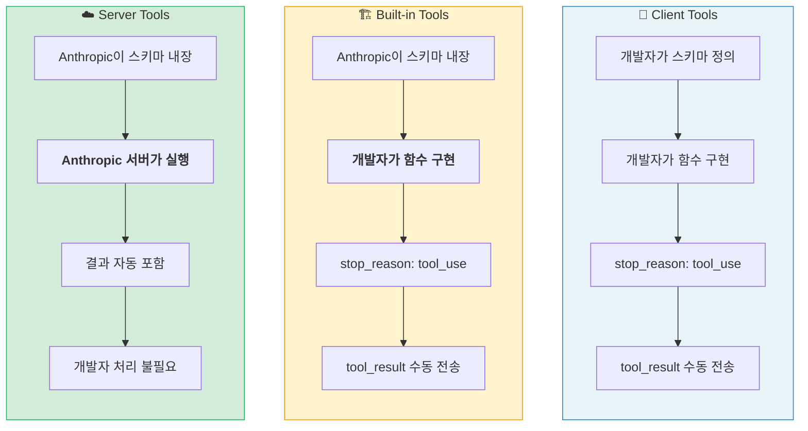

| | Client Tools | Built-in Tools | Server Tools |
| --- | --- | --- | --- |
| **예시** | get_weather, calculator | text_editor | web_search |
| **스키마** | 개발자 작성 | Anthropic 내장 | Anthropic 내장 |
| **구현** | 개발자 | 개발자 | Anthropic |
| **실행** | 개발자 코드 | 개발자 코드 | Anthropic 서버 |
| **결과 전달** | tool_result 수동 | tool_result 수동 | 자동 포함 |
| **비용** | API 토큰만 | API 토큰만 | 추가 과금 |

> [!ref] 소스
> - Skilljar L11: The web search tool (287755)
> - [Anthropic Web Search Documentation](https://docs.anthropic.com/en/docs/build-with-claude/tool-use/web-search-tool)

---

### 2.4 종합 실습: 다중 도구와 내장 도구 (Exercise)

> [!action] 실습 노트북
> **Ch.2를 커버하는 2개 노트북**입니다:
> - 📂 `03-Exercises/Week_04/skilljar/S3_04_multiple_tools.ipynb` — 다중 도구 등록, 라우터 업데이트, 복합 요청 처리
> - 📂 `03-Exercises/Week_04/skilljar/S3_05_builtin_tools.ipynb` — 내장 도구 (text_editor + web_search)

이 실습에서는 Chapter 2의 모든 개념을 통합하여 다중 도구와 내장 도구를 직접 사용한다.

#### 실습 내용

1. **다중 도구 등록**: 3가지 도구 스키마를 `tools` 배열에 모두 등록
2. **라우터 업데이트**: `run_tool` 함수에 `**tool_input` 언패킹으로 모든 함수를 디스패치
3. **복합 요청 테스트**: 여러 도구를 순차 호출하는 시나리오 확인
4. **텍스트 편집 도구**: Built-in Tool 등록 (`text_editor_20250124`)
5. **웹 검색 도구**: Server Tool 등록 (`web_search_20250305`) + 응답 블록 분석

> [!method] Ch.2 실습 노트북 단계별 빌드업
> Ch.1의 `S3_03_multi_turn_loop.ipynb`에서 이어집니다:
>
> | 단계 | 노트북 | 추가되는 기능 | 섹션 |
> | --- | --- | --- | --- |
> | ④ 다중 도구 | `S3_04_multiple_tools.ipynb` | +3개 도구 등록 + 라우터 + 복합 요청 | §2.1 |
> | ⑤ 내장 도구 | `S3_05_builtin_tools.ipynb` | +text_editor + web_search (Server/Built-in) | §2.2~2.3 |

> [!ref] 소스
> - Skilljar L09-L11: Multiple tools, Text edit tool, Web search tool

---

## [Chapter 3] 자가진단과 종합 정리

### 3.1 자가진단 퀴즈 — Tool Use (Q1-Q7)

> [!question] Q1. Claude가 또 다른 도구를 호출하려 한다는 것을 어떻게 알 수 있는가?
> A) Claude가 텍스트로 "I need to use a tool"이라고 말한다
> B) 응답의 content에 ToolUseBlock이 하나 이상 포함되어 있다
> C) `stop_reason`이 `"tool_use"`이다
> D) `response.tool_calls` 필드가 비어있지 않다
>
> > [!tip]- 정답 보기
> > **정답: C)** `stop_reason`이 `"tool_use"`이면 Claude가 도구를 호출하려 한다는 의미다. 이때 `response.content`에서 `ToolUseBlock`을 추출하여 처리한 뒤, 결과를 `tool_result`로 전송해야 한다. 이것이 Tool Use 루프의 핵심 조건이다.

> [!question] Q2. Claude가 도구를 사용할 때 메시지 구조는 어떻게 되는가?
> A) 텍스트 블록과 도구 사용 블록이 함께 포함된 다중 블록 (multi-block) 구조
> B) 도구 사용 블록만 포함된 단일 블록 구조
> C) JSON 형식의 도구 호출 문자열
> D) 별도의 tool_calls 배열로 분리
>
> > [!tip]- 정답 보기
> > **정답: A)** Claude의 응답 `content`는 **여러 블록의 배열**이다. 텍스트 설명을 담은 `TextBlock`과 도구 호출 정보를 담은 `ToolUseBlock`이 함께 포함될 수 있다. 예:
> > ```python
> > response.content = [
> >     TextBlock(text="날씨를 확인하겠습니다."),
> >     ToolUseBlock(type="tool_use", name="get_weather", input={"city": "서울"}, id="toolu_xxx")
> > ]
> > ```

> [!question] Q3. JSON Schema의 목적은 무엇인가?
> A) Claude가 JSON을 파싱하는 방법을 정의한다
> B) Claude에게 함수가 어떤 인자 (arguments)를 기대하는지 알려준다
> C) API 요청의 JSON 형식을 검증한다
> D) Claude의 출력을 JSON으로 강제한다
>
> > [!tip]- 정답 보기
> > **정답: B)** JSON Schema는 도구의 **입력 파라미터 구조를 정의**한다. Claude는 이 스키마를 읽고 어떤 인자를 어떤 타입으로 제공해야 하는지 이해한다. `input_schema`에 `properties`, `required`, `type` 등을 명시하면 Claude가 올바른 형식의 인자를 생성한다.

> [!question] Q4. 배치 도구 호출 (batch tool calling)이 해결하는 문제는?
> A) API 호출 비용을 줄인다
> B) 도구 실행 시간을 단축한다
> C) 여러 도구가 필요할 때 왕복 횟수 (back-and-forth)를 줄인다
> D) 도구 실행의 오류율을 낮춘다
>
> > [!tip]- 정답 보기
> > **정답: C)** 배치 도구 호출은 하나의 응답에서 **여러 ToolUseBlock을 동시에 반환**한다. 예를 들어 "서울, 부산, 제주 날씨"를 요청하면 3개의 `get_weather` 호출이 한 번에 반환되어, 3번의 왕복 대신 1번의 왕복으로 처리할 수 있다.

> [!question] Q5. Tool Use 워크플로의 올바른 순서는?
> A) 초기 요청 (Initial Request) → 도구 호출 요청 (Tool Request) → 데이터 조회 (Data Retrieval) → 최종 응답 (Final Response)
> B) 도구 호출 요청 → 초기 요청 → 최종 응답 → 데이터 조회
> C) 초기 요청 → 최종 응답 → 도구 호출 요청 → 데이터 조회
> D) 데이터 조회 → 초기 요청 → 도구 호출 요청 → 최종 응답
>
> > [!tip]- 정답 보기
> > **정답: A)** Tool Use 워크플로는 다음 순서를 따른다:
> > 1. **Initial Request**: 사용자가 질문을 보냄
> > 2. **Tool Request**: Claude가 어떤 도구를 어떤 인자로 호출할지 결정 (`stop_reason: "tool_use"`)
> > 3. **Data Retrieval**: 개발자 코드가 실제 함수를 실행하고 결과를 `tool_result`로 전송
> > 4. **Final Response**: Claude가 도구 결과를 종합하여 최종 텍스트 응답 생성

> [!question] Q6. Claude가 실시간 정보를 얻을 수 있게 하는 것은?
> A) Claude의 학습 데이터를 자주 업데이트한다
> B) 시스템 프롬프트에 최신 정보를 포함한다
> C) 더 큰 컨텍스트 윈도우를 사용한다
> D) 도구를 사용하여 외부 정보에 접근한다
>
> > [!tip]- 정답 보기
> > **정답: D)** Claude의 학습 데이터에는 한계 시점 (knowledge cutoff)이 있다. **도구 (특히 웹 검색 도구)**를 통해 실시간 정보, 최신 데이터, 외부 API에 접근할 수 있다. 이것이 Tool Use의 핵심 가치 — Claude의 능력을 **외부 세계로 확장**하는 것이다.

> [!question] Q7. 내장 도구 (Built-in Tools)가 사용자 정의 도구 (Client Tools)와 다른 점은?
> A) Claude가 스키마를 제공하고, 개발자가 기능을 구현한다
> B) Anthropic 서버에서 실행되므로 개발자가 아무것도 할 필요 없다
> C) JSON Schema 없이 자연어로 도구를 정의한다
> D) Python 함수가 아닌 REST API만 지원한다
>
> > [!tip]- 정답 보기
> > **정답: A)** Built-in Tools (예: text_editor)는 **Claude가 이미 스키마를 알고 있다** — Anthropic이 스키마를 내장했다. 하지만 실제 파일 조작 등의 **기능 구현은 개발자의 몫**이다. 이것이 Server Tools (예: web_search)와의 차이다 — Server Tools는 실행까지 Anthropic 서버가 담당한다.

> [!ref] 소스
> - Skilljar L12: Quiz on tool use (289122)

---

### 3.2 Section 3 학습 내용 정리

#### Tool Use 기초 (Chapter 1) 요약

> [!finding] Tool Use 워크플로 — Chapter 1 핵심 정리
>
> | 단계 | 개념 | 핵심 내용 | 참조 |
> | :---: | --- | --- | :---: |
> | 1 | **Tool Use 아키텍처** | User → Claude → Tool Call → Result → Response (4단계 흐름) | §1.1 |
> | 2 | **프로젝트 개요** | 리마인더 시스템 — 3가지 도구로 단계별 구축 | §1.2 |
> | 3 | **도구 함수 작성** | Python 함수 정의 + 입력 검증 (valid_formats 화이트리스트) | §1.3 |
> | 4 | **도구 스키마 정의** | JSON Schema (name, description, input_schema) | §1.4 |
> | 5 | **메시지 블록 처리** | TextBlock vs ToolUseBlock 구분, id/name/input 추출 | §1.5 |
> | 6 | **Tool 결과 전송** | tool_result (role:"user"), tool_use_id 매칭, is_error | §1.6 |
> | 7 | **멀티턴 대화** | 헬퍼 함수 리팩토링 (chat, text_from_message 등) | §1.7 |
> | 8 | **멀티턴 구현** | `while stop_reason == "tool_use"` → `run_conversation()` 루프 | §1.8 |

#### 다중 도구와 내장 도구 (Chapter 2) 요약

> [!result] 3가지 도구 유형 비교
>
> | 유형 | 스키마 | 구현 | 실행 | 대표 예시 | 참조 |
> | --- | --- | --- | --- | --- | :---: |
> | **Client Tools** | 개발자 작성 | 개발자 | 개발자 코드 | get_current_datetime, set_reminder | §1.3 |
> | **Built-in Tools** | Anthropic 내장 | **개발자** | **개발자 코드** | text_editor | §2.2 |
> | **Server Tools** | Anthropic 내장 | **Anthropic** | **Anthropic 서버** | web_search | §2.3 |
>
> | 기법 | 핵심 내용 | 참조 |
> | --- | --- | :---: |
> | **다중 도구 등록** | tools 배열에 여러 도구, run_tool 라우터, Claude 자율 조합 | §2.1 |
> | **텍스트 편집 도구** | Built-in Tool — 6가지 명령 (view/replace/create/insert/undo), 모델별 스키마 버전 | §2.2 |
> | **웹 검색 도구** | Server Tool — ServerToolUseBlock, WebSearchToolResultBlock, citations, allowed_domains | §2.3 |

#### Week 01 → 02 → 03 → 04 → 05 학습 로드맵

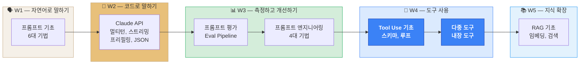

---

## 📝 실습 과제

> 모든 노트북은 `03-Exercises/Week_04/skilljar/` 에 위치합니다.

### 교수용 노트북 — 단계별 빌드업


| 단계 | 노트북 파일 | 추가 기능 | 참조 섹션 |
| --- | --- | --- | --- |
| ① 함수+스키마 | `S3_01_tool_functions_schemas.ipynb` | 도구 함수 + 스키마 + 첫 API 호출 | §1.1~1.4 |
| ② 블록+결과 | `S3_02_message_blocks_results.ipynb` | +메시지 블록 처리 + tool_result 전송 + 에러 처리 | §1.5~1.6 |
| ③ 멀티턴 루프 | `S3_03_multi_turn_loop.ipynb` | +헬퍼 함수 + `run_tool` + `run_tools` + `run_conversation` | §1.7~1.8 |
| ④ 다중 도구 | `S3_04_multiple_tools.ipynb` | +3개 도구 등록 + 라우터 + 복합 요청 | §2.1 |
| ⑤ 내장 도구 | `S3_05_builtin_tools.ipynb` | +text_editor + web_search (Server/Built-in Tools) | §2.2~2.3 |

### 학생 실습용

| 노트북 파일 | 설명 |
| --- | --- |
| `S3_06_tool_practice.ipynb` | 빈 템플릿 — 도구 정의부터 루프까지 직접 구현 |
| `S3_07_structural_review.ipynb` | **건축공학 도메인** — KDS 기준 구조 검토 도구를 직접 설계하는 추가 실습 |

> [!method] `S3_07_structural_review.ipynb` 구성
> 건축공학 학생에게 친숙한 **RC 부재 구조 검토** 과제를 통해 Tool Use 전체 워크플로를 연습합니다:
>
> | 단계 | 기법 | 목표 |
> | --- | --- | --- |
> | v1 | 단일 도구 (휨 검토) | Tool 정의 → 루프 구현 |
> | v2 | 다중 도구 (휨 + 전단) | 2개 Tool 등록, Claude 자율 선택 |
> | v3 | 종합 (+ 내장 도구) | 3개 Tool + web_search로 KDS 기준 조회 |
>
> **입력 변수**: `b`, `d`, `fck`, `fy`, `As`, `Av`, `s`
> **도전 과제**: System Prompt 활용, 한국어 보고서, 내장 도구 활용 (text_editor로 보고서 파일 생성)

### 수업 시간 실습 순서

> [!tip] 수업 시간 실습 순서
> **Ch.1 — Tool Use 기초와 워크플로** (70분)
> 1. `S3_01_tool_functions_schemas.ipynb` 열기 → 도구 정의 + 스키마 + 첫 호출 데모 (15분)
> 2. `S3_02_message_blocks_results.ipynb`로 교체 → 메시지 블록 + tool_result 처리 (15분)
> 3. `S3_03_multi_turn_loop.ipynb` 열기 → 헬퍼 함수 + 멀티턴 루프 완성 데모 (20분)
> 4. 학생 질의응답 + 개념 정리 (10분)
>
> **Ch.2 — 다중 도구와 내장 도구** (60분)
> 5. `S3_04_multiple_tools.ipynb` 열기 → 3개 도구 등록 + 라우터 데모 (15분)
> 6. `S3_04` 계속 → 복합 요청 (177일 후 리마인더) 테스트 (10분)
> 7. `S3_05_builtin_tools.ipynb` 열기 → text_editor + web_search 데모 (15분)
> 8. `S3_06_tool_practice.ipynb` 배포 → 학생 직접 실습 (15분)
> 9. `S3_07_structural_review.ipynb` 배포 → 건축공학 도메인 추가 실습 (과제 또는 자율)

> [!tip] Claude Code 검증 루프 패턴
> 이번 주차의 Claude Code 스킬은 **검증 루프** (Build → Verify → Fix → Verify)입니다:
> ```
> 1. Build  — 코드 작성 (Tool 정의 + 루프)
> 2. Verify — 코드 실행하여 결과 확인
> 3. Fix    — 오류가 있으면 수정
> 4. Verify — 다시 실행하여 수정 확인
> ```
> Claude Code에서 "이 코드를 실행하고 결과를 확인해줘"라고 요청하면, Claude가 자신의 코드를 실행·검증하는 루프를 자동으로 수행합니다.

> [!ref] 소스
> - Skilljar 다운로드: [Tool Use](https://anthropic.skilljar.com/claude-with-the-anthropic-api) (로그인 필요)
> - GitHub: [tool_use](https://github.com/anthropics/courses/tree/master/tool_use)

---

## 📚 참고 자료

> [!ref] 공식 문서
> - [Anthropic Tool Use Overview](https://docs.anthropic.com/en/docs/build-with-claude/tool-use/overview)
> - [Anthropic Text Editor Tool](https://docs.anthropic.com/en/docs/build-with-claude/tool-use/text-editor-tool)
> - [Anthropic Web Search Tool](https://docs.anthropic.com/en/docs/build-with-claude/tool-use/web-search-tool)
> - [Anthropic API Reference — Messages](https://docs.anthropic.com/en/api/messages)
> - [Prompt Caching Guide](https://docs.anthropic.com/en/docs/build-with-claude/prompt-caching)

> [!ref] Anthropic 교육 자료
> - [Building with the Claude API — S3: Tool Use (Skilljar)](https://anthropic.skilljar.com/claude-with-the-anthropic-api)
> - [Tool Use Notebooks (GitHub)](https://github.com/anthropics/courses/tree/master/tool_use)

> [!ref] 학술 논문
> - Schick, T. et al. (2023), "Toolformer: Language Models Can Teach Themselves to Use Tools", NeurIPS 2023, arXiv:2302.04761
> - Shen, Y. et al. (2023), "HuggingGPT: Solving AI Tasks with ChatGPT and its Friends in Hugging Face", NeurIPS 2023, arXiv:2303.17580
> - Qin, Y. et al. (2024), "ToolLLM: Facilitating Large Language Models to Master 16000+ Real-world APIs", ICLR 2024 Spotlight, arXiv:2307.16789

---

## Related

- [[Week_03|3주차: 프롬프트 엔지니어링과 평가 (S2)]]
- [[Week_05|5주차: RAG 기초 (S4)]]
- [[00-Syllabus/LLM_AE_AI_Implementation_Syllabus_v2.3|실라버스 v2.3]]
