# Week 4: Tool Use and Function Calling — Tool Use with Claude (S3)

---

## 📌 Lecture Focus

**Ch.1 Tool Use Basics & Workflow**
- **Tool Use Introduction**: A mechanism that extends Claude's capabilities through external functions — real-time data, external system integration
- **Project: Reminder System**: Incrementally building 3 tools (current time query, date calculation, reminder setting)
- **Tool Functions and Schemas**: Writing Python functions → Describing them to Claude via JSON Schema
- **Message Block Processing**: Distinguishing TextBlock and ToolUseBlock, sending `tool_result`
- **Multi-turn Conversation Loop**: Implementing complete workflows with the `stop_reason == "tool_use"` loop pattern
- Helper function refactoring and error handling

**Ch.2 Multiple Tools & Built-in Tools**
- **Multiple Tool Integration**: Registering 3 tools simultaneously and Claude's autonomous tool selection
- **Text Edit Tool**: Claude's built-in text editor — file viewing, modification, creation
- **Web Search Tool**: Claude's built-in web search — real-time information retrieval, domain restriction, citations

**Integration Cycle**: Single tool → Workflow loop → Multiple tool integration → Built-in tool utilization

---

## 🎯 Learning Objectives

After completing this lesson, you will be able to:

**Ch.1 Tool Use Basics & Workflow**
- Explain and implement the Tool Use operating principle (Initial Request → Tool Request → Data Retrieval → Final Response)
- Write Python functions and define tool schemas in JSON Schema format (name, description, input_schema)
- Fully implement a multi-turn conversation loop by detecting `stop_reason == "tool_use"`
- Distinguish between TextBlock and ToolUseBlock, and correctly send `tool_result` messages
- Pass errors to Claude with `is_error: True` to prompt appropriate responses

**Ch.2 Multiple Tools & Built-in Tools**
- Register multiple tools simultaneously and enable Claude to select appropriate tools sequentially based on context
- Activate and utilize Claude's built-in text edit tool (str_replace_editor)
- Configure Claude's built-in web search tool, and handle domain restrictions and citation results

**Integrated Competency**
- Implement the entire workflow from tool definition → schema → multi-turn loop → multiple tool integration through the Reminder System project

---

## 🤔 Why Learn This? — "Giving AI the Tools"

> [!question] In Week 02-03, you learned how to **converse with** Claude and how to **instruct it effectively**. In Week 04, you learn how to make Claude **actually use tools**.

### Limitations of Claude Without Tools

Claude only knows information from its training data. When a user asks "What's the current weather in Seoul?", Claude can only respond "I'm sorry, but I don't have access to real-time weather information." **Tool Use solves this limitation** — it enables Claude to access external APIs, databases, and systems.

### Prompt → API → Tool Use Evolution

| Week 02: API Programming | Week 03: Prompt Engineering | Week 04: Tool Use |
| --- | --- | --- |
| API calls via Python code | Effective prompt design and evaluation | Claude **calls external functions** |
| Text input → Text output | Quality improvement via roles, structure, examples | Text + **actual computation/data** |
| Static responses | Sophisticated instructions | **Dynamic behavior** (function execution) |
| Manual data processing | Output format control | **Automated workflows** |

### This Week's Project: Reminder System

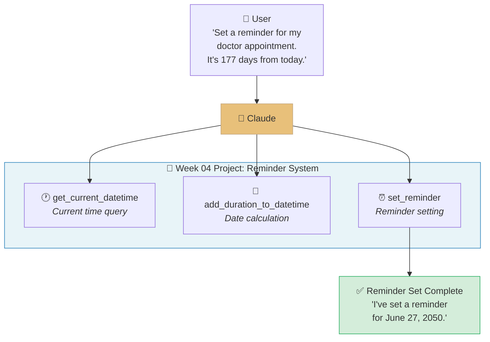

Claude understands the user's natural language request and **calls the necessary tools in sequence** to perform actual tasks. In this week, you will build this system from scratch.

### Anthropic Skilljar Course

This lecture note is based on the Anthropic official training platform Skilljar's **"Building with the Claude API" Section 3: Tool Use with Claude** (11 lessons + 1 quiz).

> [!ref] Source Mapping
> - Online course: [Building with the Claude API](https://anthropic.skilljar.com/claude-with-the-anthropic-api)
> - GitHub exercises: [tool_use](https://github.com/anthropics/courses/tree/master/tool_use)
> - Syllabus mapping: **Building — S3 (Tool Use with Claude) → W4** (based on v2.3)

---
## [Chapter 1] Tool Use Basics & Workflow (Lessons 1-8)


*Tool Use overall architecture — Core concepts for Section 3 Chapter 1*

### 1.1 Introducing Tool Use

Claude possesses vast knowledge based on its training data, but fundamentally **cannot access the external world**. Tasks such as checking the current time, real-time weather, or database queries cannot be performed by the model alone. **Tool Use** (also called Function Calling) is the key mechanism to overcome this limitation.


*Tool Use concept — Claude accessing real-time information through external tools*

#### What Is Tool Use?

Tool Use is a feature that gives Claude the **ability to call external functions (tools)**. For example, when a user asks "What's the current weather in Seoul?":

- **Without Tool Use**: Claude can only provide general weather information based on its training data
- **With Tool Use**: Claude calls a weather API tool to retrieve **real-time weather data** before responding


*Weather example — Accessing real-time data through Tool Use*

#### Tool Use 4-Step Flow

Tool Use follows the following **4-step flow**:

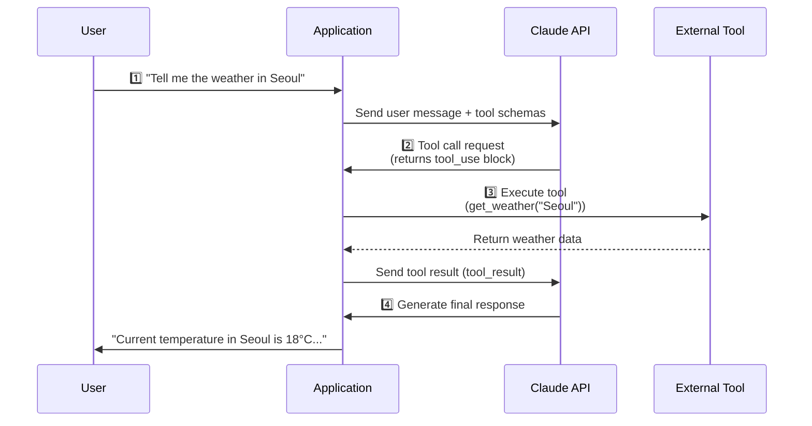

| Step | Description | Actor |
| --- | --- | --- |
| **1. Initial Request** | Send user message + available tool list to Claude | Application → Claude |
| **2. Tool Request** | Claude decides which tool to call with which parameters | Claude → Application |
| **3. Data Retrieval** | Application executes the actual tool function and collects results | Application → External Tool |
| **4. Final Response** | Claude generates the final natural language response using tool results | Claude → User |


*Tool Use 4-step flow summary*

> [!tip] Key Insight
> Claude does **not execute tools directly**. Claude requests "please call this tool with these parameters," and the **actual execution is handled by the developer's application**. This separation enables maintaining security and control.

> [!finding] Tool Use vs Traditional Approaches
> - Traditional: Rule-based systems that parse user input to call functions
> - Tool Use: Claude **understands natural language and automatically selects appropriate tools** — more flexible and extensible

> [!ref] Source
> - Skilljar L01: Introducing tool use (287747)

---

### 1.2 Project Overview: Reminder System

The project we will build throughout this chapter is a **Reminder System**. When a user makes a natural language request like "Set a meeting reminder for 30 minutes from now," we build a system where Claude uses tools to automatically handle everything from checking the current time → calculating time → setting the reminder.


*Reminder System project overview*

#### 3 Challenges

There are **3 fundamental limitations** that an LLM must overcome to operate a reminder system:

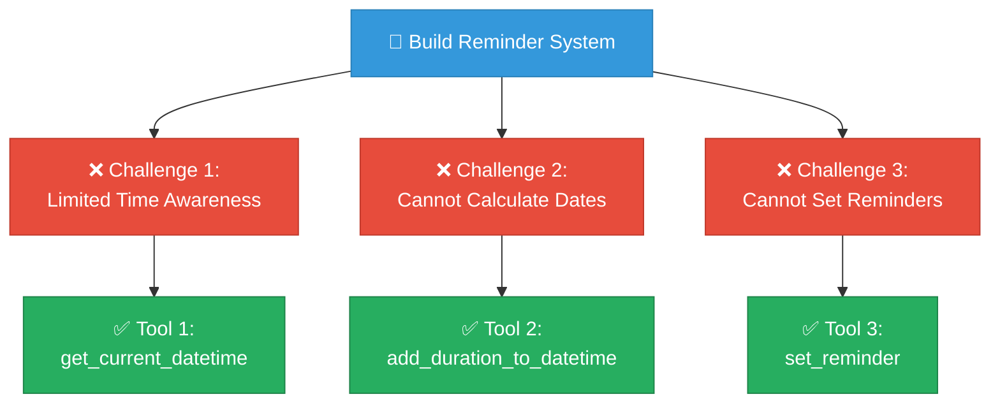

| Challenge | Description | Solution Tool |
| --- | --- | --- |
| **Limited Time Awareness** | Claude doesn't know the current date/time | `get_current_datetime` |
| **Date Calculation Issues** | Calculations like "30 minutes later" or "tomorrow at 3 PM" are inaccurate | `add_duration_to_datetime` |
| **No Reminder Capability** | Claude cannot set reminders in external systems | `set_reminder` |

#### System Architecture

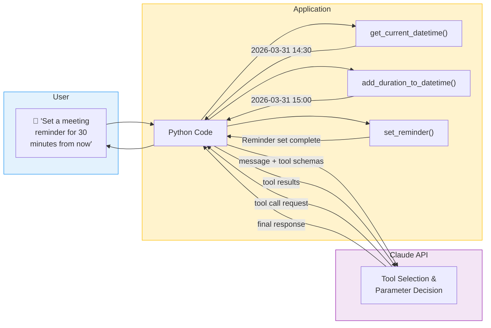


*Complete flow of the Reminder System composed of 3 tools*

> [!method] Tool Design Principle
> Each tool has **one clear responsibility** (Single Responsibility). Instead of creating one massive tool with complex functionality, separating into **small, composable tools** allows Claude to select and use tools more accurately.

> [!ref] Source
> - Skilljar L02: Project overview (287751)

---

### 1.3 Writing Tool Functions

The first step in Tool Use is **writing the actual Python functions** that will be executed. These functions are the code that the application runs when Claude requests a tool call.


*Writing tool functions — The first step in Tool Use*

#### Core Principle: Tool Functions Are Regular Python Functions

In Tool Use, a "tool" is nothing special. **Regular Python functions** become tools as-is. Claude learns about the function's existence and usage through a JSON schema, and requests calls when needed.

#### `get_current_datetime` Function Implementation

Implementing the first tool of the Reminder System, `get_current_datetime`:

```python
from datetime import datetime

def get_current_datetime(date_format: str = "%Y-%m-%d %H:%M:%S") -> str:
    """Returns the current date/time in the specified format.

    Args:
        date_format: Date format string (strftime format)
                    Default: "%Y-%m-%d %H:%M:%S"

    Returns:
        Current date/time string
    """
    current_datetime = datetime.now()
    return current_datetime.strftime(date_format)
```

```python
# Execution example
print(get_current_datetime())
# Output: "2026-03-31 14:30:00"

print(get_current_datetime("%Y-%m-%d"))
# Output: "2026-03-31"

print(get_current_datetime("%H:%M"))
# Output: "14:30"
```


*get_current_datetime function implementation and execution results*

#### Tool Function Writing Best Practices

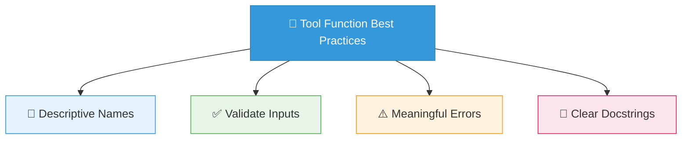

| Best Practice | Description | Example |
| --- | --- | --- |
| **Descriptive Names** | The function name alone should convey its purpose | `get_current_datetime` (O) / `get_dt` (X) |
| **Validate Inputs** | Detect invalid inputs early | `if not isinstance(date_format, str): raise ValueError(...)` |
| **Meaningful Errors** | Error messages should help solve the problem | `"Invalid date format: '%Q' — Use strftime format like '%Y-%m-%d'"` |
| **Clear Docstrings** | Document the function's purpose, parameters, and return values | `"""Returns the current date/time in the specified format."""` |

#### Complete Version with Input Validation

```python
def get_current_datetime(date_format: str = "%Y-%m-%d %H:%M:%S") -> str:
    """Returns the current date/time in the specified format.

    Args:
        date_format: strftime format string. Default "%Y-%m-%d %H:%M:%S"

    Returns:
        Formatted current date/time string

    Raises:
        ValueError: Invalid date format
    """
    try:
        current_datetime = datetime.now()
        return current_datetime.strftime(date_format)
    except ValueError as e:
        raise ValueError(
            f"Invalid date format: '{date_format}' — {str(e)}"
        )
```

> [!tip] Function Quality = Tool Quality
> The quality of tool functions directly determines the reliability of Tool Use. It is important to **apply input validation, error handling, and type hints from the start**. Even if Claude sends incorrect parameters, the system should fail gracefully.

> [!action] Exercise Code
> 📂 Try running the code from this section yourself.
> `03-Exercises/Week_04/skilljar/01_tool_use.ipynb` — Cell 1~3

> [!ref] Source
> - Skilljar L03: Tool functions (287756)

---

### 1.4 Defining Tool Schemas

Once you've written tool functions, you need to tell Claude **what this tool is and what parameters it accepts**. To do this, you define a tool schema in **JSON Schema** format.


*Tool schema — A specification that tells Claude about a tool's existence and usage*

#### 3 Core Elements of a Schema

A tool schema consists of 3 core fields:

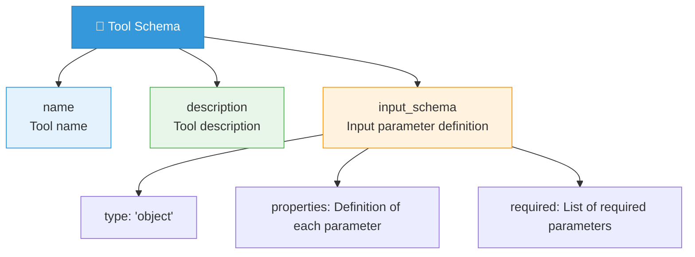

| Field | Description | Importance |
| --- | --- | --- |
| **name** | Unique identifier of the tool (recommended to match function name) | Required |
| **description** | Key information for Claude to determine **when and why** to use the tool | Very Important |
| **input_schema** | Parameter specification in JSON Schema format (type, description, default, required) | Required |

#### `get_current_datetime` Schema Definition

```python
get_current_datetime_schema = {
    "name": "get_current_datetime",
    "description": "Returns the current date and time in the specified format. "
                   "Use this tool when you need to know the current date or time.",
    "input_schema": {
        "type": "object",
        "properties": {
            "date_format": {
                "type": "string",
                "description": "The format string for the date/time output. "
                              "Uses Python strftime format codes. "
                              "Default: '%Y-%m-%d %H:%M:%S'",
                "default": "%Y-%m-%d %H:%M:%S"
            }
        },
        "required": []
    }
}
```


*get_current_datetime schema structure*

> [!finding] Description Is the Key
> The `description` field is the most important information that Claude uses as the **basis for tool selection**. Writing "A tool to use when you need to know the current date/time" is more helpful for Claude's judgment than "A function that returns the current time." **Clearly state when and why** the tool should be used.

#### Auto-generating Schemas with Claude

Manually writing tool schemas is tedious. You can use Claude itself to auto-generate schemas:

```python
# Show Claude the function code and request schema generation
prompt = """
Please generate an Anthropic Tool Use JSON schema for the following Python function:

def get_current_datetime(date_format: str = "%Y-%m-%d %H:%M:%S") -> str:
    current_datetime = datetime.now()
    return current_datetime.strftime(date_format)

Please return only the JSON schema.
"""
```


*Auto-generating tool schemas using Claude*

#### Using the `ToolParam` Type

Using the `ToolParam` type provided by the Anthropic Python library gives you the benefits of IDE autocompletion and type checking:

```python
from anthropic.types import ToolParam

# Defining schemas with the ToolParam type enables IDE support
get_current_datetime_tool: ToolParam = {
    "name": "get_current_datetime",
    "description": "Returns the current date and time in the specified format. "
                   "Use this tool when you need to know the current date or time.",
    "input_schema": {
        "type": "object",
        "properties": {
            "date_format": {
                "type": "string",
                "description": "The format string for the date/time output. "
                              "Uses Python strftime format codes. "
                              "Default: '%Y-%m-%d %H:%M:%S'",
                "default": "%Y-%m-%d %H:%M:%S"
            }
        },
        "required": []
    }
}
```

> [!tip] Schema Pattern for All 3 Tools
> All 3 tools of the Reminder System define schemas using the same pattern:
> - `get_current_datetime_schema`: 1 parameter for date format
> - `add_duration_to_datetime_schema`: 3 parameters for start time, duration, and unit
> - `set_reminder_schema`: 2 parameters for time and message


*Tool schema summary — Core roles of name, description, and input_schema*

> [!ref] Source
> - Skilljar L04: Tool schemas (287753)

---

### 1.5 Handling Message Blocks

The response from an API call with tools enabled has a **different structure** than usual. Instead of a plain text response, it may contain **multiple blocks** (TextBlock, ToolUseBlock). Here we learn how to correctly handle these multi-block messages.

#### Tool-enabled API Call

```python
from anthropic import Anthropic

client = Anthropic()

# Pass schema list to the tools parameter to enable tools
response = client.messages.create(
    model="claude-sonnet-4-20250514",
    max_tokens=1024,
    tools=[get_current_datetime_schema],  # Pass tool schema
    messages=[
        {"role": "user", "content": "What time is it now?"}
    ]
)
```

> [!finding] `tools` Parameter
> When you pass a list of tool schemas to the `tools` parameter, Claude **recognizes that these tools are available**. Whether Claude actually uses a tool is something it **decides on its own** based on the user's question and the tool's description.

#### Multi-block Response Structure

The `content` of a response containing tool calls is not a simple string but a **list of blocks**:

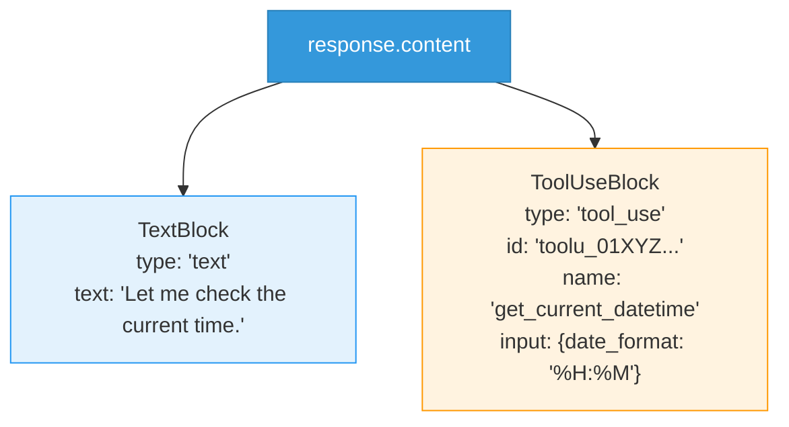


*Multi-block response — TextBlock and ToolUseBlock returned together*

#### Iterating Through Blocks

```python
# Iterate through each block in the response and process by type
for block in response.content:
    if block.type == "text":
        # TextBlock: Claude's text response
        print(f"[Text] {block.text}")
    elif block.type == "tool_use":
        # ToolUseBlock: Tool call request
        print(f"[Tool Call] {block.name}")
        print(f"  ID: {block.id}")
        print(f"  Input: {block.input}")
```

```
# Output example
[Text] Let me check the current time.
[Tool Call] get_current_datetime
  ID: toolu_01XYZabc123
  Input: {'date_format': '%H:%M'}
```

#### Key Fields of ToolUseBlock

| Field | Description | Example |
| --- | --- | --- |
| **type** | Always `"tool_use"` | `"tool_use"` |
| **id** | Unique identifier for this tool call (needed when sending results) | `"toolu_01XYZabc123"` |
| **name** | Name of the tool to call (matches the schema's name) | `"get_current_datetime"` |
| **input** | Parameters determined by Claude (dict) | `{"date_format": "%H:%M"}` |


*ToolUseBlock structure detail*

#### Preserving Entire content in Conversation History

> [!tip] Important: Preserve the entire content
> When adding a tool call response to conversation history, you must store **`response.content` in its entirety**. If you extract only the TextBlock or remove the ToolUseBlock, errors will occur in subsequent conversations.

```python
# ✅ Correct approach: Preserve entire content
messages.append({
    "role": "assistant",
    "content": response.content  # Store entire block list
})

# ❌ Wrong approach: Extract only text
messages.append({
    "role": "assistant",
    "content": response.content[0].text  # Tool block lost!
})
```


*Message block handling summary — Multi-block structure of TextBlock and ToolUseBlock*

> [!ref] Source
> - Skilljar L05: Handling message blocks (287757)

---

### 1.6 Sending Tool Results

When Claude requests a tool call, the application must actually execute the tool and **send the result back to Claude**. The `tool_result` block is used for this purpose.

#### `tool_result` Message Format

Message format for sending tool execution results to Claude:

```python
# Execute the tool and collect results
tool_name = block.name       # "get_current_datetime"
tool_input = block.input     # {"date_format": "%H:%M"}
tool_use_id = block.id       # "toolu_01XYZabc123"

# Execute the actual tool function
result = get_current_datetime(**tool_input)
# result = "14:30"

# Construct tool_result message
tool_result_message = {
    "role": "user",
    "content": [
        {
            "type": "tool_result",
            "tool_use_id": tool_use_id,  # Must match the original ID
            "content": str(result)        # Pass as string
        }
    ]
}
```


*tool_result message format — Matching request and result via tool_use_id*


*tool_result block structure — Content block format inside the role:"user" message*

#### 3 Key Fields

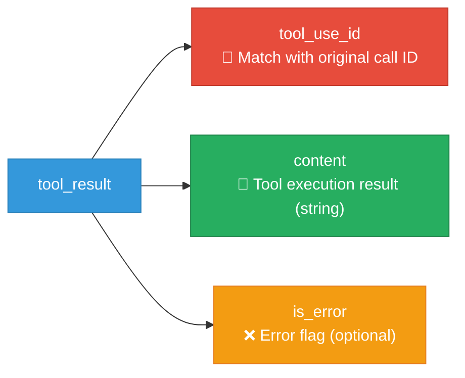

| Field | Description | Required |
| --- | --- | --- |
| **tool_use_id** | **Must match** Claude's tool call request ID | Required |
| **content** | Tool execution result as a **string** | Required |
| **is_error** | If `true`, Claude recognizes and responds to the error | Optional (default: false) |


*tool_use_id matching — The link between request and result*

#### Error Handling (`is_error`)

When tool execution fails, set `is_error: true` to inform Claude:

```python
# Sending a successful result
tool_result_success = {
    "type": "tool_result",
    "tool_use_id": tool_use_id,
    "content": "2026-03-31 14:30:00"
}

# Sending an error result
tool_result_error = {
    "type": "tool_result",
    "tool_use_id": tool_use_id,
    "content": "Error: Invalid date format '%Q' — "
               "Use strftime format like '%Y-%m-%d'",
    "is_error": True  # Claude recognizes the error and tries a different strategy
}
```

> [!finding] Effect of `is_error`
> Setting `is_error: true` allows Claude to understand the error situation and intelligently respond by **retrying with different parameters** or **explaining the situation to the user**. Explicitly communicating errors rather than hiding them creates a better user experience.

#### Multiple Tool Calls

Claude can **call multiple tools simultaneously** in a single response. Each call has a unique `id`, and a `tool_result` must be returned for each call:

```python
# When Claude has called 2 tools simultaneously
# response.content contains 2 ToolUseBlocks

tool_results = []
for block in response.content:
    if block.type == "tool_use":
        # Execute each tool and collect results
        result = run_tool(block.name, block.input)
        tool_results.append({
            "type": "tool_result",
            "tool_use_id": block.id,  # Unique ID for each call
            "content": str(result)
        })

# Send all results as a single message
messages.append({
    "role": "user",
    "content": tool_results
})
```


*Multiple tool calls — Each call gets a unique ID and all results must be returned*


*tool_result complete flow — Returning tool execution results back to Claude*

> [!tip] Include Tool Schemas in Follow-up Requests
> Follow-up API calls that send `tool_result` must also **include tool schemas in the `tools` parameter**. This is because Claude may determine that additional tool calls are needed after seeing the results.

> [!ref] Source
> - Skilljar L06: Sending tool results (287752)

---

### 1.7 Multi-turn Conversations and Tools

In a real reminder system, it's not a single request-response but a **conversation spanning multiple turns**. Even a single request like "Set a meeting reminder for 30 minutes from now" requires Claude to make **3 tool calls** — check current time → calculate time → set reminder. Here we build the multi-turn pattern for this.


*Multi-turn Tool Use — A single request leading to multiple tool calls*

#### Multi-turn Tool Use Pattern

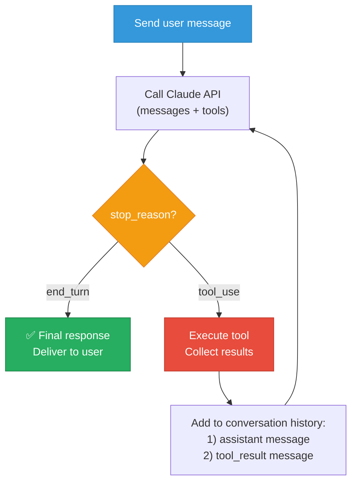

Core idea: **Continue looping** while `stop_reason` is `"tool_use"`, executing tools and sending results. When `stop_reason` becomes `"end_turn"`, Claude has returned the final text response, so the loop terminates.

#### Helper Function Refactoring

Organizing helper functions for clean multi-turn conversation management:

```python
from anthropic import Anthropic

client = Anthropic()
model = "claude-sonnet-4-20250514"

# Tool schema list
tools = [
    get_current_datetime_schema,
    add_duration_to_datetime_schema,
    set_reminder_schema
]

def add_user_message(messages, text):
    """Add a user message to conversation history"""
    messages.append({"role": "user", "content": text})

def add_assistant_message(messages, response):
    """Add an assistant response to conversation history

    Note: Preserves response.content in its entirety (TextBlock + ToolUseBlock)
    """
    messages.append({"role": "assistant", "content": response.content})
```

#### `chat` Function (with Tool Support)

```python
def chat(messages, system=None):
    """Calls Claude API and returns the full response object.

    Always includes the tools parameter to enable tool use.
    """
    params = {
        "model": model,
        "max_tokens": 4096,
        "messages": messages,
        "tools": tools  # Always include tool schemas
    }
    if system:
        params["system"] = system

    response = client.messages.create(**params)
    return response
```

#### `text_from_message` Utility

```python
def text_from_message(response):
    """Extracts and returns only text blocks from the response.

    Ignores ToolUseBlocks and combines only the text from TextBlocks.
    """
    texts = []
    for block in response.content:
        if hasattr(block, "text"):
            texts.append(block.text)
    return "\n".join(texts)
```


*Refactored helper function structure*

> [!method] Refactoring Principles
> 1. The `chat` function returns the entire `response` object (does not extract only text)
> 2. `add_assistant_message` preserves `response.content` in its entirety
> 3. `text_from_message` extracts text only when needed
> 4. All API calls include the `tools` parameter


*Multi-turn conversation pattern — stop_reason-based loop flow summary*

> [!ref] Source
> - Skilljar L07: Multi-turn conversations (287750)

---

### 1.8 Implementing Multiple Turns

Now we implement the actual **auto-loop**, where a single user message triggers Claude to sequentially call all necessary tools and automatically complete the final response.

#### `run_tool` — Tool Routing Function

**Routes** to the appropriate Python function based on the tool name requested by Claude:

```python
def run_tool(tool_name, tool_input):
    """Executes the appropriate function based on tool name.

    Args:
        tool_name: Tool name requested by Claude
        tool_input: Parameters determined by Claude (dict)

    Returns:
        Tool execution result (string)
    """
    if tool_name == "get_current_datetime":
        return get_current_datetime(**tool_input)
    elif tool_name == "add_duration_to_datetime":
        return add_duration_to_datetime(**tool_input)
    elif tool_name == "set_reminder":
        return set_reminder(**tool_input)
    else:
        return f"Unknown tool: {tool_name}"
```

> [!tip] Scalable Routing
> As the number of tools grows, dictionary-based routing is cleaner than `if-elif`:
> ```python
> TOOL_REGISTRY = {
>     "get_current_datetime": get_current_datetime,
>     "add_duration_to_datetime": add_duration_to_datetime,
>     "set_reminder": set_reminder,
> }
>
> def run_tool(tool_name, tool_input):
>     if tool_name in TOOL_REGISTRY:
>         return TOOL_REGISTRY[tool_name](**tool_input)
>     return f"Unknown tool: {tool_name}"
> ```

#### `run_tools` — Multiple Tool Execution

Processes all ToolUseBlocks contained in a single response:

```python
def run_tools(response):
    """Executes all tool calls in the response and returns result blocks.

    Args:
        response: Claude API response object

    Returns:
        List of tool_result blocks
    """
    tool_result_blocks = []

    for block in response.content:
        if block.type == "tool_use":
            tool_name = block.name
            tool_input = block.input
            tool_use_id = block.id

            print(f"  🔧 Executing tool: {tool_name}({tool_input})")

            try:
                result = run_tool(tool_name, tool_input)
                tool_result_blocks.append({
                    "type": "tool_result",
                    "tool_use_id": tool_use_id,
                    "content": str(result)
                })
            except Exception as e:
                # On error, pass with is_error: true
                tool_result_blocks.append({
                    "type": "tool_result",
                    "tool_use_id": tool_use_id,
                    "content": f"Error: {str(e)}",
                    "is_error": True
                })

    return tool_result_blocks
```

#### `run_conversation` — Complete Conversation Loop

The **core function** that integrates everything:

```python
def run_conversation(user_message):
    """Takes a user message and executes a complete conversation including tool calls.

    Args:
        user_message: User's natural language request

    Returns:
        Claude's final text response
    """
    messages = []
    add_user_message(messages, user_message)

    print(f"👤 User: {user_message}")

    while True:
        # 1. Call Claude API
        response = chat(messages)

        # 2. Add response to conversation history
        add_assistant_message(messages, response)

        # 3. Check stop_reason
        if response.stop_reason == "end_turn":
            # Claude has completed the final response → Exit loop
            final_text = text_from_message(response)
            print(f"🤖 Claude: {final_text}")
            return final_text

        elif response.stop_reason == "tool_use":
            # Claude is requesting a tool call → Execute tool
            tool_results = run_tools(response)

            # 4. Add tool results to conversation history
            messages.append({
                "role": "user",
                "content": tool_results
            })
            # Continue loop → Call Claude API again
```


*run_conversation execution flow — Processing multi-turn tool calls with auto-loop*

#### Complete Execution Flow Diagram

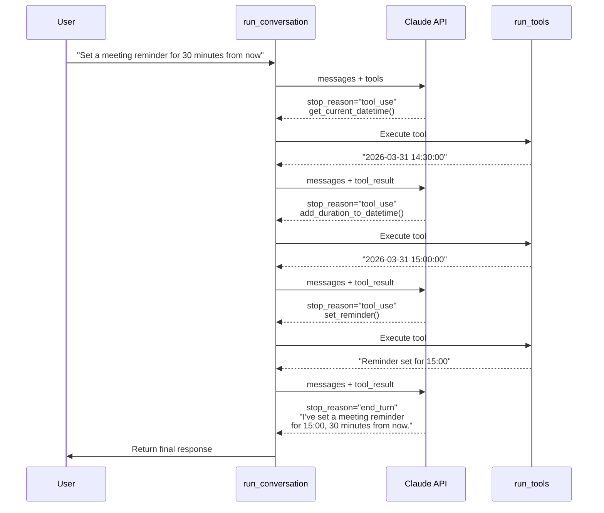

#### Execution Example

```python
# Run the Reminder System
result = run_conversation("Set a meeting reminder for 30 minutes from now")
```

```
👤 User: Set a meeting reminder for 30 minutes from now
  🔧 Executing tool: get_current_datetime({'date_format': '%Y-%m-%d %H:%M:%S'})
  🔧 Executing tool: add_duration_to_datetime({'start_datetime': '2026-03-31 14:30:00',
                'duration': 30, 'unit': 'minutes'})
  🔧 Executing tool: set_reminder({'datetime': '2026-03-31 15:00:00',
                'message': 'Meeting'})
🤖 Claude: I've set a meeting reminder for 15:00, 30 minutes from now!
```


*Reminder System execution result — Complete multi-turn flow calling 3 tools sequentially*

> [!finding] Key Design Points
> 1. **`stop_reason`-based loop**: `"tool_use"` → execute tool, `"end_turn"` → terminate
> 2. **Error handling**: Safely handle tool execution failures with `try/except` and pass `is_error: true` to Claude
> 3. **Extensibility**: Adding new tools only requires adding routing in `run_tool`
> 4. **Autonomy**: Claude **decides on its own** which tools to call in which order — the developer does not hardcode the sequence


*Multi-turn Tool Use summary — Complete workflow via stop_reason loop*

> [!ref] Source
> - Skilljar L08: Implementing multiple turns (287758)

---

### 1.9 Comprehensive Exercise: Tool Use Basics (Exercise)

> [!action] Exercise: Building the Reminder System
> Practice what you've learned in this chapter step by step. Proceed through the notebook below in order.
>
> 📂 `03-Exercises/Week_04/skilljar/01_tool_use.ipynb`

> [!method] Notebook Step-by-Step Progress Table
>
> | Cell | Content | Corresponding Section |
> | --- | --- | --- |
> | 1-2 | Environment setup + client initialization | 1.3 Preparation |
> | 3-5 | `get_current_datetime` function implementation + testing | 1.3 Tool Functions |
> | 6-8 | `add_duration_to_datetime`, `set_reminder` function implementation | 1.3 Tool Functions |
> | 9-11 | Define schemas for all 3 tools | 1.4 Tool Schemas |
> | 12-14 | Tool-enabled API call + block processing | 1.5 Message Blocks |
> | 15-17 | `tool_result` sending + error handling | 1.6 Tool Results |
> | 18-20 | Helper function refactoring | 1.7 Multi-turn Conversations |
> | 21-25 | Complete `run_conversation` + testing | 1.8 Multi-turn Implementation |

#### Key Concept Summary

```mermaid
graph TD
    subgraph CONCEPTS["Chapter 1 Key Concepts"]
        C1["1.1 Tool Use Introduction<br/>4-Step Flow"]
        C2["1.2 Project Overview<br/>Reminder System 3 Tools"]
        C3["1.3 Tool Functions<br/>Writing Python Functions"]
        C4["1.4 Tool Schemas<br/>JSON Schema Definition"]
        C5["1.5 Message Blocks<br/>TextBlock + ToolUseBlock"]
        C6["1.6 Tool Results<br/>tool_result + is_error"]
        C7["1.7 Multi-turn Conversations<br/>Helper Function Refactoring"]
        C8["1.8 Multi-turn Implementation<br/>run_conversation Loop"]
    end

    C1 --> C2
    C2 --> C3
    C3 --> C4
    C4 --> C5
    C5 --> C6
    C6 --> C7
    C7 --> C8

    style CONCEPTS fill:#f8f9fa,stroke:#dee2e6
    style C1 fill:#e3f2fd,stroke:#2196f3
    style C2 fill:#e3f2fd,stroke:#2196f3
    style C3 fill:#e8f5e9,stroke:#4caf50
    style C4 fill:#e8f5e9,stroke:#4caf50
    style C5 fill:#fff3e0,stroke:#ff9800
    style C6 fill:#fff3e0,stroke:#ff9800
    style C7 fill:#fce4ec,stroke:#e91e63
    style C8 fill:#fce4ec,stroke:#e91e63
```

| Concept | Key Keywords | Point to Remember |
| --- | --- | --- |
| Tool Use Flow | Initial → Tool Request → Retrieval → Response | Claude does not execute tools directly |
| Tool Functions | Python function, validation, error handling | Regular functions become tools |
| Tool Schemas | name, description, input_schema | description is most important |
| Message Blocks | TextBlock, ToolUseBlock | Preserve entire content |
| Tool Results | tool_use_id, content, is_error | ID matching is required |
| Multi-turn | stop_reason, while loop | `"tool_use"` → continue, `"end_turn"` → terminate |
## [Chapter 2] Multiple Tools & Built-in Tools (Lessons 9-11)

### 2.1 Using Multiple Tools

> [!action] Exercise Code — Open `S3_03_multiple_tools.ipynb`
> This is the starting point for Ch.2. It covers the process of **registering all 3 tools** created in Ch.1 and having Claude autonomously combine them.
> 📂 `03-Exercises/Week_04/skilljar/S3_03_multiple_tools.ipynb`

Up until now, we created individual tools one at a time. Now we **register all 3 tools in the tools array** so that Claude can autonomously combine multiple tools in a single request.


*Multiple tool registration — Registering all 3 tools in the Reminder System*

#### The 3 Tools Created in Ch.1

In Ch.1, we individually implemented 3 tools for the Reminder System:

```python
# Tool 1: Current date/time query
def get_current_datetime() -> str:
    """Returns the current date and time."""
    from datetime import datetime
    return datetime.now().strftime("%Y-%m-%d %H:%M:%S")

# Tool 2: Add duration to date
def add_duration_to_datetime(datetime_str: str, duration_days: int) -> str:
    """Returns the result of adding days to a given date."""
    from datetime import datetime, timedelta
    dt = datetime.strptime(datetime_str, "%Y-%m-%d")
    result = dt + timedelta(days=duration_days)
    return result.strftime("%Y-%m-%d")

# Tool 3: Set reminder
def set_reminder(reminder_text: str, reminder_date: str) -> str:
    """Sets a reminder."""
    return f"✅ Reminder set: '{reminder_text}' on {reminder_date}"
```

#### Registering All in the tools Array

The key is to **include all tool schemas in a single `tools` list** and **register all functions in the `run_tool` router function**:

```python
# Include all 3 tool schemas
tools = [
    get_current_datetime_tool,   # Tool 1 schema
    add_duration_tool,           # Tool 2 schema
    set_reminder_tool            # Tool 3 schema
]
```

#### run_conversation Update

Update the `run_conversation` function to pass all tool schemas to the API:

```python
def run_conversation(user_message):
    messages = [{"role": "user", "content": user_message}]

    response = client.messages.create(
        model="claude-sonnet-4-20250514",
        max_tokens=4096,
        tools=tools,  # ← Pass all 3 tools
        messages=messages
    )

    # tool_use loop
    while response.stop_reason == "tool_use":
        tool_use_block = next(
            b for b in response.content if b.type == "tool_use"
        )
        tool_name = tool_use_block.name
        tool_input = tool_use_block.input

        # Execute via run_tool router
        tool_result = run_tool(tool_name, tool_input)

        # Send result
        messages.append({"role": "assistant", "content": response.content})
        messages.append({
            "role": "user",
            "content": [{
                "type": "tool_result",
                "tool_use_id": tool_use_block.id,
                "content": str(tool_result)
            }]
        })

        response = client.messages.create(
            model="claude-sonnet-4-20250514",
            max_tokens=4096,
            tools=tools,
            messages=messages
        )

    # Return final text response
    return next(b.text for b in response.content if hasattr(b, "text"))
```

#### run_tool Router Update

```python
def run_tool(tool_name, tool_input):
    """Router that executes the appropriate function based on tool name"""
    if tool_name == "get_current_datetime":
        return get_current_datetime()
    elif tool_name == "add_duration_to_datetime":
        return add_duration_to_datetime(
            tool_input["datetime_str"],
            tool_input["duration_days"]
        )
    elif tool_name == "set_reminder":
        return set_reminder(
            tool_input["reminder_text"],
            tool_input["reminder_date"]
        )
    else:
        return f"Unknown tool: {tool_name}"
```


*run_tool router — Dispatching to the appropriate function based on tool name*

#### Test: Compound Request

Now Claude can **call multiple tools sequentially** to handle compound requests:

```python
result = run_conversation(
    "Set a reminder for my doctors appointment. "
    "Its 177 days after Jan 1st, 2050."
)
print(result)
```

Claude automatically performs the following sequence:
1. `add_duration_to_datetime("2050-01-01", 177)` → Calculates **"2050-06-27"**
2. `set_reminder("Doctor's appointment", "2050-06-27")` → Sets reminder
3. Final response: "I've set a reminder for your doctor's appointment on June 27, 2050."


*Compound request processing result — Claude sequentially called 2 tools to calculate the date 177 days later and set a reminder*

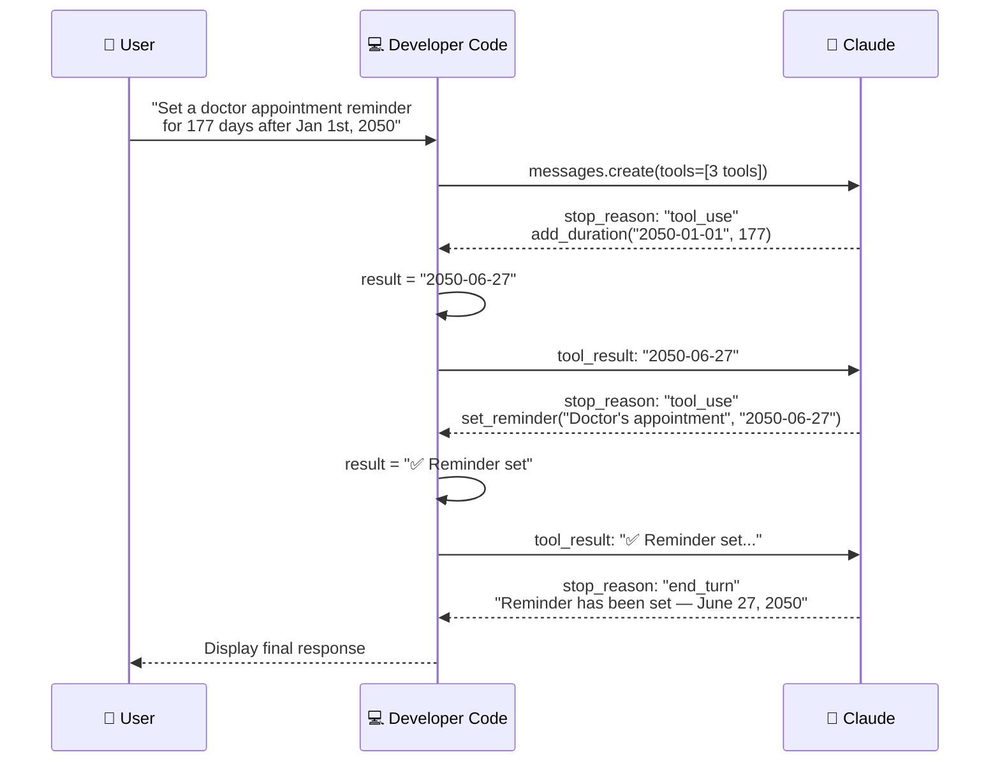

> [!finding] Claude's Autonomous Tool Combination
> When 3 tools are registered, Claude reads each tool's `description` and **decides on its own which tools to call in which order**. Claude figured out on its own that the 177-day calculation was needed first. The developer does not need to specify the call order.


*Multiple tool registration summary — tools array, run_tool router, Claude's autonomous combination*


*Tool Choice — Mechanism by which Claude reads descriptions and selects appropriate tools*

> [!ref] Source
> - Skilljar L09: Using multiple tools (287749)
> - GitHub: [06_chatbot_with_multiple_tools.ipynb](https://github.com/anthropics/courses/blob/master/tool_use/06_chatbot_with_multiple_tools.ipynb)

---

### 2.2 The Text Edit Tool

Unlike the **Client Tools** (user-defined tools) learned in Chapter 1, Claude also supports **Built-in Tools**. Built-in tools are a special form where Anthropic has pre-defined the schema, but **execution is handled by the developer's code**.


*Text Edit Tool — One of Claude's built-in tools*

#### Built-in Tools vs Client Tools

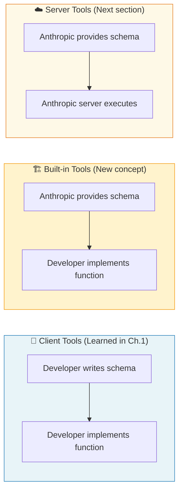

| Category | Client Tools | Built-in Tools | Server Tools |
| --- | --- | --- | --- |
| **Schema Definition** | Developer | Anthropic (built-in) | Anthropic (built-in) |
| **Function Implementation** | Developer | **Developer** | Anthropic server |
| **Execution Location** | Developer code | **Developer code** | Anthropic server |
| **Example** | get_weather, calculator | **text_editor** | web_search |

> [!method] Key Difference
> Built-in Tools are an **intermediate form** between Client Tools and Server Tools. The schema is built into Claude (Claude already knows how to use it), but the actual execution logic must be implemented by the developer.

#### 6 Capabilities

The text edit tool supports 6 commands for file manipulation:

| Command | Purpose | Description |
| --- | --- | --- |
| **view** | View entire file | Display the entire file content with line numbers |
| **view (range)** | View specific range | View only a specific line range (e.g., lines 10~20) |
| **replace** | Replace text | Replace exactly matching text with new text |
| **create** | Create new file | Create a new file and write content |
| **insert** | Insert lines | Insert new text after a specified line number |
| **undo** | Undo | Revert the last edit |


*The 6 capabilities of the text edit tool*

#### Tool Registration Method

Built-in Tools are registered in a different format from regular tools:

```python
# Built-in Tool registration (different format from Client Tools!)
tools = [
    {
        "type": "text_editor_20250124",  # ← Schema version (specified via type)
        "name": "str_replace_editor"      # ← Fixed name
    }
]
```

> [!tip] Schema Versions by Model
> The schema version of the text edit tool varies by model:
>
> | Model | Schema Version |
> | --- | --- |
> | Claude 3.7 Sonnet, Claude 4 series | `text_editor_20250124` |
> | Claude 3.5 Sonnet | `text_editor_20241022` |
>
> Using the wrong version will cause errors. Choose the version that matches the model you are using.

#### What the Developer Must Implement

Claude already knows the text edit tool's schema, so it **decides on its own which command to call with which arguments**. However, the actual file system operations must be implemented by the developer:

```python
def handle_text_editor(command, path, **kwargs):
    """Handler that executes text edit tool commands"""
    if command == "view":
        # Read file
        with open(path, 'r') as f:
            lines = f.readlines()
        # Return with line numbers
        return "\n".join(f"{i+1}: {line.rstrip()}" for i, line in enumerate(lines))

    elif command == "create":
        # Create new file
        with open(path, 'w') as f:
            f.write(kwargs["file_text"])
        return f"File created: {path}"

    elif command == "replace":
        # Replace text
        with open(path, 'r') as f:
            content = f.read()
        content = content.replace(kwargs["old_str"], kwargs["new_str"], 1)
        with open(path, 'w') as f:
            f.write(content)
        return f"Replaced in {path}"

    elif command == "insert":
        # Insert line
        with open(path, 'r') as f:
            lines = f.readlines()
        lines.insert(kwargs["insert_line"], kwargs["new_str"] + "\n")
        with open(path, 'w') as f:
            f.writelines(lines)
        return f"Inserted at line {kwargs['insert_line']} in {path}"

    elif command == "undo":
        # Undo (restore to previous state)
        return "Undo performed"
```

#### Usage Example: File Analysis and Modification

```python
response = client.messages.create(
    model="claude-sonnet-4-20250514",
    max_tokens=4096,
    tools=[{
        "type": "text_editor_20250124",
        "name": "str_replace_editor"
    }],
    messages=[{
        "role": "user",
        "content": "Open main.py, summarize what it does, "
                   "then add a docstring to the main function."
    }]
)
```

Claude automatically:
1. Reads and analyzes the `main.py` file using the `view` command
2. Adds a docstring to the main function using the `replace` command
3. Summarizes the changes and reports to the user


*Text edit tool usage example — Complete process of opening, analyzing, and modifying a file*

> [!finding] Advantages of Built-in Tools
> The reason the text edit tool is provided as built-in: Claude has been **extensively trained** with this schema, so it **generates file editing commands much more accurately** than if developers defined the schema themselves. Claude already understands the complex command structure of the schema.

> [!ref] Source
> - Skilljar L10: The text edit tool (287760)
> - [Anthropic Built-in Tools Documentation](https://docs.anthropic.com/en/docs/build-with-claude/tool-use/text-editor-tool)

---

### 2.3 The Web Search Tool

The web search tool is a **Server Tool**, different from Built-in Tools. Since it runs on Anthropic's servers, the developer does **not need to implement any functions at all**.


*Web Search Tool — Claude accessing real-time web information*

#### Server Tool Registration

```python
response = client.messages.create(
    model="claude-sonnet-4-20250514",
    max_tokens=4096,
    tools=[{
        "type": "web_search_20250305",   # ← Server Tool type
        "name": "web_search",             # ← Fixed name
        "max_uses": 5                     # ← Maximum search count limit
    }],
    messages=[{
        "role": "user",
        "content": "What is the latest news about structural engineering AI?"
    }]
)
```

#### Schema Components

| Field | Description | Required |
| --- | --- | --- |
| `type` | `"web_search_20250305"` (includes version) | ✅ |
| `name` | `"web_search"` (fixed) | ✅ |
| `max_uses` | Maximum number of searches per request | Optional |
| `allowed_domains` | List of domains to restrict searches to | Optional |

> [!tip] Console Setup Required
> To use the web search tool, you must **enable** the web search feature in the **Settings** of the [Anthropic Console](https://console.anthropic.com/). If not enabled, API calls will result in errors.


*Web search tool schema configuration — type, name, max_uses, allowed_domains*

#### Response Structure

The web search tool's response has a special block structure different from regular tools:

```python
for block in response.content:
    print(f"Type: {type(block).__name__}")
```

```
Type: TextBlock          ← Claude's text response
Type: ServerToolUseBlock ← Search tool call (executed on server)
Type: WebSearchToolResultBlock ← Search results (automatically included)
Type: TextBlock          ← Claude's final text response
```

| Block Type | Role | Included Information |
| --- | --- | --- |
| `ServerToolUseBlock` | Claude's search request | Search query, tool ID |
| `WebSearchToolResultBlock` | Search results | Multiple `WebSearchResultBlock` (URL, title, content) |
| `TextBlock` | Claude's response | Answer synthesizing search results + **citations** |

> [!method] Difference from Client Tools
> With Client Tools, `stop_reason: "tool_use"` is returned and the developer must send results manually. With Server Tools, **Anthropic's server automatically executes the search** and includes results in the response. No separate handling is required from the developer.

#### Citations

When web search results are used, Claude automatically **cites the sources**. The final text block includes a `citations` field:

```python
# Check citations in the final text block
final_text_block = response.content[-1]
if hasattr(final_text_block, 'citations') and final_text_block.citations:
    for citation in final_text_block.citations:
        print(f"  Source: {citation.url}")
        print(f"  Title: {citation.title}")
```


*Web search response structure — ServerToolUseBlock, WebSearchToolResultBlock, Citations*

#### Domain Restriction

You can restrict searches to specific domains only. This is useful when you must use **only trusted sources** such as medical, legal, or academic content:

```python
# Search only from NIH (National Institutes of Health) website
response = client.messages.create(
    model="claude-sonnet-4-20250514",
    max_tokens=4096,
    tools=[{
        "type": "web_search_20250305",
        "name": "web_search",
        "max_uses": 5,
        "allowed_domains": ["nih.gov"]  # ← Allow only NIH domain
    }],
    messages=[{
        "role": "user",
        "content": "What are the latest findings on heart disease prevention?"
    }]
)
```

```python
# Architectural engineering example: Search only from academic databases
response = client.messages.create(
    model="claude-sonnet-4-20250514",
    max_tokens=4096,
    tools=[{
        "type": "web_search_20250305",
        "name": "web_search",
        "max_uses": 3,
        "allowed_domains": [
            "sciencedirect.com",
            "asce.org",
            "kci.go.kr"
        ]
    }],
    messages=[{
        "role": "user",
        "content": "Search for comparative studies on the latest RC shear design standards"
    }]
)
```


*Domain restriction example — Searching only trusted sources via allowed_domains*

#### Comparison of 3 Tool Types

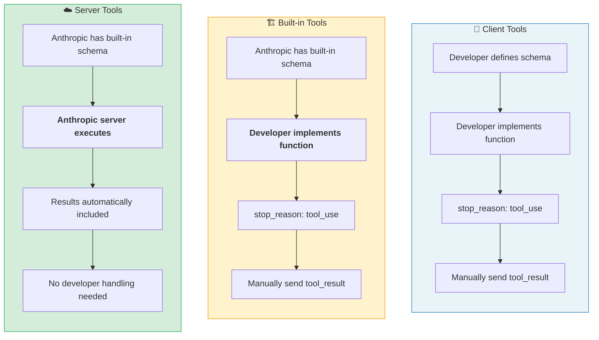

| | Client Tools | Built-in Tools | Server Tools |
| --- | --- | --- | --- |
| **Example** | get_weather, calculator | text_editor | web_search |
| **Schema** | Developer-written | Anthropic built-in | Anthropic built-in |
| **Implementation** | Developer | Developer | Anthropic |
| **Execution** | Developer code | Developer code | Anthropic server |
| **Result Delivery** | Manual tool_result | Manual tool_result | Automatically included |
| **Cost** | API tokens only | API tokens only | Additional charges |

> [!ref] Source
> - Skilljar L11: The web search tool (287755)
> - [Anthropic Web Search Documentation](https://docs.anthropic.com/en/docs/build-with-claude/tool-use/web-search-tool)

---

### 2.4 Comprehensive Exercise: Multiple Tools & Built-in Tools (Exercise)

> [!action] Exercise Notebooks
> **2 notebooks covering all of Ch.2**:
> - 📂 `03-Exercises/Week_04/skilljar/S3_03_multiple_tools.ipynb` — Multiple tool registration, router update, compound request processing
> - 📂 `03-Exercises/Week_04/skilljar/S3_04_structural_tools.ipynb` — Built-in tools + architectural engineering domain integration

This exercise integrates all concepts from Chapter 2 to directly use multiple tools and built-in tools.

#### Exercise Content

1. **Multiple Tool Registration**: Register all 3 tool schemas in the `tools` array
2. **Router Update**: Dispatch all functions in the `run_tool` function
3. **Compound Request Test**: Verify scenarios with sequential tool calls
4. **Text Edit Tool**: Built-in Tool registration and handler implementation
5. **Web Search Tool**: Server Tool registration and response block analysis
6. **Architectural Engineering Application**: Structural calculation tools + web search for KDS standard lookup

> [!method] Ch.2 Exercise Notebook Step-by-Step Build-up
> In class, we demonstrate the code growth process by **switching notebooks one by one** in the following order:
>
> | Step | Notebook | Added Features | Section |
> | --- | --- | --- | --- |
> | ③ Multiple Tools | `S3_03_multiple_tools.ipynb` | 3 tool registration + router + compound requests | §2.1 |
> | ④ Built-in Tools | `S3_04_structural_tools.ipynb` | +text_editor + web_search + domain integration | §2.2~2.3 |

> [!ref] Source
> - Skilljar L09-L11: Multiple tools, Text edit tool, Web search tool

---

## [Chapter 3] Self-Assessment and Comprehensive Review

### 3.1 Self-Assessment Quiz — Tool Use (Q1-Q7)

> [!question] Q1. How can you tell that Claude wants to call another tool?
> A) Claude says "I need to use a tool" in text
> B) The response content contains one or more ToolUseBlocks
> C) `stop_reason` is `"tool_use"`
> D) The `response.tool_calls` field is not empty
>
> > [!tip]- Show Answer
> > **Answer: C)** When `stop_reason` is `"tool_use"`, it means Claude wants to call a tool. At this point, you should extract the `ToolUseBlock` from `response.content`, process it, and then send the result as a `tool_result`. This is the core condition of the Tool Use loop.

> [!question] Q2. What is the message structure when Claude uses a tool?
> A) A multi-block structure containing both text blocks and tool use blocks
> B) A single-block structure containing only tool use blocks
> C) A tool call string in JSON format
> D) Separated into a separate tool_calls array
>
> > [!tip]- Show Answer
> > **Answer: A)** Claude's response `content` is an **array of multiple blocks**. It can contain both `TextBlock` with text explanations and `ToolUseBlock` with tool call information. Example:
> > ```python
> > response.content = [
> >     TextBlock(text="Let me check the weather."),
> >     ToolUseBlock(type="tool_use", name="get_weather", input={"city": "Seoul"}, id="toolu_xxx")
> > ]
> > ```

> [!question] Q3. What is the purpose of JSON Schema?
> A) It defines how Claude parses JSON
> B) It tells Claude what arguments a function expects
> C) It validates the JSON format of API requests
> D) It forces Claude's output to be JSON
>
> > [!tip]- Show Answer
> > **Answer: B)** JSON Schema **defines the structure of a tool's input parameters**. Claude reads this schema and understands what arguments to provide and in what types. By specifying `properties`, `required`, `type`, etc. in `input_schema`, Claude generates arguments in the correct format.

> [!question] Q4. What problem does batch tool calling solve?
> A) It reduces API call costs
> B) It shortens tool execution time
> C) It reduces the number of back-and-forth trips when multiple tools are needed
> D) It lowers the error rate of tool execution
>
> > [!tip]- Show Answer
> > **Answer: C)** Batch tool calling **returns multiple ToolUseBlocks simultaneously in a single response**. For example, when requesting "weather in Seoul, Busan, and Jeju," three `get_weather` calls are returned at once, allowing processing in 1 round trip instead of 3.

> [!question] Q5. What is the correct order of the Tool Use workflow?
> A) Initial Request → Tool Request → Data Retrieval → Final Response
> B) Tool Request → Initial Request → Final Response → Data Retrieval
> C) Initial Request → Final Response → Tool Request → Data Retrieval
> D) Data Retrieval → Initial Request → Tool Request → Final Response
>
> > [!tip]- Show Answer
> > **Answer: A)** The Tool Use workflow follows this order:
> > 1. **Initial Request**: User sends a question
> > 2. **Tool Request**: Claude decides which tool to call with which arguments (`stop_reason: "tool_use"`)
> > 3. **Data Retrieval**: Developer code executes the actual function and sends the result as `tool_result`
> > 4. **Final Response**: Claude synthesizes tool results to generate the final text response

> [!question] Q6. What enables Claude to obtain real-time information?
> A) Frequently updating Claude's training data
> B) Including latest information in the system prompt
> C) Using a larger context window
> D) Using tools to access external information
>
> > [!tip]- Show Answer
> > **Answer: D)** Claude's training data has a knowledge cutoff point. Through **tools (especially the web search tool)**, it can access real-time information, latest data, and external APIs. This is the core value of Tool Use — **extending Claude's capabilities to the external world**.

> [!question] Q7. How do Built-in Tools differ from Client Tools (user-defined tools)?
> A) Claude provides the schema, and the developer implements the functionality
> B) They run on Anthropic's server, so the developer doesn't need to do anything
> C) Tools are defined in natural language without JSON Schema
> D) Only REST APIs are supported, not Python functions
>
> > [!tip]- Show Answer
> > **Answer: A)** Built-in Tools (e.g., text_editor) have **schemas that Claude already knows** — Anthropic has built in the schema. However, the **actual functionality implementation is the developer's responsibility**. This is the difference from Server Tools (e.g., web_search) — with Server Tools, even the execution is handled by Anthropic's server.

> [!ref] Source
> - Skilljar L12: Quiz on tool use (289122)

---

### 3.2 Section 3 Learning Summary

#### Tool Use Basics (Chapter 1) Summary

> [!finding] Tool Use Workflow in 8 Steps
>
> | Step | Concept | Key Content | Ref |
> | :---: | --- | --- | :---: |
> | 1 | **Tool Use Architecture** | User → Claude → Tool Call → Result → Response | §1.1 |
> | 2 | **Writing Tool Functions** | Python function definition (get_weather, calculate_moment, etc.) | §1.2 |
> | 3 | **Defining Tool Schemas** | JSON Schema (name, description, input_schema) | §1.3 |
> | 4 | **Message Block Processing** | TextBlock vs ToolUseBlock distinction, id/name/input extraction | §1.4 |
> | 5 | **Sending Tool Results** | tool_result (role:"user"), tool_use_id matching, is_error | §1.5 |
> | 6 | **Complete Loop** | while stop_reason == "tool_use" → run_tool_loop() | §1.6 |
> | 7 | **Error Handling** | is_error flag, max_iterations infinite loop prevention | §1.6 |
> | 8 | **Architectural Engineering Application** | Moment calculation, shear review, seismic load tool integration | §1.7 |

#### Multiple Tools & Built-in Tools (Chapter 2) Summary

> [!result] Comparison of 3 Tool Types
>
> | Type | Schema | Implementation | Execution | Representative Example | Ref |
> | --- | --- | --- | --- | --- | :---: |
> | **Client Tools** | Developer-written | Developer | Developer code | get_weather, calculator | §1.2 |
> | **Built-in Tools** | Anthropic built-in | **Developer** | **Developer code** | text_editor | §2.2 |
> | **Server Tools** | Anthropic built-in | **Anthropic** | **Anthropic server** | web_search | §2.3 |
>
> | Technique | Key Content | Ref |
> | --- | --- | :---: |
> | **Multiple Tool Registration** | Multiple tools in tools array, run_tool router, Claude autonomous combination | §2.1 |
> | **Text Edit Tool** | Built-in Tool — 6 commands (view/replace/create/insert/undo), model-specific schema versions | §2.2 |
> | **Web Search Tool** | Server Tool — ServerToolUseBlock, WebSearchToolResultBlock, citations, allowed_domains | §2.3 |

#### Week 01 → 02 → 03 → 04 → 05 Learning Roadmap

```mermaid
graph LR
    subgraph W1["🗣️ W1 — Speaking in Natural Language"]
        A["Prompt Basics<br/>6 Techniques"]
    end

    subgraph W2["🐍 W2 — Speaking in Code"]
        B["Claude API<br/>Multi-turn, Streaming<br/>Prefilling, JSON"]
    end

    subgraph W3["📊 W3 — Measure and Improve"]
        C1["Prompt Evaluation<br/>Eval Pipeline"]
        C2["Prompt Engineering<br/>4 Techniques"]
    end

    subgraph W4["🔧 W4 — Tool Use"]
        D1["Tool Use Basics<br/>Schema, Loop"]
        D2["Multiple Tools<br/>Built-in Tools"]
    end

    subgraph W5["📚 W5 — Knowledge Expansion"]
        E["RAG Basics<br/>Embedding, Search"]
    end

    A --> B --> C1
    C1 --> C2
    C2 --> D1
    D1 --> D2
    D2 --> E

    style W1 fill:#f5f0e8,stroke:#c4a882
    style W2 fill:#e8c07a,stroke:#c4a882,color:#333
    style W3 fill:#d4edda,stroke:#27ae60
    style W4 fill:#dbeafe,stroke:#3b82f6
    style W5 fill:#e3f2fd,stroke:#2196f3

    classDef now fill:#3b82f6,stroke:#1e40af,color:#fff,font-weight:bold
    class D1,D2 now
```

---

## 📝 Practice Exercises

> All notebooks are located in `03-Exercises/Week_04/skilljar/`.

### Instructor Notebooks — Step-by-Step Build-up

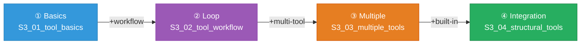

| Step | Notebook File | Added Features | Reference Section |
| --- | --- | --- | --- |
| ① Basics | `S3_01_tool_basics.ipynb` | Tool definition + schema + first call | §1.1~1.3 |
| ② Loop | `S3_02_tool_workflow.ipynb` | +message blocks + tool_result + `run_tool_loop()` | §1.4~1.6 |
| ③ Multiple Tools | `S3_03_multiple_tools.ipynb` | +3 tool registration + router + compound requests | §2.1 |
| ④ Built-in Tools | `S3_04_structural_tools.ipynb` | +text_editor + web_search + architectural engineering integration | §2.2~2.3 |

### Student Exercise Notebooks

| Notebook File | Description |
| --- | --- |
| `S3_05_tool_practice.ipynb` | Empty template — Implement everything from tool definition to loop yourself |
| `S3_06_structural_review.ipynb` | **Architectural engineering domain** — Additional exercise to design KDS standard structural review tools yourself |

> [!method] `S3_06_structural_review.ipynb` Structure
> Practice the entire Tool Use workflow through an **RC member structural review** assignment familiar to architectural engineering students:
>
> | Step | Technique | Goal |
> | --- | --- | --- |
> | v1 | Single tool (flexure review) | Tool definition → loop implementation |
> | v2 | Multiple tools (flexure + shear) | Register 2 tools, Claude autonomous selection |
> | v3 | Comprehensive (+ built-in tools) | 3 tools + web_search for KDS standard lookup |
>
> **Input Variables**: `b`, `d`, `fck`, `fy`, `As`, `Av`, `s`
> **Challenge Tasks**: System Prompt utilization, Korean-language report, built-in tool utilization (creating report files with text_editor)

### Class Exercise Sequence

> [!tip] Class Exercise Sequence
> **Ch.1 — Tool Use Basics & Workflow** (60 min)
> 1. Open `S3_01_tool_basics.ipynb` → Tool definition + schema demo (15 min)
> 2. Switch to `S3_02_tool_workflow.ipynb` → Message blocks + tool_result processing (20 min)
> 3. Continue `S3_02` → Complete multi-turn loop demo (15 min)
> 4. Student Q&A + concept review (10 min)
>
> **Ch.2 — Multiple Tools & Built-in Tools** (60 min)
> 5. Open `S3_03_multiple_tools.ipynb` → 3 tool registration + router demo (15 min)
> 6. Continue `S3_03` → Compound request (177-day reminder) test (10 min)
> 7. Open `S3_04_structural_tools.ipynb` → text_editor + web_search demo (15 min)
> 8. Distribute `S3_05_tool_practice.ipynb` → Student hands-on practice (15 min)
> 9. Distribute `S3_06_structural_review.ipynb` → Architectural engineering domain additional exercise (assignment or self-study)

> [!tip] Claude Code Verification Loop Pattern
> This week's Claude Code skill is the **verification loop** (Build → Verify → Fix → Verify):
> ```
> 1. Build  — Write code (Tool definition + loop)
> 2. Verify — Run code and check results
> 3. Fix    — Fix if there are errors
> 4. Verify — Run again to confirm fixes
> ```
> When you request "Run this code and check the results" in Claude Code, Claude automatically performs a loop of running and verifying its own code.

> [!ref] Source
> - Skilljar download: [Tool Use](https://anthropic.skilljar.com/claude-with-the-anthropic-api) (login required)
> - GitHub: [tool_use](https://github.com/anthropics/courses/tree/master/tool_use)

---

## 📚 References

> [!ref] Official Documentation
> - [Anthropic Tool Use Overview](https://docs.anthropic.com/en/docs/build-with-claude/tool-use/overview)
> - [Anthropic Text Editor Tool](https://docs.anthropic.com/en/docs/build-with-claude/tool-use/text-editor-tool)
> - [Anthropic Web Search Tool](https://docs.anthropic.com/en/docs/build-with-claude/tool-use/web-search-tool)
> - [Anthropic API Reference — Messages](https://docs.anthropic.com/en/api/messages)
> - [Prompt Caching Guide](https://docs.anthropic.com/en/docs/build-with-claude/prompt-caching)

> [!ref] Anthropic Training Materials
> - [Building with the Claude API — S3: Tool Use (Skilljar)](https://anthropic.skilljar.com/claude-with-the-anthropic-api)
> - [Tool Use Notebooks (GitHub)](https://github.com/anthropics/courses/tree/master/tool_use)

> [!ref] Academic Papers
> - Schick, T. et al. (2023), "Toolformer: Language Models Can Teach Themselves to Use Tools", NeurIPS 2023, arXiv:2302.04761
> - Shen, Y. et al. (2023), "HuggingGPT: Solving AI Tasks with ChatGPT and its Friends in Hugging Face", NeurIPS 2023, arXiv:2303.17580
> - Qin, Y. et al. (2024), "ToolLLM: Facilitating Large Language Models to Master 16000+ Real-world APIs", ICLR 2024 Spotlight, arXiv:2307.16789

---

## Related

- [[Week_03|Week 3: Prompt Engineering and Evaluation (S2)]]
- [[Week_05|Week 5: RAG Basics (S4)]]
- [[00-Syllabus/LLM_AE_AI_Implementation_Syllabus_v2.3|Syllabus v2.3]]
