# Week 05: RAG와 에이전틱 검색 — Retrieval Augmented Generation (S4)

---

## 📌 강의 중점

**Ch.1 RAG 기초와 파이프라인**
- **RAG 소개**: 대형 문서(800페이지 재무 보고서 등)를 프롬프트에 전부 넣을 수 없을 때 사용하는 기법 — 문서를 청크로 나누고 관련 조각만 프롬프트에 포함
- **텍스트 청킹 전략**: Size-based(overlap 포함), Structure-based(헤더·섹션), Sentence-based, Semantic-based — 사용 사례에 따라 선택
- **텍스트 임베딩**: 의미를 수치 벡터로 변환 — VoyageAI (`voyage-3-large`)로 임베딩 생성, 각 차원은 -1~+1 범위
- **전체 RAG 흐름**: 청킹 → 임베딩 → 벡터 DB 저장 → 쿼리 임베딩 → 코사인 유사도 검색 → Claude 프롬프트 주입
- **RAG 구현**: `VectorIndex` 클래스로 5단계 파이프라인(`chunk_by_section` → `generate_embedding` → `add_vector` → `search`) 실전 코드화

**Ch.2 하이브리드 검색 & Multi-Index 파이프라인**
- **BM25 어휘 검색**: 의미 검색만으로는 "INC-2023-Q4-011" 같은 정확 용어를 놓치는 문제 해결 — 토큰화·빈도·희소성 가중치 기반 알고리즘
- **의미-어휘 하이브리드**: 두 검색을 병렬 실행 후 결과 병합 — 개념적 유사성 + 정확 매칭의 상호보완
- **Reciprocal Rank Fusion (RRF)**: `RRF_score(d) = Σ(1 / (k + rank_i(d)))` — 서로 다른 점수 체계를 공정하게 통합하는 랭킹 융합 기법
- **Multi-Index Retriever**: `VectorIndex`와 `BM25Index`가 동일 API(`add_document`, `search`)를 공유 → `Retriever` 클래스로 통합 → 새 검색기 추가 시 확장 용이

**통합 사이클**: 청킹 → 임베딩 → 벡터 검색 → BM25 → Multi-Index

Ch.1에서는 **단일 인덱스(의미 검색)** 기반 최소 RAG를 완성하고, Ch.2에서 **이중 인덱스 + RRF 융합**으로 강화한다. 각 레슨은 이전 레슨의 코드를 빌드업하는 구조이며, 모든 코드는 외부 라이브러리(LangChain 등) 없이 **밑바닥부터** 작성해 내부 동작 원리를 완전히 이해하도록 설계되었다.

**핵심 기술 스택 (이번 주 도입)**:
- **VoyageAI** (`voyageai` 라이브러리, `voyage-3-large` 모델) — Anthropic이 권장하는 임베딩 제공자, 별도 API 키 필요 (`VOYAGE_API_KEY`)
- **코사인 유사도 / 코사인 거리** — `distance = 1 - similarity`, 정규화된 단위원 위 벡터 간 각도 측정
- **`VectorIndex` / `BM25Index`** — 동일한 `add_document` · `search` API를 갖는 검색 인덱스 클래스
- **Reciprocal Rank Fusion (RRF)** — 기본 상수 `k=60`, 투명성을 위해 수업에서는 `k=1` 사용
- **`SearchIndex` 프로토콜** — Python `typing.Protocol` 기반 확장 인터페이스

---

## 🎯 학습 목표

모듈을 완료하면 다음을 수행할 수 있다.

**Ch.1 RAG 기초와 파이프라인**
- 대형 문서를 프롬프트에 직접 넣을 때의 한계(길이 제한, 품질 저하, 비용 증가, 처리 시간)를 설명하고 RAG가 이를 어떻게 해결하는지 서술한다
- 4가지 청킹 전략(Size / Structure / Sentence / Semantic)을 비교하고 문서 특성에 맞게 선택한다
- `chunk_by_char`, `chunk_by_section`, `chunk_by_sentence` 함수를 직접 구현하고 overlap 파라미터의 효과를 설명한다
- VoyageAI 클라이언트로 `generate_embedding` 함수를 작성해 텍스트 → 벡터 변환을 수행한다
- 코사인 유사도·코사인 거리 개념을 이해하고 정규화된 벡터 간 유사도를 계산한다
- `VectorIndex`에 임베딩과 원본 텍스트를 함께 저장하고 top-k 검색 결과를 Claude 프롬프트에 주입하는 전체 흐름을 구현한다

**Ch.2 하이브리드 검색 & Multi-Index 파이프라인**
- 의미 검색만으로 놓치는 케이스(정확 ID, 희귀 용어)를 재현하고 BM25의 4단계(토큰화 → 빈도 집계 → 가중치 → 매칭) 로직을 설명한다
- `BM25Index`를 `VectorIndex`와 동일한 API로 구현한다
- RRF 공식으로 두 랭킹 결과를 병합하고 `k` 상수가 결과에 미치는 영향을 분석한다
- `Retriever` 클래스를 작성해 여러 인덱스를 감싸고 통합 검색 결과를 반환한다
- `SearchIndex` 프로토콜의 확장성을 활용해 새 검색 방식(키워드·그래프·도메인 전용)을 추가하는 설계를 제안한다

**통합 역량**
- 대규모 보고서 RAG 파이프라인(청킹 → 이중 인덱스 → RRF 병합 → Claude 응답)을 엔드투엔드로 구현하고, 의미·어휘 검색의 한계를 보완하는 실전 시스템을 완성한다
- 공통 API(`add_document` / `search`) 기반 설계로 **새 검색 방식**(키워드·도메인 전용 인덱스 등)을 기존 코드 변경 없이 확장한다
- 구조공학 보고서·논문 같은 도메인 문서에 파이프라인을 적용해 전문 지식 QA 프로토타입을 프로덕션 형태로 발전시킨다

---

## 🤔 왜 배우는가? — "대규모 문서를 Claude가 이해하게 만들기"

> [!question] [[Week_04]]에서 Claude에게 **도구(Tool Use)**를 쥐여주는 방법을 배웠다. 하지만 도구만으로 800페이지 재무 보고서 전체를 이해시킬 수는 없다. Week 05는 **외부 지식을 체계적으로 검색해 Claude의 컨텍스트로 주입**하는 파이프라인을 학습한다.

### Claude가 대형 문서를 다룰 때의 한계

800페이지 재무 보고서에 대해 "이 회사의 리스크 요인은?"을 질문한다면, 문서 전체를 프롬프트에 넣기에는 네 가지 한계가 있다 — **프롬프트 길이 하드 리밋**, **긴 프롬프트에서 Claude 성능 저하**, **비용 증가**, **처리 시간 증가**. RAG(Retrieval Augmented Generation)는 이를 해결하는 표준 접근이다 — 문서를 청크로 쪼개 사전 처리하고, 질문과 관련된 조각만 선별해 프롬프트에 삽입한다.

RAG는 단순함 대신 **확장성과 효율성**을 얻는 트레이드오프이다. 구현에는 청킹 전략 결정·검색 메커니즘 선택·누락되는 문맥 감수 등 여러 기술적 선택이 따르지만, 단일 프롬프트로는 불가능한 대규모 문서 컬렉션을 다룰 수 있게 된다. 특히 **의미 검색(semantic search)**만으로는 "INC-2023-Q4-011" 같은 희귀 ID를 놓치기 쉬우므로, 본 주차는 **BM25 어휘 검색**을 추가해 이 한계를 극복하는 하이브리드 설계까지 다룬다.

### 프롬프트 → Tool Use → RAG 진화

| Week 03: 프롬프트 엔지니어링        | Week 04: Tool Use        | **Week 05: RAG**                 |
| -------------------------- | ------------------------ | -------------------------------- |
| **접근**: 역할·구조·예시로 응답 품질 개선 | **접근**: 외부 함수 호출로 동적 행동  | **접근**: 외부 지식을 검색해 컨텍스트로 주입      |
| **외부 데이터**: 없음 (학습 데이터 기반) | **외부 데이터**: API·DB 단건 조회 | **외부 데이터**: **대규모 문서 코퍼스** 검색    |
| **규모**: 단일 프롬프트            | **규모**: 함수 단위 작업         | **규모**: **수백 페이지~다중 문서**         |
| **사용처**: 답변 품질 제어          | **사용처**: 실시간 정보·작업 자동화   | **사용처**: **문서 QA·기술 보고서·도메인 지식** |

### 실전 시나리오: 의미 검색이 실패할 때

본 주차 후반부에서는 아래 예시를 추적한다. 회사 보고서에서 **"INC-2023-Q4-011 사건은 어떻게 처리됐나?"**를 질문하면, 의미 검색은 사이버보안 섹션(실제 사건 ID 포함)과 재무 분석 섹션(사건 ID 없음)을 모두 반환한다 — 단어의 의미적 유사성만 보기 때문이다. **BM25는 "INC-2023-Q4-011" 같은 희귀 토큰에 높은 가중치**를 부여해 실제 매칭 문서를 정확히 집어낸다. 두 검색을 **RRF로 융합**하면 의미·어휘 양쪽에서 높은 점수를 받은 조각이 상위로 올라온다.

### 이번 주 프로젝트: 대규모 보고서 RAG 파이프라인

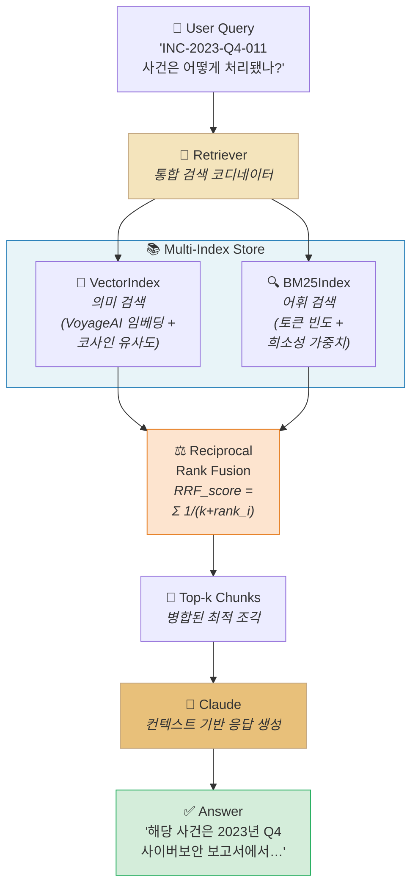

사용자의 자연어 질문이 들어오면 `Retriever`가 **의미 기반** `VectorIndex`와 **어휘 기반** `BM25Index`에 동시에 질의한다. 두 검색 결과는 **RRF 공식**으로 공정하게 병합되어 top-k 조각으로 Claude에 전달된다. 이번 주에는 이 파이프라인을 **밑바닥부터** 구축한다.

핵심 설계 원칙은 **공통 인터페이스**이다. `VectorIndex`와 `BM25Index`가 모두 `add_document()`와 `search()` 메서드를 공유하므로, `Retriever`는 구체 구현에 결합되지 않는다. 이 덕분에 향후 키워드 인덱스·그래프 검색·도메인 전용 인덱스를 추가해도 `Retriever`는 변경 없이 자동으로 RRF 융합 과정에 포함된다 — SOLID 원칙의 **의존성 역전**과 **개방-폐쇄**를 실제 파이프라인에서 체험하는 훈련이기도 하다.

### Anthropic Skilljar 코스

본 강의노트는 Anthropic 공식 교육 플랫폼 Skilljar의 **"Building with the Claude API" Section 4: RAG and Agentic Search** (7개 레슨 L01~L07) 내용을 기반으로 제작되었다.

| 레슨 | 제목 | Week 05 매핑 |
|---|---|---|
| L01 | Introducing Retrieval Augmented Generation | Ch.1 도입부 — 대형 문서 문제 |
| L02 | Text chunking strategies | Ch.1 — 4가지 청킹 전략 |
| L03 | Text embeddings | Ch.1 — VoyageAI 임베딩 |
| L04 | The full RAG flow | Ch.1 — 코사인 유사도·정규화 |
| L05 | Implementing the RAG flow | Ch.1 — `VectorIndex` 구현 |
| L06 | BM25 lexical search | Ch.2 — 어휘 검색 알고리즘 |
| L07 | A Multi-Index RAG pipeline | Ch.2 — `Retriever` + RRF |

이전 주차 [[Week_04]]에서 Tool Use로 Claude에 외부 함수 호출 능력을 부여했다면, 이번 주차는 **외부 지식 컬렉션 전체를 검색 가능한 형태로 구조화**하는 파이프라인 엔지니어링을 학습한다. 다음 주차 [[Week_06]]에서는 **Features of Claude**(Extended Thinking, Vision, Prompt Caching)로 이어져 RAG 파이프라인의 성능·비용 최적화 기법을 다룬다 — 특히 Prompt Caching은 대형 문서 기반 QA의 반복 호출 비용을 획기적으로 줄이는 핵심 기능으로, 본 주차에서 구축한 파이프라인에 직접 적용된다.

본 주차는 또한 RAG를 **프로덕션 시스템**으로 이해하는 훈련이다. 청킹 파라미터 하나(예: `chunk_size`, `overlap` 크기) 변경이 검색 품질에 미치는 영향, 의미 검색의 **false positive**를 어휘 검색으로 잡아내는 구조, RRF 상수 `k`가 융합 결과에 미치는 민감도 — 이 모든 지점이 실무에서 튜닝해야 할 축이다. 수업에서는 각 선택의 트레이드오프를 명시적으로 드러내어 학생이 **근거 기반 의사결정(Evidence-Based Decision)**을 체득하도록 유도한다.

> [!ref] 소스 매핑
> - 온라인 코스: [Building with the Claude API](https://anthropic.skilljar.com/claude-with-the-anthropic-api)
> - GitHub Exercises: [RAG](https://github.com/anthropics/courses/tree/master/RAG)
> - 실라버스 맵핑: **Building — S4 (RAG and Agentic Search) → W5**

> [!method] 사전 준비
> - **VoyageAI 계정 및 API 키**: [voyageai.com](https://www.voyageai.com/)에서 무료 가입 → `.env` 파일에 `VOYAGE_API_KEY="..."` 추가
> - **Python 패키지**: `pip install voyageai python-dotenv anthropic` — 기존 Week 02~04 환경에 `voyageai`만 추가 설치
> - **보고서 샘플 데이터**: `report.md` (재무·R&D·소프트웨어 섹션 포함 샘플 문서) — 실습 노트북에 함께 제공
> - **노트북 순서**: `S4_01_chunking.ipynb` → `S4_02_embeddings.ipynb` → `S4_03_vector_search.ipynb` → `S4_04_bm25.ipynb` → `S4_05_hybrid_rag.ipynb` → `S4_06_rag_practice.ipynb` (학생 실습) → `S4_07_structural_rag.ipynb` (건축 도메인 응용)

---
## [Chapter 1] RAG 기초와 파이프라인 (L01-L05)

### 1.1 RAG 소개 — 왜 RAG가 필요한가 (L01)

대형 문서를 Claude에게 넘겨 질문에 답하도록 하려면, **문서 전체를 프롬프트에 밀어넣거나** 아니면 **관련 부분만 발췌해서 전달**하는 두 가지 길이 있다. **RAG(Retrieval Augmented Generation)** 는 후자의 방법을 체계화한 기법으로, 문서를 작은 청크(chunk)로 분할해 두고 사용자의 질문과 가장 관련된 청크만 선택해 프롬프트에 주입한다.


*RAG 개념 한눈에 보기 --- 외부 지식을 검색해 Claude의 컨텍스트로 주입하는 전체 아이디어 요약*


*대규모 문서의 문제 — 800페이지짜리 재무 문서에 대해 "이 회사가 직면한 리스크 요인은 무엇인가?"와 같은 질문을 던지고 싶지만, 프롬프트 길이에는 한계가 있다*

#### 시나리오: 800페이지 재무 문서

예를 들어 **800페이지 재무 보고서**를 가지고 Claude에게 "이 회사가 가진 리스크 요인은 무엇인가?"라고 묻는다고 하자. 이 질문에 제대로 답하려면 문서에서 관련 정보를 Claude에게 어떤 식으로든 전달해야 한다. 하지만 프롬프트에 넣을 수 있는 텍스트 양에는 실질적 한계가 존재한다.

#### 옵션 1: 프롬프트에 전부 포함하기

가장 단순한 접근은 문서 전체 텍스트를 추출해 사용자 질문과 함께 그대로 프롬프트에 삽입하는 것이다.

```
Answer the user's question about the financial document.

<user_question>
{user_question}
</user_question>

<financial_document>
{financial_document}
</financial_document>
```


*옵션 1: 문서 전체를 프롬프트에 삽입 — 단순하지만 심각한 한계를 가진다*

이 접근의 한계는 분명하다:

- **프롬프트 길이 제한** — 문서가 너무 길면 아예 담지 못한다
- **긴 프롬프트에서의 성능 저하** — Claude도 매우 긴 프롬프트에서는 정확도가 떨어진다
- **비용 증가** — 프롬프트가 클수록 입력 토큰 비용이 커진다
- **응답 지연** — 처리 시간이 길어진다

#### 옵션 2: 문서를 청크로 쪼개기

RAG는 더 영리한 방식을 택한다. **전처리 단계**에서 문서를 작은 청크 여러 개로 분할해 두고, 사용자 질문이 들어오면 **질문과 가장 관련 높은 청크들만** 찾아 프롬프트에 포함한다.


*옵션 2: 문서를 청크로 분할 — 질문과 관련된 청크만 선별적으로 프롬프트에 포함*

예를 들어 "이 회사가 직면한 리스크는 무엇인가?"라는 질문이 들어오면, 청크 저장소를 검색해서 "Risk Factors" 섹션에 해당하는 청크를 찾아 해당 청크만 프롬프트에 삽입한다.


*관련 청크만 선택적으로 주입 — 프롬프트 길이는 작아지고 Claude는 관련 정보에만 집중할 수 있다*

#### 옵션 1 vs 옵션 2 비교

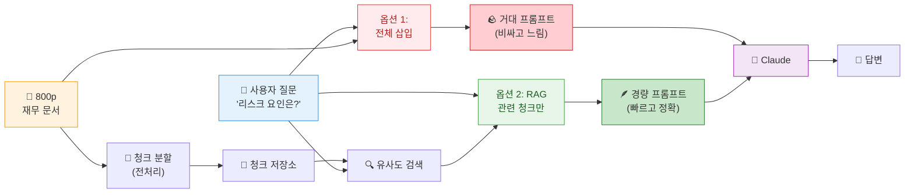

#### RAG의 장점과 도전과제

| 구분 | 내용 |
|---|---|
| **✅ 장점** | 관련 콘텐츠에만 집중 가능 |
| **✅ 장점** | 매우 큰 문서로도 확장 가능 |
| **✅ 장점** | 다중 문서 지원 |
| **✅ 장점** | 프롬프트가 작아져 비용 절감 + 응답 속도 향상 |
| **⚠️ 도전** | 문서를 청크로 쪼개는 전처리 단계 필요 |
| **⚠️ 도전** | "관련 있는" 청크를 찾을 검색 메커니즘 필요 |
| **⚠️ 도전** | 선택된 청크에 Claude가 필요한 모든 컨텍스트가 담기지 않을 수 있음 |
| **⚠️ 도전** | 청킹 방식은 수없이 많음 — 어떤 방식이 최선인가? |

#### 언제 RAG를 쓸 것인가?

RAG는 기술적 의사결정이 많고 프롬프트에 전부 넣는 방식보다 작업량이 많다. 따라서 **복잡성을 감수할 만한 가치**가 있는지 판단해야 한다. 특히 다음 경우에 가치가 크다:

- 매우 **큰 단일 문서** (수백 페이지)
- **다중 문서** 컬렉션
- **비용·성능 최적화**가 중요한 프로덕션 환경

> [!finding] RAG의 핵심 트레이드오프
> RAG는 **단순함(simplicity)을 포기하고 확장성(scalability)과 효율성(efficiency)을 얻는** 기법이다. 구현 부담은 늘지만, 단순 프롬프트 스터핑으로는 불가능한 규모의 문서 컬렉션을 다룰 수 있게 된다.

> [!tip] 핵심 인사이트
> RAG의 본질은 "**관련 있는 부분만 골라 넣기**"이다. 검색 품질이 곧 답변 품질이다 — 이후 1.2~1.5절에서 다룰 청킹·임베딩·검색 과정이 모두 이 "관련성"을 정확히 측정하기 위한 장치다.

> [!ref] 소스
> - Skilljar L01 — Introducing Retrieval Augmented Generation (287763)

---

### 1.2 텍스트 청킹 전략 (L02)

문서를 어떻게 쪼개느냐는 RAG 파이프라인에서 **가장 중요한 의사결정 중 하나**다. 잘못된 청킹 전략은 관련 없는 컨텍스트를 프롬프트에 삽입하게 만들고, 결국 Claude가 완전히 잘못된 답을 내놓게 한다.


*청킹 전략 종합 요약 --- 크기 기반·구조 기반·의미 기반·문장 기반 네 가지 접근의 비교*


*RAG 파이프라인에서 청킹의 위치 — 문서 입력 후 가장 먼저 수행되는 전처리 단계*

#### 나쁜 청킹의 사례: "bug" 문제

다음 시나리오를 떠올려 보자. 한 문서에 **의학 연구(Medical Research)** 섹션과 **소프트웨어 엔지니어링(Software Engineering)** 섹션이 함께 들어있다. 사용자가 "올해 엔지니어들이 버그를 몇 개나 고쳤는가?"라고 묻는다. 그런데 청킹이 엉망이면, 의학 연구 섹션에서 **다른 맥락으로 쓰인 "bug"(벌레/병원체 의미)** 가 포함된 청크가 검색되어 엉뚱한 답이 나온다.


*Bad chunking 사례 — "bug"라는 단어 때문에 의학 연구 청크가 소프트웨어 질문에 엉뚱하게 매칭되는 상황*

이것이 청킹 전략이 중요한 이유다. 이제 세 가지 주요 접근을 살펴보자.

#### 전략 ① Size-Based Chunking (크기 기반)

가장 단순한 방식. 텍스트를 **동일 길이의 문자열**로 잘라낸다. 325자 문서를 108자 청크 3개로 나누는 식이다.


*Size-based chunking — 같은 길이로 균등 분할*

문제는 문장이 중간에 잘린다는 점이다.


*Size-based chunking의 한계 — 단어가 중간에 끊기고, 섹션 헤더가 본문과 분리되며, 주변 맥락을 잃는다*

주요 단점:

- 단어가 **문장 중간에서 잘림**
- 주변 텍스트의 중요한 맥락을 **청크가 잃어버림**
- **섹션 헤더가 본문과 분리**될 수 있음


*Overlap 도입 — 인접 청크 사이에 일정 문자를 겹쳐서 맥락 손실을 줄인다*

이를 완화하기 위해 **overlap**(청크 간 중첩)을 도입한다. 각 청크가 이웃 청크의 일부 문자를 포함해 맥락을 보존하고 단어가 깔끔하게 끊기지 않도록 한다.


*Python 구현 — start_idx를 overlap만큼 뒤로 당겨 다음 청크 시작점을 잡는다*

```python
def chunk_by_char(text, chunk_size=150, chunk_overlap=20):
    chunks = []
    start_idx = 0

    while start_idx < len(text):
        end_idx = min(start_idx + chunk_size, len(text))
        chunk_text = text[start_idx:end_idx]
        chunks.append(chunk_text)

        start_idx = (
            end_idx - chunk_overlap if end_idx < len(text) else len(text)
        )

    return chunks
```

#### 전략 ② Structure-Based Chunking (구조 기반)

문서의 **자연스러운 구조**(헤더, 문단, 섹션)를 기준으로 분할한다. Markdown 파일처럼 형식이 잘 정돈된 문서에서 가장 좋은 결과를 낸다.


*Structure-based chunking — Markdown의 `##` 헤더를 경계로 섹션 단위 청크 생성*

```python
def chunk_by_section(document_text):
    pattern = r"\n## "
    return re.split(pattern, document_text)
```

각 청크가 **의미 있는 완결된 섹션**을 이루므로 가장 깔끔한 결과를 준다. 단점은 **문서 구조를 보장받을 수 있을 때만** 쓸 수 있다는 것 — 실제 현실의 plain text·PDF에는 명확한 구조 표식이 없는 경우가 많다.

#### 전략 ③ Semantic-Based Chunking (의미 기반)

가장 정교한 접근. 텍스트를 문장 단위로 쪼갠 뒤 **NLP를 써서 인접 문장들의 관련성**을 평가하고, 관련 있는 문장들을 묶어 청크를 구성한다. 계산 비용이 크고 구현이 복잡하지만 가장 relevant한 청크를 만들어낸다.

#### 전략 ④ Sentence-Based Chunking (문장 기반) — 실용적 중간지대

정규식으로 문장을 나눈 뒤 일정 개수씩 묶어 청크를 만든다. 구현이 단순하면서도 단어 끊김 문제가 없다.

```python
def chunk_by_sentence(text, max_sentences_per_chunk=5, overlap_sentences=1):
    sentences = re.split(r"(?<=[.!?])\s+", text)

    chunks = []
    start_idx = 0

    while start_idx < len(sentences):
        end_idx = min(start_idx + max_sentences_per_chunk, len(sentences))
        current_chunk = sentences[start_idx:end_idx]
        chunks.append(" ".join(current_chunk))

        start_idx += max_sentences_per_chunk - overlap_sentences

        if start_idx < 0:
            start_idx = 0

    return chunks
```

#### 전략 선택 가이드

| 전략 | 장점 | 단점 | 추천 사례 |
|---|---|---|---|
| **Structure-based** | 의미 단위 보존, 가장 깨끗 | 문서 형식 제약 | 사내 보고서, Markdown 문서 |
| **Sentence-based** | 단어 끊김 없음, 적당히 간단 | 섹션 경계 무시 | 일반 텍스트 문서 |
| **Size-based + overlap** | 어떤 포맷이든 작동, 구현 단순 | 청크 의미 불완전 | 혼합 포맷, 코드 포함 문서, 프로덕션 fallback |
| **Semantic-based** | 최상 품질 | 계산 비용 크고 복잡 | 품질이 절대적일 때 |

#### 의사결정 트리

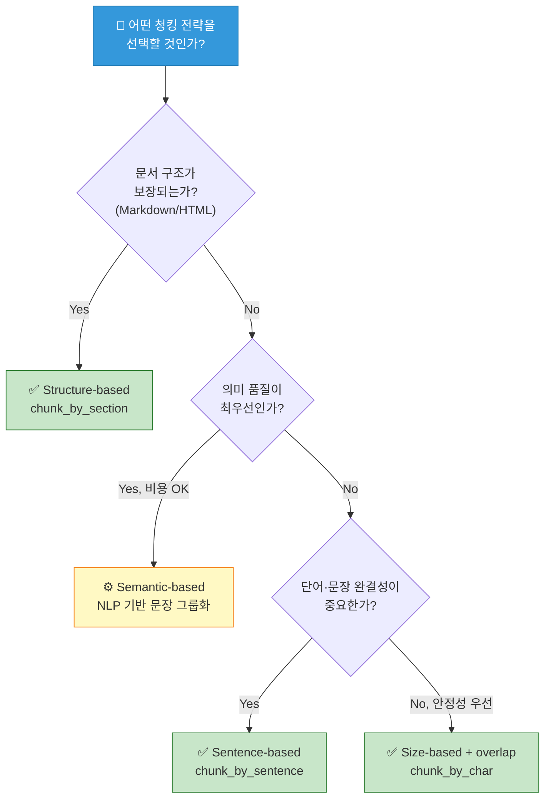

> [!method] 프로덕션 기본값
> 확실치 않다면 **Size-based + overlap**이 가장 무난하다. 어떤 형식이든 돌아가며, 완벽하진 않아도 파이프라인을 깨뜨리지 않을 정도의 일관된 청크를 만들어낸다. 경험적으로 문서 형식을 통제할 수 있는 환경이라면 **Structure-based**로 업그레이드하는 것이 품질 향상의 첫걸음이다.

> [!tip] 단 하나의 정답은 없다
> "가장 좋은 청킹 전략"은 존재하지 않는다. 문서의 특성, 사용 사례, 그리고 **구현 복잡성과 청크 품질 사이의 트레이드오프**를 어떻게 정하느냐에 따라 답이 달라진다.

> [!action] 실습 노트북
> 📂 `chunk_by_char`, `chunk_by_sentence`, `chunk_by_section` 세 가지 함수를 직접 돌려보며 결과 청크를 비교해 보자.
> `03-Exercises/Week_05/skilljar/[[S4_01_chunking]].ipynb`

> [!ref] 소스
> - Skilljar L02 — Text chunking strategies (287776)

---

### 1.3 텍스트 임베딩 (L03)

문서를 청크로 나눈 다음 단계는 **"사용자의 질문과 가장 관련 있는 청크"를 찾는 것**이다. 이는 본질적으로 검색 문제 — 모든 청크를 훑어 질문과 연결된 것을 골라내야 한다.


*임베딩 개요 --- 텍스트의 의미를 숫자 벡터로 표현해 의미 기반 검색을 가능하게 만드는 핵심 도구*


*검색 문제 — 수많은 청크 중 사용자 질문과 관련 있는 것만 선택해야 한다*

#### Semantic Search vs 키워드 검색

전통적인 키워드 검색은 **정확한 단어 일치**만 찾는다. "엔지니어 버그 수리"라는 질문이 들어왔을 때 "engineer"·"bug"·"fix" 단어가 없는 청크는 관련 있어도 놓친다.

**Semantic Search**(의미 검색)는 **임베딩(embedding)** 을 사용해 질문과 청크의 **의미와 맥락**을 이해하고 비교한다.


*Semantic search — 단어가 일치하지 않더라도 의미적으로 가까운 청크를 찾는다*

#### 텍스트 임베딩이란?

**텍스트 임베딩**은 텍스트에 담긴 의미를 **숫자 배열**로 표현한 것이다. 사람이 쓰는 언어를 컴퓨터가 수학적으로 다룰 수 있는 형태로 바꿔놓는 것이다.


*임베딩 생성 프로세스 — 텍스트를 임베딩 모델에 입력 → 숫자 배열 출력*

생성 과정:

1. 텍스트를 임베딩 모델에 입력
2. 모델이 **긴 숫자 배열**(임베딩)을 반환
3. 각 숫자는 **-1과 +1 사이** 값
4. 이 숫자들이 입력 텍스트의 여러 **특성(qualities)/차원(dimensions)** 을 표현

#### 숫자의 의미 — 직접 해석할 수는 없다

각 숫자는 입력 텍스트의 어떤 "품질"에 대한 점수다. 하지만 중요한 단서 — **각 숫자가 구체적으로 무엇을 의미하는지는 우리도 모른다.**


*임베딩의 각 차원 — "얼마나 행복한가", "얼마나 바다를 이야기하는가"는 개념적 예일 뿐, 실제 의미는 학습을 통해 모델 내부에 잠재된다*

"첫 번째 숫자는 텍스트가 얼마나 행복한지", "두 번째 숫자는 텍스트가 얼마나 바다에 대한 이야기인지"처럼 **상상하는 것은 이해를 돕지만 실제는 아니다**. 각 차원의 실제 의미는 학습 중에 모델이 스스로 결정하며, 사람이 직접 해석할 수는 없다.

#### VoyageAI 사용 — Anthropic은 임베딩을 제공하지 않는다

Anthropic은 현재 **임베딩 생성 API를 제공하지 않는다**. 권장되는 대안은 **VoyageAI**다. 사용하려면:

- VoyageAI 계정 가입 (별도)
- API key 발급 (시작은 무료)
- 환경변수에 키 추가


*VoyageAI 설정 — Anthropic 생태계가 권장하는 임베딩 제공업체*

`.env` 파일:

```
VOYAGE_API_KEY="your_key_here"
```

#### Python 구현

먼저 라이브러리 설치:

```
%pip install voyageai
```

클라이언트 초기화 및 임베딩 생성 함수:

```python
from dotenv import load_dotenv
import voyageai

load_dotenv()
client = voyageai.Client()

def generate_embedding(text, model="voyage-3-large", input_type="query"):
    result = client.embed([text], model=model, input_type=input_type)
    return result.embeddings[0]
```


*generate_embedding 구현 — model은 voyage-3-large, input_type="query"로 호출*

함수를 텍스트 청크에 적용하면 **부동소수점 숫자 리스트**가 반환된다. 생성은 빠르고 간단하지만 — 진짜 과제는 **이 임베딩들을 어떻게 비교해서 RAG 파이프라인에서 효과적으로 쓰느냐**이다.


*임베딩 비교 — 다음 단계는 어떤 임베딩이 사용자 질문과 가장 유사한지 찾는 것*

#### 임베딩 생성 흐름

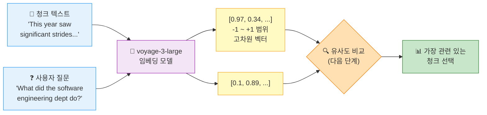

> [!finding] 임베딩의 본질
> 임베딩은 "**의미를 수학으로 번역하는 장치**"다. 단어가 일치하지 않아도 비슷한 의미의 텍스트는 벡터 공간에서 가까운 곳에 놓이게 되는 — 이 성질 덕분에 keyword 일치에 의존하지 않는 **semantic search**가 가능해진다.

> [!tip] input_type="query" vs "document"
> VoyageAI는 **질의(query)** 용과 **문서(document)** 용을 구분해서 임베딩할 수 있다. 검색 정확도를 높이기 위해 저장할 청크는 `input_type="document"`, 검색할 질문은 `input_type="query"`로 호출하는 것이 권장된다.

> [!action] 실습 노트북
> 📂 VoyageAI로 실제 임베딩을 뽑아보고, 두 텍스트 사이의 의미적 거리를 확인한다.
> `03-Exercises/Week_05/skilljar/[[S4_02_embeddings]].ipynb`

> [!ref] 소스
> - Skilljar L03 — Text embeddings (287759)

---

### 1.4 전체 RAG 흐름 (L04)

지금까지 배운 RAG 기본, 청킹, 임베딩 — 이 조각들이 **하나의 파이프라인으로 맞물리는 과정**을 end-to-end로 따라가 보자. 총 **6단계**로 구성된다.


*전체 RAG 파이프라인 요약 --- 청킹 → 임베딩 → Vector DB → 질의 임베딩 → 유사도 검색 → 프롬프트 주입의 6단계 한 장 요약*

#### 단계 1: 소스 텍스트를 청크로 분할

예시로 두 개의 섹션을 사용한다:

- **Section 1 (Medical Research)**: "This year saw significant strides in our understanding of XDR-47, a 'bug' we have not seen before."
- **Section 2 (Software Engineering)**: "This division dedicated significant effort to studying various infection vectors in our distributed systems"

**주목할 포인트**: 의학 섹션에는 소프트웨어 용어처럼 보이는 "bug"가, 소프트웨어 섹션에는 의학 용어처럼 보이는 "infection vectors"가 섞여 있다 — keyword 검색이 쉽게 속을 수 있는 상황이다.

#### 단계 2: 임베딩 생성

각 청크를 임베딩 모델에 통과시킨다. 이해를 돕기 위해 **"정확히 2개 숫자를 반환하는 가상의 임베딩 모델"** 을 상상하자. 또 두 차원의 의미도 알고 있다고 가정한다:

- 첫 번째 숫자 = 텍스트가 **의학 분야**에 대해 얼마나 이야기하는가
- 두 번째 숫자 = 텍스트가 **소프트웨어 엔지니어링**에 대해 얼마나 이야기하는가


*상상의 2차원 임베딩 모델 — 첫 차원은 의학 관련도, 두 번째 차원은 소프트웨어 관련도*

- **Medical Research 청크** → `[0.97, 0.34]` (의학 성향 강함, "bug" 때문에 소프트웨어 성분도 약간)
- **Software Engineering 청크** → `[0.30, 0.97]` (소프트웨어 성향 강함, "infection vectors" 때문에 의학 성분도 약간)

#### Normalization — 단위원(unit circle)으로 투영

임베딩 API는 보통 벡터의 **크기(magnitude)를 1.0으로 맞추는 normalization** 단계를 자동 수행한다.


*Normalization — 각 벡터를 길이 1로 스케일링. 수식 자체는 API가 알아서 처리한다*

정규화 결과:

- `[0.97, 0.34]` → `[0.944, 0.331]`
- `[0.30, 0.97]` → `[0.295, 0.955]`


*단위원 시각화 — 정규화된 각 청크가 반지름 1인 원 위의 점으로 표현된다*

#### 단계 3: Vector Database에 저장

정규화된 임베딩을 **벡터 데이터베이스(vector database)** 에 저장한다. 벡터 DB는 긴 숫자 배열들을 **저장·비교·검색**하도록 최적화된 특수 데이터베이스다.


*Vector database — 임베딩 저장과 유사도 검색에 특화된 데이터베이스*

여기서 **파이프라인은 일단 멈춘다.** 지금까지 수행한 것은 모두 **전처리(preprocessing)**, 즉 사용자가 질문하기 전에 미리 해두는 작업이다. 이제 사용자 질문을 기다린다.

#### 단계 4: 사용자 질문 처리

사용자가 다음과 같이 질문한다: "I'm curious about the company. In particular, what did the software engineering dept do this year?"


*사용자 질문을 임베딩으로 변환 — 저장된 청크에 사용한 것과 동일한 모델을 써야 한다*

이 질문을 **같은 임베딩 모델**에 통과시키면 `[0.1, 0.89]` 같은 값이 나온다 — 의학 성분은 낮고 소프트웨어 성분은 높다. 정규화 후 `[0.112, 0.993]`이 된다.

#### 단계 5: 가장 유사한 임베딩 찾기

질문 임베딩을 벡터 DB에 보내 **가장 유사한 저장 임베딩**을 요청한다.


*유사도 검색 — 질문 벡터와 각 저장 벡터의 cosine similarity 계산*

DB는 Software Engineering 섹션을 반환한다 — 사용자가 묻고 있는 주제와 가장 가깝기 때문이다.

#### Cosine Similarity (코사인 유사도) — 어떻게 비슷한지 재는가

벡터 DB는 두 벡터 사이의 유사도를 **코사인 유사도(cosine similarity)** 로 측정한다. 이는 **두 벡터가 이루는 각도의 코사인** 값이다.


*Cosine similarity — 두 벡터 사이 각도의 cosine 값*

주요 특성:

| 값 | 의미 |
|---|---|
| **1에 가까움** | 매우 유사 (같은 방향) |
| **0** | 관련 없음 (직교) |
| **-1에 가까움** | 매우 다름 (반대 방향) |
| 범위 | **-1 ~ 1** |

**본 예시 계산 결과**:

- 사용자 질문 vs Software Engineering 청크 → **0.983** (매우 높은 유사도)
- 사용자 질문 vs Medical Research 청크 → **0.398** (훨씬 낮음)

#### Cosine Distance — 유사도의 뒤집힌 표기

벡터 DB 문서에서는 종종 **"cosine distance"** 라는 용어를 본다. 단순히 `(1 - cosine similarity)`다.

- 0에 가까울수록 **유사**
- 값이 클수록 **덜 유사**

상황에 따라 "거리가 0.017"이 "유사도가 0.983"보다 직관적일 때가 있다.

#### 단계 6: 최종 프롬프트 생성

가장 관련 있는 청크와 사용자 질문을 합쳐 Claude에 전달한다.


*최종 프롬프트 — 사용자 질문 + 검색된 관련 청크 → Claude 응답*

```
Answer the user's question about the financial document.

<user_question>
How many bugs did engineers fix this year?
</user_question>

<report>
## Section 2: Software Engineering
This division dedicated significant effort to studying various infection vectors in our distributed systems
</report>
```

#### End-to-End RAG 시퀀스

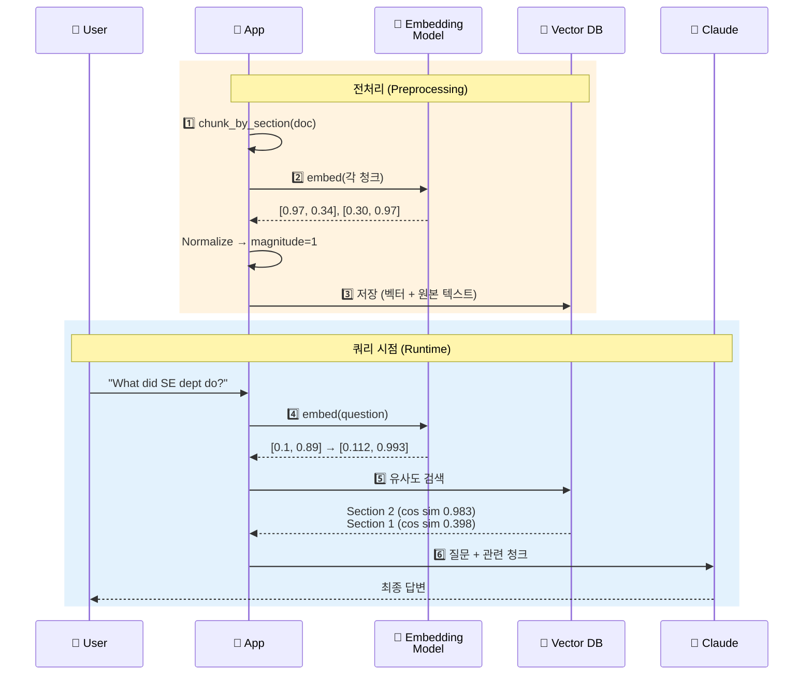

> [!method] RAG 6단계 요약
> **전처리 3단계** (Chunk → Embed → Store) + **쿼리 3단계** (Query embed → Similarity search → Prompt). 앞의 3단계는 **사용자가 질문하기 전에 미리** 수행되고, 뒤의 3단계가 **실시간**으로 돌아간다. 이 분리가 RAG의 확장성을 만든다 — 한 번 색인해 두면 수많은 질의에 빠르게 응답할 수 있다.

> [!finding] 왜 cosine인가?
> 정규화된 벡터에서 cosine similarity는 **두 벡터의 방향 일치도**를 측정한다. 크기(magnitude)를 버리고 방향만 남기므로, **텍스트 길이에 휘둘리지 않고 의미의 유사성만** 비교할 수 있다 — 이것이 RAG 검색에서 cosine이 표준인 이유다.

> [!tip] 상식적 검증
> 0.983(Software) vs 0.398(Medical) — 이 숫자의 차이가 크면 클수록 검색 품질이 높다. 만약 두 값이 0.7 근처에서 엇비슷하게 나온다면, **청킹 전략이나 임베딩 모델**을 다시 점검할 때다.

> [!ref] 소스
> - Skilljar L04 — The full RAG flow (287764)

---

### 1.5 RAG 구현하기 (L05)

이제까지의 개념을 **실제 코드로** 옮겨보자. `chunk_by_section`, `generate_embedding`, `VectorIndex` 세 가지 요소를 조립해 완전한 RAG 파이프라인을 구성한다.

#### 5단계 구현 체크리스트

1. 텍스트를 섹션 단위로 청킹
2. 각 청크의 임베딩 생성
3. Vector store 만들고 임베딩 추가
4. 사용자 질문 임베딩
5. Store에서 가장 관련 있는 청크 검색


*L05 RAG 구현 다이어그램 — 사용자 질문을 임베딩으로 변환해 vector DB에서 가장 관련 있는 콘텐츠를 찾는다*

#### 단계 1: 청킹

문서를 로드하고 섹션 단위로 쪼갠다.

```python
with open("./report.md", "r") as f:
    text = f.read()

chunks = chunk_by_section(text)
chunks[2]  # Test to see the table of contents
```

1.2절에서 정의한 `chunk_by_section`을 그대로 재사용한다.

#### 단계 2: 일괄 임베딩

```python
embeddings = generate_embedding(chunks)
```

이때 `generate_embedding`은 **단일 문자열뿐 아니라 리스트**도 받도록 확장되어 있다. 배치 처리가 효율적이다.

#### 단계 3: Vector Store 구축

```python
store = VectorIndex()

for embedding, chunk in zip(embeddings, chunks):
    store.add_vector(embedding, {"content": chunk})
```

**핵심 포인트**: 임베딩만 저장하는 게 아니라 `{"content": chunk}` 형태로 **원본 텍스트를 함께 저장한다**. 검색 결과로 벡터를 돌려받아도 사람에겐 쓸모가 없기 때문이다 — 최종 프롬프트에 넣을 건 결국 원본 텍스트다.

> [!finding] 왜 원본 텍스트를 함께 저장하는가?
> 벡터 DB에서 검색하고 나면 결국 **Claude에 전달할 "사람 읽을 수 있는 텍스트"** 가 필요하다. 숫자 배열만 반환받으면 아무것도 할 수 없다. 따라서 각 임베딩 옆에 **원본 청크(또는 그 참조)** 를 함께 저장하는 것이 표준 패턴이다.

#### 단계 4: 사용자 질의 임베딩

```python
user_embedding = generate_embedding("What did the software engineering dept do last year?")
```

같은 `generate_embedding` 함수를 써서 **저장된 청크와 동일한 임베딩 공간**에 질문을 투영한다.

#### 단계 5: 유사도 검색

```python
results = store.search(user_embedding, 2)

for doc, distance in results:
    print(distance, "\n", doc["content"][0:200], "\n")
```

`store.search(user_embedding, 2)` — 가장 가까운 **2개** 청크를 유사도 점수(cosine distance)와 함께 반환한다.


*검색 결과 — distance 값이 낮을수록 가까운 청크*

#### 결과 해석

실제 실행 시 얻게 되는 결과:

| 순위 | 섹션 | Cosine Distance | 해석 |
|:---:|---|:---:|---|
| 1 | **Section 2: Software Engineering** | **0.71** | 질문과 가장 가까움 |
| 2 | **Methodology** | **0.72** | 근소한 차이로 2위 |

**Distance가 낮을수록 유사하다.** Section 2가 Methodology 섹션보다 아주 약간 더 가깝다 — 질문이 직접적으로 소프트웨어 엔지니어링 부서를 가리키기 때문이다.

#### 5단계 파이프라인 흐름

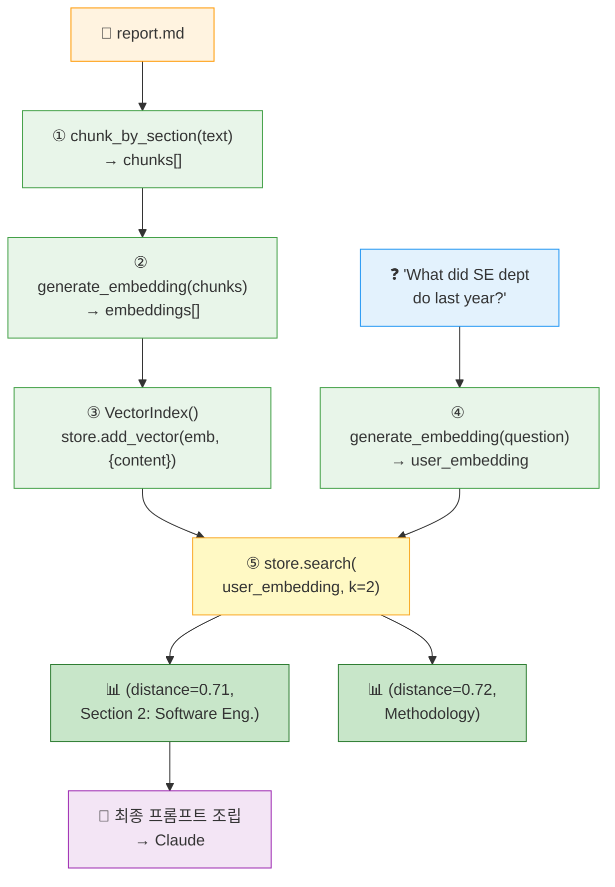

#### 다음 단계 — 이 구현의 한계

이 기본 구현은 많은 경우 잘 작동하지만, **특정 시나리오에서 예상만큼 동작하지 않는 상황**이 있다. 예를 들어 `"INC-2023-Q4-011"` 같은 고유한 사건 ID로 검색할 때 semantic search는 의미만 비슷한 엉뚱한 섹션을 가져올 수 있다. Chapter 2에서는 이 문제를 **BM25 lexical search**로 보완하는 하이브리드 RAG 기법을 다룬다.

> [!tip] 핵심 요약
> RAG의 본질은 단순하다 — **텍스트를 숫자(임베딩)로 바꾸고, 그 숫자들을 효율적으로 저장한 뒤, 사용자가 질문하면 수학적 유사도로 관련 콘텐츠를 찾는다.** 이후 모든 고급 기법(BM25, reciprocal rank fusion, multi-index)은 이 기본기 위에 얹히는 개선이다.

> [!method] 실행 시점 vs 전처리 시점
> 단계 1~3은 문서를 추가할 때 **한 번만** 돌리면 된다 (전처리). 단계 4~5는 사용자가 질문할 **매번** 실행된다 (런타임). 이 분리를 제대로 지키는 것이 RAG를 production에서 돌리는 열쇠다.

> [!action] 실습 노트북
> 📂 실제 `VectorIndex` 구현 + 5단계 파이프라인 전체를 코드로 실행하고, distance 0.71 / 0.72 결과를 직접 확인한다.
> `03-Exercises/Week_05/skilljar/[[S4_03_vector_search]].ipynb`

> [!ref] 소스
> - Skilljar L05 — Implementing the RAG flow (287761)

---
## [Chapter 2] 하이브리드 검색 & Multi-Index 파이프라인 (L06-L07)

Chapter 1에서 우리는 RAG의 핵심 흐름을 완성했다 — 텍스트를 쪼개고 (chunking), 임베딩으로 수치화하고 (embedding), 코사인 유사도로 **의미 기반 검색 (semantic search)**을 수행한 뒤, 검색 결과를 Claude에게 컨텍스트로 전달하는 전 과정이다. 그런데 의미 검색만으로는 해결되지 않는 문제가 있다.

"`INC-2023-Q4-011` 사건에 대해 알려줘"라는 질문을 생각해보자. `INC-2023-Q4-011`은 특정 사건 식별자 — 의미상 유사한 문장은 수없이 많지만, 실제로 이 코드를 포함한 문서는 하나뿐이다. 의미 검색은 "incident" 라는 개념이 등장하는 **금융 분석 섹션**도 함께 끌어오지만, 정작 해당 식별자가 쓰여 있는 섹션은 놓칠 수 있다.

이 문제를 해결하는 전통적인 기법이 **BM25 어휘 검색 (lexical search)**이며, 의미 검색과 병렬로 실행한 뒤 결과를 병합하는 방식이 **하이브리드 검색 (hybrid search)**이다. Chapter 2에서는 두 단계로 이 구조를 완성한다 — L06에서 BM25를 구현하고, L07에서 두 인덱스를 하나의 **Retriever 추상체**로 묶어 **Reciprocal Rank Fusion (RRF)**으로 병합한다.

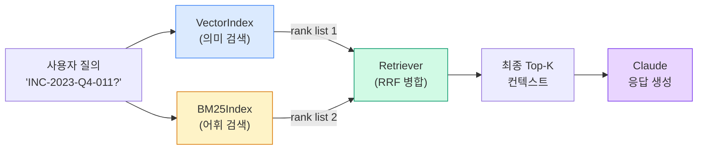

> [!finding] Chapter 2에서 달성할 목표
> - **L06**: 의미 검색만의 한계를 이해하고, BM25 알고리즘 4단계를 직접 구현한다.
> - **L07**: VectorIndex + BM25Index를 하나의 Retriever 클래스로 통합하고, RRF 공식으로 rank를 병합하는 과정을 재현한다.
> - **확장성**: `SearchIndex` 프로토콜 하나만 맞추면 keyword/graph/domain 인덱스를 자유롭게 추가할 수 있는 구조를 체득한다.

---

### 2.1 BM25 어휘 검색 (L06)


*BM25 어휘 검색 개요 --- 정확한 용어 일치를 보장하는 고전적 텍스트 검색 알고리즘 요약*

#### 2.1.1 의미 검색만으로는 부족한 이유

L06의 첫 예제는 매우 명확하다. 사용자가 `"What happened with INC-2023-Q4-011?"` 라고 물을 때, **의미 기반 검색만 사용한 결과는 다음과 같다**.


> 의미 검색은 사이버보안 섹션 (실제로 해당 사건 ID를 포함한다) 을 반환했지만, 사건에 대해 전혀 언급하지 않은 **금융 분석 섹션**도 함께 반환했다. 이는 의미 검색이 **정확한 용어 일치 (exact term matching)** 가 아닌 **개념적 유사성 (conceptual similarity)** 에 초점을 맞추기 때문이다.

즉, 의미 공간 (semantic space) 에서 "사건·분기·2023년"이라는 개념 벡터에 가까운 섹션이 모두 상위로 올라와, 정작 질의어의 **리터럴 일치**가 핵심인 경우 정답 섹션이 묻히는 현상이 발생한다.

> [!question] 왜 의미 검색은 식별자 (ID) 에 약한가?
> 임베딩 모델은 일반 의미 공간을 학습했을 뿐, `INC-2023-Q4-011` 같은 **희소 토큰 (rare token)** 에 대한 전용 의미를 학습한 적이 없다. 모델은 해당 문자열을 "무언가의 식별자" 정도의 모호한 벡터로 인코딩하므로, 비슷한 형태의 다른 ID나 "incident"라는 개념 자체와 뭉뚱그려진다. 결국 **exact match 가 필요한 장면**에서는 의미 검색이 약점을 드러낸다.

#### 2.1.2 하이브리드 검색 전략

해결책은 간단하다 — **의미 검색과 어휘 검색을 동시에 돌리고, 결과를 병합한다**.


- **의미 검색 (Semantic)**: 임베딩 기반. 개념적 유사 문서를 끌어온다.
- **어휘 검색 (Lexical)**: 고전적 텍스트 검색. 정확한 용어 매칭을 보장한다.
- **병합된 결과 (Merged)**: 두 접근의 장점을 합쳐 더 정확한 검색을 만든다.

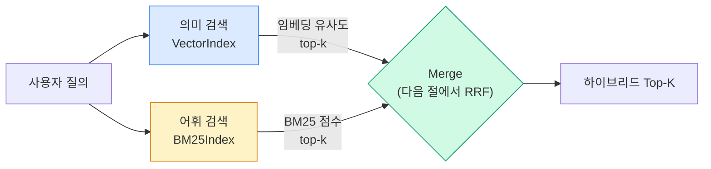

> [!tip] 왜 두 검색이 상보적인가
> 의미 검색은 "같은 의미, 다른 표현"을 잘 잡는다 (예: "지진 하중 저항 시스템" ↔ "Seismic Force Resisting System"). 반면 어휘 검색은 "반드시 그 단어 자체"가 있어야 하는 상황, 즉 **고유명사, 코드, 수식, ID** 등에 강하다. RAG 파이프라인에서는 둘을 **OR**로 합치는 편이 거의 항상 유리하다.

#### 2.1.3 BM25 알고리즘 4단계

BM25 (**Best Match 25**) 는 1990년대부터 IR (Information Retrieval) 분야에서 표준처럼 쓰여 온 어휘 검색 알고리즘이다. Skilljar 강의 4단계 설명을 그대로 따라가보자.


> [!method] BM25 4단계 처리 흐름
> **Step 1 — 질의 토큰화 (Tokenize the query)**
> 사용자의 질문을 개별 용어로 쪼갠다.
> 예: `"a INC-2023-Q4-011"` → `["a", "INC-2023-Q4-011"]`
>
> **Step 2 — 용어 빈도 카운트 (Count term frequency)**
> 각 용어가 전체 문서 집합에서 얼마나 자주 나타나는지 센다.
> 예: `"a"`는 5회, `"INC-2023-Q4-011"`은 1회.
>
> **Step 3 — 희소 용어에 높은 가중치 (Weight terms by importance)**
> 자주 등장하지 않는 용어에 더 높은 중요도를 부여한다.
> `"a"`는 흔하므로 낮은 중요도, `"INC-2023-Q4-011"`은 희소하므로 높은 중요도.
>
> **Step 4 — 가중치 기반 최적 매칭 (Find best matches)**
> 고가중치 용어를 더 많이 포함한 문서를 상위로 반환한다.

핵심 직관: **"흔한 단어는 버리고, 드문 단어에 집중하라."** 이 간단한 원리 덕분에 BM25는 30년이 지난 지금도 대부분의 어휘 검색 엔진의 기본 알고리즘으로 살아남았다.

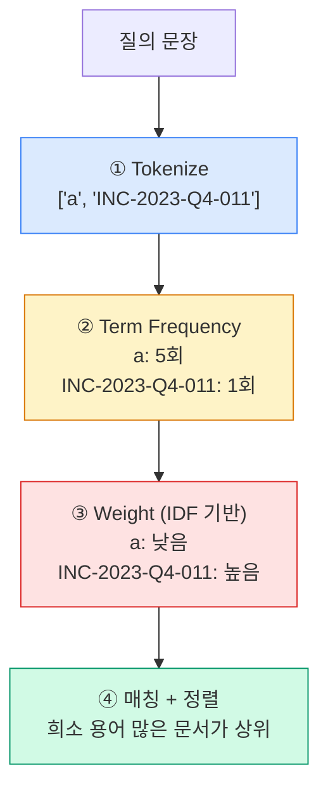

#### 2.1.4 BM25 Python 구현

Skilljar 노트북 (`S4_04_bm25.ipynb`) 에서는 외부 라이브러리 (`rank_bm25` 또는 자체 구현) 를 사용해 `BM25Index` 클래스를 정의한다. VectorIndex와 API를 일치시키는 것이 핵심이다.

```python
# 1. 섹션별로 텍스트 청킹
chunks = chunk_by_section(text)

# 2. BM25 인덱스 생성 후 문서 추가
store = BM25Index()
for chunk in chunks:
    store.add_document({"content": chunk})

# 3. 검색
results = store.search("What happened with INC-2023-Q4-011?", 3)

# 4. 결과 출력
for doc, distance in results:
    print(distance, "\n", doc["content"][:200], "\n----\n")
```

> [!finding] VectorIndex와 완전히 같은 API
> 이 설계는 단순해 보이지만 **L07의 Retriever 추상화를 가능케 하는 핵심**이다. `add_document()` 와 `search()` 두 메서드만 노출하고, 내부 스코어링 방식은 철저히 캡슐화한다. 이 덕분에 L07에서 "인덱스를 아무리 많이 꽂아도 Retriever는 구조를 바꿀 필요 없는" 패턴이 성립한다.

#### 2.1.5 기대 결과

이렇게 구현한 BM25로 같은 질의를 다시 던지면 결과가 뚜렷이 개선된다.


> 결과가 이제 **Software Engineering 섹션**과 **Cybersecurity 섹션**을 올바르게 우선 반환한다. 이 두 섹션 모두 실제로 검색 대상 사건 ID를 포함하고 있다.

즉, 의미 검색만 쓸 때 상위로 올라왔던 금융 분석 섹션이 사라지고, 실제 `INC-2023-Q4-011`이 기술된 섹션 두 개가 정확히 상위에 배치된다.

#### 2.1.6 BM25가 더 잘 작동하는 이유

> [!result] BM25가 탁월한 네 가지 이유
> 1. **희소 용어에 높은 가중치** — rare, specific term을 우대 (IDF 개념).
> 2. **불용어 (stop words) 무시** — `a`, `the`, `is` 같은 흔한 단어는 점수에 기여하지 못하도록 자동으로 눌린다.
> 3. **의미가 아닌 빈도에 집중** — 개념적 유사성이 아니라 **실제 단어 등장 빈도**에만 근거해 스코어링.
> 4. **기술 용어·ID·구문에 강함** — 코드·표준 번호·사건 식별자처럼 exact match가 중요한 영역에서 압도적으로 유리.

핵심 통찰: **두 검색 방식은 경쟁 관계가 아니라 상보 관계**다. 의미 검색은 문맥과 의미를 이해하고, 어휘 검색은 정확한 용어 일치를 보장한다. 둘을 합치면 개념 질의와 특정 룩업 모두를 잘 처리하는 견고한 시스템이 된다.

> [!action] 실습 연결
> `03-Exercises/Week_05/skilljar/S4_04_bm25.ipynb` 를 열고 다음 순서로 진행한다.
> 1. 전사본에 등장한 동일한 문서셋을 로드한다 (Cybersecurity, Software Engineering, Financial Analysis, Legal 섹션 포함).
> 2. 의미 검색만으로 `INC-2023-Q4-011`을 질의해 **실패 사례를 먼저 재현**한다.
> 3. `BM25Index` 클래스로 같은 질의를 던지고, 반환되는 섹션이 L06-16 이미지와 일치하는지 확인한다.
> 4. 자신의 문서셋 (예: 과거 과제 PDF) 로 바꿔 BM25 vs Semantic 차이를 체감한다.

> [!ref] 소스
> - Skilljar L06 — BM25 lexical search (287767)
> - 이미지: L06-05, L06-06, L06-07, L06-16
> - 노트북: `S4_04_bm25.ipynb`

---

### 2.2 Multi-Index RAG 파이프라인 (L07)

#### 2.2.1 하나의 파이프라인으로 통합하기

L05까지 우리는 **VectorIndex**를, L06에서 **BM25Index**를 만들었다. 두 클래스는 내부 로직은 완전히 다르지만, 외부로 노출하는 **공용 API는 동일하다**.

- `add_document(document)` — 문서를 인덱스에 추가
- `search(query, k)` — 상위 k개 문서를 반환


>  "두 클래스가 거의 동일한 API를 공유한다는 일관성 덕분에, 하나의 새 클래스 **Retriever**로 묶는 것이 자연스럽다. Retriever는 사용자 질의를 두 인덱스에 동시에 전달하고, 각 결과를 수집한 뒤 **reciprocal rank fusion** 으로 병합하는 **조정자 (coordinator)** 역할을 수행한다."

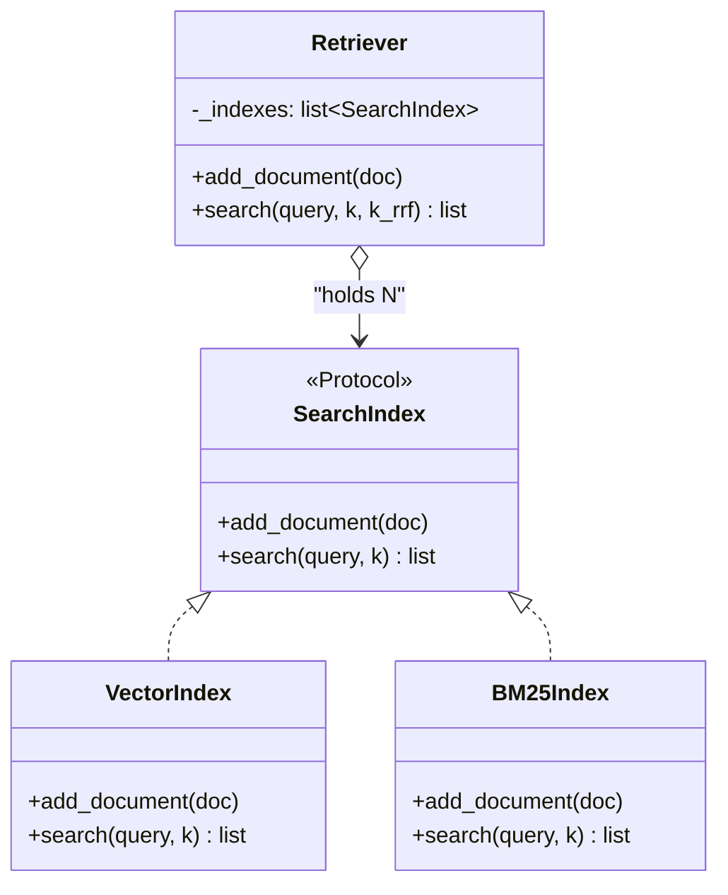

이 구조의 진짜 가치는 **느슨한 결합 (loose coupling)** 이다. Retriever는 각 인덱스가 내부적으로 cosine 유사도를 쓰는지 BM25를 쓰는지 몰라도 된다. "rank가 있는 결과 리스트를 받아 RRF로 합친다"만 알면 충분하다.

요청 처리 관점에서 Retriever 의 내부 흐름은 다음과 같다.

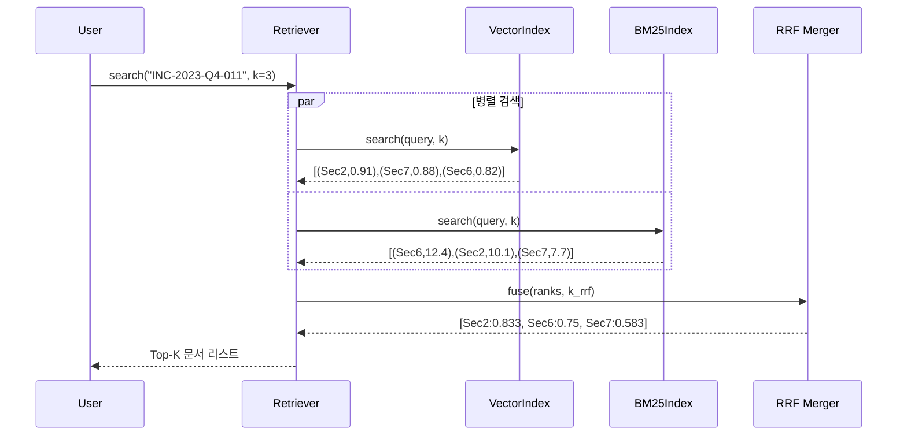

이 시퀀스에서 주의할 점 두 가지. 
(1) 두 인덱스 검색은 **독립적이므로 병렬화 가능**하다 — 실무 배포 시 async 또는 thread-pool 로 동시 실행해 지연을 줄인다. 
(2) RRF 는 **rank 만** 받으므로 원점수 (0.91, 12.4 등) 는 폐기된다 — 스코어 정규화 과정이 필요 없다는 점이 재차 확인된다.

#### 2.2.2 Reciprocal Rank Fusion (RRF) — 왜 단순 합치기가 안 되는가

여러 검색 방식의 결과를 병합할 때 가장 순진한 방식은 "그냥 두 리스트를 이어붙이기"이다. 하지만 이는 작동하지 않는다. **각 방식이 완전히 다른 스코어 체계를 쓰기 때문**이다 — VectorIndex의 cosine 유사도는 [0, 1] 범위의 연속값, BM25는 이론상 0부터 양의 무한대까지 가는 가중 합. 이 두 값을 그대로 더하거나 평균내면 한쪽이 압도해버린다.


RRF (Reciprocal Rank Fusion) 는 이 문제를 **점수가 아닌 순위 (rank) 만 사용**하여 해결한다. 각 결과에서 문서가 몇 번째에 있었는지만 보고, 그 역수를 더한다.

```
RRF_score(d) = Σ_i  1 / (k + rank_i(d))
```

- `k`: 상수. 일반적으로 60, 교재에서는 이해를 돕기 위해 1을 사용.
- `rank_i(d)`: i번째 인덱스에서의 문서 d의 순위 (1부터 시작).
- `Σ`: 문서 d가 등장한 **모든 인덱스에 대해 합산**.


> [!tip] RRF의 세 가지 강점
> 1. **스케일 중립 (scale-agnostic)** — 원점수 범위가 달라도 영향 없음. rank만 본다.
> 2. **상보성 포착** — 여러 인덱스에 공통 등장하는 문서는 분모가 계속 쌓여 자연스럽게 가산 효과를 얻는다.
> 3. **단일 인덱스 실패에 강건** — 한쪽에서 엉뚱한 결과를 내도 다른 쪽이 보정한다.

#### 2.2.3 구체 예제 재현

예제를 정확한 수치를 따라 재현해보자. 질의는 `INC-2023-Q4-011` 이며, 두 인덱스의 결과는 다음과 같다.


- **VectorIndex**: Section 2 (rank 1), Section 7 (rank 2), Section 6 (rank 3)
- **BM25Index**: Section 6 (rank 1), Section 2 (rank 2), Section 7 (rank 3)

| 문서 | Vector rank | BM25 rank | RRF 계산 | 점수 |
|:---:|:---:|:---:|:---|:---:|
| **Section 2** | 1 | 2 | 1/(1+1) + 1/(1+2) = 0.5 + 0.333 | **0.833** |
| **Section 6** | 3 | 1 | 1/(1+3) + 1/(1+1) = 0.25 + 0.5  | **0.750** |
| **Section 7** | 2 | 3 | 1/(1+2) + 1/(1+3) = 0.333 + 0.25 | **0.583** |

최종 정렬은 **Section 2 (0.833) → Section 6 (0.750) → Section 7 (0.583)**. 예제의 해석대로 — "Section 2 가 양쪽 인덱스에서 모두 좋은 성적을 냈기 때문에 자연스럽게 최상위로 떠오른다" — 는 직관이 숫자로 증명된다.


> [!method] 손으로 RRF 계산해보기
> `k=1`인 경우 — (교재 예시와 동일)
> - 한 인덱스에서만 rank=1인 경우: `1/(1+1) = 0.5`
> - 두 인덱스 모두 rank=1인 경우: `0.5 + 0.5 = 1.0` (이론상 최대치)
> - rank=5인 문서: `1/(1+5) ≈ 0.167` (기여가 급감)
>
> 실무 `k=60`으로 계산하면 개별 기여가 `1/61 ≈ 0.0164` 수준으로 작아지고, rank 차이에 따른 **감쇠가 더 완만**해진다. 이것이 "k=60" 이 프로덕션 기본값인 이유 — 단일 인덱스의 rank 1 문서가 과도하게 지배하지 않도록 분산시킨다.

#### 2.2.4 Retriever 클래스 구현

```python
from typing import Any, Dict, Protocol, Tuple

class SearchIndex(Protocol):
    def add_document(self, document: Dict[str, Any]) -> None: ...
    def search(self, query_text: str, k: int) -> list: ...


class Retriever:
    def __init__(self, *indexes: SearchIndex):
        if len(indexes) == 0:
            raise ValueError("At least one index must be provided")
        self._indexes = list(indexes)

    def add_document(self, document: Dict[str, Any]):
        # 모든 인덱스에 동일 문서 추가
        for index in self._indexes:
            index.add_document(document)

    def search(self, query_text: str, k: int = 1, k_rrf: int = 60):
        # 1) 모든 인덱스에서 개별 결과 수집
        all_results = [idx.search(query_text, k) for idx in self._indexes]

        # 2) 문서 식별자별 RRF 점수 누적
        scores: Dict[str, float] = {}
        docs: Dict[str, Dict[str, Any]] = {}
        for results in all_results:
            for rank, (doc, _score) in enumerate(results, start=1):
                key = doc["content"]           # 간단한 식별자 — 실무에선 doc_id
                scores[key] = scores.get(key, 0.0) + 1.0 / (k_rrf + rank)
                docs[key] = doc

        # 3) RRF 점수 내림차순 정렬 후 top-k 반환
        ranked = sorted(scores.items(), key=lambda x: x[1], reverse=True)
        return [(docs[key], score) for key, score in ranked[:k]]
```

> [!finding] 설계 포인트
> - `*indexes: SearchIndex` — 인덱스 개수에 제한이 없다. 1개면 단일 검색, 2개면 하이브리드, N개면 Multi-Index.
> - `k_rrf` — RRF 상수. 기본 60, 교육용 재현에는 1.
> - `add_document`를 모든 인덱스에 브로드캐스트 → 인덱스별 동기화 책임을 Retriever가 흡수.
> - 타입 힌트에 **Protocol**을 쓴 것이 핵심 — `SearchIndex`는 런타임 타입이 아니라 **구조적 타이핑 규약**이다. 상속 없이도 API만 맞으면 통과한다.

#### 2.2.5 하이브리드 결과 — 이전 문제의 해결

Chapter 1 L05에서 남긴 미해결 과제가 있었다. 벡터 검색만 썼을 때 `INC-2023-Q4-011` 질의가 사이버보안 섹션 (Section 10)을 1위로 올린 것까진 맞는데, 2위로 금융 분석 (Section 3) 이라는 **엉뚱한 섹션**을 반환했었다. 정작 실제로 관련 있는 Software Engineering 섹션 (Section 2) 은 상위 3개에 들지 못했다.

하이브리드 Retriever로 같은 질의를 돌리면 결과는 다음과 같다.

1. **Section 10**: Cybersecurity Analysis — Incident Response Report (가장 관련성 높음)
2. **Section 2**: Software Engineering — Project Phoenix Stability Enhancements (두 번째)
3. **Section 5**: Legal Developments (세 번째)

> [!result] 의미 단독 → 하이브리드로의 개선 정리
>
> | 방식 | 1위 | 2위 | 3위 | 평가 |
> |:---:|:---:|:---:|:---:|:---|
> | Vector only | Sec 10 | **Sec 3 (Finance)** | Sec X | 금융 섹션이 오탐으로 등장 |
> | Hybrid (RRF) | **Sec 10** | **Sec 2 (SE)** | Sec 5 | 의도에 맞는 섹션 정렬 |
>
> "INC-2023-Q4-011" 같은 **리터럴 토큰이 핵심인 질의**에서 하이브리드가 단독 검색의 약점을 명확히 보정함을 수치로 확인할 수 있다.

#### 2.2.6 SearchIndex 프로토콜 — 확장성의 진짜 가치


>  "이 아키텍처의 아름다움은 **확장성**에 있다. 모든 인덱스가 동일한 `SearchIndex` 프로토콜 (`add_document`, `search`) 을 구현하기 때문에, 새로운 검색 방법을 손쉽게 추가할 수 있다."

추가 가능한 인덱스 예시:

- **Keyword Index**: 정확한 키워드 매칭 전용 인덱스 (BM25 없이 포함/제외 로직).
- **Graph Index**: 지식 그래프 기반 — 관계 기반 추론을 RAG에 접목.
- **Specialized Domain Index**: 특정 도메인 사전 (예: 법령 조문, 의학 용어 사전, 표준 문서 번호) 과 연결된 전용 인덱스.
- **Contextual Retrieval Index**: 각 청크에 문서 전체 요약을 접두로 붙이는 Anthropic Contextual Retrieval 등.


*Contextual Retrieval 개념도 --- 각 청크 앞에 문서 전체 요약을 접두로 붙여 검색 정확도를 끌어올리는 Anthropic 의 기법*

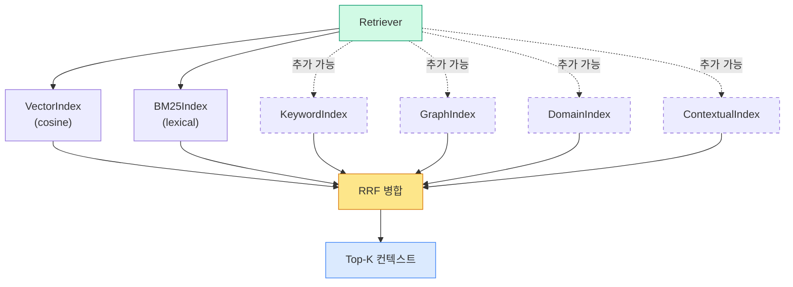

> [!tip] 설계 교훈 — **"프로토콜로 열고, RRF로 닫아라"**
> Retriever는 OCP (Open-Closed Principle) 의 교과서적 예시다.
> - **Open for extension**: 새로운 인덱스를 언제든 추가 가능.
> - **Closed for modification**: Retriever 자체는 바꿀 필요 없음 — RRF가 rank만 보기 때문.
> 이 패턴은 앞으로 배울 **MCP 서버 (W07)** 의 Tool/Resource 구조에서도 동일하게 나타난다 — "통일된 계약 (contract) + 중립적 fusion".

> [!action] 실습 연결
> `03-Exercises/Week_05/skilljar/S4_05_hybrid_rag.ipynb` 를 열고 다음 순서로 진행한다.
> 1. 이미 완성된 `VectorIndex` (S4_03) 와 `BM25Index` (S4_04) 를 `import` 해 Retriever 에 주입한다.
> 2. `k_rrf=1` 로 설정한 뒤 수업에서 계산한 0.833 / 0.75 / 0.583 점수가 동일하게 재현되는지 검증한다.
> 3. `k_rrf` 를 60, 100, 300 으로 바꾸며 상위 3개 문서의 순위 변동을 관찰한다 — 언제부터 단일 인덱스의 1위가 지배력을 잃는지?
> 4. 세 번째 인덱스 (예: `TitleMatchIndex` — 섹션 제목에만 매칭하는 간단한 구현) 를 직접 만들어 Retriever 에 꽂아보고, RRF 결과가 어떻게 개선되는지 확인한다.

> [!ref] 소스
> - Skilljar L07 — A Multi-Index RAG pipeline (287766)
> - 이미지: L07-00, L07-04, L07-05, L07-06, L07-08, L07-18, L07-19
> - 노트북: `S4_05_hybrid_rag.ipynb`
> - 참고 논문: Cormack, G.V., Clarke, C.L.A., Büttcher, S. (2009). "Reciprocal Rank Fusion outperforms Condorcet and individual Rank Learning Methods", SIGIR.

---

## [Chapter 3] Self-assessment & Summary

### 3.1 개념 확인 퀴즈 — W05 전체 (Q1-Q8)

> [!question] Q1. 청킹에서 overlap (겹침) 을 두는 주된 이유는?
> A) 저장 공간을 줄이기 위해
> B) 청크 경계에서 끊긴 문맥을 복원하기 위해
> C) 임베딩 비용을 늘리기 위해
> D) BM25 점수를 안정화하기 위해
>
> > [!tip]- 정답 보기
> > **정답: B)** 청킹이 문장이나 섹션을 임의 지점에서 자르면, 핵심 개념이 경계에 걸쳐 잘려 두 청크 중 어느 쪽에서도 완전히 표현되지 않을 수 있다. **Overlap** (예: 50-200 토큰 겹침) 은 경계 근처 문맥을 다음 청크 시작에 복제하여, 사용자가 경계에 걸친 질문을 해도 최소 한쪽 청크에서는 정답이 온전히 검색되도록 보장한다.

> [!question] Q2. VoyageAI 가 RAG 파이프라인에서 담당하는 역할은?
> A) Claude 응답을 생성한다
> B) 텍스트를 벡터 임베딩으로 변환한다
> C) 검색 결과에 순위를 매긴다
> D) 프롬프트 캐싱을 수행한다
>
> > [!tip]- 정답 보기
> > **정답: B)** VoyageAI 는 Anthropic 이 공식 추천하는 임베딩 제공자로, `voyage-3` / `voyage-3-large` 등의 모델로 텍스트를 고차원 벡터 (예: 1024 차원) 로 변환한다. 임베딩은 **한 번만 생성해 저장**하고, 이후 질의 시에는 같은 모델로 질의를 벡터화한 뒤 코사인 유사도로 검색한다. 응답 생성은 Claude 의 몫이다.

> [!question] Q3. 정규화된 (normalized) 벡터에서 코사인 유사도의 가능 범위는?
> A) [0, 1]
> B) [-1, 1]
> C) [0, ∞)
> D) [-∞, ∞)
>
> > [!tip]- 정답 보기
> > **정답: B) [-1, 1]** — 코사인 유사도는 두 벡터의 각도의 코사인값이므로 수학적으로 `-1 ≤ cos(θ) ≤ 1`. `1`은 완전 동일 방향, `0`은 직교 (관련 없음), `-1`은 완전 반대 방향. 텍스트 임베딩에서는 실무상 음수가 드물어 대부분 `[0, 1]` 근처에 분포하지만, **이론적 범위는 [-1, 1]** 이다. 임베딩을 **unit vector로 정규화**하면 코사인 유사도가 **내적 (dot product) 과 동일**해져 계산이 단순해진다.

> [!question] Q4. BM25 가 의미 검색 (semantic search) 에 비해 강점을 보이는 상황은?
> A) 다른 언어로 표현된 같은 개념을 찾을 때
> B) 동의어로 표현된 유사 문서를 찾을 때
> C) 정확한 ID, 코드, 고유명사 매칭이 필요할 때
> D) 이미지 검색을 수행할 때
>
> > [!tip]- 정답 보기
> > **정답: C)** BM25 는 **용어 빈도와 희소성 (IDF)** 기반이다. `INC-2023-Q4-011` 같은 **희소 리터럴 토큰** 이 질의에 등장하면, BM25 는 해당 토큰의 출현 여부를 절대적 가중치로 본다. 반면 의미 검색은 임베딩이 모호하게 표현하는 경향이 있어 엉뚱한 섹션도 상위로 올라올 수 있다. 이것이 L06의 Skilljar 예제 전체의 핵심 메시지다.

> [!question] Q5. Reciprocal Rank Fusion (RRF) 의 공식은?
> A) `RRF(d) = Σ (score_i(d))`
> B) `RRF(d) = max_i (rank_i(d))`
> C) `RRF(d) = Σ (1 / (k + rank_i(d)))`
> D) `RRF(d) = Σ (rank_i(d) / k)`
>
> > [!tip]- 정답 보기
> > **정답: C)** `RRF_score(d) = Σ_i 1 / (k + rank_i(d))`. 각 인덱스 `i` 에서 문서 `d` 가 몇 번째로 반환되었는지 (rank) 의 **역수**를 합한다. `k` 는 완충 상수로, 보통 60 을 쓰고 교육 목적으론 1 을 쓴다. 교재 예제에서 Section 2 는 rank 1·2 로 `1/2 + 1/3 = 0.833` 의 최고 점수를 얻었다. 점수 (score) 가 아니라 **rank** 만 쓰는 것이 핵심 — 서로 다른 스코어 스케일을 정규화하지 않고도 병합할 수 있다.

> [!question] Q6. RRF 예제에서 Section 2 가 최종 1 위를 차지한 이유를 가장 잘 설명하는 것은?
> A) Vector 에서 rank 1 이었기 때문
> B) BM25 에서 rank 1 이었기 때문
> C) 두 인덱스 모두에서 상위권 (rank 1, 2) 을 기록했기 때문
> D) BM25 에서 가장 높은 스코어를 받았기 때문
>
> > [!tip]- 정답 보기
> > **정답: C)** RRF 는 **여러 인덱스 간 합의 (consensus)** 를 보상한다. Section 2 는 Vector 에서 rank 1, BM25 에서 rank 2 — 어느 쪽에서도 1 등은 아니지만 둘 다 상위권이다. 반면 Section 6 (BM25 1위, Vector 3위) 이나 Section 7 (Vector 2위, BM25 3위) 은 한쪽만 잘했다. 합산 결과 `0.5 + 0.333 = 0.833` 으로 Section 2 가 앞선다. 이것이 하이브리드 검색이 "한쪽의 실수에 강건"한 근본 이유다.

> [!question] Q7. Retriever 를 SearchIndex 프로토콜 기반으로 설계했을 때 얻는 이점은?
> A) 새로운 인덱스 (keyword, graph 등) 를 Retriever 변경 없이 추가할 수 있다
> B) 임베딩 비용이 줄어든다
> C) BM25 가 자동으로 의미 검색을 수행한다
> D) Claude API 호출이 필요 없어진다
>
> > [!tip]- 정답 보기
> > **정답: A)** `SearchIndex` 프로토콜은 `add_document()` 와 `search()` 만 요구한다. 어떤 종류의 인덱스든 이 두 메서드만 구현하면 Retriever 에 바로 꽂힌다. Retriever 는 내부적으로 rank 만 쓰므로 (**RRF**), 원점수 체계에 무관하다. 이것이 **OCP (Open-Closed Principle)** 의 전형적인 구현 — "확장에는 열려 있고, 수정에는 닫혀 있다". W07 의 MCP Server 나 W10 의 Agent 아키텍처에서도 같은 패턴이 반복된다.

> [!question] Q8. 다음 중 W05 의 전체 RAG 파이프라인 흐름으로 올바른 것은?
> A) 질의 → 임베딩 → 문서 저장 → Claude → 응답
> B) 문서 청킹 → 임베딩 생성 → VectorIndex 저장 → 질의 임베딩 → 유사도 검색 → 컨텍스트 주입 → Claude 응답
> C) 질의 → BM25 → 응답 (임베딩 불필요)
> D) 청킹 → Claude → 임베딩 → 저장
>
> > [!tip]- 정답 보기
> > **정답: B)** 표준 RAG 파이프라인은 **오프라인 단계 (문서 청킹 → 임베딩 → 인덱싱)** 와 **온라인 단계 (질의 임베딩 → 검색 → 프롬프트 조립 → Claude 호출)** 로 나뉜다. W05 에서 배운 하이브리드 확장은 "검색" 단계에 `BM25Index` 를 추가하고 Retriever 로 묶는 것이며, 나머지 단계는 그대로 유지된다. 즉 하이브리드는 **기존 파이프라인의 "검색" 모듈만 교체**하는 플러그인 수준의 변경이다.

> [!ref] 소스
> - Skilljar L01-L07 전사본
> - L01 기초, L02 청킹, L03 임베딩, L04-L05 전체 RAG 흐름, L06 BM25, L07 Multi-Index

---

### 3.2 학습 요약

#### 누적 진도 테이블 (W01 → W05)

| 주차 | 주제 | 핵심 개념 | 이번 주 신규 추가 |
|:---:|:---|:---|:---|
| **W01** | LLM 기초 · 프롬프트 6기법 | 토큰, temperature, few-shot, CoT | 4D Framework, AI Fluency |
| **W02** | Claude API 호출 | messages.create, 멀티턴, 스트리밍, 프리필링, JSON 모드 | Claude API 전반 + CLAUDE.md |
| **W03** | 프롬프트 엔지니어링 & 평가 | 체계적 프롬프트 설계, Eval Pipeline, Streamlit | 정량적 프롬프트 평가 |
| **W04** | Tool Use | JSON Schema, ToolUseBlock, tool_result, 멀티턴 루프, Built-in/Server Tools | Claude ↔ 외부세계 연결 |
| **W05** | **RAG + 하이브리드 검색** | **청킹, 임베딩, VectorIndex, BM25Index, Retriever, RRF, SearchIndex 프로토콜** | **지식 확장 + 어휘·의미 병합** |

#### W05 전용 — L01-L07 개념 요약

> [!finding] RAG 파이프라인의 7 단계와 소스 레슨
>
> | 단계 | 개념 | 핵심 내용 | 소스 레슨 |
> |:---:|:---|:---|:---:|
> | 1 | **RAG 동기** | LLM 지식 한계·환각 → 검색 증강 | L01 |
> | 2 | **Chunking** | 크기·overlap·구조 기반 3전략, 의미 단위 우선 | L02 |
> | 3 | **Embeddings** | VoyageAI로 텍스트 → 고차원 벡터, 한 번만 생성 | L03 |
> | 4 | **Cosine Similarity** | 정규화 → 내적 = 코사인, 의미 유사도 측정 | L04 |
> | 5 | **VectorIndex 구현** | add_vector / search, 상위 k개 반환 | L04-L05 |
> | 6 | **BM25 Lexical** | Tokenize → TF → IDF 가중치 → 매칭, 희소 토큰 강점 | L06 |
> | 7 | **Multi-Index Retriever** | 공용 API 프로토콜 + RRF 병합 (k=60/1) | L07 |

#### 로드맵 Mermaid — W05 이후로

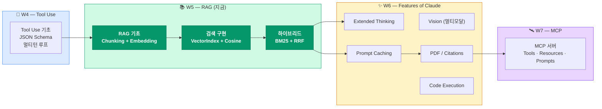

> [!tip] W05 → W06 연결 포인트
> - **Prompt Caching (W06)**: RAG 에서 시스템 프롬프트와 대용량 컨텍스트를 반복 전송하면 비용이 급증한다 → W06 의 prompt caching 으로 상당 부분 절감 가능.
> - **PDF / Citations (W06)**: 건축공학 영역에서 RAG 대상은 대부분 PDF (설계기준, 보고서) — W06 에서 PDF 입력 처리와 citation 반환을 연결하면 "근거 기반" 응답이 완성된다.
> - **Extended Thinking (W06)**: 하이브리드 검색 결과가 상충할 때 (예: Vector 와 BM25 가 완전히 다른 섹션 반환) Extended Thinking 으로 Claude 가 **어떤 증거를 신뢰할지 추론**하게 만들 수 있다.

#### 3줄 핵심 메시지

> [!result] W05 의 3줄 정리
> 1. **RAG 는 "텍스트를 수치로, 질의를 수치로, 거리를 유사도로"** — 청킹 → 임베딩 → VectorIndex → 코사인 검색의 4 단계가 골격이다.
> 2. **의미 검색만으론 부족하다** — `INC-2023-Q4-011` 같은 리터럴 토큰은 BM25 가 훨씬 잘 잡으며, 두 검색은 **경쟁이 아닌 상보** 관계다.
> 3. **Retriever + RRF = 확장 가능한 검색 파이프라인** — `SearchIndex` 프로토콜만 맞추면 keyword·graph·domain 인덱스를 무한히 추가할 수 있고, 이 패턴은 W07 MCP·W10 Agent 로 그대로 이어진다.

---

## 💻 실습 과제 — S4 RAG 트랙

> 모든 노트북은 `03-Exercises/Week_05/skilljar/` 에 위치합니다. 이번 주 빌드업은 **7 단계** 로 구성되며, 앞 노트북의 산출물을 뒤 노트북이 이어받는 누적 구조입니다.

### 단계별 빌드업 다이어그램

```mermaid
graph LR
    S1["① S4_01<br/>청킹 전략"] -->|"+임베딩"| S2["② S4_02<br/>Embeddings"]
    S2 -->|"+코사인"| S3["③ S4_03<br/>VectorIndex"]
    S3 -->|"+BM25"| S4["④ S4_04<br/>Lexical Search"]
    S4 -->|"+RRF"| S5["⑤ S4_05<br/>Hybrid RAG"]
    S5 -->|"자율 구현"| S6["⑥ S4_06<br/>Practice"]
    S6 -->|"도메인 응용"| S7["⑦ S4_07<br/>Structural RAG"]

    style S1 fill:#3498db,stroke:#2980b9,color:#fff
    style S2 fill:#9b59b6,stroke:#8e44ad,color:#fff
    style S3 fill:#e67e22,stroke:#d35400,color:#fff
    style S4 fill:#f39c12,stroke:#d68910,color:#fff
    style S5 fill:#2ecc71,stroke:#27ae60,color:#fff
    style S6 fill:#95a5a6,stroke:#7f8c8d,color:#fff
    style S7 fill:#e74c3c,stroke:#c0392b,color:#fff
```

### 노트북 상세 표

| 노트북                          | 목표                                                                          | 주요 함수 / 클래스                                              |  의존 레슨   |
| :--------------------------- | :-------------------------------------------------------------------------- | :------------------------------------------------------- | :------: |
| `S4_01_chunking.ipynb`       | 청킹 전략 실험 (문자 / 섹션 / 문장)                                                     | `chunk_by_char`, `chunk_by_section`, `chunk_by_sentence` |   L02    |
| `S4_02_embeddings.ipynb`     | 임베딩 생성 + 유사도 계산                                                             | `generate_embedding`, `cosine_similarity`                |   L03    |
| `S4_03_vector_search.ipynb`  | VectorIndex 구축 + 코사인 검색                                                     | `VectorIndex`, `add_vector`, `search`                    | L04, L05 |
| `S4_04_bm25.ipynb`           | BM25 어휘 검색 구현                                                               | `BM25Index`, `tokenize`, `score`                         |   L06    |
| `S4_05_hybrid_rag.ipynb`     | Retriever + RRF 병합                                                          | `Retriever`, `reciprocal_rank_fusion`, `SearchIndex`     |   L07    |
| `S4_06_rag_practice.ipynb`   | 학생 자율 실습 템플릿 (빈 템플릿)                                                        | — (전 단계 요소 자유 조합)                                        |    통합    |
| `S4_07_structural_rag.ipynb` | **건축공학 도메인 응용** — 구조 설계 기준·설계 보고서 RAG (KDS·설계 기준 조문 검색, design basis memos) | 도메인 청킹 헬퍼, 구조 용어 사전 어휘 인덱스                               |    통합    |

> [!method] 수업 시간 실습 순서 — 제안 (2 시간)
> 1. **0:00~0:15** — `S4_01` 청킹 전략 비교 (3 가지 방식으로 같은 문서를 쪼개 결과를 눈으로 확인).
> 2. **0:15~0:35** — `S4_02` 임베딩 생성 후 코사인 유사도 계산, 토이 데이터에서 직관 확인.
> 3. **0:35~0:55** — `S4_03` VectorIndex 완성, 첫 RAG 응답 생성 (Claude 호출까지).
> 4. **0:55~1:15** — `S4_04` BM25 에서 `INC-2023-Q4-011` 예제 재현 → L06 결과 이미지와 일치 확인.
> 5. **1:15~1:40** — `S4_05` Retriever + RRF 완성, k_rrf 값 변경 실험.
> 6. **1:40~2:00** — `S4_06` 학생 자율 실습 또는 `S4_07` 도메인 응용 중 택일로 확장.

> [!action] 제출 안내
> **제출 기한**: 차주 수업 전날 23:59 까지 (예: 다음 수업이 5/XX 이면 그 전날).
> **제출물**: `S4_05_hybrid_rag.ipynb` **필수** 완료본 + `S4_06_rag_practice.ipynb` **중 하나 이상**의 자율 확장 버전.
> **제출 방식**: 강의 Notion 또는 Google Classroom 지정 폴더에 업로드 (파일명에 학번·이름 포함).
> **평가 관점**: (1) L07 예제 수치 (0.833 / 0.75 / 0.583) 재현 여부, (2) k_rrf 변경 실험 기록, (3) 자율 확장의 창의성.

> [!ref] 소스
> - 노트북 전체: `03-Exercises/Week_05/skilljar/`
> - 전사본 기준 데이터셋: Skilljar S4 L05-L07 공용 문서셋
> - GitHub: [anthropics/courses — RAG](https://github.com/anthropics/courses)

---

## 🤖 CC 스킬 — Claude Code Skills & Commands

이번 주 Claude Code 트랙은 **Skills & Commands** 개념이다. 지난 W04 의 "검증 루프" 가 **한 번의 작업 흐름**을 다뤘다면, 이번엔 반복적으로 쓰이는 흐름 자체를 **재사용 가능한 Skill 로 패키징**하는 법을 배운다.

### 핵심 개념

> [!finding] Skills vs Commands
> - **Skill** (Agent Skill): Claude Code 가 **자동으로 인식·호출**하는 재사용 지식 + 스크립트 묶음. YAML frontmatter + Markdown + 필요 시 보조 스크립트 구조. Claude 가 "이 상황이면 이 스킬을 쓴다"고 **스스로 판단** 한다.
> - **Command** (Slash Command): 사용자가 `/command-name` 으로 **명시적으로 호출**하는 프롬프트 템플릿. `.claude/commands/` 디렉토리 내 `.md` 파일로 저장.
> - **관계**: Skill 은 "상황 → 행동" 매핑, Command 는 "키워드 → 액션" 매핑. 대부분의 실무 워크플로는 **Command 로 시작해 Skill 로 진화**한다.

### 이번 주 CC 과제 — "RAG 도우미 Skill" 제작

> [!action] 실습 과제 — 자신만의 RAG 도우미 Skill 만들기
> 1. `.claude/skills/rag-helper/SKILL.md` 파일을 생성한다.
> 2. YAML frontmatter 로 skill 메타데이터를 정의한다:
>    - `name: rag-helper`
>    - `description`: "RAG 파이프라인 코드 작성·디버깅 시 활성화. 청킹·임베딩·VectorIndex·BM25·Retriever 패턴을 인지하고, 하이브리드 검색 구조를 제안한다."
> 3. 본문에 (1) 이번 주 배운 `VectorIndex` · `BM25Index` · `Retriever` 표준 시그니처, (2) RRF 공식 및 k_rrf 권장값, (3) 일반적인 실수 (스코어 직접 평균, rank 1 기반 인덱스 하나에만 의존 등) 를 기술한다.
> 4. Claude Code 에서 `"RAG pipeline 설계해줘"` 또는 `"하이브리드 검색 코드 작성해줘"` 와 같은 질의를 던져 스킬이 자동 활성화되는지 검증한다.
> 5. 같은 내용을 `/rag-scaffold` Slash Command 로도 만들어 명시적 호출까지 제공한다 — `.claude/commands/rag-scaffold.md`.

### 보조 노트 연결

> [!tip] 심화 학습
> **[[Week_05_AgentSkills]]** (IAS — Introduction to Agent Skills) 보조 노트에 이번 CC 트랙의 심화 내용이 담겨 있다.
> - Skill 발견 (discovery) 메커니즘과 우선순위 결정 로직
> - `allowed_tools` 를 활용한 권한 제한
> - 프로젝트 스킬 (`.claude/skills/`) vs 전역 스킬 (`~/.claude/skills/`) 전략
> - Anthropic 공식 example-skills 리포지토리 패턴 분석
>
> 모드: **② 자율 심화** — 프로젝트 심화를 원하는 학생은 수업 후 1 주 이내 완독 권장.

### CC 스킬 설계 팁

> [!method] Skill 작성 Best Practice
> 1. **description 은 1-2 문장으로 명확하게** — Claude 가 이 문장을 읽고 활성화 여부를 결정한다.
> 2. **Do / Don't 체크리스트** 형태로 본문 구성 — 모호한 산문보다 대조 리스트가 훨씬 효과적.
> 3. **예시 코드 스니펫** 포함 — 이번 주 `VectorIndex` / `BM25Index` / `Retriever` 표준 시그니처를 그대로 복사해 두면 Claude 가 한 번에 일관된 코드를 생성한다.
> 4. **관련 Skill 끼리 cross-link** — `rag-helper` 에서 `tool-use-helper` (W04 CC 스킬) 를 참조하도록 링크하면 Tool Use + RAG 복합 작업에 유리.

---

## 📚 참고 자료

> [!ref] Skilljar 공식 자료
> - 코스 홈: [Building with the Claude API — Skilljar](https://anthropic.skilljar.com/claude-with-the-anthropic-api)
> - 섹션 S4 (RAG and Agentic Search): L01-L07 본 강의의 주된 출처

> [!ref] Anthropic 공식 문서
> - [Build with Claude — Overview](https://docs.anthropic.com/en/docs/build-with-claude)
> - [Prompt Caching Guide](https://docs.anthropic.com/en/docs/build-with-claude/prompt-caching) (W06 선행 학습용)
> - [Contextual Retrieval — Anthropic 블로그](https://www.anthropic.com/news/contextual-retrieval)

> [!ref] 구현 예제 리포지토리
> - [anthropics/courses — RAG 튜토리얼](https://github.com/anthropics/courses)
> - [anthropic-cookbook — Skilljar RAG 노트북](https://github.com/anthropics/anthropic-cookbook)

> [!ref] 임베딩 · 검색 엔진
> - [VoyageAI 공식 문서](https://docs.voyageai.com) — `voyage-3`, `voyage-3-large` 모델 및 API.
> - [VoyageAI 임베딩 모델 비교](https://docs.voyageai.com/docs/embeddings) — 차원 · 비용 · 한국어 지원.
> - [ChromaDB 공식 문서](https://docs.trychroma.com) (optional) — 프로덕션 벡터 저장소로 확장할 때 참고.

> [!ref] BM25 · RRF 학술 자료
> - [BM25 — Wikipedia (Okapi BM25)](https://en.wikipedia.org/wiki/Okapi_BM25) — 공식, IDF 가중치 유도 포함.
> - Robertson, S. and Zaragoza, H. (2009), "The Probabilistic Relevance Framework: BM25 and Beyond", Foundations and Trends in Information Retrieval.
> - Cormack, G.V., Clarke, C.L.A. and Büttcher, S. (2009), "Reciprocal Rank Fusion outperforms Condorcet and individual Rank Learning Methods", SIGIR 2009.

> [!ref] RAG 학술 논문
> - Lewis, P. et al. (2020), "Retrieval-Augmented Generation for Knowledge-Intensive NLP Tasks", NeurIPS 2020, arXiv:2005.11401.
> - Gao, Y. et al. (2023), "Retrieval-Augmented Generation for Large Language Models: A Survey", arXiv:2312.10997.
> - Anthropic (2024), "Introducing Contextual Retrieval" — 청크 단위 컨텍스트 증강 기법 소개.

---

## Related

- 이전: [[Week_04|4주차: Tool Use (S3)]] — Claude 가 외부 함수를 호출하는 법
- 다음: [[Week_06|6주차: Features of Claude — Extended Thinking · Vision · Caching (S5)]] — RAG 위에 쌓을 고급 기능들
- 보조 (심화): [[Week_05_AgentSkills|Introduction to Agent Skills]] — Claude Code 의 Skills 심화 (② 자율 심화 모드)
- 다음 주 선수 (CC): [[Week_06_IntroMCP|Introduction to MCP]] — W07 선수학습용 (① Pre-read 모드)
- 실라버스: [[00-Syllabus/LLM_AE_AI_Implementation_Syllabus_v2.3|LLM-AE-AI Syllabus v2.3]]
