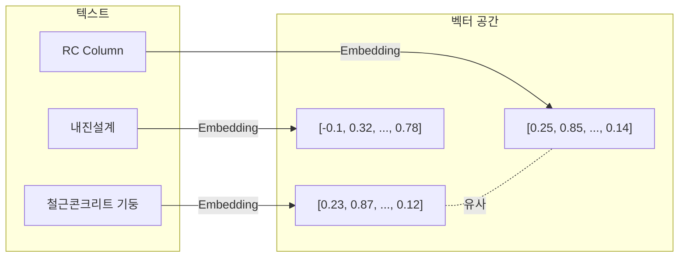
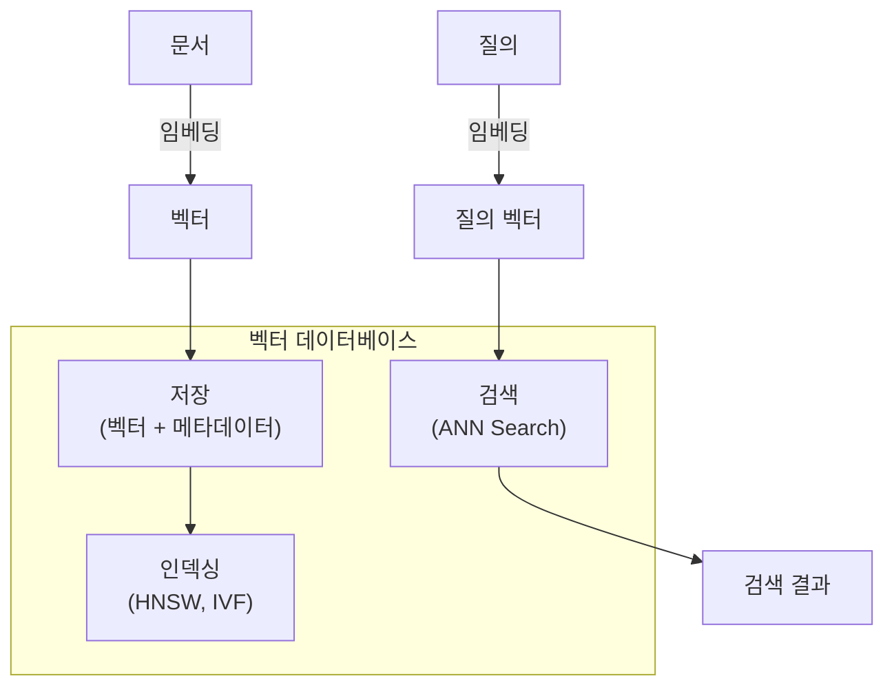
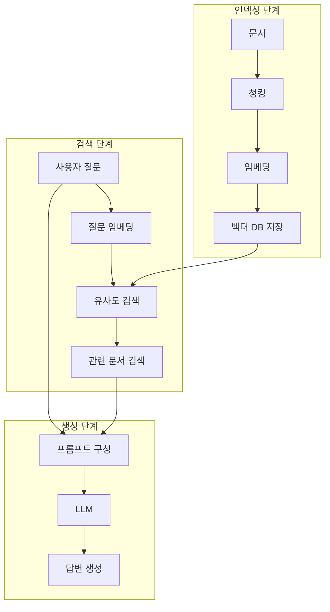

# 5주차: RAG 기초 - 임베딩과 벡터 검색

---

## 📌 강의 중점

- **임베딩(Embedding)** 개념과 텍스트의 벡터 표현
- **벡터 데이터베이스** (ChromaDB, FAISS) 활용
- **유사도 검색**과 Retrieval 파이프라인
- **기본 RAG 시스템** 구현

---

## 🎯 학습 목표

학습 완료 후 다음을 수행할 수 있습니다:

- 텍스트 임베딩의 원리를 이해하고 생성할 수 있다
- 벡터 데이터베이스에 문서를 저장하고 검색할 수 있다
- 간단한 RAG 시스템을 구축할 수 있다
- 검색 품질을 평가하고 개선할 수 있다

---

## [Chapter 1] 임베딩 이해하기

### 1.1 임베딩이란?



**핵심 개념**:
- **임베딩**: 텍스트를 고차원 벡터로 변환
- **의미 유사성**: 유사한 의미 → 가까운 벡터
- **차원**: 일반적으로 256 ~ 3072 차원

### 1.2 임베딩 모델 비교

| 모델 | 제공사 | 차원 | 특징 |
|------|--------|------|------|
| **text-embedding-3-large** | OpenAI | 3072 | 최고 성능, 유료 |
| **text-embedding-3-small** | OpenAI | 1536 | 균형 잡힌 성능 |
| **voyage-large-2** | Voyage AI | 1536 | 검색 최적화 |
| **bge-large-en-v1.5** | BAAI | 1024 | 오픈소스 |
| **all-MiniLM-L6-v2** | Sentence-Transformers | 384 | 경량, 무료 |

### 1.3 임베딩 생성 - OpenAI

```python
from openai import OpenAI

client = OpenAI()


def get_embedding(text: str, model: str = "text-embedding-3-small") -> list[float]:
    """OpenAI 임베딩 생성"""
    text = text.replace("\n", " ").strip()

    response = client.embeddings.create(
        input=[text],
        model=model
    )

    return response.data[0].embedding


# 사용 예시
text = "철근콘크리트 기둥의 내진설계 기준"
embedding = get_embedding(text)
print(f"차원: {len(embedding)}")  # 1536
print(f"벡터 일부: {embedding[:5]}")
```

### 1.4 임베딩 생성 - 로컬 모델

```python
from sentence_transformers import SentenceTransformer

# 모델 로드 (첫 실행 시 다운로드)
model = SentenceTransformer("all-MiniLM-L6-v2")


def get_local_embedding(texts: list[str]) -> list[list[float]]:
    """로컬 임베딩 생성 (배치 처리)"""
    embeddings = model.encode(texts, convert_to_tensor=False)
    return embeddings.tolist()


# 사용 예시
texts = [
    "철근콘크리트 기둥",
    "RC column",
    "내진설계 기준"
]

embeddings = get_local_embedding(texts)
print(f"문서 수: {len(embeddings)}")
print(f"차원: {len(embeddings[0])}")  # 384
```

### 1.5 유사도 계산

```python
import numpy as np


def cosine_similarity(vec1: list[float], vec2: list[float]) -> float:
    """코사인 유사도 계산"""
    v1 = np.array(vec1)
    v2 = np.array(vec2)

    dot_product = np.dot(v1, v2)
    norm1 = np.linalg.norm(v1)
    norm2 = np.linalg.norm(v2)

    return dot_product / (norm1 * norm2)


# 유사도 테스트
texts = [
    "철근콘크리트 기둥 설계",
    "RC column design",
    "오늘 날씨가 좋습니다"
]

embeddings = [get_embedding(t) for t in texts]

# 유사도 행렬
for i, t1 in enumerate(texts):
    for j, t2 in enumerate(texts):
        sim = cosine_similarity(embeddings[i], embeddings[j])
        print(f"'{t1[:15]}...' vs '{t2[:15]}...': {sim:.4f}")
```

### 📚 참고 자료

- [OpenAI Embeddings Guide](https://platform.openai.com/docs/guides/embeddings)
- [Sentence-Transformers](https://www.sbert.net/)
- [MTEB Leaderboard](https://huggingface.co/spaces/mteb/leaderboard)

---

## [Chapter 2] 벡터 데이터베이스

### 2.1 벡터 DB 개요



### 2.2 주요 벡터 DB 비교

| DB | 특징 | 용도 |
|----|------|------|
| **ChromaDB** | 간단, 로컬/임베디드 | 프로토타입, 소규모 |
| **FAISS** | 고성능, Meta 개발 | 대규모 검색 |
| **Pinecone** | 클라우드 관리형 | 프로덕션 |
| **Weaviate** | GraphQL, 하이브리드 | 복합 검색 |
| **Qdrant** | Rust 기반, 고성능 | 프로덕션 |

### 2.3 ChromaDB 기본 사용

```python
import chromadb
from chromadb.utils import embedding_functions

# 클라이언트 생성
client = chromadb.Client()  # 메모리 모드
# client = chromadb.PersistentClient(path="./chroma_db")  # 영구 저장

# 임베딩 함수 설정
openai_ef = embedding_functions.OpenAIEmbeddingFunction(
    model_name="text-embedding-3-small"
)

# 컬렉션 생성
collection = client.create_collection(
    name="building_codes",
    embedding_function=openai_ef,
    metadata={"description": "건축 법규 문서"}
)

# 문서 추가
documents = [
    "건축물의 내진설계는 KDS 41 17 00에 따른다.",
    "철근콘크리트 구조의 설계기준강도는 21MPa 이상으로 한다.",
    "기둥의 최소 단면 치수는 300mm 이상으로 한다.",
    "내진등급 특등급 건축물은 지진격리장치를 적용할 수 있다."
]

ids = [f"doc_{i}" for i in range(len(documents))]

metadatas = [
    {"source": "KDS 41 17 00", "category": "내진"},
    {"source": "KDS 14 20 10", "category": "콘크리트"},
    {"source": "KDS 14 20 50", "category": "기둥"},
    {"source": "KDS 41 17 00", "category": "내진"}
]

collection.add(
    documents=documents,
    ids=ids,
    metadatas=metadatas
)

print(f"문서 수: {collection.count()}")
```

### 2.4 ChromaDB 검색

```python
# 유사도 검색
results = collection.query(
    query_texts=["내진설계 기준은 무엇인가요?"],
    n_results=3
)

print("검색 결과:")
for i, (doc, meta, dist) in enumerate(zip(
    results["documents"][0],
    results["metadatas"][0],
    results["distances"][0]
)):
    print(f"\n{i+1}. 유사도: {1-dist:.4f}")
    print(f"   문서: {doc}")
    print(f"   출처: {meta['source']}")


# 메타데이터 필터링
results_filtered = collection.query(
    query_texts=["설계 기준"],
    n_results=3,
    where={"category": "내진"}  # 내진 관련 문서만
)


# 복합 필터
results_complex = collection.query(
    query_texts=["기둥 설계"],
    n_results=5,
    where={
        "$and": [
            {"category": {"$in": ["기둥", "콘크리트"]}},
            {"source": {"$ne": "KDS 41 17 00"}}
        ]
    }
)
```

### 2.5 FAISS 사용법

```python
import faiss
import numpy as np
from sentence_transformers import SentenceTransformer

# 임베딩 모델
model = SentenceTransformer("all-MiniLM-L6-v2")

# 문서와 임베딩 생성
documents = [
    "철근콘크리트 기둥의 최소 철근비는 0.01 이상이다.",
    "보의 유효깊이는 전체 깊이의 0.9배로 가정한다.",
    "내진설계 시 응답수정계수 R을 적용한다.",
    "건축물의 층간변위는 층고의 1/200 이내로 제한한다."
]

# 임베딩 생성
embeddings = model.encode(documents)
embeddings = np.array(embeddings).astype('float32')

# FAISS 인덱스 생성
dimension = embeddings.shape[1]  # 384
index = faiss.IndexFlatL2(dimension)  # L2 거리 사용

# 벡터 추가
index.add(embeddings)
print(f"인덱스 벡터 수: {index.ntotal}")

# 검색
query = "기둥 설계 기준"
query_embedding = model.encode([query]).astype('float32')

k = 2  # 상위 k개 검색
distances, indices = index.search(query_embedding, k)

print(f"\n질의: {query}")
for i, (dist, idx) in enumerate(zip(distances[0], indices[0])):
    print(f"{i+1}. 거리: {dist:.4f}")
    print(f"   문서: {documents[idx]}")
```

### 📚 참고 자료

- [ChromaDB Documentation](https://docs.trychroma.com/)
- [FAISS GitHub](https://github.com/facebookresearch/faiss)
- [Pinecone Documentation](https://docs.pinecone.io/)

---

## [Chapter 3] RAG 파이프라인

### 3.1 RAG 아키텍처



### 3.2 문서 청킹 전략

```python
from langchain.text_splitter import (
    CharacterTextSplitter,
    RecursiveCharacterTextSplitter,
    TokenTextSplitter
)


def chunk_by_character(text: str, chunk_size: int = 500, overlap: int = 50) -> list[str]:
    """문자 수 기반 청킹"""
    splitter = CharacterTextSplitter(
        separator="\n",
        chunk_size=chunk_size,
        chunk_overlap=overlap
    )
    return splitter.split_text(text)


def chunk_recursive(text: str, chunk_size: int = 500, overlap: int = 50) -> list[str]:
    """재귀적 청킹 (권장)"""
    splitter = RecursiveCharacterTextSplitter(
        separators=["\n\n", "\n", ".", " "],
        chunk_size=chunk_size,
        chunk_overlap=overlap
    )
    return splitter.split_text(text)


def chunk_by_token(text: str, chunk_size: int = 200, overlap: int = 20) -> list[str]:
    """토큰 기반 청킹"""
    splitter = TokenTextSplitter(
        chunk_size=chunk_size,
        chunk_overlap=overlap
    )
    return splitter.split_text(text)


# 건축 법규 문서 예시
building_code = """
제5조(내진설계 대상) ① 다음 각 호의 건축물은 내진설계를 하여야 한다.
1. 층수가 3층 이상인 건축물
2. 연면적이 1,000제곱미터 이상인 건축물
3. 높이가 13미터 이상인 건축물
4. 처마높이가 9미터 이상인 건축물
5. 기둥과 기둥 사이의 거리가 10미터 이상인 건축물

② 제1항에도 불구하고 다음 각 호의 건축물은 내진설계 대상에서 제외한다.
1. 가설건축물
2. 연면적 200제곱미터 미만의 창고
"""

chunks = chunk_recursive(building_code, chunk_size=200, overlap=30)
for i, chunk in enumerate(chunks):
    print(f"Chunk {i+1} ({len(chunk)}자):\n{chunk}\n")
```

### 3.3 기본 RAG 구현

```python
import chromadb
from chromadb.utils import embedding_functions
import anthropic


class SimpleRAG:
    """간단한 RAG 시스템"""

    def __init__(self, collection_name: str = "documents"):
        # ChromaDB 설정
        self.client = chromadb.PersistentClient(path="./rag_db")
        self.embedding_fn = embedding_functions.OpenAIEmbeddingFunction(
            model_name="text-embedding-3-small"
        )

        # 컬렉션 생성 또는 로드
        self.collection = self.client.get_or_create_collection(
            name=collection_name,
            embedding_function=self.embedding_fn
        )

        # LLM 클라이언트
        self.llm = anthropic.Anthropic()

    def add_documents(self, documents: list[str], metadatas: list[dict] = None):
        """문서 추가"""
        ids = [f"doc_{self.collection.count() + i}" for i in range(len(documents))]

        if metadatas is None:
            metadatas = [{"source": "unknown"} for _ in documents]

        self.collection.add(
            documents=documents,
            ids=ids,
            metadatas=metadatas
        )
        print(f"{len(documents)}개 문서 추가됨. 총 {self.collection.count()}개")

    def search(self, query: str, n_results: int = 3) -> list[dict]:
        """유사 문서 검색"""
        results = self.collection.query(
            query_texts=[query],
            n_results=n_results
        )

        documents = []
        for doc, meta, dist in zip(
            results["documents"][0],
            results["metadatas"][0],
            results["distances"][0]
        ):
            documents.append({
                "content": doc,
                "metadata": meta,
                "score": 1 - dist  # 유사도로 변환
            })

        return documents

    def generate_answer(self, query: str, context_docs: list[dict]) -> str:
        """LLM으로 답변 생성"""
        # 컨텍스트 구성
        context = "\n\n---\n\n".join([
            f"[출처: {doc['metadata'].get('source', 'unknown')}]\n{doc['content']}"
            for doc in context_docs
        ])

        prompt = f"""다음 참고 자료를 기반으로 질문에 답변해 주세요.

## 참고 자료
{context}

## 질문
{query}

## 답변 지침
- 참고 자료에 있는 내용을 기반으로 답변하세요.
- 참고 자료에 없는 내용은 "제공된 자료에는 해당 정보가 없습니다"라고 답변하세요.
- 출처를 명시해 주세요.
"""

        response = self.llm.messages.create(
            model="claude-3-5-sonnet-20241022",
            max_tokens=2048,
            system="당신은 건축구조 전문가입니다. 정확한 정보만 제공합니다.",
            messages=[{"role": "user", "content": prompt}]
        )

        return response.content[0].text

    def query(self, question: str, n_results: int = 3) -> dict:
        """RAG 질의 (검색 + 생성)"""
        # 1. 검색
        docs = self.search(question, n_results)

        # 2. 생성
        answer = self.generate_answer(question, docs)

        return {
            "question": question,
            "answer": answer,
            "sources": docs
        }


# 사용 예시
rag = SimpleRAG("building_codes")

# 문서 추가
docs = [
    "철근콘크리트 기둥의 최소 단면 치수는 300mm × 300mm 이상이어야 한다.",
    "기둥의 주근 최소 개수는 4개 이상, 원형 기둥은 6개 이상이다.",
    "기둥의 띠철근 간격은 기둥 최소 치수, 주근 직경의 16배, 띠철근 직경의 48배 중 최소값 이하로 한다.",
    "내진설계 시 기둥-보 접합부의 전단강도는 충분히 확보해야 한다."
]

metadatas = [
    {"source": "KDS 14 20 50", "section": "4.1"},
    {"source": "KDS 14 20 50", "section": "4.2"},
    {"source": "KDS 14 20 50", "section": "4.3"},
    {"source": "KDS 41 31 00", "section": "7.2"}
]

rag.add_documents(docs, metadatas)

# 질의
result = rag.query("기둥 설계 시 철근 배치 기준은?")
print(f"답변:\n{result['answer']}")
```

### 3.4 RAG 프롬프트 최적화

```python
# 구조화된 RAG 프롬프트
RAG_PROMPT_TEMPLATE = """당신은 건축구조설계기준(KDS) 전문가입니다.

## 역할
- 제공된 참고 자료를 기반으로 정확한 답변 제공
- 불확실한 경우 "확인 필요" 명시
- 출처 명시 필수

## 참고 자료
{context}

## 질문
{question}

## 답변 형식
1. **핵심 답변**: 질문에 대한 직접적인 답변
2. **근거**: 참고 자료 인용
3. **주의사항**: 추가 확인이 필요한 사항 (있는 경우)
4. **출처**: 참고한 문서 목록

답변을 시작하세요:
"""


def create_rag_prompt(question: str, documents: list[dict]) -> str:
    """RAG 프롬프트 생성"""
    context_parts = []
    for i, doc in enumerate(documents, 1):
        source = doc['metadata'].get('source', 'unknown')
        section = doc['metadata'].get('section', '')
        content = doc['content']

        context_parts.append(f"[자료 {i}] {source} {section}\n{content}")

    context = "\n\n".join(context_parts)

    return RAG_PROMPT_TEMPLATE.format(
        context=context,
        question=question
    )
```

### 📚 참고 자료

- [LangChain RAG Tutorial](https://python.langchain.com/docs/tutorials/rag/)
- [RAG Best Practices](https://www.pinecone.io/learn/retrieval-augmented-generation/)
- [Anthropic RAG Guide](https://docs.anthropic.com/claude/docs/retrieval-augmented-generation)

---

## [Chapter 4] 검색 품질 개선

### 4.1 검색 평가 지표

```python
def calculate_precision_at_k(relevant_docs: list[str], retrieved_docs: list[str], k: int) -> float:
    """Precision@K 계산"""
    retrieved_k = retrieved_docs[:k]
    relevant_retrieved = len(set(relevant_docs) & set(retrieved_k))
    return relevant_retrieved / k if k > 0 else 0


def calculate_recall_at_k(relevant_docs: list[str], retrieved_docs: list[str], k: int) -> float:
    """Recall@K 계산"""
    retrieved_k = retrieved_docs[:k]
    relevant_retrieved = len(set(relevant_docs) & set(retrieved_k))
    return relevant_retrieved / len(relevant_docs) if relevant_docs else 0


def calculate_mrr(relevant_docs: list[str], retrieved_docs: list[str]) -> float:
    """MRR (Mean Reciprocal Rank) 계산"""
    for i, doc in enumerate(retrieved_docs, 1):
        if doc in relevant_docs:
            return 1 / i
    return 0


# 평가 예시
relevant = ["doc_1", "doc_3", "doc_5"]
retrieved = ["doc_1", "doc_2", "doc_3", "doc_4", "doc_5"]

print(f"Precision@3: {calculate_precision_at_k(relevant, retrieved, 3):.2f}")
print(f"Recall@3: {calculate_recall_at_k(relevant, retrieved, 3):.2f}")
print(f"MRR: {calculate_mrr(relevant, retrieved):.2f}")
```

### 4.2 쿼리 확장

```python
def expand_query(query: str, client: anthropic.Anthropic) -> list[str]:
    """쿼리 확장 - 유사 질문 생성"""
    prompt = f"""다음 질문과 의미가 유사한 질문 3개를 생성해 주세요.
건축/구조 도메인 관련 용어를 사용하세요.

원본 질문: {query}

형식:
1. [질문1]
2. [질문2]
3. [질문3]
"""

    response = client.messages.create(
        model="claude-3-5-sonnet-20241022",
        max_tokens=500,
        messages=[{"role": "user", "content": prompt}]
    )

    # 응답 파싱
    lines = response.content[0].text.strip().split("\n")
    expanded = [query]  # 원본 포함
    for line in lines:
        if line.strip().startswith(("1.", "2.", "3.")):
            q = line.split(".", 1)[1].strip()
            expanded.append(q)

    return expanded


def search_with_query_expansion(
    rag: SimpleRAG,
    query: str,
    n_results: int = 5
) -> list[dict]:
    """쿼리 확장을 적용한 검색"""
    client = anthropic.Anthropic()
    expanded_queries = expand_query(query, client)

    all_results = []
    seen_docs = set()

    for q in expanded_queries:
        results = rag.search(q, n_results=3)
        for doc in results:
            doc_hash = hash(doc['content'])
            if doc_hash not in seen_docs:
                seen_docs.add(doc_hash)
                all_results.append(doc)

    # 점수 기준 정렬
    all_results.sort(key=lambda x: x['score'], reverse=True)

    return all_results[:n_results]
```

### 4.3 Re-ranking

```python
def rerank_with_llm(
    query: str,
    documents: list[dict],
    client: anthropic.Anthropic,
    top_k: int = 3
) -> list[dict]:
    """LLM을 사용한 문서 재순위화"""
    doc_list = "\n".join([
        f"{i+1}. {doc['content'][:200]}..."
        for i, doc in enumerate(documents)
    ])

    prompt = f"""다음 질문과 가장 관련 있는 문서 번호를 관련도 순으로 나열해 주세요.

질문: {query}

문서 목록:
{doc_list}

관련도 높은 순서대로 문서 번호만 출력하세요 (예: 3, 1, 5, 2, 4):
"""

    response = client.messages.create(
        model="claude-3-5-sonnet-20241022",
        max_tokens=100,
        messages=[{"role": "user", "content": prompt}]
    )

    # 순서 파싱
    order_text = response.content[0].text.strip()
    try:
        indices = [int(x.strip()) - 1 for x in order_text.split(",")]
        reranked = [documents[i] for i in indices if i < len(documents)]
        return reranked[:top_k]
    except:
        return documents[:top_k]
```

### 📚 참고 자료

- [BEIR Benchmark](https://github.com/beir-cellar/beir)
- [Cohere Rerank](https://docs.cohere.com/docs/rerank-2)
- [RAG Evaluation](https://www.trulens.org/)

---

## 💻 실습 코드

### 실습 1: 건축 법규 RAG 시스템

```python
# practice/building_code_rag.py
"""건축 법규 RAG 시스템"""

import chromadb
from chromadb.utils import embedding_functions
import anthropic


class BuildingCodeRAG:
    """건축 법규 전용 RAG 시스템"""

    def __init__(self, db_path: str = "./building_code_db"):
        self.client = chromadb.PersistentClient(path=db_path)
        self.ef = embedding_functions.OpenAIEmbeddingFunction(
            model_name="text-embedding-3-small"
        )
        self.collection = self.client.get_or_create_collection(
            name="kds_codes",
            embedding_function=self.ef
        )
        self.llm = anthropic.Anthropic()

    def load_code_document(self, file_path: str, code_id: str):
        """법규 문서 로드 및 청킹"""
        with open(file_path, "r", encoding="utf-8") as f:
            content = f.read()

        # 조문 단위로 분할 (제X조 기준)
        import re
        articles = re.split(r'(제\d+조)', content)

        chunks = []
        metadatas = []

        for i in range(1, len(articles), 2):
            if i + 1 < len(articles):
                article_num = articles[i]
                article_content = articles[i + 1].strip()

                if len(article_content) > 50:  # 최소 길이 필터
                    chunks.append(f"{article_num} {article_content}")
                    metadatas.append({
                        "code_id": code_id,
                        "article": article_num,
                        "type": "법규"
                    })

        # 청크 추가
        if chunks:
            ids = [f"{code_id}_{i}" for i in range(len(chunks))]
            self.collection.add(
                documents=chunks,
                ids=ids,
                metadatas=metadatas
            )
            print(f"{code_id}: {len(chunks)}개 조문 추가됨")

    def search(self, query: str, code_filter: str = None, n_results: int = 5):
        """법규 검색"""
        where_filter = None
        if code_filter:
            where_filter = {"code_id": code_filter}

        results = self.collection.query(
            query_texts=[query],
            n_results=n_results,
            where=where_filter
        )

        return [{
            "content": doc,
            "code_id": meta["code_id"],
            "article": meta["article"],
            "score": 1 - dist
        } for doc, meta, dist in zip(
            results["documents"][0],
            results["metadatas"][0],
            results["distances"][0]
        )]

    def answer(self, question: str, code_filter: str = None) -> dict:
        """질문에 대한 답변 생성"""
        # 검색
        docs = self.search(question, code_filter, n_results=5)

        # 컨텍스트 구성
        context = "\n\n".join([
            f"[{d['code_id']} {d['article']}]\n{d['content']}"
            for d in docs
        ])

        prompt = f"""건축구조기준(KDS)에 대한 질문에 답변해 주세요.

## 참고 법규
{context}

## 질문
{question}

## 답변 형식
- 해당 조문을 인용하여 답변
- 조문 번호 명시
- 해석이 필요한 경우 근거 설명
"""

        response = self.llm.messages.create(
            model="claude-3-5-sonnet-20241022",
            max_tokens=2048,
            system="당신은 건축구조기준(KDS) 전문 해석가입니다.",
            messages=[{"role": "user", "content": prompt}]
        )

        return {
            "question": question,
            "answer": response.content[0].text,
            "sources": docs
        }


# 사용 예시
if __name__ == "__main__":
    rag = BuildingCodeRAG()

    # 샘플 데이터 추가
    sample_docs = [
        "제4조(내진설계 원칙) 건축물의 내진설계는 인명 보호를 최우선으로 한다.",
        "제5조(내진등급) 내진등급은 특등급, 1등급, 2등급으로 구분한다.",
        "제10조(기둥 설계) 기둥의 최소 단면은 300mm×300mm 이상으로 한다.",
    ]

    for i, doc in enumerate(sample_docs):
        rag.collection.add(
            documents=[doc],
            ids=[f"sample_{i}"],
            metadatas=[{"code_id": "KDS 41 17 00", "article": f"제{4+i}조", "type": "법규"}]
        )

    # 질의
    result = rag.answer("내진설계의 기본 원칙은 무엇인가요?")
    print(f"답변:\n{result['answer']}")
```

### 실습 2: 임베딩 시각화

```python
# practice/embedding_visualization.py
"""임베딩 시각화"""

import numpy as np
from sklearn.manifold import TSNE
import matplotlib.pyplot as plt
from sentence_transformers import SentenceTransformer

# 한글 폰트 설정
plt.rcParams['font.family'] = 'AppleGothic'  # macOS
# plt.rcParams['font.family'] = 'Malgun Gothic'  # Windows


def visualize_embeddings(texts: list[str], labels: list[str] = None):
    """임베딩을 2D로 시각화"""
    model = SentenceTransformer("all-MiniLM-L6-v2")
    embeddings = model.encode(texts)

    # t-SNE로 차원 축소
    tsne = TSNE(n_components=2, random_state=42, perplexity=min(5, len(texts)-1))
    embeddings_2d = tsne.fit_transform(embeddings)

    # 시각화
    plt.figure(figsize=(12, 8))

    if labels:
        unique_labels = list(set(labels))
        colors = plt.cm.tab10(np.linspace(0, 1, len(unique_labels)))
        color_map = {label: colors[i] for i, label in enumerate(unique_labels)}

        for i, (x, y) in enumerate(embeddings_2d):
            plt.scatter(x, y, c=[color_map[labels[i]]], s=100)
            plt.annotate(texts[i][:20] + "...", (x, y), fontsize=8)
    else:
        plt.scatter(embeddings_2d[:, 0], embeddings_2d[:, 1], s=100)
        for i, (x, y) in enumerate(embeddings_2d):
            plt.annotate(texts[i][:20] + "...", (x, y), fontsize=8)

    plt.title("텍스트 임베딩 시각화 (t-SNE)")
    plt.xlabel("Dimension 1")
    plt.ylabel("Dimension 2")
    plt.tight_layout()
    plt.savefig("embeddings.png", dpi=150)
    plt.show()


# 테스트
texts = [
    "철근콘크리트 기둥 설계",
    "RC column design",
    "콘크리트 기둥 배근",
    "내진설계 기준",
    "지진하중 산정",
    "구조물 내진 성능",
    "건축법 시행령",
    "건축물 허가 절차",
    "건축 인허가 서류"
]

labels = ["기둥", "기둥", "기둥", "내진", "내진", "내진", "법규", "법규", "법규"]

visualize_embeddings(texts, labels)
```

---

## 📝 과제

### 과제 1: RAG 시스템 구축 (제출)

건축/구조 관련 문서를 활용한 RAG 시스템 구축:

**요구사항**:
1. ChromaDB를 사용한 벡터 저장소
2. 최소 10개 이상의 문서 추가
3. 검색 + 생성 파이프라인 구현
4. 3개 이상의 질문-답변 테스트

**제출물**:
- Python 코드
- 사용한 문서 목록
- 질의 결과 스크린샷

### 과제 2: 검색 품질 비교 (제출)

동일한 질문에 대해 다음을 비교:
1. 단순 키워드 검색
2. 벡터 유사도 검색
3. 쿼리 확장 후 검색

**제출물**:
- 비교 분석 보고서
- 검색 결과 표
- 품질 향상 제안

---

## 🔗 추가 학습 자료

### 공식 문서
- [ChromaDB](https://docs.trychroma.com/)
- [FAISS](https://faiss.ai/)
- [LangChain RAG](https://python.langchain.com/docs/tutorials/rag/)

### 튜토리얼
- [Building RAG Applications](https://www.pinecone.io/learn/series/rag/)
- [Embeddings Guide](https://platform.openai.com/docs/guides/embeddings)

### 영상
- [RAG from Scratch (LangChain)](https://www.youtube.com/watch?v=sVcwVQRHIc8)
- [Vector Databases Explained](https://www.youtube.com/watch?v=klTvEwg3oJ4)

---

## 🚀 발전 전략 (Development Strategies)

### 전략 1: 건축 구조 계산서 RAG 시스템 구축

**목표**: 실무에서 사용되는 구조계산서를 학습 데이터로 활용한 전문 RAG 시스템 개발

**실습 단계**:
1. **데이터 수집**: 기둥, 보, 슬래브, 기초 등 각 부재별 구조계산서 예제 수집 (최소 50개 청크)
2. **청킹 전략**: 계산 단계별로 분할 (설계조건 → 하중산정 → 단면설계 → 철근상세)
3. **메타데이터 설계**: `{"부재유형": "기둥", "설계기준": "KDS", "재료": "콘크리트", "계산단계": "단면설계"}`
4. **특화 검색**: 부재별, 계산단계별 필터링 검색 구현
5. **실무 검증**: 실제 설계 질문 10개로 답변 정확도 테스트

**건축공학 적용 예시**:
```python
# 구조계산 특화 RAG
query = "지진하중을 받는 철근콘크리트 기둥의 전단철근 간격 산정 방법"
filter_condition = {
    "$and": [
        {"부재유형": "기둥"},
        {"하중조건": {"$in": ["지진", "내진"]}},
        {"계산단계": "철근상세"}
    ]
}
```

**예상 성과**: 구조설계 실무에서 반복적인 계산 질문에 대한 즉각적인 참조 자료 제공, 설계 시간 30% 단축

---

### 전략 2: 하이브리드 검색 시스템 구현

**목표**: 키워드 검색과 의미 검색을 결합한 정확도 향상 시스템

**실습 단계**:
1. **BM25 키워드 검색 구현**: 전문 용어 정확 매칭 (예: "KDS 14 20 50", "철근비 0.01")
2. **벡터 유사도 검색**: 의미적 유사성 검색 (예: "기둥 배근" ≈ "column reinforcement")
3. **점수 가중치 조정**: `final_score = 0.4 * bm25_score + 0.6 * vector_score`
4. **A/B 테스트**: 20개 질문으로 단독 검색 vs 하이브리드 검색 정확도 비교
5. **최적화**: 도메인별 가중치 자동 조정 메커니즘 구현

**코드 예시**:
```python
from rank_bm25 import BM25Okapi

def hybrid_search(query: str, top_k: int = 5):
    # BM25 검색
    bm25_scores = bm25.get_scores(query.split())

    # 벡터 검색
    vector_results = collection.query(query_texts=[query], n_results=top_k*2)

    # 점수 정규화 및 결합
    combined_results = merge_and_rerank(bm25_scores, vector_results)
    return combined_results[:top_k]
```

**예상 성과**: 전문 용어 정확 매칭 + 의미 유사성 검색으로 Precision@5가 평균 25% 향상

---

### 전략 3: 청킹 전략 최적화 실험

**목표**: 건축 문서 특성에 맞는 최적 청킹 방법 발견

**실습 단계**:
1. **청킹 방법 4가지 구현**:
   - 고정 크기 (500자, 1000자)
   - 문장 기반 (3문장, 5문장)
   - 단락 기반 (의미 단위)
   - 계층 구조 기반 (조항 → 항 → 호)
2. **오버랩 실험**: 0%, 10%, 20%, 30% 오버랩 비교
3. **검색 품질 측정**: 각 방법별 Precision@3, Recall@5, MRR 계산
4. **컨텍스트 완전성 평가**: LLM이 생성한 답변의 완전성 점수화
5. **최적 파라미터 도출**: 건축 법규/계산서별 최적 청킹 전략 문서화

**측정 코드**:
```python
def evaluate_chunking_strategy(texts, queries, ground_truth):
    results = {}
    for strategy in ["fixed_500", "sentence_3", "paragraph", "hierarchical"]:
        chunks = apply_chunking(texts, strategy)
        precision = calculate_precision(chunks, queries, ground_truth)
        recall = calculate_recall(chunks, queries, ground_truth)
        results[strategy] = {"precision": precision, "recall": recall}
    return results
```

**예상 성과**: 도메인 특화 청킹 전략으로 검색 품질 15-20% 향상, 토큰 사용량 10-15% 절감

---

### 전략 4: 멀티모달 RAG - 도면 및 표 통합

**목표**: 텍스트뿐만 아니라 구조 도면, 표, 다이어그램을 함께 검색하는 시스템

**실습 단계**:
1. **이미지 임베딩**: CLIP 모델을 사용한 구조 도면 벡터화
2. **표 추출**: PDF에서 표 데이터 추출 및 구조화 (tabula-py 사용)
3. **멀티모달 인덱싱**: 텍스트, 이미지, 표를 별도 컬렉션으로 관리하되 메타데이터로 연결
4. **통합 검색**: 질문에 따라 적절한 모달리티 자동 선택
5. **시각적 답변 생성**: 검색된 도면/표를 답변과 함께 제시

**구현 예시**:
```python
# 멀티모달 컬렉션
text_collection = client.create_collection("text_docs")
image_collection = client.create_collection("drawings")
table_collection = client.create_collection("tables")

# 통합 검색
def multimodal_search(query: str):
    if "도면" in query or "그림" in query:
        return image_collection.query(query)
    elif "표" in query or "수치" in query:
        return table_collection.query(query)
    else:
        return text_collection.query(query)
```

**예상 성과**: 복잡한 구조 설계 질문에 대해 시각 자료와 함께 답변 제공, 이해도 40% 향상

---

### 전략 5: 실시간 RAG 성능 모니터링 대시보드

**목표**: RAG 시스템의 검색 품질과 LLM 응답 품질을 실시간으로 모니터링

**실습 단계**:
1. **로깅 시스템**: 모든 쿼리, 검색 결과, 생성 답변 기록
2. **품질 지표 계산**:
   - 검색 품질: 평균 유사도 점수, 검색 시간
   - 답변 품질: 답변 길이, 출처 인용 개수, 사용자 피드백
3. **Streamlit 대시보드 구축**:
   - 실시간 쿼리 로그
   - 검색 품질 차트 (일별/주별 트렌드)
   - 자주 묻는 질문 TOP 10
   - 검색 실패 케이스 분석
4. **알림 시스템**: 검색 실패율 20% 초과 시 알림
5. **A/B 테스트 프레임워크**: 새로운 임베딩 모델/청킹 전략 실시간 비교

**대시보드 구성**:
```python
import streamlit as st

st.title("RAG 시스템 모니터링")
col1, col2, col3 = st.columns(3)
col1.metric("오늘 쿼리 수", query_count, delta="+15%")
col2.metric("평균 검색 시간", f"{avg_time:.2f}s")
col3.metric("답변 만족도", f"{satisfaction:.1%}")

st.line_chart(daily_query_trend)
st.dataframe(recent_queries)
```

**예상 성과**: 시스템 성능 저하 조기 발견, 사용자 패턴 분석을 통한 지속적 개선

---

### 전략 6: 도메인 특화 임베딩 모델 파인튜닝

**목표**: 건축구조 전문 용어에 최적화된 커스텀 임베딩 모델 개발

**실습 단계**:
1. **학습 데이터 구축**: 건축구조 분야 문서 쌍 1000개 수집
   - Positive pairs: (질문, 정답 문서)
   - Hard negatives: (질문, 유사하지만 관련 없는 문서)
2. **베이스 모델 선택**: `intfloat/multilingual-e5-large` (다국어 지원)
3. **Sentence-Transformers로 파인튜닝**:
   - Loss function: MultipleNegativesRankingLoss
   - Batch size: 16, Epochs: 3-5
4. **평가**: 테스트 셋으로 원본 모델 vs 파인튜닝 모델 성능 비교
5. **배포**: 파인튜닝된 모델을 RAG 시스템에 적용

**파인튜닝 코드**:
```python
from sentence_transformers import SentenceTransformer, InputExample, losses
from torch.utils.data import DataLoader

# 학습 데이터
train_examples = [
    InputExample(texts=["기둥 설계 기준", "기둥의 최소 단면 치수는 300mm"]),
    InputExample(texts=["내진설계 방법", "내진설계는 KDS 41 17 00에 따른다"])
]

model = SentenceTransformer("intfloat/multilingual-e5-large")
train_dataloader = DataLoader(train_examples, batch_size=16)
train_loss = losses.MultipleNegativesRankingLoss(model)

model.fit(
    train_objectives=[(train_dataloader, train_loss)],
    epochs=3,
    warmup_steps=100
)
model.save("custom-architecture-embeddings")
```

**예상 성과**: 건축구조 전문 용어 검색 정확도 30-40% 향상, 오탐률 감소

---

### 전략 7: 인터랙티브 RAG with Conversation Memory

**목표**: 대화 맥락을 유지하며 다단계 질문에 답변하는 대화형 RAG 시스템

**실습 단계**:
1. **대화 히스토리 관리**: 최근 5개 대화 저장 및 컨텍스트 통합
2. **질문 재작성**: 이전 대화를 고려한 질문 재구성
   - 원본: "그럼 최소 철근비는?"
   - 재작성: "철근콘크리트 기둥의 최소 철근비는?"
3. **컨텍스트 누적**: 이전에 검색한 문서도 함께 고려
4. **명확화 질문**: 모호한 질문에 대해 반문 기능
5. **대화 요약**: 긴 대화 세션을 요약하여 토큰 절약

**구현 예시**:
```python
class ConversationalRAG:
    def __init__(self):
        self.conversation_history = []
        self.retrieved_docs = []

    def rewrite_query(self, query: str) -> str:
        """이전 대화 맥락을 반영한 질문 재작성"""
        if not self.conversation_history:
            return query

        context = "\n".join([f"Q: {h['q']}\nA: {h['a']}"
                            for h in self.conversation_history[-3:]])

        prompt = f"""다음 대화 맥락을 고려하여 질문을 재작성하세요.

대화 기록:
{context}

현재 질문: {query}

재작성된 질문:"""
        # LLM 호출하여 재작성
        return rewritten_query

    def answer(self, query: str) -> str:
        rewritten = self.rewrite_query(query)
        docs = self.search(rewritten)
        answer = self.generate_answer(rewritten, docs)

        self.conversation_history.append({"q": query, "a": answer})
        return answer
```

**대화 시나리오 예시**:
```
User: "기둥 설계 기준은?"
Bot: "기둥의 최소 단면 치수는 300mm×300mm입니다. (KDS 14 20 50)"

User: "철근비는?"
Bot: [질문 재작성: "기둥의 최소 철근비는?"]
     "기둥의 주근 최소 철근비는 0.01입니다."

User: "간격 기준도 알려줘"
Bot: [질문 재작성: "기둥 철근의 간격 기준은?"]
     "띠철근 간격은 기둥 최소 치수, 주근 직경의 16배..."
```

**예상 성과**: 자연스러운 다단계 대화 지원, 사용자 만족도 50% 향상, 질문 재입력 불필요
