# 5주차 보충: Agent Skills 입문 — Introduction to Agent Skills

---

## 📌 강의 중점

**Ch.1 Skills 기초와 첫 번째 스킬 (Skills Basics & Your First Skill)**
- **Skills 소개**: Claude Code에서 재사용 가능한 마크다운 지시문 — 반복 설명 없이 Claude가 작업 맥락에서 자동 활성화
- **SKILL.md 구조**: YAML frontmatter (name, description) + Markdown 본문으로 구성된 스킬 파일
- **스킬 저장 위치**: Personal (`~/.claude/skills`) vs Project (`.claude/skills`) — 범위와 공유 전략
- **스킬 매칭 메커니즘**: Claude가 시작 시 name/description만 로드 → 요청과 의미적 매칭 → 확인 후 전체 로드
- **첫 번째 스킬 작성**: PR Description 스킬을 처음부터 작성하고 테스트

**Ch.2 고급 설정과 커스터마이징 (Advanced Configuration & Customization)**
- **메타데이터 필드**: `allowed-tools`, `model` 등 선택적 필드를 활용한 세밀한 제어
- **Progressive Disclosure**: SKILL.md를 500줄 이하로 유지하고, 참조 파일(`references/`, `scripts/`, `assets/`)로 분리
- **Skills vs 다른 기능 비교**: CLAUDE.md, Hooks, Subagents, MCP 서버, Slash Commands와의 차이
- **스킬 공유와 배포**: Git 커밋, 플러그인, Enterprise 관리 설정을 통한 팀/조직 배포
- **트러블슈팅**: 스킬이 트리거되지 않을 때, 우선순위 충돌, 런타임 에러 진단

**통합 사이클**: 개념 이해 → 첫 스킬 작성 → 고급 설정 → 비교 분석 → 공유/배포 → 트러블슈팅

---

## 🎯 학습 목표

학습 완료 후 다음을 수행할 수 있습니다:

**Ch.1 Skills 기초와 첫 번째 스킬**
- Agent Skills의 정의와 동작 원리 (폴더 기반 지시문, 자동 매칭, 점진적 공개)를 설명할 수 있다
- SKILL.md 파일을 올바른 frontmatter 구조로 작성하고 Claude Code에서 테스트할 수 있다
- Personal Skills (`~/.claude/skills`)와 Project Skills (`.claude/skills`)의 차이와 적절한 사용 시나리오를 구분할 수 있다
- 스킬 우선순위 계층 (Enterprise > Personal > Project > Plugins)을 설명할 수 있다

**Ch.2 고급 설정과 커스터마이징**
- `allowed-tools`를 활용하여 스킬 활성화 시 Claude의 도구 접근을 제한할 수 있다
- Progressive Disclosure 패턴으로 대규모 스킬을 효율적으로 구성할 수 있다
- Skills, CLAUDE.md, Hooks, Subagents, Slash Commands의 특성을 비교하고 적절한 도구를 선택할 수 있다
- 스킬을 팀과 공유하는 3가지 방법 (Git, 플러그인, Enterprise 관리 설정)을 실행할 수 있다
- 스킬 트러블슈팅의 체계적 접근법 (매칭 실패, 우선순위 충돌, 런타임 에러)을 적용할 수 있다

---

## 🤔 왜 배우는가? — "Claude에게 일하는 법을 가르치다"

> [!question] Week 05 본 강의에서 Claude에게 **외부 지식을 검색하고 활용하게 하는 법** (RAG)을 배웠다. 이 보충 강의에서는 Claude에게 **반복 작업을 자동으로 수행하게 가르치는 법** (Skills)을 배운다.

### 반복되는 설명의 문제

Claude Code를 사용하다 보면 같은 설명을 반복하게 된다. PR 리뷰할 때마다 피드백 형식을 설명하고, 커밋 메시지를 작성할 때마다 선호하는 형식을 알려주고, 코드 리뷰할 때마다 팀의 코딩 표준을 나열한다. **Skills는 이 반복을 해결한다** — Claude에게 한 번 가르치면, 관련 상황이 발생할 때 자동으로 적용한다.

### CLAUDE.md → Skills 진화

| CLAUDE.md | Slash Commands | Skills |
| --- | --- | --- |
| **매 대화에 로드** | **수동 호출** (`/command`) | **자동 매칭 + 필요 시 로드** |
| 프로젝트 전체 규칙 | 특정 명령 실행 | 작업별 전문 지식 |
| 컨텍스트 항상 소비 | 사용자가 기억해야 함 | 관련 시에만 활성화 |
| 모든 상황에 적용 | 명시적 호출 필요 | **상황 인식 자동화** |

### 이번 강의의 프로젝트: Skills 워크플로 구축

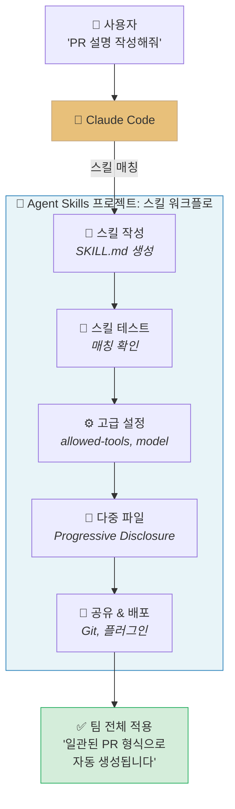

Claude는 사용자의 요청을 이해하고, 설치된 스킬의 description과 비교하여 **자동으로 관련 스킬을 활성화**한다. 이번 강의에서는 스킬을 작성하고, 테스트하고, 공유하는 전체 워크플로를 직접 구축한다.

### Anthropic Skilljar 코스

이 강의노트는 Anthropic 공식 교육 플랫폼 Skilljar의 **"Introduction to Agent Skills"** (6개 레슨)를 기반으로 구성되었다.

> [!ref] 소스 매핑
> - 온라인 코스: [Introduction to Agent Skills](https://anthropic.skilljar.com/introduction-to-agent-skills)
> - 공식 블로그: [Introducing Agent Skills](https://www.anthropic.com/news/skills)
> - 엔지니어링 블로그: [Equipping agents for the real world with Agent Skills](https://www.anthropic.com/engineering/equipping-agents-for-the-real-world-with-agent-skills)
> - GitHub: [anthropics/skills](https://github.com/anthropics/skills)
> - 실라버스 매핑: **W5 CC 스킬 (Skills & Commands)** 보충 (v2.3 기준)

---

## [Chapter 1] Skills 기초와 첫 번째 스킬 (Lessons 1-2)

### 1.1 Skills란 무엇인가? (What are Skills?)

Claude Code를 사용하면서 매번 같은 지시를 반복한 적이 있는가? PR을 리뷰할 때마다 피드백 형식을 설명하고, 커밋 메시지를 작성할 때마다 컨벤션을 알려주는 것은 비효율적이다. **Agent Skills**는 이 문제를 해결한다.

#### Skills의 정의

Skills는 Claude Code가 발견하고 사용할 수 있는 **지시문, 스크립트, 리소스의 폴더**이다. 각 스킬은 `SKILL.md` 파일을 포함하는 디렉토리이며, frontmatter에 `name`과 `description`이 정의되어 있다.


*Skills 개요 --- 스킬의 구조와 Claude Code의 매칭 메커니즘*

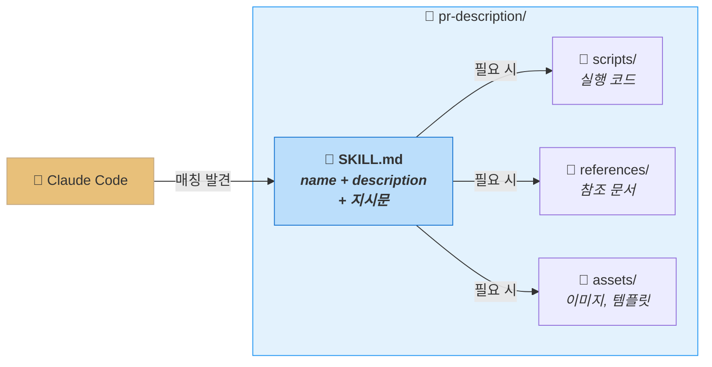

**description**이 핵심이다. Claude가 스킬을 사용할지 결정하는 기준이 바로 description이다. 사용자가 "PR 리뷰해줘"라고 요청하면, Claude는 설치된 모든 스킬의 description과 비교하여 관련된 스킬을 찾는다.

#### SKILL.md frontmatter 구조

스킬 파일의 가장 기본적인 구조는 다음과 같다:

```yaml
---
name: pr-review
description: Reviews pull requests for code quality. Use when reviewing PRs or checking code changes.
---
```

frontmatter 아래에는 Claude가 스킬 활성화 시 따를 **실제 지시문**을 마크다운으로 작성한다:

```markdown
---
name: pr-review
description: Reviews pull requests for code quality. Use when reviewing PRs or checking code changes.
---

When reviewing a pull request:

1. Check for code quality issues (naming, complexity, duplication)
2. Verify error handling is comprehensive
3. Look for security vulnerabilities
4. Ensure test coverage for new code
5. Format feedback as:
   - 🔴 Critical: Must fix before merge
   - 🟡 Suggestion: Consider improving
   - 🟢 Positive: Good patterns to highlight
```

> [!tip] 핵심 인사이트
> Skills는 **Claude가 직접 실행하는 것이 아니라**, Claude가 **작업 수행 시 참조하는 지식**이다. "새로 입사한 직원에게 주는 온보딩 가이드"와 같은 역할을 한다 — Claude는 이 가이드를 읽고 작업 방식을 학습한다.

#### Skills의 저장 위치

스킬은 두 곳에 저장할 수 있으며, **누가 사용하느냐**에 따라 위치가 다르다:

| 위치 | 경로 | 범위 | 사용 시나리오 |
| --- | --- | --- | --- |
| **Personal Skills** | `~/.claude/skills/` | 모든 프로젝트에 적용 | 개인 커밋 스타일, 문서화 형식, 코드 설명 방식 |
| **Project Skills** | `.claude/skills/` (프로젝트 루트) | 해당 프로젝트만 | 팀 코딩 표준, 브랜드 가이드라인, 프로젝트 아키텍처 |

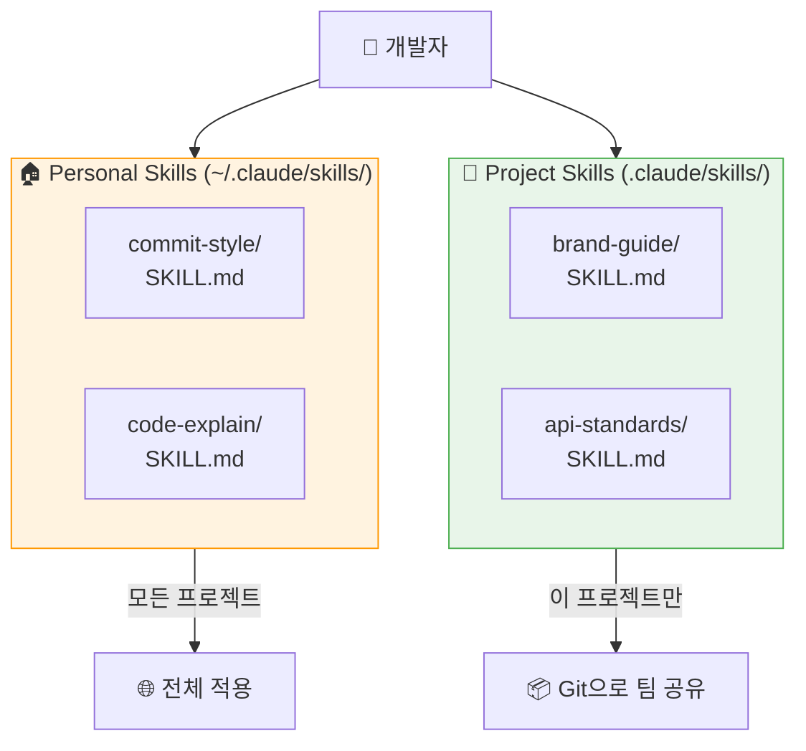

- **Personal Skills**는 홈 디렉토리 (`~/.claude/skills`)에 위치하며, 어떤 프로젝트에서 작업하든 항상 사용 가능하다
- **Project Skills**는 프로젝트 루트의 `.claude/skills`에 위치하며, Git으로 버전 관리되어 리포지토리를 클론하는 모든 팀원이 자동으로 공유한다

> [!finding] Skills vs CLAUDE.md vs Slash Commands — 핵심 차이
> - **CLAUDE.md**: 매 대화에 자동 로드. TypeScript strict mode 같은 **항상 적용할 규칙**에 사용
> - **Skills**: 관련 요청 시에만 자동 로드. PR 리뷰 체크리스트처럼 **특정 작업의 전문 지식**에 사용 — 디버깅 중에는 PR 체크리스트가 컨텍스트를 차지하지 않는다
> - **Slash Commands**: 사용자가 명시적으로 `/command` 입력 필요. Skills는 **Claude가 자동으로 인식**한다

#### Skills 활용 시나리오

Skills가 효과적인 경우:
- 팀이 따르는 **코드 리뷰 표준**
- 선호하는 **커밋 메시지 형식**
- 조직의 **브랜드 가이드라인**
- 특정 유형의 **문서 템플릿**
- 특정 프레임워크용 **디버깅 체크리스트**

> [!method] 판단 기준
> **"Claude에게 같은 것을 반복 설명하고 있다면, 그것은 스킬로 만들어야 한다."**

#### Skills와 컨텍스트 윈도우

Skills의 핵심 장점은 **컨텍스트 효율성**이다. CLAUDE.md는 매 대화에 전체 내용이 로드되지만, Skills는 관련 작업이 있을 때만 로드된다. 이 차이가 실제 컨텍스트 윈도우에서 어떻게 나타나는지 살펴보자:

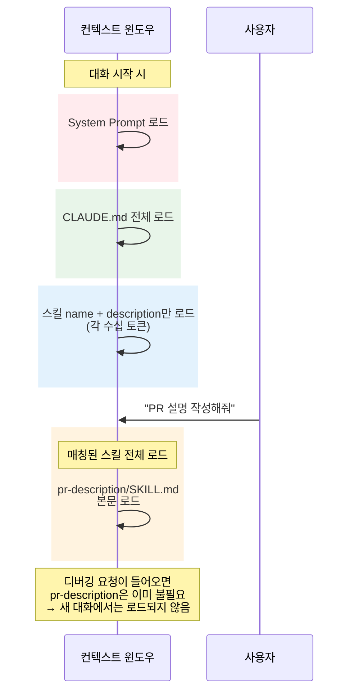

**핵심 포인트**: 5개의 스킬이 설치되어 있어도, 실제로 컨텍스트를 소비하는 것은 **활성화된 1개 스킬**뿐이다. 나머지 4개는 name과 description만으로 수십 토큰만 차지한다.

#### Skills의 4가지 특성

| 특성 | 설명 | 예시 |
| --- | --- | --- |
| **Composable** (조합 가능) | 여러 스킬이 함께 동작. Claude가 자동으로 필요한 스킬 조합 | PR 리뷰 스킬 + 보안 검사 스킬 동시 활성화 |
| **Portable** (이식 가능) | 동일 형식으로 어디서나 사용. Claude Code, claude.ai, API 공통 | 한번 만든 스킬을 CLI와 웹 모두에서 사용 |
| **Efficient** (효율적) | 필요할 때만 필요한 것만 로드 | Progressive Disclosure (3단계) |
| **Powerful** (강력) | 실행 코드 포함 가능. 전통적 프로그래밍이 더 신뢰할 수 있는 작업 위임 | PDF 필드 추출 스크립트 |

> [!ref] 소스
> - Skilljar L01: What are skills? (434525)
> - [Introducing Agent Skills — Anthropic Blog](https://www.anthropic.com/news/skills)

---

### 1.2 첫 번째 스킬 작성하기 (Creating Your First Skill)

이론을 이해했으니, 실제로 스킬을 작성해보자. 모든 프로젝트에서 사용할 수 있는 **Personal PR Description 스킬**을 만든다.


*첫 번째 스킬 작성 --- PR Description 스킬의 생성 과정*

#### Step 1: 스킬 디렉토리 생성

```bash
# 스킬 디렉토리 생성 (디렉토리 이름 = 스킬 이름)
mkdir -p ~/.claude/skills/pr-description
```

#### Step 2: SKILL.md 작성

```markdown
---
name: pr-description
description: Writes pull request descriptions. Use when creating a PR, writing a PR, or when the user asks to summarize changes for a pull request.
---

When writing a PR description:

1. Run `git diff main...HEAD` to see all changes on this branch
2. Write a description following this format:

## What
One sentence explaining what this PR does.

## Why
Brief context on why this change is needed

## Changes
- Bullet points of specific changes made
- Group related changes together
- Mention any files deleted or renamed
```

| 구성 요소 | 역할 | 작성 팁 |
| --- | --- | --- |
| **name** | 스킬의 고유 식별자 | 소문자, 숫자, 하이픈만 사용. 최대 64자. 디렉토리명과 일치 |
| **description** | Claude가 매칭에 사용하는 기준 | 최대 1,024자. "무엇을 하는가?" + "언제 사용하는가?" 두 질문에 답 |
| **본문** | 스킬 활성화 시 따를 지시문 | 구체적이고 실행 가능한 단계를 마크다운으로 작성 |

#### Step 3: 테스트

Claude Code를 **재시작**하면 (스킬은 시작 시 로드) 새 스킬이 인식된다.

```bash
# Claude Code 재시작 후 테스트
claude "write a PR description for my changes"
```

Claude는 "PR description" 스킬을 감지하고, 확인 프롬프트를 표시한 뒤, 스킬의 지시를 따라 `git diff`를 실행하고 일관된 형식의 PR 설명을 생성한다.

#### Bonus: Claude Code 안에서 대화형으로 스킬 만들기 (skill-creator 활용)

앞의 Step 1~3은 터미널에서 디렉토리를 만들고 `SKILL.md`를 손으로 작성하는 방식이다. 빠르지만 **frontmatter YAML 오타·디렉토리 위치 실수·description 문구 모호** 같은 함정을 학생이 혼자 해결해야 한다. Claude Code에는 이 과정을 **대화로 끝내게 해주는 메타-스킬**인 `skill-creator`가 이미 들어 있다.

이번에는 "강의 노트(`.md`)를 받으면 핵심 개념·키워드·복습 질문 3개를 콜아웃으로 묶어 요약해 주는" **`lecture-summary` 스킬**을 학생이 직접 Claude Code 안에서 끝까지 만들어 본다.

> [!tip] 왜 "스킬로 스킬을 만들까?"
> `skill-creator`는 description 작성법, allowed-tools 설정, progressive disclosure 패턴까지 이미 알고 있어, **자연어 대화 중에 자동으로 베스트프랙티스를 적용**한다. 결과적으로 "내가 SKILL.md 문법을 다 외우지 않아도 트리거가 잘 되는 스킬"을 첫 시도에 얻을 가능성이 높다.

##### 0단계: 환경 확인

Claude Code를 켜고 현재 위치와 스킬 디렉토리를 확인한다.

```bash
pwd
ls ~/.claude/skills/   # 이미 만든 스킬 목록이 보이면 정상
```

> [!warning] `skill-creator`가 보이지 않는다면
> 환경에 따라 `skill-creator` 스킬이 설치되어 있지 않을 수 있다. 자연어로 "현재 사용 가능한 스킬 목록을 보여줘"로 확인하라. 없다면 **바로 아래 0.5단계로 Anthropic 공식 스킬 묶음을 한 번에 설치**하거나, 1단계의 입력 첫 줄을 `skill-creator 스킬을 사용해서` → `~/.claude/skills/lecture-summary/SKILL.md를 만들어줘. 다음 조건을 만족해야 해:` 로 바꿔서 진행한다. 결과물은 거의 동일하다.

##### 0.5단계: Anthropic 공식 스킬을 GitHub에서 설치하기 (강력 권장)

`skill-creator` 를 비롯해 `pdf` · `docx` · `xlsx` · `pptx` · `mcp-builder` · `brand-guidelines` · `webapp-testing` 등 **Anthropic이 직접 제작·배포하는 공식 스킬 묶음**이 [`anthropics/skills`](https://github.com/anthropics/skills) 레포에 모여 있다. 한 번 설치해 두면 0단계 경고에서 언급한 "`skill-creator` 부재" 문제가 사라질 뿐 아니라, 강의 후반부 문서 작업·MCP 빌드·UI 테스트 실습에도 그대로 재활용할 수 있다.

> [!tip] 두 가지 경로 — 결과는 같다
> - **경로 A — `/plugin` 마켓플레이스 (권장)**: Anthropic 공식 마켓플레이스를 등록하고 한 줄로 묶음 설치. 가장 안전하고 빠르다.
> - **경로 B — Claude Code에게 `git clone` 시키기**: 실제 파일이 어디에 떨어지는지 학생이 직접 보며 학습. 투명도가 높다.

###### 경로 A: `/plugin` 마켓플레이스 (한 줄 설치)

Claude Code 프롬프트에 다음을 순서대로 입력한다.

```text
/plugin marketplace add anthropics/skills
```

마켓플레이스 신뢰 여부 프롬프트가 뜨면 승인. 등록이 끝나면 두 개의 공식 묶음을 설치한다.

```text
/plugin install example-skills@anthropic-agent-skills
/plugin install document-skills@anthropic-agent-skills
```

| 묶음 | 들어 있는 스킬 (대표) | 강의 활용 |
| --- | --- | --- |
| `example-skills` | `skill-creator`, `mcp-builder`, `webapp-testing`, `frontend-design`, `algorithmic-art`, `slack-gif-creator` | **1단계의 `skill-creator` 가 바로 이 묶음에서 온다** |
| `document-skills` | `pdf`, `docx`, `xlsx`, `pptx`, `canvas-design`, `brand-guidelines`, `doc-coauthoring` | 논문·리포트·발표자료 자동화 (W7 이후 실습에서 재등장) |

> [!tip] UI로도 가능
> 명령어가 부담스러우면 `/plugin` 만 입력 → `Browse and install plugins` → `anthropic-agent-skills` → 원하는 묶음 선택 → `Install now`. 결과는 동일.

###### 경로 B: Claude Code에게 `git clone` 시키기

플러그인 시스템을 쓰지 않고 **파일이 어디에 떨어지는지 직접 보며 학습**하고 싶다면, Claude Code 프롬프트에 자연어로 다음과 같이 부탁한다.

```text
https://github.com/anthropics/skills 레포의 구조를 먼저 확인하고,
"skill-creator" 스킬을 내 사용자 수준 디렉토리(~/.claude/skills/)에 설치해줘.

순서:
1) ~/repos/anthropic-skills 로 git clone
2) 레포 안에서 skill-creator 디렉터리의 정확한 위치를 찾기
3) 그 디렉터리를 통째로 ~/.claude/skills/skill-creator 로 복사
4) 추가로 함께 복사할 만한 공식 스킬 후보 목록을 보여주고,
   내 승인을 받아서 같이 복사

각 단계마다 실행하는 셸 명령을 그대로 보여줘.
```

Claude Code는 대략 다음 명령을 실행한다 (정확한 경로는 레포 구조에 따라 자동 보정).

```bash
git clone https://github.com/anthropics/skills ~/repos/anthropic-skills
cp -r ~/repos/anthropic-skills/<발견한 경로>/skill-creator ~/.claude/skills/
```

> [!warning] 마지막에 항상 재시작
> 두 경로 모두 **설치 후 Claude Code를 한 번 재시작**해야 새 스킬이 인덱스에 로드된다. (스킬 인덱스는 세션 시작 시 한 번만 스캔된다.)

###### 설치 확인

재시작 후 자연어로 묻는다.

```text
현재 사용 가능한 스킬 중에 skill-creator, pdf, docx, mcp-builder 가 보이는지 알려줘
```

또는 셸에서 직접 확인한다.

```bash
ls ~/.claude/skills/                   # 경로 B 로 설치한 스킬
ls ~/.claude/plugins/ 2>/dev/null      # 경로 A 로 설치한 플러그인 (위치는 환경에 따라 다름)
```

목록에 `skill-creator` 가 보이면 다음 1단계의 `skill-creator` 호출이 그대로 동작한다.

##### 1단계: skill-creator 호출 + 요구사항 전달

Claude Code 프롬프트에 다음을 그대로 입력한다.

```text
skill-creator 스킬을 사용해서, 사용자 수준(~/.claude/skills/) "lecture-summary" 스킬을 만들어줘.

조건:
- 사용자가 강의 노트 .md 파일을 첨부하거나 경로를 주면 트리거되어야 한다
- 출력은 다음 3 블록을 Obsidian 콜아웃으로 구성한다:
  1) > [!finding] 핵심 개념 (5개 이내 bullet)
  2) > [!method] 키워드 (#태그 형태 7개 이내)
  3) > [!question] 복습 질문 3개
- description은 한국어로 작성하되, "강의 노트 요약", "lecture summary",
  "Obsidian 노트 요약" 키워드를 모두 포함할 것
- allowed-tools 는 Read 만 허용
```

##### 2단계: 제안된 SKILL.md 검토

Claude는 먼저 **frontmatter와 본문 초안**을 보여 준다. 다음 4가지를 함께 확인한다.

| 검토 항목 | 통과 기준 |
| --- | --- |
| `name` | 디렉토리명과 일치 (`lecture-summary`) |
| `description` | "언제 사용하는가?" 키워드가 1단계 요구와 일치 |
| `allowed-tools` | `Read` 만 명시되어 있는가 |
| 본문 단계 | 3개 콜아웃 블록을 반드시 출력하라는 강제 문구가 있는가 |

> [!action] 학생 체크포인트
> Claude가 제안한 description이 모호하면 (예: `"summarize lecture notes"` 정도) **그 자리에서 다듬어 달라**고 말한다. 예시: `description에 "강의 노트 .md를 받으면", "Obsidian callout 형식으로", "복습용 질문 3개"라는 표현을 명시적으로 넣어줘.`

##### 3단계: 파일 저장 + 위치 확인

Claude가 SKILL.md를 작성하면, 실제로 올바른 위치에 저장되었는지 확인한다.

```bash
ls -la ~/.claude/skills/lecture-summary/
head -20 ~/.claude/skills/lecture-summary/SKILL.md
```

`SKILL.md` 한 파일이 보이면 정상이다. 디렉토리가 다른 위치(예: 프로젝트의 `.claude/skills/`)에 만들어졌다면 `mv` 로 옮긴다.

##### 4단계: Claude Code 재시작 + 트리거 테스트

스킬은 **세션 시작 시 인덱스에 로드**되므로, 새 SKILL.md를 인식시키려면 한 번 재시작이 필요하다.

1. 현재 세션 종료 (`/quit` 또는 Ctrl+D)
2. `claude` 로 다시 실행
3. 자연어로 "현재 사용 가능한 스킬을 알려줘" → `lecture-summary` 가 보이는지 확인
4. 임의의 강의 노트를 던져 트리거 테스트:

```text
@200-Lecture/LLM-AE-AI/01-Notes/Week_05_AgentSkills.md 이 노트를 요약해줘
```

Claude가 `lecture-summary` 스킬을 로드할지 확인 프롬프트를 띄우고, 승인하면 3개 콜아웃 블록 형식으로 응답해야 한다.

##### 5단계 (필요 시): description 보강 → 재테스트

4단계에서 스킬이 자동으로 트리거되지 않고 일반 응답이 나온다면, description 키워드가 사용자의 자연어 표현과 충분히 매칭되지 않는 것이다. 다시 부탁한다.

```text
lecture-summary 스킬의 description을 수정해줘. 다음 표현들이 들어와도 트리거되어야 해:
"요약해줘", "정리해줘", "복습 질문 만들어줘", "강의 노트 한 줄 정리".
```

수정 후 다시 재시작 → 테스트.

##### 성공 판정 체크리스트

- [ ] `~/.claude/skills/lecture-summary/SKILL.md` 파일이 존재한다
- [ ] frontmatter의 `name`이 디렉토리명과 일치한다
- [ ] description에 한국어/영어 키워드가 모두 포함되어 있다
- [ ] 재시작 후 강의 노트를 자연어로 던지면 스킬이 자동 트리거된다
- [ ] 출력에 `[!finding]` / `[!method]` / `[!question]` 콜아웃 3 블록이 모두 보인다

##### 자주 막히는 지점

| 증상 | 원인 | 처방 |
| --- | --- | --- |
| 재시작 후에도 스킬이 안 보임 | 디렉토리가 프로젝트 `.claude/skills/`에 만들어짐 | `mv` 로 `~/.claude/skills/` 로 이동 |
| 자연어로 던져도 트리거 안 됨 | description이 영어/추상적 표현만 사용 | 5단계대로 한국어 키워드 보강 |
| 콜아웃이 1~2개만 출력 | 본문이 "예시 형식"으로만 적혀 있음 | 본문에 `반드시 다음 3블록을 모두 출력` 같은 강제 문구 추가 |
| frontmatter YAML 파싱 오류 | description 안에 `:`가 따옴표 없이 들어감 | description 전체를 `"..."` 로 감싸기 |

> [!ref] 소스
> - Skilljar L02 의 "스킬 생성" 흐름을 **대화형 메타-스킬(`skill-creator`)** 로 재현한 응용

#### 스킬 매칭 메커니즘

Claude Code가 스킬을 발견하고 활성화하는 과정을 이해하면, 더 효과적인 스킬을 작성할 수 있다:

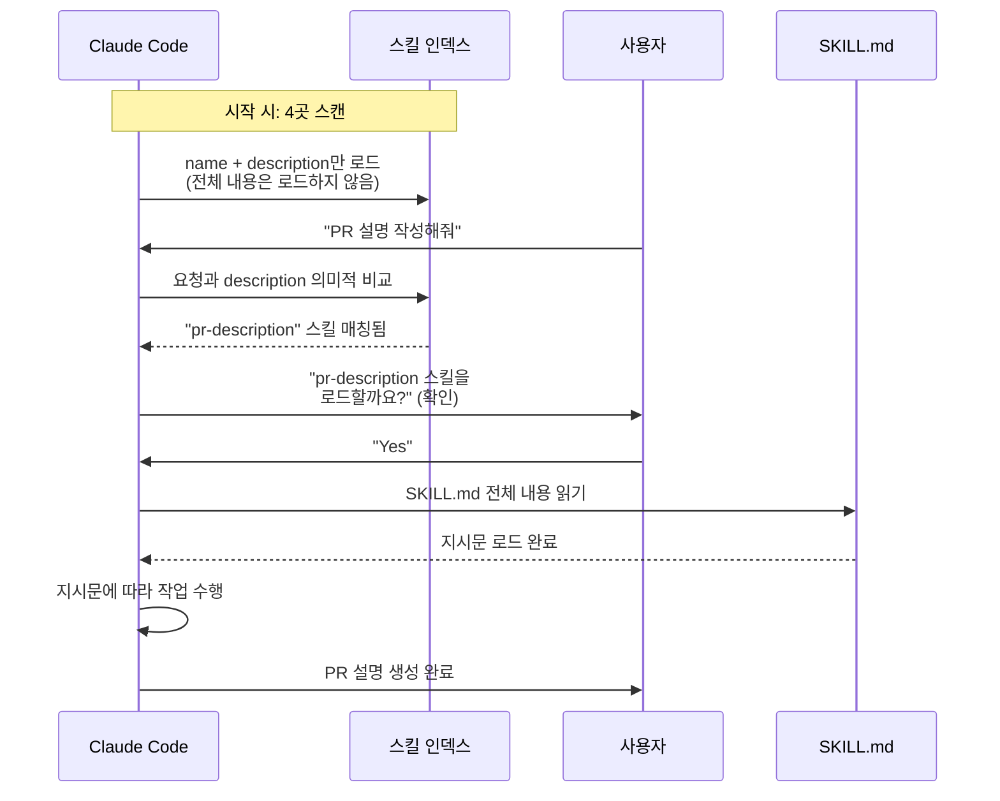

> [!tip] 매칭 최적화
> 스킬이 기대한 대로 트리거되지 않는다면, **description에 사용자가 실제로 사용하는 키워드**를 추가하라. Description은 Claude가 스킬의 관련성을 판단하는 유일한 기준이다.

#### 스킬 우선순위 계층

같은 이름의 스킬이 여러 위치에 있을 때, 어떤 것이 우선하는가?

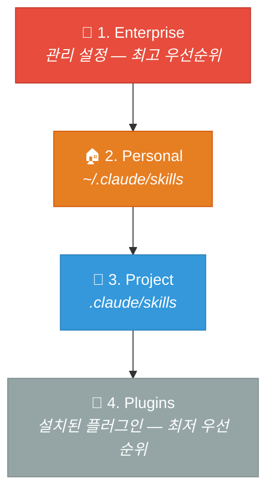

| 우선순위 | 소스 | 설명 |
| --- | --- | --- |
| **1 (최고)** | Enterprise | 조직 관리자가 설정한 스킬. 개인/프로젝트 스킬보다 항상 우선 |
| **2** | Personal | `~/.claude/skills` — 개인 설정. 프로젝트 스킬보다 우선 |
| **3** | Project | `.claude/skills` — 프로젝트 내. 플러그인보다 우선 |
| **4 (최저)** | Plugins | 설치된 플러그인 제공 스킬 |

> [!tip] 이름 충돌 방지
> 충돌을 피하려면 서술적인 이름을 사용하라. `review` 대신 `frontend-review` 또는 `backend-review`를 사용한다.

#### 스킬 업데이트 & 삭제

- **업데이트**: `SKILL.md` 파일을 수정 → Claude Code 재시작
- **삭제**: 스킬 디렉토리 삭제 → Claude Code 재시작

#### 실전 예제: 커밋 메시지 스킬

PR Description 스킬 외에도 자주 사용하는 **커밋 메시지 스킬**을 만들어 보자:

```markdown
---
name: commit-message
description: Writes commit messages following conventional commits format. Use when committing changes, writing git commits, or asking for commit message suggestions.
---

When writing a commit message:

1. Use Conventional Commits format: `type(scope): description`
2. Types: feat, fix, docs, style, refactor, test, chore, perf
3. Scope is optional but recommended (e.g., auth, api, ui)
4. Description should be imperative mood, no period at end
5. Body (optional): explain WHY, not WHAT

Examples:
- feat(auth): add OAuth2 login support
- fix(api): handle null response from external service
- docs(readme): update installation instructions
- refactor(db): extract query builder into separate module
```

이 스킬을 `~/.claude/skills/commit-message/SKILL.md`로 저장하면, Claude Code에서 `git commit`이나 "커밋 메시지 작성해줘"라고 요청할 때 자동으로 Conventional Commits 형식을 따른다.

#### 스킬 작성 Best Practices

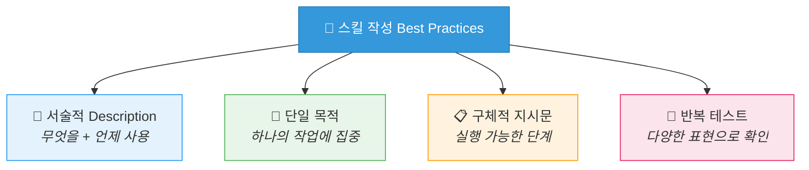

| Best Practice | 설명 | 예시 |
| --- | --- | --- |
| **서술적 Description** | "무엇을 하는가?" + "언제 사용하는가?" 모두 서술 | "Reviews PRs. Use when reviewing code changes." |
| **단일 목적** | 하나의 스킬은 하나의 작업에 집중 | PR 리뷰 스킬과 PR 작성 스킬을 분리 |
| **구체적 지시문** | 모호하지 않고 실행 가능한 단계로 작성 | "Check error handling" (O) / "Make it good" (X) |
| **반복 테스트** | 다양한 문구로 트리거되는지 확인 | "리뷰해줘", "코드 검토", "PR 확인" 등 |
| **이름 = 디렉토리** | 스킬 이름과 디렉토리 이름을 일치시킴 | `commit-message/SKILL.md` (name: commit-message) |

> [!action] 실습
> 📂 `IAS_01_first_skill.ipynb`에서 첫 번째 스킬을 직접 작성해보세요.

> [!ref] 소스
> - Skilljar L02: Creating your first skill (434527)
> - [Equipping agents for the real world — Anthropic Engineering](https://www.anthropic.com/engineering/equipping-agents-for-the-real-world-with-agent-skills)

---

## [Chapter 2] 고급 설정과 커스터마이징 (Lessons 3-6)

### 2.1 스킬 메타데이터와 고급 설정 (Configuration and Multi-file Skills)

기본 스킬은 `name`과 `description`만으로도 동작하지만, 고급 메타데이터 필드를 활용하면 훨씬 정교한 제어가 가능하다.


*스킬 메타데이터와 멀티파일 구성 --- 고급 설정과 복합 스킬 구조*

#### 메타데이터 필드 전체 목록

| 필드 | 필수 | 설명 | 제한 |
| --- | --- | --- | --- |
| `name` | 필수 | 스킬 고유 이름 | 소문자+숫자+하이픈, 최대 64자 |
| `description` | 필수 | Claude가 매칭에 사용하는 설명 | 최대 1,024자 |
| `allowed-tools` | 선택 | 스킬 활성화 시 허용되는 도구 제한 | 쉼표로 구분된 도구 이름 목록 |
| `model` | 선택 | 스킬에 사용할 Claude 모델 지정 | sonnet, opus 등 |

#### 효과적인 Description 작성법

Description은 스킬에서 **가장 중요한 필드**이다. 좋은 description은 두 가지 질문에 답한다:

1. **무엇을 하는가?** (What does the skill do?)
2. **언제 사용하는가?** (When should Claude use it?)

```yaml
# ❌ 나쁜 예 — 모호하고 일반적
---
name: docs-helper
description: Helps with docs.
---

# ✅ 좋은 예 — 구체적이고 키워드 풍부
---
name: api-docs-generator
description: Generates API documentation from code. Use when creating docs for REST endpoints, documenting function signatures, or writing OpenAPI specs.
---
```

> [!method] Description 작성 원칙
> 1. **동사로 시작**: "Generates", "Reviews", "Writes" 등 행동을 명시
> 2. **"Use when" 패턴**: 활성화 조건을 명시적으로 서술
> 3. **사용자 키워드 포함**: 실제로 사용자가 입력할 법한 단어를 포함
> 4. **1,024자 내**: 간결하되 충분히 구체적으로

#### allowed-tools: 도구 접근 제한

보안에 민감한 워크플로나 읽기 전용 작업에서는 Claude가 사용할 수 있는 도구를 제한할 수 있다:

```yaml
---
name: codebase-onboarding
description: Helps new developers understand how the system works. Use when onboarding, exploring codebase, or asking architecture questions.
allowed-tools: Read, Grep, Glob, Bash
model: sonnet
---

When helping someone understand this codebase:

1. Start with the high-level architecture
2. Explain the directory structure
3. Walk through key data flows
4. Point out important configuration files

DO NOT modify any files. This is a read-only exploration.
```

이 스킬이 활성화되면 Claude는 `Read`, `Grep`, `Glob`, `Bash` 도구만 사용할 수 있다 — 편집이나 쓰기 도구는 **권한 없이 사용 불가**하다.

> [!tip] allowed-tools 활용 패턴
> | 패턴 | allowed-tools | 사용 시나리오 |
> | --- | --- | --- |
> | **읽기 전용** | `Read, Grep, Glob` | 코드베이스 탐색, 아키텍처 분석 |
> | **분석 + 실행** | `Read, Grep, Glob, Bash` | 테스트 실행, 환경 검증 |
> | **전체 접근** | (생략) | 코드 생성, 리팩토링 |

#### Progressive Disclosure: 점진적 공개

스킬은 Claude의 **컨텍스트 윈도우를 공유**한다. 스킬이 활성화되면 SKILL.md의 내용이 컨텍스트에 로드된다. 2,000줄짜리 파일을 하나에 넣으면 두 가지 문제가 생긴다:
1. 컨텍스트 윈도우를 크게 차지한다
2. 유지보수가 어렵다

**Progressive Disclosure** (점진적 공개)가 해법이다:

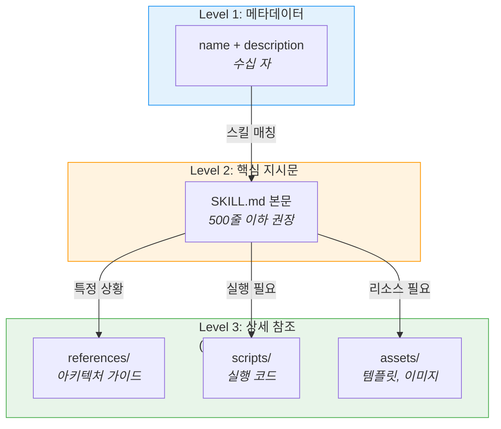

| 레벨 | 로드 시점 | 내용 | 토큰 비용 |
| --- | --- | --- | --- |
| **Level 1** | Claude Code 시작 시 | name + description만 | 극소 (수십 토큰) |
| **Level 2** | 스킬 매칭 시 | SKILL.md 본문 | 중간 (수백~수천 토큰) |
| **Level 3** | 특정 작업 필요 시 | references/, scripts/, assets/ | 필요한 만큼만 |

실제 디렉토리 구조 예시:

```
~/.claude/skills/codebase-onboarding/
├── SKILL.md                        # 핵심 지시문 (500줄 이하)
├── references/
│   └── architecture-guide.md       # 상세 아키텍처 문서
├── scripts/
│   └── validate-env.sh             # 환경 검증 스크립트
└── assets/
    └── system-diagram.md           # 시스템 구성도
```

SKILL.md에서 참조 파일을 **조건부로 로드**하도록 지시한다:

```markdown
---
name: codebase-onboarding
description: Helps new developers understand the system.
allowed-tools: Read, Grep, Glob, Bash
---

# Codebase Onboarding Guide

## Quick Start
(기본 안내 내용...)

## When asked about system design:
Read `references/architecture-guide.md` for the full architecture overview.

## When validating the development environment:
Run (don't read) `scripts/validate-env.sh` to check all dependencies.
```

> [!tip] 스크립트는 "실행"하고 "읽지" 않는다
> 스크립트의 **내용**은 컨텍스트에 로드할 필요가 없다. `scripts/` 디렉토리의 파일을 **실행**하면 스크립트 코드 자체가 아닌 **출력만** 토큰을 소비한다. SKILL.md에서 "Run this script" (O) vs "Read this script" (X)로 명확히 지시하라.

> [!finding] SKILL.md 규모 가이드라인
> - **500줄 이하** 유지를 권장
> - 초과 시 참조 파일로 분리
> - 상호 배타적 컨텍스트는 반드시 별도 파일로

#### 실전 예제: 다중 파일 코드 리뷰 스킬

Progressive Disclosure를 활용한 실제 구조 예제:

```
~/.claude/skills/code-review/
├── SKILL.md                          # 리뷰 프로세스 (300줄)
├── references/
│   ├── security-checklist.md         # 보안 검사 항목 (200줄)
│   ├── performance-patterns.md       # 성능 안티패턴 (150줄)
│   └── style-guide.md               # 코딩 스타일 가이드 (100줄)
├── scripts/
│   ├── count-complexity.sh           # 순환 복잡도 계산
│   └── find-duplicates.py            # 중복 코드 탐지
└── assets/
    └── review-template.md            # 리뷰 결과 템플릿
```

SKILL.md 안에서 조건부 참조:

```markdown
---
name: code-review
description: Reviews code for quality, security, and performance. Use when reviewing code, checking code quality, or auditing changes.
allowed-tools: Read, Grep, Glob, Bash
---

# Code Review Process

## Step 1: Overview
Read the changed files and understand the scope of changes.

## Step 2: Quality Check
- Check naming conventions
- Verify error handling
- Look for code duplication
  → If duplication suspected, run `scripts/find-duplicates.py`

## Step 3: Security Review
→ Read `references/security-checklist.md` for the full security audit checklist

## Step 4: Performance Review
→ If performance-critical code is detected, read `references/performance-patterns.md`
→ Run `scripts/count-complexity.sh` to measure cyclomatic complexity

## Step 5: Report
→ Use `assets/review-template.md` as the output format
```

이 구조에서 Claude는 **Step 3에 도달할 때만** 보안 체크리스트를 로드하고, **성능 관련 코드가 있을 때만** 성능 패턴 문서를 로드한다. 모든 참조 파일이 항상 로드되는 것이 아니라, 필요한 문서만 선택적으로 로드하여 컨텍스트를 절약한다.

> [!action] 실습
> 📂 `IAS_02_configuration.ipynb`에서 allowed-tools와 Progressive Disclosure를 실습합니다.

> [!ref] 소스
> - Skilljar L03: Configuration and multi-file skills (434526)
> - [Agent Skills Open Standard](https://agentskills.io/)

---

### 2.2 Skills vs 다른 Claude Code 기능 비교 (Skills vs. Other Features)

Claude Code에는 동작을 커스터마이징하는 여러 방법이 있다. 각 기능의 목적과 적합한 사용 시나리오를 이해하면, 올바른 도구를 선택할 수 있다.


*Skills vs 다른 Claude Code 기능 --- CLAUDE.md, Hooks, Subagents와의 비교*

#### 전체 비교 표

| 기능 | 로드 시점 | 호출 방식 | 주요 용도 | 범위 |
| --- | --- | --- | --- | --- |
| **CLAUDE.md** | 매 대화 시작 | 자동 (항상) | 프로젝트 전체 규칙, 컨벤션 | 프로젝트/글로벌 |
| **Skills** | 매칭 시에만 | 자동 (의미적 매칭) | 작업별 전문 지식 | Personal/Project |
| **Slash Commands** | 사용자 입력 시 | 수동 (`/command`) | 특정 작업 트리거 | 프로젝트 |
| **Hooks** | 이벤트 발생 시 | 자동 (이벤트 기반) | 파일 수정 후 린트, 커밋 전 테스트 | 프로젝트 |
| **Subagents** | 명시적 위임 시 | 자동/수동 | 병렬 작업, 전문가 위임 | 세션 |
| **MCP Servers** | 연결 시 | 자동 | 외부 도구/데이터 접근 | 시스템 |

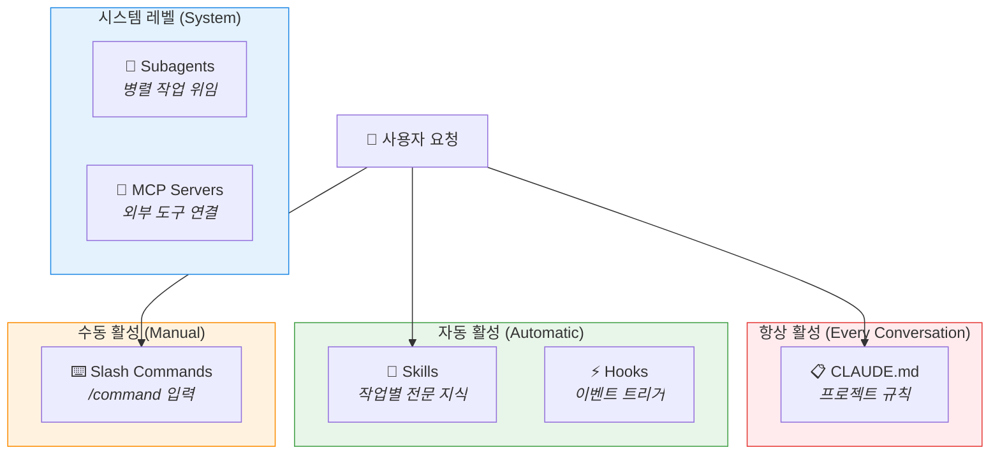

#### 언제 무엇을 사용하는가?

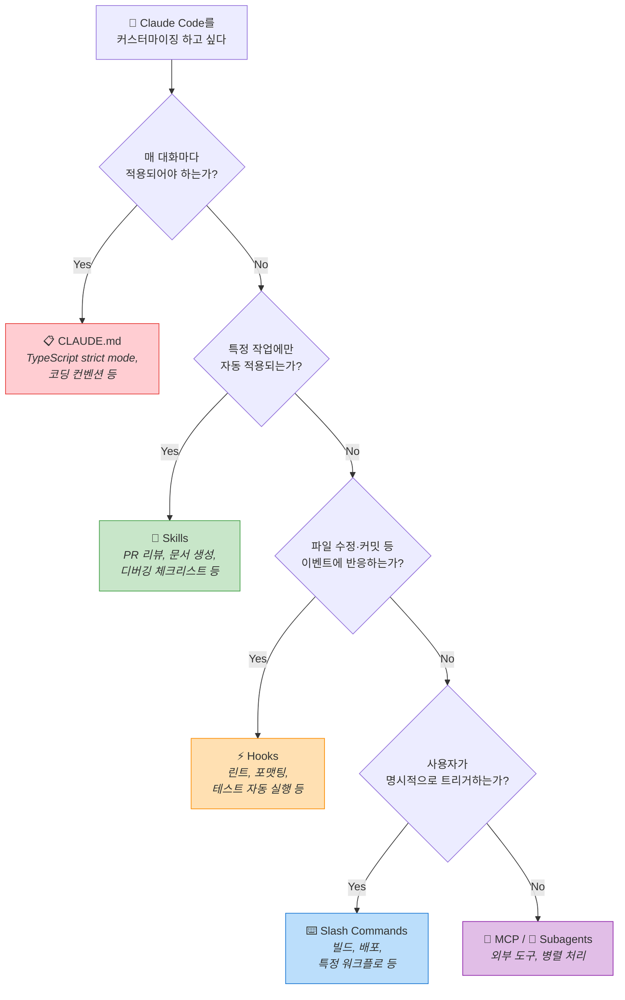

#### 구체적 비교: Skills vs CLAUDE.md

| 관점 | CLAUDE.md | Skills |
| --- | --- | --- |
| **컨텍스트 비용** | 매 대화에 전체 로드 | 필요 시에만 로드 (name+description만 사전 로드) |
| **적합한 내용** | 프로젝트 전체 규칙 (언어, 프레임워크, 코딩 스타일) | 특정 작업의 전문 지식 (PR 리뷰, API 문서 생성) |
| **유지보수** | 하나의 파일에 모든 규칙 | 작업별 독립 파일 — 모듈식 관리 |
| **예시** | "항상 TypeScript strict mode 사용" | "PR 리뷰 시 이 체크리스트 따르기" |

#### 구체적 비교: Skills vs Hooks

| 관점 | Skills | Hooks |
| --- | --- | --- |
| **트리거** | 사용자 요청 기반 (의미적 매칭) | 시스템 이벤트 기반 (파일 수정, 커밋 등) |
| **실행 주체** | Claude가 지시를 따라 작업 | 셸 명령이 직접 실행 |
| **예시** | "PR 설명 작성해줘" → 스킬 활성화 | 파일 저장 시 자동 린트 실행 |

#### 구체적 비교: Skills vs Subagents

| 관점 | Skills | Subagents |
| --- | --- | --- |
| **작동 방식** | 메인 Claude에 지식 로드 | 별도 Claude 인스턴스에 작업 위임 |
| **격리** | 같은 컨텍스트 공유 | 독립 컨텍스트에서 실행 |
| **적합한 작업** | 반복적 패턴, 표준 절차 | 복잡한 병렬 작업, 전문가 분리 |
| **조합** | 스킬을 Subagent에 연결 가능 | Subagent가 특정 스킬만 사용하도록 설정 |

> [!tip] Skills + Subagents 조합
> 스킬을 Subagent에 연결하면 **격리된 전문가 에이전트**를 만들 수 있다. 예: "코드 리뷰 전문 서브에이전트"는 `code-review` 스킬만 로드하여 독립적으로 리뷰를 수행한다.

#### 실전 시나리오별 선택 가이드

**시나리오 1: "모든 Python 파일에서 타입 힌트를 사용하게 하고 싶다"**
- **정답: CLAUDE.md** — 프로젝트 전체에 항상 적용되어야 하는 규칙이므로

```markdown
# CLAUDE.md에 추가
## Coding Standards
- Always use type hints in all Python functions
- Use `from __future__ import annotations` for forward references
```

**시나리오 2: "PR을 작성할 때마다 특정 형식을 따르게 하고 싶다"**
- **정답: Skills** — 특정 작업(PR 작성)에만 자동 활성화

```yaml
---
name: pr-format
description: Formats PRs with What/Why/Changes sections. Use when creating PRs.
---
```

**시나리오 3: "파일 저장할 때마다 자동으로 Black 포맷터를 실행하고 싶다"**
- **정답: Hooks** — 이벤트(파일 저장)에 반응하는 자동화

```json
{
  "hooks": {
    "PostEditFile": {
      "command": "black {file_path}",
      "condition": "*.py"
    }
  }
}
```

**시나리오 4: "보안 감사를 별도의 전문가 에이전트가 수행하게 하고 싶다"**
- **정답: Subagents + Skills** — 격리된 전문가에게 security-audit 스킬 연결

> [!finding] 기능 선택 결정 원칙
> 1. **항상 적용** → CLAUDE.md
> 2. **작업별 자동 활성화** → Skills
> 3. **이벤트 반응** → Hooks
> 4. **명시적 트리거** → Slash Commands
> 5. **격리된 전문가** → Subagents (+ Skills)
> 6. **외부 데이터/도구** → MCP Servers

> [!ref] 소스
> - Skilljar L04: Skills vs. other Claude Code features (434528)
> - [Claude Code Plugins — Anthropic Blog](https://www.anthropic.com/news/claude-code-plugins)

---

### 2.3 스킬 공유와 배포 (Sharing Skills)

개인적으로 유용한 스킬을 만들었다면, 팀이나 조직과 공유하고 싶을 것이다. Skills는 세 가지 수준의 공유 메커니즘을 제공한다.


*스킬 공유와 배포 --- Git, 플러그인, Enterprise 3단계 공유 전략*

#### 공유 전략 비교

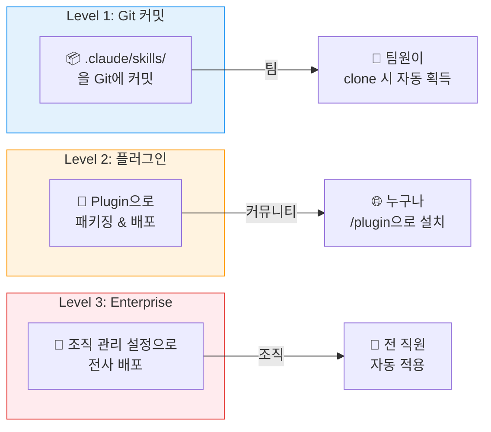

#### Level 1: Git을 통한 팀 공유

가장 간단한 방법. Project Skills를 Git 리포지토리에 커밋하면 팀원이 자동으로 사용할 수 있다:

```bash
# 프로젝트 루트에서
mkdir -p .claude/skills/code-review
# SKILL.md 작성 후
git add .claude/skills/code-review/
git commit -m "Add code review skill for team standards"
git push
```

팀원이 리포지토리를 `clone` 하면 `.claude/skills/` 디렉토리가 함께 포함되어 즉시 사용 가능하다.

#### Level 2: 플러그인을 통한 커뮤니티 공유

더 넓은 범위의 공유를 원하면 **Plugin**으로 패키징한다. 플러그인은 Slash Commands, Subagents, MCP 서버, Hooks, Skills를 하나로 묶어 배포하는 경량 패키지이다.

```bash
# Claude Code에서 플러그인 설치
/plugin install anthropics/skills
```

Anthropic의 [anthropics/skills](https://github.com/anthropics/skills) 리포지토리는 공식 스킬 마켓플레이스 역할을 한다. 커뮤니티가 만든 스킬을 설치하거나, 직접 만든 스킬을 기여할 수 있다.

#### Level 3: Enterprise 관리 설정

조직 전체에 표준 스킬을 배포할 때는 **Enterprise 관리 설정**을 사용한다:
- 관리자가 조직 수준에서 스킬을 배포
- 모든 직원에게 자동 적용
- 중앙 관리와 자동 업데이트
- 최고 우선순위로 동작 (Enterprise > Personal > Project > Plugins)

> [!method] 공유 수준 선택 기준
> | 대상 | 방법 | 예시 |
> | --- | --- | --- |
> | **같은 프로젝트 팀** | Git 커밋 (`.claude/skills/`) | 프로젝트 아키텍처 가이드 |
> | **여러 프로젝트/커뮤니티** | 플러그인 | 범용 코드 리뷰 스킬 |
> | **조직 전체** | Enterprise 관리 설정 | 보안 정책, 브랜드 가이드라인 |

> [!ref] 소스
> - Skilljar L05: Sharing skills (434529)
> - [Claude Code Plugins — Anthropic Blog](https://www.anthropic.com/news/claude-code-plugins)
> - [Organization Skills and Directory — Anthropic Blog](https://claude.com/blog/organization-skills-and-directory)

---

### 2.4 트러블슈팅 (Troubleshooting Skills)

스킬이 기대대로 동작하지 않을 때의 체계적 진단 방법을 알아보자.

#### 문제 유형별 진단 플로우

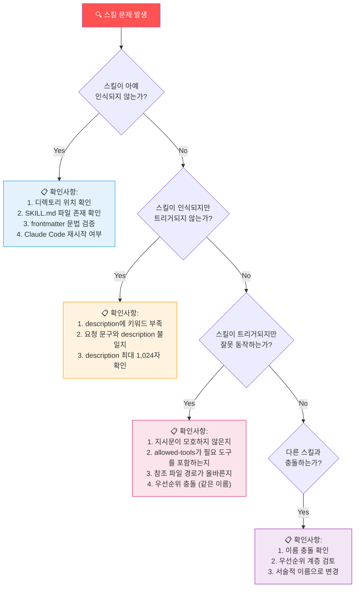

#### 일반적인 문제와 해결 방법

| 증상 | 원인 | 해결 방법 |
| --- | --- | --- |
| 스킬이 목록에 없음 | 잘못된 위치 또는 SKILL.md 누락 | 디렉토리 경로와 파일 존재 확인 |
| 스킬이 트리거되지 않음 | description이 요청과 매칭되지 않음 | description에 사용자 키워드 추가 |
| 잘못된 스킬이 트리거됨 | description이 너무 일반적 | description을 더 구체적으로 수정 |
| 스킬이 파일을 수정함 | allowed-tools 미설정 | `allowed-tools: Read, Grep, Glob` 추가 |
| 우선순위 충돌 | 동일 이름의 스킬이 여러 위치에 존재 | 서술적 이름으로 변경 |
| 변경이 적용되지 않음 | Claude Code 미재시작 | 세션 재시작 |

#### 트러블슈팅 체크리스트

```markdown
# Skills 트러블슈팅 체크리스트

## 1. 구조 검증
- [ ] SKILL.md 파일이 올바른 디렉토리에 존재하는가?
- [ ] frontmatter가 `---`로 올바르게 감싸져 있는가?
- [ ] `name` 필드가 소문자+숫자+하이픈만 사용하는가?
- [ ] `description` 필드가 1,024자 이내인가?

## 2. 매칭 검증
- [ ] description이 "무엇을 하는가?"에 답하는가?
- [ ] description이 "언제 사용하는가?"에 답하는가?
- [ ] 사용자가 실제 사용하는 키워드가 포함되어 있는가?

## 3. 동작 검증
- [ ] Claude Code를 재시작했는가?
- [ ] allowed-tools가 필요한 도구를 포함하는가?
- [ ] 참조 파일의 경로가 상대 경로로 올바른가?

## 4. 충돌 검증
- [ ] 동일 이름의 스킬이 다른 위치에 없는가?
- [ ] 우선순위 계층을 확인했는가?
```

> [!tip] 디버깅 팁: /status 명령
> Claude Code의 `/status` 명령을 사용하면 설정 파일 오류를 확인할 수 있다. 스킬 관련 문제가 의심되면 `/status`를 먼저 실행하라.

> [!action] 실습
> 📂 `IAS_03_troubleshooting.ipynb`에서 의도적으로 문제를 만들고 해결하는 실습을 진행합니다.

> [!ref] 소스
> - Skilljar L06: Troubleshooting skills (434530)

---

## [Chapter 3] 자가진단과 종합 정리

### 3.1 자가진단 퀴즈 — Agent Skills (Q1-Q7)

> [!question] Q1. Claude Code Skills의 핵심 파일은 무엇인가?
> A) `CLAUDE.md`
> B) `SKILL.md`
> C) `skill.yaml`
> D) `config.json`
>
> > [!tip]- 정답 보기
> > **정답: B)** 각 스킬은 디렉토리 안의 `SKILL.md` 파일로 정의된다. 이 파일은 YAML frontmatter (name, description 등 메타데이터)와 Markdown 본문 (실제 지시문)으로 구성된다.

> [!question] Q2. Claude Code가 시작될 때 스킬에서 어떤 정보를 로드하는가?
> A) SKILL.md 전체 내용
> B) name과 description만
> C) frontmatter의 모든 필드
> D) scripts/ 디렉토리의 코드
>
> > [!tip]- 정답 보기
> > **정답: B)** Claude Code는 시작 시 설치된 모든 스킬의 `name`과 `description`만 시스템 프롬프트에 로드한다. 전체 내용은 사용자 요청과 매칭된 후에야 로드된다. 이것이 **Progressive Disclosure의 Level 1**이다.

> [!question] Q3. Personal Skills와 Project Skills의 차이는?
> A) Personal은 특정 프로젝트에만, Project는 모든 프로젝트에 적용
> B) Personal은 `~/.claude/skills`에, Project는 `.claude/skills`에 위치
> C) Personal이 Project보다 우선순위가 낮다
> D) Personal은 Git으로 공유 가능하고, Project는 불가능하다
>
> > [!tip]- 정답 보기
> > **정답: B)** Personal Skills는 홈 디렉토리 `~/.claude/skills`에 위치하여 모든 프로젝트에 적용되고, Project Skills는 프로젝트 루트의 `.claude/skills`에 위치하여 해당 프로젝트에만 적용된다. 우선순위는 Personal > Project이다.

> [!question] Q4. 스킬 우선순위가 가장 높은 것은?
> A) Personal Skills
> B) Project Skills
> C) Enterprise Skills
> D) Plugin Skills
>
> > [!tip]- 정답 보기
> > **정답: C)** 우선순위 계층: **Enterprise (1) > Personal (2) > Project (3) > Plugins (4)**. Enterprise 관리 설정의 스킬이 최고 우선순위를 갖는다.

> [!question] Q5. `allowed-tools` 필드의 목적은?
> A) 스킬이 사용할 수 있는 프로그래밍 언어를 제한한다
> B) 스킬이 활성화될 때 Claude가 사용할 수 있는 도구를 제한한다
> C) 스킬을 설치할 수 있는 사용자를 제한한다
> D) 스킬이 접근할 수 있는 파일을 제한한다
>
> > [!tip]- 정답 보기
> > **정답: B)** `allowed-tools`는 스킬 활성화 시 Claude가 사용할 수 있는 **도구**를 제한한다. 예: `allowed-tools: Read, Grep, Glob`이면 편집이나 쓰기 도구는 사용 불가. 읽기 전용 워크플로나 보안 민감 작업에 유용하다.

> [!question] Q6. Progressive Disclosure에서 scripts/ 파일을 효율적으로 사용하는 방법은?
> A) Claude에게 스크립트를 읽어서 이해하게 한다
> B) Claude에게 스크립트를 실행하게 하여 출력만 컨텍스트에 포함시킨다
> C) 스크립트를 SKILL.md에 인라인으로 포함한다
> D) 스크립트를 description에 요약한다
>
> > [!tip]- 정답 보기
> > **정답: B)** 스크립트는 **실행(run)** 하되 **읽지(read) 않는** 것이 효율적이다. 스크립트를 실행하면 코드 자체가 아닌 **출력만** 토큰을 소비한다. SKILL.md에서 "Run this script"로 지시하면 컨텍스트를 절약할 수 있다.

> [!question] Q7. 스킬이 트리거되지 않을 때 가장 먼저 확인해야 할 것은?
> A) allowed-tools 설정
> B) model 필드
> C) description의 키워드가 사용자 요청과 매칭되는지
> D) scripts/ 디렉토리의 존재 여부
>
> > [!tip]- 정답 보기
> > **정답: C)** Claude는 `description`을 기반으로 스킬을 매칭한다. 스킬이 트리거되지 않는 가장 흔한 원인은 description에 사용자가 실제 사용하는 키워드가 부족한 것이다. "무엇을 하는가?" + "언제 사용하는가?"를 명확히 서술하고, 관련 키워드를 추가하라.

---

### 3.2 학습 요약 — Agent Skills 전체 지도

| 주제 | 핵심 내용 | 관련 섹션 |
| --- | --- | --- |
| **Skills 정의** | 폴더 기반 재사용 가능한 지시문. SKILL.md + 참조 파일로 구성 | §1.1 |
| **SKILL.md 구조** | YAML frontmatter (name, description) + Markdown 본문 | §1.1 |
| **저장 위치** | Personal (`~/.claude/skills`) vs Project (`.claude/skills`) | §1.1 |
| **스킬 매칭** | 시작 시 name+description 로드 → 의미적 매칭 → 확인 → 전체 로드 | §1.2 |
| **우선순위** | Enterprise > Personal > Project > Plugins | §1.2 |
| **메타데이터** | name (필수), description (필수), allowed-tools (선택), model (선택) | §2.1 |
| **Progressive Disclosure** | Level 1 (메타) → Level 2 (본문) → Level 3 (참조) | §2.1 |
| **다른 기능 비교** | CLAUDE.md (항상), Skills (자동 매칭), Hooks (이벤트), Commands (수동) | §2.2 |
| **공유 방법** | Git (팀), 플러그인 (커뮤니티), Enterprise (조직) | §2.3 |
| **트러블슈팅** | 구조 검증 → 매칭 검증 → 동작 검증 → 충돌 검증 | §2.4 |

#### 학습 로드맵

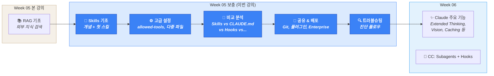

---

## 📝 실습 과제

> 모든 노트북은 `03-Exercises/Week_05/skilljar/` 에 위치합니다.

> [!method] 실습 진행 방법
> 각 노트북은 **이전 노트북의 결과물을 확장**하는 빌드업 구조입니다.
> 반드시 순서대로 진행하세요.

### 교수용 노트북 — 단계별 빌드업

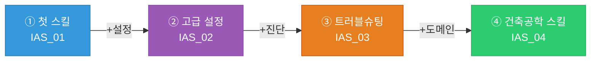

| 단계 | 노트북 파일 | 추가 기능 | 참조 섹션 |
| --- | --- | --- | --- |
| ① 첫 스킬 | `IAS_01_first_skill.ipynb` | Personal 스킬 생성 + SKILL.md 작성 + 테스트 | §1.1~1.2 |
| ② 고급 설정 | `IAS_02_configuration.ipynb` | +allowed-tools + Progressive Disclosure + 다중 파일 | §2.1 |
| ③ 트러블슈팅 | `IAS_03_troubleshooting.ipynb` | +의도적 오류 생성 → 진단 → 수정 | §2.4 |
| ④ 건축공학 도메인 | `IAS_04_structural_skill.ipynb` | **건축공학 도메인** — KDS 구조기준 검토 스킬 | 도메인 응용 |

### 학생 실습용

| 노트북 파일 | 설명 |
| --- | --- |
| `IAS_05_skill_practice.ipynb` | 빈 템플릿 — 스킬 정의부터 트러블슈팅까지 직접 구현 |

> [!method] `IAS_04_structural_skill.ipynb` 구성
> 건축공학 학생에게 친숙한 **KDS 구조기준 검토 스킬**을 통해 Agent Skills 전체 워크플로를 연습합니다:
>
> | 단계 | 기법 | 목표 |
> | --- | --- | --- |
> | v1 | 기본 스킬 | SKILL.md 작성으로 RC 부재 검토 지시문 정의 |
> | v2 | 고급 설정 | allowed-tools로 읽기 전용 분석 모드 구현 |
> | v3 | 다중 파일 | references/에 KDS 기준 텍스트 분리 + Progressive Disclosure |
>
> **입력 변수**: KDS 기준 조항, 콘크리트 설계 파라미터
> **도전 과제**: 효과적인 description 작성, 자동 트리거 검증, 팀 공유용 구조 설계

### 수업 시간 실습 순서

> [!tip] 수업 시간 실습 순서
> **Ch.1 — Skills 기초와 첫 번째 스킬** (50분)
> 1. `IAS_01_first_skill.ipynb` 열기 → 스킬 개념 + SKILL.md 구조 데모 (15분)
> 2. `IAS_01` 계속 → Personal 스킬 작성 + 테스트 (15분)
> 3. 학생 질의응답 + 개념 정리 (10분)
>
> **Ch.2 — 고급 설정과 커스터마이징** (50분)
> 4. `IAS_02_configuration.ipynb` 열기 → allowed-tools + Progressive Disclosure 데모 (15분)
> 5. `IAS_03_troubleshooting.ipynb` 열기 → 트러블슈팅 실습 (15분)
> 6. `IAS_04_structural_skill.ipynb` 배포 → 건축공학 도메인 추가 실습 (15분)
> 7. `IAS_05_skill_practice.ipynb` 배포 → 학생 직접 실습 (과제 또는 자율)

> [!ref] 소스
> - Skilljar 코스: [Introduction to Agent Skills](https://anthropic.skilljar.com/introduction-to-agent-skills)
> - GitHub: [anthropics/skills](https://github.com/anthropics/skills)

---

## 🤖 CC 스킬 심화

> [!finding] 이번 보충 강의의 CC 스킬: Agent Skills 전체 생애주기

이번 보충 강의 자체가 CC 스킬(Skills & Commands)에 대한 심화 학습이다. Week 05 본 강의에서 간략히 소개한 Skills 시스템을 이번 강의에서 **전체 생애주기**로 확장한다.

### 본 강의(Week_05)에서 배운 것 vs 이번 보충에서 배운 것

| Week_05 본 강의 | 이번 보충 (Week_05_AgentSkills) |
| --- | --- |
| Skills 개념 소개 | 6개 레슨으로 심화 |
| SKILL.md 기본 구조 | YAML frontmatter 전체 필드 + description 작성법 |
| `.claude/skills/` 위치 | Personal vs Project + 우선순위 계층 |
| 간단한 RAG 테스트 스킬 예시 | allowed-tools, Progressive Disclosure, 다중 파일 |
| — | Skills vs CLAUDE.md vs Hooks vs Subagents 비교 |
| — | Git/플러그인/Enterprise 공유 전략 |
| — | 체계적 트러블슈팅 |

### 건축공학 응용: KDS 구조기준 검토 스킬

```markdown
---
name: kds-structural-review
description: Reviews structural design against KDS 41 standards. Use when checking RC member design, verifying reinforcement ratios, or validating structural calculations against Korean Design Standards.
allowed-tools: Read, Grep, Glob, Bash
---

# KDS 구조기준 검토 스킬

## 목적
RC 부재의 구조 설계를 KDS 41 기준에 따라 검토한다.

## 검토 항목
1. **최소 철근비** (KDS 41 31 00 기준)
2. **최대 철근비** (균형 철근비의 0.75배 이하)
3. **전단 보강** (전단 설계 기준)
4. **처짐 검토** (사용성 기준)

## 참조 자료
- 상세 기준값은 `references/kds41-values.md` 참조
- 계산 스크립트는 `scripts/check-reinforcement.py` 실행

## 출력 형식
| 검토 항목 | 기준값 | 설계값 | 판정 |
| --- | --- | --- | --- |
| 최소 철근비 | 0.25√fck/fy | (계산값) | OK/NG |
```

> [!action] CC 스킬 실습
> 이번 주 실습: 위의 `kds-structural-review` 스킬을 프로젝트에 직접 작성하고, Claude Code에서 "RC 보의 철근비를 검토해줘"라고 요청하여 자동 트리거를 확인해보세요.
>
> ```bash
> # 프로젝트 루트에서
> mkdir -p .claude/skills/kds-structural-review/references
> # SKILL.md 작성
> # references/kds41-values.md 작성
> # Claude Code 재시작 후 테스트
> ```

---

## 📚 참고 자료

> [!ref] 공식 문서
> - [Claude Code Skills Documentation](https://docs.claude.com/en/docs/claude-code/skills)
> - [Agent Skills Overview](https://docs.claude.com/en/docs/agents-and-tools/agent-skills/overview)
> - [Agent Skills Open Standard](https://agentskills.io/)
> - [Claude Code Plugins](https://www.anthropic.com/news/claude-code-plugins)

> [!ref] Anthropic 블로그
> - [Introducing Agent Skills](https://www.anthropic.com/news/skills) (2025.10.16)
> - [Equipping agents for the real world with Agent Skills](https://www.anthropic.com/engineering/equipping-agents-for-the-real-world-with-agent-skills) (2025.10.16)
> - [Organization Skills and Directory](https://claude.com/blog/organization-skills-and-directory) (2025.12.18)

> [!ref] Anthropic 교육 자료
> - [Introduction to Agent Skills (Skilljar)](https://anthropic.skilljar.com/introduction-to-agent-skills)
> - [Skills Cookbook (GitHub)](https://platform.claude.com/cookbook/skills-notebooks-01-skills-introduction)
> - [Example Skills Repository](https://github.com/anthropics/skills)

---

## Related

- [[Week_05|5주차: RAG 기초와 하이브리드 검색 (S4)]]
- [[Week_06|6주차: Claude의 주요 기능 (S5)]]
- [[00-Syllabus/LLM_AE_AI_Implementation_Syllabus_v2.3|실라버스 v2.3]]
