# Week 5 Supplement: Introduction to Agent Skills

---

## Key Topics

**Ch.1 Skills Basics & Your First Skill**
- **Introduction to Skills**: Reusable markdown instructions in Claude Code — Claude automatically activates them based on task context without repeated explanations
- **SKILL.md Structure**: YAML frontmatter (name, description) + Markdown body
- **Skill Storage Locations**: Personal (`~/.claude/skills`) vs Project (`.claude/skills`) — scope and sharing strategies
- **Skill Matching Mechanism**: Claude loads only name/description at startup → semantic matching with requests → confirmation → full load
- **Creating Your First Skill**: Build and test a PR Description skill from scratch

**Ch.2 Advanced Configuration & Customization**
- **Metadata Fields**: Fine-grained control with optional fields like `allowed-tools` and `model`
- **Progressive Disclosure**: Keep SKILL.md under 500 lines, split into reference files (`references/`, `scripts/`, `assets/`)
- **Skills vs Other Features**: Comparison with CLAUDE.md, Hooks, Subagents, MCP Servers, Slash Commands
- **Sharing and Distribution**: Team/organization deployment via Git commits, plugins, Enterprise managed settings
- **Troubleshooting**: Diagnosing skills that won't trigger, priority conflicts, runtime errors

**Integration Cycle**: Concept understanding → First skill creation → Advanced configuration → Comparative analysis → Sharing/deployment → Troubleshooting

---

## Learning Objectives

After completing this lesson, you will be able to:

**Ch.1 Skills Basics & Your First Skill**
- Explain the definition and operation of Agent Skills (folder-based instructions, automatic matching, progressive disclosure)
- Create a SKILL.md file with proper frontmatter structure and test it in Claude Code
- Distinguish between Personal Skills (`~/.claude/skills`) and Project Skills (`.claude/skills`) with appropriate use scenarios
- Describe the skill priority hierarchy (Enterprise > Personal > Project > Plugins)

**Ch.2 Advanced Configuration & Customization**
- Use `allowed-tools` to restrict Claude's tool access when a skill is active
- Organize large skills efficiently using Progressive Disclosure patterns
- Compare characteristics of Skills, CLAUDE.md, Hooks, Subagents, and Slash Commands to select the right tool
- Execute 3 methods for sharing skills with teams (Git, plugins, Enterprise managed settings)
- Apply systematic troubleshooting approaches (matching failures, priority conflicts, runtime errors)

---

## Why Learn This? — "Teaching Claude How to Work"

> [!question] In the Week 05 main lecture, we learned how to make Claude **search and utilize external knowledge** (RAG). In this supplementary lecture, we learn how to **teach Claude to automatically perform repetitive tasks** (Skills).

### The Problem of Repeated Explanations

When using Claude Code, you end up repeating the same instructions. Every PR review requires explaining your feedback format, every commit message needs a reminder of your preferred convention, every code review demands a list of your team's coding standards. **Skills solve this repetition** — teach Claude once, and it automatically applies that knowledge whenever a relevant situation arises.

### CLAUDE.md to Skills Evolution

| CLAUDE.md | Slash Commands | Skills |
| --- | --- | --- |
| **Loaded every conversation** | **Manual invocation** (`/command`) | **Auto-matching + load on demand** |
| Project-wide rules | Specific command execution | Task-specific expertise |
| Always consumes context | User must remember | Activates only when relevant |
| Applies to all situations | Requires explicit invocation | **Context-aware automation** |

### This Lesson's Project: Building a Skills Workflow

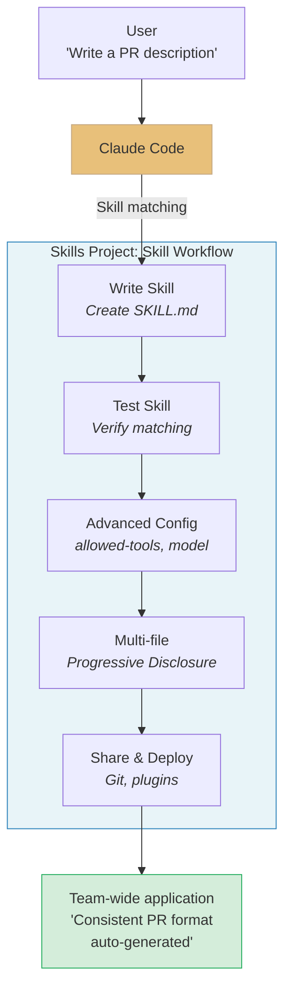

### Anthropic Skilljar Course

This lecture note is based on the **"Introduction to Agent Skills"** (6 lessons) from Anthropic's official education platform Skilljar.

> [!ref] Source Mapping
> - Online course: [Introduction to Agent Skills](https://anthropic.skilljar.com/introduction-to-agent-skills)
> - Official blog: [Introducing Agent Skills](https://www.anthropic.com/news/skills)
> - Engineering blog: [Equipping agents for the real world with Agent Skills](https://www.anthropic.com/engineering/equipping-agents-for-the-real-world-with-agent-skills)
> - GitHub: [anthropics/skills](https://github.com/anthropics/skills)

---

## [Chapter 1] Skills Basics & Your First Skill (Lessons 1-2)

### 1.1 What are Skills?

Have you ever found yourself repeating the same instructions to Claude Code? Explaining your feedback format every time you review a PR, reminding Claude of your commit conventions with each commit — this is inefficient. **Agent Skills** solve this problem.

#### Definition of Skills

Skills are **folders of instructions, scripts, and resources** that Claude Code can discover and use. Each skill is a directory containing a `SKILL.md` file with `name` and `description` defined in its frontmatter.


*Skills overview --- skill structure and Claude Code's matching mechanism*

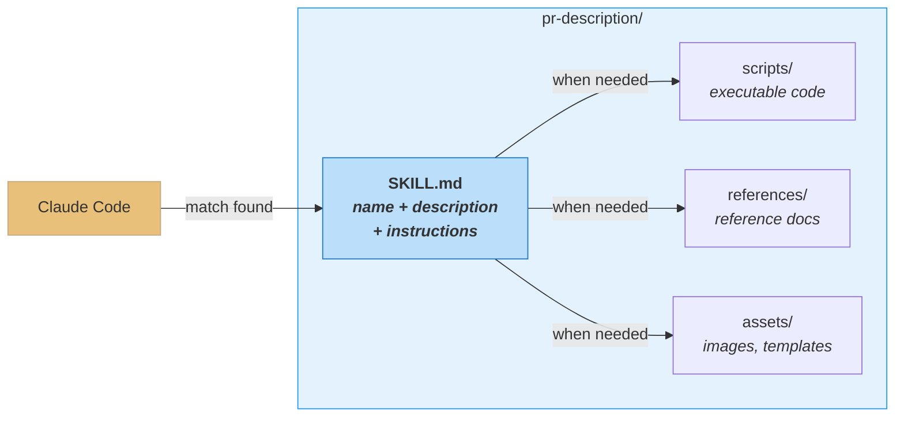

The **description** is the key. It's the criteria Claude uses to decide whether to use a skill. When you ask "review this PR," Claude compares your request against all installed skill descriptions to find matches.

#### SKILL.md Frontmatter Structure

The most basic structure of a skill file:

```yaml
---
name: pr-review
description: Reviews pull requests for code quality. Use when reviewing PRs or checking code changes.
---
```

Below the frontmatter, write the actual instructions in markdown that Claude follows when the skill is activated:

```markdown
---
name: pr-review
description: Reviews pull requests for code quality. Use when reviewing PRs or checking code changes.
---

When reviewing a pull request:

1. Check for code quality issues (naming, complexity, duplication)
2. Verify error handling is comprehensive
3. Look for security vulnerabilities
4. Ensure test coverage for new code
5. Format feedback as:
   - Critical: Must fix before merge
   - Suggestion: Consider improving
   - Positive: Good patterns to highlight
```

> [!tip] Key Insight
> Skills are not executed by Claude directly — they are **knowledge that Claude references when performing tasks**. Think of them like "onboarding guides for a new hire" — Claude reads the guide and learns the working process.

#### Where Skills Live

Skills can be stored in two locations, depending on **who needs them**:

| Location | Path | Scope | Use Scenario |
| --- | --- | --- | --- |
| **Personal Skills** | `~/.claude/skills/` | Applies to all projects | Personal commit style, documentation format |
| **Project Skills** | `.claude/skills/` (project root) | This project only | Team coding standards, brand guidelines |

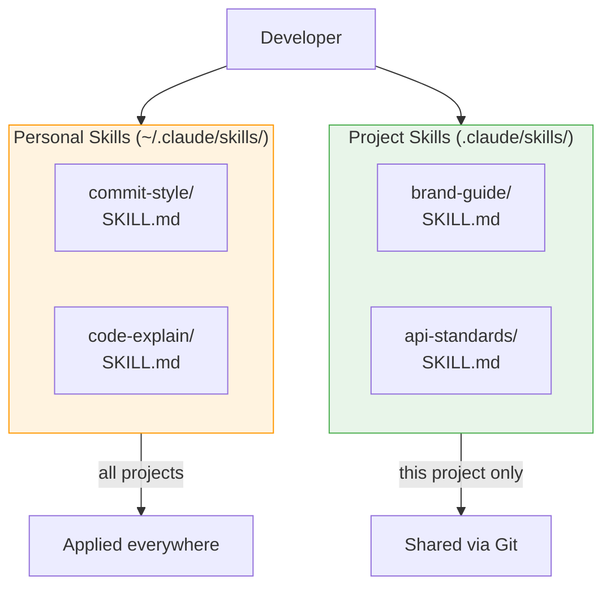

> [!finding] Skills vs CLAUDE.md vs Slash Commands — Key Differences
> - **CLAUDE.md**: Loaded automatically in every conversation. For rules that should **always apply**, like "use TypeScript strict mode"
> - **Skills**: Loaded automatically only when relevant. For **task-specific expertise** like PR review checklists — they don't consume context during debugging
> - **Slash Commands**: Require explicit `/command` input. Skills are **automatically recognized** by Claude

#### Skill use cases

Skills shine in cases like:
- **Code review standards** that a team follows
- Preferred **commit message formats**
- An organization's **brand guidelines**
- **Documentation templates** for specific document types
- **Debugging checklists** for a particular framework

> [!method] Rule of thumb
> **"If you're repeatedly explaining the same thing to Claude, it should be a skill."**

#### Skills and the Context Window

The core advantage of Skills is **context efficiency**. CLAUDE.md loads its entire content in every conversation, but Skills load only when a relevant task exists.

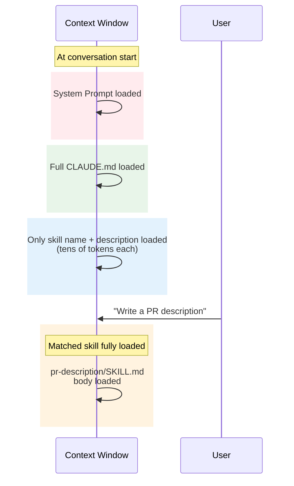

**Key Point**: Even with 5 skills installed, only **1 activated skill** actually consumes significant context. The other 4 occupy just tens of tokens for their name and description.

#### Four Properties of Skills

| Property | Description | Example |
| --- | --- | --- |
| **Composable** | Multiple skills work together. Claude auto-coordinates needed skills | PR review + security audit skills activated simultaneously |
| **Portable** | Same format everywhere. Claude Code, claude.ai, API | Build once, use across CLI and web |
| **Efficient** | Loads only what's needed, when needed | Progressive Disclosure (3 levels) |
| **Powerful** | Can include executable code for tasks where traditional programming is more reliable | PDF field extraction scripts |

> [!ref] Source
> - Skilljar L01: What are skills? (434525)
> - [Introducing Agent Skills — Anthropic Blog](https://www.anthropic.com/news/skills)

---

### 1.2 Creating Your First Skill

Now that we understand the theory, let's actually write a skill. We'll create a **Personal PR Description skill** that works across all projects.


*Creating the first skill --- the PR Description skill build process*

#### Step 1: Create the Skill Directory

```bash
# Create skill directory (directory name = skill name)
mkdir -p ~/.claude/skills/pr-description
```

#### Step 2: Write SKILL.md

```markdown
---
name: pr-description
description: Writes pull request descriptions. Use when creating a PR, writing a PR, or when the user asks to summarize changes for a pull request.
---

When writing a PR description:

1. Run `git diff main...HEAD` to see all changes on this branch
2. Write a description following this format:

## What
One sentence explaining what this PR does.

## Why
Brief context on why this change is needed

## Changes
- Bullet points of specific changes made
- Group related changes together
- Mention any files deleted or renamed
```

| Component | Role | Writing Tips |
| --- | --- | --- |
| **name** | Unique skill identifier | Lowercase, numbers, hyphens only. Max 64 chars. Match directory name |
| **description** | Criteria Claude uses for matching | Max 1,024 chars. Answer "What does it do?" + "When to use it?" |
| **body** | Instructions Claude follows when activated | Specific, actionable steps in markdown |

#### Step 3: Test

**Restart** Claude Code (skills load at startup) and the new skill will be recognized.

```bash
# After restarting Claude Code
claude "write a PR description for my changes"
```

#### Bonus: Building a Skill Interactively Inside Claude Code (with skill-creator)

Steps 1–3 above create a directory in the terminal and write `SKILL.md` by hand. That path is fast, but the student is left to debug pitfalls such as **frontmatter YAML typos, wrong directory placement, and ambiguous description wording** on their own. Claude Code already ships with a **meta-Skill called `skill-creator` that lets you finish this entire process through conversation**.

This time the student will build a **`lecture-summary` Skill** end-to-end inside Claude Code — a Skill that, when handed a lecture note (`.md`), produces a summary grouping the core concepts, keywords, and three review questions inside callouts.

> [!tip] Why build a Skill with a Skill?
> `skill-creator` already knows how to write descriptions, configure allowed-tools, and apply progressive disclosure patterns, so it **automatically applies best practices during a natural-language conversation**. As a result, you have a high chance of getting "a Skill that triggers reliably without having to memorize the full SKILL.md grammar" on the first try.

##### Step 0: Verify the Environment

Launch Claude Code and check your current location and the Skills directory.

```bash
pwd
ls ~/.claude/skills/   # Seeing the list of already-installed skills means you are set
```

> [!warning] If you don't see `skill-creator`
> Depending on the environment, the `skill-creator` Skill may not be installed. Check by asking in natural language, "Show me the list of currently available skills." If it is missing, **install Anthropic's official Skill bundle in one shot via Step 0.5 below**, or replace the first line of Step 1 with `Using the skill-creator skill,` → `please create ~/.claude/skills/lecture-summary/SKILL.md. It must satisfy the following conditions:`. The result is nearly identical.

##### Step 0.5: Install Anthropic's Official Skills from GitHub (strongly recommended)

Anthropic's **official Skill bundles**, including `skill-creator`, `pdf`, `docx`, `xlsx`, `pptx`, `mcp-builder`, `brand-guidelines`, and `webapp-testing`, are gathered in the [`anthropics/skills`](https://github.com/anthropics/skills) repo. Installing them once eliminates the "`skill-creator` missing" warning from Step 0, and you can reuse them later in this course for document workflows, MCP building, and UI testing exercises.

> [!tip] Two paths — same result
> - **Path A — `/plugin` marketplace (recommended)**: Register Anthropic's official marketplace and install the bundles in one line. Safest and fastest.
> - **Path B — Have Claude Code run `git clone`**: The student sees exactly where the files land. Higher transparency.

###### Path A: `/plugin` Marketplace (one-line install)

Enter the following into the Claude Code prompt in order.

```text
/plugin marketplace add anthropics/skills
```

Approve the marketplace-trust prompt when it appears. Once registration is done, install the two official bundles.

```text
/plugin install example-skills@anthropic-agent-skills
/plugin install document-skills@anthropic-agent-skills
```

| Bundle | Skills included (representative) | Lecture usage |
| --- | --- | --- |
| `example-skills` | `skill-creator`, `mcp-builder`, `webapp-testing`, `frontend-design`, `algorithmic-art`, `slack-gif-creator` | **The `skill-creator` in Step 1 comes from this bundle** |
| `document-skills` | `pdf`, `docx`, `xlsx`, `pptx`, `canvas-design`, `brand-guidelines`, `doc-coauthoring` | Automating papers, reports, and presentation decks (reappears in W7+ exercises) |

> [!tip] UI also works
> If the commands feel intimidating, just type `/plugin` → `Browse and install plugins` → `anthropic-agent-skills` → pick the bundle you want → `Install now`. Same result.

###### Path B: Have Claude Code Run `git clone`

If you'd rather skip the plugin system and **learn by watching exactly where the files land**, ask Claude Code in natural language at the prompt:

```text
First inspect the structure of the https://github.com/anthropics/skills repo,
then install the "skill-creator" skill into my user-level directory (~/.claude/skills/).

Sequence:
1) git clone into ~/repos/anthropic-skills
2) Find the exact location of the skill-creator directory inside the repo
3) Copy that entire directory to ~/.claude/skills/skill-creator
4) Then show me a list of additional official skills worth copying alongside,
   and copy them too after I approve

Show me the exact shell commands you run at each step.
```

Claude Code will run roughly the following commands (the exact paths are auto-adjusted based on the repo structure).

```bash
git clone https://github.com/anthropics/skills ~/repos/anthropic-skills
cp -r ~/repos/anthropic-skills/<discovered path>/skill-creator ~/.claude/skills/
```

> [!warning] Always restart at the end
> Both paths require **restarting Claude Code once after installation** so that the new skills are loaded into the index. (The skill index is scanned only once at session start.)

###### Verifying the Install

After restarting, ask in natural language.

```text
Tell me whether skill-creator, pdf, docx, and mcp-builder are visible among the currently available skills
```

Or check directly in the shell.

```bash
ls ~/.claude/skills/                   # Skills installed via Path B
ls ~/.claude/plugins/ 2>/dev/null      # Plugins installed via Path A (location varies by environment)
```

If `skill-creator` appears in the list, the `skill-creator` invocation in Step 1 below will work as-is.

##### Step 1: Invoke skill-creator and Pass the Requirements

Type the following verbatim into the Claude Code prompt.

```text
Using the skill-creator skill, please create a user-level (~/.claude/skills/) "lecture-summary" skill.

Conditions:
- It must trigger when the user attaches a lecture-note .md file or provides its path
- The output must consist of the following 3 blocks as Obsidian callouts:
  1) > [!finding] Core concepts (up to 5 bullets)
  2) > [!method] Keywords (#tag form, up to 7)
  3) > [!question] 3 review questions
- The description must be written in Korean, but must include all of the keywords
  "강의 노트 요약", "lecture summary", and "Obsidian 노트 요약"
- allowed-tools must permit only Read
```

##### Step 2: Review the Proposed SKILL.md

Claude first shows you a **draft of the frontmatter and body**. Verify the following four items together.

| Review item | Pass criterion |
| --- | --- |
| `name` | Matches the directory name (`lecture-summary`) |
| `description` | "When to use it?" keywords match the Step 1 request |
| `allowed-tools` | Only `Read` is listed |
| Body steps | Contains an enforcing clause that the 3 callout blocks must be output |

> [!action] Student checkpoint
> If Claude's proposed description is vague (e.g., just `"summarize lecture notes"`), **ask for it to be refined on the spot**. Example: `In the description, please explicitly include the phrases "when handed a lecture-note .md", "in Obsidian callout format", and "3 review questions for review".`

##### Step 3: Save the File and Verify the Location

After Claude writes SKILL.md, check that it was actually saved to the correct location.

```bash
ls -la ~/.claude/skills/lecture-summary/
head -20 ~/.claude/skills/lecture-summary/SKILL.md
```

Seeing a single `SKILL.md` file means you are good. If the directory was created in a different location (e.g., in the project's `.claude/skills/`), move it with `mv`.

##### Step 4: Restart Claude Code and Test the Trigger

Because Skills are **loaded into the index at session start**, you need to restart once for the new SKILL.md to be recognized.

1. Quit the current session (`/quit` or Ctrl+D)
2. Run `claude` again
3. Ask in natural language, "Tell me which skills are currently available," and check that `lecture-summary` appears
4. Throw an arbitrary lecture note at it to test the trigger:

```text
@200-Lecture/LLM-AE-AI/01-Notes/Week_05_AgentSkills.md please summarize this note
```

Claude should display a confirmation prompt to load the `lecture-summary` skill, and on approval respond in the 3-callout-block format.

##### Step 5 (if needed): Strengthen the description → retest

If in Step 4 the skill does not auto-trigger and you get a generic response, the description keywords are not matching the user's natural-language phrasing well enough. Ask again.

```text
Please revise the description of the lecture-summary skill. It should also trigger on these expressions:
"요약해줘", "정리해줘", "복습 질문 만들어줘", "강의 노트 한 줄 정리".
```

Restart again after the revision → test.

##### Success Criteria Checklist

- [ ] The file `~/.claude/skills/lecture-summary/SKILL.md` exists
- [ ] The `name` in the frontmatter matches the directory name
- [ ] The description includes both Korean and English keywords
- [ ] After restart, throwing a lecture note in natural language auto-triggers the skill
- [ ] The output shows all three callout blocks: `[!finding]` / `[!method]` / `[!question]`

##### Common Pitfalls

| Symptom | Cause | Remedy |
| --- | --- | --- |
| Skill still not visible after restart | The directory was created in the project's `.claude/skills/` | `mv` it to `~/.claude/skills/` |
| Not triggering even with natural-language prompts | The description uses only English / abstract phrasing | Reinforce Korean keywords as in Step 5 |
| Only 1–2 callouts in the output | The body is written merely as an "example format" | Add an enforcing clause in the body such as `Must output all of the following 3 blocks` |
| frontmatter YAML parse error | A `:` appears inside the description without quotes | Wrap the entire description in `"..."` |

> [!ref] Source
> - An application that reproduces the "Skill creation" flow from Skilljar L02 using the **conversational meta-Skill (`skill-creator`)**

#### Skill Matching Mechanism

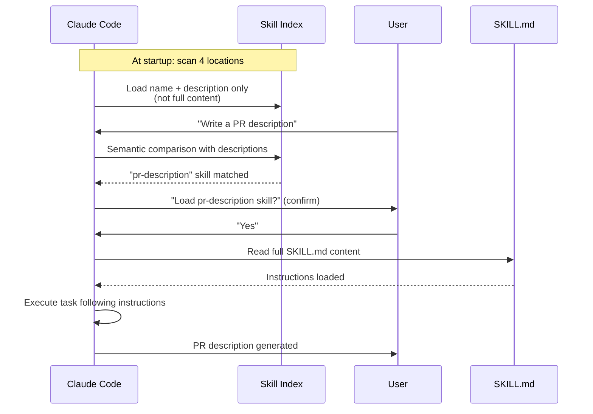

#### Skill Priority Hierarchy

When skills with the same name exist in multiple locations:

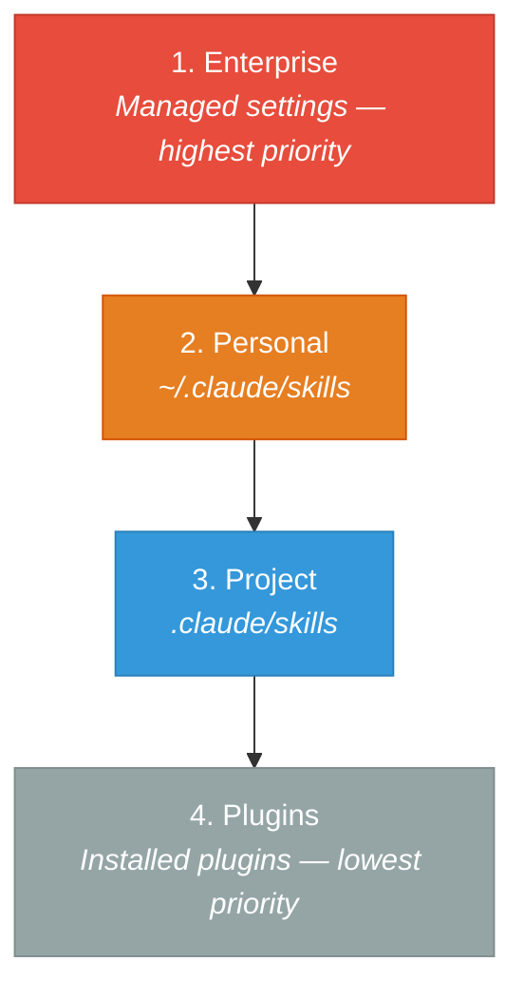

#### Updating & Deleting Skills

- **Update**: Edit the `SKILL.md` file → restart Claude Code
- **Delete**: Remove the skill directory → restart Claude Code

#### Practical Example: Commit Message Skill

```markdown
---
name: commit-message
description: Writes commit messages following conventional commits format. Use when committing changes, writing git commits, or asking for commit message suggestions.
---

When writing a commit message:

1. Use Conventional Commits format: `type(scope): description`
2. Types: feat, fix, docs, style, refactor, test, chore, perf
3. Scope is optional but recommended (e.g., auth, api, ui)
4. Description should be imperative mood, no period at end
5. Body (optional): explain WHY, not WHAT

Examples:
- feat(auth): add OAuth2 login support
- fix(api): handle null response from external service
- docs(readme): update installation instructions
- refactor(db): extract query builder into separate module
```

Save this skill to `~/.claude/skills/commit-message/SKILL.md`, and Claude Code will automatically follow the Conventional Commits format whenever you run `git commit` or ask for a commit message.

#### Skill Writing Best Practices

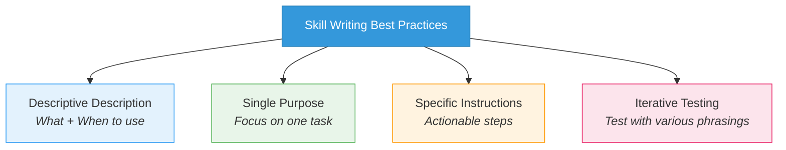

| Best Practice | Description | Example |
| --- | --- | --- |
| **Descriptive Description** | State both "what does it do?" and "when to use it?" | "Reviews PRs. Use when reviewing code changes." |
| **Single Purpose** | Each skill should focus on one task | Separate the PR review skill from the PR writing skill |
| **Specific Instructions** | Write unambiguous, actionable steps | "Check error handling" (O) / "Make it good" (X) |
| **Iterative Testing** | Verify the skill triggers across various phrasings | "review it", "code review", "check the PR", etc. |
| **Name = Directory** | Keep the skill name and directory name identical | `commit-message/SKILL.md` (name: commit-message) |

> [!action] Exercise
> Open `IAS_01_first_skill.ipynb` and write your first skill end-to-end.

> [!ref] Source
> - Skilljar L02: Creating your first skill (434527)
> - [Equipping agents for the real world — Anthropic Engineering](https://www.anthropic.com/engineering/equipping-agents-for-the-real-world-with-agent-skills)

---

## [Chapter 2] Advanced Configuration & Customization (Lessons 3-6)

### 2.1 Skill Metadata and Advanced Configuration

Basic skills work with just `name` and `description`, but advanced metadata fields enable much more precise control.


*Skill metadata and multi-file composition --- advanced configuration and composite skill structure*

#### Full Metadata Fields

| Field | Required | Description | Constraints |
| --- | --- | --- | --- |
| `name` | Required | Unique skill name | Lowercase+numbers+hyphens, max 64 chars |
| `description` | Required | Description Claude uses for matching | Max 1,024 chars |
| `allowed-tools` | Optional | Restricts tools available when skill is active | Comma-separated tool names |
| `model` | Optional | Specifies Claude model for the skill | sonnet, opus, etc. |

#### Writing Effective Descriptions

A good description answers two questions:
1. **What does the skill do?**
2. **When should Claude use it?**

```yaml
# Bad — vague and generic
---
name: docs-helper
description: Helps with docs.
---

# Good — specific and keyword-rich
---
name: api-docs-generator
description: Generates API documentation from code. Use when creating docs for REST endpoints, documenting function signatures, or writing OpenAPI specs.
---
```

#### Restricting Tools with allowed-tools

For security-sensitive workflows or read-only tasks, you can restrict which tools Claude is allowed to use:

```yaml
---
name: codebase-onboarding
description: Helps new developers understand how the system works. Use when onboarding, exploring codebase, or asking architecture questions.
allowed-tools: Read, Grep, Glob, Bash
model: sonnet
---

When helping someone understand this codebase:

1. Start with the high-level architecture
2. Explain the directory structure
3. Walk through key data flows
4. Point out important configuration files

DO NOT modify any files. This is a read-only exploration.
```

When this skill activates, Claude can use only `Read`, `Grep`, `Glob`, and `Bash` — editing or writing tools are **inaccessible without elevated permissions**.

> [!tip] allowed-tools usage patterns
> | Pattern | allowed-tools | Use cases |
> | --- | --- | --- |
> | **Read-only** | `Read, Grep, Glob` | Codebase exploration, architecture analysis |
> | **Analyze + execute** | `Read, Grep, Glob, Bash` | Test execution, environment validation |
> | **Full access** | (omit) | Code generation, refactoring |

#### Progressive Disclosure

Skills share Claude's **context window**. When a skill activates, its SKILL.md content is loaded into context. Stuffing 2,000 lines into one file causes two problems:
1. It eats a huge slice of the context window
2. It is hard to maintain

**Progressive Disclosure** is the answer:

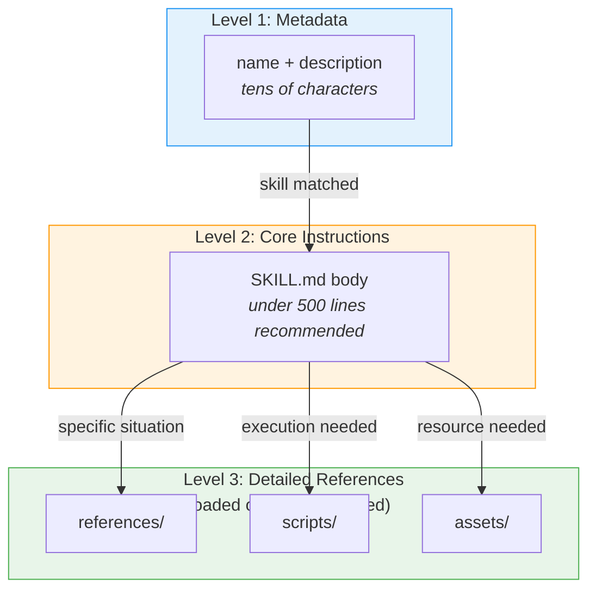

| Level | When loaded | Contents | Token cost |
| --- | --- | --- | --- |
| **Level 1** | At Claude Code startup | name + description only | Trivial (tens of tokens) |
| **Level 2** | On skill match | SKILL.md body | Moderate (hundreds–thousands of tokens) |
| **Level 3** | On specific need | references/, scripts/, assets/ | Only as much as needed |

Example directory layout:

```
~/.claude/skills/codebase-onboarding/
├── SKILL.md                        # Core instructions (under 500 lines)
├── references/
│   └── architecture-guide.md       # Detailed architecture document
├── scripts/
│   └── validate-env.sh             # Environment validation script
└── assets/
    └── system-diagram.md           # System layout diagram
```

Instruct SKILL.md to **conditionally load** reference files:

```markdown
---
name: codebase-onboarding
description: Helps new developers understand the system.
allowed-tools: Read, Grep, Glob, Bash
---

# Codebase Onboarding Guide

## Quick Start
(basic guidance content...)

## When asked about system design:
Read `references/architecture-guide.md` for the full architecture overview.

## When validating the development environment:
Run (don't read) `scripts/validate-env.sh` to check all dependencies.
```

> [!tip] Scripts: Run, Don't Read
> Script **contents** don't need to be loaded into context. When Claude **runs** a script, only the **output** consumes tokens, not the script code itself. Use "Run this script" (O) vs "Read this script" (X).

> [!method] SKILL.md size guidelines
> - Keep SKILL.md **under 500 lines** when possible
> - Split overflow content into reference files
> - Mutually exclusive contexts must live in separate files

#### Real-world example: Multi-file code review skill

A practical structure that leverages Progressive Disclosure:

```
~/.claude/skills/code-review/
├── SKILL.md                          # Review process (300 lines)
├── references/
│   ├── security-checklist.md         # Security audit items (200 lines)
│   ├── performance-patterns.md       # Performance anti-patterns (150 lines)
│   └── style-guide.md               # Coding style guide (100 lines)
├── scripts/
│   ├── count-complexity.sh           # Cyclomatic complexity calculator
│   └── find-duplicates.py            # Duplicate code detector
└── assets/
    └── review-template.md            # Review output template
```

Conditional references inside SKILL.md:

```markdown
---
name: code-review
description: Reviews code for quality, security, and performance. Use when reviewing code, checking code quality, or auditing changes.
allowed-tools: Read, Grep, Glob, Bash
---

# Code Review Process

## Step 1: Overview
Read the changed files and understand the scope of changes.

## Step 2: Quality Check
- Check naming conventions
- Verify error handling
- Look for code duplication
  → If duplication suspected, run `scripts/find-duplicates.py`

## Step 3: Security Review
→ Read `references/security-checklist.md` for the full security audit checklist

## Step 4: Performance Review
→ If performance-critical code is detected, read `references/performance-patterns.md`
→ Run `scripts/count-complexity.sh` to measure cyclomatic complexity

## Step 5: Report
→ Use `assets/review-template.md` as the output format
```

With this structure, Claude loads the security checklist **only when it reaches Step 3**, and the performance patterns document **only when performance-critical code appears**. Reference files are loaded selectively rather than upfront, conserving context.

> [!action] Exercise
> Practice `allowed-tools` and Progressive Disclosure in `IAS_02_configuration.ipynb`.

> [!ref] Source
> - Skilljar L03: Configuration and multi-file skills (434526)
> - [Agent Skills Open Standard](https://agentskills.io/)

---

### 2.2 Skills vs Other Claude Code Features

Claude Code offers several ways to customize behavior. Understanding the purpose and proper use case for each feature lets you pick the right tool for the job.


*Skills vs other Claude Code features --- comparison with CLAUDE.md, Hooks, and Subagents*

#### Full comparison table

| Feature | Load Time | Invocation | Primary Use | Scope |
| --- | --- | --- | --- | --- |
| **CLAUDE.md** | Every conversation | Auto (always) | Project-wide rules, conventions | Project/Global |
| **Skills** | On match only | Auto (semantic matching) | Task-specific expertise | Personal/Project |
| **Slash Commands** | On user input | Manual (`/command`) | Specific task trigger | Project |
| **Hooks** | On event | Auto (event-based) | Post-edit lint, pre-commit test | Project |
| **Subagents** | On explicit delegation | Auto/Manual | Parallel tasks, expert delegation | Session |
| **MCP Servers** | On connection | Auto | External tool/data access | System |

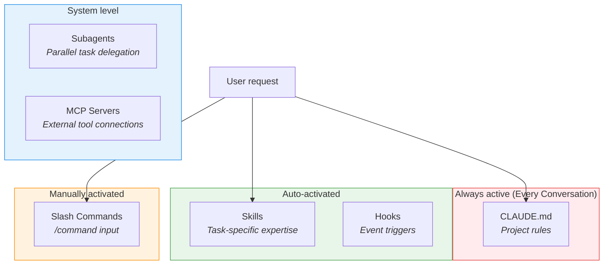

#### When to use what?

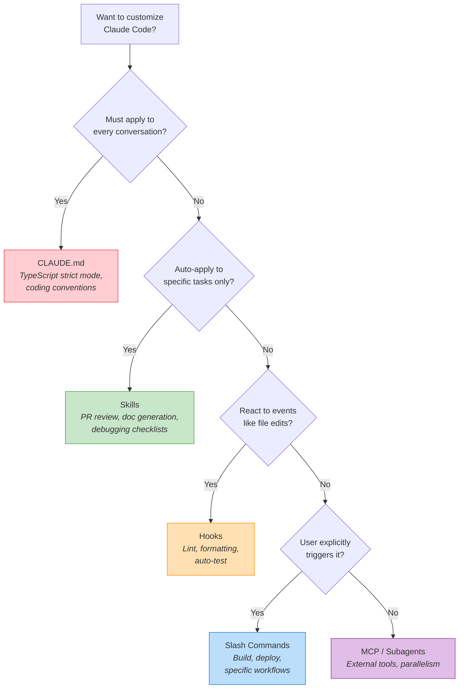

#### Head-to-head: Skills vs CLAUDE.md

| Aspect | CLAUDE.md | Skills |
| --- | --- | --- |
| **Context cost** | Fully loaded every conversation | Loaded only on demand (only name+description pre-loaded) |
| **Suitable content** | Project-wide rules (language, framework, coding style) | Task-specific expertise (PR review, API doc generation) |
| **Maintenance** | All rules in a single file | One file per task — modular management |
| **Example** | "Always use TypeScript strict mode" | "Follow this checklist when reviewing PRs" |

#### Head-to-head: Skills vs Hooks

| Aspect | Skills | Hooks |
| --- | --- | --- |
| **Trigger** | User request (semantic matching) | System events (file edit, commit, etc.) |
| **Executor** | Claude follows the instructions | Shell command runs directly |
| **Example** | "Write a PR description" → skill activates | Auto-run linter on file save |

#### Head-to-head: Skills vs Subagents

| Aspect | Skills | Subagents |
| --- | --- | --- |
| **How it works** | Loads knowledge into the main Claude | Delegates work to a separate Claude instance |
| **Isolation** | Shares the same context | Runs in an isolated context |
| **Best for** | Repetitive patterns, standard procedures | Complex parallel work, expert separation |
| **Composition** | Skills can be attached to a subagent | Subagents can be restricted to specific skills |

> [!tip] Skills + Subagents combo
> Attaching skills to a subagent gives you an **isolated expert agent**. Example: a "code review specialist subagent" that loads only the `code-review` skill and performs reviews independently.

#### Selection guide by real-world scenario

**Scenario 1: "Want all Python files to use type hints"**
- **Answer: CLAUDE.md** — a rule that should always apply project-wide

```markdown
# Add to CLAUDE.md
## Coding Standards
- Always use type hints in all Python functions
- Use `from __future__ import annotations` for forward references
```

**Scenario 2: "Want PRs to follow a specific format every time"**
- **Answer: Skills** — auto-activates for a specific task (PR writing)

```yaml
---
name: pr-format
description: Formats PRs with What/Why/Changes sections. Use when creating PRs.
---
```

**Scenario 3: "Want Black formatter to auto-run on every file save"**
- **Answer: Hooks** — responds to an event (file save)

```json
{
  "hooks": {
    "PostEditFile": {
      "command": "black {file_path}",
      "condition": "*.py"
    }
  }
}
```

**Scenario 4: "Want a separate expert agent for security audits"**
- **Answer: Subagents + Skills** — connect security-audit skill to an isolated expert

> [!finding] Feature Selection Principle
> 1. **Always apply** → CLAUDE.md
> 2. **Auto-activate per task** → Skills
> 3. **React to events** → Hooks
> 4. **Explicit trigger** → Slash Commands
> 5. **Isolated expert** → Subagents (+ Skills)
> 6. **External data/tools** → MCP Servers

> [!ref] Source
> - Skilljar L04: Skills vs. other Claude Code features (434528)

---

### 2.3 Sharing Skills

Once you have a personally useful skill, you'll want to share it with a team or organization. Skills offer three levels of sharing.


*Sharing and distributing skills --- the three-level Git / plugin / Enterprise strategy*

#### Sharing Strategy Comparison

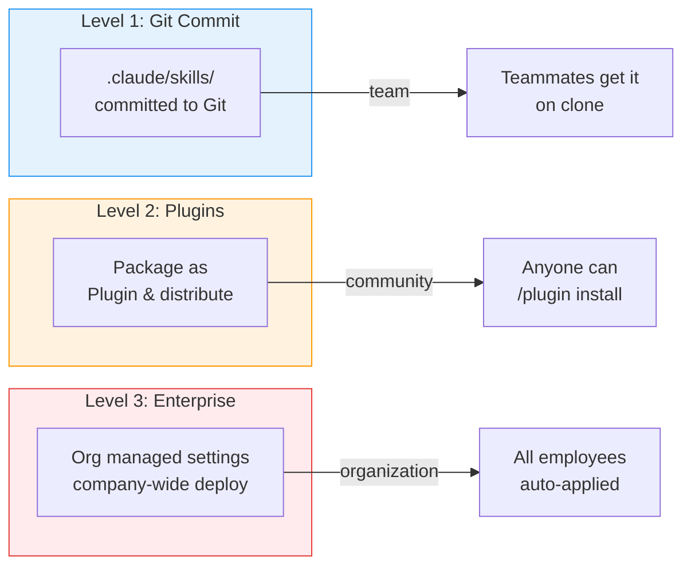

#### Level 1: Team Sharing via Git

The simplest option. Commit Project Skills to a Git repository and teammates pick them up automatically:

```bash
# From the project root
mkdir -p .claude/skills/code-review
# Write SKILL.md
git add .claude/skills/code-review/
git commit -m "Add code review skill for team standards"
git push
```

When teammates `clone` the repository, the `.claude/skills/` directory comes along and is immediately usable.

#### Level 2: Community Sharing via Plugins

For broader sharing, package the skill as a **Plugin**. A plugin is a lightweight package that bundles Slash Commands, Subagents, MCP servers, Hooks, and Skills.

```bash
# Install plugin in Claude Code
/plugin install anthropics/skills
```

The [anthropics/skills](https://github.com/anthropics/skills) repository serves as the official skill marketplace — you can install community skills or contribute your own.

#### Level 3: Enterprise Managed Settings

To distribute standard skills across an entire organization, use **Enterprise managed settings**:
- Admins deploy skills at the organization level
- Auto-applied to every employee
- Centralized management with automatic updates
- Runs at the highest priority (Enterprise > Personal > Project > Plugins)

> [!method] Choosing the right sharing level
> | Audience | Method | Example |
> | --- | --- | --- |
> | **Same project team** | Git commit (`.claude/skills/`) | Project architecture guide |
> | **Multiple projects / community** | Plugin | General-purpose code review skill |
> | **Entire organization** | Enterprise managed settings | Security policy, brand guidelines |

> [!ref] Source
> - Skilljar L05: Sharing skills (434529)
> - [Claude Code Plugins — Anthropic Blog](https://www.anthropic.com/news/claude-code-plugins)
> - [Organization Skills and Directory — Anthropic Blog](https://claude.com/blog/organization-skills-and-directory)

---

### 2.4 Troubleshooting

When a skill misbehaves, this section walks through systematic diagnosis.

#### Diagnosis flow by problem type

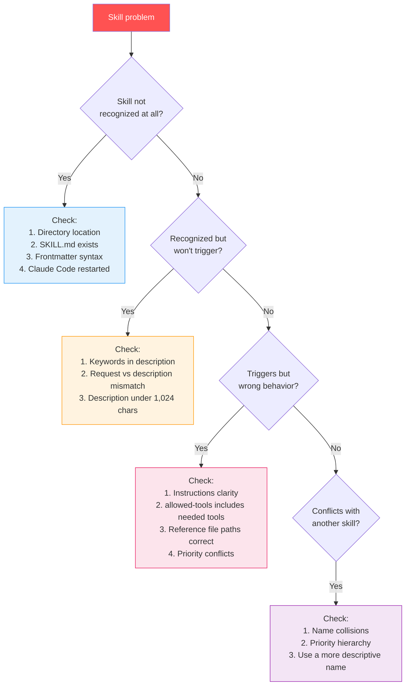

#### Common Problems and Solutions

| Symptom | Cause | Solution |
| --- | --- | --- |
| Skill not in list | Wrong location or missing SKILL.md | Verify directory path and file existence |
| Skill won't trigger | Description doesn't match request | Add user keywords to description |
| Wrong skill triggers | Description too generic | Make description more specific |
| Skill modifies files | allowed-tools not set | Add `allowed-tools: Read, Grep, Glob` |
| Priority conflict | Same-named skills in multiple locations | Use descriptive names |
| Changes not applied | Claude Code not restarted | Restart session |

#### Troubleshooting checklist

```markdown
# Skills troubleshooting checklist

## 1. Structural verification
- [ ] Does SKILL.md live in the correct directory?
- [ ] Is the frontmatter properly wrapped in `---`?
- [ ] Does `name` use only lowercase + numbers + hyphens?
- [ ] Is `description` within 1,024 characters?

## 2. Matching verification
- [ ] Does the description answer "what does it do?"
- [ ] Does the description answer "when to use it?"
- [ ] Does it include keywords the user actually types?

## 3. Behavior verification
- [ ] Did you restart Claude Code?
- [ ] Does allowed-tools include all the tools you need?
- [ ] Are reference file paths correct (relative)?

## 4. Conflict verification
- [ ] No same-name skill in another location?
- [ ] Have you checked the priority hierarchy?
```

> [!tip] Debugging tip: the /status command
> Claude Code's `/status` command surfaces configuration file errors. When you suspect a skill-related issue, run `/status` first.

> [!action] Exercise
> Open `IAS_03_troubleshooting.ipynb` to intentionally break things and practice debugging.

> [!ref] Source
> - Skilljar L06: Troubleshooting skills (434530)

---

## [Chapter 3] Self-Assessment & Summary

### 3.1 Self-Assessment Quiz (Q1-Q7)

> [!question] Q1. What is the core file of a Claude Code Skill?
> A) `CLAUDE.md`
> B) `SKILL.md`
> C) `skill.yaml`
> D) `config.json`
>
> > [!tip]- Answer
> > **Answer: B)** Each skill is defined by a `SKILL.md` file inside a directory. This file consists of YAML frontmatter (name, description metadata) and a Markdown body (actual instructions).

> [!question] Q2. What information does Claude Code load from skills at startup?
> A) The entire SKILL.md content
> B) Only name and description
> C) All frontmatter fields
> D) Code from the scripts/ directory
>
> > [!tip]- Answer
> > **Answer: B)** Claude Code loads only the `name` and `description` of all installed skills into the system prompt at startup. The full content is loaded only after matching with a user request. This is **Level 1 of Progressive Disclosure**.

> [!question] Q3. What is the difference between Personal and Project Skills?
> A) Personal applies to specific projects only, Project applies to all
> B) Personal is in `~/.claude/skills`, Project is in `.claude/skills`
> C) Personal has lower priority than Project
> D) Personal can be shared via Git, Project cannot
>
> > [!tip]- Answer
> > **Answer: B)** Personal Skills are in the home directory `~/.claude/skills` and apply to all projects. Project Skills are in the project root's `.claude/skills` and apply to that project only. Priority: Personal > Project.

> [!question] Q4. Which skill source has the highest priority?
> A) Personal Skills
> B) Project Skills
> C) Enterprise Skills
> D) Plugin Skills
>
> > [!tip]- Answer
> > **Answer: C)** Priority hierarchy: **Enterprise (1) > Personal (2) > Project (3) > Plugins (4)**. Enterprise managed settings have the highest priority.

> [!question] Q5. What is the purpose of the `allowed-tools` field?
> A) Restricts programming languages the skill can use
> B) Restricts tools Claude can use when the skill is active
> C) Restricts users who can install the skill
> D) Restricts files the skill can access
>
> > [!tip]- Answer
> > **Answer: B)** `allowed-tools` restricts the **tools** Claude can use when a skill is activated. For example, `allowed-tools: Read, Grep, Glob` means editing or writing tools cannot be used. Useful for read-only workflows.

> [!question] Q6. How should scripts/ files be used efficiently in Progressive Disclosure?
> A) Have Claude read the script to understand it
> B) Have Claude run the script so only the output goes into context
> C) Include the script inline in SKILL.md
> D) Summarize the script in the description
>
> > [!tip]- Answer
> > **Answer: B)** Scripts should be **run**, not **read**. When running a script, only the **output** consumes tokens, not the code itself. Use "Run this script" in SKILL.md for context efficiency.

> [!question] Q7. What should you check first when a skill fails to trigger?
> A) allowed-tools settings
> B) model field
> C) Whether description keywords match the user's request
> D) Whether scripts/ directory exists
>
> > [!tip]- Answer
> > **Answer: C)** Claude matches skills based on the `description`. The most common cause of trigger failure is insufficient keywords in the description that match how users actually phrase their requests.

---

### 3.2 Learning Summary

| Topic | Key Content | Section |
| --- | --- | --- |
| **Skills Definition** | Folder-based reusable instructions. SKILL.md + reference files | 1.1 |
| **SKILL.md Structure** | YAML frontmatter (name, description) + Markdown body | 1.1 |
| **Storage Locations** | Personal (`~/.claude/skills`) vs Project (`.claude/skills`) | 1.1 |
| **Skill Matching** | Load name+description at startup → semantic matching → confirm → full load | 1.2 |
| **Priority** | Enterprise > Personal > Project > Plugins | 1.2 |
| **Metadata** | name (required), description (required), allowed-tools (optional), model (optional) | 2.1 |
| **Progressive Disclosure** | Level 1 (meta) → Level 2 (body) → Level 3 (references) | 2.1 |
| **Feature Comparison** | CLAUDE.md (always), Skills (auto-match), Hooks (events), Commands (manual) | 2.2 |
| **Sharing Methods** | Git (team), plugins (community), Enterprise (organization) | 2.3 |
| **Troubleshooting** | Structure → Matching → Behavior → Conflict verification | 2.4 |

#### Learning Roadmap

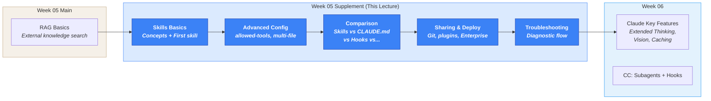

---

## Exercises

> All notebooks live in `03-Exercises/Week_05/skilljar/`.

> [!method] How to run the exercises
> Each notebook **extends the artifact from the previous notebook** in a build-up pattern.
> Follow them in order.

### Instructor notebooks — staged build-up

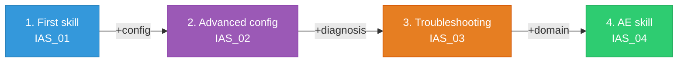

| Step | Notebook file | Added capability | Reference section |
| --- | --- | --- | --- |
| 1. First skill | `IAS_01_first_skill.ipynb` | Create a Personal skill + write SKILL.md + test | §1.1-1.2 |
| 2. Advanced config | `IAS_02_configuration.ipynb` | +allowed-tools + Progressive Disclosure + multi-file | §2.1 |
| 3. Troubleshooting | `IAS_03_troubleshooting.ipynb` | +inject errors → diagnose → fix | §2.4 |
| 4. AE domain | `IAS_04_structural_skill.ipynb` | **Architectural engineering domain** — KDS structural code review skill | Domain application |

### Student practice version

| Notebook file | Description |
| --- | --- |
| `IAS_05_skill_practice.ipynb` | Blank template — implement everything from skill definition to troubleshooting on your own |

> [!method] Structure of `IAS_04_structural_skill.ipynb`
> Practice the full Agent Skills workflow through a **KDS structural code review skill** that is familiar to architectural engineering students:
>
> | Stage | Technique | Goal |
> | --- | --- | --- |
> | v1 | Basic skill | Write SKILL.md to define RC member review instructions |
> | v2 | Advanced config | Implement read-only analysis mode using allowed-tools |
> | v3 | Multi-file | Split KDS code text into references/ + apply Progressive Disclosure |
>
> **Input variables**: KDS code clauses, concrete design parameters
> **Challenges**: writing effective descriptions, verifying auto-trigger, designing a team-sharable structure

### In-class execution order

> [!tip] In-class execution order
> **Ch.1 — Skills basics and your first skill** (50 min)
> 1. Open `IAS_01_first_skill.ipynb` → demo skill concepts + SKILL.md structure (15 min)
> 2. Continue `IAS_01` → write a Personal skill + test (15 min)
> 3. Student Q&A + concept recap (10 min)
>
> **Ch.2 — Advanced configuration and customization** (50 min)
> 4. Open `IAS_02_configuration.ipynb` → demo allowed-tools + Progressive Disclosure (15 min)
> 5. Open `IAS_03_troubleshooting.ipynb` → troubleshooting practice (15 min)
> 6. Distribute `IAS_04_structural_skill.ipynb` → architectural engineering domain extension (15 min)
> 7. Distribute `IAS_05_skill_practice.ipynb` → independent student practice (homework or self-study)

> [!ref] Source
> - Skilljar course: [Introduction to Agent Skills](https://anthropic.skilljar.com/introduction-to-agent-skills)
> - GitHub: [anthropics/skills](https://github.com/anthropics/skills)

---

## Claude Code Skills (Deep Dive)

> [!finding] CC skill for this supplement: the full Agent Skills lifecycle

This supplement is itself a deep dive into the Claude Code Skills track (Skills & Commands). The Skills system briefly introduced in the Week 05 main lecture is extended here into the **complete lifecycle**.

### What you learned in the main Week_05 lecture vs this supplement

| Week_05 main lecture | This supplement (Week_05_AgentSkills) |
| --- | --- |
| Introduction to the Skills concept | Six lessons of in-depth coverage |
| Basic SKILL.md structure | Complete set of YAML frontmatter fields + description authoring |
| The `.claude/skills/` location | Personal vs Project + priority hierarchy |
| A simple RAG-test skill example | allowed-tools, Progressive Disclosure, multi-file |
| — | Skills vs CLAUDE.md vs Hooks vs Subagents comparison |
| — | Git / plugin / Enterprise sharing strategies |
| — | Systematic troubleshooting |

### Architectural engineering application: KDS structural code review skill

```markdown
---
name: kds-structural-review
description: Reviews structural design against KDS 41 standards. Use when checking RC member design, verifying reinforcement ratios, or validating structural calculations against Korean Design Standards.
allowed-tools: Read, Grep, Glob, Bash
---

# KDS structural code review skill

## Purpose
Review RC member structural designs against the KDS 41 code.

## Review items
1. **Minimum reinforcement ratio** (per KDS 41 31 00)
2. **Maximum reinforcement ratio** (≤ 0.75 × balanced ratio)
3. **Shear reinforcement** (shear design criteria)
4. **Deflection check** (serviceability criteria)

## References
- See `references/kds41-values.md` for detailed reference values
- Run `scripts/check-reinforcement.py` for the calculation script

## Output format
| Review item | Code value | Design value | Verdict |
| --- | --- | --- | --- |
| Minimum reinforcement ratio | 0.25√fck/fy | (computed) | OK/NG |
```

> [!action] CC skill exercise
> This week's task: author the `kds-structural-review` skill in your project and verify the auto-trigger by asking Claude Code "review the reinforcement ratio of this RC beam."
>
> ```bash
> # From the project root
> mkdir -p .claude/skills/kds-structural-review/references
> # Write SKILL.md
> # Write references/kds41-values.md
> # Restart Claude Code, then test
> ```

---

## References

> [!ref] Official Documentation
> - [Claude Code Skills Documentation](https://docs.claude.com/en/docs/claude-code/skills)
> - [Agent Skills Overview](https://docs.claude.com/en/docs/agents-and-tools/agent-skills/overview)
> - [Agent Skills Open Standard](https://agentskills.io/)
> - [Claude Code Plugins](https://www.anthropic.com/news/claude-code-plugins)

> [!ref] Anthropic Blog
> - [Introducing Agent Skills](https://www.anthropic.com/news/skills) (2025.10.16)
> - [Equipping agents for the real world with Agent Skills](https://www.anthropic.com/engineering/equipping-agents-for-the-real-world-with-agent-skills) (2025.10.16)
> - [Organization Skills and Directory](https://claude.com/blog/organization-skills-and-directory) (2025.12.18)

> [!ref] Anthropic Education
> - [Introduction to Agent Skills (Skilljar)](https://anthropic.skilljar.com/introduction-to-agent-skills)
> - [Skills Cookbook (GitHub)](https://platform.claude.com/cookbook/skills-notebooks-01-skills-introduction)
> - [Example Skills Repository](https://github.com/anthropics/skills)

---

## Related

- [[Week_05|Week 5: RAG Basics and Hybrid Search (S4)]]
- [[Week_06|Week 6: Features of Claude (S5)]]
- [[00-Syllabus/LLM_AE_AI_Implementation_Syllabus_v2.3|Syllabus v2.3]]
