# Week 05: RAG and Agentic Search — Retrieval Augmented Generation (S4)

---

## 📌 Lecture Focus

**Ch.1 RAG Fundamentals & Pipeline**
- **Introducing RAG**: A technique used when large documents (e.g., an 800-page financial report) cannot fit entirely into the prompt — split the document into chunks and inject only the relevant pieces into the prompt
- **Text Chunking Strategies**: Size-based (with overlap), Structure-based (headers/sections), Sentence-based, Semantic-based — choose based on use case
- **Text Embeddings**: Convert meaning into numerical vectors — generate embeddings with VoyageAI (`voyage-3-large`), each dimension in the range -1 to +1
- **The Full RAG Flow**: chunking → embedding → vector DB storage → query embedding → cosine similarity search → injection into Claude prompt
- **RAG Implementation**: A hands-on 5-stage pipeline built into a `VectorIndex` class (`chunk_by_section` → `generate_embedding` → `add_vector` → `search`)

**Ch.2 Hybrid Search & Multi-Index Pipeline**
- **BM25 Lexical Search**: Solves the problem where semantic search alone misses exact terms like "INC-2023-Q4-011" — an algorithm based on tokenization, frequency, and rarity weighting
- **Semantic–Lexical Hybrid**: Run both searches in parallel and merge results — complementary strengths of conceptual similarity + exact matching
- **Reciprocal Rank Fusion (RRF)**: `RRF_score(d) = Σ(1 / (k + rank_i(d)))` — a rank fusion technique that fairly combines different scoring schemes
- **Multi-Index Retriever**: `VectorIndex` and `BM25Index` share the same API (`add_document`, `search`) → unified via a `Retriever` class → easy extension when new retrievers are added

**Integration Cycle**: chunking → embedding → vector search → BM25 → Multi-Index

In Ch.1 we complete a minimal RAG based on a **single index (semantic search)**, and in Ch.2 we strengthen it with a **dual index + RRF fusion**. Each lesson builds on the code from the previous lesson, and all code is written **from scratch** without external libraries (like LangChain) so that students fully understand the internal mechanics.

**Core Tech Stack (introduced this week)**:
- **VoyageAI** (`voyageai` library, `voyage-3-large` model) — Anthropic's recommended embedding provider, requires a separate API key (`VOYAGE_API_KEY`)
- **Cosine Similarity / Cosine Distance** — `distance = 1 - similarity`, measures the angle between normalized vectors on the unit circle
- **`VectorIndex` / `BM25Index`** — search index classes sharing the same `add_document` · `search` API
- **Reciprocal Rank Fusion (RRF)** — default constant `k=60`, but we use `k=1` in class for transparency
- **`SearchIndex` Protocol** — an extensible interface based on Python `typing.Protocol`

---

## 🎯 Learning Objectives

After completing this module, you will be able to:

**Ch.1 RAG Fundamentals & Pipeline**
- Explain the limitations of placing large documents directly in the prompt (length limits, quality degradation, increased cost, increased latency) and describe how RAG addresses them
- Compare four chunking strategies (Size / Structure / Sentence / Semantic) and choose one that fits the document's characteristics
- Implement `chunk_by_char`, `chunk_by_section`, and `chunk_by_sentence` functions directly and explain the effect of the overlap parameter
- Write a `generate_embedding` function with the VoyageAI client to convert text into vectors
- Understand cosine similarity and cosine distance and compute similarity between normalized vectors
- Store embeddings together with their original text in a `VectorIndex` and implement the full flow that injects top-k search results into the Claude prompt

**Ch.2 Hybrid Search & Multi-Index Pipeline**
- Reproduce cases where semantic-only search fails (exact IDs, rare terms) and explain the 4-stage BM25 logic (tokenization → frequency aggregation → weighting → matching)
- Implement `BM25Index` with the same API as `VectorIndex`
- Merge two ranked result lists with the RRF formula and analyze how the constant `k` affects the outcome
- Write a `Retriever` class that wraps multiple indexes and returns unified search results
- Leverage the extensibility of the `SearchIndex` protocol to propose designs that add new search methods (keyword, graph, or domain-specific)

**Integrated Competency**
- Implement an end-to-end large-report RAG pipeline (chunking → dual index → RRF merge → Claude response) and deliver a production-style system that compensates for the limitations of semantic and lexical search
- Using a common-API design (`add_document` / `search`), extend the system with **new search methods** (keyword, domain-specific indexes, etc.) without modifying existing code
- Apply the pipeline to domain documents such as structural engineering reports and papers to evolve a specialized-knowledge QA prototype into a production-ready form

---

## 🤔 Why Learn This? — "Making Claude Understand Large-Scale Documents"

> [!question] In [[Week_04]] we learned how to hand Claude **tools (Tool Use)**. But tools alone cannot help Claude understand an entire 800-page financial report. Week 05 teaches the pipeline for **systematically retrieving external knowledge and injecting it into Claude's context**.

### Limitations When Claude Handles Large Documents

When you ask "What are this company's risk factors?" about an 800-page financial report, stuffing the entire document into the prompt hits four limits — **hard prompt-length limits**, **degraded Claude performance on very long prompts**, **increased cost**, and **increased latency**. RAG (Retrieval Augmented Generation) is the standard approach to solve this — preprocess the document into chunks, and inject only the pieces relevant to the question into the prompt.

RAG is a trade-off that trades simplicity for **scalability and efficiency**. Implementation involves several technical choices such as deciding the chunking strategy, selecting the retrieval mechanism, and accepting some lost context — but in return you can handle large document collections that are impossible with a single prompt. In particular, **semantic search** alone tends to miss rare IDs like "INC-2023-Q4-011," so this week we also cover a hybrid design that overcomes this limitation by adding **BM25 lexical search**.

### Prompt → Tool Use → RAG Evolution

| Week 03: Prompt Engineering | Week 04: Tool Use | **Week 05: RAG** |
| --- | --- | --- |
| **Approach**: Improve response quality with roles, structure, examples | **Approach**: Dynamic behavior through external function calls | **Approach**: Retrieve external knowledge and inject it as context |
| **External Data**: None (based on training data) | **External Data**: Single lookups to APIs/DBs | **External Data**: Search over a **large document corpus** |
| **Scale**: Single prompt | **Scale**: Function-level tasks | **Scale**: **Hundreds of pages ~ multiple documents** |
| **Use Cases**: Controlling answer quality | **Use Cases**: Real-time info, task automation | **Use Cases**: **Document QA, technical reports, domain knowledge** |

### Real-World Scenario: When Semantic Search Fails

In the latter half of this week we trace the following example. When you ask a company report **"How was incident INC-2023-Q4-011 handled?"**, semantic search returns both the cybersecurity section (which contains the actual incident ID) and the financial analysis section (which has no incident ID) — because it only looks at semantic similarity of words. **BM25 assigns high weight to rare tokens like "INC-2023-Q4-011,"** precisely picking out the actually matching document. When both searches are **fused with RRF**, chunks that score highly on both semantic and lexical dimensions rise to the top.

### This Week's Project: Large-Scale Report RAG Pipeline

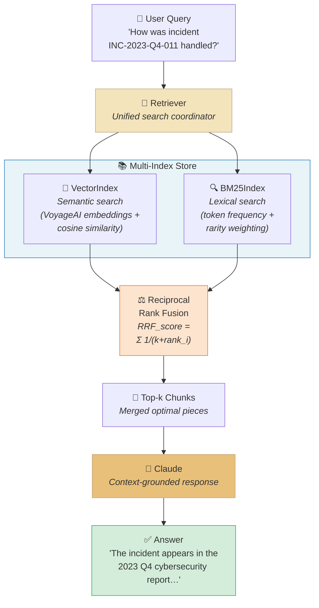

When a user's natural-language question arrives, the `Retriever` queries both the **semantic-based** `VectorIndex` and the **lexical-based** `BM25Index` simultaneously. The two result lists are fairly merged by the **RRF formula** and passed to Claude as top-k chunks. This week we build this pipeline **from scratch**.

The core design principle is a **common interface**. Because both `VectorIndex` and `BM25Index` share the `add_document()` and `search()` methods, the `Retriever` is not coupled to any specific implementation. Thanks to this, even when we later add a keyword index, graph search, or domain-specific index, the `Retriever` automatically includes them in the RRF fusion without modification — it is also a hands-on drill in the SOLID principles of **Dependency Inversion** and **Open-Closed**.

### Anthropic Skilljar Course

This lecture note is based on Anthropic's official education platform Skilljar's **"Building with the Claude API" Section 4: RAG and Agentic Search** (7 lessons L01~L07).

| Lesson | Title | Week 05 Mapping |
|---|---|---|
| L01 | Introducing Retrieval Augmented Generation | Ch.1 intro — the large-document problem |
| L02 | Text chunking strategies | Ch.1 — 4 chunking strategies |
| L03 | Text embeddings | Ch.1 — VoyageAI embeddings |
| L04 | The full RAG flow | Ch.1 — cosine similarity, normalization |
| L05 | Implementing the RAG flow | Ch.1 — `VectorIndex` implementation |
| L06 | BM25 lexical search | Ch.2 — lexical search algorithm |
| L07 | A Multi-Index RAG pipeline | Ch.2 — `Retriever` + RRF |

In the previous week [[Week_04]] we gave Claude the ability to invoke external functions through Tool Use; this week we study the pipeline engineering of **structuring an entire external knowledge collection into a searchable form**. Next week [[Week_06]] continues with **Features of Claude** (Extended Thinking, Vision, Prompt Caching) and covers performance and cost optimization techniques for RAG pipelines — in particular, Prompt Caching is a key feature that dramatically reduces the repeated-call cost of large-document QA and applies directly to the pipeline built this week.

This week is also training in understanding RAG as a **production system**. The effect of a single chunking parameter (e.g., `chunk_size`, `overlap` size) on retrieval quality, the structure in which lexical search catches **false positives** from semantic search, and the sensitivity of the RRF constant `k` on fusion results — these are all axes that must be tuned in practice. The class explicitly surfaces the trade-offs of each choice so that students internalize **evidence-based decision making**.

> [!ref] Source Mapping
> - Online Course: [Building with the Claude API](https://anthropic.skilljar.com/claude-with-the-anthropic-api)
> - GitHub Exercises: [RAG](https://github.com/anthropics/courses/tree/master/RAG)
> - Syllabus Mapping: **Building — S4 (RAG and Agentic Search) → W5**

> [!method] Prerequisites / Setup
> - **VoyageAI account and API key**: sign up for free at [voyageai.com](https://www.voyageai.com/) → add `VOYAGE_API_KEY="..."` to your `.env` file
> - **Python packages**: `pip install voyageai python-dotenv anthropic` — only `voyageai` needs to be added to the existing Week 02~04 environment
> - **Sample report data**: `report.md` (a sample document with Financial, R&D, and Software sections) — provided with the exercise notebooks
> - **Notebook order**: `S4_01_chunking.ipynb` → `S4_02_embeddings.ipynb` → `S4_03_vector_search.ipynb` → `S4_04_bm25.ipynb` → `S4_05_hybrid_rag.ipynb` → `S4_06_rag_practice.ipynb` (student exercise) → `S4_07_structural_rag.ipynb` (structural engineering domain application)

---
## [Chapter 1] RAG Basics and Pipeline (L01-L05)

### 1.1 Introducing RAG — Why Do We Need RAG? (L01)

When you want Claude to answer questions about a large document, there are two paths: **stuff the entire document into the prompt**, or **extract only the relevant portions and pass them along**. **RAG (Retrieval Augmented Generation)** systematizes the latter approach — it splits documents into small chunks in advance, then selects only the chunks most relevant to the user's question and injects them into the prompt.

![[skilljar-s4/L01-01-problem.jpg]]
*The problem with large documents — you want to ask questions like "What risk factors does this company face?" about an 800-page financial document, but prompt length has limits*

#### Scenario: An 800-Page Financial Document

Suppose you have an **800-page financial report** and want to ask Claude, "What are the risk factors this company faces?" To answer this properly, you must somehow deliver the relevant information from the document to Claude. But there is a practical limit to how much text can fit in a prompt.

#### Option 1: Include Everything in the Prompt

The simplest approach is to extract the entire document text and insert it directly into the prompt along with the user's question.

```
Answer the user's question about the financial document.

<user_question>
{user_question}
</user_question>

<financial_document>
{financial_document}
</financial_document>
```

![[skilljar-s4/L01-05-option1.jpg]]
*Option 1: Insert the entire document into the prompt — simple but with serious limitations*

The limits of this approach are clear:

- **Prompt length limits** — if the document is too long, it won't fit at all
- **Performance degradation on long prompts** — Claude's accuracy drops on very long prompts
- **Increased cost** — larger prompts mean higher input token costs
- **Response latency** — processing time grows

#### Option 2: Split the Document into Chunks

RAG takes a smarter approach. In a **preprocessing stage**, the document is split into many small chunks; when a user question arrives, **only the chunks most relevant to the question** are found and included in the prompt.

![[skilljar-s4/L01-08-option2.jpg]]
*Option 2: Split the document into chunks — selectively include only chunks related to the question*

For example, when the question "What risks does this company face?" comes in, the chunk store is searched to find chunks corresponding to the "Risk Factors" section, and only those chunks are inserted into the prompt.

![[skilljar-s4/L01-09-relevant-chunk.jpg]]
*Selectively injecting only relevant chunks — the prompt becomes smaller and Claude can focus solely on the relevant information*

#### Option 1 vs Option 2 Comparison

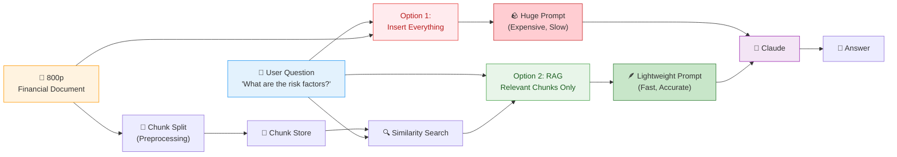

#### Benefits and Challenges of RAG

| Category | Detail |
|---|---|
| **✅ Benefit** | Focus only on relevant content |
| **✅ Benefit** | Scales to very large documents |
| **✅ Benefit** | Supports multiple documents |
| **✅ Benefit** | Smaller prompt → cost savings + faster response |
| **⚠️ Challenge** | Requires a preprocessing stage to split documents into chunks |
| **⚠️ Challenge** | Requires a retrieval mechanism to find "relevant" chunks |
| **⚠️ Challenge** | The selected chunks may not contain all the context Claude needs |
| **⚠️ Challenge** | There are countless chunking methods — which is best? |

#### When Should You Use RAG?

RAG involves many technical decisions and more work than simply stuffing everything into the prompt. You therefore need to judge whether **the complexity is worth the trade-off**. It is especially valuable in these cases:

- Very **large single documents** (hundreds of pages)
- **Multi-document** collections
- Production environments where **cost and performance optimization** matter

> [!finding] RAG's Core Trade-Off
> RAG is a technique that **sacrifices simplicity to gain scalability and efficiency**. Implementation overhead grows, but you can handle document collections at a scale that would be impossible with simple prompt stuffing.

> [!tip] Key Insight
> The essence of RAG is "**picking only the relevant parts**." Retrieval quality equals answer quality — the chunking, embedding, and search steps covered in sections 1.2–1.5 are all machinery for measuring that "relevance" precisely.

> [!ref] Source
> - Skilljar L01 — Introducing Retrieval Augmented Generation (287763)

---

### 1.2 Text Chunking Strategies (L02)

How you split documents is **one of the most important decisions** in a RAG pipeline. A poor chunking strategy injects irrelevant context into the prompt and ultimately leads Claude to produce a completely wrong answer.

![[skilljar-s4/L02-01-pipeline.jpg]]
*Where chunking sits in the RAG pipeline — the first preprocessing step after document input*

#### Example of Bad Chunking: The "bug" Problem

Imagine this scenario. A document contains both a **Medical Research** section and a **Software Engineering** section. A user asks, "How many bugs did engineers fix this year?" But if chunking is poorly done, a chunk from the medical research section containing **"bug" in a different sense (meaning a pathogen/insect)** is retrieved, producing a nonsensical answer.

![[skilljar-s4/L02-04-bad-chunk.jpg]]
*Bad chunking example — a medical research chunk is wrongly matched to a software question because of the word "bug"*

This is why chunking strategy matters. Now let's look at three main approaches.

#### Strategy ① Size-Based Chunking

The simplest approach. Text is cut into **equal-length character strings**. For example, a 325-character document is split into three 108-character chunks.

![[skilljar-s4/L02-05-size.jpg]]
*Size-based chunking — uniform splits at equal lengths*

The problem is that sentences get cut in the middle.

![[skilljar-s4/L02-06-size-problem.jpg]]
*The limits of size-based chunking — words are cut mid-word, section headers are separated from their bodies, and surrounding context is lost*

Key drawbacks:

- Words are **cut mid-sentence**
- **Chunks lose** important surrounding context
- **Section headers can be separated** from their bodies

![[skilljar-s4/L02-07-overlap.jpg]]
*Introducing overlap — neighboring chunks share a fixed number of characters to reduce context loss*

To mitigate this, we introduce **overlap** (sharing between chunks). Each chunk includes a portion of characters from its neighbor to preserve context and prevent clean word breaks.

![[skilljar-s4/L02-08-code.jpg]]
*Python implementation — pulls start_idx back by the overlap amount to set the next chunk's starting point*

```python
def chunk_by_char(text, chunk_size=150, chunk_overlap=20):
    chunks = []
    start_idx = 0

    while start_idx < len(text):
        end_idx = min(start_idx + chunk_size, len(text))
        chunk_text = text[start_idx:end_idx]
        chunks.append(chunk_text)

        start_idx = (
            end_idx - chunk_overlap if end_idx < len(text) else len(text)
        )

    return chunks
```

#### Strategy ② Structure-Based Chunking

Split based on the document's **natural structure** (headers, paragraphs, sections). Works best on well-formatted documents like Markdown files.

![[skilljar-s4/L02-09-structure.jpg]]
*Structure-based chunking — uses Markdown's `##` headers as boundaries to create section-level chunks*

```python
def chunk_by_section(document_text):
    pattern = r"\n## "
    return re.split(pattern, document_text)
```

Since each chunk forms a **meaningful, complete section**, this gives the cleanest results. The downside is that it can only be used **when document structure is guaranteed** — real-world plain text and PDFs often lack clear structural markers.

#### Strategy ③ Semantic-Based Chunking

The most sophisticated approach. Text is split into sentences, then **NLP is used to evaluate the relatedness of adjacent sentences**, grouping related sentences together into chunks. Computationally expensive and complex to implement, but produces the most relevant chunks.

#### Strategy ④ Sentence-Based Chunking — A Practical Middle Ground

Split into sentences using regex, then bundle a fixed number of sentences per chunk. Simple to implement while avoiding the word-breaking problem.

```python
def chunk_by_sentence(text, max_sentences_per_chunk=5, overlap_sentences=1):
    sentences = re.split(r"(?<=[.!?])\s+", text)

    chunks = []
    start_idx = 0

    while start_idx < len(sentences):
        end_idx = min(start_idx + max_sentences_per_chunk, len(sentences))
        current_chunk = sentences[start_idx:end_idx]
        chunks.append(" ".join(current_chunk))

        start_idx += max_sentences_per_chunk - overlap_sentences

        if start_idx < 0:
            start_idx = 0

    return chunks
```

#### Strategy Selection Guide

| Strategy | Pros | Cons | Recommended For |
|---|---|---|---|
| **Structure-based** | Preserves meaning units, cleanest | Format constraints | Internal reports, Markdown docs |
| **Sentence-based** | No word breaks, moderately simple | Ignores section boundaries | General text documents |
| **Size-based + overlap** | Works for any format, simple to implement | Incomplete chunk meaning | Mixed formats, code-containing docs, production fallback |
| **Semantic-based** | Best quality | High compute cost, complex | When quality is paramount |

#### Decision Tree

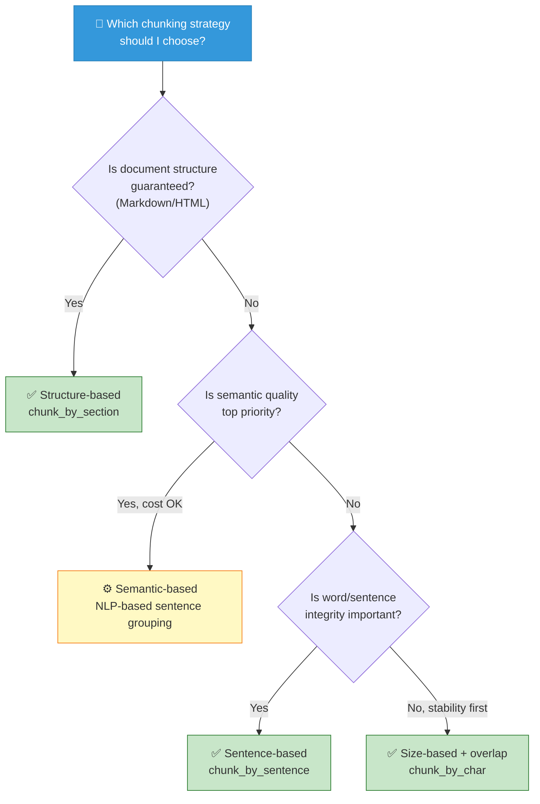

> [!method] Production Default
> If you're not sure, **size-based + overlap** is the safest bet. It works for any format and, while imperfect, produces consistent chunks without breaking the pipeline. Empirically, when you control the document format, upgrading to **structure-based** is the first step toward quality improvement.

> [!tip] There Is No Single Right Answer
> There is no "best chunking strategy." The right answer depends on document characteristics, use cases, and how you set the **trade-off between implementation complexity and chunk quality**.

> [!action] Exercise Notebook
> 📂 Run the three functions `chunk_by_char`, `chunk_by_sentence`, and `chunk_by_section` yourself and compare the resulting chunks.
> `03-Exercises/Week_05/skilljar/[[S4_01_chunking]].ipynb`

> [!ref] Source
> - Skilljar L02 — Text chunking strategies (287776)

---

### 1.3 Text Embeddings (L03)

After splitting a document into chunks, the next step is **finding "the chunks most relevant to the user's question."** This is essentially a search problem — we must scan all chunks and pick out those connected to the question.

![[skilljar-s4/L03-03-search-problem.jpg]]
*The search problem — among many chunks, we must select only those relevant to the user's question*

#### Semantic Search vs Keyword Search

Traditional keyword search only finds **exact word matches**. When the question "engineer bug fix" comes in, chunks without the words "engineer," "bug," or "fix" are missed even if they are relevant.

**Semantic search** uses **embeddings** to understand and compare the **meaning and context** of the question and the chunks.

![[skilljar-s4/L03-04-semantic.jpg]]
*Semantic search — finds semantically close chunks even when words don't match*

#### What Is a Text Embedding?

A **text embedding** is a representation of the meaning within text as a **numeric array**. It converts human language into a form a computer can handle mathematically.

![[skilljar-s4/L03-07-process.jpg]]
*Embedding generation process — text is fed to the embedding model → a numeric array is returned*

Generation steps:

1. Feed text into an embedding model
2. The model returns a **long numeric array** (the embedding)
3. Each number falls **between -1 and +1**
4. These numbers represent various **qualities/dimensions** of the input text

#### What the Numbers Mean — We Can't Directly Interpret Them

Each number is a score for some "quality" of the input text. But here's the important caveat — **we ourselves don't know what each number specifically represents.**

![[skilljar-s4/L03-09-numbers.jpg]]
*Each dimension of an embedding — "how happy," "how much it talks about the ocean" are conceptual examples only; the actual meanings are latent inside the model through training*

Imagining "the first number is how happy the text is" or "the second number is how much the text is about the ocean" **helps understanding but isn't reality**. The actual meaning of each dimension is determined by the model during training and cannot be directly interpreted by humans.

#### Using VoyageAI — Anthropic Does Not Provide Embeddings

Anthropic currently **does not offer an embedding generation API**. The recommended alternative is **VoyageAI**. To use it:

- Sign up for a VoyageAI account (separate)
- Issue an API key (free to start)
- Add the key to environment variables

![[skilljar-s4/L03-15-voyage.jpg]]
*VoyageAI setup — the embedding provider recommended within the Anthropic ecosystem*

`.env` file:

```
VOYAGE_API_KEY="your_key_here"
```

#### Python Implementation

First, install the library:

```
%pip install voyageai
```

Initialize the client and create the embedding generation function:

```python
from dotenv import load_dotenv
import voyageai

load_dotenv()
client = voyageai.Client()

def generate_embedding(text, model="voyage-3-large", input_type="query"):
    result = client.embed([text], model=model, input_type=input_type)
    return result.embeddings[0]
```

![[skilljar-s4/L03-18-impl.jpg]]
*generate_embedding implementation — called with model voyage-3-large and input_type="query"*

Applying the function to a text chunk returns a **list of floating-point numbers**. Generation is fast and simple — but the real challenge is **how to compare these embeddings and use them effectively in the RAG pipeline.**

![[skilljar-s4/L03-19-compare.jpg]]
*Comparing embeddings — the next step is finding which embedding is most similar to the user's question*

#### Embedding Generation Flow

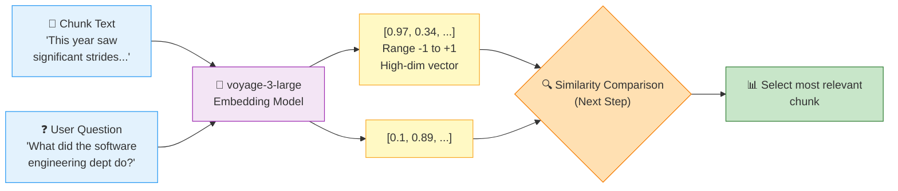

> [!finding] The Essence of Embeddings
> Embeddings are "**a device for translating meaning into mathematics**." Even when words don't match, texts of similar meaning end up close together in vector space — this property enables **semantic search** that doesn't rely on keyword matching.

> [!tip] input_type="query" vs "document"
> VoyageAI lets you embed separately for **queries** and **documents**. To improve retrieval accuracy, it's recommended to call stored chunks with `input_type="document"` and search questions with `input_type="query"`.

> [!action] Exercise Notebook
> 📂 Generate real embeddings with VoyageAI and check the semantic distance between two texts.
> `03-Exercises/Week_05/skilljar/[[S4_02_embeddings]].ipynb`

> [!ref] Source
> - Skilljar L03 — Text embeddings (287759)

---

### 1.4 The Complete RAG Flow (L04)

The RAG basics, chunking, and embeddings we've learned so far — let's trace end-to-end how these pieces **come together as a single pipeline**. It consists of **6 total steps**.

#### Step 1: Split Source Text into Chunks

We use two example sections:

- **Section 1 (Medical Research)**: "This year saw significant strides in our understanding of XDR-47, a 'bug' we have not seen before."
- **Section 2 (Software Engineering)**: "This division dedicated significant effort to studying various infection vectors in our distributed systems"

**Point to notice**: the medical section contains "bug" (which looks like a software term) and the software section contains "infection vectors" (which look like medical terms) — a situation where keyword search can easily be fooled.

#### Step 2: Generate Embeddings

Each chunk is passed through the embedding model. To aid understanding, imagine **"a fictional embedding model that returns exactly 2 numbers."** Also assume we know what the two dimensions mean:

- First number = how much the text talks about **medicine**
- Second number = how much the text talks about **software engineering**

![[skilljar-s4/L04-02-imaginary.jpg]]
*Imaginary 2D embedding model — first dimension is medical relevance, second dimension is software relevance*

- **Medical Research chunk** → `[0.97, 0.34]` (strong medical tendency; slight software component due to "bug")
- **Software Engineering chunk** → `[0.30, 0.97]` (strong software tendency; slight medical component due to "infection vectors")

#### Normalization — Projecting onto the Unit Circle

Embedding APIs typically auto-perform a **normalization step that scales the vector's magnitude to 1.0**.

![[skilljar-s4/L04-07-normalization.jpg]]
*Normalization — each vector is scaled to length 1. The formula itself is handled by the API*

Normalization results:

- `[0.97, 0.34]` → `[0.944, 0.331]`
- `[0.30, 0.97]` → `[0.295, 0.955]`

![[skilljar-s4/L04-08-unit-circle.jpg]]
*Unit circle visualization — each normalized chunk is represented as a point on a circle of radius 1*

#### Step 3: Store in Vector Database

Normalized embeddings are stored in a **vector database**. A vector DB is a specialized database optimized for **storing, comparing, and searching** long numeric arrays.

![[skilljar-s4/L04-09-vector-db.jpg]]
*Vector database — a database specialized for storing embeddings and performing similarity search*

At this point **the pipeline pauses.** Everything performed so far is **preprocessing** — work done in advance, before the user asks a question. Now we wait for the user's question.

#### Step 4: Process the User Question

The user asks: "I'm curious about the company. In particular, what did the software engineering dept do this year?"

![[skilljar-s4/L04-10-query.jpg]]
*Converting the user question into an embedding — must use the same model used for stored chunks*

Passing this question through the **same embedding model** yields something like `[0.1, 0.89]` — low medical component, high software component. After normalization it becomes `[0.112, 0.993]`.

#### Step 5: Find the Most Similar Embedding

The question embedding is sent to the vector DB to request the **most similar stored embedding**.

![[skilljar-s4/L04-12-search.jpg]]
*Similarity search — compute cosine similarity between the question vector and each stored vector*

The DB returns the Software Engineering section — because it is closest to what the user is asking about.

#### Cosine Similarity — How Do We Measure Similarity?

The vector DB measures similarity between two vectors using **cosine similarity**. This is **the cosine of the angle** between two vectors.

![[skilljar-s4/L04-15-cosine.jpg]]
*Cosine similarity — the cosine value of the angle between two vectors*

Key properties:

| Value | Meaning |
|---|---|
| **Close to 1** | Very similar (same direction) |
| **0** | Unrelated (orthogonal) |
| **Close to -1** | Very different (opposite direction) |
| Range | **-1 to 1** |

**Calculated results for this example**:

- User question vs Software Engineering chunk → **0.983** (very high similarity)
- User question vs Medical Research chunk → **0.398** (much lower)

#### Cosine Distance — The Flipped Form of Similarity

In vector DB documentation you often see the term **"cosine distance."** It is simply `(1 - cosine similarity)`.

- Closer to 0 → more **similar**
- Larger value → **less similar**

Depending on context, "distance is 0.017" can be more intuitive than "similarity is 0.983."

#### Step 6: Build the Final Prompt

Combine the most relevant chunk with the user's question and pass them to Claude.

![[skilljar-s4/L04-19-final-prompt.jpg]]
*Final prompt — user question + retrieved relevant chunk → Claude response*

```
Answer the user's question about the financial document.

<user_question>
How many bugs did engineers fix this year?
</user_question>

<report>
## Section 2: Software Engineering
This division dedicated significant effort to studying various infection vectors in our distributed systems
</report>
```

#### End-to-End RAG Sequence

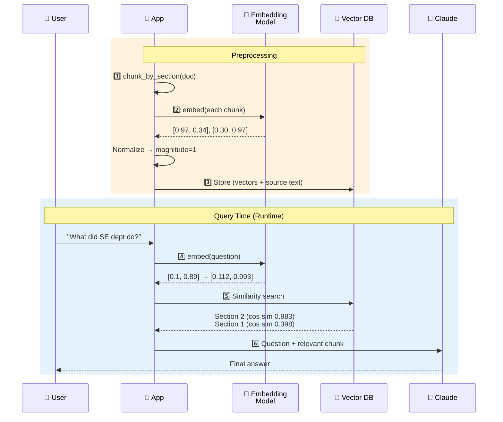

> [!method] RAG 6-Step Summary
> **3 preprocessing steps** (Chunk → Embed → Store) + **3 query steps** (Query embed → Similarity search → Prompt). The first three run **before the user asks a question**, while the last three run **in real time**. This separation creates RAG's scalability — once indexed, you can respond quickly to countless queries.

> [!finding] Why Cosine?
> On normalized vectors, cosine similarity measures **how aligned the directions of two vectors are**. By discarding magnitude and keeping only direction, it lets you compare **semantic similarity without being swayed by text length** — which is why cosine is the standard in RAG retrieval.

> [!tip] Common-Sense Validation
> 0.983 (Software) vs 0.398 (Medical) — the bigger this gap, the higher the retrieval quality. If the two values come out similar around 0.7, it's time to revisit your **chunking strategy or embedding model**.

> [!ref] Source
> - Skilljar L04 — The full RAG flow (287764)

---

### 1.5 Implementing RAG (L05)

Now let's translate the concepts so far into **actual code**. We assemble the three elements — `chunk_by_section`, `generate_embedding`, and `VectorIndex` — into a complete RAG pipeline.

#### 5-Step Implementation Checklist

1. Chunk the text by section
2. Generate embeddings for each chunk
3. Build a vector store and add the embeddings
4. Embed the user's question
5. Retrieve the most relevant chunks from the store

![[skilljar-s4/L05-10-diagram.jpg]]
*L05 RAG implementation diagram — the user question is converted into an embedding to find the most relevant content in the vector DB*

#### Step 1: Chunking

Load the document and split it by sections.

```python
with open("./report.md", "r") as f:
    text = f.read()

chunks = chunk_by_section(text)
chunks[2]  # Test to see the table of contents
```

We reuse `chunk_by_section` defined in section 1.2 as-is.

#### Step 2: Batch Embedding

```python
embeddings = generate_embedding(chunks)
```

Here `generate_embedding` has been extended to accept **not just a single string but also a list**. Batch processing is efficient.

#### Step 3: Build the Vector Store

```python
store = VectorIndex()

for embedding, chunk in zip(embeddings, chunks):
    store.add_vector(embedding, {"content": chunk})
```

**Key point**: we don't store just the embedding but also **save the source text together** in the form `{"content": chunk}`. Getting a vector back from a search is useless to humans — what we put in the final prompt is ultimately the source text.

> [!finding] Why Store the Source Text Together?
> After retrieving from the vector DB, you ultimately need **"human-readable text to pass to Claude."** Getting back only a numeric array leaves you with nothing to do. So the standard pattern is to store the **source chunk (or its reference)** alongside each embedding.

#### Step 4: Embed the User Query

```python
user_embedding = generate_embedding("What did the software engineering dept do last year?")
```

Using the same `generate_embedding` function projects the question into the **same embedding space as the stored chunks**.

#### Step 5: Similarity Search

```python
results = store.search(user_embedding, 2)

for doc, distance in results:
    print(distance, "\n", doc["content"][0:200], "\n")
```

`store.search(user_embedding, 2)` — returns the **2** closest chunks along with their similarity scores (cosine distance).

![[skilljar-s4/L05-12-results.jpg]]
*Search results — lower distance values indicate closer chunks*

#### Interpreting the Results

Results you obtain when actually running it:

| Rank | Section | Cosine Distance | Interpretation |
|:---:|---|:---:|---|
| 1 | **Section 2: Software Engineering** | **0.71** | Closest to the question |
| 2 | **Methodology** | **0.72** | 2nd by a narrow margin |

**Lower distance = more similar.** Section 2 is very slightly closer than the Methodology section — because the question directly points to the software engineering department.

#### 5-Step Pipeline Flow

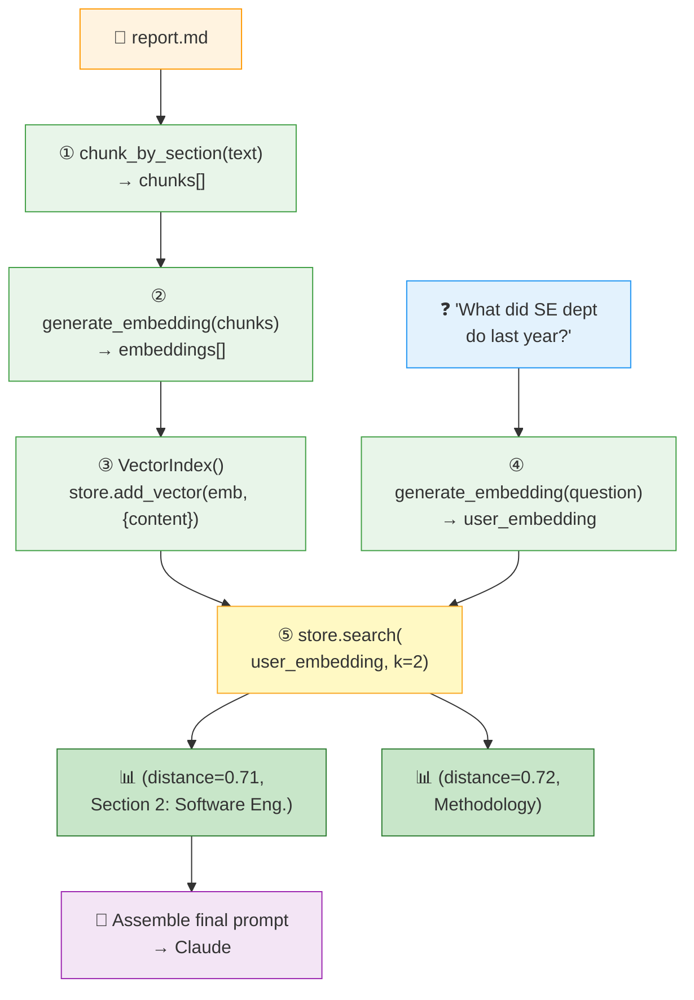

#### Next Steps — Limitations of This Implementation

This basic implementation works well in many cases, but there are **specific scenarios where it doesn't behave as expected**. For instance, when searching by a unique incident ID like `"INC-2023-Q4-011"`, semantic search may fetch an unrelated section that is only semantically similar. Chapter 2 addresses this by covering hybrid RAG techniques that supplement with **BM25 lexical search**.

> [!tip] Key Summary
> The essence of RAG is simple — **turn text into numbers (embeddings), store those numbers efficiently, then when the user asks a question, use mathematical similarity to find relevant content.** All the advanced techniques that follow (BM25, reciprocal rank fusion, multi-index) are improvements layered on top of these fundamentals.

> [!method] Runtime vs Preprocessing
> Steps 1–3 need to run **only once** when documents are added (preprocessing). Steps 4–5 run **every time** the user asks a question (runtime). Properly maintaining this separation is the key to running RAG in production.

> [!action] Exercise Notebook
> 📂 Execute the actual `VectorIndex` implementation + the entire 5-step pipeline in code, and verify the distance 0.71 / 0.72 results yourself.
> `03-Exercises/Week_05/skilljar/[[S4_03_vector_search]].ipynb`

> [!ref] Source
> - Skilljar L05 — Implementing the RAG flow (287761)

---
## [Chapter 2] Hybrid Search & Multi-Index Pipeline (L06-L07)

In Chapter 1 we completed the core RAG flow — chunking text, numerically encoding it with embeddings, performing **semantic search** via cosine similarity, and then handing the retrieved results to Claude as context. Yet there are problems that semantic search alone cannot solve.

Consider a question like "Tell me about the `INC-2023-Q4-011` incident." `INC-2023-Q4-011` is a specific incident identifier — countless sentences may be semantically similar, but only one document actually contains this code. Semantic search will pull in **financial analysis sections** where the concept of "incident" appears, while potentially missing the very section that contains the identifier itself.

The classical technique that solves this problem is **BM25 lexical search**, and the approach of running it in parallel with semantic search and merging the results is called **hybrid search**. Chapter 2 builds this structure in two steps — implementing BM25 in L06, then in L07 wrapping both indexes into a single **Retriever abstraction** and fusing them with **Reciprocal Rank Fusion (RRF)**.

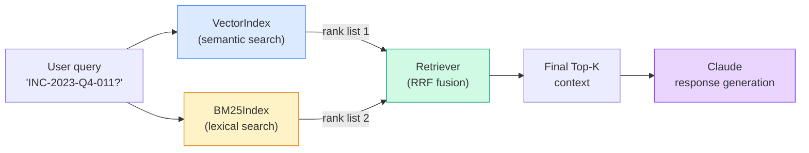

> [!finding] Goals for Chapter 2
> - **L06**: Understand the limits of semantic search alone and implement the 4 steps of the BM25 algorithm directly.
> - **L07**: Integrate VectorIndex + BM25Index into a single Retriever class and reproduce the process of merging ranks with the RRF formula.
> - **Extensibility**: Internalize an architecture where conforming to the single `SearchIndex` protocol lets you freely add keyword/graph/domain indexes.

---

### 2.1 BM25 Lexical Search (L06)

#### 2.1.1 Why Semantic Search Alone Is Not Enough

The first example in the L06 transcript is very clear. When the user asks `"What happened with INC-2023-Q4-011?"`, **the result using only semantic search is as follows**.

![[skilljar-s4/L06-05-semantic-fail.jpg]]

Quoting the transcript directly —

> Semantic search returned the cybersecurity section (which actually contains the incident ID), but it also returned a **financial analysis section** that never mentions the incident at all. This happens because semantic search focuses on **conceptual similarity**, not **exact term matching**.

In other words, in the semantic space, any section close to the concept vector of "incident / quarter / 2023" rises to the top, so when **literal matching** of the query is what really matters, the truly correct section can get buried.

> [!question] Why is semantic search weak on identifiers (IDs)?
> Embedding models have only learned a general semantic space — they have never learned a dedicated meaning for **rare tokens** like `INC-2023-Q4-011`. The model encodes such a string as a vague vector along the lines of "some kind of identifier," so it gets lumped together with other similar-shaped IDs or with the concept "incident" itself. In the end, **in situations that require an exact match**, semantic search reveals its weakness.

#### 2.1.2 Hybrid Search Strategy

The solution is simple — **run semantic and lexical search at the same time and merge the results**.

![[skilljar-s4/L06-06-hybrid.jpg]]

- **Semantic search**: Embedding-based. Pulls in conceptually similar documents.
- **Lexical search**: Classical text search. Guarantees exact term matching.
- **Merged results**: Combines the strengths of both approaches for more accurate retrieval.

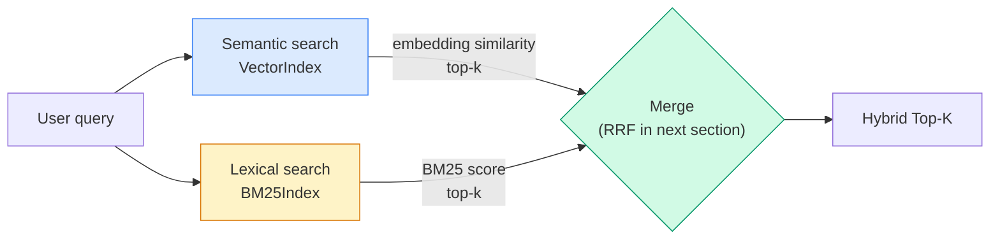

> [!tip] Why the two search methods are complementary
> Semantic search is good at "same meaning, different wording" (e.g., "earthquake load resisting system" ↔ "Seismic Force Resisting System"). Lexical search, on the other hand, is strong when "the exact word itself" must be present — **proper nouns, codes, formulas, IDs** and so on. In a RAG pipeline, combining the two with an **OR** is almost always advantageous.

#### 2.1.3 The 4 Steps of the BM25 Algorithm

BM25 (**Best Match 25**) is a lexical search algorithm that has been used as a de facto standard in IR (Information Retrieval) since the 1990s. Let's follow the 4-step explanation from the Skilljar transcript directly.

![[skilljar-s4/L06-07-algorithm.jpg]]

> [!method] BM25 4-step processing flow
> **Step 1 — Tokenize the query**
> Split the user's question into individual terms.
> Example: `"a INC-2023-Q4-011"` → `["a", "INC-2023-Q4-011"]`
>
> **Step 2 — Count term frequency**
> Count how often each term appears across the whole document collection.
> Example: `"a"` appears 5 times, `"INC-2023-Q4-011"` appears 1 time.
>
> **Step 3 — Weight terms by importance**
> Give higher importance to terms that appear infrequently.
> `"a"` is common, so low importance; `"INC-2023-Q4-011"` is rare, so high importance.
>
> **Step 4 — Find best matches**
> Return the documents that contain more of the high-weight terms at the top.

The core intuition: **"Throw away common words, focus on the rare ones."** This simple principle is why BM25 has survived for 30 years as the default algorithm in most lexical search engines.

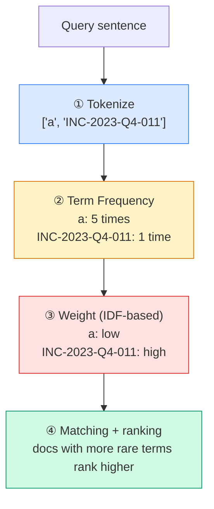

#### 2.1.4 BM25 Python Implementation

In the Skilljar notebook (`S4_04_bm25.ipynb`), a `BM25Index` class is defined using an external library (`rank_bm25` or a custom implementation). The key is to align its API with VectorIndex.

```python
# 1. Chunk text by section
chunks = chunk_by_section(text)

# 2. Create BM25 index and add documents
store = BM25Index()
for chunk in chunks:
    store.add_document({"content": chunk})

# 3. Search
results = store.search("What happened with INC-2023-Q4-011?", 3)

# 4. Print results
for doc, distance in results:
    print(distance, "\n", doc["content"][:200], "\n----\n")
```

> [!finding] Exactly the same API as VectorIndex
> This design looks simple, but it is **the key that makes the Retriever abstraction in L07 possible**. Only two methods — `add_document()` and `search()` — are exposed, and the internal scoring mechanism is fully encapsulated. Thanks to this, L07 achieves the pattern of "no matter how many indexes you plug in, the Retriever's structure never has to change."

#### 2.1.5 Expected Results

When you reissue the same query against this BM25 implementation, the results improve noticeably.

![[skilljar-s4/L06-16-results.jpg]]

Quoting the transcript —

> The results now correctly prioritize the **Software Engineering section** and the **Cybersecurity section**. Both of these sections actually contain the target incident ID.

In other words, the financial analysis section that floated to the top with semantic search alone disappears, and the two sections that genuinely describe `INC-2023-Q4-011` are placed precisely at the top.

#### 2.1.6 Why BM25 Works Better

> [!result] Four reasons BM25 excels
> 1. **High weight for rare terms** — favors rare, specific terms (the IDF idea).
> 2. **Ignores stop words** — common words like `a`, `the`, `is` are automatically suppressed so they contribute little to the score.
> 3. **Focuses on frequency, not meaning** — scoring is based purely on **actual word occurrence frequency**, not conceptual similarity.
> 4. **Strong on technical terms, IDs, and phrases** — overwhelmingly advantageous in areas where exact match matters, such as code, standard numbers, and incident identifiers.

Key insight: **The two search methods are not competitors but complements.** Semantic search understands context and meaning, while lexical search guarantees exact term matching. Combined, they form a robust system that handles both conceptual queries and specific lookups well.

> [!action] Exercise link
> Open `03-Exercises/Week_05/skilljar/S4_04_bm25.ipynb` and proceed in the following order.
> 1. Load the same document set used in the transcript (containing Cybersecurity, Software Engineering, Financial Analysis, and Legal sections).
> 2. Query `INC-2023-Q4-011` with semantic search only and **first reproduce the failure case**.
> 3. Throw the same query at the `BM25Index` class and verify that the returned sections match the L06-16 image.
> 4. Switch to your own document set (e.g., past assignment PDFs) and experience the BM25 vs semantic difference firsthand.

> [!ref] Source
> - Skilljar L06 — BM25 lexical search (287767)
> - Images: L06-05, L06-06, L06-07, L06-16
> - Notebook: `S4_04_bm25.ipynb`

---

### 2.2 Multi-Index RAG Pipeline (L07)

#### 2.2.1 Unifying Everything into One Pipeline

By L05 we had built **VectorIndex**, and in L06 **BM25Index**. The two classes are completely different internally, but **the public API they expose is identical**.

- `add_document(document)` — adds a document to the index
- `search(query, k)` — returns the top k documents

![[skilljar-s4/L07-00-architecture.jpg]]

> Quoting the transcript — "Because the two classes share an almost identical API, it becomes natural to wrap them into a single new class, the **Retriever**. The Retriever plays the role of a **coordinator** that forwards the user's query to both indexes simultaneously, gathers each result, and merges them via **reciprocal rank fusion**."

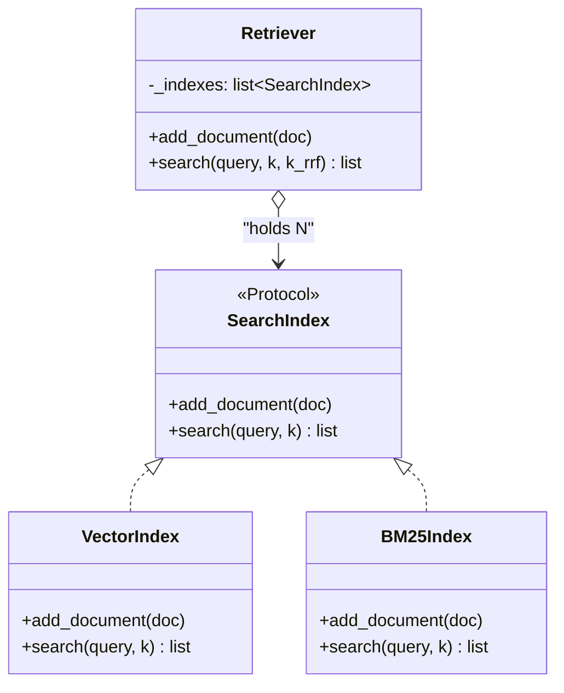

The real value of this structure is its **loose coupling**. The Retriever doesn't need to know whether each index uses cosine similarity or BM25 internally. It is enough to know "I receive a ranked list of results and fuse them with RRF."

From the request-processing perspective, the Retriever's internal flow is as follows.

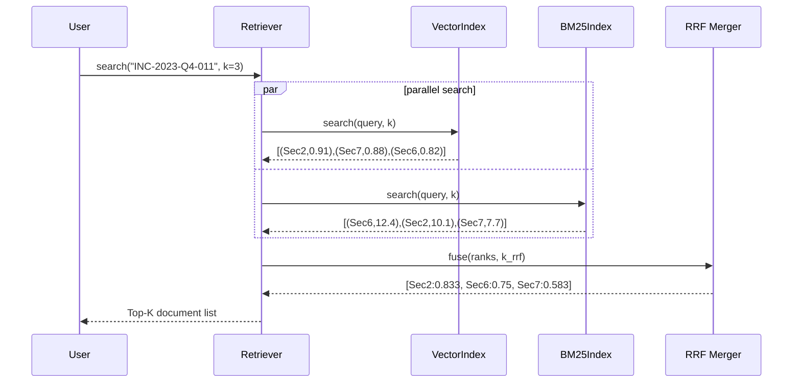

Two things to note about this sequence. (1) Because the two index searches are **independent, they can be parallelized** — in production deployments you would run them concurrently with async or a thread pool to reduce latency. (2) RRF consumes **only rank**, so the raw scores (0.91, 12.4, etc.) are discarded — which reconfirms that no score normalization step is needed.

#### 2.2.2 Reciprocal Rank Fusion (RRF) — Why Naive Merging Doesn't Work

When merging results from multiple search methods, the most naive approach is "just concatenate the two lists." But this doesn't work. **Each method uses a completely different scoring scheme** — VectorIndex's cosine similarity is a continuous value in [0, 1], while BM25 is a weighted sum that theoretically ranges from 0 to positive infinity. If you simply add or average these values, one side will dominate.

![[skilljar-s4/L07-04-rrf.jpg]]

RRF (Reciprocal Rank Fusion) solves this problem by using **only rank, not score**. It looks only at what position a document held in each result and adds up the reciprocals.

```
RRF_score(d) = Σ_i  1 / (k + rank_i(d))
```

- `k`: a constant. Typically 60; the course uses 1 for pedagogical clarity.
- `rank_i(d)`: the rank of document d in the i-th index (starting from 1).
- `Σ`: summed **over every index where document d appears**.

![[skilljar-s4/L07-06-formula.jpg]]

> [!tip] Three strengths of RRF
> 1. **Scale-agnostic** — raw score ranges don't matter. Only rank is used.
> 2. **Captures complementarity** — documents that appear in multiple indexes naturally accumulate contributions in the denominator, producing an additive effect.
> 3. **Robust to single-index failures** — if one side returns a bogus result, the other side compensates.

#### 2.2.3 Reproducing the Concrete Example

Let's reproduce the exact numbers from the transcript. The query is `INC-2023-Q4-011`, and the results from the two indexes are as follows.

![[skilljar-s4/L07-05-table.jpg]]

- **VectorIndex**: Section 2 (rank 1), Section 7 (rank 2), Section 6 (rank 3)
- **BM25Index**: Section 6 (rank 1), Section 2 (rank 2), Section 7 (rank 3)

| Document | Vector rank | BM25 rank | RRF calculation | Score |
|:---:|:---:|:---:|:---|:---:|
| **Section 2** | 1 | 2 | 1/(1+1) + 1/(1+2) = 0.5 + 0.333 | **0.833** |
| **Section 6** | 3 | 1 | 1/(1+3) + 1/(1+1) = 0.25 + 0.5  | **0.750** |
| **Section 7** | 2 | 3 | 1/(1+2) + 1/(1+3) = 0.333 + 0.25 | **0.583** |

The final ordering is **Section 2 (0.833) → Section 6 (0.750) → Section 7 (0.583)**. The transcript's interpretation — "Section 2 naturally rises to the top because it scored well in both indexes" — is proven numerically.

![[skilljar-s4/L07-08-ranking.jpg]]

> [!method] Computing RRF by hand
> When `k=1` — (same as the course example)
> - A document with rank=1 in only one index: `1/(1+1) = 0.5`
> - A document with rank=1 in both indexes: `0.5 + 0.5 = 1.0` (the theoretical maximum)
> - A document with rank=5: `1/(1+5) ≈ 0.167` (its contribution drops sharply)
>
> Computing with the production value `k=60`, the individual contribution shrinks to about `1/61 ≈ 0.0164`, and the **decay across rank differences becomes much gentler**. This is why "k=60" is the production default — it prevents a rank-1 document from a single index from dominating excessively, spreading the weight more evenly.

#### 2.2.4 Retriever Class Implementation

```python
from typing import Any, Dict, Protocol, Tuple

class SearchIndex(Protocol):
    def add_document(self, document: Dict[str, Any]) -> None: ...
    def search(self, query_text: str, k: int) -> list: ...


class Retriever:
    def __init__(self, *indexes: SearchIndex):
        if len(indexes) == 0:
            raise ValueError("At least one index must be provided")
        self._indexes = list(indexes)

    def add_document(self, document: Dict[str, Any]):
        # Add the same document to every index
        for index in self._indexes:
            index.add_document(document)

    def search(self, query_text: str, k: int = 1, k_rrf: int = 60):
        # 1) Gather individual results from every index
        all_results = [idx.search(query_text, k) for idx in self._indexes]

        # 2) Accumulate RRF scores keyed by document identifier
        scores: Dict[str, float] = {}
        docs: Dict[str, Dict[str, Any]] = {}
        for results in all_results:
            for rank, (doc, _score) in enumerate(results, start=1):
                key = doc["content"]           # simple identifier — use doc_id in production
                scores[key] = scores.get(key, 0.0) + 1.0 / (k_rrf + rank)
                docs[key] = doc

        # 3) Sort by RRF score descending and return top-k
        ranked = sorted(scores.items(), key=lambda x: x[1], reverse=True)
        return [(docs[key], score) for key, score in ranked[:k]]
```

> [!finding] Design points
> - `*indexes: SearchIndex` — no restriction on the number of indexes. 1 means single search, 2 means hybrid, N means Multi-Index.
> - `k_rrf` — the RRF constant. Defaults to 60; use 1 for pedagogical reproduction.
> - `add_document` is broadcast to every index → the Retriever absorbs the responsibility of keeping indexes in sync.
> - Using **Protocol** in the type hints is the crux — `SearchIndex` is not a runtime type but a **structural typing contract**. Without inheritance, anything that matches the API passes.

#### 2.2.5 Hybrid Result — Resolving the Earlier Problem

Chapter 1 L05 left us with an unresolved issue. When using vector search alone for the `INC-2023-Q4-011` query, putting the cybersecurity section (Section 10) at rank 1 was correct, but it returned financial analysis (Section 3) — **an irrelevant section** — at rank 2. Meanwhile, the Software Engineering section (Section 2), which was actually relevant, didn't make the top 3.

Running the same query through the hybrid Retriever, the transcript reports the following results.

1. **Section 10**: Cybersecurity Analysis — Incident Response Report (most relevant)
2. **Section 2**: Software Engineering — Project Phoenix Stability Enhancements (second)
3. **Section 5**: Legal Developments (third)

> [!result] Summary of the improvement from semantic-only to hybrid
>
> | Approach | 1st | 2nd | 3rd | Assessment |
> |:---:|:---:|:---:|:---:|:---|
> | Vector only | Sec 10 | **Sec 3 (Finance)** | Sec X | Finance section appears as a false positive |
> | Hybrid (RRF) | **Sec 10** | **Sec 2 (SE)** | Sec 5 | Sections align with intent |
>
> For **queries where a literal token like "INC-2023-Q4-011" is essential**, the numbers clearly show that hybrid search corrects the weaknesses of either method alone.

#### 2.2.6 The SearchIndex Protocol — The True Value of Extensibility

![[skilljar-s4/L07-18-extensibility.jpg]]

![[skilljar-s4/L07-19-protocol.jpg]]

> Transcript: "The beauty of this architecture lies in its **extensibility**. Because every index implements the same `SearchIndex` protocol (`add_document`, `search`), new retrieval methods can be added effortlessly."

Examples of indexes you might add:

- **Keyword Index**: A dedicated index for exact keyword matching (include/exclude logic without BM25).
- **Graph Index**: Based on knowledge graphs — injecting relationship-based reasoning into RAG.
- **Specialized Domain Index**: A dedicated index tied to a domain-specific dictionary (e.g., statutory clauses, medical terminology, standard document numbers).
- **Contextual Retrieval Index**: Anthropic's Contextual Retrieval and similar approaches that prepend a full-document summary to each chunk.

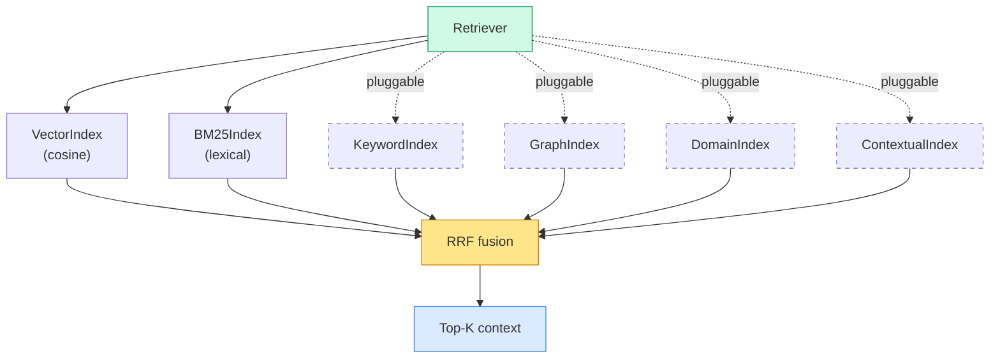

> [!tip] Design lesson — **"Open with a protocol, close with RRF"**
> The Retriever is a textbook example of OCP (Open-Closed Principle).
> - **Open for extension**: New indexes can be added at any time.
> - **Closed for modification**: The Retriever itself never has to change — because RRF only looks at rank.
> This same pattern reappears in the Tool/Resource structure of **MCP servers (W07)** we will study next — "a unified contract + a neutral fusion."

> [!action] Exercise link
> Open `03-Exercises/Week_05/skilljar/S4_05_hybrid_rag.ipynb` and proceed in the following order.
> 1. Import the already-completed `VectorIndex` (S4_03) and `BM25Index` (S4_04) and inject them into the Retriever.
> 2. Set `k_rrf=1` and verify that the scores 0.833 / 0.75 / 0.583 we computed in class are reproduced exactly.
> 3. Vary `k_rrf` through 60, 100, 300 and observe how the top 3 documents' ranks shift — at what point does the rank-1 from a single index lose its dominance?
> 4. Build a third index yourself (e.g., a simple `TitleMatchIndex` that matches only section titles), plug it into the Retriever, and see how the RRF results improve.

> [!ref] Source
> - Skilljar L07 — A Multi-Index RAG pipeline (287766)
> - Images: L07-00, L07-04, L07-05, L07-06, L07-08, L07-18, L07-19
> - Notebook: `S4_05_hybrid_rag.ipynb`
> - Reference paper: Cormack, G.V., Clarke, C.L.A., Büttcher, S. (2009). "Reciprocal Rank Fusion outperforms Condorcet and individual Rank Learning Methods", SIGIR.

---

## [Chapter 3] Self-Assessment & Summary

### 3.1 Concept Check Quiz — Entire W05 (Q1-Q8)

> [!question] Q1. What is the main reason for using overlap in chunking?
> A) To reduce storage space
> B) To restore context that gets cut at chunk boundaries
> C) To increase embedding cost
> D) To stabilize BM25 scores
>
> > [!tip]- Show Answer
> > **Answer: B)** When chunking cuts a sentence or section at an arbitrary point, a key concept can get sliced across the boundary and end up fully expressed in neither chunk. **Overlap** (e.g., 50-200 token overlap) duplicates the context near the boundary at the start of the next chunk, ensuring that even when the user asks a question that straddles the boundary, the answer is retrieved in full from at least one chunk.

> [!question] Q2. What role does VoyageAI play in the RAG pipeline?
> A) It generates Claude's response
> B) It converts text into vector embeddings
> C) It ranks search results
> D) It performs prompt caching
>
> > [!tip]- Show Answer
> > **Answer: B)** VoyageAI is the embedding provider officially recommended by Anthropic, and models such as `voyage-3` / `voyage-3-large` convert text into high-dimensional vectors (e.g., 1024 dimensions). Embeddings are **generated and stored once**, and at query time the same model vectorizes the query so cosine similarity can be used for retrieval. Response generation is Claude's job.

> [!question] Q3. What is the possible range of cosine similarity for normalized vectors?
> A) [0, 1]
> B) [-1, 1]
> C) [0, ∞)
> D) [-∞, ∞)
>
> > [!tip]- Show Answer
> > **Answer: B) [-1, 1]** — Cosine similarity is the cosine of the angle between two vectors, so mathematically `-1 ≤ cos(θ) ≤ 1`. `1` means identical direction, `0` means orthogonal (unrelated), `-1` means exactly opposite directions. For text embeddings, negative values are rare in practice, so most values cluster near `[0, 1]`, but the **theoretical range is [-1, 1]**. Normalizing embeddings to **unit vectors** makes cosine similarity equal to the **dot product**, simplifying computation.

> [!question] Q4. In what situation does BM25 show an advantage over semantic search?
> A) Finding the same concept expressed in a different language
> B) Finding similar documents expressed with synonyms
> C) When exact matching of IDs, codes, and proper nouns is required
> D) When performing image search
>
> > [!tip]- Show Answer
> > **Answer: C)** BM25 is based on **term frequency and sparsity (IDF)**. When a **rare literal token** like `INC-2023-Q4-011` appears in the query, BM25 treats the presence of that token as an absolute weight. Semantic search, by contrast, tends to represent it vaguely in the embedding space, so unrelated sections may float to the top. This is the core message of the entire Skilljar example in L06.

> [!question] Q5. What is the formula for Reciprocal Rank Fusion (RRF)?
> A) `RRF(d) = Σ (score_i(d))`
> B) `RRF(d) = max_i (rank_i(d))`
> C) `RRF(d) = Σ (1 / (k + rank_i(d)))`
> D) `RRF(d) = Σ (rank_i(d) / k)`
>
> > [!tip]- Show Answer
> > **Answer: C)** `RRF_score(d) = Σ_i 1 / (k + rank_i(d))`. For each index `i`, you sum the **reciprocal** of the rank at which document `d` was returned. `k` is a smoothing constant, usually 60 in practice and 1 for teaching purposes. In the course example, Section 2 took ranks 1 and 2 and earned the top score of `1/2 + 1/3 = 0.833`. The key is that **rank is used rather than score** — this lets you merge different scoring scales without normalization.

> [!question] Q6. What best explains why Section 2 ended up first in the RRF example?
> A) Because it was rank 1 in Vector
> B) Because it was rank 1 in BM25
> C) Because it was in the top ranks (ranks 1 and 2) in both indexes
> D) Because it received the highest score in BM25
>
> > [!tip]- Show Answer
> > **Answer: C)** RRF rewards **consensus across multiple indexes**. Section 2 was rank 1 in Vector and rank 2 in BM25 — not first in either, but top-tier in both. Section 6 (BM25 1st, Vector 3rd) and Section 7 (Vector 2nd, BM25 3rd) only excelled on one side. Summed up, `0.5 + 0.333 = 0.833` puts Section 2 ahead. This is the fundamental reason hybrid search is "robust to mistakes on one side."

> [!question] Q7. What is the benefit of designing the Retriever on the SearchIndex protocol?
> A) New indexes (keyword, graph, etc.) can be added without changing the Retriever
> B) Embedding costs are reduced
> C) BM25 automatically performs semantic search
> D) Claude API calls are no longer needed
>
> > [!tip]- Show Answer
> > **Answer: A)** The `SearchIndex` protocol only requires `add_document()` and `search()`. Any kind of index plugs directly into the Retriever as long as it implements these two methods. Internally the Retriever uses **only rank (RRF)**, so it is agnostic to the raw scoring scheme. This is the textbook implementation of the **Open-Closed Principle (OCP)** — "open for extension, closed for modification." The same pattern recurs in the W07 MCP Server and the W10 Agent architectures.

> [!question] Q8. Which of the following is the correct overall flow of the RAG pipeline covered in W05?
> A) Query → embedding → document storage → Claude → response
> B) Document chunking → embedding generation → VectorIndex storage → query embedding → similarity search → context injection → Claude response
> C) Query → BM25 → response (no embedding needed)
> D) Chunking → Claude → embedding → storage
>
> > [!tip]- Show Answer
> > **Answer: B)** A standard RAG pipeline splits into an **offline phase (document chunking → embedding → indexing)** and an **online phase (query embedding → retrieval → prompt assembly → Claude call)**. The hybrid extension learned in W05 adds a `BM25Index` to the "retrieval" step and binds them together with a Retriever; the remaining steps are unchanged. In other words, the hybrid extension is a plugin-level change that **only swaps the "retrieval" module of the existing pipeline**.

> [!ref] Source
> - Skilljar L01-L07 transcripts
> - L01 fundamentals, L02 chunking, L03 embeddings, L04-L05 full RAG flow, L06 BM25, L07 Multi-Index

---

### 3.2 Learning Summary

#### Cumulative Progress Table (W01 → W05)

| Week | Topic | Core Concepts | New Additions This Week |
|:---:|:---|:---|:---|
| **W01** | LLM fundamentals · 6 prompt techniques | tokens, temperature, few-shot, CoT | 4D Framework, AI Fluency |
| **W02** | Claude API calls | messages.create, multi-turn, streaming, prefilling, JSON mode | Overall Claude API + CLAUDE.md |
| **W03** | Prompt engineering & evaluation | Systematic prompt design, Eval Pipeline, Streamlit | Quantitative prompt evaluation |
| **W04** | Tool Use | JSON Schema, ToolUseBlock, tool_result, multi-turn loop, Built-in/Server Tools | Connecting Claude ↔ the external world |
| **W05** | **RAG + hybrid search** | **Chunking, embedding, VectorIndex, BM25Index, Retriever, RRF, SearchIndex protocol** | **Knowledge expansion + lexical/semantic fusion** |

#### W05 Only — L01-L07 Concept Summary

> [!finding] The 7 steps of the RAG pipeline and their source lessons
>
> | Step | Concept | Key Content | Source Lesson |
> |:---:|:---|:---|:---:|
> | 1 | **RAG motivation** | LLM knowledge limits · hallucination → retrieval augmentation | L01 |
> | 2 | **Chunking** | Size · overlap · structure-based 3 strategies, semantic unit first | L02 |
> | 3 | **Embeddings** | Text → high-dim vectors via VoyageAI, generated only once | L03 |
> | 4 | **Cosine Similarity** | Normalization → dot product = cosine, measures semantic similarity | L04 |
> | 5 | **VectorIndex implementation** | add_vector / search, returns top k | L04-L05 |
> | 6 | **BM25 Lexical** | Tokenize → TF → IDF weights → matching, strong on rare tokens | L06 |
> | 7 | **Multi-Index Retriever** | Public API protocol + RRF fusion (k=60/1) | L07 |

#### Roadmap Mermaid — From W05 Onward

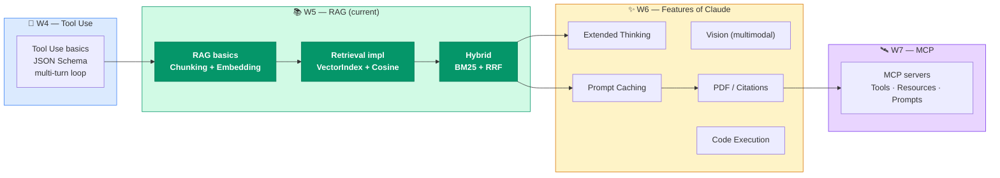

> [!tip] W05 → W06 connection points
> - **Prompt Caching (W06)**: Repeatedly sending system prompts and large contexts in RAG skyrockets cost → W06's prompt caching can cut much of it.
> - **PDF / Citations (W06)**: In architectural engineering, RAG targets are mostly PDFs (design standards, reports) — linking W06's PDF input handling and citation returns completes "evidence-based" responses.
> - **Extended Thinking (W06)**: When hybrid search results conflict (e.g., Vector and BM25 return completely different sections), Extended Thinking lets Claude **reason about which evidence to trust**.

#### 3-Line Key Message

> [!result] W05 in 3 lines
> 1. **RAG is "text to numbers, query to numbers, distance to similarity"** — the 4-step backbone is chunking → embedding → VectorIndex → cosine search.
> 2. **Semantic search alone is not enough** — literal tokens like `INC-2023-Q4-011` are much better caught by BM25, and the two searches are **complementary, not competing**.
> 3. **Retriever + RRF = an extensible retrieval pipeline** — matching just the `SearchIndex` protocol lets you add keyword / graph / domain indexes endlessly, and this pattern carries directly into W07 MCP and W10 Agent.

---

## 💻 Hands-on Exercises — S4 RAG Track

> All notebooks are located in `03-Exercises/Week_05/skilljar/`. This week's build-up consists of **7 stages**, forming a cumulative structure in which each notebook carries forward the output of the previous one.

### Stage-by-Stage Build-up Diagram


### Detailed Notebook Table

| Notebook | Goal | Main Functions / Classes | Lesson Dependencies |
|:---|:---|:---|:---:|
| `S4_01_chunking.ipynb` | Experiment with chunking strategies (char / section / sentence) | `chunk_by_char`, `chunk_by_section`, `chunk_by_sentence` | L02 |
| `S4_02_embeddings.ipynb` | Embedding generation + similarity computation | `generate_embedding`, `cosine_similarity` | L03 |
| `S4_03_vector_search.ipynb` | Build VectorIndex + cosine search | `VectorIndex`, `add_vector`, `search` | L04, L05 |
| `S4_04_bm25.ipynb` | Implement BM25 lexical search | `BM25Index`, `tokenize`, `score` | L06 |
| `S4_05_hybrid_rag.ipynb` | Retriever + RRF fusion | `Retriever`, `reciprocal_rank_fusion`, `SearchIndex` | L07 |
| `S4_06_rag_practice.ipynb` | Student self-paced template (blank template) | — (freely combine elements from previous stages) | Integrated |
| `S4_07_structural_rag.ipynb` | **Architectural engineering domain application** — RAG for structural design standards / design reports (KDS / design standard clause search, design basis memos) | Domain chunking helpers, lexical index with structural-term dictionary | Integrated |

> [!method] Proposed in-class exercise order (2 hours)
> 1. **0:00-0:15** — `S4_01` Compare chunking strategies (split the same document in 3 ways and eyeball the results).
> 2. **0:15-0:35** — `S4_02` Generate embeddings and compute cosine similarity; build intuition on toy data.
> 3. **0:35-0:55** — `S4_03` Complete VectorIndex and produce the first RAG response (all the way through a Claude call).
> 4. **0:55-1:15** — `S4_04` Reproduce the `INC-2023-Q4-011` example in BM25 → confirm match against the L06 result image.
> 5. **1:15-1:40** — `S4_05` Complete Retriever + RRF and experiment with different k_rrf values.
> 6. **1:40-2:00** — Extend via `S4_06` student self-paced practice or `S4_07` domain application (choose one).

> [!action] Submission guide
> **Deadline**: By 23:59 the day before the next class (e.g., if the next class is on 5/XX, the previous day).
> **Deliverables**: **Required** completed `S4_05_hybrid_rag.ipynb` + a self-paced extension of **at least one** of `S4_06_rag_practice.ipynb`.
> **Submission method**: Upload to the designated folder in the course Notion or Google Classroom (include student ID and name in the filename).
> **Evaluation criteria**: (1) Reproduction of the L07 example scores (0.833 / 0.75 / 0.583), (2) record of k_rrf experiments, (3) creativity of the self-paced extension.

> [!ref] Source
> - All notebooks: `03-Exercises/Week_05/skilljar/`
> - Transcript-based dataset: shared document set across Skilljar S4 L05-L07
> - GitHub: [anthropics/courses — RAG](https://github.com/anthropics/courses)

---

## 🤖 CC Skills — Claude Code Skills & Commands

This week's Claude Code track is the concept of **Skills & Commands**. While last week's W04 "verification loop" covered a **single workflow**, this week we learn how to **package recurring workflows into reusable Skills**.

### Core Concepts

> [!finding] Skills vs Commands
> - **Skill** (Agent Skill): A bundle of reusable knowledge + scripts that Claude Code **automatically recognizes and invokes**. Structured as YAML frontmatter + Markdown + optional helper scripts. Claude **decides on its own** that "in this situation, use this skill."
> - **Command** (Slash Command): A prompt template the user **explicitly invokes** via `/command-name`. Stored as `.md` files in the `.claude/commands/` directory.
> - **Relationship**: Skills map "situation → action", Commands map "keyword → action". Most real-world workflows **start as Commands and evolve into Skills**.

### This Week's CC Assignment — Building a "RAG Helper Skill"

> [!action] Exercise assignment — Build your own RAG Helper Skill
> 1. Create the file `.claude/skills/rag-helper/SKILL.md`.
> 2. Define the skill's metadata in YAML frontmatter:
>    - `name: rag-helper`
>    - `description`: "Activate when writing or debugging RAG pipeline code. Recognizes chunking / embedding / VectorIndex / BM25 / Retriever patterns and suggests hybrid search structures."
> 3. In the body, write out (1) the standard signatures of `VectorIndex` · `BM25Index` · `Retriever` learned this week, (2) the RRF formula and recommended k_rrf values, and (3) common mistakes (directly averaging scores, relying on a single index's rank 1, etc.).
> 4. In Claude Code, issue queries like `"Design a RAG pipeline for me"` or `"Write hybrid search code"` and verify that the skill auto-activates.
> 5. Also create the same content as a `/rag-scaffold` Slash Command for explicit invocation — `.claude/commands/rag-scaffold.md`.

### Supplementary Note Link

> [!tip] Deep-dive study
> The supplementary note **[[Week_05_AgentSkills]]** (IAS — Introduction to Agent Skills) contains deep-dive content for this week's CC track.
> - The mechanism of Skill discovery and priority resolution
> - Restricting permissions with `allowed_tools`
> - Strategy for project skills (`.claude/skills/`) vs global skills (`~/.claude/skills/`)
> - Pattern analysis of Anthropic's official example-skills repository
>
> Mode: **② Self-paced Deep-dive** — students who want to dive deeper into their projects are encouraged to complete it within 1 week after class.

### CC Skill Design Tips

> [!method] Skill writing best practices
> 1. **Keep `description` clear in 1-2 sentences** — Claude reads this line to decide whether to activate.
> 2. **Structure the body as Do / Don't checklists** — contrasting lists are far more effective than vague prose.
> 3. **Include example code snippets** — copy in the standard `VectorIndex` / `BM25Index` / `Retriever` signatures from this week so Claude generates consistent code in one shot.
> 4. **Cross-link related skills** — have `rag-helper` reference `tool-use-helper` (the W04 CC skill) so combined Tool Use + RAG tasks benefit.

---

## 📚 References

> [!ref] Official Skilljar materials
> - Course home: [Building with the Claude API — Skilljar](https://anthropic.skilljar.com/claude-with-the-anthropic-api)
> - Section S4 (RAG and Agentic Search): L01-L07, the primary source for this lecture

> [!ref] Official Anthropic documentation
> - [Build with Claude — Overview](https://docs.anthropic.com/en/docs/build-with-claude)
> - [Prompt Caching Guide](https://docs.anthropic.com/en/docs/build-with-claude/prompt-caching) (for W06 preview study)
> - [Contextual Retrieval — Anthropic blog](https://www.anthropic.com/news/contextual-retrieval)

> [!ref] Implementation example repositories
> - [anthropics/courses — RAG tutorials](https://github.com/anthropics/courses)
> - [anthropic-cookbook — Skilljar RAG notebooks](https://github.com/anthropics/anthropic-cookbook)

> [!ref] Embedding · search engines
> - [VoyageAI official docs](https://docs.voyageai.com) — `voyage-3`, `voyage-3-large` models and API.
> - [VoyageAI embedding model comparison](https://docs.voyageai.com/docs/embeddings) — dimensions · cost · Korean language support.
> - [ChromaDB official docs](https://docs.trychroma.com) (optional) — reference when scaling to a production vector store.

> [!ref] BM25 · RRF academic materials
> - [BM25 — Wikipedia (Okapi BM25)](https://en.wikipedia.org/wiki/Okapi_BM25) — formula, including IDF weight derivation.
> - Robertson, S. and Zaragoza, H. (2009), "The Probabilistic Relevance Framework: BM25 and Beyond", Foundations and Trends in Information Retrieval.
> - Cormack, G.V., Clarke, C.L.A. and Büttcher, S. (2009), "Reciprocal Rank Fusion outperforms Condorcet and individual Rank Learning Methods", SIGIR 2009.

> [!ref] RAG academic papers
> - Lewis, P. et al. (2020), "Retrieval-Augmented Generation for Knowledge-Intensive NLP Tasks", NeurIPS 2020, arXiv:2005.11401.
> - Gao, Y. et al. (2023), "Retrieval-Augmented Generation for Large Language Models: A Survey", arXiv:2312.10997.
> - Anthropic (2024), "Introducing Contextual Retrieval" — introduction of chunk-level context augmentation techniques.

---

## Related

- Previous: [[Week_04|Week 04: Tool Use (S3)]] — How Claude calls external functions
- Next: [[Week_06|Week 06: Features of Claude — Extended Thinking · Vision · Caching (S5)]] — Advanced features to stack on top of RAG
- Supplementary (Deep-dive): [[Week_05_AgentSkills|Introduction to Agent Skills]] — Deep-dive into Claude Code Skills (② Self-paced Deep-dive mode)
- Next week's prerequisite (CC): [[Week_06_IntroMCP|Introduction to MCP]] — Pre-read for W07 (① Pre-read mode)
- Syllabus: [[00-Syllabus/LLM_AE_AI_Implementation_Syllabus_v2.3|LLM-AE-AI Syllabus v2.3]]
