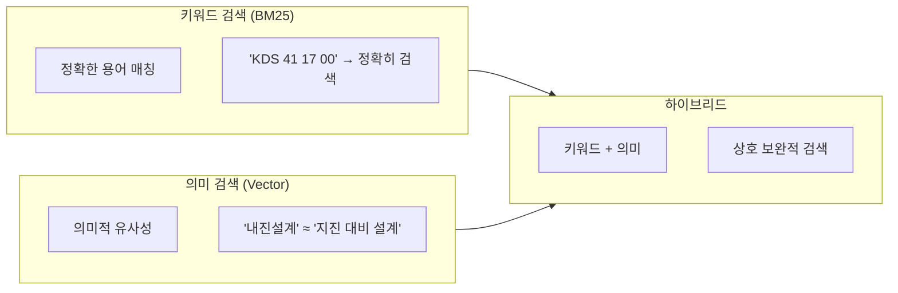
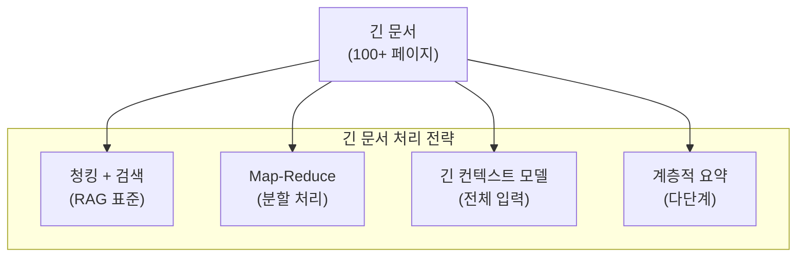
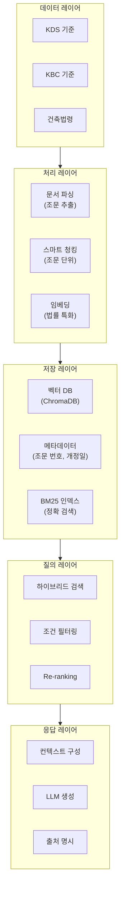
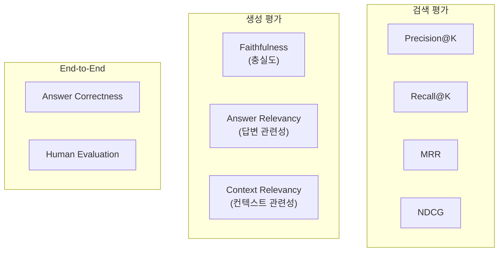

# 6주차: RAG 심화 - 하이브리드 검색과 건축 법규 RAG

---

## 📌 강의 중점

- **하이브리드 검색**: 키워드 검색 + 벡터 검색 결합
- **긴 컨텍스트 처리**: 대용량 문서의 효율적 처리
- **건축 법규 RAG 시스템** 실제 구현
- **RAG 평가와 최적화** 방법론

---

## 🎯 학습 목표

학습 완료 후 다음을 수행할 수 있습니다:

- 하이브리드 검색 시스템을 구현할 수 있다
- 긴 문서를 효과적으로 처리하는 전략을 적용할 수 있다
- 건축 법규에 특화된 RAG 시스템을 구축할 수 있다
- RAG 시스템의 성능을 평가하고 개선할 수 있다

---

## [Chapter 1] 하이브리드 검색

### 1.1 검색 방식 비교



| 검색 방식 | 장점 | 단점 |
|----------|------|------|
| **키워드 (BM25)** | 정확한 용어 매칭, 빠름 | 동의어 처리 불가 |
| **벡터 (Semantic)** | 의미적 유사성 이해 | 정확한 용어 놓칠 수 있음 |
| **하이브리드** | 상호 보완 | 구현 복잡도 증가 |

### 1.2 BM25 검색 구현

```python
from rank_bm25 import BM25Okapi
import re
from typing import List, Tuple


class BM25Search:
    """BM25 키워드 검색 엔진"""

    def __init__(self):
        self.documents: List[str] = []
        self.bm25 = None

    def tokenize(self, text: str) -> List[str]:
        """한국어 토큰화 (간단 버전)"""
        # 공백 및 특수문자 기준 분리
        tokens = re.findall(r'\w+', text.lower())
        return tokens

    def add_documents(self, documents: List[str]):
        """문서 추가 및 인덱싱"""
        self.documents = documents
        tokenized = [self.tokenize(doc) for doc in documents]
        self.bm25 = BM25Okapi(tokenized)

    def search(self, query: str, top_k: int = 5) -> List[Tuple[int, float, str]]:
        """BM25 검색"""
        if not self.bm25:
            return []

        tokenized_query = self.tokenize(query)
        scores = self.bm25.get_scores(tokenized_query)

        # 상위 k개 결과
        top_indices = sorted(
            range(len(scores)),
            key=lambda i: scores[i],
            reverse=True
        )[:top_k]

        results = [
            (idx, scores[idx], self.documents[idx])
            for idx in top_indices
            if scores[idx] > 0
        ]

        return results


# 사용 예시
bm25 = BM25Search()
docs = [
    "KDS 41 17 00 건축물 내진설계기준",
    "KDS 14 20 50 콘크리트 기둥 설계기준",
    "철근콘크리트 구조물의 내진성능 평가",
    "건축구조기준 하중 조합 규정"
]
bm25.add_documents(docs)

results = bm25.search("KDS 내진설계", top_k=3)
for idx, score, doc in results:
    print(f"[{score:.4f}] {doc}")
```

### 1.3 하이브리드 검색 구현

```python
import chromadb
from chromadb.utils import embedding_functions
from rank_bm25 import BM25Okapi
import numpy as np


class HybridSearch:
    """하이브리드 검색 (BM25 + Vector)"""

    def __init__(self, collection_name: str = "hybrid_docs"):
        # Vector DB 설정
        self.client = chromadb.PersistentClient(path="./hybrid_db")
        self.ef = embedding_functions.OpenAIEmbeddingFunction(
            model_name="text-embedding-3-small"
        )
        self.collection = self.client.get_or_create_collection(
            name=collection_name,
            embedding_function=self.ef
        )

        # BM25 설정
        self.documents = []
        self.doc_ids = []
        self.bm25 = None

    def add_documents(self, documents: list[str], ids: list[str] = None, metadatas: list[dict] = None):
        """문서 추가"""
        if ids is None:
            ids = [f"doc_{i}" for i in range(len(documents))]

        if metadatas is None:
            metadatas = [{}] * len(documents)

        # Vector DB에 추가
        self.collection.add(
            documents=documents,
            ids=ids,
            metadatas=metadatas
        )

        # BM25 인덱스 구축
        self.documents.extend(documents)
        self.doc_ids.extend(ids)
        tokenized = [doc.lower().split() for doc in self.documents]
        self.bm25 = BM25Okapi(tokenized)

    def _normalize_scores(self, scores: list[float]) -> list[float]:
        """점수 정규화 (0-1 범위)"""
        if not scores:
            return []
        min_s, max_s = min(scores), max(scores)
        if max_s == min_s:
            return [1.0] * len(scores)
        return [(s - min_s) / (max_s - min_s) for s in scores]

    def search(
        self,
        query: str,
        top_k: int = 5,
        alpha: float = 0.5  # vector 가중치 (1-alpha = bm25 가중치)
    ) -> list[dict]:
        """하이브리드 검색"""

        # 1. Vector 검색
        vector_results = self.collection.query(
            query_texts=[query],
            n_results=top_k * 2  # 더 많이 검색
        )

        vector_scores = {}
        for doc_id, distance in zip(
            vector_results["ids"][0],
            vector_results["distances"][0]
        ):
            vector_scores[doc_id] = 1 - distance  # 유사도로 변환

        # 2. BM25 검색
        tokenized_query = query.lower().split()
        bm25_raw_scores = self.bm25.get_scores(tokenized_query)

        bm25_scores = {}
        for i, score in enumerate(bm25_raw_scores):
            if score > 0:
                bm25_scores[self.doc_ids[i]] = score

        # 3. 점수 정규화
        all_ids = set(vector_scores.keys()) | set(bm25_scores.keys())

        v_scores = [vector_scores.get(doc_id, 0) for doc_id in all_ids]
        b_scores = [bm25_scores.get(doc_id, 0) for doc_id in all_ids]

        v_norm = self._normalize_scores(v_scores)
        b_norm = self._normalize_scores(b_scores)

        # 4. 하이브리드 점수 계산
        hybrid_scores = {}
        for i, doc_id in enumerate(all_ids):
            hybrid_scores[doc_id] = alpha * v_norm[i] + (1 - alpha) * b_norm[i]

        # 5. 정렬 및 결과 반환
        sorted_ids = sorted(hybrid_scores.keys(), key=lambda x: hybrid_scores[x], reverse=True)

        results = []
        for doc_id in sorted_ids[:top_k]:
            idx = self.doc_ids.index(doc_id)
            results.append({
                "id": doc_id,
                "content": self.documents[idx],
                "hybrid_score": hybrid_scores[doc_id],
                "vector_score": vector_scores.get(doc_id, 0),
                "bm25_score": bm25_scores.get(doc_id, 0)
            })

        return results


# 사용 예시
hybrid = HybridSearch()

docs = [
    "KDS 41 17 00 건축물 내진설계기준에 따르면 내진등급은 특등급, 1등급, 2등급으로 구분한다.",
    "철근콘크리트 구조물의 지진에 대한 저항 능력을 평가하는 방법을 규정한다.",
    "내진설계 시 응답수정계수 R은 구조 시스템에 따라 결정된다.",
    "KDS 14 20 50에서는 콘크리트 기둥의 설계 방법을 규정한다."
]

hybrid.add_documents(docs)

# alpha=0.5: 균형, alpha=0.7: 벡터 중시, alpha=0.3: BM25 중시
results = hybrid.search("KDS 내진등급 기준", top_k=3, alpha=0.5)

for r in results:
    print(f"점수: {r['hybrid_score']:.3f} (V:{r['vector_score']:.3f}, B:{r['bm25_score']:.3f})")
    print(f"내용: {r['content'][:80]}...")
    print()
```

### 1.4 RRF (Reciprocal Rank Fusion)

```python
def reciprocal_rank_fusion(
    rankings: list[list[str]],
    k: int = 60
) -> dict[str, float]:
    """RRF - 여러 검색 결과 융합"""
    fused_scores = {}

    for ranking in rankings:
        for rank, doc_id in enumerate(ranking, 1):
            if doc_id not in fused_scores:
                fused_scores[doc_id] = 0
            fused_scores[doc_id] += 1 / (k + rank)

    return fused_scores


# 사용 예시
vector_ranking = ["doc_3", "doc_1", "doc_5", "doc_2"]
bm25_ranking = ["doc_1", "doc_3", "doc_4", "doc_2"]

rrf_scores = reciprocal_rank_fusion([vector_ranking, bm25_ranking])
sorted_results = sorted(rrf_scores.items(), key=lambda x: x[1], reverse=True)

print("RRF 결과:")
for doc_id, score in sorted_results:
    print(f"  {doc_id}: {score:.4f}")
```

### 📚 참고 자료

- [BM25 Algorithm](https://en.wikipedia.org/wiki/Okapi_BM25)
- [rank_bm25 Library](https://github.com/dorianbrown/rank_bm25)
- [Hybrid Search (Weaviate)](https://weaviate.io/developers/weaviate/search/hybrid)

---

## [Chapter 2] 긴 컨텍스트 처리

### 2.1 긴 문서 처리 전략



### 2.2 Map-Reduce 요약

```python
import anthropic
from typing import List


class MapReduceSummarizer:
    """Map-Reduce 패턴 문서 요약"""

    def __init__(self, chunk_size: int = 4000):
        self.client = anthropic.Anthropic()
        self.chunk_size = chunk_size

    def _chunk_text(self, text: str) -> List[str]:
        """텍스트를 청크로 분할"""
        chunks = []
        words = text.split()
        current_chunk = []
        current_length = 0

        for word in words:
            if current_length + len(word) + 1 > self.chunk_size:
                chunks.append(" ".join(current_chunk))
                current_chunk = [word]
                current_length = len(word)
            else:
                current_chunk.append(word)
                current_length += len(word) + 1

        if current_chunk:
            chunks.append(" ".join(current_chunk))

        return chunks

    def _map_summarize(self, chunk: str, context: str = "") -> str:
        """Map: 각 청크 요약"""
        response = self.client.messages.create(
            model="claude-3-5-sonnet-20241022",
            max_tokens=1000,
            messages=[{
                "role": "user",
                "content": f"""다음 텍스트의 핵심 내용을 3-5개 bullet point로 요약하세요.
{f'맥락: {context}' if context else ''}

텍스트:
{chunk}

핵심 요약:"""
            }]
        )
        return response.content[0].text

    def _reduce_combine(self, summaries: List[str]) -> str:
        """Reduce: 요약들 통합"""
        combined = "\n\n---\n\n".join(summaries)

        response = self.client.messages.create(
            model="claude-3-5-sonnet-20241022",
            max_tokens=2000,
            messages=[{
                "role": "user",
                "content": f"""다음 부분 요약들을 하나의 종합 요약으로 통합하세요.
중복을 제거하고 핵심 정보만 포함하세요.

부분 요약들:
{combined}

종합 요약:"""
            }]
        )
        return response.content[0].text

    def summarize(self, document: str, context: str = "") -> str:
        """Map-Reduce 요약 실행"""
        chunks = self._chunk_text(document)
        print(f"문서를 {len(chunks)}개 청크로 분할")

        # Map 단계
        summaries = []
        for i, chunk in enumerate(chunks):
            print(f"  청크 {i+1}/{len(chunks)} 요약 중...")
            summary = self._map_summarize(chunk, context)
            summaries.append(summary)

        # Reduce 단계
        if len(summaries) > 1:
            print("통합 요약 생성 중...")
            final_summary = self._reduce_combine(summaries)
        else:
            final_summary = summaries[0]

        return final_summary


# 사용 예시
summarizer = MapReduceSummarizer()
long_document = "..." # 긴 문서 텍스트
summary = summarizer.summarize(long_document, context="건축구조설계기준")
```

### 2.3 긴 컨텍스트 모델 활용

```python
import anthropic


def process_long_document(
    document: str,
    query: str,
    max_tokens: int = 4096
) -> str:
    """긴 컨텍스트 모델로 전체 문서 처리"""
    client = anthropic.Anthropic()

    # Claude 3.5 Sonnet: 200K 컨텍스트 지원
    response = client.messages.create(
        model="claude-3-5-sonnet-20241022",
        max_tokens=max_tokens,
        messages=[{
            "role": "user",
            "content": f"""다음 문서 전체를 읽고 질문에 답변해 주세요.

## 문서
{document}

## 질문
{query}

## 답변 지침
- 문서에서 관련 내용을 찾아 인용
- 페이지/섹션 번호 명시 (있는 경우)
- 문서에 없는 내용은 "해당 정보 없음" 명시
"""
        }]
    )

    return response.content[0].text


def analyze_with_caching(
    system_prompt: str,
    document: str,
    queries: list[str]
) -> list[str]:
    """프롬프트 캐싱으로 비용 절감"""
    client = anthropic.Anthropic()

    results = []
    for query in queries:
        response = client.messages.create(
            model="claude-3-5-sonnet-20241022",
            max_tokens=2048,
            system=[{
                "type": "text",
                "text": f"{system_prompt}\n\n## 문서\n{document}",
                "cache_control": {"type": "ephemeral"}  # 캐싱 활성화
            }],
            messages=[{"role": "user", "content": query}]
        )
        results.append(response.content[0].text)

        # 캐싱 상태 확인
        print(f"캐시 생성: {response.usage.cache_creation_input_tokens}")
        print(f"캐시 읽기: {response.usage.cache_read_input_tokens}")

    return results
```

### 2.4 Parent-Child 청킹

```python
import chromadb
from chromadb.utils import embedding_functions
import uuid


class ParentChildRAG:
    """Parent-Child 구조 RAG"""

    def __init__(self, db_path: str = "./parent_child_db"):
        self.client = chromadb.PersistentClient(path=db_path)
        self.ef = embedding_functions.OpenAIEmbeddingFunction(
            model_name="text-embedding-3-small"
        )

        # Parent (큰 청크) 컬렉션
        self.parents = self.client.get_or_create_collection(
            name="parents",
            embedding_function=self.ef
        )

        # Child (작은 청크) 컬렉션
        self.children = self.client.get_or_create_collection(
            name="children",
            embedding_function=self.ef
        )

    def add_document(
        self,
        document: str,
        parent_chunk_size: int = 2000,
        child_chunk_size: int = 400
    ):
        """문서를 Parent-Child 구조로 추가"""

        # Parent 청킹
        parent_chunks = self._split_text(document, parent_chunk_size)

        for i, parent in enumerate(parent_chunks):
            parent_id = str(uuid.uuid4())

            # Parent 저장
            self.parents.add(
                documents=[parent],
                ids=[parent_id],
                metadatas=[{"index": i, "type": "parent"}]
            )

            # Child 청킹
            child_chunks = self._split_text(parent, child_chunk_size)

            for j, child in enumerate(child_chunks):
                child_id = str(uuid.uuid4())

                # Child 저장 (parent_id 참조)
                self.children.add(
                    documents=[child],
                    ids=[child_id],
                    metadatas=[{
                        "parent_id": parent_id,
                        "index": j,
                        "type": "child"
                    }]
                )

    def _split_text(self, text: str, chunk_size: int) -> list[str]:
        """텍스트 분할"""
        chunks = []
        words = text.split()
        current = []
        length = 0

        for word in words:
            if length + len(word) > chunk_size:
                chunks.append(" ".join(current))
                current = [word]
                length = len(word)
            else:
                current.append(word)
                length += len(word) + 1

        if current:
            chunks.append(" ".join(current))

        return chunks

    def search(self, query: str, n_results: int = 3) -> list[dict]:
        """Child 검색 → Parent 반환"""

        # Child에서 검색
        child_results = self.children.query(
            query_texts=[query],
            n_results=n_results * 2
        )

        # Parent ID 수집
        parent_ids = set()
        for meta in child_results["metadatas"][0]:
            parent_ids.add(meta["parent_id"])

        # Parent 문서 검색
        results = []
        for parent_id in list(parent_ids)[:n_results]:
            parent_result = self.parents.get(ids=[parent_id])
            if parent_result["documents"]:
                results.append({
                    "parent_id": parent_id,
                    "content": parent_result["documents"][0],
                    "metadata": parent_result["metadatas"][0]
                })

        return results
```

### 📚 참고 자료

- [Claude Long Context](https://docs.anthropic.com/claude/docs/long-context-window-tips)
- [LangChain Summarization](https://python.langchain.com/docs/tutorials/summarization/)
- [Parent-Child Retrieval](https://blog.langchain.dev/semi-structured-multi-modal-rag/)

---

## [Chapter 3] 건축 법규 RAG 구현

### 3.1 건축 법규 RAG 아키텍처



### 3.2 건축 법규 RAG 구현

```python
import chromadb
from chromadb.utils import embedding_functions
import anthropic
import re
from typing import List, Dict, Optional
from rank_bm25 import BM25Okapi


class BuildingCodeRAG:
    """건축 법규 전용 RAG 시스템"""

    def __init__(self, db_path: str = "./building_code_rag"):
        # ChromaDB
        self.client = chromadb.PersistentClient(path=db_path)
        self.ef = embedding_functions.OpenAIEmbeddingFunction(
            model_name="text-embedding-3-small"
        )
        self.collection = self.client.get_or_create_collection(
            name="building_codes",
            embedding_function=self.ef
        )

        # BM25
        self.documents: List[str] = []
        self.doc_ids: List[str] = []
        self.metadatas: List[dict] = []
        self.bm25 = None

        # LLM
        self.llm = anthropic.Anthropic()

        # 기존 문서 로드
        self._load_existing_docs()

    def _load_existing_docs(self):
        """기존 문서 로드 (BM25용)"""
        results = self.collection.get()
        if results["documents"]:
            self.documents = results["documents"]
            self.doc_ids = results["ids"]
            self.metadatas = results["metadatas"]
            self._rebuild_bm25()

    def _rebuild_bm25(self):
        """BM25 인덱스 재구축"""
        tokenized = [self._tokenize(doc) for doc in self.documents]
        self.bm25 = BM25Okapi(tokenized)

    def _tokenize(self, text: str) -> List[str]:
        """한국어 토큰화"""
        return re.findall(r'\w+', text.lower())

    def parse_kds_document(self, text: str, code_id: str) -> List[Dict]:
        """KDS 문서 파싱 (조문 단위 추출)"""
        articles = []

        # 조문 패턴: 제X조, X.X.X 등
        patterns = [
            r'(제\d+조[의\d]*)\s*\(([^)]+)\)\s*(.*?)(?=제\d+조|$)',  # 제X조(제목)
            r'(\d+\.\d+(?:\.\d+)?)\s+([^\n]+)\n(.*?)(?=\d+\.\d+|$)'   # X.X.X 제목
        ]

        for pattern in patterns:
            matches = re.findall(pattern, text, re.DOTALL)
            for match in matches:
                article_num = match[0].strip()
                title = match[1].strip()
                content = match[2].strip()

                if len(content) > 50:  # 최소 길이
                    articles.append({
                        "code_id": code_id,
                        "article": article_num,
                        "title": title,
                        "content": f"{article_num} {title}\n{content}"
                    })

        return articles

    def add_code_document(self, text: str, code_id: str, code_name: str):
        """법규 문서 추가"""
        articles = self.parse_kds_document(text, code_id)

        if not articles:
            # 파싱 실패 시 단순 청킹
            chunks = self._simple_chunk(text, 500)
            for i, chunk in enumerate(chunks):
                articles.append({
                    "code_id": code_id,
                    "article": f"chunk_{i}",
                    "title": code_name,
                    "content": chunk
                })

        # 저장
        docs = [a["content"] for a in articles]
        ids = [f"{code_id}_{a['article']}_{i}" for i, a in enumerate(articles)]
        metas = [{
            "code_id": a["code_id"],
            "article": a["article"],
            "title": a["title"],
            "code_name": code_name
        } for a in articles]

        self.collection.add(documents=docs, ids=ids, metadatas=metas)

        # 로컬 저장소 업데이트
        self.documents.extend(docs)
        self.doc_ids.extend(ids)
        self.metadatas.extend(metas)
        self._rebuild_bm25()

        print(f"{code_id}: {len(articles)}개 조문 추가됨")

    def _simple_chunk(self, text: str, chunk_size: int) -> List[str]:
        """단순 청킹"""
        chunks = []
        for i in range(0, len(text), chunk_size):
            chunks.append(text[i:i+chunk_size])
        return chunks

    def hybrid_search(
        self,
        query: str,
        code_filter: Optional[str] = None,
        n_results: int = 5,
        alpha: float = 0.6
    ) -> List[Dict]:
        """하이브리드 검색"""

        # 1. Vector 검색
        where_filter = {"code_id": code_filter} if code_filter else None

        vector_results = self.collection.query(
            query_texts=[query],
            n_results=n_results * 2,
            where=where_filter
        )

        vector_scores = {}
        for doc_id, dist in zip(
            vector_results["ids"][0],
            vector_results["distances"][0]
        ):
            vector_scores[doc_id] = 1 - dist

        # 2. BM25 검색
        tokens = self._tokenize(query)
        bm25_raw = self.bm25.get_scores(tokens)

        bm25_scores = {}
        for i, score in enumerate(bm25_raw):
            doc_id = self.doc_ids[i]
            # 필터 적용
            if code_filter and self.metadatas[i].get("code_id") != code_filter:
                continue
            if score > 0:
                bm25_scores[doc_id] = score

        # 3. 점수 결합
        all_ids = set(vector_scores.keys()) | set(bm25_scores.keys())

        combined = []
        for doc_id in all_ids:
            v_score = vector_scores.get(doc_id, 0)
            b_score = bm25_scores.get(doc_id, 0)

            # 정규화
            v_norm = v_score  # 이미 0-1 범위
            b_norm = min(b_score / 10, 1)  # 대략적 정규화

            hybrid = alpha * v_norm + (1 - alpha) * b_norm

            idx = self.doc_ids.index(doc_id)
            combined.append({
                "id": doc_id,
                "content": self.documents[idx],
                "metadata": self.metadatas[idx],
                "score": hybrid,
                "v_score": v_score,
                "b_score": b_score
            })

        # 정렬
        combined.sort(key=lambda x: x["score"], reverse=True)

        return combined[:n_results]

    def answer(
        self,
        question: str,
        code_filter: Optional[str] = None,
        n_results: int = 5
    ) -> Dict:
        """질문에 대한 답변 생성"""

        # 검색
        docs = self.hybrid_search(question, code_filter, n_results)

        # 컨텍스트 구성
        context_parts = []
        for doc in docs:
            meta = doc["metadata"]
            context_parts.append(
                f"[{meta['code_id']} {meta['article']}] {meta.get('title', '')}\n{doc['content']}"
            )

        context = "\n\n---\n\n".join(context_parts)

        # 답변 생성
        prompt = f"""당신은 건축구조기준(KDS) 전문가입니다.
제공된 법규 조문을 기반으로 질문에 답변하세요.

## 참고 법규
{context}

## 질문
{question}

## 답변 형식
1. **답변**: 질문에 대한 직접적인 답변
2. **근거 조문**: 관련 조문 번호 및 내용 인용
3. **주의사항**: 해석 시 주의할 점 (있는 경우)

답변:"""

        response = self.llm.messages.create(
            model="claude-3-5-sonnet-20241022",
            max_tokens=2048,
            messages=[{"role": "user", "content": prompt}]
        )

        return {
            "question": question,
            "answer": response.content[0].text,
            "sources": [
                {
                    "code_id": d["metadata"]["code_id"],
                    "article": d["metadata"]["article"],
                    "title": d["metadata"].get("title", ""),
                    "score": d["score"]
                }
                for d in docs
            ]
        }


# 사용 예시
if __name__ == "__main__":
    rag = BuildingCodeRAG()

    # 샘플 법규 추가
    sample_kds = """
제4조(적용범위) 이 기준은 건축물의 구조설계에 적용한다.

제5조(내진설계 대상) ① 다음 각 호의 건축물은 내진설계를 하여야 한다.
1. 층수가 3층 이상인 건축물
2. 연면적이 1,000제곱미터 이상인 건축물
3. 높이가 13미터 이상인 건축물

제6조(내진등급) 건축물의 내진등급은 다음과 같이 구분한다.
1. 특등급: 지진 시 기능 유지가 필요한 건축물
2. 1등급: 대피 및 구조활동에 필요한 건축물
3. 2등급: 그 밖의 건축물

제7조(설계지반운동) 설계지반운동은 지진구역계수와 지반증폭계수를 고려하여 산정한다.
"""

    rag.add_code_document(sample_kds, "KDS 41 17 00", "건축물 내진설계기준")

    # 질의
    result = rag.answer("내진설계 대상 건축물의 조건은 무엇인가요?")
    print(f"답변:\n{result['answer']}")
    print(f"\n출처: {result['sources']}")
```

### 📚 참고 자료

- [국가법령정보센터](https://www.law.go.kr/)
- [KDS 건축구조기준](https://www.kcsc.re.kr/)
- [Legal RAG Best Practices](https://www.pinecone.io/learn/legal-rag/)

---

## [Chapter 4] RAG 평가와 최적화

### 4.1 RAG 평가 지표



### 4.2 RAG 평가 구현

```python
import anthropic
from typing import List, Dict


class RAGEvaluator:
    """RAG 시스템 평가기"""

    def __init__(self):
        self.llm = anthropic.Anthropic()

    def evaluate_faithfulness(
        self,
        answer: str,
        context: str
    ) -> Dict:
        """충실도 평가: 답변이 컨텍스트에 기반하는지"""
        prompt = f"""다음 답변이 제공된 컨텍스트에 충실한지 평가하세요.

## 컨텍스트
{context}

## 답변
{answer}

## 평가 기준
1. 답변의 모든 주장이 컨텍스트에 있는가?
2. 컨텍스트에 없는 정보를 추가하지 않았는가?

## 출력 형식
점수: [1-5점]
이유: [평가 이유]
"""

        response = self.llm.messages.create(
            model="claude-3-5-sonnet-20241022",
            max_tokens=500,
            messages=[{"role": "user", "content": prompt}]
        )

        return {"metric": "faithfulness", "result": response.content[0].text}

    def evaluate_answer_relevancy(
        self,
        question: str,
        answer: str
    ) -> Dict:
        """답변 관련성 평가"""
        prompt = f"""다음 질문에 대한 답변의 관련성을 평가하세요.

## 질문
{question}

## 답변
{answer}

## 평가 기준
1. 답변이 질문에 직접적으로 응답하는가?
2. 불필요한 정보가 포함되지 않았는가?
3. 질문의 모든 부분에 답변했는가?

## 출력 형식
점수: [1-5점]
이유: [평가 이유]
"""

        response = self.llm.messages.create(
            model="claude-3-5-sonnet-20241022",
            max_tokens=500,
            messages=[{"role": "user", "content": prompt}]
        )

        return {"metric": "answer_relevancy", "result": response.content[0].text}

    def evaluate_context_relevancy(
        self,
        question: str,
        contexts: List[str]
    ) -> Dict:
        """컨텍스트 관련성 평가"""
        context_list = "\n\n".join([f"[문서 {i+1}]\n{c}" for i, c in enumerate(contexts)])

        prompt = f"""검색된 문서들이 질문에 관련 있는지 평가하세요.

## 질문
{question}

## 검색된 문서
{context_list}

## 평가 기준
각 문서에 대해:
- 관련 있음 (R): 질문 답변에 도움됨
- 부분 관련 (P): 일부 관련 있음
- 관련 없음 (N): 질문과 무관

## 출력 형식
문서 1: [R/P/N] - [이유]
문서 2: [R/P/N] - [이유]
...
전체 관련성 점수: [0-100%]
"""

        response = self.llm.messages.create(
            model="claude-3-5-sonnet-20241022",
            max_tokens=1000,
            messages=[{"role": "user", "content": prompt}]
        )

        return {"metric": "context_relevancy", "result": response.content[0].text}

    def full_evaluation(
        self,
        question: str,
        answer: str,
        contexts: List[str]
    ) -> Dict:
        """전체 평가 수행"""
        context_combined = "\n\n".join(contexts)

        return {
            "faithfulness": self.evaluate_faithfulness(answer, context_combined),
            "answer_relevancy": self.evaluate_answer_relevancy(question, answer),
            "context_relevancy": self.evaluate_context_relevancy(question, contexts)
        }


# 사용 예시
evaluator = RAGEvaluator()

question = "내진설계 대상 건축물은?"
answer = "3층 이상, 연면적 1000㎡ 이상, 높이 13m 이상 건축물은 내진설계 대상입니다."
contexts = [
    "제5조: 3층 이상, 연면적 1,000제곱미터 이상, 높이 13미터 이상 건축물은 내진설계 필요",
    "제6조: 내진등급은 특등급, 1등급, 2등급으로 구분"
]

results = evaluator.full_evaluation(question, answer, contexts)
for metric, data in results.items():
    print(f"\n{metric}:")
    print(data["result"])
```

### 4.3 RAG 최적화 체크리스트

```yaml
# RAG 최적화 체크리스트

청킹_최적화:
  - [ ] 적절한 청크 크기 선택 (300-500자 권장)
  - [ ] 문서 구조 기반 청킹 (조문, 섹션 단위)
  - [ ] 충분한 오버랩 설정 (50-100자)
  - [ ] Parent-Child 구조 검토

검색_최적화:
  - [ ] 하이브리드 검색 적용
  - [ ] 적절한 alpha 값 튜닝
  - [ ] Re-ranking 적용
  - [ ] 쿼리 확장 검토

컨텍스트_최적화:
  - [ ] 적절한 n_results 설정
  - [ ] 컨텍스트 구성 순서 최적화
  - [ ] 출처 정보 포함
  - [ ] 중복 제거

프롬프트_최적화:
  - [ ] 명확한 지시사항
  - [ ] 출력 형식 지정
  - [ ] 출처 명시 요구
  - [ ] 불확실성 표현 가이드

평가_체계:
  - [ ] 정기적 평가 수행
  - [ ] 사용자 피드백 수집
  - [ ] 실패 사례 분석
  - [ ] 지속적 개선
```

### 📚 참고 자료

- [RAG Evaluation (Ragas)](https://docs.ragas.io/)
- [TruLens Evaluation](https://www.trulens.org/)
- [LlamaIndex Evaluation](https://docs.llamaindex.ai/en/stable/module_guides/evaluating/)

---

## 💻 실습 코드

### 실습 1: 완전한 건축 법규 RAG

```python
# practice/complete_building_rag.py
"""완전한 건축 법규 RAG 시스템"""

# 위의 BuildingCodeRAG 클래스 사용
# 추가 기능: 웹 인터페이스

from fastapi import FastAPI, HTTPException
from pydantic import BaseModel
from typing import Optional

app = FastAPI(title="건축 법규 RAG API")


class QueryRequest(BaseModel):
    question: str
    code_filter: Optional[str] = None
    n_results: int = 5


class QueryResponse(BaseModel):
    question: str
    answer: str
    sources: list


# RAG 인스턴스 (전역)
rag = None


@app.on_event("startup")
async def startup():
    global rag
    rag = BuildingCodeRAG()


@app.post("/query", response_model=QueryResponse)
async def query(request: QueryRequest):
    """법규 질의"""
    if not rag:
        raise HTTPException(status_code=500, detail="RAG not initialized")

    result = rag.answer(
        request.question,
        code_filter=request.code_filter,
        n_results=request.n_results
    )

    return QueryResponse(
        question=result["question"],
        answer=result["answer"],
        sources=result["sources"]
    )


@app.get("/codes")
async def list_codes():
    """등록된 법규 목록"""
    if not rag:
        return {"codes": []}

    # 고유 code_id 추출
    code_ids = set()
    for meta in rag.metadatas:
        code_ids.add(meta.get("code_id", "unknown"))

    return {"codes": list(code_ids)}


# 실행: uvicorn practice.complete_building_rag:app --reload
```

---

## 📝 과제

### 과제 1: 하이브리드 검색 구현 (제출)

BM25 + Vector 하이브리드 검색 시스템 구현:

**요구사항**:
1. 두 검색 방식 결합
2. alpha 파라미터로 가중치 조절
3. 동일 쿼리에 대한 결과 비교

**제출물**:
- Python 코드
- 검색 결과 비교표
- 최적 alpha 값 분석

### 과제 2: 건축 법규 RAG (제출)

실제 건축 법규를 활용한 RAG 시스템:

**요구사항**:
1. KDS 또는 건축법 조문 10개 이상
2. 조문 단위 파싱
3. 5개 이상의 질의-응답 테스트

**제출물**:
- Python 코드
- 사용한 법규 문서
- 질의-응답 결과

---

## 🔗 추가 학습 자료

### 공식 문서
- [ChromaDB Hybrid Search](https://docs.trychroma.com/)
- [LangChain RAG](https://python.langchain.com/docs/tutorials/rag/)

### 튜토리얼
- [Advanced RAG Techniques](https://www.pinecone.io/learn/advanced-rag-techniques/)
- [RAG Fusion](https://blog.langchain.dev/query-transformations/)

### 영상
- [Building Production RAG](https://www.youtube.com/watch?v=...)
- [RAG Evaluation](https://www.youtube.com/watch?v=...)

---

## 🚀 발전 전략 (Development Strategies)

### 전략 1: 건축 법규 코퍼스 구축 실습

**목표**: 실제 건축 법규 문서를 파싱하여 체계적인 RAG 데이터베이스를 구축

**실습 단계**:
1. **데이터 수집**: 국가법령정보센터에서 건축법, 건축법 시행령, KDS 문서 다운로드 (PDF/HTML)
2. **조문 추출 자동화**:
   ```python
   # 정규식 패턴 다각화
   patterns = {
       '법률조문': r'제(\d+)조(?:의(\d+))?\s*\(([^)]+)\)',
       'KDS조항': r'(\d+\.\d+(?:\.\d+)?)\s+([^\n]+)',
       '시행령': r'제(\d+)조\s*\(([^)]+)\)\s*①?'
   }
   # 조문별 메타데이터: 법령명, 조문번호, 제목, 개정일자, 상위/하위 조항
   ```

3. **건축 도메인 특화 전처리**:
   - 단위 통일 (㎡, m², 제곱미터 → 표준화)
   - 약어 확장 (RC → 철근콘크리트)
   - 참조 조문 링크 구축 ("제5조에 따라" → 실제 제5조 연결)

4. **실전 예제**:
   ```python
   # 전국 건축물 내진설계 조문 1,000개+ 수집
   # KDS 41 17 00 (내진), KDS 14 20 00 (콘크리트), KDS 41 31 00 (강구조)
   # 조문 간 계층 구조 파악 (상위법 → 하위 시행령 → 기술기준)
   ```

**산출물**:
- 1,000개 이상의 조문이 담긴 ChromaDB 컬렉션
- 조문 간 참조 관계 그래프 (NetworkX 시각화)
- 법령별 통계 분석 리포트

---

### 전략 2: 하이브리드 검색 A/B 테스트 프레임워크

**목표**: 다양한 검색 전략의 성능을 정량적으로 비교 평가

**실습 구성**:
1. **테스트 쿼리 세트 구성** (건축 도메인 특화):
   ```python
   test_queries = [
       # Type 1: 정확한 조문 번호 검색
       "KDS 41 17 00 제5조",

       # Type 2: 의미적 질의
       "3층 건물 지진 대비 설계 필요한가요?",

       # Type 3: 복합 조건
       "철근콘크리트 기둥 내진등급 1등급 설계",

       # Type 4: 수치 기준 검색
       "연면적 1000제곱미터 이상 건축물 규정"
   ]
   ```

2. **검색 전략 매트릭스**:
   ```python
   strategies = {
       'vector_only': {'alpha': 1.0},
       'bm25_only': {'alpha': 0.0},
       'hybrid_balanced': {'alpha': 0.5},
       'hybrid_semantic': {'alpha': 0.7},
       'hybrid_keyword': {'alpha': 0.3},
       'rrf': {'method': 'reciprocal_rank_fusion'}
   }
   ```

3. **평가 지표 계산**:
   ```python
   def evaluate_search(queries, ground_truth, strategy):
       metrics = {
           'precision@3': [],
           'recall@3': [],
           'mrr': [],  # Mean Reciprocal Rank
           'ndcg@5': [],  # Normalized Discounted Cumulative Gain
           'latency_ms': []
       }
       # 각 쿼리에 대해 실행 및 측정
   ```

4. **시각화 및 분석**:
   - 쿼리 유형별 성능 히트맵
   - Alpha 값에 따른 Precision-Recall 곡선
   - 검색 속도 vs 정확도 트레이드오프 그래프

**산출물**:
- 50개 쿼리 × 6개 전략 = 300회 실험 결과
- 최적 전략 추천 보고서 (쿼리 유형별)
- 인터랙티브 대시보드 (Streamlit)

---

### 전략 3: Parent-Child 청킹 최적화 실험

**목표**: 건축 법규 특성에 맞는 최적 청킹 전략 도출

**실험 설계**:
1. **청킹 전략 비교**:
   ```python
   strategies = {
       'fixed_size': {
           'parent': 2000, 'child': 400, 'overlap': 100
       },
       'semantic_split': {
           # 조문 단위 자동 분할
           'separator': r'제\d+조',
           'min_chunk': 200,
           'max_chunk': 1000
         },
       'hierarchical': {
           # 법률 구조 반영: 장 → 절 → 조 → 항 → 호
           'levels': ['chapter', 'section', 'article', 'paragraph']
       }
   }
   ```

2. **건축 법규 구조 활용**:
   ```python
   # Parent: 전체 조문 (예: 제5조 전체)
   # Child: 각 항 (①, ②, ③)
   # 메타데이터: 장/절 정보 보존

   metadata = {
       'chapter': '제2장 구조 안전',
       'section': '제1절 내진설계',
       'article': '제5조',
       'paragraph': '①',
       'item': '1.'
   }
   ```

3. **검색 시나리오 테스트**:
   - 시나리오 A: 개괄적 질문 ("내진설계 기준은?")
   - 시나리오 B: 구체적 질문 ("3층 건물 내진설계 필요성")
   - 시나리오 C: 비교 질문 ("특등급과 1등급의 차이")

4. **컨텍스트 윈도우 최적화**:
   ```python
   # Child로 검색 → Parent 반환 시 주변 조문도 포함
   def get_context_window(parent_id, window_size=1):
       """인접 조문 포함 (제4조, 제5조, 제6조)"""
       return get_surrounding_articles(parent_id, window_size)
   ```

**산출물**:
- 청킹 전략별 성능 비교표
- 건축 법규 구조 시각화 (트리 다이어그램)
- 최적 청킹 파라미터 권장안

---

### 전략 4: 건축 설계 시나리오 기반 RAG 평가

**목표**: 실무 설계 상황을 시뮬레이션하여 RAG 시스템의 실용성 검증

**시나리오 구성**:

**시나리오 1: 신축 건물 내진설계 검토**
```python
project = {
    '용도': '오피스텔',
    '층수': 15,
    '연면적': '12,000㎡',
    '지역': '서울 강남구'
}

questions = [
    "이 건물은 내진설계 대상인가요?",
    "내진등급은 어떻게 결정하나요?",
    "지진구역계수는 어떻게 적용하나요?",
    "콘크리트 기둥 설계 시 고려사항은?",
    "응답수정계수 R값은?"
]
```

**시나리오 2: 기존 건물 내진 성능 평가**
```python
existing_building = {
    '준공연도': 1995,
    '구조형식': '철근콘크리트 라멘조',
    '층수': 8,
    '목적': '내진성능 평가 및 보강 검토'
}

questions = [
    "1995년 건축 기준은 무엇인가요?",
    "현행 기준 대비 차이는?",
    "내진성능 평가 방법은?",
    "보강이 필요한 경우는?"
]
```

**평가 프레임워크**:
```python
class DesignScenarioEvaluator:
    def evaluate_answer_quality(self, answer, scenario):
        criteria = {
            'completeness': self.check_all_requirements_addressed(answer),
            'accuracy': self.verify_against_codes(answer),
            'practicality': self.assess_actionability(answer),
            'safety': self.check_safety_critical_info(answer),
            'citation': self.verify_code_references(answer)
        }
        return criteria

    def generate_report(self, results):
        """실무자 관점의 평가 리포트"""
        return {
            '설계 적용 가능성': '상/중/하',
            '추가 검토 필요 사항': [...],
            '참조 조문 적절성': '상/중/하',
            '위험 요소 식별': [...]
        }
```

**산출물**:
- 10개 실무 시나리오별 평가 결과
- RAG 시스템 실무 적용 가능성 평가서
- 개선 필요 항목 리스트

---

### 전략 5: Map-Reduce 요약의 건축 문서 특화

**목표**: 대용량 건축 기준서를 효과적으로 요약하는 전략 개발

**적용 대상**:
- KDS 전체 문서 (100+ 페이지)
- 건축물의 구조기준 등에 관한 규칙 (60+ 페이지)
- 설계 지침서 및 해설서

**특화 전략**:

1. **도메인 인식 Map 함수**:
   ```python
   def architecture_aware_map(chunk, domain_context):
       prompt = f"""건축구조 기준 문서의 다음 부분을 요약하세요.

       도메인 컨텍스트:
       - 기준서: {domain_context['code_name']}
       - 장/절: {domain_context['section']}
       - 주요 키워드: {domain_context['keywords']}

       요약 시 다음 정보를 우선 추출:
       1. 수치 기준 (치수, 강도, 계수 등)
       2. 조건문 ("~인 경우", "~을 제외하고")
       3. 설계 공식 및 계산식
       4. 안전 관련 필수 조항

       청크: {chunk}
       """
   ```

2. **계층적 Reduce**:
   ```python
   # Level 1: 각 절(Section) 요약
   # Level 2: 각 장(Chapter) 요약
   # Level 3: 전체 문서 요약

   def hierarchical_reduce(summaries, level):
       if level == 'section':
           return self.reduce_sections(summaries)
       elif level == 'chapter':
           return self.reduce_chapters(summaries)
       else:
           return self.reduce_final(summaries)
   ```

3. **구조화된 요약 출력**:
   ```python
   summary_template = {
       '적용범위': '...',
       '주요 기준값': {
           '내진등급': ['특등급', '1등급', '2등급'],
           '층수 기준': '3층 이상',
           '연면적 기준': '1,000㎡ 이상'
       },
       '설계 절차': ['1단계', '2단계', '3단계'],
       '참조 조문': ['제5조', '제6조'],
       '핵심 공식': ['공식 1', '공식 2'],
       '예외 조항': [...]
   }
   ```

4. **검증 및 크로스 체크**:
   ```python
   def verify_summary(original_doc, summary):
       """요약에서 누락된 중요 정보 확인"""
       critical_patterns = [
           r'제\d+조',  # 조문 번호
           r'\d+(?:\.\d+)?\s*[㎡m²]',  # 수치 + 단위
           r'[\d.]+\s*[MPa|kN|mm]',  # 강도/하중 수치
           r'다음.*경우'  # 조건절
       ]
       # 원문과 요약 비교
   ```

**산출물**:
- KDS 41 17 00 전체 요약본 (100페이지 → 10페이지)
- 수치 기준 추출표
- 요약 정확도 검증 리포트

---

### 전략 6: 실시간 건축 법규 업데이트 파이프라인

**목표**: 법규 개정 시 자동으로 RAG 시스템을 업데이트하는 워크플로우 구축

**파이프라인 구성**:

1. **변경 감지 시스템**:
   ```python
   class LegalCodeMonitor:
       def check_updates(self):
           """국가법령정보센터 API 활용"""
           sources = {
               '건축법': 'https://www.law.go.kr/LSW/lsInfoP.do?lsiSeq=...',
               'KDS': 'https://www.kcsc.re.kr/...'
           }

           for code, url in sources.items():
               latest_version = self.fetch_latest_version(url)
               if latest_version != self.current_versions[code]:
                   self.trigger_update(code, latest_version)
   ```

2. **차분(Diff) 분석**:
   ```python
   def analyze_changes(old_doc, new_doc):
       """조문 변경사항 추출"""
       changes = {
           'added': [],      # 신설 조문
           'modified': [],   # 개정 조문
           'deleted': [],    # 삭제 조문
           'impact_score': 0.0  # 변경 영향도 (0-1)
       }

       # 조문별 비교
       old_articles = parse_articles(old_doc)
       new_articles = parse_articles(new_doc)

       return changes
   ```

3. **증분 업데이트**:
   ```python
   def incremental_update(rag_system, changes):
       """변경된 부분만 업데이트"""
       for article in changes['deleted']:
           rag_system.collection.delete(ids=[article.id])

       for article in changes['added'] + changes['modified']:
           rag_system.collection.upsert(
               documents=[article.content],
               ids=[article.id],
               metadatas=[{
                   'revision_date': article.revision_date,
                   'change_type': 'added' if article in changes['added'] else 'modified'
               }]
           )
   ```

4. **버전 관리**:
   ```python
   # 과거 버전 조회 가능하도록 설계
   rag = BuildingCodeRAG(version='2024-01-01')  # 특정 시점 법규
   rag = BuildingCodeRAG(version='latest')      # 최신 법규

   # 버전 간 차이 조회
   diff = rag.compare_versions('2024-01-01', '2025-01-01')
   ```

**산출물**:
- 자동 업데이트 스크립트 (cron job)
- 변경 이력 추적 데이터베이스
- 개정 알림 시스템

---

### 전략 7: 멀티모달 건축 법규 RAG (텍스트 + 도표)

**목표**: 법규 문서 내 표, 그림, 공식을 통합 처리하는 고급 RAG 구축

**구현 전략**:

1. **이미지 임베딩 통합**:
   ```python
   from openai import OpenAI

   class MultimodalBuildingRAG:
       def process_document_with_images(self, pdf_path):
           """PDF에서 텍스트 + 이미지 추출"""
           import PyPDF2
           import pdf2image

           # 텍스트 추출
           text_chunks = extract_text(pdf_path)

           # 이미지 추출 (표, 그래프, 다이어그램)
           images = pdf2image.convert_from_path(pdf_path)

           for i, (text, img) in enumerate(zip(text_chunks, images)):
               # 이미지를 base64로 인코딩
               img_description = self.describe_image(img)

               combined_content = f"{text}\n\n[도표 설명]\n{img_description}"
               self.add_document(combined_content, metadata={'page': i})

       def describe_image(self, image):
           """이미지 내용을 텍스트로 변환"""
           # GPT-4V 또는 Claude Vision 활용
           client = OpenAI()
           response = client.chat.completions.create(
               model="gpt-4-vision-preview",
               messages=[{
                   "role": "user",
                   "content": [
                       {"type": "text", "text": "이 건축 기준 도표를 설명하세요."},
                       {"type": "image_url", "image_url": {"url": f"data:image/jpeg;base64,{image}"}}
                   ]
               }]
           )
           return response.choices[0].message.content
   ```

2. **수식 인식 및 검색**:
   ```python
   import sympy

   def extract_formulas(text):
       """수식 패턴 인식"""
       # LaTeX 수식 추출
       latex_formulas = re.findall(r'\$\$?(.*?)\$\$?', text)

       # 일반 텍스트 수식 추출 (예: "M = ϕMn")
       text_formulas = re.findall(r'[A-Z]\w*\s*=\s*[^.]+', text)

       return {
           'latex': latex_formulas,
           'text': text_formulas
       }

   def search_by_formula(self, formula_pattern):
       """수식 기반 검색"""
       # 수식을 정규화하여 검색
       normalized = sympy.simplify(formula_pattern)
       return self.collection.query(query_texts=[str(normalized)])
   ```

3. **표 데이터 구조화**:
   ```python
   import pandas as pd
   import camelot  # PDF 표 추출

   def extract_tables(pdf_path):
       """PDF 표를 DataFrame으로 변환"""
       tables = camelot.read_pdf(pdf_path, pages='all')

       structured_tables = []
       for table in tables:
           df = table.df
           # 표 내용을 검색 가능한 텍스트로 변환
           table_text = f"표 제목: {df.iloc[0, 0]}\n"
           table_text += df.to_markdown()

           structured_tables.append({
               'content': table_text,
               'data': df.to_dict(),
               'page': table.page
           })

       return structured_tables
   ```

4. **통합 검색**:
   ```python
   def multimodal_search(query):
       """텍스트, 이미지 설명, 표, 수식 통합 검색"""
       results = {
           'text': self.text_search(query),
           'formulas': self.formula_search(query),
           'tables': self.table_search(query),
           'images': self.image_description_search(query)
       }

       # 결과 융합
       return self.fuse_results(results)
   ```

**산출물**:
- 멀티모달 RAG 시스템 (텍스트 + 이미지 + 표 + 수식)
- 시각적 질의 지원 (예: "하중 조합 표는?")
- 수식 기반 검색 데모

---

### 실습 체크리스트

각 전략 수행 후 다음을 확인하세요:

- [ ] 코드가 실제 건축 법규 데이터로 테스트되었는가?
- [ ] 성능 지표가 정량적으로 측정되었는가?
- [ ] 실무 적용 시나리오가 고려되었는가?
- [ ] 에러 케이스 및 엣지 케이스가 처리되었는가?
- [ ] 확장 가능한 구조로 설계되었는가?
- [ ] 문서화 및 주석이 충분한가?
- [ ] 실험 결과가 시각화되었는가?

**권장 학습 순서**: 전략 1 → 전략 2 → 전략 3 → 전략 4 → 전략 5 → 전략 6 → 전략 7

각 전략은 점진적으로 난이도가 증가하며, 이전 전략의 결과물을 활용합니다.
