# 6주차: Claude의 주요 기능 — Features of Claude (S5)

---

## 📌 강의 중점

**Ch.1 Claude의 입출력 확장 (Extended Input/Output Capabilities) — L01~L04**
- **Extended Thinking**: Claude의 내부 추론 과정(*"scratch paper"*)을 활성화해 복잡한 문제의 정확도를 높이고, `thinking` 블록과 `text` 블록으로 응답이 분리된다 — 최소 `thinking_budget=1024`, `max_tokens > budget`
- **Image Support**: Base64 / URL 두 가지 방식으로 이미지 전달 — **요청당 최대 100장, 장당 5MB, 단일 시 8000px, 다중 시 2000px**, 토큰 계산은 `(width × height) / 750`
- **PDF Support**: `"type": "document"` + `"media_type": "application/pdf"` — 이미지 코드와 거의 동일, 텍스트·표·임베디드 이미지·구조를 한 번에 분석
- **Citations**: 문서 블록에 `"citations": {"enabled": True}` 추가 — `cited_text`, `document_index`, `document_title`, `start_page_number`, `end_page_number` 로 답변 근거 자동 추적

**Ch.2 비용 최적화와 코드 실행 (Cost Optimization & Code Execution) — L05~L08**
- **Prompt Caching 개념 (L05)**: Claude 는 보통 tokenize·embedding·context 전처리 결과를 매번 버리는데(*"I could have reused it!"*), 캐싱은 그 선행 계산을 **1시간** 저장해 재사용한다
- **Rules of Prompt Caching (L06)**: **cache_breakpoint 를 수동으로** longhand text 블록에 배치, `cache_control: {"type": "ephemeral"}`; breakpoint **최대 4개**, 순서는 **tools → system → messages**, 최소 **1,024 tokens** 이상이어야 캐싱 적격
- **Prompt Caching in Action (L07)**: 6K 토큰 시스템 프롬프트·1.7K 토큰 tool schema 같은 후보, 응답에서 `cache_creation_input_tokens` vs `cache_read_input_tokens` 로 캐시 동작 검증
- **Code Execution & Files API (L08)**: `{"type": "code_execution_20250522", "name": "code_execution"}` 서버 도구 + Files API (`upload`, `container_upload`) — **no network 의 Docker 샌드박스**에서 Python 반복 실행 → 플롯·결과 파일을 `download_file(...)` 로 회수

**통합 사이클**: 사고 확장(L01) → 시각·문서 입력(L02~L03) → 출처 추적(L04) → 캐싱으로 비용 절감(L05~L07) → 코드·파일로 외부 연산 위임(L08) — Claude 고급 기능 5종을 한 파이프라인에 엮는 주차

---

## 🎯 학습 목표

학습 완료 후 다음을 수행할 수 있습니다.

**Ch.1 Claude의 입출력 확장 (L01~L04)**
- Extended Thinking 파라미터(`thinking.type`, `thinking_budget`, `max_tokens`)를 설정하고, 응답에서 `thinking` 블록과 `text` 블록을 구분해 처리할 수 있다
- **Redacted thinking** (암호화된 추론 블록)이 반환될 때도 세션이 깨지지 않도록 빈 fallback 처리 코드를 작성할 수 있다
- 이미지 블록의 Base64 / URL 두 형식과 최대 크기·해상도·개수 제약을 적용해 이미지 분석 프롬프트를 작성할 수 있다
- **Fire Risk Assessment** 같은 단계별(step-by-step) 분석 프롬프트와 **one-shot 예시** 기법으로 이미지 분석 정확도를 끌어올릴 수 있다
- PDF 파일을 Base64 로 직렬화해 `"type": "document"`, `"media_type": "application/pdf"` 블록으로 Claude 에 전달하고 요약·표·도표를 추출할 수 있다
- Citations 기능을 활성화하고, 응답의 `citations` 객체(cited_text · document_index · page 범위 · 문자 범위)를 UI 에서 하이라이트·호버 형태로 표현할 수 있다

**Ch.2 비용 최적화와 코드 실행 (L05~L08)**
- **왜 caching 이 필요한가** — tokenize / embedding / context 의 전처리 비용과 1시간 TTL 캐시의 이득 구조를 설명할 수 있다
- longhand text block 에 `cache_control: {"type": "ephemeral"}` 를 추가해 수동 cache breakpoint 를 설정하고, **최대 4개의 breakpoint** 를 **tools → system → messages** 순서에 맞게 배치할 수 있다
- **1,024 tokens 최소 길이** 규칙을 점검하고, 작은 메시지 반복은 캐싱 대상이 아님을 판별할 수 있다
- 응답의 `usage.cache_creation_input_tokens` / `cache_read_input_tokens` 값을 읽어 캐시 WRITE/HIT 상황을 구분하고, 단 한 글자 변경도 캐시를 무효화함을 실험으로 재현할 수 있다
- 큰 tool schema 와 시스템 프롬프트를 복사본(`tools_clone`)을 통해 캐싱해 **원본 정의를 건드리지 않는** 안전한 패턴을 적용할 수 있다
- Files API 로 파일을 업로드해 받은 `file_metadata.id` 를 메시지의 `container_upload` 블록에 주입하고, Code Execution 결과로 생성된 파일을 `download_file(...)` 로 회수할 수 있다
- **streaming.csv 이탈(churn) 분석** 과 같이 CSV 업로드 → 자동 분석 → 플롯 생성 → 플롯 다운로드의 end-to-end 워크플로를 구성할 수 있다

**통합 역량**
- Claude 의 고급 기능 5종(Extended Thinking · Vision · PDF · Citations · Caching · Code Execution)을 조합해, 도면·기준서·실험데이터가 섞인 **구조공학 실무 파이프라인**을 설계할 수 있다
- 이번 주 보조 트랙(Subagents · Hooks · Intro MCP)을 통해 W07 MCP 서버 개발의 토대를 준비한다

---

## 🤔 왜 배우는가? — "AI에게 눈과 두뇌와 지갑을 주다"

> [!question] [[Week_05]] 에서 RAG 와 하이브리드 검색으로 Claude 의 **지식 범위**를 넓혔다. Week 06 에서는 Claude 자체의 **사고력 · 시각 · 출처 · 효율성 · 계산력** 을 동시에 확장한다 — 입력과 출력의 "감각 기관"을 바꾸는 주다.

### 지금까지의 Claude 의 한계

Week 05 까지 배운 Claude 는 강력하지만, 여전히 다섯 가지 한계가 남아 있다. 이 한계들이 정확히 이번 주에 해결된다.

| 한계 | 설명 | Week 06 해결책 (소스 레슨) |
| --- | --- | --- |
| **추론 깊이** | 복잡한 수학·논리에서 성급한 답변 | **Extended Thinking** (L01) |
| **시각 정보** | 도면·사진·차트를 "볼 수" 없음 | **Image Support** (L02) |
| **문서 처리** | PDF 의 텍스트·표·이미지를 통합 처리 불가 | **PDF Support** (L03) |
| **출처 추적** | *"어디서 이 정보를 가져왔나?"* 확인 불가 | **Citations** (L04) |
| **비용 부담** | 긴 시스템 프롬프트·도구 스키마 매 요청 재전송 | **Prompt Caching** (L05~L07) |
| **계산 신뢰성** | LLM 의 수치 계산 부정확성 | **Code Execution + Files API** (L08) |

### API → Tool Use → RAG → **Features** 진화 매트릭스

| [[Week_02]]·W03: API + 프롬프트 | [[Week_04]]: Tool Use | [[Week_05]]: RAG | **Week 06: Features** | [[Week_07]]: MCP |
| --- | --- | --- | --- | --- |
| 텍스트 입출력 | 외부 함수 호출 | 지식 검색·증강 | **사고 확장 + 멀티모달** | 통합 프로토콜 |
| 프롬프트 엔지니어링 | 도구 스키마 + 루프 | 임베딩 + BM25 + RRF | **캐싱 + 코드 실행** | Tools / Resources / Prompts |
| 기본 대화 | 동적 행동 | 문서 기반 응답 | **비용 최적화 + 시각 분석** | 표준 전송 계층 |

Week 06 은 *"Claude 는 이제 단순한 텍스트 대화 도구가 아니다"* 의 주다. **생각하고, 보고, 인용하고, 계산하며, 비용을 절약하는** 종합 AI 엔진으로 확장된다.

### 이번 주차의 Features 맵

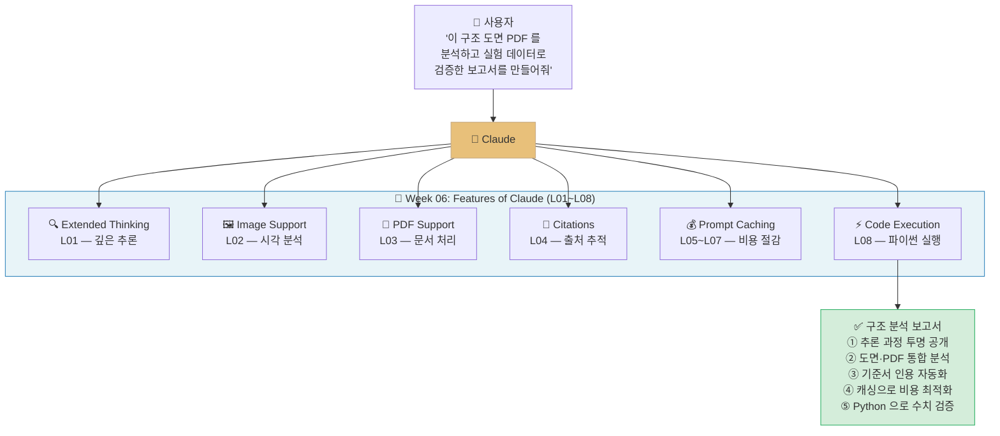
```mermaid
graph TD
    subgraph FEATURES["🧠 Week 06: Features of Claude (L01~L08)"]
        direction TB
        ET["🔍 Extended Thinking<br/>L01 — 깊은 추론"]
        IMG["🖼️ Image Support<br/>L02 — 시각 분석"]
        PDF["📄 PDF Support<br/>L03 — 문서 처리"]
        CIT["📎 Citations<br/>L04 — 출처 추적"]
        PC["💰 Prompt Caching<br/>L05~L07 — 비용 절감"]
        CE["⚡ Code Execution<br/>L08 — 파이썬 실행"]
    end

    U["👤 사용자<br/>'이 구조 도면 PDF 를<br/>분석하고 실험 데이터로<br/>검증한 보고서를 만들어줘'"] --> C["🤖 Claude"]
    C --> ET
    C --> IMG
    C --> PDF
    C --> CIT
    C --> PC
    C --> CE
    CE --> R["✅ 구조 분석 보고서<br/>① 추론 과정 투명 공개<br/>② 도면·PDF 통합 분석<br/>③ 기준서 인용 자동화<br/>④ 캐싱으로 비용 최적화<br/>⑤ Python 으로 수치 검증"]

    style FEATURES fill:#e8f4f8,stroke:#2980b9
    style C fill:#e8c07a,stroke:#c4a882,color:#333
    style R fill:#d4edda,stroke:#27ae60
```

### 이번 주 프로젝트: "AI 구조 엔지니어 비서" 프로토타입

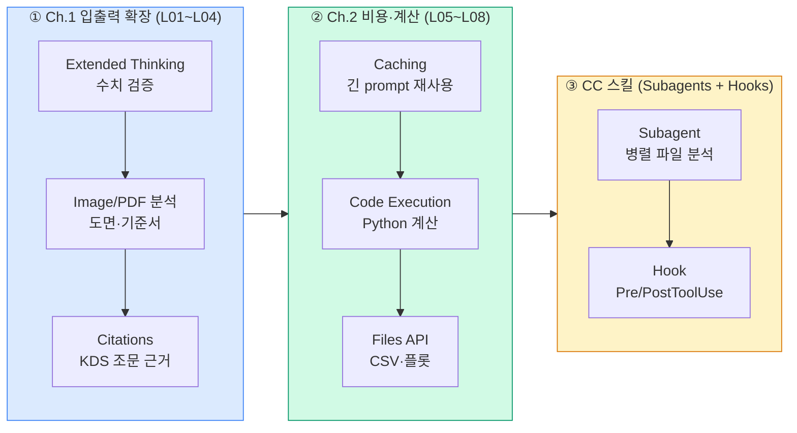
```mermaid
graph LR
    subgraph CH1["① Ch.1 입출력 확장 (L01~L04)"]
        I1["Extended Thinking<br/>수치 검증"] --> I2["Image/PDF 분석<br/>도면·기준서"]
        I2 --> I3["Citations<br/>KDS 조문 근거"]
    end

    subgraph CH2["② Ch.2 비용·계산 (L05~L08)"]
        P1["Caching<br/>긴 prompt 재사용"] --> P2["Code Execution<br/>Python 계산"]
        P2 --> P3["Files API<br/>CSV·플롯"]
    end

    subgraph CC["③ CC 스킬 (Subagents + Hooks)"]
        E1["Subagent<br/>병렬 파일 분석"] --> E2["Hook<br/>Pre/PostToolUse"]
    end

    CH1 --> CH2 --> CC

    style CH1 fill:#dbeafe,stroke:#3b82f6
    style CH2 fill:#d1fae5,stroke:#059669
    style CC fill:#fef3c7,stroke:#d97706
```

이 **3단계 파이프라인**이 이번 주차의 뼈대다. ① 입력(도면·PDF)과 출력(추론·인용)을 풍부하게 만들고, ② 긴 프롬프트의 비용을 캐싱으로 누르면서 Python 실행으로 수치 신뢰성을 확보하며, ③ Claude Code 세션을 **Subagents + Hooks** 로 자동화한다. 마지막 §2.5 에서는 이 모든 기능을 엮어 **구조공학 도메인** 에서 어떻게 쓸지 구체화한다.

### Anthropic Skilljar 코스

본 강의노트는 Anthropic 공식 교육 플랫폼 Skilljar 의 **"Building with the Claude API" Section 5: Features of Claude** (8개 레슨 L01~L08) 를 기반으로 제작되었다.

| 레슨 | ID | 제목 | Week 06 매핑 |
|---|---|---|---|
| L01 | 287773 | Extended thinking | Ch.1 §1.1 |
| L02 | 287778 | Image support | Ch.1 §1.2 |
| L03 | 287768 | PDF support | Ch.1 §1.3 |
| L04 | 287771 | Citations | Ch.1 §1.4 |
| L05 | 287772 | Prompt caching | Ch.2 §2.1 |
| L06 | 287770 | Rules of prompt caching | Ch.2 §2.2 |
| L07 | 287774 | Prompt caching in action | Ch.2 §2.3 |
| L08 | 287777 | Code execution and the Files API | Ch.2 §2.4 |

> [!ref] 소스 매핑
> - 온라인 코스: [Building with the Claude API](https://anthropic.skilljar.com/claude-with-the-anthropic-api)
> - Skilljar S5 (Features of Claude): L01~L08 (이번 주 주된 출처)
> - 전사본 원본: `01-Notes/_skilljar_s5_content.md` (2026-04-20 수집, 820 lines)
> - 실라버스 매핑: **Building — S5 (Features of Claude) → W6** (v2.3 기준)

> [!method] 사전 준비
> - **Anthropic API 키**: Claude Sonnet 4 이상의 Extended Thinking 호환 모델 필요. `claude-sonnet-4-5` 권장
> - **Python 패키지**: `anthropic`, `httpx`, `base64`, `python-dotenv`
> - **샘플 파일**: `earth.pdf` (Wikipedia Earth 기사 PDF — L03 공식 예제), `streaming.csv` (L08 churn 분석용), 콘크리트 균열 사진 또는 구조 도면 1장
> - **노트북 순서**: `S5_01_extended_thinking.ipynb` → `S5_02_images_pdf.ipynb` → `S5_03_citations.ipynb` → `S5_04_prompt_caching.ipynb` → `S5_05_code_execution.ipynb` → `S5_06_practice.ipynb` (학생 실습) → `S5_07_structural_features.ipynb` (도메인 응용)

---
## [Chapter 1] Claude의 입출력 확장 (Lessons L01~L04)

### 1.1 Extended Thinking (L01)

Extended thinking 은 Claude 의 **고급 추론(advanced reasoning)** 기능이다. 복잡한 문제를 풀기 전에 모델에게 **"풀이용 종이(scratch paper)"** 를 쥐여 주어, 답을 생성하기 전에 생각 과정을 **구조화된 블록** 으로 드러낸다. Skilljar L01 은 이를 이렇게 표현한다: *"Think of it as Claude's 'scratch paper' — you can see the reasoning process that leads to the answer."*


*기본 응답 구조 — thinking 이 꺼져 있으면 단일 text 블록만 반환*

#### Extended Thinking 이 동작하는 방식

thinking 을 활성화하면, 지금까지 단일 text 블록이던 응답이 **두 부분 구조** 로 바뀐다.


*thinking 활성화 응답 — reasoning process + final answer 두 블록이 나란히 반환*

주요 장점(*"key benefits"*):
- **복잡한 작업에 대한 더 나은 추론 능력** (better reasoning capabilities for complex tasks)
- **어려운 문제에 대한 정확도 향상** (increased accuracy on difficult problems)
- **Claude 사고 과정의 투명성** (transparency into Claude's thought process)

주의해야 할 **trade-off**:
- **높은 비용** — thinking 토큰에도 요금이 부과된다
- **지연(latency) 증가** — thinking 에는 시간이 든다
- **응답 처리 코드가 복잡해짐** — 블록 타입을 분기해서 처리해야 한다

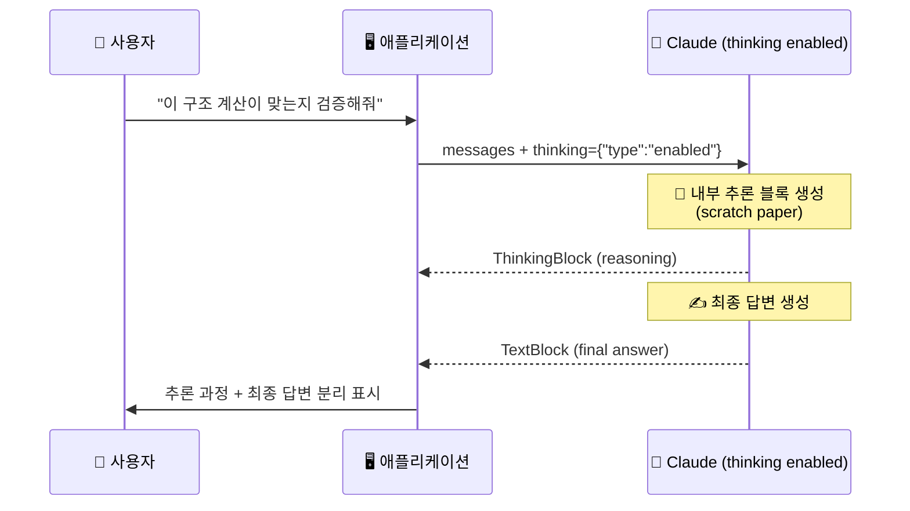
```mermaid
sequenceDiagram
    participant U as 👤 사용자
    participant A as 🖥️ 애플리케이션
    participant C as 🧠 Claude (thinking enabled)

    U->>A: "이 구조 계산이 맞는지 검증해줘"
    A->>C: messages + thinking={"type":"enabled"}
    Note over C: 📝 내부 추론 블록 생성<br/>(scratch paper)
    C-->>A: ThinkingBlock (reasoning)
    Note over C: ✍️ 최종 답변 생성
    C-->>A: TextBlock (final answer)
    A->>U: 추론 과정 + 최종 답변 분리 표시
```

#### 언제 Extended Thinking 을 켤 것인가

Skilljar 는 결정을 단순화한다 — *"Use your prompt evaluations."* 먼저 thinking **없이** 프롬프트를 돌려보고, 프롬프트 최적화를 다 했는데도 정확도가 모자라면 그때 thinking 을 켠다. 즉 thinking 은 **표준 프롬프팅의 한계 너머**에서 쓰는 도구다.

| 상황 | 권장 | 이유 |
| --- | --- | --- |
| 번역 · 요약 · 단순 질의응답 | ❌ thinking 끔 | 정확도 향상 대비 비용·지연 손해가 큼 |
| 수식·다단계 계산 | ✅ thinking 켬 | LLM 의 수치 추론 실수 감소 |
| 다단계 논리·디버깅 | ✅ thinking 켬 | 중간 단계 노출로 오류 진단 용이 |
| 아키텍처·리팩토링 설계 | ✅ thinking 켬 | 복잡한 트레이드오프를 구조적으로 탐색 |

#### 응답 구조와 서명(signature) 시스템

Extended thinking 응답은 **보안을 위한 특수 서명 시스템(special signature system for security)** 을 포함한다.


*Signature 포함 thinking 블록 — 변조 방지 암호화 토큰*


*Extended Thinking 응답 종합 — ThinkingBlock + TextBlock 의 두 부분 구조와 signature 필드 시각화*

signature 는 **thinking 텍스트가 수정되지 않았음을 보장하는 암호화 토큰(cryptographic token)** 이다. 개발자가 Claude 의 추론을 임의로 편집해 안전하지 않은 방향으로 유도하는 것을 막는다.

#### Redacted Thinking — 비공개 추론 블록

때때로 읽을 수 있는 추론 대신 **redacted thinking block** 이 돌아온다.


*Redacted thinking — Claude 내부 안전 시스템이 플래그한 추론을 암호화해 반환*

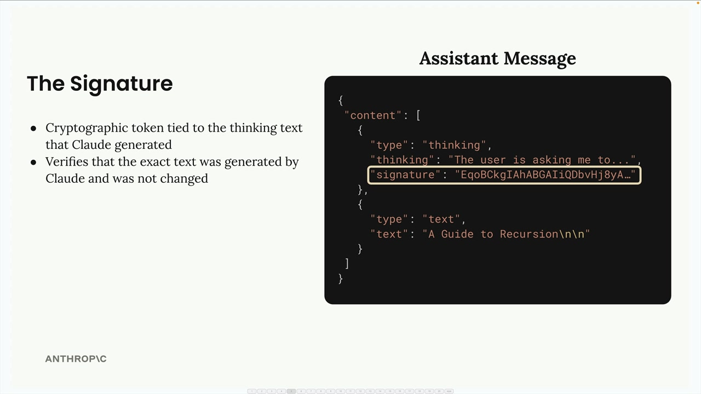
*Redacted thinking 블록의 데이터 구조 — `type: "redacted_thinking"` 과 암호화된 `data` 필드*

이것은 Claude 의 사고 과정이 **내부 안전 시스템에 의해 플래그(flagged by internal safety systems)** 된 경우 발생한다. 암호화된 형태의 thinking 이 그대로 들어 있어, **다음 턴의 대화에서 완전한 메시지를 되돌려 보내도 문맥을 잃지 않는다**. 즉 redacted 블록도 **세션 컨텍스트 유지를 위해 반드시 보존**해야 한다.

#### 구현 — `chat` 함수 확장

Skilljar 의 코드 패턴은 기존 `chat(...)` 헬퍼에 **두 개의 파라미터** 를 더 붙이는 형태다.

```python
def chat(
    messages,
    system=None,
    temperature=1.0,
    stop_sequences=[],
    tools=None,
    thinking=False,
    thinking_budget=1024
):
    ...
```

- `thinking`: 불리언 스위치
- `thinking_budget`: thinking 에 쓸 최대 토큰 수 — **최소 1,024**, 그리고 `max_tokens > thinking_budget` 이어야 한다

활성화 로직은 이렇게 추가한다.

```python
if thinking:
    params["thinking"] = {
        "type": "enabled",
        "budget": thinking_budget
    }
```

그리고 호출은 단 한 줄이다.

```python
chat(messages, thinking=True)
```

#### Redacted 응답 테스트하기

Skilljar 는 **애플리케이션이 redacted 블록을 안전하게 다루는지** 확인하기 위해, 특수한 트리거 문자열을 보내 Claude 에게 강제로 redacted thinking 을 반환하게 만드는 테스트 기법을 제시한다. 이 기법으로 *"redacted 블록이 왔을 때 앱이 crash 하지 않는다"* 를 CI 에서 검증할 수 있다.

```python
# 응답 파서의 기본 구조
for block in response.content:
    if block.type == "thinking":
        print(f"[추론]\n{block.thinking}")
    elif block.type == "redacted_thinking":
        # ❗ 내용은 읽을 수 없지만 다음 턴에 반드시 포함해야 함
        preserved_blocks.append(block)
    elif block.type == "text":
        print(f"[답변]\n{block.text}")
```

#### ⚠️ 기능 호환성 주의

> [!tip] Extended Thinking 은 일부 다른 기능과 호환되지 않는다
> Skilljar L01 은 명시적으로 경고한다 — *"Extended Thinking is not compatible with some other features, notably message pre-filling and temperature."*
> - **Message pre-filling 금지**: assistant 의 첫 글자를 미리 채우는 기법과 충돌
> - **Temperature 고정**: 임의의 temperature 설정 불가
> - 전체 제약 목록은 공식 문서 [extended-thinking#feature-compatibility](https://docs.anthropic.com/en/docs/build-with-claude/extended-thinking#feature-compatibility) 참조

#### Extended Thinking 응답 블록 구조

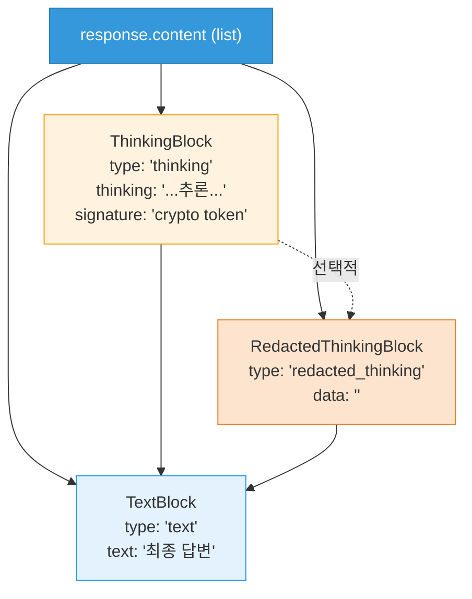
```mermaid
graph TD
    R["response.content (list)"] --> TB["ThinkingBlock<br/>type: 'thinking'<br/>thinking: '...추론...'<br/>signature: 'crypto token'"]
    R --> RTB["RedactedThinkingBlock<br/>type: 'redacted_thinking'<br/>data: '<encrypted>'"]
    R --> TXT["TextBlock<br/>type: 'text'<br/>text: '최종 답변'"]

    TB -. "선택적" .-> RTB
    TB --> TXT
    RTB --> TXT

    style R fill:#3498db,stroke:#2980b9,color:#fff
    style TB fill:#fff3e0,stroke:#ff9800
    style RTB fill:#fde4cf,stroke:#e67e22
    style TXT fill:#e3f2fd,stroke:#2196f3
```

#### 결정 가이드

> [!finding] Extended Thinking 을 "판단하지 말고 측정하라"
> Skilljar 의 핵심 조언: *"Start with standard prompting, optimize thoroughly, then add thinking when you need that extra reasoning capability."* 이는 Week 03 에서 배운 **프롬프트 평가(evaluation)** 와 직결된다 — Eval Pipeline 으로 **thinking on/off 의 정확도 차이**를 측정하고, 비용 대비 효과가 양수일 때만 thinking 을 채택한다.

> [!action] 실습 노트북
> 📂 `03-Exercises/Week_06/skilljar/S5_01_extended_thinking.ipynb`
> thinking 활성화, thinking/text/redacted 블록 분기 처리, budget 에 따른 응답 비교, redacted 강제 테스트 트리거를 모두 재현한다.

> [!ref] 소스: Skilljar L01 — Extended thinking (287773)

---

### 1.2 Image Support (L02)

Claude 의 **비전 기능(vision capabilities)** 은 메시지에 이미지를 포함시키고 *"셀 수 없이 다양한 방식으로"* 분석을 요청할 수 있게 해준다 — 이미지 묘사, 여러 이미지 비교, 객체 개수 세기, 복잡한 시각 분석까지.

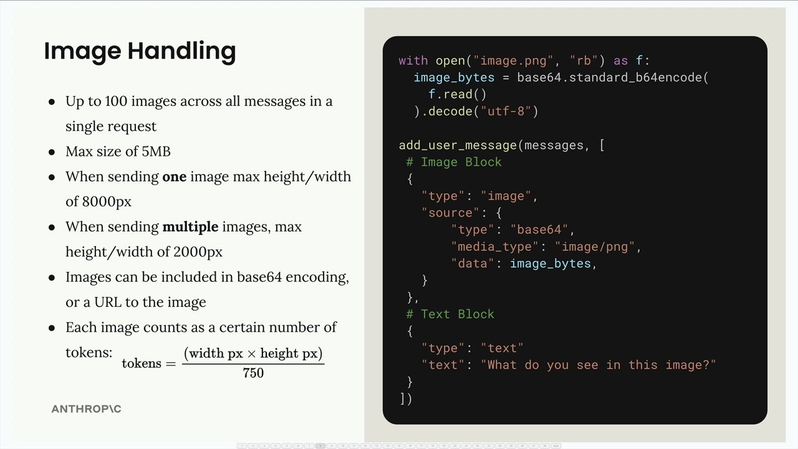
*Image Support 개요 — 이미지를 메시지 내 별도 블록으로 첨부*

#### 이미지 처리의 기본 제약

L02 에서 제시하는 **이미지 입력 제약**은 다음과 같다. 모든 수치는 전사본 원본 그대로다.

- **단일 요청당 최대 100장** (Up to 100 images across all messages in a single request)
- **장당 최대 5MB** (Max size of 5MB per image)
- **단일 이미지 전송 시 최대 해상도 8000px** (max height/width of 8000px)
- **다중 이미지 전송 시 최대 해상도 2000px** (multiple images: max 2000px)
- 이미지는 **Base64 encoding** 또는 **URL** 로 포함 가능
- 각 이미지의 토큰 비용: `tokens = (width px × height px) / 750`

#### 메시지 흐름 다이어그램

이미지는 유저 메시지 안에서 **text 블록과 나란히 놓이는 별도의 image 블록** 이 된다.

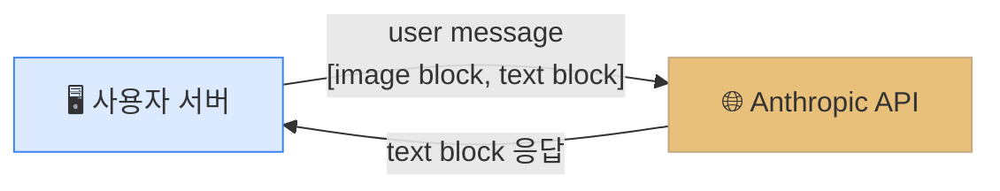
```mermaid
graph LR
    S["🖥️ 사용자 서버"] -->|"user message<br/>[image block, text block]"| A["🌐 Anthropic API"]
    A -->|"text block 응답"| S

    style S fill:#dbeafe,stroke:#3b82f6
    style A fill:#e8c07a,stroke:#c4a882,color:#333
```

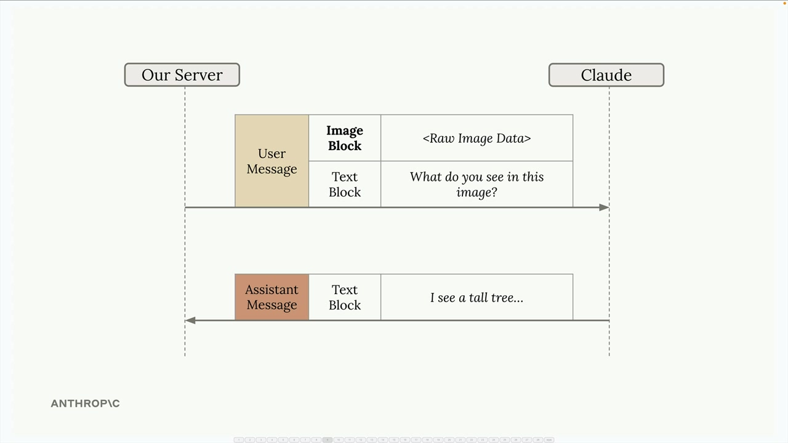
*사용자 서버 → Claude 왕복 흐름 — 텍스트와 동일한 conversation 패턴*

#### 기본 구현 — Base64 인코딩

Skilljar L02 의 정석 코드는 다음과 같다. 변수명까지 원본을 따른다.

```python
with open("image.png", "rb") as f:
    image_bytes = base64.standard_b64encode(f.read()).decode("utf-8")

add_user_message(messages, [
    # Image Block
    {
        "type": "image",
        "source": {
            "type": "base64",
            "media_type": "image/png",
            "data": image_bytes,
        }
    },
    # Text Block
    {
        "type": "text",
        "text": "What do you see in this image?"
    }
])
```

**핵심 포인트**:
- `"type": "image"` 블록에 `source.type` 을 `"base64"` 로
- `media_type` 은 `"image/png"`, `"image/jpeg"` 등 명시
- `data` 는 **UTF-8 로 디코드된 Base64 문자열** (bytes 가 아니라 str)

#### 프롬프트 엔지니어링은 텍스트와 동일하다

L02 의 핵심 메시지는 *"the same prompting techniques that work for text apply to images"* 다. 단순 프롬프트는 단순한 결과만 낳는다.

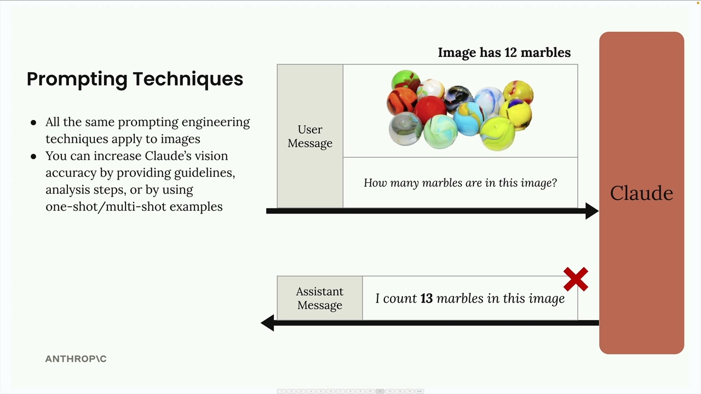
*예시 — marble 이미지 개수 세기: 단순 질문의 실패*

예를 들어 *"How many marbles are in this image?"* 라고 물어 보면, 종종 틀린 개수가 나온다. 정확도를 끌어올리려면:

- **상세한 가이드라인과 분석 단계** 를 제시 (Providing detailed guidelines and analysis steps)
- **one-shot / multi-shot 예시** 활용
- **복잡한 작업을 작은 단계로 쪼개기** (Breaking down complex tasks into smaller steps)

#### Step-by-Step 분석 프롬프트 (marble counting)

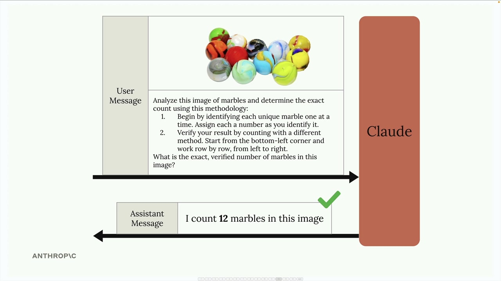
*체계적 방법론 프롬프트 — 단순 질문을 step-by-step 메서드로 대체*

Skilljar 공식 예제 그대로:

```
Analyze this image of marbles and determine the exact count using this methodology:
1. Begin by identifying each unique marble one at a time. Assign each a number as you identify it.
2. Verify your result by counting with a different method. Start from the bottom-left corner and work row by row, from left to right.

What is the exact, verified number of marbles in this image?
```

두 번의 **독립적 계수 방법** — 고유 식별 + 열 단위 재확인 — 을 강제함으로써 일관성 검증을 유도한다.

#### One-Shot 예시로 정확도 끌어올리기


*one-shot 기법 — 정답을 아는 레퍼런스 이미지 먼저 제시*

메시지 안에 **개수를 이미 아는 이미지** 를 먼저 넣고, *"이 이미지는 12 개다"* 라고 알려준 뒤 **타겟 이미지** 를 질문하는 방식. Claude 에게 *"내가 원하는 분석의 종류"* 를 레퍼런스로 제공하는 것이다 — 텍스트 few-shot 과 정확히 같은 원리.

#### 실전 사례 — Fire Risk Assessment (산불 위험도 평가)

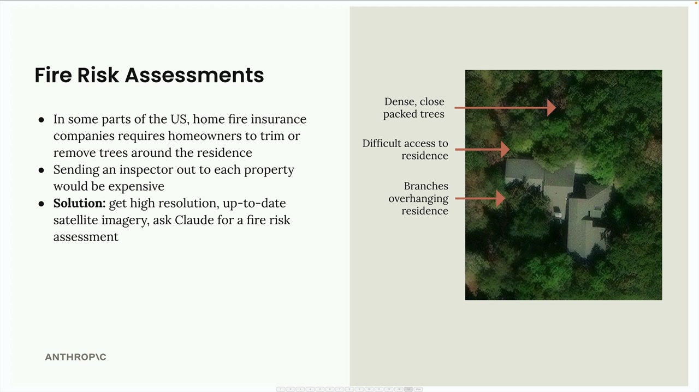
*Fire Risk Assessment — 위성 이미지 기반 주거지 위험도 자동 평가*


*Fire Risk Assessment 5단계 워크플로 — residence identification → tree overhang → fire risk → defensible space → rating 1-4*

L02 가 제시하는 실전 응용은 **주택 화재 보험을 위한 자동 위험도 평가** 다. 모든 부동산에 조사원을 보내는 대신, 위성 이미지 + Claude 분석으로 대체한다. 시스템이 살펴보는 요소:

- **주거지 근처의 빽빽한 나무들** (Dense, close-packed trees near the residence)
- **응급 출동이 어려운 접근 경로** (Difficult access routes for emergency services)
- **주거지 위로 뻗은 가지들** (Branches overhanging the residence)

원본 프롬프트(축약판):

```text
Analyze the attached satellite image of a property with these specific steps:

1. Residence identification: Locate the primary residence on the property by looking for:
   - The largest roofed structure
   - Typical residential features (driveway connection, regular geometry)
   - Distinction from other structures (garages, sheds, pools)

2. Tree overhang analysis: Examine all trees near the primary residence:
   - Identify any trees whose canopy extends directly over any portion of the roof
   - Estimate the percentage of roof covered by overhanging branches (0-25%, 25-50%, 50-75%, 75%+)
   - Note particularly dense areas of overhang

3. Fire risk assessment: For any overhanging trees, evaluate:
   - Potential wildfire vulnerability (ember catch points, continuous fuel paths to structure)
   - Proximity to chimneys, vents, or other roof openings if visible
   - Areas where branches create a "bridge" between wildland vegetation and the structure

4. Defensible space identification: Assess the property's overall vegetative structure:
   - Identify if trees connect to form a continuous canopy over or near the home
   - Note any obvious fuel ladders (vegetation that can carry fire from ground to tree to roof)

5. Fire risk rating: Based on your analysis, assign a Fire Risk Rating from 1-4:
   - Rating 1 (Low Risk): No tree branches overhanging the roof, good defensible space around the home
   - Rating 2 (Moderate Risk): Minimal overhang (<25% of roof), some separation between tree canopies
   - Rating 3 (High Risk): Significant overhang (25-50% of roof), connected tree canopies, multiple vulnerability points
   - Rating 4 (Severe Risk): Extensive overhang (>50% of roof), dense vegetation against structure

For each item above (1-5), write one sentence summarizing your findings,
with your final response being the numerical rating.
```

#### Fire Risk Assessment 를 도메인에 투영하기

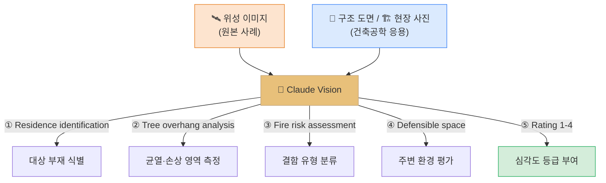
```mermaid
graph TD
    IMG["🛰️ 위성 이미지<br/>(원본 사례)"] --> C["🤖 Claude Vision"]
    IMGK["📐 구조 도면 / 🏗️ 현장 사진<br/>(건축공학 응용)"] --> C

    C -->|"① Residence identification"| S1["대상 부재 식별"]
    C -->|"② Tree overhang analysis"| S2["균열·손상 영역 측정"]
    C -->|"③ Fire risk assessment"| S3["결함 유형 분류"]
    C -->|"④ Defensible space"| S4["주변 환경 평가"]
    C -->|"⑤ Rating 1-4"| S5["심각도 등급 부여"]

    style IMG fill:#fde4cf,stroke:#e67e22
    style IMGK fill:#dbeafe,stroke:#3b82f6
    style C fill:#e8c07a,stroke:#c4a882,color:#333
    style S5 fill:#d4edda,stroke:#27ae60
```

L02 가 보여주는 5단계 메서드는 **도메인 불문의 템플릿** 이다 — "대상 식별 → 주요 특징 측정 → 위험/결함 평가 → 환경 맥락 → 수치 등급" 순서는 구조 균열 분석, BIM 도면 점검 등에 그대로 이식된다.

#### Image + Text 블록 구조 요약


*Image Support 메시지 구조 — image block (base64/url) + text block 이 user 메시지 안에 나란히 배치*

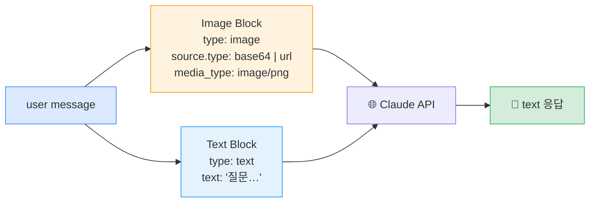
```mermaid
graph LR
    U["user message"] --> IMG["Image Block<br/>type: image<br/>source.type: base64 | url<br/>media_type: image/png"]
    U --> TXT["Text Block<br/>type: text<br/>text: '질문…'"]

    IMG --> API["🌐 Claude API"]
    TXT --> API
    API --> OUT["📝 text 응답"]

    style U fill:#dbeafe,stroke:#3b82f6
    style IMG fill:#fff3e0,stroke:#ff9800
    style TXT fill:#e3f2fd,stroke:#2196f3
    style OUT fill:#d4edda,stroke:#27ae60
```

> [!tip] 이미지 입력 실전 팁
> - **Base64 vs URL**: 로컬 파일은 Base64, 공개 URL 은 URL 방식. URL 방식은 요청 크기가 작지만 Anthropic 측에서 해당 URL 을 fetch 할 수 있어야 한다
> - **해상도 vs 토큰 비용**: `tokens = (width × height) / 750` 이므로 불필요한 고해상도는 그대로 비용이다. 세밀한 균열 분석엔 원본, 단순 분류엔 리사이즈
> - **다중 이미지**: before/after 비교처럼 블록 여러 개를 나열하면 *"첫 번째는 보수 전, 두 번째는 보수 후"* 와 같은 문맥도 자연스럽게 이해한다 (다만 2000px 제약 적용)

> [!action] 실습 노트북
> 📂 `03-Exercises/Week_06/skilljar/S5_02_images_pdf.ipynb`
> marble counting 단순 vs 단계별 프롬프트 비교, one-shot 예시 주입, Fire Risk Assessment 5단계 템플릿 재현, 구조 도면 적용 실험.

> [!ref] 소스: Skilljar L02 — Image support (287778)

---

### 1.3 PDF Support (L03)

Claude 는 **PDF 파일을 직접 읽고 분석** 할 수 있다 — 문서 처리 도구로서 강력한 능력이다. 놀랍도록 **이미지 처리와 거의 같은 코드 패턴**을 쓰며, 몇 가지 필드만 바뀐다.

#### 이미지 코드에서 PDF 코드로의 최소 diff

L03 이 강조하는 포인트는 이것이다 — *"you'll use nearly identical code to what you'd use for images. The main differences are in the file type specifications."*

```python
with open("earth.pdf", "rb") as f:
    file_bytes = base64.standard_b64encode(f.read()).decode("utf-8")

messages = []

add_user_message(
    messages,
    [
        {
            "type": "document",
            "source": {
                "type": "base64",
                "media_type": "application/pdf",
                "data": file_bytes,
            },
        },
        {"type": "text", "text": "Summarize the document in one sentence"},
    ],
)

chat(messages)
```

#### 이미지 → PDF 로 바뀌는 4가지 요소

| 항목 | 이미지 | PDF |
| --- | --- | --- |
| 파일 확장자 | `.png` / `.jpg` | `.pdf` |
| 변수명 (권장) | `image_bytes` | `file_bytes` (명확성) |
| `type` 필드 | `"image"` | `"document"` |
| `media_type` | `"image/png"` | `"application/pdf"` |

즉 **코드 한 번 짜 두면 이미지/PDF 를 거의 단일 분기로 처리** 할 수 있다.

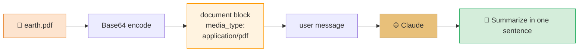
```mermaid
flowchart LR
    F["📄 earth.pdf"] --> B64["Base64 encode"]
    B64 --> BL["document block<br/>media_type:<br/>application/pdf"]
    BL --> MSG["user message"]
    MSG --> API["🌐 Claude"]
    API --> OUT["📝 Summarize in one sentence"]

    style F fill:#fde4cf,stroke:#e67e22
    style BL fill:#fff3e0,stroke:#ff9800
    style API fill:#e8c07a,stroke:#c4a882,color:#333
    style OUT fill:#d4edda,stroke:#27ae60
```

#### Claude 가 PDF 에서 추출할 수 있는 것

단순 텍스트 추출을 넘어서 — L03 은 네 가지 능력을 명시한다.

- **문서 전체의 텍스트 내용** (Text content throughout the document)
- **PDF 에 포함된 이미지와 차트** (Images and charts embedded in the PDF)
- **표와 그 데이터 관계** (Tables and their data relationships)
- **문서 구조와 서식** (Document structure and formatting)


*Wikipedia Earth PDF 예제 — 한 문장 요약 성공*

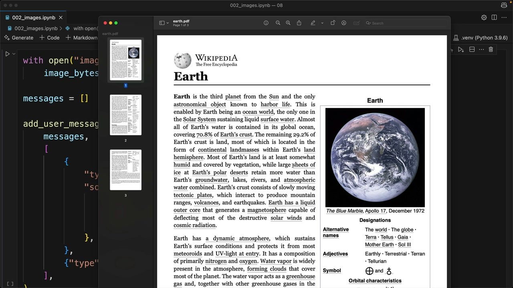
*PDF Processing 흐름 — base64 인코딩 → document block → Claude 가 텍스트·이미지·표·구조를 통합 추출*

위 스크린샷은 **Wikipedia Earth 기사 PDF** 를 단 한 문장으로 요약한 실제 출력이다. 이는 *"PDF 문서에서 어떤 종류의 정보든 추출할 수 있는 원스톱 솔루션(one-stop solution)"* 이 된다는 증명이다.

#### PDF vs RAG 선택 기준

> [!finding] PDF 직접 전달과 RAG 중 무엇을 쓸 것인가
> - **단일 문서 100 페이지 이내, 세션 내 질문 3~5 회**: **PDF 직접 전달**이 유리 — 전체 컨텍스트 유지, 벡터 DB 구축 불필요, 표·차트까지 통합 처리
> - **수백~수천 문서 또는 반복 세션**: **RAG** 필요 — W05 에서 배운 청킹·임베딩·BM25·RRF 로 관련 청크만 주입
> - **중간 영역**: PDF 직접 전달 + **Prompt Caching** (§2.1~2.3) 조합 — 1시간 안에 반복 질문이 많다면 캐시 HIT 로 비용을 90% 수준까지 낮출 수 있다

#### 건축공학 적용 예 — KDS 기준서 요약

```python
# KDS 14 20 22 (콘크리트 구조 전단 설계) PDF 를 그대로 전달
with open("KDS_14_20_22_shear.pdf", "rb") as f:
    file_bytes = base64.standard_b64encode(f.read()).decode("utf-8")

add_user_message(
    messages,
    [
        {
            "type": "document",
            "source": {
                "type": "base64",
                "media_type": "application/pdf",
                "data": file_bytes,
            },
        },
        {
            "type": "text",
            "text": "이 KDS 기준서에서 RC 보의 전단 설계 조항을 요약하고, "
                    "주요 설계식과 허용 한계치를 표로 정리해줘."
        },
    ],
)
```

> [!tip] PDF 전달 시 실전 주의
> - 매우 큰 PDF (수백 페이지)는 한 요청에 넣기 전 **페이지 분할** 을 고려 — 응답 토큰 한도에 걸린다
> - 스캔된(이미지만 들어 있는) PDF 는 텍스트 레이어가 없어 정확도가 떨어진다 — OCR 전처리가 필요할 수 있다
> - 같은 PDF 를 5번 이상 질의한다면 **반드시 prompt caching** (§2.3) 을 함께 적용하자

> [!action] 실습 노트북
> 📂 `03-Exercises/Week_06/skilljar/S5_02_images_pdf.ipynb`
> earth.pdf 를 재현해 한 문장 요약, 표가 포함된 PDF 의 표 추출, 이미지 vs PDF 코드 diff 비교를 실습한다.

> [!ref] 소스: Skilljar L03 — PDF support (287768)

---

### 1.4 Citations (L04)

Claude 가 제공한 문서를 바탕으로 답변할 때, 사용자는 *"이거 혹시 학습 데이터 아니야?"* 라고 의심할 수 있다. **Citations** 기능은 이 투명성 문제를 해결한다 — Claude 의 응답에서 **소스 문서의 특정 부분으로 이어지는 명확한 증거 경로(clear trail)** 를 자동 생성한다.

#### 왜 Citations 가 필요한가


*Citations 의 목적 — Claude 의 답변이 문서 어디서 왔는지 사용자에게 보여주는 투명성 기능*


*Citations 개념도 — Claude 응답의 각 주장(claim)에 소스 문서의 원문 발췌가 자동 attach*

Citation 없이 답변만 제공하면, 사용자는 **두 가지를 검증할 수 없다**.
1. Claude 가 실제로 제공한 문서를 참조했는가?
2. 해당 주장의 근거 문장이 문서 어디에 있는가?

이 두 가지를 자동으로 붙여 주는 것이 Citations 기능이다.

#### Citations 활성화 — 두 개의 필드만 추가

기존 document 블록에 **두 개의 새 필드** 만 추가한다.

```python
{
    "type": "document",
    "source": {
        "type": "base64",
        "media_type": "application/pdf",
        "data": file_bytes,
    },
    "title": "earth.pdf",
    "citations": { "enabled": True }
}
```

- `title`: 사람이 읽을 수 있는 문서 이름 (*readable name*)
- `citations: {"enabled": True}`: Claude 에게 *"정보의 출처를 추적하라"* 는 지시

#### 응답의 Citation 구조

Citations 가 켜지면, Claude 의 응답은 **단순 텍스트가 아닌 구조화된 데이터**로 바뀐다. 각 주장(claim)마다 citation 이 따라붙는다.


*Citations 응답 구조 — 각 주장 뒤에 cited_text / document_index / title / page 범위가 attached*

각 citation 은 5개의 핵심 필드를 갖는다.

| 필드 | 의미 |
| --- | --- |
| **`cited_text`** | Claude 의 주장을 뒷받침하는 **문서 원문 그대로의 텍스트** |
| **`document_index`** | 여러 문서 중 몇 번째 문서인지 (0-indexed) |
| **`document_title`** | 문서에 부여한 `title` |
| **`start_page_number`** | cited_text 가 시작되는 페이지 |
| **`end_page_number`** | cited_text 가 끝나는 페이지 |


*Citation 필드 예시 — earth.pdf 의 특정 페이지 범위와 원문 발췌가 함께 반환*

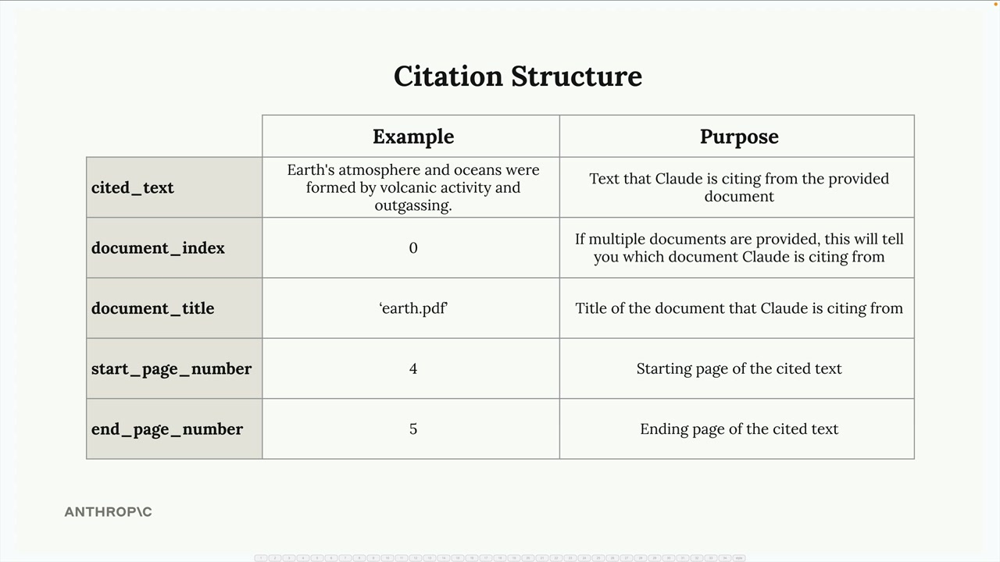
*Citation 응답 구조 — cited_text · document_index · document_title · start_page · end_page 5개 필드의 전체 데이터 구조*

#### Citations 응답 흐름 다이어그램

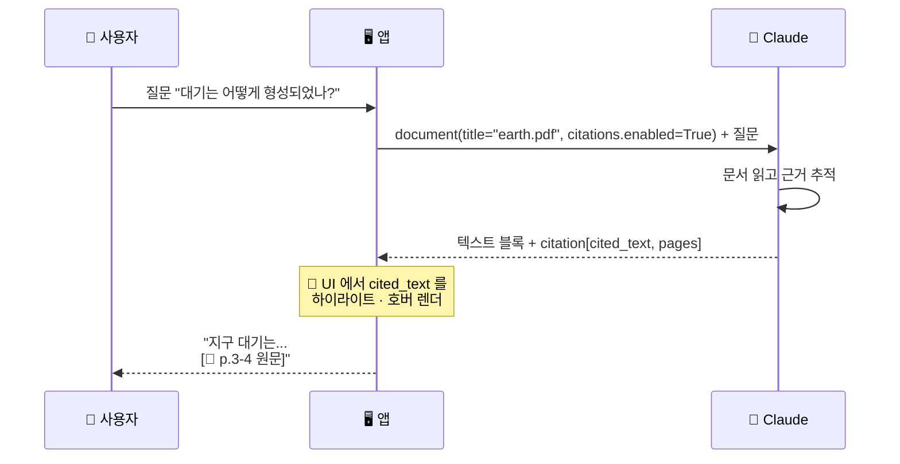
```mermaid
sequenceDiagram
    participant U as 👤 사용자
    participant A as 🖥️ 앱
    participant C as 🤖 Claude

    U->>A: 질문 "대기는 어떻게 형성되었나?"
    A->>C: document(title="earth.pdf", citations.enabled=True) + 질문
    C->>C: 문서 읽고 근거 추적
    C-->>A: 텍스트 블록 + citation[cited_text, pages]
    Note over A: 🎨 UI 에서 cited_text 를<br/>하이라이트 · 호버 렌더
    A-->>U: "지구 대기는...<br/>[📎 p.3-4 원문]"
```

#### Citations 를 UI 에 녹여내기


*Citations 기반 UI — 마우스 호버 시 원문 발췌가 뜨는 인터랙티브 각주*

Citations 의 **진짜 힘**은 이 정보를 **사용자 인터페이스** 에서 접근 가능하게 만들 때 나온다. 호버 시 원문 발췌가 뜨는 각주, 클릭 시 원본 PDF 의 해당 페이지로 점프, 사이드바에 citation 리스트 렌더 등의 인터랙션으로 **투명한 사용자 경험** 을 만들 수 있다.

사용자는 다음을 할 수 있다.
- Claude 의 답변이 **실제 소스에 근거**함을 확인
- **원본 문서를 직접 열어 검증**
- 각 인용 주변의 **문맥을 탐색**

#### Citations with Plain Text — PDF 가 아닌 경우

Citations 는 PDF 에 국한되지 않는다. plain text 소스에도 쓸 수 있다.

```python
{
    "type": "document",
    "source": {
        "type": "text",
        "media_type": "text/plain",
        "data": article_text,
    },
    "title": "earth_article",
    "citations": { "enabled": True }
}
```

plain text 에서는 **페이지 번호 대신 문자(character) 위치**가 반환된다 — 즉 텍스트의 몇 번째 문자부터 몇 번째 문자까지가 근거 문장인지 정확히 짚어 준다.

#### Citations 와 소스 타입의 매칭

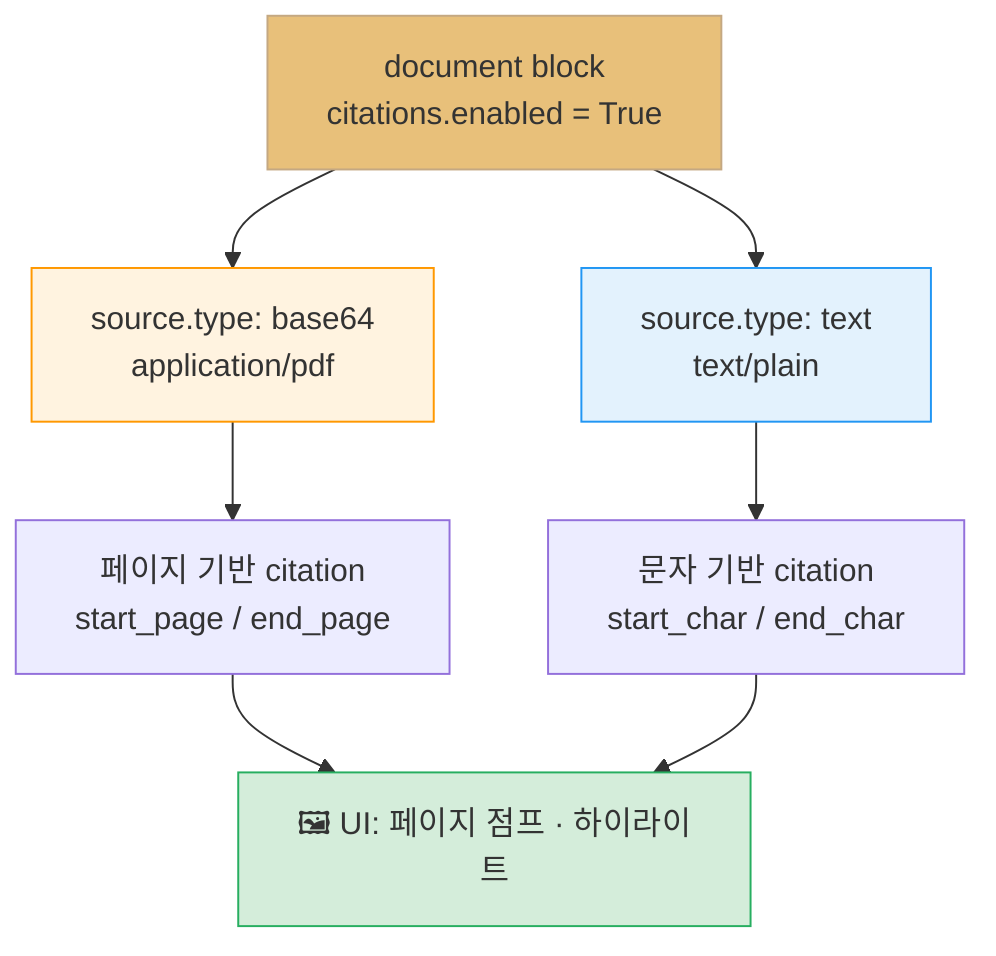
```mermaid
graph TD
    DOC["document block<br/>citations.enabled = True"] --> T1["source.type: base64<br/>application/pdf"]
    DOC --> T2["source.type: text<br/>text/plain"]

    T1 --> C1["페이지 기반 citation<br/>start_page / end_page"]
    T2 --> C2["문자 기반 citation<br/>start_char / end_char"]

    C1 --> UI["🖼️ UI: 페이지 점프 · 하이라이트"]
    C2 --> UI

    style DOC fill:#e8c07a,stroke:#c4a882,color:#333
    style T1 fill:#fff3e0,stroke:#ff9800
    style T2 fill:#e3f2fd,stroke:#2196f3
    style UI fill:#d4edda,stroke:#27ae60
```

#### Citations 를 써야 할 상황

L04 가 명시하는 **citation 이 특히 가치 있는 경우**:
- 사용자가 **정보의 정확성을 검증해야 할 때**
- **권위 있는 문서**를 다루어, 사용자가 참조 가능해야 할 때
- 애플리케이션에 **정보 출처의 투명성**이 중요할 때
- 사용자가 특정 사실의 **주변 맥락을 탐색**하고 싶을 때

건축공학 맥락에서는 바로 이런 장면들이다 — **KDS 기준서 기반 설계 검토, 논문 문헌 리뷰, 안전진단 보고서의 인용, 규정 준수 감사(audit)**.

> [!finding] "Black box → Transparent research assistant"
> L04 의 한 문장 요약: *"By implementing citations, you transform Claude from a 'black box' that provides answers into a transparent research assistant that shows its work."* W05 의 RAG 로 검색한 문서 청크를 그대로 `document` 블록에 넣고 citations 를 켜면, **검색 + 근거 제시** 가 단일 응답에서 완결된다.

> [!action] 실습 노트북
> 📂 `03-Exercises/Week_06/skilljar/S5_03_citations.ipynb`
> earth.pdf 를 재현한 citations 활성화, plain text citations 비교, 응답의 `citations` 리스트 파싱해 UI 데이터 변환, KDS PDF 기반 조문 인용 시뮬레이션.

> [!ref] 소스: Skilljar L04 — Citations (287771)

---
## [Chapter 2] 비용 최적화와 코드 실행 (Lessons L05~L08)

### 2.1 Prompt Caching 개념 (L05)

Prompt caching 은 **이전 요청의 계산 작업을 재사용해** Claude 의 응답을 빠르게 만들고 텍스트 생성 비용을 낮추는 기능이다. Skilljar L05 의 핵심 메시지는 간단하다 — *"Instead of throwing away all the processing work after each request, Claude can save and reuse it when you send similar content again."*

#### 기본 동작 — 캐시가 없을 때 무슨 일이 일어나는가

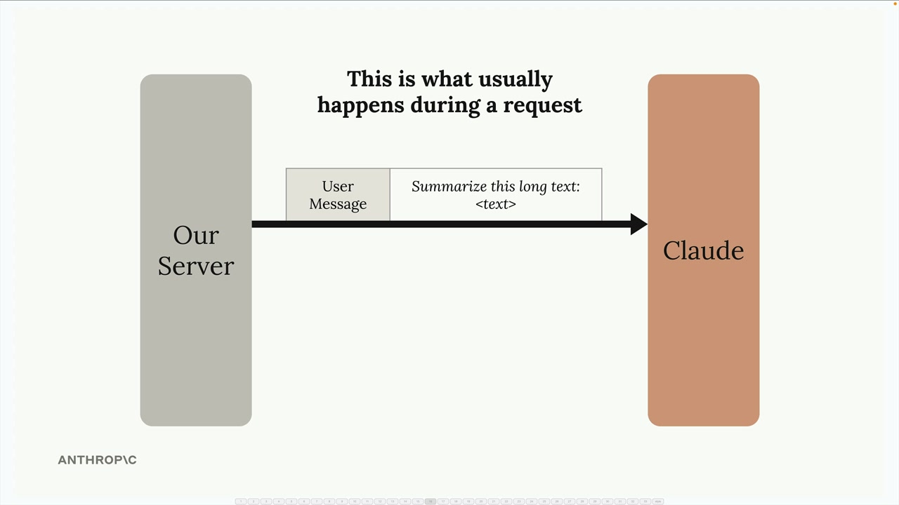
*Prompt caching 소개 — 현재 어떤 낭비가 일어나고 있는가*


*Prompt Caching 개념 — 전처리 결과를 버리지 않고 cache 에 저장해 후속 요청에서 재사용*

사용자가 Claude 에 메시지를 보내면, Claude 는 응답을 **바로** 생성하지 않는다. 먼저 입력에 대한 **엄청난 양의 전처리(tremendous amount of preprocessing work)** 를 수행한다.

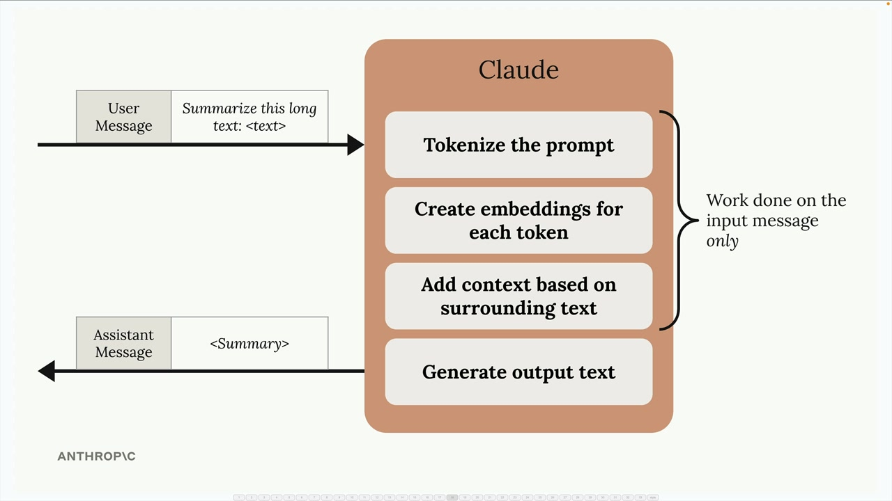
*전처리 4단계 — tokenize → embed → context → generate*

- 프롬프트를 더 작은 조각으로 **tokenize**
- 각 토큰의 **embedding 생성**
- 주변 텍스트 기반으로 **context 부여**
- **그 후에야** 실제 출력 텍스트 생성

그리고 응답을 돌려준 뒤, 이 모든 계산 작업을 **버린다**. tokenization, embedding, context 분석 전부 discard 된다.

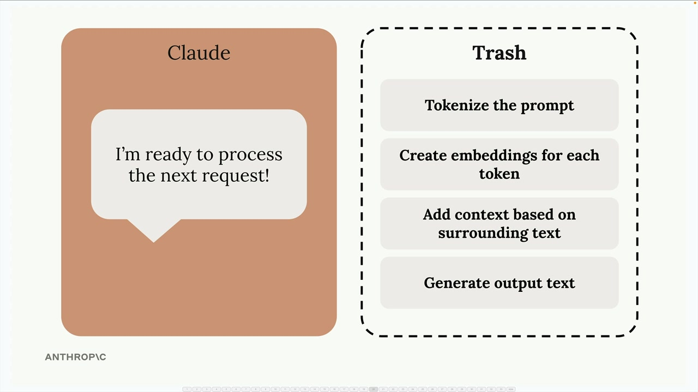
*기본 동작 — 응답 생성 후 모든 전처리 결과 폐기*

#### 낭비가 드러나는 시나리오

이 버리는 방식이 문제가 되는 건 **같은 콘텐츠가 포함된 후속 요청(follow-up requests)** 을 보낼 때다.

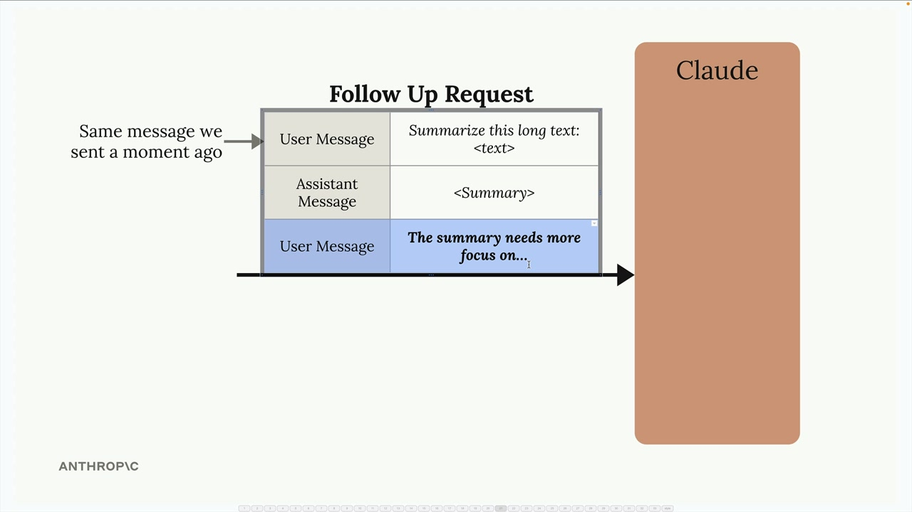
*동일 문서에 대한 반복 요청 — 같은 전처리를 매번 재수행*

예를 들어 긴 텍스트의 요약을 **여러 번 다듬어 달라고** 대화하는 상황. Claude 는 **조금 전에 분석한** 바로 그 내용에 대해 같은 전처리를 다시 해야 한다. L05 는 이를 Claude 의 속마음으로 표현한다 — *"I just processed that message and threw away all the work I did — I could have reused it!"*

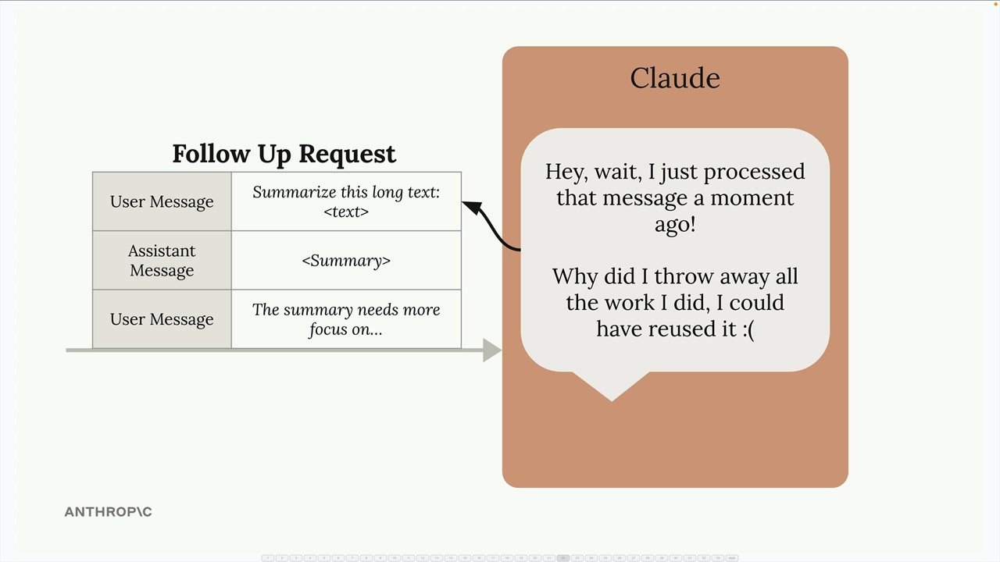
*"I could have reused it!" — 낭비 구간을 직시하기*

#### Prompt Caching 이 하는 일

이 워크플로를 **전처리 결과를 버리지 않고 저장**하는 방식으로 바꾼다.

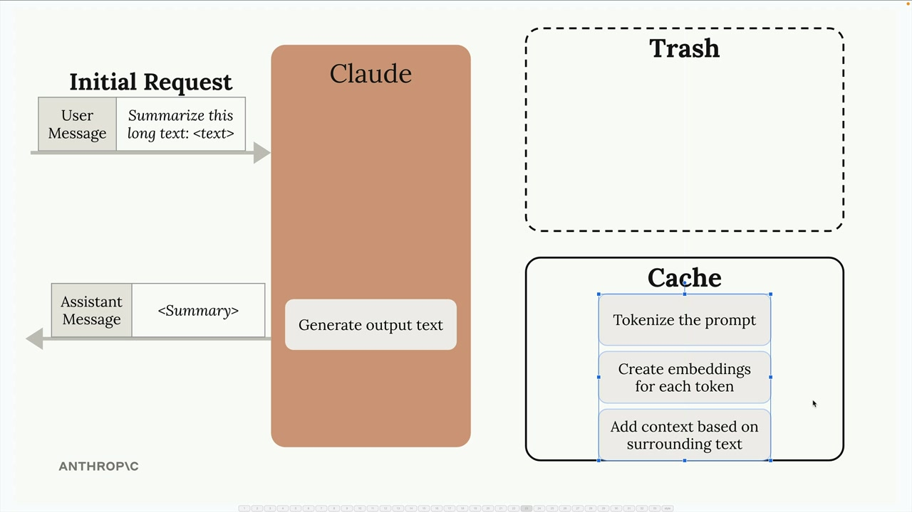
*Prompt caching 이후 — 전처리 결과를 cache 에 저장, 재요청에서 재사용*

최초 요청 시 Claude 는 평소처럼 전처리를 수행하되, 결과를 **버리는 대신 cache 에 저장한다**. cache 는 *"이 메시지가 또 오면, 전에 한 일을 재사용하겠다"* 는 일종의 lookup table 로 동작한다.

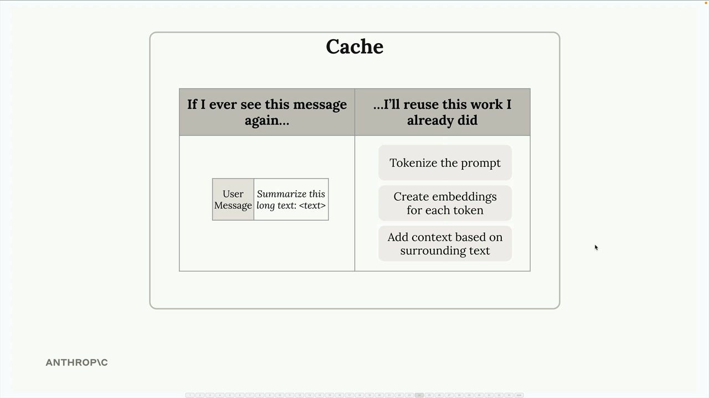
*Cache hit — 초기 write 이후 follow-up 요청은 read 로 처리*


*Caching Workflow 전체 — 최초 요청(WRITE) → 캐시 저장(1h TTL) → 후속 요청(HIT, 90% 할인)*

#### 이득과 제약

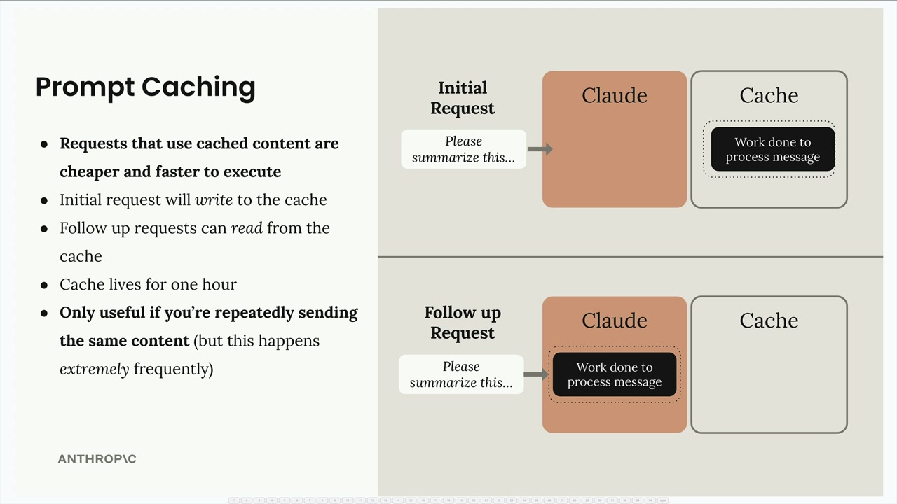
*Prompt caching 의 장점과 한계 요약*

**이득**:
- **더 빠른 응답** (Faster responses) — cached 콘텐츠 사용 요청이 더 빠르게 실행
- **낮은 비용** (Lower costs) — 캐시된 부분에 대해 더 적게 지불
- **자동 최적화** — 최초 요청은 cache 에 write, follow-up 은 read

**제약**:
- **캐시 지속 시간: 1시간** (Cached content only lives for **one hour**)
- **제한적 유스케이스** — 같은 콘텐츠를 반복적으로 보낼 때만 이득
- **높은 빈도 요구** — 같은 콘텐츠가 **매우 자주** 등장해야 가장 효과적

Prompt caching 은 **문서 분석 워크플로**(같은 대형 문서에 여러 질문) 나 **반복 편집 작업**(base 콘텐츠는 고정, 세부만 수정) 같은 시나리오에 최적이다.

#### L05 핵심 아이디어 한 컷

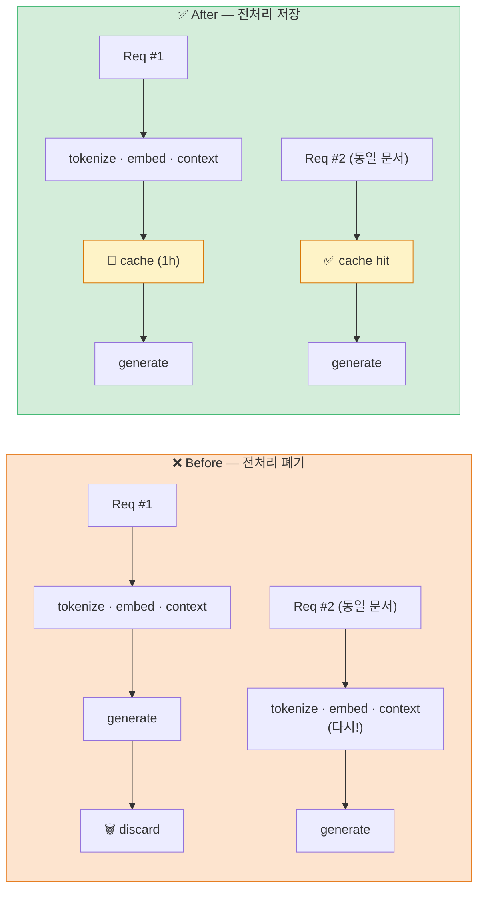
```mermaid
graph LR
    subgraph BEFORE["❌ Before — 전처리 폐기"]
        R1["Req #1"] --> P1["tokenize · embed · context"] --> G1["generate"] --> D1["🗑️ discard"]
        R2["Req #2 (동일 문서)"] --> P2["tokenize · embed · context<br/>(다시!)"] --> G2["generate"]
    end

    subgraph AFTER["✅ After — 전처리 저장"]
        R3["Req #1"] --> P3["tokenize · embed · context"] --> C3["💾 cache (1h)"] --> G3["generate"]
        R4["Req #2 (동일 문서)"] --> C4["✅ cache hit"] --> G4["generate"]
    end

    style BEFORE fill:#fde4cf,stroke:#e67e22
    style AFTER fill:#d4edda,stroke:#27ae60
    style C3 fill:#fef3c7,stroke:#d97706
    style C4 fill:#fef3c7,stroke:#d97706
```

> [!tip] Caching 은 자동이 아니다
> Skilljar L05 는 *"the initial request writes to the cache, follow-up requests read from it"* 을 강조하면서도 **자동 캐싱이 아님**을 분명히 한다 — 다음 §2.2 에서 배우는 **cache breakpoint** 를 수동으로 배치해야 한다. 기본값은 "캐싱 없음" 이다.

> [!action] 실습 노트북
> 📂 `03-Exercises/Week_06/skilljar/S5_04_prompt_caching.ipynb`
> cache 없이 동일 문서 4회 반복 vs cache 적용 후 재수행을 비교해, `cache_creation_input_tokens` / `cache_read_input_tokens` 값의 변화를 체험한다.

> [!ref] 소스: Skilljar L05 — Prompt caching (287772)

---

### 2.2 Rules of Prompt Caching (L06)

Prompt caching 은 **반복적으로 동일한 내용을 보낼 때만** 이득을 준다. L06 은 *"이득을 실제로 받기 위한 규칙"* 을 10 장의 슬라이드로 단계별로 설명한다.


*L06 인트로 — 동작 원리 복습 + "one hour 유효" 강조*

#### 규칙 1 — 캐시는 자동이 아니며, breakpoint 가 필요하다

L06 이 가장 먼저 못박는 규칙은 다음 네 가지다.

- 메시지에 대한 작업은 **자동 캐싱되지 않는다** (*Work done on messages is not cached automatically*)
- **cache breakpoint** 를 **수동으로** 블록에 추가해야 한다
- breakpoint **이전의** 모든 작업이 캐시된다
- follow-up 요청에서 **breakpoint 까지의 내용이 완전히 동일할 때만** 캐시가 사용된다


*Breakpoint 배치 — 해당 위치까지 연속적으로 캐싱*

#### 규칙 2 — Longhand 블록 형식을 써야 한다

shorthand form 에서는 `cache_control` 을 둘 자리가 없다. 그래서 **longhand(확장) 텍스트 블록 형식** 으로 적어야 한다.

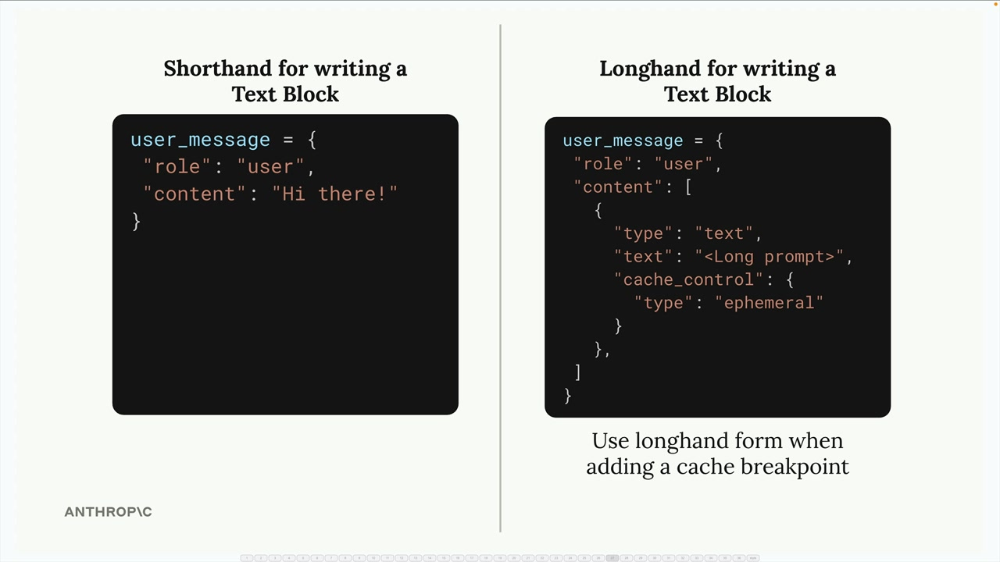
*Shorthand vs longhand — cache_control 필드를 넣기 위한 구조 차이*

```python
# ❌ shorthand — cache_control 넣을 자리 없음
{"role": "user", "content": "very long text ..."}

# ✅ longhand — cache_control 추가 가능
{
    "role": "user",
    "content": [
        {
            "type": "text",
            "text": "very long text ...",
            "cache_control": {"type": "ephemeral"}
        }
    ]
}
```

`cache_control` 필드에 `{"type": "ephemeral"}` 를 넣는 것이 표준이다. "ephemeral" 은 **1시간 TTL** 의 짧은 수명 캐시를 의미한다.

#### 규칙 3 — Breakpoint 까지의 모든 것이 동일해야 한다


*Breakpoint 전후 — 전은 캐시, 후는 일반 처리*


*Cache Breakpoints 종합 — 최대 4개 breakpoint 의 배치 전략과 tools/system/messages 처리 순서*

breakpoint 를 배치한 순간, **그 지점까지의 모든 처리 작업** 이 캐시된다. breakpoint **이후** 콘텐츠는 평소대로 처리된다.

그런데 여기 **잔인한 규칙**이 있다 — *"Even small changes like adding the word 'please' will invalidate the cache and force Claude to reprocess everything."*

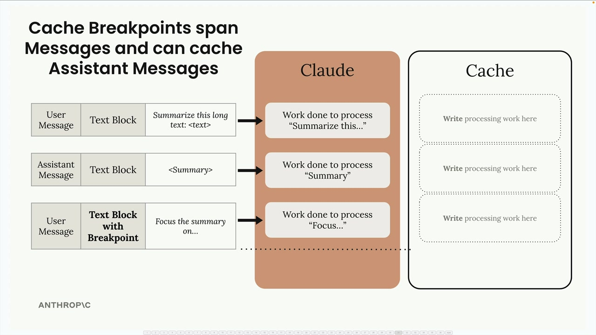
*캐시 무효화 — 작은 변경(단어 하나!)이 캐시 전체를 깨뜨림*

이것이 prompt caching 이 **변하지 않는 콘텐츠 뒤에** breakpoint 를 배치해야 하는 이유다. 조금이라도 사용자 입력처럼 바뀌는 부분이 앞에 있으면 캐시는 쓸모가 없다.

#### 규칙 4 — Cross-Message Caching (여러 메시지에 걸친 캐시)

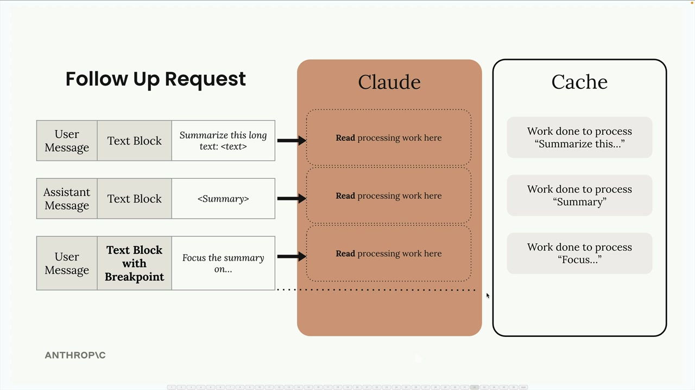
*Cross-message caching — 뒤쪽 메시지의 breakpoint 가 앞쪽 메시지 전부를 포함*

breakpoint 를 **나중 메시지에** 두면, 이전 메시지들(user / assistant 전부)이 모두 캐시 대상에 포함된다. 대화 문맥 전체를 특정 시점까지 **통째로 캐싱** 하고 싶을 때 유용하다.

#### 규칙 5 — 텍스트 외의 블록도 캐싱 대상

breakpoint 는 텍스트 블록에만 붙는 게 아니다.

- **System prompts**
- **Tool definitions**
- **Image blocks**
- **Tool use 및 tool result 블록**


*System prompt · Tool 정의는 캐싱의 최적 후보 — 거의 변하지 않음*

시스템 프롬프트와 tool 정의는 요청 간에 **거의 변하지 않으므로** 캐싱의 가장 좋은 후보다. L06 은 이를 두고 *"this is often where you'll get the most benefit from prompt caching"* 이라 강조한다.

#### 규칙 6 — 처리 순서: tools → system → messages

내부적으로 Claude 는 요청 구성요소를 **특정 순서**로 처리한다.


*내부 처리 순서 — tools 먼저, 그 다음 system, 마지막 messages*

이 순서를 이해하면 breakpoint 를 **어디에 놓을지** 직관이 생긴다.

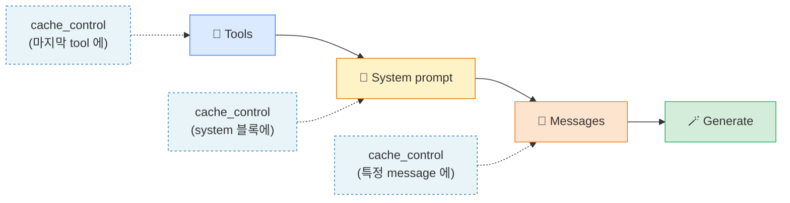
```mermaid
flowchart LR
    T["🔧 Tools"] --> S["📜 System prompt"]
    S --> M["💬 Messages"]
    M --> G["🪄 Generate"]

    CP1["cache_control<br/>(마지막 tool 에)"] -.-> T
    CP2["cache_control<br/>(system 블록에)"] -.-> S
    CP3["cache_control<br/>(특정 message 에)"] -.-> M

    style T fill:#dbeafe,stroke:#3b82f6
    style S fill:#fef3c7,stroke:#d97706
    style M fill:#fde4cf,stroke:#e67e22
    style G fill:#d4edda,stroke:#27ae60
    style CP1 fill:#e8f4f8,stroke:#2980b9,stroke-dasharray: 3 3
    style CP2 fill:#e8f4f8,stroke:#2980b9,stroke-dasharray: 3 3
    style CP3 fill:#e8f4f8,stroke:#2980b9,stroke-dasharray: 3 3
```

#### 규칙 7 — breakpoint 는 **최대 4개**


*최대 4개 breakpoint — 다양한 변화 지점을 분리해 부분 캐싱*

breakpoint 는 **총 4개까지** 추가할 수 있다. 예를 들어 tools 를 캐싱하고, 대화 history 중간에 또 하나를 추가하는 식이다. 이 유연성 덕분에 **요청의 어느 부분이 자주 바뀌고 어느 부분이 고정인지**에 따라 다르게 캐싱할 수 있다.

#### 규칙 8 — 최소 길이 **1,024 tokens**


*최소 1,024 tokens — 임계값 아래는 캐싱 불가*

마지막으로 가장 자주 놓치는 규칙 — **캐싱할 내용은 최소 1,024 tokens 이상**이어야 한다. 이것은 개별 블록이 아니라 **캐시 대상이 되는 모든 메시지·블록의 합**이다.

- 단순한 "Hi there!" 메시지는 임계값에 한참 못 미친다
- 같은 내용을 500번 복제하거나, 진짜로 긴 프롬프트라면 1,024를 넘기 때문에 캐싱 대상이 된다

> [!finding] "어떤 부분이 안 변하는가"
> L06 의 총평: *"The key to effective prompt caching is identifying which parts of your requests stay consistent across multiple calls and placing breakpoints strategically to maximize reuse while minimizing cache invalidation."*
> — 즉 **"어디가 변하지 않는가"** 를 찾는 것이 prompt caching 설계의 본질이다.

#### 8가지 규칙 체크리스트

> [!method] Prompt Caching 규칙 요약 체크리스트
> 1. ✅ `cache_control: {"type": "ephemeral"}` 를 **수동으로** 넣어야 한다
> 2. ✅ **longhand 블록 형식** 을 써야 한다 (shorthand 불가)
> 3. ✅ breakpoint **이전까지 완전히 동일** 해야 적중 ("please" 하나로도 무효화)
> 4. ✅ breakpoint 는 **뒤쪽 메시지**에 두면 앞쪽 전부를 포함
> 5. ✅ text 뿐 아니라 **system / tools / images / tool_use / tool_result** 도 대상
> 6. ✅ 처리 순서는 **tools → system → messages**
> 7. ✅ breakpoint 는 **최대 4개**
> 8. ✅ 캐시 대상 합계 **≥ 1,024 tokens**

> [!action] 실습 노트북
> 📂 `03-Exercises/Week_06/skilljar/S5_04_prompt_caching.ipynb`
> 같은 내용을 500 회 복제해 1,024 토큰을 강제로 넘겨 보는 실험, 단어 하나 변경 시 cache 무효화 재현, tools / system / messages 각 위치에 breakpoint 배치 비교.

> [!ref] 소스: Skilljar L06 — Rules of prompt caching (287770)

---

### 2.3 Prompt Caching in Action (L07)

L05-L06 이 *"왜"* 와 *"규칙"* 이었다면, L07 은 **실전 구현 패턴**이다. L07 의 강력한 한 장짜리 시각 자료가 전체 요점을 담는다.

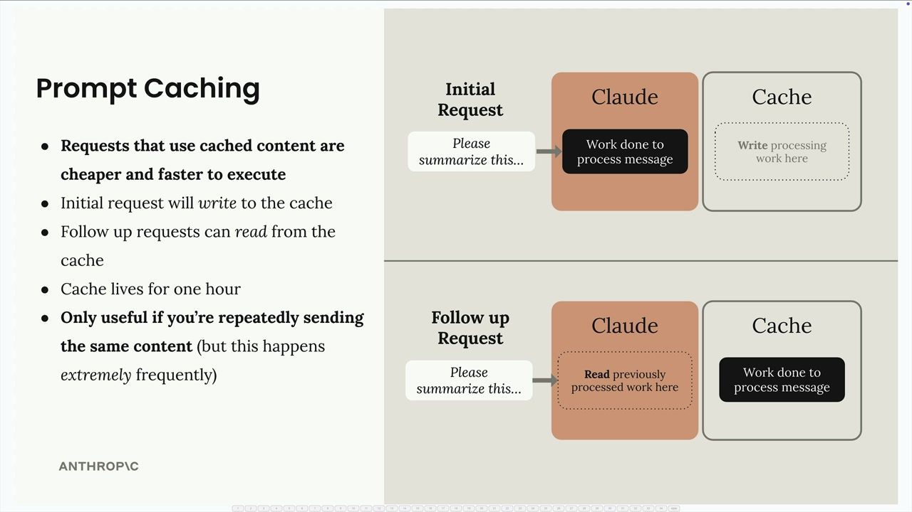
*Prompt caching in action — 대표 캐시 대상: 6K 시스템 프롬프트 + 1.7K tool schemas*

#### 어디에 쓸 때 이득이 큰가

L07 은 **대표적인 caching 가치가 높은 콘텐츠**를 세 가지로 요약한다.

- **큰 시스템 프롬프트** — 예: 6K 토큰의 코딩 어시스턴트 system prompt
- **복잡한 tool schemas** — 예: 여러 tool 에 대해 약 1.7K 토큰의 스키마
- **반복 메시지 콘텐츠** — 대화 문맥의 초반부 고정 부분

핵심 통찰: *"caching only helps if you're repeatedly sending identical content — but in many applications, this happens extremely frequently."*

#### Tool Schemas 캐싱 — 안전 패턴

tool schemas 를 캐싱하려면 **tool 리스트의 마지막 tool** 에 `cache_control` 을 추가한다. L07 이 권장하는 **원본을 건드리지 않는** 방법은 이렇다.

```python
if tools:
    tools_clone = tools.copy()
    last_tool = tools_clone[-1].copy()
    last_tool["cache_control"] = {"type": "ephemeral"}
    tools_clone[-1] = last_tool
    params["tools"] = tools_clone
```

**왜 clone 하는가**: `tools[-1]["cache_control"] = ...` 식으로 직접 수정하면 이후 tools 순서를 재배열할 때 문제가 생긴다. **list 복사 + last tool 객체 복사** 의 이중 clone 으로 원본 정의를 보호한다.

#### System Prompt 캐싱 — 구조화된 형식으로 전환

문자열 형태의 system prompt 는 cache_control 을 담을 수 없다. **텍스트 블록 + cache_control** 의 리스트 형식으로 변환한다.

```python
if system:
    params["system"] = [
        {
            "type": "text",
            "text": system,
            "cache_control": {"type": "ephemeral"}
        }
    ]
```

단순 문자열 대신 구조화된 리스트를 사용함으로써 **system 부분만 분리해서 캐싱**할 수 있다.

#### 캐시 동작 확인 — usage 필드 읽기

caching 을 활성화하고 요청을 실행하면, **응답의 usage 패턴**에 새 필드가 나타난다.

- **첫 요청**: `cache_creation_input_tokens=1772` — Claude 가 **cache 에 쓴다** (WRITE)
- **Follow-up 요청**: `cache_read_input_tokens=1772` — Claude 가 **cache 를 읽는다** (HIT)
- **변경된 콘텐츠**: 새로운 cache creation 토큰이 나타남 (부분 캐시 WRITE)

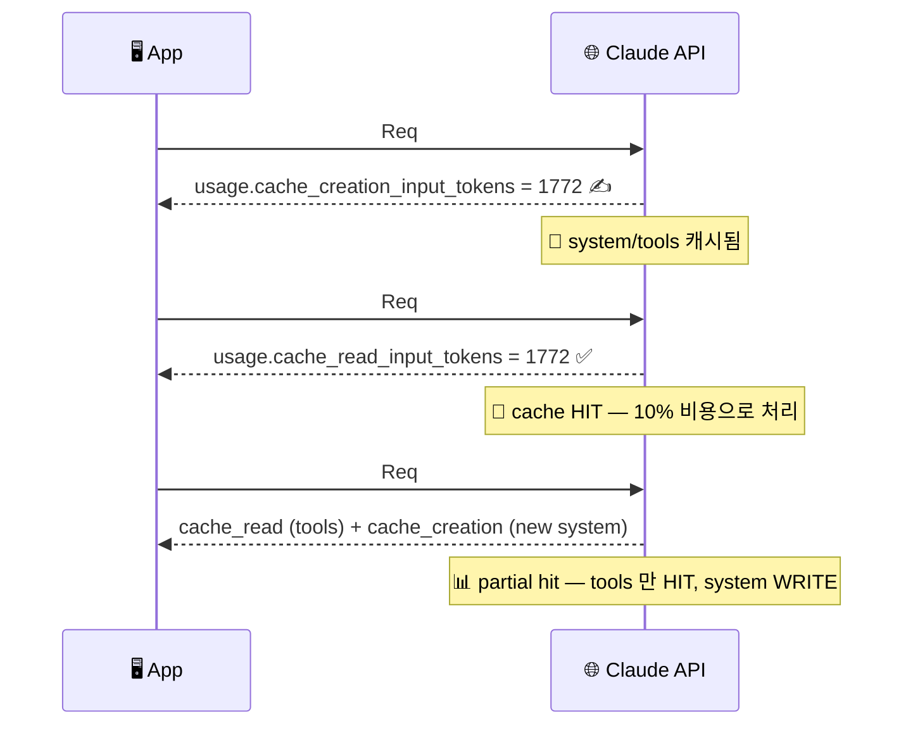
```mermaid
sequenceDiagram
    participant App as 🖥️ App
    participant API as 🌐 Claude API

    App->>API: Req #1 (system + tools, cache_control 포함)
    API-->>App: usage.cache_creation_input_tokens = 1772 ✍️
    Note over API: 💾 system/tools 캐시됨

    App->>API: Req #2 (system + tools 동일, user 메시지만 변경)
    API-->>App: usage.cache_read_input_tokens = 1772 ✅
    Note over API: 🎯 cache HIT — 10% 비용으로 처리

    App->>API: Req #3 (system 변경)
    API-->>App: cache_read (tools) + cache_creation (new system)
    Note over API: 📊 partial hit — tools 만 HIT, system WRITE
```

#### 다중 breakpoint 와 granular caching

여러 breakpoint 를 한 요청에 설정할 수 있다. 순서는 L06 의 규칙 그대로다.

- **Tools** (있는 경우)
- **System prompt** (있는 경우)
- **Messages**

만약 system 은 바꾸고 tools 는 그대로라면, **tools 부분 cache HIT + system 부분 cache WRITE** 라는 partial hit 가 일어난다. 이 **granular caching** 덕분에 실제로 바뀐 부분만 처리 비용을 치르게 된다.

#### 캐시 민감도와 활용 영역

> [!tip] 캐시는 한 글자에도 무너진다
> L07 의 경고: *"The cache is extremely sensitive — changing even a single character in your tools or system prompt invalidates the entire cache for that component."* 자주 바뀌는 부분이 앞에 오면 캐시는 사실상 쓸모없으므로, **"고정된 부분" 과 "자주 바뀌는 부분" 을 의식적으로 분리** 해 고정부를 앞쪽에 둔다. 캐시는 **1시간만** 유지되며, 장기 저장이 아니라 **빈번한 API 사용**을 위한 최적화다. 적합 시나리오: **일관된 tool schemas**, **안정적인 시스템 프롬프트**, **유사한 문맥의 반복 요청**.

#### 캐시 ROI 판단 의사결정 트리

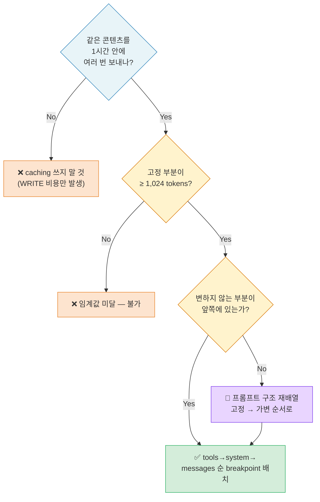
```mermaid
graph TD
    Q0{"같은 콘텐츠를<br/>1시간 안에<br/>여러 번 보내나?"}
    Q0 -->|"No"| SKIP["❌ caching 쓰지 말 것<br/>(WRITE 비용만 발생)"]
    Q0 -->|"Yes"| Q1{"고정 부분이<br/>≥ 1,024 tokens?"}
    Q1 -->|"No"| SKIP2["❌ 임계값 미달 — 불가"]
    Q1 -->|"Yes"| Q2{"변하지 않는 부분이<br/>앞쪽에 있는가?"}
    Q2 -->|"No"| FIX["🔧 프롬프트 구조 재배열<br/>고정 → 가변 순서로"]
    Q2 -->|"Yes"| GO["✅ tools→system→<br/>messages 순 breakpoint 배치"]
    FIX --> GO

    style Q0 fill:#e8f4f8,stroke:#2980b9
    style Q1 fill:#fff3cd,stroke:#d97706
    style Q2 fill:#fff3cd,stroke:#d97706
    style GO fill:#d4edda,stroke:#27ae60
    style SKIP fill:#fde4cf,stroke:#e67e22
    style SKIP2 fill:#fde4cf,stroke:#e67e22
    style FIX fill:#e9d5ff,stroke:#7c3aed
```

> [!action] 실습 노트북
> 📂 `03-Exercises/Week_06/skilljar/S5_04_prompt_caching.ipynb`
> tools clone 패턴 + system 리스트 변환을 실제 `chat(...)` 헬퍼에 통합, 동일 요청 반복 시 `cache_creation_input_tokens` → `cache_read_input_tokens` 전환 관찰.

> [!ref] 소스: Skilljar L07 — Prompt caching in action (287774)

---

### 2.4 Code Execution & Files API (L08)

Anthropic API 는 **함께 쓰면 위력이 배가되는** 두 기능을 제공한다 — **Files API** 와 **Code Execution**. 따로 보면 별개처럼 보이지만, 합쳤을 때 Claude 에게 **복잡한 작업을 안전하게 위임**하는 강력한 워크플로가 열린다.

#### Files API — base64 대신 file_id 로 참조

Files API 는 이미지나 PDF 를 **base64 로 매번 포함하는 대신**, 파일을 미리 업로드해 두고 나중에 **file id 로 참조**할 수 있게 해준다.


*Files API 플로우 — 사전 업로드 → file metadata 획득 → 이후 메시지에서 id 로 참조*

동작 순서:
1. 파일(이미지, PDF, 텍스트 등)을 **별도의 API 호출** 로 Claude 에 업로드
2. **고유한 file ID** 가 담긴 **파일 메타데이터 객체** 수신
3. 이후 메시지에서는 **raw 데이터 대신 file ID** 로 참조

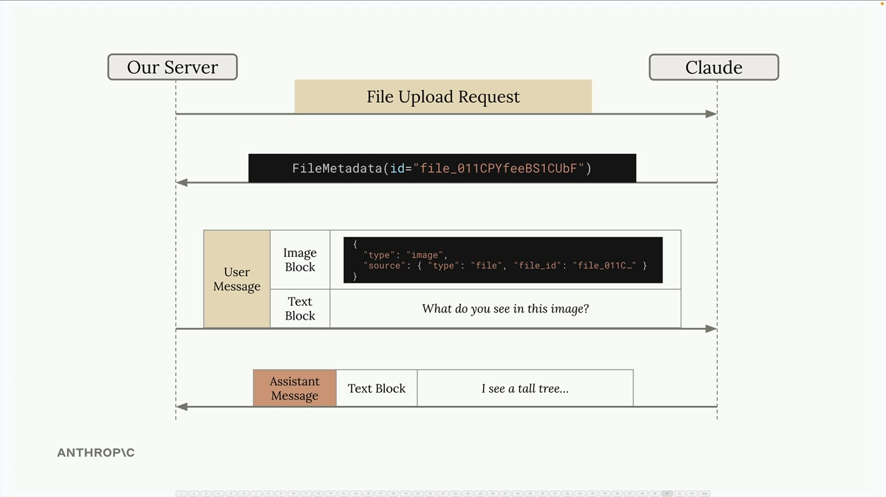
*base64 inline vs Files API — 파일 재사용, 대용량 처리에 Files API 가 유리*


*Files API 개념 — 사전 업로드된 파일을 file_id 로 참조해 inline base64 보다 효율적인 multi-request 패턴*

특히 **같은 파일을 여러 번 참조**해야 하거나, **모든 요청에 포함하기 부담스러운 큰 파일**을 다룰 때 유용하다.

#### Code Execution — 서버 측 Python 실행

Code execution 은 **서버 기반 도구(server-based tool)** 로, 개발자가 구현체를 제공할 필요가 없다. 사전 정의된 tool schema 를 요청에 포함하기만 하면, Claude 가 **격리된 Docker 컨테이너** 에서 Python 코드를 선택적으로 실행할 수 있다.


*Code execution 환경 — isolated Docker container, no network, 반복 실행 가능*

실행 환경의 핵심 성질:
- **isolated Docker container** 에서 실행
- **네트워크 접근 없음** (can't make external API calls)
- Claude 가 한 대화 안에서 **여러 번 코드를 실행** 할 수 있음
- 결과는 Claude 가 해석하여 **최종 응답에 통합**

> [!tip] 네트워크 격리의 의미
> *"No network access"* 는 보안상의 강력한 제약이다 — Claude 는 외부 API 호출, 사내 시스템 접근, 인터넷 조회 모두 불가능하다. 따라서 분석에 필요한 **모든 데이터는 Files API 로 사전 업로드**해야 한다. 이것이 다음 섹션의 **Files API + Code Execution 결합** 패턴을 필연적으로 만든다.

#### Files API × Code Execution — 완벽한 콤보

진짜 힘은 두 기능을 **함께** 쓸 때 나온다. Docker 컨테이너는 네트워크가 없기 때문에, Files API 가 **실행 환경에 데이터를 넣고 결과물을 꺼내는 주요 통로**가 된다.

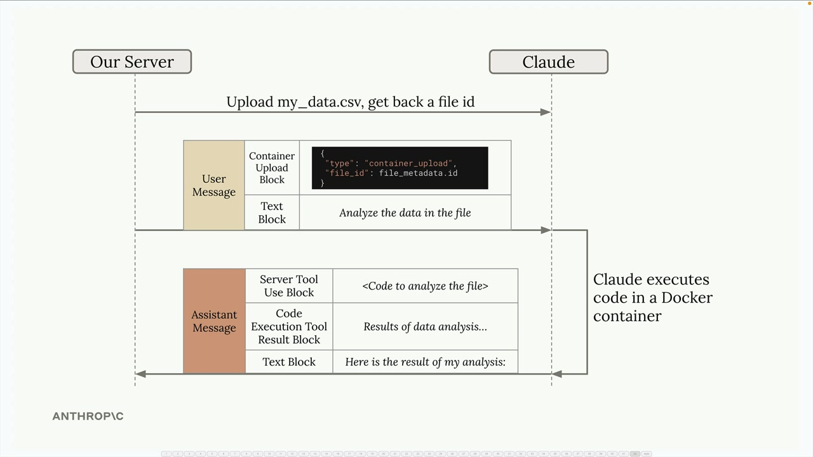
*Files API × Code Execution — 업로드 → container_upload → 실행 → 다운로드*


*Code Execution Flow — Claude 가 isolated Docker container 에서 Python 을 반복 실행하고 결과를 응답에 통합*

전형적인 워크플로:
1. **데이터 파일(CSV 등)을 Files API 로 업로드**
2. **container upload 블록** 에 file ID 담아 메시지에 포함
3. 분석 요청
4. Claude 가 파일을 처리하는 **코드를 작성·실행**
5. 생성된 **결과물(플롯 등)을 다운로드**

#### 실전 예제 — Streaming.csv 이탈(churn) 분석

L08 이 제시하는 구체적 예제는 **스트리밍 서비스 데이터** 분석이다. CSV 에는 구독 등급(subscription tier), 시청 습관, 이탈 여부(churn) 등의 사용자 정보가 들어 있다.

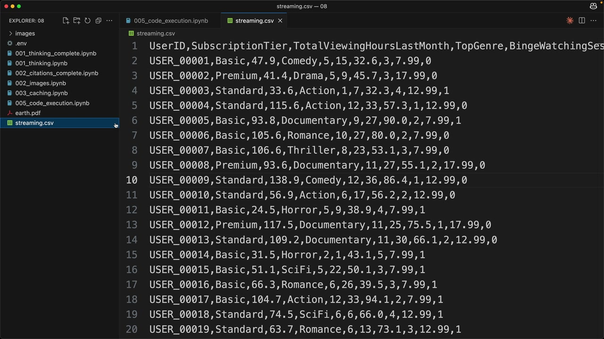
*streaming.csv 예제 — subscription / viewing / churn 컬럼 구성*

먼저 헬퍼 함수로 파일 업로드.

```python
file_metadata = upload('streaming.csv')
```

그런 다음 **업로드된 파일 + 분석 요청** 을 묶은 메시지를 만든다.

```python
messages = []
add_user_message(
    messages,
    [
        {
            "type": "text",
            "text": """Run a detailed analysis to determine major drivers of churn.
            Your final output should include at least one detailed plot summarizing your findings."""
        },
        {"type": "container_upload", "file_id": file_metadata.id},
    ],
)

chat(
    messages,
    tools=[{"type": "code_execution_20250522", "name": "code_execution"}]
)
```

#### 응답의 블록 구조 이해

Code execution 이 쓰이면 응답에는 **여러 타입의 블록**이 섞여서 돌아온다.

- **Text blocks** — Claude 의 분석과 설명
- **Server tool use blocks** — 실제로 Claude 가 실행하기로 결정한 코드
- **Code execution tool result blocks** — 코드 실행 결과

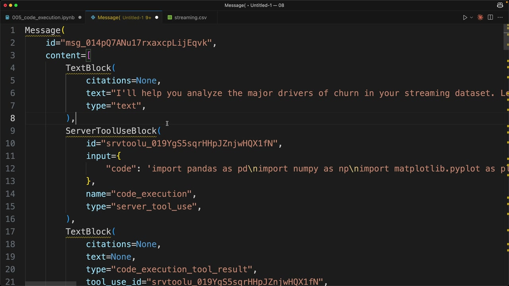
*응답 블록 다양화 — text + server_tool_use + code_execution_output 혼합*

Claude 는 한 응답 안에서 **여러 번 코드를 실행** 할 수 있다 — 한 번 돌려 보고, 결과를 보고 다시 코드를 짜서 실행하는 **반복(iterative)** 분석 패턴이다. 각 실행 사이클은 **코드 + 결과** 쌍을 포함한다.

#### 생성 파일 다운로드하기

가장 강력한 기능 중 하나는 Claude 가 **플롯·보고서 등의 파일을 생성**해서 다운로드 가능하게 만드는 것이다. 시각화가 만들어지면 컨테이너에 저장되고, Files API 로 회수한다.

응답에서 `type: "code_execution_output"` 인 블록을 찾으면, 생성된 콘텐츠의 file ID 가 들어 있다.

```python
download_file("file_id_from_response")
```


*최종 결과 — 손으로 짜면 오래 걸릴 시각화가 Claude 의 자동 실행으로 완성*

결과는 *"significant manual coding 이 필요했을 전문적인 시각화가 포함된 종합 분석"* 이다.

#### Files API × Code Execution 전체 흐름 다이어그램

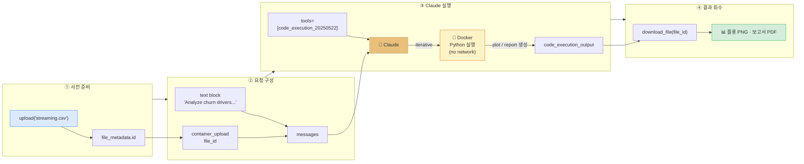
```mermaid
graph LR
    subgraph SETUP["① 사전 준비"]
        U["upload('streaming.csv')"] --> M["file_metadata.id"]
    end

    subgraph REQ["② 요청 구성"]
        T["text block<br/>'Analyze churn drivers...'"] --> MSG["messages"]
        CU["container_upload<br/>file_id"] --> MSG
    end

    subgraph EXEC["③ Claude 실행"]
        P["tools=[code_execution_20250522]"] --> CC["🤖 Claude"]
        MSG --> CC
        CC -->|"iterative"| PY["🐳 Docker<br/>Python 실행<br/>(no network)"]
        PY -->|"plot / report 생성"| OUT["code_execution_output"]
    end

    subgraph DL["④ 결과 회수"]
        OUT --> DF["download_file(file_id)"]
        DF --> FINAL["📊 플롯 PNG · 보고서 PDF"]
    end

    M --> CU
    SETUP --> REQ --> EXEC --> DL

    style U fill:#dbeafe,stroke:#3b82f6
    style CC fill:#e8c07a,stroke:#c4a882,color:#333
    style PY fill:#fef3c7,stroke:#d97706
    style FINAL fill:#d4edda,stroke:#27ae60
```

#### Data analysis 를 넘어서는 응용과 Code Execution 의 가치

L08 의 추가 응용 영역: **이미지 처리·변환**, **문서 파싱·변환**, **수학 연산·모델링**, **커스텀 서식 리포트**. 핵심은 **복잡한 계산 작업을 Claude 에게 위임하면서** Files API 로 **입출력 통제권**을 유지하는 것 — Claude 는 *"실행하고 해답 위에서 반복(iterate) 할 수 있는"* 코딩 어시스턴트가 된다.

> [!finding] Code Execution vs Extended Thinking
> LLM 의 가장 큰 약점 중 하나인 **수치 계산 부정확성**을 **실제 Python 실행** 으로 보완. Extended Thinking 은 LLM 내부 추론 깊이만 증가(여전히 수치 오류 가능), Code Execution 은 **실제 Python 이 돌아가므로** pandas/numpy/matplotlib 의 정확한 결과를 보장. *"수치 정확성이 중요한 순간"* 에는 Code Execution 이 **결정적으로 유리**하다.

> [!action] 실습 노트북
> 📂 `03-Exercises/Week_06/skilljar/S5_05_code_execution.ipynb`
> Files API `upload()` 헬퍼 구현, streaming.csv 재현 분석, `code_execution_20250522` tool 선언, `container_upload` 메시지 블록 + `code_execution_output` 블록 파싱, `download_file()` 로 생성 플롯 회수.

> [!ref] 소스: Skilljar L08 — Code execution and the Files API (287777)

---

### 2.5 도메인 응용 — 구조공학에서 Features of Claude 활용 (보충)

Ch.1~2 에서 배운 6 기능을 **건축공학 실무 파이프라인** 하나에 엮어 보자. 이 절은 Skilljar 전사본 너머의 **도메인 응용 설계** 이며, `S5_07_structural_features.ipynb` 로 연결된다.

#### 시나리오 — "RC 보 실험 보고서 자동 생성"

연구실에 다음 입력이 있다고 가정.
- 📐 **RC 보 도면 이미지** (3장) — L02 Image Support
- 📄 **KDS 14 20 22 PDF** (전단 설계 기준) — L03 PDF Support
- 📊 **실험 데이터 CSV** (시편별 측정값) — L08 Files API

요구: *"도면과 기준서 조문을 인용해가며, 실험 데이터로 설계식을 검증하는 보고서 초안을 만들어줘."*

#### 통합 파이프라인 다이어그램

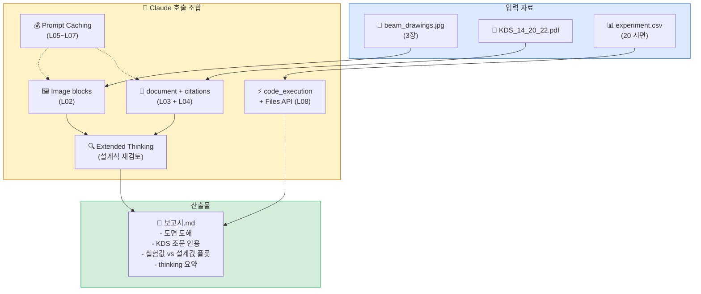
```mermaid
graph TD
    subgraph INPUT["입력 자료"]
        D["📐 beam_drawings.jpg<br/>(3장)"]
        K["📄 KDS_14_20_22.pdf"]
        E["📊 experiment.csv<br/>(20 시편)"]
    end

    subgraph CLAUDE["🤖 Claude 호출 조합"]
        ET["🔍 Extended Thinking<br/>(설계식 재검토)"]
        IMG["🖼️ Image blocks<br/>(L02)"]
        PDF["📄 document + citations<br/>(L03 + L04)"]
        PC["💰 Prompt Caching<br/>(L05~L07)"]
        CE["⚡ code_execution<br/>+ Files API (L08)"]
    end

    subgraph OUTPUT["산출물"]
        R["📑 보고서.md<br/>- 도면 도해<br/>- KDS 조문 인용<br/>- 실험값 vs 설계값 플롯<br/>- thinking 요약"]
    end

    D --> IMG
    K --> PDF
    E --> CE
    IMG --> ET
    PDF --> ET
    PC -.-> IMG
    PC -.-> PDF
    ET --> R
    CE --> R

    style INPUT fill:#dbeafe,stroke:#3b82f6
    style CLAUDE fill:#fef3c7,stroke:#d97706
    style OUTPUT fill:#d4edda,stroke:#27ae60
```

#### 기능 매핑 테이블

| 단계 | 사용 기능 | 소스 레슨 | 구조공학 역할 |
| --- | --- | --- | --- |
| ① 도면 식별 | Image Support | L02 | RC 보 단면, 철근 배근도 자동 인식 |
| ② 기준서 파싱 | PDF Support | L03 | KDS 조문·표·설계식 추출 |
| ③ 조문 인용 | Citations | L04 | 각 설계 결정에 KDS 근거 페이지 attach |
| ④ 설계식 재검토 | Extended Thinking | L01 | 수식 유도, 안전율 판단의 추론 공개 |
| ⑤ 반복 분석 비용 절감 | Prompt Caching | L05~L07 | 동일 PDF 에 여러 질문 시 90% 할인 |
| ⑥ 실험값 통계·플롯 | Code Execution + Files API | L08 | pandas/matplotlib 로 실험값 vs 설계값 산점도 |

#### 도메인 활용 패턴 3가지

- **패턴 A — 현장 사진 안전 점검**: L02 의 Fire Risk 5단계 템플릿을 **균열 심각도 4-등급 평가** (정상 → 철근 노출) 로 치환 + thinking on (판단 근거) + citations (KDS 14 20 50 보수·보강 기준 인용)
- **패턴 B — 설계 자문 에이전트**: 사내 설계기준 PDF 10건을 Prompt Caching 으로 base 컨텍스트 고정, 각 프로젝트 질문은 뒤에 붙이고 Citations 로 기준서 페이지 자동 각주
- **패턴 C — 실험 데이터 자동 보고서**: Files API 로 .csv/.xlsx 업로드 → Code Execution 에서 pandas 통계 + matplotlib 플롯 + Thinking on 으로 이상치 판단 근거 공개

#### Skilljar 예제를 도메인으로 이식하는 방법

> [!method] L02 템플릿을 도메인으로 이식하는 3 단계
> 1. **등급 체계 치환** — "Fire Risk 1-4" → "균열 등급 0-5" / "손상도 A-E"
> 2. **분석 단계 치환** — "residence identification → overhang → risk → defensible space → rating" 을 "부재 식별 → 결함 영역 → 심각도 → 주변 영향 → 등급" 으로
> 3. **최종 출력 형식 고정** — *"For each item above, write one sentence summarizing your findings, with your final response being the numerical rating."* 형식을 그대로 차용

> [!tip] 도메인 응용 시 캐싱 설계
> 연구실 워크플로에서는 **KDS 기준서 PDF** 와 **실험 방법론 표준 템플릿** 이 자주 반복된다. 이 두 요소를 **메시지의 앞쪽**에 배치하고 breakpoint 를 걸면, 동일 세션에서 100번의 후속 질문을 던져도 **비용이 거의 추가되지 않는다**.

> [!action] 실습 노트북
> 📂 `03-Exercises/Week_06/skilljar/S5_07_structural_features.ipynb`
> 위 3 패턴(현장 사진 안전 점검 / 설계 자문 / 실험 데이터 보고서)을 단계별로 구축한다. L01~L08 의 모든 기능을 한 파이프라인으로 통합하는 도메인 엔드-투-엔드 예제.

> [!ref] 보충 — 도메인 응용 참고
> - [[Week_05]] S4_07 — RAG 기반 KDS 검색 파이프라인 (caching 과 조합 가능)
> - [[Week_07]] — MCP 서버로 재포장해 Claude Code 에 연결
> - `02-Resources/허석재박사 강의/Seminar3` — 구조해석 프롬프트 5단계 템플릿

---

## [Chapter 3] Self-assessment & Summary

### 3.1 개념 확인 퀴즈 — Features of Claude (Q1~Q10)

> [!question] Q1. Extended Thinking 을 활성화하면 응답의 `content` 리스트에 어떤 블록이 추가되는가?
> A) `CodeBlock` — 코드 실행 결과
> B) `ThinkingBlock` — `type: "thinking"`, 추론 과정과 signature 포함
> C) `ToolUseBlock` — 도구 호출 요청
> D) `SystemBlock` — 시스템 설정 정보
>
> > [!tip]- 정답 보기
> > **정답: B)** Skilljar L01 은 응답이 *"a structured response containing two parts"* 로 바뀐다고 설명한다 — `type: "thinking"` 인 ThinkingBlock 이 추가되고, 그 뒤에 최종 답변을 담은 `type: "text"` TextBlock 이 온다. 나아가 각 thinking 블록에는 변조 방지를 위한 **cryptographic signature** 가 포함된다. 내부 안전 시스템에 플래그된 경우엔 `redacted_thinking` 블록이 대신 돌아올 수도 있다 (암호화된 형태지만 다음 턴에 반드시 그대로 포함해야 문맥이 유지됨).

> [!question] Q2. Extended Thinking 활성화 시 준수해야 하는 파라미터 조건으로 올바른 것은?
> A) `thinking_budget >= 512`, `max_tokens` 제약 없음
> B) `thinking_budget >= 1024`, `max_tokens > thinking_budget`
> C) `thinking_budget = max_tokens` 강제
> D) `temperature = 0` 필수
>
> > [!tip]- 정답 보기
> > **정답: B)** L01 의 구현 절은 *"The minimum value is 1024 tokens, and your `max_tokens` parameter must be greater than your thinking budget."* 를 명시한다. budget 은 **상한선**이므로 Claude 가 실제로 덜 쓸 수 있지만, 최소 1,024 이상이 필요하고 max_tokens 는 그보다 반드시 커야 thinking + 최종 답변을 담을 수 있다. D) 의 temperature 는 오히려 thinking 이 켜지면 pre-filling 등과 함께 **기본 설정과 충돌**한다는 주의사항이 따로 있다.

> [!question] Q3. 이미지 입력의 **토큰 비용 공식**과 **단일 이미지 시 최대 해상도** 는?
> A) `tokens = w × h / 1000`, 4000px
> B) `tokens = (w × h) / 750`, 8000px (단일), 2000px (다중)
> C) `tokens = w + h`, 16000px
> D) 이미지는 고정 1,000 토큰, 해상도 제한 없음
>
> > [!tip]- 정답 보기
> > **정답: B)** L02 의 제약 목록 그대로 — **tokens = (width px × height px) / 750**, 단일 이미지 전송 시 max 8000px, 다중 전송 시 max 2000px. 이 외에도 요청당 최대 **100 장**, 장당 최대 **5 MB** 제약이 함께 있다.

> [!question] Q4. 이미지 입력의 정확도를 높이는 **Skilljar L02 의 핵심 메시지**는?
> A) 항상 해상도를 최대로 올려라
> B) 이미지만 보내고 텍스트 프롬프트는 최소화하라
> C) 텍스트에 쓰던 같은 프롬프트 엔지니어링 기법 — 단계별 방법론, one-shot 예시, 세분화 — 를 이미지에도 그대로 쓰라
> D) 별도의 이미지 전용 모델을 선택하라
>
> > [!tip]- 정답 보기
> > **정답: C)** L02 는 *"the same prompting techniques that work for text apply to images. Invest time in crafting detailed, structured prompts rather than relying on simple questions if you want reliable results"* 라고 못박는다. marble counting 예제가 보여주듯, 단순 *"How many marbles?"* 보다 *"1. 하나씩 번호를 매기며 식별 → 2. 다른 방법으로 재검증"* 식 단계별 프롬프트가 결정적으로 낫다.

> [!question] Q5. PDF 를 Claude 에 전달할 때 기존 이미지 코드에서 **바꿔야 하는 4요소** 가 아닌 것은?
> A) 확장자: `.png` → `.pdf`
> B) 블록 `type`: `"image"` → `"document"`
> C) `media_type`: `"image/png"` → `"application/pdf"`
> D) `role`: `"user"` → `"system"`
>
> > [!tip]- 정답 보기
> > **정답: D)** L03 은 **네 가지 변화**만 명시한다 — (1) 확장자 `.png` → `.pdf`, (2) 변수명 `image_bytes` → `file_bytes` (명확성), (3) `type: "document"`, (4) `media_type: "application/pdf"`. role 은 여전히 user 메시지에 들어간다. 핵심 깨달음은 *"nearly identical code to what you'd use for images"* — 최소 변경으로 PDF 지원이 가능하다는 점.

> [!question] Q6. Citations 가 반환하는 citation 객체에 포함되지 **않는** 필드는?
> A) `cited_text` — 문서 원문 발췌
> B) `document_index` / `document_title`
> C) `start_page_number` / `end_page_number`
> D) `confidence_score` — 인용 신뢰도 점수
>
> > [!tip]- 정답 보기
> > **정답: D)** L04 에 명시된 핵심 필드는 **cited_text, document_index, document_title, start_page_number, end_page_number** 의 5개다. 신뢰도 점수 같은 필드는 존재하지 않는다. plain text 소스를 쓸 때는 페이지 번호 대신 **문자 위치(character positions)** 가 반환된다는 점도 기억하자.

> [!question] Q7. Prompt Caching 에서 **반드시** 준수해야 하는 규칙으로 올바른 것은?
> A) 캐시는 자동이므로 breakpoint 불필요
> B) breakpoint 까지의 콘텐츠가 **완전히 동일** 해야 하며(단어 하나도 다르면 무효), 캐시 대상 합계 **≥ 1,024 tokens**, 최대 **4개** breakpoint, 처리 순서는 **tools → system → messages**
> C) breakpoint 는 텍스트 블록에만, 이미지·tool 블록에는 불가
> D) cache TTL 은 24시간
>
> > [!tip]- 정답 보기
> > **정답: B)** L06 이 제시한 네 가지 규칙을 모두 포함한 유일한 선택지. A) 는 L06 첫 문장 *"Work done on messages is not cached automatically"* 와 정면 충돌. C) 는 틀리다 — L06 은 *"cache breakpoints can be added to: System prompts, Tool definitions, Image blocks, Tool use and tool result blocks"* 를 명시한다. D) 의 24시간은 잘못 — L05·L06 모두 **one hour** 로 명시.

> [!question] Q8. Prompt Caching 응답 `usage` 필드에서, **follow-up 요청이 캐시를 읽었는지**를 확인하는 방법은?
> A) `usage.cache_creation_input_tokens` 가 0 보다 크면 HIT
> B) `usage.cache_read_input_tokens` 가 0 보다 크면 HIT, `cache_creation_input_tokens` 는 WRITE 를 나타냄
> C) `usage.total_tokens` 가 감소했는지 확인
> D) `response.from_cache == True` 플래그 확인
>
> > [!tip]- 정답 보기
> > **정답: B)** L07 은 첫 요청에서 `cache_creation_input_tokens=1772` (WRITE), follow-up 에서 `cache_read_input_tokens=1772` (HIT) 로 명확히 구분한다. 부분 변경 시에는 **두 필드가 동시에 나타날 수 있다** (예: tools 은 HIT, system 은 새로 WRITE). `response.from_cache` 같은 단일 플래그는 존재하지 않는다.

> [!question] Q9. Code Execution 의 실행 환경에 대한 설명 중 **틀린** 것은?
> A) Isolated Docker container 에서 실행된다
> B) 네트워크 접근이 없다 (can't make external API calls)
> C) 한 대화 동안 여러 번 실행할 수 있다
> D) Claude 의 로컬 파일 시스템 (사용자의 PC) 에 직접 접근한다
>
> > [!tip]- 정답 보기
> > **정답: D)** L08 은 환경 성질을 *"Runs in an isolated Docker container / No network access / Claude can execute code multiple times during a single conversation / Results are captured and interpreted by Claude"* 로 정의한다. 사용자의 로컬 파일 시스템은 절대 건드리지 않는다. **모든 데이터 교환은 Files API 를 통해서만** 이뤄지며, 이것이 *"Files API + Code Execution 은 궁합이 좋다"* 의 기술적 이유다.

> [!question] Q10. Code Execution 응답에서 **생성된 파일을 다운로드** 하기 위해 찾아야 하는 블록 타입과 호출 API 는?
> A) `file_result` + `client.files.read()`
> B) `code_execution_output` + `download_file(file_id)`
> C) `image_block` + base64 디코드
> D) `tool_use_result` + `response.content.save()`
>
> > [!tip]- 정답 보기
> > **정답: B)** L08 은 *"Look for blocks with `type: 'code_execution_output'` in the response — these contain file IDs for generated content"* 를 명시하고, 다운로드는 `download_file("file_id_from_response")` 헬퍼로 처리한다. 이 헬퍼는 내부적으로 Files API 의 content 조회를 호출해 바이너리를 로컬에 저장한다.

#### 퀴즈 오답 패턴 점검

> [!finding] 자주 틀리는 포인트
> - **Q2 의 thinking_budget 최소값** — 512 로 잘못 기억하는 경우가 많다. **1,024** 가 정답이며 `max_tokens > thinking_budget` 제약이 함께 있다
> - **Q7 의 ephemeral 블록 가능 위치** — text 에만 된다고 잘못 외우면 tool_use / image / tool_result 에도 가능함을 놓친다
> - **Q8 의 cache_read vs cache_creation** — 이름이 비슷해 혼동 — creation=WRITE, read=HIT 을 공식처럼 암기
> - **Q9 의 "로컬 PC 접근"** — 매력적인 오답. Claude 는 절대 사용자의 로컬 파일 시스템에 접근하지 않는다, 모든 교환은 Files API
> - **Q10 의 code_execution_output** — `tool_result` 와 혼동 주의. code execution 의 결과물은 **전용 블록 타입**을 갖는다

> [!ref] 소스
> - Skilljar L01-L08 전사본 (`_skilljar_s5_content.md`, 820 lines)
> - Skilljar Quiz — "Quiz on features of Claude"

---

### 3.2 학습 요약

#### 누적 진도 테이블 (W01 → W06)

| 주차 | 주제 | 핵심 개념 | 이번 주 신규 추가 |
|:---:|:---|:---|:---|
| **W01** | LLM 기초 · 프롬프트 6기법 | 토큰, temperature, few-shot, CoT | 4D Framework, AI Fluency |
| **W02** | Claude API 호출 | messages.create, 멀티턴, 스트리밍 | Claude API 전반 + CLAUDE.md |
| **W03** | 프롬프트 엔지니어링 & 평가 | 체계적 설계, Eval Pipeline, Streamlit | 정량적 프롬프트 평가 |
| **W04** | Tool Use | JSON Schema, ToolUseBlock, tool_result | Claude ↔ 외부세계 연결 |
| **W05** | RAG + 하이브리드 검색 | 청킹, 임베딩, VectorIndex, BM25, RRF | 지식 확장 + 어휘·의미 병합 |
| **W06** | **Features of Claude** | **Extended Thinking, Vision, PDF, Citations, Caching, Code Execution** | **사고 확장 + 멀티모달 + 비용 최적화 + Python 실행** |

#### W06 전용 — L01~L08 핵심 요약

> [!finding] Features 6개의 레슨별 핵심
>
> | 기능 | 핵심 한 줄 | 결정적 수치·규칙 | 소스 |
> |:---|:---|:---|:---:|
> | Extended Thinking | "Claude 의 scratch paper" | `thinking_budget ≥ 1024`, `max_tokens > budget`, signature + redacted 처리 | L01 |
> | Image Support | "텍스트 프롬프팅 = 이미지 프롬프팅" | 100장/req, 5MB/장, 8000px(단일)/2000px(다중), `tokens = w*h/750` | L02 |
> | PDF Support | "이미지와 거의 같은 코드" | `type: "document"`, `media_type: "application/pdf"` | L03 |
> | Citations | "Black box → transparent research assistant" | `citations: {"enabled": True}`, 5개 필드, page/char 범위 | L04 |
> | Prompt Caching (개념) | "전처리 결과를 버리지 마라" | TTL 1 hour, tokenize·embed·context 재사용 | L05 |
> | Rules of Caching | "breakpoint 는 수동, 동일성이 절대 조건" | longhand + `cache_control: ephemeral`, ≥1024 tokens, 최대 4개, tools→system→messages | L06 |
> | Caching in Action | "clone 해서 원본 보호" | `cache_creation_input_tokens` vs `cache_read_input_tokens` | L07 |
> | Code Execution + Files API | "Python 을 격리된 컨테이너에 맡겨라" | `code_execution_20250522`, no network, `container_upload`, `download_file` | L08 |

#### 로드맵 Mermaid — W06 이후로

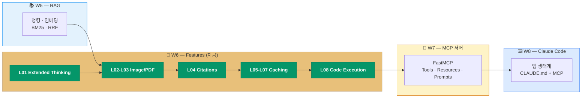
```mermaid
graph LR
    subgraph W5["📚 W5 — RAG"]
        R["청킹 · 임베딩<br/>BM25 · RRF"]
    end

    subgraph W6["🧠 W6 — Features (지금)"]
        A1["L01 Extended Thinking"]
        A2["L02-L03 Image/PDF"]
        A3["L04 Citations"]
        A4["L05-L07 Caching"]
        A5["L08 Code Execution"]
    end

    subgraph W7["🔌 W7 — MCP 서버"]
        M["FastMCP<br/>Tools · Resources · Prompts"]
    end

    subgraph W8["⌨️ W8 — Claude Code"]
        CC["앱 생태계<br/>CLAUDE.md + MCP"]
    end

    R --> A2
    A1 --> A2 --> A3 --> A4 --> A5
    A5 --> M
    M --> CC

    style W5 fill:#e3f2fd,stroke:#2196f3
    style W6 fill:#e8c07a,stroke:#c4a882,color:#333
    style W7 fill:#fef3c7,stroke:#d97706
    style W8 fill:#dbeafe,stroke:#3b82f6

    classDef now fill:#059669,stroke:#047857,color:#fff,font-weight:bold
    class A1,A2,A3,A4,A5 now
```

> [!tip] W06 → W07 연결 포인트
> - **caching 설계는 MCP resource 설계와 닮았다** — "변하지 않는 부분" 을 앞에 두는 원칙은 MCP 의 `resource` vs `tool` 구분과 같은 사고방식
> - **Files API 개념은 MCP 의 file/resource notion 과 직결** — W07 에서 MCP 서버가 reference 를 돌려주는 방식을 이 주에 미리 체득한 셈
> - **Code Execution 은 W07 이후의 agentic loop 의 원형** — *"코드 짜고 → 실행하고 → 결과로 다음 단계 결정"* 이라는 sequence 는 W09 의 agent loop 로 확장

#### 3줄 핵심 메시지

> [!result] W06 의 3줄 정리
> 1. **Claude 는 이제 단순한 텍스트 모델이 아니다** — Extended Thinking (사고), Image/PDF Support (시각·문서), Citations (출처), Caching (비용), Code Execution (계산) 의 **5대 감각 기관**이 API 레벨에서 열렸다.
> 2. **기능 각각은 단 몇 줄의 추가로 활성화된다** — `thinking={"type":"enabled",...}`, `"type": "image" | "document"`, `"citations": {"enabled": True}`, `"cache_control": {"type": "ephemeral"}`, `tools=[{"type": "code_execution_20250522"}]` — **패턴을 외우는 것**이 핵심.
> 3. **숫자와 규칙을 엄격히 지켜라** — thinking_budget ≥ 1024, 이미지 100장/5MB/8000px, cache ≥ 1024 tokens/ 4 breakpoints/ 1h, Code Execution no network — **이 수치를 모르면 프로덕션에서 원인 모를 실패**에 빠진다.

---

## 💻 실습 과제 — S5 Features of Claude 트랙

> 모든 노트북은 `03-Exercises/Week_06/skilljar/` 에 위치합니다. 이번 주 빌드업은 **7 단계** 로 구성되며, 앞 노트북의 헬퍼 (`chat()`, `add_user_message()`, `upload()` 등)를 뒤 노트북이 그대로 이어받는 누적 구조입니다.

### 단계별 빌드업 다이어그램


```mermaid
graph LR
    S1["① S5_01<br/>Extended Thinking"] -->|"+이미지·PDF 블록"| S2["② S5_02<br/>Images + PDF"]
    S2 -->|"+citations"| S3["③ S5_03<br/>Citations"]
    S3 -->|"+cache_control"| S4["④ S5_04<br/>Prompt Caching"]
    S4 -->|"+code_execution<br/>+Files API"| S5["⑤ S5_05<br/>Code Execution"]
    S5 -->|"자율 실습"| S6["⑥ S5_06<br/>Practice"]
    S6 -->|"도메인 통합"| S7["⑦ S5_07<br/>Structural Features"]

    style S1 fill:#3498db,stroke:#2980b9,color:#fff
    style S2 fill:#9b59b6,stroke:#8e44ad,color:#fff
    style S3 fill:#e67e22,stroke:#d35400,color:#fff
    style S4 fill:#2ecc71,stroke:#27ae60,color:#fff
    style S5 fill:#e74c3c,stroke:#c0392b,color:#fff
    style S6 fill:#95a5a6,stroke:#7f8c8d,color:#fff
    style S7 fill:#f39c12,stroke:#d35400,color:#fff
```

### 노트북 상세 표

| 노트북 | 목표 | 주요 개념 / 실습 | 의존 레슨 |
|:---|:---|:---|:---:|
| `S5_01_extended_thinking.ipynb` | thinking 블록 이해 | `thinking={"type":"enabled","budget":1024}`, 블록 분기(thinking/redacted/text), signature 확인, redacted 강제 테스트 | L01 |
| `S5_02_images_pdf.ipynb` | Vision + PDF 패턴 | Base64/URL 이미지, marble counting 단순 vs 단계별, Fire Risk 5단계 템플릿, earth.pdf 요약, 이미지 ↔ PDF 코드 diff | L02, L03 |
| `S5_03_citations.ipynb` | 출처 자동 추적 | `title` + `citations: {enabled: True}`, 응답 citation 리스트 파싱, plain text 문자 범위, UI 용 각주 데이터 구조화 | L04 |
| `S5_04_prompt_caching.ipynb` | 비용 최적화 | longhand + `cache_control: ephemeral`, `usage.cache_creation_input_tokens` 추적, 단어 하나 변경 시 무효화 재현, tools clone 패턴, system list 변환 | L05, L06, L07 |
| `S5_05_code_execution.ipynb` | 파이썬 실행 | `upload()` 헬퍼 + `container_upload` 블록, `code_execution_20250522` tool, streaming.csv 분석 재현, `code_execution_output` 파싱, `download_file` | L08 |
| `S5_06_practice.ipynb` | 학생 자율 실습 | 6 기능 중 3개 이상 조합 — 본인 데이터셋·PDF 로 미니 파이프라인 | 통합 |
| `S5_07_structural_features.ipynb` | **구조공학 도메인 응용** — 도면 분석 + KDS 인용 + 실험 데이터 Python 분석 + 보고서 생성 | 6 기능 전부 통합, §2.5 의 패턴 A/B/C 구현, 보고서 `.md` 출력 | 통합 + §2.5 |

> [!method] 수업 시간 실습 순서 — 제안 (2 시간 + α)
> 1. **0:00~0:20** — `S5_01` thinking 데모, budget 에 따른 결과 비교 (수학 문제 2~3개)
> 2. **0:20~0:50** — `S5_02` 이미지 + PDF 패턴, marble counting 실패/성공 비교, Fire Risk 템플릿 체험
> 3. **0:50~1:10** — `S5_03` citations — earth.pdf 에서 인용 자동 생성 → UI 각주 데이터 만들기
> 4. **1:10~1:40** — `S5_04` 반복 요청으로 캐싱 이득 수치화 (same prompt × 5회 → creation vs read token 그래프)
> 5. **1:40~2:00** — `S5_05` Files API 업로드 + code_execution 으로 CSV 분석 + plot 다운로드
> 6. **2:00+** — `S5_06` 학생 자율 실습 또는 `S5_07` 구조공학 도메인 중 택일 (과제 확장)

> [!action] 제출 안내
> **제출 기한**: 차주 수업 전날 23:59 까지
> **제출물**: `S5_01`~`S5_05` 교수용 재현 노트북(**필수**) + `S5_06` **또는** `S5_07` 중 **하나 이상** 자율 확장 버전
> **제출 방식**: 강의 Notion 또는 Google Classroom 지정 폴더에 업로드 (파일명에 학번·이름 포함)
> **평가 관점**: (1) API 파라미터 정확성 (thinking_budget / cache_control / tool 선언), (2) 응답 블록 파싱의 견고성 (redacted / 부분 cache HIT / code_execution_output 처리), (3) 도메인 적용의 재현성

> [!ref] 소스
> - 노트북 전체: `03-Exercises/Week_06/skilljar/`
> - 기반 전사본: `01-Notes/_skilljar_s5_content.md` (Skilljar S5 L01~L08)
> - 공식 GitHub: [claude_features](https://github.com/anthropics/courses/tree/master/claude_features)

---

## 🤖 CC 스킬 — Subagents + Hooks

> [!tip] 이번 주차의 Claude Code 스킬 — Subagents + Hooks
> 실라버스(v2.3) 에 따라 W06 은 **Subagents** 와 **Hooks** 를 Claude Code 스킬로 학습한다. 두 기능 모두 **W07 의 MCP 서버 개발**과 **W09 의 병렬 에이전트 오케스트레이션**을 위한 전초다. 심화 자료는 보조 노트 [[Week_06_Subagents]] (ISA 트랙) 에 별도 정리되어 있다.

### 왜 이번 주에 Subagents 인가

Ch.2 §2.5 에서 본 *"도면 분석 + KDS 인용 + 실험 데이터 Python 분석 + 보고서 생성"* 같은 복합 작업은 **한 Claude 세션이 혼자** 수행하면 컨텍스트가 터진다. 파일 읽기 · 분석 · 코드 실행 · 문서 작성의 **성격이 다른 작업을 병렬로 쪼개는** 설계가 필요하다 — 이것이 Subagents 의 역할.

### Subagents 개요

Claude Code 의 **서브에이전트**는 메인 Claude 가 특정 작업을 위임하는 하위 에이전트다. 각 subagent 는 **독립적 컨텍스트**에서 실행되어, 메인 세션을 오염시키지 않는다.

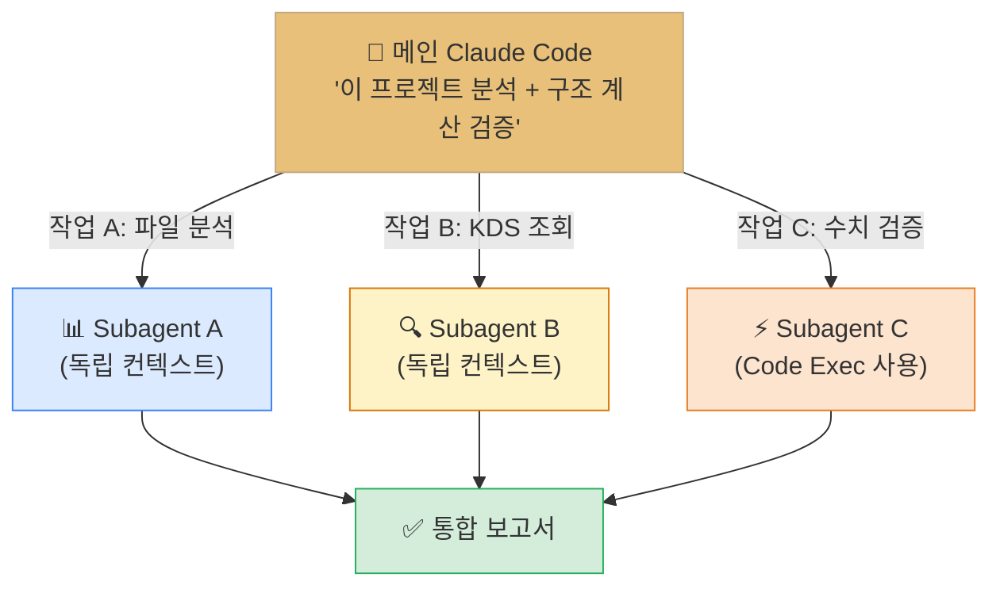
```mermaid
graph TD
    MAIN["🤖 메인 Claude Code<br/>'이 프로젝트 분석 + 구조 계산 검증'"]

    MAIN -->|"작업 A: 파일 분석"| SA1["📊 Subagent A<br/>(독립 컨텍스트)"]
    MAIN -->|"작업 B: KDS 조회"| SA2["🔍 Subagent B<br/>(독립 컨텍스트)"]
    MAIN -->|"작업 C: 수치 검증"| SA3["⚡ Subagent C<br/>(Code Exec 사용)"]

    SA1 --> RESULT["✅ 통합 보고서"]
    SA2 --> RESULT
    SA3 --> RESULT

    style MAIN fill:#e8c07a,stroke:#c4a882,color:#333
    style SA1 fill:#dbeafe,stroke:#3b82f6
    style SA2 fill:#fef3c7,stroke:#d97706
    style SA3 fill:#fde4cf,stroke:#e67e22
    style RESULT fill:#d4edda,stroke:#27ae60
```

**Subagents 의 4대 가치**

| 가치 | 설명 |
| --- | --- |
| **병렬 처리** | 여러 파일·작업을 동시에 분석 |
| **컨텍스트 분리** | 각 서브에이전트가 독립적 컨텍스트 — 메인 세션을 깨끗하게 유지 |
| **전문화** | 각 서브에이전트에 특정 role 과 system prompt 부여 |
| **확장성** | 프로젝트 규모에 따라 서브에이전트 수 조절 |

### Subagent 정의 — `.claude/agents/` 폴더

Claude Code 에서는 `.claude/agents/<name>.md` 파일로 subagent 를 정의한다. Week 06 맥락에서는 *"features-pipeline-runner"* 같은 이름의 subagent 를 둘 수 있다.

```yaml
---
name: features-pipeline-runner
description: Week 06 Features(Extended Thinking · Vision · PDF · Citations · Caching · Code Exec) 조합 파이프라인을 단일 작업으로 실행
tools: Read, Write, Bash
---

# System Prompt
너는 건축공학 도메인의 Features-of-Claude 파이프라인 러너다. 입력: {도면 이미지 폴더}, {KDS PDF}, {실험 CSV}.
항상 Prompt Caching 을 활성화하고, 수치 계산은 Code Execution 을 통해 수행하라.
최종 출력은 `reports/<date>.md` 에 Citations 각주를 포함한 보고서로 남겨라.
```

### Hooks — 이벤트 기반 자동화

**Hooks** 는 Claude Code 의 특정 이벤트에 자동으로 반응하는 스크립트다. 파일 저장, 도구 실행 전후 등 시점에 자동 동작을 실행한다.

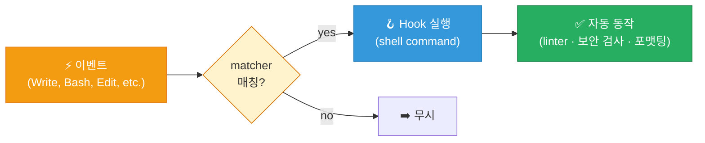
```mermaid
graph LR
    EVENT["⚡ 이벤트<br/>(Write, Bash, Edit, etc.)"] --> MATCH{"matcher<br/>매칭?"}
    MATCH -->|"yes"| HOOK["🪝 Hook 실행<br/>(shell command)"]
    MATCH -->|"no"| PASS["➡️ 무시"]
    HOOK --> ACTION["✅ 자동 동작<br/>(linter · 보안 검사 · 포맷팅)"]

    style EVENT fill:#f39c12,stroke:#e67e22,color:#fff
    style MATCH fill:#fff3cd,stroke:#d97706
    style HOOK fill:#3498db,stroke:#2980b9,color:#fff
    style ACTION fill:#27ae60,stroke:#1e8449,color:#fff
```

#### Hook 이벤트 4종

| Hook | 시점 | 활용 예시 (Week 06 맥락) |
| --- | --- | --- |
| **PreToolUse** | 도구 실행 **전** | API 키 유출 검사, `cache_control` 누락 경고 |
| **PostToolUse** | 도구 실행 **후** | 코드 저장 후 ruff/black 자동 포맷, 노트북 outputs 정리 |
| **Notification** | 사용자 입력 대기 시 | Slack 알림, 장시간 실행 종료 통지 |
| **Stop** | 에이전트 턴 종료 시 | 실행 요약, 로그 append, cost 집계 |

#### `~/.claude/settings.json` Hook 설정 예

```json
{
  "hooks": {
    "PreToolUse": [
      {
        "matcher": "write",
        "command": "python ~/.claude/scripts/check_api_keys.py \"$CLAUDE_FILE_PATH\""
      }
    ],
    "PostToolUse": [
      {
        "matcher": "write",
        "command": "ruff format \"$CLAUDE_FILE_PATH\" && ruff check --fix \"$CLAUDE_FILE_PATH\""
      }
    ],
    "Stop": [
      {
        "command": "echo \"$(date): turn end\" >> ~/.claude/logs/session.log"
      }
    ]
  }
}
```

| 필드 | 설명 |
| --- | --- |
| `matcher` | Hook 이 반응할 도구 이름 (`write`, `bash`, `edit` 등) |
| `command` | 실행할 셸 명령어 |
| `$CLAUDE_FILE_PATH` | Hook 이 감지한 파일 경로 (환경 변수) |

### Subagents + Hooks = Week 06 파이프라인 자동화

```mermaid
graph TD
    USER["👤 '구조 도면 보고서 만들어줘'"] --> MAIN["🤖 Main Claude Code"]
    MAIN --> SA1["Subagent: 도면 분석"]
    MAIN --> SA2["Subagent: KDS 인용"]
    MAIN --> SA3["Subagent: Code Exec"]

    SA1 -->|"Write report_draft.md"| HPRE["🪝 PreToolUse<br/>API 키 검사"]
    SA2 -->|"Write citations.json"| HPRE
    SA3 -->|"Write plot.png"| HPRE
    HPRE --> SAVE["💾 파일 저장"]
    SAVE --> HPOST["🪝 PostToolUse<br/>포맷·린터"]
    HPOST --> DONE["✅ 최종 보고서"]

    style MAIN fill:#e8c07a,stroke:#c4a882,color:#333
    style HPRE fill:#f39c12,stroke:#e67e22,color:#fff
    style HPOST fill:#3498db,stroke:#2980b9,color:#fff
    style DONE fill:#d4edda,stroke:#27ae60
```

> [!method] Subagents + Hooks 체크리스트
> 1. **`.claude/agents/<role>.md` 정의** — YAML frontmatter(`name`, `description`, `tools`) + system prompt
> 2. **Hook 이벤트 선택** — 보안 검사는 Pre, 포맷팅은 Post, 알림은 Stop/Notification
> 3. **matcher 정확성** — `"write"` 와 `"bash"` 등을 혼동하면 hook 이 안 뜬다
> 4. **환경 변수 활용** — `$CLAUDE_FILE_PATH`, `$CLAUDE_PROJECT_DIR` 등
> 5. **병렬성 관리** — 동일 파일을 여러 subagent 가 동시에 수정하면 충돌 → 파일 영역 분리 설계

### 보조 심화 — Intro to Subagents 트랙 (ISA)

> [!action] 심화 실습 노트북 — 보조 트랙 (ISA 트랙)
> 📂 `03-Exercises/Week_06/skilljar/ISA_01_subagent_basics.ipynb`
> 📂 `03-Exercises/Week_06/skilljar/ISA_02_subagent_design.ipynb`
> 📂 `03-Exercises/Week_06/skilljar/ISA_03_subagent_orchestration.ipynb`
> Anthropic Skilljar *"Introduction to Subagents"* 코스를 W06 보조 트랙으로 편성 — subagent 정의 문법, 독립 컨텍스트 관리, 병렬 오케스트레이션 패턴 3단계. 수업 후 자율 심화 모드(② 모드) 로 권장.

### 보조 선수학습 — Intro to MCP (W07 준비)

> [!action] W07 선수학습 노트북 — 보조 트랙 (IMCP 트랙)
> 📂 `03-Exercises/Week_06/skilljar/IMCP_01_mcp_overview.ipynb`
> 📂 `03-Exercises/Week_06/skilljar/IMCP_02_mcp_client_server.ipynb`
> 📂 `03-Exercises/Week_06/skilljar/IMCP_03_fastmcp_intro.ipynb`
> 📂 `03-Exercises/Week_06/skilljar/IMCP_04_tools_resources.ipynb`
> 📂 `03-Exercises/Week_06/skilljar/IMCP_05_prompts.ipynb`
> 📂 `03-Exercises/Week_06/skilljar/IMCP_06_inspector.ipynb`
> 📂 `03-Exercises/Week_06/skilljar/IMCP_07_client_impl.ipynb`
> Anthropic Skilljar *"Introduction to MCP"* 코스 7개 레슨. **W07 선수학습(① 모드)** 으로 배포 — 다음 주 강의 전까지 완독 권장. IMCP 의 MCP 서버·클라이언트·Inspector 경험이 W07 FastMCP 실습의 이해도를 결정적으로 끌어올린다.

#### IMCP 선수학습 미리보기 — 슬라이드 요약 (W07 forward reference)

다음 6 장은 IMCP 트랙의 핵심 슬라이드 요약본이다. **W07 본강의의 forward reference** 로 미리 한 번 훑어 두면 다음 주 진입이 훨씬 수월하다.

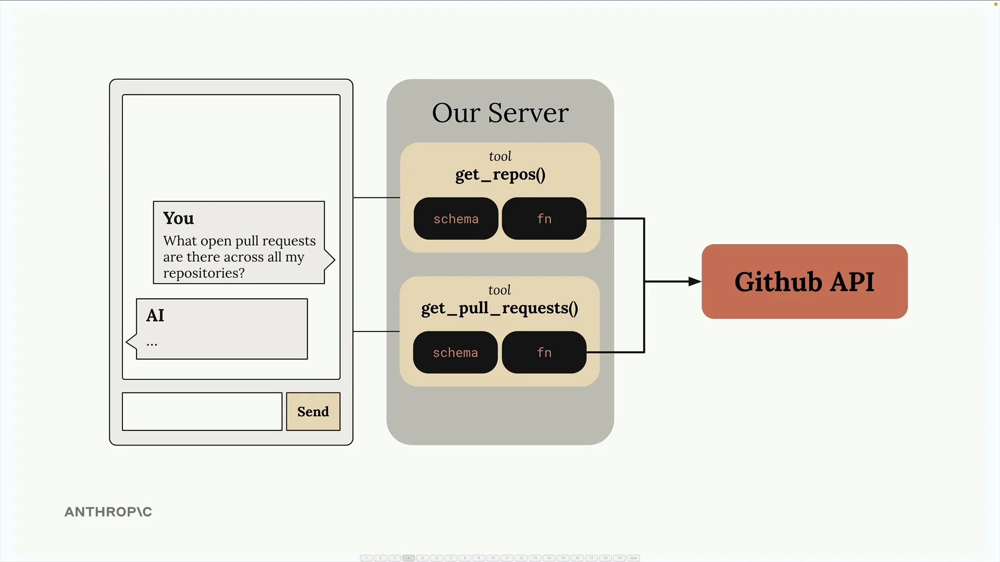
*MCP 개요 — Model Context Protocol 의 목적과 위치 (W07 L01 preview)*

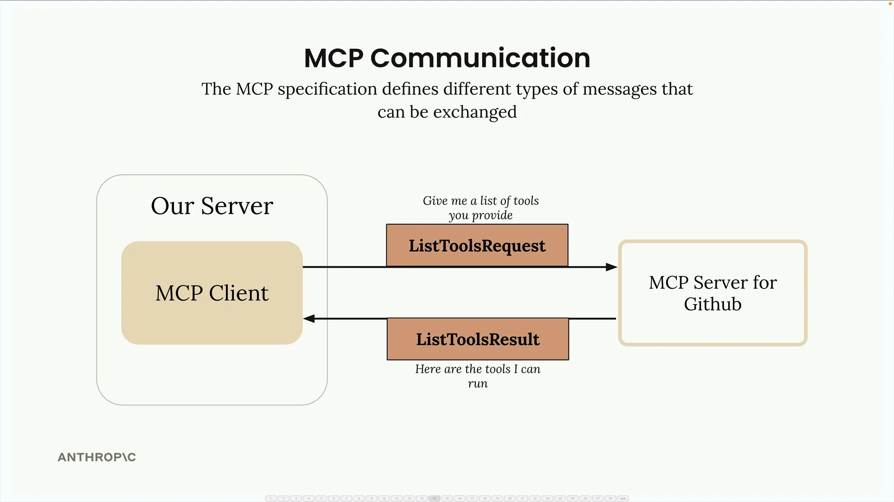
*MCP 아키텍처 — Host · Client · Server 3계층 구조 (W07 L02 preview)*

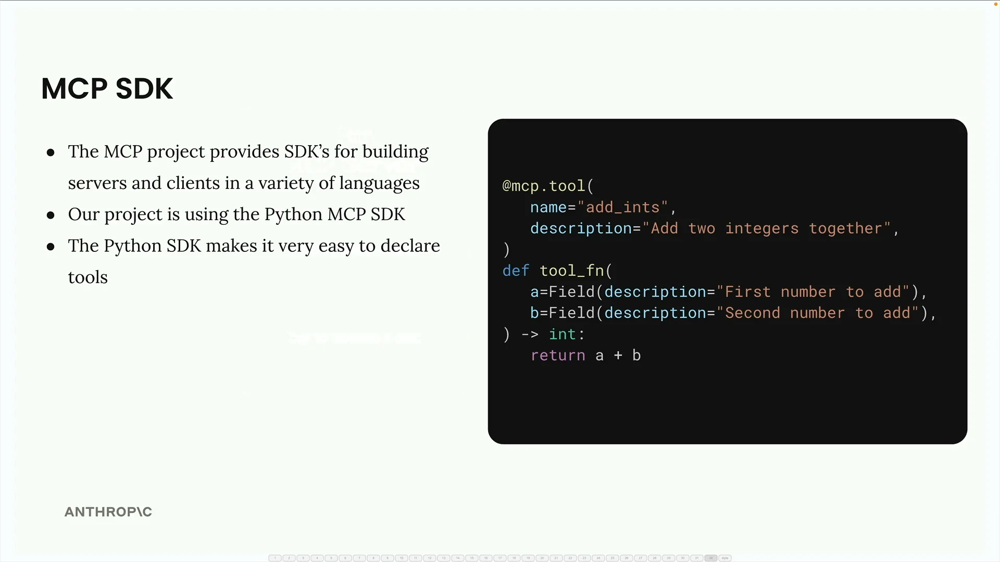
*MCP Tool 정의 — FastMCP `@mcp.tool()` 데코레이터로 함수 → tool 변환 (W07 L03~L04 preview)*

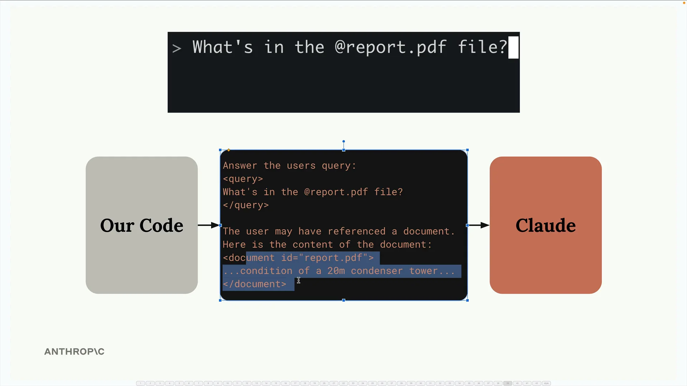
*MCP Resources — 변하지 않는 데이터를 resource 로 노출 (W06 caching 설계와 동일 사고)*

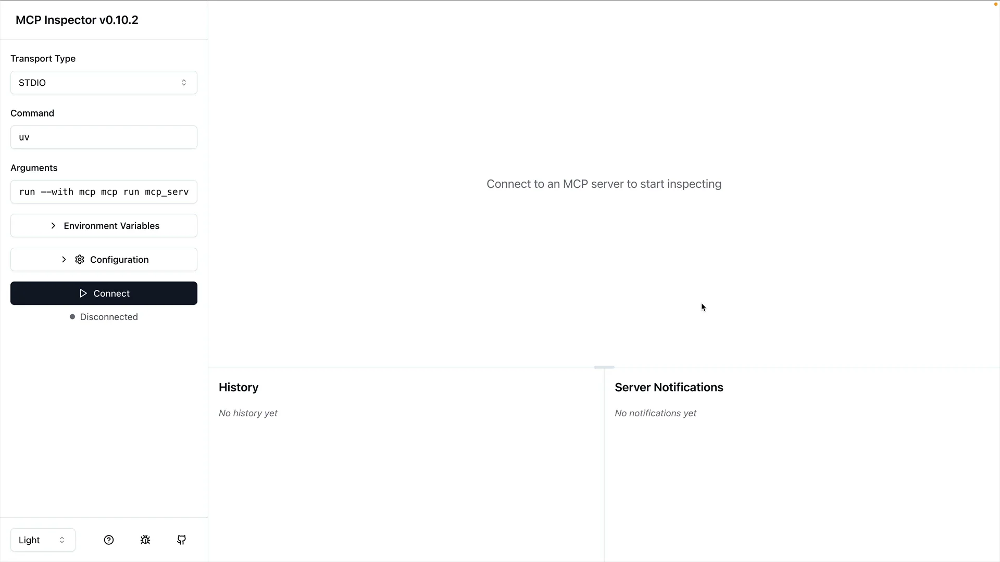
*MCP Inspector — 개발 단계에서 MCP 서버를 시각적으로 테스트하는 도구 (W07 L06 preview)*

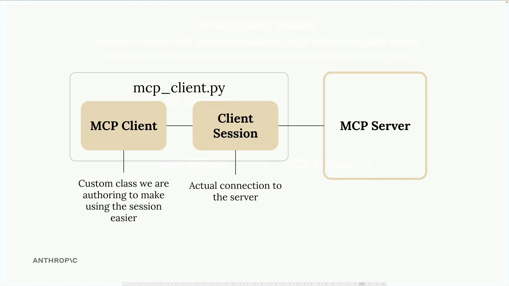
*MCP Client 구현 — Python 클라이언트가 MCP 서버에 연결해 tool/resource 를 호출하는 패턴 (W07 L07 preview)*

> [!tip] W06 → W07 자연스러운 연결
> 위 6 슬라이드는 W07 본강의 노트인 [[Week_07]] 에서 더 상세히 다룬다. 이번 주차에서는 **"미리보기 수준"** 으로만 익숙해지고, W06 의 Code Execution + Files API 개념이 W07 의 MCP Tools/Resources 와 어떻게 닮아 있는지 그 직관만 잡아 두면 충분하다.

### CC 스킬 종합 다이어그램

```mermaid
graph LR
    subgraph W5["W5 CC 스킬"]
        SK["Skills · Commands"]
    end
    subgraph W6["W6 CC 스킬 (지금)"]
        SA["Subagents"]
        HK["Hooks"]
    end
    subgraph W7["W7 CC 스킬"]
        MCP["Multi-agent · Agent SDK"]
    end

    SK --> SA
    SA --> HK
    HK --> MCP

    style W5 fill:#e3f2fd,stroke:#2196f3
    style W6 fill:#e8c07a,stroke:#c4a882,color:#333
    style W7 fill:#fef3c7,stroke:#d97706
```

> [!ref] CC 스킬 참고
> - [Claude Code — Subagents](https://docs.claude.com/en/docs/claude-code/sub-agents)
> - [Claude Code — Hooks](https://docs.claude.com/en/docs/claude-code/hooks)
> - 보조 노트: [[Week_06_Subagents]] (ISA 트랙 심화)
> - 보조 노트: [[Week_06_IntroMCP]] (IMCP 트랙, W07 선수학습)

---

## 📚 참고 자료

> [!ref] Skilljar 공식 자료 (본 강의 주된 출처)
> - 코스 홈: [Building with the Claude API — Skilljar](https://anthropic.skilljar.com/claude-with-the-anthropic-api)
> - 섹션 S5 (Features of Claude): L01~L08 — Extended Thinking / Image / PDF / Citations / Caching / Code Execution
> - 전사본 원본: `01-Notes/_skilljar_s5_content.md` (820 lines, 2026-04-20 수집)
> - 선행 섹션 S4 (RAG): [[Week_05]]
> - 후속 섹션 S6 (MCP): [[Week_07]]
> - 공식 GitHub: [anthropics/courses — claude_features](https://github.com/anthropics/courses/tree/master/claude_features)

> [!ref] 관련 Skilljar 코스 (보조 트랙)
> - [Introduction to Subagents](https://anthropic.skilljar.com/introduction-to-subagents) — ISA 트랙, W06 자율 심화(②)
> - [Introduction to MCP](https://anthropic.skilljar.com/introduction-to-mcp) — IMCP 트랙, W07 선수학습(①)
> - [Claude Code 101](https://anthropic.skilljar.com/claude-code-101) — Claude Code 입문 (W01 기수강)
> - [Claude Code in Action](https://anthropic.skilljar.com/claude-code-in-action) — 실전 심화

> [!ref] Anthropic 공식 문서
> - [Extended Thinking](https://docs.anthropic.com/en/docs/build-with-claude/extended-thinking) — feature compatibility 포함 (L01 필수 참조)
> - [Vision (Image Support)](https://docs.anthropic.com/en/docs/build-with-claude/vision)
> - [PDF Support](https://docs.anthropic.com/en/docs/build-with-claude/pdf-support)
> - [Citations](https://docs.anthropic.com/en/docs/build-with-claude/citations)
> - [Prompt Caching](https://docs.anthropic.com/en/docs/build-with-claude/prompt-caching) — cache_control / ephemeral / minimum token 공식 정의
> - [Code Execution](https://docs.anthropic.com/en/docs/build-with-claude/tool-use/code-execution)
> - [Files API](https://docs.anthropic.com/en/api/files)
> - [Claude Code — Subagents](https://docs.claude.com/en/docs/claude-code/sub-agents)
> - [Claude Code — Hooks](https://docs.claude.com/en/docs/claude-code/hooks)

> [!ref] Anthropic Cookbook (실전 예제)
> - [anthropic-cookbook — extended_thinking](https://github.com/anthropics/anthropic-cookbook/tree/main/extended_thinking)
> - [anthropic-cookbook — multimodal](https://github.com/anthropics/anthropic-cookbook/tree/main/multimodal)
> - [anthropic-cookbook — prompt_caching](https://github.com/anthropics/anthropic-cookbook/tree/main/misc/prompt_caching.ipynb)
> - [anthropic-cookbook — tool_use (code_execution 포함)](https://github.com/anthropics/anthropic-cookbook/tree/main/tool_use)

> [!ref] 학술·산업 레퍼런스
> - Wei, J. et al. (2022), "Chain-of-Thought Prompting Elicits Reasoning in Large Language Models", NeurIPS 2022, arXiv:2201.11903 — Extended Thinking 의 이론적 배경
> - Yang, Z. et al. (2023), "MM-REACT: Prompting ChatGPT for Multimodal Reasoning and Action", arXiv:2303.11381 — Vision + reasoning 결합 패턴
> - Lewis, P. et al. (2020), "Retrieval-Augmented Generation for Knowledge-Intensive NLP Tasks", NeurIPS 2020, arXiv:2005.11401 — W05 RAG 와 W06 Citations 의 결합 배경
> - Anthropic (2024) — "Prompt caching with Claude" 공식 블로그

> [!ref] 건축공학 도메인 참고
> - KDS 14 20 22 — 콘크리트 구조 전단 설계 기준 (§2.5 실습 자료)
> - KDS 14 30 25 — 강구조 한계상태설계법
> - `02-Resources/허석재박사 강의/Seminar3` — 구조해석 프롬프트 5단계 템플릿 (Solver → Self-Improvement → Verifier → Correction → Synthesis)
> - [[Week_05]] S4_07 — KDS RAG 파이프라인 (Citations 와 결합 가능)

---

## Related

- 이전: [[Week_05|5주차: RAG + 하이브리드 검색 (S4)]] — 지식 확장 · 어휘·의미 검색 병합
- 다음: [[Week_07|7주차: MCP 서버 개발 (S6)]] — Features 를 MCP 서버로 재포장해 Claude Code 와 연결
- 보조 (심화): [[Week_06_Subagents|Introduction to Subagents]] — ISA 트랙, CC 스킬 심화 (② 자율 심화 모드)
- 보조 (선수학습): [[Week_06_IntroMCP|Introduction to MCP]] — IMCP 트랙, W07 선수학습 (① Pre-read 모드)
