# Week 06: Features of Claude — Major Capabilities (S5)

---

## 📌 Lecture Focus

**Ch.1 Extended I/O Capabilities of Claude (Extended Input/Output) — L01~L04**
- **Extended Thinking**: Activates Claude's internal reasoning process (*"scratch paper"*) to improve accuracy on complex problems; the response is split into `thinking` blocks and `text` blocks — minimum `thinking_budget=1024`, and `max_tokens > budget`
- **Image Support**: Two ways to pass images — Base64 / URL — **up to 100 images per request, 5MB per image, 8000px for a single image, 2000px for multiple**; token cost is `(width × height) / 750`
- **PDF Support**: `"type": "document"` + `"media_type": "application/pdf"` — almost identical to image code; analyzes text, tables, embedded images, and structure in one pass
- **Citations**: Add `"citations": {"enabled": True}` to a document block — `cited_text`, `document_index`, `document_title`, `start_page_number`, `end_page_number` automatically track the evidence behind each answer

**Ch.2 Cost Optimization & Code Execution — L05~L08**
- **Prompt Caching Concept (L05)**: Claude normally discards tokenize / embedding / context preprocessing after every request (*"I could have reused it!"*); caching stores that upfront work for **one hour** and reuses it
- **Rules of Prompt Caching (L06)**: Place cache_breakpoints **manually** on longhand text blocks with `cache_control: {"type": "ephemeral"}`; **at most 4 breakpoints**, in the order **tools → system → messages**, and a minimum of **1,024 tokens** is required for caching eligibility
- **Prompt Caching in Action (L07)**: Candidates include 6K-token system prompts and 1.7K-token tool schemas; verify cache behavior via `cache_creation_input_tokens` vs `cache_read_input_tokens` in the response
- **Code Execution & Files API (L08)**: `{"type": "code_execution_20250522", "name": "code_execution"}` server tool + Files API (`upload`, `container_upload`) — repeated Python execution in a **no-network Docker sandbox** → retrieve plots and output files via `download_file(...)`

**Integration Cycle**: thinking expansion (L01) → visual / document input (L02~L03) → source tracking (L04) → cost reduction through caching (L05~L07) → delegating computation to code and files (L08) — this is the week that weaves Claude's 5 advanced features into a single pipeline.

---

## 🎯 Learning Objectives

After completing this module, you will be able to:

**Ch.1 Extended I/O Capabilities of Claude (L01~L04)**
- Configure Extended Thinking parameters (`thinking.type`, `thinking_budget`, `max_tokens`) and process `thinking` blocks and `text` blocks separately in the response
- Write fallback code so that the session does not break even when a **Redacted thinking** block (encrypted reasoning block) is returned
- Apply Base64 / URL forms of image blocks along with size, resolution, and count constraints to author image analysis prompts
- Raise image-analysis accuracy using step-by-step analysis prompts like **Fire Risk Assessment** and **one-shot example** techniques
- Base64-serialize a PDF file and pass it to Claude as a `"type": "document"`, `"media_type": "application/pdf"` block to extract summaries, tables, and figures
- Enable the Citations feature, and render the `citations` objects (cited_text, document_index, page range, character range) in the response as UI highlights or hover tooltips

**Ch.2 Cost Optimization & Code Execution (L05~L08)**
- **Why caching is needed** — explain the preprocessing costs of tokenize / embedding / context and the benefit structure of a one-hour TTL cache
- Add `cache_control: {"type": "ephemeral"}` to a longhand text block to set a manual cache breakpoint, and place **up to 4 breakpoints** in the order **tools → system → messages**
- Check the **1,024 tokens minimum length** rule and determine that small repeated messages are not cacheable
- Read `usage.cache_creation_input_tokens` / `cache_read_input_tokens` in responses to distinguish WRITE vs HIT, and experimentally reproduce that even a single-character change invalidates the cache
- Apply a safe pattern that caches large tool schemas and system prompts through copies (`tools_clone`), **leaving the original definitions untouched**
- Upload files via the Files API, inject the returned `file_metadata.id` into a `container_upload` block of the message, and retrieve files generated by Code Execution results via `download_file(...)`
- Build an end-to-end workflow — CSV upload → automatic analysis → plot generation → plot download — such as the **streaming.csv churn analysis**

**Integrated Competency**
- Combine Claude's 5 advanced features (Extended Thinking · Vision · PDF · Citations · Caching · Code Execution) to design a **structural engineering practice pipeline** that mixes drawings, standards, and experimental data
- Prepare the foundation for W07 MCP server development through this week's auxiliary tracks (Subagents · Hooks · Intro MCP)

---

## 🤔 Why Learn This? — "Giving AI Eyes, a Brain, and a Wallet"

> [!question] In [[Week_05]] we expanded Claude's **knowledge coverage** with RAG and hybrid search. Week 06 simultaneously expands Claude's own **reasoning, vision, sourcing, efficiency, and computation** — this is the week that upgrades the "sensory organs" of input and output.

### Claude's Remaining Limitations

The Claude we have learned through Week 05 is powerful, but five limitations remain. These are exactly the limits that Week 06 resolves.

| Limitation | Description | Week 06 Solution (Source Lesson) |
| --- | --- | --- |
| **Reasoning depth** | Hasty answers on complex math and logic | **Extended Thinking** (L01) |
| **Visual information** | Cannot "see" drawings, photos, charts | **Image Support** (L02) |
| **Document processing** | Cannot integrate text, tables, and images in a PDF | **PDF Support** (L03) |
| **Source tracking** | Cannot check *"where did this info come from?"* | **Citations** (L04) |
| **Cost burden** | Long system prompts and tool schemas resent every request | **Prompt Caching** (L05~L07) |
| **Computation reliability** | Numerical-computation inaccuracy of LLMs | **Code Execution + Files API** (L08) |

### API → Tool Use → RAG → **Features** Evolution Matrix

| [[Week_02]]·W03: API + Prompt | [[Week_04]]: Tool Use | [[Week_05]]: RAG | **Week 06: Features** | [[Week_07]]: MCP |
| --- | --- | --- | --- | --- |
| Text I/O | External function calls | Knowledge retrieval & augmentation | **Reasoning expansion + multimodal** | Unified protocol |
| Prompt engineering | Tool schemas + loops | Embeddings + BM25 + RRF | **Caching + code execution** | Tools / Resources / Prompts |
| Basic dialog | Dynamic behavior | Document-grounded responses | **Cost optimization + visual analysis** | Standard transport layer |

Week 06 is the week of *"Claude is no longer just a text-chat tool."* It expands into a comprehensive AI engine that **thinks, sees, cites, computes, and saves costs**.

### This Week's Features Map

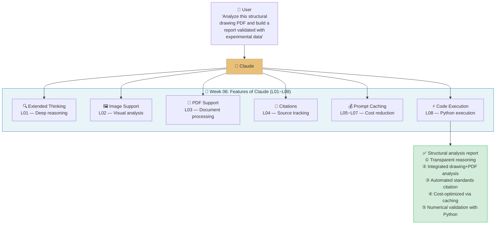

### This Week's Project: "AI Structural Engineer Assistant" Prototype

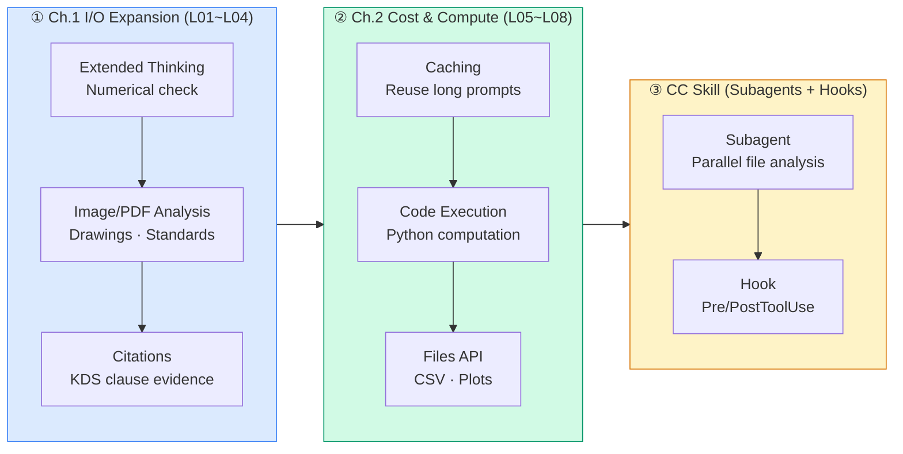

This **3-stage pipeline** is the backbone of the week. ① Enrich input (drawings, PDFs) and output (reasoning, citations); ② suppress the cost of long prompts via caching while guaranteeing numerical reliability through Python execution; ③ automate Claude Code sessions with **Subagents + Hooks**. Finally, §2.5 ties all these features together to concretize their use in the **structural engineering domain**.

### Anthropic Skilljar Course

This lecture note is based on Anthropic's official education platform Skilljar's **"Building with the Claude API" Section 5: Features of Claude** (8 lessons L01~L08).

| Lesson | ID | Title | Week 06 Mapping |
|---|---|---|---|
| L01 | 287773 | Extended thinking | Ch.1 §1.1 |
| L02 | 287778 | Image support | Ch.1 §1.2 |
| L03 | 287768 | PDF support | Ch.1 §1.3 |
| L04 | 287771 | Citations | Ch.1 §1.4 |
| L05 | 287772 | Prompt caching | Ch.2 §2.1 |
| L06 | 287770 | Rules of prompt caching | Ch.2 §2.2 |
| L07 | 287774 | Prompt caching in action | Ch.2 §2.3 |
| L08 | 287777 | Code execution and the Files API | Ch.2 §2.4 |

> [!ref] Source Mapping
> - Online Course: [Building with the Claude API](https://anthropic.skilljar.com/claude-with-the-anthropic-api)
> - Skilljar S5 (Features of Claude): L01~L08 (main source for this week)
> - Transcript Original: `01-Notes/_skilljar_s5_content.md` (collected 2026-04-20, 820 lines)
> - Syllabus Mapping: **Building — S5 (Features of Claude) → W6** (v2.3 baseline)

> [!method] Prerequisites
> - **Anthropic API key**: Extended-Thinking-compatible model at Claude Sonnet 4 or later. `claude-sonnet-4-5` recommended
> - **Python packages**: `anthropic`, `httpx`, `base64`, `python-dotenv`
> - **Sample files**: `earth.pdf` (Wikipedia Earth article PDF — official L03 example), `streaming.csv` (for L08 churn analysis), and one concrete-crack photo or structural drawing
> - **Notebook order**: `S5_01_extended_thinking.ipynb` → `S5_02_images_pdf.ipynb` → `S5_03_citations.ipynb` → `S5_04_prompt_caching.ipynb` → `S5_05_code_execution.ipynb` → `S5_06_practice.ipynb` (student exercise) → `S5_07_structural_features.ipynb` (domain application)

---
## [Chapter 1] Extended I/O Capabilities of Claude (Lessons L01~L04)

### 1.1 Extended Thinking (L01)

Extended thinking is Claude's **advanced reasoning** feature. Before solving a complex problem, it hands the model a **"scratch paper"** so that the thinking process is surfaced as **structured blocks** before the final answer is generated. Skilljar L01 phrases it like this: *"Think of it as Claude's 'scratch paper' — you can see the reasoning process that leads to the answer."*


*Default response structure — when thinking is off, only a single text block is returned*

#### How Extended Thinking Works

Once thinking is enabled, the response — previously a single text block — changes into a **two-part structure**.


*Thinking-enabled response — reasoning process + final answer returned as two side-by-side blocks*

Key benefits:
- **Better reasoning capabilities for complex tasks**
- **Increased accuracy on difficult problems**
- **Transparency into Claude's thought process**

Trade-offs to watch out for:
- **Higher cost** — thinking tokens are also billed
- **Increased latency** — thinking takes time
- **More complex response-handling code** — you must branch on block type

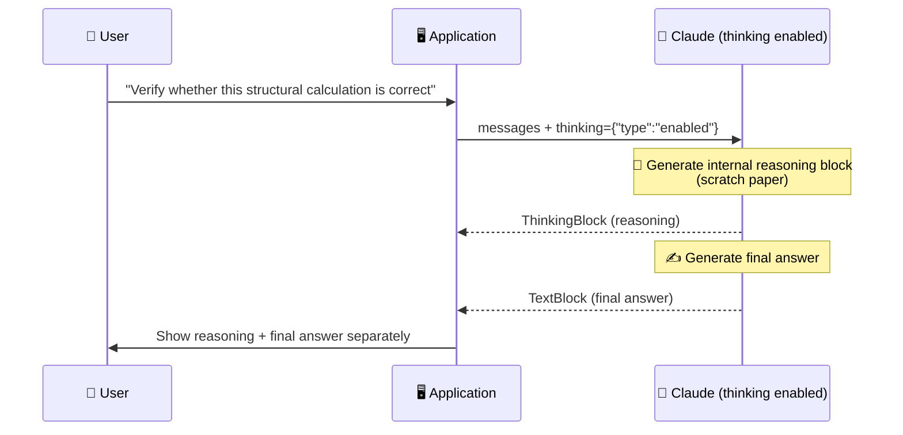

#### When to Turn On Extended Thinking

Skilljar simplifies the decision — *"Use your prompt evaluations."* First run the prompt **without** thinking; if you have exhausted prompt optimization and accuracy still falls short, only then turn on thinking. In other words, thinking is a tool used **beyond the limits of standard prompting**.

| Situation | Recommendation | Reason |
| --- | --- | --- |
| Translation / summary / simple Q&A | ❌ thinking off | Cost and latency outweigh accuracy gains |
| Formulas and multi-step computations | ✅ thinking on | Reduces LLM numerical-reasoning mistakes |
| Multi-step logic / debugging | ✅ thinking on | Intermediate steps ease error diagnosis |
| Architecture / refactoring design | ✅ thinking on | Structurally explores complex trade-offs |

#### Response Structure and the Signature System

Extended thinking responses include a **special signature system for security**.


*Signature-bearing thinking block — tamper-proof cryptographic token*

The signature is a **cryptographic token that guarantees the thinking text was not modified**. It prevents developers from arbitrarily editing Claude's reasoning and steering it into unsafe directions.

#### Redacted Thinking — Private Reasoning Blocks

Sometimes, instead of readable reasoning, a **redacted thinking block** is returned.


*Redacted thinking — reasoning flagged by Claude's internal safety systems is returned encrypted*

This happens when Claude's thinking has been **flagged by internal safety systems**. It contains an encrypted form of the thinking, so that **passing the complete message back on the next turn preserves context without loss**. That is, redacted blocks **must also be preserved for session continuity**.

#### Implementation — Extending the `chat` Function

Skilljar's code pattern adds **two parameters** to the existing `chat(...)` helper.

```python
def chat(
    messages,
    system=None,
    temperature=1.0,
    stop_sequences=[],
    tools=None,
    thinking=False,
    thinking_budget=1024
):
    ...
```

- `thinking`: boolean switch
- `thinking_budget`: maximum tokens spent on thinking — **minimum 1,024**, and `max_tokens > thinking_budget`

The activation logic is added as follows.

```python
if thinking:
    params["thinking"] = {
        "type": "enabled",
        "budget": thinking_budget
    }
```

And the call site is a single line.

```python
chat(messages, thinking=True)
```

#### Testing Redacted Responses

To verify that your **application safely handles redacted blocks**, Skilljar presents a testing technique that sends a special trigger string to force Claude to return redacted thinking. This technique lets you verify in CI that *"the app does not crash when a redacted block arrives."*

```python
# Basic response-parser skeleton
for block in response.content:
    if block.type == "thinking":
        print(f"[Reasoning]\n{block.thinking}")
    elif block.type == "redacted_thinking":
        # ❗ Contents not readable, but must be included on the next turn
        preserved_blocks.append(block)
    elif block.type == "text":
        print(f"[Answer]\n{block.text}")
```

#### ⚠️ Feature Compatibility Note

> [!tip] Extended Thinking Is Incompatible With Some Other Features
> Skilljar L01 warns explicitly — *"Extended Thinking is not compatible with some other features, notably message pre-filling and temperature."*
> - **No message pre-filling**: conflicts with the technique of pre-filling the assistant's opening characters
> - **Fixed temperature**: arbitrary temperature settings are not allowed
> - See the full list of constraints in the official docs [extended-thinking#feature-compatibility](https://docs.anthropic.com/en/docs/build-with-claude/extended-thinking#feature-compatibility)

#### Extended Thinking Response Block Structure

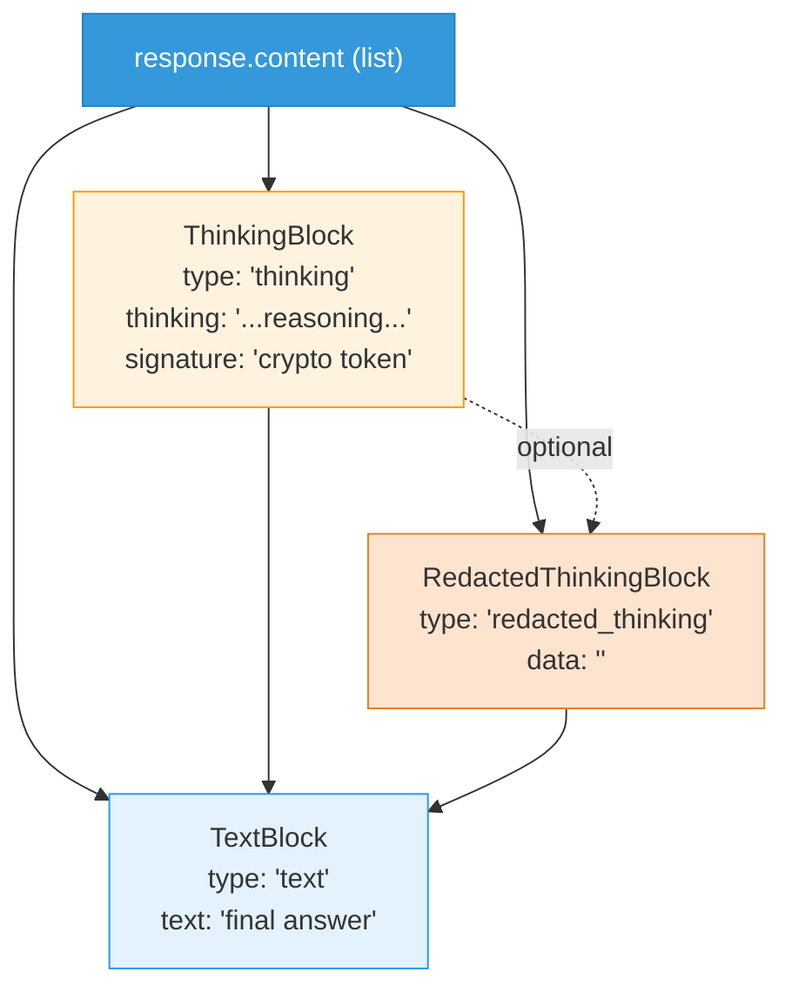

#### Decision Guide

> [!finding] Extended Thinking — "Don't Judge, Measure"
> Skilljar's central advice: *"Start with standard prompting, optimize thoroughly, then add thinking when you need that extra reasoning capability."* This connects directly to the **prompt evaluation** we learned in Week 03 — use the Eval Pipeline to measure **accuracy differences between thinking on/off**, and adopt thinking only when the cost-to-benefit balance is positive.

> [!action] Practice Notebook
> 📂 `03-Exercises/Week_06/skilljar/S5_01_extended_thinking.ipynb`
> Reproduces enabling thinking, branching on thinking / text / redacted blocks, comparing responses by budget, and the forced-redacted test trigger.

> [!ref] Source: Skilljar L01 — Extended thinking (287773)

---

### 1.2 Image Support (L02)

Claude's **vision capabilities** let you include images in messages and request analysis in *"countless different ways"* — from describing images and comparing multiple images to counting objects and performing complex visual analysis.


*Image Support overview — attach images as separate blocks inside the message*

#### Basic Image Processing Constraints

The **image-input constraints** presented in L02 are as follows. All numeric values are taken verbatim from the transcript.

- **Up to 100 images across all messages in a single request**
- **Max size of 5MB per image**
- **Max 8000px height/width for a single image**
- **Multiple images: max 2000px**
- Images can be included via **Base64 encoding** or **URL**
- Per-image token cost: `tokens = (width px × height px) / 750`

#### Message-Flow Diagram

An image becomes a **separate image block placed alongside text blocks** inside a user message.

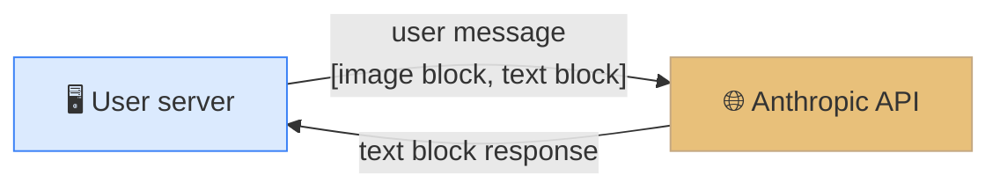


*User server ↔ Claude round trip — same conversation pattern as text*

#### Basic Implementation — Base64 Encoding

The canonical L02 code follows, including variable names matching the original.

```python
with open("image.png", "rb") as f:
    image_bytes = base64.standard_b64encode(f.read()).decode("utf-8")

add_user_message(messages, [
    # Image Block
    {
        "type": "image",
        "source": {
            "type": "base64",
            "media_type": "image/png",
            "data": image_bytes,
        }
    },
    # Text Block
    {
        "type": "text",
        "text": "What do you see in this image?"
    }
])
```

**Key points**:
- In a `"type": "image"` block, set `source.type` to `"base64"`
- Specify `media_type` as `"image/png"`, `"image/jpeg"`, etc.
- `data` is a **UTF-8-decoded Base64 string** (str, not bytes)

#### Prompt Engineering for Images Is the Same as Text

L02's core message is *"the same prompting techniques that work for text apply to images."* Simple prompts yield only simple results.


*Example — counting marbles: failure of a naive question*

For instance, asking *"How many marbles are in this image?"* often returns a wrong count. To raise accuracy:

- **Provide detailed guidelines and analysis steps**
- Use **one-shot / multi-shot examples**
- **Break down complex tasks into smaller steps**

#### Step-by-Step Analysis Prompt (Marble Counting)


*Systematic methodology prompt — replace a naive question with a step-by-step method*

The official Skilljar example, as-is:

```
Analyze this image of marbles and determine the exact count using this methodology:
1. Begin by identifying each unique marble one at a time. Assign each a number as you identify it.
2. Verify your result by counting with a different method. Start from the bottom-left corner and work row by row, from left to right.

What is the exact, verified number of marbles in this image?
```

By enforcing two **independent counting methods** — unique identification + row-by-row recheck — it drives consistency verification.

#### Boosting Accuracy With a One-Shot Example


*One-shot technique — present a reference image with a known answer first*

Include inside the message an **image with a known count** first, tell Claude *"this image has 12 marbles,"* and then ask about the **target image**. This gives Claude a reference for *"the kind of analysis I want,"* which is exactly the same principle as text few-shot.

#### Real-World Case — Fire Risk Assessment


*Fire Risk Assessment — automated residence risk evaluation based on satellite imagery*

L02's real-world application is **automated risk assessment for home fire insurance**. Instead of sending an inspector to every property, satellite imagery + Claude analysis is used. The system examines:

- **Dense, close-packed trees near the residence**
- **Difficult access routes for emergency services**
- **Branches overhanging the residence**

The original prompt (abridged):

```text
Analyze the attached satellite image of a property with these specific steps:

1. Residence identification: Locate the primary residence on the property by looking for:
   - The largest roofed structure
   - Typical residential features (driveway connection, regular geometry)
   - Distinction from other structures (garages, sheds, pools)

2. Tree overhang analysis: Examine all trees near the primary residence:
   - Identify any trees whose canopy extends directly over any portion of the roof
   - Estimate the percentage of roof covered by overhanging branches (0-25%, 25-50%, 50-75%, 75%+)
   - Note particularly dense areas of overhang

3. Fire risk assessment: For any overhanging trees, evaluate:
   - Potential wildfire vulnerability (ember catch points, continuous fuel paths to structure)
   - Proximity to chimneys, vents, or other roof openings if visible
   - Areas where branches create a "bridge" between wildland vegetation and the structure

4. Defensible space identification: Assess the property's overall vegetative structure:
   - Identify if trees connect to form a continuous canopy over or near the home
   - Note any obvious fuel ladders (vegetation that can carry fire from ground to tree to roof)

5. Fire risk rating: Based on your analysis, assign a Fire Risk Rating from 1-4:
   - Rating 1 (Low Risk): No tree branches overhanging the roof, good defensible space around the home
   - Rating 2 (Moderate Risk): Minimal overhang (<25% of roof), some separation between tree canopies
   - Rating 3 (High Risk): Significant overhang (25-50% of roof), connected tree canopies, multiple vulnerability points
   - Rating 4 (Severe Risk): Extensive overhang (>50% of roof), dense vegetation against structure

For each item above (1-5), write one sentence summarizing your findings,
with your final response being the numerical rating.
```

#### Projecting Fire Risk Assessment Onto the Domain

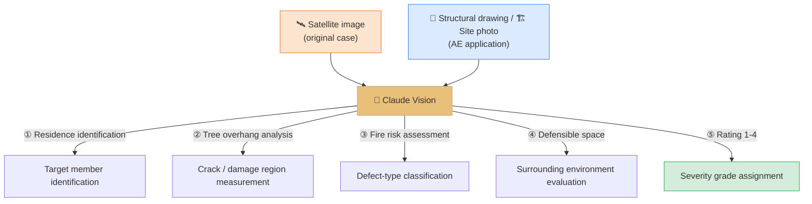

The 5-step method L02 demonstrates is a **domain-agnostic template** — the order "target identification → measure key features → risk/defect evaluation → environmental context → numerical grade" transplants directly to structural crack analysis, BIM drawing inspection, and the like.

#### Image + Text Block Structure Summary

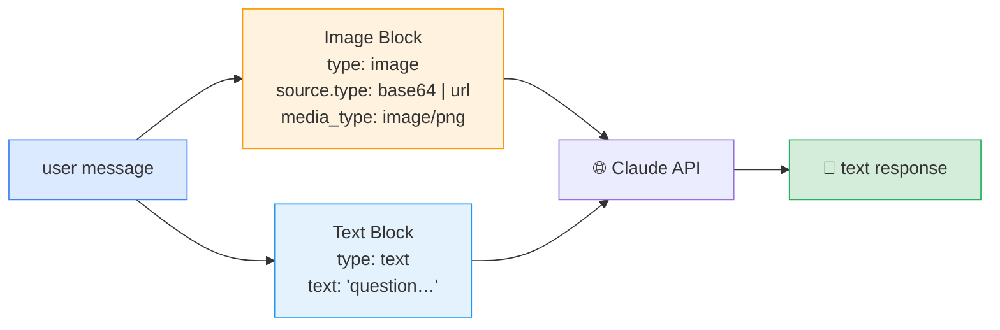

> [!tip] Image Input — Practical Tips
> - **Base64 vs URL**: use Base64 for local files, URL for public URLs. The URL form makes requests smaller, but Anthropic's servers must be able to fetch that URL
> - **Resolution vs token cost**: because `tokens = (width × height) / 750`, unnecessarily high resolution directly becomes cost. Use originals for fine crack analysis, resize for simple classification
> - **Multiple images**: listing multiple blocks, as in before/after comparisons, naturally communicates context such as *"the first is before repair, the second is after"* (subject to the 2000px constraint)

> [!action] Practice Notebook
> 📂 `03-Exercises/Week_06/skilljar/S5_02_images_pdf.ipynb`
> Comparing marble-counting naive vs step-by-step prompts, injecting a one-shot example, reproducing the Fire Risk Assessment 5-step template, and experimenting on structural drawings.

> [!ref] Source: Skilljar L02 — Image support (287778)

---

### 1.3 PDF Support (L03)

Claude can **read and analyze PDF files directly** — a powerful capability as a document-processing tool. Surprisingly, it uses **almost the same code pattern as image processing**, with only a few fields changed.

#### The Minimal Diff From Image Code to PDF Code

The point L03 emphasizes is this — *"you'll use nearly identical code to what you'd use for images. The main differences are in the file type specifications."*

```python
with open("earth.pdf", "rb") as f:
    file_bytes = base64.standard_b64encode(f.read()).decode("utf-8")

messages = []

add_user_message(
    messages,
    [
        {
            "type": "document",
            "source": {
                "type": "base64",
                "media_type": "application/pdf",
                "data": file_bytes,
            },
        },
        {"type": "text", "text": "Summarize the document in one sentence"},
    ],
)

chat(messages)
```

#### The 4 Elements That Change From Image to PDF

| Item | Image | PDF |
| --- | --- | --- |
| File extension | `.png` / `.jpg` | `.pdf` |
| Variable name (recommended) | `image_bytes` | `file_bytes` (for clarity) |
| `type` field | `"image"` | `"document"` |
| `media_type` | `"image/png"` | `"application/pdf"` |

In other words, **a single code path can handle both image and PDF with minimal branching**.

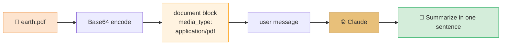

#### What Claude Can Extract From a PDF

Beyond plain text extraction — L03 specifies four capabilities.

- **Text content throughout the document**
- **Images and charts embedded in the PDF**
- **Tables and their data relationships**
- **Document structure and formatting**


*Wikipedia Earth PDF example — successful one-sentence summary*

The screenshot above is the actual output summarizing the **Wikipedia Earth article PDF** in a single sentence. This is proof that PDF becomes *"a one-stop solution that can extract any kind of information from the document."*

#### PDF vs RAG — Choice Criteria

> [!finding] PDF Direct Pass vs RAG — Which to Use
> - **Single document under 100 pages, 3–5 questions per session**: **PDF direct pass** is advantageous — full context preserved, no vector DB needed, integrated handling of tables and charts
> - **Hundreds to thousands of documents or repeated sessions**: **RAG** is required — inject only relevant chunks using the chunking, embedding, BM25, and RRF machinery learned in W05
> - **Middle ground**: combine **PDF direct pass + Prompt Caching** (§2.1~2.3) — when many repeated questions happen within an hour, cache HITs can cut costs to roughly 10%

#### Application Example — Summarizing KDS Standards

```python
# Pass KDS 14 20 22 (Concrete structure — shear design) PDF as is
with open("KDS_14_20_22_shear.pdf", "rb") as f:
    file_bytes = base64.standard_b64encode(f.read()).decode("utf-8")

add_user_message(
    messages,
    [
        {
            "type": "document",
            "source": {
                "type": "base64",
                "media_type": "application/pdf",
                "data": file_bytes,
            },
        },
        {
            "type": "text",
            "text": "From this KDS standard, summarize the shear design clauses for RC beams, "
                    "and organize the key design formulas and allowable limits in a table."
        },
    ],
)
```

> [!tip] Practical Notes When Passing PDFs
> - For very large PDFs (hundreds of pages), consider **page splitting** before putting them in one request — you may hit the response token limit
> - Scanned (image-only) PDFs have no text layer, so accuracy drops — OCR preprocessing may be needed
> - If you query the same PDF five or more times, **always combine with prompt caching** (§2.3)

> [!action] Practice Notebook
> 📂 `03-Exercises/Week_06/skilljar/S5_02_images_pdf.ipynb`
> Reproduce the earth.pdf one-sentence summary, extract tables from a table-containing PDF, and compare the image vs PDF code diff.

> [!ref] Source: Skilljar L03 — PDF support (287768)

---

### 1.4 Citations (L04)

When Claude answers based on documents you provide, users may suspect *"is this actually from your training data?"* The **Citations** feature resolves this transparency issue — it automatically generates a **clear trail** in Claude's responses linking each claim to specific portions of the source documents.

#### Why Citations Are Needed


*Citations purpose — a transparency feature that shows users where Claude's answer came from in the document*

Without citations, users **cannot verify two things**:
1. Did Claude actually reference the provided document?
2. Where in the document is the supporting sentence for that claim?

The Citations feature automatically attaches these two things.

#### Enabling Citations — Just Two Fields

Add **two new fields** to an existing document block.

```python
{
    "type": "document",
    "source": {
        "type": "base64",
        "media_type": "application/pdf",
        "data": file_bytes,
    },
    "title": "earth.pdf",
    "citations": { "enabled": True }
}
```

- `title`: a human-readable document name (*readable name*)
- `citations: {"enabled": True}`: instructs Claude to *"track the sources of information"*

#### Citation Structure in the Response

With citations enabled, Claude's response changes from **plain text into structured data**. Each claim is accompanied by a citation.


*Citation response structure — each claim is attached with cited_text / document_index / title / page range*

Each citation has 5 core fields.

| Field | Meaning |
| --- | --- |
| **`cited_text`** | The **verbatim document text** supporting Claude's claim |
| **`document_index`** | Which document among multiple (0-indexed) |
| **`document_title`** | The `title` given to the document |
| **`start_page_number`** | The page where `cited_text` begins |
| **`end_page_number`** | The page where `cited_text` ends |


*Citation field example — returns specific page range and verbatim excerpt from earth.pdf*

#### Citations Response-Flow Diagram

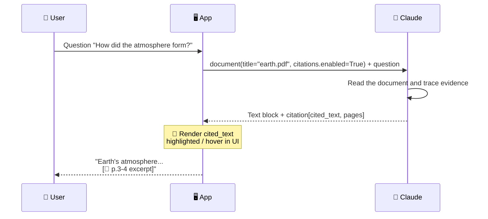

#### Baking Citations Into the UI


*Citations-powered UI — interactive footnotes where the excerpt appears on hover*

The **real power** of citations emerges when you make this information **accessible in the user interface**. You can build a transparent user experience with interactions such as hover footnotes that show verbatim excerpts, clicks that jump to the specific PDF page, and sidebar citation lists.

Users can:
- Confirm that Claude's answer is **grounded in real sources**
- **Open the original document and verify it directly**
- Explore the **context around each citation**

#### Citations With Plain Text — When It's Not PDF

Citations are not limited to PDFs. They also work with plain-text sources.

```python
{
    "type": "document",
    "source": {
        "type": "text",
        "media_type": "text/plain",
        "data": article_text,
    },
    "title": "earth_article",
    "citations": { "enabled": True }
}
```

In plain text, **character positions** are returned instead of page numbers — pinpointing exactly which character range in the text supports each claim.

#### Matching Citations to Source Types

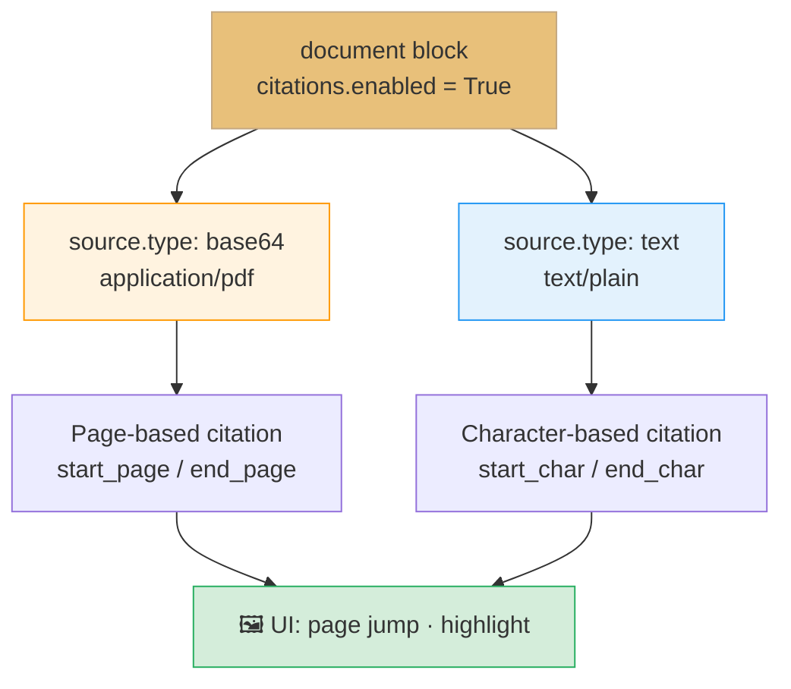

#### When to Use Citations

L04 explicitly lists the cases where **citations are particularly valuable**:
- When users need to **verify the accuracy of information**
- When dealing with **authoritative documents** that users may want to reference
- When **source transparency** is important for your application
- When users want to explore the **surrounding context** of specific facts

In structural engineering, this is exactly the case — **KDS-standards-based design reviews, literature reviews for papers, citations in safety-diagnosis reports, and compliance audits**.

> [!finding] "Black box → Transparent research assistant"
> A one-line summary of L04: *"By implementing citations, you transform Claude from a 'black box' that provides answers into a transparent research assistant that shows its work."* If you put the document chunks retrieved via W05's RAG directly into `document` blocks and turn on citations, **retrieval + evidence** completes in a single response.

> [!action] Practice Notebook
> 📂 `03-Exercises/Week_06/skilljar/S5_03_citations.ipynb`
> Reproduce the earth.pdf citations activation, compare plain-text citations, parse the `citations` list in responses into UI data, and simulate clause citations on a KDS PDF.

> [!ref] Source: Skilljar L04 — Citations (287771)

---
## [Chapter 2] Cost Optimization and Code Execution (Lessons L05~L08)

### 2.1 Prompt Caching Concept (L05)

Prompt caching is a feature that **reuses the computation of previous requests** to make Claude's responses faster and lower the cost of text generation. Skilljar L05 sums it up simply — *"Instead of throwing away all the processing work after each request, Claude can save and reuse it when you send similar content again."*

#### Default Behavior — What Happens Without a Cache


*Prompt caching intro — what waste is happening today*

When a user sends Claude a message, Claude does not generate a response **immediately**. First it performs a **tremendous amount of preprocessing work** on the input.


*Four preprocessing stages — tokenize → embed → context → generate*

- **Tokenize** the prompt into smaller pieces
- **Generate embeddings** for each token
- Attach **context** based on surrounding text
- **Only then** generate the actual output text

And after returning the response, all of this computation is **discarded**. Tokenization, embedding, and context analysis are all thrown away.


*Default behavior — all preprocessing results discarded after response generation*

#### Scenarios Where Waste Becomes Visible

This throw-away approach becomes problematic when you send **follow-up requests that contain the same content**.


*Repeated requests against the same document — same preprocessing redone every time*

For example, a conversation where you **iteratively refine** a summary of a long text. Claude must redo the same preprocessing on the content it just analyzed moments ago. L05 expresses it through Claude's inner voice — *"I just processed that message and threw away all the work I did — I could have reused it!"*


*"I could have reused it!" — face the wasted window*

#### What Prompt Caching Does

It transforms this workflow into one that **stores preprocessing results rather than discarding them**.


*After prompt caching — preprocessing results are saved to the cache and reused on re-requests*

On the first request, Claude does its usual preprocessing, but **saves the result in the cache instead of discarding it**. The cache acts as a lookup table saying *"if this message arrives again, I'll reuse what I did before."*


*Cache hit — after the initial write, follow-up requests are served as reads*

#### Benefits and Constraints


*Summary of prompt caching benefits and limits*

**Benefits**:
- **Faster responses** — requests that use cached content execute more quickly
- **Lower costs** — you pay less for the cached portion
- **Automatic optimization** — the first request writes to the cache, follow-ups read from it

**Constraints**:
- **Cache lifetime: one hour** (*Cached content only lives for one hour*)
- **Limited use cases** — only pays off when the same content is sent repeatedly
- **High frequency required** — the same content must appear **very frequently** for the biggest gains

Prompt caching is ideal for **document-analysis workflows** (many questions against the same large document) or **iterative editing tasks** (fixed base content, only minor changes).

#### L05 Key Idea in One Frame

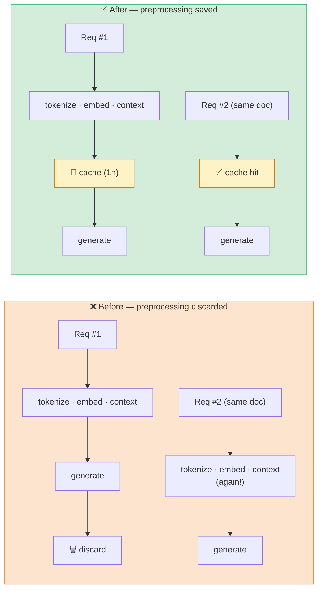

> [!tip] Caching Is Not Automatic
> Skilljar L05 emphasizes *"the initial request writes to the cache, follow-up requests read from it,"* while also making clear that **caching is not automatic**. You must manually place the **cache breakpoint** we learn in §2.2. The default is "no caching."

> [!action] Practice Notebook
> 📂 `03-Exercises/Week_06/skilljar/S5_04_prompt_caching.ipynb`
> Compare four repeated requests of the same document without the cache vs with the cache applied, and observe how `cache_creation_input_tokens` / `cache_read_input_tokens` values change.

> [!ref] Source: Skilljar L05 — Prompt caching (287772)

---

### 2.2 Rules of Prompt Caching (L06)

Prompt caching only pays off when **the same content is sent repeatedly**. L06 explains *"the rules for actually receiving that benefit"* across 10 slides, step by step.


*L06 intro — recap of the mechanism + emphasis on "one-hour lifetime"*

#### Rule 1 — Caching Is Not Automatic; Breakpoints Are Required

The first thing L06 nails down is these four rules.

- **Work done on messages is not cached automatically** (*Work done on messages is not cached automatically*)
- **Cache breakpoints** must be added **manually** to blocks
- All work **up to the breakpoint** is cached
- The cache is used on follow-up requests **only when everything up to the breakpoint is exactly identical**


*Breakpoint placement — everything up to that point is cached contiguously*

#### Rule 2 — You Must Use Longhand Block Form

The shorthand form has no place to put `cache_control`. So you must use the **longhand (expanded) text-block form**.


*Shorthand vs longhand — structural difference needed to accept a cache_control field*

```python
# ❌ shorthand — no room for cache_control
{"role": "user", "content": "very long text ..."}

# ✅ longhand — cache_control can be added
{
    "role": "user",
    "content": [
        {
            "type": "text",
            "text": "very long text ...",
            "cache_control": {"type": "ephemeral"}
        }
    ]
}
```

Placing `{"type": "ephemeral"}` in the `cache_control` field is the standard. "Ephemeral" means a short-lived cache with a **1-hour TTL**.

#### Rule 3 — Everything Up to the Breakpoint Must Be Identical


*Before and after the breakpoint — before is cached, after is processed normally*

The moment you place a breakpoint, **all processing work up to that point** is cached. Content **after** the breakpoint is processed as usual.

But here is the **cruel rule** — *"Even small changes like adding the word 'please' will invalidate the cache and force Claude to reprocess everything."*


*Cache invalidation — a tiny change (a single word!) breaks the entire cache*

This is why prompt caching requires placing breakpoints **after content that does not change**. If anything that changes like user input sits before the breakpoint, the cache is useless.

#### Rule 4 — Cross-Message Caching


*Cross-message caching — a breakpoint in a later message includes all earlier messages*

If you place a breakpoint in **a later message**, all previous messages (both user and assistant) fall within the cache scope. This is useful when you want to **cache the entire conversation context** up to a specific point.

#### Rule 5 — Non-Text Blocks Are Also Cacheable

Breakpoints are not restricted to text blocks.

- **System prompts**
- **Tool definitions**
- **Image blocks**
- **Tool use and tool result blocks**


*System prompts · Tool definitions are the best caching candidates — they rarely change*

System prompts and tool definitions **rarely change** between requests, making them the best candidates for caching. L06 emphasizes *"this is often where you'll get the most benefit from prompt caching."*

#### Rule 6 — Processing Order: tools → system → messages

Internally, Claude processes request components in a **specific order**.


*Internal processing order — tools first, then system, finally messages*

Understanding this order gives you intuition about **where to place breakpoints**.

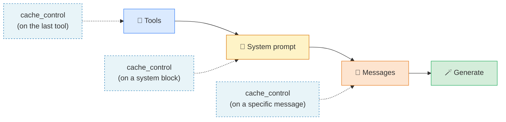

#### Rule 7 — Maximum **4 Breakpoints**


*Up to 4 breakpoints — partial caching at multiple change points*

You can add **at most 4 breakpoints** in total. For example, you can cache the tools and also add another breakpoint in the middle of the conversation history. This flexibility lets you cache differently depending on **which parts of the request change often and which parts stay fixed**.

#### Rule 8 — Minimum Length **1,024 Tokens**


*Minimum 1,024 tokens — caching is disallowed below the threshold*

Finally, the rule most often missed — **the content being cached must be at least 1,024 tokens**. This is not per-block but the **sum of all messages and blocks that are the cache target**.

- A plain "Hi there!" message falls far short of the threshold
- Duplicating the same content 500 times, or a genuinely long prompt, exceeds 1,024 and becomes eligible

> [!finding] "Which Parts Don't Change"
> L06's takeaway: *"The key to effective prompt caching is identifying which parts of your requests stay consistent across multiple calls and placing breakpoints strategically to maximize reuse while minimizing cache invalidation."*
> — In other words, finding **"what does not change"** is the essence of prompt caching design.

#### 8-Rules Checklist

> [!method] Prompt Caching Rules — Summary Checklist
> 1. ✅ You must **manually** add `cache_control: {"type": "ephemeral"}`
> 2. ✅ You must use the **longhand block form** (shorthand is not allowed)
> 3. ✅ Everything before the breakpoint must be **exactly identical** to hit (even a single "please" invalidates)
> 4. ✅ A breakpoint placed in a **later message** includes all earlier content
> 5. ✅ Not only text — **system / tools / images / tool_use / tool_result** are also cacheable
> 6. ✅ Processing order is **tools → system → messages**
> 7. ✅ At most **4 breakpoints**
> 8. ✅ Cache-target total must be **≥ 1,024 tokens**

> [!action] Practice Notebook
> 📂 `03-Exercises/Week_06/skilljar/S5_04_prompt_caching.ipynb`
> Experiment by duplicating the same content 500 times to force past 1,024 tokens, reproduce cache invalidation by changing a single word, and compare breakpoint placement at tools / system / messages positions.

> [!ref] Source: Skilljar L06 — Rules of prompt caching (287770)

---

### 2.3 Prompt Caching in Action (L07)

If L05-L06 were *"the why"* and *"the rules,"* L07 is the **practical implementation pattern**. A single powerful visual in L07 captures the whole point.


*Prompt caching in action — typical caching candidates: 6K system prompt + 1.7K tool schemas*

#### Where Caching Pays Off Most

L07 summarizes **the content types where caching has the highest value** in three items.

- **Large system prompts** — e.g., a 6K-token coding-assistant system prompt
- **Complex tool schemas** — e.g., around 1.7K tokens of schema across several tools
- **Repeated message content** — the fixed early portion of a conversation context

Key insight: *"caching only helps if you're repeatedly sending identical content — but in many applications, this happens extremely frequently."*

#### Caching Tool Schemas — A Safe Pattern

To cache tool schemas, add `cache_control` to the **last tool in the tool list**. L07's recommended method that **leaves the original untouched** looks like this.

```python
if tools:
    tools_clone = tools.copy()
    last_tool = tools_clone[-1].copy()
    last_tool["cache_control"] = {"type": "ephemeral"}
    tools_clone[-1] = last_tool
    params["tools"] = tools_clone
```

**Why clone**: modifying `tools[-1]["cache_control"] = ...` directly causes problems later when you rearrange the tools order. The double clone of **list copy + last-tool object copy** protects the original definitions.

#### Caching the System Prompt — Convert to Structured Form

A plain-string system prompt cannot carry cache_control. Convert it to a list of **text blocks + cache_control**.

```python
if system:
    params["system"] = [
        {
            "type": "text",
            "text": system,
            "cache_control": {"type": "ephemeral"}
        }
    ]
```

Using a structured list rather than a plain string lets you **cache the system portion on its own**.

#### Verifying Cache Behavior — Reading usage Fields

Once caching is enabled and you run requests, new fields appear in the **usage pattern of the response**.

- **First request**: `cache_creation_input_tokens=1772` — Claude **writes to the cache** (WRITE)
- **Follow-up request**: `cache_read_input_tokens=1772` — Claude **reads from the cache** (HIT)
- **Changed content**: new cache-creation tokens appear (partial cache WRITE)

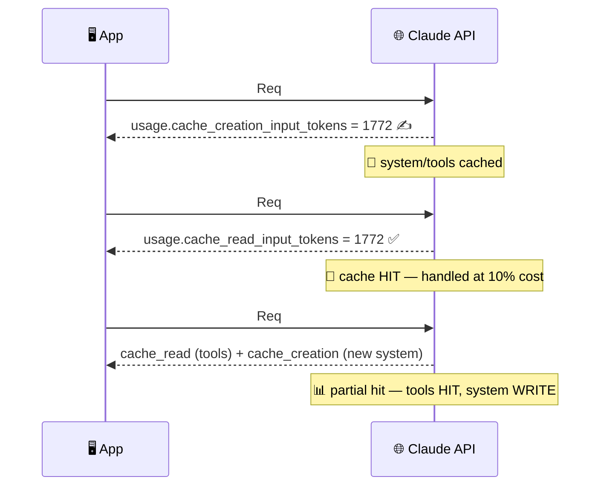

#### Multiple Breakpoints and Granular Caching

You can set multiple breakpoints in one request. The order is exactly as in L06's rules.

- **Tools** (if present)
- **System prompt** (if present)
- **Messages**

If system changes but tools do not, you get a partial hit — **tools portion cache HIT + system portion cache WRITE**. Thanks to this **granular caching**, you pay processing cost only on the portion that actually changed.

#### Cache Sensitivity and Target Scenarios

> [!tip] The Cache Collapses Under a Single Character
> L07's warning: *"The cache is extremely sensitive — changing even a single character in your tools or system prompt invalidates the entire cache for that component."* If frequently changing content sits in front, the cache is effectively useless, so **consciously separate "fixed" and "frequently changing" parts** and place the fixed part earlier. The cache only lives **one hour** — it is an optimization for **frequent API usage**, not long-term storage. Suitable scenarios: **consistent tool schemas**, **stable system prompts**, **repeated requests with similar context**.

#### Cache-ROI Decision Tree

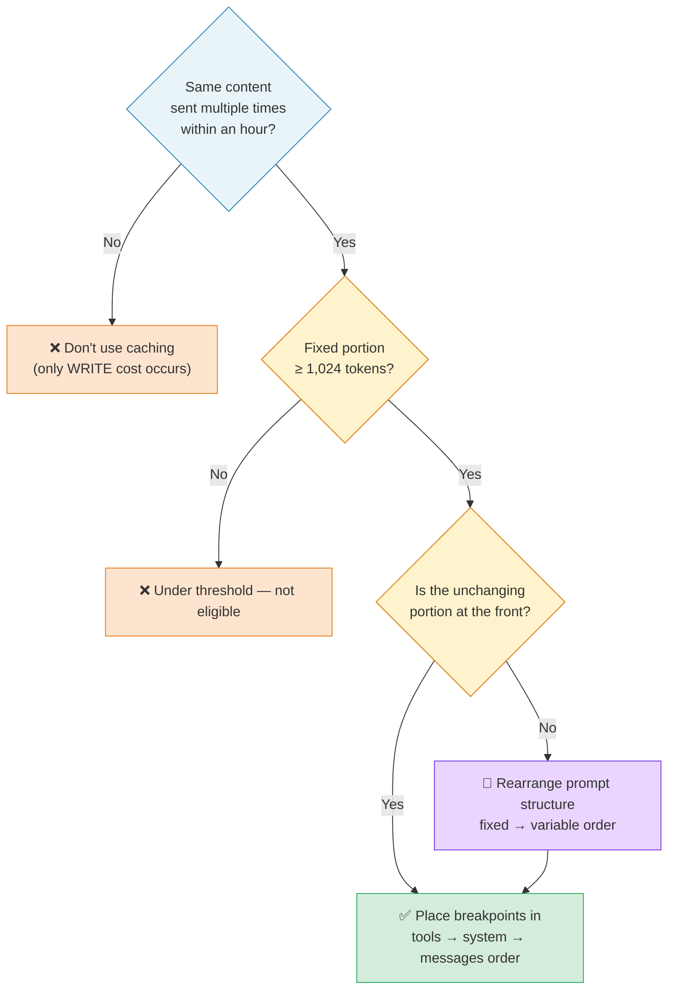

> [!action] Practice Notebook
> 📂 `03-Exercises/Week_06/skilljar/S5_04_prompt_caching.ipynb`
> Integrate the tools-clone pattern + system-list conversion into the actual `chat(...)` helper, and observe the transition from `cache_creation_input_tokens` → `cache_read_input_tokens` as the same request is repeated.

> [!ref] Source: Skilljar L07 — Prompt caching in action (287774)

---

### 2.4 Code Execution & Files API (L08)

The Anthropic API provides two features that are **far more powerful when used together** — the **Files API** and **Code Execution**. They may look separate in isolation, but together they open a powerful workflow for **safely delegating complex tasks to Claude**.

#### Files API — Reference by file_id Instead of Base64

The Files API lets you upload a file in advance and later **reference it by its file id**, rather than including images or PDFs as **base64 every time**.


*Files API flow — pre-upload → obtain file metadata → reference by id in subsequent messages*

Flow:
1. Upload the file (image, PDF, text, etc.) to Claude with a **separate API call**
2. Receive a **file-metadata object** containing a **unique file ID**
3. In subsequent messages, reference by **file ID instead of raw data**


*base64 inline vs Files API — Files API wins for file reuse and large-file handling*

It is especially useful when you must **reference the same file repeatedly** or when handling **large files that are burdensome to include in every request**.

#### Code Execution — Server-Side Python Execution

Code execution is a **server-based tool** — developers do not need to supply the implementation. By simply including a predefined tool schema in the request, Claude can selectively execute Python code in an **isolated Docker container**.


*Code execution environment — isolated Docker container, no network, repeated execution possible*

Key properties of the execution environment:
- Runs in an **isolated Docker container**
- **No network access** (can't make external API calls)
- Claude can **execute code multiple times** within a single conversation
- Results are interpreted by Claude and **integrated into the final response**

> [!tip] Meaning of Network Isolation
> *"No network access"* is a strong security constraint — Claude cannot make external API calls, reach internal systems, or query the internet. Therefore, **all data needed for analysis must be pre-uploaded via the Files API**. This inevitably motivates the **Files API + Code Execution combo** pattern in the next section.

#### Files API × Code Execution — The Perfect Combo

True power emerges when the two features are used **together**. Because the Docker container has no network, the Files API becomes the **primary channel to bring data into the execution environment and retrieve outputs**.


*Files API × Code Execution — upload → container_upload → execute → download*

A typical workflow:
1. **Upload the data file (CSV, etc.) via Files API**
2. Include the file ID in a **container upload block** inside the message
3. Request analysis
4. Claude **writes and runs code** that processes the file
5. **Download the generated output (plots, etc.)**

#### Worked Example — streaming.csv Churn Analysis

L08's concrete example is an analysis of **streaming-service data**. The CSV contains user information such as subscription tier, viewing habits, and churn status.


*streaming.csv example — column layout of subscription / viewing / churn*

First, upload the file with a helper.

```python
file_metadata = upload('streaming.csv')
```

Then build a message that bundles the **uploaded file + analysis request**.

```python
messages = []
add_user_message(
    messages,
    [
        {
            "type": "text",
            "text": """Run a detailed analysis to determine major drivers of churn.
            Your final output should include at least one detailed plot summarizing your findings."""
        },
        {"type": "container_upload", "file_id": file_metadata.id},
    ],
)

chat(
    messages,
    tools=[{"type": "code_execution_20250522", "name": "code_execution"}]
)
```

#### Understanding the Block Structure of the Response

When code execution is used, the response contains a **mix of several block types**.

- **Text blocks** — Claude's analysis and explanation
- **Server tool use blocks** — code that Claude decided to execute
- **Code execution tool result blocks** — results of running the code


*Diversified response blocks — text + server_tool_use + code_execution_output intermixed*

Claude can **execute code multiple times** within a single response — an **iterative** analysis pattern where it runs once, sees the result, writes new code, and runs again. Each execution cycle contains a **code + result** pair.

#### Downloading Generated Files

One of the most powerful capabilities is that Claude can **generate files such as plots and reports** for download. When a visualization is produced, it is stored in the container, then retrieved through the Files API.

Find blocks with `type: "code_execution_output"` in the response — they contain the file ID of the generated content.

```python
download_file("file_id_from_response")
```


*Final result — a professional visualization that would take significant manual coding, completed by Claude's automated execution*

The result is *"a comprehensive analysis with professional visualizations that would have required significant manual coding."*

#### Files API × Code Execution End-to-End Diagram

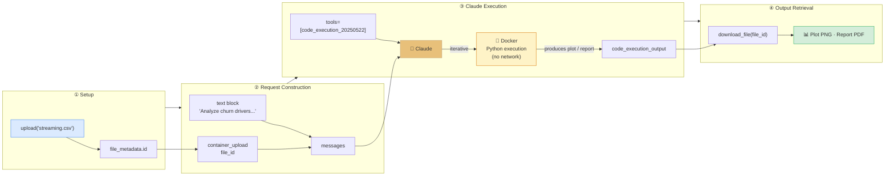

#### Beyond Data Analysis — Applications and the Value of Code Execution

Additional applications L08 notes: **image processing and conversion**, **document parsing and conversion**, **mathematical operations and modeling**, **custom formatted reports**. The core idea is to **delegate complex computational work to Claude while retaining I/O control via the Files API** — Claude becomes a coding assistant that *"can execute and iterate over solutions."*

> [!finding] Code Execution vs Extended Thinking
> Compensates one of the LLM's biggest weaknesses — **numerical-computation inaccuracy** — with **actual Python execution**. Extended Thinking only increases the LLM's internal reasoning depth (numerical errors still possible), while Code Execution **actually runs Python**, guaranteeing precise results from pandas / numpy / matplotlib. When *"numerical accuracy is decisive,"* Code Execution is **decisively advantageous**.

> [!action] Practice Notebook
> 📂 `03-Exercises/Week_06/skilljar/S5_05_code_execution.ipynb`
> Implement the Files API `upload()` helper, reproduce the streaming.csv analysis, declare the `code_execution_20250522` tool, parse `container_upload` message blocks + `code_execution_output` blocks, and retrieve generated plots via `download_file()`.

> [!ref] Source: Skilljar L08 — Code execution and the Files API (287777)

---

### 2.5 Domain Application — Using Features of Claude in Structural Engineering (Supplementary)

Let us weave the 6 features learned in Ch.1~2 into a single **structural engineering practice pipeline**. This section is a **domain-application design** beyond the Skilljar transcript and connects to `S5_07_structural_features.ipynb`.

#### Scenario — "Automated RC Beam Experiment Report Generation"

Assume the lab has the following inputs.
- 📐 **RC beam drawing images** (3 images) — L02 Image Support
- 📄 **KDS 14 20 22 PDF** (shear-design standards) — L03 PDF Support
- 📊 **Experimental data CSV** (per-specimen measurements) — L08 Files API

Request: *"Generate a report draft that cites drawings and standards clauses and validates the design formulas against the experimental data."*

#### Integrated Pipeline Diagram

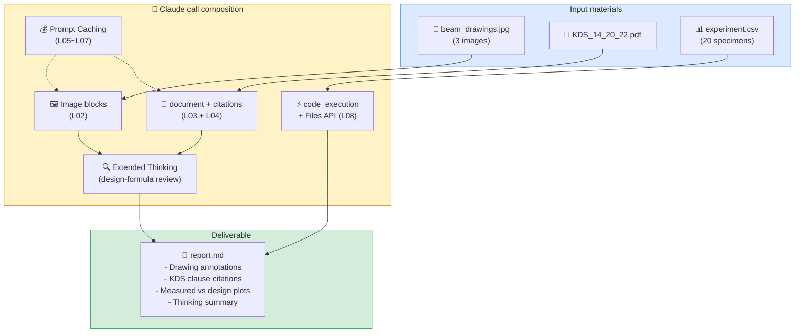

#### Feature-Mapping Table

| Step | Feature | Source Lesson | Structural Engineering Role |
| --- | --- | --- | --- |
| ① Drawing identification | Image Support | L02 | Auto-recognize RC beam cross sections and reinforcement layouts |
| ② Standards parsing | PDF Support | L03 | Extract KDS clauses, tables, design formulas |
| ③ Clause citation | Citations | L04 | Attach a KDS reference page to each design decision |
| ④ Design-formula review | Extended Thinking | L01 | Surface the reasoning for formula derivation and safety-factor judgment |
| ⑤ Repeated-analysis cost reduction | Prompt Caching | L05~L07 | ~90% discount when asking many questions against the same PDF |
| ⑥ Experimental statistics / plots | Code Execution + Files API | L08 | Scatter plots of measured vs design values via pandas / matplotlib |

#### 3 Domain-Application Patterns

- **Pattern A — On-Site Photo Safety Inspection**: Replace L02's Fire Risk 5-step template with a **4-grade crack-severity evaluation** (normal → rebar exposed) + thinking on (reasoning behind the judgment) + citations (KDS 14 20 50 repair/strengthening clause references)
- **Pattern B — Design Advisory Agent**: Fix 10 in-house design-standards PDFs as base context via Prompt Caching, append each project question afterward, and let Citations automatically footnote the relevant standards pages
- **Pattern C — Automated Experimental-Report Generator**: Upload .csv / .xlsx via Files API → compute pandas statistics + matplotlib plots via Code Execution + surface the basis for outlier judgment with Thinking on

#### Porting Skilljar Examples to the Domain

> [!method] 3 Steps to Port the L02 Template to the Domain
> 1. **Swap the grading system** — "Fire Risk 1-4" → "Crack grade 0-5" / "Damage level A-E"
> 2. **Swap analysis steps** — "residence identification → overhang → risk → defensible space → rating" → "member identification → defect region → severity → surrounding impact → grade"
> 3. **Fix the final output format** — reuse *"For each item above, write one sentence summarizing your findings, with your final response being the numerical rating."* verbatim

> [!tip] Caching Design in Domain Applications
> In a lab workflow, **KDS standards PDFs** and **experimental-methodology standard templates** repeat frequently. If you place these two at the **front of the message** and place a breakpoint, you can ask 100 follow-up questions in the same session with **virtually no additional cost**.

> [!action] Practice Notebook
> 📂 `03-Exercises/Week_06/skilljar/S5_07_structural_features.ipynb`
> Build the 3 patterns above (on-site safety inspection / design advisory / experimental-report generator) step by step. A domain end-to-end example that integrates all L01~L08 features into a single pipeline.

> [!ref] Supplementary — Domain Application References
> - [[Week_05]] S4_07 — RAG-based KDS retrieval pipeline (composable with caching)
> - [[Week_07]] — Repackage as an MCP server to connect with Claude Code
> - `02-Resources/허석재박사 강의/Seminar3` — 5-step structural-analysis prompt template

---

## [Chapter 3] Self-assessment & Summary

### 3.1 Concept-Check Quiz — Features of Claude (Q1~Q10)

> [!question] Q1. When Extended Thinking is enabled, what block is added to the `content` list in the response?
> A) `CodeBlock` — code-execution result
> B) `ThinkingBlock` — `type: "thinking"`, contains reasoning and signature
> C) `ToolUseBlock` — tool-call request
> D) `SystemBlock` — system-configuration info
>
> > [!tip]- Show Answer
> > **Answer: B)** Skilljar L01 explains that the response becomes *"a structured response containing two parts"* — a ThinkingBlock of `type: "thinking"` is added, followed by a TextBlock of `type: "text"` with the final answer. Each thinking block also contains a tamper-proof **cryptographic signature**. When flagged by the internal safety system, a `redacted_thinking` block may be returned instead (encrypted but must be carried through verbatim on the next turn to preserve context).

> [!question] Q2. Which parameter conditions must be observed when Extended Thinking is enabled?
> A) `thinking_budget >= 512`, no constraint on `max_tokens`
> B) `thinking_budget >= 1024`, `max_tokens > thinking_budget`
> C) `thinking_budget = max_tokens` enforced
> D) `temperature = 0` required
>
> > [!tip]- Show Answer
> > **Answer: B)** The implementation section of L01 states *"The minimum value is 1024 tokens, and your `max_tokens` parameter must be greater than your thinking budget."* Because `budget` is an **upper bound**, Claude may actually use less, but at least 1,024 is required and `max_tokens` must be larger to fit both thinking and the final answer. D)'s temperature is actually a separate warning — thinking-on **conflicts with default settings** alongside pre-filling.

> [!question] Q3. The **token cost formula** for image input and the **max resolution for a single image**?
> A) `tokens = w × h / 1000`, 4000px
> B) `tokens = (w × h) / 750`, 8000px (single), 2000px (multiple)
> C) `tokens = w + h`, 16000px
> D) Fixed 1,000 tokens per image, no resolution limit
>
> > [!tip]- Show Answer
> > **Answer: B)** Exactly the constraints listed in L02 — **tokens = (width px × height px) / 750**, max 8000px for a single image, max 2000px when sending multiple. Constraints also include **100 images** max per request and **5 MB** max per image.

> [!question] Q4. What is **Skilljar L02's core message** on how to raise image-input accuracy?
> A) Always maximize resolution
> B) Send only images and minimize text prompts
> C) Apply the same prompt-engineering techniques that work on text — step-by-step methodology, one-shot examples, subdivision — directly to images
> D) Choose a separate image-only model
>
> > [!tip]- Show Answer
> > **Answer: C)** L02 emphasizes *"the same prompting techniques that work for text apply to images. Invest time in crafting detailed, structured prompts rather than relying on simple questions if you want reliable results."* As the marble-counting example shows, a step-by-step prompt (*"1. identify each and number them → 2. re-verify with a different method"*) is decisively better than a naive *"How many marbles?"*.

> [!question] Q5. Which of the following is **not** one of the 4 elements to change when converting existing image code to PDF for Claude?
> A) Extension: `.png` → `.pdf`
> B) Block `type`: `"image"` → `"document"`
> C) `media_type`: `"image/png"` → `"application/pdf"`
> D) `role`: `"user"` → `"system"`
>
> > [!tip]- Show Answer
> > **Answer: D)** L03 specifies only **four changes** — (1) extension `.png` → `.pdf`, (2) variable name `image_bytes` → `file_bytes` (for clarity), (3) `type: "document"`, (4) `media_type: "application/pdf"`. The role is still user. The key insight: *"nearly identical code to what you'd use for images"* — minimum changes enable PDF support.

> [!question] Q6. Which field does Citations **not** return in the citation object?
> A) `cited_text` — verbatim document excerpt
> B) `document_index` / `document_title`
> C) `start_page_number` / `end_page_number`
> D) `confidence_score` — citation confidence score
>
> > [!tip]- Show Answer
> > **Answer: D)** The 5 core fields specified in L04 are **cited_text, document_index, document_title, start_page_number, end_page_number**. There is no confidence-score field. Note that for plain-text sources, **character positions** are returned instead of page numbers.

> [!question] Q7. Which is a rule that Prompt Caching **must** observe?
> A) Caching is automatic — no breakpoint needed
> B) Content up to the breakpoint must be **exactly identical** (one word change invalidates it), cache-target total **≥ 1,024 tokens**, at most **4** breakpoints, processing order **tools → system → messages**
> C) Breakpoints only go on text blocks — not images or tool blocks
> D) Cache TTL is 24 hours
>
> > [!tip]- Show Answer
> > **Answer: B)** The only option that includes all four rules from L06. A) directly contradicts L06's opening line *"Work done on messages is not cached automatically."* C) is wrong — L06 specifies *"cache breakpoints can be added to: System prompts, Tool definitions, Image blocks, Tool use and tool result blocks."* D)'s 24 hours is wrong — both L05 and L06 specify **one hour**.

> [!question] Q8. In the Prompt Caching response `usage` field, how do you confirm whether a **follow-up request read from the cache**?
> A) `usage.cache_creation_input_tokens` > 0 means HIT
> B) `usage.cache_read_input_tokens` > 0 means HIT; `cache_creation_input_tokens` indicates WRITE
> C) Check whether `usage.total_tokens` decreased
> D) Check the `response.from_cache == True` flag
>
> > [!tip]- Show Answer
> > **Answer: B)** L07 clearly distinguishes the first request's `cache_creation_input_tokens=1772` (WRITE) from the follow-up's `cache_read_input_tokens=1772` (HIT). On partial changes, **both fields can appear at once** (e.g., tools HIT, system newly WRITE). No single flag like `response.from_cache` exists.

> [!question] Q9. Which statement about Code Execution's execution environment is **wrong**?
> A) Runs in an isolated Docker container
> B) No network access (can't make external API calls)
> C) Can be executed multiple times during a single conversation
> D) Directly accesses Claude's local file system (the user's PC)
>
> > [!tip]- Show Answer
> > **Answer: D)** L08 defines the environment properties as *"Runs in an isolated Docker container / No network access / Claude can execute code multiple times during a single conversation / Results are captured and interpreted by Claude."* The user's local file system is never touched. **All data exchange flows through the Files API only** — this is the technical reason *"Files API + Code Execution pair well."*

> [!question] Q10. In a Code Execution response, what block type and API call are needed to **download a generated file**?
> A) `file_result` + `client.files.read()`
> B) `code_execution_output` + `download_file(file_id)`
> C) `image_block` + base64 decode
> D) `tool_use_result` + `response.content.save()`
>
> > [!tip]- Show Answer
> > **Answer: B)** L08 specifies *"Look for blocks with `type: 'code_execution_output'` in the response — these contain file IDs for generated content,"* and download is done via the `download_file("file_id_from_response")` helper. Internally it calls the Files API content fetch to save the binary locally.

#### Quiz Common-Mistake Review

> [!finding] Frequently Missed Points
> - **Q2's thinking_budget minimum** — often misremembered as 512. **1,024** is correct, with `max_tokens > thinking_budget`
> - **Q7's valid positions for ephemeral blocks** — memorizing "text only" misses tool_use / image / tool_result
> - **Q8's cache_read vs cache_creation** — names are similar and confusable — remember as a formula: creation=WRITE, read=HIT
> - **Q9's "local PC access"** — an attractive distractor. Claude never touches the user's local file system; all exchange flows through the Files API
> - **Q10's code_execution_output** — easy to confuse with `tool_result`. Code-execution output has a **dedicated block type**

> [!ref] Source
> - Skilljar L01-L08 transcripts (`_skilljar_s5_content.md`, 820 lines)
> - Skilljar Quiz — "Quiz on features of Claude"

---

### 3.2 Learning Summary

#### Cumulative Progress Table (W01 → W06)

| Week | Topic | Key Concepts | New This Week |
|:---:|:---|:---|:---|
| **W01** | LLM basics · 6 prompt techniques | Tokens, temperature, few-shot, CoT | 4D Framework, AI Fluency |
| **W02** | Claude API calls | messages.create, multi-turn, streaming | Claude API overview + CLAUDE.md |
| **W03** | Prompt engineering & evaluation | Systematic design, Eval Pipeline, Streamlit | Quantitative prompt evaluation |
| **W04** | Tool Use | JSON Schema, ToolUseBlock, tool_result | Connecting Claude ↔ external world |
| **W05** | RAG + hybrid search | Chunking, embedding, VectorIndex, BM25, RRF | Knowledge expansion + lexical-semantic fusion |
| **W06** | **Features of Claude** | **Extended Thinking, Vision, PDF, Citations, Caching, Code Execution** | **Reasoning + multimodal + cost optimization + Python execution** |

#### W06-Specific — Summary of L01~L08

> [!finding] Per-Lesson Summary of the 6 Features
>
> | Feature | One-Line Core | Decisive Numbers / Rules | Source |
> |:---|:---|:---|:---:|
> | Extended Thinking | "Claude's scratch paper" | `thinking_budget ≥ 1024`, `max_tokens > budget`, signature + redacted handling | L01 |
> | Image Support | "Text prompting = Image prompting" | 100/req, 5MB/img, 8000px(single)/2000px(multi), `tokens = w*h/750` | L02 |
> | PDF Support | "Almost same code as images" | `type: "document"`, `media_type: "application/pdf"` | L03 |
> | Citations | "Black box → transparent research assistant" | `citations: {"enabled": True}`, 5 fields, page/char ranges | L04 |
> | Prompt Caching (concept) | "Don't discard preprocessing" | TTL 1 hour, reuse tokenize · embed · context | L05 |
> | Rules of Caching | "Breakpoint is manual, identity is absolute" | longhand + `cache_control: ephemeral`, ≥1024 tokens, max 4, tools→system→messages | L06 |
> | Caching in Action | "Clone to protect the original" | `cache_creation_input_tokens` vs `cache_read_input_tokens` | L07 |
> | Code Execution + Files API | "Delegate Python to an isolated container" | `code_execution_20250522`, no network, `container_upload`, `download_file` | L08 |

#### Roadmap Mermaid — Beyond W06

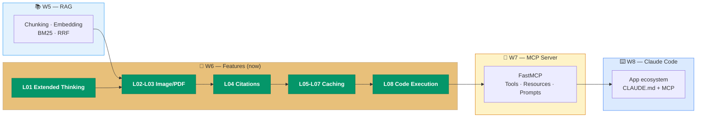

> [!tip] W06 → W07 Connection Points
> - **Caching design resembles MCP resource design** — the principle of "put the unchanging part at the front" is the same mindset as MCP's `resource` vs `tool` split
> - **The Files API concept connects directly with MCP's file/resource notion** — the way an MCP server returns a reference in W07 is already pre-experienced this week
> - **Code Execution is the prototype of the post-W07 agentic loop** — the sequence *"write code → run → choose next step from result"* expands to W09's agent loop

#### Three-Line Core Message

> [!result] W06 in 3 Lines
> 1. **Claude is no longer merely a text model** — Extended Thinking (reasoning), Image/PDF Support (vision, documents), Citations (sourcing), Caching (cost), Code Execution (computation) — **5 sensory organs** are now open at the API level.
> 2. **Each feature is activated with just a few extra lines** — `thinking={"type":"enabled",...}`, `"type": "image" | "document"`, `"citations": {"enabled": True}`, `"cache_control": {"type": "ephemeral"}`, `tools=[{"type": "code_execution_20250522"}]` — **memorizing the patterns** is the point.
> 3. **Respect the numbers and rules strictly** — thinking_budget ≥ 1024, images 100/5MB/8000px, cache ≥ 1024 tokens / 4 breakpoints / 1h, Code Execution no network — **without these numbers, production hits mysterious failures**.

---

## 💻 Exercises — S5 Features of Claude Track

> All notebooks live under `03-Exercises/Week_06/skilljar/`. This week's buildup consists of **7 stages**; later notebooks carry forward the helpers (`chat()`, `add_user_message()`, `upload()`, etc.) from earlier notebooks in a cumulative structure.

### Stage Buildup Diagram


### Notebook Details

| Notebook | Goal | Key Concepts / Exercises | Lessons |
|:---|:---|:---|:---:|
| `S5_01_extended_thinking.ipynb` | Understand thinking blocks | `thinking={"type":"enabled","budget":1024}`, block branching (thinking/redacted/text), signature check, forced-redacted test | L01 |
| `S5_02_images_pdf.ipynb` | Vision + PDF patterns | Base64/URL images, marble counting naive vs step-by-step, Fire Risk 5-step template, earth.pdf summary, image ↔ PDF code diff | L02, L03 |
| `S5_03_citations.ipynb` | Automatic source tracking | `title` + `citations: {enabled: True}`, parsing the citation list, plain-text char ranges, structuring footnote data for UI | L04 |
| `S5_04_prompt_caching.ipynb` | Cost optimization | longhand + `cache_control: ephemeral`, tracking `usage.cache_creation_input_tokens`, reproducing invalidation on a single-word change, tools-clone pattern, system-list conversion | L05, L06, L07 |
| `S5_05_code_execution.ipynb` | Python execution | `upload()` helper + `container_upload` block, `code_execution_20250522` tool, streaming.csv reproduction, `code_execution_output` parsing, `download_file` | L08 |
| `S5_06_practice.ipynb` | Student practice | Combine 3+ of the 6 features — build a mini pipeline with your own dataset / PDF | Integrated |
| `S5_07_structural_features.ipynb` | **Structural engineering domain application** — drawing analysis + KDS citations + Python analysis of experimental data + report generation | Integrates all 6 features, implements patterns A/B/C of §2.5, produces a `.md` report | Integrated + §2.5 |

> [!method] Suggested In-Class Exercise Order (2 hours + α)
> 1. **0:00~0:20** — `S5_01` thinking demo, compare results across budgets (2~3 math problems)
> 2. **0:20~0:50** — `S5_02` images + PDF patterns, compare marble-counting failure/success, try the Fire Risk template
> 3. **0:50~1:10** — `S5_03` citations — automatic citation generation on earth.pdf → build UI footnote data
> 4. **1:10~1:40** — `S5_04` quantify caching gains by repeated requests (same prompt × 5 → creation vs read token graph)
> 5. **1:40~2:00** — `S5_05` Files API upload + code_execution for CSV analysis + plot download
> 6. **2:00+** — `S5_06` student practice or `S5_07` structural engineering domain (pick one as extended homework)

> [!action] Submission Guide
> **Deadline**: by 23:59 the day before next week's class
> **Submissions**: the instructor-reproduction notebooks `S5_01`~`S5_05` (**required**) + an extended version of **either** `S5_06` **or** `S5_07` (**at least one**)
> **How to submit**: upload to the designated folder on the course Notion or Google Classroom (include student ID and name in the filename)
> **Evaluation perspective**: (1) API-parameter correctness (thinking_budget / cache_control / tool declarations), (2) robustness of response-block parsing (redacted / partial cache HIT / code_execution_output handling), (3) reproducibility of the domain application

> [!ref] Source
> - All notebooks: `03-Exercises/Week_06/skilljar/`
> - Underlying transcript: `01-Notes/_skilljar_s5_content.md` (Skilljar S5 L01~L08)
> - Official GitHub: [claude_features](https://github.com/anthropics/courses/tree/master/claude_features)

---

## 🤖 CC Skill — Subagents + Hooks

> [!tip] This Week's Claude Code Skill — Subagents + Hooks
> Per the syllabus (v2.3), W06 learns **Subagents** and **Hooks** as Claude Code skills. Both are precursors to **W07's MCP server development** and **W09's parallel-agent orchestration**. Deeper materials are organized in the auxiliary note [[Week_06_Subagents]] (ISA track).

### Why Subagents This Week

Complex work like the *"drawing analysis + KDS citations + Python analysis of experimental data + report generation"* seen in Ch.2 §2.5 blows up the context when a single Claude session tries to do it alone. We need a design that **splits tasks of different natures — file reading, analysis, code execution, document writing — in parallel** — this is the role of Subagents.

### Subagents Overview

Claude Code's **subagents** are child agents to which the main Claude delegates specific tasks. Each subagent runs in an **independent context** so that the main session is not polluted.

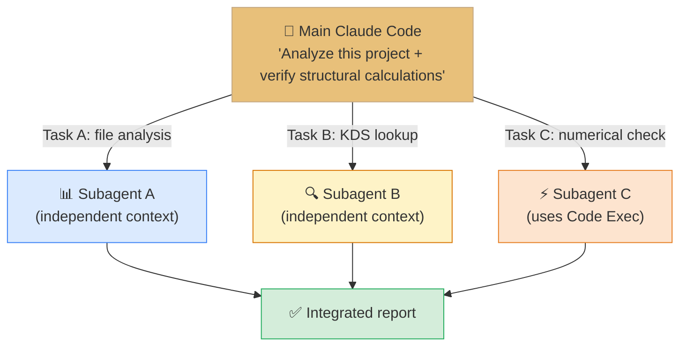

**4 Values of Subagents**

| Value | Description |
| --- | --- |
| **Parallelism** | Analyze multiple files/tasks simultaneously |
| **Context isolation** | Each subagent has an independent context — keeps the main session clean |
| **Specialization** | Give each subagent a specific role and system prompt |
| **Scalability** | Scale the number of subagents with project size |

### Subagent Definition — `.claude/agents/` Folder

In Claude Code, you define a subagent in a `.claude/agents/<name>.md` file. In the Week 06 context, you can keep a subagent named *"features-pipeline-runner"*.

```yaml
---
name: features-pipeline-runner
description: Runs the Week 06 Features (Extended Thinking · Vision · PDF · Citations · Caching · Code Exec) combination pipeline as a single task
tools: Read, Write, Bash
---

# System Prompt
You are the Features-of-Claude pipeline runner for the structural-engineering domain. Inputs: {drawing-image folder}, {KDS PDF}, {experiment CSV}.
Always enable Prompt Caching, and perform numerical computations through Code Execution.
The final output should be a report with Citations footnotes saved to `reports/<date>.md`.
```

### Hooks — Event-Driven Automation

**Hooks** are scripts that automatically respond to specific events in Claude Code. They execute automatic actions at moments such as file saves and before/after tool execution.

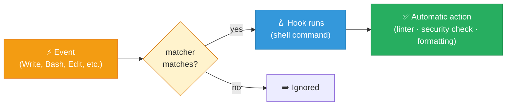

#### 4 Hook Events

| Hook | When | Example Use (W06 context) |
| --- | --- | --- |
| **PreToolUse** | **Before** tool execution | API-key leak check, missing `cache_control` warnings |
| **PostToolUse** | **After** tool execution | Auto-format saved code with ruff/black, clean notebook outputs |
| **Notification** | When awaiting user input | Slack notifications, long-run completion alerts |
| **Stop** | End of agent turn | Execution summary, log append, cost aggregation |

#### Sample `~/.claude/settings.json` Hook Configuration

```json
{
  "hooks": {
    "PreToolUse": [
      {
        "matcher": "write",
        "command": "python ~/.claude/scripts/check_api_keys.py \"$CLAUDE_FILE_PATH\""
      }
    ],
    "PostToolUse": [
      {
        "matcher": "write",
        "command": "ruff format \"$CLAUDE_FILE_PATH\" && ruff check --fix \"$CLAUDE_FILE_PATH\""
      }
    ],
    "Stop": [
      {
        "command": "echo \"$(date): turn end\" >> ~/.claude/logs/session.log"
      }
    ]
  }
}
```

| Field | Description |
| --- | --- |
| `matcher` | Tool name the hook responds to (`write`, `bash`, `edit`, etc.) |
| `command` | The shell command to execute |
| `$CLAUDE_FILE_PATH` | Path of the file detected by the hook (environment variable) |

### Subagents + Hooks = Week 06 Pipeline Automation

```mermaid
graph TD
    USER["👤 'Build a structural-drawing report'"] --> MAIN["🤖 Main Claude Code"]
    MAIN --> SA1["Subagent: Drawing analysis"]
    MAIN --> SA2["Subagent: KDS citations"]
    MAIN --> SA3["Subagent: Code Exec"]

    SA1 -->|"Write report_draft.md"| HPRE["🪝 PreToolUse<br/>API-key check"]
    SA2 -->|"Write citations.json"| HPRE
    SA3 -->|"Write plot.png"| HPRE
    HPRE --> SAVE["💾 File save"]
    SAVE --> HPOST["🪝 PostToolUse<br/>Format · lint"]
    HPOST --> DONE["✅ Final report"]

    style MAIN fill:#e8c07a,stroke:#c4a882,color:#333
    style HPRE fill:#f39c12,stroke:#e67e22,color:#fff
    style HPOST fill:#3498db,stroke:#2980b9,color:#fff
    style DONE fill:#d4edda,stroke:#27ae60
```

> [!method] Subagents + Hooks Checklist
> 1. **Define `.claude/agents/<role>.md`** — YAML frontmatter (`name`, `description`, `tools`) + system prompt
> 2. **Choose hook events** — Pre for security checks, Post for formatting, Stop/Notification for alerts
> 3. **Matcher correctness** — confusing `"write"` and `"bash"` stops hooks from firing
> 4. **Use environment variables** — `$CLAUDE_FILE_PATH`, `$CLAUDE_PROJECT_DIR`, etc.
> 5. **Parallelism management** — if several subagents modify the same file simultaneously, conflicts arise → design file-region separation

### Supplementary Deep-Dive — Intro to Subagents Track (ISA)

> [!action] Supplementary Practice Notebooks — Auxiliary Track (ISA Track)
> 📂 `03-Exercises/Week_06/skilljar/ISA_01_subagent_basics.ipynb`
> 📂 `03-Exercises/Week_06/skilljar/ISA_02_subagent_design.ipynb`
> 📂 `03-Exercises/Week_06/skilljar/ISA_03_subagent_orchestration.ipynb`
> Anthropic Skilljar *"Introduction to Subagents"* is arranged as a W06 auxiliary track — subagent definition syntax, independent-context management, and parallel-orchestration patterns in 3 stages. Recommended as self-directed deep-dive (mode ②) after class.

### Supplementary Pre-Read — Intro to MCP (W07 Prep)

> [!action] W07 Pre-Read Notebooks — Auxiliary Track (IMCP Track)
> 📂 `03-Exercises/Week_06/skilljar/IMCP_01_mcp_overview.ipynb`
> 📂 `03-Exercises/Week_06/skilljar/IMCP_02_mcp_client_server.ipynb`
> 📂 `03-Exercises/Week_06/skilljar/IMCP_03_fastmcp_intro.ipynb`
> 📂 `03-Exercises/Week_06/skilljar/IMCP_04_tools_resources.ipynb`
> 📂 `03-Exercises/Week_06/skilljar/IMCP_05_prompts.ipynb`
> 📂 `03-Exercises/Week_06/skilljar/IMCP_06_inspector.ipynb`
> 📂 `03-Exercises/Week_06/skilljar/IMCP_07_client_impl.ipynb`
> The 7 lessons of Anthropic Skilljar *"Introduction to MCP."* Distributed as **W07 pre-read (mode ①)** — recommended to complete before next week's lecture. Hands-on experience with IMCP's MCP server, client, and Inspector decisively elevates understanding of the FastMCP exercises in W07.

### CC Skill Integrated Diagram

```mermaid
graph LR
    subgraph W5["W5 CC Skill"]
        SK["Skills · Commands"]
    end
    subgraph W6["W6 CC Skill (now)"]
        SA["Subagents"]
        HK["Hooks"]
    end
    subgraph W7["W7 CC Skill"]
        MCP["Multi-agent · Agent SDK"]
    end

    SK --> SA
    SA --> HK
    HK --> MCP

    style W5 fill:#e3f2fd,stroke:#2196f3
    style W6 fill:#e8c07a,stroke:#c4a882,color:#333
    style W7 fill:#fef3c7,stroke:#d97706
```

> [!ref] CC Skill References
> - [Claude Code — Subagents](https://docs.claude.com/en/docs/claude-code/sub-agents)
> - [Claude Code — Hooks](https://docs.claude.com/en/docs/claude-code/hooks)
> - Auxiliary note: [[Week_06_Subagents]] (ISA track deep-dive)
> - Auxiliary note: [[Week_06_IntroMCP]] (IMCP track, W07 pre-read)

---

## 📚 References

> [!ref] Official Skilljar Materials (primary source for this lecture)
> - Course home: [Building with the Claude API — Skilljar](https://anthropic.skilljar.com/claude-with-the-anthropic-api)
> - Section S5 (Features of Claude): L01~L08 — Extended Thinking / Image / PDF / Citations / Caching / Code Execution
> - Transcript original: `01-Notes/_skilljar_s5_content.md` (820 lines, collected 2026-04-20)
> - Preceding section S4 (RAG): [[Week_05]]
> - Subsequent section S6 (MCP): [[Week_07]]
> - Official GitHub: [anthropics/courses — claude_features](https://github.com/anthropics/courses/tree/master/claude_features)

> [!ref] Related Skilljar Courses (auxiliary tracks)
> - [Introduction to Subagents](https://anthropic.skilljar.com/introduction-to-subagents) — ISA track, W06 self-directed deep-dive (②)
> - [Introduction to MCP](https://anthropic.skilljar.com/introduction-to-mcp) — IMCP track, W07 pre-read (①)
> - [Claude Code 101](https://anthropic.skilljar.com/claude-code-101) — Claude Code introduction (W01 prerequisite)
> - [Claude Code in Action](https://anthropic.skilljar.com/claude-code-in-action) — practical deep-dive

> [!ref] Anthropic Official Documentation
> - [Extended Thinking](https://docs.anthropic.com/en/docs/build-with-claude/extended-thinking) — includes feature compatibility (L01 essential reference)
> - [Vision (Image Support)](https://docs.anthropic.com/en/docs/build-with-claude/vision)
> - [PDF Support](https://docs.anthropic.com/en/docs/build-with-claude/pdf-support)
> - [Citations](https://docs.anthropic.com/en/docs/build-with-claude/citations)
> - [Prompt Caching](https://docs.anthropic.com/en/docs/build-with-claude/prompt-caching) — official definitions for cache_control / ephemeral / minimum tokens
> - [Code Execution](https://docs.anthropic.com/en/docs/build-with-claude/tool-use/code-execution)
> - [Files API](https://docs.anthropic.com/en/api/files)
> - [Claude Code — Subagents](https://docs.claude.com/en/docs/claude-code/sub-agents)
> - [Claude Code — Hooks](https://docs.claude.com/en/docs/claude-code/hooks)

> [!ref] Anthropic Cookbook (practical examples)
> - [anthropic-cookbook — extended_thinking](https://github.com/anthropics/anthropic-cookbook/tree/main/extended_thinking)
> - [anthropic-cookbook — multimodal](https://github.com/anthropics/anthropic-cookbook/tree/main/multimodal)
> - [anthropic-cookbook — prompt_caching](https://github.com/anthropics/anthropic-cookbook/tree/main/misc/prompt_caching.ipynb)
> - [anthropic-cookbook — tool_use (includes code_execution)](https://github.com/anthropics/anthropic-cookbook/tree/main/tool_use)

> [!ref] Academic / Industry References
> - Wei, J. et al. (2022), "Chain-of-Thought Prompting Elicits Reasoning in Large Language Models", NeurIPS 2022, arXiv:2201.11903 — theoretical background for Extended Thinking
> - Yang, Z. et al. (2023), "MM-REACT: Prompting ChatGPT for Multimodal Reasoning and Action", arXiv:2303.11381 — Vision + reasoning combination pattern
> - Lewis, P. et al. (2020), "Retrieval-Augmented Generation for Knowledge-Intensive NLP Tasks", NeurIPS 2020, arXiv:2005.11401 — background for the combination of W05 RAG and W06 Citations
> - Anthropic (2024) — "Prompt caching with Claude" official blog

> [!ref] Structural Engineering Domain References
> - KDS 14 20 22 — Concrete-structure shear-design standard (§2.5 practice material)
> - KDS 14 30 25 — Steel-structure limit-state design method
> - `02-Resources/허석재박사 강의/Seminar3` — 5-stage structural-analysis prompt template (Solver → Self-Improvement → Verifier → Correction → Synthesis)
> - [[Week_05]] S4_07 — KDS RAG pipeline (combinable with Citations)

---

## Related

- Previous: [[Week_05|Week 05: RAG + Hybrid Search (S4)]] — knowledge expansion · lexical-semantic search fusion
- Next: [[Week_07|Week 07: MCP Server Development (S6)]] — repackage Features as an MCP server and connect with Claude Code
- Auxiliary (deep-dive): [[Week_06_Subagents|Introduction to Subagents]] — ISA track, CC skill deep-dive (mode ② self-directed)
- Auxiliary (pre-read): [[Week_06_IntroMCP|Introduction to MCP]] — IMCP track, W07 pre-read (mode ① Pre-read)
