# 6주차 보충: 서브에이전트 입문 — Introduction to Subagents

---

## 📌 강의 중점

**Ch.1 서브에이전트의 이해와 생성 (Understanding & Creating Subagents)**
- **서브에이전트란?**: Claude Code가 작업을 위임하는 독립적 도우미 — 별도 컨텍스트 윈도우에서 작업 후 요약만 반환
- **컨텍스트 윈도우 관리**: 메인 스레드의 컨텍스트를 깨끗하게 유지하는 핵심 전략
- **내장 서브에이전트**: General purpose, Explore, Plan 등 기본 제공 에이전트 활용
- **커스텀 서브에이전트 생성**: `/agents` 명령으로 프로젝트/사용자 수준 에이전트 정의
- **설정 파일 구조**: YAML 프론트매터 + 마크다운 시스템 프롬프트

**Ch.2 효과적인 서브에이전트 설계와 활용 (Designing & Using Subagents Effectively)**
- **Description 설계**: 메인 에이전트의 위임 결정과 입력 프롬프트를 동시에 제어하는 핵심 필드
- **구조화된 출력 포맷**: 자연스러운 종료 지점과 일관된 보고서 구조 정의
- **장애물 보고**: 서브에이전트가 발견한 워크어라운드를 메인 스레드에 전달
- **도구 접근 제한**: 읽기 전용 / 리뷰어 / 수정 에이전트별 최소 권한 원칙
- **활용 패턴과 안티패턴**: 연구, 코드 리뷰, 커스텀 프롬프트 vs 전문가 주장, 파이프라인, 테스트 러너

**실라버스 보충**: Hooks 시스템 연계, Skills의 `context: fork`를 통한 격리 실행

---

## 🎯 학습 목표

학습 완료 후 다음을 수행할 수 있습니다:

**Ch.1 서브에이전트의 이해와 생성**
- 서브에이전트가 메인 컨텍스트 윈도우를 보호하는 메커니즘 (별도 컨텍스트 → 요약 반환 → 중간 과정 폐기)을 설명할 수 있다
- 내장 서브에이전트 (General purpose, Explore, Plan)의 용도와 차이를 구분할 수 있다
- `/agents` 명령으로 프로젝트 수준 또는 사용자 수준의 커스텀 서브에이전트를 생성할 수 있다
- YAML 프론트매터 (name, description, tools, model, color)의 각 필드 역할을 설명하고 직접 작성할 수 있다
- 도구 카테고리 (Read-only, Edit, Execution, MCP, Other)를 서브에이전트의 역할에 맞게 선택할 수 있다

**Ch.2 효과적인 서브에이전트 설계와 활용**
- Description 필드가 서브에이전트 트리거와 입력 프롬프트 생성에 미치는 이중 역할을 이해하고 활용할 수 있다
- 구조화된 출력 포맷 (Summary, Critical Issues, Recommendations 등)을 설계하여 서브에이전트의 보고 품질을 향상시킬 수 있다
- 장애물 보고 섹션을 포함하여 메인 스레드의 재발견 비용을 줄일 수 있다
- 연구/리뷰/코드 수정 각 유형에 적합한 도구 접근 수준을 결정할 수 있다
- 서브에이전트가 효과적인 상황 (연구, 코드 리뷰, 커스텀 프롬프트)과 비효과적인 상황 (전문가 주장, 순차 파이프라인, 테스트 실행)을 구분하여 판단할 수 있다

**통합 역량**
- Claude Code에서 건축공학 프로젝트에 특화된 서브에이전트 (구조 검토, 도면 분석, 문서화)를 직접 설계하고 배포할 수 있다

---

## 🤔 왜 배우는가? — "AI에게 팀원을 배정하다"

> [!question] Week 05에서 Claude Code의 **Skills과 Commands**를 배웠다. Week 06 보충에서는 Claude Code에게 **독립적으로 일하는 팀원(서브에이전트)을 배정하는 법**을 배운다.

### 단일 에이전트의 한계

Claude Code와 긴 대화를 나누다 보면, 모든 파일 읽기, 검색, 도구 호출 결과가 하나의 컨텍스트 윈도우에 쌓인다. 이 공간은 유한하며, 가득 차면 Claude는 대화 초반의 내용을 잊기 시작한다. **서브에이전트는 이 한계를 해결한다** — 탐색 작업을 별도 공간에서 처리하고 결과 요약만 돌려준다.

### Skills → Subagents 진화

| Week 05: Skills & Commands | Week 06 보충: Subagents |
| --- | --- |
| 재사용 가능한 명령 패턴 | 독립적으로 사고하는 **팀원** |
| 메인 컨텍스트에서 실행 | **별도 컨텍스트**에서 실행 |
| 도구 조합을 패턴화 | 도구 접근을 **역할별로 제한** |
| 수동 호출 | 자동 위임 가능 (`proactively`) |

### 이번 보충 강의의 프로젝트: 건축 프로젝트 리뷰 팀

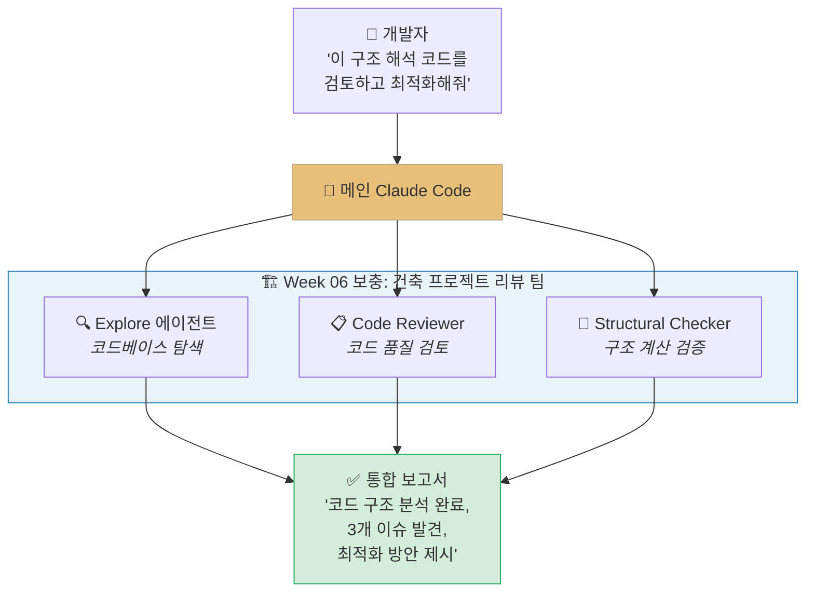
```mermaid
graph TD
    subgraph PROJECT["🏗️ Week 06 보충: 건축 프로젝트 리뷰 팀"]
        SA1["🔍 Explore 에이전트<br/><i>코드베이스 탐색</i>"]
        SA2["📋 Code Reviewer<br/><i>코드 품질 검토</i>"]
        SA3["📐 Structural Checker<br/><i>구조 계산 검증</i>"]
    end

    U["👤 개발자<br/>'이 구조 해석 코드를<br/>검토하고 최적화해줘'"] --> C["🤖 메인 Claude Code"]
    C --> SA1
    C --> SA2
    C --> SA3
    SA1 --> R["✅ 통합 보고서<br/>'코드 구조 분석 완료,<br/>3개 이슈 발견,<br/>최적화 방안 제시'"]
    SA2 --> R
    SA3 --> R

    style PROJECT fill:#e8f4f8,stroke:#2980b9
    style C fill:#e8c07a,stroke:#c4a882,color:#333
    style R fill:#d4edda,stroke:#27ae60
```

메인 Claude Code는 개발자의 요청을 이해하고, 적절한 서브에이전트들에게 **작업을 분배**한다. 각 서브에이전트는 자신의 전문 영역에서 독립적으로 작업하고, 결과만 메인 스레드로 보고한다.

### Anthropic Skilljar 코스

이 강의노트는 Anthropic 공식 교육 플랫폼 Skilljar의 **"Introduction to Subagents"** (4개 레슨)를 기반으로 구성되었으며, 실라버스의 보충 내용 (Hooks, Skills 연계)을 포함한다.

> [!ref] 소스 매핑
> - 온라인 코스: [Introduction to Subagents](https://anthropic.skilljar.com/introduction-to-subagents)
> - 실라버스 매핑: **Week 06 CC 스킬: Subagents + Hooks** (v2.3 기준)
> - 관련 문서: [Claude Code Subagents](https://docs.anthropic.com/en/docs/claude-code/sub-agents), [Claude Code Hooks](https://docs.anthropic.com/en/docs/claude-code/hooks)

---

## [Chapter 1] 서브에이전트의 이해와 생성 (Lessons 1-2)

### 1.1 서브에이전트란? (What are Subagents?)

서브에이전트는 Claude Code가 작업을 **위임**할 수 있는 전문화된 도우미다. 팀장이 팀원에게 업무를 분배하듯, 각 서브에이전트는 자신만의 **별도 대화 컨텍스트 윈도우**에서 작업하고, 완료되면 요약만 메인 스레드로 반환한다. 중간 과정 — 파일 읽기, 검색, 도구 호출 — 은 모두 격리되어 메인 대화를 어지럽히지 않는다.

#### 왜 서브에이전트가 필요한가?

Claude Code와 대화할 때마다 메인 컨텍스트 윈도우에 내용이 추가된다. 모든 도구 호출, 파일 읽기, 검색 결과가 이 공간에 저장되며, 이 공간은 유한하다. 가득 차면 Claude는 대화 초반의 내용을 추적하지 못하게 된다.

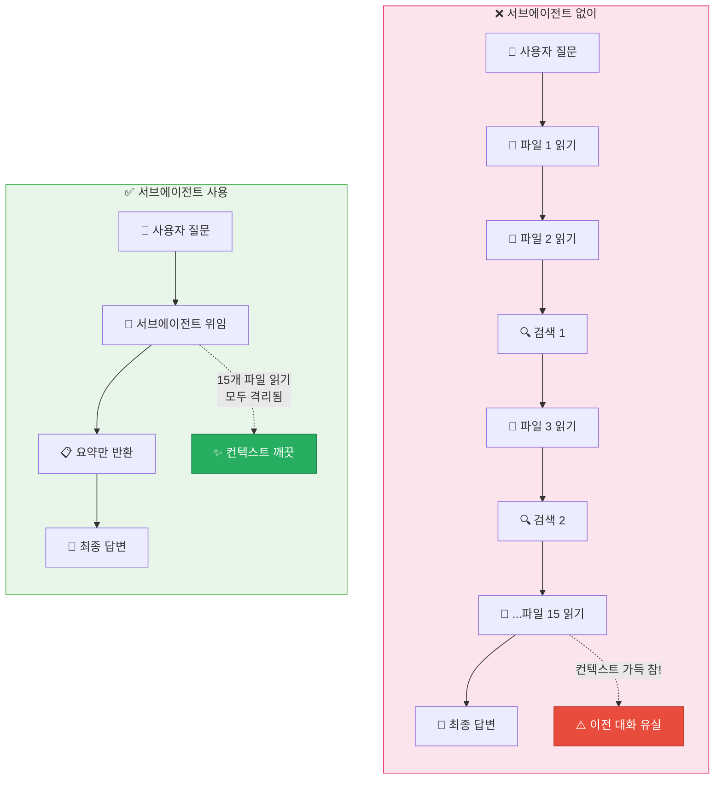
```mermaid
graph TB
    subgraph WITHOUT["❌ 서브에이전트 없이"]
        direction TB
        M1["💬 사용자 질문"] --> F1["📄 파일 1 읽기"]
        F1 --> F2["📄 파일 2 읽기"]
        F2 --> F3["🔍 검색 1"]
        F3 --> F4["📄 파일 3 읽기"]
        F4 --> F5["🔍 검색 2"]
        F5 --> F6["📄 ...파일 15 읽기"]
        F6 --> A1["💬 최종 답변"]
        F6 -.->|"컨텍스트 가득 참!"| OOM["⚠️ 이전 대화 유실"]
    end

    subgraph WITH["✅ 서브에이전트 사용"]
        direction TB
        M2["💬 사용자 질문"] --> SA["🤖 서브에이전트 위임"]
        SA --> SUM["📋 요약만 반환"]
        SUM --> A2["💬 최종 답변"]
        SA -.->|"15개 파일 읽기<br/>모두 격리됨"| CLEAN["✨ 컨텍스트 깨끗"]
    end

    style WITHOUT fill:#fce4ec,stroke:#e91e63
    style WITH fill:#e8f5e9,stroke:#4caf50
    style OOM fill:#e74c3c,stroke:#c0392b,color:#fff
    style CLEAN fill:#27ae60,stroke:#1e8449,color:#fff
```

#### 서브에이전트 동작 메커니즘

서브에이전트는 다음 **두 가지 입력**을 받아 작동한다:

1. **커스텀 시스템 프롬프트**: 설정 파일에서 정의한 서브에이전트의 역할과 행동 규칙
2. **태스크 설명**: 메인 에이전트가 사용자의 요청을 기반으로 작성한 작업 지시

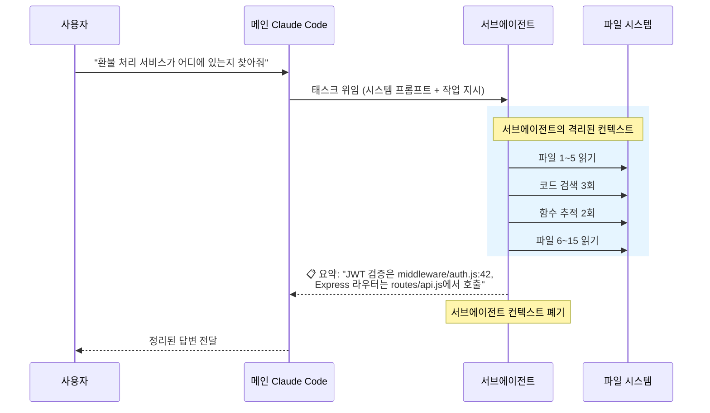
```mermaid
sequenceDiagram
    participant U as 사용자
    participant M as 메인 Claude Code
    participant S as 서브에이전트
    participant FS as 파일 시스템

    U->>M: "환불 처리 서비스가 어디에 있는지 찾아줘"
    M->>S: 태스크 위임 (시스템 프롬프트 + 작업 지시)
    
    rect rgb(230, 245, 255)
        Note over S,FS: 서브에이전트의 격리된 컨텍스트
        S->>FS: 파일 1~5 읽기
        S->>FS: 코드 검색 3회
        S->>FS: 함수 추적 2회
        S->>FS: 파일 6~15 읽기
    end
    
    S-->>M: 📋 요약: "JWT 검증은 middleware/auth.js:42,<br/>Express 라우터는 routes/api.js에서 호출"
    Note over S: 서브에이전트 컨텍스트 폐기
    M-->>U: 정리된 답변 전달
```

서브에이전트가 작업을 마치면, **요약만 메인 대화로 돌아오고** 서브에이전트의 전체 대화는 폐기된다. 이렇게 하면 메인 컨텍스트에는 질문과 요약만 기록된다 — 15개 파일을 읽은 과정은 포함되지 않는다.

> [!tip] 핵심 트레이드오프
> 서브에이전트를 사용하면 메인 컨텍스트가 깨끗해지는 대신, 서브에이전트가 어떻게 결론에 도달했는지의 **가시성을 잃는다**. 중간 과정이 중요하지 않은 작업에 적합하다.

#### 실전 예시: 익숙하지 않은 코드베이스 탐색

서브에이전트 **없이**: Claude가 15개 파일을 읽고, 여러 검색을 수행하고, 함수 호출을 추적한다. 이 모든 것이 컨텍스트 윈도우를 채워버린다 — 정작 필요한 것은 하나의 사실뿐인데도.

서브에이전트 **사용 시**: 질문을 하면 Explore 서브에이전트가 실행되어 자체 컨텍스트에서 탐색하고, 핵심 답변만 반환한다. 메인 컨텍스트에는 질문과 요약만 기록된다.

#### 내장 서브에이전트

Claude Code에는 즉시 사용할 수 있는 **내장 서브에이전트**가 포함되어 있다:

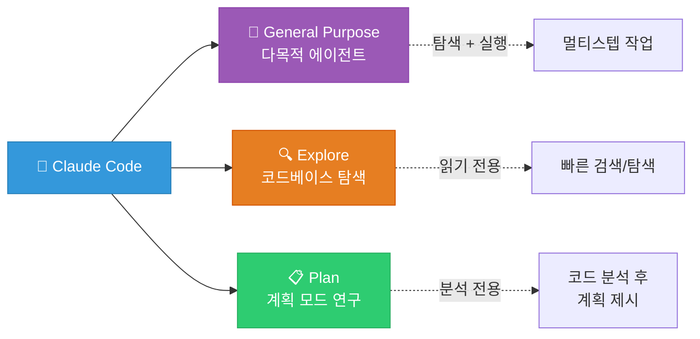
```mermaid
graph LR
    CC["🤖 Claude Code"] --> GP["🔧 General Purpose<br/>다목적 에이전트"]
    CC --> EX["🔍 Explore<br/>코드베이스 탐색"]
    CC --> PL["📋 Plan<br/>계획 모드 연구"]

    GP -.->|"탐색 + 실행"| G1["멀티스텝 작업"]
    EX -.->|"읽기 전용"| E1["빠른 검색/탐색"]
    PL -.->|"분석 전용"| P1["코드 분석 후<br/>계획 제시"]

    style CC fill:#3498db,stroke:#2980b9,color:#fff
    style GP fill:#9b59b6,stroke:#8e44ad,color:#fff
    style EX fill:#e67e22,stroke:#d35400,color:#fff
    style PL fill:#2ecc71,stroke:#27ae60,color:#fff
```

| 서브에이전트 | 용도 | 도구 접근 | 사용 시점 |
| --- | --- | --- | --- |
| **General Purpose** | 탐색과 실행을 모두 수행하는 다목적 에이전트 | 전체 | 복잡한 멀티스텝 작업 |
| **Explore** | 코드베이스를 빠르게 검색하고 탐색 | 읽기 전용 | 코드 구조 파악, 함수 위치 찾기 |
| **Plan** | Plan 모드에서 코드를 분석하고 계획 수립 | 읽기 전용 | 계획 수립 전 코드 조사 |

#### 커스텀 서브에이전트

내장 에이전트 외에도, **커스텀 시스템 프롬프트와 도구 접근 권한**을 가진 자신만의 서브에이전트를 만들 수 있다. 코드 리뷰어, 테스트 작성자, 문서 생성기 등 워크플로에 맞는 전문 에이전트를 정의할 수 있다.

> [!finding] 서브에이전트 3대 이점
> 1. **작업 분할**: 각 서브에이전트가 특정 작업에 집중
> 2. **컨텍스트 보호**: 중간 작업을 격리하여 메인 윈도우 오염 방지
> 3. **핵심 정보만 반환**: 간결한 요약으로 필요한 정보만 전달

> [!ref] 소스
> - Skilljar L01: What are subagents? (450698)

---

### 1.2 서브에이전트 생성 (Creating a Subagent)

Claude Code의 내장 서브에이전트 외에도, 특정 작업에 전문화된 **커스텀 서브에이전트**를 만들 수 있다. 커스텀 서브에이전트는 YAML 프론트매터를 포함한 **마크다운 파일**로 정의된다.

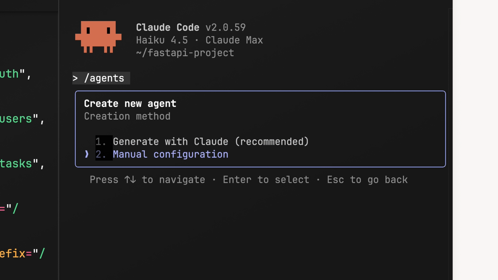
*서브에이전트 생성 --- /agents 명령을 통한 커스텀 서브에이전트 생성 과정*

#### `/agents` 명령으로 생성

서브에이전트를 만드는 가장 쉬운 방법은 `/agents` 슬래시 명령을 사용하는 것이다. 이 명령은 서브에이전트 관리 인터페이스를 열어준다.

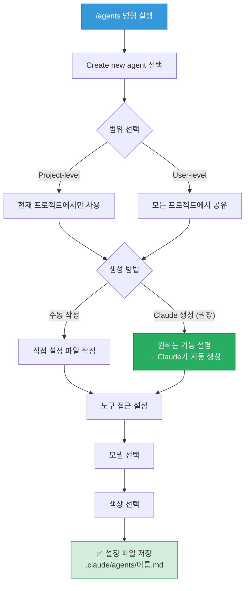
```mermaid
flowchart TD
    START["/agents 명령 실행"] --> CHOOSE["Create new agent 선택"]
    CHOOSE --> SCOPE{"범위 선택"}
    SCOPE -->|"Project-level"| PROJ["현재 프로젝트에서만 사용"]
    SCOPE -->|"User-level"| USER["모든 프로젝트에서 공유"]
    
    PROJ --> METHOD{"생성 방법"}
    USER --> METHOD
    METHOD -->|"수동 작성"| MANUAL["직접 설정 파일 작성"]
    METHOD -->|"Claude 생성 (권장)"| AUTO["원하는 기능 설명<br/>→ Claude가 자동 생성"]
    
    MANUAL --> TOOLS["도구 접근 설정"]
    AUTO --> TOOLS
    TOOLS --> MODEL["모델 선택"]
    MODEL --> COLOR["색상 선택"]
    COLOR --> DONE["✅ 설정 파일 저장<br/>.claude/agents/이름.md"]

    style START fill:#3498db,stroke:#2980b9,color:#fff
    style AUTO fill:#27ae60,stroke:#1e8449,color:#fff
    style DONE fill:#d4edda,stroke:#27ae60
```

**생성 단계**:

1. **범위 선택**: 프로젝트 수준 (현재 프로젝트만) 또는 사용자 수준 (모든 프로젝트에서 공유)
2. **생성 방법**: 직접 작성하거나, Claude에게 원하는 기능을 설명하여 자동 생성 (권장)
3. **도구 커스터마이징**: 서브에이전트가 접근할 수 있는 도구 카테고리 선택
4. **모델 선택**: Haiku / Sonnet / Opus / Inherit
5. **색상 선택**: UI에서 서브에이전트를 구분하기 위한 색상

#### 도구 카테고리 커스터마이징

서브에이전트 생성 시, 접근 가능한 도구를 **카테고리별로** 선택할 수 있다:

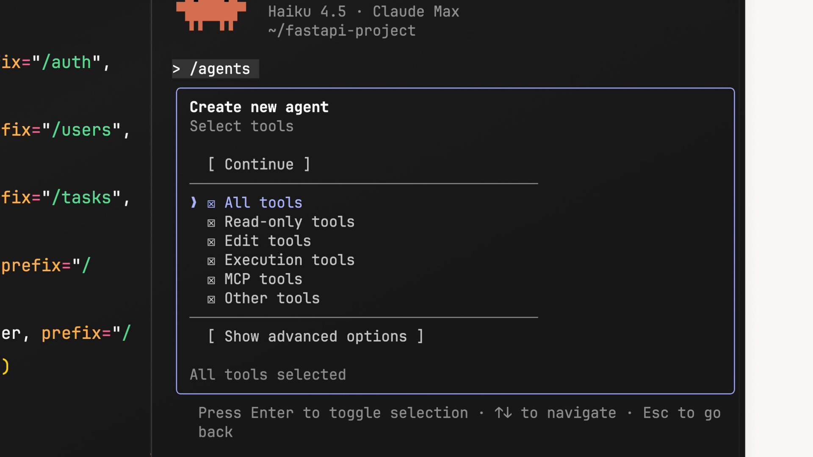
*서브에이전트 설정 --- 도구 카테고리와 모델 선택 구성*

| 카테고리 | 포함 도구 | 사용 시나리오 |
| --- | --- | --- |
| **Read-only tools** | Glob, Grep, Read | 코드 분석, 탐색, 리서치 |
| **Edit tools** | Edit, Write, MultiEdit | 코드 수정, 파일 생성 |
| **Execution tools** | Bash | 명령어 실행, 빌드, 테스트 |
| **MCP tools** | MCP 서버 도구 | 외부 서비스 연동 |
| **Other tools** | WebFetch, WebSearch 등 | 웹 검색, 외부 정보 |

> [!tip] 최소 권한 원칙
> 서브에이전트가 **실제로 필요한 도구만** 부여한다. 코드 리뷰어는 편집 도구가 필요 없고, 리서치 에이전트는 코드를 변경해서는 안 된다. 역할에 맞지 않는 도구는 의도치 않은 부작용을 일으킬 수 있다.

#### 모델 선택

| 모델 | 특징 | 적합한 작업 |
| --- | --- | --- |
| **Haiku** | 빠르고 가벼움 | 간단한 검색, 빠른 분류 |
| **Sonnet** | 속도와 깊이의 균형 | 코드 리뷰, 일반 분석 |
| **Opus** | 최고 수준의 분석력 | 복잡한 아키텍처 분석 |
| **Inherit** | 메인 대화의 모델 사용 | 일관성 유지가 중요할 때 |

#### 설정 파일 구조

생성이 완료되면, 서브에이전트 설정 파일이 `.claude/agents/` 디렉토리에 저장된다. 다음은 코드 품질 리뷰어의 설정 예시다:

```markdown
---
name: code-quality-reviewer
description: Use this agent when you need to review recently written or modified code for quality, security, and best practice compliance.
tools: Bash, Glob, Grep, Read, WebFetch, WebSearch
model: sonnet
color: purple
---

You are an expert code reviewer specializing in quality assurance,
security best practices, and adherence to project standards. Your
role is to thoroughly examine recently written or modified code and
identify issues that could impact reliability, security,
maintainability, or performance.
```

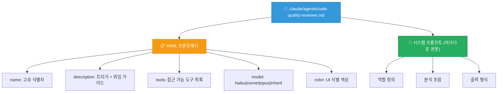
```mermaid
graph TD
    FILE["📄 .claude/agents/code-quality-reviewer.md"]
    
    FILE --> YAML["📋 YAML 프론트매터"]
    FILE --> BODY["📝 시스템 프롬프트 (마크다운 본문)"]
    
    YAML --> N["name: 고유 식별자"]
    YAML --> D["description: 트리거 + 위임 가이드"]
    YAML --> T["tools: 접근 가능 도구 목록"]
    YAML --> MD["model: haiku|sonnet|opus|inherit"]
    YAML --> CL["color: UI 식별 색상"]
    
    BODY --> INST["역할 정의"]
    BODY --> FOCUS["분석 초점"]
    BODY --> FORMAT["출력 형식"]

    style FILE fill:#3498db,stroke:#2980b9,color:#fff
    style YAML fill:#f39c12,stroke:#e67e22,color:#fff
    style BODY fill:#27ae60,stroke:#1e8449,color:#fff
```

#### 각 필드 상세 설명

| 필드 | 설명 | 중요도 |
| --- | --- | --- |
| **name** | 서브에이전트의 고유 식별자. `@agent name`으로 직접 호출 시 사용 | 필수 |
| **description** | Claude가 서브에이전트를 **언제 사용할지** 판단하는 핵심 정보. 메인 에이전트의 시스템 프롬프트에 포함됨 | 매우 중요 |
| **tools** | 서브에이전트가 접근할 수 있는 도구 목록. 쉼표로 구분 | 필수 |
| **model** | 서브에이전트를 구동할 Claude 모델 | 선택 |
| **color** | UI에서 서브에이전트를 시각적으로 구분하는 색상 | 선택 |

> [!finding] description이 이중 역할을 한다
> `description` 필드는 두 가지 역할을 동시에 수행한다:
> 1. **트리거 역할**: 메인 에이전트가 서브에이전트를 **언제** 실행할지 결정하는 기준
> 2. **위임 가이드 역할**: 메인 에이전트가 서브에이전트에게 보내는 **입력 프롬프트를 작성하는 지침**

#### 자동 위임 활성화

Claude가 사용자의 요청 없이도 자동으로 서브에이전트에게 작업을 위임하게 하려면, description에 **`proactively`** 키워드를 포함한다:

```yaml
description: Proactively suggest running this agent after major code changes...
```

구체적인 예시 대화를 description에 포함하면 Claude의 위임 판단이 더 정확해진다. 예시가 구체적일수록, Claude가 언제 서브에이전트를 실행할지 더 잘 이해한다.

#### `/agents` 로 처음부터 끝까지: 화면별 따라가기

지금까지는 frontmatter 필드의 의미만 봤다. 이번에는 **빈 프로젝트에서 시작해 `/agents` UI를 화면 단위로 따라가며**, 바로 아래(§ "건축공학 도메인" 예시)에 나오는 `structural-reviewer` 서브에이전트를 본인 손으로 한 번 끝까지 만들어 본다.

> [!tip] 완성품을 먼저 봐도 좋다
> 막막하면 바로 아래 § "건축공학 도메인 ..." 의 완성된 `structural-reviewer.md` 코드 블록을 먼저 훑어보고 와도 된다. 본 절은 그 결과물을 **본인의 손으로 동일하게 만들어 내는 경로**를 보여 준다.

##### 0단계: 프로젝트 루트에서 Claude Code 시작

서브에이전트를 **프로젝트 수준**으로 만들 것이므로, 적용하려는 코드베이스의 루트에서 시작해야 한다.

```bash
cd ~/projects/structural-calc-toy   # 예시: 실습용 구조계산 폴더
claude                              # Claude Code 진입
pwd                                 # 현재 위치 재확인
```

`/agents`가 만들어 내는 파일은 `현재_프로젝트/.claude/agents/`에 저장된다. 잘못된 위치에서 만들면 해당 프로젝트에서만 보인다.

##### 1단계: `/agents` 메뉴 진입

프롬프트에 그대로 입력한다.

```text
/agents
```

다음과 같은 메뉴가 뜬다.

```
┌─ Agents ─────────────────────────────┐
│  ▸ Create new agent                 │
│  ▸ List existing agents             │
│  ▸ Edit agent                       │
│  ▸ Delete agent                     │
└─────────────────────────────────────┘
```

##### 2단계: `Create new agent` 선택

##### 3단계: Scope 선택 — Project vs User

| 선택 | 저장 위치 | 이번 실습 |
| --- | --- | :---: |
| **Project** | `.claude/agents/structural-reviewer.md` | ✅ |
| **User** | `~/.claude/agents/structural-reviewer.md` | — |

`structural-reviewer`는 이 프로젝트 코드를 검토하는 도메인 에이전트이므로 **Project**를 선택한다. 팀과 Git으로 공유할 수 있다.

##### 4단계: Generation 방식 — "Claude에게 설명하기" 선택

`Manually write` 가 아닌 `Describe what you want Claude to build`를 선택한 뒤, 다음 설명을 한국어/영어 혼용으로 정확히 입력한다. (description 품질이 이후 자동 위임의 정확도를 결정한다.)

```text
Use this agent when reviewing structural engineering code that involves load
calculations, member sizing, or building code compliance checks against
Korean Design Standard (KDS), ACI, or AISC. The user MUST tell the agent
precisely which files and which structural calculations to review.

The agent must verify load logic against KDS 14 20 22, check member sizing
formulas, identify safety factor discrepancies, validate material property
assumptions, and report code-to-standard misalignment in a fixed 5-section
format: Calculation Summary / Compliance Issues / Accuracy Checks /
Safety Concerns / Recommendations.
```

> [!finding] 좋은 description의 3요소
> 1. **언제** 호출되어야 하는가 (`when reviewing structural engineering code that involves ...`)
> 2. **무엇을** 입력으로 받아야 하는가 (`user MUST tell ... which files and which calculations`)
> 3. **어떤 형식으로** 결과를 내야 하는가 (`5-section format ...`)
>
> 이 3요소가 빠지면 메인 에이전트는 서브에이전트에게 모호한 프롬프트를 보내게 되고, 출력이 들쭉날쭉해진다.

##### 5단계: 도구 카테고리 선택 — Read-only + Bash

| 도구 | 체크 | 이유 |
| --- | :---: | --- |
| `Read`, `Glob`, `Grep` | ✅ | 코드 검토는 읽기 중심 |
| `Bash` | ✅ | `git diff` 등 변경 추적 |
| `Edit`, `Write`, `MultiEdit` | ❌ | **검토 에이전트가 코드를 수정하면 위험** |
| `Task` (sub-agent 위임) | ❌ | 단일 책임 원칙 — 다른 에이전트를 또 부르지 않게 |

> [!warning] 도구 과잉 허용은 곧 사고
> 검토용 에이전트에 `Edit`/`Write`를 주면 "코드가 잘못됐으니 내가 고쳐줄게"라며 사용자 승인 없이 파일을 바꿔 버릴 수 있다. **읽기 전용 + 진단**이 안전한 기본값이다.

##### 6단계: 모델 / 색상 선택

| 항목 | 선택 | 근거 |
| --- | --- | --- |
| **Model** | `sonnet` | KDS 조항 해석은 추론 깊이가 필요하지만 매 호출마다 Opus는 비용 과다. Sonnet이 정확도/비용 균형점 |
| **Color** | `blue` | 도메인별 색 구분 (구조=파랑, 코드품질=보라, 문서=회색)의 팀 컨벤션 |

##### 7단계: 생성된 파일 검토 + 시스템 프롬프트 다듬기

Claude가 `.claude/agents/structural-reviewer.md`를 만든다. 즉시 열어서 본문(시스템 프롬프트)을 검토한다.

```bash
cat .claude/agents/structural-reviewer.md
```

자동 생성된 본문이 § "건축공학 도메인" 예시의 5단계 검토 절차와 다르면, **그 자리에서 Claude에게 통일해 달라**고 요청한다.

```text
.claude/agents/structural-reviewer.md 의 system prompt를 다음 5단계 절차로 통일해줘:
1. Verify load calculation logic against KDS 14 20 22
2. Check member sizing formulas for accuracy
3. Identify safety factor discrepancies
4. Validate material property assumptions
5. Report any code-to-standard misalignment

그리고 출력 포맷을 반드시 다음 5개 헤딩으로 강제해줘:
**Calculation Summary**, **Compliance Issues**, **Accuracy Checks**,
**Safety Concerns**, **Recommendations**
```

##### 8단계 (검증): 실제 호출

새 세션을 한 번 재시작한 후 다음 두 방식으로 호출한다.

```text
# 방법 A: 명시적 호출
@agent structural-reviewer src/beam_calculator.py 를 KDS 14 20 22 기준으로 검토해줘

# 방법 B: 자연어 (description 매칭으로 자동 위임)
이 보 단면이 KDS 기준에 맞는지 검토해줘
```

두 방식 모두에서 응답이 7단계에서 강제한 **5개 헤딩 포맷**으로 나오는지 확인한다.

##### 성공 판정 체크리스트

- [ ] `.claude/agents/structural-reviewer.md` 파일이 존재한다 (프로젝트 루트 하위)
- [ ] frontmatter의 `tools`에 `Edit`/`Write`가 **없다** (읽기 전용)
- [ ] `@agent structural-reviewer ...` 호출 시 정상 응답
- [ ] 자연어 호출(방법 B)에서도 description 매칭으로 자동 위임됨
- [ ] 응답이 5개 헤딩 포맷을 일관되게 따른다

##### 자주 막히는 지점

| 증상 | 원인 | 처방 |
| --- | --- | --- |
| `/agents` 명령이 인식되지 않음 | Claude Code 버전이 구버전 | `claude --version` 확인 후 최신화 |
| 자연어로 호출해도 자동 위임 안 됨 | description이 "when" 절 없이 능력 나열만 함 | description 앞에 `Use this agent when ...` 명시 |
| 응답 포맷이 매번 다름 | system prompt에 "반드시 다음 헤딩으로 출력" 강제어 누락 | 7단계 처방으로 통일 |
| 검토 중에 파일이 수정됨 | `tools`에 `Edit`/`Write` 포함됨 | `.claude/agents/structural-reviewer.md` 의 `tools:` 에서 제거 |

> [!ref] 소스
> - Skilljar L02: Creating a subagent (450699)
> - 본 절은 아래 § "건축공학 도메인 예시"의 완성된 결과물을 학생이 직접 재현하기 위한 경로 안내이다.

#### 건축공학 도메인: 구조 검토 서브에이전트 예시

```markdown
---
name: structural-reviewer
description: Use this agent when reviewing structural engineering code that involves load calculations, member sizing, or building code compliance checks (KDS, ACI, AISC). You must tell the agent precisely which files and which structural calculations to review.
tools: Bash, Glob, Grep, Read
model: sonnet
color: blue
---

You are a structural engineering code reviewer specializing in
Korean Design Standard (KDS) compliance. Your role is to:

1. Verify load calculation logic against KDS 14 20 22
2. Check member sizing formulas for accuracy
3. Identify safety factor discrepancies
4. Validate material property assumptions
5. Report any code-to-standard misalignment

Provide your review in the following format:

1. **Calculation Summary**: Which calculations were reviewed
2. **Compliance Issues**: KDS violations or discrepancies
3. **Accuracy Checks**: Formula verification results
4. **Safety Concerns**: Under-designed or over-designed members
5. **Recommendations**: Suggested corrections with references
```

#### 서브에이전트 호출 방법

생성된 서브에이전트는 여러 방식으로 호출할 수 있다:

```
# 방법 1: @agent 구문으로 직접 호출
@agent structural-reviewer src/beam_calculator.py를 검토해줘

# 방법 2: 자연어로 간접 호출 (description 기반 자동 위임)
이 구조 계산 코드에서 KDS 기준 위반 사항을 찾아줘

# 방법 3: proactively 설정 시 자동 실행
# (코드 변경 후 Claude가 자동으로 리뷰 서브에이전트 실행)
```

| 호출 방식 | 트리거 | 적합한 상황 |
| --- | --- | --- |
| **`@agent name`** | 명시적 지정 | 특정 서브에이전트를 반드시 사용해야 할 때 |
| **자연어 요청** | description 매칭 | 적합한 서브에이전트를 Claude가 판단하게 할 때 |
| **자동 위임** | `proactively` 키워드 | 특정 작업 패턴 감지 시 자동 실행 |

#### 프로젝트 vs 사용자 수준 에이전트 비교

| 항목 | 프로젝트 수준 | 사용자 수준 |
| --- | --- | --- |
| **저장 위치** | `.claude/agents/name.md` | `~/.claude/agents/name.md` |
| **공유 범위** | 현재 프로젝트만 | 모든 프로젝트에서 사용 |
| **버전 관리** | Git으로 팀 공유 가능 | 개인 설정 |
| **적합한 에이전트** | 프로젝트별 리뷰어, 도메인 전문가 | 범용 유틸리티 (포맷터, 검색기) |

> [!tip] 팀 프로젝트에서의 활용
> 프로젝트 수준 서브에이전트는 `.claude/agents/` 디렉토리에 저장되므로, **Git으로 버전 관리하고 팀원과 공유**할 수 있다. 팀 전체가 동일한 코드 리뷰 기준, 문서화 규칙을 적용하는 서브에이전트를 사용할 수 있다.

> [!action] 실습: 서브에이전트 직접 생성
> 위 §1.2 의 **"`/agents` 로 처음부터 끝까지: 화면별 따라가기"** 절을 그대로 따라 `structural-reviewer` 를 본인 손으로 만들어 보세요. 0단계~8단계 절차 + 성공 판정 체크리스트 + "자주 막히는 지점" 표가 모두 거기에 정리되어 있습니다.

> [!ref] 소스
> - Skilljar L02: Creating a subagent (450699)

---

## [Chapter 2] 효과적인 서브에이전트 설계와 활용 (Lessons 3-4)

### 2.1 효과적인 서브에이전트 설계 (Designing Effective Subagents)

서브에이전트를 만들었다고 끝이 아니다. 잘못 설정된 서브에이전트는 방향을 잃거나, 너무 오래 실행되거나, 메인 에이전트가 활용할 수 없는 출력을 생성한다. 효과적인 서브에이전트의 핵심은 **4가지**: 좋은 Description, 출력 포맷 정의, 장애물 보고, 도구 접근 제한이다.

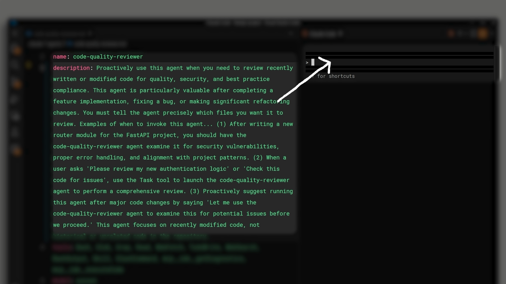
*효과적인 서브에이전트 설계 --- Description, 출력 포맷, 장애물 보고, 도구 제한의 4가지 핵심*

#### Description의 이중 역할

메인 컨텍스트 윈도우 에이전트에게 메시지를 보내면, **모든 서브에이전트의 name과 description이 시스템 프롬프트에 포함**된다. 이것이 메인 에이전트가 어떤 서브에이전트를 실행할지 결정하는 방법이다.

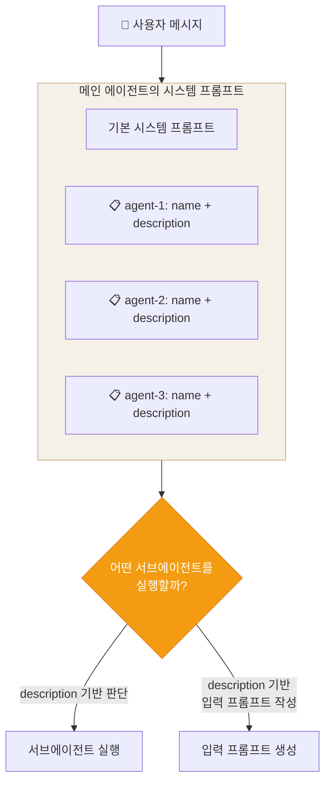
```mermaid
graph TB
    subgraph MAIN_SYSTEM["메인 에이전트의 시스템 프롬프트"]
        SYS["기본 시스템 프롬프트"]
        AG1["📋 agent-1: name + description"]
        AG2["📋 agent-2: name + description"]
        AG3["📋 agent-3: name + description"]
    end
    
    USER["💬 사용자 메시지"] --> MAIN_SYSTEM
    MAIN_SYSTEM --> DECISION{"어떤 서브에이전트를<br/>실행할까?"}
    DECISION -->|"description 기반 판단"| LAUNCH["서브에이전트 실행"]
    DECISION -->|"description 기반<br/>입력 프롬프트 작성"| INPUT["입력 프롬프트 생성"]
    
    style MAIN_SYSTEM fill:#f5f0e8,stroke:#c4a882
    style DECISION fill:#f39c12,stroke:#e67e22,color:#fff
```

Description은 단순히 "언제 실행할지"만 결정하는 것이 아니다. 메인 에이전트가 서브에이전트에게 보낼 **입력 프롬프트를 작성하는 가이드** 역할도 한다.

#### Description으로 입력 프롬프트 조작하기

**일반적인 description 사용 시**:

```yaml
description: Reviews code changes for quality issues.
```

→ 메인 에이전트의 입력 프롬프트: *"use get diff to find the current changes"* — 모호하다. 서브에이전트가 어떤 파일이 중요한지 직접 파악해야 한다.

**구체적인 description 사용 시**:

```yaml
description: Reviews code changes for quality issues. You must tell the agent precisely which files you want it to review.
```

→ 메인 에이전트의 입력 프롬프트: *"Review the following files: src/calculator.py, src/beam_design.py, tests/test_calculator.py"* — 훨씬 구체적이다.

> [!tip] Description 설계 패턴
> - **"You must tell the agent..."**: 메인 에이전트가 구체적인 정보를 포함하도록 유도
> - **"return sources that can be cited"**: 출력에 출처 정보를 포함하도록 유도
> - **예시 대화 포함**: 구체적인 트리거 시나리오를 알려줌

#### 구조화된 출력 포맷 정의

서브에이전트에 대한 **가장 중요한 개선**은 시스템 프롬프트에 **출력 포맷을 정의**하는 것이다. 이는 두 가지 효과를 만든다:

1. **자연스러운 종료 지점**: 서브에이전트가 포맷의 모든 섹션을 채우면 완료를 인식
2. **과도한 실행 방지**: 출력 포맷 없이는 "충분히 조사했는지" 판단하지 못해 불필요하게 오래 실행

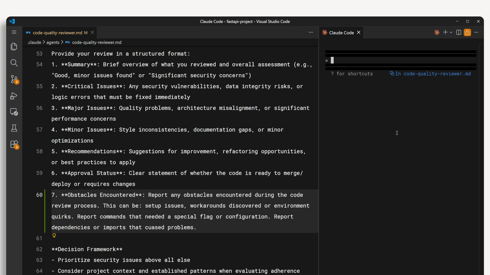
*서브에이전트 설계 패턴 --- 출력 포맷 정의와 Description 기반 입력 조작*

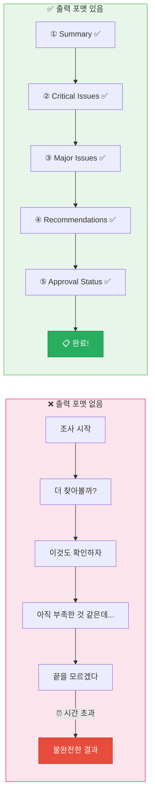
```mermaid
graph LR
    subgraph NO_FORMAT["❌ 출력 포맷 없음"]
        S1["조사 시작"] --> S2["더 찾아볼까?"]
        S2 --> S3["이것도 확인하자"]
        S3 --> S4["아직 부족한 것 같은데..."]
        S4 --> S5["끝을 모르겠다"]
        S5 -->|"⏰ 시간 초과"| S6["불완전한 결과"]
    end

    subgraph WITH_FORMAT["✅ 출력 포맷 있음"]
        T1["① Summary ✅"] --> T2["② Critical Issues ✅"]
        T2 --> T3["③ Major Issues ✅"]
        T3 --> T4["④ Recommendations ✅"]
        T4 --> T5["⑤ Approval Status ✅"]
        T5 --> T6["📋 완료!"]
    end

    style NO_FORMAT fill:#fce4ec,stroke:#e91e63
    style WITH_FORMAT fill:#e8f5e9,stroke:#4caf50
    style S6 fill:#e74c3c,stroke:#c0392b,color:#fff
    style T6 fill:#27ae60,stroke:#1e8449,color:#fff
```

**코드 리뷰 서브에이전트의 출력 포맷 예시**:

```markdown
Provide your review in a structured format:

1. Summary: Brief overview of what you reviewed and overall assessment
2. Critical Issues: Any security vulnerabilities, data integrity risks,
   or logic errors that must be fixed immediately
3. Major Issues: Quality problems, architecture misalignment, or
   significant performance concerns
4. Minor Issues: Style inconsistencies, documentation gaps, or
   minor optimizations
5. Recommendations: Suggestions for improvement, refactoring
   opportunities, or best practices to apply
6. Approval Status: Clear statement of whether the code is ready
   to merge/deploy or requires changes
```

이 포맷은 서브에이전트에게 **체크리스트**를 제공한다. 모든 섹션이 채워지면 서브에이전트는 작업이 끝났음을 안다.

#### 장애물 보고 (Reporting Obstacles)

서브에이전트가 작업 중 **워크어라운드**를 발견했을 때 — 의존성 문제 해결, 특수 플래그가 필요한 명령어 등 — 이러한 정보가 요약에 포함되어야 한다. 그렇지 않으면 메인 스레드가 동일한 해결책을 다시 발견해야 하며, 이는 시간과 토큰을 낭비한다.

**보고해야 할 항목**:

| 항목 | 예시 |
| --- | --- |
| **환경 설정 이슈** | Python 3.11에서는 `tomllib` 사용 필요 |
| **발견된 워크어라운드** | `import` 순서를 변경해야 순환 참조 해결 |
| **특수 플래그/설정** | `pytest --no-header -rN` 필요 |
| **문제가 된 의존성** | `numpy 2.0` 호환성 이슈로 `1.26` 고정 필요 |

출력 포맷에 **"Obstacles Encountered"** 섹션을 추가하면 이 정보를 안정적으로 확보할 수 있다:

```markdown
7. Obstacles Encountered: Report any obstacles encountered during the
   review process. This can be: setup issues, workarounds discovered or
   environment quirks. Report commands that needed a special flag or
   configuration. Report dependencies or imports that caused problems.
```

#### 도구 접근 제한

모든 서브에이전트가 모든 도구에 접근할 필요는 없다. 서브에이전트가 **실제로 필요한 작업**을 고려하고, 그에 필요한 도구만 부여한다. 이는 두 가지 효과를 만든다: 의도치 않은 부작용 방지, 그리고 여러 서브에이전트가 있을 때 각각의 역할을 더 명확하게 만든다.

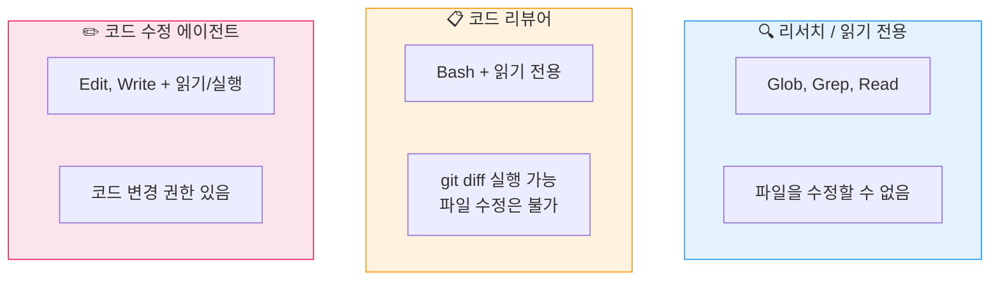
```mermaid
graph TD
    subgraph RESEARCH["🔍 리서치 / 읽기 전용"]
        R_TOOLS["Glob, Grep, Read"]
        R_NOTE["파일을 수정할 수 없음"]
    end

    subgraph REVIEWER["📋 코드 리뷰어"]
        REV_TOOLS["Bash + 읽기 전용"]
        REV_NOTE["git diff 실행 가능<br/>파일 수정은 불가"]
    end

    subgraph MODIFIER["✏️ 코드 수정 에이전트"]
        MOD_TOOLS["Edit, Write + 읽기/실행"]
        MOD_NOTE["코드 변경 권한 있음"]
    end

    style RESEARCH fill:#e3f2fd,stroke:#2196f3
    style REVIEWER fill:#fff3e0,stroke:#ff9800
    style MODIFIER fill:#fce4ec,stroke:#e91e63
```

| 서브에이전트 유형 | 도구 | 이유 |
| --- | --- | --- |
| **리서치 / 읽기 전용** | Glob, Grep, Read | 파일을 실수로 수정하지 않음 |
| **코드 리뷰어** | Bash + 읽기 전용 | `git diff`로 변경 확인, 파일 수정은 불필요 |
| **스타일/코드 수정** | Edit, Write + 읽기/실행 | 실제로 코드를 변경하는 것이 목적 |

#### 효과적인 서브에이전트의 4가지 특성

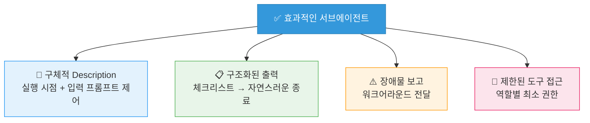
```mermaid
graph TD
    EFFECTIVE["✅ 효과적인 서브에이전트"] --> DESC["📝 구체적 Description<br/>실행 시점 + 입력 프롬프트 제어"]
    EFFECTIVE --> OUTPUT["📋 구조화된 출력<br/>체크리스트 → 자연스러운 종료"]
    EFFECTIVE --> OBSTACLE["⚠️ 장애물 보고<br/>워크어라운드 전달"]
    EFFECTIVE --> TOOLS["🔧 제한된 도구 접근<br/>역할별 최소 권한"]

    style EFFECTIVE fill:#3498db,stroke:#2980b9,color:#fff
    style DESC fill:#e3f2fd,stroke:#2196f3
    style OUTPUT fill:#e8f5e9,stroke:#4caf50
    style OBSTACLE fill:#fff3e0,stroke:#ff9800
    style TOOLS fill:#fce4ec,stroke:#e91e63
```

각 패턴은 단독으로도 간단하지만, 함께 적용하면 서브에이전트를 "대충 도와주는 것"에서 **"집중적이고 예측 가능하며, 시간 내에 완료하고 명확하게 보고하는 작업자"**로 변환한다.

#### 건축공학 서브에이전트 설계 실전

다음은 건축공학 프로젝트에서 자주 사용하는 서브에이전트 3종 세트의 설계 비교다:

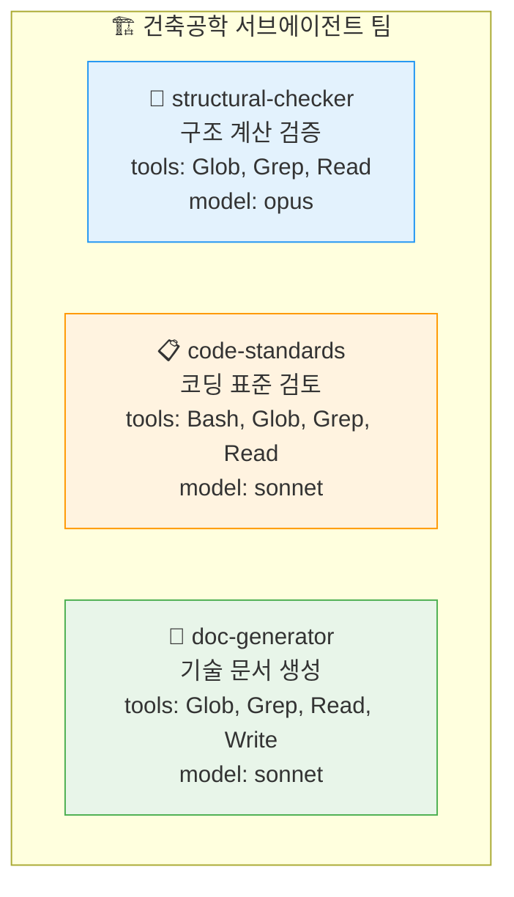
```mermaid
graph TD
    subgraph TEAM["🏗️ 건축공학 서브에이전트 팀"]
        A["📐 structural-checker<br/>구조 계산 검증<br/>tools: Glob, Grep, Read<br/>model: opus"]
        B["📋 code-standards<br/>코딩 표준 검토<br/>tools: Bash, Glob, Grep, Read<br/>model: sonnet"]
        C["📝 doc-generator<br/>기술 문서 생성<br/>tools: Glob, Grep, Read, Write<br/>model: sonnet"]
    end

    style A fill:#e3f2fd,stroke:#2196f3
    style B fill:#fff3e0,stroke:#ff9800
    style C fill:#e8f5e9,stroke:#4caf50
```

| 에이전트 | Description 설계 | 출력 포맷 핵심 | 도구 제한 근거 |
| --- | --- | --- | --- |
| **structural-checker** | "KDS 기준 구조 계산 관련 코드 변경 시. 정확한 파일과 계산 종류를 알려줘야 함" | Compliance / Accuracy / Safety | 읽기 전용 — 계산 결과만 검증 |
| **code-standards** | "Python 코드 품질 + PEP 8 + 프로젝트 규칙 검토. git diff 결과를 포함해야 함" | Critical / Major / Minor / Approval | Bash 추가 — `git diff` 필요 |
| **doc-generator** | "README, API 문서, 사용자 가이드 proactively 생성. 대상 독자와 문서 유형 명시" | Outline / Content / References | Write 포함 — 문서 파일 생성 |

**structural-checker의 완전한 설정 파일 예시**:

```markdown
---
name: structural-checker
description: Use this agent when code changes involve structural engineering calculations such as load analysis, member sizing, deflection checks, or building code compliance (KDS 14 20 22, ACI 318). You must tell the agent precisely which files contain the calculations and what type of structural check is needed (flexure, shear, deflection, etc.).
tools: Glob, Grep, Read
model: opus
color: blue
---

You are a structural engineering verification specialist.
Review the specified calculation code against Korean Design Standard (KDS).

Provide your review in this format:

1. **Calculation Inventory**: List all calculations found (type, location, parameters)
2. **Code Compliance**: Check against KDS 14 20 22 requirements
   - Load combinations (KDS 41 10 15)
   - Strength reduction factors (φ values)
   - Minimum reinforcement ratios
3. **Numerical Accuracy**: Verify formula implementations
   - Unit consistency (kN, mm, MPa)
   - Rounding and precision
   - Boundary condition handling
4. **Safety Assessment**: Overall safety factor evaluation
5. **Recommendations**: Specific corrections with KDS clause references
6. **Obstacles Encountered**: Any parsing issues, missing files,
   or unclear variable names that hindered the review
```

> [!ref] 소스
> - Skilljar L03: Designing effective subagents (450700)

---

### 2.2 서브에이전트 효과적 활용 (Using Subagents Effectively)

서브에이전트를 만들고 설계하는 법을 배웠다. 이제 핵심 질문: **언제 서브에이전트가 도움이 되고, 언제 방해가 되는가?** 차이는 단 하나 — **중간 과정이 메인 스레드에 중요한가 아닌가**에 달려 있다.

#### 서브에이전트가 빛나는 때

서브에이전트는 **탐색이 실행과 분리되는 작업**에서 최고의 효과를 발휘한다. 각 단계가 이전 단계의 발견에 의존하는 작업은 메인 스레드에서 수행해야 한다. 하지만 **결과만 필요하고 과정은 중요하지 않은 작업**은 서브에이전트에 위임한다.

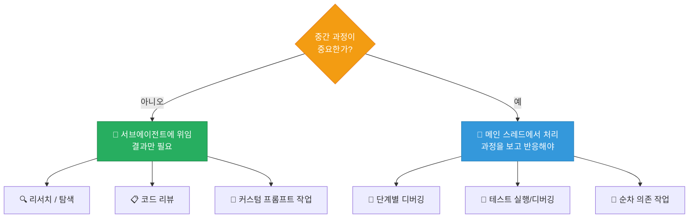
```mermaid
graph TD
    QUESTION{"중간 과정이<br/>중요한가?"}
    
    QUESTION -->|"아니오"| DELEGATE["🤖 서브에이전트에 위임<br/>결과만 필요"]
    QUESTION -->|"예"| MAIN["💬 메인 스레드에서 처리<br/>과정을 보고 반응해야"]
    
    DELEGATE --> D1["🔍 리서치 / 탐색"]
    DELEGATE --> D2["📋 코드 리뷰"]
    DELEGATE --> D3["📝 커스텀 프롬프트 작업"]
    
    MAIN --> M1["🐛 단계별 디버깅"]
    MAIN --> M2["🧪 테스트 실행/디버깅"]
    MAIN --> M3["🔄 순차 의존 작업"]

    style QUESTION fill:#f39c12,stroke:#e67e22,color:#fff
    style DELEGATE fill:#27ae60,stroke:#1e8449,color:#fff
    style MAIN fill:#3498db,stroke:#2980b9,color:#fff
```

#### 패턴 1: 리서치 작업

리서치는 **가장 대표적인 서브에이전트 활용 사례**다. 익숙하지 않은 코드베이스에서 인증이 어떻게 동작하는지 조사한다고 해보자. 메인 스레드가 JWT 유효성 검증 위치를 알아야 하지만, 그 과정에서 검색된 모든 파일을 볼 필요는 없다.

리서치 서브에이전트는 수십 개의 파일을 읽고, 함수 호출을 추적하고, 다양한 코드 경로를 탐색한다. 이 모든 탐색이 서브에이전트의 컨텍스트에 머문다. 메인 스레드는 깔끔한 요약만 받는다:

```
JWT validation happens in middleware/auth.js line 42,
called from the Express router in routes/api.js
```

#### 패턴 2: 코드 리뷰

Claude는 **코드가 다른 사람이 작성한 것으로 제시**될 때 더 효과적으로 리뷰한다. 메인 스레드에서 여러 턴에 걸쳐 기능을 만들고 나서, 같은 스레드에 리뷰를 요청하면 약한 피드백이 나오기 쉽다. Claude가 코드 작성에 참여했기 때문에 신선한 시각으로 보기 어렵다.

리뷰어 서브에이전트는 변경 사항을 **별도 컨텍스트**에서 본다. `git diff`를 실행하고, 수정된 파일을 읽고, 전문 리뷰 기준을 적용한다 — 코드가 어떻게 작성되었는지의 이력 없이. 이 분리는 또한 프로젝트별 리뷰 기준을 서브에이전트의 시스템 프롬프트에 인코딩하여 **팀 전체에 걸쳐 일관된 리뷰 기준**을 보장할 수 있게 한다.

> [!tip] 건축공학 코드 리뷰 활용
> 구조 계산 코드를 작성한 후, 별도의 리뷰어 서브에이전트에게 KDS 기준 준수 여부를 검토시킨다. 메인 스레드의 "내가 만든 코드" 편향 없이 객관적 검토가 가능하다.

#### 패턴 3: 커스텀 시스템 프롬프트

Claude Code의 기본 시스템 프롬프트는 간결하고 코드 중심적인 응답을 지향한다. 이는 코딩에 적합하지만, 모든 작업에 적합하지는 않다.

커스텀 시스템 프롬프트가 서브에이전트를 메인 스레드보다 **더 낫게** 만드는 두 가지 사례:

| 서브에이전트 | 커스텀 프롬프트 효과 |
| --- | --- |
| **카피라이팅 에이전트** | 톤, 대상 독자, 스타일에 대한 지시. 랜딩 페이지나 이메일 캠페인에 Claude Code 기본 프롬프트의 간결한 기술 문체는 적합하지 않다 |
| **스타일링 에이전트** | 디자인 시스템 파일을 참조하도록 지시. 서브에이전트가 실행되면 색상 변수, 간격 규칙, 컴포넌트 패턴이 자동으로 컨텍스트에 로드 |

#### 서브에이전트가 방해되는 때 (안티패턴)

서브에이전트를 실행하는 오버헤드 — 작업 과정의 가시성 상실, 결과의 요약 압축 — 는 서브에이전트가 메인 스레드가 할 수 없는 것을 할 때만 정당화된다. **세 가지 흔한 안티패턴**을 주의한다.

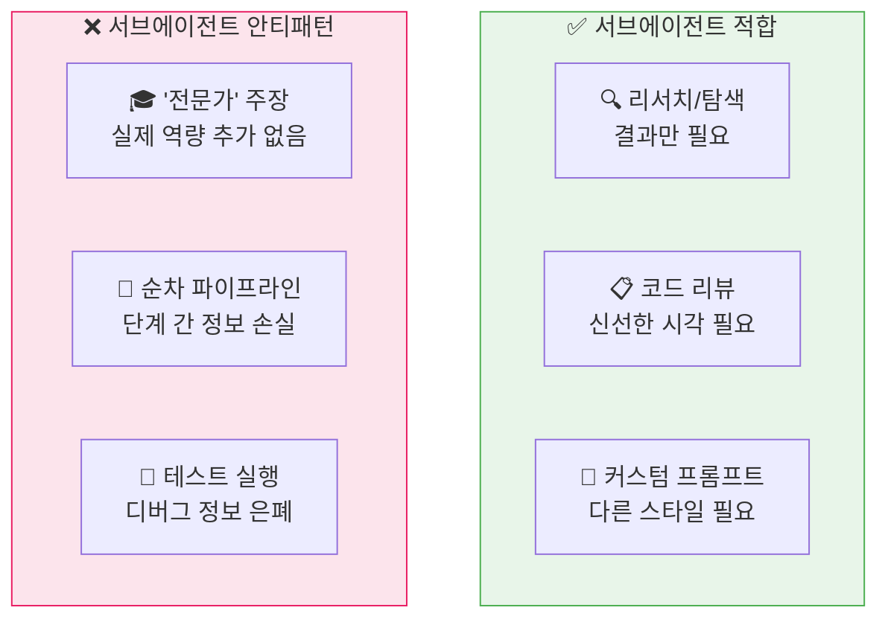
```mermaid
graph TD
    subgraph GOOD["✅ 서브에이전트 적합"]
        G1["🔍 리서치/탐색<br/>결과만 필요"]
        G2["📋 코드 리뷰<br/>신선한 시각 필요"]
        G3["📝 커스텀 프롬프트<br/>다른 스타일 필요"]
    end

    subgraph BAD["❌ 서브에이전트 안티패턴"]
        B1["🎓 '전문가' 주장<br/>실제 역량 추가 없음"]
        B2["🔄 순차 파이프라인<br/>단계 간 정보 손실"]
        B3["🧪 테스트 실행<br/>디버그 정보 은폐"]
    end

    style GOOD fill:#e8f5e9,stroke:#4caf50
    style BAD fill:#fce4ec,stroke:#e91e63
```

**안티패턴 1: 전문가 주장 (Expert Claims)**

"Python 전문가" 또는 "Kubernetes 전문가"를 자처하는 서브에이전트는 거의 도움이 되지 않는다. **Claude는 이미 그 지식을 갖고 있다.** 전문가 서브에이전트가 메인 스레드보다 나을 것이 없다.

**안티패턴 2: 순차 파이프라인 (Sequential Pipelines)**

버그 재현 → 디버깅 → 수정의 3단계 서브에이전트 파이프라인을 고려해보자. 파이프라인은 작업이 **진정으로 독립적**일 때 동작한다. 하지만 각 단계가 이전 단계의 발견에 의존하면 실패한다 — 그리고 버그 수정은 거의 항상 그렇다. **에이전트 간 핸드오프에서 정보가 손실**된다.

**안티패턴 3: 테스트 러너 (Test Runners)**

테스트 러너 서브에이전트는 **필요한 정보를 은폐**하는 경향이 있다. 테스트가 실패했을 때 전체 출력이 있어야 문제를 진단할 수 있다. "테스트 실패"만 반환하는 서브에이전트는 세부 정보를 얻기 위해 추가 디버그 스크립트를 만들어야 하게 만든다. 테스트에 따르면 **테스트 러너 패턴은 모든 설정 중 가장 저조한 성능**을 보였다.

#### 결정 규칙

서브에이전트 사용 여부를 결정할 때, 하나의 질문을 한다: **중간 작업이 중요한가?**

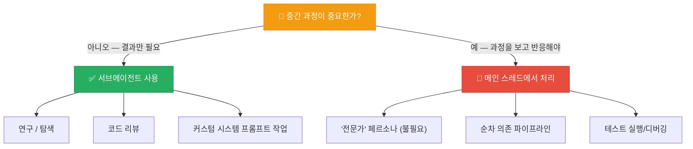
```mermaid
flowchart TD
    Q["🤔 중간 과정이 중요한가?"]
    Q -->|"아니오 — 결과만 필요"| USE["✅ 서브에이전트 사용"]
    Q -->|"예 — 과정을 보고 반응해야"| DIRECT["💬 메인 스레드에서 처리"]
    
    USE --> U1["연구 / 탐색"]
    USE --> U2["코드 리뷰"]
    USE --> U3["커스텀 시스템 프롬프트 작업"]
    
    DIRECT --> D1["'전문가' 페르소나 (불필요)"]
    DIRECT --> D2["순차 의존 파이프라인"]
    DIRECT --> D3["테스트 실행/디버깅"]

    style Q fill:#f39c12,stroke:#e67e22,color:#fff
    style USE fill:#27ae60,stroke:#1e8449,color:#fff
    style DIRECT fill:#e74c3c,stroke:#c0392b,color:#fff
```

> [!finding] 서브에이전트 판단 기준 요약
>
> | 기준 | 서브에이전트 사용 | 메인 스레드 유지 |
> | --- | --- | --- |
> | 중간 과정 필요? | 아니오 | 예 |
> | 신선한 시각 필요? | 예 (리뷰) | 아니오 |
> | 다른 프롬프트 필요? | 예 (카피라이팅, 스타일링) | 아니오 |
> | 단계 간 의존성? | 낮음 | 높음 |
> | 디버그 출력 필요? | 아니오 | 예 |

> [!ref] 소스
> - Skilljar L04: Using subagents effectively (450701)

---

### 2.3 실라버스 보충: Hooks 시스템과 서브에이전트 연계

실라버스에 따라, 이 절에서는 **Hooks 시스템**과 서브에이전트의 조합을 다룬다.

#### Hooks 시스템 개요

**Hooks**는 Claude Code의 특정 이벤트에 자동으로 반응하는 스크립트다. 파일 저장, 도구 실행 전후 등의 시점에 셸 명령어를 자동 실행한다.

| Hook 이벤트 | 시점 | 활용 예시 |
| --- | --- | --- |
| **PreToolUse** | 도구 실행 **전** | 파일 쓰기 전 보안 검사 (.env 파일 보호) |
| **PostToolUse** | 도구 실행 **후** | 코드 저장 후 자동 포맷팅 (Black, Prettier) |
| **Notification** | 사용자 입력 대기 시 | 슬랙 알림, 소리 알림 |
| **Stop** | 에이전트 턴 종료 시 | 결과 로그 기록, 요약 저장 |

#### Hook 설정

Claude Code의 `settings.json`에 Hook을 정의한다:

```json
{
  "hooks": {
    "PreToolUse": [
      {
        "matcher": "write",
        "command": "python /path/to/security_check.py \"$CLAUDE_FILE_PATH\""
      }
    ],
    "PostToolUse": [
      {
        "matcher": "write",
        "command": "cd /path/to/project && black \"$CLAUDE_FILE_PATH\""
      }
    ]
  }
}
```

| 필드 | 설명 | 예시 |
| --- | --- | --- |
| `matcher` | Hook이 반응할 도구 이름 | `"write"`, `"bash"`, `"edit"` |
| `command` | 실행할 셸 명령어 | `"black \"$CLAUDE_FILE_PATH\""` |
| `$CLAUDE_FILE_PATH` | Hook이 감지한 파일 경로 (환경 변수) | `/project/src/beam.py` |

#### 서브에이전트 + Hooks 조합 워크플로

서브에이전트가 코드를 작성하면 Hooks가 자동으로 품질을 보장한다:

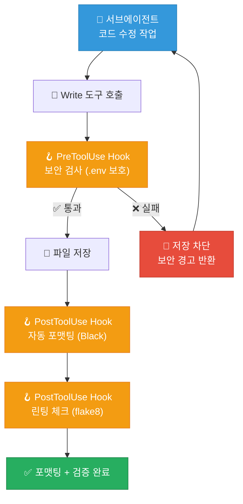
```mermaid
graph TD
    SA["🤖 서브에이전트<br/>코드 수정 작업"]
    SA --> WRITE["📝 Write 도구 호출"]
    
    WRITE --> PRE["🪝 PreToolUse Hook<br/>보안 검사 (.env 보호)"]
    PRE -->|"✅ 통과"| SAVE["💾 파일 저장"]
    PRE -->|"❌ 실패"| BLOCK["🚫 저장 차단<br/>보안 경고 반환"]
    
    SAVE --> POST["🪝 PostToolUse Hook<br/>자동 포맷팅 (Black)"]
    POST --> LINT["🪝 PostToolUse Hook<br/>린팅 체크 (flake8)"]
    LINT --> DONE["✅ 포맷팅 + 검증 완료"]
    
    BLOCK --> SA
    
    style SA fill:#3498db,stroke:#2980b9,color:#fff
    style PRE fill:#f39c12,stroke:#e67e22,color:#fff
    style POST fill:#f39c12,stroke:#e67e22,color:#fff
    style LINT fill:#f39c12,stroke:#e67e22,color:#fff
    style DONE fill:#27ae60,stroke:#1e8449,color:#fff
    style BLOCK fill:#e74c3c,stroke:#c0392b,color:#fff
```

> [!method] 건축공학 실전: 구조 계산 자동 검증 파이프라인
> 1. **서브에이전트**가 KDS 기준 구조 계산 코드 작성
> 2. **PreToolUse Hook**이 `.env` 파일 포함 여부 검사 (API 키 보호)
> 3. **PostToolUse Hook**이 Black으로 자동 포맷팅
> 4. **PostToolUse Hook**이 `pytest` 실행으로 계산 정확도 검증
> 5. 문제 발견 시 서브에이전트에게 수정 요청

#### Skills의 `context: fork`와 서브에이전트

실라버스에 명시된 `context: fork`는 Claude Code Skills에서 서브에이전트를 격리 실행하는 메커니즘이다. Skill 파일에 `context: fork`를 지정하면, 해당 Skill이 별도 컨텍스트에서 실행되어 서브에이전트와 동일한 격리 효과를 얻는다.

```yaml
# .claude/skills/structural-analysis.md
---
name: structural-analysis
context: fork  # 별도 컨텍스트에서 실행 (서브에이전트 격리)
---

이 Skill은 구조 해석 결과를 분석합니다.
메인 컨텍스트를 오염시키지 않고 독립적으로 작업합니다.
```

| 메커니즘 | 설정 위치 | 격리 수준 | 사용 시점 |
| --- | --- | --- | --- |
| **서브에이전트** | `.claude/agents/` | 완전한 격리 (별도 대화) | 독립적 작업 위임 |
| **Skills `context: fork`** | `.claude/skills/` | Skill 실행 격리 | Skill 내 탐색 격리 |
| **일반 Skill** | `.claude/skills/` | 격리 없음 (메인 컨텍스트) | 간단한 명령 패턴 |

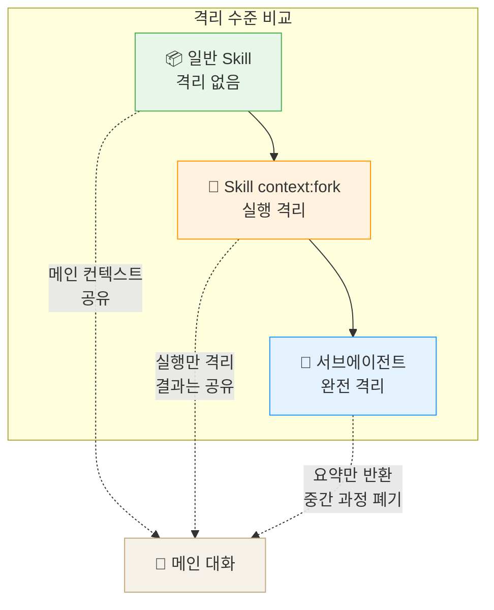
```mermaid
graph TD
    subgraph ISOLATION["격리 수준 비교"]
        direction LR
        SKILL["📦 일반 Skill<br/>격리 없음"] --> FORK["🔀 Skill context:fork<br/>실행 격리"] --> AGENT["🤖 서브에이전트<br/>완전 격리"]
    end
    
    SKILL -.->|"메인 컨텍스트<br/>공유"| MAIN["💬 메인 대화"]
    FORK -.->|"실행만 격리<br/>결과는 공유"| MAIN
    AGENT -.->|"요약만 반환<br/>중간 과정 폐기"| MAIN

    style SKILL fill:#e8f5e9,stroke:#4caf50
    style FORK fill:#fff3e0,stroke:#ff9800
    style AGENT fill:#e3f2fd,stroke:#2196f3
    style MAIN fill:#f5f0e8,stroke:#c4a882
```

#### 실전 Hooks 설정: 건축공학 프로젝트

건축공학 프로젝트에서 유용한 Hook 설정 모음:

```json
{
  "hooks": {
    "PreToolUse": [
      {
        "matcher": "write",
        "command": "python -c \"import sys; f=sys.argv[1]; exit(1 if any(x in f for x in ['.env','secret','credential','api_key']) else 0)\" \"$CLAUDE_FILE_PATH\""
      }
    ],
    "PostToolUse": [
      {
        "matcher": "write",
        "command": "cd /path/to/project && black --quiet \"$CLAUDE_FILE_PATH\" 2>/dev/null || true"
      },
      {
        "matcher": "write",
        "command": "cd /path/to/project && python -m py_compile \"$CLAUDE_FILE_PATH\" 2>/dev/null || true"
      }
    ],
    "Stop": [
      {
        "matcher": "",
        "command": "echo \"$(date): Claude Code turn completed\" >> /tmp/claude_activity.log"
      }
    ]
  }
}
```

| Hook | 목적 | 건축공학 활용 |
| --- | --- | --- |
| **PreToolUse (write)** | `.env`, API 키 포함 파일 쓰기 차단 | Midas API 키, BIM 서버 인증 정보 보호 |
| **PostToolUse (write)** | Black 자동 포맷팅 + 구문 검사 | 구조 계산 코드 품질 자동 유지 |
| **Stop** | 활동 로그 기록 | 작업 이력 추적, 재현성 확보 |

> [!ref] 참고
> - [Claude Code Hooks Documentation](https://docs.anthropic.com/en/docs/claude-code/hooks)
> - [Claude Code Sub-Agents](https://docs.anthropic.com/en/docs/claude-code/sub-agents)
> - [Claude Code Skills](https://code.claude.com/docs/en/skills)

---

## [Chapter 3] Self-assessment & Summary

### 3.1 퀴즈

> [!question] Q1. 서브에이전트의 핵심 이점으로 **가장 적절한** 것은?
> A) Claude의 응답 속도를 높인다
> B) 메인 컨텍스트 윈도우를 깨끗하게 유지한다
> C) 더 정확한 코드를 생성한다
> D) Claude의 학습 데이터를 확장한다
>
> > [!tip]- 정답 보기
> > **정답: B)** 서브에이전트의 핵심 가치는 **컨텍스트 보호**다. 서브에이전트가 별도 컨텍스트에서 작업하고 요약만 반환하므로, 중간 과정(파일 읽기, 검색 등)이 메인 윈도우를 채우지 않는다. 이렇게 하면 더 오래, 더 효과적으로 Claude Code와 작업할 수 있다.

> [!question] Q2. 서브에이전트 설정 파일의 `description` 필드가 수행하는 이중 역할은?
> A) 도구 목록 정의 + 모델 선택
> B) 트리거 조건 + 입력 프롬프트 가이드
> C) 시스템 프롬프트 + 출력 포맷
> D) 이름 설정 + 색상 지정
>
> > [!tip]- 정답 보기
> > **정답: B)** `description`은 두 가지 역할을 한다: (1) 메인 에이전트가 서브에이전트를 **언제 실행할지** 결정하는 트리거 조건, (2) 메인 에이전트가 서브에이전트에게 보내는 **입력 프롬프트를 작성하는 가이드**. "You must tell the agent precisely which files..."와 같은 지시를 포함하면 더 구체적인 입력 프롬프트가 생성된다.

> [!question] Q3. 서브에이전트에 구조화된 출력 포맷을 정의하는 가장 중요한 이유는?
> A) 출력이 더 예쁘게 보인다
> B) 서브에이전트가 언제 완료되었는지 알고, 과도한 실행을 방지한다
> C) 메인 에이전트가 결과를 파싱하기 쉽다
> D) 다른 서브에이전트와 결과를 공유할 수 있다
>
> > [!tip]- 정답 보기
> > **정답: B)** 구조화된 출력 포맷은 **자연스러운 종료 지점**을 만든다. 서브에이전트가 모든 섹션을 채우면 완료를 인식한다. 포맷이 없으면 "충분히 조사했는지" 판단하지 못해 **불필요하게 오래 실행**되는 경향이 있다.

> [!question] Q4. 다음 중 서브에이전트의 **안티패턴**이 아닌 것은?
> A) "Python 전문가" 서브에이전트
> B) 버그 재현 → 디버깅 → 수정의 순차 파이프라인
> C) 코드 리뷰 서브에이전트
> D) 테스트 러너 서브에이전트
>
> > [!tip]- 정답 보기
> > **정답: C)** 코드 리뷰는 서브에이전트의 **적합한 활용 사례**다. 별도 컨텍스트에서 코드를 보면 "신선한 시각"으로 리뷰할 수 있고, 프로젝트별 리뷰 기준을 인코딩할 수 있다. 반면 A(전문가 주장)는 실제 역량을 추가하지 않고, B(순차 파이프라인)는 단계 간 정보 손실이 발생하며, D(테스트 러너)는 디버그 정보를 은폐한다.

> [!question] Q5. 코드 리뷰 서브에이전트에 가장 적합한 도구 설정은?
> A) Edit, Write, Bash, Read
> B) Glob, Grep, Read만
> C) Bash + 읽기 전용 (Glob, Grep, Read)
> D) 모든 도구 활성화
>
> > [!tip]- 정답 보기
> > **정답: C)** 코드 리뷰어는 `git diff`를 실행해야 하므로 **Bash 접근**이 필요하지만, 코드를 수정해서는 안 되므로 Edit/Write는 불필요하다. 읽기 전용 도구와 Bash의 조합이 리뷰어에 적합하다.

> [!question] Q6. 서브에이전트 사용 여부를 결정하는 핵심 질문은?
> A) "작업이 복잡한가?"
> B) "여러 파일이 관련되는가?"
> C) "중간 과정이 메인 스레드에 중요한가?"
> D) "실행 시간이 오래 걸릴 것인가?"
>
> > [!tip]- 정답 보기
> > **정답: C)** 핵심 판단 기준은 **"중간 과정이 중요한가?"**다. 결과만 필요하고 과정이 중요하지 않으면 서브에이전트에 위임한다. 과정을 보고 반응해야 하면 메인 스레드에서 처리한다. 복잡성이나 파일 수는 부차적 요소다.

> [!question] Q7. Hook의 `PreToolUse` 이벤트에서 보안 검사를 실행하는 이유는?
> A) 코드가 실행된 후 문제를 감지하기 위해
> B) 파일이 저장되기 **전에** 위험을 차단하기 위해
> C) 사용자에게 알림을 보내기 위해
> D) 서브에이전트의 출력을 포맷팅하기 위해
>
> > [!tip]- 정답 보기
> > **정답: B)** `PreToolUse`는 도구가 실행되기 **전에** 동작한다. 파일 쓰기 전에 `.env` 파일이나 API 키가 포함되지 않았는지 검사하여, **문제가 발생하기 전에 차단**할 수 있다. 이미 저장된 후 감지하는 것보다 훨씬 안전하다.

> [!ref] 소스
> - 전체 코스: Introduction to Subagents (450698~450701)

---

### 3.2 학습 내용 정리

#### 서브에이전트 기초 (Chapter 1) 요약

> [!finding] 서브에이전트 이해와 생성 — Chapter 1 핵심 정리
>
> | 단계 | 개념 | 핵심 내용 | 참조 |
> | :---: | --- | --- | :---: |
> | 1 | **서브에이전트란?** | 별도 컨텍스트에서 작업 → 요약만 반환 → 중간 과정 폐기 | §1.1 |
> | 2 | **컨텍스트 보호** | 메인 윈도우 오염 방지, 파일 읽기/검색 격리 | §1.1 |
> | 3 | **내장 에이전트** | General Purpose (다목적), Explore (탐색), Plan (계획) | §1.1 |
> | 4 | **/agents 생성** | 범위(Project/User) → 방법(수동/Claude생성) → 도구 → 모델 → 색상 | §1.2 |
> | 5 | **설정 파일** | YAML 프론트매터 (name, description, tools, model, color) + 시스템 프롬프트 | §1.2 |
> | 6 | **자동 위임** | description에 "proactively" 키워드 + 예시 대화 포함 | §1.2 |

#### 효과적인 설계와 활용 (Chapter 2) 요약

> [!result] 서브에이전트 설계 패턴과 활용 전략
>
> | 설계 패턴 | 핵심 내용 | 참조 |
> | --- | --- | :---: |
> | **Description 이중 역할** | 트리거 조건 + 입력 프롬프트 가이드 (구체적 지시로 위임 품질 향상) | §2.1 |
> | **구조화된 출력** | 체크리스트 → 자연스러운 종료, 과도한 실행 방지 | §2.1 |
> | **장애물 보고** | Obstacles Encountered 섹션 → 워크어라운드 전달 | §2.1 |
> | **도구 접근 제한** | 읽기전용(리서치) / Bash+읽기(리뷰) / Edit+Write(수정) | §2.1 |
>
> | 활용 패턴 | 안티패턴 | 참조 |
> | --- | --- | :---: |
> | ✅ 리서치/탐색 (결과만 필요) | ❌ 전문가 주장 (실제 역량 추가 없음) | §2.2 |
> | ✅ 코드 리뷰 (신선한 시각) | ❌ 순차 파이프라인 (정보 손실) | §2.2 |
> | ✅ 커스텀 프롬프트 (다른 스타일) | ❌ 테스트 러너 (디버그 정보 은폐) | §2.2 |

#### Week 05 → 06 → 06 보충 → 07 학습 로드맵

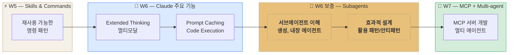
```mermaid
graph LR
    subgraph W5["⚡ W5 — Skills & Commands"]
        A["재사용 가능한<br/>명령 패턴"]
    end

    subgraph W6["🔬 W6 — Claude 주요 기능"]
        B1["Extended Thinking<br/>멀티모달"]
        B2["Prompt Caching<br/>Code Execution"]
    end

    subgraph W6S["🤖 W6 보충 — Subagents"]
        C1["서브에이전트 이해<br/>생성, 내장 에이전트"]
        C2["효과적 설계<br/>활용 패턴/안티패턴"]
    end

    subgraph W7["🔌 W7 — MCP + Multi-agent"]
        D["MCP 서버 개발<br/>멀티 에이전트"]
    end

    A --> B1
    B1 --> B2
    B2 --> C1
    C1 --> C2
    C2 --> D

    style W5 fill:#f5f0e8,stroke:#c4a882
    style W6 fill:#dbeafe,stroke:#3b82f6
    style W6S fill:#e8c07a,stroke:#c4a882,color:#333
    style W7 fill:#d4edda,stroke:#27ae60

    classDef now fill:#e8c07a,stroke:#c4a882,color:#333,font-weight:bold
    class C1,C2 now
```

---

## 📝 실습 과제

> 모든 노트북은 `03-Exercises/Week_06/skilljar/` 에 위치합니다.

### 교수용 노트북 — 단계별 빌드업

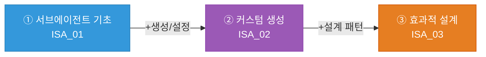
```mermaid
graph LR
    S1["① 서브에이전트 기초<br/>ISA_01"] -->|"+생성/설정"| S2["② 커스텀 생성<br/>ISA_02"]
    S2 -->|"+설계 패턴"| S3["③ 효과적 설계<br/>ISA_03"]

    style S1 fill:#3498db,stroke:#2980b9,color:#fff
    style S2 fill:#9b59b6,stroke:#8e44ad,color:#fff
    style S3 fill:#e67e22,stroke:#d35400,color:#fff
```

| 단계 | 노트북 파일 | 주요 내용 | 참조 섹션 |
| --- | --- | --- | --- |
| ① 서브에이전트 기초 | `ISA_01_subagent_basics.ipynb` | 서브에이전트 개념 + 컨텍스트 격리 + 내장 에이전트 | §1.1 |
| ② 커스텀 생성 | `ISA_02_creating_subagents.ipynb` | /agents 생성 + 설정 파일 구조 + 도구/모델 선택 | §1.2 |
| ③ 효과적 설계 | `ISA_03_effective_design.ipynb` | Description 설계 + 출력 포맷 + 장애물 보고 + 도구 제한 + 활용 패턴 | §2.1~2.2 |

### 수업 시간 실습 순서

> [!tip] 수업 시간 실습 순서
> **Ch.1 — 서브에이전트 이해와 생성** (40분)
> 1. `ISA_01_subagent_basics.ipynb` 열기 → 컨텍스트 격리 개념 + 내장 에이전트 데모 (15분)
> 2. `ISA_02_creating_subagents.ipynb` 열기 → `/agents` 생성 데모 + 설정 파일 분석 (15분)
> 3. 학생 질의응답 + 개념 정리 (10분)
>
> **Ch.2 — 효과적 설계와 활용** (40분)
> 4. `ISA_03_effective_design.ipynb` 열기 → Description 이중 역할 + 출력 포맷 데모 (15분)
> 5. `ISA_03` 계속 → 활용 패턴 vs 안티패턴 토론 (10분)
> 6. 학생 직접 실습 → 구조 검토 서브에이전트 생성 (15분)

> [!tip] Claude Code Subagents + Hooks 패턴
> 이번 주차의 Claude Code 스킬은 **Subagents + Hooks** 조합입니다:
> ```
> 1. Create   — 서브에이전트 설정 파일 작성
> 2. Design   — 출력 포맷 + 도구 접근 설계
> 3. Test     — 서브에이전트 실행 + 결과 확인
> 4. Automate — Hook으로 자동 품질 검증 연결
> ```
> Claude Code에서 `/agents`로 서브에이전트를 만들고, `settings.json`에 Hook을 설정하면, 코드 작성 → 자동 검증 → 리뷰의 파이프라인이 자동으로 동작합니다.

> [!ref] 소스
> - 온라인 코스: [Introduction to Subagents (Skilljar)](https://anthropic.skilljar.com/introduction-to-subagents)
> - 공식 문서: [Claude Code Sub-Agents](https://docs.anthropic.com/en/docs/claude-code/sub-agents)

---

## 🤖 CC 스킬: Subagents + Hooks 심화

> [!tip] 이번 보충 강의의 Claude Code 스킬 심화
> Week 06 본편에서 간략히 소개한 Subagents + Hooks를, Skilljar 코스를 기반으로 **심층적으로** 다룹니다.

### 서브에이전트 워크플로 종합

Week 05의 Skills로 명령 패턴을 만들고, 이번 주에 배운 서브에이전트로 독립적 작업자를 만들면, 다음과 같은 워크플로가 가능해진다:

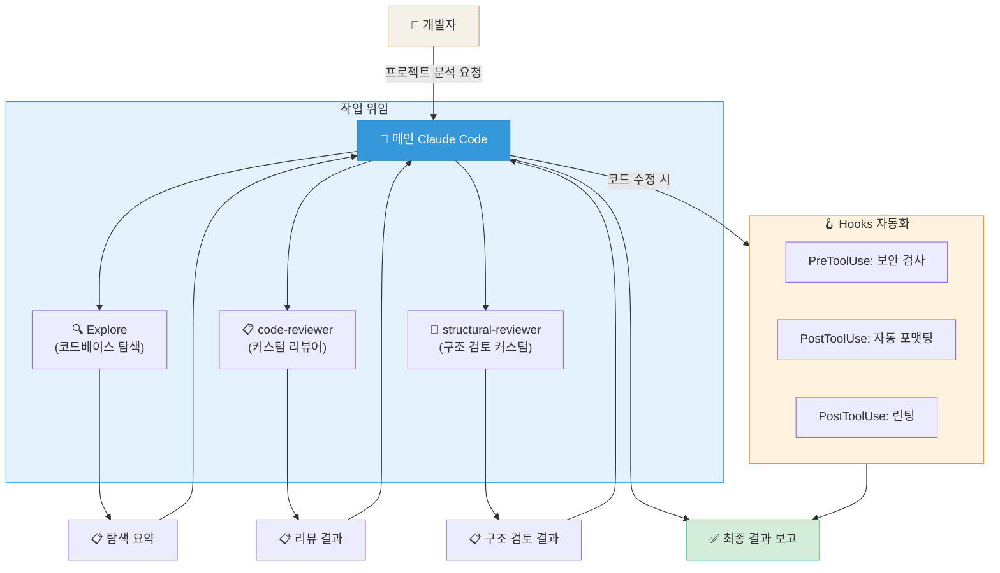
```mermaid
graph TD
    USER["👤 개발자"] -->|"프로젝트 분석 요청"| MAIN["🤖 메인 Claude Code"]
    
    subgraph DELEGATION["작업 위임"]
        MAIN --> EXPLORE["🔍 Explore<br/>(코드베이스 탐색)"]
        MAIN --> REVIEW["📋 code-reviewer<br/>(커스텀 리뷰어)"]
        MAIN --> STRUCT["📐 structural-reviewer<br/>(구조 검토 커스텀)"]
    end
    
    subgraph HOOKS["🪝 Hooks 자동화"]
        H1["PreToolUse: 보안 검사"]
        H2["PostToolUse: 자동 포맷팅"]
        H3["PostToolUse: 린팅"]
    end
    
    EXPLORE --> SUM1["📋 탐색 요약"]
    REVIEW --> SUM2["📋 리뷰 결과"]
    STRUCT --> SUM3["📋 구조 검토 결과"]
    
    SUM1 --> MAIN
    SUM2 --> MAIN
    SUM3 --> MAIN
    
    MAIN -->|"코드 수정 시"| HOOKS
    HOOKS --> FINAL["✅ 최종 결과 보고"]
    MAIN --> FINAL

    style USER fill:#f5f0e8,stroke:#c4a882
    style MAIN fill:#3498db,stroke:#2980b9,color:#fff
    style DELEGATION fill:#e3f2fd,stroke:#2196f3
    style HOOKS fill:#fff3e0,stroke:#ff9800
    style FINAL fill:#d4edda,stroke:#27ae60
```

### Skills → Subagents → Multi-agent 진화 경로

| Week | CC 스킬 | 핵심 개념 | 진화 |
| --- | --- | --- | --- |
| W5 | Skills & Commands | 재사용 명령 패턴 | 도구 **패턴화** |
| W6 보충 | Subagents + Hooks | 독립 작업자 + 자동화 | 도구 **위임** |
| W7 | Multi-agent + Agent SDK | 다수 에이전트 협업 | 도구 **조직화** |

> [!ref] 참고
> - [Claude Code Sub-Agents Documentation](https://docs.anthropic.com/en/docs/claude-code/sub-agents)
> - [Claude Code Hooks Documentation](https://docs.anthropic.com/en/docs/claude-code/hooks)
> - [Claude Code Skills Documentation](https://code.claude.com/docs/en/skills)

---

## 📚 참고 자료

> [!ref] 공식 문서
> - [Claude Code Sub-Agents](https://docs.anthropic.com/en/docs/claude-code/sub-agents)
> - [Claude Code Hooks](https://docs.anthropic.com/en/docs/claude-code/hooks)
> - [Claude Code Skills](https://code.claude.com/docs/en/skills)
> - [Claude Code Agent Teams](https://code.claude.com/docs/en/agent-teams)

> [!ref] Anthropic 교육 자료
> - [Introduction to Subagents (Skilljar)](https://anthropic.skilljar.com/introduction-to-subagents)
> - [The Complete Guide to Building Skills for Claude (PDF)](https://resources.anthropic.com/hubfs/The-Complete-Guide-to-Building-Skill-for-Claude.pdf)

> [!ref] 관련 강의노트
> - [[Week_06|6주차 본편: Claude의 주요 기능 (S5)]] — Extended Thinking, Vision, Caching, Code Execution
> - [[Week_05|5주차: RAG 기초 (S4)]] — Skills & Commands 기초
> - [[Week_07|7주차: Agent & MCP]] — Multi-agent + Agent SDK

---

## Related

- [[Week_06|6주차: Claude의 주요 기능 (S5)]]
- [[Week_05|5주차: RAG 기초 (S4)]]
- [[Week_07|7주차: Agent & MCP]]
- [[00-Syllabus/LLM_AE_AI_Implementation_Syllabus_v2.3|실라버스 v2.3]]
