# Week 06 Supplement: Introduction to Subagents

---

## 📌 Lecture Focus

**Ch.1 Understanding & Creating Subagents (L01-L02)**
- **What are Subagents?**: Specialized assistants that Claude Code delegates tasks to — each runs in its own context window, does its work, and returns only a summary
- **Context Window Management**: Core strategy for keeping the main thread's context clean
- **Built-in Subagents**: General purpose, Explore, Plan agents available out of the box
- **Creating Custom Subagents**: Define project/user-level agents via `/agents` command
- **Config File Structure**: YAML frontmatter + Markdown system prompt

**Ch.2 Designing & Using Subagents Effectively (L03-L04)**
- **Description Design**: The key field that simultaneously controls delegation decisions and input prompt generation
- **Structured Output Format**: Define natural stopping points and consistent report structure
- **Obstacle Reporting**: Surface workarounds discovered by subagents back to the main thread
- **Tool Access Limitation**: Least-privilege principle for read-only / reviewer / modifier agents
- **Usage Patterns & Anti-patterns**: Research, code review, custom prompts vs. expert claims, pipelines, test runners

**Syllabus Supplement**: Hooks system integration, Skills `context: fork` for isolated execution

---

## 🎯 Learning Objectives

After completing this supplement, you will be able to:

**Ch.1 Understanding & Creating Subagents**
- Explain how subagents protect the main context window (separate context → return summary → discard intermediate work)
- Distinguish the purpose and differences of built-in subagents (General purpose, Explore, Plan)
- Create custom subagents at project or user level using the `/agents` command
- Explain each field in YAML frontmatter (name, description, tools, model, color) and write them directly
- Select appropriate tool categories (Read-only, Edit, Execution, MCP, Other) based on subagent roles

**Ch.2 Designing & Using Subagents Effectively**
- Understand and leverage the dual role of the description field (trigger conditions + input prompt guide)
- Design structured output formats (Summary, Critical Issues, Recommendations, etc.) to improve report quality
- Include obstacle reporting sections to reduce re-discovery costs for the main thread
- Determine appropriate tool access levels for research, review, and code modification agents
- Distinguish effective scenarios (research, code review, custom prompts) from anti-patterns (expert claims, sequential pipelines, test runners)

**Integrated Competency**
- Design and deploy subagents specialized for architectural engineering projects (structural review, drawing analysis, documentation)

---

## 🤔 Why Learn This? — "Assigning Team Members to AI"

> [!question] In Week 05 we learned Claude Code's **Skills and Commands**. In this Week 06 supplement, we learn to assign **independently working team members (subagents)** to Claude Code.

### Limitations of a Single Agent

During long conversations with Claude Code, all file reads, searches, and tool call results accumulate in a single context window. This space is finite, and once full, Claude loses track of earlier conversation content. **Subagents solve this** — they process exploratory work in a separate space and return only the summary.

### Skills → Subagents Evolution

| Week 05: Skills & Commands | Week 06 Supplement: Subagents |
| --- | --- |
| Reusable command patterns | Independently thinking **team members** |
| Executed in main context | Executed in **separate context** |
| Pattern tool combinations | **Role-based tool access** restriction |
| Manual invocation | Automatic delegation possible (`proactively`) |

### This Supplement's Project: Architecture Project Review Team

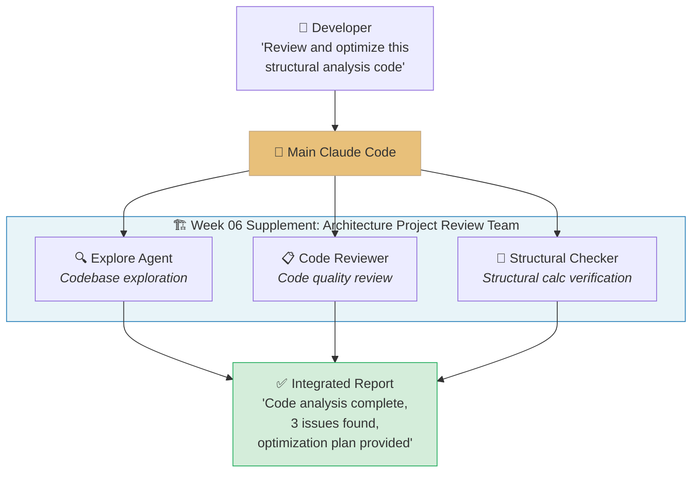

The main Claude Code understands the developer's request and **distributes tasks** to appropriate subagents. Each subagent works independently in its specialized domain and reports only results back to the main thread.

### Anthropic Skilljar Course

This lecture note is based on Anthropic's official Skilljar course **"Introduction to Subagents"** (4 lessons) with supplementary content from the syllabus (Hooks, Skills integration).

> [!ref] Source Mapping
> - Online Course: [Introduction to Subagents](https://anthropic.skilljar.com/introduction-to-subagents)
> - Syllabus Mapping: **Week 06 CC Skill: Subagents + Hooks** (v2.3)
> - Related Docs: [Claude Code Subagents](https://docs.anthropic.com/en/docs/claude-code/sub-agents), [Claude Code Hooks](https://docs.anthropic.com/en/docs/claude-code/hooks)

---

## [Chapter 1] Understanding & Creating Subagents (Lessons 1-2)

### 1.1 What are Subagents?

Subagents are specialized assistants that Claude Code can **delegate** tasks to. Like a team leader distributing work to team members, each subagent runs in its own **separate conversation context window**, completes its work, and returns only a summary to the main thread. Intermediate steps — file reads, searches, tool calls — are all isolated and never clutter the main conversation.

#### Why Subagents are Needed

Every time you chat with Claude Code, content is added to the main context window. All tool calls, file reads, and search results are stored there, and this space is finite. Once full, Claude loses track of earlier conversation parts.

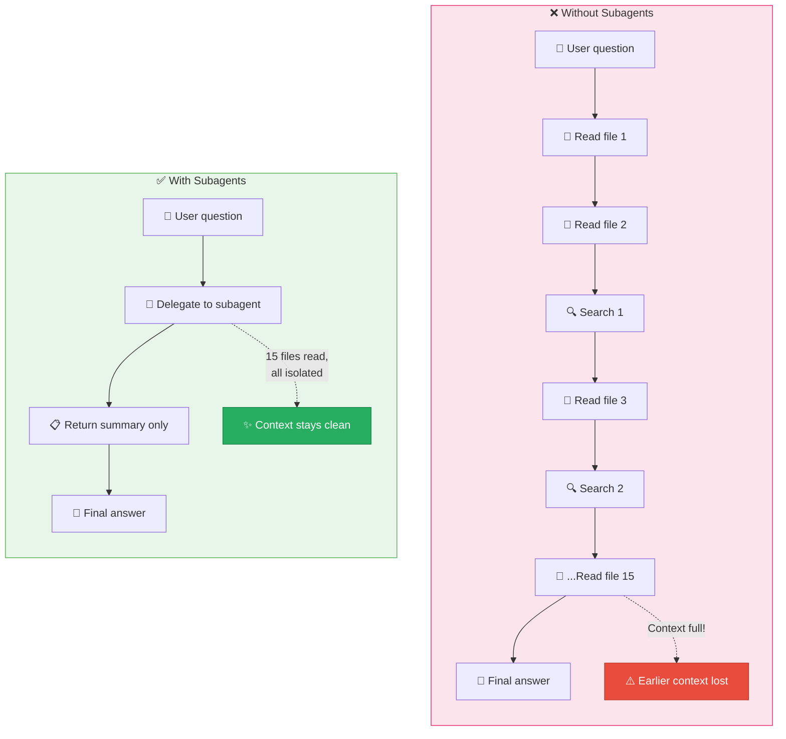

#### Subagent Mechanism

Subagents receive **two inputs** to operate:

1. **Custom system prompt**: The subagent's role and behavior rules defined in the config file
2. **Task description**: Written by the parent agent based on the user's request

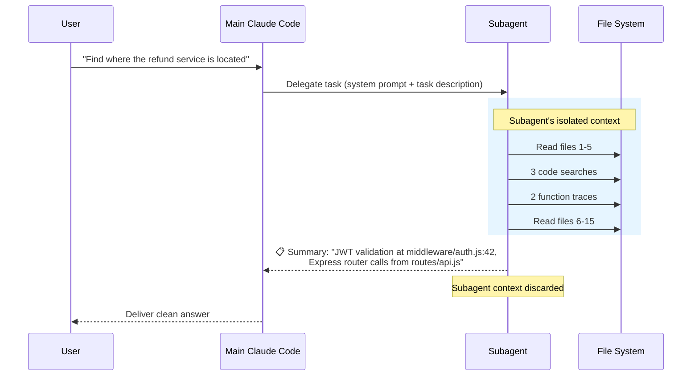

When a subagent finishes, **only the summary returns to the main conversation** and the entire subagent conversation is discarded. The main context records only the question and the summary — the process of reading 15 files is not included.

> [!tip] Key Tradeoff
> Using subagents keeps the main context clean, but you **lose visibility** into how the subagent reached its conclusions. Best suited for tasks where the intermediate process doesn't matter.

#### A Practical Example: Exploring an Unfamiliar Codebase

**Without subagents**: Claude reads 15 files, performs multiple searches, and traces function calls. All of this fills the context window — even though only a single fact was needed.

**With subagents**: When you ask a question, the Explore subagent runs in its own context, performs the exploration, and returns only the core answer. The main context records only the question and the summary.

#### Built-in Subagents

Claude Code ships with several **built-in subagents** you can use immediately:

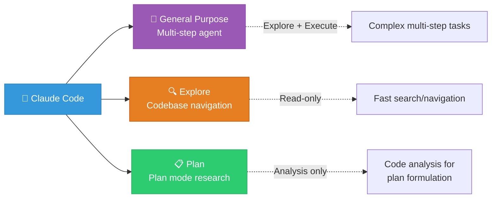

| Subagent | Purpose | Tool Access | When to Use |
| --- | --- | --- | --- |
| **General Purpose** | Multi-step tasks requiring both exploration and action | Full | Complex tasks needing both search and modification |
| **Explore** | Fast codebase search and navigation | Read-only | Finding code structure, locating functions |
| **Plan** | Code analysis and plan formulation in Plan mode | Read-only | Research before presenting a plan |

#### Custom Subagents

Beyond the built-in agents, you can create your own subagents with **custom system prompts and tool access permissions**. You can define specialized agents tailored to your workflow — code reviewers, test writers, documentation generators, and so on.

> [!finding] Three Key Benefits of Subagents
> 1. **Task Decomposition**: Each subagent focuses on a specific task
> 2. **Context Protection**: Isolate intermediate work from the main window
> 3. **Concise Results**: Return only the information you need as a summary

> [!ref] Source
> - Skilljar L01: What are subagents? (450698)

---

### 1.2 Creating a Subagent

Beyond Claude Code's built-in subagents, you can create **custom subagents** specialized for specific tasks. Custom subagents are defined as **markdown files** with YAML frontmatter.


*Subagent creation --- the process of creating a custom subagent via the `/agents` command*

#### Creating with the `/agents` Command

The easiest way to create a subagent is using the `/agents` slash command. This command opens the subagent management interface.

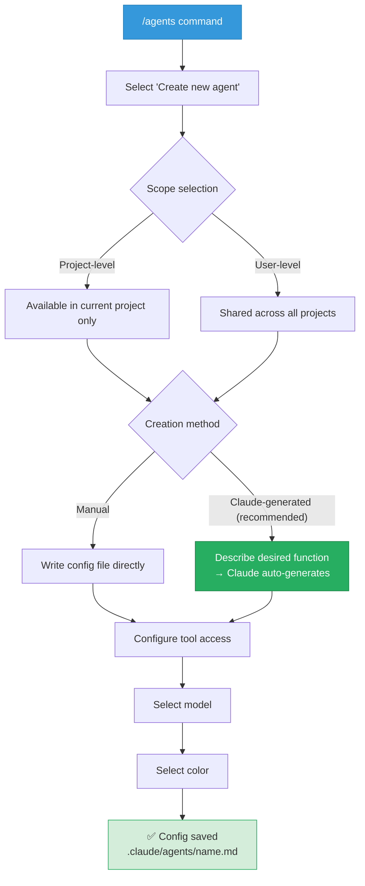

**Creation steps**:

1. **Select scope**: Project level (current project only) or user level (shared across all projects)
2. **Generation method**: Write manually, or describe the desired functionality to Claude for automatic generation (recommended)
3. **Customize tools**: Choose tool categories the subagent can access
4. **Model selection**: Haiku / Sonnet / Opus / Inherit
5. **Color selection**: A color to visually distinguish the subagent in the UI

#### Customizing Tool Categories

When creating a subagent, you can select accessible tools **by category**:


*Subagent configuration --- tool category and model selection*

| Category | Included Tools | Use Scenario |
| --- | --- | --- |
| **Read-only tools** | Glob, Grep, Read | Code analysis, exploration, research |
| **Edit tools** | Edit, Write, MultiEdit | Code modification, file creation |
| **Execution tools** | Bash | Command execution, builds, tests |
| **MCP tools** | MCP server tools | External service integration |
| **Other tools** | WebFetch, WebSearch, etc. | Web search, external information |

> [!tip] Least Privilege Principle
> Only grant the tools a subagent **actually needs**. A code reviewer doesn't need edit tools, and a research agent should not change code. Tools that don't fit the role can cause unintended side effects.

#### Model Selection

| Model | Characteristics | Suitable Tasks |
| --- | --- | --- |
| **Haiku** | Fast and lightweight | Simple search, quick classification |
| **Sonnet** | Balanced speed and depth | Code review, general analysis |
| **Opus** | Top-tier analytical depth | Complex architectural analysis |
| **Inherit** | Use the main conversation's model | When consistency is important |

#### Config File Structure

Once creation is complete, the subagent configuration file is saved to the `.claude/agents/` directory. The following is an example configuration for a code quality reviewer:

```markdown
---
name: code-quality-reviewer
description: Use this agent when you need to review recently written or modified code for quality, security, and best practice compliance.
tools: Bash, Glob, Grep, Read, WebFetch, WebSearch
model: sonnet
color: purple
---

You are an expert code reviewer specializing in quality assurance,
security best practices, and adherence to project standards. Your
role is to thoroughly examine recently written or modified code and
identify issues that could impact reliability, security,
maintainability, or performance.
```

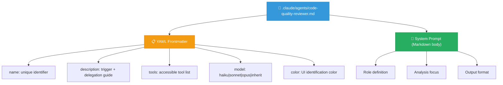

#### Field-by-Field Descriptions

| Field | Description | Importance |
| --- | --- | --- |
| **name** | Subagent's unique identifier. Used with `@agent name` for direct invocation | Required |
| **description** | The core information Claude uses to decide **when** to invoke the subagent. Included in the main agent's system prompt | Critical |
| **tools** | Comma-separated list of tools the subagent can access | Required |
| **model** | The Claude model that drives the subagent | Optional |
| **color** | Color used to visually distinguish the subagent in the UI | Optional |

> [!finding] description plays a dual role
> The `description` field performs two roles simultaneously:
> 1. **Trigger role**: the criterion the main agent uses to decide **when** to launch the subagent
> 2. **Delegation-guide role**: instructions the main agent uses to **write the input prompt** sent to the subagent

#### Enabling Automatic Delegation

To make Claude automatically delegate to the subagent without explicit user requests, include the **`proactively`** keyword in the description:

```yaml
description: Proactively suggest running this agent after major code changes...
```

Including specific example dialogues in the description makes Claude's delegation decisions more accurate. The more concrete the examples, the better Claude understands when to launch the subagent.

#### `/agents` end-to-end: screen-by-screen walkthrough

So far we have only inspected the meaning of frontmatter fields. In this subsection, **starting from an empty project and following the `/agents` UI screen by screen**, you will build the `structural-reviewer` subagent (shown just below in § "Architectural Engineering Domain") end-to-end with your own hands.

> [!tip] It's fine to peek at the finished product first
> If you feel lost, you may skim the completed `structural-reviewer.md` code block in § "Architectural Engineering Domain ..." just below first. This subsection shows you **the path to reproduce that same result with your own hands**.

##### Step 0: Start Claude Code at the project root

Because we will create the subagent at the **project level**, you must start from the root of the codebase you want it to apply to.

```bash
cd ~/projects/structural-calc-toy   # Example: a practice structural-calc folder
claude                              # Enter Claude Code
pwd                                 # Re-confirm current location
```

Files produced by `/agents` are stored under `current_project/.claude/agents/`. If you create the agent from the wrong location, it will only appear in that project.

##### Step 1: Enter the `/agents` menu

Type this directly at the prompt.

```text
/agents
```

A menu like the following will appear.

```
┌─ Agents ─────────────────────────────┐
│  ▸ Create new agent                 │
│  ▸ List existing agents             │
│  ▸ Edit agent                       │
│  ▸ Delete agent                     │
└─────────────────────────────────────┘
```

##### Step 2: Select `Create new agent`

##### Step 3: Select Scope — Project vs User

| Option | Storage location | This exercise |
| --- | --- | :---: |
| **Project** | `.claude/agents/structural-reviewer.md` | ✅ |
| **User** | `~/.claude/agents/structural-reviewer.md` | — |

Since `structural-reviewer` is a domain agent that reviews this project's code, select **Project**. This way it can be shared with the team via Git.

##### Step 4: Generation method — choose "Describe to Claude"

Instead of `Manually write`, select `Describe what you want Claude to build`, then enter the following description precisely (a mix of Korean and English is acceptable). The quality of this description determines the accuracy of subsequent auto-delegation.

```text
Use this agent when reviewing structural engineering code that involves load
calculations, member sizing, or building code compliance checks against
Korean Design Standard (KDS), ACI, or AISC. The user MUST tell the agent
precisely which files and which structural calculations to review.

The agent must verify load logic against KDS 14 20 22, check member sizing
formulas, identify safety factor discrepancies, validate material property
assumptions, and report code-to-standard misalignment in a fixed 5-section
format: Calculation Summary / Compliance Issues / Accuracy Checks /
Safety Concerns / Recommendations.
```

> [!finding] The three elements of a good description
> 1. **When** it should be invoked (`when reviewing structural engineering code that involves ...`)
> 2. **What** it should receive as input (`user MUST tell ... which files and which calculations`)
> 3. **In what format** it should produce results (`5-section format ...`)
>
> If any of these three elements is missing, the main agent will send an ambiguous prompt to the subagent and outputs will become inconsistent.

##### Step 5: Tool category selection — Read-only + Bash

| Tool | Check | Reason |
| --- | :---: | --- |
| `Read`, `Glob`, `Grep` | ✅ | Code review is read-centric |
| `Bash` | ✅ | Tracking changes via `git diff` and similar |
| `Edit`, `Write`, `MultiEdit` | ❌ | **It is dangerous for a review agent to modify code** |
| `Task` (sub-agent delegation) | ❌ | single-responsibility principle — prevent it from invoking other agents |

> [!warning] Over-permissioning tools invites accidents
> If you grant `Edit`/`Write` to a review agent, it may say "the code is wrong, let me fix it for you" and rewrite files without user approval. **Read-only + diagnostic** is the safe default.

##### Step 6: Model / color selection

| Item | Choice | Rationale |
| --- | --- | --- |
| **Model** | `sonnet` | Interpreting KDS clauses requires reasoning depth, but invoking Opus every call is costly. Sonnet hits the accuracy/cost balance |
| **Color** | `blue` | Team convention for domain color coding (structural=blue, code-quality=purple, documentation=gray) |

##### Step 7: Review the generated file + refine the system prompt

Claude creates `.claude/agents/structural-reviewer.md`. Open it immediately and review the body (system prompt).

```bash
cat .claude/agents/structural-reviewer.md
```

If the auto-generated body differs from the 5-step review procedure in § "Architectural Engineering Domain", **ask Claude on the spot to unify them**.

```text
Please unify the system prompt in .claude/agents/structural-reviewer.md
into the following 5-step procedure:
1. Verify load calculation logic against KDS 14 20 22
2. Check member sizing formulas for accuracy
3. Identify safety factor discrepancies
4. Validate material property assumptions
5. Report any code-to-standard misalignment

And enforce the output format using exactly the following 5 headings:
**Calculation Summary**, **Compliance Issues**, **Accuracy Checks**,
**Safety Concerns**, **Recommendations**
```

##### Step 8 (Verification): Actual invocation

Restart the session once, then invoke the subagent in the following two ways.

```text
# Method A: Explicit invocation
@agent structural-reviewer please review src/beam_calculator.py against KDS 14 20 22

# Method B: Natural language (auto-delegation via description matching)
Please review whether this beam cross-section complies with KDS
```

Confirm that responses in both methods follow the **5-heading format** enforced in Step 7.

##### Success criteria checklist

- [ ] The file `.claude/agents/structural-reviewer.md` exists (under the project root)
- [ ] The frontmatter `tools` does **not** include `Edit`/`Write` (read-only)
- [ ] `@agent structural-reviewer ...` invocation responds normally
- [ ] Natural-language invocation (Method B) also auto-delegates via description matching
- [ ] Responses consistently follow the 5-heading format

##### Common pitfalls

| Symptom | Cause | Remedy |
| --- | --- | --- |
| `/agents` command is not recognized | Outdated Claude Code version | Check `claude --version` and update to latest |
| Even natural-language invocation fails to auto-delegate | Description lists capabilities without a "when" clause | Prepend `Use this agent when ...` to the description |
| Output format varies every time | The system prompt is missing a "must output with the following headings" directive | Apply the Step 7 remedy to unify |
| Files are modified during review | `tools` includes `Edit`/`Write` | Remove them from `tools:` in `.claude/agents/structural-reviewer.md` |

> [!ref] Source
> - Skilljar L02: Creating a subagent (450699)
> - This subsection is a path guide so that students can directly reproduce the completed result of § "Architectural Engineering Domain Example" below.

#### Architectural Engineering Domain: Structural Review Subagent Example

```markdown
---
name: structural-reviewer
description: Use this agent when reviewing structural engineering code that involves load calculations, member sizing, or building code compliance checks (KDS, ACI, AISC). You must tell the agent precisely which files and which structural calculations to review.
tools: Bash, Glob, Grep, Read
model: sonnet
color: blue
---

You are a structural engineering code reviewer specializing in
Korean Design Standard (KDS) compliance. Your role is to:

1. Verify load calculation logic against KDS 14 20 22
2. Check member sizing formulas for accuracy
3. Identify safety factor discrepancies
4. Validate material property assumptions
5. Report any code-to-standard misalignment

Provide your review in the following format:

1. **Calculation Summary**: Which calculations were reviewed
2. **Compliance Issues**: KDS violations or discrepancies
3. **Accuracy Checks**: Formula verification results
4. **Safety Concerns**: Under-designed or over-designed members
5. **Recommendations**: Suggested corrections with references
```

#### Subagent Invocation Methods

A created subagent can be invoked in several ways:

```
# Method 1: Direct invocation via @agent syntax
@agent structural-reviewer please review src/beam_calculator.py

# Method 2: Indirect invocation via natural language (description-based auto-delegation)
Find any violations of KDS standards in this structural calculation code

# Method 3: Automatic execution with proactively setting
# (Claude automatically runs the review subagent after code changes)
```

| Invocation Method | Trigger | Suitable Situation |
| --- | --- | --- |
| **`@agent name`** | Explicit designation | When you must use a specific subagent |
| **Natural-language request** | description matching | When you want Claude to choose the right subagent |
| **Auto-delegation** | `proactively` keyword | When a specific task pattern should auto-run |

#### Project- vs User-Level Agent Comparison

| Item | Project-level | User-level |
| --- | --- | --- |
| **Storage location** | `.claude/agents/name.md` | `~/.claude/agents/name.md` |
| **Sharing scope** | Current project only | Available across all projects |
| **Version control** | Shareable with the team via Git | Personal configuration |
| **Suitable agents** | Project-specific reviewers, domain experts | General-purpose utilities (formatters, searchers) |

> [!tip] Usage in team projects
> Because project-level subagents are stored under `.claude/agents/`, you can **version-control them in Git and share them with teammates**. The whole team can use subagents that apply identical code-review criteria and documentation rules.

> [!action] Exercise: Hands-on subagent creation
> Follow the **"`/agents` end-to-end: screen-by-screen walkthrough"** section in §1.2 above to build `structural-reviewer` with your own hands. Steps 0 through 8, the success-criteria checklist, and the "common pitfalls" table are all consolidated there.

> [!ref] Source
> - Skilljar L02: Creating a subagent (450699)

---

## [Chapter 2] Designing & Using Subagents Effectively (Lessons 3-4)

### 2.1 Designing Effective Subagents

Creating a subagent is not the end. A poorly configured subagent wanders off course, runs too long, or produces output the main agent cannot use. Effective subagents come down to **4 things**: good descriptions, a defined output format, obstacle reporting, and limited tool access.


*Effective subagent design --- the four pillars: Description, output format, obstacle reporting, tool restriction*

#### The Dual Role of Description

When you send a message to the main context-window agent, **every subagent's name and description are included in the system prompt**. This is how the main agent decides which subagent to launch.

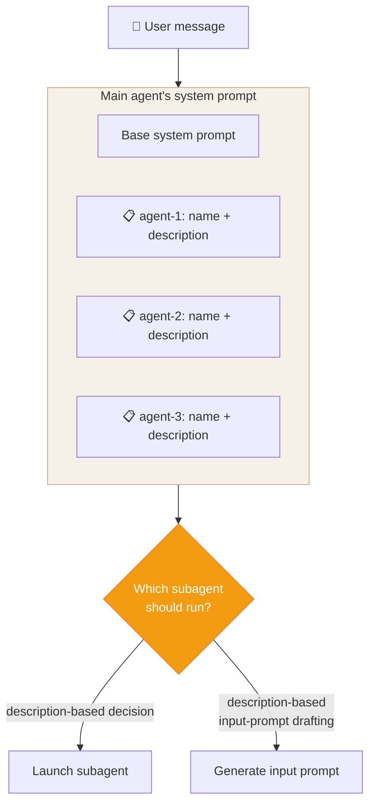

Description does not only decide "when to run." It also acts as a **guide for drafting the input prompt** that the main agent sends to the subagent.

#### Manipulating Input Prompts Through Description

**Generic description**:

```yaml
description: Reviews code changes for quality issues.
```

→ Main agent's input prompt: *"use get diff to find the current changes"* — vague. The subagent must figure out for itself which files matter.

**Specific description**:

```yaml
description: Reviews code changes for quality issues. You must tell the agent precisely which files you want it to review.
```

→ Main agent's input prompt: *"Review the following files: src/calculator.py, src/beam_design.py, tests/test_calculator.py"* — much more specific.

> [!tip] Description design patterns
> - **"You must tell the agent..."**: pushes the main agent to include concrete information
> - **"return sources that can be cited"**: forces the output to include source references
> - **Include example dialogues**: tells Claude what concrete trigger scenarios look like

#### Defining a Structured Output Format

The **single most important improvement** for a subagent is to **define an output format** in the system prompt. This produces two effects:

1. **Natural stopping point**: once every section of the format is filled, the subagent recognizes it is done
2. **Prevents over-running**: without an output format, the subagent cannot judge whether it has "investigated enough" and tends to run far longer than necessary


*Subagent design patterns --- defining the output format and manipulating input via Description*

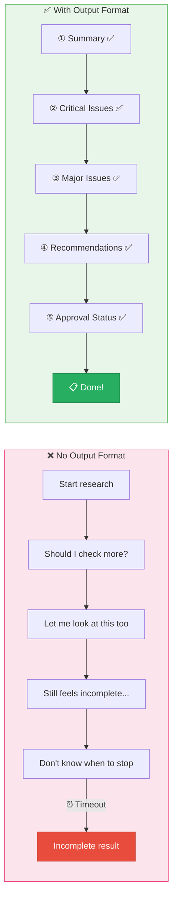

**Example output format for a code-review subagent**:

```markdown
Provide your review in a structured format:

1. Summary: Brief overview of what you reviewed and overall assessment
2. Critical Issues: Any security vulnerabilities, data integrity risks,
   or logic errors that must be fixed immediately
3. Major Issues: Quality problems, architecture misalignment, or
   significant performance concerns
4. Minor Issues: Style inconsistencies, documentation gaps, or
   minor optimizations
5. Recommendations: Suggestions for improvement, refactoring
   opportunities, or best practices to apply
6. Approval Status: Clear statement of whether the code is ready
   to merge/deploy or requires changes
```

This format gives the subagent a **checklist**. Once every section is filled, the subagent knows the task is complete.

#### Reporting Obstacles

When a subagent discovers a **workaround** mid-task — resolving a dependency problem, a command that requires a special flag — this information must be included in the summary. Otherwise the main thread has to rediscover the same solution, wasting time and tokens.

**Items to report**:

| Item | Example |
| --- | --- |
| **Environment setup issues** | `tomllib` must be used on Python 3.11 |
| **Discovered workarounds** | Import order must be changed to resolve a circular reference |
| **Special flags / settings** | `pytest --no-header -rN` required |
| **Problematic dependencies** | `numpy 2.0` compatibility issue requires pinning to `1.26` |

Adding an **"Obstacles Encountered"** section to the output format reliably surfaces this information:

```markdown
7. Obstacles Encountered: Report any obstacles encountered during the
   review process. This can be: setup issues, workarounds discovered or
   environment quirks. Report commands that needed a special flag or
   configuration. Report dependencies or imports that caused problems.
```

#### Limiting Tool Access

Not every subagent needs access to every tool. Consider what the subagent **actually needs to do**, and grant only those tools. This produces two effects: preventing unintended side effects, and making each subagent's role clearer when multiple subagents coexist.

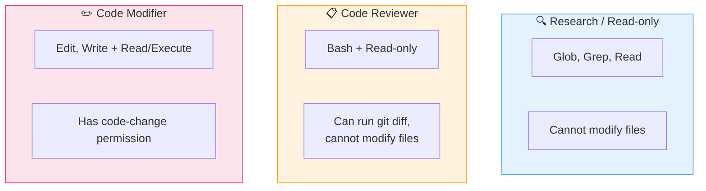

| Subagent Type | Tools | Rationale |
| --- | --- | --- |
| **Research / Read-only** | Glob, Grep, Read | Cannot accidentally modify files |
| **Code Reviewer** | Bash + Read-only | Can confirm changes via `git diff`; file modification is unnecessary |
| **Style / Code Modifier** | Edit, Write + Read/Execute | The purpose is to actually change code |

#### The Four Characteristics of Effective Subagents

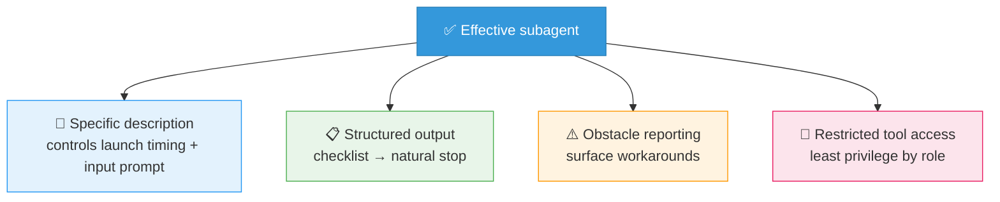

Each pattern is simple on its own, but applied together they transform a subagent from a "rough helper" into **"a focused, predictable worker that finishes on time and reports clearly."**

#### Architectural Engineering Subagent Design in Practice

The following compares the design of a three-subagent set frequently used in architectural engineering projects:

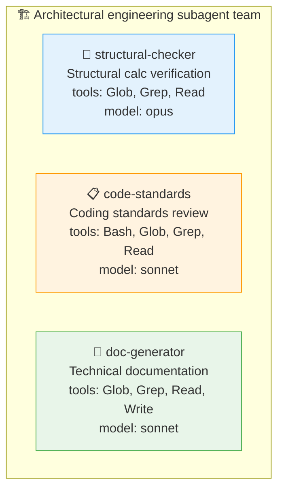

| Agent | Description design | Output-format core | Tool restriction rationale |
| --- | --- | --- | --- |
| **structural-checker** | "On structural-calculation code changes per KDS. Must be told the exact files and type of calculation" | Compliance / Accuracy / Safety | Read-only — only verifies calculation results |
| **code-standards** | "Reviews Python code quality + PEP 8 + project rules. Must include git diff results" | Critical / Major / Minor / Approval | Adds Bash — needs `git diff` |
| **doc-generator** | "Proactively generates README, API docs, user guides. Must specify target audience and document type" | Outline / Content / References | Includes Write — creates documentation files |

**Complete config file example for structural-checker**:

```markdown
---
name: structural-checker
description: Use this agent when code changes involve structural engineering calculations such as load analysis, member sizing, deflection checks, or building code compliance (KDS 14 20 22, ACI 318). You must tell the agent precisely which files contain the calculations and what type of structural check is needed (flexure, shear, deflection, etc.).
tools: Glob, Grep, Read
model: opus
color: blue
---

You are a structural engineering verification specialist.
Review the specified calculation code against Korean Design Standard (KDS).

Provide your review in this format:

1. **Calculation Inventory**: List all calculations found (type, location, parameters)
2. **Code Compliance**: Check against KDS 14 20 22 requirements
   - Load combinations (KDS 41 10 15)
   - Strength reduction factors (φ values)
   - Minimum reinforcement ratios
3. **Numerical Accuracy**: Verify formula implementations
   - Unit consistency (kN, mm, MPa)
   - Rounding and precision
   - Boundary condition handling
4. **Safety Assessment**: Overall safety factor evaluation
5. **Recommendations**: Specific corrections with KDS clause references
6. **Obstacles Encountered**: Any parsing issues, missing files,
   or unclear variable names that hindered the review
```

> [!ref] Source
> - Skilljar L03: Designing effective subagents (450700)

---

### 2.2 Using Subagents Effectively

You now know how to create and design subagents. The key question: **when do subagents help, and when do they get in the way?** The difference comes down to one thing — **whether the intermediate work matters to your main thread**.

#### When Subagents Shine

Subagents are most effective on tasks where **exploration is separable from execution**. Tasks in which each step depends on the previous step's discoveries should stay in the main thread. But **tasks where you only need the result, not the process**, should be delegated to subagents.

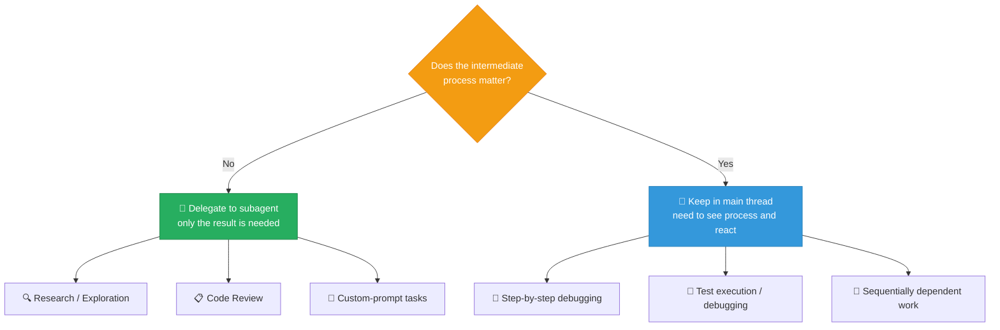

#### Pattern 1: Research Tasks

Research is the **most representative subagent use case**. Suppose you want to investigate how authentication works in an unfamiliar codebase. The main thread needs to know where JWT validation happens, but it does not need to see every file searched along the way.

The research subagent reads dozens of files, traces function calls, and explores various code paths. All of this exploration stays in the subagent's context. The main thread receives only a clean summary:

```
JWT validation happens in middleware/auth.js line 42,
called from the Express router in routes/api.js
```

#### Pattern 2: Code Review

Claude reviews more effectively when code is **presented as if written by someone else**. If you build a feature over many turns in the main thread and then ask the same thread to review it, you tend to get weak feedback. Because Claude participated in writing the code, it cannot easily see it with fresh eyes.

A reviewer subagent sees the changes in a **separate context**. It runs `git diff`, reads the modified files, and applies professional review criteria — without the history of how the code came to be. This separation also lets you encode project-specific review criteria in the subagent's system prompt, guaranteeing **consistent review standards across the entire team**.

> [!tip] Use in architectural engineering code review
> After writing structural-calculation code, have a separate reviewer subagent check KDS compliance. You get an objective review free of the main thread's "I wrote this code" bias.

#### Pattern 3: Custom System Prompts

Claude Code's default system prompt aims for concise, code-centric responses. This suits coding, but not every task.

Two cases where custom system prompts make a subagent **better than the main thread**:

| Subagent | Effect of custom prompt |
| --- | --- |
| **Copywriting agent** | Instructions about tone, target audience, and style. Claude Code's default terse technical style is not suited to landing pages or email campaigns |
| **Styling agent** | Instructions to reference design-system files. When the subagent runs, color variables, spacing rules, and component patterns are automatically loaded into context |

#### When Subagents Get in the Way (Anti-Patterns)

The overhead of running a subagent — loss of visibility into the work, compression of results into a summary — is justified only when the subagent does something the main thread cannot. Watch out for **three common anti-patterns**.

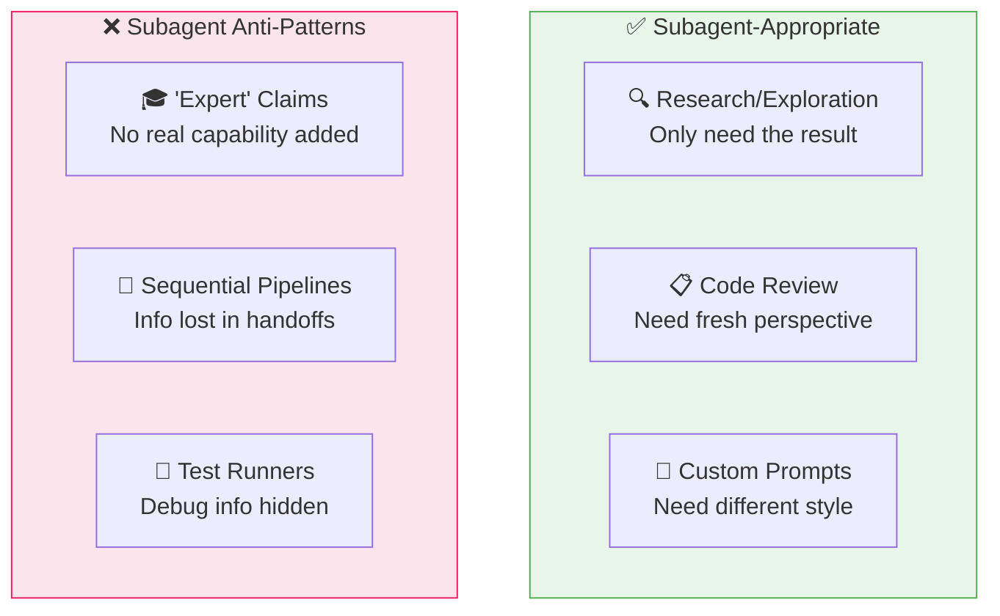

**Anti-pattern 1: Expert Claims**

Subagents that bill themselves as "Python expert" or "Kubernetes expert" rarely help. **Claude already has that knowledge.** An expert subagent offers nothing the main thread does not.

**Anti-pattern 2: Sequential Pipelines**

Consider a three-stage subagent pipeline: bug reproduce → debug → fix. Pipelines work when the steps are **truly independent**. But if each step depends on the previous step's findings, the pipeline breaks — and bug-fixing almost always does. **Information is lost in the handoff between agents**.

**Anti-pattern 3: Test Runners**

Test-runner subagents tend to **hide information you need**. When a test fails, you need the full output to diagnose the problem. A subagent that returns only "tests failed" forces you to write extra debug scripts just to see the details. Testing showed **the test-runner pattern was the worst-performing configuration of all**.

#### The Decision Rule

When deciding whether to use a subagent, ask one question: **does the intermediate work matter?**

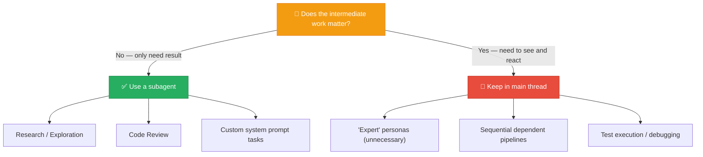

> [!finding] Summary of subagent decision criteria
>
> | Criterion | Use subagent | Keep in main thread |
> | --- | --- | --- |
> | Intermediate process needed? | No | Yes |
> | Fresh perspective needed? | Yes (review) | No |
> | Different prompt needed? | Yes (copywriting, styling) | No |
> | Inter-step dependency? | Low | High |
> | Debug output needed? | No | Yes |

> [!ref] Source
> - Skilljar L04: Using subagents effectively (450701)

---

### 2.3 Syllabus Supplement: Hooks System & Subagent Integration

Per the syllabus, this section covers the combination of the **Hooks system** with subagents.

#### Hooks System Overview

**Hooks** are scripts that automatically respond to specific Claude Code events. They run shell commands automatically at moments such as file save or before/after tool execution.

| Hook event | Timing | Use case |
| --- | --- | --- |
| **PreToolUse** | **Before** tool execution | Security check before writing a file (`.env` protection) |
| **PostToolUse** | **After** tool execution | Auto-formatting after code save (Black, Prettier) |
| **Notification** | When waiting for user input | Slack notifications, audio alerts |
| **Stop** | When the agent turn ends | Log results, save summaries |

#### Hook Configuration

Define hooks in Claude Code's `settings.json`:

```json
{
  "hooks": {
    "PreToolUse": [
      {
        "matcher": "write",
        "command": "python /path/to/security_check.py \"$CLAUDE_FILE_PATH\""
      }
    ],
    "PostToolUse": [
      {
        "matcher": "write",
        "command": "cd /path/to/project && black \"$CLAUDE_FILE_PATH\""
      }
    ]
  }
}
```

| Field | Description | Example |
| --- | --- | --- |
| `matcher` | Tool name the hook reacts to | `"write"`, `"bash"`, `"edit"` |
| `command` | Shell command to execute | `"black \"$CLAUDE_FILE_PATH\""` |
| `$CLAUDE_FILE_PATH` | Environment variable for the file path detected by the hook | `/project/src/beam.py` |

#### Subagent + Hooks Workflow

When a subagent writes code, hooks automatically enforce quality:

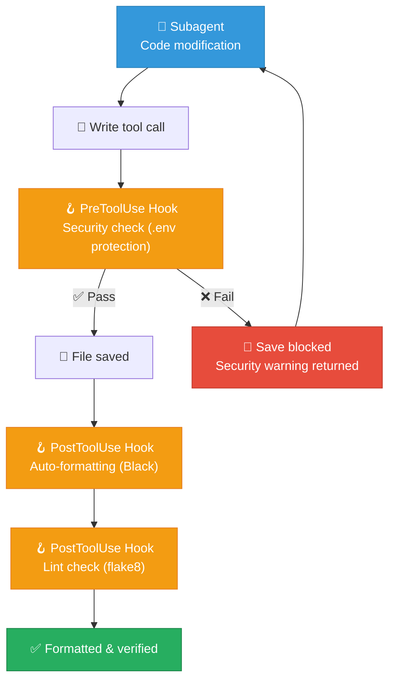

> [!method] Architectural engineering in practice: automated structural-calc verification pipeline
> 1. **Subagent** writes KDS-compliant structural-calculation code
> 2. **PreToolUse Hook** checks for `.env` file inclusion (protects API keys)
> 3. **PostToolUse Hook** auto-formats with Black
> 4. **PostToolUse Hook** runs `pytest` to verify calculation accuracy
> 5. If problems are found, the subagent is asked to revise

#### Skills `context: fork` and Subagents

The `context: fork` mechanism mentioned in the syllabus is how Claude Code Skills isolate subagent execution. Specifying `context: fork` in a Skill file causes that Skill to run in a separate context, achieving the same isolation effect as a subagent.

```yaml
# .claude/skills/structural-analysis.md
---
name: structural-analysis
context: fork  # Run in separate context (subagent isolation)
---

This Skill analyzes structural analysis results.
It works independently without polluting the main context.
```

| Mechanism | Configuration location | Isolation level | When to use |
| --- | --- | --- | --- |
| **Subagent** | `.claude/agents/` | Full isolation (separate conversation) | Delegating independent work |
| **Skills `context: fork`** | `.claude/skills/` | Skill-execution isolation | Isolating exploration inside a Skill |
| **Regular Skill** | `.claude/skills/` | No isolation (main context) | Simple command patterns |

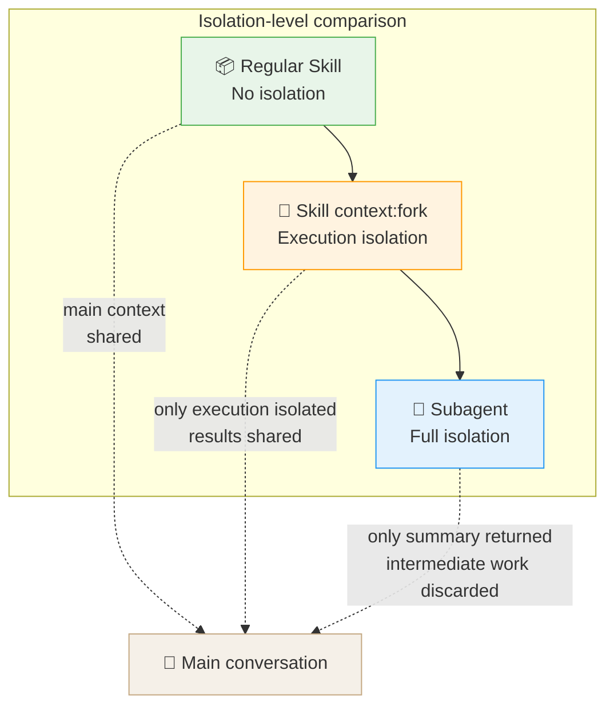

#### Practical Hooks Configuration: Architectural Engineering Projects

A useful set of hook configurations for architectural engineering projects:

```json
{
  "hooks": {
    "PreToolUse": [
      {
        "matcher": "write",
        "command": "python -c \"import sys; f=sys.argv[1]; exit(1 if any(x in f for x in ['.env','secret','credential','api_key']) else 0)\" \"$CLAUDE_FILE_PATH\""
      }
    ],
    "PostToolUse": [
      {
        "matcher": "write",
        "command": "cd /path/to/project && black --quiet \"$CLAUDE_FILE_PATH\" 2>/dev/null || true"
      },
      {
        "matcher": "write",
        "command": "cd /path/to/project && python -m py_compile \"$CLAUDE_FILE_PATH\" 2>/dev/null || true"
      }
    ],
    "Stop": [
      {
        "matcher": "",
        "command": "echo \"$(date): Claude Code turn completed\" >> /tmp/claude_activity.log"
      }
    ]
  }
}
```

| Hook | Purpose | Architectural engineering use |
| --- | --- | --- |
| **PreToolUse (write)** | Block writes of files containing `.env` or API keys | Protect Midas API keys and BIM-server credentials |
| **PostToolUse (write)** | Black auto-formatting + syntax check | Automatically maintain structural-calculation code quality |
| **Stop** | Activity log | Track work history, secure reproducibility |

> [!ref] References
> - [Claude Code Hooks Documentation](https://docs.anthropic.com/en/docs/claude-code/hooks)
> - [Claude Code Sub-Agents](https://docs.anthropic.com/en/docs/claude-code/sub-agents)
> - [Claude Code Skills](https://code.claude.com/docs/en/skills)

---

## [Chapter 3] Self-assessment & Summary

### 3.1 Quiz

> [!question] Q1. What is the core benefit of subagents?
> A) They increase Claude's response speed
> B) They keep the main context window clean
> C) They generate more accurate code
> D) They expand Claude's training data
>
> > [!tip]- Answer
> > **Answer: B)** The core value is **context protection**. Subagents work in separate contexts and return only summaries, so intermediate work doesn't fill the main window.

> [!question] Q2. What dual role does the description field play?
> A) Tool list definition + model selection
> B) Trigger condition + input prompt guide
> C) System prompt + output format
> D) Name setting + color assignment
>
> > [!tip]- Answer
> > **Answer: B)** Description serves as both: (1) trigger condition for when to launch the subagent, and (2) guide for how the main agent writes the input prompt.

> [!question] Q3. Why define a structured output format?
> A) To make output look prettier
> B) So the subagent knows when it's done and prevents over-running
> C) To make results easier to parse
> D) To share results between subagents
>
> > [!tip]- Answer
> > **Answer: B)** Structured output creates **natural stopping points**. Without a format, subagents can't determine when enough research has been done and tend to run much longer than necessary.

> [!question] Q4. Which is NOT a subagent anti-pattern?
> A) "Python expert" subagent
> B) Bug reproduce → debug → fix sequential pipeline
> C) Code review subagent
> D) Test runner subagent
>
> > [!tip]- Answer
> > **Answer: C)** Code review is an **appropriate** use case. A separate context provides "fresh eyes" and allows encoding project-specific review standards. By contrast, A (expert claims) adds no real capability, B (sequential pipelines) loses information across handoffs, and D (test runners) hides debug information.

> [!question] Q5. Which tool configuration is most appropriate for a code-review subagent?
> A) Edit, Write, Bash, Read
> B) Glob, Grep, Read only
> C) Bash + read-only (Glob, Grep, Read)
> D) All tools enabled
>
> > [!tip]- Answer
> > **Answer: C)** A code reviewer needs to run `git diff`, so **Bash access is required**, but it must not modify code, so Edit/Write are unnecessary. The combination of read-only tools plus Bash is right for a reviewer.

> [!question] Q6. What is the key question for deciding whether to use a subagent?
> A) "Is the task complex?"
> B) "Are multiple files involved?"
> C) "Does the intermediate work matter to the main thread?"
> D) "Will it take a long time?"
>
> > [!tip]- Answer
> > **Answer: C)** The core decision criterion: **"Does the intermediate work matter?"** If you only need the result and the process does not matter, delegate to a subagent. If you need to see and react to the process, keep it in the main thread. Complexity and file count are secondary.

> [!question] Q7. Why run a security check in a Hook's `PreToolUse` event?
> A) To detect issues after the code has executed
> B) To block risks **before** a file is saved
> C) To send a notification to the user
> D) To format the subagent's output
>
> > [!tip]- Answer
> > **Answer: B)** `PreToolUse` runs **before** the tool executes. Before a file is written, it can verify that no `.env` file or API keys are present, **blocking the problem before it occurs**. This is far safer than detecting it after the file has already been saved.

> [!ref] Source
> - Full course: Introduction to Subagents (450698~450701)

---

### 3.2 Learning Summary

#### Chapter 1 Summary

> [!finding] Understanding & Creating Subagents — Key Points
>
> | Step | Concept | Key Content | Ref |
> | :---: | --- | --- | :---: |
> | 1 | **What are subagents?** | Separate context → return summary → discard intermediate work | §1.1 |
> | 2 | **Context protection** | Prevent main window pollution from file reads/searches | §1.1 |
> | 3 | **Built-in agents** | General Purpose, Explore, Plan | §1.1 |
> | 4 | **/agents creation** | Scope → Method → Tools → Model → Color | §1.2 |
> | 5 | **Config file** | YAML frontmatter + Markdown system prompt | §1.2 |
> | 6 | **Auto-delegation** | "proactively" keyword + example conversations | §1.2 |

#### Chapter 2 Summary

> [!result] Design Patterns & Usage Strategy
>
> | Design Pattern | Key Content | Ref |
> | --- | --- | :---: |
> | **Description dual role** | Trigger + input prompt guide | §2.1 |
> | **Structured output** | Checklist → natural stopping, prevents over-running | §2.1 |
> | **Obstacle reporting** | Surface workarounds for main thread | §2.1 |
> | **Tool access limits** | Read-only(research) / Bash+Read(review) / Edit+Write(modify) | §2.1 |
>
> | Good Patterns | Anti-Patterns | Ref |
> | --- | --- | :---: |
> | ✅ Research/exploration (only result needed) | ❌ Expert claims (no real capability added) | §2.2 |
> | ✅ Code review (fresh eyes) | ❌ Sequential pipelines (information loss) | §2.2 |
> | ✅ Custom prompts (different style) | ❌ Test runners (debug info hidden) | §2.2 |

#### Week 05 → 06 → 06 Supplement → 07 Learning Roadmap

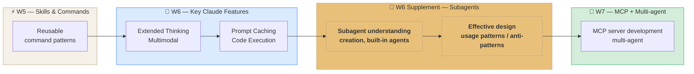

---

## 📝 Exercises

> All notebooks are located at `03-Exercises/Week_06/skilljar/`.

### Instructor Notebooks — Step-by-Step Buildup

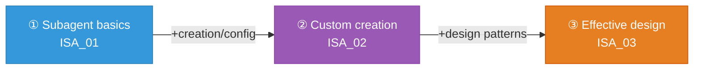

| Step | Notebook | Content | Ref section |
| --- | --- | --- | --- |
| ① Subagent basics | `ISA_01_subagent_basics.ipynb` | Subagent concepts + context isolation + built-in agents | §1.1 |
| ② Custom creation | `ISA_02_creating_subagents.ipynb` | /agents creation + config structure + tool/model selection | §1.2 |
| ③ Effective design | `ISA_03_effective_design.ipynb` | Description design + output format + obstacle reporting + tool restriction + usage patterns | §2.1~2.2 |

### In-class Exercise Order

> [!tip] In-class exercise order
> **Ch.1 — Understanding & creating subagents** (40 min)
> 1. Open `ISA_01_subagent_basics.ipynb` → context-isolation concept + built-in agent demo (15 min)
> 2. Open `ISA_02_creating_subagents.ipynb` → `/agents` creation demo + config-file analysis (15 min)
> 3. Student Q&A + concept review (10 min)
>
> **Ch.2 — Effective design & use** (40 min)
> 4. Open `ISA_03_effective_design.ipynb` → Description dual-role + output-format demo (15 min)
> 5. Continue `ISA_03` → usage-patterns vs anti-patterns discussion (10 min)
> 6. Hands-on: students build a structural-review subagent (15 min)

> [!tip] Claude Code Subagents + Hooks pattern
> This week's Claude Code skill is the **Subagents + Hooks** combination:
> ```
> 1. Create   — write the subagent config file
> 2. Design   — design output format + tool access
> 3. Test     — run the subagent + check the result
> 4. Automate — wire up Hooks for automated quality verification
> ```
> If you build a subagent with `/agents` in Claude Code and configure hooks in `settings.json`, the pipeline of code generation → automatic verification → review runs automatically.

> [!ref] Source
> - Online course: [Introduction to Subagents (Skilljar)](https://anthropic.skilljar.com/introduction-to-subagents)
> - Official docs: [Claude Code Sub-Agents](https://docs.anthropic.com/en/docs/claude-code/sub-agents)

---

## 🤖 CC Skill: Subagents + Hooks Deep Dive

> [!tip] Claude Code skill deep dive for this supplement
> Subagents + Hooks, briefly introduced in the Week 06 main lecture, are covered **in depth** here based on the Skilljar course.

### Combined Subagent Workflow

If you build command patterns with Week 05 Skills and add the independent workers learned this week (subagents), the following workflow becomes possible:

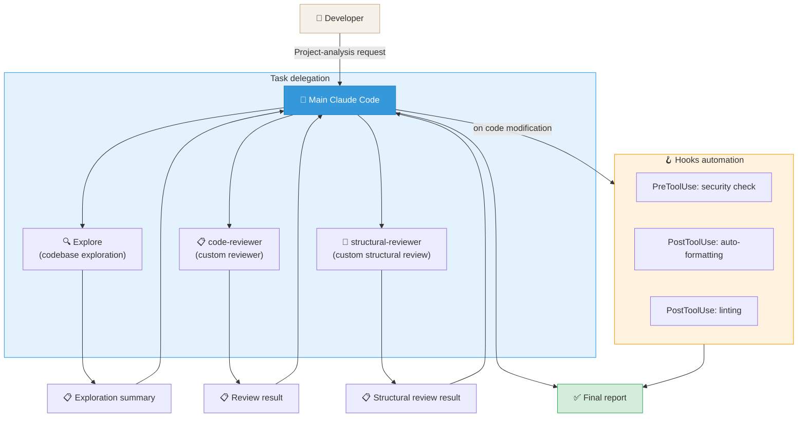

### Skills → Subagents → Multi-agent Evolution Path

| Week | CC skill | Core concept | Evolution |
| --- | --- | --- | --- |
| W5 | Skills & Commands | Reusable command patterns | Tool **patternization** |
| W6 supplement | Subagents + Hooks | Independent workers + automation | Tool **delegation** |
| W7 | Multi-agent + Agent SDK | Multi-agent collaboration | Tool **organization** |

> [!ref] References
> - [Claude Code Sub-Agents Documentation](https://docs.anthropic.com/en/docs/claude-code/sub-agents)
> - [Claude Code Hooks Documentation](https://docs.anthropic.com/en/docs/claude-code/hooks)
> - [Claude Code Skills Documentation](https://code.claude.com/docs/en/skills)

---

## 📚 References

> [!ref] Official Documentation
> - [Claude Code Sub-Agents](https://docs.anthropic.com/en/docs/claude-code/sub-agents)
> - [Claude Code Hooks](https://docs.anthropic.com/en/docs/claude-code/hooks)
> - [Claude Code Skills](https://code.claude.com/docs/en/skills)
> - [Claude Code Agent Teams](https://code.claude.com/docs/en/agent-teams)

> [!ref] Anthropic Education
> - [Introduction to Subagents (Skilljar)](https://anthropic.skilljar.com/introduction-to-subagents)
> - [The Complete Guide to Building Skills for Claude (PDF)](https://resources.anthropic.com/hubfs/The-Complete-Guide-to-Building-Skill-for-Claude.pdf)

> [!ref] Related Lecture Notes
> - [[Week_06|Week 06 main: Features of Claude (S5)]] — Extended Thinking, Vision, Caching, Code Execution
> - [[Week_05|Week 05: RAG Basics (S4)]] — Skills & Commands foundations
> - [[Week_07|Week 07: Agent & MCP]] — Multi-agent + Agent SDK

---

## Related

- [[Week_06|Week 06: Features of Claude (S5)]]
- [[Week_05|Week 05: RAG Basics (S4)]]
- [[Week_07|Week 07: Agent & MCP]]
- [[00-Syllabus/LLM_AE_AI_Implementation_Syllabus_v2.3|Syllabus v2.3]]
