# 7주차: Model Context Protocol — Model Context Protocol (S6)

---

## 📌 강의 중점

**Ch.1 MCP 서버 구축 (MCP Server Fundamentals)**
- **MCP 소개**: LLM 애플리케이션과 외부 도구/데이터를 연결하는 표준 프로토콜 — "AI의 USB-C"
- **MCP 클라이언트 아키텍처**: 호스트, 클라이언트, 서버의 역할 분리와 통신 흐름
- **프로젝트 셋업**: Python 환경 구성, `mcp[cli]` 설치, FastMCP 프로젝트 초기화
- **MCP 도구 정의**: `@mcp.tool()` 데코레이터로 도구 선언, 자동 스키마 생성
- **서버 인스펙터**: 브라우저 기반 MCP Inspector로 서버 기능 테스트

**Ch.2 클라이언트와 리소스/프롬프트 (Client, Resources & Prompts)**
- **클라이언트 구현**: Python MCP 클라이언트로 서버에 연결하고 도구 호출
- **리소스 정의**: `@mcp.resource()` 데코레이터로 정적/동적 데이터 노출
- **리소스 접근**: 클라이언트에서 리소스 목록 조회 및 읽기
- **프롬프트 정의**: `@mcp.prompt()` 데코레이터로 재사용 가능한 프롬프트 템플릿
- **클라이언트에서 프롬프트 사용**: 프롬프트 목록 조회 및 메시지 생성

**통합 사이클**: MCP 개념 → 서버 구축 → Inspector 테스트 → 클라이언트 연결 → 리소스/프롬프트 확장

---

## 🎯 학습 목표

학습 완료 후 다음을 수행할 수 있습니다:

**Ch.1 MCP 서버 구축**
- MCP의 3대 핵심 기능 (Tools, Resources, Prompts)을 설명하고, Tool Use와의 차이를 비교할 수 있다
- FastMCP를 사용하여 Python 기반 MCP 서버를 생성하고 도구를 정의할 수 있다
- `@mcp.tool()` 데코레이터와 타입 힌트로 자동 스키마를 생성할 수 있다
- MCP Inspector를 사용하여 서버의 도구, 리소스, 프롬프트를 테스트할 수 있다

**Ch.2 클라이언트와 리소스/프롬프트**
- MCP 클라이언트를 구현하여 서버에 연결하고 도구를 호출할 수 있다
- `@mcp.resource()`로 정적/동적 리소스를 정의하고 클라이언트에서 읽을 수 있다
- `@mcp.prompt()`로 프롬프트 템플릿을 정의하고 클라이언트에서 활용할 수 있다
- Claude Desktop이나 Claude Code에서 자체 MCP 서버를 연동할 수 있다

**통합 역량**
- MCP 서버를 처음부터 구축하여 Tools + Resources + Prompts를 모두 포함하는 완전한 서버를 만들고, 클라이언트에서 연동하는 전체 워크플로를 구현할 수 있다

---

## 🤔 왜 배우는가? — "도구를 프로토콜로 표준화하다"

> [!question] [[Week_04]] 에서 Claude에게 **도구를 직접 정의하는 법**을 배웠다. Week 07 에서는 도구를 **표준 프로토콜로 분리·공유·재사용하는 법**을 배운다.

### Tool Use의 한계: 도구 정의가 앱에 종속

Week 04에서 배운 Tool Use는 강력하지만, 도구 정의와 실행 로직이 **애플리케이션 코드에 직접 내장**되어 있다. 날씨 도구를 만들면 해당 앱에서만 사용할 수 있고, 다른 앱에서 재사용하려면 코드를 복사해야 한다.

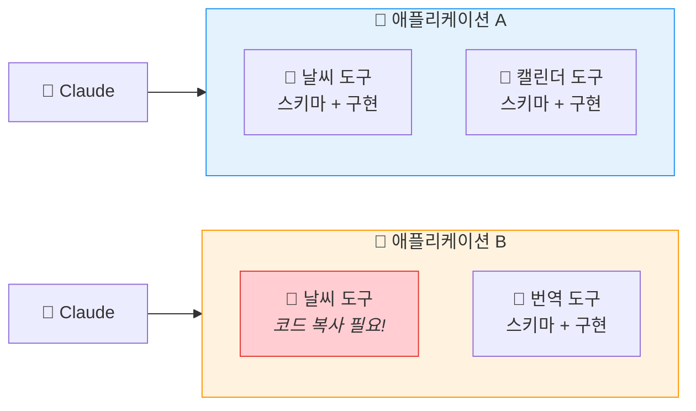
```mermaid
graph LR
    subgraph APP1["📱 애플리케이션 A"]
        direction TB
        T1A["🔧 날씨 도구<br/>스키마 + 구현"]
        T2A["🔧 캘린더 도구<br/>스키마 + 구현"]
    end

    subgraph APP2["📱 애플리케이션 B"]
        direction TB
        T1B["🔧 날씨 도구<br/><i>코드 복사 필요!</i>"]
        T2B["🔧 번역 도구<br/>스키마 + 구현"]
    end

    C1["🤖 Claude"] --> APP1
    C2["🤖 Claude"] --> APP2

    style APP1 fill:#e3f2fd,stroke:#2196f3
    style APP2 fill:#fff3e0,stroke:#ff9800
    style T1B fill:#ffcdd2,stroke:#e53935
```

| 문제 | 설명 |
| --- | --- |
| **코드 중복** | 같은 도구를 여러 앱에서 반복 구현 |
| **유지보수 부담** | 도구를 수정하면 모든 앱을 업데이트해야 함 |
| **확장 한계** | 새로운 LLM 호스트에 연결하려면 통합 코드를 다시 작성 |
| **공유 불가** | 팀 간 도구 공유가 어려움 |

### MCP: 도구를 독립된 서버로 분리

**MCP (Model Context Protocol)**는 이 문제를 해결한다. 도구를 **독립된 서버**로 분리하면, 어떤 LLM 호스트든 **같은 프로토콜**로 연결할 수 있다.

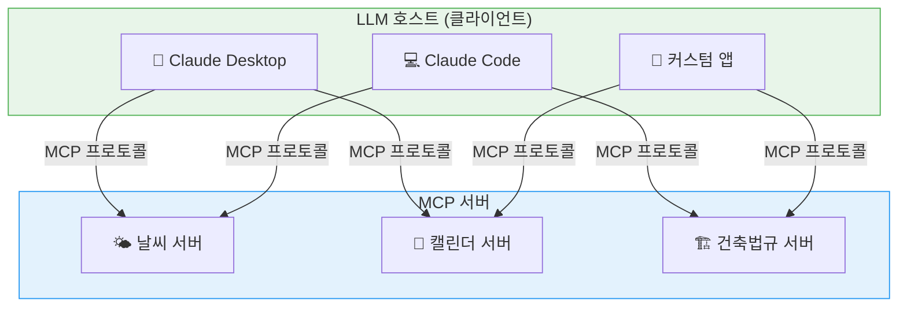
```mermaid
graph TB
    subgraph HOSTS["LLM 호스트 (클라이언트)"]
        H1["🤖 Claude Desktop"]
        H2["💻 Claude Code"]
        H3["📱 커스텀 앱"]
    end

    subgraph SERVERS["MCP 서버"]
        S1["🌤️ 날씨 서버"]
        S2["📅 캘린더 서버"]
        S3["🏗️ 건축법규 서버"]
    end

    H1 -->|"MCP 프로토콜"| S1
    H1 -->|"MCP 프로토콜"| S2
    H2 -->|"MCP 프로토콜"| S1
    H2 -->|"MCP 프로토콜"| S3
    H3 -->|"MCP 프로토콜"| S2
    H3 -->|"MCP 프로토콜"| S3

    style HOSTS fill:#e8f5e9,stroke:#4caf50
    style SERVERS fill:#e3f2fd,stroke:#2196f3
```

### Tool Use → MCP 진화

| Week 04: Tool Use | Week 07: MCP |
| --- | --- |
| 도구를 앱 코드에 직접 정의 | 도구를 **독립 서버**로 분리 |
| JSON Schema 수동 작성 | `@mcp.tool()` 데코레이터로 **자동 생성** |
| 앱별로 도구 구현 | **한 번 만들어 어디서든 재사용** |
| 단일 앱 내에서만 사용 | Claude Desktop, Claude Code 등 **모든 호스트에서 연결** |
| 도구(Tools)만 지원 | Tools + **Resources** + **Prompts** 3가지 기능 |

### 이번 주차의 프로젝트: 문서 관리 MCP 서버 → 구조공학 MCP 로 확장


```mermaid
graph TD
    subgraph PROJECT["🔧 Week 07 프로젝트: 문서 MCP 서버 (Skilljar 트랙)"]
        T["🔧 Tools<br/><i>read_doc_contents</i><br/><i>edit_document</i>"]
        R["📦 Resources<br/><i>docs://documents</i><br/><i>docs://documents/&#123;doc_id&#125;</i>"]
        P["💬 Prompts<br/><i>format</i><br/><i>(Markdown 재구성)</i>"]
    end

    H["🖥️ CLI 챗봇<br/>(MCP 클라이언트 내장)"] -->|"MCP stdio 프로토콜"| PROJECT
    PROJECT --> RESULT["✅ 문서 @멘션 + 재포맷<br/>'report.pdf 를 Markdown 으로<br/>변환해줘'"]

    PROJECT -.->|"도메인 확장"| DOMAIN["🏗️ 구조공학 MCP<br/>KDS 기준서 · Midas 결과<br/>설계 검토 프롬프트"]

    style PROJECT fill:#e8f4f8,stroke:#2980b9
    style H fill:#e8c07a,stroke:#c4a882,color:#333
    style RESULT fill:#d4edda,stroke:#27ae60
    style DOMAIN fill:#f3e5f5,stroke:#9c27b0
```

Skilljar S6 의 메인 프로젝트는 **CLI 챗봇 + 문서 MCP 서버** 다. 6 개의 메모리 내 문서(deposition.md, report.pdf, financials.docx, outlook.pdf, plan.md, spec.txt)를 대상으로 **읽기 도구**, **편집 도구**, **리소스 목록**, **리소스 상세**, **Markdown 재포맷 프롬프트** 를 구현한다. 본 강의노트는 이 흐름을 그대로 따라가되, 마지막 §2.7 에서 **구조공학 도메인** — KDS 기준서 조회, Midas 결과 파싱, 설계 검토 프롬프트 — 으로 확장한다.

### 주간 연결 다이어그램

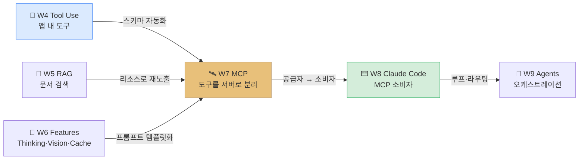
```mermaid
graph LR
    W4["📗 W4 Tool Use<br/>앱 내 도구"]
    W5["📘 W5 RAG<br/>문서 검색"]
    W6["📙 W6 Features<br/>Thinking·Vision·Cache"]
    W7["🛰️ W7 MCP<br/>도구를 서버로 분리"]
    W8["⌨️ W8 Claude Code<br/>MCP 소비자"]
    W9["🤖 W9 Agents<br/>오케스트레이션"]

    W4 -->|"스키마 자동화"| W7
    W5 -->|"리소스로 재노출"| W7
    W6 -->|"프롬프트 템플릿화"| W7
    W7 -->|"공급자 → 소비자"| W8
    W8 -->|"루프·라우팅"| W9

    style W7 fill:#e8c07a,stroke:#c4a882,color:#333
    style W4 fill:#dbeafe,stroke:#3b82f6
    style W8 fill:#d4edda,stroke:#27ae60
```

> [!finding] 세 주차의 역할
> - **W07 (이번 주)** — 당신이 **MCP 공급자(provider)** 가 된다. FastMCP 로 서버를 처음부터 짓는다.
> - **W08 (다음 주)** — 당신이 **MCP 소비자(consumer)** 가 된다. Claude Code 에 서버를 등록해 사용한다.
> - **W09** — **여러 MCP 서버를 오케스트레이션** 하는 에이전트 패턴으로 확장한다.

### Anthropic Skilljar 코스

이 강의노트는 Anthropic 공식 교육 플랫폼 Skilljar의 **"Building with the Claude API" Section 6: Model Context Protocol** (11개 레슨 L01~L11)을 기반으로 구성되었다.

| 레슨 | 제목 | Week 07 매핑 |
|---|---|---|
| L01 | Introducing MCP | Ch.1 §1.1 |
| L02 | MCP clients | Ch.1 §1.2 |
| L03 | Project setup | Ch.1 §1.3 |
| L04 | Defining tools with MCP | Ch.1 §1.4 |
| L05 | The server inspector | Ch.1 §1.5 |
| L06 | Implementing a client | Ch.2 §2.1 |
| L07 | Defining resources | Ch.2 §2.2 |
| L08 | Accessing resources | Ch.2 §2.3 |
| L09 | Defining prompts | Ch.2 §2.4 |
| L10 | Prompts in the client | Ch.2 §2.5 |
| L11 | MCP review (video-only) | Ch.2 §2.6 |

> [!ref] 소스 매핑
> - 온라인 코스: [Building with the Claude API](https://anthropic.skilljar.com/claude-with-the-anthropic-api)
> - GitHub 실습: [anthropics/courses — mcp](https://github.com/anthropics/courses/tree/master/mcp)
> - 실라버스 매핑: **Building — S6 (Model Context Protocol) → W7** (v2.3 기준)
> - 사전 학습 권장: [Introduction to Model Context Protocol](https://anthropic.skilljar.com/introduction-to-model-context-protocol) (1h, 16강, `IMCP` 트랙)

> [!method] 사전 준비
> - **Python 3.11+** 환경 (uv 권장) — `uv --version` 으로 확인
> - **Anthropic API 키** `.env` 에 `ANTHROPIC_API_KEY=sk-ant-...` 저장
> - **MCP SDK** 설치: `pip install "mcp[cli]"` 또는 `uv add "mcp[cli]"`
> - **cli_project.zip** — Skilljar L03 첨부 파일 (또는 `03-Exercises/Week_07/skilljar/` 의 시작 템플릿)
> - **노트북 순서**: `S6_01_mcp_server.ipynb` → `S6_02_mcp_inspector.ipynb` → `S6_03_mcp_client.ipynb` → `S6_04_resources.ipynb` → `S6_05_prompts.ipynb` → `S6_06_practice.ipynb` → `S6_07_structural_mcp.ipynb`

---
## [Chapter 1] MCP 서버 구축 (Lessons 1–5)

### 1.1 MCP 소개 (L01) — USB-C for Dev Environments

**MCP (Model Context Protocol)** 는 LLM 애플리케이션과 외부 도구·데이터 소스를 연결하는 **개방형 표준 프로토콜** 이다. MCP 를 다음과 같이 정의한다:

> *"Model Context Protocol (MCP) is a communication layer that provides Claude with context and tools without requiring you to write a bunch of tedious integration code. Think of it as a way to shift the burden of tool definitions and execution away from your server to specialized MCP servers."*

핵심은 **"tool definitions and execution 의 부담을 당신 서버에서 전용 MCP 서버로 옮긴다"** 는 것 — 곧 **통합 코드 작성 책임의 이관** 이다.


*MCP 의 기본 아키텍처 — MCP 클라이언트(당신의 서버)가 tools·prompts·resources 를 가진 MCP 서버에 연결한다*


*MCP 전체 아키텍처 다이어그램 --- 호스트·클라이언트·서버 3 계층의 역할 분리와 데이터 흐름*

#### MCP 이전: GitHub 챗봇 예제로 보는 통합 지옥

L01 은 실제 시나리오로 개념을 설명한다. 사용자가 *"What open pull requests are there across all my repositories?"* 라고 물으면, Claude 는 GitHub 의 API 에 접근할 도구가 필요하다. **MCP 가 없다면** 당신이 GitHub 통합 도구를 **전부 직접 만들어야** 한다 — 지원하려는 GitHub 기능 하나하나마다 스키마와 함수를 작성해야 한다.


*MCP 가 없을 때 — 당신이 GitHub 의 모든 통합 도구를 직접 구현해야 한다*

#### 도구 함수 문제 (The Tool Function Problem)

GitHub 는 **거대한 기능 집합** 을 가진다 — repositories, pull requests, issues, projects, 그리고 그 외 수많은 기능들. 완전한 GitHub 챗봇을 짓는다면 엄청난 수의 도구를 직접 제작해야 한다.


*Tool Function Problem — 각 도구마다 schema 와 function 구현이 모두 필요하다*


*도구 함수 문제의 본질 --- 통합 대상이 늘수록 schema·function·테스트·유지보수 비용이 곱셈으로 증가*

각 도구는 **schema definition 과 function implementation 을 모두** 필요로 한다. 이는 개발자가 직접 작성·테스트·유지보수해야 할 코드가 방대하다는 뜻이다.

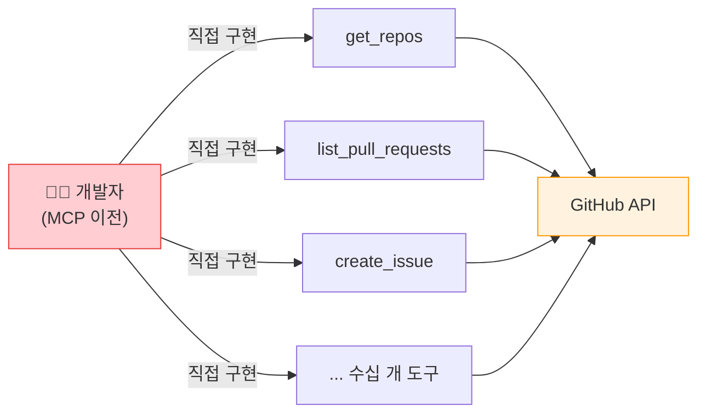
```mermaid
graph LR
    DEV["👨‍💻 개발자<br/>(MCP 이전)"] -->|"직접 구현"| T1["get_repos"]
    DEV -->|"직접 구현"| T2["list_pull_requests"]
    DEV -->|"직접 구현"| T3["create_issue"]
    DEV -->|"직접 구현"| TN["... 수십 개 도구"]

    T1 --> GH["GitHub API"]
    T2 --> GH
    T3 --> GH
    TN --> GH

    style DEV fill:#ffcdd2,stroke:#e53935
    style GH fill:#fff3e0,stroke:#ff9800
```

#### MCP 의 해결 방식

MCP 는 도구 정의와 실행의 부담을 **당신 서버에서 MCP 서버로** 옮긴다. GitHub 도구를 당신이 쓰는 대신, 그 도구들은 **전용 MCP 서버 안에서 제작·실행** 된다.


*MCP 서버가 GitHub 기능의 래퍼 역할을 한다 — 미리 만들어진 도구를 가져다 쓴다*


*MCP 서버는 외부 서비스의 데이터/기능을 재사용 가능한 컴포넌트로 패키징한다*


*MCP 의 해결 방식 한눈에 보기 --- 도구 정의·실행 부담을 당신의 서버에서 전용 MCP 서버로 이관*

#### MCP 에 대한 흔한 질문


L01 은 세 가지 흔한 질문에 답한다.

**Q1. 누가 MCP 서버를 제작하는가?**
누구나 MCP 서버 구현을 만들 수 있다. 특히 서비스 제공자(service provider) 들이 자사 서비스에 대한 공식 MCP 구현을 내놓는 경우가 많다 — 예컨대 AWS 가 자사 서비스용 공식 MCP 서버를 배포할 수 있다.

**Q2. MCP 는 직접 API 호출과 무엇이 다른가?**
MCP 서버는 **tool schema 와 function 이 이미 정의된 채** 제공된다. API 를 직접 호출하면 그 도구 정의들을 **당신이 직접 제작해야** 한다. MCP 는 그 구현 작업을 절감해 준다.

**Q3. MCP 는 결국 Tool Use 아닌가?**
이것이 가장 흔한 오해다. **MCP 서버와 Tool Use 는 보완적이지만 다른 개념** 이다. MCP 는 *"도구를 만들고 유지보수하는 일을 누가 할 것인가"* 에 관한 문제다 — MCP 에서는 **이미 다른 누군가가 도구 함수와 스키마를 써 주었고** 그것이 MCP 서버 안에 패키징되어 있다.

> [!tip] 핵심 통찰
> *"MCP servers provide tool schemas and functions already defined for you, eliminating the need to build and maintain complex integrations yourself."*
> — Skilljar L01 요약 문장

#### MCP vs Tool Use 관계도

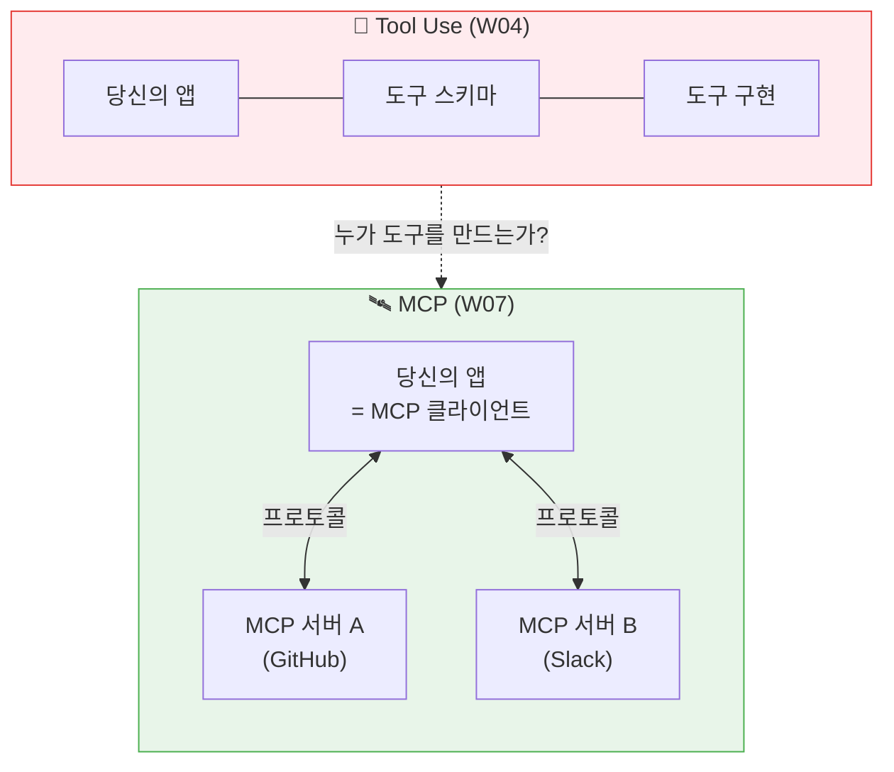
```mermaid
graph TB
    subgraph TOOLUSE["🔧 Tool Use (W04)"]
        TU1["당신의 앱"]
        TU2["도구 스키마"]
        TU3["도구 구현"]
        TU1 --- TU2 --- TU3
    end

    subgraph MCP["🛰️ MCP (W07)"]
        direction TB
        MC["당신의 앱<br/>= MCP 클라이언트"]
        MS1["MCP 서버 A<br/>(GitHub)"]
        MS2["MCP 서버 B<br/>(Slack)"]
        MC <-->|"프로토콜"| MS1
        MC <-->|"프로토콜"| MS2
    end

    TOOLUSE -.->|"누가 도구를 만드는가?"| MCP

    style TOOLUSE fill:#ffebee,stroke:#e53935
    style MCP fill:#e8f5e9,stroke:#4caf50
```

> [!action] 실습 노트북
> 📂 `03-Exercises/Week_07/skilljar/S6_01_mcp_server.ipynb`
> L01–L04 의 핵심 개념을 Python 코드로 재현한다 — FastMCP 초기화, 메모리 내 `docs` 딕셔너리, `@mcp.tool()` 데코레이터로 `read_doc_contents` / `edit_document` 도구를 정의하는 전 과정을 단계별 셀로 체험.

> [!method] cli_project 실행 가이드 (강의시간 실습)
> 본 섹션은 **이론 단계** — 코드 실행은 §1.3 셋업 이후. 미리 살펴볼 것:
> 1. 파일 탐색: `code 03-Exercises/Week_07/skilljar/cli_project/mcp_server.py` 로 열기
> 2. **L5**: `mcp = FastMCP("DocumentMCP", log_level="ERROR")` — 한 줄로 서버 생성
> 3. **L8-15**: `docs` dict 6개 문서 (`deposition.md`, `report.pdf`, `plan.md` 등)
> 4. **L17-44**: `@mcp.tool` 두 개 (`read_doc_contents`, `edit_document`)
> 5. 코드만 훑고 실행은 §1.3에서.

> [!ref] 소스: Skilljar L01 — Introducing MCP (287780)

---

### 1.2 MCP 클라이언트 아키텍처 (L02) — Transport-Agnostic Communication

MCP 클라이언트는 **당신의 서버와 MCP 서버 사이의 통신 브릿지** 다. 

> *"The MCP client serves as the communication bridge between your server and MCP servers. Think of it as your access point to all the tools that an MCP server provides. When you need to use external tools or services, the client handles all the message passing and protocol details for you."*

#### Transport Agnostic 이란?

MCP 의 핵심 강점 중 하나는 **transport agnostic** 이라는 점 — 클라이언트와 서버가 **다양한 통신 방법** 으로 서로 대화할 수 있다는 뜻이다. 가장 흔한 설정은 MCP 클라이언트와 서버가 **같은 머신에서** 실행되며 **standard input/output (stdio)** 로 통신하는 것이다.


*로컬 stdio 통신 — 가장 흔한 설정*

하지만 이게 전부가 아니다. MCP 클라이언트와 서버는 다음으로도 연결할 수 있다:

- **HTTP**
- **WebSockets**
- **Various other network protocols**


*transport-agnostic — 네트워크 프로토콜을 통한 원격 연결도 가능*


*클라이언트 ↔ 서버 통신 트랜스포트 비교 --- stdio·HTTP·WebSocket 의 사용 시나리오와 장단점 요약*

#### Message Types — 클라이언트·서버가 주고받는 메시지

연결되면 클라이언트와 서버는 **MCP specification 에 정의된 특정 메시지 타입** 들을 교환한다. 주로 다루게 될 메시지 타입은 다음 두 쌍이다.


**1. `ListToolsRequest` / `ListToolsResult`**
— 클라이언트가 서버에게 *"what tools do you provide?"* 를 물으면 서버가 사용 가능한 도구 목록을 돌려준다.


*ListTools — 도구 카탈로그 조회*

**2. `CallToolRequest` / `CallToolResult`**
— 클라이언트가 서버에게 특정 도구를 특정 인자로 실행해 달라고 요청하고, 결과를 받는다.


*CallTool — 도구 실행 요청과 결과*

#### 완전한 흐름 예제 — *"What repositories do I have?"*

L02 는 **사용자 질문 → 최종 응답** 까지의 전체 통신 플로우를 단계별로 시각화한다.


*Step 1 — 사용자가 쿼리 제출, 서버는 tool 목록이 필요함을 인지*

사용자가 쿼리를 제출하면서 프로세스가 시작된다. 당신의 서버는 Claude 에게 보내기 전에 **사용 가능한 도구 목록을 먼저 확보해야 함** 을 인식한다.


*Step 2 — 서버 → MCP 클라이언트 → MCP 서버: ListToolsRequest*

당신의 서버가 MCP 클라이언트에게 도구를 요청하면, 클라이언트는 MCP 서버에 `ListToolsRequest` 를 보내고 `ListToolsResult` 를 받는다.


*Step 3 — 사용자 질문 + 도구 목록 을 모두 확보*

이제 서버는 **사용자의 질문** 과 **사용 가능한 도구** 모두를 Claude 에게 첫 요청으로 보낼 수 있다.


*Step 4 — Claude 가 도구 호출을 결정*

Claude 는 도구들을 살펴보고 질문에 답하기 위해 도구 호출이 필요하다고 판단한다. 그 결과 **tool use request** 를 응답한다.


*Step 5 — 서버가 MCP 클라이언트에게 CallToolRequest 요청*

당신의 서버가 Claude 가 요청한 도구를 MCP 클라이언트를 통해 실행한다. MCP 클라이언트는 `CallToolRequest` 를 MCP 서버로 보내고, MCP 서버는 실제 GitHub 요청을 수행한다.


*Step 6 — GitHub 응답이 역순으로 돌아온다*

GitHub 가 repository 데이터를 반환하면, 그것이 MCP 서버 → `CallToolResult` 로 포장되어 → MCP 클라이언트 → 당신의 서버 순으로 흘러온다.


*Step 7 — 도구 결과를 Claude 에게 follow-up 메시지로 전달*

당신의 서버는 tool 결과를 Claude 에게 **follow-up 메시지** 로 되돌려 보낸다. 이제 Claude 는 완전한 답변을 만들 모든 정보를 가졌다.


*Step 8 — Claude 가 최종 답변 → 사용자*

마지막으로 Claude 가 포맷된 답을 내놓고, 당신의 서버가 그것을 사용자에게 전달한다.


*완전한 흐름 한 장 요약 --- 사용자 쿼리부터 최종 응답까지 8 단계 통신을 한눈에 정리*

#### 전체 흐름의 Mermaid 도식

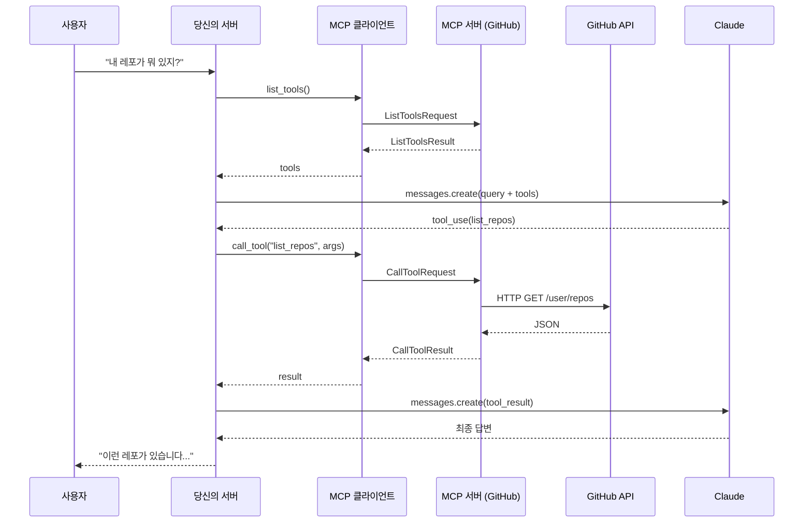
```mermaid
sequenceDiagram
    participant U as 사용자
    participant APP as 당신의 서버
    participant MC as MCP 클라이언트
    participant MS as MCP 서버 (GitHub)
    participant GH as GitHub API
    participant C as Claude

    U->>APP: "내 레포가 뭐 있지?"
    APP->>MC: list_tools()
    MC->>MS: ListToolsRequest
    MS-->>MC: ListToolsResult
    MC-->>APP: tools
    APP->>C: messages.create(query + tools)
    C-->>APP: tool_use(list_repos)
    APP->>MC: call_tool("list_repos", args)
    MC->>MS: CallToolRequest
    MS->>GH: HTTP GET /user/repos
    GH-->>MS: JSON
    MS-->>MC: CallToolResult
    MC-->>APP: result
    APP->>C: messages.create(tool_result)
    C-->>APP: 최종 답변
    APP-->>U: "이런 레포가 있습니다..."
```

> [!finding] 단계가 많아 보이지만
> *"Yes, this flow involves many steps, but each component has a clear responsibility. The MCP client abstracts away the complexity of server communication, letting you focus on building your application logic."*
> 각 컴포넌트의 책임이 명확하게 분리되어 있어, 당신은 **애플리케이션 로직** 에만 집중하면 된다. 이후 §2.1 에서 직접 구현하며 이 분리를 실감하게 된다.

> [!action] 실습 노트북
> 📂 `03-Exercises/Week_07/skilljar/S6_03_mcp_client.ipynb`
> L02·L06 에서 다룰 **MCP 클라이언트 구현** — `MCPClient` 클래스, async context manager, `list_tools` / `call_tool` 메서드 — 을 실제로 구성하고, 위의 sequence diagram 을 Python 코드로 재현한다.

> [!method] cli_project 실행 가이드
> §1.2의 sequence diagram을 코드로 확인:
> 1. `cli_project/mcp_client.py` 열기
> 2. **L11-86**: `class MCPClient` 골격 — `__init__` / `connect` / `list_tools` / `call_tool` / `__aenter__`/`__aexit__`
> 3. **L67-75**: `read_resource(uri)` — MIME type 분기 (`application/json` → `json.loads`)
> 4. 강의노트 §1.2 라인 397 근처의 mermaid sequence가 어떻게 코드로 매핑되는지 확인

> [!ref] 소스: Skilljar L02 — MCP clients (287775)

---

### 1.3 프로젝트 셋업 (L03) — CLI 챗봇 + MCP 서버

본 섹션은 이후 모든 구현의 **공통 출발점** 이 되는 프로젝트를 설정한다. 핵심 문장은:

> *"We're going to build a CLI-based chatbot to better understand how MCP clients and servers work together."*

#### 무엇을 만드는가

CLI 기반 챗봇이며, 사용자는 **문서 컬렉션** 과 커맨드 라인 인터페이스로 상호작용한다. 시스템은 **두 개의 주 컴포넌트** 로 구성된다:

- **MCP 클라이언트** — 사용자 상호작용을 처리
- **커스텀 MCP 서버** — 문서 작업을 관리


*프로젝트 아키텍처 — CLI 챗봇(MCP 클라이언트) + 문서 MCP 서버*

서버는 **두 개의 핵심 도구** 를 제공한다: 문서 내용을 읽는 도구와 문서를 업데이트하는 도구. 모든 문서는 **간결성을 위해 메모리 내(in-memory)** 에 저장된다 — 데이터베이스는 필요하지 않다.

#### 중요한 아키텍처 노트

> [!tip] 실무에서는 보통 한 쪽만 구현한다
> *"In real-world projects, you typically implement either an MCP client or an MCP server, not both."*
> 일반적으로 당신은:
> - **MCP 서버** — 당신의 서비스를 다른 개발자들에게 노출할 때
> - **MCP 클라이언트** — 기존 MCP 서버에 연결할 때
> 둘 중 **하나만** 만든다. 이 프로젝트에서 **둘 다** 만드는 것은 **순전히 교육 목적** — 어떻게 소통하고 함께 동작하는지를 직접 보기 위함이다.


*일반적 실무 패턴 — 당신은 서버 또는 클라이언트 중 한 쪽만 구현한다*

#### 프로젝트 셋업 단계

1. **cli_project.zip** 을 L03 에 첨부된 링크에서 내려받아 원하는 개발 디렉토리에 압축 해제
2. 코드 에디터를 해당 폴더에서 연다

프로젝트에 포함된 README 를 따라:

- `.env` 파일에 **Anthropic API 키** 추가
- **UV (권장) 또는 pip** 으로 의존성 설치
- **스타터 애플리케이션** 을 실행해 동작 확인

터미널에서 프로젝트 디렉토리로 이동하면 다음 주요 파일들이 보인다:
- `main.py`
- `mcp_client.py`
- `mcp_server.py`

#### 애플리케이션 실행

L03 가 제시하는 실행 명령은 두 가지 중 하나다.

```bash
# UV 를 쓴다면 (권장)
uv run main.py

# 표준 Python 이라면
python main.py
```

애플리케이션이 정상 기동하면 채팅 프롬프트가 나타난다. 간단한 질문 — *"what's 1+1?"* — 으로 테스트하면 Claude 가 빠른 응답을 준다.

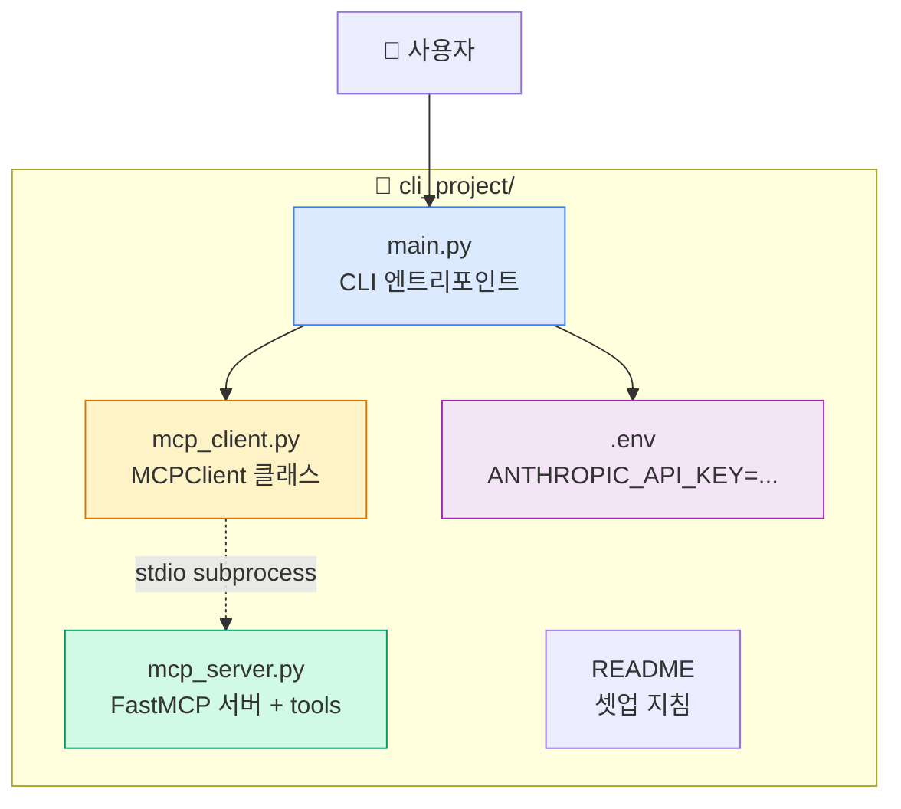
```mermaid
graph TB
    subgraph PROJECT["📁 cli_project/"]
        MAIN["main.py<br/>CLI 엔트리포인트"]
        CLIENT["mcp_client.py<br/>MCPClient 클래스"]
        SERVER["mcp_server.py<br/>FastMCP 서버 + tools"]
        ENV[".env<br/>ANTHROPIC_API_KEY=..."]
        README["README<br/>셋업 지침"]
    end

    USER["👤 사용자"] --> MAIN
    MAIN --> CLIENT
    CLIENT -.->|"stdio subprocess"| SERVER
    MAIN --> ENV

    style MAIN fill:#dbeafe,stroke:#3b82f6
    style CLIENT fill:#fef3c7,stroke:#d97706
    style SERVER fill:#d1fae5,stroke:#059669
    style ENV fill:#f3e5f5,stroke:#9c27b0
```

> [!method] 셋업 체크리스트
> - [ ] Python 3.11+ 설치 (`python --version`)
> - [ ] UV 설치: `curl -LsSf https://astral.sh/uv/install.sh | sh`
> - [ ] `cli_project.zip` 다운로드·압축 해제
> - [ ] `.env` 에 `ANTHROPIC_API_KEY=sk-ant-...` 추가
> - [ ] `uv sync` 또는 `pip install -r requirements.txt`
> - [ ] `uv run main.py` 로 테스트 실행
> - [ ] 프롬프트에서 `what's 1+1?` 입력 → 응답 확인

> [!action] 실습 노트북
> 📂 `03-Exercises/Week_07/skilljar/S6_01_mcp_server.ipynb`
> 프로젝트 구조 스캐폴딩을 노트북에서 해부한다 — `main.py` 의 이벤트 루프, `MCPClient` 의 `async with` 컨텍스트, `FastMCP("DocumentMCP")` 초기화 셀을 각각 실행 가능한 단위로 쪼개서 체험.

> [!method] cli_project 실행 가이드 — 환경 셋업 (강의시간 실습 시작)
> 1. 터미널 새 창에서: `cd 03-Exercises/Week_07/skilljar/cli_project`
> 2. (UV 사용) `uv venv && source .venv/bin/activate && uv pip install -e .` 또는
>    (pip) `python -m venv .venv && source .venv/bin/activate && pip install -e .`
> 3. `.env` 파일 작성: `ANTHROPIC_API_KEY=sk-ant-...` + `CLAUDE_MODEL=claude-haiku-4-5`
> 4. 셋업 검증: `uv run main.py` (또는 `python main.py`) 실행 → 챗봇 프롬프트 표시
> 5. 빠른 테스트: `What's 1+1?` 입력 → Claude의 단순 응답 확인 → `Ctrl+C` 또는 `exit` 종료
> 6. 막히면 `cli_project/README.md` 의 한국어 주석을 다시 읽기

> [!ref] 소스: Skilljar L03 — Project setup (287785)

---

### 1.4 MCP 도구 정의 (L04) — `@mcp.tool()` 데코레이터

MCP 서버 구축은 **공식 Python SDK** 를 쓰면 훨씬 단순해진다. 복잡한 JSON 스키마를 수동으로 작성하는 대신, **SDK 가 데코레이터와 타입 힌트로 모든 복잡성** 을 처리해 준다.


*Tool 정의의 구조 — 데코레이터 + 타입 힌트 + Pydantic Field*


*FastMCP 로 도구를 정의하는 전체 그림 --- 한 줄 초기화부터 데코레이터·타입 힌트·스키마 자동 생성까지*

L04 의 예제는 **메모리 내 문서 관리 MCP 서버** 를 만든다. 두 도구를 제공한다: 문서 내용을 읽는 도구와 find-and-replace 로 문서를 업데이트하는 도구.

#### MCP 서버 초기화 — FastMCP 한 줄

Python MCP SDK 는 서버 생성을 놀랄 만큼 간단하게 만든다. **한 줄로 완전한 MCP 서버** 를 초기화할 수 있다:

```python
from mcp.server.fastmcp import FastMCP

mcp = FastMCP("DocumentMCP", log_level="ERROR")
```

- `"DocumentMCP"` — 서버 이름 (클라이언트 로그·디버그에서 보이는 식별자)
- `log_level="ERROR"` — 잡음을 줄이기 위해 에러만 출력

#### 문서 저장소 — 메모리 내 dict

본 구현에서 문서는 **단순 Python 딕셔너리** 에 저장된다. 키는 문서 ID, 값은 문서 내용이다.

```python
docs = {
    "deposition.md": "This deposition covers the testimony of Angela Smith, P.E.",
    "report.pdf": "The report details the state of a 20m condenser tower.",
    "financials.docx": "These financials outline the project's budget and expenditure",
    "outlook.pdf": "This document presents the projected future performance of the",
    "plan.md": "The plan outlines the steps for the project's implementation.",
    "spec.txt": "These specifications define the technical requirements for the equipment"
}
```

> [!tip] 여섯 문서의 의도
> 이 고정된 6개 문서는 단순 더미 아니다 — *Angela Smith, P.E.* (건설 전문 엔지니어) · *condenser tower* · *project budget* · *technical specifications* 등 **건축·엔지니어링 도메인** 의 느낌으로 구성되어 있다. Skilljar 예제가 엔지니어링 학생들에게도 친숙하도록 의도된 것. 본 강의의 §2.7 에서 이 패턴을 **KDS 조문·Midas 결과** 로 확장한다.

#### 데코레이터로 도구 정의


*데코레이터 접근법 — 장황한 JSON 스키마가 깨끗한 Python 함수로*

SDK 는 도구 생성을 장황한 프로세스에서 깨끗하고 읽기 쉬운 코드로 바꾼다. 긴 JSON 스키마를 쓰는 대신 **Python 데코레이터와 타입 힌트** 를 사용한다.

#### 문서 읽기 도구 — `read_doc_contents`

첫 번째 도구는 Claude 가 ID 로 어떤 문서든 읽을 수 있게 한다. 전체 구현은 다음과 같다:

```python
@mcp.tool(
    name="read_doc_contents",
    description="Read the contents of a document and return it as a string."
)
def read_document(
    doc_id: str = Field(description="Id of the document to read")
):
    if doc_id not in docs:
        raise ValueError(f"Doc with id {doc_id} not found")

    return docs[doc_id]
```

- `@mcp.tool` 데코레이터가 **Claude 에게 필요한 JSON 스키마를 자동 생성** 한다
- Pydantic 의 `Field` 클래스가 **매개변수 설명** 을 제공하여 Claude 가 각 인자가 무엇을 기대하는지 이해하도록 돕는다

#### 문서 편집 도구 — `edit_document`

두 번째 도구는 문서에 **간단한 find-and-replace** 를 수행한다:

```python
@mcp.tool(
    name="edit_document",
    description="Edit a document by replacing a string in the documents content with a new string."
)
def edit_document(
    doc_id: str = Field(description="Id of the document that will be edited"),
    old_str: str = Field(description="The text to replace. Must match exactly, including whitespace."),
    new_str: str = Field(description="The new text to insert in place of the old text.")
):
    if doc_id not in docs:
        raise ValueError(f"Doc with id {doc_id} not found")

    docs[doc_id] = docs[doc_id].replace(old_str, new_str)
```

세 매개변수 — 문서 ID, 찾을 텍스트, 대체할 텍스트 — 를 받고 Python 내장 `str.replace()` 를 사용한다.

#### 에러 처리

두 도구 모두 **Claude 가 존재하지 않는 문서를 요청** 하는 경우를 처리하기 위한 기본 에러 처리를 포함한다. 유효하지 않은 문서 ID 가 주어지면 도구들은 설명적 메시지와 함께 `ValueError` 를 발생시킨다 — Claude 는 이 메시지를 이해하고 잠재적으로 교정 행동(다른 ID 재시도 등)을 취할 수 있다.

#### SDK 접근법의 핵심 이점

> [!finding] `@mcp.tool()` 데코레이터가 주는 것
> - Python 타입 힌트로부터 **JSON 스키마 자동 생성**
> - 깨끗하고 유지보수하기 쉬운 **가독성 좋은 코드**
> - Pydantic 을 통한 **내장 매개변수 검증**
> - 수동 스키마 작성 대비 **보일러플레이트 감소**
> - 개발을 위한 **타입 안전성과 IDE 지원**

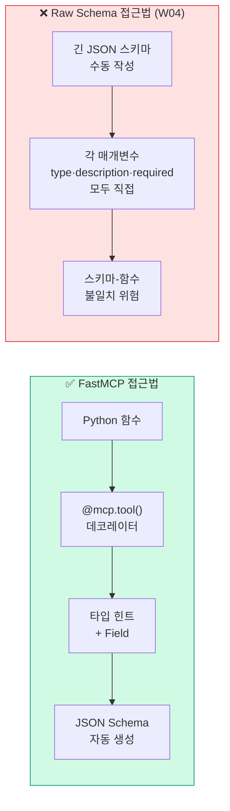
```mermaid
graph LR
    subgraph PY["✅ FastMCP 접근법"]
        P1["Python 함수"]
        P2["@mcp.tool()<br/>데코레이터"]
        P3["타입 힌트<br/>+ Field"]
        P1 --> P2 --> P3
        P3 --> P4["JSON Schema<br/>자동 생성"]
    end

    subgraph RAW["❌ Raw Schema 접근법 (W04)"]
        R1["긴 JSON 스키마<br/>수동 작성"]
        R2["각 매개변수<br/>type·description·required<br/>모두 직접"]
        R3["스키마-함수<br/>불일치 위험"]
        R1 --> R2 --> R3
    end

    style PY fill:#d1fae5,stroke:#059669
    style RAW fill:#fee2e2,stroke:#dc2626
```

> [!tip] 타입 힌트만으로 스키마가 만들어진다
> `doc_id: str = Field(description="...")` 한 줄이 JSON Schema 의 `{"type": "object", "properties": {"doc_id": {"type": "string", "description": "..."}}, "required": ["doc_id"]}` 를 대체한다. W04 에서 손으로 썼던 스키마를 기억한다면, 이 단축이 얼마나 큰 축복인지 체감될 것.

> [!action] 실습 노트북
> 📂 `03-Exercises/Week_07/skilljar/S6_01_mcp_server.ipynb`
> `@mcp.tool()` 데코레이터로 `read_doc_contents` 와 `edit_document` 를 정의하고, `mcp.list_tools()` 로 자동 생성된 스키마를 직접 확인한다. Pydantic `Field` 의 `description` 이 Claude 의 도구 선택에 어떻게 영향을 주는지도 실험한다.

> [!method] cli_project 실행 가이드 — Field description 실험
> 1. `cli_project/mcp_server.py` 열기 → **L17-28** `read_doc_contents` 데코레이터 확인
> 2. **실험**: `description` 문구를 모호하게 바꿔보기 (예: `"do something"`) 후 §1.5의 Inspector로 도구 호출 시 Claude의 도구 선택 행동 변화 관찰
> 3. **원복**: `git diff mcp_server.py` 확인 후 원래 description 복구
> 4. 학습 포인트: Field description은 Claude의 도구 선택을 좌우하는 핵심 단서

> [!ref] 소스: Skilljar L04 — Defining tools with MCP (287797)

---

### 1.5 서버 인스펙터 (L05) — 브라우저 기반 디버깅 UI

MCP 서버를 구축할 때는 **완전한 애플리케이션에 연결하지 않고도 기능을 테스트** 할 방법이 필요하다. Python MCP SDK 는 **브라우저 기반 인스펙터** 를 내장하고 있어, 서버를 실시간으로 디버그·테스트할 수 있게 한다.

#### 인스펙터 시작

먼저 Python 환경이 활성화되었는지 확인한다(프로젝트 README 참조). 그런 다음:

```bash
mcp dev mcp_server.py
```

이 명령이 **포트 6277 에 개발 서버를 띄우고** 브라우저에서 열 수 있는 로컬 URL 을 제공한다. 인스펙터 인터페이스가 로드되면서 MCP Inspector 대시보드가 나타난다.


*MCP Inspector 대시보드 초기 화면 — 포트 6277 로 기동*


*MCP Inspector UI 구성 요소 --- Tools·Resources·Prompts 탭과 좌측 Connect / 우측 결과 패널의 역할*

> [!tip] 인터페이스는 진화 중
> *"The MCP inspector is actively being developed, so the interface you see might look different from current screenshots. However, the core functionality for testing tools, resources, and prompts should remain similar."*
> UI 가 스크린샷과 다르게 보여도 당황하지 말 것 — 도구·리소스·프롬프트 테스트의 핵심 기능은 유지된다.

#### 연결과 도구 테스트

왼쪽의 **"Connect" 버튼** 을 클릭해 MCP 서버를 시작한다. 연결되면 **Resources, Prompts, Tools** 및 기타 기능을 위한 네비게이션 바가 보인다.


*Connect 클릭 후 — Resources / Prompts / Tools 네비게이션이 활성화*

도구 테스트 절차는 다음과 같다:

1. **Tools** 섹션으로 이동
2. **"List Tools"** 를 클릭해 사용 가능한 도구 전체를 본다
3. 도구를 선택하면 해당 도구의 **테스트 인터페이스** 가 열린다
4. 필요한 매개변수를 채운다
5. **"Run Tool"** 을 클릭해 실행하고 결과를 본다


*Tools 섹션에서 도구를 선택 → 매개변수 입력 → Run Tool*

#### 문서 작업 테스트 예시

예컨대 **문서 읽기 도구** 를 테스트하려면 `deposition.md` 같은 문서 ID 를 입력하고 도구를 실행한다. 인스펙터는 반환된 내용 또는 성공 메시지 같은 결과를 보여준다.


*read_doc_contents 를 실행한 결과 — 반환 텍스트가 인스펙터에 출력*

#### 작업 연쇄로 기능 검증

한 작업에서 다음 작업으로 **연쇄 검증** 할 수도 있다. 예컨대 텍스트를 교체해 문서를 편집한 직후, 즉시 read 도구를 다시 실행해 **변경이 올바르게 적용되었는지 확인** 한다.

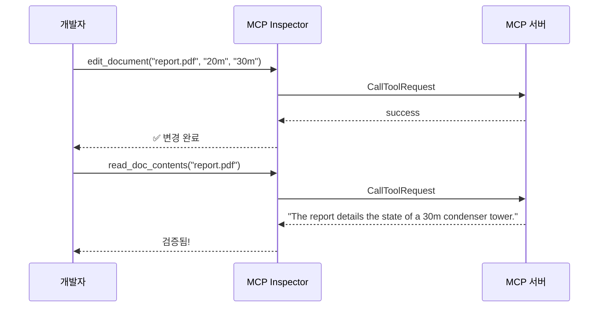
```mermaid
sequenceDiagram
    participant DEV as 개발자
    participant INS as MCP Inspector
    participant SRV as MCP 서버

    DEV->>INS: edit_document("report.pdf", "20m", "30m")
    INS->>SRV: CallToolRequest
    SRV-->>INS: success
    INS-->>DEV: ✅ 변경 완료
    DEV->>INS: read_doc_contents("report.pdf")
    INS->>SRV: CallToolRequest
    SRV-->>INS: "The report details the state of a 30m condenser tower."
    INS-->>DEV: 검증됨!
```

#### 개발 워크플로 — 빠른 반복 루프

인스펙터는 **효율적인 개발 루프** 를 만들어낸다:

- MCP 서버 코드를 수정
- 인스펙터로 **개별 도구를 테스트**
- 완전한 애플리케이션 셋업 없이 **결과 검증**
- **격리된 상태에서 이슈를 디버그**

더 복잡한 MCP 서버를 만들수록 이 도구는 필수가 된다. Claude 나 다른 애플리케이션에 서버를 **wiring up** 해야만 기본 기능을 테스트할 수 있다는 제약을 제거해 — 개발을 훨씬 빠르고 집중적으로 만든다.

> [!method] 개발 루프 체크리스트
> 1. `mcp dev mcp_server.py` 로 인스펙터 기동 (포트 6277)
> 2. 브라우저에서 **Connect** → **Tools > List Tools**
> 3. 개별 도구의 파라미터 폼에서 값 입력 → **Run Tool**
> 4. 결과 영역에서 **반환값 + 에러 로그** 확인
> 5. `mcp_server.py` 수정 후 인스펙터가 자동 리로드되는지 확인
> 6. 문제 없으면 Resources / Prompts 탭에서 각각 반복

> [!finding] 왜 인스펙터가 필수인가
> Claude 와 실제 연결하려면 **API 호출 · 토큰 소모 · 느린 피드백** 이 생긴다. 인스펙터는 **LLM 없이 서버 계약만 먼저** 검증하므로, 도구 스키마·에러 핸들링·반환 타입의 버그를 **몇 초 단위 루프** 로 잡을 수 있다. 이후 Claude 에 붙였을 때 비로소 *"모델이 이 도구를 잘 고르는가"* 같은 상위 문제에 집중할 수 있게 된다.

> [!action] 실습 노트북
> 📂 `03-Exercises/Week_07/skilljar/S6_02_mcp_inspector.ipynb`
> Jupyter 서브프로세스에서 `mcp dev mcp_server.py` 를 띄우고, `http://localhost:6277` 를 iframe 으로 렌더링해 **도구 List → Run → Result** 루프를 노트북 안에서 재현한다. 브라우저가 막힌 환경(Colab 등)에서는 `mcp run` 의 JSON-RPC 메시지를 직접 stdin/stdout 으로 주고받는 대체 경로도 안내.

> [!method] cli_project 실행 가이드 — Inspector 기동
> 1. `cd cli_project && uv run mcp dev mcp_server.py` (UV 미사용 시 `mcp dev mcp_server.py`)
> 2. 브라우저에서 `http://localhost:6277` 접속
> 3. **Connect** 버튼 클릭 → Tools / Resources / Prompts 탭 확인
> 4. **edit→read 연쇄 검증**:
>    - Tools 탭 → `edit_document` 선택 → `doc_id="plan.md", old_str="outlines", new_str="describes"` 실행
>    - 다시 `read_doc_contents` 선택 → `doc_id="plan.md"` 실행 → 변경 확인
>    - 원복: `edit_document` 다시 호출, `old_str="describes", new_str="outlines"`
> 5. 종료: 터미널에서 `Ctrl+C`

> [!ref] 소스: Skilljar L05 — The server inspector (287781)

---
## [Chapter 2] 클라이언트 구현과 리소스·프롬프트 (Lessons 6–11)

### 2.1 클라이언트 구현 (L06) — `MCPClient` 클래스와 async context manager

MCP 서버가 동작하니 이제 **클라이언트 쪽** 을 만들 차례다. 클라이언트는 우리 애플리케이션이 MCP 서버와 통신하고 그 기능에 접근하게 해 주는 코드다.

#### 클라이언트 아키텍처 이해

> [!tip] 보통은 한 쪽만 만든다
> *"In most real-world projects, you'll either implement an MCP client OR an MCP server - not both. We're building both in this project just so you can see how they work together."*
> 실무에서는 클라이언트 **또는** 서버 중 한 쪽만 구현하는 게 일반적이다 — 본 프로젝트에서 둘 다 만드는 건 오직 **둘이 어떻게 협업하는지를 보기 위함** 이다.


*클라이언트 측 두 컴포넌트 — MCP Client (우리 클래스) + Client Session (SDK 제공)*

MCP 클라이언트는 **두 개의 주요 컴포넌트** 로 구성된다:

- **MCP Client** — 세션을 더 쓰기 쉽게 만들기 위해 **우리가 만드는 커스텀 클래스**
- **Client Session** — 서버로의 실제 연결 (MCP Python SDK 의 일부)


*Client Session 은 리소스 정리가 필요 — 그래서 우리 커스텀 클래스로 래핑*

클라이언트 세션은 **종료 시 적절한 리소스 정리(resource cleanup)** 가 필요하다. 그래서 우리가 만든 `MCPClient` 클래스로 감싸 그 정리를 자동화한다.

#### 애플리케이션 안에서의 위치


*애플리케이션 플로우 — CLI 코드는 MCP 서버로 두 가지 작업을 한다*

우리 CLI 코드가 MCP 서버로 해야 할 두 가지 주요 일을 기억하자:

- Claude 에게 보낼 **사용 가능한 도구 목록** 을 가져오기
- Claude 가 요청한 **도구를 실행** 하기

MCP 클라이언트는 이 두 능력을 **간단한 메서드 호출** 로 제공하여, 우리 애플리케이션 코드가 그것을 쓸 수 있게 한다.

#### 핵심 메서드 구현

우리 클라이언트에는 두 개의 핵심 메서드를 구현해야 한다: `list_tools()` 와 `call_tool()`.

##### `list_tools()` 메서드

이 메서드는 서버에서 **사용 가능한 모든 도구** 를 가져온다:

```python
async def list_tools(self) -> list[types.Tool]:
    result = await self.session().list_tools()
    return result.tools
```

단순하다 — 우리 세션(서버로의 연결)에 접근하고, 내장된 `list_tools()` 함수를 호출하고, 결과에서 `tools` 를 반환한다.

##### `call_tool()` 메서드

이 메서드는 서버에서 **특정 도구를 실행** 한다:

```python
async def call_tool(
    self, tool_name: str, tool_input: dict
) -> types.CallToolResult | None:
    return await self.session().call_tool(tool_name, tool_input)
```

Claude 가 제공한 도구 이름과 입력 매개변수를 서버로 넘기고 결과를 반환한다.

#### 클라이언트 테스트

구현을 테스트하려면 클라이언트를 직접 실행할 수 있다. 파일에는 우리 MCP 서버에 연결하고 우리 메서드를 호출하는 **테스트 하네스** 가 포함되어 있다:

```python
async with MCPClient(
    command="uv", args=["run", "mcp_server.py"]
) as client:
    result = await client.list_tools()
    print(result)
```

이 테스트를 실행하면 **우리가 만들었던 도구 정의** 가 인쇄되어야 한다 — `read_doc_contents` 와 `edit_document`.

> [!tip] `async with` 의 의미
> `MCPClient` 는 **async context manager** 로 설계되어 있다 — `__aenter__` 에서 서버 subprocess 기동 + stdio 연결을, `__aexit__` 에서 **안전한 종료·리소스 해제** 를 수행한다. `command="uv", args=["run", "mcp_server.py"]` 한 쌍이 **"로컬 stdio transport"** 를 지정하는 부분이며, 이 인자를 바꾸면 HTTP·WebSocket 등 다른 transport 로도 교체 가능하다.

#### 전체 플로우 조합

이제 클라이언트가 도구를 나열하고 호출할 수 있으니 **완전한 플로우** 를 테스트할 수 있다. 메인 애플리케이션을 돌리고 Claude 에게 문서에 관해 물어보면:

- 우리 코드가 클라이언트로 **사용 가능한 도구를 조회**
- 이 도구들이 **사용자 질문과 함께 Claude 에게 전송**
- Claude 가 `read_doc_contents` 도구를 쓰기로 결정
- 우리 코드가 클라이언트로 그 도구를 실행
- 결과가 Claude 에게 되돌려지고 Claude 가 **사용자에게 응답**

예를 들어 *"What is the contents of the report.pdf document?"* 를 물으면 Claude 가 문서 읽기 도구를 호출하고, 서버에서 설정한 **20m condenser tower** 관련 문서 내용을 얻어 답한다.

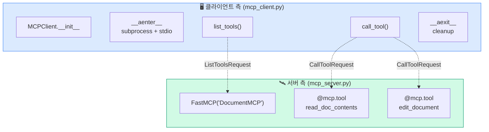
```mermaid
graph TB
    subgraph CLIENT_SIDE["🖥️ 클라이언트 측 (mcp_client.py)"]
        C1["MCPClient.__init__"]
        C2["__aenter__<br/>subprocess + stdio"]
        C3["list_tools()"]
        C4["call_tool()"]
        C5["__aexit__<br/>cleanup"]
    end

    subgraph SERVER_SIDE["🛰️ 서버 측 (mcp_server.py)"]
        S1["FastMCP('DocumentMCP')"]
        S2["@mcp.tool<br/>read_doc_contents"]
        S3["@mcp.tool<br/>edit_document"]
    end

    C3 -.->|"ListToolsRequest"| S1
    C4 -.->|"CallToolRequest"| S2
    C4 -.->|"CallToolRequest"| S3

    style CLIENT_SIDE fill:#dbeafe,stroke:#3b82f6
    style SERVER_SIDE fill:#d1fae5,stroke:#059669
```

> [!finding] 브릿지로서의 클라이언트
> *"The client acts as the bridge between our application logic and the MCP server, making it easy to access server functionality without worrying about the underlying connection details."*
> 연결 세부사항은 전부 클라이언트가 감추므로, 우리는 `await client.list_tools()` / `await client.call_tool(...)` 같은 **도메인 로직 수준의 호출** 만 쓰면 된다.

> [!action] 실습 노트북
> 📂 `03-Exercises/Week_07/skilljar/S6_03_mcp_client.ipynb`
> `MCPClient` 클래스를 Jupyter 커널 안에서 만들고, `async with` 블록 안에서 `list_tools()` → `call_tool()` 을 직접 호출한다. 실제 Claude 메시지 루프에 끼워 넣어 *"Claude 가 도구를 선택 → 우리 클라이언트가 실행 → 결과를 다시 Claude 에게"* 의 전 사이클을 체험.

> [!method] cli_project 실행 가이드 — CLI 챗봇 첫 실행
> 1. `cd cli_project && uv run main.py`
> 2. 챗봇 프롬프트에 `What's 1+1?` 입력 → 도구 사용 없는 단순 응답 확인
> 3. 다른 일반 질문 시도: `Tell me a joke about engineering`
> 4. 도구 호출이 일어나지 않는 이유: 일반 질문은 docs 컨텍스트 불필요 → Claude가 도구 미사용 결정
> 5. 다음 단계 (§2.3)에서 `@plan.md` 멘션으로 도구 호출 트리거

> [!ref] 소스: Skilljar L06 — Implementing a client (287793)

---

### 2.2 리소스 정의 (L07) — `@mcp.resource()` 로 데이터 노출

MCP 서버의 **Resources** 는 **클라이언트에게 데이터를 노출** 하는 방법이다. 일반적인 HTTP 서버의 **GET 요청 핸들러** 와 유사하다 — 액션을 수행하기보다 **정보를 가져오는** 시나리오에 적합하다.

#### 예제로 이해하는 리소스 — 문서 멘션 기능

*"사용자가 `@document_name` 을 입력해 파일을 참조"* 하는 **문서 멘션 기능** 을 만든다고 하자. 두 가지 작업이 필요하다:

- **사용 가능한 모든 문서 목록 조회** (autocomplete 용)
- **특정 문서의 내용 조회** (멘션되었을 때)


*Resources 의 핵심 개념 --- HTTP GET 처럼 데이터를 노출하는 읽기 전용 채널, Tools 와 책임 분리*


*@멘션 기능 — @ 입력 시 문서 목록 드롭다운, 선택 시 내용 주입*

사용자가 `@` 를 입력하면 **사용 가능한 문서를 보여줘야** 한다. 그리고 멘션이 포함된 메시지를 제출하면 **해당 문서의 내용을 Claude 에게 보내는 프롬프트에 자동 주입** 해야 한다.


*멘션의 데이터 플로우 — 클라이언트가 리소스 요청 → 서버 응답 → 프롬프트에 주입*

#### 리소스의 동작 방식 — Request/Response 패턴

리소스는 **요청-응답 패턴** 을 따른다. 클라이언트가 URI 와 함께 `ReadResourceRequest` 를 보내면, MCP 서버가 데이터로 응답한다. **URI 는 접근하려는 리소스의 주소** 처럼 작동한다.


*ReadResourceRequest/Response — URI 로 리소스를 식별*

#### 리소스의 두 종류


*Direct vs Templated 리소스*

- **Direct Resources** — 변하지 않는 **정적 URI** (예: `docs://documents`)
- **Templated Resources** — **매개변수가 있는 URI** (예: `docs://documents/{doc_id}`)

Templated Resources 의 경우 Python SDK 가 **URI 에서 매개변수를 자동 파싱** 하고 키워드 인자로 함수에 전달한다.

#### 리소스 구현 — `@mcp.resource()` 데코레이터

리소스는 `@mcp.resource()` 데코레이터로 정의된다. 두 종류 모두 구현해 보자.

##### Direct Resource — 문서 목록

```python
@mcp.resource(
    "docs://documents",
    mime_type="application/json"
)
def list_docs() -> list[str]:
    return list(docs.keys())
```

- URI `docs://documents` 는 고정 — 파라미터 없음
- 반환 타입은 `list[str]` — SDK 가 자동으로 JSON 직렬화
- `mime_type="application/json"` — 클라이언트에게 JSON 이라고 힌트

##### Templated Resource — 특정 문서 조회

```python
@mcp.resource(
    "docs://documents/{doc_id}",
    mime_type="text/plain"
)
def fetch_doc(doc_id: str) -> str:
    if doc_id not in docs:
        raise ValueError(f"Doc with id {doc_id} not found")
    return docs[doc_id]
```

- URI `docs://documents/{doc_id}` 에서 `{doc_id}` 가 **함수 파라미터와 이름 일치**
- SDK 가 URI 파싱 → `doc_id=...` 키워드 인자로 자동 전달
- MIME 타입 `text/plain` — 평문 텍스트

#### MIME Types — 클라이언트에게 주는 포맷 힌트

리소스는 **어떤 타입의 데이터든** 반환할 수 있다 — string, JSON, binary 등. `mime_type` 파라미터는 클라이언트에게 반환 데이터가 어떤 종류인지 **힌트** 를 준다:

- `application/json` — 구조화된 JSON 데이터
- `text/plain` — 평문 텍스트
- 기타 다양한 데이터 형식을 위한 유효한 MIME 타입

MCP Python SDK 는 **반환값을 자동으로 직렬화** 한다. JSON 문자열로 수동 변환할 필요가 없다.

#### 리소스를 Inspector 로 테스트

리소스를 MCP Inspector 로 테스트할 수 있다. 다음 명령으로 서버를 실행한다:

```bash
uv run mcp dev mcp_server.py
```

그런 다음 브라우저에서 인스펙터에 연결한다.


*Inspector 의 Resources · Resource Templates 섹션*

두 탭이 보인다:

- **Resources** — direct/static 리소스 목록
- **Resource Templates** — 매개변수를 받는 templated 리소스

리소스를 클릭해 테스트하고 클라이언트가 받을 정확한 응답 구조를 확인한다.


*특정 리소스 호출 결과 — 반환값과 MIME type 이 함께 표시*

#### Tools vs Resources — 언제 무엇을 쓰는가

> [!finding] 핵심 구분
> - **Resources expose data** — 조회 중심, 부작용 없음 (HTTP GET 느낌)
> - **Tools perform actions** — 상태를 바꾸거나 외부에 명령 (HTTP POST/PUT 느낌)
> 설계 원칙: **"읽기만 한다면 Resource, 무언가를 바꾼다면 Tool"**


```mermaid
graph TB
    subgraph TOOLS["🔧 Tools"]
        T1["read_doc_contents<br/>(실제로는 읽기만 하지만<br/>Claude 가 능동 호출하게)"]
        T2["edit_document<br/>✅ 상태 변경"]
    end

    subgraph RESOURCES["📦 Resources"]
        R1["docs://documents<br/>(list)"]
        R2["docs://documents/&#123;id&#125;<br/>(detail)"]
    end

    subgraph USAGE["언제 쓰이는가?"]
        U1["Claude 의 tool_use<br/>결정에 따라"]
        U2["클라이언트/사용자의<br/>명시적 선택 (@멘션, /명령)"]
    end

    T1 -.-> U1
    T2 -.-> U1
    R1 -.-> U2
    R2 -.-> U2

    style TOOLS fill:#fef3c7,stroke:#d97706
    style RESOURCES fill:#dbeafe,stroke:#3b82f6
    style USAGE fill:#f3e5f5,stroke:#9c27b0
```

> [!tip] 핵심 포인트 정리
> - 리소스는 **데이터를 노출**, 도구는 **액션을 수행**
> - **정적 데이터는 direct**, **매개변수 쿼리는 templated**
> - **MIME 타입** 이 클라이언트의 응답 포맷 이해를 돕는다
> - SDK 가 **직렬화를 자동 처리**
> - templated URI 의 **파라미터 이름이 함수 인자로 매핑**

> [!action] 실습 노트북
> 📂 `03-Exercises/Week_07/skilljar/S6_04_resources.ipynb`
> `list_docs()` (direct) 와 `fetch_doc(doc_id)` (templated) 를 각각 추가하고, `mcp dev` 를 띄워 Inspector 의 **Resources / Resource Templates** 탭에서 반환 페이로드를 확인한다. MIME type 이 `application/json` / `text/plain` 에 따라 응답 포맷이 어떻게 달라지는지 비교.

> [!method] cli_project 실행 가이드 — Resources 정의 확인
> 1. `cli_project/mcp_server.py` 열기 → **L48-64**: `@mcp.resource` 두 개
>    - `docs://documents` (direct, JSON, 모든 doc_id)
>    - `docs://documents/{doc_id}` (templated, text, 단일 문서)
> 2. Inspector(`mcp dev mcp_server.py`) Resources 탭에서 두 URI 호출 → JSON vs text 응답 차이 비교
> 3. URI 스킴 설계 의도: `docs://` 가 도메인 네임스페이스, `{doc_id}` 가 동적 인자

> [!ref] 소스: Skilljar L07 — Defining resources (287782)

---

### 2.3 리소스 접근 (L08) — 클라이언트에서 `read_resource`

서버에 리소스를 정의했으니, 이제 **클라이언트가 그것을 요청·사용** 하는 방법이 필요하다. 클라이언트는 **애플리케이션과 MCP 서버 사이의 브릿지** 로 동작하며, 통신과 데이터 파싱을 자동 처리한다.


*클라이언트는 애플리케이션과 MCP 서버 간의 브릿지*

플로우는 단순하다: 사용자가 문서를 참조하면 (예: `@report.pdf` 입력), 애플리케이션이 **MCP 클라이언트를 사용해 해당 리소스를 서버에서 가져와 Claude 프롬프트에 직접 포함** 시킨다.

#### 리소스 읽기 구현 — `read_resource`

핵심 기능은 MCP 클라이언트의 `read_resource` 함수다. URI 파라미터로 **어느 리소스를 가져올지** 식별한다:

```python
async def read_resource(self, uri: str) -> Any:
    result = await self.session().read_resource(AnyUrl(uri))
    resource = result.contents[0]
```

MCP 서버의 응답은 `contents` 리스트를 포함한다. 일반적으로 **첫 번째 원소** 만 쓰면 된다 — 여기에 **실제 리소스 데이터와 MIME 타입 같은 메타데이터** 가 담겨 있다.

#### 다양한 콘텐츠 타입 처리

리소스는 **다른 타입의 콘텐츠** 를 반환할 수 있으므로, 클라이언트는 이를 **적절히 파싱** 해야 한다. MIME 타입이 데이터 처리 방법을 알려준다:

```python
if isinstance(resource, types.TextResourceContents):
    if resource.mimeType == "application/json":
        return json.loads(resource.text)

    return resource.text
```

이 접근법은:
- **JSON 리소스** → 올바르게 Python 객체로 파싱
- **평문 텍스트 리소스** → 그대로 string 반환

MIME 타입이 **올바른 파싱 전략을 결정하는 힌트** 역할을 한다.

#### 필수 임포트

이것을 정상 동작시키려면 MCP 클라이언트에 다음 임포트가 필요하다:

```python
import json
from pydantic import AnyUrl
```

- `json` 모듈은 JSON 응답 파싱
- `AnyUrl` 은 URI 파라미터의 적절한 타입 처리를 보장

#### 리소스 접근 테스트

구현이 끝나면 CLI 애플리케이션에서 기능을 테스트할 수 있다. *"What's in the @report.pdf document?"* 같은 입력 시 시스템이 해야 할 일:

- **사용 가능한 리소스를 autocomplete 목록에 표시**
- 리소스를 선택할 수 있게 함
- **리소스 내용을 자동으로 가져옴**
- 그 내용을 **Claude 프롬프트에 포함**


*CLI 에서 `@` 입력 시 autocomplete — 사용 가능한 리소스(문서 목록)가 드롭다운*

> [!finding] 왜 리소스가 도구 호출보다 효율적인가
> *"Claude receives the document content directly in the prompt, eliminating the need for tool calls to access the information. This makes interactions faster and more efficient."*
> - 도구 호출 방식 — Claude 가 *"read_doc_contents 를 호출하겠다"* 고 결정해야만 내용이 주입됨. 왕복 1회 소요.
> - 리소스 방식 — 사용자가 `@` 로 **의도를 이미 선언** 했으므로, 내용이 **첫 메시지에 이미 들어간 채** Claude 에게 전달됨. 왕복 0회.
> 사용자의 의도가 명확할 때(직접 파일 참조) 리소스가 훨씬 빠르다.

#### 애플리케이션과의 통합

MCP 클라이언트 코드는 **애플리케이션의 다른 부분들이 사용** 한다. `read_resource` 함수는 다른 컴포넌트들이 문서 내용을 가져오거나, 사용 가능한 리소스 목록을 조회하거나, 리소스 데이터를 프롬프트에 통합할 때 호출하는 **빌딩 블록** 이 된다.

이 **관심사 분리** 는 코드를 깔끔하게 유지한다: MCP 클라이언트는 서버와의 통신을 담당하고, 애플리케이션 로직은 그 데이터를 **어떻게 효과적으로 사용할지** 에 집중한다.

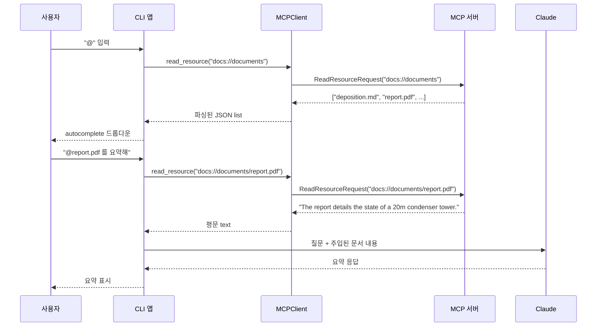
```mermaid
sequenceDiagram
    participant U as 사용자
    participant CLI as CLI 앱
    participant MC as MCPClient
    participant MS as MCP 서버
    participant C as Claude

    U->>CLI: "@" 입력
    CLI->>MC: read_resource("docs://documents")
    MC->>MS: ReadResourceRequest("docs://documents")
    MS-->>MC: ["deposition.md", "report.pdf", ...]
    MC-->>CLI: 파싱된 JSON list
    CLI-->>U: autocomplete 드롭다운

    U->>CLI: "@report.pdf 를 요약해"
    CLI->>MC: read_resource("docs://documents/report.pdf")
    MC->>MS: ReadResourceRequest("docs://documents/report.pdf")
    MS-->>MC: "The report details the state of a 20m condenser tower."
    MC-->>CLI: 평문 text
    CLI->>C: 질문 + 주입된 문서 내용
    C-->>CLI: 요약 응답
    CLI-->>U: 요약 표시
```

> [!method] @멘션 워크플로 체크리스트
> 1. 사용자 입력 버퍼에서 `@` 토큰 탐지
> 2. 현재 커서 위치까지의 prefix 로 `docs://documents` 목록을 필터
> 3. 드롭다운 렌더 → 선택 이벤트 후크
> 4. 선택된 `doc_id` 로 `docs://documents/{doc_id}` 를 `read_resource`
> 5. 가져온 텍스트를 `<document id="...">...</document>` 태그로 감싸 시스템 프롬프트 앞부분에 삽입
> 6. 사용자 메시지 그대로 Claude 에게 전송

> [!action] 실습 노트북
> 📂 `03-Exercises/Week_07/skilljar/S6_04_resources.ipynb`
> `MCPClient.read_resource` 를 구현하고 `json.loads` / 평문 분기 로직을 테스트한다. 끝부분에서는 `@` 자동완성 이벤트를 Jupyter `input()` 시뮬레이션으로 재현, 실제 Claude 호출 직전에 **주입된 프롬프트의 최종 형태** 를 출력해 확인한다.

> [!method] cli_project 실행 가이드 — `@` 멘션 실전
> 1. `cd cli_project && uv run main.py`
> 2. 챗봇 프롬프트에 `Tell me about @` 까지 입력 → 자동완성 dropdown 확인 (6개 doc_id)
> 3. Tab으로 `plan.md` 선택 → `Tell me about @plan.md` 완성 → Enter
> 4. Claude의 응답이 `<document id="plan.md">...</document>` 컨텍스트를 활용한 결과인지 관찰
> 5. 코드 추적: `cli_project/core/cli_chat.py` **L35-49** `_extract_resources()` — split 기반 `@` 파싱 + XML 주입
> 6. 도전: 복수 멘션 시도 — `Compare @plan.md and @spec.txt`

> [!ref] 소스: Skilljar L08 — Accessing resources (287783)

---

### 2.4 프롬프트 정의 (L09) — `@mcp.prompt()` 로 템플릿화

MCP 서버의 **Prompts** 는 **미리 만들어진 고품질 지시문** 을 정의할 수 있게 해 준다. 클라이언트가 직접 프롬프트를 쓰는 대신 이것을 쓰게 하자는 것이다. **정성껏 만들고 테스트된 템플릿** — 사용자가 즉석에서 떠올리는 프롬프트보다 더 좋은 결과를 주는 것들 — 이라고 생각하자.

#### 왜 프롬프트인가?

Claude 가 문서를 Markdown 으로 재포맷하게 하고 싶다고 하자. 사용자는 그냥 *"convert report.pdf to markdown"* 이라고 쳐도 동작하긴 한다. 하지만 **포맷·구조·출력 요구사항** 에 대한 구체적 지시가 포함된 **철저히 테스트된 프롬프트** 를 쓰면 훨씬 좋은 결과를 얻는다.


*Prompts 의 핵심 개념 --- 서버가 제공하는 검증된 템플릿이 사용자 즉흥 프롬프트보다 일관된 품질을 보장*


*왜 프롬프트인가 — 사용자 즉흥 프롬프트 vs 서버 제공 검증된 템플릿*

> [!finding] 핵심 통찰
> *"while users can accomplish these tasks on their own, they'll get more consistent and higher-quality results when using prompts that have been carefully developed and tested by the MCP server authors."*
> MCP 서버 작성자가 **그 도메인의 전문가** 라는 가정 하에, 사용자가 직접 프롬프트를 쓰는 것보다 **서버가 검증한 프롬프트** 가 더 일관되고 품질 높은 결과를 낸다.

#### 프롬프트의 동작 방식

프롬프트는 **클라이언트가 바로 사용할 수 있는 user/assistant 메시지 세트** 를 정의한다. 클라이언트가 프롬프트를 요청하면, 서버는 **Claude 에게 바로 보낼 수 있는 메시지 리스트** 를 반환한다.


*프롬프트는 user/assistant 메시지 리스트를 반환*

기본 구조는:

- `@mcp.prompt()` **데코레이터로 프롬프트 정의**
- 각 프롬프트에 **이름과 설명 추가**
- **완전한 프롬프트를 이루는 메시지 리스트 반환**
- 이 프롬프트들은 **고품질, 잘 테스트됨, MCP 서버 목적에 부합** 해야 함

#### Format 명령 구축 — 문서를 Markdown 으로 재구성

문서 포맷팅 프롬프트를 구현해 보자. 먼저 기본 메시지 타입을 임포트해야 한다:

```python
from mcp.server.fastmcp import base
```

그런 다음 프롬프트 함수를 정의한다:

```python
@mcp.prompt(
    name="format",
    description="Rewrites the contents of the document in Markdown format."
)
def format_document(
    doc_id: str = Field(description="Id of the document to format")
) -> list[base.Message]:
    prompt = f"""
Your goal is to reformat a document to be written with markdown syntax.

The id of the document you need to reformat is:

{doc_id}

Add in headers, bullet points, tables, etc as necessary. Feel free to add in extra formatting.
Use the 'edit_document' tool to edit the document. After the document has been reformatted...
"""

    return [
        base.UserMessage(prompt)
    ]
```

- `name="format"` — 클라이언트가 슬래시 명령으로 호출할 이름
- 매개변수 `doc_id: str = Field(...)` — 프롬프트에 **f-string 으로 보간** 됨
- 반환은 `list[base.Message]` — 여기서는 `base.UserMessage` 하나
- 프롬프트 본문은 **`edit_document` 도구를 이용하라** 고 Claude 에게 명시 → **도구·리소스·프롬프트의 3자 연계** 가 드러난다

#### 프롬프트 테스트 — Inspector

프롬프트도 MCP Inspector 로 테스트할 수 있다. **Prompts 섹션** 으로 이동하여 프롬프트를 선택하고 필요한 매개변수를 제공한다. Inspector 는 Claude 에게 보내질 **생성된 메시지** 를 보여준다.


*Inspector 의 Prompts 섹션 — 매개변수 입력 시 보간된 최종 메시지가 미리보기*

이를 통해 **변수 보간이 정확한지**, **메시지 구조가 기대한 대로인지** 를 실제 애플리케이션에 쓰기 전에 검증할 수 있다.

#### 모범 사례

> [!method] MCP 프롬프트 작성 원칙
> - 서버 목적에 **중심이 되는 태스크** 에 집중 (예: 문서 서버 → 포맷/요약/목차)
> - **모호한 요청보다 상세하고 구체적인 지시** 를 작성
> - 다양한 입력으로 **철저히 테스트**
> - 사용자가 각 프롬프트의 용도를 이해하도록 **명확한 description**
> - **서버의 도구·리소스와 함께** 어떻게 동작할지 고려 (프롬프트 본문에서 tool name 을 명시)

> [!tip] 프롬프트는 "서버 저자의 도메인 지식" 의 외부화
> 프롬프트는 **사용자가 스스로 쉽게 얻기 어려운 가치** 를 제공해야 한다 — 즉 MCP 서버가 커버하는 도메인의 **당신의 전문성** 을 표현해야 한다. §2.7 에서 **"KDS 41 17 00 기준 구조 검토"** 프롬프트가 바로 이 원칙의 적용.

#### 세 컴포넌트의 통합도


```mermaid
graph TB
    subgraph MCP_SERVER["🛰️ MCP 서버의 3대 컴포넌트"]
        T["🔧 Tools<br/>@mcp.tool()<br/><i>액션 수행</i>"]
        R["📦 Resources<br/>@mcp.resource()<br/><i>데이터 노출</i>"]
        P["💬 Prompts<br/>@mcp.prompt()<br/><i>템플릿 + 도메인 지식</i>"]
    end

    P -.->|"'edit_document 를 써라'<br/>라고 지시"| T
    P -.->|"'docs://documents/&#123;id&#125;<br/>를 참조하라'"| R

    CLIENT["클라이언트<br/>(Claude Code / 커스텀 앱)"] --> T
    CLIENT --> R
    CLIENT --> P

    style T fill:#fef3c7,stroke:#d97706
    style R fill:#dbeafe,stroke:#3b82f6
    style P fill:#f3e5f5,stroke:#9c27b0
```

> [!action] 실습 노트북
> 📂 `03-Exercises/Week_07/skilljar/S6_05_prompts.ipynb`
> `format_document` 프롬프트를 구현하고, `base.UserMessage` 외에 `base.AssistantMessage` 도 섞은 **few-shot 스타일 프롬프트** 를 추가로 만들어 본다. 동일 서버에 `summarize`, `translate` 등 두 개 프롬프트를 더 붙여 **프롬프트 카탈로그** 를 구성하는 연습.

> [!method] cli_project 실행 가이드 — Prompt 정의 확인
> 1. `cli_project/mcp_server.py` 열기 → **L68-91**: `@mcp.prompt(name="format")`
> 2. 프롬프트가 `edit_document` 도구를 호출하도록 명시적 지시하는 부분 확인 (도메인 전문 인스트럭션)
> 3. Inspector Prompts 탭에서 `format` 프롬프트 호출 → `doc_id="plan.md"` 입력 → 생성된 메시지 확인
> 4. 학습 포인트: 프롬프트는 사용자가 매번 타이핑하지 않고 도메인 전문 지시를 재사용

> [!ref] 소스: Skilljar L09 — Defining prompts (287784)

---

### 2.5 클라이언트에서 프롬프트 사용 (L10) — `list_prompts` & `get_prompt`

MCP 의 프롬프트는 **클라이언트가 사용할 user/assistant 메시지 세트** 를 정의한다. 고품질, 잘 테스트, 서버 목적에 부합하는 프롬프트여야 한다.


*클라이언트 측 프롬프트 통합의 전체 구조*

#### `list_prompts` 구현

첫 단계는 MCP 클라이언트에 `list_prompts` 메서드를 구현하는 것. 이 메서드는 서버에서 **사용 가능한 모든 프롬프트** 를 가져온다:

```python
async def list_prompts(self) -> list[types.Prompt]:
    result = await self.session().list_prompts()
    return result.prompts
```

단순한 구현 — 세션의 `list_prompts` 메서드를 호출하고 결과의 `prompts` 배열을 반환한다.

#### 개별 프롬프트 가져오기 — `get_prompt`

`get_prompt` 메서드는 **인자가 보간된** 특정 프롬프트를 가져온다. 프롬프트를 요청할 때 **인자** 를 제공하면, 그것이 **키워드 인자로 프롬프트 함수에 전달** 된다:

```python
async def get_prompt(self, prompt_name, args: dict[str, str]):
    result = await self.session().get_prompt(prompt_name, args)
    return result.messages
```

메서드는 결과의 `messages` 를 반환 — 이는 **바로 Claude 에게 투입할 수 있는 대화** 를 이룬다.

#### 프롬프트 인자의 동작

서버 측에서 프롬프트 함수를 정의할 때 **매개변수** 를 받을 수 있다. 예컨대 문서 포맷팅 프롬프트는 `doc_id` 매개변수를 기대할 수 있다:

```python
def format_document(doc_id: str):
    # The doc_id gets interpolated into the prompt
```

클라이언트가 `get_prompt` 를 호출할 때 **인자 딕셔너리** 에 기대되는 키가 포함되어야 한다. MCP 서버가 이것들을 **키워드 인자로 프롬프트 함수에 전달** 하여 동적 내용이 템플릿에 삽입되도록 한다.

#### CLI 에서 프롬프트 테스트

구현 후 **커맨드 라인 인터페이스** 에서 프롬프트를 테스트할 수 있다. **슬래시(/)** 를 입력하면 **사용 가능한 프롬프트가 명령어로 나타난다**. 프롬프트를 선택하면 가용 옵션(예: 문서 ID) 중에서 선택하라는 프롬프트가 뜨고, 그런 다음 **완전한 프롬프트가 Claude 에게 전송** 된다.


*CLI 에서 `/` 를 입력하면 슬래시 명령으로 프롬프트가 나열 — 마치 Slack·Discord 의 슬래시 명령처럼*

워크플로는 이렇다:

- 사용자가 프롬프트 선택 (예: `format`)
- 시스템이 필요한 인자를 묻는다 (예: 어느 문서를 포맷할지)
- **보간된 값과 함께 프롬프트가 Claude 에게 전송**
- Claude 가 **추가 데이터 조회를 위해 도구를 사용** 하고 태스크 완료


*전체 워크플로 — 프롬프트 선택 → 인자 입력 → Claude 가 내부에서 도구 호출까지 수행*

#### 프롬프트 모범 사례 재확인

> [!method] MCP 서버용 프롬프트를 만들 때
> - 서버의 목적에 **관련성** 있게
> - 배포 전 **철저히 테스트**
> - **명확하고 구체적인** 지시 사용
> - 서버의 **가용 도구와 잘 어울리게** 설계
> - 사용자가 제공해야 할 **인자** 를 신중히 고려

#### 3자 조합이 실제 돌아가는 시퀀스

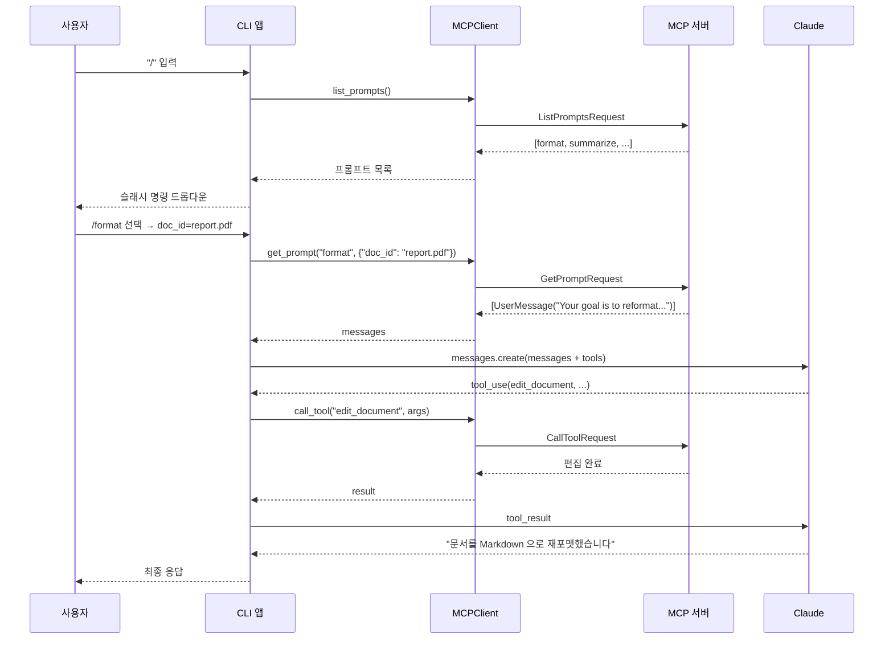
```mermaid
sequenceDiagram
    participant U as 사용자
    participant CLI as CLI 앱
    participant MC as MCPClient
    participant MS as MCP 서버
    participant C as Claude

    U->>CLI: "/" 입력
    CLI->>MC: list_prompts()
    MC->>MS: ListPromptsRequest
    MS-->>MC: [format, summarize, ...]
    MC-->>CLI: 프롬프트 목록
    CLI-->>U: 슬래시 명령 드롭다운

    U->>CLI: /format 선택 → doc_id=report.pdf
    CLI->>MC: get_prompt("format", {"doc_id": "report.pdf"})
    MC->>MS: GetPromptRequest
    MS-->>MC: [UserMessage("Your goal is to reformat...")]
    MC-->>CLI: messages

    CLI->>C: messages.create(messages + tools)
    C-->>CLI: tool_use(edit_document, ...)
    CLI->>MC: call_tool("edit_document", args)
    MC->>MS: CallToolRequest
    MS-->>MC: 편집 완료
    MC-->>CLI: result
    CLI->>C: tool_result
    C-->>CLI: "문서를 Markdown 으로 재포맷했습니다"
    CLI-->>U: 최종 응답
```

> [!finding] 프롬프트가 메우는 다리
> *"Prompts bridge the gap between predefined functionality and dynamic user needs, giving Claude structured starting points for complex tasks while maintaining flexibility through parameterization."*
> 사전 정의된 기능과 동적 사용자 요구 사이의 다리 — 복잡한 태스크의 **구조화된 출발점** 을 제공하면서도 **파라미터화** 로 유연성을 유지.

> [!action] 실습 노트북
> 📂 `03-Exercises/Week_07/skilljar/S6_05_prompts.ipynb`
> `list_prompts` / `get_prompt` 를 `MCPClient` 에 추가하고, CLI 루프에서 `/` 입력 파싱 → 프롬프트 선택 → 인자 수집 → `get_prompt` → Claude 투입의 전 사이클을 재현한다. `format` 프롬프트가 실제로 `edit_document` 도구를 호출하도록 유도해 **프롬프트·도구·리소스 3자 조합** 이 어떻게 한 태스크에서 협업하는지 체감.

> [!method] cli_project 실행 가이드 — `/` 슬래시 명령 실전
> 1. `cd cli_project && uv run main.py`
> 2. 챗봇 프롬프트에 `/` 입력 → 자동완성 dropdown 확인 (`format` 명령)
> 3. Tab → `/format ` (스페이스) → 다시 자동완성 → `plan.md` 선택
> 4. Enter → format 프롬프트 트리거 → Claude가 자동으로 `edit_document` 호출 관찰 (Tools + Resources + Prompts 3자 협업의 절정)
> 5. 결과 확인: 다시 `@plan.md` 입력하면 markdown 포맷팅된 내용
> 6. 코드 추적: `cli_project/core/cli_chat.py` **L51-63** `_process_command()` — `/` 라우팅

> [!ref] 소스: Skilljar L10 — Prompts in the client (287786)

---

### 2.6 MCP 종합 리뷰 (L11) — Tools · Resources · Prompts 의 상호작용

Skilljar L11 (287790) 은 **비디오 전용** 리뷰 레슨으로, 텍스트 본문이 없다. 이전 L01~L10 에서 쌓은 개념을 한 장면으로 복습하는 역할이므로, 본 강의에서는 **핵심 체크리스트** 로 요약한다.

#### 세 컴포넌트 요약 매트릭스

| 컴포넌트 | 데코레이터 | 용도 | 클라이언트 메서드 | 선택 기준 |
|:---:|:---:|:---|:---:|:---|
| **Tools** | `@mcp.tool()` | 액션 수행 (상태 변경·외부 API 호출) | `call_tool(name, args)` | Claude 가 **능동적으로** 호출할 기능 |
| **Resources** | `@mcp.resource(uri, mime_type=...)` | 데이터 노출 (GET 계열) | `read_resource(uri)` | 사용자가 `@` 등으로 **명시 선택** 하는 데이터 |
| **Prompts** | `@mcp.prompt()` | 재사용 가능한 검증된 템플릿 | `list_prompts()` / `get_prompt(name, args)` | **도메인 전문가의 지시** 를 외부화 |

#### 왜 MCP 를 쓰는가 — 3줄 요약

> [!result] MCP 의 가치
> 1. **통합 코드 작성 책임의 이관** — "내가 쓰는 것" → "서버가 이미 써 놓은 것"
> 2. **3개의 컴포넌트로 LLM 과 외부 세계의 상호작용을 완전히 포괄** — Action (Tools) + Data (Resources) + Know-how (Prompts)
> 3. **어떤 LLM 호스트든 같은 프로토콜로 재사용** — Claude Desktop · Claude Code · 커스텀 앱에서 동일 서버를 그대로 이용

#### 통합 아키텍처 다이어그램 (W07 최종)


```mermaid
graph TB
    subgraph HOST["🖥️ 호스트 (애플리케이션)"]
        APP["애플리케이션 코드"]
        MC["MCP 클라이언트<br/>(async context)"]
        APP --> MC
    end

    subgraph SERVER["🛰️ MCP 서버 (FastMCP)"]
        direction TB
        SRV["FastMCP('DocumentMCP')"]
        TOOLS["🔧 @mcp.tool<br/>read_doc_contents<br/>edit_document"]
        RES["📦 @mcp.resource<br/>docs://documents<br/>docs://documents/&#123;id&#125;"]
        PROMPTS["💬 @mcp.prompt<br/>format"]
        SRV --> TOOLS
        SRV --> RES
        SRV --> PROMPTS
    end

    subgraph CLAUDE["🤖 Claude"]
        C["claude-haiku-4-5<br/>or claude-sonnet"]
    end

    MC <-.->|"stdio / HTTP / WS"| SRV
    APP -.->|"messages.create<br/>tools + user + prompt"| C
    C -.->|"tool_use / text"| APP

    INSP["🔍 MCP Inspector<br/>포트 6277"] -.->|"mcp dev"| SRV

    style HOST fill:#dbeafe,stroke:#3b82f6
    style SERVER fill:#d1fae5,stroke:#059669
    style CLAUDE fill:#fef3c7,stroke:#d97706
    style INSP fill:#f3e5f5,stroke:#9c27b0
```

> [!finding] L01~L10 을 한 장으로
> - **L01·L02** — *왜* MCP 인가 (통합 지옥 해소) + *어떻게* 통신 (transport-agnostic, ListTools/CallTool)
> - **L03·L04·L05** — *서버를* 만드는 법 (FastMCP + 데코레이터 + Inspector)
> - **L06** — *클라이언트를* 만드는 법 (async context + list_tools/call_tool)
> - **L07·L08** — *데이터를* 노출·소비 (direct/templated Resources + MIME 파싱)
> - **L09·L10** — *도메인 지식을* 외부화 (Prompts + CLI 슬래시 명령)
> - **L11** — 이 모든 것을 **한 서버에서 합쳐 쓴다** (3자 조합)

> [!action] 실습 노트북 (학생 실습)
> 📂 `03-Exercises/Week_07/skilljar/S6_06_practice.ipynb`
> L01~L10 을 **백지에서 재구성** 하는 학생 자율 실습. 스타터 코드 없이, 아래 도전 과제를 스스로 해결한다:
> 1. 새 도메인을 하나 선택 (예: 개인 지식 베이스, 할 일 리스트, 레시피 컬렉션)
> 2. `read` / `add` / `update` 도구 3개를 `@mcp.tool()` 로 구현
> 3. `items://` 네임스페이스의 direct/templated 리소스 2개 정의
> 4. `summarize` 프롬프트 하나 추가
> 5. `MCPClient` 로 연결, Claude 에게 *"내 할 일 목록을 요약해줘"* 식의 질의를 돌려 전 사이클이 도는지 확인

> [!method] cli_project 실행 가이드 — 자율 도메인 추가 등록
> 1. 자신의 도메인 서버를 별도 폴더에 작성 (예: `cli_project/my_servers/todo_mcp.py`)
> 2. `main.py`는 추가 서버를 인자로 받음 (L29 `server_scripts = sys.argv[1:]`)
> 3. 실행: `uv run main.py my_servers/todo_mcp.py`
> 4. 챗봇에서 `add_todo` 같은 도구가 자동 등록됐는지 확인
> 5. 도전: `@` 멘션·`/` 슬래시 명령도 자신의 도메인에서 동작하는지 검증

> [!ref] 소스: Skilljar L11 — MCP review (287790) (비디오 전용, 본문 없음 — 본 섹션은 L01–L10 의 종합 리뷰)

---

### 2.7 도메인 응용 — 구조공학 MCP 서버 설계

Skilljar 트랙이 문서 관리 MCP 에서 끝났다면, 이제 **건축공학 도메인** 으로 확장한다. 우리가 W05 에서 만든 **KDS RAG 파이프라인**, W06 에서 다룬 **Vision·Extended Thinking**, 그리고 이번 주 **FastMCP** 를 결합하면 — *"KDS 설계기준과 Midas 해석 결과를 물어보고, 구조 검토 보고서를 자동 생성하는"* MCP 서버 한 벌이 만들어진다.

#### 서버 스펙 — `structural-mcp`

| 계층 | 컴포넌트 | 구현 방식 |
|:---:|:---|:---|
| **Tools** | `check_beam_capacity(beam_id)` · `calculate_rebar_area(Mu, b, d)` · `parse_midas_mgt(filepath)` | W04 Tool Use + 수치 라이브러리 |
| **Resources** | `kds://41-17-00/section-4-3` · `midas://results/{model_id}` · `materials://rebar/{grade}` | direct + templated 혼합, JSON/text/plain MIME |
| **Prompts** | `structural_review(member_type, code_section)` · `design_check(drawing_path, criteria)` | 검증된 검토 절차 템플릿 |

#### 아키텍처 다이어그램


```mermaid
graph TB
    subgraph CLIENT["💻 Claude Code (W08)"]
        CC["claude mcp add structural..."]
    end

    subgraph SERVER["🛰️ structural-mcp (W07 지식 적용)"]
        direction TB
        TOOLS["🔧 Tools<br/>check_beam_capacity<br/>calculate_rebar_area<br/>parse_midas_mgt"]
        RES["📦 Resources<br/>kds://41-17-00/...<br/>midas://results/&#123;id&#125;<br/>materials://rebar/&#123;grade&#125;"]
        PROMPTS["💬 Prompts<br/>structural_review<br/>design_check"]
    end

    subgraph BACKENDS["📚 백엔드 (W05·W06 재활용)"]
        RAG["KDS RAG<br/>(W05 S4_07)"]
        MIDAS[".mgt 파서<br/>(도메인 모듈)"]
        DB["구조재료 DB<br/>(SQLite)"]
    end

    CC -->|"stdio / HTTP"| SERVER
    TOOLS --> MIDAS
    TOOLS --> DB
    RES --> RAG
    RES --> MIDAS
    RES --> DB
    PROMPTS -.->|"'이 도구·리소스를 써서<br/>KDS 4.3 절 기준으로 검토하라'"| TOOLS
    PROMPTS -.-> RES

    style SERVER fill:#e8f4f8,stroke:#2980b9
    style CLIENT fill:#e8c07a,stroke:#c4a882,color:#333
    style BACKENDS fill:#f3e5f5,stroke:#9c27b0
```

#### 샘플 구현 — `structural_review` 프롬프트

```python
from mcp.server.fastmcp import FastMCP, base
from pydantic import Field

mcp = FastMCP("StructuralMCP", log_level="ERROR")

@mcp.prompt(
    name="structural_review",
    description="KDS 기준서 절차를 따라 구조부재 검토 보고서를 생성한다."
)
def structural_review(
    member_type: str = Field(description="부재 종류 (beam, column, slab, wall)"),
    code_section: str = Field(description="KDS 조항 (예: 'KDS 41 17 00 4.3')"),
    model_id: str = Field(description="Midas 해석 모델 ID")
) -> list[base.Message]:
    prompt = f"""
당신은 구조설계 전문가입니다. 다음 절차로 {member_type} 부재를 검토하세요.

1. `midas://results/{model_id}` 리소스에서 해석 결과(Mu, Vu)를 읽습니다.
2. `kds://{code_section.replace(' ', '-').lower()}` 리소스에서 기준 조문을 가져옵니다.
3. `check_beam_capacity` 도구로 휨·전단 강도를 계산합니다.
4. 부족 시 `calculate_rebar_area` 도구로 보강 철근량을 산정합니다.
5. 최종 보고서를 작성하세요 — 조문 인용, 계산 과정, 검토 결론 순.

출력 형식:
- 첫 줄: '✅ 만족' 또는 '❌ 불만족'
- 이후 상세 계산 과정
- 마지막: 추천 조치 사항 (해당 시)
"""
    return [base.UserMessage(prompt)]
```

#### 도메인 특화 설계 원칙

> [!method] 구조공학 MCP 설계 체크리스트
> 1. **단위계 명시** — 모든 도구 설명에 SI (N·mm·MPa) 를 강제 기재
> 2. **조문 URI 규약** — `kds://<code-id>/<section>` 으로 W10 BIM-MCP, W11 Midas-MCP 와 URI 충돌 방지
> 3. **부동소수 반올림** — 응력·강도 계산 결과는 소수 2자리 고정 (보고서 일관성)
> 4. **에러 메시지 한국어화** — Claude 가 사용자에게 그대로 전달해도 되도록
> 5. **프롬프트에 조문 참조 의무화** — "KDS 41 17 00 4.3.1 에 따라…" 식으로 Claude 가 **근거 조문을 항상 인용** 하도록 지시

> [!finding] 왜 "도메인 MCP" 가 중요한가
> - **Tool Use (W04)** — 앱마다 도구를 중복 구현
> - **RAG (W05)** — 문서만 검색, 계산·수정은 못함
> - **MCP (W07)** — 두 가지를 **한 서버에 묶어** Claude Code·Claude Desktop 어디서든 재사용
> 즉 연구실이 KDS 해석 파이프라인을 한 번 MCP 로 만들면, **모든 학생·프로젝트가 같은 해석 능력을 자연어로 공유** 하게 된다.

> [!action] 실습 노트북
> 📂 `03-Exercises/Week_07/skilljar/S6_07_structural_mcp.ipynb`
> 본 섹션의 `structural-mcp` 스켈레톤을 단계별로 구현한다 — ① FastMCP 초기화, ② KDS 조문 RAG (W05 체인 재활용), ③ 간단한 .mgt 파서 → `parse_midas_mgt` 도구, ④ `structural_review` 프롬프트, ⑤ Inspector 로 검증, ⑥ (보너스) Claude Code 에 `claude mcp add` 로 등록해 실제 *"B1 보를 KDS 4.3 로 검토해줘"* 를 돌려본다.

> [!method] cli_project / structural 실행 가이드 — 구조공학 도메인 응용
> 1. `cd 03-Exercises/Week_07/structural`
> 2. Inspector 검증: `uv run mcp dev structural_mcp.py` → http://localhost:6277 → 도구·리소스·프롬프트 확인
> 3. cli_project에 추가 등록: `cd ../skilljar/cli_project && uv run main.py ../../structural/structural_mcp.py`
> 4. 챗봇에서 `Check beam B1: 300x600, fck=27, fy=400, As=1963, Mu=200kN.m` 같은 자연어 입력 → `check_flexural_strength` 도구 자동 호출 관찰
> 5. (보너스) Claude Code 등록: `claude mcp add structural-mcp -- uv run /절대경로/structural_mcp.py` → Claude Code 세션에서 사용

> [!ref] 보충 — 도메인 응용 참고
> - [[Week_05]] S4_07 — KDS RAG 파이프라인 (리소스 백엔드로 재사용)
> - [[Week_06]] — Extended Thinking (계산 과정 검증), Vision (도면 이미지 → 치수 추출)
> - [[Week_10]] (예정) — IFC/BIM MCP 심화
> - [[Week_11]] (예정) — Midas MCP 고급 토픽 + MCPA 코스

---

## [Chapter 3] Self-assessment & Summary

### 3.1 개념 확인 퀴즈 — W07 전체 (Q1–Q10)

> [!question] Q1. MCP (Model Context Protocol) 의 **핵심 가치 제안** 을 가장 잘 표현한 것은?
> A) Claude 모델의 응답 속도를 높인다
> B) 도구 정의·실행의 부담을 당신 서버에서 전용 MCP 서버로 이관한다
> C) Claude 의 토큰 사용량을 50% 줄인다
> D) Python 코드 없이 LLM 을 쓸 수 있게 한다
>
> > [!tip]- 정답 보기
> > **정답: B)** L01 전사본이 명시한 *"a way to shift the burden of tool definitions and execution away from your server to specialized MCP servers"* 그대로. 속도·비용·언어 무관 — MCP 의 본질은 **누가 통합 코드를 유지보수하는가** 의 책임 이관이다.

> [!question] Q2. MCP 가 "**transport agnostic**" 이라는 말의 의미는?
> A) 어떤 LLM 모델과도 동작한다
> B) 클라이언트와 서버가 stdio, HTTP, WebSockets 등 **다양한 통신 방법** 으로 대화할 수 있다
> C) 인터넷 연결 없이도 동작한다
> D) 모든 프로그래밍 언어로 구현되어 있다
>
> > [!tip]- 정답 보기
> > **정답: B)** L02 의 *"a fancy way of saying the client and server can talk to each other using different communication methods"*. 가장 흔한 로컬 stdio 외에 HTTP, WebSockets, 그 외 네트워크 프로토콜도 가능. 전송 계층이 교체 가능하다는 뜻.

> [!question] Q3. MCP 에서 클라이언트와 서버가 주고받는 **두 쌍의 주요 메시지 타입** 은?
> A) `OpenRequest/CloseRequest` 와 `DataRequest/DataResponse`
> B) `ListToolsRequest/ListToolsResult` 와 `CallToolRequest/CallToolResult`
> C) `Login/Logout` 과 `Query/Answer`
> D) `GET/POST` 와 `PUT/DELETE`
>
> > [!tip]- 정답 보기
> > **정답: B)** L02 에 명시적으로 "the main message types you'll work with" 로 제시된 두 쌍. 전자가 "어떤 도구가 있니?", 후자가 "이 도구를 이 인자로 실행해줘" 에 해당.

> [!question] Q4. FastMCP 로 서버를 초기화하는 **정확한 한 줄** 은?
> A) `mcp = MCP("DocumentMCP")`
> B) `mcp = FastMCP("DocumentMCP", log_level="ERROR")`
> C) `mcp = Server.new(name="DocumentMCP")`
> D) `mcp = fastmcp.init(log="ERROR")`
>
> > [!tip]- 정답 보기
> > **정답: B)** L04 예제 그대로다 — `from mcp.server.fastmcp import FastMCP` 후 `mcp = FastMCP("DocumentMCP", log_level="ERROR")`. 첫 인자가 서버 이름(클라이언트 로그에 표시)이고 `log_level` 은 선택.

> [!question] Q5. `@mcp.tool()` 데코레이터가 제공하는 **가장 큰 이점** 은?
> A) Claude 의 응답을 자동 번역한다
> B) Python 타입 힌트로부터 JSON 스키마를 **자동 생성** 한다
> C) 도구를 자동 배포한다
> D) 매개변수를 암호화한다
>
> > [!tip]- 정답 보기
> > **정답: B)** L04 의 *"Automatic JSON schema generation from Python type hints"*. W04 에서 손으로 쓰던 긴 JSON 스키마를 `doc_id: str = Field(description="...")` 한 줄로 대체. 데코레이터 + 타입 힌트 + Pydantic `Field` 조합이 핵심.

> [!question] Q6. MCP Inspector 를 시작하는 **올바른 명령과 포트** 는?
> A) `python mcp_server.py` — 포트 8000
> B) `mcp dev mcp_server.py` — 포트 6277
> C) `npm run mcp-inspector` — 포트 3000
> D) `mcp run mcp_server.py --debug` — 포트 5000
>
> > [!tip]- 정답 보기
> > **정답: B)** L05 전사본의 *"starts a development server on port 6277"* 와 `mcp dev mcp_server.py` 를 그대로 따라야 한다. 브라우저에서 Connect → Tools / Resources / Prompts 를 테스트한다.

> [!question] Q7. MCP 에서 **Resources 와 Tools 의 차이** 를 가장 잘 요약한 것은?
> A) Resources 는 무료, Tools 는 유료
> B) Resources 는 **데이터를 노출**, Tools 는 **액션을 수행**
> C) Resources 는 동기, Tools 는 비동기
> D) Resources 는 Python 전용, Tools 는 언어 무관
>
> > [!tip]- 정답 보기
> > **정답: B)** L07 의 *"Resources expose data, tools perform actions"* 그대로다. HTTP 로 비유하면 Resources = GET, Tools = POST/PUT. 설계 시 "상태를 바꾸는가?" 를 기준으로 구분.

> [!question] Q8. `@mcp.resource("docs://documents/{doc_id}", mime_type="text/plain")` 의 **매개변수 `{doc_id}`** 는 어떻게 함수에 전달되는가?
> A) 환경변수로 전달된다
> B) SDK 가 URI 에서 자동 파싱해 **키워드 인자** 로 함수에 넘긴다
> C) 수동으로 `os.environ` 을 읽어야 한다
> D) 첫 번째 위치 인자로 고정된다
>
> > [!tip]- 정답 보기
> > **정답: B)** L07 의 *"the Python SDK automatically parses parameters from the URI and passes them as keyword arguments to your function"*. 함수 정의 `def fetch_doc(doc_id: str)` 의 파라미터 이름이 URI 플레이스홀더와 일치해야 한다.

> [!question] Q9. `@mcp.prompt()` 로 만들어진 프롬프트가 **단순 user 텍스트보다 가치 있는** 이유는?
> A) 더 짧기 때문
> B) 서버 저자가 도메인 지식으로 **신중히 개발·테스트한 템플릿** 이기 때문
> C) Claude 가 프롬프트에 대해서만 공짜로 응답하기 때문
> D) 사용자가 절대 볼 수 없기 때문
>
> > [!tip]- 정답 보기
> > **정답: B)** L09 의 *"they'll get more consistent and higher-quality results when using prompts that have been carefully developed and tested by the MCP server authors"*. 프롬프트 = **도메인 전문성의 외부화**. §2.7 의 `structural_review` 가 바로 이 원칙의 구조공학 적용.

> [!question] Q10. MCP 서버가 노출할 수 있는 **세 가지 컴포넌트** 는?
> A) Models, Agents, Workflows
> B) Tools, Resources, Prompts
> C) Input, Output, Logs
> D) Files, Commands, Webhooks
>
> > [!tip]- 정답 보기
> > **정답: B)** L01–L11 전체에 걸쳐 반복되는 핵심 어휘. `@mcp.tool()`, `@mcp.resource()`, `@mcp.prompt()` 데코레이터가 각각에 대응. 이 세 컴포넌트가 **LLM ↔ 외부세계** 의 모든 상호작용을 포괄한다 (W08 Q9 와 동일 개념).

#### 퀴즈 오답 패턴 점검

> [!finding] 자주 틀리는 포인트
> - **Q2 의 transport-agnostic** — "모델 무관" 과 헷갈리기 쉽지만, **전송 계층(transport layer)** 의 이야기다. LLM 무관이 아니라 **통신 방법 무관**.
> - **Q7 의 Resources vs Tools** — 실제로 read 도구(`read_doc_contents`)를 `@mcp.tool` 로 만든 것을 보고 혼란스러울 수 있다. 핵심은 *"Claude 가 능동 호출하느냐 (Tool), 사용자가 명시 선택하느냐 (Resource)"* — 같은 기능도 UX 에 따라 다르게 노출할 수 있다.
> - **Q9 의 프롬프트 가치** — 단순 "사용자 대신 타이핑해 주는 편의" 가 아니라 **도메인 지식의 외부화** 라는 점을 놓치지 말 것. MCP 서버 작성자가 그 영역의 전문가이기에 가치가 있는 것.

> [!ref] 소스: Skilljar L01–L11 전사본 (MCP 전 섹션)

---

### 3.2 학습 요약

#### 누적 진도 테이블 (W01 → W07)

| 주차 | 주제 | 핵심 개념 | 이번 주 신규 추가 |
|:---:|:---|:---|:---|
| **W01** | LLM 기초 · 프롬프트 6기법 | 토큰, temperature, few-shot, CoT | 4D Framework, AI Fluency |
| **W02** | Claude API 호출 | `messages.create`, 멀티턴, 스트리밍 | Claude API 전반 + CLAUDE.md |
| **W03** | 프롬프트 엔지니어링 & 평가 | 체계적 설계, Eval Pipeline, Streamlit | 정량적 프롬프트 평가 |
| **W04** | Tool Use | JSON Schema, ToolUseBlock, tool_result | Claude ↔ 외부세계 연결 |
| **W05** | RAG + 하이브리드 검색 | 청킹, 임베딩, VectorIndex, BM25, RRF | 지식 확장 + 어휘·의미 병합 |
| **W06** | Features of Claude | Extended Thinking, Vision, Caching | 기능 통합 설계 |
| **W07** | **MCP 서버 개발** | **FastMCP, Tools · Resources · Prompts, Inspector, async 클라이언트** | **MCP 공급자(provider) 체험 — 도구를 프로토콜로 표준화** |

#### W07 전용 — L01-L11 개념 요약

> [!finding] MCP 학습 여정의 6 단계와 소스 레슨
>
> | 단계 | 개념 | 핵심 내용 | 소스 레슨 |
> |:---:|:---|:---|:---:|
> | 1 | **MCP 이란?** | 통합 코드 이관 — GitHub 챗봇 예시, USB-C 비유 | L01 |
> | 2 | **클라이언트 아키텍처** | transport-agnostic, ListTools/CallTool 메시지 | L02 |
> | 3 | **프로젝트 셋업** | CLI 챗봇 + MCP 서버, `uv run main.py` | L03 |
> | 4 | **도구 정의** | `FastMCP`, `@mcp.tool()`, 타입 힌트 + `Field` | L04 |
> | 5 | **Inspector 로 테스트** | `mcp dev mcp_server.py` 포트 6277 | L05 |
> | 6 | **클라이언트 구현** | `MCPClient` async context, `list_tools`/`call_tool` | L06 |
> | 7 | **리소스 정의** | `@mcp.resource()`, direct/templated, MIME types | L07 |
> | 8 | **리소스 접근** | `read_resource`, `AnyUrl`, JSON/text 파싱 | L08 |
> | 9 | **프롬프트 정의** | `@mcp.prompt()`, `base.UserMessage`, 도메인 지식 외부화 | L09 |
> | 10 | **프롬프트 사용** | `list_prompts`/`get_prompt`, CLI 슬래시 명령 | L10 |
> | 11 | **종합 리뷰** | Tools + Resources + Prompts 3자 조합 | L11 |

#### 로드맵 Mermaid — W07 이후로

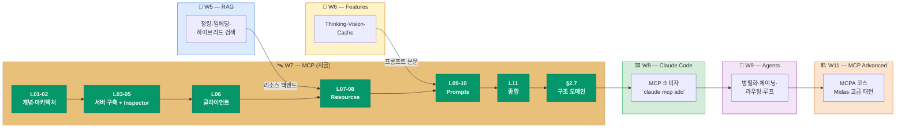
```mermaid
graph LR
    subgraph W5["📘 W5 — RAG"]
        R5["청킹·임베딩·<br/>하이브리드 검색"]
    end

    subgraph W6["📙 W6 — Features"]
        F6["Thinking·Vision·<br/>Cache"]
    end

    subgraph W7["🛰️ W7 — MCP (지금)"]
        A1["L01-02<br/>개념·아키텍처"]
        A2["L03-05<br/>서버 구축 + Inspector"]
        A3["L06<br/>클라이언트"]
        A4["L07-08<br/>Resources"]
        A5["L09-10<br/>Prompts"]
        A6["L11<br/>종합"]
        A7["§2.7<br/>구조 도메인"]
    end

    subgraph W8["⌨️ W8 — Claude Code"]
        CC["MCP 소비자<br/>`claude mcp add`"]
    end

    subgraph W9["🤖 W9 — Agents"]
        AG["병렬화·체이닝·<br/>라우팅·루프"]
    end

    subgraph W11["🏗️ W11 — MCP Advanced"]
        MA["MCPA 코스<br/>Midas·고급 패턴"]
    end

    R5 -->|"리소스 백엔드"| A4
    F6 -->|"프롬프트 본문"| A5
    A1 --> A2 --> A3 --> A4 --> A5 --> A6 --> A7
    A7 --> CC
    CC --> AG
    AG --> MA

    style W7 fill:#e8c07a,stroke:#c4a882,color:#333
    style W5 fill:#dbeafe,stroke:#3b82f6
    style W6 fill:#fef3c7,stroke:#d97706
    style W8 fill:#d4edda,stroke:#27ae60
    style W9 fill:#f3e5f5,stroke:#9c27b0
    style W11 fill:#fde4cf,stroke:#e67e22

    classDef now fill:#059669,stroke:#047857,color:#fff,font-weight:bold
    class A1,A2,A3,A4,A5,A6,A7 now
```

> [!tip] W07 → W08 연결 포인트
> - **MCP 소비자의 경험 (W08)** — 이번 주 당신이 만든 서버를 다음 주 `claude mcp add` 한 줄로 Claude Code 에 붙인다. **provider 관점 → consumer 관점** 의 완결.
> - **Context-Plan-Implement 워크플로 (W08)** — 프롬프트를 *"재사용 가능한 지시문"* 으로 만드는 경험이 그대로 CLAUDE.md 작성에 전이된다.
> - **멀티서버 오케스트레이션 (W09)** — 여러 MCP 서버를 동시에 라우팅할 때의 패턴이 W09 의 주제. 이번 주 서버 한 개를 깊이 이해한 것이 여러 개 오케스트레이션의 기반.

#### 3줄 핵심 메시지

> [!result] W07 의 3줄 정리
> 1. **MCP 는 도구 정의와 유지보수 책임을 이관한다** — `@mcp.tool() / @mcp.resource() / @mcp.prompt()` 세 데코레이터로 FastMCP 서버가 완성되며, JSON 스키마는 타입 힌트에서 자동 생성된다.
> 2. **세 컴포넌트가 LLM ↔ 세계 상호작용을 완전히 포괄** — Tools (액션) + Resources (데이터) + Prompts (도메인 지식). `mcp dev` Inspector 가 포트 6277 에서 각각을 LLM 없이 빠르게 검증한다.
> 3. **한 번 짓고 어디서든 쓴다** — 이번 주 만든 서버는 다음 주 Claude Code 에 `claude mcp add` 한 줄로 붙고, 구조공학 도메인(`structural-mcp`)으로 확장하면 연구실 전체가 자연어로 KDS·Midas 파이프라인을 공유하게 된다.

---

## 💻 실습 과제 — S6 MCP 트랙

> 모든 노트북은 `03-Exercises/Week_07/skilljar/` 에 위치합니다. 이번 주 빌드업은 **7 단계** 로 구성되며, 앞 노트북의 산출물을 뒤 노트북이 이어받는 누적 구조입니다.

### 단계별 빌드업 다이어그램


```mermaid
graph LR
    S1["① S6_01<br/>MCP 서버<br/>(Tools)"] -->|"+Inspector"| S2["② S6_02<br/>Inspector"]
    S2 -->|"+클라이언트"| S3["③ S6_03<br/>MCP Client"]
    S3 -->|"+Resources"| S4["④ S6_04<br/>Resources"]
    S4 -->|"+Prompts"| S5["⑤ S6_05<br/>Prompts"]
    S5 -->|"자율 실습"| S6["⑥ S6_06<br/>Practice"]
    S6 -->|"도메인 응용"| S7["⑦ S6_07<br/>Structural MCP"]

    style S1 fill:#3498db,stroke:#2980b9,color:#fff
    style S2 fill:#9b59b6,stroke:#8e44ad,color:#fff
    style S3 fill:#1abc9c,stroke:#16a085,color:#fff
    style S4 fill:#e67e22,stroke:#d35400,color:#fff
    style S5 fill:#e74c3c,stroke:#c0392b,color:#fff
    style S6 fill:#95a5a6,stroke:#7f8c8d,color:#fff
    style S7 fill:#27ae60,stroke:#1e8449,color:#fff
```

### 노트북 상세 표

| 노트북 | 목표 | 주요 개념 / 실습 | 의존 레슨 |
|:---|:---|:---|:---:|
| `S6_01_mcp_server.ipynb` | FastMCP 로 MCP 서버 구축 | `FastMCP("DocumentMCP")`, `@mcp.tool()`, `read_doc_contents` / `edit_document`, `docs` dict | L01, L03, L04 |
| `S6_02_mcp_inspector.ipynb` | MCP Inspector 로 검증 | `mcp dev mcp_server.py` 포트 6277, Connect → Tools → Run Tool, edit→read 연쇄 검증 | L05 |
| `S6_03_mcp_client.ipynb` | MCPClient 클래스 구현 | async context manager, `list_tools()` / `call_tool()`, Claude 와의 통합 루프 | L02, L06 |
| `S6_04_resources.ipynb` | Resources 정의·소비 | `@mcp.resource()` direct/templated, MIME types, `read_resource`, `json.loads` 분기, @멘션 시뮬레이션 | L07, L08 |
| `S6_05_prompts.ipynb` | Prompts 정의·소비 | `@mcp.prompt()`, `base.UserMessage`, `list_prompts` / `get_prompt`, `/` 슬래시 명령 구현 | L09, L10 |
| `S6_06_practice.ipynb` | 학생 자율 실습 템플릿 | 새 도메인 선택 → Tools 3 + Resources 2 + Prompts 1 직접 구현, 백지 재구성 | 통합 (L01–L11) |
| `S6_07_structural_mcp.ipynb` | **구조공학 도메인 응용** — `structural-mcp` | KDS RAG 리소스화, `.mgt` 파서 도구, `structural_review` 프롬프트, Inspector 검증, (보너스) Claude Code 등록 | 통합 + W05 S4_07 |

> [!method] 수업 시간 실습 순서 — 제안 (2 시간)
> 1. **0:00~0:20** — `S6_01` FastMCP 서버 구축, `@mcp.tool()` 데코레이터로 `read_doc_contents` / `edit_document` 작성
> 2. **0:20~0:35** — `S6_02` Inspector 기동 (`mcp dev`, 포트 6277) → Connect → Tools 탭에서 각 도구 수동 실행
> 3. **0:35~0:55** — `S6_03` `MCPClient` async 클래스 구현, `list_tools` / `call_tool` 로 Claude 메시지 루프 완성
> 4. **0:55~1:15** — `S6_04` `@mcp.resource()` 로 `docs://documents` (direct) + `docs://documents/{doc_id}` (templated), `read_resource` 클라이언트 구현
> 5. **1:15~1:35** — `S6_05` `@mcp.prompt()` 로 `format` 프롬프트, `list_prompts` / `get_prompt`, CLI 슬래시 명령 시연
> 6. **1:35~2:00** — `S6_06` 학생 자율 확장 또는 `S6_07` 구조공학 도메인 중 택일

> [!action] 제출 안내
> **제출 기한**: 차주 수업 전날 23:59 까지
> **제출물**: `S6_01` ~ `S6_05` 필수 완료본 **+** `S6_06` 또는 `S6_07` 중 **하나 이상** 자율 확장 버전
> **제출 방식**: 강의 Notion 또는 Google Classroom 지정 폴더에 업로드 (파일명에 학번·이름 포함)
> **평가 관점**: (1) 서버·클라이언트·Inspector 루프의 재현성, (2) Resources·Prompts 설계의 직관성(MIME/URI 규약), (3) 도메인 응용에서 Tools·Resources·Prompts 3자 조합이 실제로 협업하는가

> [!ref] 소스
> - 노트북 전체: `03-Exercises/Week_07/skilljar/`
> - 기반 전사본: Skilljar S6 L01–L11

---

## 🤖 CC 스킬 — Multi-agent + Agent SDK 소개

> [!finding] 이번 주 CC 스킬의 위치
> W07 은 MCP 를 **직접 짓는** 주다. 이 CC 스킬 블록(30분)은 MCP 서버를 지은 다음, 그것을 **여러 에이전트가 협업** 하게 하는 다음 단계 — **Multi-agent 오케스트레이션** 과 **Anthropic Agent SDK** — 를 예고한다. 상세 실습은 [[Week_09]] 에서 전개되며, 본 섹션은 W09 로 건너갈 **개념적 브릿지** 다.

### Multi-agent 패턴 — 하나의 MCP 서버에서 여러 에이전트로

이번 주 만든 단일 MCP 서버도 강력하지만, 실제 워크플로는 **여러 에이전트가 협업** 해야 풀리는 경우가 많다.

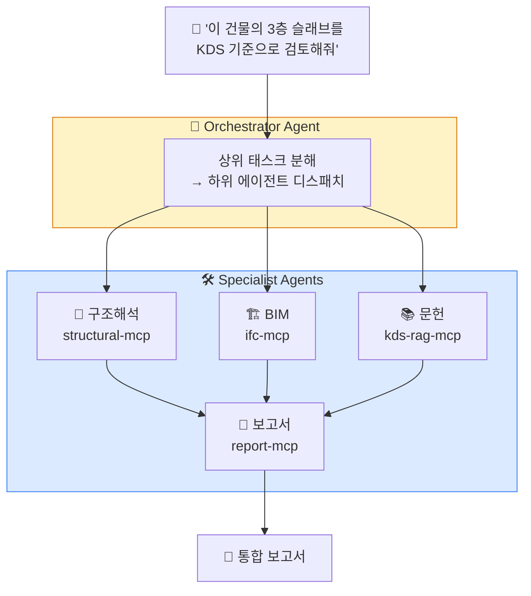
```mermaid
graph TB
    subgraph ORCHESTRATOR["🧠 Orchestrator Agent"]
        O["상위 태스크 분해<br/>→ 하위 에이전트 디스패치"]
    end

    subgraph SPECIALISTS["🛠️ Specialist Agents"]
        A1["📐 구조해석<br/>structural-mcp"]
        A2["🏗️ BIM<br/>ifc-mcp"]
        A3["📚 문헌<br/>kds-rag-mcp"]
        A4["📝 보고서<br/>report-mcp"]
    end

    U["👤 '이 건물의 3층 슬래브를<br/>KDS 기준으로 검토해줘'"] --> O
    O --> A1
    O --> A2
    O --> A3
    A1 --> A4
    A2 --> A4
    A3 --> A4
    A4 --> FINAL["📄 통합 보고서"]

    style ORCHESTRATOR fill:#fef3c7,stroke:#d97706
    style SPECIALISTS fill:#dbeafe,stroke:#3b82f6
```

### 패턴 카탈로그 (W09 예고)

> [!method] W09 에서 본격 다룰 5 가지 패턴
> 1. **Chaining** — 한 에이전트의 출력이 다음 에이전트의 입력 (파이프라인)
> 2. **Parallelization** — 여러 에이전트가 동시에 작동 → 결과 병합
> 3. **Routing** — 입력의 성격에 따라 적절한 전문 에이전트로 디스패치
> 4. **Orchestrator-Workers** — 중앙 오케스트레이터가 워커를 동적으로 할당
> 5. **Agent Loop** — 에이전트가 스스로 목표 달성까지 도구를 반복 호출

### Anthropic Agent SDK 미리보기

Anthropic 은 에이전트 구축을 단순화하는 **Agent SDK** 를 제공한다 (공식 이름은 `claude-agent-sdk` / TypeScript·Python). 핵심 기능:

- **Built-in agent loop** — 도구 호출·결과 처리·다음 결정의 사이클을 자동
- **Multi-agent 지원** — 부모-자식 에이전트 관계 선언
- **Streaming** — 중간 단계 이벤트를 실시간 구독
- **MCP 통합** — 이번 주 만든 서버가 **Agent SDK 에서도 그대로** 사용됨

#### 간단한 스니펫 (개념 예시)

```python
# W09 에서 상세히 다룰 예정 — 개념만 먼저
from claude_agent_sdk import Agent, Tool

# W07 에서 만든 MCP 서버를 Agent SDK 에 연결
orchestrator = Agent(
    model="claude-sonnet-4-5",
    mcp_servers=[
        {"name": "structural", "command": "uv", "args": ["run", "structural_mcp.py"]},
        {"name": "kds-rag",    "command": "uv", "args": ["run", "kds_rag_mcp.py"]},
    ],
    system="당신은 구조 검토 오케스트레이터입니다. 질문을 분해해 적절한 MCP 서버 도구를 선택·호출하세요.",
)

result = orchestrator.run("B1 보를 KDS 41 17 00 4.3 으로 검토해줘")
```

> [!tip] W07 ↔ W09 의 연결 고리
> 이번 주 만든 `structural-mcp` 는 W09 에서 단순히 재사용되는 수준이 아니라 — **Agent SDK 의 multi-agent 오케스트레이션의 기본 단위** 가 된다. 즉 MCP 서버 하나 = 한 명의 전문 에이전트. 여러 MCP 서버가 엮이면 **가상 연구실** 이 된다.

### 실천 지침 — 이번 주 자기 점검

> [!method] W07 을 마친 뒤 스스로 답해볼 질문
> 1. 내가 만든 MCP 서버의 Tools·Resources·Prompts 는 각각 **몇 개** 인가? 적절한 비율인가?
> 2. `mcp dev` Inspector 로 **LLM 없이** 각 컴포넌트를 테스트했는가? 버그를 얼마나 빨리 잡았나?
> 3. 내가 작성한 프롬프트 중 **"내가 타이핑하는 편의"** 수준이 아니라 **도메인 전문성이 담긴 것** 은 몇 개인가?
> 4. 이번 주 서버를 **다른 사람이 써도** 작동할 수 있는 수준으로 만들어졌는가? (README, 예시 호출, 에러 메시지)
> 5. W09 에서 **여러 MCP 서버를 라우팅** 하려면, 지금 만든 서버의 **이름·URI 스킴** 이 다른 서버와 충돌하지 않을지 검토해 봤는가?

### 심화 학습 경로

> [!ref] 추천 보조 학습 (자율)
> - `[[Week_06_IntroMCP]]` — W06 말 배포된 IMCP 트랙 보조 노트, W07 의 사전 학습용
> - [Claude Agent SDK GitHub](https://github.com/anthropics/claude-agent-sdk-python) — W09 본격 학습 전 레포 둘러보기
> - [MCP: Advanced Topics (MCPA)](https://anthropic.skilljar.com/mcp-advanced-topics) — W11 에서 다룰 심화 코스, 인증·원격 서버·복잡한 transport

---

## 📚 참고 자료

> [!ref] Skilljar 공식 자료
> - 코스 홈: [Building with the Claude API — Skilljar](https://anthropic.skilljar.com/claude-with-the-anthropic-api)
> - 섹션 S6 (Model Context Protocol): L01–L11 — 본 강의의 주된 출처
> - 선행 섹션 S5 (Features of Claude): [[Week_06]] 에서 다룸
> - 후속 섹션 S7 (Anthropic apps): [[Week_08]] 에서 다룸

> [!ref] 관련 Skilljar 코스
> - [Introduction to Model Context Protocol](https://anthropic.skilljar.com/introduction-to-model-context-protocol) (IMCP, 16강) — W07 선수학습용
> - [MCP: Advanced Topics](https://anthropic.skilljar.com/mcp-advanced-topics) (MCPA) — W11 에서 다룰 심화
> - [Claude Code 101](https://anthropic.skilljar.com/claude-code-101) — W08 에서 MCP 소비자 측면

> [!ref] MCP 공식 문서
> - [Model Context Protocol — 공식 사이트](https://modelcontextprotocol.io)
> - [MCP Specification](https://spec.modelcontextprotocol.io) — 프로토콜 표준
> - [MCP Python SDK](https://github.com/modelcontextprotocol/python-sdk) — FastMCP 레포
> - [MCP Servers — 공식 목록](https://github.com/modelcontextprotocol/servers) — 수백 개 공식·커뮤니티 서버 카탈로그
> - [Anthropic — Introducing MCP](https://www.anthropic.com/news/model-context-protocol) (2024.11 공식 블로그)

> [!ref] FastMCP 및 SDK
> - [FastMCP GitHub](https://github.com/jlowin/fastmcp) — 커뮤니티 FastMCP 구현 (공식 SDK 의 기반)
> - [MCP Python SDK 문서](https://github.com/modelcontextprotocol/python-sdk/tree/main/docs) — 공식 레퍼런스
> - [Anthropic Cookbook — MCP](https://github.com/anthropics/anthropic-cookbook) — 예제 모음
> - [anthropics/courses — mcp](https://github.com/anthropics/courses/tree/master/mcp) — Skilljar S6 의 실습 코드 원본

> [!ref] MCP 서버 개발 레퍼런스
> - [modelcontextprotocol/servers — filesystem, github, postgres 등](https://github.com/modelcontextprotocol/servers) — 공식 레퍼런스 구현
> - [MCP Inspector](https://github.com/modelcontextprotocol/inspector) — `mcp dev` 가 내부적으로 쓰는 도구
> - [Awesome MCP Servers](https://github.com/punkpeye/awesome-mcp-servers) — 커뮤니티 카탈로그

> [!ref] 건축공학 도메인 응용 참고
> - [[Week_05]] — RAG (KDS 조문 리소스 백엔드)
> - [[Week_06]] — Features (Vision/Extended Thinking 으로 프롬프트 강화)
> - [[Week_08]] — Claude Code 에서 MCP 소비
> - [[Week_10]] (예정) — BIM (IFC) × MCP
> - [[Week_11]] (예정) — Midas × MCP + MCPA 심화

> [!ref] 선행 주차 보조 자료
> - [[Week_06_IntroMCP]] — Introduction to MCP 코스 (IMCP 트랙, W07 선수학습)

---

## Related

- 이전: [[Week_06|6주차: Features of Claude (S5)]] — Extended Thinking · Vision · Caching 등 Claude 개별 기능
- 다음: [[Week_08|8주차: Anthropic Apps — Claude Code and Computer Use (S7)]] — 이번 주 만든 MCP 를 소비하는 관점
- 보조 (선수학습): [[Week_06_IntroMCP|Introduction to MCP]] — IMCP 트랙, W07 사전 학습용 (① 선수학습 모드)
- 실라버스: [[00-Syllabus/LLM_AE_AI_Implementation_Syllabus_v2.3|LLM-AE-AI Syllabus v2.3]]
