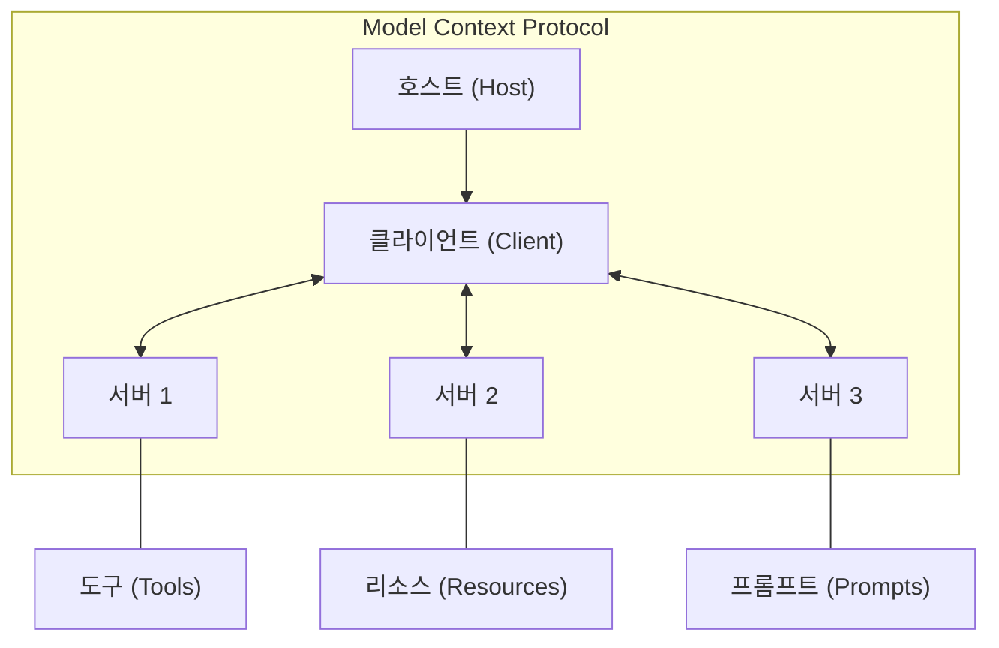
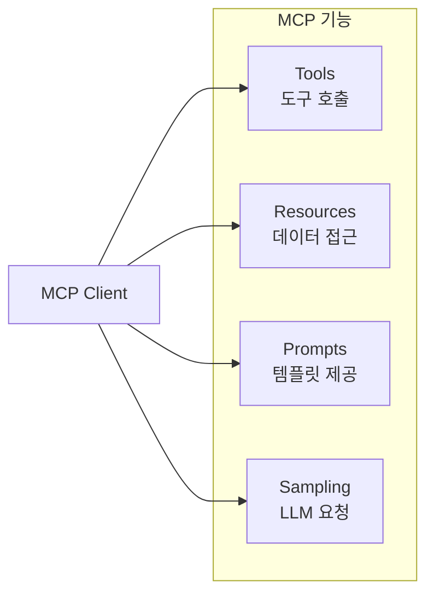
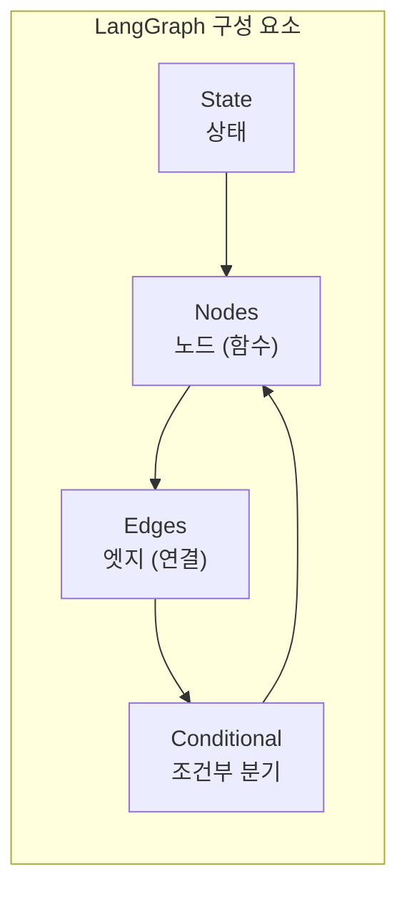
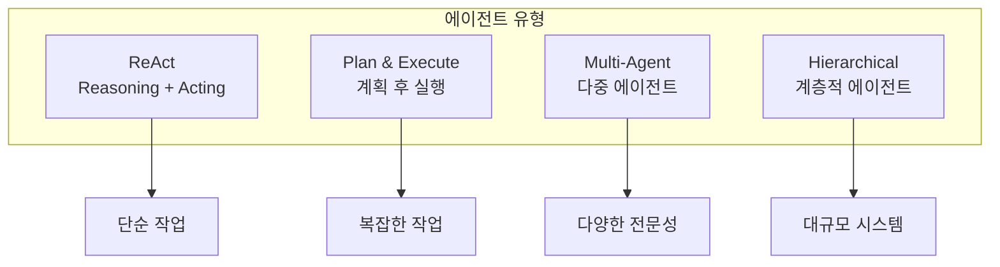

# 7주차: MCP와 LangGraph 기초

---

## 📌 강의 중점

- **MCP (Model Context Protocol)**: LLM과 외부 시스템 연결 표준
- **MCP 서버 구축**: 도구와 리소스 제공
- **LangGraph 기초**: 상태 기반 에이전트 워크플로우
- **에이전트 아키텍처** 설계 패턴

---

## 🎯 학습 목표

학습 완료 후 다음을 수행할 수 있습니다:

- MCP의 개념과 아키텍처를 이해할 수 있다
- 간단한 MCP 서버를 구축할 수 있다
- LangGraph로 상태 기반 워크플로우를 설계할 수 있다
- 에이전트 시스템의 기본 패턴을 구현할 수 있다

---

## [Chapter 1] MCP 소개

### 1.1 MCP란?



**MCP 핵심 개념**:
- **호스트 (Host)**: LLM 애플리케이션 (Claude Desktop, IDE 등)
- **클라이언트 (Client)**: 호스트 내에서 MCP 프로토콜 처리
- **서버 (Server)**: 도구, 리소스, 프롬프트 제공

### 1.2 MCP vs Tool Use

| 항목 | Tool Use | MCP |
|------|----------|-----|
| **범위** | 단일 API 호출 | 시스템 간 통합 |
| **표준화** | 각 제공자별 | 범용 표준 |
| **상태 관리** | 무상태 | 세션 기반 |
| **재사용성** | 제한적 | 높음 |
| **에코시스템** | 폐쇄적 | 개방적 |

### 1.3 MCP 구성 요소



**Tools**: 서버가 제공하는 실행 가능한 함수
**Resources**: 서버가 노출하는 데이터 (파일, DB 등)
**Prompts**: 재사용 가능한 프롬프트 템플릿
**Sampling**: 서버가 LLM 호출을 요청 (역방향)

### 📚 참고 자료

- [MCP 공식 문서](https://modelcontextprotocol.io/)
- [MCP Specification](https://spec.modelcontextprotocol.io/)
- [Anthropic MCP 발표](https://www.anthropic.com/news/model-context-protocol)

---

## [Chapter 2] MCP 서버 구축

### 2.1 MCP 서버 기본 구조

```python
# building_code_server.py
"""건축 법규 MCP 서버"""

from mcp.server import Server
from mcp.server.stdio import stdio_server
from mcp.types import Tool, TextContent, Resource
import json

# 서버 인스턴스 생성
server = Server("building-code-server")


# 샘플 법규 데이터
BUILDING_CODES = {
    "KDS 41 17 00": {
        "name": "건축물 내진설계기준",
        "articles": {
            "제5조": "내진설계 대상: 3층 이상, 연면적 1000㎡ 이상, 높이 13m 이상",
            "제6조": "내진등급: 특등급(지진 시 기능유지), 1등급(대피·구조활동), 2등급(일반)",
            "제7조": "설계지반운동: 지진구역계수와 지반증폭계수 고려"
        }
    },
    "KDS 14 20 50": {
        "name": "콘크리트 기둥 설계기준",
        "articles": {
            "제4조": "최소 단면: 300mm × 300mm 이상",
            "제5조": "주근 최소 개수: 직사각형 4개, 원형 6개 이상",
            "제6조": "띠철근 간격: 최소치수, 주근직경×16, 띠철근직경×48 중 최소"
        }
    }
}


# Tools 정의
@server.list_tools()
async def list_tools():
    """사용 가능한 도구 목록"""
    return [
        Tool(
            name="search_building_code",
            description="건축구조기준(KDS)에서 관련 조문을 검색합니다",
            inputSchema={
                "type": "object",
                "properties": {
                    "keyword": {
                        "type": "string",
                        "description": "검색할 키워드"
                    },
                    "code_id": {
                        "type": "string",
                        "description": "특정 기준 번호 (예: KDS 41 17 00)"
                    }
                },
                "required": ["keyword"]
            }
        ),
        Tool(
            name="get_code_article",
            description="특정 기준의 특정 조문을 조회합니다",
            inputSchema={
                "type": "object",
                "properties": {
                    "code_id": {
                        "type": "string",
                        "description": "기준 번호"
                    },
                    "article": {
                        "type": "string",
                        "description": "조문 번호 (예: 제5조)"
                    }
                },
                "required": ["code_id", "article"]
            }
        )
    ]


@server.call_tool()
async def call_tool(name: str, arguments: dict):
    """도구 실행"""
    if name == "search_building_code":
        return await search_code(arguments.get("keyword", ""), arguments.get("code_id"))

    elif name == "get_code_article":
        return await get_article(arguments["code_id"], arguments["article"])

    raise ValueError(f"Unknown tool: {name}")


async def search_code(keyword: str, code_id: str = None):
    """법규 검색"""
    results = []

    for cid, code in BUILDING_CODES.items():
        if code_id and cid != code_id:
            continue

        for article_num, content in code["articles"].items():
            if keyword.lower() in content.lower():
                results.append({
                    "code_id": cid,
                    "code_name": code["name"],
                    "article": article_num,
                    "content": content
                })

    return [TextContent(
        type="text",
        text=json.dumps(results, ensure_ascii=False, indent=2)
    )]


async def get_article(code_id: str, article: str):
    """특정 조문 조회"""
    if code_id not in BUILDING_CODES:
        return [TextContent(type="text", text=f"기준 {code_id}를 찾을 수 없습니다")]

    code = BUILDING_CODES[code_id]
    if article not in code["articles"]:
        return [TextContent(type="text", text=f"조문 {article}을 찾을 수 없습니다")]

    result = {
        "code_id": code_id,
        "code_name": code["name"],
        "article": article,
        "content": code["articles"][article]
    }

    return [TextContent(
        type="text",
        text=json.dumps(result, ensure_ascii=False, indent=2)
    )]


# Resources 정의
@server.list_resources()
async def list_resources():
    """사용 가능한 리소스 목록"""
    resources = []
    for code_id, code in BUILDING_CODES.items():
        resources.append(Resource(
            uri=f"code://{code_id}",
            name=code["name"],
            description=f"{code_id} 전체 내용",
            mimeType="application/json"
        ))
    return resources


@server.read_resource()
async def read_resource(uri: str):
    """리소스 읽기"""
    # URI에서 code_id 추출
    if uri.startswith("code://"):
        code_id = uri.replace("code://", "")
        if code_id in BUILDING_CODES:
            return json.dumps(BUILDING_CODES[code_id], ensure_ascii=False, indent=2)

    raise ValueError(f"Resource not found: {uri}")


# 서버 실행
async def main():
    async with stdio_server() as (read_stream, write_stream):
        await server.run(read_stream, write_stream)


if __name__ == "__main__":
    import asyncio
    asyncio.run(main())
```

### 2.2 MCP 서버 설정 (Claude Desktop)

```json
// ~/Library/Application Support/Claude/claude_desktop_config.json
{
  "mcpServers": {
    "building-code": {
      "command": "python",
      "args": ["/path/to/building_code_server.py"],
      "env": {}
    },
    "filesystem": {
      "command": "npx",
      "args": ["-y", "@anthropic/mcp-server-filesystem", "/path/to/allowed/directory"]
    }
  }
}
```

### 2.3 Python MCP 클라이언트

```python
# mcp_client.py
"""MCP 클라이언트 예제"""

import asyncio
from mcp import ClientSession, StdioServerParameters
from mcp.client.stdio import stdio_client


async def main():
    # 서버 연결 파라미터
    server_params = StdioServerParameters(
        command="python",
        args=["building_code_server.py"]
    )

    # 클라이언트 세션 시작
    async with stdio_client(server_params) as (read, write):
        async with ClientSession(read, write) as session:
            # 서버 초기화
            await session.initialize()

            # 사용 가능한 도구 목록
            tools = await session.list_tools()
            print("사용 가능한 도구:")
            for tool in tools.tools:
                print(f"  - {tool.name}: {tool.description}")

            # 도구 호출
            result = await session.call_tool(
                "search_building_code",
                {"keyword": "내진"}
            )
            print(f"\n검색 결과:\n{result.content[0].text}")

            # 리소스 목록
            resources = await session.list_resources()
            print("\n사용 가능한 리소스:")
            for resource in resources.resources:
                print(f"  - {resource.uri}: {resource.name}")


if __name__ == "__main__":
    asyncio.run(main())
```

### 📚 참고 자료

- [MCP Python SDK](https://github.com/modelcontextprotocol/python-sdk)
- [MCP TypeScript SDK](https://github.com/modelcontextprotocol/typescript-sdk)
- [MCP Servers Examples](https://github.com/modelcontextprotocol/servers)

---

## [Chapter 3] LangGraph 기초

### 3.1 LangGraph 소개



**LangGraph**는 LangChain 팀이 개발한 **상태 기반 워크플로우** 프레임워크:
- 복잡한 에이전트 로직 구현
- 순환 그래프 지원
- 상태 관리 내장
- 체크포인팅 및 재시작

### 3.2 기본 그래프 구성

```python
from langgraph.graph import StateGraph, END
from typing import TypedDict, Annotated
import operator


# 상태 정의
class AgentState(TypedDict):
    messages: Annotated[list, operator.add]  # 메시지 누적
    current_step: str
    result: str


# 노드 함수 정의
def analyze_query(state: AgentState) -> AgentState:
    """질문 분석 노드"""
    messages = state["messages"]
    query = messages[-1] if messages else ""

    # 질문 유형 분류
    if "내진" in query or "지진" in query:
        query_type = "내진설계"
    elif "기둥" in query or "보" in query:
        query_type = "부재설계"
    else:
        query_type = "일반"

    return {
        "messages": [f"질문 유형: {query_type}"],
        "current_step": "search",
        "result": ""
    }


def search_codes(state: AgentState) -> AgentState:
    """법규 검색 노드"""
    # 실제로는 RAG 또는 MCP 호출
    search_result = "KDS 41 17 00 제5조: 3층 이상 건축물은 내진설계 필요"

    return {
        "messages": [f"검색 결과: {search_result}"],
        "current_step": "generate",
        "result": ""
    }


def generate_answer(state: AgentState) -> AgentState:
    """답변 생성 노드"""
    # 메시지 히스토리 기반 답변 생성
    context = "\n".join(state["messages"])
    answer = f"분석 결과에 따른 답변입니다. (컨텍스트: {len(context)}자)"

    return {
        "messages": [f"답변: {answer}"],
        "current_step": "complete",
        "result": answer
    }


# 조건부 엣지
def should_continue(state: AgentState) -> str:
    """다음 단계 결정"""
    if state["current_step"] == "complete":
        return END
    return state["current_step"]


# 그래프 구성
workflow = StateGraph(AgentState)

# 노드 추가
workflow.add_node("analyze", analyze_query)
workflow.add_node("search", search_codes)
workflow.add_node("generate", generate_answer)

# 엣지 추가
workflow.set_entry_point("analyze")
workflow.add_edge("analyze", "search")
workflow.add_edge("search", "generate")
workflow.add_conditional_edges(
    "generate",
    should_continue,
    {
        END: END,
        "search": "search"  # 재검색 가능
    }
)

# 그래프 컴파일
app = workflow.compile()

# 실행
result = app.invoke({
    "messages": ["내진설계 대상 건축물은 무엇인가요?"],
    "current_step": "start",
    "result": ""
})

print("최종 결과:", result["result"])
```

### 3.3 ReAct 에이전트 패턴

```python
from langgraph.graph import StateGraph, END
from langgraph.prebuilt import ToolExecutor
from langchain_anthropic import ChatAnthropic
from langchain_core.messages import HumanMessage, AIMessage, ToolMessage
from typing import TypedDict, Annotated, Sequence
import operator


# 상태 정의
class ReActState(TypedDict):
    messages: Annotated[Sequence[dict], operator.add]


# 도구 정의
def search_building_code(query: str) -> str:
    """건축 법규 검색"""
    # 실제 검색 로직
    return f"검색 결과: '{query}' 관련 - KDS 41 17 00 제5조"


def calculate_load(dead_load: float, live_load: float) -> str:
    """하중 계산"""
    factored = 1.2 * dead_load + 1.6 * live_load
    return f"설계하중 = 1.2×{dead_load} + 1.6×{live_load} = {factored} kN/m²"


tools = [search_building_code, calculate_load]


# LLM 설정
llm = ChatAnthropic(model="claude-3-5-sonnet-20241022")
llm_with_tools = llm.bind_tools(tools)


def call_model(state: ReActState) -> dict:
    """LLM 호출 노드"""
    messages = state["messages"]
    response = llm_with_tools.invoke(messages)
    return {"messages": [response]}


def call_tools(state: ReActState) -> dict:
    """도구 실행 노드"""
    last_message = state["messages"][-1]
    tool_calls = last_message.tool_calls

    results = []
    for tool_call in tool_calls:
        tool_name = tool_call["name"]
        tool_args = tool_call["args"]

        # 도구 실행
        if tool_name == "search_building_code":
            result = search_building_code(tool_args["query"])
        elif tool_name == "calculate_load":
            result = calculate_load(tool_args["dead_load"], tool_args["live_load"])
        else:
            result = f"Unknown tool: {tool_name}"

        results.append(
            ToolMessage(content=result, tool_call_id=tool_call["id"])
        )

    return {"messages": results}


def should_continue(state: ReActState) -> str:
    """계속 여부 결정"""
    last_message = state["messages"][-1]

    # 도구 호출이 있으면 도구 실행
    if hasattr(last_message, "tool_calls") and last_message.tool_calls:
        return "tools"

    return END


# 그래프 구성
workflow = StateGraph(ReActState)

workflow.add_node("agent", call_model)
workflow.add_node("tools", call_tools)

workflow.set_entry_point("agent")

workflow.add_conditional_edges(
    "agent",
    should_continue,
    {
        "tools": "tools",
        END: END
    }
)
workflow.add_edge("tools", "agent")

app = workflow.compile()


# 실행
result = app.invoke({
    "messages": [
        HumanMessage(content="고정하중 5kN/m², 활하중 2.5kN/m²일 때 설계하중을 계산해주세요.")
    ]
})

for msg in result["messages"]:
    print(f"{msg.__class__.__name__}: {msg.content}")
```

### 3.4 그래프 시각화

```python
from IPython.display import Image, display

# 그래프 시각화 (Mermaid)
print(app.get_graph().draw_mermaid())

# PNG 이미지 생성 (graphviz 필요)
# display(Image(app.get_graph().draw_png()))
```

### 📚 참고 자료

- [LangGraph Documentation](https://langchain-ai.github.io/langgraph/)
- [LangGraph GitHub](https://github.com/langchain-ai/langgraph)
- [ReAct Pattern Paper](https://arxiv.org/abs/2210.03629)

---

## [Chapter 4] 에이전트 아키텍처

### 4.1 에이전트 유형



### 4.2 Plan & Execute 패턴

```python
from langgraph.graph import StateGraph, END
from typing import TypedDict, List
import anthropic


class PlanExecuteState(TypedDict):
    input: str
    plan: List[str]
    current_step: int
    step_results: List[str]
    final_result: str


def create_plan(state: PlanExecuteState) -> dict:
    """계획 수립"""
    client = anthropic.Anthropic()

    response = client.messages.create(
        model="claude-3-5-sonnet-20241022",
        max_tokens=1000,
        messages=[{
            "role": "user",
            "content": f"""다음 질문에 답하기 위한 단계별 계획을 수립하세요.
질문: {state['input']}

각 단계를 번호로 나열하세요:
1. [첫 번째 단계]
2. [두 번째 단계]
...
"""
        }]
    )

    # 계획 파싱
    text = response.content[0].text
    steps = []
    for line in text.split("\n"):
        if line.strip() and line[0].isdigit():
            step = line.split(".", 1)[1].strip() if "." in line else line.strip()
            steps.append(step)

    return {
        "plan": steps,
        "current_step": 0,
        "step_results": []
    }


def execute_step(state: PlanExecuteState) -> dict:
    """현재 단계 실행"""
    client = anthropic.Anthropic()

    current_idx = state["current_step"]
    current_plan = state["plan"][current_idx]
    previous_results = "\n".join(state["step_results"])

    response = client.messages.create(
        model="claude-3-5-sonnet-20241022",
        max_tokens=1000,
        messages=[{
            "role": "user",
            "content": f"""이전 결과:
{previous_results}

현재 단계를 수행하세요:
{current_plan}
"""
        }]
    )

    result = response.content[0].text

    return {
        "step_results": state["step_results"] + [f"[단계 {current_idx + 1}] {result}"],
        "current_step": current_idx + 1
    }


def generate_final_answer(state: PlanExecuteState) -> dict:
    """최종 답변 생성"""
    client = anthropic.Anthropic()

    all_results = "\n".join(state["step_results"])

    response = client.messages.create(
        model="claude-3-5-sonnet-20241022",
        max_tokens=2000,
        messages=[{
            "role": "user",
            "content": f"""원래 질문: {state['input']}

수행된 단계와 결과:
{all_results}

위 내용을 바탕으로 최종 답변을 작성하세요.
"""
        }]
    )

    return {"final_result": response.content[0].text}


def should_continue(state: PlanExecuteState) -> str:
    """계속 여부 결정"""
    if state["current_step"] >= len(state["plan"]):
        return "finalize"
    return "execute"


# 그래프 구성
workflow = StateGraph(PlanExecuteState)

workflow.add_node("plan", create_plan)
workflow.add_node("execute", execute_step)
workflow.add_node("finalize", generate_final_answer)

workflow.set_entry_point("plan")
workflow.add_conditional_edges(
    "plan",
    lambda s: "execute" if s["plan"] else "finalize"
)
workflow.add_conditional_edges("execute", should_continue)
workflow.add_edge("finalize", END)

app = workflow.compile()
```

### 4.3 Multi-Agent 시스템

```python
from langgraph.graph import StateGraph, END
from typing import TypedDict, List, Dict


class MultiAgentState(TypedDict):
    query: str
    agents_results: Dict[str, str]
    final_answer: str


def structural_agent(state: MultiAgentState) -> dict:
    """구조 전문 에이전트"""
    # 구조 분야 분석
    result = f"[구조 분석] {state['query']}에 대한 구조적 검토 결과..."
    return {
        "agents_results": {**state.get("agents_results", {}), "structural": result}
    }


def code_agent(state: MultiAgentState) -> dict:
    """법규 전문 에이전트"""
    # 법규 검토
    result = f"[법규 검토] {state['query']}에 대한 관련 법규..."
    return {
        "agents_results": {**state.get("agents_results", {}), "code": result}
    }


def coordinator_agent(state: MultiAgentState) -> dict:
    """조정 에이전트 - 결과 통합"""
    results = state.get("agents_results", {})
    combined = "\n".join([f"{k}: {v}" for k, v in results.items()])
    return {"final_answer": f"통합 분석 결과:\n{combined}"}


# 병렬 실행을 위한 그래프
workflow = StateGraph(MultiAgentState)

workflow.add_node("structural", structural_agent)
workflow.add_node("code", code_agent)
workflow.add_node("coordinator", coordinator_agent)

workflow.set_entry_point("structural")
workflow.add_edge("structural", "code")  # 순차 실행 (또는 병렬 가능)
workflow.add_edge("code", "coordinator")
workflow.add_edge("coordinator", END)

app = workflow.compile()
```

### 📚 참고 자료

- [Agent Architectures](https://blog.langchain.dev/planning-agents/)
- [Multi-Agent Systems](https://python.langchain.com/docs/tutorials/multi_agent/)
- [LangGraph Agents](https://langchain-ai.github.io/langgraph/tutorials/)

---

## 💻 실습 코드

### 실습 1: 건축 법규 MCP 서버

```python
# practice/kds_mcp_server.py
"""건축구조기준 MCP 서버 (확장 버전)"""

from mcp.server import Server
from mcp.server.stdio import stdio_server
from mcp.types import Tool, TextContent, Resource, Prompt, PromptMessage
import json
import asyncio

server = Server("kds-building-code")

# 확장된 법규 데이터
KDS_DATABASE = {
    "KDS 41 17 00": {
        "name": "건축물 내진설계기준",
        "category": "내진",
        "articles": {
            "제3조": "적용범위: 모든 건축물의 내진설계에 적용",
            "제5조": "내진설계 대상: 3층 이상, 1000㎡ 이상, 13m 이상",
            "제6조": "내진등급: 특등급(기능유지), 1등급(대피구조), 2등급(일반)",
            "제10조": "응답수정계수: 구조시스템별 R값 적용"
        }
    },
    "KDS 14 20 50": {
        "name": "콘크리트 기둥 설계기준",
        "category": "콘크리트",
        "articles": {
            "제4조": "최소 단면: 300×300mm 이상",
            "제5조": "주근 개수: 직사각형 4개, 원형 6개 이상",
            "제6조": "철근비: 0.01 이상 0.08 이하"
        }
    }
}


@server.list_tools()
async def list_tools():
    return [
        Tool(
            name="search_kds",
            description="KDS 건축구조기준에서 키워드로 검색합니다",
            inputSchema={
                "type": "object",
                "properties": {
                    "keyword": {"type": "string", "description": "검색 키워드"},
                    "category": {"type": "string", "description": "분류 (내진, 콘크리트 등)"}
                },
                "required": ["keyword"]
            }
        ),
        Tool(
            name="get_article",
            description="특정 조문의 상세 내용을 조회합니다",
            inputSchema={
                "type": "object",
                "properties": {
                    "code_id": {"type": "string"},
                    "article_no": {"type": "string"}
                },
                "required": ["code_id", "article_no"]
            }
        ),
        Tool(
            name="list_codes",
            description="등록된 모든 기준 목록을 반환합니다",
            inputSchema={"type": "object", "properties": {}}
        )
    ]


@server.call_tool()
async def call_tool(name: str, arguments: dict):
    if name == "search_kds":
        keyword = arguments.get("keyword", "")
        category = arguments.get("category")

        results = []
        for code_id, code in KDS_DATABASE.items():
            if category and code["category"] != category:
                continue

            for article_no, content in code["articles"].items():
                if keyword.lower() in content.lower():
                    results.append({
                        "code_id": code_id,
                        "code_name": code["name"],
                        "article": article_no,
                        "content": content
                    })

        return [TextContent(type="text", text=json.dumps(results, ensure_ascii=False, indent=2))]

    elif name == "get_article":
        code_id = arguments["code_id"]
        article_no = arguments["article_no"]

        if code_id in KDS_DATABASE:
            code = KDS_DATABASE[code_id]
            if article_no in code["articles"]:
                return [TextContent(type="text", text=json.dumps({
                    "code_id": code_id,
                    "code_name": code["name"],
                    "article": article_no,
                    "content": code["articles"][article_no]
                }, ensure_ascii=False))]

        return [TextContent(type="text", text="조문을 찾을 수 없습니다")]

    elif name == "list_codes":
        codes = [{"id": k, "name": v["name"], "category": v["category"]}
                 for k, v in KDS_DATABASE.items()]
        return [TextContent(type="text", text=json.dumps(codes, ensure_ascii=False))]


@server.list_resources()
async def list_resources():
    return [
        Resource(
            uri=f"kds://{code_id}",
            name=code["name"],
            description=f"{code_id} 전체 조문",
            mimeType="application/json"
        )
        for code_id, code in KDS_DATABASE.items()
    ]


@server.read_resource()
async def read_resource(uri: str):
    code_id = uri.replace("kds://", "")
    if code_id in KDS_DATABASE:
        return json.dumps(KDS_DATABASE[code_id], ensure_ascii=False, indent=2)
    raise ValueError(f"Resource not found: {uri}")


@server.list_prompts()
async def list_prompts():
    return [
        Prompt(
            name="code_review",
            description="건축 법규 검토 프롬프트",
            arguments=[
                {"name": "structure_type", "description": "구조 유형", "required": True},
                {"name": "question", "description": "검토 질문", "required": True}
            ]
        )
    ]


@server.get_prompt()
async def get_prompt(name: str, arguments: dict):
    if name == "code_review":
        return {
            "messages": [
                PromptMessage(
                    role="user",
                    content={
                        "type": "text",
                        "text": f"""구조 유형 '{arguments.get('structure_type')}'에 대해
다음 질문을 검토해 주세요: {arguments.get('question')}

관련 KDS 기준을 참조하여 답변해 주세요."""
                    }
                )
            ]
        }


async def main():
    async with stdio_server() as (read, write):
        await server.run(read, write)


if __name__ == "__main__":
    asyncio.run(main())
```

### 실습 2: LangGraph 건축 상담 에이전트

```python
# practice/building_consultant_agent.py
"""건축 상담 에이전트 (LangGraph)"""

from langgraph.graph import StateGraph, END
from typing import TypedDict, Annotated, List
import operator
import anthropic


class ConsultantState(TypedDict):
    question: str
    category: str
    search_results: List[str]
    answer: str
    confidence: float


def classify_question(state: ConsultantState) -> dict:
    """질문 분류"""
    question = state["question"].lower()

    if any(k in question for k in ["내진", "지진", "진동"]):
        category = "seismic"
    elif any(k in question for k in ["기둥", "보", "슬래브", "부재"]):
        category = "member"
    elif any(k in question for k in ["하중", "힘", "모멘트"]):
        category = "load"
    else:
        category = "general"

    return {"category": category}


def search_relevant_codes(state: ConsultantState) -> dict:
    """관련 법규 검색"""
    category = state["category"]

    # 카테고리별 검색 결과 (시뮬레이션)
    results_db = {
        "seismic": [
            "KDS 41 17 00 제5조: 내진설계 대상 건축물",
            "KDS 41 17 00 제6조: 내진등급 구분"
        ],
        "member": [
            "KDS 14 20 50 제4조: 기둥 최소 단면",
            "KDS 14 20 50 제6조: 철근비 규정"
        ],
        "load": [
            "KDS 41 12 00 제3조: 고정하중",
            "KDS 41 12 00 제4조: 활하중"
        ],
        "general": [
            "건축법 제48조: 구조내력",
            "건축법 시행령 제32조: 구조안전 확인"
        ]
    }

    results = results_db.get(category, results_db["general"])
    return {"search_results": results}


def generate_answer(state: ConsultantState) -> dict:
    """답변 생성"""
    client = anthropic.Anthropic()

    context = "\n".join(state["search_results"])

    response = client.messages.create(
        model="claude-3-5-sonnet-20241022",
        max_tokens=1500,
        system="당신은 건축구조 전문 상담사입니다. 정확한 법규를 인용하여 답변합니다.",
        messages=[{
            "role": "user",
            "content": f"""질문: {state['question']}

관련 법규:
{context}

위 법규를 참고하여 답변해 주세요. 출처를 명시하세요."""
        }]
    )

    # 답변 길이로 간단한 신뢰도 추정
    answer = response.content[0].text
    confidence = min(len(answer) / 500, 1.0)

    return {
        "answer": answer,
        "confidence": confidence
    }


def should_refine(state: ConsultantState) -> str:
    """답변 개선 필요 여부"""
    if state["confidence"] < 0.5:
        return "refine"
    return END


def refine_answer(state: ConsultantState) -> dict:
    """답변 개선"""
    # 추가 검색 또는 상세화 로직
    refined = f"[개선됨] {state['answer']}\n\n추가 참고사항: 전문가 상담 권장"
    return {"answer": refined, "confidence": 0.7}


# 그래프 구성
workflow = StateGraph(ConsultantState)

workflow.add_node("classify", classify_question)
workflow.add_node("search", search_relevant_codes)
workflow.add_node("answer", generate_answer)
workflow.add_node("refine", refine_answer)

workflow.set_entry_point("classify")
workflow.add_edge("classify", "search")
workflow.add_edge("search", "answer")
workflow.add_conditional_edges("answer", should_refine, {"refine": "refine", END: END})
workflow.add_edge("refine", END)

consultant = workflow.compile()


def consult(question: str) -> dict:
    """상담 실행"""
    result = consultant.invoke({
        "question": question,
        "category": "",
        "search_results": [],
        "answer": "",
        "confidence": 0.0
    })

    return {
        "question": result["question"],
        "category": result["category"],
        "answer": result["answer"],
        "confidence": result["confidence"],
        "sources": result["search_results"]
    }


if __name__ == "__main__":
    result = consult("3층 건물은 내진설계를 해야 하나요?")
    print(f"분류: {result['category']}")
    print(f"답변: {result['answer']}")
    print(f"신뢰도: {result['confidence']:.2f}")
```

---

## 📝 과제

### 과제 1: MCP 서버 구현 (제출)

건축 관련 MCP 서버 구현:

**요구사항**:
1. 최소 2개의 도구 (Tools)
2. 최소 1개의 리소스 (Resources)
3. 실제 데이터 또는 시뮬레이션 데이터 포함

**제출물**:
- Python 서버 코드
- 클라이언트 테스트 코드
- 실행 결과 스크린샷

### 과제 2: LangGraph 워크플로우 (제출)

LangGraph로 에이전트 워크플로우 구현:

**요구사항**:
1. 최소 3개 노드
2. 조건부 분기 포함
3. 상태 관리 활용

**제출물**:
- Python 코드
- 워크플로우 다이어그램 (Mermaid)
- 실행 결과

---

## 🔗 추가 학습 자료

### 공식 문서
- [MCP Documentation](https://modelcontextprotocol.io/docs)
- [LangGraph](https://langchain-ai.github.io/langgraph/)
- [LangChain Agents](https://python.langchain.com/docs/tutorials/agents/)

### 튜토리얼
- [Building MCP Servers](https://modelcontextprotocol.io/quickstart/server)
- [LangGraph Tutorial](https://langchain-ai.github.io/langgraph/tutorials/)

### GitHub
- [MCP Servers](https://github.com/modelcontextprotocol/servers)
- [LangGraph Examples](https://github.com/langchain-ai/langgraph/tree/main/examples)

---

## 🚀 발전 전략 (Development Strategies)

### 전략 1: 실무 중심 MCP 서버 확장 개발

**목표**: 건축공학 실무에서 즉시 활용 가능한 MCP 서버 구축

**실습 과제**:
1. **구조계산 MCP 서버**
   - 도구: `calculate_beam_moment`, `check_column_capacity`, `design_slab_thickness`
   - 리소스: 구조설계표준(KDS) 계수 데이터베이스
   - 프롬프트: 부재 설계 검토 템플릿

2. **자재 데이터베이스 MCP 서버**
   - 도구: `search_material_properties`, `compare_steel_grades`, `get_concrete_strength`
   - 리소스: 철근/콘크리트/강재 규격 데이터
   - 실시간 자재 단가 API 연동 (선택사항)

3. **도면 검토 MCP 서버**
   - 도구: `validate_drawing_standards`, `check_dimension_consistency`
   - 리소스: CAD 도면 메타데이터 접근
   - 건축법/구조기준 자동 체크리스트

**개발 로드맵**:
```python
# Week 7: 기본 MCP 서버 (2개 도구)
# Week 8: 고급 MCP 서버 (5개+ 도구, 리소스 통합)
# Week 9: 실무 프로젝트에 MCP 서버 적용
```

**실무 예시**:
```python
# 구조계산 MCP 서버 확장 예제
@server.call_tool()
async def call_tool(name: str, arguments: dict):
    if name == "calculate_beam_moment":
        span = arguments["span"]  # m
        uniform_load = arguments["uniform_load"]  # kN/m

        # 단순보 최대 모멘트: M = wL²/8
        max_moment = uniform_load * span**2 / 8

        return [TextContent(
            type="text",
            text=json.dumps({
                "span_m": span,
                "load_kN_m": uniform_load,
                "max_moment_kNm": round(max_moment, 2),
                "code_reference": "KDS 14 20 20 제5조",
                "design_recommendation": f"필요 단면계수: {max_moment/0.9/400:.2f} cm³"
            }, ensure_ascii=False, indent=2)
        )]
```

---

### 전략 2: LangGraph 패턴별 실전 훈련

**목표**: 4가지 주요 에이전트 패턴을 건축공학 사례로 구현

**패턴별 실습 프로젝트**:

1. **ReAct 패턴**: 건축 법규 자동 검토 에이전트
   - 사용자 질문 → 법규 검색 → 판단 → 추가 검색 → 최종 답변
   - 도구: `search_kds`, `calculate_compliance`, `cite_article`

2. **Plan & Execute 패턴**: 구조설계 절차 자동화
   - 입력: "5층 철근콘크리트 건물 설계"
   - 계획 단계: 하중산정 → 부재설계 → 접합부 검토 → 도면작성
   - 각 단계별 실행 및 결과 누적

3. **Multi-Agent 패턴**: 설계 검토 시스템
   - 구조 에이전트: 구조적 안전성 검토
   - 법규 에이전트: 건축법/구조기준 적합성
   - 경제성 에이전트: 자재비 및 공사비 추정
   - 조정 에이전트: 종합 보고서 작성

4. **Hierarchical 패턴**: 대규모 프로젝트 관리
   - 관리자 에이전트: 전체 작업 분배
   - 전문 에이전트: 구조/건축/설비 분야별 실행
   - 검증 에이전트: 품질 검수 및 승인

**실습 코드 템플릿**:
```python
# Multi-Agent 건축 설계 검토 시스템
class DesignReviewState(TypedDict):
    project_info: dict
    structural_review: str
    code_review: str
    cost_review: str
    final_report: str

def structural_review_agent(state: DesignReviewState) -> dict:
    """구조 안전성 검토"""
    project = state["project_info"]

    # 구조 계산 및 검토 로직
    review = f"""
    [구조 안전성 검토]
    - 건물 높이: {project['height']}m
    - 내진설계 대상: {'예' if project['floors'] >= 3 else '아니오'}
    - 구조시스템: {project['structure_type']}
    - 검토 결과: 기준 적합
    """

    return {"structural_review": review}
```

---

### 전략 3: 건축 데이터 통합 워크플로우 구축

**목표**: 실제 건축 프로젝트 데이터를 MCP + LangGraph로 처리

**통합 시나리오**:

1. **BIM 데이터 연동**
   ```python
   # MCP 서버로 Revit/ArchiCAD 데이터 노출
   @server.list_resources()
   async def list_resources():
       return [
           Resource(
               uri="bim://structural-elements",
               name="구조 부재 목록",
               mimeType="application/json"
           ),
           Resource(
               uri="bim://material-quantities",
               name="자재 물량",
               mimeType="application/json"
           )
       ]
   ```

2. **구조해석 결과 자동 해석**
   - MCP 서버: SAP2000/MIDAS 결과 파일 읽기
   - LangGraph: 결과 분석 → 기준 검토 → 보고서 생성

3. **설계 도서 자동 생성**
   - 입력: 프로젝트 기본 정보
   - 워크플로우: 법규 검색 → 하중 산정 → 부재 설계 → Word/PDF 출력

**실무 통합 예제**:
```python
# 구조해석 결과 자동 검토 워크플로우
class AnalysisReviewState(TypedDict):
    analysis_file: str  # 해석 결과 파일 경로
    max_stress: dict
    max_displacement: dict
    code_check: dict
    report: str

def parse_analysis_results(state: AnalysisReviewState) -> dict:
    """해석 결과 파싱"""
    # CSV/Excel 파일 읽기
    import pandas as pd
    df = pd.read_csv(state["analysis_file"])

    max_stress = {
        "element": df["Element"].iloc[df["Stress"].idxmax()],
        "value": df["Stress"].max(),
        "allowable": 400  # MPa (예시)
    }

    return {"max_stress": max_stress}

def check_code_compliance(state: AnalysisReviewState) -> dict:
    """기준 적합성 검토"""
    stress = state["max_stress"]

    check = {
        "stress_ok": stress["value"] <= stress["allowable"],
        "ratio": stress["value"] / stress["allowable"],
        "code_ref": "KDS 14 31 05 제4조"
    }

    return {"code_check": check}
```

---

### 전략 4: 인터랙티브 학습 환경 구축

**목표**: Jupyter Notebook + MCP + LangGraph 통합 실습 환경

**학습 단계별 노트북**:

1. **Week7_Lab1_MCP_Basics.ipynb**
   ```python
   # Cell 1: MCP 서버 시작
   !python building_code_server.py &

   # Cell 2: 클라이언트 연결 및 테스트
   from mcp_client import connect_to_server
   session = connect_to_server("building-code")

   # Cell 3: 인터랙티브 도구 호출
   result = session.call_tool("search_kds", {"keyword": "내진"})
   display(JSON(result))

   # Cell 4: 시각화
   import matplotlib.pyplot as plt
   # 검색 결과 시각화
   ```

2. **Week7_Lab2_LangGraph_Visualization.ipynb**
   ```python
   # 그래프 실시간 시각화
   from IPython.display import display, Image

   # 워크플로우 실행 + 각 단계별 출력
   for step in consultant.stream({"question": "..."}):
       print(f"현재 노드: {step}")
       display(Image(app.get_graph().draw_png()))
   ```

3. **Week7_Lab3_Integration_Practice.ipynb**
   - MCP 서버 + LangGraph 통합 실습
   - 실시간 디버깅 및 상태 추적
   - 에러 처리 및 재시도 로직

**인터랙티브 요소**:
- Jupyter Widgets으로 파라미터 조절
- 실시간 그래프 시각화
- 단계별 실행 및 중단점 설정

---

### 전략 5: 성능 최적화 및 프로덕션 준비

**목표**: 개발 환경에서 실무 배포 수준으로 고도화

**최적화 체크리스트**:

1. **MCP 서버 성능 개선**
   ```python
   # 캐싱 추가
   from functools import lru_cache

   @lru_cache(maxsize=100)
   def search_code_cached(keyword: str):
       # 자주 검색되는 키워드 결과 캐싱
       pass

   # 비동기 병렬 처리
   async def call_multiple_tools(tool_calls: list):
       tasks = [call_tool(name, args) for name, args in tool_calls]
       return await asyncio.gather(*tasks)
   ```

2. **LangGraph 상태 저장 및 복구**
   ```python
   from langgraph.checkpoint.memory import MemorySaver

   # 체크포인트 설정
   memory = MemorySaver()
   app = workflow.compile(checkpointer=memory)

   # 실행 중단 후 재개
   config = {"configurable": {"thread_id": "project-001"}}
   result = app.invoke(input_data, config=config)
   ```

3. **에러 처리 강화**
   ```python
   def robust_llm_call(state):
       """재시도 로직 포함 LLM 호출"""
       max_retries = 3
       for attempt in range(max_retries):
           try:
               response = llm.invoke(messages)
               return {"messages": [response]}
           except Exception as e:
               if attempt == max_retries - 1:
                   return {"messages": [f"오류: {e}"]}
               time.sleep(2 ** attempt)  # 지수 백오프
   ```

4. **로깅 및 모니터링**
   ```python
   import logging

   logging.basicConfig(level=logging.INFO)
   logger = logging.getLogger("building_agent")

   def logged_node(func):
       def wrapper(state):
           logger.info(f"Node {func.__name__} started")
           result = func(state)
           logger.info(f"Node {func.__name__} completed")
           return result
       return wrapper
   ```

5. **보안 및 인증**
   ```python
   # MCP 서버에 API 키 검증 추가
   @server.call_tool()
   async def call_tool(name: str, arguments: dict):
       # API 키 검증
       if not verify_api_key(arguments.get("api_key")):
           raise PermissionError("Invalid API key")

       # 도구 실행
       return execute_tool(name, arguments)
   ```

**프로덕션 배포 체크리스트**:
- [ ] 단위 테스트 작성 (pytest)
- [ ] 통합 테스트 (MCP 서버 ↔ 클라이언트)
- [ ] 부하 테스트 (동시 요청 처리)
- [ ] Docker 컨테이너화
- [ ] CI/CD 파이프라인 구축
- [ ] 모니터링 대시보드 (Grafana/Prometheus)

---

### 전략 6: 건축공학 특화 에이전트 라이브러리 구축

**목표**: 재사용 가능한 건축 에이전트 컴포넌트 라이브러리 개발

**라이브러리 구조**:
```
arch_ai_toolkit/
├── mcp_servers/
│   ├── kds_server.py          # 건축구조기준
│   ├── material_server.py     # 자재 DB
│   └── calculation_server.py  # 구조계산
├── agents/
│   ├── code_reviewer.py       # 법규 검토 에이전트
│   ├── structural_designer.py # 구조설계 에이전트
│   └── cost_estimator.py      # 견적 에이전트
├── workflows/
│   ├── design_review.py       # 설계 검토 워크플로우
│   └── project_planning.py    # 프로젝트 계획 워크플로우
└── utils/
    ├── kds_parser.py          # 법규 파싱
    └── structural_calcs.py    # 구조계산 유틸리티
```

**모듈화 예제**:
```python
# arch_ai_toolkit/agents/code_reviewer.py
"""건축 법규 검토 에이전트"""

from langgraph.graph import StateGraph, END
from typing import TypedDict

class CodeReviewAgent:
    """재사용 가능한 법규 검토 에이전트"""

    def __init__(self, kds_server_url: str):
        self.kds_server = kds_server_url
        self.workflow = self._build_workflow()

    def _build_workflow(self) -> StateGraph:
        """워크플로우 구축"""
        workflow = StateGraph(CodeReviewState)
        # 노드 및 엣지 설정
        return workflow.compile()

    def review(self, project_data: dict) -> dict:
        """프로젝트 법규 검토 실행"""
        return self.workflow.invoke(project_data)

# 사용 예시
from arch_ai_toolkit.agents import CodeReviewAgent

reviewer = CodeReviewAgent(kds_server_url="http://localhost:8000")
result = reviewer.review({
    "building_type": "공동주택",
    "floors": 5,
    "total_area": 3000
})
```

**학생 프로젝트로 발전**:
- 각 팀별로 1개 모듈 개발
- GitHub으로 협업 및 통합
- 학기말 통합 라이브러리 완성
- 실제 오픈소스 프로젝트로 발전 가능

---

### 전략 7: 실전 프로젝트 기반 학습 (PBL)

**목표**: 실제 건축 프로젝트 시나리오로 MCP + LangGraph 종합 실습

**프로젝트 시나리오**:

**프로젝트: "5층 근린생활시설 구조설계 자동화 시스템"**

**Phase 1 (Week 7)**: MCP 서버 구축
- 건축구조기준(KDS) 서버
- 자재 물성 데이터 서버
- 구조계산 도구 서버

**Phase 2 (Week 8)**: LangGraph 워크플로우 개발
- 설계 조건 분석 → 하중 산정 → 부재 설계 → 검토 → 보고서

**Phase 3 (Week 9)**: 통합 및 배포
- 웹 인터페이스 개발 (Streamlit)
- 사용자 테스트 및 피드백
- 최종 발표 및 시연

**평가 기준**:
- 기능 완성도 (40%)
- 코드 품질 및 문서화 (30%)
- 실용성 및 창의성 (20%)
- 발표 및 시연 (10%)

**예상 결과물**:
```python
# 최종 통합 시스템
from arch_ai_toolkit import StructuralDesignSystem

system = StructuralDesignSystem(
    mcp_servers=["kds", "materials", "calculator"],
    workflow="complete_design"
)

# 사용자 입력
project = {
    "building_name": "○○근린생활시설",
    "location": "서울시 강남구",
    "floors": 5,
    "total_area": 2500,
    "structure_type": "철근콘크리트"
}

# 자동 설계 실행
result = system.design(project)

# 결과 출력
print(result["design_summary"])
result["report"].save("design_report.pdf")
```

---

**종합 학습 로드맵**:

| 주차 | 전략 | 목표 산출물 |
|------|------|-------------|
| 7주차 | 전략 1, 2 | 기본 MCP 서버 + ReAct 에이전트 |
| 8주차 | 전략 3, 4 | 데이터 통합 + Jupyter 실습 환경 |
| 9주차 | 전략 5, 6 | 최적화 + 라이브러리화 |
| 10주차 | 전략 7 | 최종 프로젝트 완성 |

**학습 효과 극대화 팁**:
1. 매주 실습 코드를 GitHub에 커밋 (버전 관리 학습)
2. 팀 프로젝트로 진행 시 역할 분담 (MCP 개발자, Agent 개발자, 통합 담당)
3. 실무 데이터 활용 (건축구조기준, 실제 프로젝트 도면)
4. 주간 코드 리뷰 세션 (동료 학습)
5. 오픈소스 기여 경험 (MCP Servers GitHub에 PR)
