# Week 07: Model Context Protocol — Model Context Protocol (S6)

---

## 📌 Lecture Focus

**Ch.1 MCP Server Fundamentals**
- **Introducing MCP**: A standard protocol connecting LLM applications to external tools/data — "the USB-C of AI"
- **MCP Client Architecture**: The separation of roles and communication flow among host, client, and server
- **Project Setup**: Configure a Python environment, install `mcp[cli]`, and initialize a FastMCP project
- **Defining MCP Tools**: Declare tools with the `@mcp.tool()` decorator; automatic schema generation
- **Server Inspector**: Test server functionality using the browser-based MCP Inspector

**Ch.2 Client, Resources & Prompts**
- **Client Implementation**: Connect to a server and invoke tools from a Python MCP client
- **Defining Resources**: Expose static/dynamic data with the `@mcp.resource()` decorator
- **Accessing Resources**: List and read resources from the client
- **Defining Prompts**: Author reusable prompt templates with the `@mcp.prompt()` decorator
- **Using Prompts in the Client**: List prompts and generate messages

**Integration Cycle**: MCP concepts → build a server → test with Inspector → connect a client → extend with resources/prompts

---

## 🎯 Learning Objectives

After completing this module, you will be able to:

**Ch.1 MCP Server Fundamentals**
- Explain the three core features of MCP (Tools, Resources, Prompts) and contrast them with Tool Use
- Create a Python MCP server with FastMCP and define tools
- Auto-generate schemas with the `@mcp.tool()` decorator and type hints
- Test a server's tools, resources, and prompts with the MCP Inspector

**Ch.2 Client, Resources & Prompts**
- Implement an MCP client that connects to a server and invokes tools
- Define static/dynamic resources with `@mcp.resource()` and read them from the client
- Define prompt templates with `@mcp.prompt()` and use them from the client
- Integrate your own MCP server with Claude Desktop or Claude Code

**Integrated Competency**
- Build an MCP server from scratch containing all three — Tools + Resources + Prompts — and implement the full workflow of connecting to it from a client

---

## 🤔 Why Learn This? — "Standardizing Tools as a Protocol"

> [!question] In [[Week_04]] we learned **how to define tools directly** for Claude. In Week 07 we learn how to **separate, share, and reuse** tools as a **standard protocol**.

### The Limits of Tool Use: Tool Definitions Tied to the App

Tool Use, which we learned in Week 04, is powerful, yet the tool definitions and execution logic are **embedded directly in the application code**. Once you build a weather tool, it only works inside that app; reusing it in another app means copying the code.

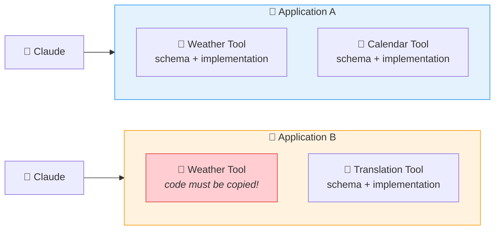
```mermaid
graph LR
    subgraph APP1["📱 Application A"]
        direction TB
        T1A["🔧 Weather Tool<br/>schema + implementation"]
        T2A["🔧 Calendar Tool<br/>schema + implementation"]
    end

    subgraph APP2["📱 Application B"]
        direction TB
        T1B["🔧 Weather Tool<br/><i>code must be copied!</i>"]
        T2B["🔧 Translation Tool<br/>schema + implementation"]
    end

    C1["🤖 Claude"] --> APP1
    C2["🤖 Claude"] --> APP2

    style APP1 fill:#e3f2fd,stroke:#2196f3
    style APP2 fill:#fff3e0,stroke:#ff9800
    style T1B fill:#ffcdd2,stroke:#e53935
```

| Problem | Description |
| --- | --- |
| **Code Duplication** | The same tool is reimplemented across multiple apps |
| **Maintenance Burden** | Modifying a tool forces updating every app |
| **Scaling Limits** | Connecting to a new LLM host requires rewriting the integration code |
| **No Sharing** | Sharing tools across teams is difficult |

### MCP: Separating Tools into Independent Servers

**MCP (Model Context Protocol)** solves this. Once tools are separated into **independent servers**, any LLM host can connect to them over the **same protocol**.

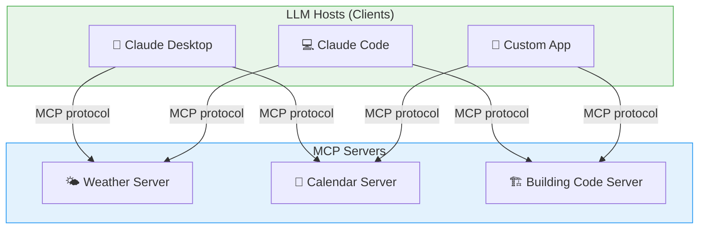
```mermaid
graph TB
    subgraph HOSTS["LLM Hosts (Clients)"]
        H1["🤖 Claude Desktop"]
        H2["💻 Claude Code"]
        H3["📱 Custom App"]
    end

    subgraph SERVERS["MCP Servers"]
        S1["🌤️ Weather Server"]
        S2["📅 Calendar Server"]
        S3["🏗️ Building Code Server"]
    end

    H1 -->|"MCP protocol"| S1
    H1 -->|"MCP protocol"| S2
    H2 -->|"MCP protocol"| S1
    H2 -->|"MCP protocol"| S3
    H3 -->|"MCP protocol"| S2
    H3 -->|"MCP protocol"| S3

    style HOSTS fill:#e8f5e9,stroke:#4caf50
    style SERVERS fill:#e3f2fd,stroke:#2196f3
```

### Tool Use → MCP Evolution

| Week 04: Tool Use | Week 07: MCP |
| --- | --- |
| Tools defined directly in the app code | Tools separated into **independent servers** |
| JSON Schema written manually | **Auto-generated** via the `@mcp.tool()` decorator |
| Tools re-implemented per app | **Build once, reuse anywhere** |
| Usable only inside a single app | **Connected from every host** — Claude Desktop, Claude Code, and so on |
| Only tools (Tools) supported | Three features: Tools + **Resources** + **Prompts** |

### This Week's Project: A Document-Management MCP Server → Extended to a Structural-Engineering MCP


```mermaid
graph TD
    subgraph PROJECT["🔧 Week 07 Project: Document MCP Server (Skilljar track)"]
        T["🔧 Tools<br/><i>read_doc_contents</i><br/><i>edit_document</i>"]
        R["📦 Resources<br/><i>docs://documents</i><br/><i>docs://documents/&#123;doc_id&#125;</i>"]
        P["💬 Prompts<br/><i>format</i><br/><i>(Markdown reformat)</i>"]
    end

    H["🖥️ CLI Chatbot<br/>(embedded MCP client)"] -->|"MCP stdio protocol"| PROJECT
    PROJECT --> RESULT["✅ Document @mention + reformat<br/>'convert report.pdf<br/>to Markdown'"]

    PROJECT -.->|"domain extension"| DOMAIN["🏗️ Structural MCP<br/>KDS codes · Midas results<br/>design-review prompt"]

    style PROJECT fill:#e8f4f8,stroke:#2980b9
    style H fill:#e8c07a,stroke:#c4a882,color:#333
    style RESULT fill:#d4edda,stroke:#27ae60
    style DOMAIN fill:#f3e5f5,stroke:#9c27b0
```

The main project of Skilljar S6 is a **CLI chatbot + document MCP server**. Against six in-memory documents (deposition.md, report.pdf, financials.docx, outlook.pdf, plan.md, spec.txt), it implements a **read tool**, an **edit tool**, a **resource list**, a **resource detail view**, and a **Markdown-reformat prompt**. These lecture notes follow that flow verbatim, but at the end in §2.7 we extend it into the **structural-engineering domain** — looking up KDS codes, parsing Midas results, and issuing design-review prompts.

### Weekly Connection Diagram

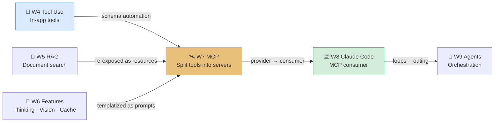
```mermaid
graph LR
    W4["📗 W4 Tool Use<br/>In-app tools"]
    W5["📘 W5 RAG<br/>Document search"]
    W6["📙 W6 Features<br/>Thinking · Vision · Cache"]
    W7["🛰️ W7 MCP<br/>Split tools into servers"]
    W8["⌨️ W8 Claude Code<br/>MCP consumer"]
    W9["🤖 W9 Agents<br/>Orchestration"]

    W4 -->|"schema automation"| W7
    W5 -->|"re-exposed as resources"| W7
    W6 -->|"templatized as prompts"| W7
    W7 -->|"provider → consumer"| W8
    W8 -->|"loops · routing"| W9

    style W7 fill:#e8c07a,stroke:#c4a882,color:#333
    style W4 fill:#dbeafe,stroke:#3b82f6
    style W8 fill:#d4edda,stroke:#27ae60
```

> [!finding] The roles of three weeks
> - **W07 (this week)** — You become an **MCP provider**. Build a server from scratch with FastMCP.
> - **W08 (next week)** — You become an **MCP consumer**. Register the server in Claude Code and use it.
> - **W09** — Extend to the agent pattern that **orchestrates multiple MCP servers**.

### The Anthropic Skilljar Course

These notes are built on Anthropic's official training platform Skilljar — specifically the **"Building with the Claude API" Section 6: Model Context Protocol** (11 lessons, L01–L11).

| Lesson | Title | Mapped to Week 07 |
|---|---|---|
| L01 | Introducing MCP | Ch.1 §1.1 |
| L02 | MCP clients | Ch.1 §1.2 |
| L03 | Project setup | Ch.1 §1.3 |
| L04 | Defining tools with MCP | Ch.1 §1.4 |
| L05 | The server inspector | Ch.1 §1.5 |
| L06 | Implementing a client | Ch.2 §2.1 |
| L07 | Defining resources | Ch.2 §2.2 |
| L08 | Accessing resources | Ch.2 §2.3 |
| L09 | Defining prompts | Ch.2 §2.4 |
| L10 | Prompts in the client | Ch.2 §2.5 |
| L11 | MCP review (video-only) | Ch.2 §2.6 |

> [!ref] Source Mapping
> - Online course: [Building with the Claude API](https://anthropic.skilljar.com/claude-with-the-anthropic-api)
> - GitHub practice: [anthropics/courses — mcp](https://github.com/anthropics/courses/tree/master/mcp)
> - Syllabus mapping: **Building — S6 (Model Context Protocol) → W7** (v2.3)
> - Recommended pre-read: [Introduction to Model Context Protocol](https://anthropic.skilljar.com/introduction-to-model-context-protocol) (1h, 16 lessons, `IMCP` track)

> [!method] Prerequisites
> - **Python 3.11+** environment (uv recommended) — check with `uv --version`
> - **Anthropic API key** stored in `.env` as `ANTHROPIC_API_KEY=sk-ant-...`
> - **MCP SDK** install: `pip install "mcp[cli]"` or `uv add "mcp[cli]"`
> - **cli_project.zip** — the Skilljar L03 attachment (or the starter template in `03-Exercises/Week_07/skilljar/`)
> - **Notebook order**: `S6_01_mcp_server.ipynb` → `S6_02_mcp_inspector.ipynb` → `S6_03_mcp_client.ipynb` → `S6_04_resources.ipynb` → `S6_05_prompts.ipynb` → `S6_06_practice.ipynb` → `S6_07_structural_mcp.ipynb`

---
## [Chapter 1] MCP Server Fundamentals (Lessons 1–5)

### 1.1 Introducing MCP (L01) — USB-C for Dev Environments

**MCP (Model Context Protocol)** is an **open standard protocol** that connects LLM applications with external tools and data sources. The Skilljar L01 transcript defines MCP as follows:

> *"Model Context Protocol (MCP) is a communication layer that provides Claude with context and tools without requiring you to write a bunch of tedious integration code. Think of it as a way to shift the burden of tool definitions and execution away from your server to specialized MCP servers."*

The key idea is **"shifting the burden of tool definitions and execution away from your server to specialized MCP servers"** — that is, a **transfer of responsibility for writing integration code**.


*The basic architecture of MCP — the MCP client (your server) connects to an MCP server that holds tools, prompts, and resources.*


*The full MCP architecture diagram --- host, client, and server in a three-layer separation of responsibilities and data flow.*

#### Before MCP: The GitHub Chatbot Example Shows Integration Hell

L01 explains the concept through a concrete scenario. When a user asks *"What open pull requests are there across all my repositories?"*, Claude needs tools to reach GitHub's API. **Without MCP**, you must **build all of the GitHub integration tools yourself** — writing a schema and a function for every single GitHub capability you want to support.

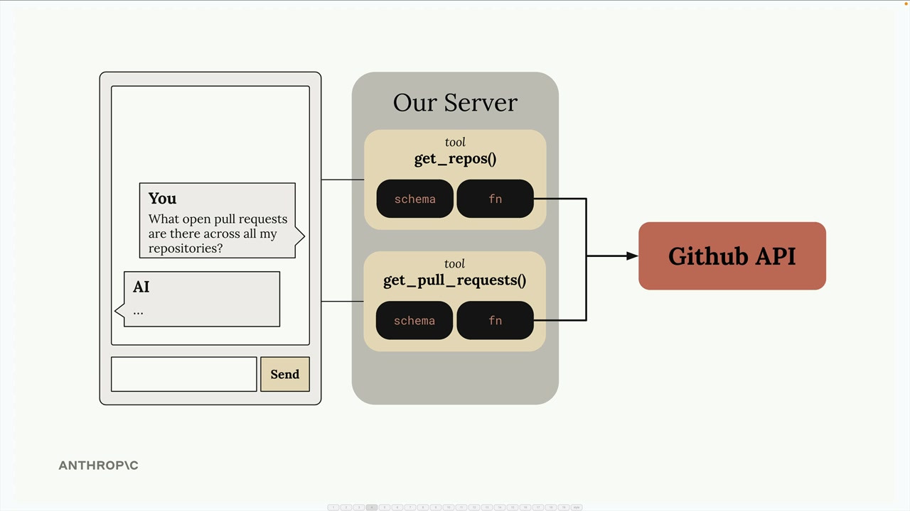
*Without MCP — you have to implement every GitHub integration tool yourself.*

#### The Tool Function Problem

GitHub has a **massive feature set** — repositories, pull requests, issues, projects, and many more. Building a complete GitHub chatbot means authoring an enormous number of tools by hand.


*The Tool Function Problem — each tool needs both a schema definition and a function implementation.*

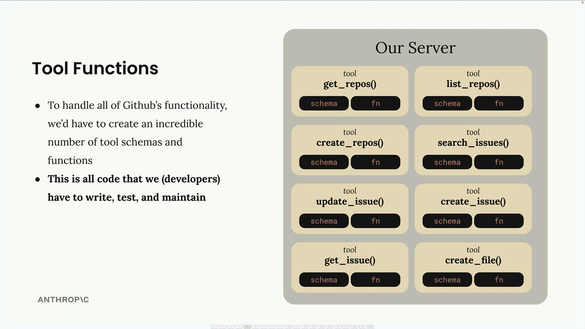
*The essence of the tool-function problem --- as the integration surface grows, schema, function, test, and maintenance costs multiply.*

Each tool requires **both a schema definition and a function implementation**. That means a large body of code that developers must write, test, and maintain themselves.

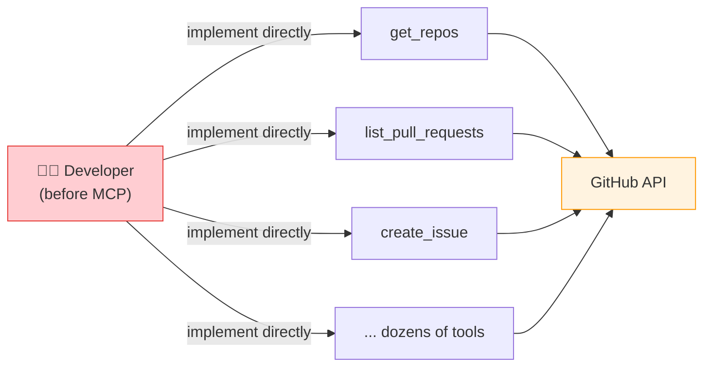
```mermaid
graph LR
    DEV["👨‍💻 Developer<br/>(before MCP)"] -->|"implement directly"| T1["get_repos"]
    DEV -->|"implement directly"| T2["list_pull_requests"]
    DEV -->|"implement directly"| T3["create_issue"]
    DEV -->|"implement directly"| TN["... dozens of tools"]

    T1 --> GH["GitHub API"]
    T2 --> GH
    T3 --> GH
    TN --> GH

    style DEV fill:#ffcdd2,stroke:#e53935
    style GH fill:#fff3e0,stroke:#ff9800
```

#### How MCP Solves This

MCP shifts the burden of tool definition and execution **from your server to the MCP server**. Instead of you writing the GitHub tools, those tools are **authored and executed inside a dedicated MCP server**.

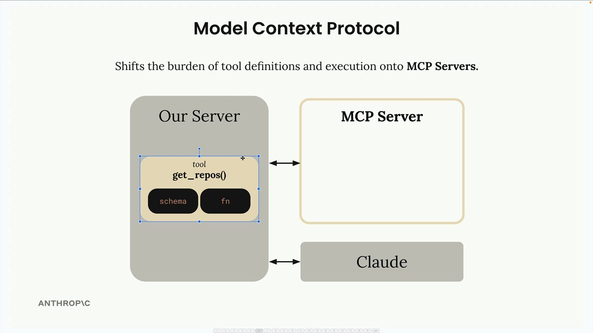
*The MCP server acts as a wrapper around GitHub's capabilities — you consume ready-made tools.*


*An MCP server packages the data and capabilities of an external service into reusable components.*


*MCP's solution at a glance --- shift the burden of tool definition and execution from your server to a dedicated MCP server.*

#### Common Questions About MCP


L01 answers three common questions.

**Q1. Who authors MCP servers?**
Anyone can create an MCP server implementation. In particular, service providers often publish official MCP implementations for their own services — for example, AWS might release an official MCP server for its services.

**Q2. How is MCP different from calling an API directly?**
MCP servers ship with **tool schemas and functions already defined**. If you call an API directly, you must **author those tool definitions yourself**. MCP spares you that implementation work.

**Q3. Isn't MCP just Tool Use?**
This is the most common misconception. **MCP servers and Tool Use are complementary but distinct concepts**. MCP is about *"who is going to build and maintain the tools"* — with MCP, **someone else has already written the tool functions and schemas** and packaged them into an MCP server.

> [!tip] Core Insight
> *"MCP servers provide tool schemas and functions already defined for you, eliminating the need to build and maintain complex integrations yourself."*
> — the summary sentence of Skilljar L01

#### The MCP vs. Tool Use Relationship

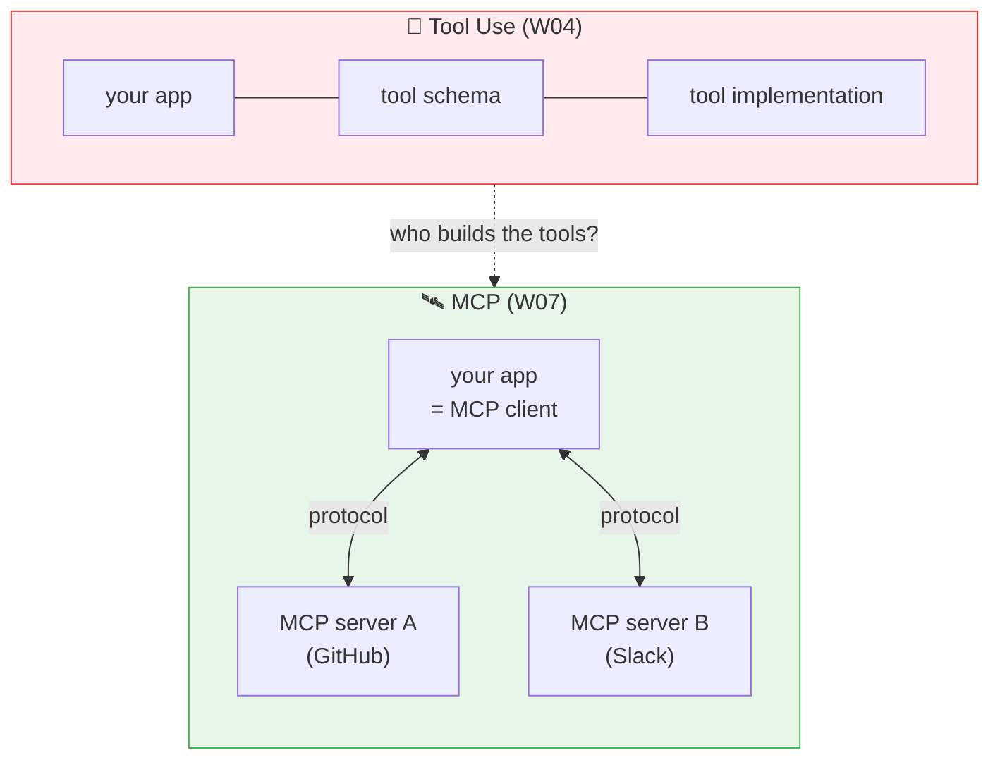
```mermaid
graph TB
    subgraph TOOLUSE["🔧 Tool Use (W04)"]
        TU1["your app"]
        TU2["tool schema"]
        TU3["tool implementation"]
        TU1 --- TU2 --- TU3
    end

    subgraph MCP["🛰️ MCP (W07)"]
        direction TB
        MC["your app<br/>= MCP client"]
        MS1["MCP server A<br/>(GitHub)"]
        MS2["MCP server B<br/>(Slack)"]
        MC <-->|"protocol"| MS1
        MC <-->|"protocol"| MS2
    end

    TOOLUSE -.->|"who builds the tools?"| MCP

    style TOOLUSE fill:#ffebee,stroke:#e53935
    style MCP fill:#e8f5e9,stroke:#4caf50
```

> [!action] Practice Notebook
> 📂 `03-Exercises/Week_07/skilljar/S6_01_mcp_server.ipynb`
> Reproduces the core concepts of L01–L04 in Python — step-by-step cells walk through initializing FastMCP, the in-memory `docs` dictionary, and defining `read_doc_contents` / `edit_document` tools with the `@mcp.tool()` decorator.

> [!method] cli_project hands-on guide
> This section is **theory only** — actual execution starts at §1.3. Preview:
> 1. Open: `code 03-Exercises/Week_07/skilljar/cli_project/mcp_server.py`
> 2. **L5**: `mcp = FastMCP("DocumentMCP", log_level="ERROR")` — server in one line
> 3. **L8-15**: `docs` dict — six engineering-themed documents
> 4. **L17-44**: two `@mcp.tool` decorators — `read_doc_contents`, `edit_document`
> 5. Just skim the code; execution comes in §1.3.

> [!ref] Source: Skilljar L01 — Introducing MCP (287780)

---

### 1.2 MCP Client Architecture (L02) — Transport-Agnostic Communication

The MCP client is the **communication bridge between your server and MCP servers**. The L02 transcript explains:

> *"The MCP client serves as the communication bridge between your server and MCP servers. Think of it as your access point to all the tools that an MCP server provides. When you need to use external tools or services, the client handles all the message passing and protocol details for you."*

#### What Does Transport-Agnostic Mean?

One of MCP's key strengths is that it is **transport-agnostic** — client and server can talk to each other via **various communication methods**. The most common setup is for the MCP client and server to run **on the same machine** and communicate over **standard input/output (stdio)**.

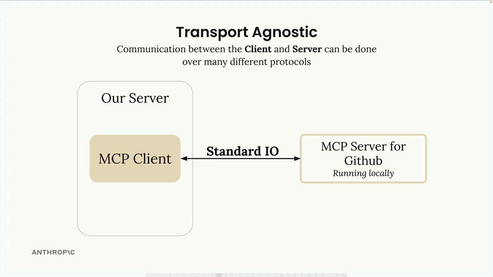
*Local stdio communication — the most common setup.*

But that isn't the whole story. MCP clients and servers can also connect via:

- **HTTP**
- **WebSockets**
- **Various other network protocols**

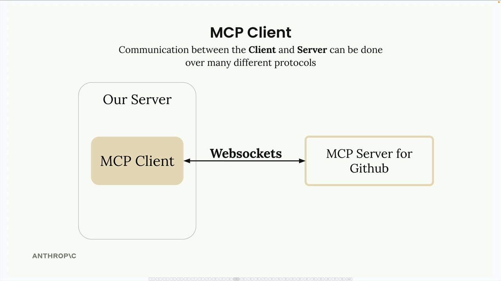
*Transport-agnostic — remote connections over network protocols are also possible.*


*Client-to-server transport comparison --- stdio, HTTP, and WebSocket usage scenarios with their trade-offs summarized.*

#### Message Types — What the Client and Server Exchange

Once connected, the client and server exchange **specific message types defined by the MCP specification**. The two pairs of message types you will work with most often are the following.


**1. `ListToolsRequest` / `ListToolsResult`**
— the client asks the server *"what tools do you provide?"*, and the server returns the list of available tools.

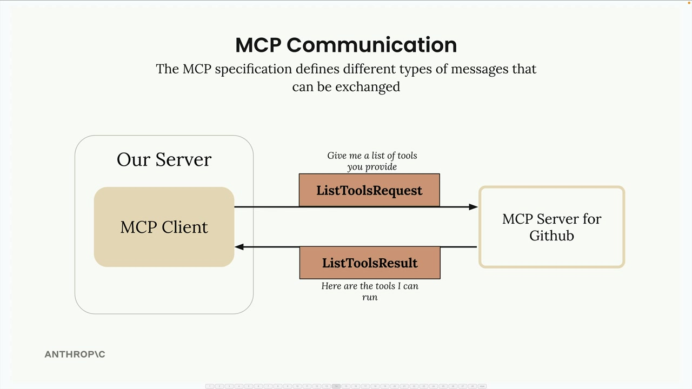
*ListTools — browsing the tool catalog.*

**2. `CallToolRequest` / `CallToolResult`**
— the client asks the server to execute a specific tool with specific arguments and receives the result.


*CallTool — a tool execution request and its result.*

#### A Complete Flow — *"What repositories do I have?"*

L02 visualizes the entire communication flow step-by-step, from the **user's question to the final response**.

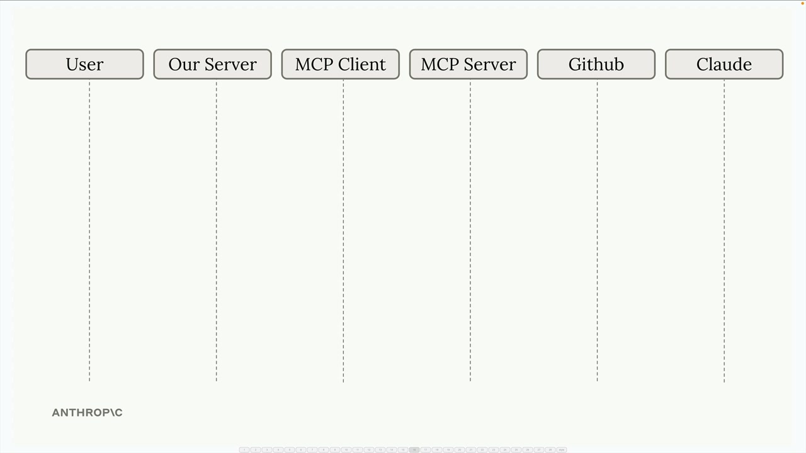
*Step 1 — the user submits the query; the server recognizes it needs the tool list.*

The process begins when the user submits a query. Your server realizes it must **obtain the list of available tools** before calling Claude.

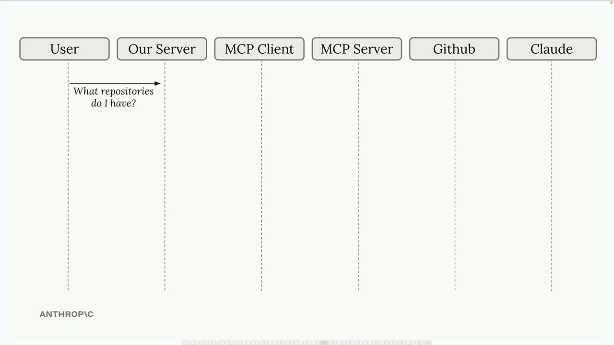
*Step 2 — server → MCP client → MCP server: ListToolsRequest.*

Your server requests tools from the MCP client, which in turn sends a `ListToolsRequest` to the MCP server and receives a `ListToolsResult`.


*Step 3 — both the user's question and the tool list are now in hand.*

Your server can now send **both the user's question and the available tools** to Claude in the first request.

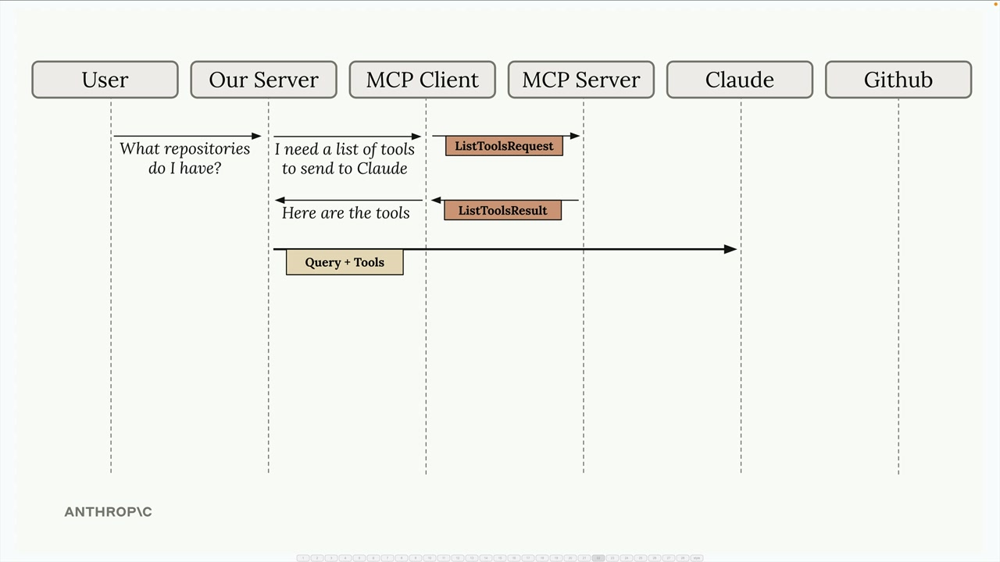
*Step 4 — Claude decides to invoke a tool.*

Claude examines the tools and decides that a tool call is needed to answer the question. It responds with a **tool use request**.

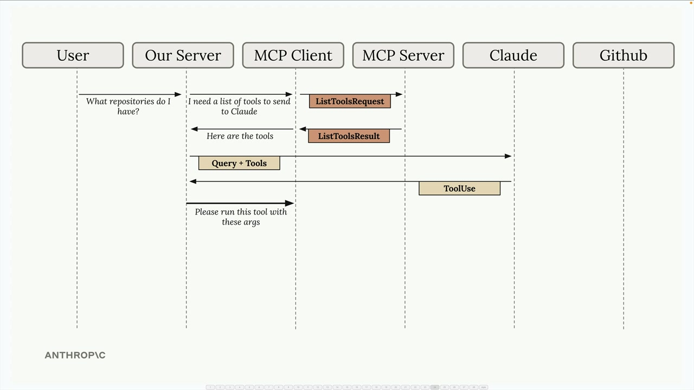
*Step 5 — the server asks the MCP client to perform a CallToolRequest.*

Your server executes Claude's requested tool through the MCP client. The MCP client sends a `CallToolRequest` to the MCP server, which performs the actual GitHub request.

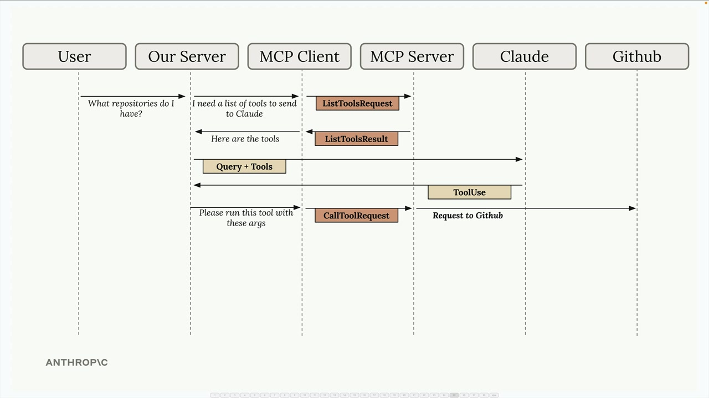
*Step 6 — GitHub's response travels back in reverse order.*

When GitHub returns repository data, that data flows from the MCP server → wrapped in a `CallToolResult` → to the MCP client → to your server.


*Step 7 — the tool result is sent back to Claude as a follow-up message.*

Your server sends the tool result back to Claude as a **follow-up message**. Claude now has all the information it needs to craft a complete answer.


*Step 8 — Claude returns the final answer to the user.*

Finally, Claude produces the formatted response, and your server relays it to the user.


*The complete flow summarized in one image --- the entire 8-step communication path from user query to final response.*

#### A Mermaid Diagram of the Full Flow

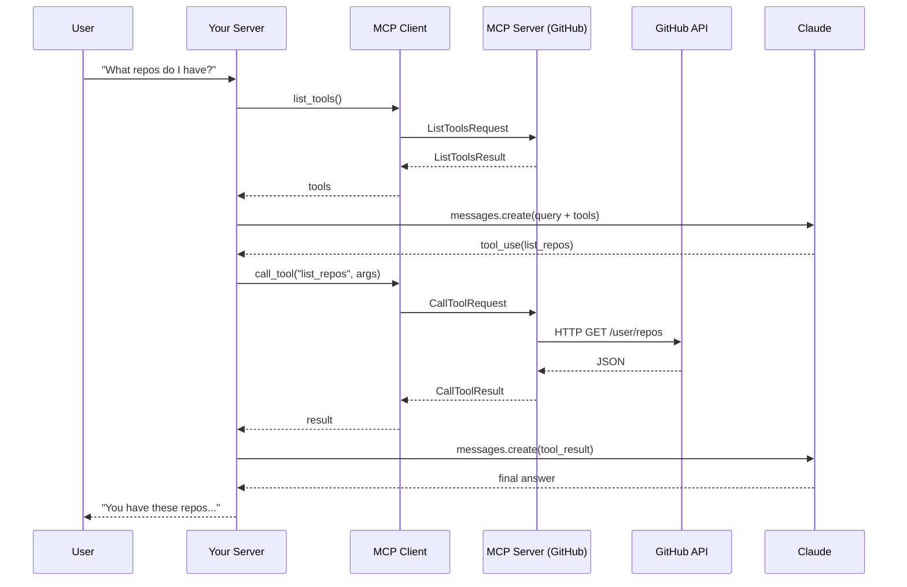
```mermaid
sequenceDiagram
    participant U as User
    participant APP as Your Server
    participant MC as MCP Client
    participant MS as MCP Server (GitHub)
    participant GH as GitHub API
    participant C as Claude

    U->>APP: "What repos do I have?"
    APP->>MC: list_tools()
    MC->>MS: ListToolsRequest
    MS-->>MC: ListToolsResult
    MC-->>APP: tools
    APP->>C: messages.create(query + tools)
    C-->>APP: tool_use(list_repos)
    APP->>MC: call_tool("list_repos", args)
    MC->>MS: CallToolRequest
    MS->>GH: HTTP GET /user/repos
    GH-->>MS: JSON
    MS-->>MC: CallToolResult
    MC-->>APP: result
    APP->>C: messages.create(tool_result)
    C-->>APP: final answer
    APP-->>U: "You have these repos..."
```

> [!finding] It looks like many steps, but
> *"Yes, this flow involves many steps, but each component has a clear responsibility. The MCP client abstracts away the complexity of server communication, letting you focus on building your application logic."*
> Each component has a clearly separated responsibility, leaving you free to concentrate on your **application logic**. In §2.1 we will implement this directly and feel that separation firsthand.

> [!action] Practice Notebook
> 📂 `03-Exercises/Week_07/skilljar/S6_03_mcp_client.ipynb`
> Build the **MCP client implementation** from L02 and L06 — an `MCPClient` class, an async context manager, and the `list_tools` / `call_tool` methods — and reproduce the sequence diagram above in Python code.

> [!method] cli_project hands-on guide
> Map §1.2's sequence diagram to actual code:
> 1. Open `cli_project/mcp_client.py`
> 2. **L11-86**: `class MCPClient` — `__init__` / `connect` / `list_tools` / `call_tool` / `__aenter__`/`__aexit__`
> 3. **L67-75**: `read_resource(uri)` — MIME-type branching (`application/json` → `json.loads`)
> 4. Trace how the mermaid sequence at §1.2 ~L397 maps onto these methods.

> [!ref] Source: Skilljar L02 — MCP clients (287775)

---

### 1.3 Project Setup (L03) — CLI Chatbot + MCP Server

This section sets up the project that will be the **common starting point** for every subsequent implementation. The key sentence from the L03 transcript is:

> *"We're going to build a CLI-based chatbot to better understand how MCP clients and servers work together."*

#### What You Will Build

A CLI-based chatbot in which users interact with a **document collection** through the command line. The system is composed of **two main components**:

- **MCP Client** — handles user interaction
- **Custom MCP Server** — manages document operations


*The project architecture — a CLI chatbot (MCP client) and a document MCP server.*

The server provides **two core tools**: one to read a document's contents and one to update a document. All documents are stored **in memory for simplicity** — no database is needed.

#### An Important Architectural Note

> [!tip] In practice you usually implement only one side
> *"In real-world projects, you typically implement either an MCP client or an MCP server, not both."*
> Typically you build **only one** of:
> - an **MCP server** — when you want to expose your service to other developers, or
> - an **MCP client** — when you want to connect to existing MCP servers.
> Building **both** in this project is **purely for educational purposes** — so you can see firsthand how they communicate and work together.


*The normal real-world pattern — you implement either a server or a client, not both.*

#### Project Setup Steps

1. Download **cli_project.zip** from the link attached to L03 and extract it into a development directory of your choice
2. Open the folder in a code editor

Follow the included README to:

- Add your **Anthropic API key** to a `.env` file
- Install dependencies with **UV (recommended) or pip**
- Run the **starter application** to verify it works

When you navigate to the project directory in the terminal, you'll see the main files:
- `main.py`
- `mcp_client.py`
- `mcp_server.py`

#### Running the Application

L03 suggests one of two commands to run the app.

```bash
# with UV (recommended)
uv run main.py

# with standard Python
python main.py
```

When the app boots successfully, a chat prompt appears. A simple question — *"what's 1+1?"* — will elicit a quick reply from Claude.

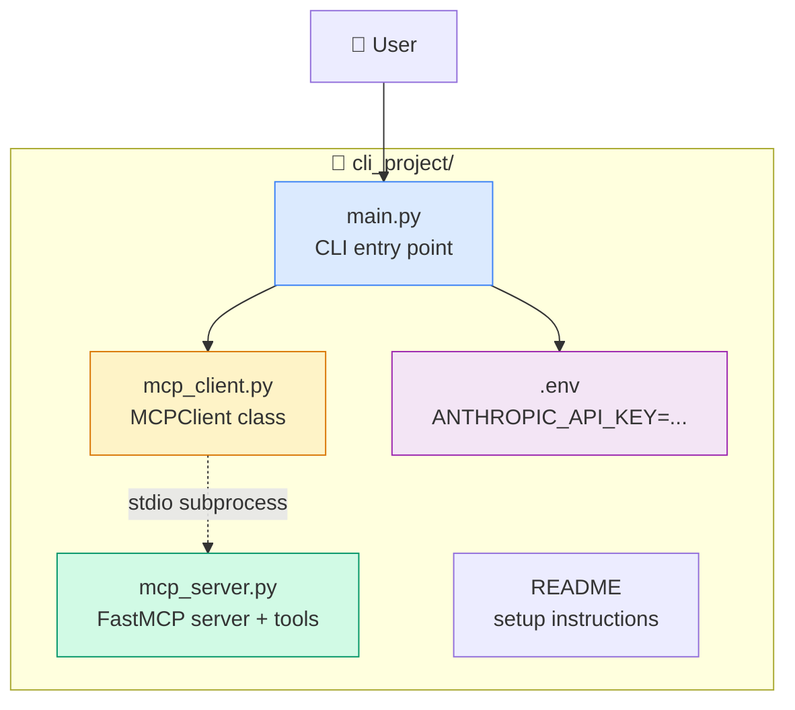
```mermaid
graph TB
    subgraph PROJECT["📁 cli_project/"]
        MAIN["main.py<br/>CLI entry point"]
        CLIENT["mcp_client.py<br/>MCPClient class"]
        SERVER["mcp_server.py<br/>FastMCP server + tools"]
        ENV[".env<br/>ANTHROPIC_API_KEY=..."]
        README["README<br/>setup instructions"]
    end

    USER["👤 User"] --> MAIN
    MAIN --> CLIENT
    CLIENT -.->|"stdio subprocess"| SERVER
    MAIN --> ENV

    style MAIN fill:#dbeafe,stroke:#3b82f6
    style CLIENT fill:#fef3c7,stroke:#d97706
    style SERVER fill:#d1fae5,stroke:#059669
    style ENV fill:#f3e5f5,stroke:#9c27b0
```

> [!method] Setup Checklist
> - [ ] Install Python 3.11+ (`python --version`)
> - [ ] Install UV: `curl -LsSf https://astral.sh/uv/install.sh | sh`
> - [ ] Download and unzip `cli_project.zip`
> - [ ] Add `ANTHROPIC_API_KEY=sk-ant-...` to `.env`
> - [ ] Run `uv sync` or `pip install -r requirements.txt`
> - [ ] Run `uv run main.py` for a test launch
> - [ ] Type `what's 1+1?` at the prompt → confirm the response

> [!action] Practice Notebook
> 📂 `03-Exercises/Week_07/skilljar/S6_01_mcp_server.ipynb`
> Dissect the project scaffolding in the notebook — the `main.py` event loop, the `async with` context of `MCPClient`, and the `FastMCP("DocumentMCP")` initialization are each broken into runnable cells to experience individually.

> [!method] cli_project hands-on guide — environment setup (start of class hands-on)
> 1. New terminal: `cd 03-Exercises/Week_07/skilljar/cli_project`
> 2. (with UV) `uv venv && source .venv/bin/activate && uv pip install -e .`
>    (or pip) `python -m venv .venv && source .venv/bin/activate && pip install -e .`
> 3. Create `.env`: `ANTHROPIC_API_KEY=sk-ant-...` and `CLAUDE_MODEL=claude-haiku-4-5`
> 4. Sanity check: `uv run main.py` (or `python main.py`) — chatbot prompt should appear
> 5. Quick test: type `What's 1+1?` → see Claude's plain answer → `Ctrl+C` or `exit` to quit
> 6. Stuck? Re-read the Korean inline comments at the top of `cli_project/README.md`.

> [!ref] Source: Skilljar L03 — Project setup (287785)

---

### 1.4 Defining MCP Tools (L04) — the `@mcp.tool()` Decorator

Building an MCP server becomes far simpler with the **official Python SDK**. Instead of writing complex JSON schemas manually, the **SDK handles all that complexity with decorators and type hints**.


*The structure of a tool definition — decorator + type hints + Pydantic Field.*


*Defining tools with FastMCP, end to end --- from one-line server initialization to decorators, type hints, and automatic schema generation.*

The L04 example builds an **in-memory document-management MCP server**. It provides two tools: one to read a document's contents and one to update a document with find-and-replace.

#### MCP Server Initialization — One Line of FastMCP

The Python MCP SDK makes server creation astonishingly simple. **A single line initializes a complete MCP server**:

```python
from mcp.server.fastmcp import FastMCP

mcp = FastMCP("DocumentMCP", log_level="ERROR")
```

- `"DocumentMCP"` — the server name (the identifier shown in client logs and debug output)
- `log_level="ERROR"` — emits only errors, to reduce noise

#### Document Store — An In-Memory Dict

In this implementation, documents are stored in a **simple Python dictionary**. Keys are document IDs; values are document contents.

```python
docs = {
    "deposition.md": "This deposition covers the testimony of Angela Smith, P.E.",
    "report.pdf": "The report details the state of a 20m condenser tower.",
    "financials.docx": "These financials outline the project's budget and expenditure",
    "outlook.pdf": "This document presents the projected future performance of the",
    "plan.md": "The plan outlines the steps for the project's implementation.",
    "spec.txt": "These specifications define the technical requirements for the equipment"
}
```

> [!tip] The intent behind six documents
> These six fixed documents are not mere dummies — *Angela Smith, P.E.* (a professional engineer in construction), the *condenser tower*, the *project budget*, the *technical specifications*, and so on are framed in a **construction / engineering** style. The Skilljar example is meant to feel familiar to engineering students. In §2.7 of these notes we extend this pattern to **KDS clauses and Midas results**.

#### Defining Tools with a Decorator

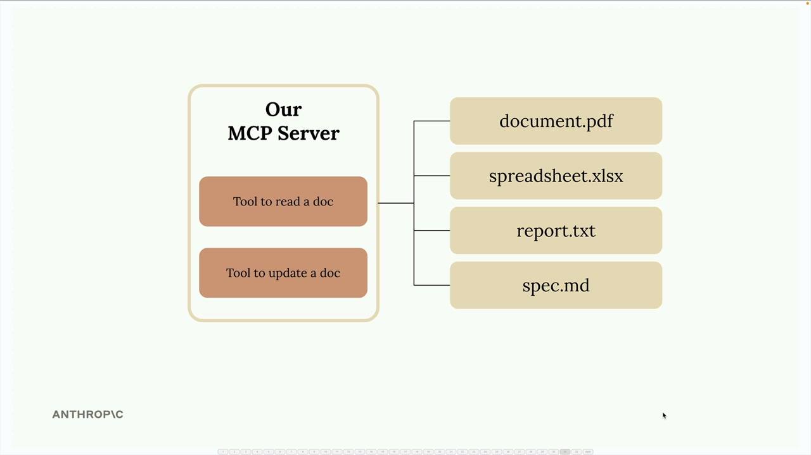
*The decorator approach — verbose JSON schemas become clean Python functions.*

The SDK turns tool creation from a verbose process into clean, readable code. Instead of long JSON schemas, it uses **Python decorators and type hints**.

#### Document Reading Tool — `read_doc_contents`

The first tool lets Claude read any document by its ID. The full implementation is:

```python
@mcp.tool(
    name="read_doc_contents",
    description="Read the contents of a document and return it as a string."
)
def read_document(
    doc_id: str = Field(description="Id of the document to read")
):
    if doc_id not in docs:
        raise ValueError(f"Doc with id {doc_id} not found")

    return docs[doc_id]
```

- The `@mcp.tool` decorator **auto-generates the JSON schema Claude needs**
- Pydantic's `Field` class provides a **parameter description** so Claude understands what each argument expects

#### Document Editing Tool — `edit_document`

The second tool performs **simple find-and-replace** on a document:

```python
@mcp.tool(
    name="edit_document",
    description="Edit a document by replacing a string in the documents content with a new string."
)
def edit_document(
    doc_id: str = Field(description="Id of the document that will be edited"),
    old_str: str = Field(description="The text to replace. Must match exactly, including whitespace."),
    new_str: str = Field(description="The new text to insert in place of the old text.")
):
    if doc_id not in docs:
        raise ValueError(f"Doc with id {doc_id} not found")

    docs[doc_id] = docs[doc_id].replace(old_str, new_str)
```

It takes three parameters — the document ID, the text to find, and the text to replace — and uses Python's built-in `str.replace()`.

#### Error Handling

Both tools include basic error handling for when **Claude requests a document that doesn't exist**. When an invalid document ID is given, the tools raise a `ValueError` with a descriptive message — Claude can read that message and potentially take corrective action (such as retrying with a different ID).

#### Key Benefits of the SDK Approach

> [!finding] What the `@mcp.tool()` decorator gives you
> - **Automatic JSON schema generation** from Python type hints
> - Clean, maintainable, **readable code**
> - **Built-in parameter validation** via Pydantic
> - **Less boilerplate** compared to writing schemas manually
> - **Type safety and IDE support** during development

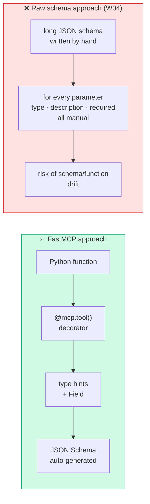
```mermaid
graph LR
    subgraph PY["✅ FastMCP approach"]
        P1["Python function"]
        P2["@mcp.tool()<br/>decorator"]
        P3["type hints<br/>+ Field"]
        P1 --> P2 --> P3
        P3 --> P4["JSON Schema<br/>auto-generated"]
    end

    subgraph RAW["❌ Raw schema approach (W04)"]
        R1["long JSON schema<br/>written by hand"]
        R2["for every parameter<br/>type · description · required<br/>all manual"]
        R3["risk of schema/function<br/>drift"]
        R1 --> R2 --> R3
    end

    style PY fill:#d1fae5,stroke:#059669
    style RAW fill:#fee2e2,stroke:#dc2626
```

> [!tip] A schema from type hints alone
> The single line `doc_id: str = Field(description="...")` replaces a JSON Schema like `{"type": "object", "properties": {"doc_id": {"type": "string", "description": "..."}}, "required": ["doc_id"]}`. If you remember hand-writing schemas in W04, you'll feel how much of a blessing this shortcut is.

> [!action] Practice Notebook
> 📂 `03-Exercises/Week_07/skilljar/S6_01_mcp_server.ipynb`
> Define `read_doc_contents` and `edit_document` with the `@mcp.tool()` decorator, then call `mcp.list_tools()` to inspect the auto-generated schema directly. Also experiment with how the `description` on Pydantic `Field` affects Claude's tool selection.

> [!method] cli_project hands-on guide — Field description experiment
> 1. Open `cli_project/mcp_server.py` → **L17-28** `read_doc_contents` decorator
> 2. **Experiment**: change `description` to something vague (e.g., `"do something"`) — then in §1.5 use the Inspector to observe how Claude's tool-selection behavior changes
> 3. **Revert**: `git diff mcp_server.py` to confirm, then restore the original
> 4. Lesson: `Field(description=...)` is the primary signal Claude uses to pick tools.

> [!ref] Source: Skilljar L04 — Defining tools with MCP (287797)

---

### 1.5 The Server Inspector (L05) — A Browser-Based Debugging UI

When building an MCP server, you need a way to **test functionality without wiring it into a full application**. The Python MCP SDK ships with a built-in **browser-based inspector** that lets you debug and test your server live.

#### Starting the Inspector

First, confirm your Python environment is active (see the project README). Then:

```bash
mcp dev mcp_server.py
```

This command **launches a development server on port 6277** and gives you a local URL to open in your browser. When the inspector interface loads, the MCP Inspector dashboard appears.

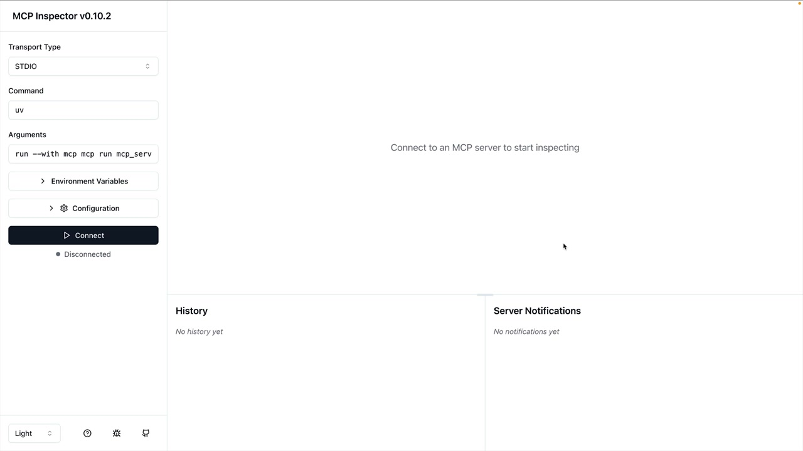
*The initial MCP Inspector dashboard — running on port 6277.*


*MCP Inspector UI components --- the Tools, Resources, and Prompts tabs alongside the left-hand Connect panel and right-hand result pane.*

> [!tip] The interface is evolving
> *"The MCP inspector is actively being developed, so the interface you see might look different from current screenshots. However, the core functionality for testing tools, resources, and prompts should remain similar."*
> Don't panic if the UI looks different from the screenshots — the core functionality for testing tools, resources, and prompts is preserved.

#### Connecting and Testing Tools

Click the **"Connect" button** on the left to start the MCP server. Once connected, you'll see a navigation bar for **Resources, Prompts, Tools**, and other features.

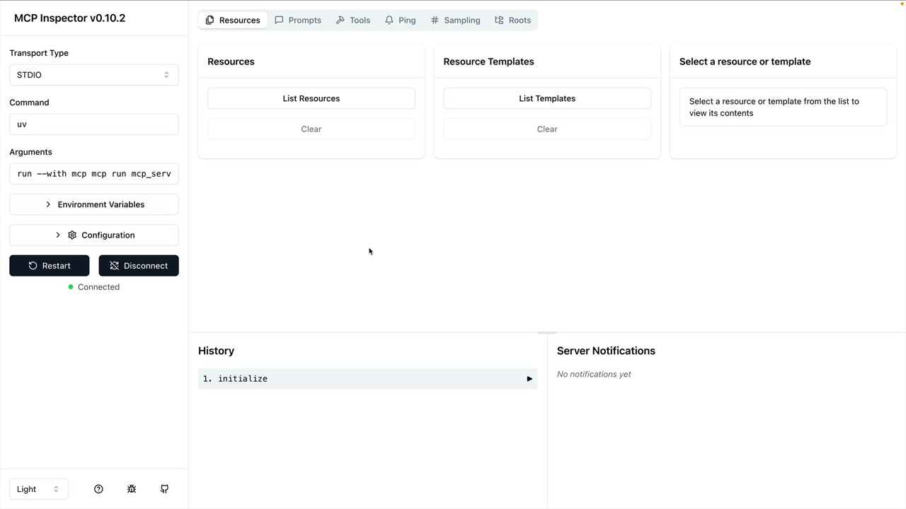
*After clicking Connect — the Resources / Prompts / Tools navigation is activated.*

The tool-testing procedure is:

1. Move to the **Tools** section
2. Click **"List Tools"** to see every available tool
3. Selecting a tool opens its **testing interface**
4. Fill in the required parameters
5. Click **"Run Tool"** to execute and inspect the result

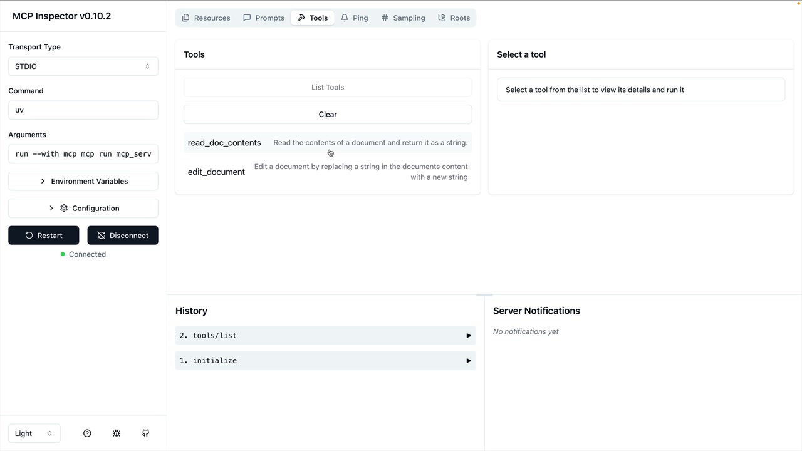
*In the Tools section, pick a tool → enter parameters → Run Tool.*

#### Example — Testing Document Operations

For example, to test the **document-reading tool**, enter a document ID like `deposition.md` and run the tool. The inspector shows the result — such as the returned content or a success message.

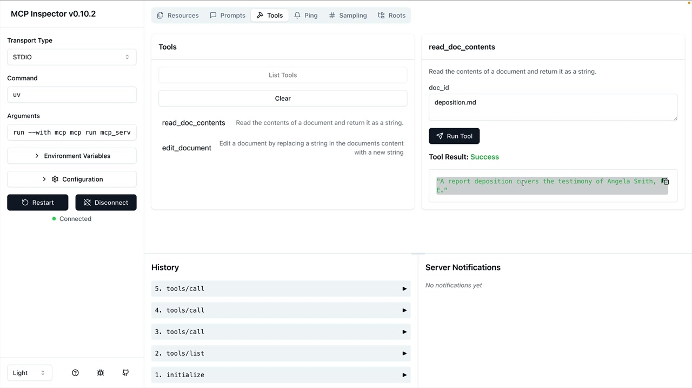
*The result of running read_doc_contents — the returned text is displayed in the inspector.*

#### Chaining Operations for Verification

You can also **verify operations in a chain**. For example, right after editing a document by replacing some text, run the read tool again to **confirm the change was applied correctly**.

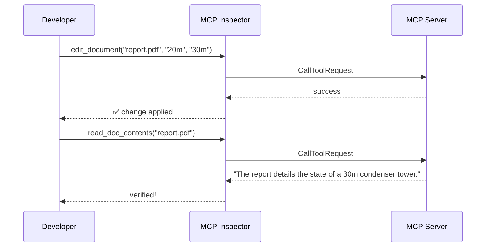
```mermaid
sequenceDiagram
    participant DEV as Developer
    participant INS as MCP Inspector
    participant SRV as MCP Server

    DEV->>INS: edit_document("report.pdf", "20m", "30m")
    INS->>SRV: CallToolRequest
    SRV-->>INS: success
    INS-->>DEV: ✅ change applied
    DEV->>INS: read_doc_contents("report.pdf")
    INS->>SRV: CallToolRequest
    SRV-->>INS: "The report details the state of a 30m condenser tower."
    INS-->>DEV: verified!
```

#### Development Workflow — A Tight Iteration Loop

The inspector creates an **efficient development loop**:

- Modify the MCP server code
- **Test individual tools** via the inspector
- **Validate results** without setting up the full application
- **Debug issues in isolation**

The more complex your MCP server grows, the more indispensable this tool becomes. It removes the constraint of having to **wire up** the server to Claude or another application just to test basic functionality — making development far faster and more focused.

> [!method] Development Loop Checklist
> 1. Launch the inspector with `mcp dev mcp_server.py` (port 6277)
> 2. In the browser, **Connect** → **Tools > List Tools**
> 3. Fill in parameter forms for each tool → **Run Tool**
> 4. Check the **return value and error logs** in the results area
> 5. After editing `mcp_server.py`, confirm the inspector auto-reloads
> 6. Repeat on the Resources / Prompts tabs

> [!finding] Why the inspector is essential
> Connecting to Claude directly incurs **API calls, token consumption, and slow feedback loops**. The inspector validates the **server contract first, without an LLM**, so bugs in tool schemas, error handling, and return types can be caught in **seconds-long loops**. Only then, once attached to Claude, can you focus on higher-level issues like *"does the model pick this tool well?"*.

> [!action] Practice Notebook
> 📂 `03-Exercises/Week_07/skilljar/S6_02_mcp_inspector.ipynb`
> Launch `mcp dev mcp_server.py` from a Jupyter subprocess, render `http://localhost:6277` in an iframe, and reproduce the **List → Run → Result** loop inside the notebook. For environments where the browser is blocked (Colab, etc.), an alternative path exchanging `mcp run`'s JSON-RPC messages directly over stdin/stdout is also provided.

> [!method] cli_project hands-on guide — boot the Inspector
> 1. `cd cli_project && uv run mcp dev mcp_server.py` (without UV: `mcp dev mcp_server.py`)
> 2. Open `http://localhost:6277` in the browser
> 3. Click **Connect** → see Tools / Resources / Prompts tabs
> 4. **Edit-then-read chain validation**:
>    - Tools tab → `edit_document` → `doc_id="plan.md", old_str="outlines", new_str="describes"` → Run
>    - Tools tab → `read_doc_contents` → `doc_id="plan.md"` → Run → confirm change
>    - Revert: call `edit_document` again with `old_str="describes", new_str="outlines"`
> 5. Stop with `Ctrl+C` in the terminal.

> [!ref] Source: Skilljar L05 — The server inspector (287781)

---
## [Chapter 2] Client Implementation and Resources · Prompts (Lessons 6–11)

### 2.1 Implementing a Client (L06) — The `MCPClient` Class and Async Context Manager

Now that the MCP server is running, it's time to build the **client side**. The client is the code that lets our application communicate with the MCP server and access its capabilities.

#### Understanding the Client Architecture

> [!tip] Usually only one side is built
> *"In most real-world projects, you'll either implement an MCP client OR an MCP server - not both. We're building both in this project just so you can see how they work together."*
> In real-world projects you typically implement either the client **or** the server, not both — we build both here purely to **see how they cooperate**.

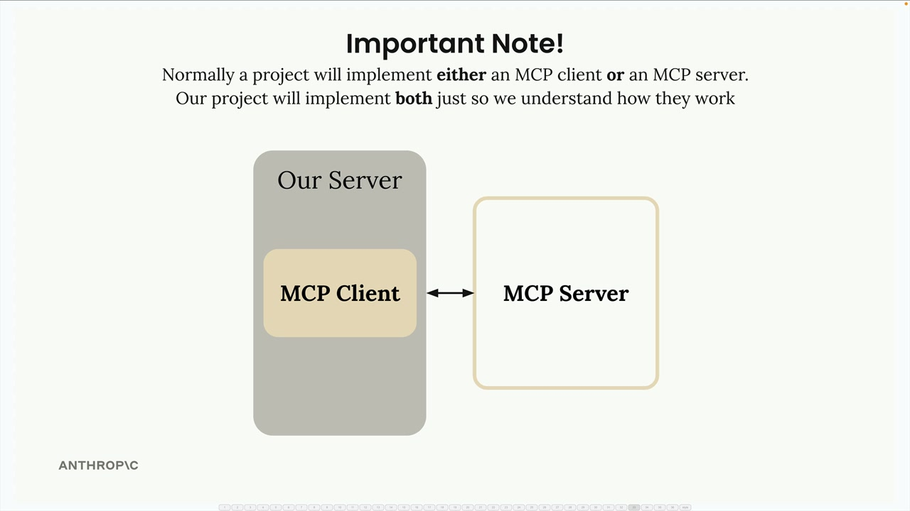
*Two components on the client side — the MCP Client (our class) plus the Client Session (provided by the SDK).*

An MCP client consists of **two main components**:

- **MCP Client** — **the custom class we build** to make sessions easier to use
- **Client Session** — the actual connection to the server (part of the MCP Python SDK)

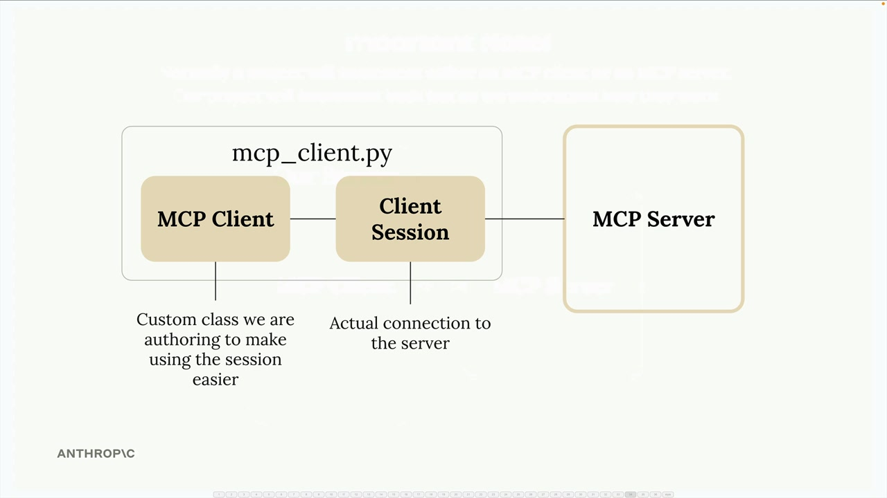
*The Client Session needs resource cleanup — so we wrap it in our custom class.*

The client session requires **proper resource cleanup** when it ends. That's why we wrap it in our own `MCPClient` class, which automates that cleanup.

#### Placement Within the Application

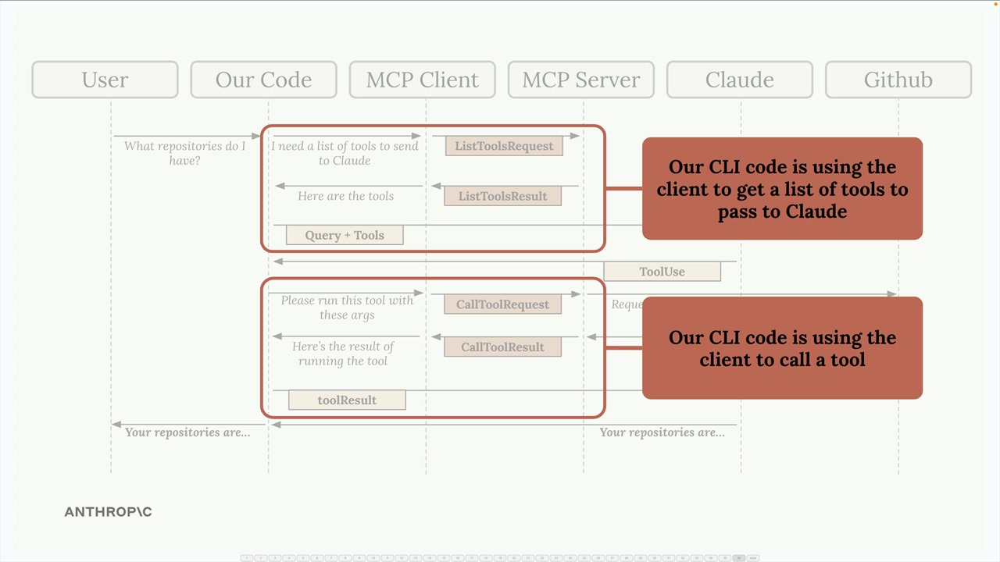
*Application flow — the CLI code does two things with the MCP server.*

Recall the two main things our CLI code must do with the MCP server:

- Fetch the **list of available tools** to send to Claude
- **Execute the tool** that Claude requests

The MCP client exposes these two capabilities through **simple method calls** that our application code can use.

#### Implementing the Core Methods

Our client needs two core methods: `list_tools()` and `call_tool()`.

##### The `list_tools()` Method

This method fetches **all available tools** from the server:

```python
async def list_tools(self) -> list[types.Tool]:
    result = await self.session().list_tools()
    return result.tools
```

Simple — access our session (the connection to the server), call its built-in `list_tools()`, and return the `tools` from the result.

##### The `call_tool()` Method

This method **executes a specific tool** on the server:

```python
async def call_tool(
    self, tool_name: str, tool_input: dict
) -> types.CallToolResult | None:
    return await self.session().call_tool(tool_name, tool_input)
```

It passes the tool name and input parameters Claude supplied to the server and returns the result.

#### Testing the Client

To test the implementation, you can run the client directly. The file includes a **test harness** that connects to our MCP server and calls our methods:

```python
async with MCPClient(
    command="uv", args=["run", "mcp_server.py"]
) as client:
    result = await client.list_tools()
    print(result)
```

Running this test should print **the tool definitions we authored** — `read_doc_contents` and `edit_document`.

> [!tip] What `async with` means
> `MCPClient` is designed as an **async context manager** — `__aenter__` starts the server subprocess and the stdio connection, while `__aexit__` handles **safe shutdown and resource release**. The pair `command="uv", args=["run", "mcp_server.py"]` specifies the **"local stdio transport"**; swap these arguments and you can substitute HTTP, WebSockets, or other transports.

#### Putting It All Together

Now that the client can list and call tools, we can test the **full flow**. Run the main application and ask Claude about a document, and:

- Our code uses the client to **query the available tools**
- These tools are **sent to Claude alongside the user's question**
- Claude decides to use the `read_doc_contents` tool
- Our code invokes that tool via the client
- The result is returned to Claude, and Claude **responds to the user**

For instance, asking *"What is the contents of the report.pdf document?"* makes Claude call the document-reading tool and answer using the document we set up on the server — the one about the **20m condenser tower**.

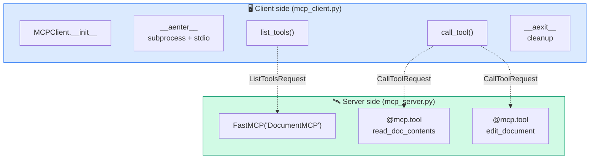
```mermaid
graph TB
    subgraph CLIENT_SIDE["🖥️ Client side (mcp_client.py)"]
        C1["MCPClient.__init__"]
        C2["__aenter__<br/>subprocess + stdio"]
        C3["list_tools()"]
        C4["call_tool()"]
        C5["__aexit__<br/>cleanup"]
    end

    subgraph SERVER_SIDE["🛰️ Server side (mcp_server.py)"]
        S1["FastMCP('DocumentMCP')"]
        S2["@mcp.tool<br/>read_doc_contents"]
        S3["@mcp.tool<br/>edit_document"]
    end

    C3 -.->|"ListToolsRequest"| S1
    C4 -.->|"CallToolRequest"| S2
    C4 -.->|"CallToolRequest"| S3

    style CLIENT_SIDE fill:#dbeafe,stroke:#3b82f6
    style SERVER_SIDE fill:#d1fae5,stroke:#059669
```

> [!finding] The client as a bridge
> *"The client acts as the bridge between our application logic and the MCP server, making it easy to access server functionality without worrying about the underlying connection details."*
> The client hides all connection details, so we write only **domain-logic-level calls** like `await client.list_tools()` / `await client.call_tool(...)`.

> [!action] Practice Notebook
> 📂 `03-Exercises/Week_07/skilljar/S6_03_mcp_client.ipynb`
> Build the `MCPClient` class inside a Jupyter kernel, and call `list_tools()` → `call_tool()` directly inside an `async with` block. Plug it into a real Claude message loop to experience the full cycle of *"Claude picks a tool → our client executes it → result goes back to Claude"*.

> [!method] cli_project hands-on guide — first CLI run
> 1. `cd cli_project && uv run main.py`
> 2. At the chatbot prompt, type `What's 1+1?` → plain reply (no tool call)
> 3. Try other generic prompts: `Tell me a joke about engineering`
> 4. Why no tool call? Generic questions don't need the docs context, so Claude opts not to call tools.
> 5. We trigger tool calls in §2.3 with `@plan.md`-style mentions.

> [!ref] Source: Skilljar L06 — Implementing a client (287793)

---

### 2.2 Defining Resources (L07) — Exposing Data with `@mcp.resource()`

**Resources** on an MCP server are a way to **expose data to the client**. They're analogous to the **GET request handlers** of a typical HTTP server — a good fit for scenarios where you want to **fetch information** rather than perform an action.

#### Understanding Resources by Example — The Document Mention Feature

Suppose we want a **document mention feature** in which *"users type `@document_name` to reference a file"*. Two operations are needed:

- **List all available documents** (for autocomplete)
- **Fetch a specific document's contents** (when mentioned)

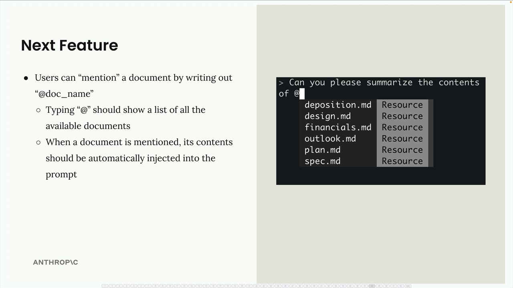
*The core concept of Resources --- a read-only channel that exposes data like HTTP GET, with responsibilities clearly separated from Tools.*


*@mention feature — typing @ shows a document dropdown; selecting one injects the contents.*

When the user types `@`, we must **show the available documents**. When a message containing a mention is submitted, we must **automatically inject the contents of the referenced document** into the prompt sent to Claude.

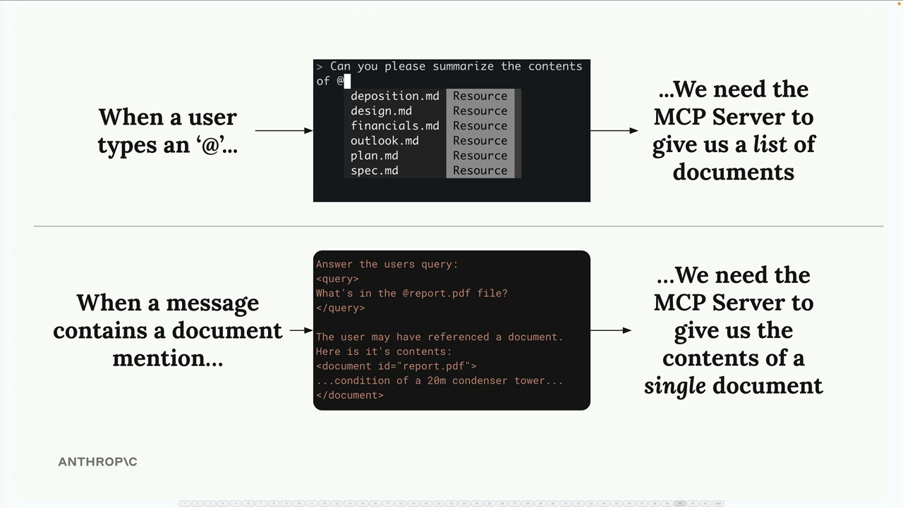
*The data flow of a mention — client requests the resource → server responds → injected into the prompt.*

#### How Resources Work — A Request/Response Pattern

Resources follow a **request/response pattern**. The client sends a `ReadResourceRequest` with a URI, and the MCP server responds with data. **The URI acts as the address** of the resource you want to access.

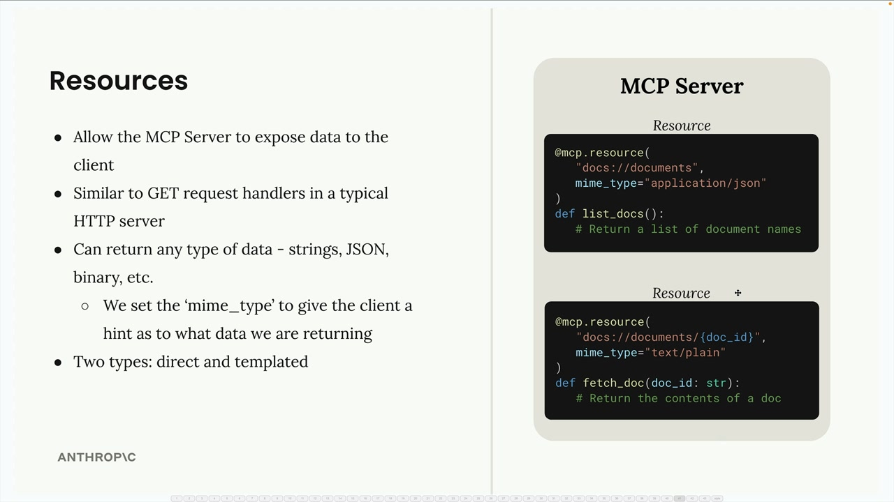
*ReadResourceRequest/Response — identify the resource by URI.*

#### Two Kinds of Resources

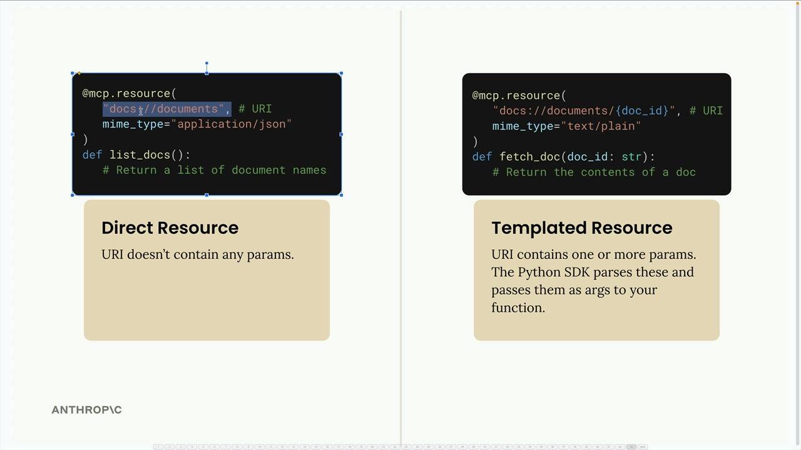
*Direct vs. Templated resources.*

- **Direct Resources** — **static URIs** that do not change (e.g., `docs://documents`)
- **Templated Resources** — **URIs with parameters** (e.g., `docs://documents/{doc_id}`)

For Templated Resources, the Python SDK **automatically parses parameters from the URI** and passes them to your function as keyword arguments.

#### Implementing Resources — The `@mcp.resource()` Decorator

Resources are defined with the `@mcp.resource()` decorator. Let's implement both kinds.

##### Direct Resource — Document List

```python
@mcp.resource(
    "docs://documents",
    mime_type="application/json"
)
def list_docs() -> list[str]:
    return list(docs.keys())
```

- The URI `docs://documents` is fixed — no parameters
- The return type is `list[str]` — the SDK auto-serializes it to JSON
- `mime_type="application/json"` — hints to the client that this is JSON

##### Templated Resource — Fetch a Specific Document

```python
@mcp.resource(
    "docs://documents/{doc_id}",
    mime_type="text/plain"
)
def fetch_doc(doc_id: str) -> str:
    if doc_id not in docs:
        raise ValueError(f"Doc with id {doc_id} not found")
    return docs[doc_id]
```

- In the URI `docs://documents/{doc_id}`, `{doc_id}` **matches the function parameter's name**
- The SDK parses the URI → passes `doc_id=...` automatically as a keyword argument
- MIME type `text/plain` — plain text

#### MIME Types — Format Hints to the Client

Resources can return **any kind of data** — strings, JSON, binaries, etc. The `mime_type` parameter **hints** to the client what kind of data is being returned:

- `application/json` — structured JSON data
- `text/plain` — plain text
- Any other valid MIME type for various data formats

The MCP Python SDK **auto-serializes the return value**, so you don't need to convert to a JSON string by hand.

#### Testing Resources with Inspector

You can test resources in the MCP Inspector. Launch the server with:

```bash
uv run mcp dev mcp_server.py
```

Then connect to the inspector in your browser.

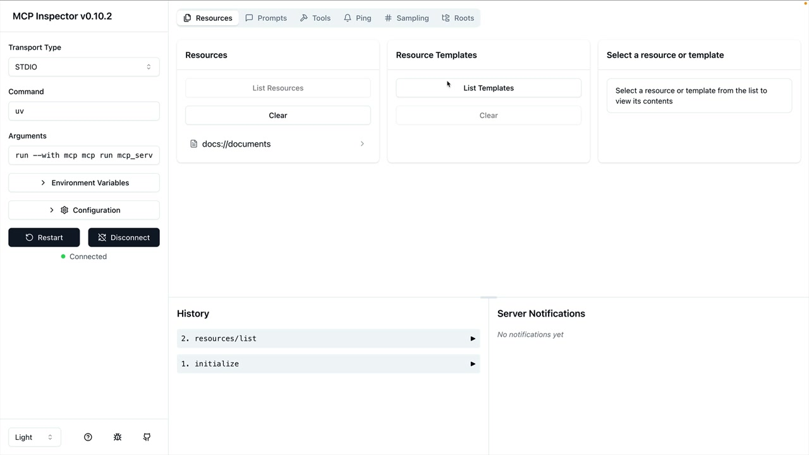
*The Resources and Resource Templates sections in the Inspector.*

You'll see two tabs:

- **Resources** — the direct/static resources
- **Resource Templates** — the templated resources that accept parameters

Click a resource to test it, and confirm the exact response structure your client will receive.

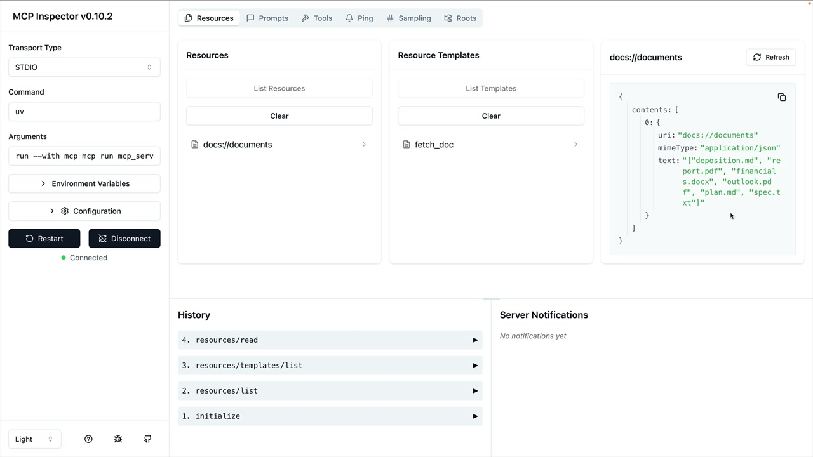
*The result of calling a specific resource — the return value and MIME type are shown together.*

#### Tools vs. Resources — When to Use Which

> [!finding] The core distinction
> - **Resources expose data** — read-only, no side effects (feels like HTTP GET)
> - **Tools perform actions** — they change state or issue commands externally (feels like HTTP POST/PUT)
> Design rule: **"use a Resource if it's read-only, a Tool if it changes something"**.


```mermaid
graph TB
    subgraph TOOLS["🔧 Tools"]
        T1["read_doc_contents<br/>(actually read-only, but<br/>meant for Claude to invoke)"]
        T2["edit_document<br/>✅ state-changing"]
    end

    subgraph RESOURCES["📦 Resources"]
        R1["docs://documents<br/>(list)"]
        R2["docs://documents/&#123;id&#125;<br/>(detail)"]
    end

    subgraph USAGE["When is it used?"]
        U1["by Claude's tool_use<br/>decision"]
        U2["by the client/user's<br/>explicit choice (@mention, /command)"]
    end

    T1 -.-> U1
    T2 -.-> U1
    R1 -.-> U2
    R2 -.-> U2

    style TOOLS fill:#fef3c7,stroke:#d97706
    style RESOURCES fill:#dbeafe,stroke:#3b82f6
    style USAGE fill:#f3e5f5,stroke:#9c27b0
```

> [!tip] Key points
> - Resources **expose data**, tools **perform actions**
> - **Static data → direct**, **parameterized queries → templated**
> - **MIME types** help the client understand the response format
> - The SDK **handles serialization automatically**
> - Parameter names in a templated URI **map to function arguments**

> [!action] Practice Notebook
> 📂 `03-Exercises/Week_07/skilljar/S6_04_resources.ipynb`
> Add `list_docs()` (direct) and `fetch_doc(doc_id)` (templated), launch `mcp dev`, and inspect the return payload on the Inspector's **Resources / Resource Templates** tabs. Compare how the response format changes between MIME types `application/json` and `text/plain`.

> [!method] cli_project hands-on guide — inspect Resources
> 1. Open `cli_project/mcp_server.py` → **L48-64**: two `@mcp.resource` decorators
>    - `docs://documents` (direct, JSON, all doc IDs)
>    - `docs://documents/{doc_id}` (templated, text, single doc)
> 2. In the Inspector (`mcp dev mcp_server.py`), Resources tab — invoke both URIs and compare JSON vs text responses
> 3. URI scheme intent: `docs://` is the domain namespace, `{doc_id}` the dynamic argument.

> [!ref] Source: Skilljar L07 — Defining resources (287782)

---

### 2.3 Accessing Resources (L08) — `read_resource` in the Client

Now that resources are defined on the server, we need a way for the **client to request and use them**. The client serves as the **bridge between the application and the MCP server**, handling the communication and data parsing for us.

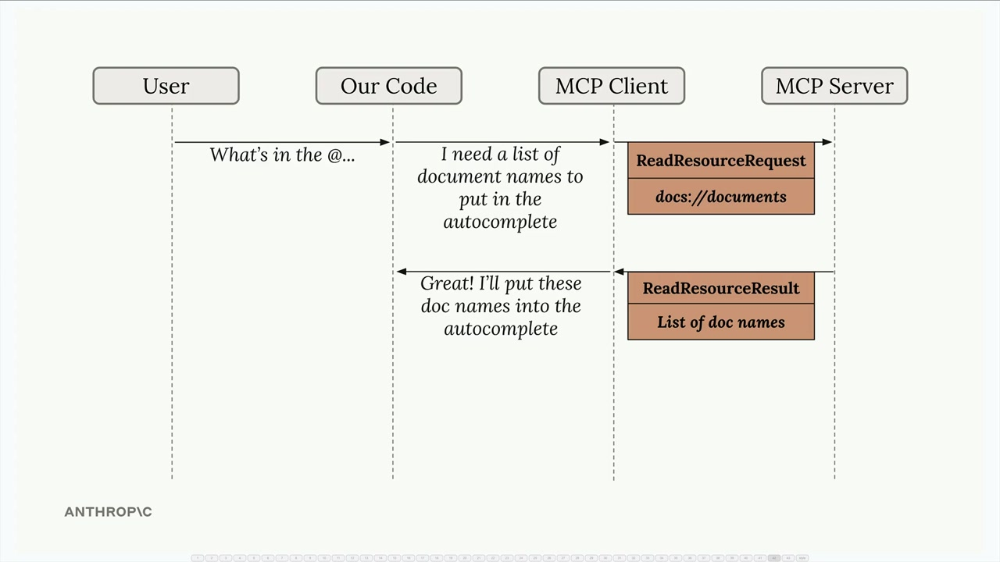
*The client is the bridge between the application and the MCP server.*

The flow is simple: when a user references a document (e.g., types `@report.pdf`), the application uses the **MCP client to fetch that resource from the server and inject it directly into Claude's prompt**.

#### Implementing Resource Reading — `read_resource`

The core function is the MCP client's `read_resource`. The URI parameter identifies **which resource to fetch**:

```python
async def read_resource(self, uri: str) -> Any:
    result = await self.session().read_resource(AnyUrl(uri))
    resource = result.contents[0]
```

The server's response includes a `contents` list. Usually you only need the **first element** — it carries the **actual resource data along with metadata such as the MIME type**.

#### Handling Different Content Types

Because resources can return **different content types**, the client must **parse them appropriately**. The MIME type tells you how to handle the data:

```python
if isinstance(resource, types.TextResourceContents):
    if resource.mimeType == "application/json":
        return json.loads(resource.text)

    return resource.text
```

This approach:
- **Parses JSON resources** correctly into Python objects
- **Returns plain-text resources** as strings directly

The MIME type serves as the **hint that determines the correct parsing strategy**.

#### Required Imports

To make this work, the MCP client needs the following imports:

```python
import json
from pydantic import AnyUrl
```

- The `json` module parses JSON responses
- `AnyUrl` ensures the URI parameter has the proper type handling

#### Testing Resource Access

Once implemented, you can test the feature in the CLI application. For an input like *"What's in the @report.pdf document?"*, the system should:

- **Show available resources in an autocomplete list**
- Let the user select one
- **Automatically fetch the resource's contents**
- Include those contents **in the prompt sent to Claude**

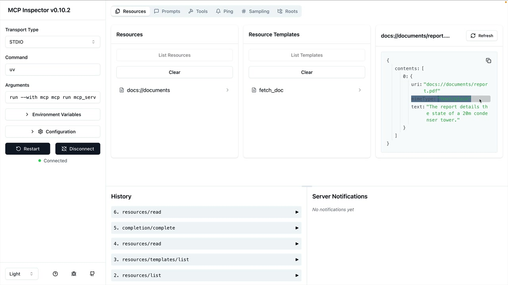
*CLI autocomplete when `@` is typed — available resources (the document list) drop down.*

> [!finding] Why resources are more efficient than tool calls
> *"Claude receives the document content directly in the prompt, eliminating the need for tool calls to access the information. This makes interactions faster and more efficient."*
> - Tool-call style — Claude has to decide *"I'll call read_doc_contents"* before the content is injected. One round trip.
> - Resource style — the user has already **declared intent** with `@`, so the content is **already in the first message** sent to Claude. Zero round trips.
> When the user's intent is clear (a direct file reference), resources are much faster.

#### Integration with the Application

The MCP client code is used by **other parts of the application**. The `read_resource` function becomes a **building block** that other components call to fetch document contents, list available resources, or incorporate resource data into prompts.

This **separation of concerns** keeps the code clean: the MCP client handles communication with the server, while the application logic focuses on **how to use that data effectively**.

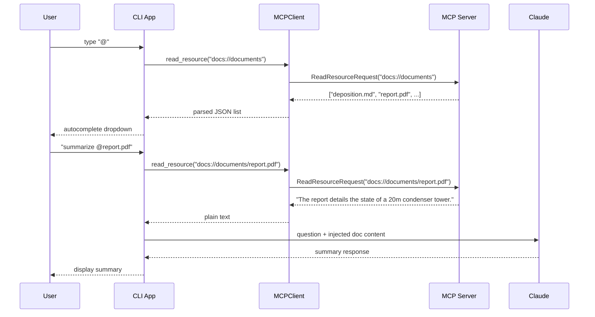
```mermaid
sequenceDiagram
    participant U as User
    participant CLI as CLI App
    participant MC as MCPClient
    participant MS as MCP Server
    participant C as Claude

    U->>CLI: type "@"
    CLI->>MC: read_resource("docs://documents")
    MC->>MS: ReadResourceRequest("docs://documents")
    MS-->>MC: ["deposition.md", "report.pdf", ...]
    MC-->>CLI: parsed JSON list
    CLI-->>U: autocomplete dropdown

    U->>CLI: "summarize @report.pdf"
    CLI->>MC: read_resource("docs://documents/report.pdf")
    MC->>MS: ReadResourceRequest("docs://documents/report.pdf")
    MS-->>MC: "The report details the state of a 20m condenser tower."
    MC-->>CLI: plain text
    CLI->>C: question + injected doc content
    C-->>CLI: summary response
    CLI-->>U: display summary
```

> [!method] @Mention Workflow Checklist
> 1. Detect the `@` token in the user input buffer
> 2. Filter the `docs://documents` list by the prefix up to the cursor position
> 3. Render the dropdown → hook into the selection event
> 4. Call `read_resource` on `docs://documents/{doc_id}` with the selected `doc_id`
> 5. Wrap the fetched text in `<document id="...">...</document>` tags and insert it near the top of the system prompt
> 6. Send the user's message to Claude as is

> [!action] Practice Notebook
> 📂 `03-Exercises/Week_07/skilljar/S6_04_resources.ipynb`
> Implement `MCPClient.read_resource` and test the branching logic between `json.loads` and plain text. At the end, reproduce an `@` autocomplete event with a Jupyter `input()` simulation and, just before the actual Claude call, print the **final shape of the injected prompt** for inspection.

> [!method] cli_project hands-on guide — `@` mention in action
> 1. `cd cli_project && uv run main.py`
> 2. Type `Tell me about @` → autocomplete dropdown shows all 6 doc_ids
> 3. Tab to pick `plan.md` → `Tell me about @plan.md` → Enter
> 4. Confirm Claude's reply uses the `<document id="plan.md">...</document>` context block
> 5. Trace the code: `cli_project/core/cli_chat.py` **L35-49** `_extract_resources()` — split-based `@` parsing + XML injection
> 6. Challenge: try multi-mentions — `Compare @plan.md and @spec.txt`

> [!ref] Source: Skilljar L08 — Accessing resources (287783)

---

### 2.4 Defining Prompts (L09) — Templating with `@mcp.prompt()`

**Prompts** on an MCP server let you define **pre-built, high-quality instructions** — ones the client uses rather than writing prompts itself. Think of them as **carefully crafted and tested templates** — ones that yield better results than whatever the user might dash off on the spot.

#### Why Prompts?

Say you want Claude to reformat a document into Markdown. The user could simply type *"convert report.pdf to markdown"* and get something that works. But using a **thoroughly tested prompt** with explicit instructions about **formatting, structure, and output requirements** produces much better results.

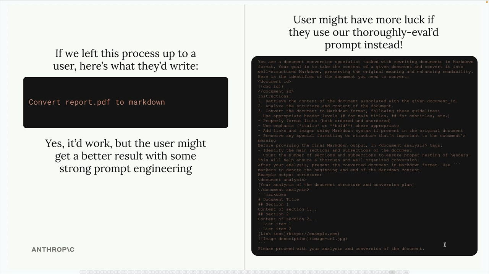
*The core concept of Prompts --- server-provided, validated templates guarantee more consistent quality than ad-hoc user prompts.*


*Why prompts — an ad-hoc user prompt vs. a server-provided, validated template.*

> [!finding] Core insight
> *"while users can accomplish these tasks on their own, they'll get more consistent and higher-quality results when using prompts that have been carefully developed and tested by the MCP server authors."*
> Assuming the MCP server author is an **expert in their domain**, the **server-vetted prompt** produces more consistent, higher-quality results than a user-authored one.

#### How Prompts Work

A prompt defines **a set of user/assistant messages that the client can use directly**. When the client requests a prompt, the server returns a **list of messages ready to send to Claude**.

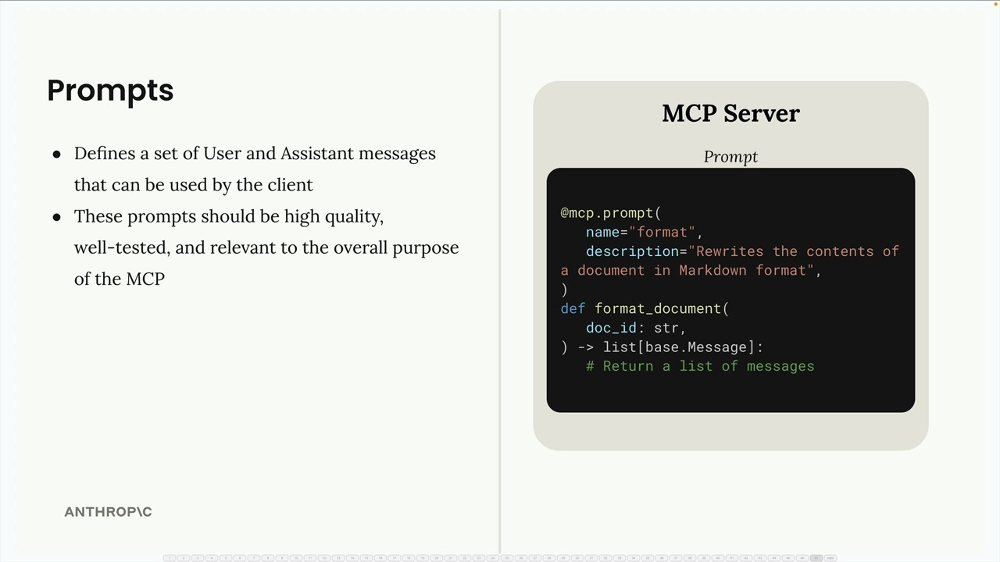
*A prompt returns a list of user/assistant messages.*

The basic structure is:

- **Define the prompt** with the `@mcp.prompt()` decorator
- **Add a name and description** to each prompt
- **Return a list of messages** that make up the complete prompt
- These prompts should be **high-quality, well-tested, and aligned with the MCP server's purpose**

#### Building the Format Command — Restructuring a Document into Markdown

Let's implement a document-formatting prompt. First we need to import the base message types:

```python
from mcp.server.fastmcp import base
```

Then define the prompt function:

```python
@mcp.prompt(
    name="format",
    description="Rewrites the contents of the document in Markdown format."
)
def format_document(
    doc_id: str = Field(description="Id of the document to format")
) -> list[base.Message]:
    prompt = f"""
Your goal is to reformat a document to be written with markdown syntax.

The id of the document you need to reformat is:

{doc_id}

Add in headers, bullet points, tables, etc as necessary. Feel free to add in extra formatting.
Use the 'edit_document' tool to edit the document. After the document has been reformatted...
"""

    return [
        base.UserMessage(prompt)
    ]
```

- `name="format"` — the name the client will use to call it as a slash command
- The parameter `doc_id: str = Field(...)` — **interpolated** into the prompt via an f-string
- The return is `list[base.Message]` — here, a single `base.UserMessage`
- The prompt body **tells Claude to use the `edit_document` tool** → making the **three-way tie between tools, resources, and prompts** explicit

#### Testing Prompts — Inspector

You can also test prompts in the MCP Inspector. Navigate to the **Prompts section**, select a prompt, and provide the required parameters. The Inspector shows the **generated messages** that will be sent to Claude.

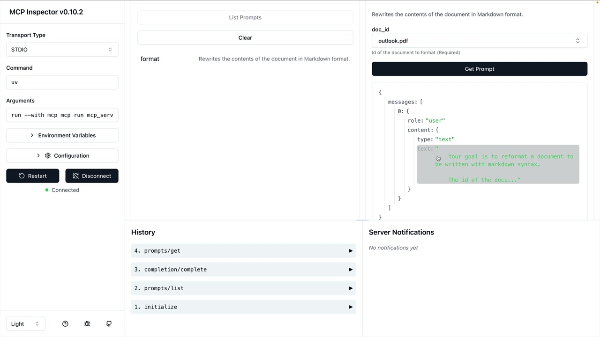
*The Prompts section of the Inspector — when you enter parameters, the interpolated final message is previewed.*

This lets you verify that **variable interpolation is correct** and **the message structure is as expected** before putting the prompt to real use.

#### Best Practices

> [!method] Principles for writing MCP prompts
> - Focus on **tasks central to the server's purpose** (e.g., a document server → format/summarize/TOC)
> - Write **detailed, specific instructions rather than vague requests**
> - **Test thoroughly** with various inputs
> - Use **clear descriptions** so users understand each prompt's purpose
> - Consider **how it works with the server's tools and resources** (mention tool names explicitly in the prompt body)

> [!tip] Prompts externalize the "server author's domain knowledge"
> Prompts should provide **value users can't easily obtain themselves** — i.e., they should express **your expertise** in the domain the MCP server covers. In §2.7, the prompt *"Structural review per KDS 41 17 00"* is exactly this principle in action.

#### Integration of the Three Components


```mermaid
graph TB
    subgraph MCP_SERVER["🛰️ The three components of an MCP server"]
        T["🔧 Tools<br/>@mcp.tool()<br/><i>perform actions</i>"]
        R["📦 Resources<br/>@mcp.resource()<br/><i>expose data</i>"]
        P["💬 Prompts<br/>@mcp.prompt()<br/><i>templates + domain knowledge</i>"]
    end

    P -.->|"'use edit_document'"| T
    P -.->|"'refer to<br/>docs://documents/&#123;id&#125;'"| R

    CLIENT["client<br/>(Claude Code / custom app)"] --> T
    CLIENT --> R
    CLIENT --> P

    style T fill:#fef3c7,stroke:#d97706
    style R fill:#dbeafe,stroke:#3b82f6
    style P fill:#f3e5f5,stroke:#9c27b0
```

> [!action] Practice Notebook
> 📂 `03-Exercises/Week_07/skilljar/S6_05_prompts.ipynb`
> Implement the `format_document` prompt, then also build a **few-shot-style prompt** that mixes `base.AssistantMessage` with `base.UserMessage`. Extend the same server with two more prompts — `summarize`, `translate` — to practice composing a **prompt catalog**.

> [!method] cli_project hands-on guide — inspect the Prompt
> 1. Open `cli_project/mcp_server.py` → **L68-91**: `@mcp.prompt(name="format")`
> 2. Note how the prompt explicitly instructs Claude to call `edit_document` — domain-expert directive baked in
> 3. In the Inspector, Prompts tab → invoke `format` with `doc_id="plan.md"` → inspect the generated messages
> 4. Lesson: prompts let users skip retyping domain instructions every turn.

> [!ref] Source: Skilljar L09 — Defining prompts (287784)

---

### 2.5 Using Prompts in the Client (L10) — `list_prompts` & `get_prompt`

MCP prompts define **a set of user/assistant messages for the client to use**. They should be high-quality, well-tested, and aligned with the server's purpose.


*The overall structure of client-side prompt integration.*

#### Implementing `list_prompts`

The first step is to implement a `list_prompts` method on the MCP client. This method fetches **all available prompts** from the server:

```python
async def list_prompts(self) -> list[types.Prompt]:
    result = await self.session().list_prompts()
    return result.prompts
```

A simple implementation — call the session's `list_prompts`, and return the `prompts` array from the result.

#### Fetching an Individual Prompt — `get_prompt`

The `get_prompt` method fetches a specific prompt **with its arguments interpolated**. When requesting a prompt, you provide **arguments**, which are **passed as keyword arguments to the prompt function**:

```python
async def get_prompt(self, prompt_name, args: dict[str, str]):
    result = await self.session().get_prompt(prompt_name, args)
    return result.messages
```

The method returns the `messages` from the result — these form **a conversation that can be fed directly to Claude**.

#### How Prompt Arguments Work

On the server side, your prompt function may accept **parameters**. For example, the document-formatting prompt expects a `doc_id` parameter:

```python
def format_document(doc_id: str):
    # The doc_id gets interpolated into the prompt
```

When the client calls `get_prompt`, the **argument dictionary** must contain the expected keys. The MCP server **passes these as keyword arguments to the prompt function**, so the dynamic content is inserted into the template.

#### Testing Prompts in the CLI

After implementation, you can test prompts from the **command-line interface**. Typing **slash (`/`)** makes **available prompts appear as commands**. Selecting a prompt prompts you to choose from available options (e.g., a document ID), after which the **complete prompt is sent to Claude**.

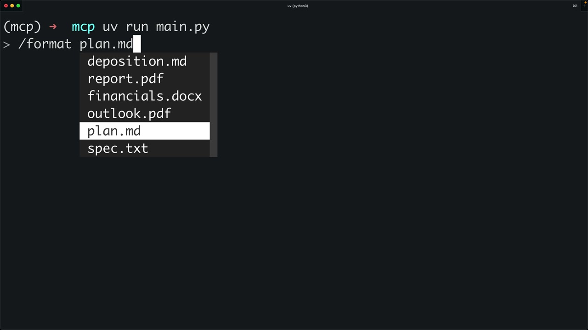
*Typing `/` in the CLI lists prompts as slash commands — much like the slash commands of Slack or Discord.*

The workflow is:

- The user selects a prompt (e.g., `format`)
- The system asks for the required arguments (e.g., which document to format)
- **The prompt is sent to Claude with the interpolated values**
- Claude **uses the tools for any additional data lookups** and completes the task

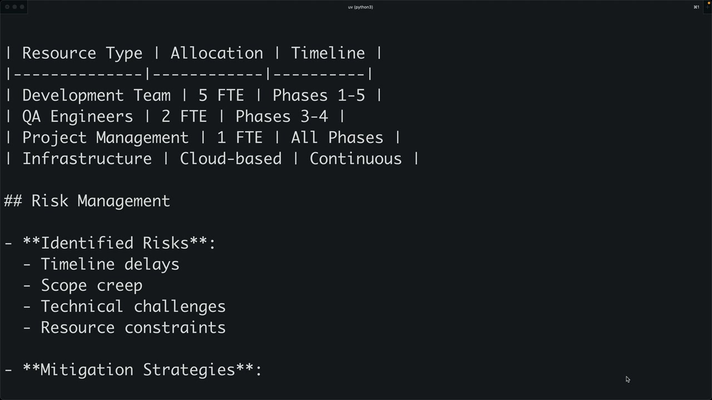
*The full workflow — select a prompt → enter arguments → Claude performs tool calls internally.*

#### Prompt Best Practices, Revisited

> [!method] When authoring prompts for an MCP server
> - Make them **relevant** to the server's purpose
> - **Test thoroughly** before release
> - Use **clear and specific** instructions
> - Design them to **pair well** with the server's available tools
> - Think carefully about the **arguments** the user must supply

#### A Sequence Showing the Three-Way Composition in Action

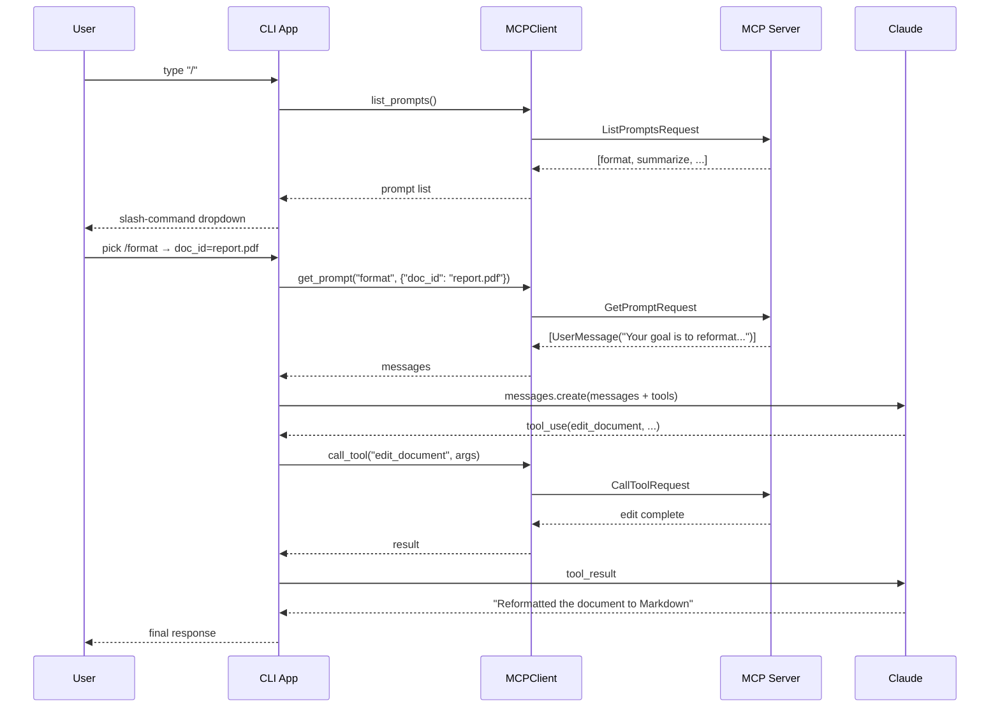
```mermaid
sequenceDiagram
    participant U as User
    participant CLI as CLI App
    participant MC as MCPClient
    participant MS as MCP Server
    participant C as Claude

    U->>CLI: type "/"
    CLI->>MC: list_prompts()
    MC->>MS: ListPromptsRequest
    MS-->>MC: [format, summarize, ...]
    MC-->>CLI: prompt list
    CLI-->>U: slash-command dropdown

    U->>CLI: pick /format → doc_id=report.pdf
    CLI->>MC: get_prompt("format", {"doc_id": "report.pdf"})
    MC->>MS: GetPromptRequest
    MS-->>MC: [UserMessage("Your goal is to reformat...")]
    MC-->>CLI: messages

    CLI->>C: messages.create(messages + tools)
    C-->>CLI: tool_use(edit_document, ...)
    CLI->>MC: call_tool("edit_document", args)
    MC->>MS: CallToolRequest
    MS-->>MC: edit complete
    MC-->>CLI: result
    CLI->>C: tool_result
    C-->>CLI: "Reformatted the document to Markdown"
    CLI-->>U: final response
```

> [!finding] The bridge prompts build
> *"Prompts bridge the gap between predefined functionality and dynamic user needs, giving Claude structured starting points for complex tasks while maintaining flexibility through parameterization."*
> A bridge between predefined functionality and dynamic user needs — offering **structured starting points** for complex tasks while preserving flexibility through **parameterization**.

> [!action] Practice Notebook
> 📂 `03-Exercises/Week_07/skilljar/S6_05_prompts.ipynb`
> Add `list_prompts` / `get_prompt` to `MCPClient`, and reproduce the full cycle in the CLI loop: parsing the `/` input → selecting a prompt → collecting arguments → `get_prompt` → feeding to Claude. Have the `format` prompt actually call the `edit_document` tool, so you can experience how the **three-way composition of prompts, tools, and resources** collaborates on a single task.

> [!method] cli_project hands-on guide — `/` command in action
> 1. `cd cli_project && uv run main.py`
> 2. Type `/` → autocomplete dropdown shows `format`
> 3. Tab → `/format ` (space) → autocomplete again → pick `plan.md`
> 4. Enter → the format prompt fires → watch Claude auto-invoke `edit_document` (Tools + Resources + Prompts cooperating — the climax of MCP)
> 5. Verify: type `@plan.md` again to see the markdown-formatted result
> 6. Trace the code: `cli_project/core/cli_chat.py` **L51-63** `_process_command()` — `/` routing

> [!ref] Source: Skilljar L10 — Prompts in the client (287786)

---

### 2.6 MCP Integrative Review (L11) — The Interplay of Tools · Resources · Prompts

Skilljar L11 (287790) is a **video-only** review lesson with no written body. It serves to recap the concepts built up in L01–L10 in a single scene; here we summarize it as a **core checklist**.

#### Matrix Summary of the Three Components

| Component | Decorator | Purpose | Client Method | Selection Criterion |
|:---:|:---:|:---|:---:|:---|
| **Tools** | `@mcp.tool()` | Perform actions (change state · call external APIs) | `call_tool(name, args)` | Capabilities Claude **actively** invokes |
| **Resources** | `@mcp.resource(uri, mime_type=...)` | Expose data (GET-like) | `read_resource(uri)` | Data the user **explicitly chooses** (via `@`, etc.) |
| **Prompts** | `@mcp.prompt()` | Reusable, validated templates | `list_prompts()` / `get_prompt(name, args)` | Externalized **instructions from domain experts** |

#### Why Use MCP — Three-Line Summary

> [!result] The value of MCP
> 1. **Transfer of responsibility for integration code** — from "what I write" to "what the server has already written"
> 2. **Three components fully cover the interaction between LLM and the outside world** — Action (Tools) + Data (Resources) + Know-how (Prompts)
> 3. **Reusable from any LLM host under the same protocol** — the same server works in Claude Desktop, Claude Code, and custom apps alike

#### The Integrated Architecture Diagram (W07 Final)


```mermaid
graph TB
    subgraph HOST["🖥️ Host (Application)"]
        APP["Application code"]
        MC["MCP Client<br/>(async context)"]
        APP --> MC
    end

    subgraph SERVER["🛰️ MCP Server (FastMCP)"]
        direction TB
        SRV["FastMCP('DocumentMCP')"]
        TOOLS["🔧 @mcp.tool<br/>read_doc_contents<br/>edit_document"]
        RES["📦 @mcp.resource<br/>docs://documents<br/>docs://documents/&#123;id&#125;"]
        PROMPTS["💬 @mcp.prompt<br/>format"]
        SRV --> TOOLS
        SRV --> RES
        SRV --> PROMPTS
    end

    subgraph CLAUDE["🤖 Claude"]
        C["claude-haiku-4-5<br/>or claude-sonnet"]
    end

    MC <-.->|"stdio / HTTP / WS"| SRV
    APP -.->|"messages.create<br/>tools + user + prompt"| C
    C -.->|"tool_use / text"| APP

    INSP["🔍 MCP Inspector<br/>port 6277"] -.->|"mcp dev"| SRV

    style HOST fill:#dbeafe,stroke:#3b82f6
    style SERVER fill:#d1fae5,stroke:#059669
    style CLAUDE fill:#fef3c7,stroke:#d97706
    style INSP fill:#f3e5f5,stroke:#9c27b0
```

> [!finding] L01–L10 in a single view
> - **L01 · L02** — *why* MCP (solving integration hell) + *how* it communicates (transport-agnostic, ListTools/CallTool)
> - **L03 · L04 · L05** — how to *build the server* (FastMCP + decorators + Inspector)
> - **L06** — how to *build the client* (async context + list_tools/call_tool)
> - **L07 · L08** — *exposing and consuming data* (direct/templated Resources + MIME parsing)
> - **L09 · L10** — *externalizing domain knowledge* (Prompts + CLI slash commands)
> - **L11** — **combining all of this in one server** (the three-way composition)

> [!action] Practice Notebook (student exercise)
> 📂 `03-Exercises/Week_07/skilljar/S6_06_practice.ipynb`
> A self-directed student exercise that **reconstructs L01–L10 from scratch**. Without starter code, solve the challenges below on your own:
> 1. Pick a new domain (e.g., a personal knowledge base, a to-do list, a recipe collection)
> 2. Implement three tools — `read` / `add` / `update` — with `@mcp.tool()`
> 3. Define two resources in the `items://` namespace — one direct and one templated
> 4. Add a single `summarize` prompt
> 5. Connect via `MCPClient`, issue a query like *"summarize my to-do list"* to Claude, and confirm the whole cycle runs end-to-end

> [!method] cli_project hands-on guide — register your own server
> 1. Write your domain server in a new folder (e.g., `cli_project/my_servers/todo_mcp.py`)
> 2. `main.py` accepts extra servers as args (L29: `server_scripts = sys.argv[1:]`)
> 3. Run: `uv run main.py my_servers/todo_mcp.py`
> 4. Confirm your tools (e.g., `add_todo`) are auto-registered in the chatbot
> 5. Challenge: ensure your domain works through `@` mentions and `/` commands too.

> [!ref] Source: Skilljar L11 — MCP review (287790) (video-only, no body text — this section is a synthesis of L01–L10)

---

### 2.7 Domain Application — Designing a Structural-Engineering MCP Server

Where the Skilljar track ended at the document-management MCP, we now extend into the **architectural-engineering domain**. Combining the **KDS RAG pipeline** we built in W05, the **Vision and Extended Thinking** from W06, and this week's **FastMCP** yields a full MCP-server set for *"asking about KDS design codes and Midas analysis results and auto-generating a structural review report"*.

#### Server Spec — `structural-mcp`

| Layer | Component | Implementation |
|:---:|:---|:---|
| **Tools** | `check_beam_capacity(beam_id)` · `calculate_rebar_area(Mu, b, d)` · `parse_midas_mgt(filepath)` | W04 Tool Use + numerical libraries |
| **Resources** | `kds://41-17-00/section-4-3` · `midas://results/{model_id}` · `materials://rebar/{grade}` | Mix of direct + templated; JSON/text/plain MIME |
| **Prompts** | `structural_review(member_type, code_section)` · `design_check(drawing_path, criteria)` | Validated review-procedure templates |

#### Architecture Diagram


```mermaid
graph TB
    subgraph CLIENT["💻 Claude Code (W08)"]
        CC["claude mcp add structural..."]
    end

    subgraph SERVER["🛰️ structural-mcp (applies W07 knowledge)"]
        direction TB
        TOOLS["🔧 Tools<br/>check_beam_capacity<br/>calculate_rebar_area<br/>parse_midas_mgt"]
        RES["📦 Resources<br/>kds://41-17-00/...<br/>midas://results/&#123;id&#125;<br/>materials://rebar/&#123;grade&#125;"]
        PROMPTS["💬 Prompts<br/>structural_review<br/>design_check"]
    end

    subgraph BACKENDS["📚 Backends (reused from W05 · W06)"]
        RAG["KDS RAG<br/>(W05 S4_07)"]
        MIDAS[".mgt parser<br/>(domain module)"]
        DB["structural-materials DB<br/>(SQLite)"]
    end

    CC -->|"stdio / HTTP"| SERVER
    TOOLS --> MIDAS
    TOOLS --> DB
    RES --> RAG
    RES --> MIDAS
    RES --> DB
    PROMPTS -.->|"'use these tools and resources<br/>to review per KDS §4.3'"| TOOLS
    PROMPTS -.-> RES

    style SERVER fill:#e8f4f8,stroke:#2980b9
    style CLIENT fill:#e8c07a,stroke:#c4a882,color:#333
    style BACKENDS fill:#f3e5f5,stroke:#9c27b0
```

#### Sample Implementation — the `structural_review` Prompt

```python
from mcp.server.fastmcp import FastMCP, base
from pydantic import Field

mcp = FastMCP("StructuralMCP", log_level="ERROR")

@mcp.prompt(
    name="structural_review",
    description="Generate a structural-member review report following the KDS code procedure."
)
def structural_review(
    member_type: str = Field(description="Member type (beam, column, slab, wall)"),
    code_section: str = Field(description="KDS clause (e.g., 'KDS 41 17 00 4.3')"),
    model_id: str = Field(description="Midas analysis model ID")
) -> list[base.Message]:
    prompt = f"""
You are a structural-design expert. Review the {member_type} member using this procedure.

1. Read the analysis results (Mu, Vu) from the `midas://results/{model_id}` resource.
2. Fetch the relevant code clause from the `kds://{code_section.replace(' ', '-').lower()}` resource.
3. Use the `check_beam_capacity` tool to compute flexural and shear capacity.
4. If capacity is insufficient, use `calculate_rebar_area` to size the reinforcing bars.
5. Compose the final report — clause citation, calculation steps, review conclusion, in that order.

Output format:
- First line: '✅ OK' or '❌ NG'
- Followed by detailed calculations
- Finally: recommended actions (if any)
"""
    return [base.UserMessage(prompt)]
```

#### Domain-Specific Design Principles

> [!method] Structural-engineering MCP design checklist
> 1. **State the unit system** — enforce SI (N·mm·MPa) in every tool description
> 2. **Code URI conventions** — use `kds://<code-id>/<section>` to avoid URI collisions with the W10 BIM-MCP and W11 Midas-MCP
> 3. **Floating-point rounding** — fix stress/strength computations to two decimal places (for report consistency)
> 4. **Localize error messages** — so Claude can relay them to users verbatim (in Korean, in our context)
> 5. **Require clause citation in prompts** — instruct Claude to **always cite the supporting clause** in the form "per KDS 41 17 00 4.3.1…"

> [!finding] Why a "domain MCP" matters
> - **Tool Use (W04)** — tools reimplemented per app
> - **RAG (W05)** — searches documents only; cannot compute or modify
> - **MCP (W07)** — bundles both **into a single server** reusable from Claude Code, Claude Desktop, anywhere
> In other words, once a lab builds its KDS analysis pipeline as an MCP, **every student and project shares the same analytical capability through natural language**.

> [!action] Practice Notebook
> 📂 `03-Exercises/Week_07/skilljar/S6_07_structural_mcp.ipynb`
> Implement the `structural-mcp` skeleton of this section step-by-step — ① initialize FastMCP, ② KDS-clause RAG (reusing the W05 chain), ③ a simple `.mgt` parser → `parse_midas_mgt` tool, ④ the `structural_review` prompt, ⑤ verify with Inspector, and ⑥ (bonus) register it to Claude Code with `claude mcp add` and actually run *"review beam B1 per KDS 4.3"*.

> [!method] cli_project / structural hands-on guide — engineering domain
> 1. `cd 03-Exercises/Week_07/structural`
> 2. Inspector: `uv run mcp dev structural_mcp.py` → http://localhost:6277 → check tools/resources/prompts
> 3. Plug into cli_project: `cd ../skilljar/cli_project && uv run main.py ../../structural/structural_mcp.py`
> 4. Try `Check beam B1: 300x600, fck=27, fy=400, As=1963, Mu=200kN.m` — watch `check_flexural_strength` get called automatically
> 5. (Bonus) Register with Claude Code: `claude mcp add structural-mcp -- uv run /abs/path/structural_mcp.py` → use it in any Claude Code session

> [!ref] Supplementary — Domain Application References
> - [[Week_05]] S4_07 — KDS RAG pipeline (reused as the resource backend)
> - [[Week_06]] — Extended Thinking (verifying computation steps), Vision (drawing image → dimension extraction)
> - [[Week_10]] (upcoming) — IFC/BIM MCP deep dive
> - [[Week_11]] (upcoming) — Midas MCP advanced topics + the MCPA course

---

## [Chapter 3] Self-assessment & Summary

### 3.1 Concept-Check Quiz — W07 Full Scope (Q1–Q10)

> [!question] Q1. Which best expresses the **core value proposition** of MCP (Model Context Protocol)?
> A) It makes Claude's responses faster
> B) It shifts the burden of tool definition and execution from your server onto specialized MCP servers
> C) It reduces Claude's token usage by 50%
> D) It lets you use LLMs without writing Python code
>
> > [!tip]- Show Answer
> > **Answer: B)** exactly as the L01 transcript says: *"a way to shift the burden of tool definitions and execution away from your server to specialized MCP servers"*. Speed, cost, and language are unrelated — MCP's essence is **who maintains the integration code**.

> [!question] Q2. What does it mean that MCP is "**transport-agnostic**"?
> A) It works with any LLM model
> B) Client and server can talk via **various communication methods** — stdio, HTTP, WebSockets, and so on
> C) It works without an internet connection
> D) It is implemented in every programming language
>
> > [!tip]- Show Answer
> > **Answer: B)** L02 puts it as *"a fancy way of saying the client and server can talk to each other using different communication methods"*. Besides local stdio, HTTP, WebSockets, and other network protocols are possible. The transport layer is swappable.

> [!question] Q3. What are the **two main pairs of message types** the MCP client and server exchange?
> A) `OpenRequest/CloseRequest` and `DataRequest/DataResponse`
> B) `ListToolsRequest/ListToolsResult` and `CallToolRequest/CallToolResult`
> C) `Login/Logout` and `Query/Answer`
> D) `GET/POST` and `PUT/DELETE`
>
> > [!tip]- Show Answer
> > **Answer: B)** The two pairs explicitly presented in L02 as "the main message types you'll work with". The former is "what tools do you have?", the latter is "run this tool with these arguments".

> [!question] Q4. Which is the **exact one-line** form to initialize a FastMCP server?
> A) `mcp = MCP("DocumentMCP")`
> B) `mcp = FastMCP("DocumentMCP", log_level="ERROR")`
> C) `mcp = Server.new(name="DocumentMCP")`
> D) `mcp = fastmcp.init(log="ERROR")`
>
> > [!tip]- Show Answer
> > **Answer: B)** exactly as in the L04 example — `from mcp.server.fastmcp import FastMCP` then `mcp = FastMCP("DocumentMCP", log_level="ERROR")`. The first argument is the server name (shown in client logs); `log_level` is optional.

> [!question] Q5. What is the **biggest benefit** the `@mcp.tool()` decorator provides?
> A) It auto-translates Claude's responses
> B) It **auto-generates a JSON schema** from Python type hints
> C) It auto-deploys the tool
> D) It encrypts parameters
>
> > [!tip]- Show Answer
> > **Answer: B)** L04's *"Automatic JSON schema generation from Python type hints"*. The long JSON schema you hand-wrote in W04 is replaced by the single line `doc_id: str = Field(description="...")`. The combination of decorator + type hints + Pydantic `Field` is the key.

> [!question] Q6. What is the **correct command and port** to start the MCP Inspector?
> A) `python mcp_server.py` — port 8000
> B) `mcp dev mcp_server.py` — port 6277
> C) `npm run mcp-inspector` — port 3000
> D) `mcp run mcp_server.py --debug` — port 5000
>
> > [!tip]- Show Answer
> > **Answer: B)** per the L05 transcript's *"starts a development server on port 6277"* with `mcp dev mcp_server.py`. In the browser, Connect → test Tools / Resources / Prompts.

> [!question] Q7. Which best summarizes the **difference between Resources and Tools** in MCP?
> A) Resources are free; Tools cost money
> B) Resources **expose data**; Tools **perform actions**
> C) Resources are synchronous; Tools are asynchronous
> D) Resources are Python-only; Tools are language-agnostic
>
> > [!tip]- Show Answer
> > **Answer: B)** exactly as L07 puts it: *"Resources expose data, tools perform actions"*. By HTTP analogy, Resources = GET, Tools = POST/PUT. The design criterion is "does it change state?".

> [!question] Q8. In `@mcp.resource("docs://documents/{doc_id}", mime_type="text/plain")`, how is the **parameter `{doc_id}`** passed to the function?
> A) As an environment variable
> B) The SDK automatically parses it from the URI and passes it **as a keyword argument** to the function
> C) You must manually read `os.environ`
> D) It is fixed as the first positional argument
>
> > [!tip]- Show Answer
> > **Answer: B)** from L07: *"the Python SDK automatically parses parameters from the URI and passes them as keyword arguments to your function"*. The parameter name in the function definition `def fetch_doc(doc_id: str)` must match the URI placeholder.

> [!question] Q9. Why is a prompt created with `@mcp.prompt()` **more valuable than a simple user-typed prompt**?
> A) Because it's shorter
> B) Because it's a **template carefully developed and tested** by the server author using domain knowledge
> C) Because Claude only responds to prompts for free
> D) Because the user can never see it
>
> > [!tip]- Show Answer
> > **Answer: B)** from L09: *"they'll get more consistent and higher-quality results when using prompts that have been carefully developed and tested by the MCP server authors"*. A prompt = the **externalization of domain expertise**. The `structural_review` in §2.7 is exactly this principle applied to structural engineering.

> [!question] Q10. What are the **three components** an MCP server can expose?
> A) Models, Agents, Workflows
> B) Tools, Resources, Prompts
> C) Input, Output, Logs
> D) Files, Commands, Webhooks
>
> > [!tip]- Show Answer
> > **Answer: B)** the core vocabulary repeated throughout L01–L11. The `@mcp.tool()`, `@mcp.resource()`, `@mcp.prompt()` decorators correspond to each. These three components fully cover every **LLM ↔ outside world** interaction (the same concept as W08 Q9).

#### Checking Common Wrong-Answer Patterns

> [!finding] Where mistakes cluster
> - **Q2 on transport-agnostic** — easily confused with "model-agnostic", but it's about the **transport layer**. Not LLM-agnostic but **communication-method-agnostic**.
> - **Q7 on Resources vs. Tools** — seeing a read tool (`read_doc_contents`) created with `@mcp.tool` may be confusing. The key is *"does Claude actively invoke it (Tool), or does the user explicitly pick it (Resource)?"* — the same capability can be exposed differently depending on UX.
> - **Q9 on prompt value** — don't miss the point that it's **externalized domain knowledge**, not just "typing convenience for the user". Value comes from the MCP server author's expertise in that field.

> [!ref] Source: Skilljar L01–L11 transcripts (all MCP sections)

---

### 3.2 Learning Summary

#### Cumulative Progress Table (W01 → W07)

| Week | Topic | Core Concepts | Newly Added This Week |
|:---:|:---|:---|:---|
| **W01** | LLM fundamentals · six prompting techniques | tokens, temperature, few-shot, CoT | 4D Framework, AI Fluency |
| **W02** | Claude API calls | `messages.create`, multi-turn, streaming | Claude API overview + CLAUDE.md |
| **W03** | Prompt engineering & evaluation | systematic design, Eval Pipeline, Streamlit | Quantitative prompt evaluation |
| **W04** | Tool Use | JSON Schema, ToolUseBlock, tool_result | Connecting Claude to the outside world |
| **W05** | RAG + hybrid search | chunking, embeddings, VectorIndex, BM25, RRF | Knowledge expansion + lexical/semantic fusion |
| **W06** | Features of Claude | Extended Thinking, Vision, Caching | Integrated feature design |
| **W07** | **MCP server development** | **FastMCP, Tools · Resources · Prompts, Inspector, async client** | **Experiencing the MCP provider role — standardizing tools as a protocol** |

#### W07-Specific — Summary of L01–L11 Concepts

> [!finding] The six stages of the MCP learning journey and their source lessons
>
> | Stage | Concept | Core Content | Source Lesson |
> |:---:|:---|:---|:---:|
> | 1 | **What is MCP?** | Transferring integration code — the GitHub chatbot example, the USB-C metaphor | L01 |
> | 2 | **Client architecture** | transport-agnostic, ListTools/CallTool messages | L02 |
> | 3 | **Project setup** | CLI chatbot + MCP server, `uv run main.py` | L03 |
> | 4 | **Defining tools** | `FastMCP`, `@mcp.tool()`, type hints + `Field` | L04 |
> | 5 | **Testing with Inspector** | `mcp dev mcp_server.py` on port 6277 | L05 |
> | 6 | **Client implementation** | `MCPClient` async context, `list_tools`/`call_tool` | L06 |
> | 7 | **Defining resources** | `@mcp.resource()`, direct/templated, MIME types | L07 |
> | 8 | **Accessing resources** | `read_resource`, `AnyUrl`, JSON/text parsing | L08 |
> | 9 | **Defining prompts** | `@mcp.prompt()`, `base.UserMessage`, externalizing domain knowledge | L09 |
> | 10 | **Using prompts** | `list_prompts`/`get_prompt`, CLI slash commands | L10 |
> | 11 | **Integrative review** | The Tools + Resources + Prompts three-way composition | L11 |

#### Roadmap Mermaid — Beyond W07


```mermaid
graph LR
    subgraph W5["📘 W5 — RAG"]
        R5["chunking · embeddings ·<br/>hybrid search"]
    end

    subgraph W6["📙 W6 — Features"]
        F6["Thinking · Vision ·<br/>Cache"]
    end

    subgraph W7["🛰️ W7 — MCP (now)"]
        A1["L01-02<br/>concepts · architecture"]
        A2["L03-05<br/>server build + Inspector"]
        A3["L06<br/>client"]
        A4["L07-08<br/>Resources"]
        A5["L09-10<br/>Prompts"]
        A6["L11<br/>synthesis"]
        A7["§2.7<br/>structural domain"]
    end

    subgraph W8["⌨️ W8 — Claude Code"]
        CC["MCP consumer<br/>`claude mcp add`"]
    end

    subgraph W9["🤖 W9 — Agents"]
        AG["parallelization · chaining ·<br/>routing · loops"]
    end

    subgraph W11["🏗️ W11 — MCP Advanced"]
        MA["MCPA course<br/>Midas · advanced patterns"]
    end

    R5 -->|"resource backend"| A4
    F6 -->|"prompt body"| A5
    A1 --> A2 --> A3 --> A4 --> A5 --> A6 --> A7
    A7 --> CC
    CC --> AG
    AG --> MA

    style W7 fill:#e8c07a,stroke:#c4a882,color:#333
    style W5 fill:#dbeafe,stroke:#3b82f6
    style W6 fill:#fef3c7,stroke:#d97706
    style W8 fill:#d4edda,stroke:#27ae60
    style W9 fill:#f3e5f5,stroke:#9c27b0
    style W11 fill:#fde4cf,stroke:#e67e22

    classDef now fill:#059669,stroke:#047857,color:#fff,font-weight:bold
    class A1,A2,A3,A4,A5,A6,A7 now
```

> [!tip] Points connecting W07 → W08
> - **The MCP-consumer experience (W08)** — next week you'll attach the server you built this week to Claude Code with a single line, `claude mcp add`. A complete arc from **provider's view → consumer's view**.
> - **Context-Plan-Implement workflow (W08)** — the experience of crafting prompts as **reusable instructions** transfers directly to writing CLAUDE.md.
> - **Multi-server orchestration (W09)** — the pattern of routing across multiple MCP servers simultaneously is W09's topic. A deep understanding of a single server this week is the foundation for orchestrating many.

#### Three-Line Core Takeaway

> [!result] W07 in three lines
> 1. **MCP transfers the responsibility for defining and maintaining tools** — the three decorators `@mcp.tool() / @mcp.resource() / @mcp.prompt()` complete a FastMCP server, and JSON schemas are auto-generated from type hints.
> 2. **Three components fully cover LLM ↔ world interaction** — Tools (actions) + Resources (data) + Prompts (domain knowledge). The `mcp dev` Inspector on port 6277 verifies each without an LLM at tight loops.
> 3. **Build once, reuse anywhere** — the server you built this week attaches to Claude Code next week with a single `claude mcp add`; extended to the structural-engineering domain (`structural-mcp`), a whole lab can share its KDS/Midas pipeline via natural language.

---

## 💻 Exercises — S6 MCP Track

> All notebooks live under `03-Exercises/Week_07/skilljar/`. This week's build-up has **seven stages**, with each notebook taking the prior one's output as input — a cumulative structure.

### Stage-by-Stage Build-Up Diagram


```mermaid
graph LR
    S1["① S6_01<br/>MCP Server<br/>(Tools)"] -->|"+Inspector"| S2["② S6_02<br/>Inspector"]
    S2 -->|"+client"| S3["③ S6_03<br/>MCP Client"]
    S3 -->|"+Resources"| S4["④ S6_04<br/>Resources"]
    S4 -->|"+Prompts"| S5["⑤ S6_05<br/>Prompts"]
    S5 -->|"self-directed"| S6["⑥ S6_06<br/>Practice"]
    S6 -->|"domain application"| S7["⑦ S6_07<br/>Structural MCP"]

    style S1 fill:#3498db,stroke:#2980b9,color:#fff
    style S2 fill:#9b59b6,stroke:#8e44ad,color:#fff
    style S3 fill:#1abc9c,stroke:#16a085,color:#fff
    style S4 fill:#e67e22,stroke:#d35400,color:#fff
    style S5 fill:#e74c3c,stroke:#c0392b,color:#fff
    style S6 fill:#95a5a6,stroke:#7f8c8d,color:#fff
    style S7 fill:#27ae60,stroke:#1e8449,color:#fff
```

### Notebook Detail Table

| Notebook | Goal | Key Concepts / Exercises | Required Lessons |
|:---|:---|:---|:---:|
| `S6_01_mcp_server.ipynb` | Build an MCP server with FastMCP | `FastMCP("DocumentMCP")`, `@mcp.tool()`, `read_doc_contents` / `edit_document`, the `docs` dict | L01, L03, L04 |
| `S6_02_mcp_inspector.ipynb` | Validate with the MCP Inspector | `mcp dev mcp_server.py` on port 6277, Connect → Tools → Run Tool, edit→read chain verification | L05 |
| `S6_03_mcp_client.ipynb` | Implement the MCPClient class | async context manager, `list_tools()` / `call_tool()`, integration loop with Claude | L02, L06 |
| `S6_04_resources.ipynb` | Define and consume Resources | `@mcp.resource()` direct/templated, MIME types, `read_resource`, `json.loads` branching, @mention simulation | L07, L08 |
| `S6_05_prompts.ipynb` | Define and consume Prompts | `@mcp.prompt()`, `base.UserMessage`, `list_prompts` / `get_prompt`, implementing `/` slash commands | L09, L10 |
| `S6_06_practice.ipynb` | Student self-directed template | Pick a new domain → implement 3 Tools + 2 Resources + 1 Prompt from scratch | synthesis (L01–L11) |
| `S6_07_structural_mcp.ipynb` | **Structural-engineering domain application** — `structural-mcp` | Resourcify KDS RAG, `.mgt` parser tool, the `structural_review` prompt, Inspector verification, (bonus) Claude Code registration | synthesis + W05 S4_07 |

> [!method] Suggested In-class Exercise Order (2 hours)
> 1. **0:00~0:20** — `S6_01` build the FastMCP server; write `read_doc_contents` / `edit_document` via `@mcp.tool()`
> 2. **0:20~0:35** — `S6_02` launch the Inspector (`mcp dev`, port 6277) → Connect → manually run each tool in the Tools tab
> 3. **0:35~0:55** — `S6_03` implement the `MCPClient` async class; complete the Claude message loop with `list_tools` / `call_tool`
> 4. **0:55~1:15** — `S6_04` use `@mcp.resource()` for `docs://documents` (direct) and `docs://documents/{doc_id}` (templated); implement the client-side `read_resource`
> 5. **1:15~1:35** — `S6_05` add the `format` prompt via `@mcp.prompt()`; demo `list_prompts` / `get_prompt` and the CLI slash command
> 6. **1:35~2:00** — `S6_06` self-directed extension, or `S6_07` structural-engineering domain — pick one

> [!action] Submission Guidelines
> **Deadline**: the evening before next week's class, 23:59
> **Deliverables**: completed `S6_01`–`S6_05` **plus** at least one of `S6_06` or `S6_07` as a self-directed extension
> **Submission**: upload to the designated folder on the course Notion or Google Classroom (include your student ID and name in the filename)
> **Evaluation criteria**: (1) reproducibility of the server/client/Inspector loop, (2) the intuitiveness of Resources/Prompts design (MIME/URI conventions), (3) whether in the domain application the three-way composition of Tools/Resources/Prompts actually cooperates

> [!ref] Sources
> - All notebooks: `03-Exercises/Week_07/skilljar/`
> - Basis transcripts: Skilljar S6 L01–L11

---

## 🤖 CC Skill — Multi-agent + Introducing Agent SDK

> [!finding] Where this week's CC Skill fits
> W07 is the week you **build** MCP. This CC Skill block (30 minutes) previews the next step after building an MCP server — having **multiple agents cooperate** — namely **Multi-agent orchestration** and the **Anthropic Agent SDK**. The detailed practice unfolds in [[Week_09]]; this section is the **conceptual bridge** to W09.

### Multi-agent Pattern — From One MCP Server to Many Agents

The single MCP server you built this week is powerful on its own, yet real-world workflows often require **multiple agents cooperating**.

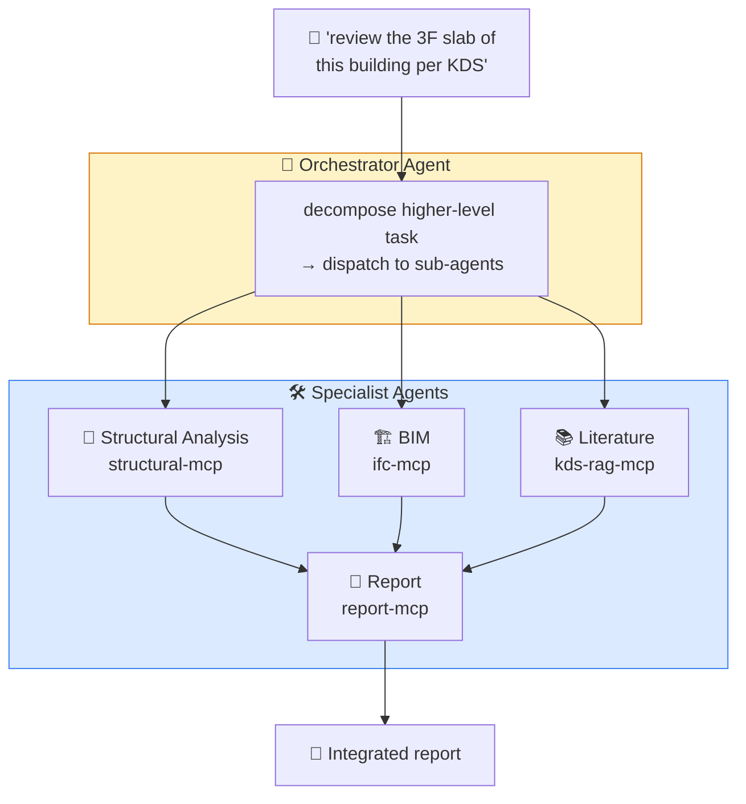
```mermaid
graph TB
    subgraph ORCHESTRATOR["🧠 Orchestrator Agent"]
        O["decompose higher-level task<br/>→ dispatch to sub-agents"]
    end

    subgraph SPECIALISTS["🛠️ Specialist Agents"]
        A1["📐 Structural Analysis<br/>structural-mcp"]
        A2["🏗️ BIM<br/>ifc-mcp"]
        A3["📚 Literature<br/>kds-rag-mcp"]
        A4["📝 Report<br/>report-mcp"]
    end

    U["👤 'review the 3F slab of<br/>this building per KDS'"] --> O
    O --> A1
    O --> A2
    O --> A3
    A1 --> A4
    A2 --> A4
    A3 --> A4
    A4 --> FINAL["📄 Integrated report"]

    style ORCHESTRATOR fill:#fef3c7,stroke:#d97706
    style SPECIALISTS fill:#dbeafe,stroke:#3b82f6
```

### Pattern Catalog (W09 Preview)

> [!method] Five patterns to be covered fully in W09
> 1. **Chaining** — one agent's output feeds the next agent's input (a pipeline)
> 2. **Parallelization** — several agents work simultaneously → results merged
> 3. **Routing** — dispatch to the appropriate specialist agent based on the input's nature
> 4. **Orchestrator-Workers** — a central orchestrator dynamically assigns workers
> 5. **Agent Loop** — the agent repeatedly calls tools until its goal is met

### Anthropic Agent SDK Preview

Anthropic provides an **Agent SDK** that simplifies agent construction (officially named `claude-agent-sdk` / TypeScript and Python). Its core features:

- **Built-in agent loop** — automates the tool-call → result-handling → next-decision cycle
- **Multi-agent support** — declare parent-child agent relationships
- **Streaming** — subscribe to intermediate-step events in real time
- **MCP integration** — the server you built this week works **as-is in the Agent SDK**

#### A Short Snippet (conceptual)

```python
# Covered in detail in W09 — concept preview only
from claude_agent_sdk import Agent, Tool

# Wire the MCP server built in W07 into the Agent SDK
orchestrator = Agent(
    model="claude-sonnet-4-5",
    mcp_servers=[
        {"name": "structural", "command": "uv", "args": ["run", "structural_mcp.py"]},
        {"name": "kds-rag",    "command": "uv", "args": ["run", "kds_rag_mcp.py"]},
    ],
    system="You are a structural-review orchestrator. Decompose the question and select and call the appropriate MCP server tools.",
)

result = orchestrator.run("Review beam B1 per KDS 41 17 00 4.3")
```

> [!tip] The W07 ↔ W09 link
> The `structural-mcp` you built this week isn't merely reused in W09 — it becomes **the fundamental unit of multi-agent orchestration in the Agent SDK**. That is, one MCP server = one specialist agent. Chain many MCP servers together and you get a **virtual lab**.

### Practical Guidance — Self-check After This Week

> [!method] Questions to ask yourself after finishing W07
> 1. How many Tools / Resources / Prompts does my MCP server define? Is the balance appropriate?
> 2. Did I test each component with the `mcp dev` Inspector **without an LLM**? How fast did I catch bugs?
> 3. Among the prompts I wrote, how many contain **real domain expertise** rather than mere "typing convenience"?
> 4. Is the server I made this week at a level where **others could use it** (README, example calls, error messages)?
> 5. To route across **multiple MCP servers** in W09, have I verified that my server's **name and URI scheme** won't collide with others?

### Deep-Dive Learning Path

> [!ref] Recommended supplementary study (self-directed)
> - `[[Week_06_IntroMCP]]` — the IMCP track supplementary note released at the end of W06, the pre-read for W07
> - [Claude Agent SDK GitHub](https://github.com/anthropics/claude-agent-sdk-python) — browse the repo before diving into W09
> - [MCP: Advanced Topics (MCPA)](https://anthropic.skilljar.com/mcp-advanced-topics) — the advanced course covered in W11, on authentication, remote servers, and complex transports

---

## 📚 References

> [!ref] Skilljar Official Materials
> - Course home: [Building with the Claude API — Skilljar](https://anthropic.skilljar.com/claude-with-the-anthropic-api)
> - Section S6 (Model Context Protocol): L01–L11 — the main source of this lecture
> - Prior section S5 (Features of Claude): covered in [[Week_06]]
> - Follow-on section S7 (Anthropic apps): covered in [[Week_08]]

> [!ref] Related Skilljar Courses
> - [Introduction to Model Context Protocol](https://anthropic.skilljar.com/introduction-to-model-context-protocol) (IMCP, 16 lessons) — pre-read for W07
> - [MCP: Advanced Topics](https://anthropic.skilljar.com/mcp-advanced-topics) (MCPA) — the advanced course covered in W11
> - [Claude Code 101](https://anthropic.skilljar.com/claude-code-101) — the MCP-consumer side, in W08

> [!ref] MCP Official Documentation
> - [Model Context Protocol — official site](https://modelcontextprotocol.io)
> - [MCP Specification](https://spec.modelcontextprotocol.io) — the protocol standard
> - [MCP Python SDK](https://github.com/modelcontextprotocol/python-sdk) — the FastMCP repository
> - [MCP Servers — official listing](https://github.com/modelcontextprotocol/servers) — a catalog of hundreds of official and community servers
> - [Anthropic — Introducing MCP](https://www.anthropic.com/news/model-context-protocol) (Nov 2024 official blog post)

> [!ref] FastMCP and SDKs
> - [FastMCP GitHub](https://github.com/jlowin/fastmcp) — the community FastMCP implementation (the basis of the official SDK)
> - [MCP Python SDK docs](https://github.com/modelcontextprotocol/python-sdk/tree/main/docs) — the official reference
> - [Anthropic Cookbook — MCP](https://github.com/anthropics/anthropic-cookbook) — an example collection
> - [anthropics/courses — mcp](https://github.com/anthropics/courses/tree/master/mcp) — the original practice code for Skilljar S6

> [!ref] MCP Server Development References
> - [modelcontextprotocol/servers — filesystem, github, postgres, etc.](https://github.com/modelcontextprotocol/servers) — official reference implementations
> - [MCP Inspector](https://github.com/modelcontextprotocol/inspector) — the tool `mcp dev` uses internally
> - [Awesome MCP Servers](https://github.com/punkpeye/awesome-mcp-servers) — a community catalog

> [!ref] Architectural-engineering Domain References
> - [[Week_05]] — RAG (KDS clauses as a resource backend)
> - [[Week_06]] — Features (enhance prompts with Vision / Extended Thinking)
> - [[Week_08]] — consuming MCP in Claude Code
> - [[Week_10]] (upcoming) — BIM (IFC) × MCP
> - [[Week_11]] (upcoming) — Midas × MCP + MCPA deep dive

> [!ref] Prior-Week Supplementary Material
> - [[Week_06_IntroMCP]] — the Introduction to MCP course (IMCP track, pre-read for W07)

---

## Related

- Prior: [[Week_06|Week 06: Features of Claude (S5)]] — Claude's individual features: Extended Thinking · Vision · Caching and so on
- Next: [[Week_08|Week 08: Anthropic Apps — Claude Code and Computer Use (S7)]] — consuming the MCP built this week
- Supplementary (pre-read): [[Week_06_IntroMCP|Introduction to MCP]] — the IMCP track, pre-read for W07 (① pre-read mode)
- Syllabus: [[00-Syllabus/LLM_AE_AI_Implementation_Syllabus_v2.3|LLM-AE-AI Syllabus v2.3]]
