# 8주차: Anthropic 앱 생태계 — Anthropic Apps: Claude Code and Computer Use (S7)

---

## 📌 강의 중점

**Ch.1 Anthropic 앱 소개 + Claude Code 셋업 (L01-L02)**
- **Anthropic 앱 여정**: Claude Code → Computer Use → Agents 의 단계적 진행 — AI 에이전트 원리를 **실제 제품 사례**로 체득
- **Claude Code의 정체성**: *터미널에서 동작하는 에이전틱 코딩 어시스턴트 (terminal-based coding assistant)* — 파일 조작·명령 실행·웹 접근·MCP 연결을 통합한 **단일 CLI**
- **Computer Use의 확장**: 데스크톱 환경 전체를 조작할 수 있는 도구 모음 — 웹 브라우징·데스크톱 앱 상호작용·GUI 네비게이션
- **세 단계 설치 절차**: Node.js → `npm install -g @anthropic-ai/claude-code` → `claude` 로그인 — macOS / Windows WSL2 / Linux 공통
- **Claude Code가 할 수 있는 일**: 파일 검색·읽기·편집, 터미널 명령 실행, 웹 검색·문서 조회, MCP 서버 연결로 능력 확장

**Ch.2 Claude Code 실전 + MCP 확장 (L03-L04)**
- **프로젝트 수명주기 파트너**: 단순 코드 생성기가 아니라 *"팀의 또 다른 엔지니어"* — 초기 셋업부터 배포·유지보수까지 전 단계 동반
- **`/init` 명령과 CLAUDE.md**: 프로젝트 전체 스캔 → 구조·의존성·코딩 스타일·아키텍처 요약 → 자동 컨텍스트 주입 파일 생성
- **CLAUDE.md 3-Scope 체계**: **Project** (팀 공유) · **Local** (개인 로컬) · **User** (전 프로젝트 공통) — 상황별 기억 분리
- **Context → Plan → Implement 워크플로**: 관련 파일 읽히기 → 계획만 세우도록 지시 → 계획대로 구현 — *"context가 많을수록 결과가 좋다"*
- **TDD 워크플로 4단계**: 컨텍스트 제공 → 테스트 케이스 브레인스토밍 → 테스트 구현 → 테스트를 통과하는 코드 작성
- **슬래시 명령어**: `/init` (코드베이스 스캔 + CLAUDE.md 생성), `/clear` (컨텍스트 초기화), `#` (CLAUDE.md 에 메모 추가)
- **MCP 내장 클라이언트**: Claude Code 자체가 MCP 클라이언트 → `claude mcp add [name] [command]` 한 줄로 외부 서버 연결
- **Tools · Prompts · Resources**: MCP 서버가 노출하는 세 가지 기능 — 액션 수행·프롬프트 템플릿·데이터 접근
- **인기 MCP 서버**: `sentry-mcp`, `playwright-mcp`, `figma-context-mcp`, `mcp-atlassian`, `firecrawl-mcp-server`, `slack-mcp` — 실무 도구 통합

**통합 사이클**: 앱 생태계 이해 → Claude Code 설치 → CLAUDE.md 작성 → Context-Plan-Implement 실전 → MCP 서버로 확장

---

## 🎯 학습 목표

학습 완료 후 다음을 수행할 수 있습니다.

**Ch.1 Anthropic 앱 소개 + Claude Code 셋업**
- Anthropic의 두 핵심 앱(Claude Code, Computer Use)이 **AI 에이전트의 원리**를 어떻게 구현하는지 설명할 수 있다
- Claude Code가 제공하는 네 가지 능력(파일 조작·터미널·웹 접근·MCP 지원)을 나열하고 각각의 용도를 구분할 수 있다
- Node.js 설치 → `npm install -g @anthropic-ai/claude-code` → `claude` 실행의 3단계로 Claude Code를 설치하고 로그인할 수 있다
- Claude Code가 지원하는 운영체제(macOS / Windows WSL2 / Linux)와 기본 실행 방식을 이해한다

**Ch.2 Claude Code 실전 + MCP 확장**
- `/init` 명령으로 프로젝트를 스캔하고 `CLAUDE.md` 파일을 자동 생성할 수 있다
- CLAUDE.md의 3-Scope 체계(Project / Local / User)의 용도 차이를 설명하고 상황에 맞게 활용할 수 있다
- Context → Plan → Implement 3단계 워크플로를 따라 새 기능을 체계적으로 구현할 수 있다
- TDD(Test-Driven Development) 워크플로 4단계를 적용해 견고한 코드를 작성할 수 있다
- `/init`, `/clear`, `#` 등 슬래시·메타 명령어를 활용해 Claude Code 세션을 관리할 수 있다
- `claude mcp add [server-name] [command]` 명령으로 외부 MCP 서버를 등록하고 사용할 수 있다
- MCP 서버의 Tools · Prompts · Resources 구성 요소를 이해하고 각각을 호출하는 법을 안다
- 대표적인 인기 MCP 서버(sentry-mcp, playwright-mcp, figma-context-mcp, mcp-atlassian, firecrawl-mcp-server, slack-mcp)의 용도를 설명하고 자신의 개발 워크플로에 통합할 수 있다

**통합 역량**
- Anthropic 앱 생태계를 이해하고, 프로젝트 요구사항에 따라 적절한 도구(Claude.ai / Claude Code / API)를 선택해 개발 워크플로를 구성할 수 있다
- Claude Code + CLAUDE.md + 다수 MCP 서버를 결합해 *"나만의 개발 환경 전용 에이전트"* 를 설계·구축할 수 있다

---

## 🤔 왜 배우는가? — "AI 개발 도구의 진화"

> [!question] [[Week_07]] 에서 MCP 서버를 **밑바닥부터** 구현하며 Tool·Resource·Prompt의 세 가지 기본 요소를 배웠다. Week 08 에서는 이 MCP 생태계가 **실제 제품 환경**에서 어떻게 사용되는지 — 그리고 Anthropic이 직접 만든 **Claude Code** 라는 제품이 MCP 를 어떻게 활용하는지를 학습한다.

### 코드를 작성하는 방식의 변화

전통적인 개발은 개발자가 IDE 에서 직접 코드를 작성하고, 에러를 디버깅하고, 문서를 찾아보는 과정이었다. **Claude Code는 이 패러다임을 근본적으로 바꾼다** — 개발자가 자연어로 의도를 전달하면, AI 가 코드를 작성하고, 실행하고, 검증하는 **전체 사이클**을 수행한다: *"Think of it as having Claude available right in your command line."*

Claude Code가 에이전트 입문에 특히 좋은 이유는, 단순한 "AI 채팅 앱" 이 아니라 **실제로 동작하는 에이전트의 교과서**이기 때문이다 — 도구 통합(Tool integration), 다단계 작업(Multi-step execution), 환경과의 상호작용(Environmental interaction), 자율적 문제 해결(Autonomous problem-solving) — 이 네 가지 **에이전트의 핵심 성질**을 모두 포함한다.

### API → Claude.ai → Claude Code 의 진화

| Week 02-07: API 직접 호출 | Week 01: Claude.ai 채팅 | **Week 08: Claude Code** |
| --------------------- | --------------------- | ------------------------ |
| Python 코드로 API 호출     | 웹 UI에서 대화             | **터미널에서 자연어 개발**         |
| 스키마·루프 직접 작성          | 파일 업로드·다운로드           | **파일 직접 편집·실행**          |
| 최대 유연성·최대 코드량         | 접근 쉬움·제한적 자동화         | **개발 워크플로 통합**           |
| 프로덕션 시스템 구축용          | 빠른 프로토타이핑·대화용         | **코드 프로젝트 개발용**          |

### 이번 주차의 핵심 개념: Anthropic 앱 생태계

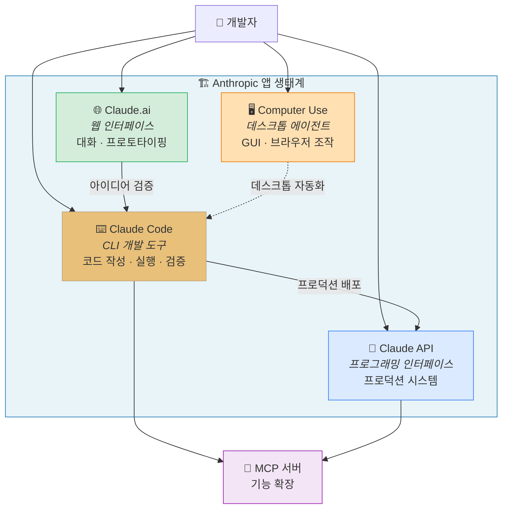

Claude Code는 단순한 "AI 채팅" 이 아니라, **파일 시스템에 직접 접근하고, 코드를 실행하며, Git을 관리하는 완전한 개발 에이전트** 다. Computer Use는 여기서 한 단계 더 나아가 **데스크톱 환경 전체**를 조작할 수 있도록 범위를 확장한다. 본 강의는 Claude Code의 설치부터 실전 활용, MCP 확장까지 체계적으로 학습한다.

### 이번 주 프로젝트: "나만의 개발 환경 에이전트" 만들기

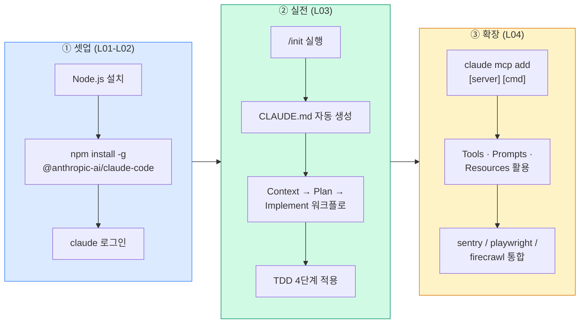

이 **3단계 파이프라인** 이 이번 주차의 뼈대다. ① 설치·로그인으로 Claude Code를 작동시키고, ② CLAUDE.md 기반 워크플로로 **프로젝트 맥락을 체계적으로 주입**하며, ③ MCP 서버를 붙여 *"Sentry에서 에러를 가져와, Playwright로 재현하고, Slack에 결과를 통보"* 같은 복합 워크플로까지 완성한다. 본 주차 마지막에는 **구조공학 도메인** 에 Claude Code 를 어떻게 적용할지도 함께 살펴본다.

### Anthropic Skilljar 코스

본 강의노트는 Anthropic 공식 교육 플랫폼 Skilljar 의 **"Building with the Claude API" Section 7: Anthropic apps — Claude Code and Computer Use** (4개 레슨 L01~L04) 를 기반으로 제작되었다.

| 레슨 | 제목 | Week 08 매핑 |
|---|---|---|
| L01 | Anthropic apps | Ch.1 도입부 — 앱 생태계와 학습 로드맵 |
| L02 | Claude Code setup | Ch.1 — 설치와 기본 개념 |
| L03 | Claude Code in action | Ch.2 — `/init`, CLAUDE.md, 워크플로, TDD |
| L04 | Enhancements with MCP servers | Ch.2 — MCP 서버 등록과 실전 통합 |

이전 주차 [[Week_07]] 에서 MCP 서버의 **내부 구조**(FastMCP · Tools · Resources · Prompts) 를 직접 구현했다면, 이번 주차는 그 MCP 생태계가 **실전 제품** (Claude Code) 에서 어떻게 소비되는지를 배운다. 다음 주차 [[Week_09]] 에서는 **에이전트와 워크플로** — 병렬화·체이닝·라우팅·에이전트 루프 — 로 이어지며, Claude Code의 내부에서 일어나는 일을 **우리 손으로 재현**하는 훈련으로 확장된다.

> [!ref] 소스 매핑
> - 온라인 코스: [Building with the Claude API](https://anthropic.skilljar.com/claude-with-the-anthropic-api)
> - Skilljar S7 (Anthropic apps): L01-L04
> - 실라버스 맵핑: **Building — S7 (Anthropic Apps) → W8** (v2.3 기준)
> - Claude Code 공식 문서: [docs.claude.com](https://docs.claude.com/en/docs/claude-code)

> [!method] 사전 준비
> - **Node.js 설치**: [nodejs.org/en/download](https://nodejs.org/en/download) 에서 LTS 버전 설치 (터미널에서 `npm help` 로 기존 설치 여부 확인 가능)
> - **Anthropic 계정**: Claude Code 최초 실행 시 브라우저로 로그인 프롬프트가 뜬다
> - **운영체제**: macOS / Windows WSL2 / Linux 중 하나 — Windows 기본 cmd/PowerShell 단독 사용은 권장되지 않으며, **WSL2** 환경에서 가장 안정적으로 동작한다
> - **노트북 순서**: `S7_01_anthropic_apps.ipynb` (생태계 개념) → `S7_02_claude_code.ipynb` (설치·워크플로 시뮬레이션) → `S7_03_mcp_extensions.ipynb` (MCP 등록) → `S7_04_practice.ipynb` (학생 실습) → `S7_05_structural_cc.ipynb` (건축 도메인 응용)

---
## [Chapter 1] Anthropic 앱 소개 + Claude Code 셋업 (L01-L02)

### 1.1 Anthropic 앱 생태계 (L01)

Anthropic 은 Claude 모델을 개발자의 손에 쥐여주기 위해 여러 **제품(application)** 을 동시에 제공한다. 이번 모듈에서는 그중 **두 가지 강력한 앱** — **Claude Code** 와 **Computer Use** — 를 탐구한다. 이 둘은 그 자체로 유용한 도구일 뿐 아니라, **AI 에이전트의 동작 방식** 을 실증하는 완벽한 사례다. 이 두 제품이 **내부적으로 어떻게 작동하는지**를 이해하면, 이후 직접 에이전트를 만들 때 필요한 탄탄한 기반이 된다.


*Anthropic 의 주요 앱 라인업 --- Claude.ai · Claude Code · Computer Use 가 동일한 모델 위에서 서로 다른 표면을 제공한다*


*Our Plan — Claude Code → Computer Use → Agents 의 3단계 진행*

#### Our Plan — 세 단계 학습 여정

우리는 이해를 **단계적으로 쌓아 올리는 진행 순서** 를 따른다.

- **Claude Code** — 터미널 내에서 동작하는 **에이전틱 코딩 어시스턴트(agentic coding assistant)** 에서 출발한다
- **Computer Use** — Claude 가 **데스크톱 애플리케이션**과 상호작용할 수 있게 해주는 도구 모음을 탐구한다
- **Agents** — 왜 이 앱들이 **에이전트로서 성공적인지**, 그 공통 원리를 정리한다

이 순서는 의도적이다. 가장 **구체적이고 손에 잡히는 예시(Claude Code)** 부터 시작해, 점차 **일반적이고 추상적인 개념(Agents)** 으로 올라간다. 구체적인 사례를 먼저 체득해야 추상적 원리가 머리에 남는다는 교육학적 원리의 적용이다.

#### Claude Code — 터미널 속의 AI 페어 프로그래머

Claude Code 는 **터미널 기반 코딩 어시스턴트(terminal-based coding assistant)** 다. 다양한 프로그래밍 작업을 돕는데, 이를 *"커맨드 라인 안에 Claude 가 상주하면서 다음 일들을 준비된 채 기다리고 있다"* 고 생각하면 쉽다.

- **파일 편집과 버그 수정** — 프로젝트 내 파일을 직접 열고 수정
- **코딩 질문 답변** — "이 함수는 무슨 일을 하지?" 식의 물음에 코드를 읽어보고 답변
- **개발 워크플로 지원** — Git 커밋, 테스트 실행, 의존성 관리 등을 자연어로 지시

본 강의에서는 전체 설치 과정을 밟고 나서, **실제 샘플 프로젝트** 위에서 Claude Code를 직접 사용해 보며 *"실무에서 정확히 어떻게 동작하는가"* 를 확인한다.

#### Computer Use — 데스크톱 전체로 확장된 능력

Computer Use 는 Claude 의 역량을 **훨씬 더 멀리** 확장한다. **풀 데스크톱 컴퓨터 환경**과 상호작용할 수 있게 해주는 도구 모음(collection of tools) 이다. 즉 Claude 가 다음을 할 수 있다:

- **웹사이트 접근과 인터넷 브라우징** — 검색, 양식 입력, 기사 읽기
- **데스크톱 앱 상호작용** — 엑셀·PowerPoint·IDE·전용 GUI 프로그램 조작
- **시각 인터페이스가 필요한 작업 수행** — 버튼 클릭, 메뉴 탐색, 시각적 확인

이는 **텍스트 전용 상호작용 대비 가능 범위를 극적으로 확장** 시킨다. Claude Code가 터미널 안에서 완결된다면, Computer Use는 그 경계를 **데스크톱 전체**로 넓혀놓는다.

#### 이 두 앱이 에이전트 학습에 중요한 이유

Claude Code와 Computer Use 는 **에이전트 이해를 위한 훌륭한 케이스 스터디** 로 작동한다. 에이전트를 효과적으로 만드는 **핵심 원칙** 을 다음과 같이 보여주기 때문이다.

- **도구 통합과 사용(Tool integration and usage)** — 외부 도구를 호출하고 결과를 받아 다음 판단에 활용
- **다단계 작업 실행(Multi-step task execution)** — 한 번의 요청으로 여러 하위 작업을 순차 진행
- **환경과의 상호작용(Environmental interaction)** — 파일 시스템, 웹, 데스크톱 등 외부 세계와 주고받음
- **자율적 문제 해결(Autonomous problem-solving)** — 사전 정의된 스크립트 없이 상황에 맞게 전략을 수립

이 **실제 구현 사례**를 분석하면서, 무엇이 Claude Code 와 Computer Use 를 성공적으로 만들었는지 인사이트를 얻고, 그것을 자신의 에이전트 개발 작업에 녹여낼 수 있다.

#### 학습 여정 다이어그램

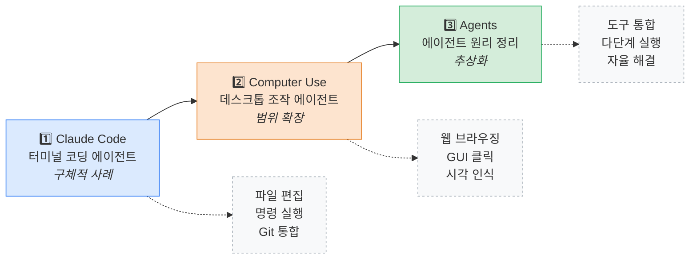

> [!finding] 왜 "Claude Code 먼저" 인가
> Claude Code 는 **터미널 하나**에 에이전트의 모든 핵심 성질이 압축되어 있다. 추상적인 "에이전트란 무엇인가" 보다 `claude` 명령 한 번 쳐보는 것이 이해가 훨씬 빠르다. 게다가 Claude Code 에는 **MCP 클라이언트가 내장** 되어 있어, W07 에서 구축한 MCP 서버를 곧바로 연결해 볼 수 있다 — 이론(W07)과 실전(W08)이 즉시 연결되는 지점이다.

> [!tip] Claude.ai 와 Claude Code의 결정적 차이
> - **Claude.ai (웹)** — 대화 중심. 코드를 "보여주고" 설명은 훌륭하나, **실제 파일에 접근하거나 명령을 실행하진 못한다**.
> - **Claude Code (CLI)** — **프로젝트 디렉토리 안**에서 실행되므로 파일을 직접 읽고 수정하며 테스트를 돌린다.
> - 같은 Claude 모델이지만 **도구(tools)** 와 **실행 환경(context)** 이 완전히 다르다. 모델 선택이 아니라 **플랫폼 선택**의 문제라는 점이 핵심.

> [!action] 실습 노트북
> 📂 `03-Exercises/Week_08/skilljar/S7_01_anthropic_apps.ipynb`
> 노트북에서는 Anthropic 앱 생태계의 구조와 Claude Code · Computer Use 의 역할 분담을 시각화하고, **어떤 상황에 어떤 앱을 선택해야 하는지** 를 의사결정 트리로 실습한다.

#### 앱 선택 의사결정 트리

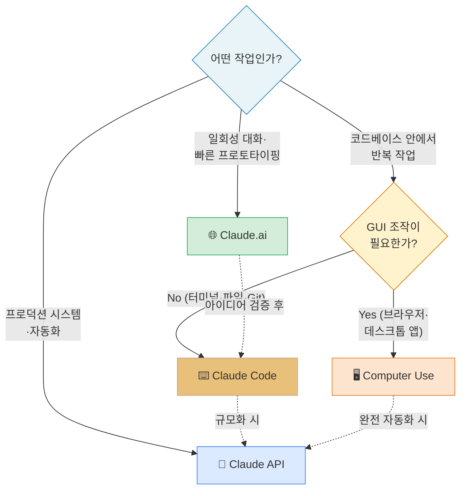

이 트리의 핵심 질문은 두 가지다. **(1) 작업이 코드와 얼마나 가까운가?** — 코드베이스 내부 작업이면 Claude Code, 외부 탐색·대화면 Claude.ai, 프로덕션 통합이면 API. **(2) GUI 를 조작해야 하는가?** — 예시: Excel 파일을 특정 시나리오로 열어 셀 값을 바꾸고 스크린샷을 찍어야 하는 경우 → Computer Use. 대부분의 개발 작업은 **Claude Code 하나로 충분** 하다.

> [!ref] 소스: Skilljar L01 — Anthropic apps (287787)

---

### 1.2 Claude Code 설정 (L02)

Claude Code 는 **커맨드 라인에서 바로 동작하는 터미널 기반 코딩 어시스턴트** 다. 이를 *"작업 중인 어떤 코딩 과제에든 도움을 받을 수 있도록, 터미널 안에 Claude 가 상주해 있다"* 고 생각하면 된다.


*Claude Code — 터미널에서 자연어로 코딩 지시를 내리는 에이전트*

#### Claude Code 가 할 수 있는 일


*Claude Code 의 내장 도구 모음 --- 파일 조작 · 터미널 실행 · 웹 접근 · MCP 연동까지 한 화면에 정리*

Claude Code는 개발 워크플로를 돕는 **포괄적인 도구 모음(comprehensive set of tools)** 과 함께 제공된다.

- **파일 작업(File operations)** — 프로젝트 내 파일을 **검색·읽기·편집**
- **터미널 접근(Terminal access)** — 대화 중에 **명령을 직접 실행**
- **웹 접근(Web access)** — 문서 검색·코드 예제 fetch 등
- **MCP 서버 지원(MCP Server support)** — **MCP 서버를 연결**해 추가 도구를 탑재

**MCP 통합은 특히 강력** 하다. 왜냐하면 데이터베이스·API·기타 내부 서비스용 **전용 도구** 를 연결해서 Claude Code 의 능력을 확장할 수 있기 때문이다. W07 에서 배운 MCP 서버들을 *"등록 한 줄"* 로 Claude Code 에 붙일 수 있다.

Claude Code 는 **macOS, Windows WSL2, Linux** 에서 작동하므로, 개발 환경에 상관없이 사용할 수 있다.

#### 설치 — 3단계


*Claude Code 설치 3단계 — Node.js → npm install -g → claude*

Claude Code 셋업은 **세 단계** 만 거치면 된다.

1. **Node.js 설치** — [nodejs.org/en/download](https://nodejs.org/en/download) 에서 다운로드. 이미 설치되어 있는지는 터미널에 `npm help` 를 쳐서 확인할 수 있다.
2. **Claude Code 설치** — 다음 명령으로 글로벌 설치한다.
   ```bash
   npm install -g @anthropic-ai/claude-code
   ```
3. **시작 및 로그인** — 터미널에 `claude` 를 입력해 실행한다.
   ```bash
   claude
   ```

`claude` 명령을 **처음** 실행하면, Anthropic 계정으로 **로그인하라는 프롬프트** 가 뜬다. 브라우저가 열리면 로그인 후 화면에 나오는 토큰을 터미널에 복사해 넣으면 인증이 완료된다. 더 자세한 설정 가이드는 **docs.claude.com** 에서 볼 수 있다.

일단 셋업이 끝나면, 어떤 코딩 프로젝트·작업이든 **터미널에서 바로 Claude 를 불러** 도움을 받을 준비가 된다.

#### 설치 플로우 Mermaid

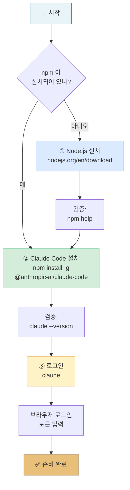

#### 운영체제별 참고사항

| 운영체제 | 권장 셸 | 특이사항 |
|:---|:---|:---|
| **macOS** | zsh / bash | `brew install node` 로 Node.js 설치 가능 |
| **Linux** | bash / zsh | 패키지 관리자(`apt`, `dnf`, `pacman`) 로 Node.js 설치 후 동일 진행 |
| **Windows** | **WSL2** (Ubuntu 권장) | 기본 cmd / PowerShell 보다 WSL 환경에서 가장 안정적 — 경로 구분자·권한 이슈 회피 |

Windows 사용자는 WSL2 위에서 Ubuntu 를 실행하는 것이 사실상 표준이다. 한 번 셋업해 두면 macOS / Linux 와 거의 동일한 개발 경험을 얻을 수 있다.

#### Claude Code 능력 지도

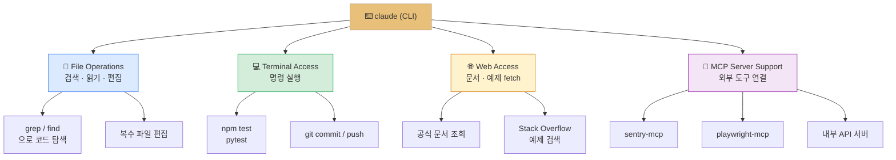

> [!finding] 한 줄로 요약한 "Claude Code 가 다른 툴과 다른 이유"
> 다른 AI 코딩 도구(Copilot, Cursor 등)는 대부분 **IDE 플러그인** 이다. Claude Code 는 **CLI 자체** 이므로 *어떤 IDE 를 쓰든*, *어떤 언어·프레임워크든*, *심지어 IDE 없이 서버에 SSH 접속한 상황에서도* 동일하게 사용할 수 있다. 즉 **환경에 종속되지 않는 범용 개발 에이전트** 다.

> [!method] 설치 직후 반드시 확인할 3가지
> 1. **버전 확인** — `claude --version` 이 정상 출력되는지
> 2. **로그인 상태** — 최초 `claude` 실행 후 브라우저 인증 완료 여부
> 3. **작업 디렉토리** — `claude` 는 **현재 디렉토리(cwd)** 를 프로젝트 루트로 인식하므로, 반드시 프로젝트 폴더 안에서 실행해야 한다

> [!tip] API 키 vs 구독 로그인
> Claude Code 는 두 가지 인증 방식을 지원한다.
> - **Anthropic Console(구독) 로그인** — 브라우저로 Claude Pro/Team/Enterprise 계정 로그인. 월 정액제로 사용량 관리가 간단.
> - **API 키 방식** — `ANTHROPIC_API_KEY` 환경변수를 설정. 팀 공유·서버 자동화에 적합.
> 본 강의에서는 개인 학습 목적으로 **구독 로그인** 을 사용하는 것이 가장 쉽다.

> [!action] 실습 노트북
> 📂 `03-Exercises/Week_08/skilljar/S7_02_claude_code.ipynb`
> 노트북에서는 (1) 설치 스크립트 시뮬레이션, (2) Claude Code 가 받는 프롬프트의 내부 구조, (3) 파일 · 터미널 · 웹 각 도구가 어떻게 분리되어 있는지 를 가시화한다.

> [!ref] 소스: Skilljar L02 — Claude Code setup (287788)

---

### 1.3 권한 시스템과 설정 파일 (보충)

> [!tip] **보충 내용** — 본 절은 Skilljar 본 레슨에는 없지만, 실습 시 자주 부딪히는 **권한·설정** 이슈를 정리한 보조 자료다. 공식 문서(`docs.claude.com`)의 내용을 요약한 것이며, 레퍼런스로 참고하자.

Claude Code 는 파일을 **쓰고**, 터미널 명령을 **실행** 하며, 때로는 외부 API 를 호출하기 때문에, **사용자의 명시적 동의** 를 요구하는 권한 시스템을 갖고 있다.

#### 첫 사용 시 동의 프롬프트

`claude` 를 처음 실행해 파일 수정이나 명령 실행이 필요한 작업을 요청하면, 다음과 같은 **세 단계 신뢰 설정** 을 거친다.

1. **Edit permissions** — "이 폴더의 파일을 수정해도 되나요?" 승인
2. **Bash permissions** — "명령을 실행해도 되나요?" 승인
3. **Fetch permissions** — "외부 URL 에 접근해도 되나요?" 승인

각 범주별로 **Allow** / **Deny** / **Ask each time** 옵션이 있으며, 프로젝트 초심자는 *"Ask each time"* 을 선택해 두고 상황에 맞게 수락하는 것이 안전하다.

#### 권한 시스템의 설계 철학

Claude Code 의 권한 모델은 *"유용함"* 과 *"안전함"* 사이의 균형을 지향한다. 에이전트가 완전히 자율적이면 실수로 `rm -rf` 를 실행할 수도 있고, 반대로 모든 작업에 사용자 확인을 요구하면 워크플로가 끊어진다. 해법은 **명시적 정책(settings.json) + 기본 대화형 승인** 의 2계층이다. 자주 쓰는 안전한 명령(`pytest`, `npm test`)은 `allow` 로 자동화하고, 위험 가능성이 있는 명령(`git push`, `rm *`)은 `ask` 로 확인받으며, 절대 금지 명령(`sudo *`)은 `deny` 로 원천 차단한다.

#### settings.json 구조

사용자 전역 설정은 `~/.claude/settings.json` 에 저장된다. 프로젝트 단위 설정은 프로젝트 루트의 `.claude/settings.json` 이다.

```json
{
  "theme": "dark",
  "permissions": {
    "allow": ["Bash(npm test)", "Bash(pytest)", "Bash(git status)"],
    "ask": ["Bash(git push)", "Bash(rm *)"],
    "deny": ["Bash(sudo *)"]
  },
  "env": {
    "NODE_ENV": "development"
  }
}
```

- `permissions.allow` — 항상 허용 (자동 승인)
- `permissions.ask` — 실행 전 매번 물어봄
- `permissions.deny` — 절대 실행 불가

#### 권한 계층 Mermaid

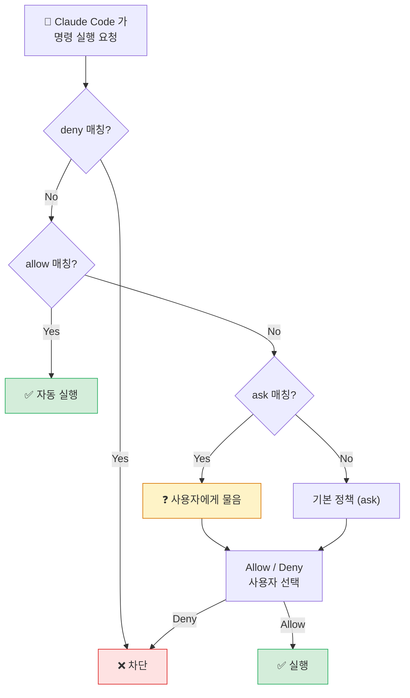

> [!method] 권한 관리 권장 시나리오
> - **개인 학습 프로젝트** — `ask` 위주. 실수로 파일을 날리는 상황 예방.
> - **팀 프로젝트** — `.claude/settings.json` 을 Git 에 커밋. 팀 전체가 동일 권한 정책 사용.
> - **CI/CD 환경** — `allow` 에 필요한 명령만 화이트리스트. `sudo`, `rm -rf` 등은 `deny` 로 차단.

> [!ref] 보충 — 공식 문서
> - [Claude Code — Configuration](https://docs.claude.com/en/docs/claude-code/settings) (Skilljar 외부)
> - [Claude Code — Security and permissions](https://docs.claude.com/en/docs/claude-code/security)

---
## [Chapter 2] Claude Code 실전 + MCP 확장 (L03-L04)

### 2.1 Claude Code in Action (L03)

Claude Code는 단순히 **코드를 작성하기 위한 도구가 아니다** — 소프트웨어 프로젝트의 **모든 단계** 에 걸쳐 개발자와 함께 일하도록 설계되었다. 팀에 새로 합류한 또 다른 엔지니어처럼 생각하자. 초기 셋업부터 배포·지원까지 **모든 단계를 담당** 할 수 있는 동료다.


*Claude Code 의 동반 영역 — 프로젝트 수명 전 단계(셋업 · 개발 · 테스트 · 배포 · 지원)*

#### 프로젝트 수명 주기와 Claude Code

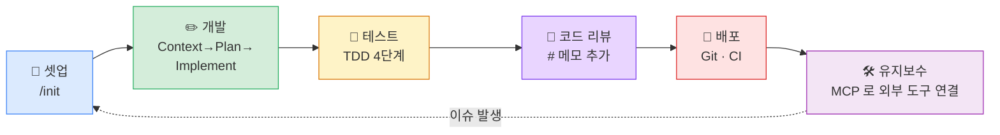

Skilljar 본 레슨은 이 흐름 중 **셋업(/init)**, **개발(Context→Plan→Implement)**, **테스트(TDD)** 를 실제로 체험하도록 구성되어 있다.

README.md 읽고 설치방향 실행.

```bash
> read the @README.md file and excute the setup directions
```

#### /init 명령 — 프로젝트 인덱싱


*`/init` 명령 실행 장면 --- 코드베이스를 스캔해 CLAUDE.md 초안을 자동 생성하는 첫 단계*

프로젝트에서 Claude Code 로 작업을 시작할 때 **가장 먼저 해야 할 일** 은 `/init` 명령을 실행하는 것이다. 이 명령은 Claude 에게 **코드베이스 전체를 스캔** 하도록 지시하고, 프로젝트의 **구조(structure), 의존성(dependencies), 코딩 스타일(coding style), 아키텍처(architecture)** 를 이해하게 한다.

```bash
> /init Include detailed notes on defining MCP tools from the README file 
```

Claude 는 자신이 학습한 모든 내용을 `CLAUDE.md` 라는 **특수한 파일** 에 요약해 저장한다. 이 파일은 앞으로의 **모든 대화에서 자동으로 컨텍스트에 포함** 되므로, Claude 가 우리 프로젝트의 중요한 세부 사항을 계속 기억하게 된다.

#### CLAUDE.md — 세 가지 스코프

*CLAUDE.md 의 세 가지 스코프 — Project · Local · User*

CLAUDE.md 는 서로 다른 **스코프(scope)** 별로 여러 개를 둘 수 있다.

- **Project** — **프로젝트에서 일하는 모든 엔지니어 사이에 공유** 되는 파일 (일반적으로 Git 으로 커밋됨)
- **Local** — **Git 에 체크인되지 않는 개인 메모** (자기 작업 환경·선호도 등)
- **User** — **모든 프로젝트에 걸쳐 사용** 되는 설정 (글로벌 선호도, 자주 쓰는 명령 템플릿 등)

`/init` 을 실행할 때, 특정 영역에 집중하도록 **특별한 지시사항을 추가** 할 수도 있다. 생성된 파일에는 **빌드 명령(build commands), 코딩 가이드라인(coding guidelines), 프로젝트 고유 패턴(project-specific patterns)** 이 포함되어, Claude 가 이를 준수하게 된다.

#### # 명령 — 빠른 메모 추가

`#` 명령을 사용하면 CLAUDE.md 파일에 **빠르게 메모를 추가** 할 수 있다. 예를 들어:

```bash
> # Always apply appropriate types to functions args 
```

을 입력하면, 이 지침을 **Project / Local / User 메모리** 중 어디에 추가할지 프롬프트가 뜬다. 대화 도중에 *"아, 이건 기억해두자"* 싶은 컨벤션이 떠오르면 곧바로 `#` 로 남기면 된다.

#### CLAUDE.md 범위 매트릭스

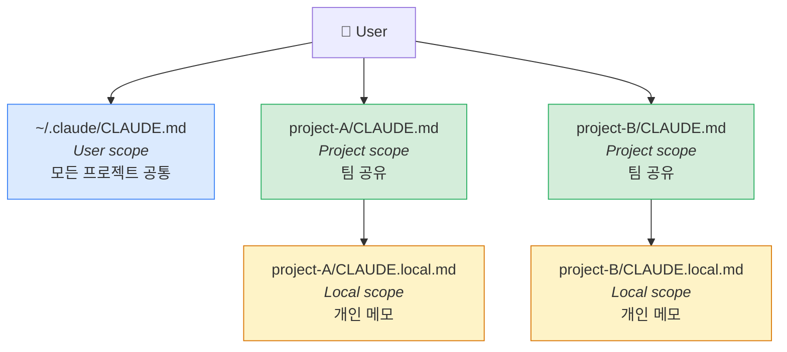

> [!finding] CLAUDE.md 의 힘
> CLAUDE.md 는 **"Claude 의 기억"** 이 아니라 **"프로젝트의 기억을 Claude 에게 자동 주입"** 하는 파일이다. 모든 새 대화마다 이 파일이 시스템 프롬프트에 포함되므로, 매번 *"우리 프로젝트는 TypeScript 와 Jest 를 쓰고…"* 를 반복 설명할 필요가 없다. 즉 **팀 단위의 프롬프트 엔지니어링** 이다.

#### 공통 워크플로 — Context → Plan → Implement

Claude 는 **효과 증폭기(effort multiplier)** 로 생각할 때 가장 잘 동작한다. **제공하는 컨텍스트와 구조가 많을수록, 결과가 더 좋아진다**. 가장 효과적인 워크플로는 다음과 같다.


*Claude Code 워크플로 흐름도 --- 컨텍스트 주입부터 구현까지 이어지는 단계별 협업 패턴*


*Common Workflow — Context → Plan → Implement 의 3단계*

##### Step 1 — Feed Context into Claude (컨텍스트 주입)

Claude 에게 **무언가를 만들라고 요청하기 전에**, 먼저 만들고자 하는 기능에 **관련된 파일들을 코드베이스에서 식별** 해 둔다. 그리고 Claude 에게 *이 파일들을 먼저 읽고 분석하라* 고 요청한다. 이 단계는 Claude 에게 **코딩 패턴의 예시**와 **기존 기능** 을 제공해, 그것을 기반으로 작업할 수 있게 한다.

```bash
> Read the math.py and document.py files
```

##### Step 2 — Tell Claude to Plan a Solution (계획만 세우기)

바로 구현으로 넘어가는 대신, Claude 에게 **문제를 깊이 생각하고 계획을 세우라** 고 요청한다. 이때 명시적으로 *"아직 코드를 쓰지 말라(do not write any code yet)"* 고 전달한다 — 오직 **접근 방법과 필요한 단계** 에 집중하도록.

```bash
Build a new tool called 'document_path_to_markdown'. It should take in the path to a PDF or DOCX  file, read the file, then converted its contents to markdown and return the result. Write out a plan to implement this feature. Don't write any code yet. 
```

vs

```bash
> Don't write any code yet. Plan to implement a new tool that converts
  a document file at a given path to markdown.
```

##### Step 3 — Ask Claude to Implement the Solution (구현)

탄탄한 계획이 마련되면, **계획대로 구현** 하라고 요청한다. Claude 는 앞서 함께한 **컨텍스트와 계획 작업** 을 기반으로 코드를 작성한다.

```bash
> Implement the plan
```

##### 3단계 워크플로 Mermaid

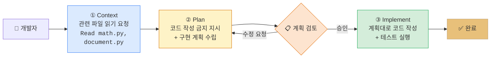

> [!tip] 왜 "Plan" 단계를 분리하는가
> 바로 *"X 기능을 구현해줘"* 라고 요청하면, Claude 는 그럴듯한 코드를 즉시 생성하지만 **프로젝트의 기존 추상화를 무시** 하기 쉽다. "계획만 세우라"고 요청해 **자연어 수준의 설계를 먼저 검토** 하면, 이 단계에서 방향을 바로잡을 수 있다. 이후 구현은 **훨씬 적은 수정만으로** 올바른 결과를 낸다 — Claude 가 자기가 세운 계획을 따르도록 유도하는 것이 핵심 트릭이다.

#### Test-Driven Development (TDD) 워크플로

더 나은 결과를 얻으려면, **테스트 기반 접근** 을 사용할 수 있다.


*TDD 워크플로 — 컨텍스트 → 테스트 케이스 → 테스트 구현 → 테스트 통과 코드*

1. **Feed context into Claude** — 이전과 동일하게 관련 파일들을 보여준다
2. **Ask Claude to think of test cases** — Claude 에게 **어떤 테스트가 새 기능을 검증할지** 브레인스토밍하게 한다
3. **Ask Claude to implement those tests** — 가장 관련 있는 테스트들을 선택해 Claude 에게 작성하게 한다
4. **Ask Claude to write code that passes the tests** — Claude 는 모든 테스트가 통과할 때까지 **구현을 반복** 한다

이 접근은 Claude 가 **작업해야 할 분명한 성공 기준(clear success criteria)** 을 갖게 해주므로, 종종 **더 견고한 코드** 를 만들어낸다.

#### TDD 4단계 Mermaid

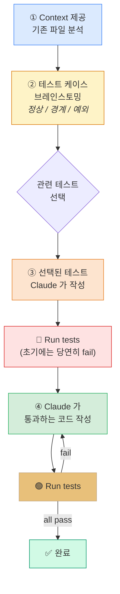

#### 실전 예시 — `document_path_to_markdown` 도구 추가

이 워크플로들이 **실제로는 어떻게 보이는지** 살펴보자. 기존 프로젝트에 **문서 변환 도구** 를 추가하고 싶다고 하자.

```text
// 먼저, 관련 파일들을 읽으라고 Claude 에게 요청
> Read the math.py and document.py files

// 그런 다음 계획 요청 (아직 구현 금지)
> Think of some tests to write to evaluate a new tool called 'document_path_to_markdown'. It should take in the path to a PDF or DOCX file, read the file, then convert its contents to  markdown and return the result. Don't write any code yet 
1. Add appropriate documentation
2. Register the tool with MCP server
3. Add tests
   
// 테스트 구현
implement those tests. 

// 마지막으로 구현 요청
> Write code to make the tests pass. Remember to connect the document tool to the mcp server in main.py. Also remember to run tests with 'uv' 
```

Claude 는 그런 다음 **함수를 생성** 하고, **필요한 파일들을 업데이트** 하며, **테스트를 작성** 하고, **심지어 테스트 스위트를 실행해 모든 것이 제대로 동작하는지 확인** 한다.

#### 실전 예시 해부 — 왜 이 구조인가

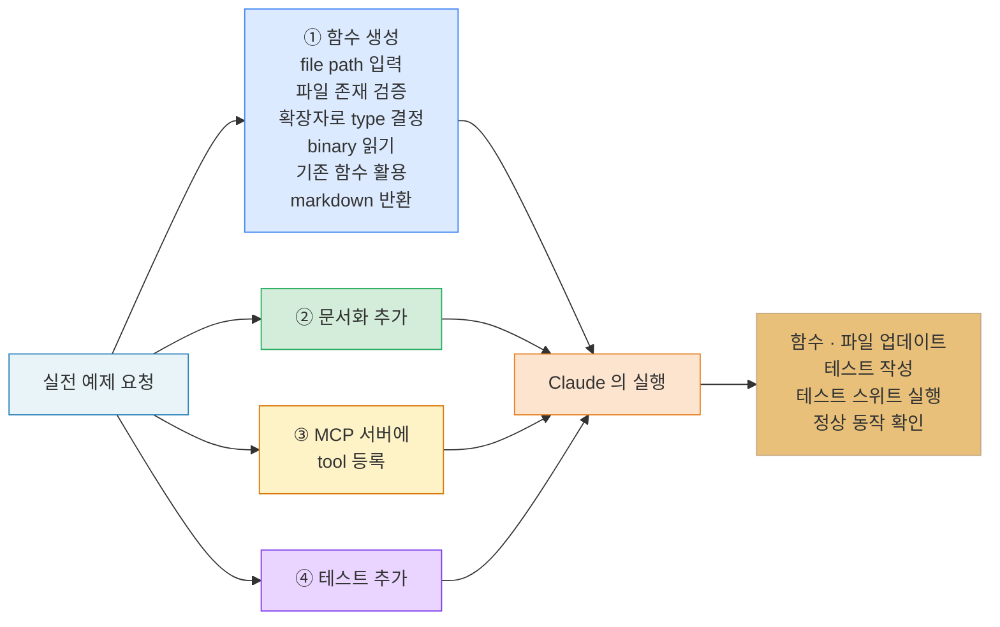

이 예시의 **교훈** 은 계획이 **매우 구체적** 이라는 점이다. "tool 을 추가해줘" 로 끝내지 않고, 함수의 **입력·검증·처리·반환**, 그리고 **부수 작업(문서화·등록·테스트)** 까지 모두 자연어로 정리되어 있다. 이 수준의 계획을 **사람이 쓰기 어렵다고 느낀다면**, Claude 에게 "Plan first" 를 부탁하는 것이 올바른 선택이다.

#### 추가 명령어

Claude Code 는 몇 가지 유용한 명령어들을 포함한다.

- **`/clear`** — **대화 히스토리를 지우고 컨텍스트를 리셋** 한다. 작업 맥락이 바뀌어 이전 대화가 오히려 혼선을 줄 때 사용.
- **`/init`** — **코드베이스를 스캔하고 CLAUDE.md 문서를 생성** 한다. 새 프로젝트 시작 시 가장 먼저 실행.
- **`#`** — **CLAUDE.md 파일에 메모를 추가** 한다. 작업 도중 떠오른 컨벤션·주의사항을 즉시 저장.

Claude 는 또한 **Git 의 staging 과 commit, 테스트 실행, 의존성 관리** 같은 일상적인 개발 작업들을 처리할 수 있다. 에디터와 터미널 사이를 오가는 대신, *"이 변경사항 커밋해줘"* / *"빌드 돌려봐"* 처럼 Claude 에게 맡기고 개발자는 **더 큰 그림에 집중** 할 수 있다.

Claude Code 의 성공 열쇠는 *"이것은 단순한 코드 생성기가 아니라, 협업 파트너로 설계되었음"* 을 기억하는 것이다. 더 많은 컨텍스트와 구조를 제공할수록, Claude 는 프로젝트를 구축·유지 관리하는 데 더 효과적으로 도움을 줄 수 있다.

#### 자주 사용되는 자연어 패턴 5선

| 의도 | 자연어 예문 | Claude Code 의 행동 |
|:---|:---|:---|
| 파일 이해 | *"`utils/parser.py` 의 주요 함수를 설명해줘"* | Read → 요약 |
| 스펙 기반 구현 | *"이 JSON 스키마에 맞는 Pydantic 모델 만들어줘"* | 스키마 분석 → 모델 작성 |
| 버그 진단 | *"테스트 실패 로그 보여줄게, 원인 찾아줘"* | 스택트레이스 분석 → 가설 제시 |
| 리팩토링 | *"이 중복 로직을 하나의 유틸 함수로 합쳐줘"* | Grep → Edit (여러 파일) |
| Git 워크플로 | *"변경 사항 리뷰해서 의미 단위로 커밋 나눠줘"* | diff 분석 → 분할 staging → commit |

#### 명령어 레퍼런스 카드

| 명령 | 역할 | 사용 시점 |
|:---|:---|:---|
| `/init` | 코드베이스 스캔 · CLAUDE.md 자동 생성 | **프로젝트 최초 도입 시** |
| `/clear` | 대화 히스토리 초기화 · 컨텍스트 리셋 | **작업 맥락이 바뀔 때** |
| `#` | CLAUDE.md 에 메모 추가 | **규칙·컨벤션 발견 즉시** |
| (자연어) | 파일 편집 · 테스트 실행 · Git 작업 | **일반 개발 작업 전반** |

> [!method] 실전 권장 세션 구조
> 1. 새 기능 시작 → `/clear` 로 이전 작업 맥락 제거
> 2. 관련 파일 Claude 에게 읽혀 컨텍스트 형성
> 3. *"코드 쓰지 말고 계획만"* 지시 → 계획 검토 → 승인
> 4. *"계획대로 구현"* → Claude 가 편집·테스트 실행
> 5. 작업 중 떠오른 규칙은 `#` 로 CLAUDE.md 에 바로 저장
> 6. 커밋 메시지까지 자연어로 요청 → Git 포함 마무리

> [!tip] TDD 가 Claude 에게 특히 잘 맞는 이유
> 테스트는 Claude 에게 *"무엇이 올바른 결과인가"* 를 **기계적으로 검증 가능한 형태** 로 알려준다. 따라서 Claude 는 테스트 실행 결과를 피드백으로 삼아 **자기 자신을 교정** 할 수 있다 — 사람 개입이 최소화되면서도 품질은 오히려 올라간다. 이것이 W09 에서 배울 **"에이전트 루프"** 의 축소판이기도 하다.

> [!action] 실습 노트북
> 📂 `03-Exercises/Week_08/skilljar/S7_02_claude_code.ipynb` (셋업과 기본 세션)
> 📂 `03-Exercises/Week_08/skilljar/S7_04_practice.ipynb` (Context→Plan→Implement, TDD 실습 템플릿)
> 노트북에서는 실제 Claude Code 세션의 대화 로그를 재현하고, 각 단계의 입력/출력/내부 tool call 이 어떻게 조합되는지 단계별로 추적한다.

> [!ref] 소스: Skilljar L03 — Claude Code in action (287805)

---

### 2.2 MCP 서버로 Claude Code 확장 (L04)

Claude Code 에는 **MCP 클라이언트가 이미 내장(built right into it)** 되어 있다. 이 말은, **MCP 서버를 연결하기만 하면** Claude 가 할 수 있는 일을 **극적으로 확장** 할 수 있다는 뜻이다. 이는 개발 워크플로 커스터마이징에 대해 **매우 강력한 가능성** 을 열어준다.

#### MCP 가 Claude Code 를 어떻게 확장하는가


*MCP 를 통한 Claude Code 능력 확장 --- 내장 도구만으로는 닿지 못하는 외부 시스템까지 컨텍스트를 넓혀준다*


*MCP extends Claude Code — 내장 능력 + 외부 서버의 Tools · Prompts · Resources*

Model Context Protocol(MCP)은 Claude Code 가 **외부 서비스와 도구** 에 연결할 수 있도록 해준다. 이를 **MCP 서버** 를 통해 구현한다. Claude 의 **내장 능력에만 제한** 되지 않고, **특정 도구(Tools) · 리소스(Resources) · 통합(integrations)** 을 제공하는 서버를 연결해서 **커스텀 기능** 을 추가할 수 있다.

각 MCP 서버는 **세 가지 주요 구성 요소** 를 통해 Claude 에게 서로 다른 유형의 기능을 노출할 수 있다.

- **Tools** — 액션을 수행하기 위한 함수(for taking actions)
- **Prompts** — 템플릿 제공(for templates)
- **Resources** — 데이터에 접근(for accessing data)

이 구성은 [[Week_07]] 에서 **FastMCP 로 직접 서버를 만들 때** 본 구조와 정확히 동일하다. W07 이 **서버 측(provider)** 에 초점이 있었다면, W08 은 **클라이언트 측(consumer)** — 즉 *"MCP 서버를 어떻게 소비할 것인가"* 에 초점이 있다.

#### MCP 서버 등록 방법

Claude Code 에 MCP 서버를 추가하는 것은 **간단하다**. 커맨드 라인에서 서버를 등록하면 된다.

```bash
claude mcp add [server-name] [command-to-start-server]
```

예를 들어, `uv run main.py` 로 시작하는 **문서 처리 서버** 가 있다면, 다음과 같이 실행하면 된다.

```bash
claude mcp add documents uv run main.py
```

일단 등록되면, Claude Code 는 **시작할 때 자동으로 서버에 연결** 된다. 매번 수동으로 서버를 켜줄 필요가 없다.

#### 예시 — 문서 처리


*예시 — PDF / Word 문서를 markdown 으로 변환하는 MCP 서버 연결*

실질적인 예시는 **Claude 가 PDF 와 Word 문서를 읽을 수 있게 해주는** tool 을 만드는 것이다. **"document_path_to_markdown"** tool 을 갖춘 MCP 서버를 구축하면, Claude 에게 **문서 내용을 markdown 으로 변환** 해달라고 요청할 수 있다.

`"Convert the tests/fixtures/mcp_docs.docx file to markdown"` 이라고 요청하면, 자동으로 **커스텀 tool 을 사용해** 문서를 읽고 변환된 내용을 반환한다.


*실행 결과 — Claude 가 custom tool 을 호출해 docx → markdown 변환 결과를 반환*

이는 W07 에서 구현한 **FastMCP 서버** 가 Claude Code 안에서 실제로 동작하는 장면이다. `tools/call → result` 의 JSON-RPC 왕복이 `claude mcp add` 한 줄로 **완전히 자동화** 된다.

#### MCP 확장 흐름 Mermaid

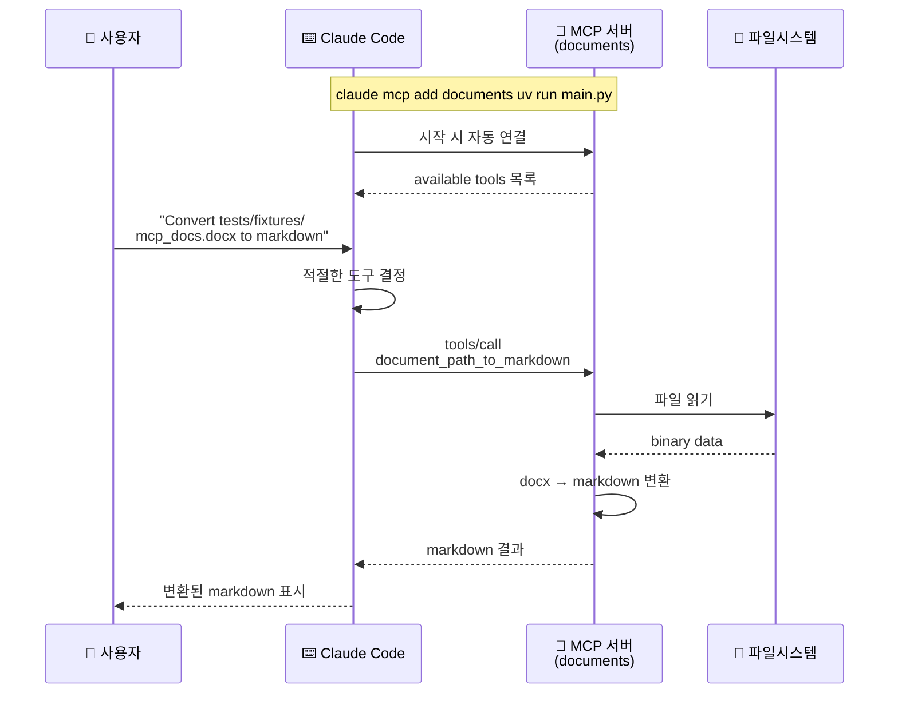

#### 인기 있는 MCP 통합들


*인기 MCP 통합 한눈에 보기 --- 개발 워크플로 전반에 걸쳐 자주 채택되는 서버들의 카탈로그*


*인기 MCP 통합 — sentry-mcp · playwright-mcp · figma-context-mcp · mcp-atlassian · firecrawl-mcp-server · slack-mcp*

MCP 생태계는 **많은 일반 개발 도구와 서비스들** 을 위한 서버를 포함한다.

- **sentry-mcp** — Sentry 에 로깅된 **버그를 자동으로 발견하고 수정**
- **playwright-mcp** — 테스트와 트러블슈팅을 위한 **브라우저 자동화 기능** 을 Claude 에게 제공
- **figma-context-mcp** — **Figma 디자인** 을 Claude 에게 노출
- **mcp-atlassian** — Claude 가 **Confluence 와 Jira** 에 접근할 수 있도록 허용
- **firecrawl-mcp-server** — Claude 에게 **웹 스크래핑 기능** 추가
- **slack-mcp** — Claude 가 **메시지를 게시하거나 특정 스레드에 답장** 할 수 있게 허용

이 목록은 목록에 나온 **그대로의 서버 이름**이다. 각 서버는 보통 **GitHub 리포지토리** 에서 `npx` / `uvx` / Docker 등으로 실행할 수 있으며, 설치 방법은 리포지토리 README 에 상세히 안내되어 있다.

#### 대표 MCP 서버 매트릭스

| 서버 이름 | 주요 도메인 | 핵심 기능 | 실전 활용 시나리오 |
|:---|:---|:---|:---|
| `sentry-mcp` | 에러 모니터링 | Sentry 이슈 조회·상세 분석 | 프로덕션 에러를 Claude 가 진단·수정 |
| `playwright-mcp` | 브라우저 자동화 | 페이지 열기·클릭·스크린샷 | E2E 테스트 생성·UI 버그 재현 |
| `figma-context-mcp` | 디자인 연동 | Figma 파일 구조 / 자산 노출 | 디자인 → 코드 변환 |
| `mcp-atlassian` | 이슈 트래킹 | Jira 이슈 읽기 · Confluence 문서 조회 | 티켓 요구사항을 기반으로 구현 |
| `firecrawl-mcp-server` | 웹 스크래핑 | 웹 페이지 크롤링 · markdown 변환 | 최신 문서 fetch · 경쟁사 분석 |
| `slack-mcp` | 팀 커뮤니케이션 | 메시지 게시 · 스레드 답장 | 작업 완료 시 팀 알림 자동화 |

#### 개발 워크플로 구축 — 여러 MCP 결합

**진짜 힘은** 자신의 **특정 개발 프로세스에 맞는 여러 MCP 서버를 조합** 하는 데서 나온다. 예를 들면 다음과 같이 셋업할 수 있다.

- **Sentry 서버** — 프로덕션 에러 상세 fetch
- **Jira 서버** — 티켓 요구사항 읽기
- **Slack 서버** — 작업이 완료되었을 때 팀에 통보
- **커스텀 서버** — 사내 도구와 API 연동

이렇게 하면 Claude 가 **이미 사용 중인 모든 도구와 서비스 와 매끄럽게 작업** 할 수 있는 **개발 환경** 이 만들어진다. 자신의 워크플로에 **맞춤화된, 훨씬 더 강력한 코딩 어시스턴트** 가 되는 것이다.

#### 결합 예시 — "에러 → 재현 → 수정 → 통보" 파이프라인


이 한 줄 흐름 — *"에러 감지 → 티켓 확인 → 브라우저 재현 → 코드 수정 → 알림"* — 은 원래 개발자가 **여러 앱을 수동으로 옮겨 다니며 하던 작업** 이다. MCP 서버 몇 개를 Claude Code 에 등록해 두면, 자연어 한 문장 *"최근 3개 Sentry 에러를 Jira 와 대조해 수정해줘"* 로 이 전체가 자동 실행된다.

#### 여러 MCP 서버를 묶는 구성 예시

현실에서 자주 보이는 조합을 몇 가지 더 살펴보자.

**케이스 A — "요구사항 → 구현 → 배포" 풀스택 파이프라인**

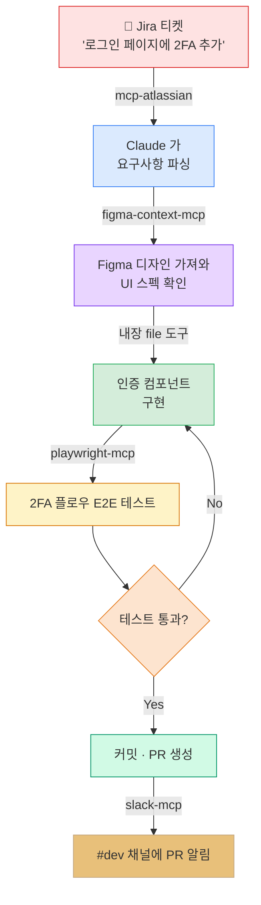

**케이스 B — "문서 수집 → 요약 → 지식 베이스 업데이트" 리서치 파이프라인**

```mermaid
graph LR
    Q["🔍 주제 질문<br/>'LLM alignment 최신 동향'"] -->|"firecrawl-mcp-server"| F["웹 최신 블로그·<br/>논문 PDF fetch"]
    F --> S["Claude 가<br/>요약 + 핵심 비교"]
    S -->|"내장 file 도구"| W["notes/<br/>llm-alignment.md 작성"]
    W -->|"mcp-atlassian"| C["Confluence<br/>Knowledge Base 업데이트"]
    C -->|"slack-mcp"| T["연구팀 채널<br/>신규 노트 공지"]

    style Q fill:#dbeafe,stroke:#3b82f6
    style F fill:#fde4cf,stroke:#e67e22
    style S fill:#d4edda,stroke:#27ae60
    style W fill:#fef3c7,stroke:#d97706
    style C fill:#e9d5ff,stroke:#7c3aed
    style T fill:#e8c07a,stroke:#c4a882,color:#333
```

**케이스 C — "논문 검색 → 메타정보 정리 → Zotero 등록" 서지관리 파이프라인**

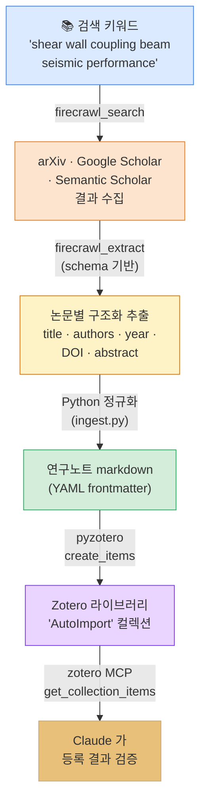

연구실에서 가장 흔한 반복 작업 — *"논문 수십 편 찾기 → 메타정보 손으로 옮겨 적기 → Zotero 에 한 편씩 등록"* — 을 자연어 한 문장 *"shear wall coupling beam 최근 5년 논문 20편 Zotero 에 정리해줘"* 로 압축한다. **firecrawl-mcp**(웹 수집) · **Python + pyzotero**(정규화·기록) · **zotero-mcp**(검증) 세 컴포넌트가 직렬로 묶이며, 사람이 손대지 않아도 Zotero 컬렉션이 채워진다.

##### 케이스 C 시현 — 단계별 사용법

###### 환경 준비 — 처음 설정하는 학생을 위한 단계별 가이드 (Mac / Windows)

> [!finding] 핵심 컨셉 — **"공개된 MCP 서버를 가져와 등록만 한다"**
> 학생은 MCP 서버를 직접 코딩할 필요가 **전혀 없다**. 이번 시연에서 쓰는 두 서버 — `firecrawl-mcp`(npm)·`zotero-mcp`(PyPI) — 는 이미 **오픈소스 완성품** 으로 공개돼 있다. `claude mcp add` 명령 한 줄이 이 완성품을 자동으로 가져와 Claude Code 와 연결한다. 즉 이번 셋업은 *"무엇을 다운로드하느냐"* 가 아니라 *"어떤 별명으로 등록하느냐"* 의 문제다.

**구성 요소 한눈에 보기**

| 컴포넌트         | 배포 위치       | Claude Code 가 부르는 방식         | 설치 명령 |
|------------------|----------------|------------------------------------|-----------|
| Firecrawl MCP    | npm (`firecrawl-mcp`)    | `npx -y firecrawl-mcp` (자동 fetch) | 별도 설치 없음, `npx` 가 알아서 |
| Zotero MCP       | PyPI (`zotero-mcp`)      | `uvx zotero-mcp` (자동 fetch)       | 별도 설치 없음, `uvx` 가 알아서 |
| pyzotero (쓰기)  | PyPI (`pyzotero`)        | Python 스크립트가 직접 import       | `pip install pyzotero` |

> [!tip] 다른 MCP 서버는 어디서 찾는가?
> - 공식 레퍼런스 모음: <https://github.com/modelcontextprotocol/servers>
> - 커뮤니티 레지스트리: <https://glama.ai/mcp/servers> · <https://smithery.ai/>
> 새 서버를 쓰고 싶으면 README 의 `claude mcp add` 한 줄만 그대로 복사하면 끝.

**0단계 — 점검 체크리스트 (수업 시작 전 5분 안에)**

- [ ] Node.js 18+ 설치 → `node --version`
- [ ] Python 3.11+ 와 `uv` 설치 → `uv --version`
- [ ] Claude Code CLI 설치 + 로그인 → `claude --version`
- [ ] Zotero 7+ 데스크탑 앱 실행 중
- [ ] Firecrawl 무료 계정 + API key 확보

**1단계 — Node.js · Python·uv 설치**

> [!tip]- 🍎 macOS — Homebrew 사용 (권장)
>
> ```bash
> # Homebrew 미설치인 경우 먼저
> /bin/bash -c "$(curl -fsSL https://raw.githubusercontent.com/Homebrew/install/HEAD/install.sh)"
>
> brew install node          # Node.js + npm + npx
> brew install uv            # Python 패키지 러너 (uvx 포함)
>
> node --version             # v20.x 이상
> uv --version               # uv 0.x
> ```
>
> Homebrew 가 막혀 있으면 Node 공식 설치파일(<https://nodejs.org/>)로 .pkg 다운로드 후 더블클릭.

> [!tip]- 🪟 Windows — winget 사용 (Windows 10/11 기본 내장)
>
> 관리자 권한 PowerShell:
>
> ```powershell
> winget install OpenJS.NodeJS.LTS    # Node.js 20 LTS
> winget install astral-sh.uv         # uv (Python 러너)
>
> # 새 PowerShell 창을 열고 확인
> node --version
> uv --version
> ```
>
> winget 이 막혀 있다면:
> - Node.js: <https://nodejs.org/> 에서 `.msi` 다운로드 → 설치 마법사 (Next 만 누르면 됨)
> - uv: PowerShell 에 `powershell -ExecutionPolicy ByPass -c "irm https://astral.sh/uv/install.ps1 | iex"`

**2단계 — Claude Code CLI 설치 + 로그인** (Mac / Windows 공통)

```bash
npm install -g @anthropic-ai/claude-code
claude login                           # 브라우저로 Anthropic 계정 로그인
claude --version                       # 설치 확인
```

W01 부터 설치돼 있어야 정상. 없다면 위 한 줄로 끝.

**3단계 — Zotero 데스크탑 설치 + Local API 활성화** (Mac / Windows 공통)

1. <https://www.zotero.org/download/> 에서 OS 에 맞는 설치파일 다운로드 (Mac `.dmg` · Windows `.exe`).
2. Zotero 실행 → 메뉴 **Edit / 편집 → Settings / 설정 → Advanced / 고급** 탭.
3. *"Allow other applications on this computer to communicate with Zotero"* (한국어 UI: *"다른 응용 프로그램이 Zotero 와 통신하도록 허용"*) **체크**.
4. Zotero 를 **계속 실행 상태로 둔다** — 닫으면 MCP 통신도 끊긴다.
5. (선택) Better BibTeX 플러그인을 깔아두면 citation key 자동 생성·인용 export 가 편해진다.

이 옵션이 켜져 있어야 `ZOTERO_LOCAL=true` 모드의 zotero-mcp 가 `http://localhost:23119` 의 로컬 API 로 통신한다. **클라우드 API key 발급 없이도 동작** 한다는 점이 이 모드의 핵심.

**4단계 — Firecrawl 무료 계정 + API key 발급**

1. <https://www.firecrawl.dev/> 접속 → *Sign up* (GitHub 또는 이메일 한 줄).
2. 대시보드 좌측 **API Keys** → *Create Key* → 발급된 `fc-xxxxxxxx...` 토큰 복사.
3. 무료 플랜은 **월 500회 scrape · search** 분량 — 강의 시연·과제에 충분.
4. 토큰을 환경변수로 보관해 두면 다음 단계 명령이 깔끔해진다.

> [!tip]- 🍎 macOS / Linux — 환경변수 저장 (zsh · bash)
>
> ```bash
> echo 'export FIRECRAWL_API_KEY="fc-xxxxxxxx..."' >> ~/.zshrc
> source ~/.zshrc
> echo $FIRECRAWL_API_KEY        # 확인
> ```

> [!tip]- 🪟 Windows PowerShell — 사용자 환경변수 영구 등록
>
> ```powershell
> [System.Environment]::SetEnvironmentVariable(
>     "FIRECRAWL_API_KEY","fc-xxxxxxxx...","User")
> # 새 PowerShell 창을 열어 적용
> $env:FIRECRAWL_API_KEY        # 확인
> ```

**5단계 — Claude Code 에 MCP 서버 두 개 등록** (핵심 단계)

명령 형식:

```
claude mcp add  <별명>  <러너>  --  <패키지 옵션...>
                 │       │            │
                 │       │            └─ 그 서버 자체에 전달되는 인자 (예: -y 패키지명, -e KEY=VAL)
                 │       └─ 어떻게 실행할지 (npx, uvx, python, docker 등)
                 └─ Claude 가 호출할 때 쓰는 별명
```

> [!tip]- 🍎 macOS / Linux — bash · zsh
>
> ```bash
> # ① Firecrawl MCP — npm 의 firecrawl-mcp 를 npx 가 자동 다운로드
> claude mcp add firecrawl npx -- -y firecrawl-mcp \
>   -e FIRECRAWL_API_KEY=$FIRECRAWL_API_KEY
>
> # ② Zotero MCP — PyPI 의 zotero-mcp 를 uvx 가 자동 다운로드
> claude mcp add zotero uvx -- zotero-mcp \
>   -e ZOTERO_LOCAL=true
> ```

> [!tip]- 🪟 Windows — PowerShell (백틱 `` ` `` 가 줄 잇기 기호)
>
> ```powershell
> claude mcp add firecrawl npx -- -y firecrawl-mcp `
>   -e FIRECRAWL_API_KEY=$env:FIRECRAWL_API_KEY
>
> claude mcp add zotero uvx -- zotero-mcp `
>   -e ZOTERO_LOCAL=true
> ```

한 번 성공하면 Claude Code 설정파일(`~/.claude/.../config.json`)에 기록되어, 이후 `claude` 실행 시 **자동으로 기동·연결** 된다. 학생이 매번 다운받을 필요 없다.

**6단계 — Python 라이브러리 설치 (Zotero 쓰기용)**

```bash
pip install pyzotero          # Mac · Windows · Linux 공통
# 또는 uv 환경이라면
uv pip install pyzotero
```

**7단계 — 연결 검증**

```bash
claude mcp list
# 기대 출력:
# firecrawl  ✓ connected   (npx -y firecrawl-mcp)
# zotero     ✓ connected   (uvx zotero-mcp)
```

Claude Code 세션을 열고 자연어로 한 번 더 확인:

```
"firecrawl 서버와 zotero 서버의 tool 목록을 함께 보여줘."
```

Claude 가 각 서버의 `tools/list` 를 호출해 `firecrawl_search`, `firecrawl_extract`, `zotero_get_collections`, `zotero_get_collection_items` 등이 나열되면 셋업 끝.

> [!action] 학생이 가장 자주 막히는 3가지 (시연 중 대비)
> - **`npx` 가 느리거나 실패** → 학교·기숙사 방화벽이 npm registry 를 막은 경우. 핫스팟으로 시도하거나 `npm config set registry https://registry.npmmirror.com` 미러 설정.
> - **Zotero MCP `connection refused`** → Zotero 앱이 닫혀 있거나 3단계의 *"Allow other applications"* 가 꺼져 있음. 가장 흔한 원인.
> - **`claude mcp add` 후에도 tool 이 안 보임** → 등록 후 **Claude Code 세션을 한 번 재시작** 해야 적용. `exit` 입력 후 다시 `claude`.

**Step 1 — Firecrawl 로 논문 검색·메타정보 추출**

Claude Code 세션에서 자연어 한 문장으로 지시한다.

```
"firecrawl 로 arxiv.org 와 scholar.google.com 에서
'shear wall coupling beam seismic performance' 키워드,
2020년 이후 논문 20편을 검색해. 각 결과에서
title · authors(list) · year · doi · abstract 를 JSON 스키마로
구조화 추출하고 ~/research_collect/raw.json 으로 저장해줘."
```

Claude 가 내부적으로 호출하는 tool call 두 단계 (학생에게는 보이지 않음):

```python
# 1) 후보 URL 검색
firecrawl_search(
    query="shear wall coupling beam seismic performance after:2020",
    sources=[{"type": "web", "site": "arxiv.org"},
             {"type": "web", "site": "scholar.google.com"}],
    limit=20,
)

# 2) 각 URL 에서 메타정보 스키마 추출
firecrawl_extract(
    urls=[...20개...],
    prompt="Extract paper metadata fields.",
    schema={
        "type": "object",
        "properties": {
            "title":    {"type": "string"},
            "authors":  {"type": "array", "items": {"type": "string"}},
            "year":     {"type": "integer"},
            "doi":      {"type": "string"},
            "abstract": {"type": "string"},
        },
        "required": ["title", "authors", "year"],
    },
)
```

> [!tip] 검색 노이즈 줄이기
> arXiv 의 `cat:cs.LG`, Google Scholar 의 `site:journals.elsevier.com` 같은 도메인·카테고리 필터를 같이 주면 결과 품질이 크게 좋아진다. *"Semantic Scholar 도 같이 검색해줘"* 처럼 소스 추가도 한 줄로 가능.

**Step 2 — Python 으로 정규화 + Markdown 생성 + Zotero 일괄 등록**

`raw.json` 은 사이트마다 누락 필드·형식이 섞여 있다. **결정적 로직은 Python 으로 처리** 하고, 동시에 Zotero 에 입력한다.

```python
# ~/research_collect/ingest.py
import json, re, unicodedata
from pathlib import Path
from datetime import date
from pyzotero import zotero

RAW = Path("~/research_collect/raw.json").expanduser()
OUT = Path("~/research_collect/papers").expanduser()
OUT.mkdir(parents=True, exist_ok=True)

# --- 1. Zotero 연결 (로컬 모드 · API key 불필요) ---
zot = zotero.Zotero(library_id=0, library_type="user", local=True)

# 'AutoImport' 컬렉션 확보 (없으면 생성)
existing = {c["data"]["name"]: c["key"] for c in zot.collections()}
if "AutoImport" in existing:
    target_key = existing["AutoImport"]
else:
    resp = zot.create_collections([{"name": "AutoImport"}])
    target_key = resp["successful"]["0"]["key"]

# --- 2. BibTeX 키 생성 (lastname + year + firstword) ---
def bib_key(authors, year, title):
    last  = unicodedata.normalize("NFKD", authors[0].split()[-1])\
                       .encode("ascii", "ignore").decode().lower()
    first = re.sub(r"[^a-zA-Z]", "", title.split()[0]).lower()
    return f"{last}{year}{first}"

# --- 3. raw.json 순회 → markdown + Zotero item 페이로드 ---
papers = json.loads(RAW.read_text(encoding="utf-8"))
zot_items = []

for p in papers:
    p["authors"]  = p["authors"] if isinstance(p["authors"], list) else [p["authors"]]
    p.setdefault("doi", "")
    p.setdefault("abstract", "")
    p["key"] = bib_key(p["authors"], p["year"], p["title"])

    # (a) 메타정보 markdown 노트 — YAML frontmatter + 본문
    md = f"""---
title: "{p['title']}"
authors: {p['authors']}
year: {p['year']}
doi: "{p['doi']}"
bibkey: {p['key']}
tags: [paper/auto-import, year/{p['year']}]
imported: {date.today().isoformat()}
---

## Abstract
{p['abstract']}

## Notes
- [ ] 본문 읽기
- [ ] 인용 가능 구문 추출
- [ ] 본 연구와의 관계 메모
"""
    (OUT / f"{p['key']}.md").write_text(md, encoding="utf-8")

    # (b) Zotero item template 채우기
    t = zot.item_template("journalArticle")
    t["title"]        = p["title"]
    t["creators"]     = [{"creatorType": "author",
                          "firstName": " ".join(n.split()[:-1]),
                          "lastName":  n.split()[-1]}
                         for n in p["authors"]]
    t["date"]         = str(p["year"])
    t["DOI"]          = p["doi"]
    t["abstractNote"] = p["abstract"]
    t["tags"]         = [{"tag": "auto-import"},
                         {"tag": f"year/{p['year']}"}]
    t["collections"]  = [target_key]
    zot_items.append(t)

# --- 4. 30개 단위 배치 등록 (Zotero API 한 번에 최대 50) ---
for chunk in (zot_items[i:i+30] for i in range(0, len(zot_items), 30)):
    resp = zot.create_items(chunk)
    print(f"  배치: 성공 {len(resp['successful'])}건 · 실패 {len(resp['failed'])}건")

print(f"✅ markdown {len(papers)}편 → {OUT}")
print(f"✅ Zotero 'AutoImport' 컬렉션에 {len(zot_items)}편 등록 완료")
```

Claude 에게 *"위 스크립트 실행해줘"* 라고 하면 `Bash` 도구로 `python ingest.py` 가 실행되어, 한 번에:

1. `papers/<bibkey>.md` 가 논문 한 편당 하나씩 생성 (YAML frontmatter 포함 — 추후 어떤 노트 도구로도 가져오기 가능)
2. Zotero **AutoImport** 컬렉션이 자동으로 채워짐 (Zotero 앱에서 즉시 확인 가능)

> [!finding] 왜 MCP 가 아니라 pyzotero 를 쓰는가?
> `zotero-mcp` 서버는 현재 **조회 위주(search · get · annotation)** 도구를 주로 제공한다. **신규 아이템 일괄 생성** 처럼 결정적·트랜잭션성 작업은 Python 라이브러리(`pyzotero`)가 더 안정적이다. MCP 는 *"자연어 인터페이스가 가치 있는 지점"* — 검색·검증·요약 — 에 쓰고, 결정적 쓰기는 Python 으로. **MCP × Python 역할 분리** 가 안정적인 파이프라인의 핵심이다.

**Step 3 — Zotero MCP 로 등록 결과 검증**

학생에게 보여줄 마지막 단계. *Zotero 앱을 직접 열지 않고도* Claude 가 검증한다.

```
"방금 등록한 'AutoImport' 컬렉션의 아이템 수와
최근 추가된 5건의 제목·저자·연도를 표로 보여줘."
```

Claude 가 자동 호출하는 zotero MCP tool:

```python
zotero_get_collections()
# → 'AutoImport' 컬렉션의 key 확인

zotero_get_collection_items(
    collection_key="<AutoImport key>",
    limit=5,
    sort="dateAdded",
    direction="desc",
)
```

응답은 *"AutoImport 컬렉션 총 20편 등록. 최근 5건: ① Zhang et al. (2024) … ② Park et al. (2023) …"* 형태의 표로 정리되어 출력된다. **Zotero 데스크탑 앱을 새로고침** 하면 동일한 컬렉션이 그대로 보이는 것을 함께 확인하면 시연 끝.

> [!action] 강의실에서 시연할 한 줄 명령 (요약)
> 1. **수집**: *"firecrawl 로 'shear wall coupling beam' 2020+ 논문 20편을 raw.json 으로 저장"*
> 2. **변환·등록**: *"ingest.py 실행해서 papers/ markdown 생성하고 Zotero AutoImport 컬렉션에 일괄 등록"*
> 3. **검증**: *"AutoImport 컬렉션 최근 5건 보여줘"*

##### 케이스 C 가 보여주는 "MCP × Python × MCP" 합성 패턴

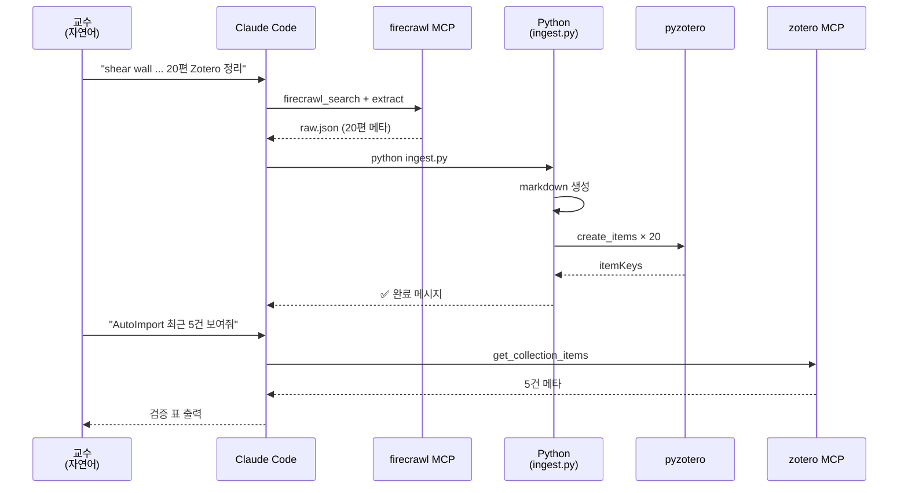

A · B 케이스가 *"수집 → 가공 → 통보"* 의 **순수 선형** 흐름이었다면, C 는 **MCP(자연어 인터페이스) ↔ Python(결정적 로직)** 을 **번갈아 사용** 한다. 이는 W07 의 원칙 — *"MCP 는 모든 것을 직접 하지 않는다, 외부와의 접점만 책임진다"* — 을 실제 연구 워크플로에서 확인하는 사례다.

> [!tip] 시연 후 학생 과제로 확장하기
> - 검색 키워드를 학생 본인의 연구 주제로 바꿔보기 (예: *"reinforced concrete shear wall under cyclic loading"*).
> - `ingest.py` 의 frontmatter 에 `keywords` · `journal` · `url` 필드 추가하기.
> - Zotero 컬렉션을 *주제별* 로 나누고 `--collection` 인자를 받게 리팩터하기.
> - `pyzotero.attachments_simple()` 로 PDF 첨부도 자동화해 보기.

세 케이스 모두 공통으로 보여주는 교훈은 — **MCP 서버가 많아질수록 Claude Code 는 "개발 환경 위의 OS" 처럼 동작** 한다는 점이다. 각 서버는 **하나의 동사(verb)** 처럼 작동하고, Claude 는 자연어 문장의 의도를 해석해 **이 동사들을 적절한 순서로 조합** 한다.

#### MCP 서버 등록 후 동작 확인

서버를 붙이고 나면 다음 한 줄로 상태를 확인할 수 있다.

```bash
claude mcp list
```

현재 등록된 서버 이름과 기동 명령이 나열된다. 특정 서버의 **tool 목록** 을 보려면 `claude` 세션에 들어가 *"documents 서버의 tool 목록 보여줘"* 정도를 자연어로 요청하면 된다 — Claude 가 `tools/list` 를 호출해 결과를 보여준다.

#### 서버 수명주기와 Claude Code 의 관계

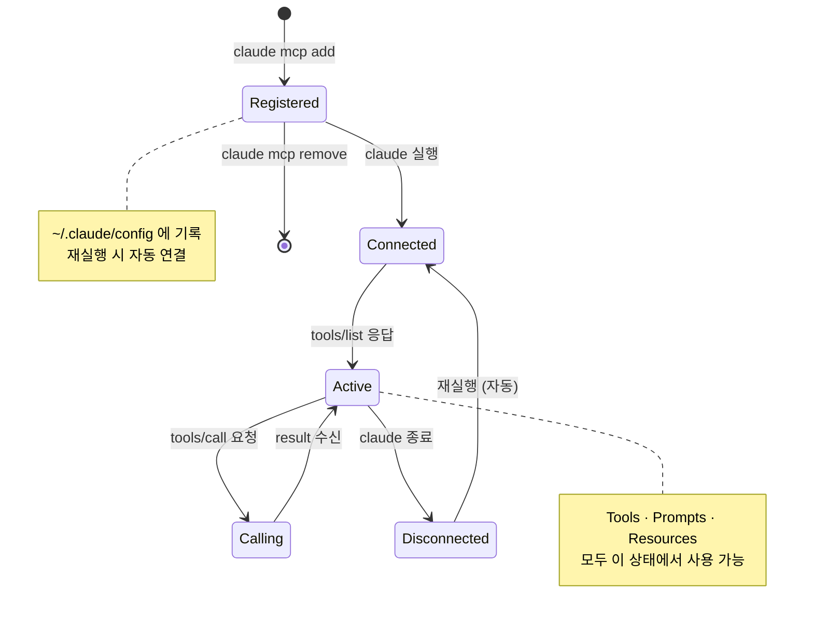

MCP 서버는 Claude Code 시작 시점에 **자동으로 기동·연결** 되며, 세션이 끝나면 깔끔하게 종료된다. 사용자는 서버 프로세스를 **수동으로 관리할 필요가 없다** — 이것이 `claude mcp add` 의 "한 번 등록하면 끝" 철학이다.

#### MCP 구성 요소 심화 — Tools / Prompts / Resources

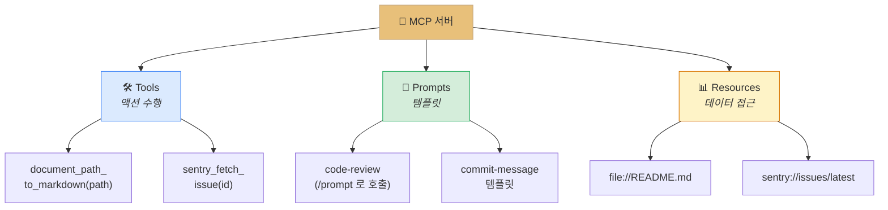

W07 의 **FastMCP 코드** 를 떠올려 보자. `@mcp.tool()`, `@mcp.prompt()`, `@mcp.resource()` 의 세 가지 데코레이터는 정확히 이 세 가지 구성 요소에 대응된다. 즉 *"Claude Code 가 외부 서버의 tool 을 호출한다"* 는 말은 **우리가 W07 에서 작성한 `@mcp.tool()` 함수가 Claude 의 tool_use 블록에 등장한다** 는 뜻이다.

> [!finding] MCP = "개발 환경을 위한 USB-C"
> USB-C 가 **모든 기기·모든 케이블·모든 포트를 표준화** 했듯이, MCP 는 **모든 AI 클라이언트·모든 외부 서비스** 를 표준 프로토콜로 묶는다. Claude Code, Claude Desktop, 그리고 사용자가 만들 에이전트 모두 같은 MCP 서버를 재사용할 수 있다 — **한 번 만든 서버가 모든 AI 앱에서 쓰이는 이식성** 이 MCP 의 본질적 가치다.

> [!tip] 처음 MCP 서버를 붙여볼 때의 추천 순서
> 1. **`firecrawl-mcp-server`** — 웹 스크래핑. 결과가 텍스트로 바로 보여 *"잘 동작한다"* 를 체감하기 쉬움.
> 2. **`playwright-mcp`** — 브라우저 자동화. 화면 캡처까지 되어 시각적 피드백이 강력.
> 3. **커스텀 서버** — W07 에서 만든 자신의 서버를 `claude mcp add` 로 등록 → *"내가 만든 서버가 Claude Code 와 동작한다"* 는 성취감.

> [!method] `claude mcp` 서브커맨드 레퍼런스
> - `claude mcp add [name] [cmd]` — 서버 등록
> - `claude mcp list` — 현재 등록된 서버 목록
> - `claude mcp remove [name]` — 서버 제거
> - `claude mcp test [name]` — 서버 핸드셰이크 테스트 (공식 문서 참고)

> [!action] 실습 노트북
> 📂 `03-Exercises/Week_08/skilljar/S7_03_mcp_extensions.ipynb`
> 노트북에서는 (1) `claude mcp add` 의 내부 동작(설정 파일 변경)을 시뮬레이션하고, (2) Tools / Prompts / Resources 세 구성 요소의 JSON-RPC 메시지 차이를 비교하며, (3) W07 에서 만든 FastMCP 서버를 Claude Code 에 붙이는 연습을 한다.

> [!ref] 소스: Skilljar L04 — Enhancements with MCP servers (287792)

---

### 2.3 도메인 응용 — 구조공학 CC 워크플로 (보충)

> [!tip] **보충 내용** — 본 절은 Skilljar 레슨 외의 도메인 응용이다. 건축공학·구조공학 연구실에서 Claude Code 를 어떻게 실전 도구로 쓸 수 있는지에 대한 가이드이며, 노트북 `S7_05_structural_cc.ipynb` 와 연동된다.

#### 문제 정의 — 구조 엔지니어의 반복 작업

구조공학 연구실과 설계 사무소에서 반복적으로 일어나는 작업들:

- **KDS 14 30 25 조문 조회** — 설계기준(강구조) 수많은 조항에서 필요한 식·계수를 찾기
- **Midas 입력 파일 파싱** — `.mgt` / `.mct` 텍스트 파일에서 부재·하중·결과 추출
- **ETABS / SAP2000 결과 정리** — CSV 로 export 된 해석 결과를 그래프·표로 변환
- **설계 검토 보고서 작성** — 여러 해석 결과를 비교해 LaTeX / Word 보고서로 정리
- **IFC 모델 점검** — BIM 파일에서 특정 부재·연결부의 속성 추출

각 작업은 **짧고 반복적** 이지만, 엔지니어의 시간을 **누적적으로** 잡아먹는다. Claude Code + 커스텀 MCP 서버 조합이 이 틈새에 정확히 들어맞는다.

#### 구조공학 Claude Code 아키텍처

```mermaid
graph TD
    EN["👷 구조 엔지니어"] --> CC["⌨️ Claude Code"]
    CC --> CM["📄 CLAUDE.md<br/>KDS 약어 사전<br/>단위계 규칙<br/>검토 템플릿"]
    CC --> M1["🔌 midas-mcp<br/>(자작)<br/>.mgt 파싱"]
    CC --> M2["🔌 ifc-mcp<br/>(자작)<br/>BIM 조회"]
    CC --> M3["🔌 kds-rag-mcp<br/>(자작)<br/>설계기준 RAG"]
    CC --> M4["🔌 firecrawl-mcp-server<br/>최신 AISC·EC 기준"]

    M1 --> OUT["📊 해석 결과 요약"]
    M2 --> OUT
    M3 --> OUT
    M4 --> OUT

    style CC fill:#e8c07a,stroke:#c4a882,color:#333
    style CM fill:#f3e5f5,stroke:#9c27b0
    style M1 fill:#dbeafe,stroke:#3b82f6
    style M2 fill:#d4edda,stroke:#27ae60
    style M3 fill:#fef3c7,stroke:#d97706
    style M4 fill:#fde4cf,stroke:#e67e22
    style OUT fill:#d1fae5,stroke:#059669
```

핵심은 두 가지다.

1. **CLAUDE.md 에 도메인 지식 내장** — *"모든 길이는 mm, 힘은 kN 단위로 다룬다"*, *"한국 설계기준은 KDS, 미국은 AISC, 유럽은 EC3 로 약칭한다"*, *"설계 검토 보고서 템플릿은 `templates/design-check.md`"* 같은 규칙을 프로젝트 스코프로 저장
2. **도메인 MCP 서버를 직접 작성** — W07 에서 익힌 FastMCP 로 `midas-mcp`, `ifc-mcp`, `kds-rag-mcp` 같은 사내 전용 서버를 만들고 `claude mcp add` 로 등록

#### 도메인 MCP 서버 후보 매트릭스

| 서버 이름(가칭) | 노출하는 Tool 예시 | 입력 | 출력 | 활용 시나리오 |
|:---|:---|:---|:---|:---|
| `midas-mgt-mcp` | `parse_mgt(path)`, `extract_reactions(node_id)` | `.mgt` 파일 경로 | 부재·하중·반력 dict | 해석 결과 요약 |
| `ifc-mcp` | `list_walls(ifc_path)`, `get_element(guid)` | IFC 파일 + GUID | 부재 기하·속성 | BIM 모델 검토 |
| `kds-rag-mcp` | `search_clause(query)`, `get_clause(id)` | 자연어 질문 또는 조항 ID | 관련 조문 텍스트 + 출처 | 설계기준 조회 |
| `rebar-calc-mcp` | `calc_development_length(bar, fc)` | 철근 규격·콘크리트 강도 | 이음·정착 길이 | 배근 검토 자동화 |
| `report-latex-mcp` | `render_check_report(data)` | 해석 결과 JSON | LaTeX / PDF | 검토 보고서 양산 |

각 서버는 **W07 에서 배운 FastMCP 패턴** 으로 독립 파이썬 프로젝트로 만들고, `claude mcp add` 로 등록하면 된다. 연구실 단위 코드베이스가 쌓이면 이 목록은 *"우리 연구실의 도메인 SDK"* 가 된다.

#### 예시 CLAUDE.md (구조해석 프로젝트)

```markdown
# 구조 해석 프로젝트 — CLAUDE.md

## 프로젝트 개요
- 대상: 10층 철골조 구조물 리모델링
- 코드: KDS 14 30 25 (강구조 한계상태설계법)
- 단위: 길이 mm · 힘 kN · 응력 MPa

## 해석 도구
- Midas Gen 2024 — 입력 파일: .mgt
- 결과 파일: output/*.csv

## 코딩 가이드라인
- Python 3.11+, 타입 힌트 필수
- 단위 변환: `from utils.units import kN_to_N`
- 커밋 메시지: Conventional Commits

## 자주 쓰는 명령
- `python scripts/parse_mgt.py` — 입력 파일 파싱
- `pytest tests/test_parse.py` — 파싱 테스트
```

이 CLAUDE.md 가 있으면, *"Midas 결과 파일에서 1층 주각부 반력만 뽑아서 그래프로 그려줘"* 같은 요청에 Claude 가 **자동으로** 단위·경로·테스트 컨벤션을 준수한다.

#### 구조해석 TDD 예시

```mermaid
graph LR
    T1["① Context<br/>utils/units.py<br/>scripts/parse_mgt.py<br/>읽기"] --> T2["② 테스트 브레인스토밍<br/>정상 .mgt 파싱<br/>손상 파일 에러<br/>단위 변환<br/>경계조건 처리"]
    T2 --> T3["③ 테스트 작성<br/>tests/test_parse.py"]
    T3 --> T4["④ parser 구현<br/>모든 테스트 통과"]

    style T1 fill:#dbeafe,stroke:#3b82f6
    style T2 fill:#fef3c7,stroke:#d97706
    style T3 fill:#fde4cf,stroke:#e67e22
    style T4 fill:#d4edda,stroke:#27ae60
```

> [!method] 연구실 도입 권장 순서
> 1. **1주차** — Claude Code 설치 + 개인 프로젝트에서 `/init` 실행 → CLAUDE.md 체험
> 2. **2주차** — 연구실 공통 CLAUDE.md 작성 (단위·명명 규칙·보고서 템플릿)
> 3. **3주차** — 기존 Python 스크립트 재구성 → Claude Code + TDD 로 테스트 보강
> 4. **4주차** — W07 지식을 활용해 `midas-mcp` 같은 간단한 커스텀 MCP 서버 제작
> 5. **5주차** — `firecrawl-mcp-server` 추가 → 최신 설계기준·논문 자동 수집

#### 구조공학 도메인 워크플로 완결 다이어그램

```mermaid
graph TD
    PM["📄 프로젝트 메모리<br/>CLAUDE.md<br/>(KDS 약어·단위계·템플릿)"] --> CC["⌨️ Claude Code 세션"]
    CC -->|"Context"| READ["기존 해석 스크립트<br/>읽기"]
    CC -->|"Plan"| PLAN["단위 변환·<br/>결과 추출 알고리즘 설계"]
    CC -->|"Implement"| IMP["parser · report_gen<br/>구현"]

    IMP -->|"midas-mgt-mcp"| M1[".mgt 파일 파싱"]
    IMP -->|"kds-rag-mcp"| M2["설계기준 조문 인용"]
    IMP -->|"report-latex-mcp"| M3["LaTeX 보고서 렌더"]

    M1 --> OUT["📊 설계 검토 보고서<br/>PDF"]
    M2 --> OUT
    M3 --> OUT

    OUT -->|"slack-mcp"| NOTIFY["프로젝트 채널<br/>결과 공유"]

    style PM fill:#f3e5f5,stroke:#9c27b0
    style CC fill:#e8c07a,stroke:#c4a882,color:#333
    style PLAN fill:#fef3c7,stroke:#d97706
    style IMP fill:#d4edda,stroke:#27ae60
    style M1 fill:#dbeafe,stroke:#3b82f6
    style M2 fill:#dbeafe,stroke:#3b82f6
    style M3 fill:#dbeafe,stroke:#3b82f6
    style OUT fill:#fde4cf,stroke:#e67e22
    style NOTIFY fill:#d1fae5,stroke:#059669
```

> [!action] 실습 노트북
> 📂 `03-Exercises/Week_08/skilljar/S7_05_structural_cc.ipynb`
> 구조공학 도메인에 Claude Code 를 적용하는 전체 시나리오 — CLAUDE.md 작성, 커스텀 MCP 서버 스켈레톤, KDS 기반 설계 검토 TDD 예제 — 를 단계별로 실습한다.

> [!ref] 보충 — 도메인 응용 참고
> - W07 Week_07.md — FastMCP 로 MCP 서버를 만드는 법
> - W05 S4_07_structural_rag.ipynb — KDS RAG 파이프라인
> - W10 Week_10.md — BIM(IFC) + MCP 심화 (예정)

---

## [Chapter 3] Self-assessment & Summary

### 3.1 개념 확인 퀴즈 — W08 전체 (Q1-Q10)

> [!question] Q1. Skilljar L01 에서 제시된 **"Our Plan"** 의 학습 순서로 올바른 것은?
> A) Agents → Computer Use → Claude Code
> B) Computer Use → Claude Code → Agents
> C) Claude Code → Computer Use → Agents
> D) Claude Code → Agents → Computer Use
>
> > [!tip]- 정답 보기
> > **정답: C)** 가장 구체적이고 손에 잡히는 **Claude Code** 로 시작해 **Computer Use** 로 범위를 확장한 뒤, 두 제품에서 공통으로 드러나는 **Agents 의 원리** 로 추상화한다. *"Start with this agentic coding assistant… Explore this set of tools… Understand what makes these applications successful as agents"* 라는 문구 그대로다. 에이전트 입문이 목적이므로 **추상 → 구체** 가 아니라 **구체 → 추상** 이라는 점이 교육학적으로 의도된 설계다.

> [!question] Q2. Claude Code 설치의 **3단계** 를 올바른 순서로 고르면?
> A) `claude` 실행 → Node.js 설치 → `npm install -g @anthropic-ai/claude-code`
> B) Node.js 설치 → `npm install -g @anthropic-ai/claude-code` → `claude`
> C) `npm install -g @anthropic-ai/claude-code` → `claude` → Node.js 설치
> D) Anthropic 계정 생성 → `claude` → Node.js 설치
>
> > [!tip]- 정답 보기
> > **정답: B)** Skilljar L02 의 *"Getting Claude Code set up takes just three steps"* 항목 그대로. (1) Node.js 를 **nodejs.org/en/download** 에서 설치하고 (이미 있다면 `npm help` 로 확인), (2) `npm install -g @anthropic-ai/claude-code` 로 글로벌 설치, (3) `claude` 명령으로 실행하면 최초 1회 **로그인 프롬프트** 가 뜬다. `npm` 은 Node.js 의 일부이므로 1번 단계가 반드시 먼저다.

> [!question] Q3. Claude Code 가 제공하는 **네 가지 핵심 능력** 에 해당하지 않는 것은?
> A) File operations (파일 검색·읽기·편집)
> B) Terminal access (명령 실행)
> C) Web access (문서·예제 fetch)
> D) GUI screenshot comparison (화면 비교)
>
> > [!tip]- 정답 보기
> > **정답: D)** Skilljar L02 가 명시한 네 가지는 **File operations · Terminal access · Web access · MCP Server support** 다. GUI 스크린샷 비교는 **Computer Use** 의 영역이며 Claude Code 자체 기능이 아니다. 단, `playwright-mcp` 같은 외부 MCP 서버를 연결하면 유사한 기능을 확장해 얻을 수 있다 — 이것이 바로 MCP 통합의 가치다.

> [!question] Q4. `/init` 명령을 실행하면 무엇이 생성되는가?
> A) `.env` 파일 — 환경변수를 저장
> B) `CLAUDE.md` 파일 — 프로젝트 구조·의존성·컨벤션을 요약
> C) `package.json` 파일 — npm 설정
> D) `.gitignore` 파일 — Git 무시 패턴
>
> > [!tip]- 정답 보기
> > **정답: B)** *"Claude summarizes everything it learns in a special file called CLAUDE.md"* — `/init` 은 코드베이스를 스캔하고 **CLAUDE.md** 에 프로젝트 구조·의존성·스타일·아키텍처를 요약해 저장한다. 이 파일은 **이후 모든 대화에서 자동으로 컨텍스트에 포함** 되어, 매 세션마다 프로젝트를 설명할 필요를 제거한다.

> [!question] Q5. CLAUDE.md 의 **세 가지 스코프** 가 아닌 것은?
> A) Project — 팀 전체 공유
> B) Local — 개인 로컬, Git 미커밋
> C) User — 전 프로젝트 공통
> D) Global — Anthropic 서버에 업로드되는 공용 메모
>
> > [!tip]- 정답 보기
> > **정답: D)** L03 은 **Project / Local / User** 의 세 가지만 명시한다. "Anthropic 서버 업로드" 식의 공용 저장소는 존재하지 않으며, 모든 CLAUDE.md 는 **로컬 파일시스템** 에 저장된다. Project 는 Git 공유, Local 은 개인 전용(Git 무시), User 는 `~/.claude/` 아래 글로벌 설정이다.

> [!question] Q6. Context → Plan → Implement 워크플로에서 **Plan 단계의 핵심 지시** 는?
> A) "가능한 한 빨리 코드를 써라"
> B) "TDD 를 건너뛰어라"
> C) "아직 코드를 쓰지 말고 접근 방법과 단계만 세워라"
> D) "Git 에 곧바로 커밋하라"
>
> > [!tip]- 정답 보기
> > **정답: C)** L03은 *"Tell Claude specifically not to write any code yet — just focus on the approach and steps needed"* 라고 강조한다. Plan 단계를 명시적으로 분리하는 이유는, Claude 가 **자연어 설계** 를 먼저 공개함으로써 개발자가 **구현 전에 방향을 교정** 할 수 있게 하기 위함이다. 구현에 들어가면 수정 비용이 커지므로, 설계 단계에서 합의를 보는 것이 결과적으로 훨씬 빠르다.

> [!question] Q7. Test-Driven Development(TDD) 워크플로의 **4단계 순서** 는?
> A) 코드 작성 → 테스트 작성 → 테스트 실행 → 리팩토링
> B) 컨텍스트 제공 → 테스트 케이스 브레인스토밍 → 테스트 구현 → 통과 코드 작성
> C) 계획 수립 → 코드 작성 → 테스트 자동 생성 → 배포
> D) 문서 작성 → 명세 확정 → 코드 작성 → 테스트 작성
>
> > [!tip]- 정답 보기
> > **정답: B)** Skilljar L03 의 TDD 4단계 그대로다 — (1) **Feed context into Claude**, (2) **Ask Claude to think of test cases**, (3) **Ask Claude to implement those tests**, (4) **Ask Claude to write code that passes the tests**. 핵심은 **테스트를 먼저 써서 Claude 에게 "clear success criteria" 를 주는 것** — 테스트가 통과한다는 객관적 기준이 있어야 Claude 의 반복 교정(iterate) 이 수렴한다.

> [!question] Q8. MCP 서버를 Claude Code 에 등록하는 **올바른 명령** 은?
> A) `claude mcp install [server-name]`
> B) `claude mcp add [server-name] [command-to-start-server]`
> C) `npm install [server-name]`
> D) `mcp register [server-name]`
>
> > [!tip]- 정답 보기
> > **정답: B)** L04 의 *"claude mcp add [server-name] [command-to-start-server]"* 를 그대로 따라야 한다. 예시는 `claude mcp add documents uv run main.py` 이며, 첫 인자는 **서버 별칭** 이고 이후는 **서버를 기동하는 명령 그대로** 다. 한 번 등록하면 `claude` 재시작 시 자동으로 연결된다.

> [!question] Q9. 각 MCP 서버가 Claude 에게 노출할 수 있는 **세 가지 구성 요소** 는?
> A) Models, Agents, Workflows
> B) Tools, Prompts, Resources
> C) Inputs, Outputs, Errors
> D) Files, Commands, Webhooks
>
> > [!tip]- 정답 보기
> > **정답: B)** *"through three main components: Tools (for taking actions), Prompts (for templates), and Resources (for accessing data)"* 그대로다. W07 의 FastMCP 에서 본 `@mcp.tool()`, `@mcp.prompt()`, `@mcp.resource()` 데코레이터가 정확히 이 세 가지에 대응되며, MCP 생태계 전체의 공통 어휘다.

> [!question] Q10. 다음 중 Skilljar L04 에 **직접 언급된 인기 MCP 서버** 가 아닌 것은?
> A) `sentry-mcp` — Sentry 의 버그를 자동 발견·수정
> B) `playwright-mcp` — 브라우저 자동화
> C) `mcp-atlassian` — Confluence 와 Jira 접근
> D) `github-copilot-mcp` — GitHub Copilot 제어
>
> > [!tip]- 정답 보기
> > **정답: D)** L04 에 나열된 서버는 **sentry-mcp · playwright-mcp · figma-context-mcp · mcp-atlassian · firecrawl-mcp-server · slack-mcp** 이다. `github-copilot-mcp` 는 전사본에 등장하지 않는다 (GitHub Copilot 은 별도 서비스로, Claude Code 의 "도구로서" 통합되는 구조는 아니다). 나머지 A·B·C 는 모두 전사본 목록에 포함된다.

#### 퀴즈 오답 패턴 점검

> [!finding] 자주 틀리는 포인트
> - **Q2 의 설치 순서** — `claude` 를 먼저 실행하려 해도 npm 이 없으면 동작하지 않는다. *"의존 관계 순서"* 를 이해하는지 확인하는 문제.
> - **Q5 의 "Global" 스코프** — 매력적인 오답이지만 L03 에는 없다. Claude Code 는 **로컬 파일 기반** 으로 작동하며, 어떤 메모도 Anthropic 서버에 업로드되지 않는다 (프라이버시 보장).
> - **Q6 의 Plan 단계** — 구현을 늦추는 것이 *"비효율"* 처럼 보이지만, 오히려 **사이클 전체 시간을 줄인다**. 디버깅 시간 대비 계획 시간이 훨씬 짧기 때문.
> - **Q9 의 세 구성요소** — Tools / Prompts / Resources 는 MCP 전 생태계의 공통 어휘. 이 셋을 헷갈리면 W07 과 W08 의 연결 고리를 놓친다.

> [!ref] 소스
> - Skilljar L01-L04 전사본 (Anthropic apps 전 섹션)

---

### 3.2 학습 요약

#### 누적 진도 테이블 (W01 → W08)

| 주차 | 주제 | 핵심 개념 | 이번 주 신규 추가 |
|:---:|:---|:---|:---|
| **W01** | LLM 기초 · 프롬프트 6기법 | 토큰, temperature, few-shot, CoT | 4D Framework, AI Fluency |
| **W02** | Claude API 호출 | messages.create, 멀티턴, 스트리밍 | Claude API 전반 + CLAUDE.md |
| **W03** | 프롬프트 엔지니어링 & 평가 | 체계적 설계, Eval Pipeline, Streamlit | 정량적 프롬프트 평가 |
| **W04** | Tool Use | JSON Schema, ToolUseBlock, tool_result | Claude ↔ 외부세계 연결 |
| **W05** | RAG + 하이브리드 검색 | 청킹, 임베딩, VectorIndex, BM25, RRF | 지식 확장 + 어휘·의미 병합 |
| **W06** | Features of Claude | Extended Thinking, Vision, Caching | 기능 통합 설계 |
| **W07** | MCP 서버 개발 | FastMCP, Tools · Prompts · Resources | **MCP 공급자(provider)** 체험 |
| **W08** | **Anthropic 앱 생태계** | **Claude Code, CLAUDE.md, /init, 3-step workflow, TDD, MCP 클라이언트** | **MCP 소비자(consumer) + 통합 개발 에이전트** |

#### W08 전용 — L01-L04 개념 요약

> [!finding] Claude Code 여정의 4 단계와 소스 레슨
>
> | 단계 | 개념 | 핵심 내용 | 소스 레슨 |
> |:---:|:---|:---|:---:|
> | 1 | **앱 생태계 이해** | Claude Code → Computer Use → Agents 단계적 진행 | L01 |
> | 2 | **설치와 기본** | Node.js → `npm install -g @anthropic-ai/claude-code` → `claude` | L02 |
> | 3 | **실전 워크플로** | `/init` → CLAUDE.md → Context/Plan/Implement → TDD 4단계 | L03 |
> | 4 | **MCP 확장** | `claude mcp add` → Tools/Prompts/Resources → 인기 서버 6종 통합 | L04 |

#### 로드맵 Mermaid — W08 이후로

```mermaid
graph LR
    subgraph W7["🛰️ W7 — MCP 제작"]
        M["FastMCP 서버<br/>Tools · Resources · Prompts"]
    end

    subgraph W8["⌨️ W8 — Claude Code (지금)"]
        A1["앱 생태계<br/>L01"]
        A2["설치<br/>L02"]
        A3["/init + CLAUDE.md<br/>워크플로 + TDD<br/>L03"]
        A4["MCP 확장<br/>L04"]
    end

    subgraph W9["🤖 W9 — Agents"]
        AG["병렬화 · 체이닝<br/>라우팅 · 에이전트 루프"]
    end

    subgraph W10["🏗️ W10 — BIM × MCP"]
        D["IFC + MCP<br/>도메인 응용"]
    end

    M --> A4
    A1 --> A2 --> A3 --> A4
    A4 --> AG
    AG --> D

    style W7 fill:#e9d5ff,stroke:#7c3aed
    style W8 fill:#e8c07a,stroke:#c4a882,color:#333
    style W9 fill:#fef3c7,stroke:#d97706
    style W10 fill:#dbeafe,stroke:#3b82f6

    classDef now fill:#059669,stroke:#047857,color:#fff,font-weight:bold
    class A1,A2,A3,A4 now
```

> [!tip] W08 → W09 연결 포인트
> - **에이전트 루프 (W09)** — 이번 주 TDD 의 "테스트 실패 → 코드 수정 → 재테스트" 반복이 바로 **에이전트 루프** 의 축소판이다. W09 는 이 루프를 **직접 구현** 하는 훈련이다.
> - **병렬화 · 라우팅 (W09)** — 여러 MCP 서버를 동시에 사용할 때의 **orchestration 패턴** 이 W09 의 주제다. 어떤 질문에 어떤 서버로 라우팅할지, 여러 서버의 결과를 어떻게 병합할지.
> - **Git Worktrees (CC 스킬)** — 이번 주 CC 스킬은 병렬 개발을 위한 **Git Worktrees** 이며, W09 의 병렬 에이전트 실습 환경 구축에 그대로 쓰인다.

#### 3줄 핵심 메시지

> [!result] W08 의 3줄 정리
> 1. **Claude Code 는 터미널에 상주하는 에이전트** — 파일·터미널·웹·MCP 의 네 능력이 CLI 하나로 통합되며, `npm install -g @anthropic-ai/claude-code` 한 줄로 설치된다.
> 2. **/init → CLAUDE.md → Context-Plan-Implement → TDD** 가 실전 워크플로의 표준 — 컨텍스트를 주입하고, 계획을 분리하며, 테스트를 먼저 쓰는 것이 고품질 결과의 열쇠.
> 3. **`claude mcp add [name] [cmd]` 한 줄로 W07 의 MCP 서버가 Claude Code 의 능력이 된다** — sentry·playwright·figma·atlassian·firecrawl·slack 등 **인기 서버 6종** 을 엮으면 *"이미 사용 중인 도구들과 매끄럽게 작업하는 개발 환경"* 이 완성된다.

---

## 💻 실습 과제 — S7 Anthropic Apps 트랙

> 모든 노트북은 `03-Exercises/Week_08/skilljar/` 에 위치합니다. 이번 주 빌드업은 **5 단계** 로 구성되며, 앞 노트북의 산출물을 뒤 노트북이 이어받는 누적 구조입니다.

### 단계별 빌드업 다이어그램

```mermaid
graph LR
    S1["① S7_01<br/>앱 생태계"] -->|"+설치·워크플로"| S2["② S7_02<br/>Claude Code"]
    S2 -->|"+MCP 등록"| S3["③ S7_03<br/>MCP Extensions"]
    S3 -->|"자율 실습"| S4["④ S7_04<br/>Practice"]
    S4 -->|"도메인 응용"| S5["⑤ S7_05<br/>Structural CC"]

    style S1 fill:#3498db,stroke:#2980b9,color:#fff
    style S2 fill:#9b59b6,stroke:#8e44ad,color:#fff
    style S3 fill:#e67e22,stroke:#d35400,color:#fff
    style S4 fill:#95a5a6,stroke:#7f8c8d,color:#fff
    style S5 fill:#e74c3c,stroke:#c0392b,color:#fff
```

### 노트북 상세 표

| 노트북 | 목표 | 주요 개념 / 실습 | 의존 레슨 |
|:---|:---|:---|:---:|
| `S7_01_anthropic_apps.ipynb` | Anthropic 앱 생태계 이해 | Our Plan 진행, Claude Code vs Computer Use vs Agents, 앱별 의사결정 트리 | L01 |
| `S7_02_claude_code.ipynb` | Claude Code 설치 & 기본 세션 | 3-step 설치, `/init`, CLAUDE.md 구조, Context→Plan→Implement, TDD 4단계 | L02, L03 |
| `S7_03_mcp_extensions.ipynb` | MCP 서버 Claude Code 에 연동 | `claude mcp add`, Tools/Prompts/Resources, 인기 서버 6종 매트릭스 | L04 |
| `S7_04_practice.ipynb` | 학생 자율 실습 템플릿 | 자신만의 CLAUDE.md 작성, 한 개 MCP 서버 선택해 통합 | 통합 |
| `S7_05_structural_cc.ipynb` | **구조공학 도메인 응용** — KDS 규칙 기반 CLAUDE.md, `midas-mcp` 스켈레톤, 설계 검토 TDD | 도메인 MCP 설계, 단위계·명명 컨벤션, 보고서 자동화 | 통합 + W07 |

> [!method] 수업 시간 실습 순서 — 제안 (2 시간)
> 1. **0:00~0:15** — `S7_01` 앱 생태계 개관, Claude Code · Computer Use · Agents 역할 분담 논의
> 2. **0:15~0:40** — `S7_02` 설치 시뮬레이션 + `/init` 실행 + CLAUDE.md 구조 해부
> 3. **0:40~1:10** — `S7_02` Context-Plan-Implement 워크플로 재현, TDD 4단계 체험
> 4. **1:10~1:40** — `S7_03` `claude mcp add` 로 `firecrawl-mcp-server` 붙여 웹 스크래핑 실전
> 5. **1:40~2:00** — `S7_04` 학생 자율 확장 또는 `S7_05` 구조공학 도메인 중 택일

> [!action] 제출 안내
> **제출 기한**: 차주 수업 전날 23:59 까지
> **제출물**: `S7_02_claude_code.ipynb` **+** `S7_03_mcp_extensions.ipynb` **필수** 완료본, 그리고 `S7_04_practice.ipynb` **또는** `S7_05_structural_cc.ipynb` 중 **하나 이상** 자율 확장 버전
> **제출 방식**: 강의 Notion 또는 Google Classroom 지정 폴더에 업로드 (파일명에 학번·이름 포함)
> **평가 관점**: (1) 설치·워크플로 실습의 재현성, (2) CLAUDE.md 의 질(프로젝트 컨벤션이 잘 포착되었는가), (3) MCP 통합의 실전성

> [!ref] 소스
> - 노트북 전체: `03-Exercises/Week_08/skilljar/`
> - 기반 전사본: Skilljar S7 L01-L04

---

## 🤖 CC 스킬 — 이번 주 = Claude Code 스킬 주간

> [!finding] 특별 주간 안내
> Week 08 은 **Claude Code 자체가 강의 주제** 인 특별 주다. 따라서 별도의 "이번 주 CC 스킬" 섹션이 아니라, **본문 Ch.1~Ch.2 전체가 CC 스킬 학습 자료** 다. 아래는 W08 레슨 내용을 *"재사용 가능한 실천 지침"* 형태로 재압축한 것이다.

### 실천 지침 1 — CLAUDE.md 작성 체크리스트

> [!method] 좋은 CLAUDE.md 의 조건 (from L03)
> - **프로젝트 개요** — 1-3문장 핵심 설명
> - **기술 스택** — 언어·프레임워크·주요 라이브러리·버전
> - **디렉토리 구조** — 폴더별 역할 1줄씩
> - **코딩 가이드라인** — 명명 규칙·타입 힌트 정책·포맷터
> - **빌드·테스트 명령** — `npm test`, `pytest`, `make lint` 등 자주 쓰는 명령
> - **도메인 용어** — 프로젝트 고유 약어·개념 사전
> - **주의사항** — 이 코드베이스에서만 적용되는 암묵적 규칙

### 실천 지침 2 — Context-Plan-Implement 체크리스트

> [!method] 세 단계를 명시적으로 분리하기 (from L03)
> **Context 단계:**
> - 관련 파일 2-5개를 Claude 에게 **이름을 짚어** 읽힌다
> - 비슷한 기존 기능이 있다면 그 파일도 포함
>
> **Plan 단계:**
> - *"아직 코드를 쓰지 말고"* 명시
> - 입력·검증·처리·반환 각 단계를 **자연어로** 설명하게 한다
> - 계획이 애매하면 *"더 상세히"* 요청
>
> **Implement 단계:**
> - 계획을 승인한 뒤에만 구현 요청
> - 구현 후 테스트 실행까지 요청
> - 실패하면 Claude 가 자가 교정하도록 둔다

### 실천 지침 3 — MCP 서버 선택 매트릭스

> [!method] 어떤 MCP 서버를 먼저 붙일까? (from L04)
> | 목적 | 추천 서버 | 설치 복잡도 | 체감 효과 |
> |:---|:---|:---:|:---:|
> | 웹 문서 fetch | `firecrawl-mcp-server` | 낮음 | ⭐⭐⭐⭐⭐ |
> | E2E 테스트·UI 디버그 | `playwright-mcp` | 중간 | ⭐⭐⭐⭐⭐ |
> | 프로덕션 에러 분석 | `sentry-mcp` | 중간 | ⭐⭐⭐⭐ |
> | 이슈 트래킹 연동 | `mcp-atlassian` | 중간 | ⭐⭐⭐⭐ |
> | 팀 통보 자동화 | `slack-mcp` | 낮음 | ⭐⭐⭐ |
> | 디자인→코드 | `figma-context-mcp` | 높음 | ⭐⭐⭐⭐ |

### 심화 연결

> [!tip] 심화 학습 — Git Worktrees
> 본 주차의 **Claude Code 의 실제 활용 심화** 는 다음 주차 W09 에서 **Git Worktrees** 주제로 이어진다. 한 저장소에서 **여러 브랜치를 동시에 체크아웃** 해 놓고 각각에 Claude Code 세션을 띄우면, *"A 브랜치에서 기능 A, B 브랜치에서 기능 B 를 병렬로 개발"* 이 가능해진다. W09 에서는 이 설정 위에 **병렬 에이전트 오케스트레이션** 을 얹는다.

### 실천 지침 4 — 일상 세션 플레이북

> [!method] 월요일 ~ 금요일, Claude Code 가 하루에 어떻게 쓰이는가
> **월요일 아침 — 새 기능 브랜치 시작**
> 1. `git checkout -b feature/X` 로 브랜치 생성
> 2. `claude` 실행 → `/clear` 로 이전 맥락 제거
> 3. 기능과 관련된 기존 파일 2-3개를 Claude 에게 읽힘
> 4. *"코드 쓰지 말고 구현 계획만 세워줘"* → 계획 검토
>
> **화요일 — 구현 실행**
> 1. 계획 중 첫 컴포넌트 *"구현해줘"* 지시
> 2. TDD 로 가고 싶다면 먼저 *"테스트 케이스를 떠올려봐"*
> 3. `#` 로 새로 발견한 컨벤션을 CLAUDE.md 에 즉시 저장
>
> **수요일 — 통합과 테스트**
> 1. `playwright-mcp` 를 활용한 E2E 시나리오 실행
> 2. 실패 케이스를 Claude 가 자가 교정하도록 둠
>
> **목요일 — 리뷰와 정리**
> 1. *"이 PR 의 변경 사항을 요약해줘"* 로 PR 설명 자동 생성
> 2. `sentry-mcp` 로 스테이징 환경 에러 체크
>
> **금요일 — 문서화와 회고**
> 1. CLAUDE.md 업데이트 (이번 주 배운 새 패턴 기록)
> 2. `slack-mcp` 로 팀에 주간 요약 전송

### 실천 지침 5 — 안티패턴 피하기

> [!tip] Claude Code 를 처음 쓸 때 흔한 실수들
> - ❌ **`/init` 을 건너뜀** → 프로젝트 컨벤션을 매번 말로 설명해야 함. 반드시 첫 세션에 실행하자.
> - ❌ **컨텍스트 없이 "X 기능 만들어줘"** → 프로젝트 스타일 무시하고 제네릭 코드 생성. 반드시 관련 파일을 먼저 읽힐 것.
> - ❌ **계획 단계를 건너뜀** → 구현 후에야 방향이 틀렸음을 발견. *"Plan first"* 를 습관화.
> - ❌ **MCP 서버를 너무 많이 한꺼번에 붙임** → 어떤 서버가 언제 불리는지 추적 불가. 한 번에 1-2개씩 추가하며 검증.
> - ❌ **`#` 를 사용하지 않음** → 같은 컨벤션을 매 세션마다 다시 말함. 발견 즉시 `#` 로 고정.
> - ❌ **세션을 너무 길게 유지** → 컨텍스트가 누적되어 엉뚱한 파일을 수정. 맥락이 바뀌면 `/clear`.

### CC 스킬 설계 자기 점검

> [!method] W08 을 마친 뒤 스스로 답해볼 질문
> 1. 내 주력 프로젝트에 `/init` 을 실행해 봤는가? CLAUDE.md 는 팀 컨벤션을 얼마나 반영했는가?
> 2. 최근 구현한 기능 하나를 Context-Plan-Implement 로 다시 시도했다면 결과가 달랐을까?
> 3. 지금 워크플로에서 가장 반복적인 작업은 무엇인가? — 그것을 자동화할 MCP 서버는 이미 존재하는가, 아니면 W07 의 FastMCP 로 직접 만들어야 하는가?
> 4. `claude mcp list` 에 현재 몇 개의 서버가 등록되어 있는가? 실제로 한 주 동안 몇 번 호출되었는가?
> 5. 마지막으로 `#` 명령으로 CLAUDE.md 에 추가한 메모는 언제인가? 한 주 동안 한 번도 없다면, **배운 것을 축적하지 못하고 있는 것** 이다.

---

## 📚 참고 자료

> [!ref] Skilljar 공식 자료
> - 코스 홈: [Building with the Claude API — Skilljar](https://anthropic.skilljar.com/claude-with-the-anthropic-api)
> - 섹션 S7 (Anthropic apps — Claude Code and Computer Use): L01-L04 본 강의의 주된 출처
> - 후속 섹션 S8 (Agents and Workflows): W09 에서 다룸
- 선행 섹션 S6 (Model Context Protocol): [[Week_07]] 에서 다룸 — MCP 의 공급자 관점

> [!ref] 관련 Skilljar 코스
> - [Claude Code 101](https://anthropic.skilljar.com/claude-code-101) — Claude Code 입문 과정 (별도 코스)
> - [Claude Code in Action](https://anthropic.skilljar.com/claude-code-in-action) — 실전 심화 과정
> - [Introduction to MCP](https://anthropic.skilljar.com/introduction-to-mcp) — MCP 개요 (W07 선수학습용)

> [!ref] Claude Code 공식 문서
> - [Claude Code — Overview](https://docs.claude.com/en/docs/claude-code/overview)
> - [Claude Code — Quickstart](https://docs.claude.com/en/docs/claude-code/quickstart)
> - [Claude Code — CLAUDE.md](https://docs.claude.com/en/docs/claude-code/memory)
> - [Claude Code — Slash commands](https://docs.claude.com/en/docs/claude-code/slash-commands)
> - [Claude Code — MCP](https://docs.claude.com/en/docs/claude-code/mcp)

> [!ref] Computer Use 관련
> - [Computer Use — Anthropic 공식 안내](https://docs.claude.com/en/docs/agents-and-tools/computer-use)
> - [anthropic-quickstarts — computer-use-demo](https://github.com/anthropics/anthropic-quickstarts)

> [!ref] 대표 MCP 서버 리포지토리
> - [sentry-mcp](https://github.com/getsentry/sentry-mcp) — Sentry 버그 자동 발견·수정
> - [playwright-mcp](https://github.com/microsoft/playwright-mcp) — 브라우저 자동화
> - [figma-context-mcp](https://github.com/GLips/Figma-Context-MCP) — Figma 디자인 노출
> - [mcp-atlassian](https://github.com/sooperset/mcp-atlassian) — Confluence / Jira 접근
> - [firecrawl-mcp-server](https://github.com/mendableai/firecrawl-mcp-server) — 웹 스크래핑
> - [slack-mcp](https://github.com/modelcontextprotocol/servers) — Slack 통합

> [!ref] MCP 생태계
> - [Model Context Protocol 공식 사이트](https://modelcontextprotocol.io)
> - [MCP Servers 공식 목록](https://github.com/modelcontextprotocol/servers) — 수백 개의 공식·커뮤니티 서버 카탈로그
> - [Anthropic — Introducing MCP](https://www.anthropic.com/news/model-context-protocol) (2024 블로그)

> [!ref] 워크플로·TDD 레퍼런스
> - Beck, K. (2002), *Test-Driven Development: By Example*, Addison-Wesley.
> - Martin, R.C. (2008), *Clean Code: A Handbook of Agile Software Craftsmanship*, Prentice Hall.
> - Anthropic 공식 블로그 — "Claude Code best practices" 시리즈

---

## Related

- 이전: [[Week_07|7주차: MCP 서버 개발 (S6)]] — MCP 를 직접 만드는 공급자 관점
- 다음: [[Week_09|9주차: Agents and Workflows (S8)]] — 에이전트 루프와 병렬 오케스트레이션
- 보조 (심화): [[Week_09_Cowork|Introduction to Claude Cowork]] — Claude Code 협업 심화 (② 자율 심화 모드)
- 실라버스: [[00-Syllabus/LLM_AE_AI_Implementation_Syllabus_v2.3|LLM-AE-AI Syllabus v2.3]]
