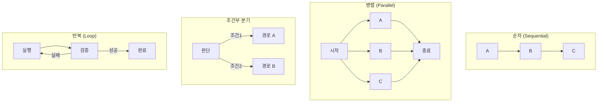
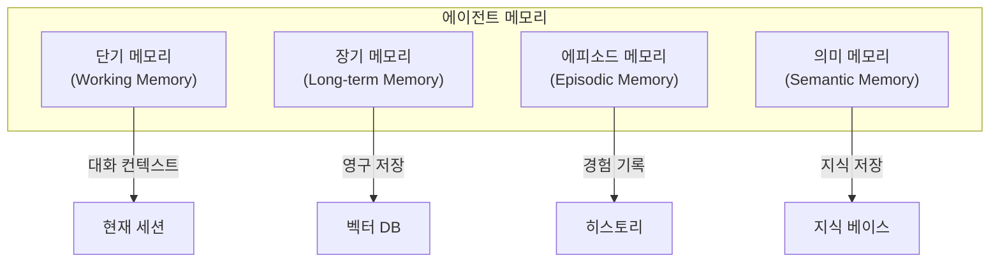
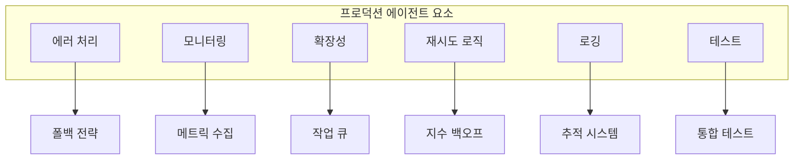

# 8주차: Agentic AI 심화

---

## 📌 강의 중점

- **에이전트 워크플로우 패턴**: 순차, 병렬, 조건부 분기
- **LangGraph 심화**: 체크포인팅, 인터럽트, 서브그래프
- **에이전트 메모리**: 단기/장기 기억 관리
- **프로덕션 에이전트** 설계 고려사항

---

## 🎯 학습 목표

학습 완료 후 다음을 수행할 수 있습니다:

- 복잡한 에이전트 워크플로우를 설계할 수 있다
- LangGraph의 고급 기능을 활용할 수 있다
- 에이전트 메모리 시스템을 구현할 수 있다
- 프로덕션 수준의 에이전트를 설계할 수 있다

---

## [Chapter 1] 에이전트 워크플로우 패턴

### 1.1 워크플로우 유형



### 1.2 순차 파이프라인

```python
from langgraph.graph import StateGraph, END
from typing import TypedDict


class PipelineState(TypedDict):
    input: str
    step1_result: str
    step2_result: str
    step3_result: str
    final_output: str


def extract_requirements(state: PipelineState) -> dict:
    """1단계: 요구사항 추출"""
    # 입력에서 요구사항 파싱
    input_text = state["input"]
    requirements = f"[요구사항] {input_text}에서 추출된 항목들"
    return {"step1_result": requirements}


def analyze_codes(state: PipelineState) -> dict:
    """2단계: 관련 법규 분석"""
    requirements = state["step1_result"]
    analysis = f"[법규 분석] {requirements}에 대한 KDS 검토 결과"
    return {"step2_result": analysis}


def generate_report(state: PipelineState) -> dict:
    """3단계: 보고서 생성"""
    analysis = state["step2_result"]
    report = f"[보고서]\n분석 결과: {analysis}\n권고사항: ..."
    return {"step3_result": report, "final_output": report}


# 순차 파이프라인 그래프
workflow = StateGraph(PipelineState)

workflow.add_node("extract", extract_requirements)
workflow.add_node("analyze", analyze_codes)
workflow.add_node("report", generate_report)

workflow.set_entry_point("extract")
workflow.add_edge("extract", "analyze")
workflow.add_edge("analyze", "report")
workflow.add_edge("report", END)

pipeline = workflow.compile()
```

### 1.3 병렬 처리 패턴

```python
from langgraph.graph import StateGraph, END
from typing import TypedDict, Dict, Any
import asyncio


class ParallelState(TypedDict):
    query: str
    structural_result: str
    code_result: str
    safety_result: str
    combined_result: str


def analyze_structural(state: ParallelState) -> dict:
    """구조 분석 (병렬 실행 1)"""
    result = f"[구조 분석] {state['query']}에 대한 구조적 검토"
    return {"structural_result": result}


def analyze_codes(state: ParallelState) -> dict:
    """법규 분석 (병렬 실행 2)"""
    result = f"[법규 검토] {state['query']}에 대한 관련 법규"
    return {"code_result": result}


def analyze_safety(state: ParallelState) -> dict:
    """안전 분석 (병렬 실행 3)"""
    result = f"[안전 검토] {state['query']}에 대한 안전성 평가"
    return {"safety_result": result}


def combine_results(state: ParallelState) -> dict:
    """결과 통합"""
    combined = f"""
종합 분석 결과:
1. {state['structural_result']}
2. {state['code_result']}
3. {state['safety_result']}
"""
    return {"combined_result": combined}


# 병렬 처리 그래프
workflow = StateGraph(ParallelState)

workflow.add_node("structural", analyze_structural)
workflow.add_node("codes", analyze_codes)
workflow.add_node("safety", analyze_safety)
workflow.add_node("combine", combine_results)

workflow.set_entry_point("structural")

# 병렬 분기 (Fan-out)
workflow.add_edge("structural", "codes")  # 실제로는 START에서 병렬로 연결
workflow.add_edge("structural", "safety")

# 결과 수집 (Fan-in)
workflow.add_edge("codes", "combine")
workflow.add_edge("safety", "combine")

workflow.add_edge("combine", END)

parallel_app = workflow.compile()
```

### 1.4 조건부 라우팅

```python
from langgraph.graph import StateGraph, END
from typing import TypedDict, Literal


class RouterState(TypedDict):
    query: str
    query_type: Literal["structural", "code", "calculation", "general"]
    result: str


def classify_query(state: RouterState) -> dict:
    """질문 분류"""
    query = state["query"].lower()

    if any(k in query for k in ["계산", "산정", "하중"]):
        q_type = "calculation"
    elif any(k in query for k in ["법규", "kds", "기준"]):
        q_type = "code"
    elif any(k in query for k in ["구조", "부재", "단면"]):
        q_type = "structural"
    else:
        q_type = "general"

    return {"query_type": q_type}


def route_query(state: RouterState) -> str:
    """라우팅 결정"""
    return state["query_type"]


def handle_structural(state: RouterState) -> dict:
    return {"result": f"[구조 전문] {state['query']}에 대한 구조 분석"}


def handle_code(state: RouterState) -> dict:
    return {"result": f"[법규 전문] {state['query']}에 대한 법규 검토"}


def handle_calculation(state: RouterState) -> dict:
    return {"result": f"[계산 전문] {state['query']}에 대한 수치 계산"}


def handle_general(state: RouterState) -> dict:
    return {"result": f"[일반 상담] {state['query']}에 대한 일반 답변"}


# 조건부 라우팅 그래프
workflow = StateGraph(RouterState)

workflow.add_node("classify", classify_query)
workflow.add_node("structural", handle_structural)
workflow.add_node("code", handle_code)
workflow.add_node("calculation", handle_calculation)
workflow.add_node("general", handle_general)

workflow.set_entry_point("classify")

workflow.add_conditional_edges(
    "classify",
    route_query,
    {
        "structural": "structural",
        "code": "code",
        "calculation": "calculation",
        "general": "general"
    }
)

for node in ["structural", "code", "calculation", "general"]:
    workflow.add_edge(node, END)

router = workflow.compile()
```

### 1.5 반복 개선 패턴

```python
from langgraph.graph import StateGraph, END
from typing import TypedDict


class IterativeState(TypedDict):
    task: str
    draft: str
    feedback: str
    iteration: int
    max_iterations: int
    final_result: str


def generate_draft(state: IterativeState) -> dict:
    """초안 생성"""
    iteration = state.get("iteration", 0)
    feedback = state.get("feedback", "")

    if iteration == 0:
        draft = f"[초안] {state['task']}에 대한 첫 번째 버전"
    else:
        draft = f"[개선 {iteration}] 피드백 반영: {feedback}"

    return {"draft": draft, "iteration": iteration + 1}


def evaluate_draft(state: IterativeState) -> dict:
    """품질 평가"""
    draft = state["draft"]
    iteration = state["iteration"]

    # 간단한 평가 로직 (실제로는 LLM 사용)
    if iteration >= 3 or len(draft) > 100:
        feedback = "만족스러움"
    else:
        feedback = "더 상세한 내용 필요"

    return {"feedback": feedback}


def should_continue(state: IterativeState) -> str:
    """반복 여부 결정"""
    if state["iteration"] >= state["max_iterations"]:
        return "finalize"
    if state["feedback"] == "만족스러움":
        return "finalize"
    return "improve"


def finalize(state: IterativeState) -> dict:
    """최종화"""
    return {"final_result": state["draft"]}


# 반복 개선 그래프
workflow = StateGraph(IterativeState)

workflow.add_node("generate", generate_draft)
workflow.add_node("evaluate", evaluate_draft)
workflow.add_node("finalize", finalize)

workflow.set_entry_point("generate")
workflow.add_edge("generate", "evaluate")

workflow.add_conditional_edges(
    "evaluate",
    should_continue,
    {
        "improve": "generate",
        "finalize": "finalize"
    }
)

workflow.add_edge("finalize", END)

iterative_app = workflow.compile()
```

### 📚 참고 자료

- [LangGraph Patterns](https://langchain-ai.github.io/langgraph/concepts/)
- [Workflow Orchestration](https://blog.langchain.dev/langgraph-orchestration/)

---

## [Chapter 2] LangGraph 고급 기능

### 2.1 체크포인팅 (Persistence)

```python
from langgraph.graph import StateGraph, END
from langgraph.checkpoint.memory import MemorySaver
from typing import TypedDict


class ChatState(TypedDict):
    messages: list
    context: dict


def chat_node(state: ChatState) -> dict:
    """채팅 노드"""
    messages = state.get("messages", [])
    # 새 메시지 처리
    return {"messages": messages + [{"role": "assistant", "content": "응답"}]}


# 체크포인터 설정
checkpointer = MemorySaver()

workflow = StateGraph(ChatState)
workflow.add_node("chat", chat_node)
workflow.set_entry_point("chat")
workflow.add_edge("chat", END)

# 체크포인터와 함께 컴파일
app = workflow.compile(checkpointer=checkpointer)

# 스레드 ID로 대화 유지
config = {"configurable": {"thread_id": "session-1"}}

# 첫 번째 호출
result1 = app.invoke(
    {"messages": [{"role": "user", "content": "안녕"}], "context": {}},
    config=config
)

# 두 번째 호출 (이전 상태 유지)
result2 = app.invoke(
    {"messages": [{"role": "user", "content": "방금 뭐라고 했지?"}], "context": {}},
    config=config
)

# 상태 조회
state = app.get_state(config)
print(f"현재 상태: {state.values}")

# 상태 히스토리
for state in app.get_state_history(config):
    print(f"히스토리: {state.values}")
```

### 2.2 Human-in-the-Loop (인터럽트)

```python
from langgraph.graph import StateGraph, END
from langgraph.checkpoint.memory import MemorySaver
from typing import TypedDict


class ApprovalState(TypedDict):
    request: str
    analysis: str
    approved: bool
    final_action: str


def analyze_request(state: ApprovalState) -> dict:
    """요청 분석"""
    return {"analysis": f"분석 결과: {state['request']}에 대한 검토 완료"}


def await_approval(state: ApprovalState) -> dict:
    """승인 대기 (인터럽트 포인트)"""
    # 이 노드에서 실행이 중단되고 사용자 입력을 기다림
    return {}


def execute_action(state: ApprovalState) -> dict:
    """승인 후 실행"""
    if state.get("approved"):
        return {"final_action": "요청이 승인되어 실행되었습니다."}
    return {"final_action": "요청이 거부되었습니다."}


def check_approval(state: ApprovalState) -> str:
    """승인 상태 확인"""
    return "execute" if state.get("approved") else "reject"


workflow = StateGraph(ApprovalState)

workflow.add_node("analyze", analyze_request)
workflow.add_node("await", await_approval)
workflow.add_node("execute", execute_action)

workflow.set_entry_point("analyze")
workflow.add_edge("analyze", "await")

# 인터럽트 후 조건부 분기
workflow.add_conditional_edges(
    "await",
    check_approval,
    {"execute": "execute", "reject": END}
)
workflow.add_edge("execute", END)

checkpointer = MemorySaver()
app = workflow.compile(
    checkpointer=checkpointer,
    interrupt_before=["await"]  # await 노드 전에 인터럽트
)

# 사용 예시
config = {"configurable": {"thread_id": "approval-1"}}

# 1. 분석까지 실행 후 중단
result = app.invoke(
    {"request": "기둥 단면 변경 요청", "approved": False},
    config=config
)
print(f"분석 완료, 승인 대기 중...")

# 2. 사용자가 승인
app.update_state(config, {"approved": True})

# 3. 실행 재개
result = app.invoke(None, config=config)
print(f"최종 결과: {result['final_action']}")
```

### 2.3 서브그래프

```python
from langgraph.graph import StateGraph, END
from typing import TypedDict


class SubState(TypedDict):
    input: str
    output: str


class MainState(TypedDict):
    query: str
    sub_result: str
    final_result: str


# 서브그래프 정의
def create_sub_graph():
    def process(state: SubState) -> dict:
        return {"output": f"처리됨: {state['input']}"}

    sub = StateGraph(SubState)
    sub.add_node("process", process)
    sub.set_entry_point("process")
    sub.add_edge("process", END)

    return sub.compile()


sub_graph = create_sub_graph()


# 메인 그래프
def preprocess(state: MainState) -> dict:
    return {"query": state["query"].strip().lower()}


def call_subgraph(state: MainState) -> dict:
    """서브그래프 호출"""
    result = sub_graph.invoke({"input": state["query"], "output": ""})
    return {"sub_result": result["output"]}


def postprocess(state: MainState) -> dict:
    return {"final_result": f"최종: {state['sub_result']}"}


main_workflow = StateGraph(MainState)

main_workflow.add_node("preprocess", preprocess)
main_workflow.add_node("subgraph", call_subgraph)
main_workflow.add_node("postprocess", postprocess)

main_workflow.set_entry_point("preprocess")
main_workflow.add_edge("preprocess", "subgraph")
main_workflow.add_edge("subgraph", "postprocess")
main_workflow.add_edge("postprocess", END)

main_app = main_workflow.compile()
```

### 2.4 스트리밍

```python
from langgraph.graph import StateGraph, END
from typing import TypedDict
import anthropic


class StreamState(TypedDict):
    query: str
    response: str


def stream_response(state: StreamState):
    """스트리밍 응답 생성"""
    client = anthropic.Anthropic()

    with client.messages.stream(
        model="claude-3-5-sonnet-20241022",
        max_tokens=1000,
        messages=[{"role": "user", "content": state["query"]}]
    ) as stream:
        full_response = ""
        for text in stream.text_stream:
            full_response += text
            yield {"response": full_response}

    return {"response": full_response}


workflow = StateGraph(StreamState)
workflow.add_node("respond", stream_response)
workflow.set_entry_point("respond")
workflow.add_edge("respond", END)

streaming_app = workflow.compile()

# 스트리밍 실행
for chunk in streaming_app.stream({"query": "내진설계 기준 설명", "response": ""}):
    print(chunk, end="", flush=True)
```

### 📚 참고 자료

- [LangGraph Persistence](https://langchain-ai.github.io/langgraph/concepts/persistence/)
- [Human-in-the-Loop](https://langchain-ai.github.io/langgraph/how-tos/human_in_the_loop/)
- [LangGraph Streaming](https://langchain-ai.github.io/langgraph/concepts/streaming/)

---

## [Chapter 3] 에이전트 메모리

### 3.1 메모리 유형



### 3.2 대화 메모리 구현

```python
from typing import List, Dict
import json
from datetime import datetime


class ConversationMemory:
    """대화 메모리 관리"""

    def __init__(self, max_messages: int = 50, max_tokens: int = 4000):
        self.messages: List[Dict] = []
        self.max_messages = max_messages
        self.max_tokens = max_tokens
        self.summary: str = ""

    def add_message(self, role: str, content: str):
        """메시지 추가"""
        self.messages.append({
            "role": role,
            "content": content,
            "timestamp": datetime.now().isoformat()
        })

        # 최대 메시지 수 초과 시 요약
        if len(self.messages) > self.max_messages:
            self._summarize_old_messages()

    def _summarize_old_messages(self):
        """오래된 메시지 요약"""
        # 처음 절반의 메시지를 요약
        half = len(self.messages) // 2
        old_messages = self.messages[:half]

        # 요약 생성 (실제로는 LLM 사용)
        old_content = "\n".join([f"{m['role']}: {m['content']}" for m in old_messages])
        self.summary = f"[이전 대화 요약] {old_content[:200]}..."

        # 오래된 메시지 제거
        self.messages = self.messages[half:]

    def get_context(self) -> str:
        """컨텍스트 문자열 반환"""
        context_parts = []

        if self.summary:
            context_parts.append(self.summary)

        for msg in self.messages:
            context_parts.append(f"{msg['role']}: {msg['content']}")

        return "\n".join(context_parts)

    def get_messages_for_api(self) -> List[Dict]:
        """API 호출용 메시지 목록"""
        api_messages = []

        if self.summary:
            api_messages.append({
                "role": "system",
                "content": f"이전 대화 요약: {self.summary}"
            })

        for msg in self.messages:
            api_messages.append({
                "role": msg["role"],
                "content": msg["content"]
            })

        return api_messages

    def clear(self):
        """메모리 초기화"""
        self.messages = []
        self.summary = ""


# 사용 예시
memory = ConversationMemory()
memory.add_message("user", "내진설계 기준이 뭔가요?")
memory.add_message("assistant", "내진설계는 KDS 41 17 00에 규정되어 있습니다.")
memory.add_message("user", "더 자세히 설명해주세요")

print(memory.get_context())
```

### 3.3 장기 메모리 (벡터 저장)

```python
import chromadb
from chromadb.utils import embedding_functions
from datetime import datetime
from typing import List, Dict, Optional
import json


class LongTermMemory:
    """벡터 DB 기반 장기 메모리"""

    def __init__(self, db_path: str = "./agent_memory"):
        self.client = chromadb.PersistentClient(path=db_path)
        self.ef = embedding_functions.OpenAIEmbeddingFunction(
            model_name="text-embedding-3-small"
        )

        # 대화 히스토리 컬렉션
        self.conversations = self.client.get_or_create_collection(
            name="conversations",
            embedding_function=self.ef
        )

        # 사용자 선호도 컬렉션
        self.preferences = self.client.get_or_create_collection(
            name="preferences",
            embedding_function=self.ef
        )

        # 학습된 지식 컬렉션
        self.knowledge = self.client.get_or_create_collection(
            name="knowledge",
            embedding_function=self.ef
        )

    def store_conversation(
        self,
        user_id: str,
        conversation: List[Dict],
        summary: str
    ):
        """대화 저장"""
        conv_id = f"{user_id}_{datetime.now().strftime('%Y%m%d_%H%M%S')}"

        self.conversations.add(
            documents=[summary],
            ids=[conv_id],
            metadatas=[{
                "user_id": user_id,
                "timestamp": datetime.now().isoformat(),
                "message_count": len(conversation),
                "full_conversation": json.dumps(conversation, ensure_ascii=False)
            }]
        )

    def recall_similar(
        self,
        query: str,
        user_id: Optional[str] = None,
        n_results: int = 3
    ) -> List[Dict]:
        """유사한 과거 대화 회상"""
        where_filter = {"user_id": user_id} if user_id else None

        results = self.conversations.query(
            query_texts=[query],
            n_results=n_results,
            where=where_filter
        )

        recalled = []
        for doc, meta, dist in zip(
            results["documents"][0],
            results["metadatas"][0],
            results["distances"][0]
        ):
            recalled.append({
                "summary": doc,
                "metadata": meta,
                "relevance": 1 - dist
            })

        return recalled

    def store_preference(self, user_id: str, preference: str, category: str):
        """사용자 선호도 저장"""
        pref_id = f"{user_id}_{category}_{datetime.now().strftime('%Y%m%d')}"

        self.preferences.upsert(
            documents=[preference],
            ids=[pref_id],
            metadatas=[{
                "user_id": user_id,
                "category": category,
                "timestamp": datetime.now().isoformat()
            }]
        )

    def get_user_context(self, user_id: str, query: str) -> str:
        """사용자 맞춤 컨텍스트 생성"""
        # 관련 과거 대화 검색
        past_conversations = self.recall_similar(query, user_id, n_results=2)

        # 사용자 선호도 검색
        prefs = self.preferences.query(
            query_texts=[query],
            n_results=3,
            where={"user_id": user_id}
        )

        context_parts = []

        if past_conversations:
            context_parts.append("## 관련 과거 대화")
            for conv in past_conversations:
                context_parts.append(f"- {conv['summary']}")

        if prefs["documents"][0]:
            context_parts.append("\n## 사용자 선호도")
            for pref in prefs["documents"][0]:
                context_parts.append(f"- {pref}")

        return "\n".join(context_parts) if context_parts else ""


# 사용 예시
ltm = LongTermMemory()

# 대화 저장
ltm.store_conversation(
    user_id="user123",
    conversation=[
        {"role": "user", "content": "내진설계 기준 알려줘"},
        {"role": "assistant", "content": "KDS 41 17 00에 따르면..."}
    ],
    summary="내진설계 기준 KDS 41 17 00에 대한 문의 및 설명"
)

# 선호도 저장
ltm.store_preference("user123", "상세한 기술적 설명 선호", "communication_style")

# 컨텍스트 조회
context = ltm.get_user_context("user123", "지진 설계 방법")
print(context)
```

### 3.4 메모리 통합 에이전트

```python
from langgraph.graph import StateGraph, END
from typing import TypedDict, List, Dict
import anthropic


class MemoryAgentState(TypedDict):
    user_id: str
    query: str
    conversation_history: List[Dict]
    retrieved_context: str
    response: str


class MemoryAgent:
    """메모리 통합 에이전트"""

    def __init__(self):
        self.short_term = ConversationMemory()
        self.long_term = LongTermMemory()
        self.llm = anthropic.Anthropic()

    def retrieve_context(self, state: MemoryAgentState) -> dict:
        """관련 컨텍스트 검색"""
        user_context = self.long_term.get_user_context(
            state["user_id"],
            state["query"]
        )
        return {"retrieved_context": user_context}

    def generate_response(self, state: MemoryAgentState) -> dict:
        """응답 생성"""
        # 시스템 프롬프트 구성
        system_parts = ["당신은 건축구조 전문 AI 어시스턴트입니다."]

        if state["retrieved_context"]:
            system_parts.append(f"\n{state['retrieved_context']}")

        system_prompt = "\n".join(system_parts)

        # 대화 히스토리 포함
        messages = self.short_term.get_messages_for_api()
        messages.append({"role": "user", "content": state["query"]})

        response = self.llm.messages.create(
            model="claude-3-5-sonnet-20241022",
            max_tokens=2000,
            system=system_prompt,
            messages=messages
        )

        answer = response.content[0].text

        # 단기 메모리 업데이트
        self.short_term.add_message("user", state["query"])
        self.short_term.add_message("assistant", answer)

        return {"response": answer}

    def save_to_long_term(self, state: MemoryAgentState) -> dict:
        """장기 메모리 저장"""
        # 대화가 일정 길이 이상이면 요약하여 저장
        if len(self.short_term.messages) >= 10:
            summary = self._create_summary()
            self.long_term.store_conversation(
                user_id=state["user_id"],
                conversation=self.short_term.messages,
                summary=summary
            )
            self.short_term.clear()

        return {}

    def _create_summary(self) -> str:
        """대화 요약 생성"""
        context = self.short_term.get_context()

        response = self.llm.messages.create(
            model="claude-3-5-sonnet-20241022",
            max_tokens=200,
            messages=[{
                "role": "user",
                "content": f"다음 대화를 한 문장으로 요약하세요:\n{context}"
            }]
        )

        return response.content[0].text

    def create_graph(self):
        """에이전트 그래프 생성"""
        workflow = StateGraph(MemoryAgentState)

        workflow.add_node("retrieve", self.retrieve_context)
        workflow.add_node("generate", self.generate_response)
        workflow.add_node("save", self.save_to_long_term)

        workflow.set_entry_point("retrieve")
        workflow.add_edge("retrieve", "generate")
        workflow.add_edge("generate", "save")
        workflow.add_edge("save", END)

        return workflow.compile()


# 사용 예시
agent = MemoryAgent()
app = agent.create_graph()

result = app.invoke({
    "user_id": "user123",
    "query": "3층 건물 내진설계 필요한가요?",
    "conversation_history": [],
    "retrieved_context": "",
    "response": ""
})

print(result["response"])
```

### 📚 참고 자료

- [LangChain Memory](https://python.langchain.com/docs/concepts/memory/)
- [Agent Memory Patterns](https://blog.langchain.dev/memory-for-agents/)

---

## [Chapter 4] 프로덕션 에이전트 설계

### 4.1 프로덕션 고려사항



### 4.2 에러 처리 패턴

```python
from langgraph.graph import StateGraph, END
from typing import TypedDict, Optional
import anthropic
from tenacity import retry, stop_after_attempt, wait_exponential
import logging

logging.basicConfig(level=logging.INFO)
logger = logging.getLogger(__name__)


class RobustState(TypedDict):
    query: str
    result: str
    error: Optional[str]
    retry_count: int


class RobustAgent:
    """에러 처리가 포함된 견고한 에이전트"""

    def __init__(self):
        self.llm = anthropic.Anthropic()
        self.max_retries = 3

    @retry(
        stop=stop_after_attempt(3),
        wait=wait_exponential(multiplier=1, min=2, max=10)
    )
    def _call_llm(self, messages: list) -> str:
        """재시도 로직이 포함된 LLM 호출"""
        response = self.llm.messages.create(
            model="claude-3-5-sonnet-20241022",
            max_tokens=1000,
            messages=messages
        )
        return response.content[0].text

    def process_query(self, state: RobustState) -> dict:
        """질의 처리 (에러 핸들링 포함)"""
        try:
            result = self._call_llm([
                {"role": "user", "content": state["query"]}
            ])
            logger.info(f"Query processed successfully")
            return {"result": result, "error": None}

        except anthropic.RateLimitError as e:
            logger.warning(f"Rate limit hit: {e}")
            return {"error": "서버가 바쁩니다. 잠시 후 다시 시도해주세요."}

        except anthropic.APIError as e:
            logger.error(f"API error: {e}")
            return {"error": f"API 오류: {str(e)}"}

        except Exception as e:
            logger.exception(f"Unexpected error: {e}")
            return {"error": "예기치 않은 오류가 발생했습니다."}

    def fallback_handler(self, state: RobustState) -> dict:
        """폴백 처리"""
        logger.info("Executing fallback handler")
        return {
            "result": "죄송합니다. 현재 서비스에 문제가 있습니다. 기본 답변을 제공합니다.",
            "error": None
        }

    def should_fallback(self, state: RobustState) -> str:
        """폴백 여부 결정"""
        if state.get("error"):
            return "fallback"
        return END

    def create_graph(self):
        workflow = StateGraph(RobustState)

        workflow.add_node("process", self.process_query)
        workflow.add_node("fallback", self.fallback_handler)

        workflow.set_entry_point("process")
        workflow.add_conditional_edges(
            "process",
            self.should_fallback,
            {"fallback": "fallback", END: END}
        )
        workflow.add_edge("fallback", END)

        return workflow.compile()
```

### 4.3 모니터링과 추적

```python
import time
from datetime import datetime
from typing import Dict, Any
import json


class AgentMonitor:
    """에이전트 모니터링"""

    def __init__(self):
        self.metrics: Dict[str, list] = {
            "latency": [],
            "token_usage": [],
            "errors": [],
            "success_rate": []
        }
        self.traces: list = []

    def start_trace(self, operation: str) -> Dict:
        """추적 시작"""
        trace = {
            "operation": operation,
            "start_time": time.time(),
            "timestamp": datetime.now().isoformat()
        }
        return trace

    def end_trace(self, trace: Dict, success: bool, metadata: Dict = None):
        """추적 종료"""
        trace["end_time"] = time.time()
        trace["duration"] = trace["end_time"] - trace["start_time"]
        trace["success"] = success
        trace["metadata"] = metadata or {}

        self.traces.append(trace)
        self.metrics["latency"].append(trace["duration"])

        if not success:
            self.metrics["errors"].append(trace)

    def record_token_usage(self, input_tokens: int, output_tokens: int):
        """토큰 사용량 기록"""
        self.metrics["token_usage"].append({
            "input": input_tokens,
            "output": output_tokens,
            "timestamp": datetime.now().isoformat()
        })

    def get_statistics(self) -> Dict:
        """통계 조회"""
        latencies = self.metrics["latency"]

        return {
            "total_requests": len(self.traces),
            "error_count": len(self.metrics["errors"]),
            "avg_latency": sum(latencies) / len(latencies) if latencies else 0,
            "max_latency": max(latencies) if latencies else 0,
            "total_tokens": sum(
                t["input"] + t["output"]
                for t in self.metrics["token_usage"]
            )
        }

    def export_traces(self, filepath: str):
        """추적 내보내기"""
        with open(filepath, "w") as f:
            json.dump(self.traces, f, indent=2)


# 모니터링이 통합된 에이전트
class MonitoredAgent:
    """모니터링이 포함된 에이전트"""

    def __init__(self):
        self.llm = anthropic.Anthropic()
        self.monitor = AgentMonitor()

    def process(self, query: str) -> str:
        trace = self.monitor.start_trace("process_query")

        try:
            response = self.llm.messages.create(
                model="claude-3-5-sonnet-20241022",
                max_tokens=1000,
                messages=[{"role": "user", "content": query}]
            )

            # 토큰 사용량 기록
            self.monitor.record_token_usage(
                response.usage.input_tokens,
                response.usage.output_tokens
            )

            result = response.content[0].text
            self.monitor.end_trace(trace, success=True)

            return result

        except Exception as e:
            self.monitor.end_trace(trace, success=False, metadata={"error": str(e)})
            raise

    def get_stats(self) -> Dict:
        return self.monitor.get_statistics()
```

### 4.4 프로덕션 체크리스트

```yaml
# 프로덕션 에이전트 체크리스트

에러_처리:
  - [ ] 모든 외부 API 호출에 try-catch
  - [ ] 재시도 로직 (지수 백오프)
  - [ ] 폴백 전략 정의
  - [ ] 에러 로깅

성능:
  - [ ] 응답 시간 모니터링
  - [ ] 토큰 사용량 추적
  - [ ] 병목 구간 식별
  - [ ] 캐싱 전략

보안:
  - [ ] API 키 안전한 저장
  - [ ] 입력 검증
  - [ ] 출력 필터링 (민감 정보)
  - [ ] Rate limiting

테스트:
  - [ ] 단위 테스트
  - [ ] 통합 테스트
  - [ ] 부하 테스트
  - [ ] 회귀 테스트

관찰성:
  - [ ] 구조화된 로깅
  - [ ] 메트릭 대시보드
  - [ ] 알림 설정
  - [ ] 추적 시스템
```

---

## 💻 실습 코드

### 실습: 완전한 건축 상담 에이전트

```python
# practice/full_building_agent.py
"""완전한 건축 상담 에이전트"""

from langgraph.graph import StateGraph, END
from langgraph.checkpoint.memory import MemorySaver
from typing import TypedDict, List, Dict, Optional
import anthropic
import chromadb
from datetime import datetime


class FullAgentState(TypedDict):
    user_id: str
    query: str
    query_type: str
    retrieved_docs: List[Dict]
    draft_response: str
    final_response: str
    needs_approval: bool
    approved: bool
    error: Optional[str]


class BuildingConsultantAgent:
    """완전한 건축 상담 에이전트"""

    def __init__(self):
        self.llm = anthropic.Anthropic()
        self.db = chromadb.PersistentClient(path="./consultant_db")
        self.knowledge = self.db.get_or_create_collection("building_codes")

    def classify(self, state: FullAgentState) -> dict:
        """질문 분류"""
        query = state["query"].lower()

        if any(k in query for k in ["허가", "승인", "신고"]):
            q_type = "permit"
            needs_approval = True
        elif any(k in query for k in ["내진", "지진"]):
            q_type = "seismic"
            needs_approval = False
        elif any(k in query for k in ["계산", "산정"]):
            q_type = "calculation"
            needs_approval = False
        else:
            q_type = "general"
            needs_approval = False

        return {"query_type": q_type, "needs_approval": needs_approval}

    def retrieve(self, state: FullAgentState) -> dict:
        """관련 문서 검색"""
        results = self.knowledge.query(
            query_texts=[state["query"]],
            n_results=3
        )

        docs = []
        if results["documents"][0]:
            for doc, meta in zip(results["documents"][0], results["metadatas"][0]):
                docs.append({"content": doc, "metadata": meta})

        return {"retrieved_docs": docs}

    def generate_draft(self, state: FullAgentState) -> dict:
        """초안 생성"""
        context = "\n".join([d["content"] for d in state["retrieved_docs"]])

        response = self.llm.messages.create(
            model="claude-3-5-sonnet-20241022",
            max_tokens=1500,
            system="당신은 건축 법규 전문 상담사입니다.",
            messages=[{
                "role": "user",
                "content": f"질문: {state['query']}\n\n참고자료:\n{context}"
            }]
        )

        return {"draft_response": response.content[0].text}

    def await_approval(self, state: FullAgentState) -> dict:
        """승인 대기"""
        return {}  # 인터럽트 포인트

    def finalize(self, state: FullAgentState) -> dict:
        """최종 응답 생성"""
        if state.get("approved", True):
            final = state["draft_response"]
        else:
            final = "답변이 승인되지 않았습니다. 전문가 상담을 권장합니다."

        return {"final_response": final}

    def route_after_draft(self, state: FullAgentState) -> str:
        if state["needs_approval"]:
            return "await"
        return "finalize"

    def route_after_approval(self, state: FullAgentState) -> str:
        return "finalize"

    def create_graph(self):
        workflow = StateGraph(FullAgentState)

        workflow.add_node("classify", self.classify)
        workflow.add_node("retrieve", self.retrieve)
        workflow.add_node("draft", self.generate_draft)
        workflow.add_node("await", self.await_approval)
        workflow.add_node("finalize", self.finalize)

        workflow.set_entry_point("classify")
        workflow.add_edge("classify", "retrieve")
        workflow.add_edge("retrieve", "draft")

        workflow.add_conditional_edges(
            "draft",
            self.route_after_draft,
            {"await": "await", "finalize": "finalize"}
        )

        workflow.add_edge("await", "finalize")
        workflow.add_edge("finalize", END)

        checkpointer = MemorySaver()
        return workflow.compile(
            checkpointer=checkpointer,
            interrupt_before=["await"]
        )


if __name__ == "__main__":
    agent = BuildingConsultantAgent()
    app = agent.create_graph()

    # 테스트
    config = {"configurable": {"thread_id": "test-1"}}

    result = app.invoke({
        "user_id": "user1",
        "query": "3층 건물 내진설계 기준 알려주세요",
        "query_type": "",
        "retrieved_docs": [],
        "draft_response": "",
        "final_response": "",
        "needs_approval": False,
        "approved": True,
        "error": None
    }, config=config)

    print(f"질문 유형: {result['query_type']}")
    print(f"최종 응답: {result['final_response']}")
```

---

## 📝 과제

### 과제 1: 복합 워크플로우 에이전트 (제출)

순차, 병렬, 조건부 분기가 모두 포함된 에이전트:

**요구사항**:
1. 최소 5개 노드
2. 병렬 처리 포함
3. 조건부 분기 포함
4. 에러 처리 포함

**제출물**: 코드, 다이어그램, 실행 결과

### 과제 2: 메모리 통합 에이전트 (제출)

단기/장기 메모리가 통합된 에이전트:

**요구사항**:
1. 대화 히스토리 관리
2. 벡터 DB 장기 저장
3. 컨텍스트 기반 응답

**제출물**: 코드, 테스트 시나리오, 결과

---

## 🔗 추가 학습 자료

- [LangGraph Advanced](https://langchain-ai.github.io/langgraph/tutorials/)
- [Agent Memory Patterns](https://blog.langchain.dev/)
- [Production LLM Apps](https://www.anthropic.com/research)

---

## 🚀 발전 전략 (Development Strategies)

### 전략 1: 건축 프로젝트 실무 워크플로우 시뮬레이션

**목표**: 실제 건축 설계 프로세스를 에이전트 워크플로우로 구현하여 순차/병렬/조건부 패턴 이해 강화

**실습 내용**:
```python
# 실무 워크플로우 예시: 건축 설계 검토 프로세스
"""
1. 순차 단계: 도면 접수 → 기본 검토 → 법규 검토 → 구조 검토
2. 병렬 단계: 구조/설비/소방 동시 검토
3. 조건부 분기: 불합격 시 재검토, 합격 시 승인
"""

class ArchitecturalReviewWorkflow(TypedDict):
    project_id: str
    drawings: List[Dict]
    basic_review: str
    code_review: str
    structural_review: str
    mep_review: str
    fire_review: str
    review_status: Literal["pass", "fail", "conditional"]
    final_decision: str

# 실습 과제:
# 1. 실제 건축 프로젝트 단계를 워크플로우로 매핑
# 2. 각 검토 단계마다 실제 체크리스트 적용
# 3. 조건부 분기로 재검토 루프 구현
# 4. 병렬 처리로 다중 전문가 검토 동시 진행
```

**건축공학 활용 예시**:
- **구조 계산 워크플로우**: 하중 산정 → 부재 설계 → 안전성 검증 → 도면 생성
- **법규 적합성 검토**: 건축법 → 소방법 → 장애인법 → KDS 기준 병렬 검토
- **에너지 성능 분석**: 외피 성능 → 설비 효율 → 신재생 에너지 → 통합 평가

**실습 확장**:
```python
# 실전 예제: 내진설계 검토 워크플로우
def seismic_review_workflow():
    """
    1. 지진 구역 및 지반 분류 (순차)
    2. 중요도 계수 및 응답수정계수 결정 (순차)
    3. 등가정적해석/응답스펙트럼해석 병렬 수행
    4. 조건부: 비정형 건물 → 동적해석 추가
    5. 최종 검증 및 보고서 생성
    """
    # 학생들이 KDS 41 17 00 기준을 워크플로우로 구현
```

---

### 전략 2: 체크포인팅을 활용한 장기 프로젝트 관리 시스템

**목표**: LangGraph의 체크포인팅 기능으로 중단/재개 가능한 프로젝트 관리 시스템 구축

**실습 내용**:
```python
# 장기 프로젝트 관리 시스템
"""
시나리오: 대형 건축 프로젝트는 여러 달에 걸쳐 진행
- 설계 변경 요청이 수시로 발생
- 이전 상태를 정확히 복원해야 함
- 여러 버전의 설계안 관리 필요
"""

class DesignProjectState(TypedDict):
    project_name: str
    current_phase: str
    design_version: int
    review_history: List[Dict]
    pending_changes: List[str]
    stakeholder_approvals: Dict[str, bool]

# 실습 과제:
# 1. 설계 단계별 체크포인트 저장 (기본설계/실시설계/착공)
# 2. 특정 시점으로 롤백 기능 구현
# 3. 브랜치 기능: 대안 설계 동시 진행
# 4. 변경 이력 추적 및 비교 기능

# 체크포인트 활용 예시
checkpointer = MemorySaver()
app = workflow.compile(checkpointer=checkpointer)

# 프로젝트 진행
config_v1 = {"configurable": {"thread_id": "building-A-design"}}
result_v1 = app.invoke(initial_state, config=config_v1)

# 설계 변경 후 새 버전 저장
config_v2 = {"configurable": {"thread_id": "building-A-design-v2"}}
result_v2 = app.invoke(modified_state, config=config_v2)

# 이전 버전 조회 및 비교
state_v1 = app.get_state(config_v1)
state_v2 = app.get_state(config_v2)
```

**건축공학 활용 예시**:
- **설계 변경 관리**: VE(Value Engineering) 제안 전/후 비교
- **인허가 프로세스**: 각 승인 단계별 상태 저장 및 추적
- **시공 단계 관리**: 공정별 체크포인트로 품질 관리

**고급 실습**:
```python
# 다중 이해관계자 승인 프로세스
async def multi_stakeholder_approval():
    """
    건축주, 설계자, 구조엔지니어, 시공사 순차 승인
    각 단계에서 인터럽트하여 승인 대기
    승인 시 다음 단계 진행, 거부 시 이전 단계로 복귀
    """
    stakeholders = ["owner", "architect", "structural_engineer", "contractor"]
    for stakeholder in stakeholders:
        # 체크포인트 생성
        checkpoint_id = f"approval_{stakeholder}"
        # 승인 대기 (Human-in-the-Loop)
        # 승인 여부에 따라 분기
```

---

### 전략 3: 건축 도메인 전문 메모리 시스템 구축

**목표**: 건축 프로젝트 특화 메모리 시스템으로 프로젝트 히스토리, 설계 선호도, 법규 업데이트 관리

**실습 내용**:
```python
# 건축 전문 메모리 시스템
class ArchitecturalMemorySystem:
    """
    1. 단기 메모리: 현재 프로젝트 대화 컨텍스트
    2. 장기 메모리: 과거 프로젝트 데이터, 설계 패턴
    3. 에피소드 메모리: 특정 문제 해결 경험
    4. 의미 메모리: 법규, 기준, 재료 데이터베이스
    """

    def __init__(self):
        self.short_term = ConversationMemory()
        self.project_history = self._init_collection("project_history")
        self.design_patterns = self._init_collection("design_patterns")
        self.code_updates = self._init_collection("building_codes")
        self.material_specs = self._init_collection("materials")

    def store_project_experience(self, project_data: Dict):
        """
        프로젝트 완료 시 학습 내용 저장:
        - 설계 결정 근거
        - 발생한 문제와 해결 방법
        - 성능 데이터 (구조, 에너지 등)
        - 이해관계자 피드백
        """

    def recall_similar_projects(self, current_query: str):
        """
        유사 프로젝트 검색:
        - 건물 유형, 규모, 지역 유사성
        - 적용된 법규 및 기준
        - 성공/실패 사례
        """

# 실습 과제:
# 1. 프로젝트별 메모리 컬렉션 설계
# 2. 벡터 검색으로 유사 프로젝트 회상
# 3. 법규 변경 이력 추적 시스템
# 4. 설계자 선호도 학습 및 적용
```

**건축공학 활용 예시**:
```python
# 구조 설계 경험 메모리
class StructuralDesignMemory:
    def store_design_decision(self, building_info: Dict, decision: Dict):
        """
        구조 시스템 선택 근거 저장:
        {
            "building_type": "office_15floors",
            "span": 9.0,  # meters
            "seismic_zone": "zone_1",
            "structural_system": "RC_rigid_frame",
            "reason": "경제성과 시공성 우수, 내진성능 만족",
            "performance": {
                "cost_per_sqm": 450000,
                "construction_period": 18,
                "seismic_performance": "pass"
            }
        }
        """

    def recommend_structural_system(self, new_building: Dict):
        """
        과거 유사 프로젝트 기반 구조 시스템 추천
        벡터 검색으로 유사도 높은 사례 3개 반환
        """

# 법규 업데이트 추적
class CodeUpdateTracker:
    def track_code_changes(self):
        """
        KDS 기준 개정 이력 관리:
        - 2022년 내진설계기준 개정 사항
        - 2024년 에너지절약설계기준 강화
        - 프로젝트별 적용 기준 버전 기록
        """
```

**고급 실습**:
```python
# 실시간 법규 업데이트 및 프로젝트 영향 분석
async def analyze_code_impact_on_projects():
    """
    1. 새로운 법규 개정 감지
    2. 진행 중인 프로젝트 목록 조회
    3. 각 프로젝트에 미치는 영향 분석
    4. 설계 변경 필요 여부 알림
    """
```

---

### 전략 4: 프로덕션 레벨 에러 처리 및 모니터링 구현

**목표**: 실무 환경에서 발생 가능한 에러 시나리오 대응 및 에이전트 성능 모니터링 시스템 구축

**실습 내용**:
```python
# 건축 에이전트 에러 시나리오
"""
실무에서 발생 가능한 에러:
1. API 호출 실패 (LLM, 구조해석 API 등)
2. 잘못된 입력 데이터 (도면 파일 손상, 좌표 오류)
3. 계산 오버플로우 (구조 해석 발산)
4. 외부 시스템 연동 실패 (BIM 서버, 법규 DB)
"""

class RobustBuildingAgent:
    @retry(
        stop=stop_after_attempt(3),
        wait=wait_exponential(multiplier=2, min=4, max=30),
        retry=retry_if_exception_type((APIError, ConnectionError))
    )
    def call_structural_analysis_api(self, model_data: Dict):
        """구조해석 API 호출 (재시도 로직)"""
        try:
            response = requests.post(
                "https://structural-api.example.com/analyze",
                json=model_data,
                timeout=60
            )
            response.raise_for_status()
            return response.json()

        except requests.Timeout:
            logger.warning("Structural analysis timeout, retrying...")
            raise

        except requests.HTTPError as e:
            if e.response.status_code == 429:  # Rate limit
                logger.info("Rate limited, backing off...")
                raise
            else:
                logger.error(f"HTTP error: {e}")
                return self._fallback_simplified_analysis(model_data)

    def _fallback_simplified_analysis(self, model_data: Dict):
        """폴백: 간단한 개략 계산으로 대체"""
        logger.info("Using simplified analysis fallback")
        return approximate_structural_check(model_data)

# 실습 과제:
# 1. 각 에이전트 노드에 에러 핸들러 추가
# 2. 폴백 전략 3단계 구현 (재시도 → 간소화 → 수동 개입)
# 3. 에러 로그 분석 대시보드 구축
# 4. 자동 알림 시스템 (심각한 에러 발생 시)
```

**모니터링 시스템 구현**:
```python
# 실시간 에이전트 성능 모니터링
class ArchitecturalAgentMonitor:
    def __init__(self):
        self.metrics = {
            "query_processing_time": [],
            "llm_token_usage": [],
            "structural_calc_duration": [],
            "error_rates": {},
            "user_satisfaction": []
        }

    def track_operation(self, operation_type: str):
        """데코레이터로 각 작업 자동 추적"""
        def decorator(func):
            @wraps(func)
            def wrapper(*args, **kwargs):
                start = time.time()
                try:
                    result = func(*args, **kwargs)
                    duration = time.time() - start

                    self.record_success(operation_type, duration)
                    return result

                except Exception as e:
                    self.record_error(operation_type, e)
                    raise
            return wrapper
        return decorator

    def generate_daily_report(self):
        """일일 성능 보고서 생성"""
        return {
            "total_queries": len(self.metrics["query_processing_time"]),
            "avg_response_time": statistics.mean(self.metrics["query_processing_time"]),
            "p95_response_time": statistics.quantiles(self.metrics["query_processing_time"], n=20)[18],
            "error_rate": sum(self.metrics["error_rates"].values()) / total_operations,
            "total_cost": self.calculate_api_costs()
        }

# 실습 과제:
# 1. 주요 작업별 성능 메트릭 수집
# 2. 실시간 대시보드 (Streamlit/Plotly)
# 3. 이상 탐지 알고리즘 (응답 시간 급증, 에러율 상승)
# 4. 월별 비용 분석 및 최적화 제안
```

**건축공학 특화 모니터링**:
```python
# 구조 계산 정확도 추적
class StructuralCalculationValidator:
    def validate_results(self, agent_result: Dict, reference: Dict):
        """
        에이전트 계산 결과와 상용 프로그램 결과 비교:
        - 부재 단면력 오차율
        - 변위 예측 정확도
        - 안전율 계산 일치도

        오차가 임계값 초과 시 경고
        """

    def track_accuracy_over_time(self):
        """시간에 따른 정확도 추이 분석"""
```

---

### 전략 5: 멀티 에이전트 협업 시스템 구현

**목표**: 여러 전문 에이전트가 협력하여 복잡한 건축 문제 해결

**실습 내용**:
```python
# 건축 프로젝트 멀티 에이전트 시스템
"""
전문 에이전트 구성:
1. 건축계획 에이전트 (공간 배치, 동선 계획)
2. 구조 에이전트 (구조 시스템, 부재 설계)
3. 법규 에이전트 (건축법, KDS 검토)
4. 에너지 에이전트 (에너지 성능 분석)
5. 조정 에이전트 (의견 충돌 해결, 최종 결정)
"""

class MultiAgentArchitecturalSystem:
    def __init__(self):
        self.planning_agent = ArchitecturalPlanningAgent()
        self.structural_agent = StructuralEngineerAgent()
        self.code_agent = BuildingCodeAgent()
        self.energy_agent = EnergyAnalysisAgent()
        self.coordinator = CoordinatorAgent()

    async def collaborative_design(self, project_brief: Dict):
        """
        협업 설계 프로세스:
        1. 프로젝트 요구사항 분석 (조정자)
        2. 각 전문 에이전트에 병렬 작업 할당
        3. 중간 결과 공유 및 피드백
        4. 충돌 사항 조정 (예: 구조 vs 건축 공간)
        5. 통합 설계안 도출
        """
        # 1단계: 요구사항 분해
        tasks = self.coordinator.decompose_requirements(project_brief)

        # 2단계: 병렬 작업 실행
        planning_task = asyncio.create_task(
            self.planning_agent.design_layout(tasks["planning"])
        )
        structural_task = asyncio.create_task(
            self.structural_agent.design_structure(tasks["structural"])
        )
        energy_task = asyncio.create_task(
            self.energy_agent.analyze_performance(tasks["energy"])
        )

        # 3단계: 결과 수집
        results = await asyncio.gather(
            planning_task, structural_task, energy_task
        )

        # 4단계: 충돌 해결
        conflicts = self.coordinator.detect_conflicts(results)
        if conflicts:
            resolved = await self.coordinator.resolve_conflicts(conflicts)

        # 5단계: 통합 설계안
        final_design = self.coordinator.integrate_results(results)

        return final_design

# 실습 과제:
# 1. 3개 이상 전문 에이전트 구현
# 2. 에이전트 간 메시지 프로토콜 정의
# 3. 충돌 해결 알고리즘 구현
# 4. 협업 과정 시각화 (Mermaid 다이어그램)
```

**에이전트 간 통신 프로토콜**:
```python
# 표준화된 에이전트 메시지 포맷
class AgentMessage:
    def __init__(
        self,
        sender: str,
        receiver: str,
        message_type: Literal["request", "response", "feedback", "conflict"],
        content: Dict,
        priority: int = 0
    ):
        self.sender = sender
        self.receiver = receiver
        self.message_type = message_type
        self.content = content
        self.priority = priority
        self.timestamp = datetime.now()

# 예시: 구조 에이전트 → 건축 에이전트
structural_feedback = AgentMessage(
    sender="structural_agent",
    receiver="planning_agent",
    message_type="conflict",
    content={
        "issue": "기둥 위치가 건축 기둥 그리드와 불일치",
        "current_column_positions": [(3.5, 7.2), (8.1, 7.2)],
        "recommended_positions": [(3.0, 7.0), (8.0, 7.0)],
        "reason": "구조 효율성 및 시공성 향상",
        "impact": "공간 계획 일부 조정 필요"
    },
    priority=2  # 중요도: 높음
)
```

**고급 실습**:
```python
# 자율적 협상 메커니즘
class AutomatedNegotiation:
    async def negotiate_column_placement(
        self,
        architectural_preference: Dict,
        structural_requirement: Dict
    ):
        """
        건축과 구조 요구사항 자동 협상:
        1. 각 에이전트의 우선순위 함수 정의
        2. 파레토 최적 해 탐색
        3. 트레이드오프 분석 및 제안
        4. 양측 만족도가 임계값 이상인 해 선택
        """
        optimization_result = multi_objective_optimize(
            objectives=[
                architectural_preference["spatial_efficiency"],
                structural_requirement["structural_efficiency"]
            ],
            constraints=[
                architectural_preference["constraints"],
                structural_requirement["constraints"]
            ]
        )

        return optimization_result.pareto_front
```

---

### 전략 6: 실시간 스트리밍과 Human-in-the-Loop 통합

**목표**: 사용자와의 실시간 상호작용으로 에이전트 의사결정 품질 향상

**실습 내용**:
```python
# 실시간 설계 검토 시스템
class InteractiveDesignReviewAgent:
    """
    시나리오: 구조 설계 실시간 검토
    1. 에이전트가 설계안 생성 (스트리밍으로 진행 상황 표시)
    2. 중요 결정 시점에 인터럽트 (Human-in-the-Loop)
    3. 사용자 피드백 반영하여 계속 진행
    4. 최종안 도출 및 보고서 생성
    """

    async def stream_design_process(self, project_data: Dict):
        """설계 과정 스트리밍"""
        async for step in self.design_workflow.stream(project_data):
            # 실시간 진행 상황 표시
            yield {
                "step": step["current_node"],
                "progress": step["progress"],
                "partial_result": step["output"],
                "thinking_process": step["reasoning"]
            }

    def create_approval_workflow(self):
        """승인 워크플로우 생성"""
        workflow = StateGraph(DesignState)

        # 주요 결정 포인트에 인터럽트 설정
        critical_decisions = [
            "structural_system_selection",
            "foundation_type_selection",
            "cost_vs_performance_tradeoff"
        ]

        return workflow.compile(
            checkpointer=checkpointer,
            interrupt_before=critical_decisions
        )

# Streamlit UI 통합 예시
import streamlit as st

async def interactive_structural_design():
    st.title("대화형 구조 설계 시스템")

    # 프로젝트 기본 정보 입력
    building_type = st.selectbox("건물 유형", ["office", "residential", "mixed"])
    floors = st.number_input("층수", 1, 50, 10)

    if st.button("설계 시작"):
        config = {"configurable": {"thread_id": f"design_{datetime.now()}"}}

        # 1. 초기 실행 (구조 시스템 선택까지)
        with st.spinner("구조 시스템 분석 중..."):
            result = await agent.app.ainvoke(project_data, config=config)

        # 2. 인터럽트 포인트: 사용자 승인 대기
        st.subheader("구조 시스템 선택 승인")
        st.write(f"추천 시스템: {result['recommended_system']}")
        st.write(f"근거: {result['reasoning']}")

        col1, col2 = st.columns(2)
        approved = col1.button("승인")
        rejected = col2.button("다른 옵션 검토")

        if approved:
            # 상태 업데이트 후 재개
            agent.app.update_state(config, {"approved": True})
            final_result = await agent.app.ainvoke(None, config=config)
            st.success("설계 완료!")
            st.json(final_result)

        elif rejected:
            # 대안 검토
            alternatives = await agent.generate_alternatives(result)
            st.write("대안 시스템:", alternatives)

# 실습 과제:
# 1. Streamlit 기반 대화형 인터페이스 구축
# 2. 실시간 스트리밍으로 에이전트 사고 과정 시각화
# 3. 주요 결정 포인트에 사용자 개입 기능
# 4. 승인/거부 히스토리 추적 및 학습
```

**건축공학 활용 예시**:
```python
# 실시간 구조 해석 진행 상황 표시
async def stream_structural_analysis():
    """
    구조 해석 진행 상황 실시간 표시:
    - 모델 생성: 20%
    - 하중 적용: 40%
    - 해석 수행: 70%
    - 결과 후처리: 90%
    - 보고서 생성: 100%

    각 단계별 예상 소요 시간 및 진행률 표시
    """
    async for progress in structural_analyzer.stream():
        yield {
            "stage": progress["current_stage"],
            "percentage": progress["completion"],
            "eta": progress["estimated_time_remaining"],
            "current_operation": progress["operation_description"]
        }

# 대화형 법규 검토
def interactive_code_review():
    """
    법규 위반 발견 시 즉시 알림:
    - 자동 검토 진행
    - 위반 사항 발견 시 인터럽트
    - 설계자에게 대안 제시 및 선택 요청
    - 선택 사항 반영하여 계속 진행
    """
```

---

### 전략 7: 에이전트 성능 벤치마킹 및 지속적 개선

**목표**: 에이전트 성능을 정량적으로 측정하고 지속적으로 개선하는 프레임워크 구축

**실습 내용**:
```python
# 에이전트 성능 평가 프레임워크
class AgentBenchmark:
    """
    평가 지표:
    1. 정확도: 설계 결과의 정확성 (vs. 상용 소프트웨어)
    2. 응답 시간: 평균/최대/P95 응답 시간
    3. 비용 효율성: 토큰 사용량 대비 품질
    4. 사용자 만족도: 피드백 점수
    5. 에러율: 실패/재시도 비율
    """

    def create_test_suite(self):
        """표준 테스트 케이스 생성"""
        return [
            {
                "test_id": "basic_beam_design",
                "input": {...},
                "expected_output": {...},
                "tolerance": 0.05,
                "category": "structural"
            },
            {
                "test_id": "seismic_design_zone1",
                "input": {...},
                "expected_output": {...},
                "tolerance": 0.1,
                "category": "seismic"
            },
            # 100개 이상의 표준 테스트 케이스
        ]

    async def run_benchmark(self, agent, test_suite: List[Dict]):
        """벤치마크 실행"""
        results = []

        for test in test_suite:
            start_time = time.time()
            try:
                agent_output = await agent.process(test["input"])
                accuracy = self.calculate_accuracy(
                    agent_output,
                    test["expected_output"],
                    test["tolerance"]
                )
                duration = time.time() - start_time

                results.append({
                    "test_id": test["test_id"],
                    "accuracy": accuracy,
                    "duration": duration,
                    "token_usage": agent.last_token_usage,
                    "success": True
                })

            except Exception as e:
                results.append({
                    "test_id": test["test_id"],
                    "success": False,
                    "error": str(e)
                })

        return self.generate_report(results)

    def generate_report(self, results: List[Dict]):
        """성능 보고서 생성"""
        return {
            "overall_accuracy": statistics.mean([r["accuracy"] for r in results if r["success"]]),
            "avg_response_time": statistics.mean([r["duration"] for r in results if r["success"]]),
            "success_rate": sum(r["success"] for r in results) / len(results),
            "total_tokens": sum(r["token_usage"] for r in results if r["success"]),
            "cost_estimate": self.calculate_cost(results),
            "by_category": self.group_by_category(results)
        }

# 실습 과제:
# 1. 50개 이상 테스트 케이스 작성 (구조, 법규, 계산)
# 2. 주간 자동 벤치마크 실행
# 3. 성능 저하 감지 알림
# 4. A/B 테스트로 프롬프트 개선 효과 측정
```

**지속적 개선 사이클**:
```python
# 자동 개선 사이클
class ContinuousImprovement:
    async def improvement_cycle(self):
        """
        주간 개선 사이클:
        1. 벤치마크 실행
        2. 성능 저하 영역 식별
        3. 프롬프트/워크플로우 개선 제안
        4. A/B 테스트 실행
        5. 성능 향상 시 프로덕션 배포
        """
        while True:
            # 1. 현재 성능 측정
            baseline = await self.run_benchmark(self.agent_v1)

            # 2. 개선 영역 자동 식별
            weak_areas = self.identify_weak_areas(baseline)

            # 3. 개선안 생성
            improvements = await self.generate_improvements(weak_areas)

            # 4. A/B 테스트
            for improvement in improvements:
                agent_v2 = self.apply_improvement(improvement)
                test_result = await self.run_benchmark(agent_v2)

                if test_result["overall_accuracy"] > baseline["overall_accuracy"] * 1.05:
                    # 5% 이상 개선 시 채택
                    self.agent_v1 = agent_v2
                    logger.info(f"Improvement adopted: {improvement['description']}")

            # 주간 대기
            await asyncio.sleep(7 * 24 * 3600)

# 사용자 피드백 통합
class FeedbackIntegration:
    def collect_user_feedback(self, interaction_id: str, rating: int, comment: str):
        """사용자 피드백 수집 및 학습 데이터 구축"""
        self.feedback_db.insert({
            "interaction_id": interaction_id,
            "rating": rating,
            "comment": comment,
            "timestamp": datetime.now()
        })

        # 저평가 케이스 분석
        if rating < 3:
            self.analyze_failure_case(interaction_id)

    def analyze_failure_case(self, interaction_id: str):
        """실패 케이스 심층 분석"""
        interaction_data = self.get_interaction_data(interaction_id)

        analysis = {
            "input_complexity": self.measure_complexity(interaction_data["input"]),
            "agent_reasoning": interaction_data["reasoning_trace"],
            "error_type": self.classify_error(interaction_data),
            "improvement_suggestion": self.suggest_improvement(interaction_data)
        }

        # 개선 제안을 백로그에 추가
        self.improvement_backlog.append(analysis)

# 실습 과제:
# 1. 자동 성능 모니터링 파이프라인 구축
# 2. 사용자 피드백 수집 시스템 통합
# 3. 실패 케이스 자동 분석 및 개선 제안
# 4. 월별 성능 트렌드 보고서 생성
```

---

## 📊 실전 프로젝트 아이디어

1. **통합 건축 설계 플랫폼**: 모든 전략을 통합한 end-to-end 시스템
   - 멀티 에이전트 협업
   - 실시간 스트리밍 UI
   - 체크포인팅으로 설계 이력 관리
   - 프로덕션 레벨 모니터링

2. **AI 기반 구조 설계 어시스턴트**: 구조 엔지니어를 위한 전문 도구
   - 구조 시스템 자동 선택
   - 부재 단면 최적화
   - 법규 자동 검토
   - 계산서 자동 생성

3. **인허가 자동화 시스템**: 건축 인허가 절차 지원
   - 도면 자동 검토
   - 법규 적합성 검증
   - 필요 서류 체크리스트
   - 보완 사항 자동 도출

4. **프로젝트 메모리 시스템**: 설계 경험 학습 플랫폼
   - 과거 프로젝트 데이터베이스
   - 유사 프로젝트 검색
   - 설계 패턴 추천
   - 문제 해결 사례 라이브러리
