# Week 08: Anthropic App Ecosystem — Anthropic Apps: Claude Code and Computer Use (S7)

---

## 📌 Lecture Focus

**Ch.1 Introducing Anthropic Apps + Claude Code Setup (L01-L02)**
- **The Anthropic Apps Journey**: The staged progression Claude Code → Computer Use → Agents — internalize AI agent principles through **real product case studies**
- **Claude Code's Identity**: *A terminal-based agentic coding assistant* — a **single CLI** that integrates file manipulation, command execution, web access, and MCP connectivity
- **The Extension to Computer Use**: A toolset for operating the entire desktop environment — web browsing, desktop app interaction, GUI navigation
- **The Three-Step Install Procedure**: Node.js → `npm install -g @anthropic-ai/claude-code` → `claude` login — shared across MacOS / Windows WSL / Linux
- **What Claude Code Can Do**: Search, read, and edit files; run terminal commands; search the web and fetch docs; extend capabilities by connecting MCP servers

**Ch.2 Claude Code in Practice + MCP Extension (L03-L04)**
- **A Partner for the Project Lifecycle**: Not merely a code generator but *"another engineer on the team"* — accompanying every stage from initial setup to deployment and maintenance
- **The `/init` Command and CLAUDE.md**: Scan the entire project → summarize structure, dependencies, coding style, architecture → generate an auto-injected context file
- **CLAUDE.md 3-Scope System**: **Project** (team-shared) · **Local** (personal, local only) · **User** (shared across all projects) — memory separated by situation
- **Context → Plan → Implement Workflow**: Load relevant files → instruct it to plan only → implement as planned — *"more context, better results"*
- **TDD Workflow 4 Steps**: Provide context → brainstorm test cases → implement the tests → write code that passes the tests
- **Slash Commands**: `/init` (scan codebase + generate CLAUDE.md), `/clear` (reset context), `#` (append a note to CLAUDE.md)
- **Built-in MCP Client**: Claude Code is itself an MCP client → connect external servers in one line via `claude mcp add [name] [command]`
- **Tools · Prompts · Resources**: The three features an MCP server exposes — action execution, prompt templates, data access
- **Popular MCP Servers**: `sentry-mcp`, `playwright-mcp`, `figma-context-mcp`, `mcp-atlassian`, `firecrawl-mcp-server`, `slack-mcp` — integrating real-world tools

**Integration Cycle**: understand the app ecosystem → install Claude Code → author CLAUDE.md → practice Context-Plan-Implement → extend with MCP servers

---

## 🎯 Learning Objectives

After completing this module, you will be able to:

**Ch.1 Introducing Anthropic Apps + Claude Code Setup**
- Explain how Anthropic's two core apps (Claude Code, Computer Use) realize the **principles of AI agents**
- Enumerate Claude Code's four capabilities (file manipulation, terminal, web access, MCP support) and distinguish the use case of each
- Install Claude Code and log in via the 3-step process: install Node.js → `npm install -g @anthropic-ai/claude-code` → run `claude`
- Understand the operating systems Claude Code supports (MacOS / Windows WSL / Linux) and its default execution model

**Ch.2 Claude Code in Practice + MCP Extension**
- Scan a project with the `/init` command and auto-generate a `CLAUDE.md` file
- Explain the differences among the three CLAUDE.md scopes (Project / Local / User) and use each appropriately
- Follow the three-step Context → Plan → Implement workflow to implement new features systematically
- Apply the four-step TDD (Test-Driven Development) workflow to write robust code
- Manage Claude Code sessions with slash and meta commands such as `/init`, `/clear`, and `#`
- Register and use external MCP servers with `claude mcp add [server-name] [command]`
- Understand the Tools · Prompts · Resources components of an MCP server and how to call each
- Explain the purpose of popular MCP servers (sentry-mcp, playwright-mcp, figma-context-mcp, mcp-atlassian, firecrawl-mcp-server, slack-mcp) and integrate them into your development workflow

**Integrated Competency**
- Understand the Anthropic app ecosystem, and compose a development workflow by picking the appropriate tool (Claude.ai / Claude Code / API) for each project's requirements
- Design and build *"a personal development-environment agent"* by combining Claude Code + CLAUDE.md + multiple MCP servers

---

## 🤔 Why Learn This? — "The Evolution of AI Development Tools"

> [!question] In [[Week_07]] we implemented an MCP server **from scratch** and learned the three primitives — Tool, Resource, Prompt. In Week 08 we study how this MCP ecosystem is used in a **real product environment** — and how Anthropic's own product, **Claude Code**, leverages MCP.

### The Change in How Code Is Written

Traditional development has meant writing code in an IDE, debugging errors, and hunting for documentation — all by the developer. **Claude Code fundamentally changes this paradigm** — the developer communicates intent in natural language, and the AI carries out the **entire cycle** of writing, running, and verifying the code. The Skilljar transcript puts it clearly: *"Think of it as having Claude available right in your command line."*

Claude Code is an especially good entry point to agents because it is not a mere "AI chat app" but **a living textbook of an actual working agent** — Tool integration, Multi-step execution, Environmental interaction, Autonomous problem-solving. It embodies all four of the **core properties of an agent**.

### The Evolution: API → Claude.ai → Claude Code

| Week 02-07: Direct API Calls | Week 01: Claude.ai Chat | **Week 08: Claude Code** |
| --- | --- | --- |
| API calls from Python code | Conversations in the web UI | **Natural-language development in the terminal** |
| Hand-writing schemas and loops | Uploading and downloading files | **Directly editing and running files** |
| Maximum flexibility, maximum code | Easy access, limited automation | **Integration into the dev workflow** |
| For building production systems | For quick prototyping and chat | **For developing code projects** |

### The Core Concept This Week: The Anthropic App Ecosystem

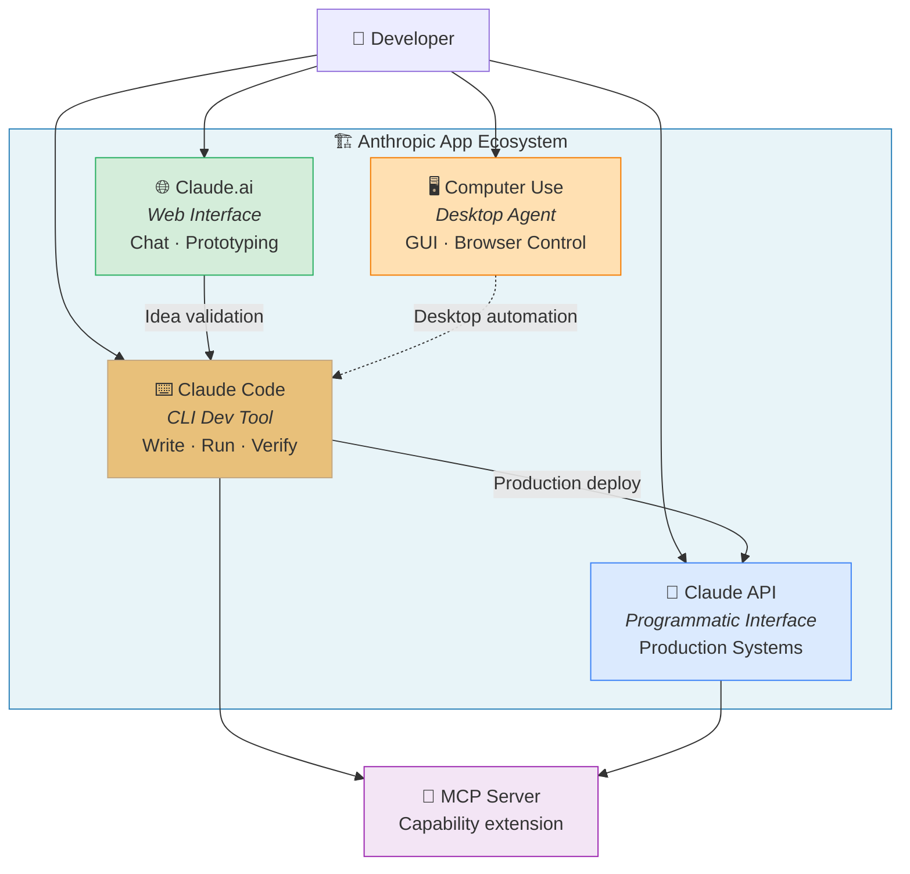

Claude Code is not a mere "AI chat" but a **complete development agent that directly accesses the filesystem, runs code, and manages Git**. Computer Use takes this a step further, expanding the scope to control the **entire desktop environment**. This lecture systematically covers Claude Code's installation, practical use, and MCP extension.

### This Week's Project: Building "A Personal Development-Environment Agent"

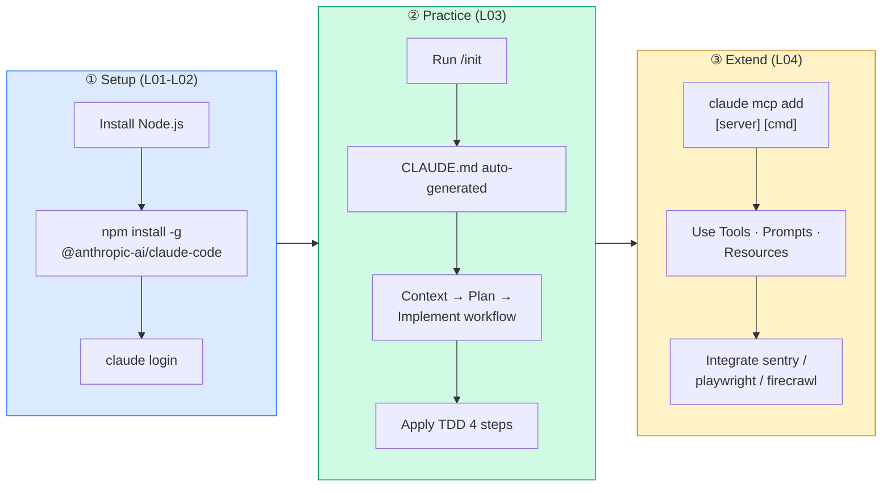

This **three-stage pipeline** is the skeleton of this week. ① Get Claude Code running via install and login, ② use the CLAUDE.md-based workflow to **inject project context systematically**, and ③ attach MCP servers to complete compound workflows like *"pull an error from Sentry, reproduce it with Playwright, and notify Slack."* At the end of this week, we also look at how to apply Claude Code in the **structural engineering domain**.

### Anthropic Skilljar Course

This lecture note is based on Anthropic's official education platform Skilljar's **"Building with the Claude API" Section 7: Anthropic apps — Claude Code and Computer Use** (4 lessons L01~L04).

| Lesson | Title | Week 08 Mapping |
|---|---|---|
| L01 | Anthropic apps | Ch.1 intro — the app ecosystem and learning roadmap |
| L02 | Claude Code setup | Ch.1 — installation and core concepts |
| L03 | Claude Code in action | Ch.2 — `/init`, CLAUDE.md, workflow, TDD |
| L04 | Enhancements with MCP servers | Ch.2 — registering MCP servers and real-world integration |

In the previous week [[Week_07]] we implemented the **internal structure of an MCP server** (FastMCP · Tools · Resources · Prompts) by hand. This week we learn how that MCP ecosystem is **consumed inside an actual product** (Claude Code). Next week [[Week_09]] continues with **agents and workflows** — parallelization, chaining, routing, agent loops — training you to **reproduce with your own hands** what happens inside Claude Code.

> [!ref] Source mapping
> - Online course: [Building with the Claude API](https://anthropic.skilljar.com/claude-with-the-anthropic-api)
> - Skilljar S7 (Anthropic apps): L01-L04
> - Syllabus mapping: **Building — S7 (Anthropic Apps) → W8** (v2.3)
> - Claude Code official docs: [docs.anthropic.com](https://docs.claude.com/en/docs/claude-code)

> [!method] Prerequisites
> - **Install Node.js**: install the LTS version from [nodejs.org/en/download](https://nodejs.org/en/download) (you can check an existing install with `npm help` in the terminal)
> - **Anthropic account**: a browser login prompt appears the first time you run Claude Code
> - **Operating system**: MacOS / Windows WSL / Linux — using Windows cmd/PowerShell alone is not recommended; the most stable environment is **WSL2**
> - **Notebook order**: `S7_01_anthropic_apps.ipynb` (ecosystem concepts) → `S7_02_claude_code.ipynb` (install + workflow simulation) → `S7_03_mcp_extensions.ipynb` (MCP registration) → `S7_04_practice.ipynb` (student practice) → `S7_05_structural_cc.ipynb` (structural engineering domain application)

---
## [Chapter 1] Introducing Anthropic Apps + Claude Code Setup (L01-L02)

### 1.1 The Anthropic App Ecosystem (L01)

Anthropic offers several **applications** simultaneously to put Claude models into developers' hands. In this module we explore two of them — **Claude Code** and **Computer Use**. These two are not just useful tools in their own right; they are also perfect case studies that demonstrate **how AI agents work**. Understanding **how these two products operate internally** forms a solid foundation for building your own agents later.


*Anthropic's main app lineup --- Claude.ai · Claude Code · Computer Use, each offering a different surface on top of the same model*


*Our Plan — the three-stage progression Claude Code → Computer Use → Agents*

#### Our Plan — A Three-Stage Learning Journey

We follow a sequence that **builds understanding layer by layer**.

- **Claude Code** — we start from the **agentic coding assistant** that runs inside a terminal
- **Computer Use** — we explore a toolset that lets Claude interact with **desktop applications**
- **Agents** — we consolidate the common principles that make these apps **successful as agents**

This ordering is intentional. We begin from the most **concrete, tangible example (Claude Code)** and gradually climb toward **general, abstract ideas (Agents)**. Pedagogically, abstract principles stick better once you have internalized concrete instances first.

#### Claude Code — An AI Pair Programmer Inside the Terminal

Claude Code is a **terminal-based coding assistant**. It helps with a variety of programming tasks. Think of it as *"Claude residing in your command line, standing by to help with the following."*

- **File editing and bug fixes** — directly open and modify files in your project
- **Answering coding questions** — questions like "what does this function do?" are answered by actually reading the code
- **Development workflow support** — give natural-language instructions for Git commits, running tests, dependency management, and so on

In this lecture we walk through the full install process and then use Claude Code on an **actual sample project** to see *"exactly how it behaves in practice."*

#### Computer Use — Capabilities Extended to the Entire Desktop

Computer Use pushes Claude's capabilities **much further**. It is a **collection of tools** that lets Claude interact with a **full desktop environment**. That is, Claude can:

- **Access websites and browse the internet** — search, fill out forms, read articles
- **Interact with desktop apps** — drive Excel, PowerPoint, IDEs, specialized GUI programs
- **Perform tasks that require a visual interface** — click buttons, navigate menus, verify things visually

This **dramatically expands the range of what is possible versus text-only interaction**. If Claude Code is self-contained within the terminal, Computer Use pushes that boundary out to **the entire desktop**.

#### Why These Two Apps Matter for Learning Agents

Claude Code and Computer Use serve as **excellent case studies for understanding agents**. They exhibit the **core principles** that make agents effective:

- **Tool integration and usage** — calling external tools and using the results in subsequent decisions
- **Multi-step task execution** — running several sub-tasks sequentially from a single request
- **Environmental interaction** — exchanging information with the outside world (filesystems, the web, the desktop)
- **Autonomous problem-solving** — devising strategies on the fly without a pre-defined script

By analyzing these **real implementation cases** you gain insight into what makes Claude Code and Computer Use successful, and you can fold those insights into your own agent-building work.

#### The Learning Journey Diagram

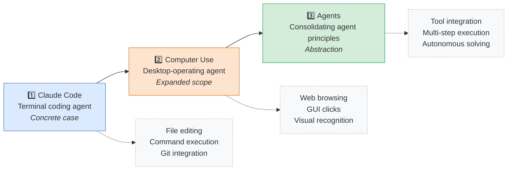

> [!finding] Why "Claude Code First"
> Claude Code compresses every core property of an agent into **a single terminal**. Typing the `claude` command once is far faster to grok than the abstract question "what is an agent?". On top of that, Claude Code has an **MCP client built in**, so the MCP server you built in W07 can be attached immediately — the moment where theory (W07) and practice (W08) meet.

> [!tip] The Decisive Difference Between Claude.ai and Claude Code
> - **Claude.ai (web)** — chat-centric. It "shows" code and explains it beautifully, but **it cannot access real files or execute commands**.
> - **Claude Code (CLI)** — runs **inside your project directory**, so it reads and edits files directly and runs tests.
> - Same Claude model, but the **tools** and the **execution environment (context)** are entirely different. The key is that this is not a model choice — it is a **platform choice**.

> [!action] Practice Notebook
> 📂 `03-Exercises/Week_08/skilljar/S7_01_anthropic_apps.ipynb`
> The notebook visualizes the structure of the Anthropic app ecosystem and the role split between Claude Code and Computer Use, and walks through a **decision tree for picking the right app for each situation**.

#### The App Selection Decision Tree

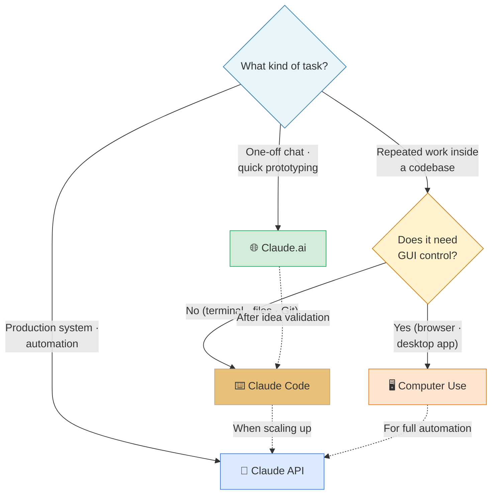

The tree turns on two questions. **(1) How close is the task to the code?** — inside the codebase means Claude Code; external exploration or chat means Claude.ai; production integration means the API. **(2) Do you need to drive a GUI?** — example: opening an Excel file in a specific scenario, editing cells, and taking a screenshot → Computer Use. For most development work, **Claude Code alone is enough**.

> [!ref] Source: Skilljar L01 — Anthropic apps (287787)

---

### 1.2 Claude Code Setup (L02)

Claude Code is a **terminal-based coding assistant that runs right from your command line**. Think of it as *"Claude residing inside your terminal, ready to help with whatever coding task you're working on."*


*Claude Code — an agent that takes natural-language coding instructions inside the terminal*

#### What Claude Code Can Do


*Claude Code's built-in toolset --- file ops, terminal exec, web access, and MCP integration laid out on one screen*

Claude Code comes with a **comprehensive set of tools** that support your development workflow.

- **File operations** — **search, read, and edit** files in your project
- **Terminal access** — **execute commands directly** mid-conversation
- **Web access** — search docs, fetch code examples, and more
- **MCP Server support** — **connect MCP servers** to add extra tools

**The MCP integration is especially powerful** because you can connect **dedicated tools** for databases, APIs, and other internal services to extend Claude Code's capability. The MCP servers from W07 can be attached to Claude Code with a *"single registration line."*

Claude Code works on **MacOS, Windows WSL, and Linux**, so it is available regardless of your dev environment.

#### Installation — Three Steps


*The 3-step Claude Code install — Node.js → npm install -g → claude*

Setting up Claude Code takes only **three steps**.

1. **Install Node.js** — download it from [nodejs.org/en/download](https://nodejs.org/en/download). You can check whether it is already installed by typing `npm help` in the terminal.
2. **Install Claude Code** — install globally with the following command.
   ```bash
   npm install -g @anthropic-ai/claude-code
   ```
3. **Start and log in** — run it by typing `claude` in the terminal.
   ```bash
   claude
   ```

The **first time** you run the `claude` command, you will be **prompted to log in** with your Anthropic account. A browser opens; log in, then copy the token shown on the screen back into the terminal to complete authentication. More detailed setup guides are available at **docs.anthropic.com**.

Once setup is done you are ready to call on Claude **directly from your terminal** for any coding project or task.

#### Install Flow Mermaid

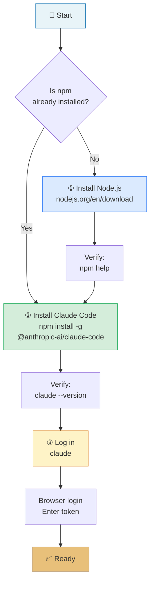

#### OS-Specific Notes

| Operating system | Recommended shell | Notes |
|:---|:---|:---|
| **MacOS** | zsh / bash | You can install Node.js with `brew install node` |
| **Linux** | bash / zsh | Install Node.js through your package manager (`apt`, `dnf`, `pacman`), then proceed the same way |
| **Windows** | **WSL2** (Ubuntu recommended) | More stable than cmd/PowerShell — avoids path-separator and permission issues |

Running Ubuntu on WSL2 is effectively the standard for Windows users. Once set up, you get a developer experience nearly identical to MacOS / Linux.

#### Claude Code Capability Map

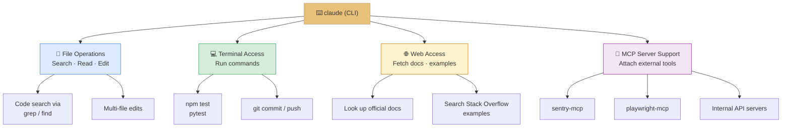

> [!finding] One-line summary — "Why Claude Code Is Different"
> Most other AI coding tools (Copilot, Cursor, etc.) are **IDE plugins**. Claude Code is the **CLI itself**, so it works identically *whatever IDE you use*, *whatever language or framework*, and *even over SSH on a server with no IDE*. It is a **general-purpose dev agent that is not tied to an environment**.

> [!method] Three Things to Verify Right After Install
> 1. **Version check** — `claude --version` prints normally
> 2. **Login state** — the first `claude` run completed the browser auth flow
> 3. **Working directory** — `claude` treats the **current directory (cwd)** as the project root, so always run it from inside your project folder

> [!tip] API Key vs. Subscription Login
> Claude Code supports two auth methods.
> - **Anthropic Console (subscription) login** — browser-based login with a Claude Pro/Team/Enterprise account. Simple usage management under a monthly plan.
> - **API key** — set the `ANTHROPIC_API_KEY` environment variable. Suited to team sharing and server automation.
> For personal learning in this course, the simplest path is **subscription login**.

> [!action] Practice Notebook
> 📂 `03-Exercises/Week_08/skilljar/S7_02_claude_code.ipynb`
> The notebook visualizes (1) an install script simulation, (2) the internal structure of the prompt that Claude Code receives, and (3) how the file, terminal, and web tools are kept separate.

> [!ref] Source: Skilljar L02 — Claude Code setup (287788)

---

### 1.3 Permission System and Settings Files (Supplementary)

> [!tip] **Supplementary** — this section does not appear directly in the Skilljar lesson; it consolidates **permission and settings** issues you'll often hit in practice. It summarizes content from the official docs (`docs.claude.com`), so treat it as reference.

Because Claude Code **writes** files, **executes** terminal commands, and sometimes calls external APIs, it has a permissions system that requires **your explicit consent**.

#### First-Use Consent Prompts

The first time you run `claude` and request something that involves editing files or running commands, you go through a **three-stage trust setup**.

1. **Edit permissions** — approve "May I modify files in this folder?"
2. **Bash permissions** — approve "May I run commands?"
3. **Fetch permissions** — approve "May I reach out to external URLs?"

Each category offers **Allow** / **Deny** / **Ask each time**. Beginners on a project are safest picking *"Ask each time"* and approving situationally.

#### Design Philosophy of the Permission System

Claude Code's permission model aims for a balance between *"being useful"* and *"being safe."* A fully autonomous agent might accidentally execute `rm -rf`; the opposite extreme, confirming every action, would break the workflow. The answer is a two-layer scheme: **explicit policy (settings.json) + default interactive approval**. Automate frequent, safe commands (`pytest`, `npm test`) with `allow`; gate potentially risky commands (`git push`, `rm *`) with `ask`; and ban outright-dangerous commands (`sudo *`) with `deny`.

#### settings.json Structure

Global user settings live in `~/.claude/settings.json`. Project-scoped settings live in `.claude/settings.json` at the project root.

```json
{
  "theme": "dark",
  "permissions": {
    "allow": ["Bash(npm test)", "Bash(pytest)", "Bash(git status)"],
    "ask": ["Bash(git push)", "Bash(rm *)"],
    "deny": ["Bash(sudo *)"]
  },
  "env": {
    "NODE_ENV": "development"
  }
}
```

- `permissions.allow` — always allowed (auto-approved)
- `permissions.ask` — prompts before each execution
- `permissions.deny` — never allowed

#### Permission Hierarchy Mermaid

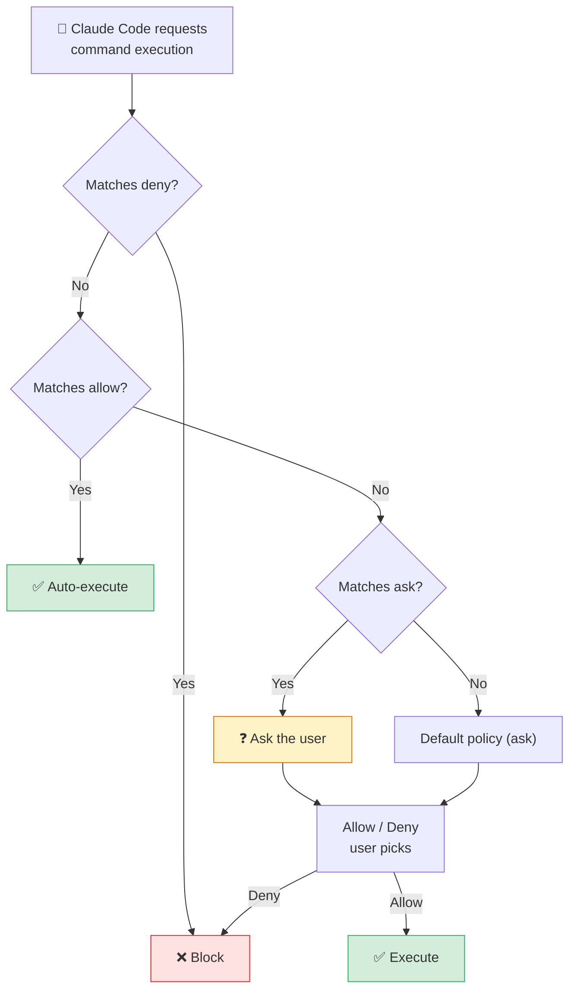

> [!method] Recommended Permission-Management Scenarios
> - **Personal learning projects** — mostly `ask`. Prevents accidental file loss.
> - **Team projects** — commit `.claude/settings.json` to Git. The whole team shares a single permission policy.
> - **CI/CD environments** — only whitelist the needed commands under `allow`. Block `sudo`, `rm -rf`, etc. with `deny`.

> [!ref] Supplementary — official docs
> - [Claude Code — Configuration](https://docs.claude.com/en/docs/claude-code/settings) (outside Skilljar)
> - [Claude Code — Security and permissions](https://docs.claude.com/en/docs/claude-code/security)

---
## [Chapter 2] Claude Code in Practice + MCP Extension (L03-L04)

### 2.1 Claude Code in Action (L03)

Claude Code is **not merely a tool for writing code** — it is designed to work alongside the developer through **every stage** of a software project. Think of it as another engineer newly joined to the team: a colleague capable of **handling every stage** from initial setup through deployment and support.


*The scope of Claude Code's partnership — across the full project lifecycle (setup · dev · test · deploy · support)*

#### Project Lifecycle and Claude Code

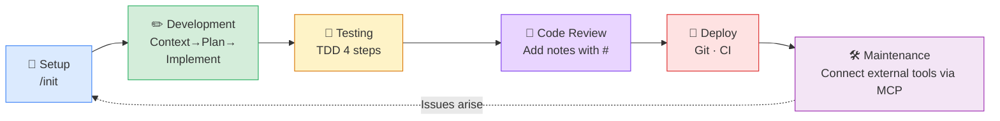

The Skilljar lesson is arranged so that you actually experience **setup (/init)**, **development (Context→Plan→Implement)**, and **testing (TDD)** from this flow.

#### The /init Command — Project Indexing


*Running `/init` --- the first step that scans the codebase and auto-drafts CLAUDE.md*

**The first thing to do** when starting work on a project with Claude Code is run the `/init` command. This command tells Claude to **scan the entire codebase** so it understands the project's **structure, dependencies, coding style, and architecture**.

```bash
> /init
```

Claude summarizes everything it has learned into a **special file** called `CLAUDE.md`. This file is **automatically included in the context of every future conversation**, so Claude keeps remembering the important details of your project.

#### CLAUDE.md — The Three Scopes


*CLAUDE.md's three scopes — Project · Local · User*

CLAUDE.md can exist in several places, split by different **scopes**.

- **Project** — a file **shared among all engineers working on the project** (usually committed to Git)
- **Local** — **personal notes that are not checked into Git** (your environment, preferences, etc.)
- **User** — settings **that apply across all projects** (global preferences, frequently used command templates, etc.)

When you run `/init`, you can also **add special instructions** to focus on a specific area. The generated file includes **build commands, coding guidelines, and project-specific patterns** for Claude to follow.

#### The # Command — Quickly Adding Notes

The `#` command lets you **quickly add a note** to a CLAUDE.md file. For example:

```bash
> # Always use descriptive variable names
```

When you enter that, you'll be prompted to choose which memory — **Project / Local / User** — to append it to. If a convention worth remembering pops into your head mid-conversation, you can record it right away with `#`.

#### CLAUDE.md Scope Matrix

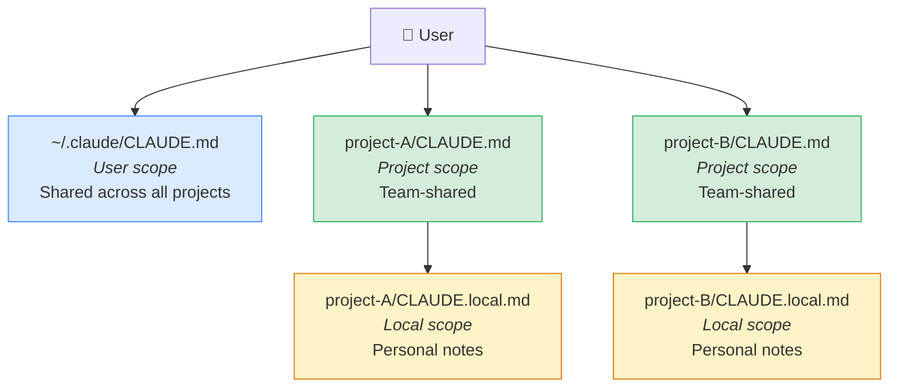

> [!finding] The Power of CLAUDE.md
> CLAUDE.md is not **"Claude's memory"** but a file that **"auto-injects the project's memory into Claude."** Because it is included in the system prompt on every new conversation, you never have to re-explain *"our project uses TypeScript and Jest..."* The result is **team-scale prompt engineering**.

#### The Common Workflow — Context → Plan → Implement

Claude works best when you think of it as an **effort multiplier**. **The more context and structure you provide, the better the result**. The most effective workflow is as follows.


*The Claude Code workflow diagram --- the staged collaboration pattern from context injection through implementation*


*Common Workflow — the three stages Context → Plan → Implement*

##### Step 1 — Feed Context into Claude

**Before asking Claude to build something**, first **identify the files in the codebase related** to the feature you want to build. Then ask Claude to *read and analyze those files first*. This step gives Claude **examples of coding patterns** and **existing functionality** to build on.

```bash
> Read the math.py and document.py files
```

##### Step 2 — Tell Claude to Plan a Solution

Instead of jumping straight into implementation, ask Claude to **think deeply about the problem and produce a plan**. Explicitly tell it *"do not write any code yet"* — focus only on **the approach and the steps needed**.

```bash
> Don't write any code yet. Plan to implement a new tool that converts
  a document file at a given path to markdown.
```

##### Step 3 — Ask Claude to Implement the Solution

Once a solid plan is in place, ask it to **implement the plan**. Claude writes code grounded in the **context and plan** you built together earlier.

```bash
> Implement the plan
```

##### The 3-Step Workflow Mermaid

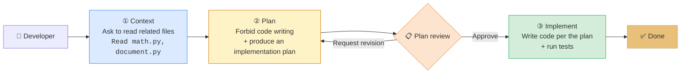

> [!tip] Why Separate Out the "Plan" Step
> If you immediately ask *"implement feature X,"* Claude will produce plausible-looking code instantly but tends to **ignore existing abstractions in the project**. Asking it to "only plan" surfaces a **natural-language design you can review first**, letting you correct course at this stage. Implementation afterward converges on the right answer with **far fewer edits** — the key trick is to get Claude to follow its own plan.

#### Test-Driven Development (TDD) Workflow

For even better results, you can adopt a **test-driven approach**.


*TDD Workflow — context → test cases → test implementation → code that passes the tests*

1. **Feed context into Claude** — show it the relevant files as before
2. **Ask Claude to think of test cases** — have Claude **brainstorm which tests would validate the new feature**
3. **Ask Claude to implement those tests** — pick the most relevant tests and have Claude write them
4. **Ask Claude to write code that passes the tests** — Claude **iterates on the implementation** until all tests pass

This approach gives Claude **clear success criteria** to work against, so it often produces **more robust code**.

#### TDD 4-Step Mermaid

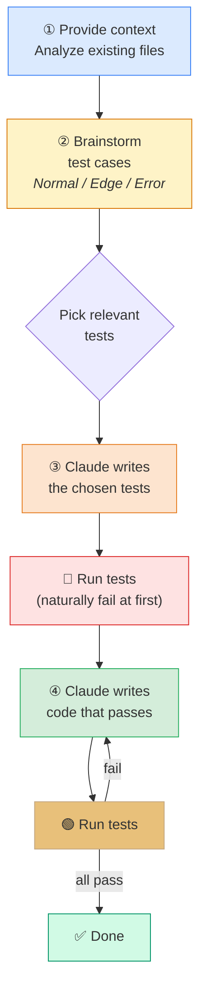

#### Worked Example — Adding a `document_path_to_markdown` Tool

Let's look at **what these workflows look like in practice**. Suppose we want to add a **document-conversion tool** to an existing project.

```text
// First, ask Claude to read the relevant files
> Read the math.py and document.py files

// Then request a plan (no implementation yet)
> Plan to implement document_path_to_markdown tool:
1. Create a function that:
   - Takes a file path parameter
   - Validates the file exists
   - Determines file type from extension
   - Reads binary data from file
   - Leverages existing binary_document_to_markdown function
   - Returns markdown string
2. Add appropriate documentation
3. Register the tool with MCP server
4. Add tests

// Finally, request the implementation
> Implement the plan
```

Claude then **creates the function**, **updates the necessary files**, **writes tests**, and **even runs the test suite to verify everything works**.

#### Dissecting the Example — Why This Structure

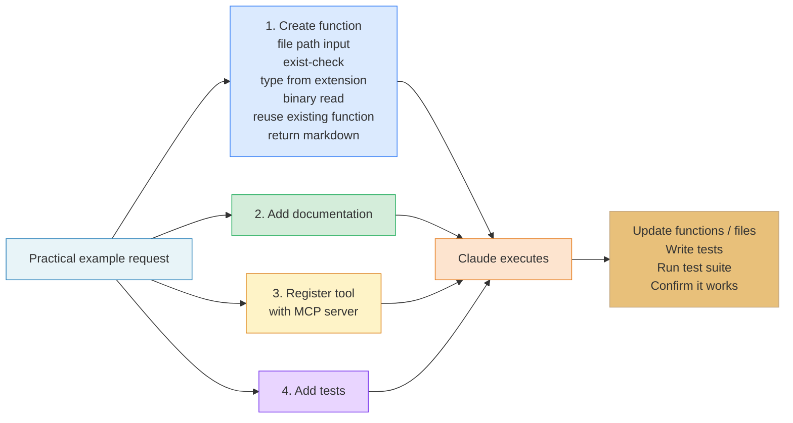

The **lesson** of this example is how **concrete** the plan is. It does not stop at "add a tool" — it specifies the function's **input, validation, processing, return**, and all the **side tasks (docs, registration, tests)** in natural language. If **you find it hard to write a plan at this level yourself**, asking Claude to "plan first" is the right move.

#### Additional Commands

Claude Code includes several useful commands.

- **`/clear`** — **wipes conversation history and resets context**. Use when the task context changes and earlier chat is causing confusion.
- **`/init`** — **scans the codebase and generates a CLAUDE.md file**. Run this first when starting a new project.
- **`#`** — **appends a note to the CLAUDE.md file**. Save conventions or caveats the moment they come up during work.

Claude can also handle everyday development chores such as **Git staging and commits, running tests, and dependency management**. Instead of juggling between editor and terminal, you can say *"commit this change"* or *"run the build"* and let Claude take over while you **focus on the bigger picture**.

The key to using Claude Code well is to remember *"this is not just a code generator; it is designed as a collaboration partner."* The more context and structure you provide, the more effectively Claude can help you build and maintain your project.

#### Five Frequently Used Natural-Language Patterns

| Intent | Natural-language example | What Claude Code does |
|:---|:---|:---|
| Understand a file | *"Explain the main functions of `utils/parser.py`"* | Read → summarize |
| Spec-based implementation | *"Create a Pydantic model matching this JSON schema"* | Analyze schema → write model |
| Diagnose bugs | *"Here is a failing test log, find the cause"* | Analyze stack trace → propose hypotheses |
| Refactor | *"Merge this duplicate logic into a single util function"* | Grep → Edit (multiple files) |
| Git workflow | *"Review the changes and split them into meaningful commits"* | diff analysis → split staging → commit |

#### Command Reference Card

| Command | Role | When to use |
|:---|:---|:---|
| `/init` | Scan codebase · auto-generate CLAUDE.md | **First onboarding to a project** |
| `/clear` | Reset conversation history · clear context | **When task context changes** |
| `#` | Append a note to CLAUDE.md | **The moment you discover a rule / convention** |
| (natural language) | Edit files · run tests · Git ops | **General development work** |

> [!method] Recommended Session Structure in Practice
> 1. Starting a new feature → `/clear` to wipe the previous context
> 2. Have Claude read the relevant files to build context
> 3. *"Don't write code yet, plan only"* → review the plan → approve
> 4. *"Implement per the plan"* → Claude edits files and runs tests
> 5. Save any newly found convention to CLAUDE.md with `#` as it arises
> 6. Ask for the commit message in natural language as well — including Git in the wrap-up

> [!tip] Why TDD Pairs Especially Well with Claude
> Tests tell Claude *"what the correct result looks like"* in a **mechanically verifiable form**. Claude can therefore use the test run results as feedback to **self-correct** — with minimal human intervention yet higher quality. This is also a miniature of the **"agent loop"** you will learn in W09.

> [!action] Practice Notebooks
> 📂 `03-Exercises/Week_08/skilljar/S7_02_claude_code.ipynb` (setup and a basic session)
> 📂 `03-Exercises/Week_08/skilljar/S7_04_practice.ipynb` (Context→Plan→Implement, TDD practice template)
> The notebooks reproduce the conversation log of an actual Claude Code session and trace, step by step, how the input/output/internal tool calls at each stage are composed.

> [!ref] Source: Skilljar L03 — Claude Code in action (287805)

---

### 2.2 Extending Claude Code with MCP Servers (L04)

Claude Code has an **MCP client built right into it**. That means that **simply connecting an MCP server** can **dramatically extend** what Claude can do. This opens up **very powerful possibilities** for customizing your dev workflow.

#### How MCP Extends Claude Code


*Extending Claude Code with MCP --- reaching external systems that built-in tools alone cannot touch*


*MCP extends Claude Code — built-in capabilities + external servers' Tools · Prompts · Resources*

The Model Context Protocol (MCP) lets Claude Code connect to **external services and tools**. It does this through **MCP servers**. Rather than being **limited to Claude's built-in capabilities**, you can add **custom functionality** by connecting servers that expose **specific Tools · Resources · integrations**.

Each MCP server can expose different kinds of functionality to Claude through **three main components**.

- **Tools** — for taking actions
- **Prompts** — for templates
- **Resources** — for accessing data

This structure is precisely the same as what you saw in [[Week_07]] when **building a server by hand with FastMCP**. Where W07 focused on the **provider side**, W08 focuses on the **consumer side** — that is, *"how to consume an MCP server."*

#### How to Register an MCP Server

Adding an MCP server to Claude Code is **simple**. You register the server from the command line.

```bash
claude mcp add [server-name] [command-to-start-server]
```

For example, if you have a **document-processing server** started with `uv run main.py`, run:

```bash
claude mcp add documents uv run main.py
```

Once registered, Claude Code **automatically connects to the server on startup**. You don't need to start the server manually each time.

#### Example — Document Processing


*Example — connecting an MCP server that converts PDF/Word docs into markdown*

A practical example is building a tool that lets **Claude read PDF and Word documents**. Build an MCP server with a **"document_path_to_markdown"** tool, and then you can ask Claude to **convert document contents into markdown**.

Ask `"Convert the tests/fixtures/mcp_docs.docx file to markdown"` and it automatically **uses the custom tool** to read the file and return the converted content.


*The run result — Claude calls the custom tool and returns the docx → markdown conversion*

This is the scene where the **FastMCP server** you built in W07 actually runs inside Claude Code. The `tools/call → result` JSON-RPC round trip is **fully automated** by the single line `claude mcp add`.

#### MCP Extension Flow Mermaid

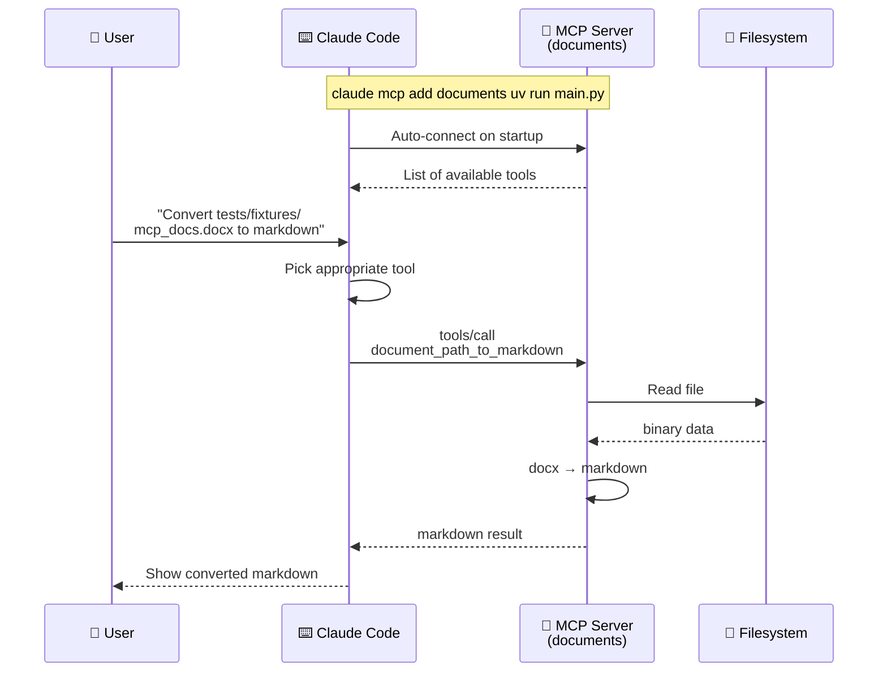

#### Popular MCP Integrations


*A glance at popular MCP integrations --- a catalog of servers widely adopted across the modern dev workflow*


*Popular MCP integrations — sentry-mcp · playwright-mcp · figma-context-mcp · mcp-atlassian · firecrawl-mcp-server · slack-mcp*

The MCP ecosystem includes servers for **many common dev tools and services**.

- **sentry-mcp** — **automatically finds and fixes** bugs logged in Sentry
- **playwright-mcp** — gives Claude **browser automation** for testing and troubleshooting
- **figma-context-mcp** — exposes **Figma designs** to Claude
- **mcp-atlassian** — lets Claude access **Confluence and Jira**
- **firecrawl-mcp-server** — adds **web scraping** to Claude
- **slack-mcp** — lets Claude **post messages or reply in specific threads**

This list contains the **server names exactly as they appear** in the Skilljar transcript. Each server is typically runnable from its **GitHub repo** via `npx` / `uvx` / Docker and install instructions live in the repo README.

#### A Matrix of Representative MCP Servers

| Server name | Primary domain | Core capability | Real-world scenario |
|:---|:---|:---|:---|
| `sentry-mcp` | Error monitoring | Fetch and analyze Sentry issues | Claude diagnoses/fixes production errors |
| `playwright-mcp` | Browser automation | Open pages, click, take screenshots | Generate E2E tests, reproduce UI bugs |
| `figma-context-mcp` | Design integration | Expose Figma file structure / assets | Design → code conversion |
| `mcp-atlassian` | Issue tracking | Read Jira issues · Confluence pages | Implement based on ticket requirements |
| `firecrawl-mcp-server` | Web scraping | Crawl pages · convert to markdown | Fetch latest docs · competitive analysis |
| `slack-mcp` | Team communication | Post messages · reply in threads | Auto-notify team on task completion |

#### Building Dev Workflows — Combining Multiple MCPs

**The real power** comes from **combining multiple MCP servers that match your specific development process**. For example, you might set up:

- **Sentry server** — fetch production error details
- **Jira server** — read ticket requirements
- **Slack server** — notify the team when work is done
- **Custom server** — connect to internal tools and APIs

With this arrangement, you create a **dev environment** in which Claude can **work smoothly with every tool and service you already use**. It becomes a **customized, much more powerful coding assistant** tailored to your workflow.

#### Combination Example — "Error → Reproduce → Fix → Notify" Pipeline

```mermaid
graph LR
    ERR["🚨 Production error"] -->|"sentry-mcp"| S["Claude fetches<br/>error details"]
    S -->|"mcp-atlassian"| J["Look up related<br/>Jira ticket"]
    J -->|"playwright-mcp"| P["Reproduce the error<br/>in a browser"]
    P --> FIX["Claude writes<br/>the fix"]
    FIX -->|"Built-in file tools"| COMMIT["Commit & PR"]
    COMMIT -->|"slack-mcp"| N["Notify team Slack<br/>that work is done"]

    style ERR fill:#fee2e2,stroke:#dc2626
    style S fill:#fef3c7,stroke:#d97706
    style J fill:#dbeafe,stroke:#3b82f6
    style P fill:#e9d5ff,stroke:#7c3aed
    style FIX fill:#d4edda,stroke:#27ae60
    style COMMIT fill:#fde4cf,stroke:#e67e22
    style N fill:#d1fae5,stroke:#059669
```

This one-line flow — *"detect error → check ticket → reproduce in browser → fix code → notify"* — is a chain that developers originally performed **by jumping manually between apps**. Register a handful of MCP servers with Claude Code, and one natural-language sentence *"fix the last three Sentry errors against the Jira tickets"* runs the entire thing automatically.

#### Example Configurations Bundling Multiple MCP Servers

Let's look at a couple of combinations that appear frequently in practice.

**Case A — "Requirements → Implementation → Deploy" full-stack pipeline**

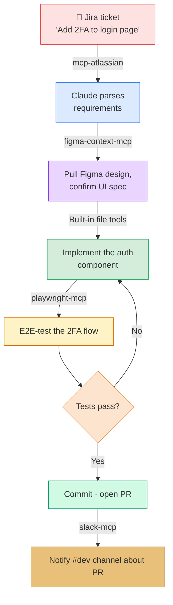

**Case B — "Collect docs → Summarize → Update knowledge base" research pipeline**

```mermaid
graph LR
    Q["🔍 Topic question<br/>'Latest trends in<br/>LLM alignment'"] -->|"firecrawl-mcp-server"| F["Fetch recent blog posts<br/>and paper PDFs"]
    F --> S["Claude summarizes<br/>+ compares the key points"]
    S -->|"Built-in file tools"| W["Write notes/<br/>llm-alignment.md"]
    W -->|"mcp-atlassian"| C["Update Confluence<br/>knowledge base"]
    C -->|"slack-mcp"| T["Announce the new note<br/>in the research channel"]

    style Q fill:#dbeafe,stroke:#3b82f6
    style F fill:#fde4cf,stroke:#e67e22
    style S fill:#d4edda,stroke:#27ae60
    style W fill:#fef3c7,stroke:#d97706
    style C fill:#e9d5ff,stroke:#7c3aed
    style T fill:#e8c07a,stroke:#c4a882,color:#333
```

**Case C — "Paper search → Metadata curation → Zotero registration" bibliography pipeline**

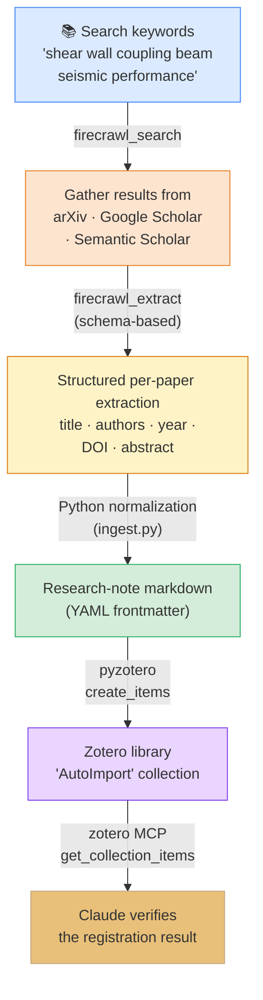

This compresses the most common repetitive task in a research group — *"find dozens of papers → manually copy metadata → register one-by-one in Zotero"* — into a single natural-language sentence: *"Organize 20 papers from the last 5 years on shear wall coupling beams into Zotero."* Three components are wired in series — **firecrawl-mcp** (web collection) · **Python + pyzotero** (normalization · writing) · **zotero-mcp** (verification) — and the Zotero collection fills itself without a human touching it.

##### Case C Demo — Step-by-Step Usage

###### Environment Setup — A Step-by-Step Guide for First-Time Students (Mac / Windows)

> [!finding] Core concept — **"Just register a publicly available MCP server"**
> Students do **not** need to code an MCP server themselves at all. The two servers used in this demo — `firecrawl-mcp` (npm) · `zotero-mcp` (PyPI) — are already published as **finished open-source products**. A single `claude mcp add` line automatically fetches the product and wires it into Claude Code. In other words, this setup is not about *"what do I download"* but about *"what alias do I register it under."*

**Components at a glance**

| Component        | Distribution       | How Claude Code invokes it          | Install command |
|------------------|--------------------|-------------------------------------|-----------------|
| Firecrawl MCP    | npm (`firecrawl-mcp`)    | `npx -y firecrawl-mcp` (auto-fetch)  | No separate install — `npx` handles it |
| Zotero MCP       | PyPI (`zotero-mcp`)      | `uvx zotero-mcp` (auto-fetch)        | No separate install — `uvx` handles it |
| pyzotero (write) | PyPI (`pyzotero`)        | Imported directly by the Python script | `pip install pyzotero` |

> [!tip] Where do you find other MCP servers?
> - Official reference list: <https://github.com/modelcontextprotocol/servers>
> - Community registries: <https://glama.ai/mcp/servers> · <https://smithery.ai/>
> Whenever you want to use a new server, copy the `claude mcp add` one-liner from its README — that's it.

**Step 0 — Pre-flight checklist (in five minutes before class)**

- [ ] Node.js 18+ installed → `node --version`
- [ ] Python 3.11+ and `uv` installed → `uv --version`
- [ ] Claude Code CLI installed + logged in → `claude --version`
- [ ] Zotero 7+ desktop app running
- [ ] Firecrawl free account + API key obtained

**Step 1 — Install Node.js · Python · uv**

> [!tip]- 🍎 macOS — using Homebrew (recommended)
>
> ```bash
> # If Homebrew is not installed yet
> /bin/bash -c "$(curl -fsSL https://raw.githubusercontent.com/Homebrew/install/HEAD/install.sh)"
>
> brew install node          # Node.js + npm + npx
> brew install uv            # Python package runner (includes uvx)
>
> node --version             # v20.x or higher
> uv --version               # uv 0.x
> ```
>
> If Homebrew is blocked, download the .pkg from the official Node installer (<https://nodejs.org/>) and double-click.

> [!tip]- 🪟 Windows — using winget (built into Windows 10/11)
>
> Run PowerShell as administrator:
>
> ```powershell
> winget install OpenJS.NodeJS.LTS    # Node.js 20 LTS
> winget install astral-sh.uv         # uv (Python runner)
>
> # Open a fresh PowerShell window and verify
> node --version
> uv --version
> ```
>
> If winget is blocked:
> - Node.js: download `.msi` from <https://nodejs.org/> → run the installer (just click Next)
> - uv: in PowerShell, `powershell -ExecutionPolicy ByPass -c "irm https://astral.sh/uv/install.ps1 | iex"`

**Step 2 — Install Claude Code CLI + log in** (Mac / Windows, same)

```bash
npm install -g @anthropic-ai/claude-code
claude login                           # log into your Anthropic account via the browser
claude --version                       # confirm install
```

You should already have this from W01. If not, the one-liner above is all you need.

**Step 3 — Install Zotero desktop + enable the Local API** (Mac / Windows, same)

1. Download the OS-appropriate installer from <https://www.zotero.org/download/> (Mac `.dmg` · Windows `.exe`).
2. Open Zotero → menu **Edit / 편집 → Settings / 설정 → Advanced / 고급** tab.
3. **Check** *"Allow other applications on this computer to communicate with Zotero"* (in Korean UI: *"다른 응용 프로그램이 Zotero 와 통신하도록 허용"*).
4. **Keep Zotero running** — close it and MCP communication drops too.
5. (Optional) Installing the Better BibTeX plugin makes citation-key generation and citation export easier.

This option must be enabled so that the `ZOTERO_LOCAL=true` mode of zotero-mcp talks to the local API at `http://localhost:23119`. The whole point of this mode is that **it works without issuing a cloud API key**.

**Step 4 — Create a free Firecrawl account + issue an API key**

1. Visit <https://www.firecrawl.dev/> → *Sign up* (GitHub or a one-line email).
2. Dashboard left side **API Keys** → *Create Key* → copy the issued `fc-xxxxxxxx...` token.
3. The free plan covers **500 scrape · search calls per month** — plenty for the demo and assignments.
4. Storing the token in an environment variable keeps the next-step commands tidy.

> [!tip]- 🍎 macOS / Linux — store the env variable (zsh · bash)
>
> ```bash
> echo 'export FIRECRAWL_API_KEY="fc-xxxxxxxx..."' >> ~/.zshrc
> source ~/.zshrc
> echo $FIRECRAWL_API_KEY        # verify
> ```

> [!tip]- 🪟 Windows PowerShell — persist a User-scope env variable
>
> ```powershell
> [System.Environment]::SetEnvironmentVariable(
>     "FIRECRAWL_API_KEY","fc-xxxxxxxx...","User")
> # Open a fresh PowerShell window to apply
> $env:FIRECRAWL_API_KEY        # verify
> ```

**Step 5 — Register the two MCP servers with Claude Code** (the key step)

Command shape:

```
claude mcp add  <alias>  <runner>  --  <package options...>
                 │        │             │
                 │        │             └─ args passed to the server itself (e.g. -y package-name, -e KEY=VAL)
                 │        └─ how to run it (npx, uvx, python, docker, ...)
                 └─ the alias Claude uses when invoking the server
```

> [!tip]- 🍎 macOS / Linux — bash · zsh
>
> ```bash
> # ① Firecrawl MCP — npx auto-downloads firecrawl-mcp from npm
> claude mcp add firecrawl npx -- -y firecrawl-mcp \
>   -e FIRECRAWL_API_KEY=$FIRECRAWL_API_KEY
>
> # ② Zotero MCP — uvx auto-downloads zotero-mcp from PyPI
> claude mcp add zotero uvx -- zotero-mcp \
>   -e ZOTERO_LOCAL=true
> ```

> [!tip]- 🪟 Windows — PowerShell (the backtick `` ` `` is the line-continuation character)
>
> ```powershell
> claude mcp add firecrawl npx -- -y firecrawl-mcp `
>   -e FIRECRAWL_API_KEY=$env:FIRECRAWL_API_KEY
>
> claude mcp add zotero uvx -- zotero-mcp `
>   -e ZOTERO_LOCAL=true
> ```

Once this succeeds, it gets recorded in Claude Code's config file (`~/.claude/.../config.json`), and from then on every `claude` run **auto-starts and auto-connects** the servers. Students do not need to re-download anything each time.

**Step 6 — Install the Python library (for Zotero writes)**

```bash
pip install pyzotero          # Mac · Windows · Linux, same
# or, if you're on uv,
uv pip install pyzotero
```

**Step 7 — Verify the connection**

```bash
claude mcp list
# Expected output:
# firecrawl  ✓ connected   (npx -y firecrawl-mcp)
# zotero     ✓ connected   (uvx zotero-mcp)
```

Open a Claude Code session and confirm once more in natural language:

```
"Show me the tool lists from both the firecrawl server and the zotero server."
```

When Claude calls `tools/list` on each server and lists things like `firecrawl_search`, `firecrawl_extract`, `zotero_get_collections`, `zotero_get_collection_items`, the setup is done.

> [!action] The three things students get stuck on most often (be ready during the demo)
> - **`npx` is slow or fails** → typically because the school or dorm firewall blocks the npm registry. Try a phone hotspot, or set a mirror with `npm config set registry https://registry.npmmirror.com`.
> - **Zotero MCP returns `connection refused`** → the Zotero app is closed, or the *"Allow other applications"* setting from Step 3 is off. This is by far the most common cause.
> - **Tools still don't show up after `claude mcp add`** → you must **restart the Claude Code session once** after registration. Type `exit` and rerun `claude`.

**Step 1 — Search papers and extract metadata with Firecrawl**

In the Claude Code session, give the instruction in a single natural-language sentence.

```
"Use firecrawl to search arxiv.org and scholar.google.com with the keywords
'shear wall coupling beam seismic performance' for 20 papers since 2020.
From each result, do schema-based structured extraction of
title · authors(list) · year · doi · abstract, and save the JSON to
~/research_collect/raw.json."
```

The two-stage tool calls Claude makes internally (invisible to students):

```python
# 1) search candidate URLs
firecrawl_search(
    query="shear wall coupling beam seismic performance after:2020",
    sources=[{"type": "web", "site": "arxiv.org"},
             {"type": "web", "site": "scholar.google.com"}],
    limit=20,
)

# 2) schema-based metadata extraction from each URL
firecrawl_extract(
    urls=[...20 URLs...],
    prompt="Extract paper metadata fields.",
    schema={
        "type": "object",
        "properties": {
            "title":    {"type": "string"},
            "authors":  {"type": "array", "items": {"type": "string"}},
            "year":     {"type": "integer"},
            "doi":      {"type": "string"},
            "abstract": {"type": "string"},
        },
        "required": ["title", "authors", "year"],
    },
)
```

> [!tip] Reducing search noise
> Domain or category filters like arXiv's `cat:cs.LG` or Google Scholar's `site:journals.elsevier.com` substantially improve result quality. You can also add sources in a single line — e.g. *"Search Semantic Scholar as well."*

**Step 2 — Normalize with Python + emit Markdown + bulk-register in Zotero**

`raw.json` has missing fields and inconsistent formats across sites. **Handle the deterministic logic in Python**, while writing to Zotero at the same time.

```python
# ~/research_collect/ingest.py
import json, re, unicodedata
from pathlib import Path
from datetime import date
from pyzotero import zotero

RAW = Path("~/research_collect/raw.json").expanduser()
OUT = Path("~/research_collect/papers").expanduser()
OUT.mkdir(parents=True, exist_ok=True)

# --- 1. Zotero connection (local mode · no API key required) ---
zot = zotero.Zotero(library_id=0, library_type="user", local=True)

# Make sure the 'AutoImport' collection exists (create it if missing)
existing = {c["data"]["name"]: c["key"] for c in zot.collections()}
if "AutoImport" in existing:
    target_key = existing["AutoImport"]
else:
    resp = zot.create_collections([{"name": "AutoImport"}])
    target_key = resp["successful"]["0"]["key"]

# --- 2. Generate the BibTeX key (lastname + year + firstword) ---
def bib_key(authors, year, title):
    last  = unicodedata.normalize("NFKD", authors[0].split()[-1])\
                       .encode("ascii", "ignore").decode().lower()
    first = re.sub(r"[^a-zA-Z]", "", title.split()[0]).lower()
    return f"{last}{year}{first}"

# --- 3. Iterate raw.json → markdown + Zotero item payload ---
papers = json.loads(RAW.read_text(encoding="utf-8"))
zot_items = []

for p in papers:
    p["authors"]  = p["authors"] if isinstance(p["authors"], list) else [p["authors"]]
    p.setdefault("doi", "")
    p.setdefault("abstract", "")
    p["key"] = bib_key(p["authors"], p["year"], p["title"])

    # (a) metadata markdown note — YAML frontmatter + body
    md = f"""---
title: "{p['title']}"
authors: {p['authors']}
year: {p['year']}
doi: "{p['doi']}"
bibkey: {p['key']}
tags: [paper/auto-import, year/{p['year']}]
imported: {date.today().isoformat()}
---

## Abstract
{p['abstract']}

## Notes
- [ ] read body
- [ ] extract quotable passages
- [ ] note relationship to this study
"""
    (OUT / f"{p['key']}.md").write_text(md, encoding="utf-8")

    # (b) fill the Zotero item template
    t = zot.item_template("journalArticle")
    t["title"]        = p["title"]
    t["creators"]     = [{"creatorType": "author",
                          "firstName": " ".join(n.split()[:-1]),
                          "lastName":  n.split()[-1]}
                         for n in p["authors"]]
    t["date"]         = str(p["year"])
    t["DOI"]          = p["doi"]
    t["abstractNote"] = p["abstract"]
    t["tags"]         = [{"tag": "auto-import"},
                         {"tag": f"year/{p['year']}"}]
    t["collections"]  = [target_key]
    zot_items.append(t)

# --- 4. Register in batches of 30 (Zotero API max ≈ 50 per call) ---
for chunk in (zot_items[i:i+30] for i in range(0, len(zot_items), 30)):
    resp = zot.create_items(chunk)
    print(f"  batch: {len(resp['successful'])} succeeded · {len(resp['failed'])} failed")

print(f"✅ {len(papers)} markdown notes → {OUT}")
print(f"✅ {len(zot_items)} items registered in the Zotero 'AutoImport' collection")
```

Telling Claude *"run the script above"* triggers `python ingest.py` via the `Bash` tool, which in a single shot:

1. Creates one `papers/<bibkey>.md` per paper (with YAML frontmatter — importable by any note tool later)
2. Auto-fills the Zotero **AutoImport** collection (immediately visible in the Zotero app)

> [!finding] Why pyzotero instead of MCP?
> The `zotero-mcp` server today exposes mostly **read-oriented tools** (search · get · annotations). **Bulk creation of new items** — a deterministic, transactional workload — is more reliable through the Python library (`pyzotero`). Use MCP at the *"natural-language interface is valuable"* points — search · verification · summarization — and use Python for deterministic writes. **This MCP × Python role separation** is the heart of a stable pipeline.

**Step 3 — Verify the registration result with Zotero MCP**

This is the final step to show students. Claude verifies it *without opening the Zotero app directly*.

```
"For the 'AutoImport' collection I just populated, show me the item count
and a table of the title · authors · year of the five most recently added entries."
```

The zotero MCP tools Claude calls automatically:

```python
zotero_get_collections()
# → find the key of the 'AutoImport' collection

zotero_get_collection_items(
    collection_key="<AutoImport key>",
    limit=5,
    sort="dateAdded",
    direction="desc",
)
```

The response is rendered as a table like *"AutoImport collection: 20 items total. Most recent 5: ① Zhang et al. (2024) … ② Park et al. (2023) …"*. **Refresh the Zotero desktop app** to confirm the same collection appears there — and the demo is done.

> [!action] One-liner commands to demo in the classroom (summary)
> 1. **Collect**: *"With firecrawl, search 'shear wall coupling beam' 2020+ for 20 papers and save raw.json"*
> 2. **Convert · register**: *"Run ingest.py to generate papers/ markdown and bulk-register them in the Zotero AutoImport collection"*
> 3. **Verify**: *"Show me the most recent 5 entries in the AutoImport collection"*

##### The "MCP × Python × MCP" Composition Pattern That Case C Demonstrates

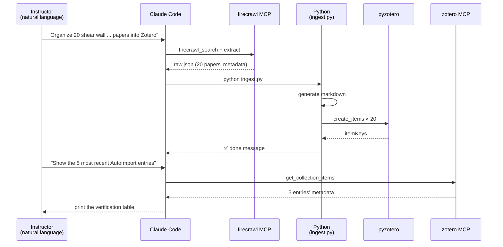

Where Cases A and B were **purely linear** *"collect → process → notify"* flows, C **alternates** between **MCP (natural-language interface) ↔ Python (deterministic logic)**. This is the W07 principle — *"MCP does not do everything itself; it is only responsible for the boundary with the outside world"* — observed in an actual research workflow.

> [!tip] Extending the demo into a student assignment
> - Swap the search keywords for the student's own research topic (e.g. *"reinforced concrete shear wall under cyclic loading"*).
> - Add `keywords` · `journal` · `url` fields to `ingest.py`'s frontmatter.
> - Split the Zotero collection *by topic* and refactor the script to accept a `--collection` argument.
> - Automate PDF attachment too via `pyzotero.attachments_simple()`.

The common lesson all three cases teach is — **the more MCP servers you add, the more Claude Code behaves like an "OS on top of the dev environment."** Each server acts like a single **verb**, and Claude interprets the intent of natural-language sentences to **compose these verbs in the proper order**.

#### Verifying Behavior After Registering an MCP Server

Once attached, you can check status with a single line.

```bash
claude mcp list
```

It lists the currently registered server names and their start commands. To see a particular server's **tool list**, enter a `claude` session and ask in natural language — *"Show me the tool list of the documents server"* — and Claude will call `tools/list` and show the result.

#### Server Lifecycle and Its Relationship to Claude Code

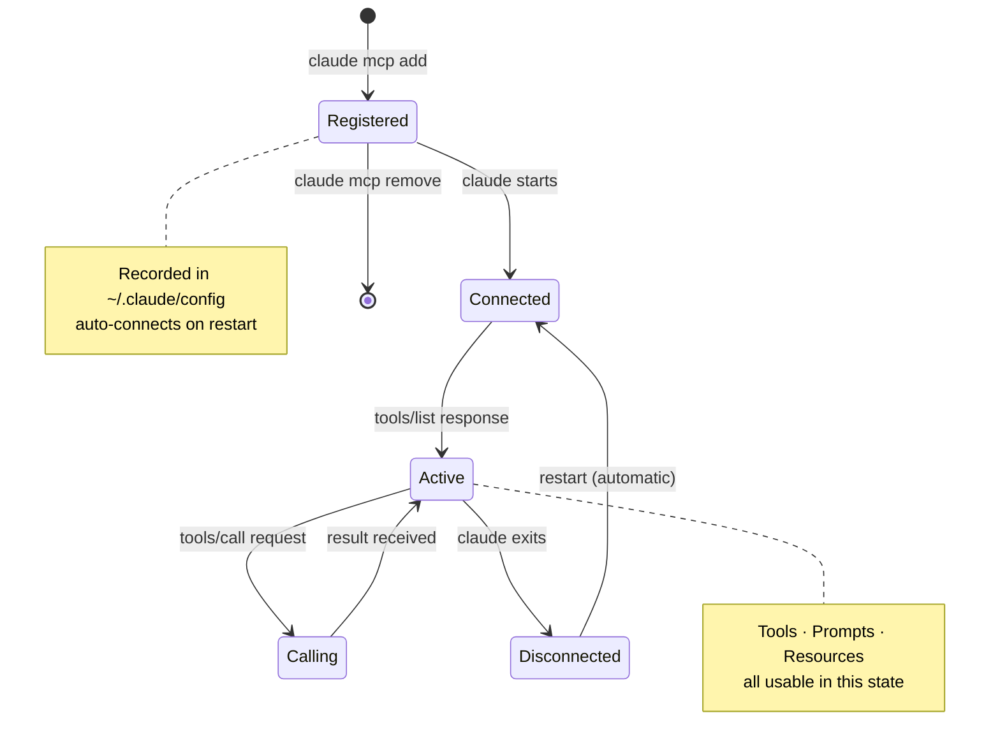

MCP servers are **automatically started and connected** when Claude Code launches, and are shut down cleanly at session end. You do **not need to manage the server process manually** — this is the "register once and forget" philosophy of `claude mcp add`.

#### Deeper Look at the MCP Components — Tools / Prompts / Resources

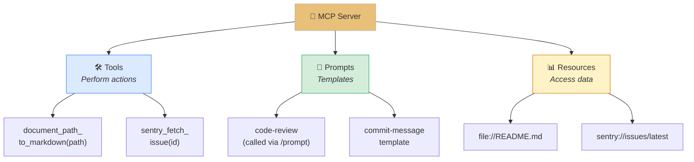

Recall the **FastMCP code** from W07. The three decorators `@mcp.tool()`, `@mcp.prompt()`, and `@mcp.resource()` correspond exactly to these three components. In other words, *"Claude Code calling a tool on an external server"* means **the `@mcp.tool()` functions you wrote in W07 show up as `tool_use` blocks in Claude's responses**.

> [!finding] MCP = "USB-C for Dev Environments"
> Just as USB-C **standardized all devices, all cables, and all ports**, MCP ties **every AI client and every external service** together with one standard protocol. Claude Code, Claude Desktop, and any agent you build yourself can all reuse the same MCP server — **the portability of "build the server once, use it from every AI app"** is the essential value of MCP.

> [!tip] Recommended Order When First Attaching MCP Servers
> 1. **`firecrawl-mcp-server`** — web scraping. Results are text so *"it works"* is easy to feel immediately.
> 2. **`playwright-mcp`** — browser automation. Even takes screenshots, so visual feedback is powerful.
> 3. **A custom server** — register the server you built in W07 via `claude mcp add` → the satisfaction of *"my own server runs with Claude Code."*

> [!method] `claude mcp` Subcommand Reference
> - `claude mcp add [name] [cmd]` — register a server
> - `claude mcp list` — list currently registered servers
> - `claude mcp remove [name]` — remove a server
> - `claude mcp test [name]` — server handshake test (see official docs)

> [!action] Practice Notebook
> 📂 `03-Exercises/Week_08/skilljar/S7_03_mcp_extensions.ipynb`
> The notebook (1) simulates the internal behavior of `claude mcp add` (the settings-file changes), (2) compares the JSON-RPC differences between the three components Tools / Prompts / Resources, and (3) practices attaching the FastMCP server you built in W07 to Claude Code.

> [!ref] Source: Skilljar L04 — Enhancements with MCP servers (287792)

---

### 2.3 Domain Application — A Structural Engineering CC Workflow (Supplementary)

> [!tip] **Supplementary** — this section is a domain application beyond the Skilljar lessons. It is a guide to using Claude Code as a real-world tool in architectural/structural-engineering labs, and it pairs with the notebook `S7_05_structural_cc.ipynb`.

#### Problem Statement — The Repeating Tasks of a Structural Engineer

Tasks that happen over and over in structural engineering labs and design offices:

- **Looking up KDS 14 30 25 clauses** — finding required formulas and coefficients across many clauses of the design code (steel structures)
- **Parsing Midas input files** — extracting members, loads, and results from `.mgt` / `.mct` text files
- **Organizing ETABS / SAP2000 results** — turning CSV-exported analysis results into charts and tables
- **Writing design-review reports** — comparing multiple analysis results and compiling them into LaTeX / Word reports
- **Inspecting IFC models** — extracting properties of specific members / connections from BIM files

Each task is **short and repetitive**, yet **cumulatively** consumes engineering time. The combination of Claude Code + custom MCP servers fits precisely into this gap.

#### A Claude Code Architecture for Structural Engineering

```mermaid
graph TD
    EN["👷 Structural Engineer"] --> CC["⌨️ Claude Code"]
    CC --> CM["📄 CLAUDE.md<br/>KDS abbreviations<br/>Unit conventions<br/>Review templates"]
    CC --> M1["🔌 midas-mcp<br/>(custom)<br/>.mgt parsing"]
    CC --> M2["🔌 ifc-mcp<br/>(custom)<br/>BIM queries"]
    CC --> M3["🔌 kds-rag-mcp<br/>(custom)<br/>Code-RAG"]
    CC --> M4["🔌 firecrawl-mcp-server<br/>Latest AISC · EC specs"]

    M1 --> OUT["📊 Analysis summary"]
    M2 --> OUT
    M3 --> OUT
    M4 --> OUT

    style CC fill:#e8c07a,stroke:#c4a882,color:#333
    style CM fill:#f3e5f5,stroke:#9c27b0
    style M1 fill:#dbeafe,stroke:#3b82f6
    style M2 fill:#d4edda,stroke:#27ae60
    style M3 fill:#fef3c7,stroke:#d97706
    style M4 fill:#fde4cf,stroke:#e67e22
    style OUT fill:#d1fae5,stroke:#059669
```

Two things matter.

1. **Embed domain knowledge in CLAUDE.md** — at project scope, store rules like *"all lengths in mm, forces in kN,"* *"KDS for Korean, AISC for US, EC3 for Europe,"* *"the design-review report template is `templates/design-check.md`."*
2. **Write your own domain MCP servers** — using the FastMCP skills from W07, build internal servers such as `midas-mcp`, `ifc-mcp`, `kds-rag-mcp` and register them with `claude mcp add`.

#### Candidate Matrix of Domain MCP Servers

| Server (tentative name) | Example tools exposed | Input | Output | Use case |
|:---|:---|:---|:---|:---|
| `midas-mgt-mcp` | `parse_mgt(path)`, `extract_reactions(node_id)` | Path to `.mgt` file | Dict of members/loads/reactions | Summarize analysis results |
| `ifc-mcp` | `list_walls(ifc_path)`, `get_element(guid)` | IFC file + GUID | Member geometry/properties | BIM model review |
| `kds-rag-mcp` | `search_clause(query)`, `get_clause(id)` | Natural-language question or clause ID | Relevant clause text + source | Design-code lookup |
| `rebar-calc-mcp` | `calc_development_length(bar, fc)` | Rebar spec / concrete strength | Splice/development length | Automated rebar review |
| `report-latex-mcp` | `render_check_report(data)` | Analysis results JSON | LaTeX / PDF | Mass-producing review reports |

Each server can be built as an independent Python project using the **FastMCP pattern from W07** and registered via `claude mcp add`. As a lab's codebase grows, this list becomes *"our lab's domain SDK."*

#### Example CLAUDE.md (Structural Analysis Project)

```markdown
# Structural Analysis Project — CLAUDE.md

## Project Overview
- Target: 10-story steel-frame retrofit
- Code: KDS 14 30 25 (Steel Structures, LRFD)
- Units: length mm · force kN · stress MPa

## Analysis Tools
- Midas Gen 2024 — input: .mgt
- Results: output/*.csv

## Coding Guidelines
- Python 3.11+, type hints required
- Unit conversions: `from utils.units import kN_to_N`
- Commits: Conventional Commits

## Frequently Used Commands
- `python scripts/parse_mgt.py` — parse input files
- `pytest tests/test_parse.py` — parsing tests
```

With this CLAUDE.md in place, a request like *"pull only the base reactions of the first floor from the Midas results and plot them"* has Claude **automatically** respect the unit, path, and test conventions.

#### Structural Analysis TDD Example
```mermaid
graph LR
    T1["① Context<br/>Read utils/units.py<br/>and scripts/parse_mgt.py"] --> T2["② Brainstorm tests<br/>Parse valid .mgt<br/>Corrupt-file error<br/>Unit conversion<br/>Boundary conditions"]
    T2 --> T3["③ Write tests<br/>tests/test_parse.py"]
    T3 --> T4["④ Implement parser<br/>All tests pass"]

    style T1 fill:#dbeafe,stroke:#3b82f6
    style T2 fill:#fef3c7,stroke:#d97706
    style T3 fill:#fde4cf,stroke:#e67e22
    style T4 fill:#d4edda,stroke:#27ae60
```

> [!method] Recommended Lab Adoption Sequence
> 1. **Week 1** — install Claude Code + run `/init` on a personal project → experience CLAUDE.md
> 2. **Week 2** — write a shared lab CLAUDE.md (units, naming conventions, report templates)
> 3. **Week 3** — restructure existing Python scripts → add tests with Claude Code + TDD
> 4. **Week 4** — using W07 skills, build a simple custom MCP server such as `midas-mcp`
> 5. **Week 5** — add `firecrawl-mcp-server` → automatic collection of the latest design codes and papers

#### End-to-End Diagram for a Structural Engineering Workflow

```mermaid
graph TD
    PM["📄 Project memory<br/>CLAUDE.md<br/>(KDS abbreviations · units · templates)"] --> CC["⌨️ Claude Code session"]
    CC -->|"Context"| READ["Read existing<br/>analysis scripts"]
    CC -->|"Plan"| PLAN["Design unit conversion and<br/>result-extraction algorithm"]
    CC -->|"Implement"| IMP["Implement parser and<br/>report_gen"]

    IMP -->|"midas-mgt-mcp"| M1["Parse .mgt files"]
    IMP -->|"kds-rag-mcp"| M2["Cite design-code clauses"]
    IMP -->|"report-latex-mcp"| M3["Render LaTeX report"]

    M1 --> OUT["📊 Design-review report<br/>PDF"]
    M2 --> OUT
    M3 --> OUT

    OUT -->|"slack-mcp"| NOTIFY["Share results in the<br/>project channel"]

    style PM fill:#f3e5f5,stroke:#9c27b0
    style CC fill:#e8c07a,stroke:#c4a882,color:#333
    style PLAN fill:#fef3c7,stroke:#d97706
    style IMP fill:#d4edda,stroke:#27ae60
    style M1 fill:#dbeafe,stroke:#3b82f6
    style M2 fill:#dbeafe,stroke:#3b82f6
    style M3 fill:#dbeafe,stroke:#3b82f6
    style OUT fill:#fde4cf,stroke:#e67e22
    style NOTIFY fill:#d1fae5,stroke:#059669
```

> [!action] Practice Notebook
> 📂 `03-Exercises/Week_08/skilljar/S7_05_structural_cc.ipynb`
> Walk through the full scenario of applying Claude Code to the structural-engineering domain — authoring CLAUDE.md, custom MCP server skeletons, and a KDS-based design-review TDD example — step by step.

> [!ref] Supplementary — domain-application references
> - Week 07 Week_07.md — how to build an MCP server with FastMCP
> - Week 05 S4_07_structural_rag.ipynb — KDS RAG pipeline
> - Week 10 Week_10.md — BIM(IFC) + MCP deep-dive (planned)

---

## [Chapter 3] Self-assessment & Summary

### 3.1 Concept-Check Quiz — W08 Overall (Q1-Q10)

> [!question] Q1. Which is the correct learning order from the **"Our Plan"** presented in Skilljar L01?
> A) Agents → Computer Use → Claude Code
> B) Computer Use → Claude Code → Agents
> C) Claude Code → Computer Use → Agents
> D) Claude Code → Agents → Computer Use
>
> > [!tip]- Show Answer
> > **Answer: C)** Start with the most concrete and tangible **Claude Code**, expand the scope to **Computer Use**, and then abstract to the **principles of Agents** that both products reveal in common. The text is literal: *"Start with this agentic coding assistant… Explore this set of tools… Understand what makes these applications successful as agents."* Because the goal is to introduce agents, the design is intentionally **concrete → abstract**, not the other way around.

> [!question] Q2. Which ordering of Claude Code's **three install steps** is correct?
> A) Run `claude` → install Node.js → `npm install -g @anthropic-ai/claude-code`
> B) Install Node.js → `npm install -g @anthropic-ai/claude-code` → `claude`
> C) `npm install -g @anthropic-ai/claude-code` → `claude` → install Node.js
> D) Create an Anthropic account → `claude` → install Node.js
>
> > [!tip]- Show Answer
> > **Answer: B)** Exactly as in Skilljar L02's *"Getting Claude Code set up takes just three steps"*. (1) Install Node.js from **nodejs.org/en/download** (or check the existing install with `npm help`), (2) install globally with `npm install -g @anthropic-ai/claude-code`, (3) run `claude` and receive the **login prompt** on first use. Because `npm` ships with Node.js, step 1 must come first.

> [!question] Q3. Which of the following is **not** one of Claude Code's four core capabilities?
> A) File operations (search / read / edit)
> B) Terminal access (execute commands)
> C) Web access (fetch docs / examples)
> D) GUI screenshot comparison (visual diff)
>
> > [!tip]- Show Answer
> > **Answer: D)** Skilljar L02 lists exactly four: **File operations · Terminal access · Web access · MCP Server support**. GUI screenshot comparison belongs to **Computer Use** and is not a built-in Claude Code feature. That said, attaching an external MCP server like `playwright-mcp` can add similar capabilities — which is precisely the value of MCP integration.

> [!question] Q4. What does running the `/init` command generate?
> A) A `.env` file — storing environment variables
> B) A `CLAUDE.md` file — summarizing project structure / dependencies / conventions
> C) A `package.json` file — npm configuration
> D) A `.gitignore` file — Git ignore patterns
>
> > [!tip]- Show Answer
> > **Answer: B)** *"Claude summarizes everything it learns in a special file called CLAUDE.md"* — `/init` scans the codebase and saves a summary of project structure, dependencies, style, and architecture into **CLAUDE.md**. This file is then **automatically included in the context of every subsequent conversation**, eliminating the need to explain the project at every session.

> [!question] Q5. Which of the following is **not** one of the three CLAUDE.md **scopes**?
> A) Project — shared across the whole team
> B) Local — personal, not checked into Git
> C) User — shared across all projects
> D) Global — a shared note uploaded to Anthropic's servers
>
> > [!tip]- Show Answer
> > **Answer: D)** L03 specifies only three: **Project / Local / User**. There is no "uploaded to Anthropic's servers" shared store — every CLAUDE.md lives on the **local filesystem**. Project is Git-shared, Local is personal-only (Git-ignored), and User is the global setting under `~/.claude/`.

> [!question] Q6. In the Context → Plan → Implement workflow, the **key instruction at the Plan stage** is:
> A) "Write code as fast as possible"
> B) "Skip TDD"
> C) "Don't write code yet — lay out the approach and the steps"
> D) "Commit straight to Git"
>
> > [!tip]- Show Answer
> > **Answer: C)** The L03 transcript emphasizes *"Tell Claude specifically not to write any code yet — just focus on the approach and steps needed."* Separating out the Plan stage explicitly lets Claude **expose its natural-language design** first so the developer can **correct course before implementation**. Once you are writing code, fixes get expensive, so reaching alignment at the design stage is ultimately faster.

> [!question] Q7. What is the correct **four-step order** of the Test-Driven Development (TDD) workflow?
> A) Write code → write tests → run tests → refactor
> B) Provide context → brainstorm test cases → implement tests → write passing code
> C) Plan → write code → auto-generate tests → deploy
> D) Write docs → finalize the spec → write code → write tests
>
> > [!tip]- Show Answer
> > **Answer: B)** Exactly the four TDD steps from Skilljar L03 — (1) **Feed context into Claude**, (2) **Ask Claude to think of test cases**, (3) **Ask Claude to implement those tests**, (4) **Ask Claude to write code that passes the tests**. The crux is **writing tests first so that Claude has "clear success criteria"** — only when there's an objective pass/fail bar will Claude's iterate-and-correct loop converge.

> [!question] Q8. What is the **correct command** to register an MCP server with Claude Code?
> A) `claude mcp install [server-name]`
> B) `claude mcp add [server-name] [command-to-start-server]`
> C) `npm install [server-name]`
> D) `mcp register [server-name]`
>
> > [!tip]- Show Answer
> > **Answer: B)** Follow L04's *"claude mcp add [server-name] [command-to-start-server]"* exactly. The example is `claude mcp add documents uv run main.py`; the first arg is the **server alias**, and the rest is **exactly the command that starts the server**. Once registered, it auto-connects on every `claude` restart.

> [!question] Q9. What are the **three components** an MCP server can expose to Claude?
> A) Models, Agents, Workflows
> B) Tools, Prompts, Resources
> C) Inputs, Outputs, Errors
> D) Files, Commands, Webhooks
>
> > [!tip]- Show Answer
> > **Answer: B)** Literally, *"through three main components: Tools (for taking actions), Prompts (for templates), and Resources (for accessing data)."* The `@mcp.tool()`, `@mcp.prompt()`, and `@mcp.resource()` decorators you saw in W07's FastMCP correspond exactly to these three, and they are the shared vocabulary of the whole MCP ecosystem.

> [!question] Q10. Which of the following is **not** a popular MCP server directly mentioned in Skilljar L04?
> A) `sentry-mcp` — auto-detect/fix Sentry bugs
> B) `playwright-mcp` — browser automation
> C) `mcp-atlassian` — Confluence and Jira access
> D) `github-copilot-mcp` — control GitHub Copilot
>
> > [!tip]- Show Answer
> > **Answer: D)** The servers listed in L04 are **sentry-mcp · playwright-mcp · figma-context-mcp · mcp-atlassian · firecrawl-mcp-server · slack-mcp**. `github-copilot-mcp` does not appear in the transcript (GitHub Copilot is a separate service and is not integrated into Claude Code "as a tool"). A, B, and C all appear in the transcript list.

#### Quiz Error-Pattern Check

> [!finding] Common Pitfalls
> - **Q2's install order** — you cannot run `claude` first; without npm it won't work. The question tests whether you understand the *"dependency order."*
> - **Q5's "Global" scope** — a tempting distractor, but it's not in L03. Claude Code is **file-based and local**; no memory is uploaded to Anthropic's servers (privacy guarantee).
> - **Q6's Plan step** — delaying implementation may *look like* inefficiency, but it actually **reduces total cycle time**. Planning time is far shorter than debugging time.
> - **Q9's three components** — Tools / Prompts / Resources are the shared vocabulary of the entire MCP ecosystem. Confusing these three breaks the bridge between W07 and W08.

> [!ref] Source
> - Skilljar L01-L04 transcripts (full Anthropic apps section)

---

### 3.2 Learning Summary

#### Cumulative Progress Table (W01 → W08)

| Week | Topic | Core Concepts | New This Week |
|:---:|:---|:---|:---|
| **W01** | LLM fundamentals · six prompting techniques | tokens, temperature, few-shot, CoT | 4D Framework, AI Fluency |
| **W02** | Claude API calls | messages.create, multi-turn, streaming | Overall Claude API + CLAUDE.md |
| **W03** | Prompt engineering & evaluation | systematic design, Eval Pipeline, Streamlit | Quantitative prompt evaluation |
| **W04** | Tool Use | JSON Schema, ToolUseBlock, tool_result | Claude ↔ outside world |
| **W05** | RAG + hybrid search | chunking, embeddings, VectorIndex, BM25, RRF | Knowledge extension + lexical/semantic merging |
| **W06** | Features of Claude | Extended Thinking, Vision, Caching | Integrated feature design |
| **W07** | MCP server development | FastMCP, Tools · Prompts · Resources | **MCP provider** experience |
| **W08** | **Anthropic app ecosystem** | **Claude Code, CLAUDE.md, /init, 3-step workflow, TDD, MCP client** | **MCP consumer + integrated dev agent** |

#### W08-Only — L01-L04 Concept Summary

> [!finding] Four Stages of the Claude Code Journey and Source Lessons
>
> | Stage | Concept | Core content | Source lesson |
> |:---:|:---|:---|:---:|
> | 1 | **Understand the app ecosystem** | Staged progression Claude Code → Computer Use → Agents | L01 |
> | 2 | **Install and basics** | Node.js → `npm install -g @anthropic-ai/claude-code` → `claude` | L02 |
> | 3 | **Practical workflow** | `/init` → CLAUDE.md → Context/Plan/Implement → TDD 4 steps | L03 |
> | 4 | **MCP extension** | `claude mcp add` → Tools/Prompts/Resources → 6 popular servers | L04 |

#### Roadmap Mermaid — From W08 Onward

```mermaid
graph LR
    subgraph W7["🛰️ W7 — Building MCP"]
        M["FastMCP server<br/>Tools · Resources · Prompts"]
    end

    subgraph W8["⌨️ W8 — Claude Code (now)"]
        A1["App ecosystem<br/>L01"]
        A2["Installation<br/>L02"]
        A3["/init + CLAUDE.md<br/>Workflow + TDD<br/>L03"]
        A4["MCP extension<br/>L04"]
    end

    subgraph W9["🤖 W9 — Agents"]
        AG["Parallelization · chaining<br/>routing · agent loops"]
    end

    subgraph W10["🏗️ W10 — BIM × MCP"]
        D["IFC + MCP<br/>Domain application"]
    end

    M --> A4
    A1 --> A2 --> A3 --> A4
    A4 --> AG
    AG --> D

    style W7 fill:#e9d5ff,stroke:#7c3aed
    style W8 fill:#e8c07a,stroke:#c4a882,color:#333
    style W9 fill:#fef3c7,stroke:#d97706
    style W10 fill:#dbeafe,stroke:#3b82f6

    classDef now fill:#059669,stroke:#047857,color:#fff,font-weight:bold
    class A1,A2,A3,A4 now
```

> [!tip] W08 → W09 Connection Points
> - **Agent loop (W09)** — this week's TDD loop of "test fail → fix code → re-test" is a miniature of the **agent loop**. W09 has you **implement that loop directly**.
> - **Parallelization · routing (W09)** — the **orchestration patterns** for using multiple MCP servers together are the subject of W09. Which question routes to which server; how to merge results from multiple servers.
> - **Git Worktrees (CC Skill)** — this week's CC Skill is **Git Worktrees** for parallel development, and it feeds directly into W09's parallel-agent practice setup.

#### Three-Line Core Message

> [!result] W08 in Three Lines
> 1. **Claude Code is an agent residing in your terminal** — files / terminal / web / MCP are unified into a single CLI, installed with one line, `npm install -g @anthropic-ai/claude-code`.
> 2. **/init → CLAUDE.md → Context-Plan-Implement → TDD** is the standard real-world workflow — injecting context, separating planning, and writing tests first are the keys to high-quality output.
> 3. **One line — `claude mcp add [name] [cmd]` — turns the MCP server from W07 into a Claude Code capability** — wire up the **six popular servers** sentry · playwright · figma · atlassian · firecrawl · slack and you complete *"a dev environment that works smoothly with the tools you already use."*

---

## 💻 Exercises — S7 Anthropic Apps Track

> All notebooks live under `03-Exercises/Week_08/skilljar/`. This week's build-up consists of **five stages**, and each notebook's output is carried into the next in a cumulative structure.

### Step-by-Step Build-up Diagram

```mermaid
graph LR
    S1["① S7_01<br/>App ecosystem"] -->|"+install · workflow"| S2["② S7_02<br/>Claude Code"]
    S2 -->|"+MCP registration"| S3["③ S7_03<br/>MCP Extensions"]
    S3 -->|"Free practice"| S4["④ S7_04<br/>Practice"]
    S4 -->|"Domain application"| S5["⑤ S7_05<br/>Structural CC"]

    style S1 fill:#3498db,stroke:#2980b9,color:#fff
    style S2 fill:#9b59b6,stroke:#8e44ad,color:#fff
    style S3 fill:#e67e22,stroke:#d35400,color:#fff
    style S4 fill:#95a5a6,stroke:#7f8c8d,color:#fff
    style S5 fill:#e74c3c,stroke:#c0392b,color:#fff
```

### Detailed Notebook Table

| Notebook | Goal | Key concepts / exercises | Dependent lesson |
|:---|:---|:---|:---:|
| `S7_01_anthropic_apps.ipynb` | Understand the Anthropic app ecosystem | Our Plan progression, Claude Code vs Computer Use vs Agents, app-level decision tree | L01 |
| `S7_02_claude_code.ipynb` | Claude Code install & basic session | 3-step install, `/init`, CLAUDE.md structure, Context→Plan→Implement, TDD 4 steps | L02, L03 |
| `S7_03_mcp_extensions.ipynb` | Wire an MCP server into Claude Code | `claude mcp add`, Tools/Prompts/Resources, matrix of 6 popular servers | L04 |
| `S7_04_practice.ipynb` | Student-led practice template | Author your own CLAUDE.md, pick one MCP server and integrate it | Integrated |
| `S7_05_structural_cc.ipynb` | **Structural engineering application** — KDS-driven CLAUDE.md, `midas-mcp` skeleton, design-review TDD | Domain MCP design, unit/naming conventions, automated reports | Integrated + W07 |

> [!method] Proposed Class-Time Practice Order (2 hours)
> 1. **0:00-0:15** — `S7_01` overview of the app ecosystem, discussion of Claude Code / Computer Use / Agents role split
> 2. **0:15-0:40** — `S7_02` install simulation + run `/init` + dissect the CLAUDE.md structure
> 3. **0:40-1:10** — `S7_02` reproduce the Context-Plan-Implement workflow, experience the TDD 4 steps
> 4. **1:10-1:40** — `S7_03` attach `firecrawl-mcp-server` via `claude mcp add` and practice real web scraping
> 5. **1:40-2:00** — pick either `S7_04` free expansion or `S7_05` structural engineering domain

> [!action] Submission Notes
> **Due**: by 23:59 the evening before next class
> **Deliverables**: completed `S7_02_claude_code.ipynb` **and** `S7_03_mcp_extensions.ipynb` as **required**, plus at least **one** of `S7_04_practice.ipynb` **or** `S7_05_structural_cc.ipynb` as a free-form extension
> **How to submit**: upload to the designated folder on the course Notion or Google Classroom (include student ID and name in the file name)
> **Evaluation perspective**: (1) reproducibility of install/workflow practice, (2) quality of CLAUDE.md (how well project conventions are captured), (3) practicality of MCP integration

> [!ref] Source
> - All notebooks: `03-Exercises/Week_08/skilljar/`
> - Underlying transcripts: Skilljar S7 L01-L04

---

## 🤖 CC Skill — This Week = Claude Code Skill Week

> [!finding] Special-Week Notice
> Week 08 is a special week where **Claude Code itself is the lecture topic**. Instead of a separate "CC Skill of the week" section, the **entirety of Ch.1~Ch.2 is the CC Skill learning material**. What follows is a re-compressed version of the W08 lesson content in the form of *"reusable practical guidelines."*

### Guideline 1 — Checklist for Writing a Good CLAUDE.md

> [!method] Conditions of a Good CLAUDE.md (from L03)
> - **Project overview** — a 1-3 sentence core description
> - **Tech stack** — languages, frameworks, key libraries, versions
> - **Directory structure** — one line of purpose per folder
> - **Coding guidelines** — naming rules, type-hint policy, formatter
> - **Build / test commands** — `npm test`, `pytest`, `make lint`, and other frequently used commands
> - **Domain vocabulary** — project-specific acronyms and concepts
> - **Caveats** — implicit rules that apply only to this codebase

### Guideline 2 — Context-Plan-Implement Checklist

> [!method] Explicitly Separating the Three Steps (from L03)
> **Context stage:**
> - Have Claude read **2-5 related files by name**
> - Include any existing file with similar functionality
>
> **Plan stage:**
> - Make *"don't write code yet"* explicit
> - Have Claude explain input/validation/processing/return **in natural language**
> - If the plan is vague, ask for *"more detail"*
>
> **Implement stage:**
> - Only request implementation after the plan is approved
> - Ask for test execution after implementation
> - If it fails, let Claude self-correct

### Guideline 3 — MCP Server Selection Matrix

> [!method] Which MCP Server to Attach First (from L04)
> | Purpose | Recommended server | Install complexity | Perceived impact |
> |:---|:---|:---:|:---:|
> | Fetch web docs | `firecrawl-mcp-server` | Low | ⭐⭐⭐⭐⭐ |
> | E2E test · UI debug | `playwright-mcp` | Medium | ⭐⭐⭐⭐⭐ |
> | Production error analysis | `sentry-mcp` | Medium | ⭐⭐⭐⭐ |
> | Issue-tracking integration | `mcp-atlassian` | Medium | ⭐⭐⭐⭐ |
> | Team-notification automation | `slack-mcp` | Low | ⭐⭐⭐ |
> | Design→code | `figma-context-mcp` | High | ⭐⭐⭐⭐ |

### Deep-Dive Connection

> [!tip] Deep-Dive — Git Worktrees
> The **deeper practical use of Claude Code** from this week continues next week in W09 under the topic of **Git Worktrees**. Checking out **multiple branches simultaneously** in one repo and running a separate Claude Code session against each makes *"developing feature A on branch A and feature B on branch B in parallel"* possible. W09 layers **parallel-agent orchestration** on top of this setup.

### Guideline 4 — Daily Session Playbook

> [!method] Monday-Friday: How Claude Code Gets Used Day-by-Day
> **Monday morning — starting a new feature branch**
> 1. `git checkout -b feature/X` to create the branch
> 2. Run `claude` → `/clear` to wipe earlier context
> 3. Have Claude read 2-3 existing files related to the feature
> 4. *"Don't write code yet — plan only"* → review the plan
>
> **Tuesday — implementation**
> 1. Instruct *"implement"* the first component of the plan
> 2. For TDD, first ask *"think through the test cases"*
> 3. Save any newly found convention to CLAUDE.md immediately via `#`
>
> **Wednesday — integration and testing**
> 1. Run E2E scenarios via `playwright-mcp`
> 2. Let Claude self-correct the failing cases
>
> **Thursday — review and cleanup**
> 1. Auto-generate PR descriptions with *"summarize the changes in this PR"*
> 2. Check staging-environment errors with `sentry-mcp`
>
> **Friday — docs and retrospective**
> 1. Update CLAUDE.md (record new patterns learned this week)
> 2. Send a weekly summary to the team via `slack-mcp`

### Guideline 5 — Avoiding Anti-Patterns

> [!tip] Common Mistakes When First Using Claude Code
> - ❌ **Skipping `/init`** → you have to explain conventions in words every time. Always run it in the first session.
> - ❌ **"Build feature X" with no context** → generic code that ignores the project style. Always have it read the relevant files first.
> - ❌ **Skipping the plan step** → you only discover the wrong direction after implementation. Make *"Plan first"* a habit.
> - ❌ **Attaching too many MCP servers at once** → you can't trace which server gets called when. Add 1-2 at a time and verify.
> - ❌ **Not using `#`** → you repeat the same convention session after session. Lock it in with `#` the moment you discover it.
> - ❌ **Keeping sessions too long** — context accumulates and Claude edits the wrong file. When context shifts, `/clear`.

### CC Skill Design Self-Check

> [!method] Questions to Ask Yourself After W08
> 1. Have you run `/init` on your main project? How well does its CLAUDE.md capture team conventions?
> 2. Would the outcome have been different if you had retried a recently implemented feature with Context-Plan-Implement?
> 3. What is the most repetitive task in your current workflow? — Is there already an MCP server to automate it, or do you need to build one with W07's FastMCP?
> 4. How many servers are currently in `claude mcp list`? How many times were they actually called over the past week?
> 5. When was the last time you added a note to CLAUDE.md with `#`? If the answer is "not once this week," you are **failing to accumulate what you've learned**.

---

## 📚 References

> [!ref] Official Skilljar materials
> - Course home: [Building with the Claude API — Skilljar](https://anthropic.skilljar.com/claude-with-the-anthropic-api)
> - Section S7 (Anthropic apps — Claude Code and Computer Use): L01-L04, the primary source for this lecture
> - Subsequent section S8 (Agents and Workflows): covered in W09
- Prior section S6 (Model Context Protocol): covered in [[Week_07]] — the provider perspective of MCP

> [!ref] Related Skilljar courses
> - [Claude Code 101](https://anthropic.skilljar.com/claude-code-101) — introductory Claude Code course (separate course)
> - [Claude Code in Action](https://anthropic.skilljar.com/claude-code-in-action) — practical deep-dive course
> - [Introduction to MCP](https://anthropic.skilljar.com/introduction-to-mcp) — MCP overview (W07 pre-read)

> [!ref] Claude Code official documentation
> - [Claude Code — Overview](https://docs.claude.com/en/docs/claude-code/overview)
> - [Claude Code — Quickstart](https://docs.claude.com/en/docs/claude-code/quickstart)
> - [Claude Code — CLAUDE.md](https://docs.claude.com/en/docs/claude-code/memory)
> - [Claude Code — Slash commands](https://docs.claude.com/en/docs/claude-code/slash-commands)
> - [Claude Code — MCP](https://docs.claude.com/en/docs/claude-code/mcp)

> [!ref] Computer Use references
> - [Computer Use — official Anthropic guide](https://docs.claude.com/en/docs/agents-and-tools/computer-use)
> - [anthropic-quickstarts — computer-use-demo](https://github.com/anthropics/anthropic-quickstarts)

> [!ref] Representative MCP server repositories
> - [sentry-mcp](https://github.com/getsentry/sentry-mcp) — auto-detect and fix Sentry bugs
> - [playwright-mcp](https://github.com/microsoft/playwright-mcp) — browser automation
> - [figma-context-mcp](https://github.com/GLips/Figma-Context-MCP) — Figma design exposure
> - [mcp-atlassian](https://github.com/sooperset/mcp-atlassian) — Confluence / Jira access
> - [firecrawl-mcp-server](https://github.com/mendableai/firecrawl-mcp-server) — web scraping
> - [slack-mcp](https://github.com/modelcontextprotocol/servers) — Slack integration

> [!ref] MCP ecosystem
> - [Model Context Protocol official site](https://modelcontextprotocol.io)
> - [MCP Servers official list](https://github.com/modelcontextprotocol/servers) — catalog of hundreds of official and community servers
> - [Anthropic — Introducing MCP](https://www.anthropic.com/news/model-context-protocol) (2024 blog)

> [!ref] Workflow & TDD references
> - Beck, K. (2002), *Test-Driven Development: By Example*, Addison-Wesley.
> - Martin, R.C. (2008), *Clean Code: A Handbook of Agile Software Craftsmanship*, Prentice Hall.
> - Anthropic official blog — the "Claude Code best practices" series

---

## Related

- Previous: [[Week_07|Week 07: MCP Server Development (S6)]] — the provider perspective of building MCP yourself
- Next: [[Week_09|Week 09: Agents and Workflows (S8)]] — agent loops and parallel orchestration
- Supplementary (Deep-dive): [[Week_09_Cowork|Introduction to Claude Cowork]] — deep-dive on Claude Code collaboration (② Self-paced Deep-dive mode)
- Syllabus: [[00-Syllabus/LLM_AE_AI_Implementation_Syllabus_v2.3|LLM-AE-AI Syllabus v2.3]]
