# 9주차: 에이전트와 워크플로 --- Agents and Workflows (S8)

---

## 📌 강의 중점

**Ch.1 워크플로 패턴 (Workflow Patterns)**
- **Workflows vs Agents 개념**: 사전 정의된 코드 경로(워크플로) vs LLM이 스스로 결정하는 자율 시스템(에이전트)
- **병렬화 워크플로 (Parallelization)**: 독립적인 작업을 동시에 실행하여 속도와 품질을 모두 향상
- **체이닝 워크플로 (Chaining)**: 이전 단계의 출력을 다음 단계의 입력으로 연결하는 순차 파이프라인

**Ch.2 에이전트와 고급 패턴 (Agents & Advanced Patterns)**
- **라우팅 워크플로 (Routing)**: 입력을 분류하여 전문화된 핸들러로 분기하는 패턴
- **에이전트와 도구 (Agents & Tools)**: LLM이 도구를 자율적으로 선택·호출하며 반복하는 에이전틱 루프
- **환경 인스펙션 (Environment Inspection)**: 에이전트가 자기 행동의 결과를 관찰·검증해 적응하는 기법
- **Workflows vs Agents 최종 비교**: 언제 워크플로를, 언제 에이전트를 선택해야 하는가
- **도메인 응용 (보충)**: 건축 구조공학 시방서 분석·Midas 결과 요약에 4가지 패턴을 조합

**통합 사이클**: 워크플로 패턴 이해 → 에이전트 루프 구현 → 실무 선택 기준 확립 → 도메인 적용

---

## 🎯 학습 목표

학습 완료 후 다음을 수행할 수 있습니다.

**Ch.1 워크플로 패턴**
- 워크플로(Workflow)와 에이전트(Agent)의 근본적 차이를 Skilljar L01 *"predetermined series of steps"* vs *"goal and a set of tools"* 기준으로 설명할 수 있다
- Evaluator-Optimizer 패턴(Producer → Grader → Feedback loop → Iteration)의 네 구성 요소를 구분할 수 있다
- 병렬화 워크플로를 Python `asyncio.gather`로 구현하여 독립적인 LLM 호출을 동시에 실행할 수 있다
- 체이닝 워크플로의 Two-Step Revision 기법을 적용해 긴 제약조건 프롬프트의 위반을 자동으로 교정할 수 있다

**Ch.2 에이전트와 고급 패턴**
- 라우팅 워크플로를 구현해 사용자 입력을 Entertainment·Educational·Comedy·Personal vlog·Reviews·Storytelling 같은 카테고리로 자동 분류하고 전문 핸들러로 분기시킬 수 있다
- Claude Code의 `bash · read · write · edit · glob · grep` 같은 **추상(abstract) 도구**를 에이전트에게 제공했을 때, 구체적(hyper-specialized) 도구 대비 어떤 장점이 있는지를 설명할 수 있다
- 에이전트가 도구 호출 후 **환경을 인스펙션(screenshot, read-before-write, whisper.cpp 캡션 검증)** 하도록 시스템 프롬프트를 작성할 수 있다
- Skilljar L07의 4-항목 비교(Workflows Benefits · Agents Benefits · Workflows Downsides · Agents Downsides)를 근거로 워크플로 우선(workflow-first) 의사결정을 내릴 수 있다

**통합 역량**
- 건축공학 도메인에서 **병렬화(다관점 시방서 분석) · 체이닝(추출→분석→보고서) · 라우팅(문서 유형별 분기) · 에이전트(자율 Midas 해석)** 4 패턴을 조합해 *"설계 검토 자동화 시스템"* 을 설계할 수 있다
- Git Worktrees 를 이용해 한 저장소에서 여러 Claude Code 세션을 **병렬로** 동작시키고, 각 브랜치에서 다른 에이전트·워크플로를 동시에 실험할 수 있다

---

## 🤔 왜 배우는가? --- "AI에게 일하는 방식을 설계하다"

> [!question] [[Week_08]] 에서는 Claude Code · Computer Use 라는 **완성된 에이전트 제품** 을 소비자 관점에서 배웠다. Week 09 에서는 *"그 에이전트 안에서 실제로 어떤 일이 일어나는가"* 를 **우리 손으로 재현** 한다 --- 여러 LLM 호출을 어떻게 조합하면 복잡한 작업이 풀리는지, 그 설계 어휘 4종(병렬화·체이닝·라우팅·에이전트)을 익히는 주차다.

### 단일 호출의 한계

Week 04까지 배운 Tool Use는 강력하지만, 실제 업무에서는 **하나의 LLM 호출로는 해결할 수 없는 복합 작업**이 대부분이다. *"이 시방서를 분석하고, 핵심 조항을 추출하고, 설계 기준과 비교하고, 보고서를 작성하라"* --- 이 요청 하나에 여러 단계의 LLM 처리가 필요하다. Skilljar L02 가 보여주는 **재료 추천(metal·polymer·ceramic·composite·elastomer·wood) 앱** 예시도 같은 문제다 --- 하나의 거대 프롬프트에 모든 기준을 욱여넣으면 Claude 가 *"juggle all these different considerations simultaneously"* 하느라 결과 품질이 떨어진다.

### Tool Use → Workflows → Agents 진화

| Week 04: Tool Use | Week 09: 워크플로 & 에이전트 |
| --- | --- |
| 단일 LLM 이 도구를 호출 | **여러 LLM 호출을 조합** |
| 하나의 대화 루프 | **병렬·순차·분기 패턴** |
| 사전 정의된 도구 목록 | **LLM 이 자율적으로 전략 결정** (에이전트 모드) |
| 개발자가 루프 구조 설계 | **에이전트가 반복 횟수까지 결정** |

### 이번 주차의 핵심: 4가지 아키텍처 패턴

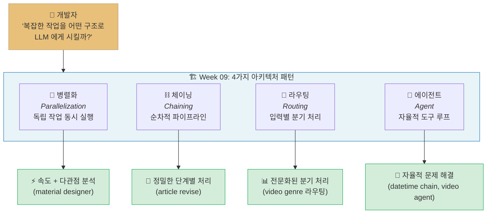
```mermaid
graph TD
    subgraph PATTERNS["🏗️ Week 09: 4가지 아키텍처 패턴"]
        P1["🔄 병렬화<br/><i>Parallelization</i><br/>독립 작업 동시 실행"]
        P2["⛓️ 체이닝<br/><i>Chaining</i><br/>순차적 파이프라인"]
        P3["🔀 라우팅<br/><i>Routing</i><br/>입력별 분기 처리"]
        P4["🤖 에이전트<br/><i>Agent</i><br/>자율적 도구 루프"]
    end

    U["👤 개발자<br/>'복잡한 작업을 어떤 구조로<br/>LLM 에게 시킬까?'"] --> PATTERNS

    P1 --> R1["⚡ 속도 + 다관점 분석<br/>(material designer)"]
    P2 --> R2["🎯 정밀한 단계별 처리<br/>(article revise)"]
    P3 --> R3["📊 전문화된 분기 처리<br/>(video genre 라우팅)"]
    P4 --> R4["🧠 자율적 문제 해결<br/>(datetime chain, video agent)"]

    style PATTERNS fill:#e8f4f8,stroke:#2980b9
    style U fill:#e8c07a,stroke:#c4a882,color:#333
    style R1 fill:#d4edda,stroke:#27ae60
    style R2 fill:#d4edda,stroke:#27ae60
    style R3 fill:#d4edda,stroke:#27ae60
    style R4 fill:#d4edda,stroke:#27ae60
```

### 이번 주 프로젝트 --- "워크플로 4종 + 에이전트 루프" 통합

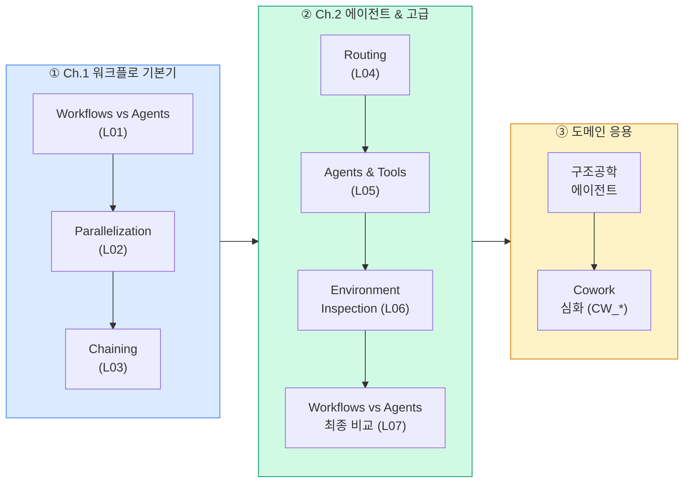
```mermaid
graph LR
    subgraph CH1["① Ch.1 워크플로 기본기"]
        W1["Workflows vs Agents<br/>(L01)"] --> W2["Parallelization<br/>(L02)"]
        W2 --> W3["Chaining<br/>(L03)"]
    end

    subgraph CH2["② Ch.2 에이전트 & 고급"]
        A1["Routing<br/>(L04)"] --> A2["Agents & Tools<br/>(L05)"]
        A2 --> A3["Environment<br/>Inspection (L06)"]
        A3 --> A4["Workflows vs Agents<br/>최종 비교 (L07)"]
    end

    subgraph DOMAIN["③ 도메인 응용"]
        D1["구조공학<br/>에이전트"] --> D2["Cowork<br/>심화 (CW_*)"]
    end

    CH1 --> CH2 --> DOMAIN

    style CH1 fill:#dbeafe,stroke:#3b82f6
    style CH2 fill:#d1fae5,stroke:#059669
    style DOMAIN fill:#fef3c7,stroke:#d97706
```

이 **3 단계 파이프라인** 이 이번 주차의 뼈대다. ① 워크플로 3종을 코드로 직접 구현해 *"사전 정의된 흐름"* 의 감각을 잡고, ② 라우팅을 기점으로 에이전트 루프·환경 인스펙션으로 넘어가 *"LLM 이 스스로 결정하는 시스템"* 을 체험하며, ③ 마지막에 이 전체를 건축 구조공학 도메인 (시방서 QA · Midas 결과 요약 · KDS 라우팅) 에 접목한다.

### Anthropic Skilljar 코스

이 강의노트는 Anthropic 공식 교육 플랫폼 Skilljar 의 **"Building with the Claude API" Section 8: Agents and Workflows** (7 개 레슨 L01~L07) 를 기반으로 구성되었다.

| 레슨 | ID | 제목 | W09 매핑 |
|:---:|:---:|---|---|
| L01 | 287796 | Agents and workflows | Ch.1 §1.1 --- 개념·Evaluator-Optimizer |
| L02 | 287804 | Parallelization workflows | Ch.1 §1.2 --- 재료 추천 병렬화 |
| L03 | 287800 | Chaining workflows | Ch.1 §1.3 --- social media video chain |
| L04 | 287801 | Routing workflows | Ch.2 §2.1 --- 장르 기반 라우팅 |
| L05 | 287803 | Agents and tools | Ch.2 §2.2 --- datetime · Claude Code 도구 |
| L06 | 287798 | Environment inspection | Ch.2 §2.3 --- read-before-write · whisper |
| L07 | 287794 | Workflows vs agents | Ch.2 §2.4 --- 최종 선택 기준 |

> [!ref] 소스 매핑
> - 온라인 코스: [Building with the Claude API](https://anthropic.skilljar.com/claude-with-the-anthropic-api)
> - GitHub 실습: [agents_and_workflows](https://github.com/anthropics/courses/tree/master/agents_and_workflows)
> - Anthropic Research: [Building effective agents](https://www.anthropic.com/research/building-effective-agents)
> - 실라버스 매핑: **Building --- S8 (Agents and Workflows) → W9** (v2.3 기준)

> [!method] 사전 준비
> - **API 환경**: `anthropic` SDK ≥ 0.34, `AsyncAnthropic` 사용 가능해야 병렬화 실습이 돌아간다
> - **Python 비동기**: `asyncio.gather`, `async`/`await` 문법 사전 학습 --- W04 Tool Use 에서 다룬 기본 루프의 확장
> - **Git Worktrees**: 이번 주 CC 스킬의 중심. `git worktree add ../feat-a feat-a` 한 줄로 브랜치별 작업 트리를 분리한다
> - **노트북 순서**: `S8_01_workflow_intro.ipynb` → `S8_02_parallelization.ipynb` → `S8_03_chaining.ipynb` → `S8_04_routing.ipynb` → `S8_05_agent_tools.ipynb` → `S8_06_practice.ipynb` (학생 자율) → `S8_07_structural_agents.ipynb` (건축 도메인)
> - **Cowork 보조**: 심화 학습자는 `CW_01_task_loop_simulation.ipynb` → `CW_02_skills_and_plugins.ipynb` → `CW_03_ae_cowork_design.ipynb` 추가 진행

---

## [Chapter 1] 워크플로 패턴 (Workflow Patterns)

### 1.1 Workflows vs Agents 개념 (L01)

Skilljar L01 은 *"Workflows and agents are strategies for handling user tasks that can't be completed by Claude in a single request"* 로 시작한다. 이 한 문장이 Week 09 전체의 출발점이다 --- **워크플로** 와 **에이전트** 는 단일 요청으로 풀리지 않는 문제를 다루기 위한 **두 가지 전략** 이며, 이 코스에서 이미 도구를 사용해 Claude 가 문제를 스스로 풀게 한 순간, 우리는 **이미 에이전트를 만든 적이 있다**.


*When to Use Workflows vs Agents --- 개발자가 흐름을 "그릴 수 있는가" 가 선택의 기준*

#### 언제 워크플로를, 언제 에이전트를 쓰는가

L01은 선택 기준을 **단 하나의 질문** 으로 압축한다 --- *"how well you understand the task."* 작업 흐름을 **머릿속에 또렷이 그릴 수 있다면 워크플로**, 어떤 입력이 들어올지조차 모호하다면 **에이전트** 다.

- **Use workflows** when you can picture the **exact flow or steps** that Claude should go through to solve a problem, or when your app's UX constrains users to a set of tasks.
- **Use agents** when you're **not sure exactly what task or task parameters** you'll give to Claude.

Skilljar 의 정의는 더 선명하다.

> *"Workflows are a series of calls to Claude meant to solve a specific problem through a **predetermined series of steps**. Agents give Claude a goal and a set of tools, expecting Claude to figure out how to complete the goal through the provided tools."*

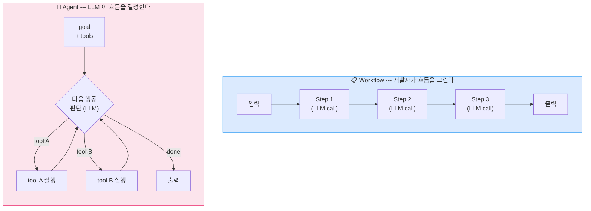
```mermaid
graph TB
    subgraph WF["📋 Workflow --- 개발자가 흐름을 그린다"]
        direction LR
        WFS["입력"] --> WFA["Step 1<br/>(LLM call)"]
        WFA --> WFB["Step 2<br/>(LLM call)"]
        WFB --> WFC["Step 3<br/>(LLM call)"]
        WFC --> WFE["출력"]
    end

    subgraph AG["🤖 Agent --- LLM 이 흐름을 결정한다"]
        direction TB
        AGS["goal<br/>+ tools"] --> AGL{"다음 행동<br/>판단 (LLM)"}
        AGL -->|"tool A"| AGT1["tool A 실행"]
        AGL -->|"tool B"| AGT2["tool B 실행"]
        AGL -->|"done"| AGE["출력"]
        AGT1 --> AGL
        AGT2 --> AGL
    end

    style WF fill:#dbeafe,stroke:#2196f3
    style AG fill:#fce4ec,stroke:#e91e63
```

#### 실전 예시 --- Image to CAD 워크플로

L01 은 *"Imagine building a web app where users drag and drop an image of a metal part, and you create a STEP file (an industry standard for 3D models) from it"* 라는 구체적인 워크플로 예제를 제시한다. 이는 **"what exactly to do when a user supplies an image file"** 가 분명하고, 전 과정을 **코드로 사전에 쓸 수 있으므로** 워크플로의 완벽한 후보다.


*이미지 → STEP 파일 워크플로 예시 --- UX 가 입력을 한정하므로 사전 정의 가능*

단계는 다음과 같다.

- Feed an image into Claude, asking it to describe the object
- Based on the description, ask Claude to use the **CadQuery** library to model the object
- Create a rendering
- Ask Claude to **grade the rendering** against the original image. If there are issues, fix them

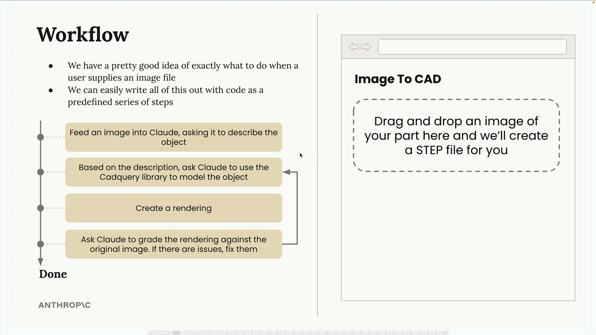
*4 단계 워크플로 분해 --- describe → model(CadQuery) → render → grade*

이 흐름은 "드래그 앤 드롭된 이미지" 라는 **매우 좁은 입력 공간** 을 가정한다. UX 가 사용자를 한 가지 작업으로 한정하므로, 개발자가 단계를 **미리 확정** 해 둘 수 있다. 워크플로의 교과서적 적용이다.

#### Evaluator-Optimizer 패턴

위 예제의 마지막 단계(*"grade the rendering"*)는 단순한 출력 평가가 아니라, L01 이 정식으로 명명한 **Evaluator-Optimizer 패턴** 의 사례다.

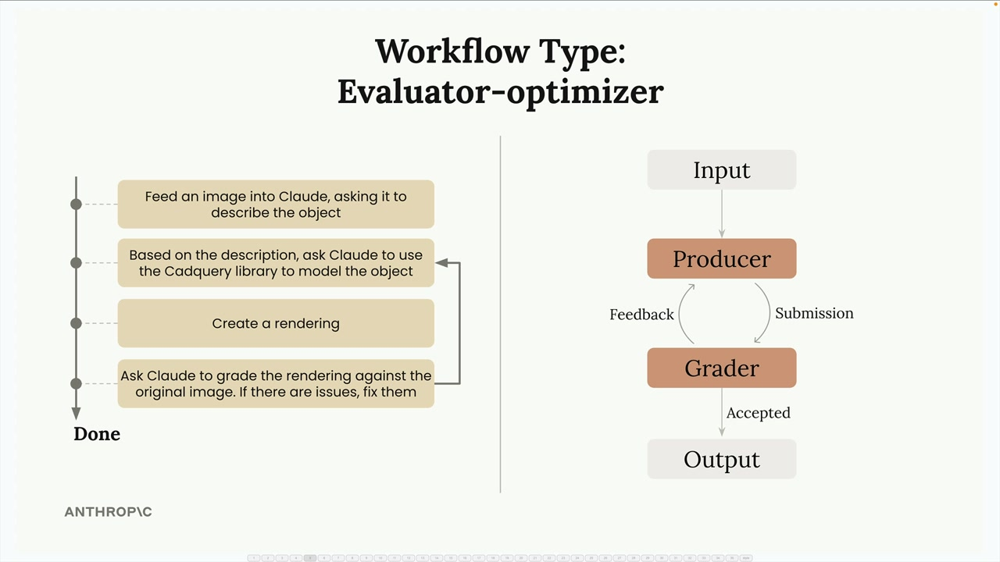
*Evaluator-Optimizer 패턴 --- Producer ↔ Grader 의 피드백 루프*

네 구성 요소는 다음과 같다.

- **Producer** --- Takes input and creates output (Claude using CadQuery to model the part and create a rendering)
- **Grader** --- Evaluates the output against some criteria
- **Feedback loop** --- If the grader doesn't accept the output, feedback goes back to the producer for improvement
- **Iteration** --- The cycle repeats until the grader accepts the output

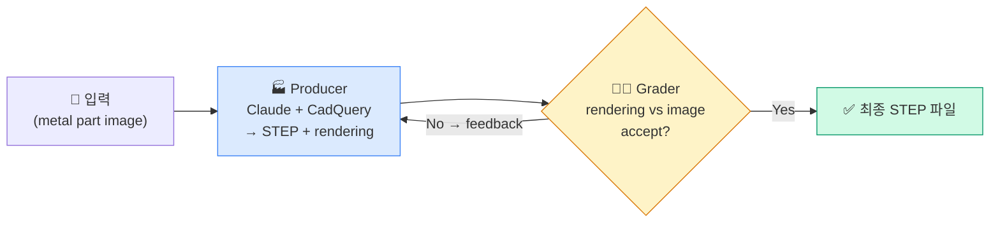
```mermaid
graph LR
    IN["🎯 입력<br/>(metal part image)"] --> P["🏭 Producer<br/>Claude + CadQuery<br/>→ STEP + rendering"]
    P --> G{"🧑‍🏫 Grader<br/>rendering vs image<br/>accept?"}
    G -->|"No → feedback"| P
    G -->|"Yes"| OUT["✅ 최종 STEP 파일"]

    style P fill:#dbeafe,stroke:#3b82f6
    style G fill:#fef3c7,stroke:#d97706
    style OUT fill:#d1fae5,stroke:#059669
```

> [!finding] Evaluator-Optimizer 가 중요한 이유
> *"The goal of identifying different workflows is to give you a set of **repeatable recipes** for implementing your own features. The Evaluator-Optimizer is one workflow pattern that has worked well for other engineers --- consider using it in your own app!"* --- L01 그대로다. 패턴을 **이름 붙이면** 다음 번에 새 문제를 만났을 때 "아, 이건 Evaluator-Optimizer 로 풀면 되겠다" 고 즉시 재활용할 수 있다. **엔지니어링 레시피** 를 축적하는 것이 워크플로 학습의 진짜 목표다.

#### 워크플로를 구분하는 이유 --- 코드가 사라지진 않는다

L01 은 다음 경고도 포함한다.

> *"Remember, identifying workflows **doesn't inherently do anything for us** --- we still have to write the actual code to implement them. But these patterns have proven successful for many engineers, so they're worth understanding and applying to your own projects."*

즉 "병렬화" 라는 이름을 아는 것과 `asyncio.gather` 로 실제 병렬 호출을 구현하는 것은 다른 차원이다. 이번 주차 노트북 `S8_01` ~ `S8_05` 가 **패턴 이름과 구현 코드를 일대일 연결** 하는 훈련인 이유다.

#### 비교 테이블 --- 워크플로 vs 에이전트

| 축 | Workflow | Agent |
|:---|:---|:---|
| 제어 주체 | 코드 (개발자) | LLM (모델) |
| 실행 경로 | predetermined series of steps | LLM 이 동적으로 결정 |
| 입력 예측성 | UX 가 제약 | 자유로움 |
| 예측 가능성 | 높음 | 낮음 |
| 평가·테스트 | 쉬움 (각 step 독립 평가) | 어려움 (가능한 경로가 다수) |
| 적합한 예 | 이미지→STEP, 번역 검증 | 데스크톱 에이전트, 개발 CLI |

> [!tip] Claude Code 자체가 그 증거
> W08 에서 본 Claude Code 는 **에이전트** 다. 개발자가 어떤 요청을 할지 미리 알 수 없기 때문이다. 반면 이번 주 L01 의 "이미지→STEP" 예제는 **워크플로** 다. 같은 Claude 모델을 같은 Anthropic 조직이 **작업 성격에 따라 다르게 조합** 한 셈이다.

> [!action] 실습 노트북
> 📂 `03-Exercises/Week_09/skilljar/S8_01_workflow_intro.ipynb`
> L01 의 *"workflow vs agent"* 선택 트리를 코드로 옮기고, Evaluator-Optimizer 패턴의 Python 스켈레톤(`producer` 함수 + `grader` 함수 + `while not accepted` 루프)을 작성한다.

> [!ref] 소스: Skilljar L01 --- Agents and workflows (287796)

---

### 1.2 병렬화 워크플로 (L02)

L02 는 *"When building AI applications, you'll often encounter tasks that seem simple on the surface but become complex when you try to implement them effectively"* 라는 문장으로 시작한다. 간단해 보이는 작업을 큰 프롬프트 하나로 해결하려다 만나는 전형적인 실패를 분석하고, 그 해법으로 **병렬화 워크플로(parallelization workflows)** 를 제시한다.

#### 문제 --- "Complex Single Prompt" 의 한계

상상해보자 --- 사용자가 부품 이미지를 올리면 *metal, polymer, ceramic, composite, elastomer, or wood* 중 어떤 재료가 가장 적합한지 추천해주는 **재료 설계(material designer) 앱** 을 만든다.

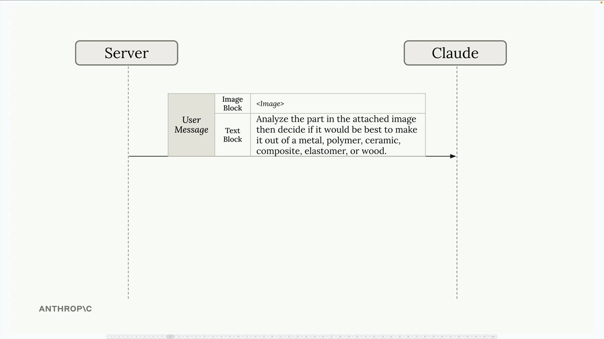
*단일 프롬프트 접근 --- *"choose between metal, polymer, ceramic, composite, elastomer, or wood"*

첫 본능은 이미지와 함께 *"이 여섯 중 골라줘"* 프롬프트 하나를 쏘는 것이다. 동작은 하지만 *"a lot of heavy lifting in a single request"* 가 된다. **재료별 판별 기준이 없으면 결과가 덜 신뢰할 만하다**.

그 보완책으로 모든 기준을 거대한 프롬프트 안에 욱여넣으면 새 문제가 생긴다.

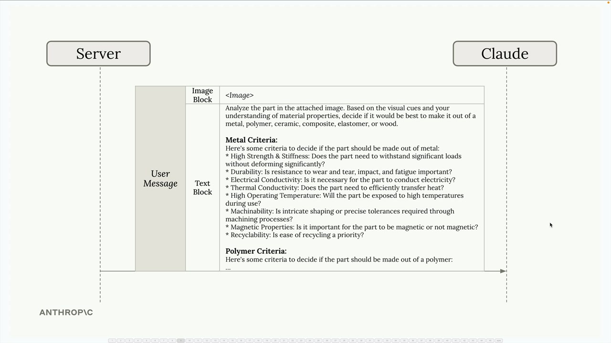
*거대 프롬프트 함정 --- *"Claude has to juggle all these different considerations simultaneously"*

Claude 가 여섯 가지 기준을 **동시에 저글링(juggle)** 하느라 *"confusion and suboptimal results"* 를 내놓는다. 긴 프롬프트가 성능을 보장하지 않는다는 것이 W03 에서 이미 본 교훈이다.

#### 해법 --- Parallelization

```
해법: 한 요청을 쪼개, 각 재료 판별을 독립된 Claude 호출로 병렬 실행한 뒤,
      마지막에 한 번 더 Claude 를 불러 종합 추천을 내린다.
```

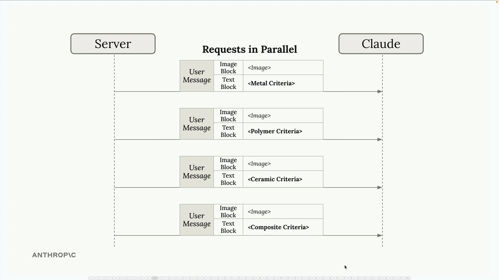
*병렬화 구조 --- 같은 이미지를 여러 번 동시에 보내되, 각 호출은 단일 재료 전문 프롬프트*

L02이 명시한 단계는 다음과 같다.

- Send the same image to Claude **multiple times simultaneously**
- Each request includes **specialized criteria** for one material (metal criteria, polymer criteria, ceramic criteria, etc.)
- Claude evaluates the part's suitability for each material **independently**
- Collect all the analysis results and feed them into a **final aggregation step**

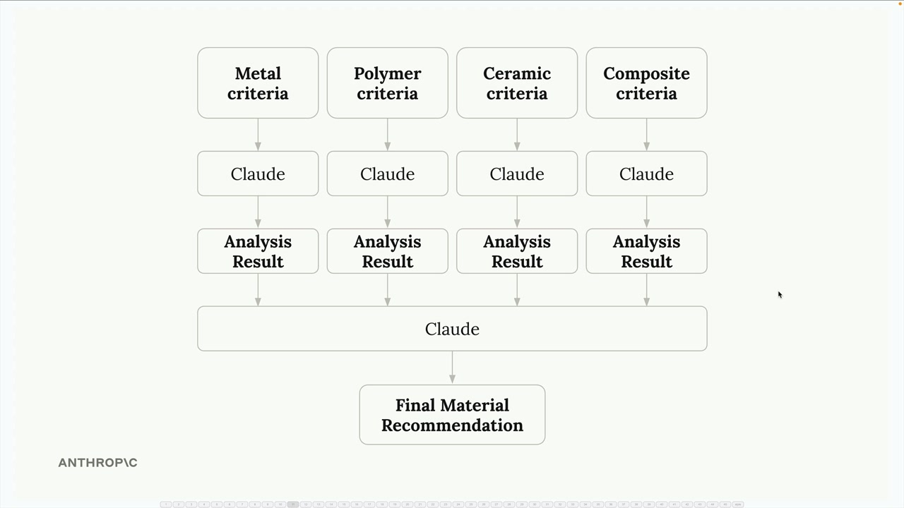
*마지막 단계 --- 개별 분석을 모두 한 번에 Claude 에 다시 보내 최종 비교·추천*

마지막 집계(aggregation) 호출이 하는 일은 *"compare them and make a final material recommendation"* 다. 즉 **병렬 → 종합** 이 한 세트다.

#### 병렬화 패턴의 4 요소

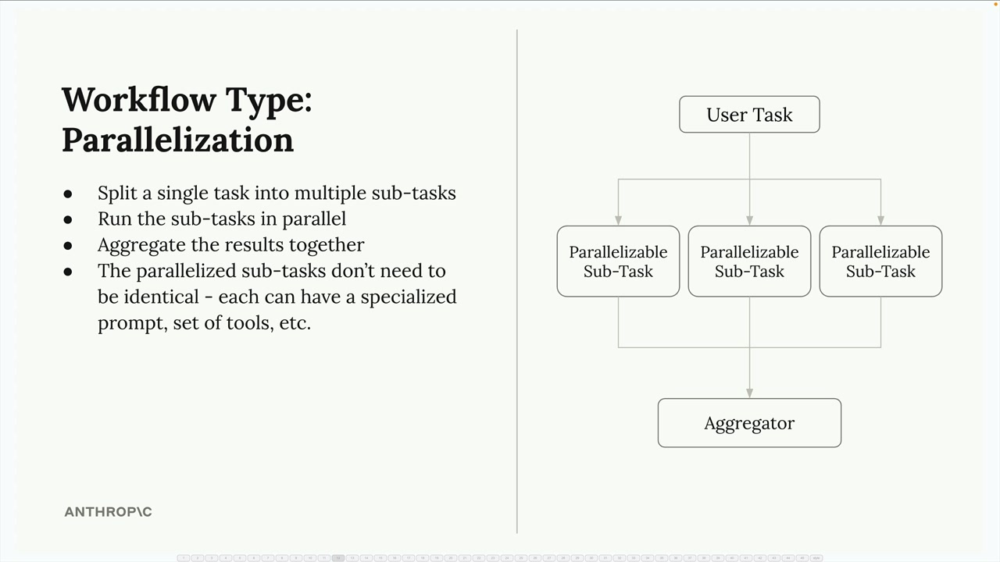
*Parallelization 패턴 구조 --- split · run in parallel · aggregate · sub-tasks need not be identical*

L02 의 요약은 네 줄이다.

- **Split a single task into multiple sub-tasks** --- 복잡한 결정을 포커스된 전문 평가로 분해
- **Run the sub-tasks in parallel** --- 모든 평가를 동시에 실행해 더 빠르게
- **Aggregate the results together** --- 전문 분석을 합쳐 최종 결정
- **The parallelized sub-tasks don't need to be identical** --- 각각이 **자기만의 프롬프트·도구·평가 기준** 을 가질 수 있다

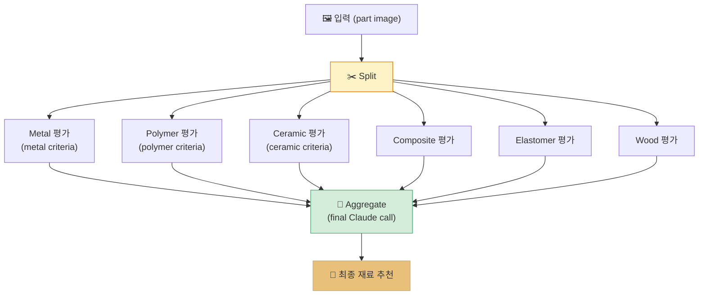
```mermaid
graph TD
    IN["🖼️ 입력 (part image)"] --> SPLIT["✂️ Split"]
    SPLIT --> M["Metal 평가<br/>(metal criteria)"]
    SPLIT --> P["Polymer 평가<br/>(polymer criteria)"]
    SPLIT --> C["Ceramic 평가<br/>(ceramic criteria)"]
    SPLIT --> COMP["Composite 평가"]
    SPLIT --> E["Elastomer 평가"]
    SPLIT --> W["Wood 평가"]

    M --> AGG["🧮 Aggregate<br/>(final Claude call)"]
    P --> AGG
    C --> AGG
    COMP --> AGG
    E --> AGG
    W --> AGG

    AGG --> OUT["🎯 최종 재료 추천"]

    style SPLIT fill:#fef3c7,stroke:#d97706
    style AGG fill:#d4edda,stroke:#27ae60
    style OUT fill:#e8c07a,stroke:#c4a882,color:#333
```

#### `asyncio.gather` 구현

Python 에서는 `anthropic.AsyncAnthropic` 과 `asyncio.gather` 로 이 패턴을 그대로 구현한다. L02 의 네 줄 요약이 **코드 구조와 정확히 일치** 한다는 점에 주목하자.

```python
import asyncio
import anthropic

async_client = anthropic.AsyncAnthropic()
MODEL = "claude-haiku-4-5"

MATERIAL_CRITERIA = {
    "metal":      "You evaluate suitability of METAL for the shown part...",
    "polymer":    "You evaluate suitability of POLYMER...",
    "ceramic":    "You evaluate suitability of CERAMIC...",
    "composite":  "You evaluate suitability of COMPOSITE...",
    "elastomer":  "You evaluate suitability of ELASTOMER...",
    "wood":       "You evaluate suitability of WOOD...",
}

async def evaluate_material(material: str, system: str, image_block: dict):
    """한 재료에 대해 단일 Claude 호출."""
    resp = await async_client.messages.create(
        model=MODEL,
        max_tokens=1024,
        system=system,
        messages=[{"role": "user", "content": [image_block,
            {"type": "text", "text": f"Rate suitability of {material} (1-10) "
                                      "with reasoning."}]}],
    )
    return material, resp.content[0].text

async def recommend_material(image_block: dict):
    # 1) split + 2) run in parallel (asyncio.gather)
    tasks = [evaluate_material(m, sys, image_block)
             for m, sys in MATERIAL_CRITERIA.items()]
    analyses = await asyncio.gather(*tasks)

    # 3) aggregate --- 마지막 한 번의 Claude 호출
    combined = "\n\n".join(f"[{m}]\n{txt}" for m, txt in analyses)
    final = await async_client.messages.create(
        model=MODEL,
        max_tokens=2048,
        system="You are a senior materials engineer. Given specialized "
               "evaluations from six material experts, pick the single best "
               "material and explain why, with trade-offs.",
        messages=[{"role": "user", "content":
            f"Per-material evaluations:\n{combined}\n\n→ Final recommendation:"}],
    )
    return final.content[0].text

# 실행
# recommendation = asyncio.run(recommend_material(image_block))
```

네 가지 구조 요소와 코드의 대응을 정리하면 다음 표와 같다.

| L02 구조 요소 | 코드의 위치 |
|:---|:---|
| Split | `MATERIAL_CRITERIA` dict 의 키-프롬프트 분리 |
| Run in parallel | `asyncio.gather(*tasks)` |
| Aggregate | 마지막 `await async_client.messages.create(...)` |
| Sub-tasks need not be identical | 각 system 프롬프트가 재료별로 다름 |

#### `asyncio.gather` 로 얻는 시간 절약

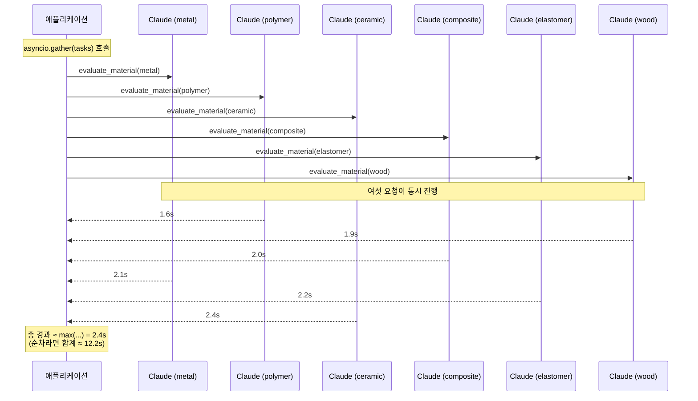
```mermaid
sequenceDiagram
    participant APP as 애플리케이션
    participant A as Claude (metal)
    participant B as Claude (polymer)
    participant C as Claude (ceramic)
    participant D as Claude (composite)
    participant E as Claude (elastomer)
    participant F as Claude (wood)

    Note over APP: asyncio.gather(tasks) 호출
    APP->>A: evaluate_material(metal)
    APP->>B: evaluate_material(polymer)
    APP->>C: evaluate_material(ceramic)
    APP->>D: evaluate_material(composite)
    APP->>E: evaluate_material(elastomer)
    APP->>F: evaluate_material(wood)

    Note over A,F: 여섯 요청이 동시 진행

    B-->>APP: 1.6s
    F-->>APP: 1.9s
    D-->>APP: 2.0s
    A-->>APP: 2.1s
    E-->>APP: 2.2s
    C-->>APP: 2.4s

    Note over APP: 총 경과 ≈ max(...) = 2.4s<br/>(순차라면 합계 ≈ 12.2s)
```

> [!method] `asyncio.gather` 로 얻는 총 시간
> 독립된 N 개의 호출이 각각 T_i 초 걸릴 때
> - 순차 실행: ΣT_i (여섯 호출이면 평균 지연의 약 6 배)
> - 병렬 실행: max(T_i) (가장 느린 호출 하나의 지연)
> --- 네트워크 대기 시간이 지배적인 LLM 호출에서 **체감 속도가 5 배 이상** 빨라진다.

#### Parallelization 의 4 가지 이점

L02은 이점을 명확하게 명명해 준다.

- **Focused attention** --- *"Claude can concentrate on one specific aspect at a time rather than trying to balance multiple competing considerations simultaneously."*
- **Easier optimization** --- *"You can improve and test the prompts for each material evaluation independently. If your metal analysis isn't working well, you can refine just that prompt without affecting the others."*
- **Better scalability** --- *"Adding new materials to evaluate is straightforward --- just add another parallel request."*
- **Improved reliability** --- *"By breaking down the complex task, you reduce the cognitive load on the AI model and get more consistent, reliable results."*

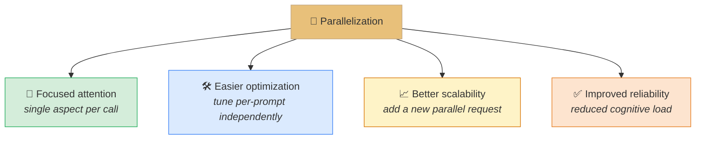
```mermaid
graph TD
    P["🔄 Parallelization"]
    P --> B1["🎯 Focused attention<br/><i>single aspect per call</i>"]
    P --> B2["🛠️ Easier optimization<br/><i>tune per-prompt independently</i>"]
    P --> B3["📈 Better scalability<br/><i>add a new parallel request</i>"]
    P --> B4["✅ Improved reliability<br/><i>reduced cognitive load</i>"]

    style P fill:#e8c07a,stroke:#c4a882,color:#333
    style B1 fill:#d4edda,stroke:#27ae60
    style B2 fill:#dbeafe,stroke:#3b82f6
    style B3 fill:#fef3c7,stroke:#d97706
    style B4 fill:#fde4cf,stroke:#e67e22
```

#### 언제 병렬화를 쓰는가

> *"This pattern works well when you have a complex decision that can be broken down into independent evaluations. Look for situations where you're asking an AI to consider multiple criteria, compare several options, or make decisions that involve different domains of expertise."*

핵심은 **독립성** 이다 --- 각 sub-task 가 다른 sub-task 의 결과를 **기다릴 필요가 없어야** 한다. 종속성이 있다면 다음 절의 **체이닝(Chaining)** 을 써야 한다.

> [!finding] 병렬화 = Sectioning + Voting 의 상위 개념
> Anthropic 의 공식 블로그 "Building effective agents" 는 병렬화를 두 갈래로 세분한다 --- **Sectioning** (하나의 작업을 **독립된 하위 작업** 으로 쪼갬; 재료 추천 예시) 과 **Voting** (같은 작업을 **여러 번 실행** 해 다수결·최선 선택; 번역 3 회 후 선택 등). L02 의 재료 추천은 Sectioning 의 전형 사례다.

> [!tip] 병렬화 안티패턴
> - ❌ **종속된 단계를 병렬화** --- "Step B 는 Step A 의 출력이 필요" 인데 둘을 `gather` 에 넣으면 B 가 빈 입력으로 실패
> - ❌ **동일 system 프롬프트로 여섯 번** --- 다양성이 없으므로 오히려 Voting 패턴을 의도한 게 아니라면 의미 없음
> - ❌ **aggregate 생략** --- 병렬 결과를 나열만 하고 Claude 의 종합 호출을 건너뛰면 "비교 결정" 이 사용자 몫으로 떠넘겨진다

> [!action] 실습 노트북
> 📂 `03-Exercises/Week_09/skilljar/S8_02_parallelization.ipynb`
> 노트북은 (1) 순차 vs `asyncio.gather` 시간 비교, (2) 6 재료 병렬 평가, (3) 최종 집계 프롬프트 설계, (4) 건축공학 응용 --- "같은 시방서 조항을 안전·비용·시공성 세 관점에서 병렬 평가" 를 단계별로 실습한다.

> [!ref] 소스: Skilljar L02 --- Parallelization workflows (287804)

---

### 1.3 체이닝 워크플로 (L03)

L03 는 *"Chaining workflows might seem obvious at first, but they're actually one of the most useful patterns you'll encounter when working with Claude"* 라는 의외의 강조로 열린다. **이름은 너무 뻔해 보이지만**, 긴 프롬프트가 제약조건을 어기고 망가질 때의 표준 해법이 바로 이 패턴이다.

#### 체이닝이란

> *"A chaining workflow breaks down a large, complex task into **smaller, sequential subtasks**. Instead of asking Claude to do everything at once, you split the work into **focused steps that build on each other**."*

각 단계가 **이전 단계의 출력을 입력** 으로 받고, **자기만의 초점** 을 갖는다.

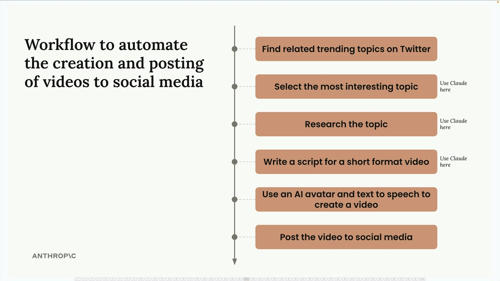
*체이닝의 동기 --- 긴 작업을 포커스된 순차 단계로 나눈다*

#### 실전 예 --- 소셜 미디어 영상 자동 제작

L03 의 대표 예제는 *"social media marketing tool that creates and posts videos automatically"* 다. 하나의 초거대 프롬프트로 처리하는 대신, 다음과 같이 **순차 단계** 로 나눈다.

- **Find related trending topics on Twitter**
- **Select the most interesting topic** (using Claude)
- **Research the topic** (using Claude)
- **Write a script for a short format video** (using Claude)
- **Use an AI avatar and text-to-speech to create a video**
- **Post the video to social media**


*소셜 미디어 영상 체인 --- Twitter → 주제 선택 → 리서치 → 스크립트 → 영상 → 게시*

이 중 *"select"·"research"·"write script"* 세 단계가 **Claude 체인** 이다. 나머지는 Twitter API · TTS · 게시 API 등 **non-LLM 처리** 로, L03 의 원문 *"optionally do non-LLM processing between each task"* 가 바로 이 부분을 가리킨다.

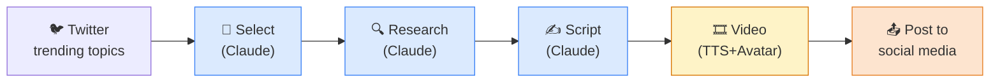
```mermaid
graph LR
    T["🐦 Twitter<br/>trending topics"] --> S["🎯 Select<br/>(Claude)"]
    S --> R["🔍 Research<br/>(Claude)"]
    R --> W["✍️ Script<br/>(Claude)"]
    W --> V["🎞️ Video<br/>(TTS+Avatar)"]
    V --> POST["📤 Post to<br/>social media"]

    style S fill:#dbeafe,stroke:#3b82f6
    style R fill:#dbeafe,stroke:#3b82f6
    style W fill:#dbeafe,stroke:#3b82f6
    style V fill:#fef3c7,stroke:#d97706
    style POST fill:#fde4cf,stroke:#e67e22
```

#### 왜 체이닝이 하나의 거대 프롬프트보다 나은가

L03 는 세 가지 이점을 정리한다.

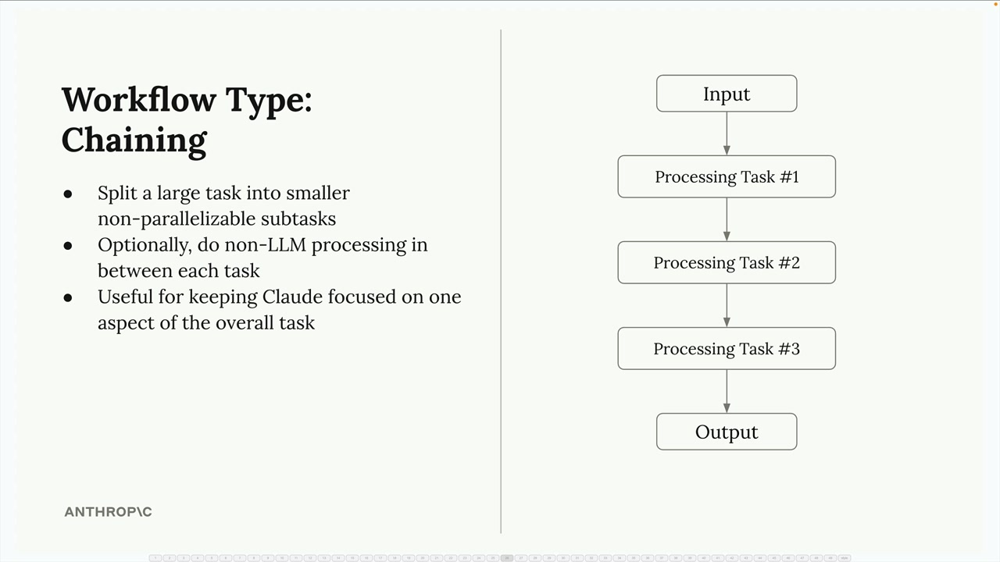
*Chaining 의 세 이점 --- split · non-LLM processing · focused Claude*

- **Split large tasks into smaller, non-parallelizable subtasks** --- 병렬화는 독립일 때, 체이닝은 **의존** 일 때 쓴다
- **Optionally do non-LLM processing between each task** --- 정규식·JSON 파싱·DB 쿼리·API 호출을 중간에 끼워 넣을 수 있다
- **Keep Claude focused on one aspect of the overall task** --- 각 단계가 단일 책임을 갖는다

#### 긴 프롬프트 문제 --- "Long Prompt Problem"

체이닝이 특히 빛나는 상황이 있다. L03 가 명명한 **"long prompt problem"** --- 기술 기사 작성에 아래처럼 많은 제약을 달았을 때다.

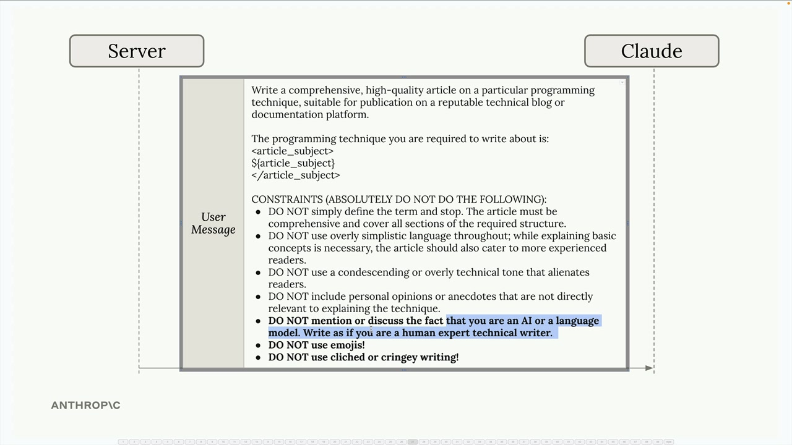
*장문 제약조건 --- Claude 가 모두 지키기 어려운 4 가지 요구사항*

- Not mention that it's written by an AI
- Avoid using emojis
- Skip clichéd or overly casual language
- Write in a professional, technical tone

> *"Even with all these constraints clearly stated, Claude might still produce content that violates some of your rules. You might get back an article that still uses emojis, mentions AI authorship, or sounds unprofessional."*

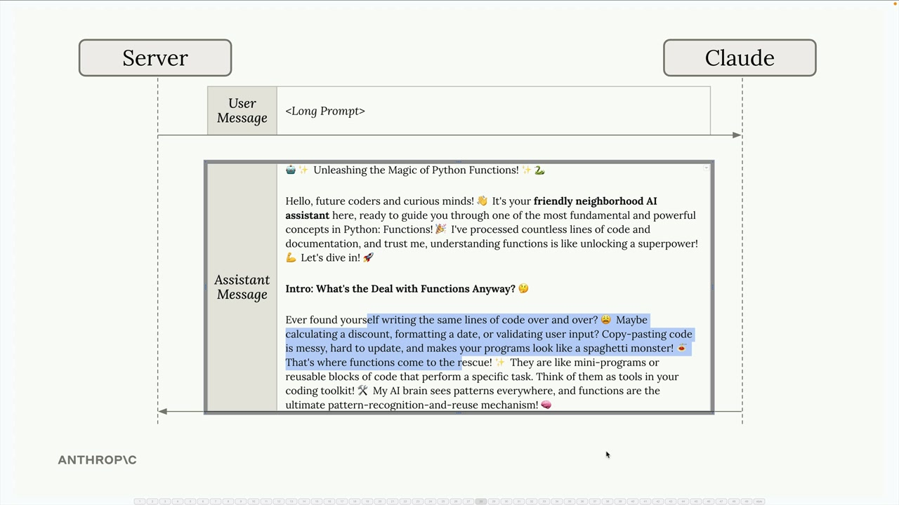
*현실 --- Claude 가 제약을 모두 지키지 못하는 순간*

#### 해법 --- Two-Step Revision 체인

L03 의 교과서적 해법은 **한 개 거대 프롬프트 대신 두 단계로 쪼개는 것** 이다.

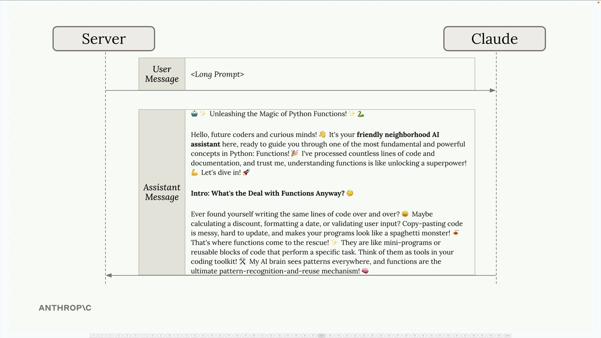
*Step 1 --- 처음엔 제약 위반이 있어도 그대로 생성*

**Step 1**: 초기 프롬프트를 보내고, *"첫 결과가 완벽하지 않을 수 있음을 받아들인다"*. Claude 가 기사를 내놓되 몇몇 제약을 어길 수 있다.

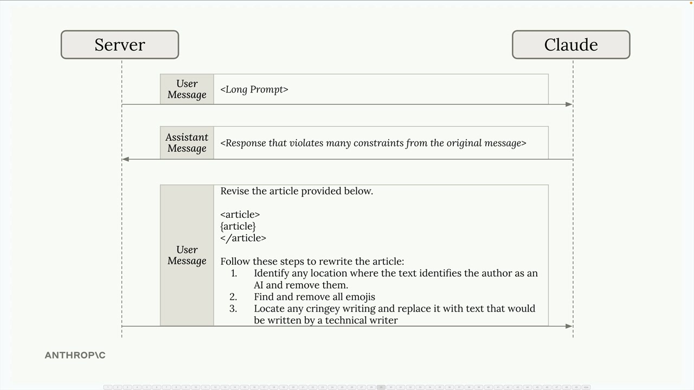
*Step 2 --- 교정(revision) 프롬프트로 위반만 집중 수정*

**Step 2**: 생성된 기사를 넘겨주면서 **수정(revision)** 만을 요청한다. L03 이 제시한 원문 그대로의 교정 프롬프트는 다음과 같다.

```text
Revise the article provided below.

Follow these steps to rewrite the article:
1. Identify any location where the text identifies the author as an AI and remove them
2. Find and remove all emojis
3. Locate any cringey writing and replace it with text that would be written by a technical writer
```

> *"This approach works because Claude can focus **entirely on the revision task** rather than trying to balance content creation with constraint adherence."*

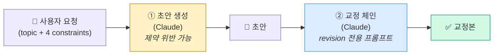
```mermaid
graph LR
    U["📝 사용자 요청<br/>(topic + 4 constraints)"] --> STEP1["① 초안 생성<br/>(Claude)<br/><i>제약 위반 가능</i>"]
    STEP1 --> ART1["📄 초안"]
    ART1 --> STEP2["② 교정 체인<br/>(Claude)<br/><i>revision 전용 프롬프트</i>"]
    STEP2 --> ART2["✅ 교정본"]

    style STEP1 fill:#fef3c7,stroke:#d97706
    style STEP2 fill:#dbeafe,stroke:#2196f3
    style ART2 fill:#d1fae5,stroke:#059669
```

#### Python 구현 --- chain_step 헬퍼

체이닝의 본질은 *"이전 호출의 출력 → 다음 호출의 입력"* 이다. 최소 헬퍼 한 개로 전체 패턴을 담을 수 있다.

```python
import anthropic

client = anthropic.Anthropic()
MODEL = "claude-haiku-4-5"

def chain_step(system: str, user: str) -> str:
    """체인의 단일 단계 --- system 역할과 user 입력으로 한 번 호출."""
    resp = client.messages.create(
        model=MODEL, max_tokens=2048,
        system=system,
        messages=[{"role": "user", "content": user}],
    )
    return resp.content[0].text

def two_step_article(topic: str) -> dict:
    # Step 1 --- 초안
    draft = chain_step(
        system=("Write a professional, technical article. "
                "Do not mention you are an AI. Avoid emojis. "
                "Skip cliches or casual language."),
        user=f"Topic: {topic}\n\nWrite the article.",
    )

    # Step 2 --- 교정 (L03 원문 지시 그대로)
    fixed = chain_step(
        system="You are a senior technical editor.",
        user=("Revise the article provided below.\n\n"
              "Follow these steps to rewrite the article:\n"
              "1. Identify any location where the text identifies the author "
              "as an AI and remove them\n"
              "2. Find and remove all emojis\n"
              "3. Locate any cringey writing and replace it with text that "
              "would be written by a technical writer\n\n"
              f"---\n{draft}\n---"),
    )
    return {"draft": draft, "final": fixed}
```

#### Gate 패턴 --- 단계 사이의 검증

체이닝 사이에 **Gate(검증 단계)** 를 끼울 수 있다. 예: 번역 → 품질 검사 → 점수가 낮으면 재번역. 이 구조가 L01 의 Evaluator-Optimizer 와 자연스럽게 겹친다 --- *"Chaining + Gate = Evaluator-Optimizer 의 단순화된 형태"* 다.

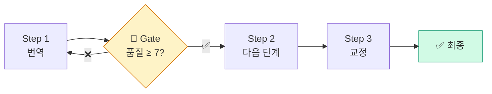
```mermaid
graph LR
    A["Step 1<br/>번역"] --> G{"🚦 Gate<br/>품질 ≥ 7?"}
    G -->|"✅"| B["Step 2<br/>다음 단계"]
    G -->|"❌"| A
    B --> C["Step 3<br/>교정"]
    C --> OUT["✅ 최종"]

    style G fill:#fef3c7,stroke:#d97706
    style OUT fill:#d1fae5,stroke:#059669
```

#### 언제 체이닝을 쓰는가

L03의 체크리스트 그대로다.

- You have **complex tasks with multiple requirements**
- Claude consistently **ignores some constraints in long prompts**
- You need to **process or validate outputs** between steps
- You want to **keep each interaction focused and manageable**

> [!finding] 체이닝의 설계 원칙 4 줄
> 1. **Single responsibility** --- 각 단계는 하나의 명확한 작업만
> 2. **Explicit output shape** --- 다음 단계가 파싱 가능한 형식을 명시
> 3. **Gate 삽입** --- 품질 중요한 지점에 평가 단계를 둠
> 4. **Non-LLM 가능** --- 정규식·DB 쿼리·API 호출을 자유롭게 끼워 넣는다

> [!tip] 체이닝 vs 병렬화 선택 기준
> - **의존성이 있으면 체이닝** --- Step B 가 Step A 의 결과를 필요로 함
> - **독립이면 병렬화** --- 각 하위 작업이 서로의 결과를 몰라도 됨
> - **제약이 많은 생성** → 체이닝의 *"생성 → 교정"* Two-step 이 정석
> - **다관점 분석** → 병렬화 Sectioning

> [!method] 긴 제약조건이 여러 개일 때의 체이닝 레시피
> 1. 첫 호출에 제약 전부를 그대로 둔 초안 생성을 요청
> 2. 초안을 입력으로 주며, *"Revise... 1) ... 2) ... 3) ..."* 형식의 **번호 붙은 수정 리스트** 를 system 으로 제공
> 3. 필요하면 교정본을 다시 Gate 에 넣어 점수를 매기고 임계점 미만이면 한 번 더 돌린다

> [!action] 실습 노트북
> 📂 `03-Exercises/Week_09/skilljar/S8_03_chaining.ipynb`
> 노트북은 (1) `chain_step` 헬퍼 구현, (2) L03 원문의 Two-step article revision, (3) 번역 → Gate → 재번역 체인, (4) 건축공학 응용 --- 시방서 추출 → 쟁점 분석 → 실행 요약 3 단계 체인을 실습한다.

> [!ref] 소스: Skilljar L03 --- Chaining workflows (287800)

---
## Chapter 2. 에이전트와 고급 패턴 (Agents & Advanced Patterns)

> Ch.1 에서는 *"개발자가 설계한 고정 파이프라인"* 인 병렬화·체이닝을 다뤘다. Ch.2 는 **LLM 에게 결정권을 넘기기 시작하는** 지점부터 시작한다 --- **라우팅(§2.1)** 으로 분기를 LLM 에 위임하고, **에이전트(§2.2)** 에서는 도구 선택·반복 횟수까지 LLM 이 결정한다. 그리고 **환경 인스펙션(§2.3)** 으로 에이전트의 맹목성을 보완하고, **최종 비교(§2.4)** 로 실무 선택 기준을 확립한 뒤, **§2.5** 에서 건축 구조공학 도메인에 적용한다.

---

### 2.1 라우팅 워크플로 (Routing Workflow)

#### 2.1.1 제네릭 프롬프트의 한계

체이닝이 *"순서"* 의 문제를 해결했다면, 라우팅은 *"종류"* 의 문제를 해결한다. Skilljar L04 는 같은 social media video 앱을 확장한다 --- 사용자가 *"programming"* 이라고 입력했을 때와 *"surfing"* 이라고 입력했을 때, 생성해야 하는 스크립트의 성격이 완전히 다르다. 프로그래밍 토픽은 **정의와 설명이 명확한 교육 콘텐츠** 가 필요하고, 서핑 토픽은 **흥분과 시각적 매력을 강조한 엔터테인먼트 스크립트** 가 어울린다.

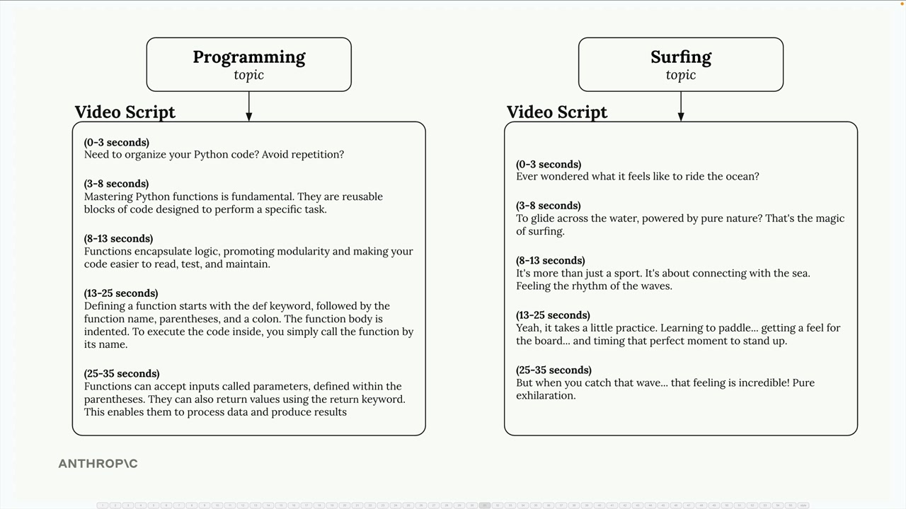

> [!finding] Skilljar L04 원문
> *"Programming topics call for educational content with clear explanations and definitions. Surfing topics work better with entertainment-focused scripts that emphasize excitement and visual appeal. A single generic prompt can't handle both effectively."*

하나의 제네릭 프롬프트로 두 경우를 모두 커버하려 하면, **두 마리 토끼를 놓치는** 전형적인 상황이 벌어진다 --- 교육 콘텐츠로 쓰기에는 가볍고, 엔터테인먼트 콘텐츠로 쓰기에는 지루한 어중간한 결과물이 나온다.

#### 2.1.2 6가지 콘텐츠 카테고리

L04 가 제시하는 해결책은 **콘텐츠 장르(genre)** 를 먼저 분류하고, 장르별 전문 프롬프트 템플릿을 적용하는 것이다. 제안하는 카테고리는 다음과 같다.

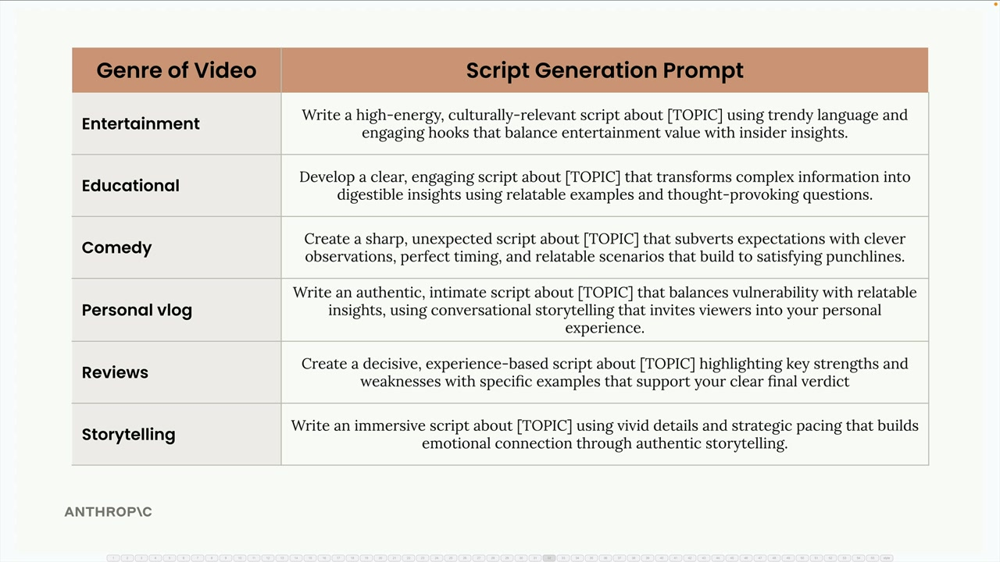

| 카테고리 | 특성 | 언어 스타일 |
| --- | --- | --- |
| **Entertainment** | High-energy, 문화적 맥락 반영 | 트렌디한 언어 |
| **Educational** | 복잡한 정보를 소화하기 쉽게 변환 | 관련성 있는 예시·생각을 자극하는 질문 |
| **Comedy** | 날카롭고 예상을 뒤엎는 관찰 | 타이밍을 살린 위트 |
| **Personal vlog** | 진솔하고 친밀한 콘텐츠 | 대화체 스토리텔링 |
| **Reviews** | 체험 기반의 결정적 평가 | 장단점 명시 |
| **Storytelling** | 생생한 묘사·감정 연결 | 몰입형 서사 |

> [!tip] 6 가지가 최대가 아니다
> 도메인에 따라 카테고리 수는 다르다. KDS (한국 설계 기준) 문서 라우팅이라면 *"콘크리트 · 강구조 · 목구조 · 조적 · 토공"* 처럼 재료별로 6-8 카테고리가 자연스럽다. 너무 많으면(>15) 분류 정확도가 떨어지고, 너무 적으면(<3) 라우팅 의미가 사라진다.

#### 2.1.3 2단계 라우팅 프로세스

라우팅 워크플로는 항상 **2단계** 로 작동한다.

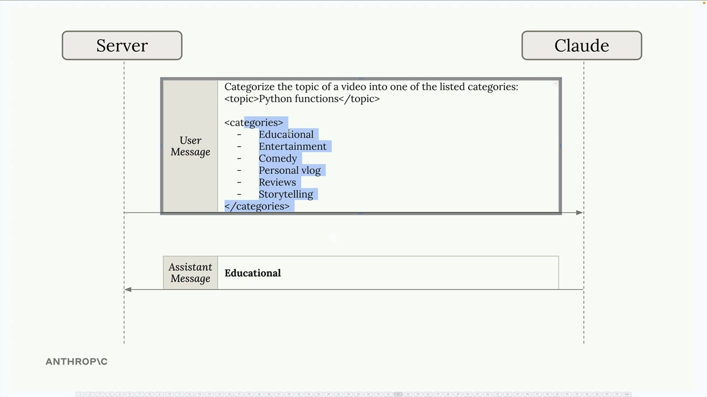

1. **Categorization** --- 사용자 입력을 카테고리 중 하나로 분류
2. **Specialized Processing** --- 분류 결과에 맞는 프롬프트 템플릿 선택 후 실행

예를 들어 사용자가 *"Python functions"* 토픽을 입력했다면, 1단계에서는 이런 분류 프롬프트가 돈다.

```text
Categorize the topic of a video into one of the listed categories:
<topic>Python functions</topic>

<categories>
- Educational
- Entertainment
- Comedy
- Personal vlog
- Reviews
- Storytelling
</categories>
```

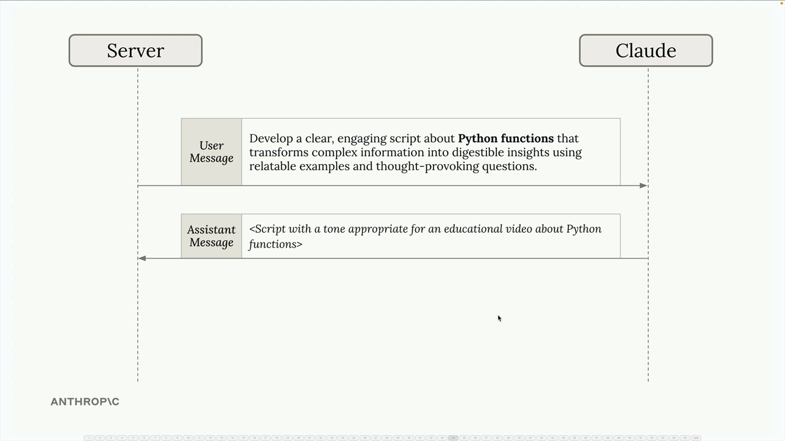

Claude 는 *"Educational"* 을 반환한다. 2단계는 이 결과를 이용해 교육용 템플릿으로 실제 스크립트를 생성한다.

#### 2.1.4 Python 구현 --- `router()` + `dispatch()`

구현 형태는 단순하다. 분류 함수 하나와 디스패처 함수 하나면 충분하다.

```python
from anthropic import Anthropic

client = Anthropic()
MODEL = "claude-haiku-4-5"

CATEGORY_PROMPTS = {
    "Educational": (
        "Develop a clear, engaging script that transforms complex information "
        "into digestible insights using relatable examples and thought-provoking questions."
    ),
    "Entertainment": (
        "Create a high-energy, culturally relevant script with trendy language "
        "and visual hooks that grab attention in the first 3 seconds."
    ),
    "Comedy": (
        "Write a sharp, unexpected script with clever observations and precise timing. "
        "Setup-punchline structure preferred."
    ),
    "Personal vlog": (
        "Produce an authentic, intimate script with conversational storytelling. "
        "Speak directly to the camera in a diary-like tone."
    ),
    "Reviews": (
        "Deliver decisive, experience-based content highlighting strengths and weaknesses. "
        "Include a clear verdict."
    ),
    "Storytelling": (
        "Craft immersive content using vivid details and emotional connection. "
        "Use a 3-act narrative structure."
    ),
}

def route(topic: str) -> str:
    prompt = (
        "Categorize the topic of a video into one of the listed categories:\n"
        f"<topic>{topic}</topic>\n\n"
        f"<categories>\n" + "\n".join(f"- {c}" for c in CATEGORY_PROMPTS) + "\n</categories>\n\n"
        "Respond with ONLY the category name, nothing else."
    )
    resp = client.messages.create(
        model=MODEL,
        max_tokens=20,
        messages=[{"role": "user", "content": prompt}],
    )
    return resp.content[0].text.strip()

def dispatch(topic: str) -> str:
    category = route(topic)
    if category not in CATEGORY_PROMPTS:
        category = "Educational"  # fallback
    system_prompt = CATEGORY_PROMPTS[category]
    resp = client.messages.create(
        model=MODEL,
        max_tokens=800,
        system=system_prompt,
        messages=[{"role": "user", "content": f"Topic: {topic}"}],
    )
    return f"[{category}] {resp.content[0].text}"

print(dispatch("Python functions"))   # → [Educational] ...
print(dispatch("surfing in Hawaii"))  # → [Entertainment] ...
```

> [!method] 라우팅 Best Practice
> 1. **카테고리 수 6-8 개** --- 분류 정확도와 전문화 간의 균형점
> 2. **Fallback 카테고리 지정** --- LLM 이 정의되지 않은 카테고리를 반환하면 기본값으로 안전하게 처리
> 3. **분류 모델은 작게** --- `claude-haiku-4-5` 로 충분. 본 생성만 고성능 모델로
> 4. **카테고리별 프롬프트는 독립 파일** --- `prompts/educational.md`, `prompts/comedy.md` 로 분리해 버전 관리

#### 2.1.5 라우팅 아키텍처 다이어그램

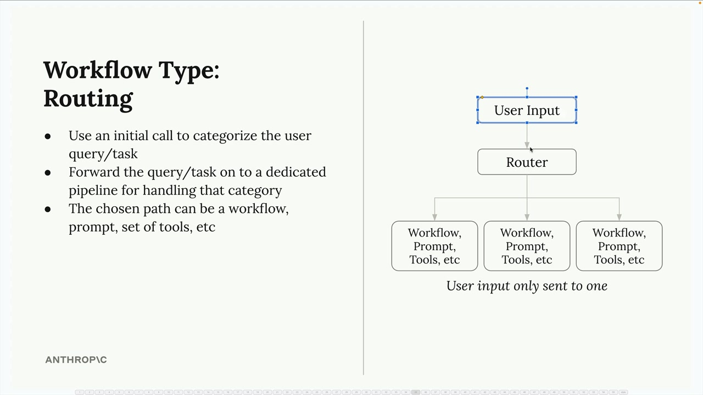

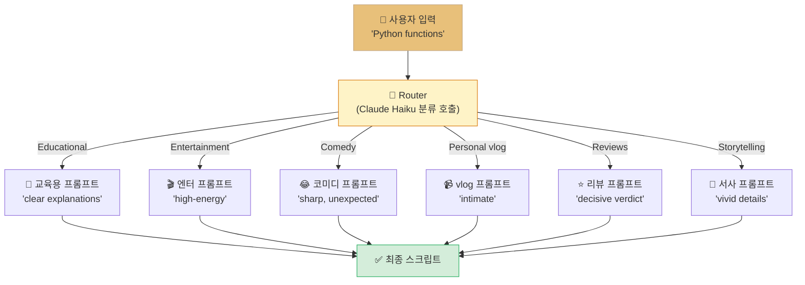
```mermaid
graph TD
    U["👤 사용자 입력<br/>'Python functions'"] --> R["🔀 Router<br/>(Claude Haiku 분류 호출)"]

    R -->|Educational| P1["📘 교육용 프롬프트<br/>'clear explanations'"]
    R -->|Entertainment| P2["🎬 엔터 프롬프트<br/>'high-energy'"]
    R -->|Comedy| P3["😂 코미디 프롬프트<br/>'sharp, unexpected'"]
    R -->|Personal vlog| P4["📹 vlog 프롬프트<br/>'intimate'"]
    R -->|Reviews| P5["⭐ 리뷰 프롬프트<br/>'decisive verdict'"]
    R -->|Storytelling| P6["📖 서사 프롬프트<br/>'vivid details'"]

    P1 --> O["✅ 최종 스크립트"]
    P2 --> O
    P3 --> O
    P4 --> O
    P5 --> O
    P6 --> O

    style U fill:#e8c07a,stroke:#c4a882,color:#333
    style R fill:#fef3c7,stroke:#d97706
    style O fill:#d4edda,stroke:#27ae60
```

L04 가 강조하는 **핵심 통찰** 은 *"user input only goes to one specialized pipeline, not all of them"* 이다. 입력 하나가 하나의 전문 파이프라인으로만 흘러가기 때문에, 각 파이프라인을 **독립적으로 최적화** 할 수 있다 --- Educational 파이프라인에는 Wikipedia RAG 를, Reviews 파이프라인에는 별점·감성 분석 툴을 붙이는 식이다.

> [!ref] 소스: Skilljar L04 --- Routing workflows (287801)

> [!action] 실습 노트북
> 📂 `03-Exercises/Week_09/skilljar/S8_04_routing.ipynb` 에서 6-카테고리 라우팅을 구현한다. 추가 실험으로 **KDS 설계기준 라우팅(콘크리트·강구조·목구조)** 을 §2.5 예제와 연결해 풀어본다.

---

### 2.2 에이전트와 도구 (Agents & Tools)

#### 2.2.1 워크플로에서 에이전트로

Skilljar L05 는 Ch.1~§2.1 까지 다룬 워크플로의 **대척점** 에 있는 개념으로 에이전트를 소개한다.

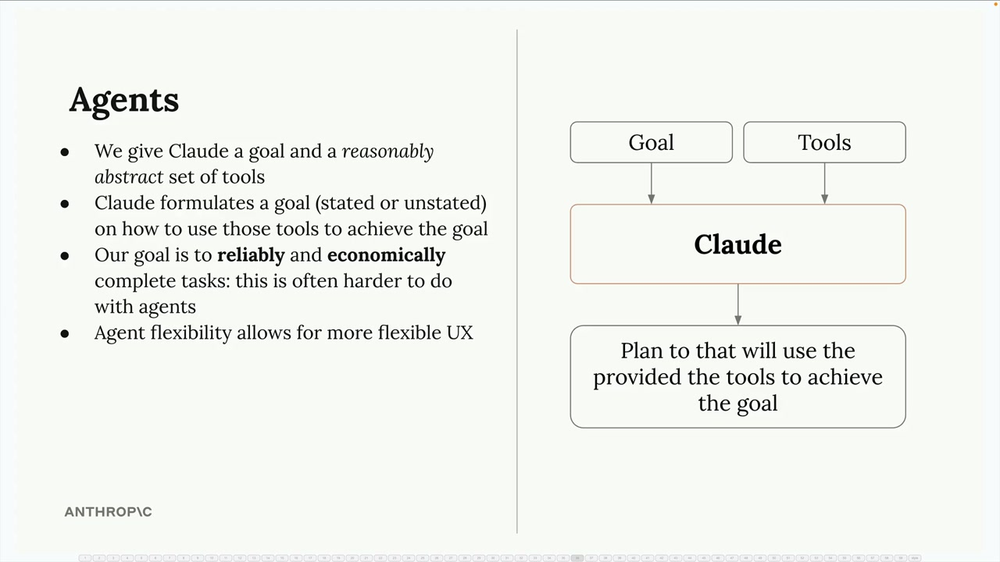

> [!finding] Skilljar L05 원문
> *"Agents represent a shift from the structured workflows we've been working with. While workflows are perfect when you know the exact steps needed to complete a task, agents shine when you're not sure what those steps should be. Instead of defining a rigid sequence, you give Claude a goal and a set of tools, then let it figure out how to combine those tools to achieve the objective."*

이 차이는 코드 구조에도 그대로 반영된다.

| 워크플로 | 에이전트 |
| --- | --- |
| `step1() → step2() → step3()` 명시적 함수 호출 | `while not done: tool_call = claude.decide(tools)` 루프 |
| 개발자가 흐름 제어 | LLM 이 흐름 결정 |
| 반복 횟수 고정 (e.g., 1-pass, 2-step) | 반복 횟수 LLM 이 결정 (e.g., 5 tool calls or 15) |
| 분기 로직이 `if/else` 로 코드에 박힘 | 분기 로직이 LLM 시스템 프롬프트 내 자연어로 표현 |

#### 2.2.2 Datetime 3개 도구 --- 단순하지만 조합 가능

L05 의 첫 번째 예제는 **의도적으로 단순한** 도구 3 개다.

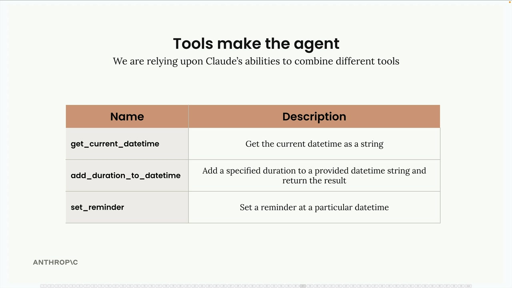

| 도구 | 기능 | 입력 → 출력 |
| --- | --- | --- |
| `get_current_datetime` | 현재 시각 반환 | (없음) → ISO 8601 |
| `add_duration_to_datetime` | 시각에 기간 더하기 | (datetime, days/hours) → datetime |
| `set_reminder` | 특정 시각 알림 생성 | (datetime, text) → reminder_id |

단독으로 보면 각 도구는 **일차 함수 호출** 에 불과하다. 하지만 Claude 는 이들을 **조합해** 복합 질의를 처리한다.

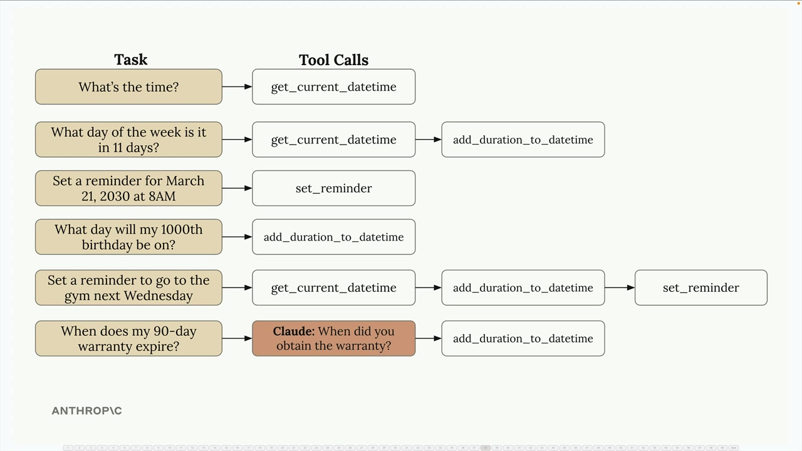

| 사용자 질의 | 에이전트의 도구 체인 |
| --- | --- |
| *"What's the time?"* | `get_current_datetime()` |
| *"What day of the week is it in 11 days?"* | `get_current_datetime() → add_duration_to_datetime(now, 11d)` |
| *"Set a gym reminder next Wednesday"* | `get_current_datetime() → add_duration_to_datetime(now, ~6d) → set_reminder(date, "gym")` |
| *"When does my 90-day warranty expire?"* | Claude 가 먼저 *"When did you buy it?"* 되물음 → 사용자 답 후 `add_duration_to_datetime(purchase_date, 90d)` |

> [!finding] L05 의 핵심 메시지
> 마지막 예시는 특히 중요하다 --- Claude 는 **필요한 정보가 부족할 때 사용자에게 되묻는** 방식으로 대화 자체를 도구처럼 활용한다. 워크플로에서는 이 분기를 `if purchase_date is None: ask_user()` 로 명시해야 하지만, 에이전트는 시스템 프롬프트만으로 이 행동을 끌어낸다.

#### 2.2.3 Claude Code --- 추상 도구의 위력

L05 의 두 번째 예제는 더 큰 스케일이다 --- Week 08 에서 배운 **Claude Code** 자체가 에이전트의 교과서적 사례다.

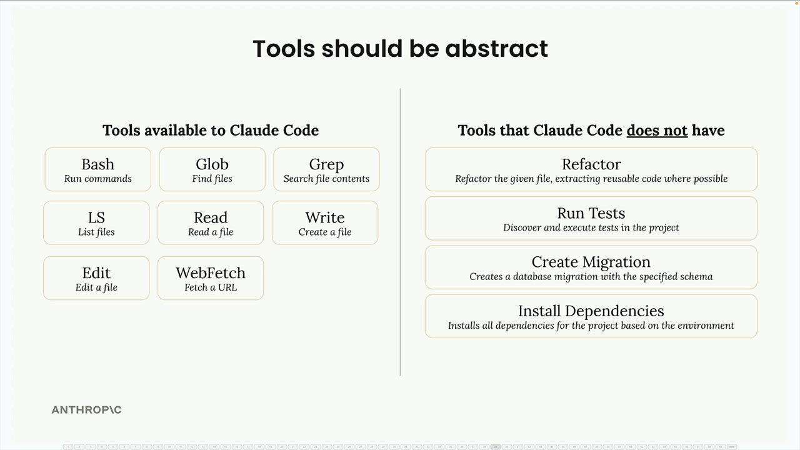

Claude Code 에 주어진 도구는 **모두 범용(generic) 유닉스 프리미티브** 다.

| 도구 | 기능 |
| --- | --- |
| `bash` | 임의의 쉘 명령 실행 |
| `read` | 임의의 파일 읽기 |
| `write` | 임의의 파일 생성 |
| `edit` | 파일 수정 |
| `glob` | 파일 패턴 검색 |
| `grep` | 파일 내용 검색 |

> [!finding] L05 원문 --- "Tools Should Be Abstract"
> *"It notably doesn't have specialized tools like 'refactor code' or 'install dependencies.' Instead, Claude figures out how to use the basic tools to accomplish these complex tasks. This abstraction allows it to handle countless programming scenarios that the developers never explicitly planned for."*

Claude Code 에는 `refactor_code`, `install_dependency`, `run_tests`, `fix_import_errors` 같은 **구체적(hyper-specialized) 도구가 하나도 없다**. 대신 `bash` + `read` + `write` + `edit` + `glob` + `grep` 을 조합해 **설계자가 한 번도 상상하지 못한 작업** --- 깃 히스토리 뒤져서 bug 원인 찾기, Docker 이미지 빌드 후 테스트, TypeScript 타입 오류 연쇄 수정 --- 을 모두 해낸다.

**Week 08** 에서 `bash + read + write + edit` 조합으로 "숫자 3 검색 → 파일 생성 → JSON 추출" 작업을 수행했던 경험이 바로 이 원리다.

#### 2.2.4 소셜 미디어 비디오 에이전트

L05 의 세 번째 예제는 비디오 생성 에이전트다.

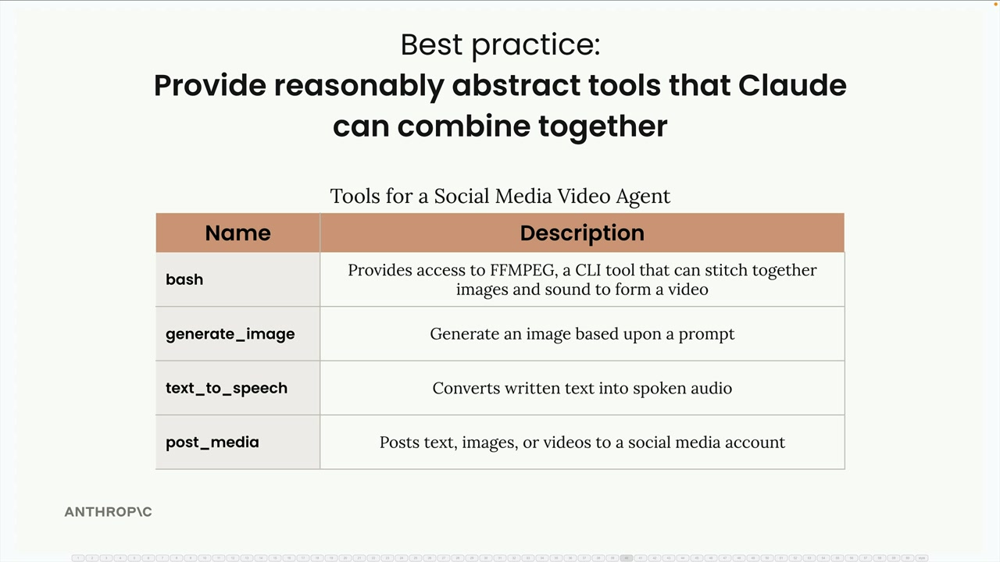

| 도구 | 기능 |
| --- | --- |
| `bash` | FFMPEG 비디오 처리 접근 |
| `generate_image` | 프롬프트 → 이미지 |
| `text_to_speech` | 텍스트 → 오디오 |
| `post_media` | 소셜 플랫폼 업로드 |

이 도구 집합은 **단순 워크플로(비디오 생성 → 포스팅)** 와 **상호작용 시나리오(샘플 이미지 먼저 생성 → 사용자 승인 → 진행)** 를 모두 지원한다. 워크플로로 구현하면 두 플로우를 별도 함수로 분기해야 하지만, 에이전트에서는 **시스템 프롬프트의 *"ask user for approval before expensive operations"*** 한 문장이면 끝난다.

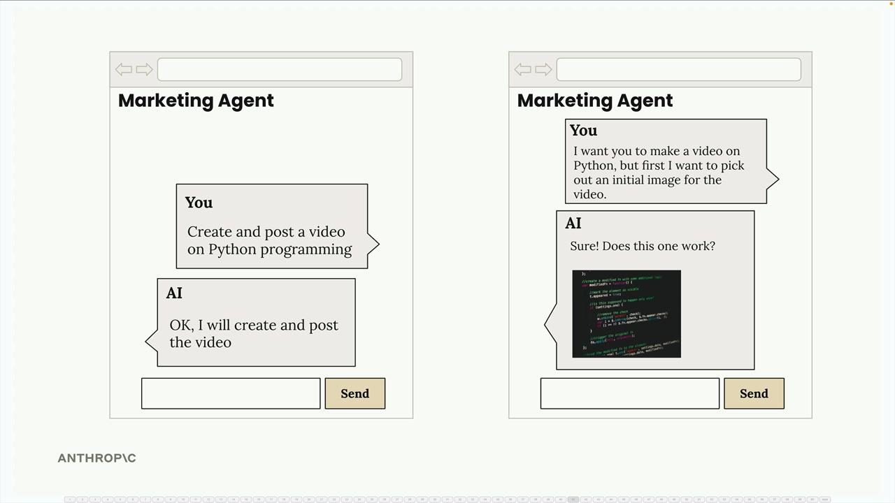

#### 2.2.5 Python 에이전트 루프 --- 기본 구조

```python
from anthropic import Anthropic

client = Anthropic()
MODEL = "claude-haiku-4-5"

def agent_loop(user_goal: str, tools: list[dict], tool_impls: dict, max_turns: int = 15):
    messages = [{"role": "user", "content": user_goal}]
    for turn in range(max_turns):
        resp = client.messages.create(
            model=MODEL,
            max_tokens=2048,
            tools=tools,
            messages=messages,
        )
        # 종료 조건: LLM 이 더 이상 도구를 호출하지 않음
        if resp.stop_reason == "end_turn":
            return resp.content[-1].text

        # 도구 호출 처리
        messages.append({"role": "assistant", "content": resp.content})
        tool_results = []
        for block in resp.content:
            if block.type == "tool_use":
                result = tool_impls[block.name](**block.input)
                tool_results.append({
                    "type": "tool_result",
                    "tool_use_id": block.id,
                    "content": str(result),
                })
        messages.append({"role": "user", "content": tool_results})

    raise RuntimeError(f"Agent did not terminate within {max_turns} turns")
```

> [!tip] `max_turns` 는 에이전트의 안전장치
> 무한 루프 방지를 위해 `max_turns` 를 반드시 설정한다. Claude Code 는 기본 200 턴, 단순 질의 에이전트는 10-15 턴이면 충분하다. 턴을 초과하면 비용·지연·환경 오염(파일 더럽힘)이 폭증한다.

> [!ref] 소스: Skilljar L05 --- Agents and tools (287803)

> [!action] 실습 노트북
> 📂 `03-Exercises/Week_09/skilljar/S8_05_agent_tools.ipynb` 에서 datetime 3-tool 에이전트를 구현하고, 추가로 Claude Code 의 `bash/read/write` 를 모방한 **미니 파일시스템 에이전트** 를 만들어본다.

---

### 2.3 환경 인스펙션 (Environment Inspection)

#### 2.3.1 Claude 는 눈이 가려진 채로 일한다

L06 은 에이전트 구현의 **가장 자주 간과되는 함정** 을 다룬다.

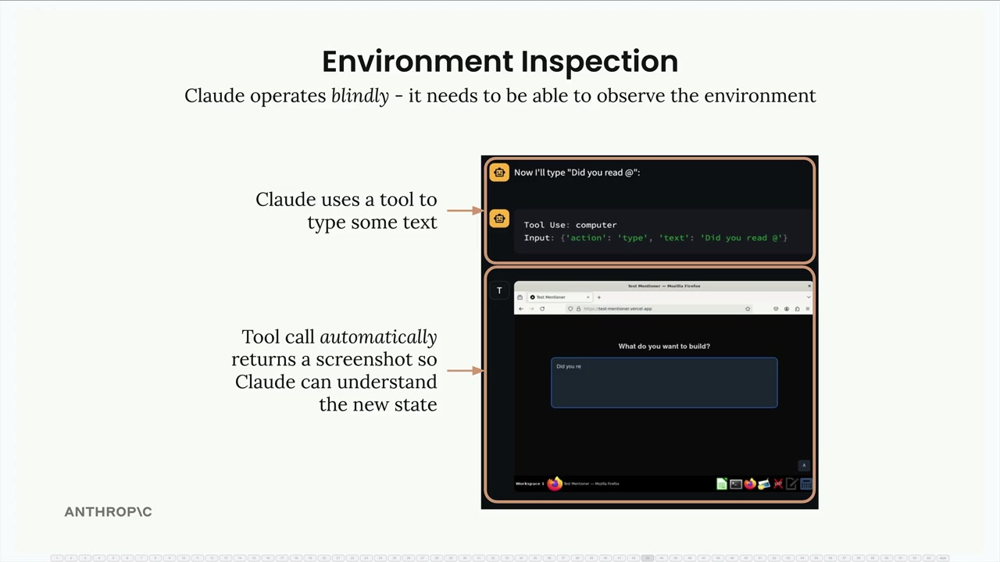

> [!finding] Skilljar L06 원문
> *"When building AI agents, one crucial concept often gets overlooked: environment inspection. Claude operates blindly --- it needs to be able to observe and understand the results of its actions to work effectively."*

도구 호출은 **외부 세상에 영향을 미치지만**, Claude 는 그 결과를 **자동으로 알 수 없다**. `bash("rm file.txt")` 를 호출했을 때, 실제로 파일이 지워졌는지 · 권한 오류가 났는지 · 심지어 엉뚱한 디렉토리였는지, 도구가 반환값으로 알려주지 않으면 Claude 는 모른다.

**Week 08 Computer Use** 가 매번 클릭 후 스크린샷을 받는 이유가 이것이다. 버튼 클릭이 새 페이지로 이동했는지, 메뉴를 열었는지, 아무 일도 없었는지 --- 스크린샷이 없으면 Claude 는 다음 행동을 결정할 근거가 없다.

#### 2.3.2 Read-Before-Write 원칙

파일 작업에서도 같은 원리가 적용된다. Claude 가 Python 파일에 새 라우트를 추가하려면, **먼저 기존 코드를 읽어서** 현재 구조를 파악해야 한다.

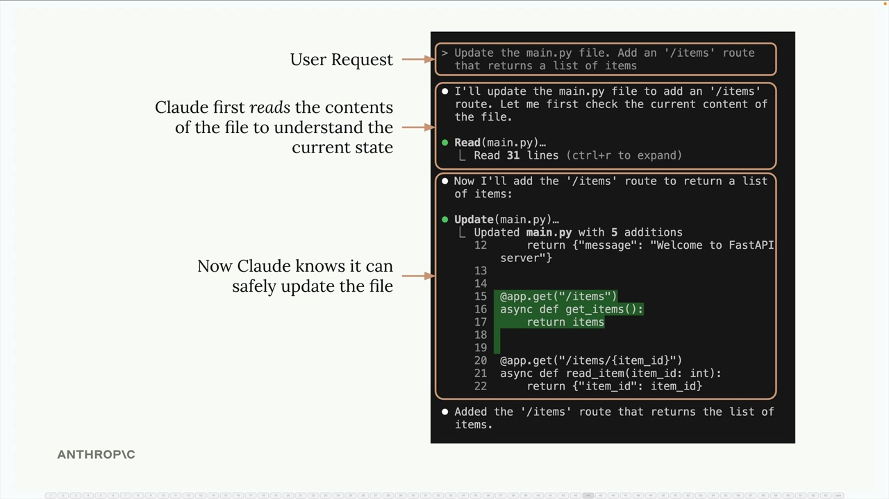

> [!method] Read-Before-Write Pattern
> ```
> 1. read(target_file)          # 현재 상태 이해
> 2. plan modification           # 변경 계획 수립
> 3. edit(target_file, diff)     # 변경 적용
> 4. read(target_file)           # ✅ 변경 검증 (선택적이지만 권장)
> ```
> Claude Code 의 `Edit` 도구가 *"You must use the Read tool at least once in the conversation before editing"* 규칙을 강제하는 이유가 바로 이것이다.

Week 08 실습에서 `Edit` 도구 사용 전 반드시 `Read` 를 요구받은 경험이 있을 것이다 --- 이는 단순한 형식 검증이 아니라, **에이전트가 blind edit 으로 파일을 망가뜨리는 것을 방지** 하는 설계 원칙이다.

#### 2.3.3 비디오 에이전트 --- 3단계 검증

L06 의 비디오 에이전트 예제는 환경 인스펙션을 시스템 프롬프트로 강제하는 방법을 보여준다.

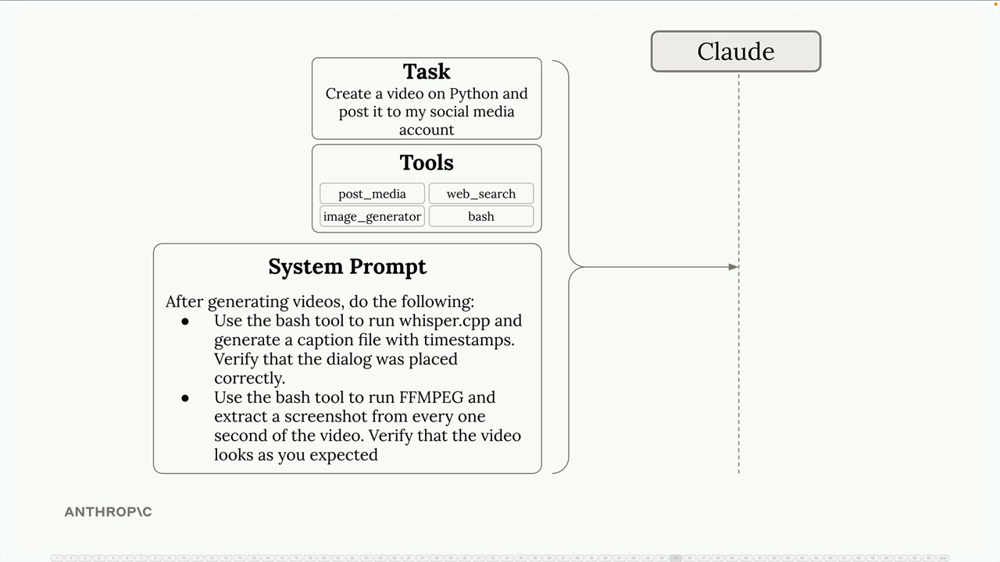

시스템 프롬프트 예시:

```text
After generating a video with FFmpeg, you MUST verify the output:

1. Use the bash tool to run whisper.cpp and generate caption files
   with timestamps. Verify that dialogue is placed at the correct timestamps.

2. Use FFmpeg to extract screenshots from the video at regular intervals
   (every 2 seconds). Visually inspect these screenshots to confirm that
   visual elements appear as expected.

3. Compare the generated content against the original requirements.
   If any discrepancy is found, identify the cause and regenerate the
   affected segment.

Do NOT report success until all three checks pass.
```

이 프롬프트는 **도구를 추가하지 않고** 행동 규범만 주입함으로써 에이전트를 **self-verifying agent** 로 바꾼다. whisper.cpp 는 오디오→캡션 변환 도구이므로, 의도한 대사가 실제 비디오에 들어갔는지 확인하는 데 쓰인다. FFmpeg `-vf fps=0.5 screenshot_%03d.png` 로 2초마다 프레임을 뽑아 시각 요소를 검증한다.

#### 2.3.4 인스펙션이 주는 4가지 이득

L06 은 환경 인스펙션이 에이전트에 다음 4 가지를 가능하게 한다고 정리한다.

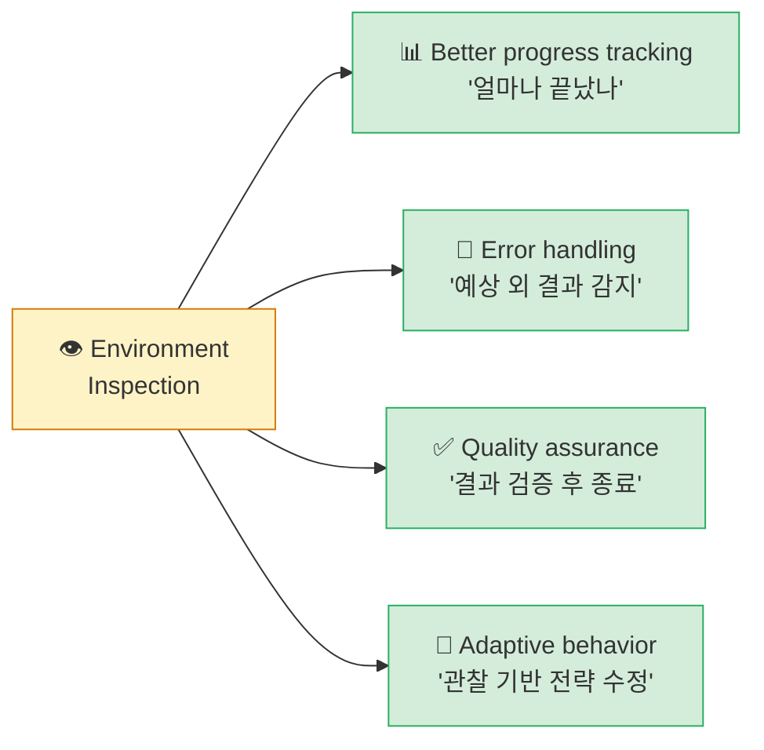
```mermaid
graph LR
    I["👁️ Environment<br/>Inspection"] --> B1["📊 Better progress tracking<br/>'얼마나 끝났나'"]
    I --> B2["🔧 Error handling<br/>'예상 외 결과 감지'"]
    I --> B3["✅ Quality assurance<br/>'결과 검증 후 종료'"]
    I --> B4["🎯 Adaptive behavior<br/>'관찰 기반 전략 수정'"]

    style I fill:#fef3c7,stroke:#d97706
    style B1 fill:#d4edda,stroke:#27ae60
    style B2 fill:#d4edda,stroke:#27ae60
    style B3 fill:#d4edda,stroke:#27ae60
    style B4 fill:#d4edda,stroke:#27ae60
```

#### 2.3.5 실무 적용 --- *"How will Claude know if this action worked?"*

L06 이 제안하는 설계 질문은 단 하나다 --- *"How will Claude know if this action worked?"* 모든 도구를 설계할 때 이 질문을 던지면 인스펙션 누락을 자연스럽게 막을 수 있다.

| 작업 유형 | 필수 인스펙션 패턴 |
| --- | --- |
| 파일 수정 | `read` before `edit`, `read` after `edit` (diff 확인) |
| UI 상호작용 | 클릭/입력 직후 `screenshot` |
| API 호출 | 응답 JSON 을 전체 반환(상태 코드만 반환하지 말 것) |
| 생성 콘텐츠 | 요구사항 대조 루프 (L06 의 whisper/FFmpeg 패턴) |
| 데이터베이스 | `INSERT` 후 `SELECT` 로 실제 저장 확인 |

> [!ref] 소스: Skilljar L06 --- Environment inspection (287798)

> [!action] 실습 노트북
> 📂 `03-Exercises/Week_09/skilljar/S8_05_agent_tools.ipynb` (후반부) 에서 read-before-write 를 강제하는 파일시스템 에이전트를 확장한다. **검증 시나리오**: 에이전트에게 `README.md` 에 새 섹션 추가를 지시한 뒤, 인스펙션 누락 시 발생하는 오류(기존 내용 덮어쓰기, 중복 추가)를 관찰한다.

---

### 2.4 Workflows vs Agents 최종 비교

#### 2.4.1 선택 기준은 *"문제를 얼마나 잘 아는가"*

L07 은 Ch.1~§2.3 전체를 관통하는 **선택 기준** 을 공식화한다.

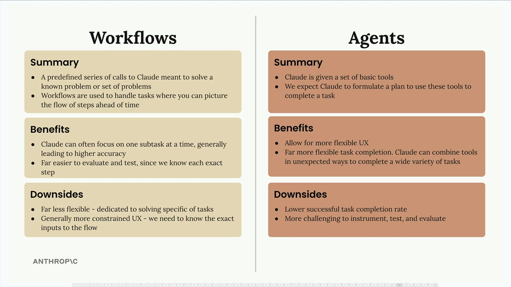

> [!finding] Skilljar L07 --- Workflows 정의
> *"Workflows are a predefined series of calls to Claude designed to solve a known problem or set of problems. You use workflows when you can picture the flow of steps ahead of time --- essentially when you know the exact sequence needed to complete a task."*

> [!finding] Skilljar L07 --- Agents 정의
> *"With agents, Claude gets a set of basic tools and is expected to formulate a plan to use these tools to complete a task. Unlike workflows, you don't know exactly what tasks will be provided, so the system needs to be more adaptive."*

#### 2.4.2 4-항목 비교 매트릭스 (Benefits × Downsides)

L07 이 제시하는 4-항목 비교는 **실무 의사결정의 핵심 레퍼런스** 다.

| | **Workflows** | **Agents** |
| --- | --- | --- |
| **Benefits** | • 서브태스크 하나씩 집중 → 높은 정확도<br/>• 각 스텝을 알기에 평가·테스트 쉬움<br/>• 예측 가능하고 신뢰성 있는 실행<br/>• 특정·잘 정의된 문제에 적합 | • 유연한 UX 제공<br/>• 도구 조합으로 다양한 태스크 해결<br/>• 개발 시 예상하지 못한 상황 처리<br/>• 필요 시 사용자에게 추가 입력 요청 |
| **Downsides** | • 유연성 부족 --- 특정 태스크에만 한정<br/>• 제약된 UX --- 입력을 미리 알아야 함<br/>• 사전 설계·기획 비용 큼 | • 워크플로 대비 성공률 낮음<br/>• 실행 경로 예측 불가 → 평가·계측 어려움<br/>• 예측 불가한 동작 |

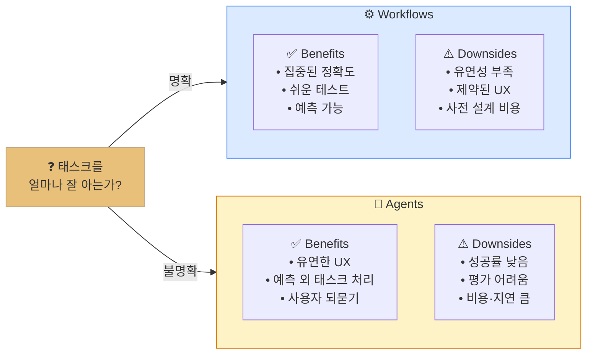
```mermaid
graph LR
    subgraph W["⚙️ Workflows"]
        WB["✅ Benefits<br/>• 집중된 정확도<br/>• 쉬운 테스트<br/>• 예측 가능"]
        WD["⚠️ Downsides<br/>• 유연성 부족<br/>• 제약된 UX<br/>• 사전 설계 비용"]
    end

    subgraph A["🤖 Agents"]
        AB["✅ Benefits<br/>• 유연한 UX<br/>• 예측 외 태스크 처리<br/>• 사용자 되묻기"]
        AD["⚠️ Downsides<br/>• 성공률 낮음<br/>• 평가 어려움<br/>• 비용·지연 큼"]
    end

    Q["❓ 태스크를<br/>얼마나 잘 아는가?"] -->|명확| W
    Q -->|불명확| A

    style W fill:#dbeafe,stroke:#3b82f6
    style A fill:#fef3c7,stroke:#d97706
    style Q fill:#e8c07a,stroke:#c4a882,color:#333
```

#### 2.4.3 Workflow-First 원칙

L07 이 제시하는 **가장 중요한 실무 권고** 는 명확하다.

> [!finding] Skilljar L07 --- 최종 권고
> *"Your primary goal as an engineer is to solve problems reliably. Users probably don't care that you've built a fancy agent --- they want a product that works consistently. The general recommendation is to always focus on implementing workflows where possible, and only resort to agents when they are truly required."*

이를 **Workflow-First 결정 플로우차트** 로 정리하면:

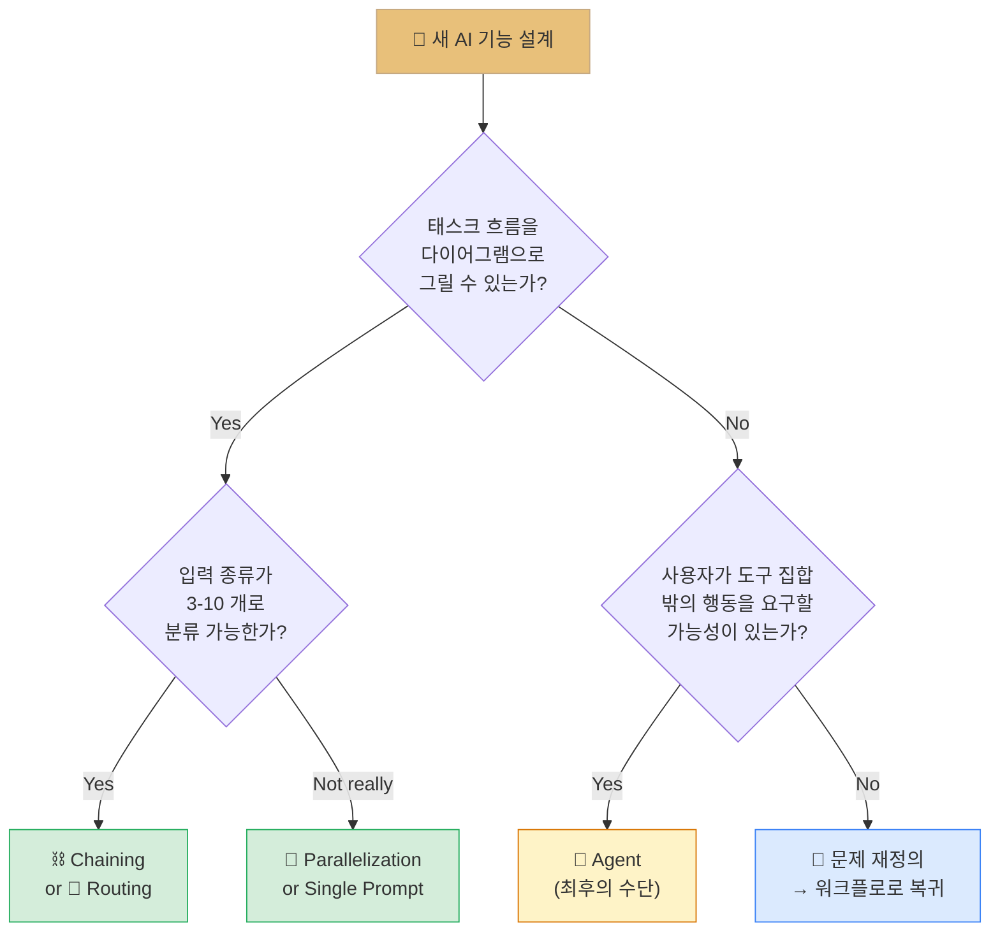
```mermaid
flowchart TD
    Start["🎯 새 AI 기능 설계"] --> Q1{"태스크 흐름을<br/>다이어그램으로<br/>그릴 수 있는가?"}

    Q1 -->|Yes| Q2{"입력 종류가<br/>3-10 개로<br/>분류 가능한가?"}
    Q1 -->|No| Q3{"사용자가 도구 집합<br/>밖의 행동을 요구할<br/>가능성이 있는가?"}

    Q2 -->|Yes| W1["⛓️ Chaining<br/>or 🔀 Routing"]
    Q2 -->|Not really| W2["🔄 Parallelization<br/>or Single Prompt"]

    Q3 -->|Yes| A1["🤖 Agent<br/>(최후의 수단)"]
    Q3 -->|No| Redesign["🔁 문제 재정의<br/>→ 워크플로로 복귀"]

    style Start fill:#e8c07a,stroke:#c4a882,color:#333
    style W1 fill:#d4edda,stroke:#27ae60
    style W2 fill:#d4edda,stroke:#27ae60
    style A1 fill:#fef3c7,stroke:#d97706
    style Redesign fill:#dbeafe,stroke:#3b82f6
```

> [!tip] 에이전트는 *"마지막 수단"*
> Anthropic 자체 권고인 *"always focus on implementing workflows where possible, and only resort to agents when they are truly required"* 를 기억하자. 프로덕션 시스템의 80-90% 는 워크플로로 충분하다. 에이전트는 **입력 종류를 미리 알 수 없는 경우**(예: Claude Code) 에만 정당화된다.

#### 2.4.4 하이브리드 패턴 --- 워크플로 안의 에이전트

실무에서는 두 접근법을 **계층적으로 조합** 하는 경우가 많다. 바깥 껍질은 워크플로로 감싸 예측 가능성을 확보하고, 특정 스텝(예측 불가한 하위 태스크)만 에이전트로 처리한다.

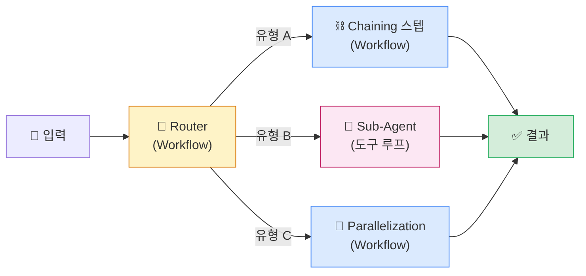
```mermaid
graph LR
    U["👤 입력"] --> R["🔀 Router<br/>(Workflow)"]
    R -->|유형 A| W1["⛓️ Chaining 스텝<br/>(Workflow)"]
    R -->|유형 B| A1["🤖 Sub-Agent<br/>(도구 루프)"]
    R -->|유형 C| W2["🔄 Parallelization<br/>(Workflow)"]
    W1 --> Out["✅ 결과"]
    A1 --> Out
    W2 --> Out

    style R fill:#fef3c7,stroke:#d97706
    style W1 fill:#dbeafe,stroke:#3b82f6
    style W2 fill:#dbeafe,stroke:#3b82f6
    style A1 fill:#fce7f3,stroke:#be185d
    style Out fill:#d4edda,stroke:#27ae60
```

이 패턴은 Week 13 통합 프로젝트에서 다시 만난다 --- 설계 검토 시스템의 **문서 유형 라우팅(워크플로)** → **유형별 심화 분석(에이전트 또는 체이닝)** 구조가 그 예다.

> [!ref] 소스: Skilljar L07 --- Workflows vs agents (287794)

> [!action] 실습 노트북
> 📂 `03-Exercises/Week_09/skilljar/S8_06_practice.ipynb` (학생 자율) 에서 단일 태스크를 (1) 워크플로 (2) 에이전트 두 방식으로 구현 후, **성공률·비용·지연** 3 지표로 직접 비교한다.

---

### 2.5 도메인 응용 --- 건축 구조공학 에이전트

#### 2.5.1 왜 구조공학인가

건축 구조공학은 4 가지 패턴이 **자연스럽게 결합되는** 도메인이다 --- 시방서·설계기준은 문서 유형별 분기(라우팅)가 필수고, 다관점 검토(병렬화)가 관행이며, 해석 결과 처리는 순차적 파이프라인(체이닝)이고, Midas 같은 해석 소프트웨어 조작은 에이전트가 가장 빛을 발하는 영역이다.

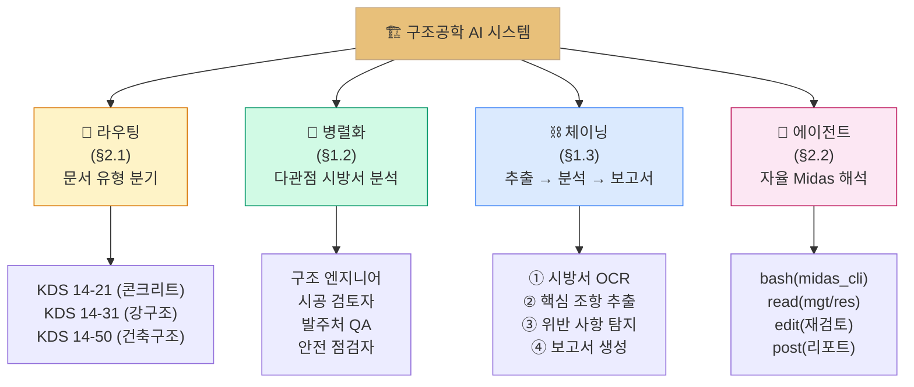
```mermaid
graph TD
    P["🏗️ 구조공학 AI 시스템"] --> R["🔀 라우팅<br/>(§2.1)<br/>문서 유형 분기"]
    P --> PP["🔄 병렬화<br/>(§1.2)<br/>다관점 시방서 분석"]
    P --> C["⛓️ 체이닝<br/>(§1.3)<br/>추출 → 분석 → 보고서"]
    P --> A["🤖 에이전트<br/>(§2.2)<br/>자율 Midas 해석"]

    R --> D1["KDS 14-21 (콘크리트)<br/>KDS 14-31 (강구조)<br/>KDS 14-50 (건축구조)"]
    PP --> D2["구조 엔지니어<br/>시공 검토자<br/>발주처 QA<br/>안전 점검자"]
    C --> D3["① 시방서 OCR<br/>② 핵심 조항 추출<br/>③ 위반 사항 탐지<br/>④ 보고서 생성"]
    A --> D4["bash(midas_cli)<br/>read(mgt/res)<br/>edit(재검토)<br/>post(리포트)"]

    style P fill:#e8c07a,stroke:#c4a882,color:#333
    style R fill:#fef3c7,stroke:#d97706
    style PP fill:#d1fae5,stroke:#059669
    style C fill:#dbeafe,stroke:#3b82f6
    style A fill:#fce7f3,stroke:#be185d
```

#### 2.5.2 설계 검토 자동화 시스템 --- 4 패턴 통합 설계

**시나리오**: 사용자가 건축구조 설계 PDF (시방서 + Midas 해석 결과) 를 업로드하면, 시스템이 KDS 기준 준수 여부를 자동 검토한다.

**전체 파이프라인**:

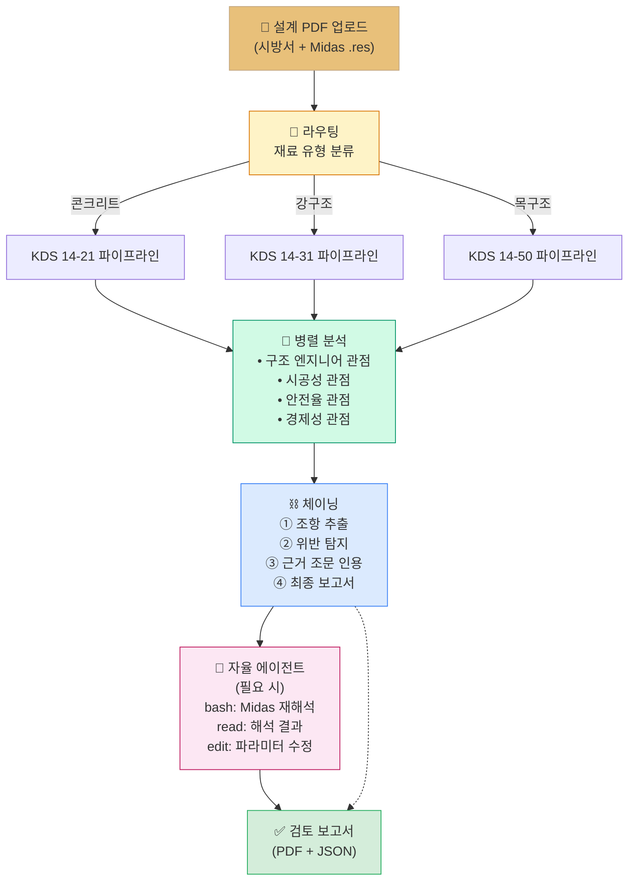
```mermaid
graph TD
    In["📄 설계 PDF 업로드<br/>(시방서 + Midas .res)"] --> R["🔀 라우팅<br/>재료 유형 분류"]

    R -->|콘크리트| C1["KDS 14-21 파이프라인"]
    R -->|강구조| S1["KDS 14-31 파이프라인"]
    R -->|목구조| W1["KDS 14-50 파이프라인"]

    C1 --> PP["🔄 병렬 분석<br/>• 구조 엔지니어 관점<br/>• 시공성 관점<br/>• 안전율 관점<br/>• 경제성 관점"]
    S1 --> PP
    W1 --> PP

    PP --> CH["⛓️ 체이닝<br/>① 조항 추출<br/>② 위반 탐지<br/>③ 근거 조문 인용<br/>④ 최종 보고서"]

    CH --> A["🤖 자율 에이전트<br/>(필요 시)<br/>bash: Midas 재해석<br/>read: 해석 결과<br/>edit: 파라미터 수정"]

    A --> Out["✅ 검토 보고서<br/>(PDF + JSON)"]
    CH -.-> Out

    style In fill:#e8c07a,stroke:#c4a882,color:#333
    style R fill:#fef3c7,stroke:#d97706
    style PP fill:#d1fae5,stroke:#059669
    style CH fill:#dbeafe,stroke:#3b82f6
    style A fill:#fce7f3,stroke:#be185d
    style Out fill:#d4edda,stroke:#27ae60
```

#### 2.5.3 Python 스켈레톤 --- `design_review_pipeline`

```python
from anthropic import Anthropic
import asyncio
from anthropic import AsyncAnthropic

client = Anthropic()
async_client = AsyncAnthropic()
MODEL = "claude-haiku-4-5"

# ① 라우팅 (§2.1) --- KDS 재료 유형 분류
KDS_ROUTES = {
    "콘크리트": "KDS 14-21 철근콘크리트 설계기준",
    "강구조":   "KDS 14-31 강구조 설계기준",
    "목구조":   "KDS 14-50 목구조 설계기준",
    "조적":     "KDS 14-32 조적식구조 설계기준",
}

def route_material(spec_text: str) -> str:
    prompt = (
        "다음 시방서가 어느 재료에 해당하는지 분류하세요:\n"
        f"<spec>{spec_text[:2000]}</spec>\n"
        f"<categories>{list(KDS_ROUTES)}</categories>\n"
        "카테고리 이름만 반환."
    )
    resp = client.messages.create(model=MODEL, max_tokens=20,
                                   messages=[{"role": "user", "content": prompt}])
    return resp.content[0].text.strip()

# ② 병렬 분석 (§1.2) --- 4관점 동시 평가
PERSPECTIVES = {
    "구조엔지니어": "구조적 안정성·하중 경로·부재 설계 관점에서 평가",
    "시공검토자":   "시공 순서·가설공사·타설 일정 관점에서 평가",
    "발주처QA":     "시방서와 도면의 일치 여부·설계 기준 준수 관점에서 평가",
    "안전점검자":   "안전율·내진·내화 관점에서 평가",
}

async def perspective_review(perspective: str, system: str, spec: str):
    resp = await async_client.messages.create(
        model=MODEL, max_tokens=800, system=system,
        messages=[{"role": "user", "content": spec}],
    )
    return perspective, resp.content[0].text

async def parallel_review(spec: str):
    tasks = [perspective_review(p, s, spec) for p, s in PERSPECTIVES.items()]
    return dict(await asyncio.gather(*tasks))

# ③ 체이닝 (§1.3) --- 추출 → 분석 → 보고서
def chain_step(prompt: str, prior: str = "") -> str:
    full_prompt = f"{prior}\n\n{prompt}" if prior else prompt
    resp = client.messages.create(model=MODEL, max_tokens=2000,
                                   messages=[{"role": "user", "content": full_prompt}])
    return resp.content[0].text

def chain_review(spec: str, kds_ref: str):
    step1 = chain_step(f"다음 시방서에서 핵심 조항을 추출:\n{spec}")
    step2 = chain_step(f"위 조항을 {kds_ref}와 대조해 위반 사항을 탐지", prior=step1)
    step3 = chain_step("위반 사항을 근거 조문과 함께 보고서로 정리 (한국어, 섹션 구분)", prior=step2)
    return step3

# ④ 에이전트 (§2.2) --- 필요 시 Midas 재해석
MIDAS_TOOLS = [
    {"name": "run_midas", "description": "Midas CLI 실행", ...},
    {"name": "read_res",  "description": "해석 결과(.res) 파싱", ...},
    {"name": "edit_mgt",  "description": "입력 파일 파라미터 수정", ...},
]

def midas_agent(goal: str):
    # §2.2.5 agent_loop() 활용
    ...

# 전체 파이프라인
async def design_review_pipeline(spec_text: str):
    material = route_material(spec_text)                    # ① 라우팅
    kds_ref = KDS_ROUTES[material]
    perspectives = await parallel_review(spec_text)         # ② 병렬
    report = chain_review(spec_text, kds_ref)               # ③ 체이닝
    # ④ 에이전트는 위반 사항 발견 시 호출 (선택적)
    return {"material": material, "kds": kds_ref,
            "perspectives": perspectives, "report": report}
```

#### 2.5.4 Midas 에이전트 --- 추상 도구 설계

L05 의 *"tools should be abstract"* 원칙을 Midas 도메인에 적용하면:

| ❌ Hyper-specialized (권장 안함) | ✅ Abstract (권장) |
| --- | --- |
| `check_beam_deflection()` | `run_midas(cmd)` + `read_res(path)` |
| `fix_column_reinforcement()` | `edit_mgt(path, param, value)` |
| `generate_seismic_report()` | `bash(command)` + `write(path, content)` |
| `validate_KDS_14_31()` | `grep(pattern, file)` + `read(file)` |

추상 도구의 장점 --- **설계자가 예상하지 못한 시나리오** (예: *"RC 보 균열폭이 0.3mm 를 초과하는지 확인하고, 초과 시 단면을 재검토한 뒤 새 해석 결과를 리포트"*) 도 도구 조합만으로 처리 가능하다.

> [!tip] W10/W11 연결
> 이 §2.5 설계는 **W10 (BIM + IFC)** 와 **W11 (Midas + MCP)** 의 기반이 된다. W10 에서는 `IFC 파일 → 구조 부재 추출` 체이닝을, W11 에서는 `Midas MCP 서버 → 해석 에이전트` 를 본격적으로 구현한다. §2.5 는 **선행 설계 스케치** 로, 뒤이어지는 두 주차의 방향을 잡아준다.

> [!ref] 소스: 건축 도메인 응용 --- Skilljar L01-L07 + KDS 설계기준 + Week 07 MCP + Week 11 예고

> [!action] 실습 노트북
> 📂 `03-Exercises/Week_09/skilljar/S8_07_structural_agents.ipynb` 에서 `design_review_pipeline` 을 단계별로 구현한다. 심화 학습자는 📂 `CW_03_ae_cowork_design.ipynb` 로 Cowork 페어 작업을 체험한다.

---

## Chapter 3. 자가 점검 및 요약

### 3.1 10-문항 퀴즈

아래 문제를 먼저 풀어본 뒤, 정답을 펼쳐 비교하세요.

> [!question] Q1. Workflows 와 Agents 의 가장 근본적인 차이는?
> (a) Workflows 는 단일 LLM 호출, Agents 는 다중 호출<br/>
> (b) Workflows 는 *"predetermined series of steps"*, Agents 는 *"goal + tools"* 방식<br/>
> (c) Workflows 는 Claude 전용, Agents 는 범용<br/>
> (d) Workflows 는 무료, Agents 는 유료

> [!tip]- 정답
> **(b)** L01 정의 인용 --- *"Workflows are a series of calls to Claude meant to solve a specific problem through a predetermined series of steps. Agents give Claude a goal and a set of tools."*

> [!question] Q2. Evaluator-Optimizer 패턴의 4 구성 요소가 아닌 것은?
> (a) Producer<br/>
> (b) Grader<br/>
> (c) **Broker**<br/>
> (d) Feedback loop

> [!tip]- 정답
> **(c)** L01 의 4 요소는 Producer / Grader / Feedback loop / Iteration 이다. Broker 는 포함되지 않는다.

> [!question] Q3. 병렬화 워크플로의 4 가지 이점에 해당하지 않는 것은?
> (a) Focused attention<br/>
> (b) Easier optimization<br/>
> (c) **Lower cost** (비용 절감)<br/>
> (d) Better scalability

> [!tip]- 정답
> **(c)** L02 가 명시하는 4 이점은 Focused attention / Easier optimization / Better scalability / Improved reliability 다. 병렬화는 오히려 **동시 호출이 늘어 비용이 증가** 할 수 있다 --- 비용 절감은 이점으로 거론되지 않는다.

> [!question] Q4. 체이닝 워크플로가 가장 효과적인 상황은?
> (a) 독립적인 다관점 분석이 필요할 때<br/>
> (b) **긴 제약조건 프롬프트에서 Claude 가 일부 규칙을 무시할 때**<br/>
> (c) 사용자 입력을 카테고리로 분류해야 할 때<br/>
> (d) 도구 호출 횟수를 미리 알 수 없을 때

> [!tip]- 정답
> **(b)** L03 의 "Long Prompt Problem" --- 한 번에 모든 제약을 지키게 하는 대신, **생성 → 교정** 2-step 체이닝이 효과적이다.

> [!question] Q5. Skilljar L03 의 Two-Step Revision 예제에서 2단계 프롬프트가 명시한 3 가지 수정 작업은?
> (a) 이모지 제거 · 문법 교정 · 길이 축약<br/>
> (b) **AI 언급 제거 · 이모지 제거 · cringey 표현을 기술 작가체로 교체**<br/>
> (c) 요약 · 번역 · 포맷팅<br/>
> (d) SEO 최적화 · 제목 개선 · 해시태그 추가

> [!tip]- 정답
> **(b)** L03 원문 인용 --- *"1. Identify any location where the text identifies the author as an AI and remove them; 2. Find and remove all emojis; 3. Locate any cringey writing and replace it with text that would be written by a technical writer."*

> [!question] Q6. 라우팅 워크플로의 6 가지 비디오 콘텐츠 카테고리가 아닌 것은?
> (a) Entertainment<br/>
> (b) Educational<br/>
> (c) **Tutorial** <br/>
> (d) Comedy

> [!tip]- 정답
> **(c)** L04 의 6 카테고리: Entertainment · Educational · Comedy · Personal vlog · Reviews · Storytelling. Tutorial 은 포함되지 않는다(교육 콘텐츠는 Educational 로 포괄).

> [!question] Q7. Claude Code 가 `refactor_code` 같은 구체적 도구 대신 `bash/read/write/edit/glob/grep` 같은 추상 도구를 갖는 이유는?
> (a) 구체적 도구를 만드는 것이 기술적으로 어려워서<br/>
> (b) **추상 도구의 조합이 개발자가 예상하지 못한 시나리오까지 커버하기 때문**<br/>
> (c) 도구 수를 최소화해 비용을 줄이려고<br/>
> (d) Claude Haiku 모델이 추상 도구만 지원해서

> [!tip]- 정답
> **(b)** L05 원문 --- *"This abstraction allows it to handle countless programming scenarios that the developers never explicitly planned for."*

> [!question] Q8. 환경 인스펙션(Environment Inspection)에서 *"Read-Before-Write"* 원칙의 핵심은?
> (a) 읽기 권한을 먼저 확보해야 하기 때문<br/>
> (b) 디스크 I/O 를 줄이기 위해<br/>
> (c) **현재 상태를 파악해야 기존 구조를 깨뜨리지 않고 변경할 수 있기 때문**<br/>
> (d) Claude API 가 read 토큰을 더 싸게 과금해서

> [!tip]- 정답
> **(c)** L06 원문 인용 --- *"Before Claude can modify any file, it needs to understand the current contents... only then can it safely make the requested changes without breaking existing functionality."*

> [!question] Q9. L07 의 최종 권고 *"workflow-first"* 가 의미하는 바는?
> (a) 모든 프로젝트에서 워크플로만 사용하고 에이전트는 쓰지 말 것<br/>
> (b) 워크플로를 먼저 코딩하고 에이전트는 나중에 코딩할 것<br/>
> (c) **가능하면 워크플로로 구현하고, 에이전트는 정말 필요할 때만 사용할 것**<br/>
> (d) 워크플로 교육을 에이전트 교육보다 먼저 수행할 것

> [!tip]- 정답
> **(c)** L07 원문 --- *"Always focus on implementing workflows where possible, and only resort to agents when they are truly required."*

> [!question] Q10. 병렬화 구현에 Python `asyncio.gather` 를 쓰는 이유는?
> (a) 동기 호출보다 코드가 짧기 때문<br/>
> (b) **독립적인 LLM 호출을 동시에 보내 전체 대기시간을 크게 단축하기 위해**<br/>
> (c) `asyncio` 가 비용 청구를 합산해주기 때문<br/>
> (d) Anthropic 이 async 클라이언트만 지원하기 때문

> [!tip]- 정답
> **(b)** 병렬화의 핵심 이점 --- 순차 호출 시 N×latency 인 시간이, 병렬 호출 시 max(latency) 로 수렴한다. 4 가지 재료 평가라면 약 4 배 빨라진다.

---

### 3.2 학습 요약 및 누적 로드맵

#### 3.2.1 W09 최종 성취 (Mastery Checklist)

| # | 성취 항목 | 근거 |
| --- | --- | --- |
| 1 | Workflows vs Agents 정의를 한 문장으로 설명 | L01 |
| 2 | Evaluator-Optimizer 4 요소 구분 | L01 |
| 3 | `asyncio.gather` 로 다중 LLM 호출 병렬화 | L02 + §1.2 |
| 4 | Two-Step Revision 으로 긴 제약조건 처리 | L03 + §1.3 |
| 5 | 6-카테고리 라우터 + 전문 프롬프트 템플릿 구현 | L04 + §2.1 |
| 6 | Datetime 3-tool 에이전트 루프 구현 | L05 + §2.2 |
| 7 | 추상 도구 vs 구체 도구의 trade-off 설명 | L05 + §2.2.3 |
| 8 | Read-Before-Write · 스크린샷 검증 패턴 적용 | L06 + §2.3 |
| 9 | Workflow-first 결정 플로우차트 구사 | L07 + §2.4 |
| 10 | 4 패턴 조합한 건축 설계 검토 파이프라인 스케치 | §2.5 |

#### 3.2.2 누적 학습 로드맵 --- Week 01 → Week 13


```mermaid
graph LR
    W1["W01<br/>LLM 기초<br/>4D"] --> W2["W02<br/>API"]
    W2 --> W3["W03<br/>프롬프트<br/>Eval"]
    W3 --> W4["W04<br/>Tool Use"]
    W4 --> W5["W05<br/>RAG"]
    W5 --> W6["W06<br/>Claude 기능"]
    W6 --> W7["W07<br/>MCP"]
    W7 --> W8["W08<br/>Claude Code<br/>Computer Use"]
    W8 ==> W9["🌟 W09<br/>워크플로 &<br/>에이전트"]
    W9 --> W10["W10<br/>BIM·IFC"]
    W10 --> W11["W11<br/>Midas MCP"]
    W11 --> W12["W12<br/>멀티모달<br/>Agent SDK"]
    W12 --> W13["W13<br/>통합·배포"]

    style W9 fill:#fef3c7,stroke:#d97706,color:#333,stroke-width:3px
    style W1 fill:#f3f4f6,stroke:#9ca3af
    style W2 fill:#f3f4f6,stroke:#9ca3af
    style W3 fill:#f3f4f6,stroke:#9ca3af
    style W4 fill:#dbeafe,stroke:#3b82f6
    style W5 fill:#dbeafe,stroke:#3b82f6
    style W6 fill:#dbeafe,stroke:#3b82f6
    style W7 fill:#dbeafe,stroke:#3b82f6
    style W8 fill:#d1fae5,stroke:#059669
    style W10 fill:#fce7f3,stroke:#be185d
    style W11 fill:#fce7f3,stroke:#be185d
    style W12 fill:#fce7f3,stroke:#be185d
    style W13 fill:#fce7f3,stroke:#be185d
```

**W09 는 커리큘럼의 변곡점** 이다 --- 왼쪽(W01-W08) 은 개별 기술(API, 프롬프트, Tool, RAG, MCP, Claude Code)을 **수직적으로 쌓았고**, 오른쪽(W10-W13)은 이를 **건축공학 도메인에 수평 전개** 한다. W09 의 4 패턴은 그 **연결 다리** 다.

#### 3.2.3 핵심 인사이트 Top 3

> [!finding] 인사이트 1 --- 워크플로는 *"조합"* 이다
> 병렬화·체이닝·라우팅은 서로 **배타적이지 않다**. 실제 시스템은 *"라우팅 → 병렬화 → 체이닝"* 처럼 중첩된 구조를 띤다. 4 패턴은 요리의 *"기본 조리법"* 이지 배타적 레시피가 아니다.

> [!finding] 인사이트 2 --- 도구는 추상적일수록 강해진다
> Claude Code 가 `bash + read + write + edit + glob + grep` 6개로 수많은 프로그래밍 작업을 커버하는 것처럼, **도메인 에이전트 설계의 핵심은 최소한의 추상 도구 집합** 을 찾는 것이다. `refactor_code` 대신 `read + edit` 을 제공하라.

> [!finding] 인사이트 3 --- 에이전트는 "눈" 이 필요하다
> 환경 인스펙션 없는 에이전트는 **눈 가린 채 작업하는 사람** 과 같다. 모든 도구 설계에서 *"How will Claude know if this action worked?"* 를 물어야 한다. 이 질문이 read-before-write, screenshot-after-click, whisper-verification 같은 패턴을 자연스럽게 만들어낸다.

---

## 💻 실습 과제 (Week 09 Exercises)

### 실습 빌드업 구조

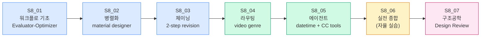
```mermaid
graph LR
    E1["S8_01<br/>워크플로 기초<br/>Evaluator-Optimizer"] --> E2["S8_02<br/>병렬화<br/>material designer"]
    E2 --> E3["S8_03<br/>체이닝<br/>2-step revision"]
    E3 --> E4["S8_04<br/>라우팅<br/>video genre"]
    E4 --> E5["S8_05<br/>에이전트<br/>datetime + CC tools"]
    E5 --> E6["S8_06<br/>실전 종합<br/>(자율 실습)"]
    E6 --> E7["S8_07<br/>구조공학<br/>Design Review"]

    style E1 fill:#dbeafe,stroke:#3b82f6
    style E2 fill:#dbeafe,stroke:#3b82f6
    style E3 fill:#dbeafe,stroke:#3b82f6
    style E4 fill:#d1fae5,stroke:#059669
    style E5 fill:#d1fae5,stroke:#059669
    style E6 fill:#fef3c7,stroke:#d97706
    style E7 fill:#fce7f3,stroke:#be185d
```

### 노트북 목록

| 노트북 | 주제 | 주요 실습 | Skilljar 레슨 |
| --- | --- | --- | --- |
| `S8_01_workflow_intro.ipynb` | 워크플로 개념 + Evaluator-Optimizer | Producer/Grader/Feedback 수동 구현 | L01 |
| `S8_02_parallelization.ipynb` | 병렬화 워크플로 | `asyncio.gather` + material designer | L02 |
| `S8_03_chaining.ipynb` | 체이닝 워크플로 | article 생성 → 2-step revision | L03 |
| `S8_04_routing.ipynb` | 라우팅 워크플로 | 6-카테고리 video genre router | L04 |
| `S8_05_agent_tools.ipynb` | 에이전트 + 도구 + 환경 인스펙션 | datetime 3-tool + 미니 파일시스템 에이전트 | L05 + L06 |
| `S8_06_practice.ipynb` (자율) | 통합 실전 | 단일 태스크를 워크플로 vs 에이전트로 이중 구현 | L07 |
| `S8_07_structural_agents.ipynb` | 건축 도메인 응용 | `design_review_pipeline` 단계별 구현 | §2.5 |

### 심화 (자율) --- Claude Cowork 트랙

| 노트북 | 주제 | 시점 |
| --- | --- | --- |
| `CW_01_task_loop_simulation.ipynb` | 태스크 루프 시뮬레이션 | W09 주중 |
| `CW_02_skills_and_plugins.ipynb` | Skills + Plugins 조합 | W09 후반 |
| `CW_03_ae_cowork_design.ipynb` | 건축공학 Cowork 설계 | W09 말 / W10 직전 |

> [!action] 제출물
> 1. `S8_01 ~ S8_07` 7 개 노트북 완성본 (주석 포함)
> 2. §2.5 `design_review_pipeline` 실행 로그 (샘플 시방서 1 건)
> 3. **1 쪽 회고록** --- *"내가 설계한 문제에서 워크플로 vs 에이전트 중 무엇을 선택했는가, 왜인가"* (L07 기준 인용)

---

## 🤖 CC 스킬 --- Git Worktrees 병렬 개발 (30-min 블록)

### 왜 Worktrees 인가

에이전트·워크플로를 **동시에 여러 브랜치에서 실험** 해야 할 때, `git checkout` 으로 브랜치를 전환하면 작업 트리 상태가 섞인다. Git Worktrees 는 **하나의 저장소에서 여러 작업 트리** 를 분리해 관리하는 기능으로, 각 디렉토리에서 서로 다른 Claude Code 세션을 돌릴 수 있다.

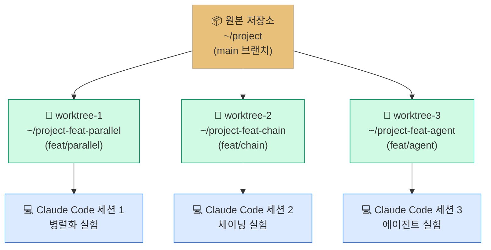
```mermaid
graph TD
    R["📦 원본 저장소<br/>~/project<br/>(main 브랜치)"] --> W1["🌳 worktree-1<br/>~/project-feat-parallel<br/>(feat/parallel)"]
    R --> W2["🌳 worktree-2<br/>~/project-feat-chain<br/>(feat/chain)"]
    R --> W3["🌳 worktree-3<br/>~/project-feat-agent<br/>(feat/agent)"]

    W1 --> S1["💻 Claude Code 세션 1<br/>병렬화 실험"]
    W2 --> S2["💻 Claude Code 세션 2<br/>체이닝 실험"]
    W3 --> S3["💻 Claude Code 세션 3<br/>에이전트 실험"]

    style R fill:#e8c07a,stroke:#c4a882,color:#333
    style W1 fill:#d1fae5,stroke:#059669
    style W2 fill:#d1fae5,stroke:#059669
    style W3 fill:#d1fae5,stroke:#059669
    style S1 fill:#dbeafe,stroke:#3b82f6
    style S2 fill:#dbeafe,stroke:#3b82f6
    style S3 fill:#dbeafe,stroke:#3b82f6
```

### 실습 절차

```bash
# 1. 메인 저장소에서 3 개 worktree 생성
cd ~/LLM-AE-AI-W09
git worktree add ../W09-parallel feat/parallel
git worktree add ../W09-chain    feat/chain
git worktree add ../W09-agent    feat/agent

# 2. 각 디렉토리에서 별도 터미널을 열어 Claude Code 실행
cd ../W09-parallel && claude &
cd ../W09-chain    && claude &
cd ../W09-agent    && claude &

# 3. 각 세션에서 다른 패턴을 병렬로 실험
#    - W09-parallel: S8_02 병렬화 실험
#    - W09-chain:    S8_03 체이닝 실험
#    - W09-agent:    S8_05 에이전트 실험

# 4. 가장 좋은 결과를 main 에 머지
cd ~/LLM-AE-AI-W09
git merge feat/agent   # 예: 에이전트 브랜치 채택

# 5. 작업 완료된 worktree 정리
git worktree remove ../W09-parallel
git worktree remove ../W09-chain
```

### 장점 3가지

| 장점 | 설명 |
| --- | --- |
| **컨텍스트 분리** | 각 세션의 CLAUDE.md · 대화 이력 · 파일 변경이 독립적 |
| **병렬 탐색** | 동일 시간에 3 가지 접근 비교 → 가장 성공한 버전 채택 |
| **브랜치 전환 비용 0** | `cd` 만으로 다른 실험 컨텍스트로 이동 (stash·checkout 불필요) |

> [!tip] Worktrees + Skills 조합
> Week 05 에서 배운 Claude Code Skills 와 결합하면 더 강력하다 --- `~/.claude/skills/parallelization.md`, `~/.claude/skills/chaining.md` 등으로 패턴별 스킬을 만들어두고, 각 worktree 에서 해당 스킬을 호출하는 방식. W09 Cowork 트랙의 `CW_02_skills_and_plugins.ipynb` 에서 이 조합을 실습한다.

> [!action] Worktrees 실습 미션
> 위 절차로 3 worktree 를 만들고, 동일한 *"설계 검토 PDF 요약기"* 를 각 브랜치에서 워크플로/체이닝/에이전트로 구현한 뒤 성능·비용·코드 복잡도를 비교한 표를 제출한다.

---

## 📚 참고 자료

> [!ref] Skilljar S8 --- 원본 레슨 (7 개)
> - [L01 Agents and workflows (287796)](https://anthropic.skilljar.com/claude-with-the-anthropic-api/287796)
> - [L02 Parallelization workflows (287804)](https://anthropic.skilljar.com/claude-with-the-anthropic-api/287804)
> - [L03 Chaining workflows (287800)](https://anthropic.skilljar.com/claude-with-the-anthropic-api/287800)
> - [L04 Routing workflows (287801)](https://anthropic.skilljar.com/claude-with-the-anthropic-api/287801)
> - [L05 Agents and tools (287803)](https://anthropic.skilljar.com/claude-with-the-anthropic-api/287803)
> - [L06 Environment inspection (287798)](https://anthropic.skilljar.com/claude-with-the-anthropic-api/287798)
> - [L07 Workflows vs agents (287794)](https://anthropic.skilljar.com/claude-with-the-anthropic-api/287794)

> [!ref] Anthropic 공식 자료
> - [Building effective agents (Research)](https://www.anthropic.com/research/building-effective-agents) --- 본 강의의 원전
> - [Agents documentation](https://docs.anthropic.com/en/docs/agents) --- 에이전트 설계 가이드
> - [Tool use with Claude](https://docs.anthropic.com/en/docs/build-with-claude/tool-use) --- W04 에서 다룬 Tool Use 의 심화
> - [anthropics/courses --- agents_and_workflows](https://github.com/anthropics/courses/tree/master/agents_and_workflows) --- 공식 실습 노트북

> [!ref] Git Worktrees
> - [Git Worktrees 공식 문서](https://git-scm.com/docs/git-worktree)
> - [Anthropic 권장 Claude Code + Worktrees 사용법](https://docs.anthropic.com/en/docs/claude-code) --- *"Using Claude Code with Git Worktrees"* 섹션

> [!ref] Python 비동기 프로그래밍
> - [Python asyncio 공식 문서](https://docs.python.org/3/library/asyncio.html)
> - [AsyncAnthropic 클라이언트](https://github.com/anthropics/anthropic-sdk-python#async-usage)

> [!ref] 건축공학 도메인 (§2.5)
> - [KDS 설계기준 포털](https://www.kcsc.re.kr) --- 한국건설기준센터
> - [Midas Gen API 문서](https://www.midasstructure.com/) --- W11 연계
> - 참고: [[Week_07]] MCP 서버 → [[Week_11]] Midas MCP

---

## Related

### 직전/직후 주차
- [[Week_08]] --- Anthropic 앱 (Claude Code · Computer Use) : **완성된 에이전트 제품** 소비자 관점
- [[Week_10]] --- BIM + IFC 연동 : **§2.5 의 파이프라인을 IFC 구조 부재 추출에 전개**

### 보조 노트 (자율 심화)
- [[Week_09_Cowork]] --- Claude Cowork 심화 (CW_01, CW_02, CW_03 노트북 해설)

### 핵심 개념 재사용 주차
- [[Week_04]] Tool Use --- §2.2 에이전트 루프의 토대
- [[Week_05]] RAG + Agent Skills --- §2.2 + Worktrees 의 스킬 조합
- [[Week_06]] Subagents + Hooks --- §2.2 에이전트 루프의 확장
- [[Week_07]] MCP --- §2.5 Midas 에이전트의 도구 공급 경로
- [[Week_11]] Midas MCP --- §2.5 설계 검토 파이프라인의 본격 구현

---

**최종 업데이트**: 2026-04-20 (Skilljar S8 L01-L07 기반, v1.0)
