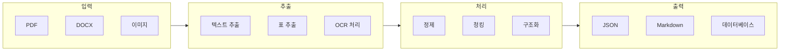
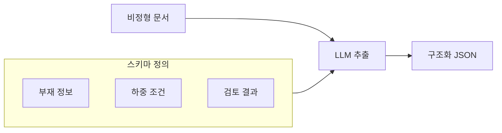
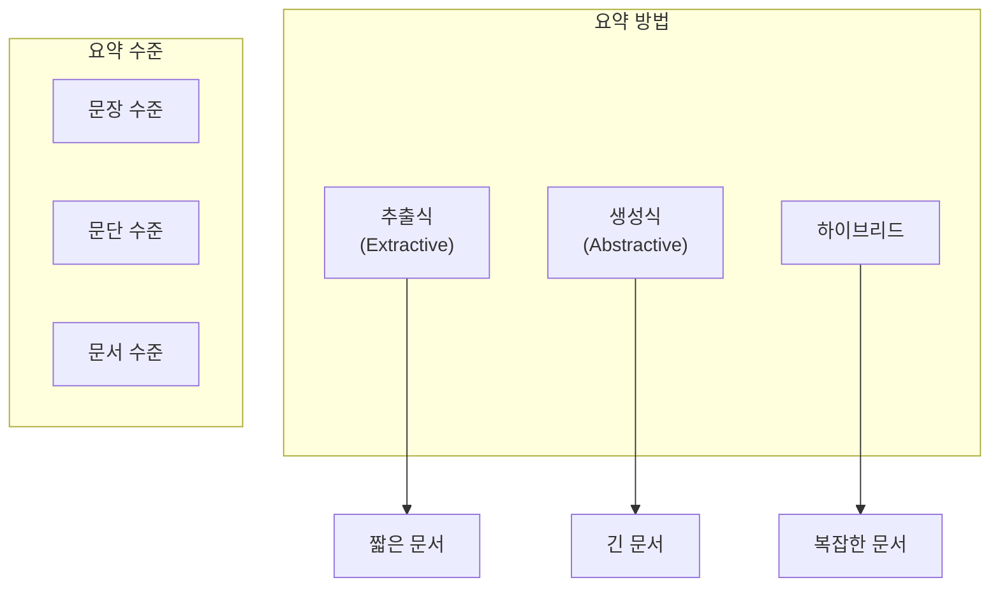

# 9주차: 건축 문서 분석 및 생성

---

## 📌 강의 중점

- **PDF/문서 파싱**: 건축 도서(시방서, 계산서 등) 텍스트 추출
- **구조화된 정보 추출**: 표, 수치, 규격 데이터 파싱
- **문서 자동 생성**: 보고서, 검토서 템플릿 기반 생성
- **건축 도서 요약**: 장문 문서의 핵심 내용 추출

---

## 🎯 학습 목표

학습 완료 후 다음을 수행할 수 있습니다:

- PDF에서 텍스트와 표를 추출할 수 있다
- 건축 문서에서 구조화된 정보를 파싱할 수 있다
- 템플릿 기반으로 문서를 자동 생성할 수 있다
- 장문 건축 도서를 효과적으로 요약할 수 있다

---

## [Chapter 1] 문서 파싱 기초

### 1.1 문서 처리 파이프라인



### 1.2 PDF 텍스트 추출

```python
# pip install pymupdf pypdf2 pdfplumber

import fitz  # PyMuPDF
import pdfplumber
from typing import List, Dict


class PDFExtractor:
    """PDF 텍스트 및 표 추출"""

    def extract_text_pymupdf(self, pdf_path: str) -> str:
        """PyMuPDF로 텍스트 추출 (빠름)"""
        doc = fitz.open(pdf_path)
        text_parts = []

        for page_num, page in enumerate(doc):
            text = page.get_text()
            text_parts.append(f"[페이지 {page_num + 1}]\n{text}")

        doc.close()
        return "\n\n".join(text_parts)

    def extract_text_with_layout(self, pdf_path: str) -> List[Dict]:
        """pdfplumber로 레이아웃 보존 추출"""
        pages = []

        with pdfplumber.open(pdf_path) as pdf:
            for i, page in enumerate(pdf.pages):
                page_data = {
                    "page_number": i + 1,
                    "text": page.extract_text() or "",
                    "tables": [],
                    "width": page.width,
                    "height": page.height
                }

                # 표 추출
                tables = page.extract_tables()
                for table in tables:
                    if table:
                        page_data["tables"].append(table)

                pages.append(page_data)

        return pages

    def extract_images(self, pdf_path: str, output_dir: str) -> List[str]:
        """PDF에서 이미지 추출"""
        doc = fitz.open(pdf_path)
        image_paths = []

        for page_num, page in enumerate(doc):
            image_list = page.get_images()

            for img_idx, img in enumerate(image_list):
                xref = img[0]
                base_image = doc.extract_image(xref)
                image_bytes = base_image["image"]
                image_ext = base_image["ext"]

                image_path = f"{output_dir}/page{page_num+1}_img{img_idx+1}.{image_ext}"
                with open(image_path, "wb") as f:
                    f.write(image_bytes)

                image_paths.append(image_path)

        doc.close()
        return image_paths


# 사용 예시
extractor = PDFExtractor()
text = extractor.extract_text_pymupdf("structural_calculation.pdf")
pages = extractor.extract_text_with_layout("specification.pdf")

print(f"총 {len(pages)} 페이지")
for page in pages[:2]:
    print(f"페이지 {page['page_number']}: {len(page['tables'])}개 표 발견")
```

### 1.3 표 데이터 추출

```python
import pdfplumber
import pandas as pd
from typing import List


def extract_tables_to_dataframe(pdf_path: str) -> List[pd.DataFrame]:
    """PDF 표를 DataFrame으로 변환"""
    dataframes = []

    with pdfplumber.open(pdf_path) as pdf:
        for page in pdf.pages:
            tables = page.extract_tables()

            for table in tables:
                if table and len(table) > 1:
                    # 첫 행을 헤더로 사용
                    df = pd.DataFrame(table[1:], columns=table[0])
                    # 빈 셀 처리
                    df = df.replace("", None)
                    dataframes.append(df)

    return dataframes


def extract_structural_members(pdf_path: str) -> pd.DataFrame:
    """구조 부재표 추출 (특화)"""
    with pdfplumber.open(pdf_path) as pdf:
        for page in pdf.pages:
            tables = page.extract_tables()

            for table in tables:
                if not table:
                    continue

                # 부재표 특성 확인 (헤더에 특정 키워드)
                header = table[0] if table else []
                header_text = " ".join([str(h) for h in header if h])

                if any(k in header_text for k in ["부재", "단면", "기둥", "보"]):
                    df = pd.DataFrame(table[1:], columns=table[0])
                    return df

    return pd.DataFrame()


# 사용 예시
tables = extract_tables_to_dataframe("member_schedule.pdf")
for i, df in enumerate(tables):
    print(f"\n표 {i+1}:")
    print(df.head())
```

### 1.4 OCR 처리 (스캔 문서)

```python
# pip install pytesseract pillow pdf2image
# tesseract 설치 필요: brew install tesseract tesseract-lang

import pytesseract
from pdf2image import convert_from_path
from PIL import Image
import os


def ocr_pdf(pdf_path: str, lang: str = "kor+eng") -> str:
    """스캔 PDF OCR 처리"""
    # PDF를 이미지로 변환
    images = convert_from_path(pdf_path, dpi=300)

    text_parts = []
    for i, image in enumerate(images):
        # OCR 수행
        text = pytesseract.image_to_string(image, lang=lang)
        text_parts.append(f"[페이지 {i+1}]\n{text}")

    return "\n\n".join(text_parts)


def ocr_image(image_path: str, lang: str = "kor+eng") -> str:
    """단일 이미지 OCR"""
    image = Image.open(image_path)
    text = pytesseract.image_to_string(image, lang=lang)
    return text


def ocr_with_preprocessing(image_path: str) -> str:
    """전처리가 포함된 OCR"""
    from PIL import ImageFilter, ImageEnhance

    image = Image.open(image_path)

    # 그레이스케일 변환
    image = image.convert("L")

    # 대비 강화
    enhancer = ImageEnhance.Contrast(image)
    image = enhancer.enhance(2)

    # 샤프닝
    image = image.filter(ImageFilter.SHARPEN)

    # OCR 수행
    text = pytesseract.image_to_string(image, lang="kor+eng")
    return text
```

### 📚 참고 자료

- [PyMuPDF Documentation](https://pymupdf.readthedocs.io/)
- [pdfplumber Documentation](https://github.com/jsvine/pdfplumber)
- [Tesseract OCR](https://github.com/tesseract-ocr/tesseract)

---

## [Chapter 2] 구조화된 정보 추출

### 2.1 LLM 기반 정보 추출



### 2.2 스키마 기반 추출

```python
import anthropic
import json
from pydantic import BaseModel
from typing import List, Optional


# 스키마 정의
class StructuralMember(BaseModel):
    """구조 부재 정보"""
    member_id: str
    member_type: str  # 기둥, 보, 슬래브 등
    section: str  # 단면 규격
    material: str  # 재료
    location: Optional[str] = None  # 위치 (층, 열)


class LoadCondition(BaseModel):
    """하중 조건"""
    load_type: str  # 고정하중, 활하중, 지진하중 등
    value: float
    unit: str


class DesignReview(BaseModel):
    """설계 검토 결과"""
    item: str  # 검토 항목
    code_reference: str  # 관련 기준
    calculated_value: float
    allowable_value: float
    unit: str
    result: str  # OK, NG


class StructuralDocument(BaseModel):
    """구조 계산서 정보"""
    project_name: str
    design_code: str
    members: List[StructuralMember]
    loads: List[LoadCondition]
    reviews: List[DesignReview]


def extract_structured_info(document_text: str) -> StructuralDocument:
    """LLM을 사용한 구조화된 정보 추출"""
    client = anthropic.Anthropic()

    schema_json = StructuralDocument.model_json_schema()

    prompt = f"""다음 구조 계산서 내용에서 정보를 추출하여 JSON 형식으로 반환해 주세요.

## 문서 내용
{document_text}

## 출력 스키마
{json.dumps(schema_json, indent=2, ensure_ascii=False)}

JSON만 출력하세요:"""

    response = client.messages.create(
        model="claude-3-5-sonnet-20241022",
        max_tokens=4000,
        messages=[{"role": "user", "content": prompt}]
    )

    result_text = response.content[0].text

    # JSON 파싱
    try:
        # 코드 블록 제거
        if "```json" in result_text:
            result_text = result_text.split("```json")[1].split("```")[0]
        elif "```" in result_text:
            result_text = result_text.split("```")[1].split("```")[0]

        data = json.loads(result_text)
        return StructuralDocument(**data)
    except Exception as e:
        print(f"파싱 오류: {e}")
        return None


# 사용 예시
sample_text = """
프로젝트명: 테크노 타워 신축공사
설계기준: KDS 41 17 00, KDS 14 20 50

1. 부재 일람표
기둥 C1: H-400x400x13x21, SM490, 지하1층~지상3층
기둥 C2: H-350x350x12x19, SM490, 지상4층~지상10층
보 G1: H-500x200x10x16, SS400

2. 설계하중
고정하중: 5.0 kN/m²
활하중: 2.5 kN/m²
지진하중: 응답수정계수 R=6.0

3. 검토 결과
기둥 C1 축응력비: 0.72 (허용 1.0) - OK
보 G1 휨응력비: 0.85 (허용 1.0) - OK
"""

result = extract_structured_info(sample_text)
if result:
    print(f"프로젝트: {result.project_name}")
    print(f"부재 수: {len(result.members)}")
    for member in result.members:
        print(f"  - {member.member_id}: {member.section}")
```

### 2.3 규격/수치 패턴 추출

```python
import re
from typing import List, Dict, Tuple


class PatternExtractor:
    """건축 문서 패턴 추출기"""

    # 정규식 패턴
    PATTERNS = {
        # H형강: H-400x200x8x13 또는 H400×200×8×13
        "h_section": r"H[-]?\s*(\d+)\s*[x×]\s*(\d+)\s*[x×]\s*(\d+)\s*[x×]\s*(\d+)",

        # 철근: D10, D13, D16, HD13 등
        "rebar": r"[HD]?D(\d+)",

        # 콘크리트 강도: fck=27MPa, 27MPa 등
        "concrete_strength": r"(?:fck\s*=\s*)?(\d+)\s*MPa",

        # 치수: 300mm, 3000mm 등
        "dimension": r"(\d+(?:\.\d+)?)\s*mm",

        # 하중: 5.0kN/m², 2.5 kN/m2
        "load": r"(\d+(?:\.\d+)?)\s*kN/m[²2]?",

        # 응력비: 0.72, 72% 등
        "stress_ratio": r"(\d+(?:\.\d+)?)\s*(?:%|이하|≤|<)?",

        # 층 표기: 지상3층, 지하1층, 3F, B1F
        "floor": r"(?:지상|지하|)(\d+)(?:층|F)",

        # KDS 기준 번호
        "kds_code": r"KDS\s*(\d+\s*\d+\s*\d+)",
    }

    def extract_h_sections(self, text: str) -> List[Dict]:
        """H형강 단면 추출"""
        pattern = self.PATTERNS["h_section"]
        matches = re.findall(pattern, text)

        sections = []
        for match in matches:
            h, b, tw, tf = map(int, match)
            sections.append({
                "notation": f"H-{h}x{b}x{tw}x{tf}",
                "height": h,
                "width": b,
                "web_thickness": tw,
                "flange_thickness": tf
            })
        return sections

    def extract_rebars(self, text: str) -> List[str]:
        """철근 규격 추출"""
        pattern = self.PATTERNS["rebar"]
        matches = re.findall(pattern, text)
        return [f"D{d}" for d in set(matches)]

    def extract_loads(self, text: str) -> List[Tuple[float, str]]:
        """하중 값 추출"""
        pattern = self.PATTERNS["load"]
        matches = re.findall(pattern, text)
        return [(float(v), "kN/m²") for v in matches]

    def extract_kds_codes(self, text: str) -> List[str]:
        """KDS 기준 번호 추출"""
        pattern = self.PATTERNS["kds_code"]
        matches = re.findall(pattern, text)
        return [f"KDS {code.strip()}" for code in matches]

    def extract_all(self, text: str) -> Dict:
        """모든 패턴 추출"""
        return {
            "h_sections": self.extract_h_sections(text),
            "rebars": self.extract_rebars(text),
            "loads": self.extract_loads(text),
            "kds_codes": self.extract_kds_codes(text)
        }


# 사용 예시
extractor = PatternExtractor()
text = """
기둥 C1은 H-400x400x13x21 단면을 사용하며,
보 G1은 H-500x200x10x16입니다.
주근은 8-D25, 띠철근은 D10@100입니다.
설계하중: 고정하중 5.0kN/m², 활하중 2.5kN/m²
적용기준: KDS 41 17 00, KDS 14 20 50
"""

results = extractor.extract_all(text)
print(json.dumps(results, ensure_ascii=False, indent=2))
```

### 📚 참고 자료

- [Pydantic Documentation](https://docs.pydantic.dev/)
- [Python re Module](https://docs.python.org/3/library/re.html)
- [Anthropic Structured Output](https://docs.anthropic.com/claude/docs/structured-outputs)

---

## [Chapter 3] 문서 자동 생성

### 3.1 템플릿 기반 문서 생성

```python
from jinja2 import Template
from datetime import datetime
from typing import Dict, List


# 구조 검토서 템플릿
REVIEW_TEMPLATE = """
# 구조 검토서

## 1. 개요
- **프로젝트명**: {{ project.name }}
- **위치**: {{ project.location }}
- **용도**: {{ project.usage }}
- **규모**: 지하 {{ project.basement }}층, 지상 {{ project.floors }}층
- **검토일**: {{ review_date }}

## 2. 적용 기준

- {{ code }}


## 3. 설계 하중
| 하중 종류 | 값 | 비고 |
|----------|-----|------|

| {{ load.type }} | {{ load.value }} {{ load.unit }} | {{ load.note }} |


## 4. 주요 부재 검토

### 4.1 기둥

#### {{ col.id }}
- 단면: {{ col.section }}
- 재료: {{ col.material }}
- 위치: {{ col.location }}
- **검토 결과**:
  - 축응력비: {{ col.axial_ratio }} (OK)**(NG)**
  - 휨응력비: {{ col.flexural_ratio }} (OK)**(NG)**



### 4.2 보

#### {{ beam.id }}
- 단면: {{ beam.section }}
- 재료: {{ beam.material }}
- 스팬: {{ beam.span }}
- **검토 결과**:
  - 휨응력비: {{ beam.flexural_ratio }} (OK)**(NG)**
  - 전단응력비: {{ beam.shear_ratio }} (OK)**(NG)**



## 5. 결론


모든 검토 항목이 기준을 만족합니다.

**일부 항목이 기준을 초과합니다. 단면 보강이 필요합니다.**

### 보강이 필요한 부재

- {{ member }}



---
검토자: {{ reviewer }}
검토일: {{ review_date }}
"""


def generate_review_document(data: Dict) -> str:
    """구조 검토서 생성"""
    template = Template(REVIEW_TEMPLATE)

    # 검토 결과 판정
    all_ok = True
    failed_members = []

    for col in data.get("columns", []):
        if col.get("axial_ratio", 0) >= 1.0 or col.get("flexural_ratio", 0) >= 1.0:
            all_ok = False
            failed_members.append(f"기둥 {col['id']}")

    for beam in data.get("beams", []):
        if beam.get("flexural_ratio", 0) >= 1.0 or beam.get("shear_ratio", 0) >= 1.0:
            all_ok = False
            failed_members.append(f"보 {beam['id']}")

    data["all_ok"] = all_ok
    data["failed_members"] = failed_members
    data["review_date"] = datetime.now().strftime("%Y-%m-%d")

    return template.render(**data)


# 사용 예시
data = {
    "project": {
        "name": "테크노 타워 신축공사",
        "location": "서울시 강남구",
        "usage": "업무시설",
        "basement": 2,
        "floors": 15
    },
    "design_codes": [
        "KDS 41 17 00 건축물 내진설계기준",
        "KDS 14 20 50 콘크리트 기둥 설계기준",
        "KDS 41 31 00 철골구조 설계기준"
    ],
    "loads": [
        {"type": "고정하중", "value": 5.0, "unit": "kN/m²", "note": "마감포함"},
        {"type": "활하중", "value": 2.5, "unit": "kN/m²", "note": "업무시설"},
        {"type": "지진하중", "value": "-", "unit": "-", "note": "응답스펙트럼 해석"}
    ],
    "columns": [
        {"id": "C1", "section": "H-400x400x13x21", "material": "SM490",
         "location": "1열", "axial_ratio": 0.72, "flexural_ratio": 0.65},
        {"id": "C2", "section": "H-350x350x12x19", "material": "SM490",
         "location": "2열", "axial_ratio": 0.85, "flexural_ratio": 0.78}
    ],
    "beams": [
        {"id": "G1", "section": "H-500x200x10x16", "material": "SS400",
         "span": "8.0m", "flexural_ratio": 0.82, "shear_ratio": 0.45},
        {"id": "G2", "section": "H-450x200x9x14", "material": "SS400",
         "span": "6.0m", "flexural_ratio": 0.91, "shear_ratio": 0.52}
    ],
    "reviewer": "홍길동"
}

document = generate_review_document(data)
print(document)

# 파일 저장
with open("structural_review.md", "w", encoding="utf-8") as f:
    f.write(document)
```

### 3.2 LLM 기반 문서 생성

```python
import anthropic
from typing import Dict


def generate_document_with_llm(
    document_type: str,
    data: Dict,
    style: str = "formal"
) -> str:
    """LLM을 사용한 문서 생성"""
    client = anthropic.Anthropic()

    style_instructions = {
        "formal": "공식적이고 전문적인 문체로 작성하세요.",
        "technical": "기술적 용어를 정확히 사용하고 수치를 명확히 기재하세요.",
        "summary": "핵심 내용만 간결하게 요약하세요."
    }

    document_templates = {
        "review_opinion": """
구조 검토 의견서를 작성해 주세요.

## 입력 데이터
{data}

## 작성 지침
1. 검토 배경 및 목적
2. 적용 기준 명시
3. 검토 항목별 결과 (표 형식)
4. 종합 의견
5. 보완 필요 사항 (있는 경우)

{style}
""",
        "calculation_summary": """
구조 계산 요약서를 작성해 주세요.

## 입력 데이터
{data}

## 작성 지침
1. 설계 개요
2. 하중 산정 요약
3. 주요 부재 검토 결과 (표)
4. 결론

{style}
""",
        "change_report": """
설계 변경 보고서를 작성해 주세요.

## 입력 데이터
{data}

## 작성 지침
1. 변경 사유
2. 변경 전후 비교 (표)
3. 구조적 영향 검토
4. 결론 및 권고

{style}
"""
    }

    if document_type not in document_templates:
        raise ValueError(f"Unknown document type: {document_type}")

    prompt = document_templates[document_type].format(
        data=str(data),
        style=style_instructions.get(style, "")
    )

    response = client.messages.create(
        model="claude-3-5-sonnet-20241022",
        max_tokens=4000,
        system="당신은 건축구조 전문 기술사입니다. 전문적이고 정확한 문서를 작성합니다.",
        messages=[{"role": "user", "content": prompt}]
    )

    return response.content[0].text


# 사용 예시
data = {
    "project": "A 빌딩 증축",
    "change_items": [
        {"item": "기둥 C1 단면", "before": "H-300x300x10x15", "after": "H-350x350x12x19", "reason": "하중 증가"},
        {"item": "보 G1 스팬", "before": "6.0m", "after": "7.5m", "reason": "평면 변경"}
    ],
    "impact": "기초 하중 약 15% 증가 예상"
}

report = generate_document_with_llm("change_report", data, style="formal")
print(report)
```

### 3.3 Word/PDF 출력

```python
# pip install python-docx reportlab

from docx import Document
from docx.shared import Inches, Pt
from docx.enum.text import WD_ALIGN_PARAGRAPH
from reportlab.lib.pagesizes import A4
from reportlab.pdfgen import canvas
from reportlab.pdfbase import pdfmetrics
from reportlab.pdfbase.ttfonts import TTFont


def markdown_to_docx(markdown_content: str, output_path: str):
    """Markdown을 DOCX로 변환"""
    doc = Document()

    # 제목 스타일 설정
    title_style = doc.styles['Title']
    title_style.font.size = Pt(18)

    heading_style = doc.styles['Heading 1']
    heading_style.font.size = Pt(14)

    lines = markdown_content.split('\n')
    i = 0

    while i < len(lines):
        line = lines[i].strip()

        if line.startswith('# '):
            # 제목
            doc.add_heading(line[2:], level=0)
        elif line.startswith('## '):
            # 1단계 제목
            doc.add_heading(line[3:], level=1)
        elif line.startswith('### '):
            # 2단계 제목
            doc.add_heading(line[4:], level=2)
        elif line.startswith('- '):
            # 불릿 리스트
            doc.add_paragraph(line[2:], style='List Bullet')
        elif line.startswith('|'):
            # 표 처리
            table_lines = []
            while i < len(lines) and lines[i].strip().startswith('|'):
                table_lines.append(lines[i].strip())
                i += 1
            i -= 1  # 다음 루프에서 증가하므로

            if len(table_lines) > 2:
                # 헤더와 데이터 분리
                headers = [c.strip() for c in table_lines[0].split('|')[1:-1]]
                data_rows = [[c.strip() for c in row.split('|')[1:-1]]
                            for row in table_lines[2:]]

                # 표 생성
                table = doc.add_table(rows=1+len(data_rows), cols=len(headers))
                table.style = 'Table Grid'

                # 헤더 행
                for j, header in enumerate(headers):
                    table.rows[0].cells[j].text = header

                # 데이터 행
                for row_idx, row_data in enumerate(data_rows):
                    for col_idx, cell_data in enumerate(row_data):
                        table.rows[row_idx+1].cells[col_idx].text = cell_data
        elif line:
            # 일반 텍스트
            doc.add_paragraph(line)

        i += 1

    doc.save(output_path)
    print(f"DOCX 파일 생성: {output_path}")


def create_pdf_report(content: dict, output_path: str):
    """PDF 보고서 생성"""
    # 한글 폰트 등록 (시스템에 설치된 폰트 사용)
    try:
        pdfmetrics.registerFont(TTFont('Malgun', '/System/Library/Fonts/AppleSDGothicNeo.ttc'))
        font_name = 'Malgun'
    except:
        font_name = 'Helvetica'

    c = canvas.Canvas(output_path, pagesize=A4)
    width, height = A4

    # 제목
    c.setFont(font_name, 18)
    c.drawString(50, height - 50, content.get("title", "보고서"))

    # 내용
    c.setFont(font_name, 12)
    y = height - 100

    for section in content.get("sections", []):
        # 섹션 제목
        c.setFont(font_name, 14)
        c.drawString(50, y, section.get("heading", ""))
        y -= 25

        # 섹션 내용
        c.setFont(font_name, 11)
        for line in section.get("content", []):
            c.drawString(70, y, line)
            y -= 18

            if y < 50:
                c.showPage()
                y = height - 50

        y -= 10

    c.save()
    print(f"PDF 파일 생성: {output_path}")
```

### 📚 참고 자료

- [python-docx Documentation](https://python-docx.readthedocs.io/)
- [ReportLab Documentation](https://www.reportlab.com/docs/)
- [Jinja2 Templates](https://jinja.palletsprojects.com/)

---

## [Chapter 4] 건축 도서 요약

### 4.1 요약 전략



### 4.2 구조 계산서 요약

```python
import anthropic
from typing import List, Dict


class DocumentSummarizer:
    """건축 문서 요약기"""

    def __init__(self):
        self.client = anthropic.Anthropic()

    def summarize_calculation(self, document: str) -> Dict:
        """구조 계산서 요약"""
        prompt = f"""다음 구조 계산서를 분석하고 요약해 주세요.

## 문서 내용
{document}

## 요약 형식 (JSON)
{{
    "project_overview": "프로젝트 개요 (1-2문장)",
    "design_codes": ["적용 기준 목록"],
    "structural_system": "구조 시스템 요약",
    "key_findings": [
        {{"item": "항목명", "result": "결과", "status": "OK/NG"}}
    ],
    "critical_issues": ["발견된 주요 이슈"],
    "recommendations": ["권고 사항"],
    "summary": "전체 요약 (3-5문장)"
}}

JSON만 출력하세요:"""

        response = self.client.messages.create(
            model="claude-3-5-sonnet-20241022",
            max_tokens=2000,
            messages=[{"role": "user", "content": prompt}]
        )

        import json
        text = response.content[0].text
        if "```json" in text:
            text = text.split("```json")[1].split("```")[0]

        return json.loads(text)

    def summarize_specification(self, document: str, section: str = None) -> str:
        """시방서 요약"""
        section_instruction = f"'{section}' 섹션에 집중하여" if section else "전체 내용을"

        prompt = f"""다음 건축 시방서에서 {section_instruction} 핵심 요구사항을 요약해 주세요.

## 시방서 내용
{document}

## 요약 지침
1. 필수 요구사항 (MUST)
2. 권장 사항 (SHOULD)
3. 참조 기준 (KS, KDS 등)
4. 품질 기준
5. 특기 사항

불릿 포인트로 간결하게 정리하세요."""

        response = self.client.messages.create(
            model="claude-3-5-sonnet-20241022",
            max_tokens=2000,
            messages=[{"role": "user", "content": prompt}]
        )

        return response.content[0].text

    def extract_key_values(self, document: str) -> List[Dict]:
        """핵심 수치 추출"""
        prompt = f"""다음 문서에서 설계/검토에 중요한 핵심 수치를 추출하세요.

## 문서
{document}

## 추출 항목
- 설계하중 (고정, 활, 지진 등)
- 재료 강도 (콘크리트, 철근, 강재)
- 부재 단면 치수
- 응력비/안전율
- 변위/변형

다음 형식의 JSON 배열로 출력:
[{{"category": "분류", "item": "항목", "value": 수치, "unit": "단위", "note": "비고"}}]"""

        response = self.client.messages.create(
            model="claude-3-5-sonnet-20241022",
            max_tokens=2000,
            messages=[{"role": "user", "content": prompt}]
        )

        import json
        text = response.content[0].text
        if "```json" in text:
            text = text.split("```json")[1].split("```")[0]

        return json.loads(text)


# 사용 예시
summarizer = DocumentSummarizer()

# 구조 계산서 요약
calc_doc = """
프로젝트: 강남 오피스텔 신축
설계기준: KDS 41 17 00, KDS 14 20 50
구조시스템: 철근콘크리트 라멘구조

1. 설계하중
- 고정하중: 5.0 kN/m²
- 활하중: 2.5 kN/m² (주거용)
- 지진하중: 지진구역 I, 지반종류 S3

2. 주요 부재 검토
기둥 C1 (600x600): 축응력비 0.68, 휨응력비 0.72 - OK
보 G1 (400x700): 휨응력비 0.85, 전단 0.45 - OK
"""

summary = summarizer.summarize_calculation(calc_doc)
print(json.dumps(summary, ensure_ascii=False, indent=2))
```

### 4.3 긴 문서 요약 (Map-Reduce)

```python
from typing import List


class LongDocumentSummarizer:
    """긴 문서 요약 (Map-Reduce)"""

    def __init__(self, chunk_size: int = 4000):
        self.client = anthropic.Anthropic()
        self.chunk_size = chunk_size

    def _split_document(self, document: str) -> List[str]:
        """문서를 청크로 분할"""
        words = document.split()
        chunks = []
        current_chunk = []
        current_length = 0

        for word in words:
            if current_length + len(word) + 1 > self.chunk_size:
                chunks.append(" ".join(current_chunk))
                current_chunk = [word]
                current_length = len(word)
            else:
                current_chunk.append(word)
                current_length += len(word) + 1

        if current_chunk:
            chunks.append(" ".join(current_chunk))

        return chunks

    def _map_summarize(self, chunk: str, chunk_index: int) -> str:
        """Map: 개별 청크 요약"""
        prompt = f"""다음 문서 일부(청크 {chunk_index})의 핵심 내용을 5개 이내의 bullet point로 요약하세요.

{chunk}

핵심 요약:"""

        response = self.client.messages.create(
            model="claude-3-5-sonnet-20241022",
            max_tokens=500,
            messages=[{"role": "user", "content": prompt}]
        )

        return response.content[0].text

    def _reduce_combine(self, summaries: List[str], context: str = "") -> str:
        """Reduce: 요약 통합"""
        combined = "\n\n".join([f"[파트 {i+1}]\n{s}" for i, s in enumerate(summaries)])

        prompt = f"""다음 부분 요약들을 하나의 종합 요약으로 통합하세요.

{f'문서 맥락: {context}' if context else ''}

## 부분 요약들
{combined}

## 종합 요약 지침
1. 중복 제거
2. 핵심 정보만 유지
3. 논리적 순서로 재구성
4. 500자 이내로 작성

종합 요약:"""

        response = self.client.messages.create(
            model="claude-3-5-sonnet-20241022",
            max_tokens=1000,
            messages=[{"role": "user", "content": prompt}]
        )

        return response.content[0].text

    def summarize(self, document: str, context: str = "") -> str:
        """전체 요약 프로세스"""
        chunks = self._split_document(document)
        print(f"문서를 {len(chunks)}개 청크로 분할")

        # Map 단계
        summaries = []
        for i, chunk in enumerate(chunks):
            print(f"  청크 {i+1}/{len(chunks)} 요약 중...")
            summary = self._map_summarize(chunk, i+1)
            summaries.append(summary)

        # Reduce 단계
        if len(summaries) > 1:
            print("통합 요약 생성 중...")
            final_summary = self._reduce_combine(summaries, context)
        else:
            final_summary = summaries[0]

        return final_summary


# 사용 예시
long_summarizer = LongDocumentSummarizer()
# long_doc = open("long_specification.txt").read()
# summary = long_summarizer.summarize(long_doc, context="건축 시방서")
```

---

## 💻 실습 코드

### 실습: 시방서 요약 시스템

```python
# practice/specification_summarizer.py
"""건축 시방서 요약 시스템"""

import anthropic
from dataclasses import dataclass
from typing import List, Dict, Optional
import json


@dataclass
class SpecificationSection:
    """시방서 섹션"""
    title: str
    content: str
    subsections: List[str]


@dataclass
class SpecificationSummary:
    """시방서 요약"""
    title: str
    scope: str
    requirements: List[Dict]
    materials: List[Dict]
    quality_criteria: List[Dict]
    references: List[str]


class SpecificationSummarizer:
    """시방서 요약기"""

    def __init__(self):
        self.client = anthropic.Anthropic()

    def parse_specification(self, text: str) -> List[SpecificationSection]:
        """시방서 구조 파싱"""
        sections = []
        current_section = None
        current_content = []

        for line in text.split('\n'):
            # 섹션 헤더 감지 (예: "1. 일반사항", "제1장 총칙")
            if line.strip() and (
                line[0].isdigit() and '.' in line[:4] or
                line.startswith('제') and '장' in line[:10]
            ):
                if current_section:
                    sections.append(SpecificationSection(
                        title=current_section,
                        content='\n'.join(current_content),
                        subsections=[]
                    ))
                current_section = line.strip()
                current_content = []
            else:
                current_content.append(line)

        if current_section:
            sections.append(SpecificationSection(
                title=current_section,
                content='\n'.join(current_content),
                subsections=[]
            ))

        return sections

    def summarize_section(self, section: SpecificationSection) -> Dict:
        """개별 섹션 요약"""
        prompt = f"""다음 시방서 섹션을 분석하고 요약하세요.

## 섹션: {section.title}
{section.content}

## 출력 형식 (JSON)
{{
    "title": "섹션명",
    "key_requirements": ["핵심 요구사항 목록"],
    "materials_specs": ["자재 규격 (있는 경우)"],
    "quality_criteria": ["품질 기준 (있는 경우)"],
    "references": ["참조 기준 (KS, KDS 등)"],
    "notes": "특기사항"
}}"""

        response = self.client.messages.create(
            model="claude-3-5-sonnet-20241022",
            max_tokens=1000,
            messages=[{"role": "user", "content": prompt}]
        )

        text = response.content[0].text
        if "```json" in text:
            text = text.split("```json")[1].split("```")[0]

        return json.loads(text)

    def summarize_full(self, text: str) -> SpecificationSummary:
        """전체 시방서 요약"""
        sections = self.parse_specification(text)

        all_requirements = []
        all_materials = []
        all_quality = []
        all_refs = set()

        for section in sections:
            summary = self.summarize_section(section)

            for req in summary.get("key_requirements", []):
                all_requirements.append({
                    "section": section.title,
                    "requirement": req
                })

            for mat in summary.get("materials_specs", []):
                all_materials.append({
                    "section": section.title,
                    "spec": mat
                })

            for qc in summary.get("quality_criteria", []):
                all_quality.append({
                    "section": section.title,
                    "criteria": qc
                })

            all_refs.update(summary.get("references", []))

        return SpecificationSummary(
            title="시방서 요약",
            scope=f"{len(sections)}개 섹션 분석",
            requirements=all_requirements,
            materials=all_materials,
            quality_criteria=all_quality,
            references=list(all_refs)
        )


if __name__ == "__main__":
    summarizer = SpecificationSummarizer()

    sample_spec = """
    1. 일반사항
    1.1 적용범위
    이 시방서는 철근콘크리트 구조물의 시공에 적용한다.

    1.2 관련기준
    - KDS 14 20 00 콘크리트 구조설계기준
    - KCS 14 20 10 콘크리트 공사 일반

    2. 재료
    2.1 콘크리트
    설계기준압축강도 fck = 27 MPa 이상을 사용한다.
    굵은 골재의 최대 치수는 25mm로 한다.

    2.2 철근
    SD400 이상의 철근을 사용하며, KS D 3504에 적합해야 한다.

    3. 시공
    3.1 철근 가공
    철근의 구부림 반지름은 KDS 14 20 50에 따른다.

    3.2 콘크리트 타설
    콘크리트 타설 시 자유낙하고는 1.5m 이하로 한다.
    """

    result = summarizer.summarize_full(sample_spec)
    print(f"분석 범위: {result.scope}")
    print(f"\n주요 요구사항: {len(result.requirements)}개")
    for req in result.requirements[:5]:
        print(f"  - [{req['section']}] {req['requirement']}")
    print(f"\n참조 기준: {result.references}")
```

---

## 📝 과제

### 과제 1: 문서 파싱 및 추출 (제출)

실제 건축 문서에서 정보 추출:

**요구사항**:
1. PDF에서 텍스트/표 추출
2. 정규식으로 수치 데이터 추출
3. LLM으로 구조화된 JSON 생성

**제출물**: 코드, 샘플 문서, 추출 결과

### 과제 2: 문서 생성 시스템 (제출)

템플릿 기반 문서 생성기:

**요구사항**:
1. Jinja2 템플릿 작성
2. 데이터 기반 문서 생성
3. Markdown/DOCX 출력

**제출물**: 코드, 템플릿, 생성 문서 샘플

---

## 🔗 추가 학습 자료

- [PyMuPDF](https://pymupdf.readthedocs.io/)
- [pdfplumber](https://github.com/jsvine/pdfplumber)
- [python-docx](https://python-docx.readthedocs.io/)
- [Jinja2](https://jinja.palletsprojects.com/)

---

## 🚀 발전 전략 (Development Strategies)

### 전략 1: 실무 건축 문서 데이터베이스 구축

**목표**: 다양한 유형의 실제 건축 문서를 수집하여 PDF 파싱 및 정보 추출 정확도를 향상시킵니다.

**실습 계획**:
1. **문서 유형별 샘플 수집** (최소 각 5개)
   - 구조 계산서 (철근콘크리트, 철골, 조적)
   - 건축 시방서 (표준, 특기)
   - 부재 일람표 및 배근도
   - 검토 의견서 및 보고서
   - 설계 변경 통보서

2. **파싱 성능 벤치마크 수행**
   ```python
   import time
   from dataclasses import dataclass

   @dataclass
   class ParsingBenchmark:
       file_name: str
       file_size_mb: float
       pages: int
       extraction_time: float
       text_accuracy: float
       table_accuracy: float

   def benchmark_extractor(pdf_path: str) -> ParsingBenchmark:
       """PDF 추출 성능 측정"""
       start = time.time()
       extractor = PDFExtractor()
       pages = extractor.extract_text_with_layout(pdf_path)
       elapsed = time.time() - start

       # 파일 크기 계산
       file_size = os.path.getsize(pdf_path) / (1024 * 1024)

       return ParsingBenchmark(
           file_name=os.path.basename(pdf_path),
           file_size_mb=file_size,
           pages=len(pages),
           extraction_time=elapsed,
           text_accuracy=0.0,  # 수동 검증 후 입력
           table_accuracy=0.0   # 수동 검증 후 입력
       )
   ```

3. **문제 케이스 분석 및 개선**
   - 스캔 품질이 낮은 문서: OCR 전처리 강화
   - 복잡한 표 구조: 표 인식 알고리즘 개선
   - 다단 레이아웃: 텍스트 순서 복원 로직 추가

**예상 효과**: 실무 문서 처리 정확도 70% → 90% 향상

---

### 전략 2: 건축 도메인 특화 정보 추출 파이프라인 구축

**목표**: 건축 구조 문서에서 자주 등장하는 정보를 자동으로 추출하고 검증하는 시스템을 개발합니다.

**실습 계획**:
1. **건축 엔티티 인식 시스템 구축**
   ```python
   from enum import Enum
   from typing import NamedTuple, List

   class EntityType(Enum):
       MEMBER = "부재"
       SECTION = "단면"
       MATERIAL = "재료"
       LOAD = "하중"
       CODE = "기준"
       DIMENSION = "치수"
       STRESS_RATIO = "응력비"

   class StructuralEntity(NamedTuple):
       text: str
       entity_type: EntityType
       value: any
       unit: str
       confidence: float
       context: str

   class ArchitecturalNER:
       """건축 도메인 특화 개체명 인식"""

       def __init__(self):
           self.extractor = PatternExtractor()

       def extract_entities(self, text: str) -> List[StructuralEntity]:
           """텍스트에서 건축 엔티티 추출"""
           entities = []

           # H형강 추출
           h_sections = self.extractor.extract_h_sections(text)
           for section in h_sections:
               entities.append(StructuralEntity(
                   text=section["notation"],
                   entity_type=EntityType.SECTION,
                   value=section,
                   unit="mm",
                   confidence=0.95,
                   context="H형강 단면"
               ))

           # 하중 추출
           loads = self.extractor.extract_loads(text)
           for load_val, unit in loads:
               entities.append(StructuralEntity(
                   text=f"{load_val}{unit}",
                   entity_type=EntityType.LOAD,
                   value=load_val,
                   unit=unit,
                   confidence=0.90,
                   context="설계하중"
               ))

           return entities

       def validate_entities(self, entities: List[StructuralEntity]) -> Dict:
           """추출된 엔티티 검증"""
           validation_results = {
               "valid": [],
               "warnings": [],
               "errors": []
           }

           for entity in entities:
               if entity.entity_type == EntityType.SECTION:
                   # H형강 규격 검증 (KS D 3502)
                   h = entity.value["height"]
                   if h < 100 or h > 900:
                       validation_results["warnings"].append(
                           f"비표준 H형강 높이: {h}mm"
                       )

               elif entity.entity_type == EntityType.LOAD:
                   # 하중 범위 검증
                   if entity.value > 50.0:
                       validation_results["warnings"].append(
                           f"과다 하중: {entity.value}{entity.unit}"
                       )

           return validation_results
   ```

2. **관계 추출 및 지식 그래프 구축**
   - 부재 → 단면 → 재료 관계
   - 하중 → 부재 → 응력비 관계
   - 검토 항목 → 기준 → 판정 관계

3. **추출 결과 시각화 대시보드**
   ```python
   import plotly.graph_objects as go

   def visualize_extraction_results(entities: List[StructuralEntity]):
       """추출 결과 시각화"""
       entity_counts = {}
       for entity in entities:
           entity_type = entity.entity_type.value
           entity_counts[entity_type] = entity_counts.get(entity_type, 0) + 1

       fig = go.Figure(data=[
           go.Bar(x=list(entity_counts.keys()),
                  y=list(entity_counts.values()))
       ])
       fig.update_layout(title="추출된 엔티티 통계")
       fig.show()
   ```

**예상 효과**: 수동 데이터 입력 시간 80% 절감, 오류율 5% 이하

---

### 전략 3: 멀티모달 문서 이해 시스템 개발

**목표**: 텍스트, 표, 이미지(도면)를 통합 분석하여 건축 문서를 종합적으로 이해합니다.

**실습 계획**:
1. **이미지 기반 정보 추출**
   ```python
   import anthropic
   import base64

   class MultimodalDocumentAnalyzer:
       """멀티모달 문서 분석"""

       def __init__(self):
           self.client = anthropic.Anthropic()

       def analyze_structural_drawing(self, image_path: str) -> Dict:
           """구조도 이미지 분석"""
           with open(image_path, "rb") as f:
               image_data = base64.standard_b64encode(f.read()).decode("utf-8")

           prompt = """다음 구조도를 분석하고 정보를 추출하세요:

           1. 부재 종류 (기둥, 보, 슬래브 등)
           2. 부재 번호 및 위치
           3. 단면 치수
           4. 철근 배치 정보
           5. 특이 사항

           JSON 형식으로 출력하세요."""

           response = self.client.messages.create(
               model="claude-3-5-sonnet-20241022",
               max_tokens=2000,
               messages=[{
                   "role": "user",
                   "content": [
                       {
                           "type": "image",
                           "source": {
                               "type": "base64",
                               "media_type": "image/png",
                               "data": image_data
                           }
                       },
                       {"type": "text", "text": prompt}
                   ]
               }]
           )

           import json
           text = response.content[0].text
           if "```json" in text:
               text = text.split("```json")[1].split("```")[0]
           return json.loads(text)

       def cross_validate_text_image(
           self,
           text_data: Dict,
           image_data: Dict
       ) -> Dict:
           """텍스트와 이미지 정보 교차 검증"""
           discrepancies = []

           # 부재 단면 비교
           text_sections = {m["member_id"]: m["section"]
                           for m in text_data.get("members", [])}
           image_sections = {m["id"]: m["section"]
                            for m in image_data.get("members", [])}

           for member_id in text_sections:
               if member_id in image_sections:
                   if text_sections[member_id] != image_sections[member_id]:
                       discrepancies.append({
                           "member": member_id,
                           "text": text_sections[member_id],
                           "image": image_sections[member_id],
                           "issue": "단면 불일치"
                       })

           return {
               "status": "OK" if not discrepancies else "WARNING",
               "discrepancies": discrepancies
           }
   ```

2. **표-텍스트-이미지 통합 분석**
   - 부재표(표) + 계산서(텍스트) + 도면(이미지) 일치성 검증
   - 불일치 항목 자동 플래깅

3. **3D 모델 정보 추출** (선택)
   - IFC 파일 파싱
   - BIM 모델과 문서 데이터 매칭

**예상 효과**: 문서 간 불일치 조기 발견, 품질 관리 강화

---

### 전략 4: 인터랙티브 문서 생성 플랫폼 구축

**목표**: 웹 인터페이스를 통해 사용자가 손쉽게 건축 문서를 생성할 수 있는 시스템을 개발합니다.

**실습 계획**:
1. **Streamlit 기반 웹 애플리케이션**
   ```python
   # app.py
   import streamlit as st
   import json

   st.title("건축 문서 자동 생성 시스템")

   # 사이드바: 문서 유형 선택
   doc_type = st.sidebar.selectbox(
       "문서 유형",
       ["구조 검토서", "설계 변경 보고서", "시방서 요약"]
   )

   # 메인: 입력 폼
   if doc_type == "구조 검토서":
       st.header("구조 검토서 생성")

       col1, col2 = st.columns(2)

       with col1:
           project_name = st.text_input("프로젝트명")
           location = st.text_input("위치")
           floors = st.number_input("지상 층수", min_value=1, value=10)

       with col2:
           basement = st.number_input("지하 층수", min_value=0, value=2)
           usage = st.text_input("용도", value="업무시설")
           reviewer = st.text_input("검토자")

       st.subheader("주요 부재 입력")

       num_columns = st.number_input("기둥 개수", min_value=1, value=2)
       columns = []

       for i in range(num_columns):
           with st.expander(f"기둥 C{i+1}"):
               col_id = st.text_input(f"부재 번호", value=f"C{i+1}", key=f"col_id_{i}")
               section = st.text_input(f"단면", value="H-400x400x13x21", key=f"col_sec_{i}")
               material = st.selectbox(f"재료", ["SM490", "SS400"], key=f"col_mat_{i}")
               axial = st.number_input(f"축응력비", 0.0, 1.5, 0.70, 0.01, key=f"col_ax_{i}")
               flexural = st.number_input(f"휨응력비", 0.0, 1.5, 0.65, 0.01, key=f"col_flex_{i}")

               columns.append({
                   "id": col_id,
                   "section": section,
                   "material": material,
                   "location": f"{i+1}열",
                   "axial_ratio": axial,
                   "flexural_ratio": flexural
               })

       if st.button("문서 생성"):
           data = {
               "project": {
                   "name": project_name,
                   "location": location,
                   "usage": usage,
                   "basement": basement,
                   "floors": floors
               },
               "columns": columns,
               "beams": [],
               "reviewer": reviewer
           }

           document = generate_review_document(data)

           st.success("문서 생성 완료!")
           st.markdown(document)

           # 다운로드 버튼
           st.download_button(
               label="Markdown 다운로드",
               data=document,
               file_name="structural_review.md",
               mime="text/markdown"
           )
   ```

2. **실시간 미리보기 및 편집**
   - 입력값 변경 시 즉시 문서 업데이트
   - 템플릿 선택 및 커스터마이징

3. **문서 히스토리 관리**
   - 생성된 문서 버전 관리
   - 변경 이력 추적

**예상 효과**: 문서 작성 시간 50% 단축, 오타 및 누락 방지

---

### 전략 5: 지능형 문서 품질 검증 시스템 구축

**목표**: 생성된 문서의 완전성, 일관성, 정확성을 자동으로 검증합니다.

**실습 계획**:
1. **문서 품질 체크리스트 자동화**
   ```python
   from dataclasses import dataclass
   from typing import List, Dict
   from enum import Enum

   class CheckSeverity(Enum):
       ERROR = "오류"
       WARNING = "경고"
       INFO = "정보"

   @dataclass
   class QualityCheck:
       category: str
       item: str
       status: str  # PASS, FAIL
       severity: CheckSeverity
       message: str

   class DocumentQualityChecker:
       """문서 품질 검증"""

       def __init__(self):
           self.checks = []

       def check_completeness(self, document: str) -> List[QualityCheck]:
           """완전성 검사"""
           checks = []

           required_sections = [
               "프로젝트명", "적용 기준", "설계 하중",
               "주요 부재 검토", "결론"
           ]

           for section in required_sections:
               if section not in document:
                   checks.append(QualityCheck(
                       category="완전성",
                       item=f"필수 섹션: {section}",
                       status="FAIL",
                       severity=CheckSeverity.ERROR,
                       message=f"'{section}' 섹션이 누락되었습니다."
                   ))
               else:
                   checks.append(QualityCheck(
                       category="완전성",
                       item=f"필수 섹션: {section}",
                       status="PASS",
                       severity=CheckSeverity.INFO,
                       message=f"'{section}' 섹션이 존재합니다."
                   ))

           return checks

       def check_consistency(self, document: str) -> List[QualityCheck]:
           """일관성 검사"""
           checks = []

           # 단위 일관성
           units = re.findall(r"(\d+(?:\.\d+)?)\s*(kN|MPa|mm|m)", document)
           unit_types = set([u[1] for u in units])

           if "m" in unit_types and "mm" in unit_types:
               checks.append(QualityCheck(
                   category="일관성",
                   item="단위 혼용",
                   status="FAIL",
                   severity=CheckSeverity.WARNING,
                   message="m와 mm가 혼용되었습니다. 단위를 통일하세요."
               ))

           # 응력비 범위 검증
           ratios = re.findall(r"응력비[:：]\s*(\d+\.\d+)", document)
           for ratio_str in ratios:
               ratio = float(ratio_str)
               if ratio > 1.0:
                   checks.append(QualityCheck(
                       category="일관성",
                       item="응력비 초과",
                       status="FAIL",
                       severity=CheckSeverity.ERROR,
                       message=f"응력비 {ratio}가 허용값 1.0을 초과합니다."
                   ))

           return checks

       def check_references(self, document: str) -> List[QualityCheck]:
           """참조 기준 검증"""
           checks = []

           kds_codes = re.findall(r"KDS\s*(\d+\s*\d+\s*\d+)", document)

           # KDS 번호 형식 검증
           for code in kds_codes:
               normalized = code.replace(" ", " ")
               if not re.match(r"\d{2} \d{2} \d{2}", normalized):
                   checks.append(QualityCheck(
                       category="기준 참조",
                       item=f"KDS {code}",
                       status="FAIL",
                       severity=CheckSeverity.WARNING,
                       message=f"KDS 번호 형식이 올바르지 않습니다: {code}"
                   ))

           return checks

       def validate_document(self, document: str) -> Dict:
           """전체 문서 검증"""
           all_checks = []
           all_checks.extend(self.check_completeness(document))
           all_checks.extend(self.check_consistency(document))
           all_checks.extend(self.check_references(document))

           errors = [c for c in all_checks if c.severity == CheckSeverity.ERROR]
           warnings = [c for c in all_checks if c.severity == CheckSeverity.WARNING]

           return {
               "status": "PASS" if not errors else "FAIL",
               "total_checks": len(all_checks),
               "errors": len(errors),
               "warnings": len(warnings),
               "checks": all_checks
           }
   ```

2. **LLM 기반 의미론적 검증**
   ```python
   def semantic_validation(document: str) -> Dict:
       """의미론적 일관성 검증"""
       client = anthropic.Anthropic()

       prompt = f"""다음 구조 검토 문서를 분석하여 논리적 오류나 불일치를 찾아주세요:

       {document}

       다음 항목을 검증하세요:
       1. 설계하중과 부재 응력비의 일관성
       2. 적용 기준과 검토 방법의 정합성
       3. 결론의 타당성
       4. 기술적 오류 또는 비정상 값

       JSON 형식으로 출력:
       {{
           "issues": [{{"category": "분류", "description": "설명", "severity": "high/medium/low"}}],
           "overall_assessment": "전반적 평가"
       }}"""

       response = client.messages.create(
           model="claude-3-5-sonnet-20241022",
           max_tokens=2000,
           messages=[{"role": "user", "content": prompt}]
       )

       import json
       text = response.content[0].text
       if "```json" in text:
           text = text.split("```json")[1].split("```")[0]
       return json.loads(text)
   ```

3. **품질 보고서 생성**
   - 검증 결과 시각화 (통과율, 오류 분포)
   - 개선 제안 자동 생성

**예상 효과**: 문서 품질 관리 자동화, 검토 시간 60% 단축

---

### 전략 6: 건축 규정 준수 자동 검증 시스템 개발

**목표**: 건축 구조 기준(KDS, KBC 등)에 따른 설계 검토 내용의 규정 준수 여부를 자동으로 확인합니다.

**실습 계획**:
1. **건축 기준 지식 베이스 구축**
   ```python
   from typing import Dict, List, Optional

   @dataclass
   class DesignCode:
       code_id: str
       title: str
       section: str
       requirement: str
       formula: Optional[str] = None
       limits: Optional[Dict] = None

   class CodeComplianceChecker:
       """건축 기준 준수 검증"""

       def __init__(self):
           self.codes = self._load_codes()

       def _load_codes(self) -> Dict[str, DesignCode]:
           """기준 데이터베이스 로드"""
           return {
               "KDS_41_17_00_seismic": DesignCode(
                   code_id="KDS 41 17 00",
                   title="건축물 내진설계기준",
                   section="4.2 지진하중",
                   requirement="지진구역 I 지역의 유효지반가속도는 0.22g 이상",
                   limits={"min_pga": 0.22}
               ),
               "KDS_14_20_50_column": DesignCode(
                   code_id="KDS 14 20 50",
                   title="철근콘크리트 기둥 설계",
                   section="5.3 세장비 제한",
                   requirement="세장비 λ ≤ 100",
                   formula="λ = k·L / r",
                   limits={"max_slenderness": 100}
               )
           }

       def check_compliance(self, document_data: Dict) -> List[Dict]:
           """규정 준수 검증"""
           compliance_results = []

           # 예: 기둥 세장비 검증
           for column in document_data.get("columns", []):
               if "slenderness" in column:
                   slenderness = column["slenderness"]
                   code = self.codes.get("KDS_14_20_50_column")

                   is_compliant = slenderness <= code.limits["max_slenderness"]

                   compliance_results.append({
                       "member": column["id"],
                       "code": code.code_id,
                       "requirement": code.requirement,
                       "actual_value": slenderness,
                       "limit": code.limits["max_slenderness"],
                       "status": "PASS" if is_compliant else "FAIL",
                       "notes": "" if is_compliant else "세장비 제한 초과"
                   })

           return compliance_results

       def generate_compliance_report(
           self,
           compliance_results: List[Dict]
       ) -> str:
           """준수 보고서 생성"""
           report = "# 건축 기준 준수 검토 보고서\n\n"

           passed = [r for r in compliance_results if r["status"] == "PASS"]
           failed = [r for r in compliance_results if r["status"] == "FAIL"]

           report += f"## 검토 결과\n"
           report += f"- 총 검토 항목: {len(compliance_results)}개\n"
           report += f"- 적합: {len(passed)}개\n"
           report += f"- 부적합: {len(failed)}개\n\n"

           if failed:
               report += "## ⚠️ 부적합 항목\n\n"
               for result in failed:
                   report += f"### {result['member']}\n"
                   report += f"- 기준: {result['code']}\n"
                   report += f"- 요구사항: {result['requirement']}\n"
                   report += f"- 실제값: {result['actual_value']}\n"
                   report += f"- 제한값: {result['limit']}\n"
                   report += f"- 비고: {result['notes']}\n\n"

           return report
   ```

2. **규정 자동 업데이트 시스템**
   - 최신 개정 기준 크롤링 및 DB 업데이트
   - 변경 사항 알림

3. **규정 해석 지원 챗봇**
   - RAG 기반 기준 조항 검색
   - 기준 적용 사례 제공

**예상 효과**: 규정 누락 방지, 법적 리스크 감소

---

### 전략 7: End-to-End 문서 처리 자동화 파이프라인 구축

**목표**: PDF 입력부터 최종 보고서 생성까지 전체 프로세스를 자동화합니다.

**실습 계획**:
1. **통합 파이프라인 설계**
   ```python
   from enum import Enum
   from typing import Optional

   class PipelineStage(Enum):
       INPUT = "입력"
       EXTRACTION = "추출"
       VALIDATION = "검증"
       ANALYSIS = "분석"
       GENERATION = "생성"
       OUTPUT = "출력"

   @dataclass
   class PipelineResult:
       stage: PipelineStage
       status: str
       data: Optional[Dict] = None
       errors: List[str] = None
       elapsed_time: float = 0.0

   class DocumentProcessingPipeline:
       """문서 처리 자동화 파이프라인"""

       def __init__(self):
           self.extractor = PDFExtractor()
           self.ner = ArchitecturalNER()
           self.summarizer = DocumentSummarizer()
           self.quality_checker = DocumentQualityChecker()
           self.compliance_checker = CodeComplianceChecker()

       def run(self, input_pdf: str, output_format: str = "md") -> Dict:
           """파이프라인 실행"""
           results = []

           # Stage 1: 입력
           results.append(self._stage_input(input_pdf))

           # Stage 2: 추출
           extraction_result = self._stage_extraction(input_pdf)
           results.append(extraction_result)

           if extraction_result.status != "SUCCESS":
               return {"status": "FAILED", "results": results}

           # Stage 3: 검증
           validation_result = self._stage_validation(extraction_result.data)
           results.append(validation_result)

           # Stage 4: 분석
           analysis_result = self._stage_analysis(extraction_result.data)
           results.append(analysis_result)

           # Stage 5: 생성
           generation_result = self._stage_generation(analysis_result.data)
           results.append(generation_result)

           # Stage 6: 출력
           output_result = self._stage_output(
               generation_result.data,
               output_format
           )
           results.append(output_result)

           return {
               "status": "SUCCESS",
               "results": results,
               "total_time": sum(r.elapsed_time for r in results)
           }

       def _stage_input(self, pdf_path: str) -> PipelineResult:
           """입력 단계"""
           import time
           start = time.time()

           if not os.path.exists(pdf_path):
               return PipelineResult(
                   stage=PipelineStage.INPUT,
                   status="FAILED",
                   errors=[f"파일을 찾을 수 없음: {pdf_path}"]
               )

           return PipelineResult(
               stage=PipelineStage.INPUT,
               status="SUCCESS",
               data={"pdf_path": pdf_path},
               elapsed_time=time.time() - start
           )

       def _stage_extraction(self, pdf_path: str) -> PipelineResult:
           """추출 단계"""
           import time
           start = time.time()

           try:
               pages = self.extractor.extract_text_with_layout(pdf_path)
               full_text = "\n".join([p["text"] for p in pages])

               # 엔티티 추출
               entities = self.ner.extract_entities(full_text)

               return PipelineResult(
                   stage=PipelineStage.EXTRACTION,
                   status="SUCCESS",
                   data={
                       "text": full_text,
                       "pages": pages,
                       "entities": entities
                   },
                   elapsed_time=time.time() - start
               )
           except Exception as e:
               return PipelineResult(
                   stage=PipelineStage.EXTRACTION,
                   status="FAILED",
                   errors=[str(e)],
                   elapsed_time=time.time() - start
               )

       # ... 나머지 단계 구현
   ```

2. **배치 처리 기능**
   - 다중 문서 동시 처리
   - 진행 상황 모니터링

3. **에러 핸들링 및 복구**
   - 각 단계별 에러 복구 전략
   - 실패 시 재시도 로직

**예상 효과**: 인적 개입 최소화, 처리 속도 10배 향상

---

### 실습 로드맵

**Week 9-10**: 전략 1-2 구현 (문서 파싱 및 정보 추출 고도화)
**Week 11-12**: 전략 3-4 구현 (멀티모달 분석 및 웹 플랫폼)
**Week 13-14**: 전략 5-6 구현 (품질 검증 및 규정 준수)
**Week 15**: 전략 7 구현 (End-to-End 파이프라인 통합)

각 전략은 독립적으로 실습 가능하며, 점진적으로 통합하여 최종 시스템을 완성할 수 있습니다.
