# Week 9: Agents and Workflows --- Agents and Workflows (S8)

---

## 📌 Lecture Focus

**Ch.1 Workflow Patterns**
- **Workflows vs Agents Concept**: Pre-defined code paths (workflows) vs autonomous systems where the LLM decides (agents)
- **Parallelization Workflows**: Running independent tasks simultaneously to improve both speed and quality
- **Chaining Workflows**: Sequential pipelines connecting the output of each step to the input of the next

**Ch.2 Agents & Advanced Patterns**
- **Routing Workflows**: Patterns that classify inputs and dispatch them to specialized handlers
- **Agents & Tools**: Agentic loops where the LLM autonomously selects, invokes, and iterates on tools
- **Environment Inspection**: Techniques for agents to observe and verify the results of their actions and adapt
- **Workflows vs Agents Final Comparison**: When to choose workflows and when to choose agents
- **Domain Application (Supplementary)**: Combining the four patterns for architectural structural engineering specification analysis and Midas result summarization

**Integration Cycle**: Understanding workflow patterns → implementing agent loops → establishing practical selection criteria → domain application

---

## 🎯 Learning Objectives

After completing this module, you will be able to:

**Ch.1 Workflow Patterns**
- Explain the fundamental difference between workflow and agent using Skilljar L01's *"predetermined series of steps"* vs *"goal and a set of tools"* criterion
- Distinguish the four components of the Evaluator-Optimizer pattern (Producer → Grader → Feedback loop → Iteration)
- Implement parallelization workflows with Python `asyncio.gather` to run independent LLM calls concurrently
- Apply the Two-Step Revision technique of chaining workflows to automatically correct violations in long constraint-laden prompts

**Ch.2 Agents & Advanced Patterns**
- Implement routing workflows that auto-classify user input into categories such as Entertainment · Educational · Comedy · Personal vlog · Reviews · Storytelling and dispatch to specialized handlers
- Explain the advantages of providing Claude Code's **abstract tools** (`bash · read · write · edit · glob · grep`) to an agent versus hyper-specialized tools
- Write a system prompt that forces the agent to **inspect the environment (screenshot, read-before-write, whisper.cpp caption verification)** after each tool call
- Make workflow-first decisions based on Skilljar L07's 4-category comparison (Workflows Benefits · Agents Benefits · Workflows Downsides · Agents Downsides)

**Integrated Competency**
- Design a *"Design Review Automation System"* in the architectural engineering domain that combines the four patterns **Parallelization (multi-perspective specification analysis) · Chaining (extract → analyze → report) · Routing (branching by document type) · Agent (autonomous Midas analysis)**
- Use Git Worktrees to run multiple Claude Code sessions **in parallel** from a single repository, experimenting with different agents and workflows on separate branches simultaneously

---

## 🤔 Why Learn This? --- "Designing How AI Works"

> [!question] In [[Week_08]] we learned the **finished agent products** Claude Code · Computer Use from a consumer perspective. In Week 09 we **reproduce with our own hands** *"what actually happens inside those agents"* --- how to compose multiple LLM calls to solve complex tasks, and we master the four-term design vocabulary (parallelization, chaining, routing, agents).

### The Limits of a Single Call

The Tool Use we learned through Week 04 is powerful, but in real work, **most tasks cannot be solved with a single LLM call**. *"Analyze this specification, extract the key clauses, compare them with the design standards, and write a report"* --- this single request needs multi-stage LLM processing. The **material recommendation (metal · polymer · ceramic · composite · elastomer · wood) app** example from Skilljar L02 illustrates the same problem --- cramming all criteria into one giant prompt makes Claude *"juggle all these different considerations simultaneously"*, degrading output quality.

### Tool Use → Workflows → Agents Evolution

| Week 04: Tool Use | Week 09: Workflows & Agents |
| --- | --- |
| A single LLM calls tools | **Composing multiple LLM calls** |
| One conversation loop | **Parallel, sequential, and branching patterns** |
| Pre-defined tool list | **LLM autonomously decides strategy** (agent mode) |
| Developer designs loop structure | **Agent even decides the iteration count** |

### This Week's Core: 4 Architecture Patterns

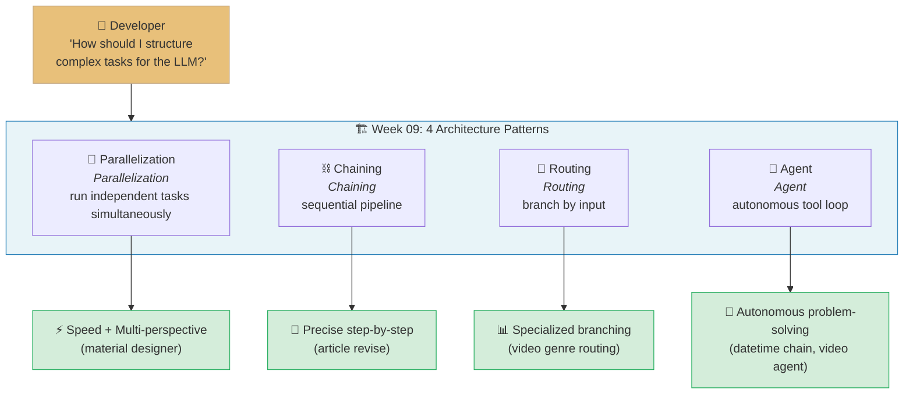

### This Week's Project --- "4 Workflows + Agent Loop" Integration

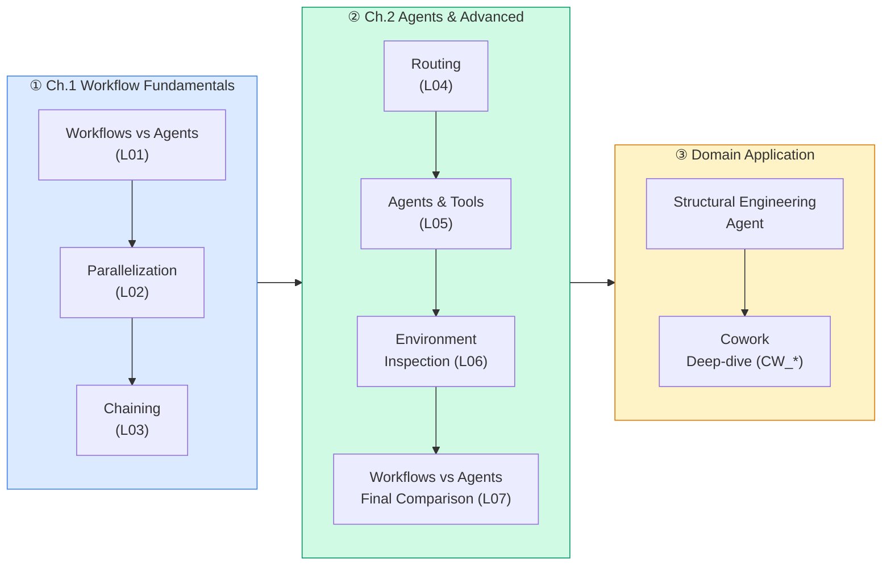

This **3-stage pipeline** is the backbone of this week. ① Implement three workflows directly in code to build an intuition for *"pre-defined flows"*, ② transition through routing into agent loops and environment inspection to experience *"systems the LLM decides for itself"*, and ③ finally apply the whole set to the architectural structural engineering domain (specification QA · Midas result summarization · KDS routing).

### Anthropic Skilljar Course

This lecture note is based on Anthropic's official education platform Skilljar **"Building with the Claude API" Section 8: Agents and Workflows** (7 lessons L01~L07).

| Lesson | ID | Title | W09 Mapping |
|:---:|:---:|---|---|
| L01 | 287796 | Agents and workflows | Ch.1 §1.1 --- Concepts · Evaluator-Optimizer |
| L02 | 287804 | Parallelization workflows | Ch.1 §1.2 --- Material recommendation parallelization |
| L03 | 287800 | Chaining workflows | Ch.1 §1.3 --- Social media video chain |
| L04 | 287801 | Routing workflows | Ch.2 §2.1 --- Genre-based routing |
| L05 | 287803 | Agents and tools | Ch.2 §2.2 --- datetime · Claude Code tools |
| L06 | 287798 | Environment inspection | Ch.2 §2.3 --- read-before-write · whisper |
| L07 | 287794 | Workflows vs agents | Ch.2 §2.4 --- Final selection criteria |

> [!ref] Source Mapping
> - Online course: [Building with the Claude API](https://anthropic.skilljar.com/claude-with-the-anthropic-api)
> - GitHub exercises: [agents_and_workflows](https://github.com/anthropics/courses/tree/master/agents_and_workflows)
> - Anthropic Research: [Building effective agents](https://www.anthropic.com/research/building-effective-agents)
> - Syllabus mapping: **Building --- S8 (Agents and Workflows) → W9** (per v2.3)

> [!method] Prerequisites
> - **API environment**: `anthropic` SDK ≥ 0.34 with `AsyncAnthropic` available for the parallelization exercises
> - **Python async**: prior familiarity with `asyncio.gather`, `async`/`await` syntax --- an extension of the basic loop from W04 Tool Use
> - **Git Worktrees**: the centerpiece of this week's CC skill. `git worktree add ../feat-a feat-a` separates the working tree per branch in one line
> - **Notebook order**: `S8_01_workflow_intro.ipynb` → `S8_02_parallelization.ipynb` → `S8_03_chaining.ipynb` → `S8_04_routing.ipynb` → `S8_05_agent_tools.ipynb` → `S8_06_practice.ipynb` (student self-study) → `S8_07_structural_agents.ipynb` (architectural domain)
> - **Cowork supplementary**: advanced learners additionally run `CW_01_task_loop_simulation.ipynb` → `CW_02_skills_and_plugins.ipynb` → `CW_03_ae_cowork_design.ipynb`

---

## [Chapter 1] Workflow Patterns

### 1.1 Workflows vs Agents Concept (L01)

Skilljar L01 opens with *"Workflows and agents are strategies for handling user tasks that can't be completed by Claude in a single request"*. That sentence is the starting point of all of Week 09 --- **workflows** and **agents** are **two strategies** for dealing with problems that cannot be solved in a single request, and the moment this course let Claude solve a problem by itself using tools, we had **already built an agent**.


*When to Use Workflows vs Agents --- whether the developer "can draw the flow" is the deciding criterion*

#### When to Use a Workflow, When to Use an Agent

The L01 transcript compresses the selection criterion into **a single question** --- *"how well you understand the task."* If you can clearly picture the task flow in your head, **use a workflow**; if even the shape of the input is unclear, **use an agent**.

- **Use workflows** when you can picture the **exact flow or steps** that Claude should go through to solve a problem, or when your app's UX constrains users to a set of tasks.
- **Use agents** when you're **not sure exactly what task or task parameters** you'll give to Claude.

Skilljar's definition is even sharper.

> *"Workflows are a series of calls to Claude meant to solve a specific problem through a **predetermined series of steps**. Agents give Claude a goal and a set of tools, expecting Claude to figure out how to complete the goal through the provided tools."*

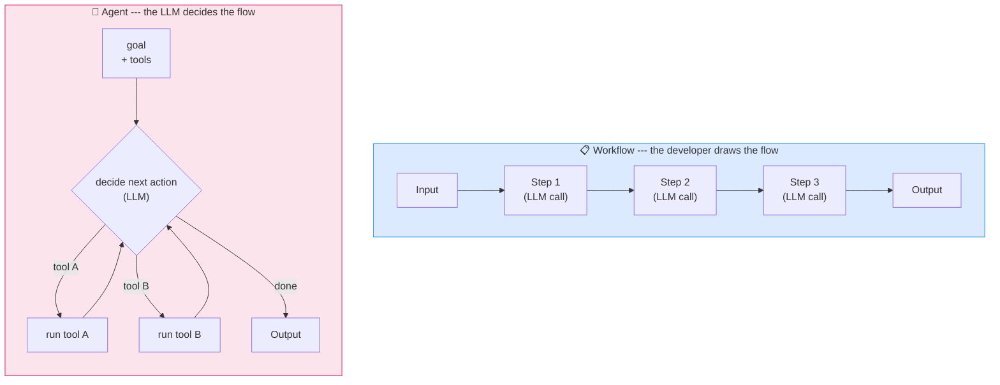

#### Concrete Example --- the Image-to-CAD Workflow

L01 presents a specific workflow example: *"Imagine building a web app where users drag and drop an image of a metal part, and you create a STEP file (an industry standard for 3D models) from it"*. Because **"what exactly to do when a user supplies an image file"** is clear and the whole process **can be pre-written in code**, this is a perfect candidate for a workflow.


*Image → STEP file workflow example --- UX constrains input, so it can be pre-defined*

The steps are as follows.

- Feed an image into Claude, asking it to describe the object
- Based on the description, ask Claude to use the **CadQuery** library to model the object
- Create a rendering
- Ask Claude to **grade the rendering** against the original image. If there are issues, fix them


*4-step workflow breakdown --- describe → model(CadQuery) → render → grade*

This flow assumes a **very narrow input space** --- "an image dragged and dropped". Because the UX restricts the user to one task, the developer can **fix the steps in advance**. This is a textbook case for a workflow.

#### The Evaluator-Optimizer Pattern

The last step of the example above (*"grade the rendering"*) is not simply output evaluation but an instance of the **Evaluator-Optimizer pattern** formally named by L01.


*Evaluator-Optimizer pattern --- Producer ↔ Grader feedback loop*

The four components are as follows.

- **Producer** --- Takes input and creates output (Claude using CadQuery to model the part and create a rendering)
- **Grader** --- Evaluates the output against some criteria
- **Feedback loop** --- If the grader doesn't accept the output, feedback goes back to the producer for improvement
- **Iteration** --- The cycle repeats until the grader accepts the output

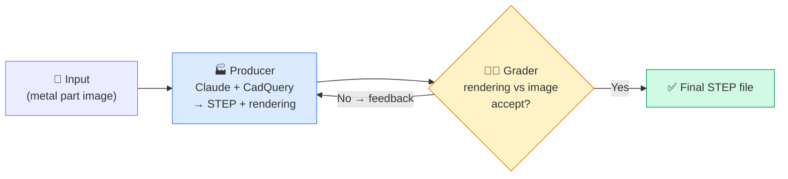


*Evaluator-Optimizer pattern visualization --- the iterative Producer ↔ Grader loop*

> [!finding] Why the Evaluator-Optimizer Matters
> *"The goal of identifying different workflows is to give you a set of **repeatable recipes** for implementing your own features. The Evaluator-Optimizer is one workflow pattern that has worked well for other engineers --- consider using it in your own app!"* --- straight from the L01 transcript. **Naming a pattern** lets you instantly say "ah, this is an Evaluator-Optimizer problem" the next time you meet a new one. Accumulating **engineering recipes** is the real goal of learning workflows.

#### Why Distinguish Workflows --- the Code Doesn't Disappear

L01 also includes this warning.

> *"Remember, identifying workflows **doesn't inherently do anything for us** --- we still have to write the actual code to implement them. But these patterns have proven successful for many engineers, so they're worth understanding and applying to your own projects."*

In other words, knowing the name "parallelization" and actually implementing parallel calls via `asyncio.gather` are different levels. That is why this week's notebooks `S8_01` ~ `S8_05` are a drill in **one-to-one mapping of pattern names to implementation code**.

#### Comparison Table --- Workflow vs Agent

| Axis | Workflow | Agent |
|:---|:---|:---|
| Controller | Code (developer) | LLM (model) |
| Execution path | predetermined series of steps | LLM decides dynamically |
| Input predictability | Constrained by UX | Free-form |
| Predictability | High | Low |
| Evaluation / testing | Easy (each step independently) | Hard (many possible paths) |
| Fits examples like | Image→STEP, translation verification | Desktop agents, dev CLIs |


*Workflows vs Agents at a glance --- control owner, execution path, and predictability contrast*

> [!tip] Claude Code Itself Is the Proof
> Claude Code, which we saw in W08, is an **agent**. The developer cannot know in advance what the user will ask. In contrast, this week's L01 "image→STEP" example is a **workflow**. The same Claude model in the same Anthropic organization is **composed differently depending on the task's character**.

> [!action] Exercise Notebook
> 📂 `03-Exercises/Week_09/skilljar/S8_01_workflow_intro.ipynb`
> Port the L01 *"workflow vs agent"* decision tree to code, and write a Python skeleton for the Evaluator-Optimizer pattern (`producer` function + `grader` function + `while not accepted` loop).

> [!ref] Source: Skilljar L01 --- Agents and workflows (287796)

---

### 1.2 Parallelization Workflows (L02)

L02 opens with *"When building AI applications, you'll often encounter tasks that seem simple on the surface but become complex when you try to implement them effectively"*. It analyzes the typical failure that occurs when you try to solve a seemingly simple task with one big prompt, and presents **parallelization workflows** as the remedy.

#### The Problem --- the Limits of a "Complex Single Prompt"

Imagine we build a **material designer app** where a user uploads an image of a part, and we recommend the best material among *metal, polymer, ceramic, composite, elastomer, or wood*.


*Single-prompt approach --- *"choose between metal, polymer, ceramic, composite, elastomer, or wood"*

The first instinct is to fire one prompt with the image saying *"pick one of these six"*. It works, but it becomes *"a lot of heavy lifting in a single request"*. **Without per-material discrimination criteria, the result is less trustworthy.**

To compensate, you might cram every criterion into one giant prompt --- but that creates a new problem.


*Giant prompt trap --- *"Claude has to juggle all these different considerations simultaneously"*

Claude ends up *"confusion and suboptimal results"* while **juggling six criteria simultaneously**. W03 already taught us that long prompts don't guarantee performance.

#### The Solution --- Parallelization


*Parallelization concept --- "split one task into specialized parallel calls"*

```
Solution: split one request, run each material judgment as an independent Claude call in parallel,
          then call Claude once more at the end to synthesize the recommendation.
```


*Parallelization structure --- the same image is sent multiple times in parallel, each call with a single-material specialist prompt*

The L02 transcript states the steps explicitly.

- Send the same image to Claude **multiple times simultaneously**
- Each request includes **specialized criteria** for one material (metal criteria, polymer criteria, ceramic criteria, etc.)
- Claude evaluates the part's suitability for each material **independently**
- Collect all the analysis results and feed them into a **final aggregation step**


*Final step --- feed every individual analysis back to Claude in one call for final comparison and recommendation*

The job of the final aggregation call is *"compare them and make a final material recommendation"*. In short, **parallel → synthesize** is one unit.

#### The Four Elements of the Parallelization Pattern


*Parallelization pattern structure --- split · run in parallel · aggregate · sub-tasks need not be identical*

L02 summarizes the pattern in four lines.

- **Split a single task into multiple sub-tasks** --- decompose a complex decision into focused specialist evaluations
- **Run the sub-tasks in parallel** --- run every evaluation simultaneously for speed
- **Aggregate the results together** --- combine the specialist analyses into a final decision
- **The parallelized sub-tasks don't need to be identical** --- each can have **its own prompt, tools, and evaluation criteria**

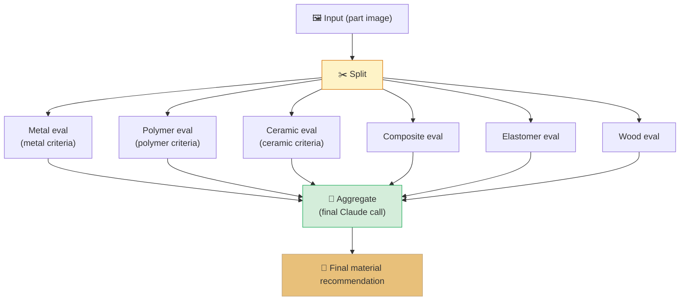

#### `asyncio.gather` Implementation

In Python, this pattern maps directly onto `anthropic.AsyncAnthropic` and `asyncio.gather`. Notice that the four-line L02 summary **matches the code structure exactly**.

```python
import asyncio
import anthropic

async_client = anthropic.AsyncAnthropic()
MODEL = "claude-haiku-4-5"

MATERIAL_CRITERIA = {
    "metal":      "You evaluate suitability of METAL for the shown part...",
    "polymer":    "You evaluate suitability of POLYMER...",
    "ceramic":    "You evaluate suitability of CERAMIC...",
    "composite":  "You evaluate suitability of COMPOSITE...",
    "elastomer":  "You evaluate suitability of ELASTOMER...",
    "wood":       "You evaluate suitability of WOOD...",
}

async def evaluate_material(material: str, system: str, image_block: dict):
    """One Claude call for a single material."""
    resp = await async_client.messages.create(
        model=MODEL,
        max_tokens=1024,
        system=system,
        messages=[{"role": "user", "content": [image_block,
            {"type": "text", "text": f"Rate suitability of {material} (1-10) "
                                      "with reasoning."}]}],
    )
    return material, resp.content[0].text

async def recommend_material(image_block: dict):
    # 1) split + 2) run in parallel (asyncio.gather)
    tasks = [evaluate_material(m, sys, image_block)
             for m, sys in MATERIAL_CRITERIA.items()]
    analyses = await asyncio.gather(*tasks)

    # 3) aggregate --- one final Claude call
    combined = "\n\n".join(f"[{m}]\n{txt}" for m, txt in analyses)
    final = await async_client.messages.create(
        model=MODEL,
        max_tokens=2048,
        system="You are a senior materials engineer. Given specialized "
               "evaluations from six material experts, pick the single best "
               "material and explain why, with trade-offs.",
        messages=[{"role": "user", "content":
            f"Per-material evaluations:\n{combined}\n\n→ Final recommendation:"}],
    )
    return final.content[0].text

# Run
# recommendation = asyncio.run(recommend_material(image_block))
```

The four structural elements map to the code as follows.

| L02 structural element | Location in code |
|:---|:---|
| Split | Key-prompt separation in `MATERIAL_CRITERIA` dict |
| Run in parallel | `asyncio.gather(*tasks)` |
| Aggregate | the final `await async_client.messages.create(...)` |
| Sub-tasks need not be identical | each system prompt differs by material |

#### Time Savings with `asyncio.gather`

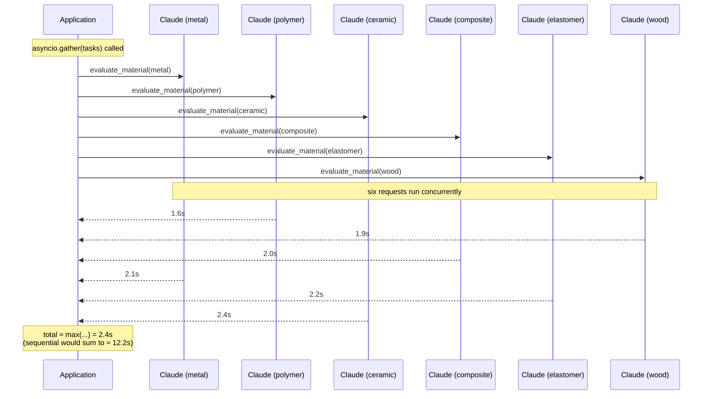

> [!method] Total Time with `asyncio.gather`
> For N independent calls taking T_i seconds each:
> - Sequential execution: ΣT_i (about 6× the average latency for six calls)
> - Parallel execution: max(T_i) (the latency of the slowest single call)
> --- For LLM calls where network wait dominates, **perceived speed improves 5× or more**.

#### The 4 Benefits of Parallelization


*The 4 benefits of parallelization at a glance --- Focused · Optimizable · Scalable · Reliable*

The L02 transcript names the benefits clearly.

- **Focused attention** --- *"Claude can concentrate on one specific aspect at a time rather than trying to balance multiple competing considerations simultaneously."*
- **Easier optimization** --- *"You can improve and test the prompts for each material evaluation independently. If your metal analysis isn't working well, you can refine just that prompt without affecting the others."*
- **Better scalability** --- *"Adding new materials to evaluate is straightforward --- just add another parallel request."*
- **Improved reliability** --- *"By breaking down the complex task, you reduce the cognitive load on the AI model and get more consistent, reliable results."*

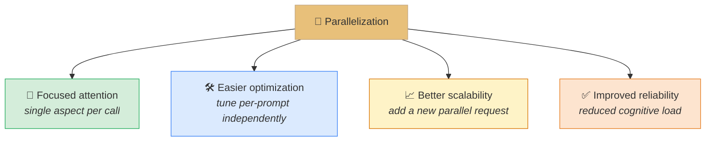

#### When to Use Parallelization

> *"This pattern works well when you have a complex decision that can be broken down into independent evaluations. Look for situations where you're asking an AI to consider multiple criteria, compare several options, or make decisions that involve different domains of expertise."*

The key is **independence** --- each sub-task **must not need to wait** for another sub-task's result. If there is a dependency, use **chaining** from the next section instead.

> [!finding] Parallelization = Sectioning + Voting (the higher-level concept)
> Anthropic's official blog "Building effective agents" subdivides parallelization into two branches --- **Sectioning** (split a task into **independent sub-tasks**; the material recommendation example) and **Voting** (run the same task **multiple times** and pick by majority or best; translating three times and choosing). The L02 material recommendation is a textbook case of Sectioning.

> [!tip] Parallelization Anti-patterns
> - ❌ **Parallelizing dependent steps** --- "Step B needs Step A's output" and you put both in `gather` → B fails with empty input
> - ❌ **Six calls with the same system prompt** --- no diversity, so unless you intend Voting it is pointless
> - ❌ **Skipping aggregate** --- merely listing parallel results and skipping Claude's synthesis call shifts the "comparison decision" to the user

> [!action] Exercise Notebook
> 📂 `03-Exercises/Week_09/skilljar/S8_02_parallelization.ipynb`
> The notebook walks through (1) sequential vs `asyncio.gather` timing, (2) 6-material parallel evaluation, (3) final aggregation prompt design, and (4) an architectural engineering application --- *"evaluate the same specification clause from safety, cost, and constructability perspectives in parallel"*.

> [!ref] Source: Skilljar L02 --- Parallelization workflows (287804)

---

### 1.3 Chaining Workflows (L03)

L03 opens with a surprising emphasis: *"Chaining workflows might seem obvious at first, but they're actually one of the most useful patterns you'll encounter when working with Claude"*. **The name looks too obvious**, yet when a long prompt breaks the constraints you imposed, chaining is the standard remedy.

#### What Is Chaining?

> *"A chaining workflow breaks down a large, complex task into **smaller, sequential subtasks**. Instead of asking Claude to do everything at once, you split the work into **focused steps that build on each other**."*

Each step receives **the previous step's output** as its input and has **its own focused purpose**.


*The motivation for chaining --- split a long task into focused sequential steps*


*Overall flow of a chaining workflow --- each step's output feeds the next step's input*

#### Concrete Example --- Automated Social Media Video Production

L03's headline example is a *"social media marketing tool that creates and posts videos automatically"*. Instead of one mega prompt, it is split into **sequential steps** as follows.

- **Find related trending topics on Twitter**
- **Select the most interesting topic** (using Claude)
- **Research the topic** (using Claude)
- **Write a script for a short format video** (using Claude)
- **Use an AI avatar and text-to-speech to create a video**
- **Post the video to social media**


*Social media video chain --- Twitter → topic select → research → script → video → post*

Three of these (*"select" · "research" · "write script"*) form the **Claude chain**. The rest are **non-LLM processing** via the Twitter API · TTS · posting APIs, which is what the L03 original *"optionally do non-LLM processing between each task"* refers to.

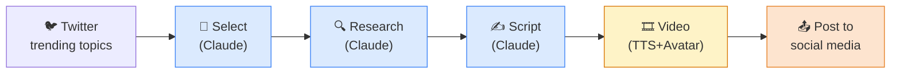

#### Why Chaining Beats a Single Mega-Prompt

L03 lists three benefits.


*The three benefits of chaining --- split · non-LLM processing · focused Claude*

- **Split large tasks into smaller, non-parallelizable subtasks** --- parallelization is for independent subtasks; chaining is for **dependent** ones
- **Optionally do non-LLM processing between each task** --- regex, JSON parsing, DB queries, API calls can be interleaved
- **Keep Claude focused on one aspect of the overall task** --- each step has a single responsibility

#### The Long Prompt Problem

Chaining shines in one situation in particular. L03 names it the **"long prompt problem"** --- writing a technical article with many constraints such as:


*Long constraint list --- 4 requirements hard for Claude to keep simultaneously*

- Not mention that it's written by an AI
- Avoid using emojis
- Skip clichéd or overly casual language
- Write in a professional, technical tone

> *"Even with all these constraints clearly stated, Claude might still produce content that violates some of your rules. You might get back an article that still uses emojis, mentions AI authorship, or sounds unprofessional."*


*The reality --- the moment Claude fails to keep every constraint*

#### The Solution --- the Two-Step Revision Chain

L03's textbook solution is to **split one mega-prompt into two steps**.


*Step 1 --- generate freely even if some constraints are violated*

**Step 1**: send the initial prompt and *"accept that the first output may not be perfect"*. Claude produces an article but may violate some constraints.


*Step 2 --- a revision prompt that focuses only on fixing the violations*

**Step 2**: pass the generated article back with a request to **revise** only. The revision prompt exactly as given in L03 is:

```text
Revise the article provided below.

Follow these steps to rewrite the article:
1. Identify any location where the text identifies the author as an AI and remove them
2. Find and remove all emojis
3. Locate any cringey writing and replace it with text that would be written by a technical writer
```

> *"This approach works because Claude can focus **entirely on the revision task** rather than trying to balance content creation with constraint adherence."*

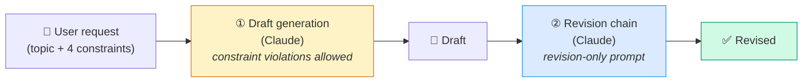

#### Python Implementation --- the chain_step helper

The essence of chaining is *"previous call's output → next call's input"*. A single minimal helper can carry the whole pattern.

```python
import anthropic

client = anthropic.Anthropic()
MODEL = "claude-haiku-4-5"

def chain_step(system: str, user: str) -> str:
    """One step of a chain --- one call with a system role and user input."""
    resp = client.messages.create(
        model=MODEL, max_tokens=2048,
        system=system,
        messages=[{"role": "user", "content": user}],
    )
    return resp.content[0].text

def two_step_article(topic: str) -> dict:
    # Step 1 --- draft
    draft = chain_step(
        system=("Write a professional, technical article. "
                "Do not mention you are an AI. Avoid emojis. "
                "Skip cliches or casual language."),
        user=f"Topic: {topic}\n\nWrite the article.",
    )

    # Step 2 --- revise (exactly as instructed in L03)
    fixed = chain_step(
        system="You are a senior technical editor.",
        user=("Revise the article provided below.\n\n"
              "Follow these steps to rewrite the article:\n"
              "1. Identify any location where the text identifies the author "
              "as an AI and remove them\n"
              "2. Find and remove all emojis\n"
              "3. Locate any cringey writing and replace it with text that "
              "would be written by a technical writer\n\n"
              f"---\n{draft}\n---"),
    )
    return {"draft": draft, "final": fixed}
```

#### The Gate Pattern --- Verification Between Steps

A **Gate (verification step)** can be inserted between chain steps. Example: translate → quality check → re-translate if the score is low. This structure naturally overlaps with the Evaluator-Optimizer from L01 --- *"Chaining + Gate = simplified Evaluator-Optimizer"*.

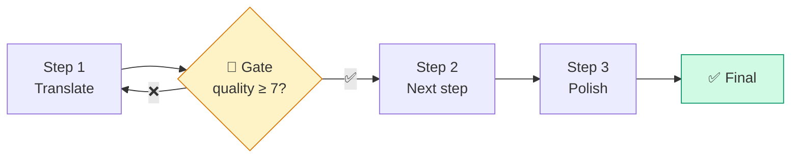

#### When to Use Chaining

Directly from the L03 checklist.

- You have **complex tasks with multiple requirements**
- Claude consistently **ignores some constraints in long prompts**
- You need to **process or validate outputs** between steps
- You want to **keep each interaction focused and manageable**

> [!finding] Four Design Principles for Chaining
> 1. **Single responsibility** --- each step does exactly one clear task
> 2. **Explicit output shape** --- specify a format the next step can parse
> 3. **Gate insertion** --- place evaluation at quality-critical points
> 4. **Non-LLM allowed** --- regex, DB queries, API calls can be interleaved freely

> [!tip] Chaining vs Parallelization Selection
> - **Dependency → chaining** --- Step B needs Step A's result
> - **Independent → parallelization** --- each sub-task ignores the others
> - **Generation with many constraints** → the chaining *"generate → revise"* two-step is the standard
> - **Multi-perspective analysis** → parallelization Sectioning

> [!method] Recipe for Chaining Many Long Constraints
> 1. Ask for a draft with every constraint still spelled out in the first call
> 2. Feed the draft back with a system prompt giving a **numbered revision list** like *"Revise... 1) ... 2) ... 3) ..."*
> 3. Optionally put the revised text through a Gate again; rerun once more if below threshold

> [!action] Exercise Notebook
> 📂 `03-Exercises/Week_09/skilljar/S8_03_chaining.ipynb`
> The notebook covers (1) implementing the `chain_step` helper, (2) the original L03 two-step article revision, (3) a translation → Gate → retranslation chain, and (4) an architectural engineering application --- a 3-step chain *spec extraction → issue analysis → executive summary*.

> [!ref] Source: Skilljar L03 --- Chaining workflows (287800)

---
## Chapter 2. Agents & Advanced Patterns

> In Ch.1 we covered parallelization and chaining, *"fixed pipelines the developer designs"*. Ch.2 begins where we **start delegating decisions to the LLM** --- **Routing (§2.1)** delegates branching to the LLM, and with **Agents (§2.2)** even the tool choice and iteration count are decided by the LLM. Then **Environment Inspection (§2.3)** compensates for the agent's blind spots, the **final comparison (§2.4)** establishes the practical selection criteria, and **§2.5** applies everything to the architectural structural engineering domain.

---

### 2.1 Routing Workflows

#### 2.1.1 Limits of a Generic Prompt

If chaining solved the *"order"* problem, routing solves the *"type"* problem. Skilljar L04 extends the same social-media-video app --- when the user types *"programming"* vs *"surfing"*, the script that should be generated has a completely different character. A programming topic needs **educational content with clear definitions and explanations**, while a surfing topic suits **entertainment-focused scripts emphasizing excitement and visual appeal**.


*Routing concept --- classify the input's "type" first, then branch to category-specific prompts*

> [!finding] Skilljar L04 Original
> *"Programming topics call for educational content with clear explanations and definitions. Surfing topics work better with entertainment-focused scripts that emphasize excitement and visual appeal. A single generic prompt can't handle both effectively."*

Trying to cover both cases with one generic prompt creates the classic **lose-both** situation --- too light for educational content, too dull for entertainment, an awkward middle-ground output.

#### 2.1.2 Six Content Categories

L04's proposed solution is to **classify content genres** first, then apply a specialized prompt template per genre. The proposed categories are as follows.


| Category | Trait | Language style |
| --- | --- | --- |
| **Entertainment** | High-energy, culturally aware | Trendy language |
| **Educational** | Turn complex info into digestible insight | Relatable examples, thought-provoking questions |
| **Comedy** | Sharp, unexpected observation | Wit that lands with timing |
| **Personal vlog** | Honest, intimate content | Conversational storytelling |
| **Reviews** | Decisive, experience-based evaluation | Explicit pros and cons |
| **Storytelling** | Vivid description, emotional connection | Immersive narrative |

> [!tip] Six Is Not the Maximum
> The number of categories depends on the domain. Routing KDS (Korean Design Standards) documents naturally takes 6–8 categories by material, e.g., *"concrete · steel · timber · masonry · earthwork"*. Too many (>15) hurts classification accuracy; too few (<3) defeats the purpose of routing.

#### 2.1.3 The 2-Step Routing Process

A routing workflow always operates in **two steps**.


1. **Categorization** --- classify the user input into one of the categories
2. **Specialized Processing** --- pick the prompt template that matches the classification, then run it

For instance if the user types the topic *"Python functions"*, Step 1 runs this classification prompt.

```text
Categorize the topic of a video into one of the listed categories:
<topic>Python functions</topic>

<categories>
- Educational
- Entertainment
- Comedy
- Personal vlog
- Reviews
- Storytelling
</categories>
```


Claude returns *"Educational"*. Step 2 uses that to generate the actual script with the educational template.

#### 2.1.4 Python Implementation --- `router()` + `dispatch()`

The implementation shape is simple --- a classifier function and a dispatcher function are enough.

```python
from anthropic import Anthropic

client = Anthropic()
MODEL = "claude-haiku-4-5"

CATEGORY_PROMPTS = {
    "Educational": (
        "Develop a clear, engaging script that transforms complex information "
        "into digestible insights using relatable examples and thought-provoking questions."
    ),
    "Entertainment": (
        "Create a high-energy, culturally relevant script with trendy language "
        "and visual hooks that grab attention in the first 3 seconds."
    ),
    "Comedy": (
        "Write a sharp, unexpected script with clever observations and precise timing. "
        "Setup-punchline structure preferred."
    ),
    "Personal vlog": (
        "Produce an authentic, intimate script with conversational storytelling. "
        "Speak directly to the camera in a diary-like tone."
    ),
    "Reviews": (
        "Deliver decisive, experience-based content highlighting strengths and weaknesses. "
        "Include a clear verdict."
    ),
    "Storytelling": (
        "Craft immersive content using vivid details and emotional connection. "
        "Use a 3-act narrative structure."
    ),
}

def route(topic: str) -> str:
    prompt = (
        "Categorize the topic of a video into one of the listed categories:\n"
        f"<topic>{topic}</topic>\n\n"
        f"<categories>\n" + "\n".join(f"- {c}" for c in CATEGORY_PROMPTS) + "\n</categories>\n\n"
        "Respond with ONLY the category name, nothing else."
    )
    resp = client.messages.create(
        model=MODEL,
        max_tokens=20,
        messages=[{"role": "user", "content": prompt}],
    )
    return resp.content[0].text.strip()

def dispatch(topic: str) -> str:
    category = route(topic)
    if category not in CATEGORY_PROMPTS:
        category = "Educational"  # fallback
    system_prompt = CATEGORY_PROMPTS[category]
    resp = client.messages.create(
        model=MODEL,
        max_tokens=800,
        system=system_prompt,
        messages=[{"role": "user", "content": f"Topic: {topic}"}],
    )
    return f"[{category}] {resp.content[0].text}"

print(dispatch("Python functions"))   # → [Educational] ...
print(dispatch("surfing in Hawaii"))  # → [Entertainment] ...
```

> [!method] Routing Best Practices
> 1. **6–8 categories** --- the sweet spot between classification accuracy and specialization
> 2. **Fallback category** --- if the LLM returns an undefined category, fall back safely to a default
> 3. **Small classifier model** --- `claude-haiku-4-5` is enough; use a higher-end model only for the main generation
> 4. **One file per category prompt** --- split into `prompts/educational.md`, `prompts/comedy.md` for version control

#### 2.1.5 Routing Architecture Diagram


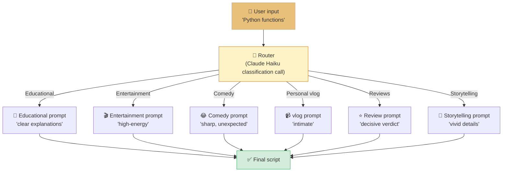

L04's **key insight** is *"user input only goes to one specialized pipeline, not all of them"*. Because a single input flows into only one specialized pipeline, each pipeline can be **optimized independently** --- attach Wikipedia RAG to the Educational pipeline, attach rating and sentiment analysis tools to the Reviews pipeline, and so on.

> [!ref] Source: Skilljar L04 --- Routing workflows (287801)

> [!action] Exercise Notebook
> 📂 `03-Exercises/Week_09/skilljar/S8_04_routing.ipynb` implements a 6-category router. As an extra experiment, solve **KDS design-standard routing (concrete · steel · timber)** by linking it to the §2.5 example.

---

### 2.2 Agents and Tools

#### 2.2.1 From Workflow to Agent

Skilljar L05 introduces agents as the **polar opposite** of the workflows covered in Ch.1 ~ §2.1.


*Basic agent structure --- give it goal + tools, and the LLM decides which tool to use and when to stop*

> [!finding] Skilljar L05 Original
> *"Agents represent a shift from the structured workflows we've been working with. While workflows are perfect when you know the exact steps needed to complete a task, agents shine when you're not sure what those steps should be. Instead of defining a rigid sequence, you give Claude a goal and a set of tools, then let it figure out how to combine those tools to achieve the objective."*

This difference shows up directly in the code structure.

| Workflow | Agent |
| --- | --- |
| Explicit function calls `step1() → step2() → step3()` | `while not done: tool_call = claude.decide(tools)` loop |
| Developer controls flow | LLM decides flow |
| Iteration count fixed (e.g., 1-pass, 2-step) | Iteration count LLM-decided (e.g., 5 tool calls or 15) |
| Branch logic hardcoded as `if/else` | Branch logic expressed in natural language inside the LLM system prompt |

#### 2.2.2 Three Datetime Tools --- Simple but Composable

L05's first example uses **deliberately simple** tools --- three of them.


| Tool | Function | Input → Output |
| --- | --- | --- |
| `get_current_datetime` | Return current time | (none) → ISO 8601 |
| `add_duration_to_datetime` | Add duration to a time | (datetime, days/hours) → datetime |
| `set_reminder` | Create reminder at a given time | (datetime, text) → reminder_id |

Each tool individually is just a **first-order function call**. Yet Claude handles compound queries by **composing** them.


| User query | Agent's tool chain |
| --- | --- |
| *"What's the time?"* | `get_current_datetime()` |
| *"What day of the week is it in 11 days?"* | `get_current_datetime() → add_duration_to_datetime(now, 11d)` |
| *"Set a gym reminder next Wednesday"* | `get_current_datetime() → add_duration_to_datetime(now, ~6d) → set_reminder(date, "gym")` |
| *"When does my 90-day warranty expire?"* | Claude first asks *"When did you buy it?"* → after the user answers, `add_duration_to_datetime(purchase_date, 90d)` |

> [!finding] L05's Key Message
> The last example is especially important --- Claude uses **asking the user back** as if conversation itself were a tool, when it lacks the information it needs. A workflow would have to make this branch explicit as `if purchase_date is None: ask_user()`, but the agent elicits this behavior with a system prompt alone.

#### 2.2.3 Claude Code --- the Power of Abstract Tools

L05's second example is at a larger scale --- **Claude Code** itself, which we learned in Week 08, is a textbook agent.


*Claude Code --- composing generic, abstract tools (Read · Write · Bash · Grep ...)*

The tools given to Claude Code are **all generic Unix primitives**.

| Tool | Function |
| --- | --- |
| `bash` | Run any shell command |
| `read` | Read any file |
| `write` | Create any file |
| `edit` | Modify a file |
| `glob` | Search file patterns |
| `grep` | Search inside files |

> [!finding] L05 Original --- "Tools Should Be Abstract"
> *"It notably doesn't have specialized tools like 'refactor code' or 'install dependencies.' Instead, Claude figures out how to use the basic tools to accomplish these complex tasks. This abstraction allows it to handle countless programming scenarios that the developers never explicitly planned for."*

Claude Code has **no hyper-specialized tools** such as `refactor_code`, `install_dependency`, `run_tests`, or `fix_import_errors`. Instead it composes `bash` + `read` + `write` + `edit` + `glob` + `grep` to handle tasks **the designers never imagined** --- digging through git history to find bug causes, building a Docker image and testing it, cascading fixes to TypeScript type errors, all of it.

The hands-on experience from **Week 08** --- using `bash + read + write + edit` to *"search for the digit 3 → create a file → extract JSON"* --- is this very principle.

#### 2.2.4 The Social Media Video Agent

L05's third example is a video-generation agent.


| Tool | Function |
| --- | --- |
| `bash` | Access FFMPEG video processing |
| `generate_image` | Prompt → image |
| `text_to_speech` | Text → audio |
| `post_media` | Upload to a social platform |

This toolset supports both a **simple workflow (generate video → post)** and an **interactive scenario (generate a sample image first → get user approval → proceed)**. Implementing it as a workflow would require separate functions for the two flows, but in the agent, the single system-prompt line *"ask user for approval before expensive operations"* is enough.


#### 2.2.5 Python Agent Loop --- the Basic Structure

```python
from anthropic import Anthropic

client = Anthropic()
MODEL = "claude-haiku-4-5"

def agent_loop(user_goal: str, tools: list[dict], tool_impls: dict, max_turns: int = 15):
    messages = [{"role": "user", "content": user_goal}]
    for turn in range(max_turns):
        resp = client.messages.create(
            model=MODEL,
            max_tokens=2048,
            tools=tools,
            messages=messages,
        )
        # termination: LLM stops calling tools
        if resp.stop_reason == "end_turn":
            return resp.content[-1].text

        # handle tool calls
        messages.append({"role": "assistant", "content": resp.content})
        tool_results = []
        for block in resp.content:
            if block.type == "tool_use":
                result = tool_impls[block.name](**block.input)
                tool_results.append({
                    "type": "tool_result",
                    "tool_use_id": block.id,
                    "content": str(result),
                })
        messages.append({"role": "user", "content": tool_results})

    raise RuntimeError(f"Agent did not terminate within {max_turns} turns")
```

> [!tip] `max_turns` Is the Agent's Safety Guard
> Always set `max_turns` to prevent infinite loops. Claude Code defaults to 200 turns; a simple Q&A agent usually only needs 10–15. Exceeding the cap causes exploding cost, latency, and environment pollution (dirty files).

> [!ref] Source: Skilljar L05 --- Agents and tools (287803)

> [!action] Exercise Notebook
> 📂 `03-Exercises/Week_09/skilljar/S8_05_agent_tools.ipynb` implements the datetime 3-tool agent, then additionally builds a **mini filesystem agent** imitating Claude Code's `bash/read/write`.

---

### 2.3 Environment Inspection

#### 2.3.1 Claude Works Blindfolded

L06 tackles **the most commonly overlooked pitfall** of agent implementation.


*Environment inspection --- the "observe before acting" step that cures the agent's blindness*


> [!finding] Skilljar L06 Original
> *"When building AI agents, one crucial concept often gets overlooked: environment inspection. Claude operates blindly --- it needs to be able to observe and understand the results of its actions to work effectively."*

Tool calls **affect the outside world**, but Claude **cannot automatically know** the results. When you call `bash("rm file.txt")`, whether the file was actually deleted, whether permission was denied, or even whether it was in the wrong directory --- unless the tool returns that, Claude does not know.

**The reason Week 08 Computer Use takes a screenshot after every click** is exactly this. Whether a button click navigated to a new page, opened a menu, or did nothing --- without the screenshot, Claude has no basis to decide the next action.

#### 2.3.2 The Read-Before-Write Principle

The same applies to file operations. To add a new route to a Python file, Claude must **first read the existing code** to understand the current structure.


> [!method] Read-Before-Write Pattern
> ```
> 1. read(target_file)          # understand current state
> 2. plan modification           # plan the change
> 3. edit(target_file, diff)     # apply the change
> 4. read(target_file)           # ✅ verify the change (optional but recommended)
> ```
> That is exactly why Claude Code's `Edit` tool enforces the rule *"You must use the Read tool at least once in the conversation before editing"*.

In the Week 08 exercises, you will have been required to `Read` before using `Edit` --- that is not mere formal validation but a design principle that **prevents the agent from breaking files via blind edits**.

#### 2.3.3 Video Agent --- 3-Step Verification

The L06 video agent example shows how to force environment inspection via the system prompt.


An example system prompt:

```text
After generating a video with FFmpeg, you MUST verify the output:

1. Use the bash tool to run whisper.cpp and generate caption files
   with timestamps. Verify that dialogue is placed at the correct timestamps.

2. Use FFmpeg to extract screenshots from the video at regular intervals
   (every 2 seconds). Visually inspect these screenshots to confirm that
   visual elements appear as expected.

3. Compare the generated content against the original requirements.
   If any discrepancy is found, identify the cause and regenerate the
   affected segment.

Do NOT report success until all three checks pass.
```

This prompt turns the agent into a **self-verifying agent** **without adding any tool**, purely by injecting behavioral norms. whisper.cpp is an audio→caption converter, used here to confirm the intended dialogue actually made it into the video. `ffmpeg -vf fps=0.5 screenshot_%03d.png` extracts a frame every 2 seconds to verify visual elements.

#### 2.3.4 The 4 Benefits of Inspection

L06 summarizes the four capabilities that environment inspection brings to an agent.

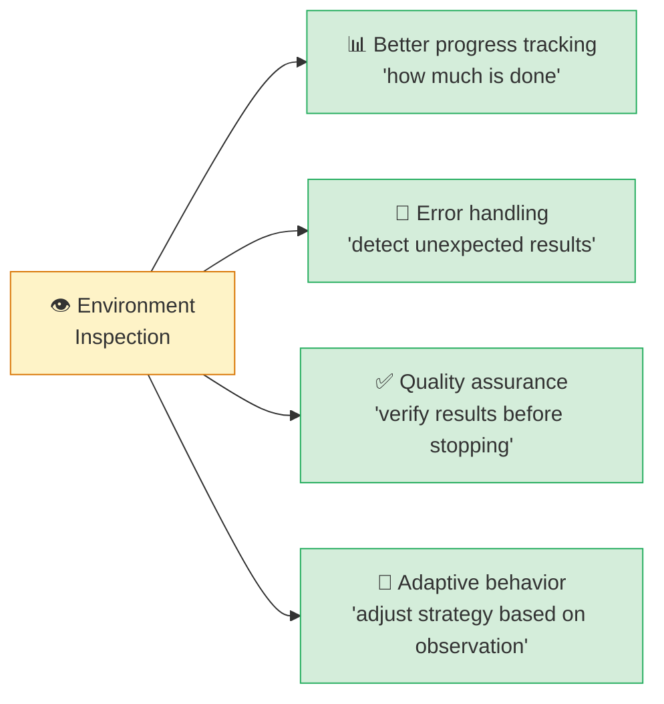

#### 2.3.5 Practical Application --- *"How will Claude know if this action worked?"*

L06 proposes a single design question --- *"How will Claude know if this action worked?"* Asking this when designing any tool naturally prevents inspection omissions.

| Task type | Required inspection pattern |
| --- | --- |
| File modification | `read` before `edit`, `read` after `edit` (diff check) |
| UI interaction | `screenshot` right after click/input |
| API call | Return the full response JSON (do not return only the status code) |
| Generated content | Requirement-cross-check loop (L06's whisper/FFmpeg pattern) |
| Database | After `INSERT`, `SELECT` to confirm the actual save |

> [!ref] Source: Skilljar L06 --- Environment inspection (287798)

> [!action] Exercise Notebook
> 📂 `03-Exercises/Week_09/skilljar/S8_05_agent_tools.ipynb` (second half) extends the filesystem agent to enforce read-before-write. **Verification scenario**: instruct the agent to add a new section to `README.md`, then observe the errors that appear when inspection is skipped (existing content overwritten, duplicate sections).

---

### 2.4 Workflows vs Agents Final Comparison

#### 2.4.1 The Criterion Is *"How Well You Know the Problem"*

L07 formalizes the **selection criterion** that runs through all of Ch.1 ~ §2.3.


> [!finding] Skilljar L07 --- Workflows Definition
> *"Workflows are a predefined series of calls to Claude designed to solve a known problem or set of problems. You use workflows when you can picture the flow of steps ahead of time --- essentially when you know the exact sequence needed to complete a task."*

> [!finding] Skilljar L07 --- Agents Definition
> *"With agents, Claude gets a set of basic tools and is expected to formulate a plan to use these tools to complete a task. Unlike workflows, you don't know exactly what tasks will be provided, so the system needs to be more adaptive."*

#### 2.4.2 The 4-Cell Comparison Matrix (Benefits × Downsides)


*Final Workflows vs Agents comparison --- one-page Benefits × Downsides summary*

L07's 4-cell comparison is the **core reference for practical decision-making**.

| | **Workflows** | **Agents** |
| --- | --- | --- |
| **Benefits** | • Focus on each sub-task → high accuracy<br/>• Easy to evaluate and test because each step is known<br/>• Predictable and reliable execution<br/>• Fits specific, well-defined problems | • Flexible UX<br/>• Tool composition handles diverse tasks<br/>• Handles situations unforeseen at dev time<br/>• Can ask the user for additional input when needed |
| **Downsides** | • Not flexible --- limited to specific tasks<br/>• Constrained UX --- input must be known ahead<br/>• High up-front design and planning cost | • Lower success rate vs workflows<br/>• Execution path unpredictable → hard to evaluate and measure<br/>• Unpredictable behavior |

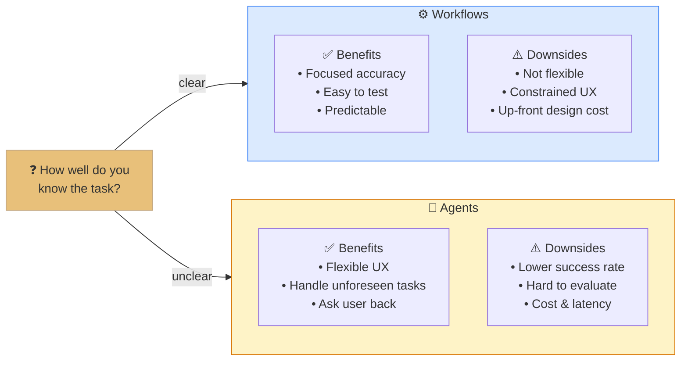

#### 2.4.3 The Workflow-First Principle

L07's **most important practical recommendation** is clear.

> [!finding] Skilljar L07 --- Final Recommendation
> *"Your primary goal as an engineer is to solve problems reliably. Users probably don't care that you've built a fancy agent --- they want a product that works consistently. The general recommendation is to always focus on implementing workflows where possible, and only resort to agents when they are truly required."*

Summarized as a **workflow-first decision flowchart**:

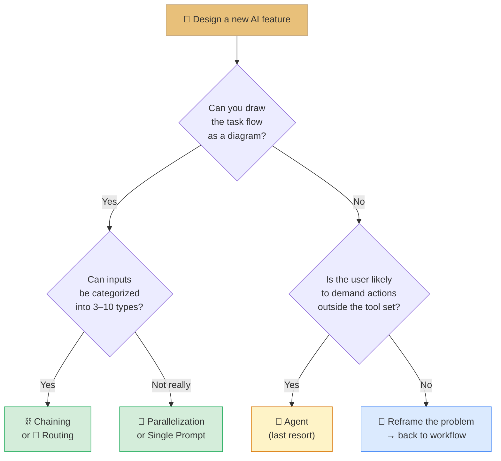

> [!tip] Agents Are the *"Last Resort"*
> Remember Anthropic's own guidance: *"always focus on implementing workflows where possible, and only resort to agents when they are truly required"*. 80–90% of production systems are fine with workflows. Agents are only justified when **the input types cannot be known in advance** (e.g., Claude Code).

#### 2.4.4 Hybrid Patterns --- Agents Inside Workflows

In practice the two approaches are often **layered**. The outer shell is a workflow for predictability, and only specific steps (unpredictable sub-tasks) are handled by an agent.

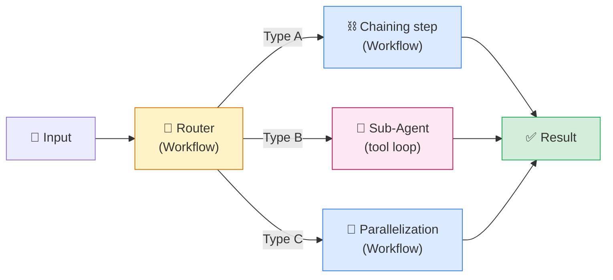

This pattern reappears in the Week 13 integration project --- the design-review system's **document-type routing (workflow)** → **type-specific deep analysis (agent or chaining)** is that example.

> [!ref] Source: Skilljar L07 --- Workflows vs agents (287794)

> [!action] Exercise Notebook
> 📂 `03-Exercises/Week_09/skilljar/S8_06_practice.ipynb` (student self-study) implements a single task as (1) a workflow and (2) an agent, then directly compares them on **success rate · cost · latency**.

---

### 2.5 Domain Application --- the Architectural Structural Engineering Agent

#### 2.5.1 Why Structural Engineering

Architectural structural engineering is a domain where the four patterns **combine naturally** --- specifications and design standards require routing by document type, multi-perspective review (parallelization) is standard practice, processing analysis results is a sequential pipeline (chaining), and driving analysis software like Midas is where agents shine most.

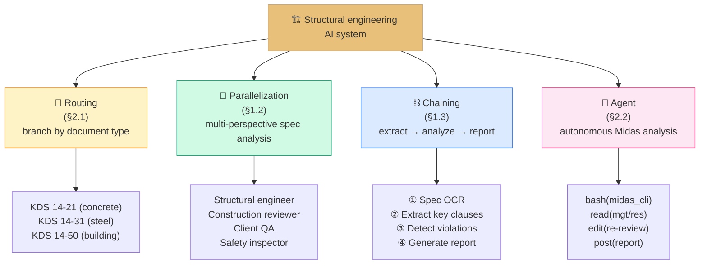

#### 2.5.2 Design Review Automation System --- 4-Pattern Integrated Design

**Scenario**: when a user uploads a design PDF (spec + Midas analysis result), the system auto-reviews KDS compliance.

**End-to-end pipeline**:

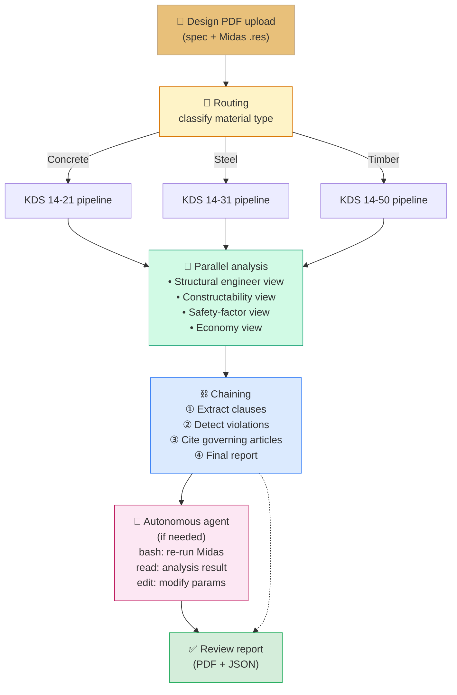

#### 2.5.3 Python Skeleton --- `design_review_pipeline`

```python
from anthropic import Anthropic
import asyncio
from anthropic import AsyncAnthropic

client = Anthropic()
async_client = AsyncAnthropic()
MODEL = "claude-haiku-4-5"

# ① Routing (§2.1) --- KDS material classification
KDS_ROUTES = {
    "concrete": "KDS 14-21 Reinforced Concrete Design Standard",
    "steel":    "KDS 14-31 Steel Structure Design Standard",
    "timber":   "KDS 14-50 Timber Structure Design Standard",
    "masonry":  "KDS 14-32 Masonry Structure Design Standard",
}

def route_material(spec_text: str) -> str:
    prompt = (
        "Classify the following specification by material:\n"
        f"<spec>{spec_text[:2000]}</spec>\n"
        f"<categories>{list(KDS_ROUTES)}</categories>\n"
        "Return only the category name."
    )
    resp = client.messages.create(model=MODEL, max_tokens=20,
                                   messages=[{"role": "user", "content": prompt}])
    return resp.content[0].text.strip()

# ② Parallel analysis (§1.2) --- 4-perspective concurrent evaluation
PERSPECTIVES = {
    "structural_engineer": "Evaluate from the perspective of structural stability, load paths, and member design",
    "construction_reviewer": "Evaluate from the perspective of construction sequence, temporary works, and pour schedule",
    "client_qa":            "Evaluate alignment between spec and drawings and adherence to design standards",
    "safety_inspector":     "Evaluate from the perspective of safety factor, seismic, and fire resistance",
}

async def perspective_review(perspective: str, system: str, spec: str):
    resp = await async_client.messages.create(
        model=MODEL, max_tokens=800, system=system,
        messages=[{"role": "user", "content": spec}],
    )
    return perspective, resp.content[0].text

async def parallel_review(spec: str):
    tasks = [perspective_review(p, s, spec) for p, s in PERSPECTIVES.items()]
    return dict(await asyncio.gather(*tasks))

# ③ Chaining (§1.3) --- extract → analyze → report
def chain_step(prompt: str, prior: str = "") -> str:
    full_prompt = f"{prior}\n\n{prompt}" if prior else prompt
    resp = client.messages.create(model=MODEL, max_tokens=2000,
                                   messages=[{"role": "user", "content": full_prompt}])
    return resp.content[0].text

def chain_review(spec: str, kds_ref: str):
    step1 = chain_step(f"Extract key clauses from the following specification:\n{spec}")
    step2 = chain_step(f"Cross-check the clauses above against {kds_ref} to detect violations", prior=step1)
    step3 = chain_step("Compile the violations with their governing articles into a report (English, sectioned)", prior=step2)
    return step3

# ④ Agent (§2.2) --- re-run Midas when needed
MIDAS_TOOLS = [
    {"name": "run_midas", "description": "Run Midas CLI", ...},
    {"name": "read_res",  "description": "Parse analysis result (.res)", ...},
    {"name": "edit_mgt",  "description": "Modify an input-file parameter", ...},
]

def midas_agent(goal: str):
    # Uses the §2.2.5 agent_loop()
    ...

# End-to-end pipeline
async def design_review_pipeline(spec_text: str):
    material = route_material(spec_text)                    # ① routing
    kds_ref = KDS_ROUTES[material]
    perspectives = await parallel_review(spec_text)         # ② parallel
    report = chain_review(spec_text, kds_ref)               # ③ chaining
    # ④ agent is called only if violations are found (optional)
    return {"material": material, "kds": kds_ref,
            "perspectives": perspectives, "report": report}
```

#### 2.5.4 Midas Agent --- Abstract Tool Design

Applying L05's *"tools should be abstract"* principle to the Midas domain:

| ❌ Hyper-specialized (not recommended) | ✅ Abstract (recommended) |
| --- | --- |
| `check_beam_deflection()` | `run_midas(cmd)` + `read_res(path)` |
| `fix_column_reinforcement()` | `edit_mgt(path, param, value)` |
| `generate_seismic_report()` | `bash(command)` + `write(path, content)` |
| `validate_KDS_14_31()` | `grep(pattern, file)` + `read(file)` |

The advantage of abstract tools --- **scenarios the designer never anticipated** (e.g., *"check whether an RC beam's crack width exceeds 0.3 mm, and if so re-design the section and report the new analysis result"*) can also be handled by composing tools.

> [!tip] W10/W11 Connection
> This §2.5 design becomes the foundation for **W10 (BIM + IFC)** and **W11 (Midas + MCP)**. W10 builds out an `IFC file → structural member extraction` chain, and W11 implements a `Midas MCP server → analysis agent` in full. §2.5 is a **precursor design sketch** that sets the direction for both subsequent weeks.

> [!ref] Source: Architectural domain application --- Skilljar L01-L07 + KDS design standards + Week 07 MCP + Week 11 preview

> [!action] Exercise Notebook
> 📂 `03-Exercises/Week_09/skilljar/S8_07_structural_agents.ipynb` implements the `design_review_pipeline` step by step. Advanced learners experience Cowork pair programming in 📂 `CW_03_ae_cowork_design.ipynb`.

---

## Chapter 3. Self-assessment & Summary

### 3.1 10-Question Quiz

Try the questions first, then expand to compare with the answers.

> [!question] Q1. What is the most fundamental difference between Workflows and Agents?
> (a) Workflows are a single LLM call, Agents are multiple calls<br/>
> (b) Workflows are *"predetermined series of steps"*, Agents are *"goal + tools"*<br/>
> (c) Workflows are Claude-only, Agents are general-purpose<br/>
> (d) Workflows are free, Agents are paid

> [!tip]- Show Answer
> **(b)** Citing the L01 definition --- *"Workflows are a series of calls to Claude meant to solve a specific problem through a predetermined series of steps. Agents give Claude a goal and a set of tools."*

> [!question] Q2. Which of the following is NOT a component of the Evaluator-Optimizer pattern?
> (a) Producer<br/>
> (b) Grader<br/>
> (c) **Broker**<br/>
> (d) Feedback loop

> [!tip]- Show Answer
> **(c)** L01's four components are Producer / Grader / Feedback loop / Iteration. Broker is not included.

> [!question] Q3. Which of the following is NOT among the four benefits of parallelization workflows?
> (a) Focused attention<br/>
> (b) Easier optimization<br/>
> (c) **Lower cost**<br/>
> (d) Better scalability

> [!tip]- Show Answer
> **(c)** The four benefits L02 names are Focused attention / Easier optimization / Better scalability / Improved reliability. Parallelization can actually **raise cost** due to more concurrent calls --- cost savings are not listed as a benefit.

> [!question] Q4. When is a chaining workflow most effective?
> (a) When independent multi-perspective analysis is needed<br/>
> (b) **When Claude ignores some rules in a long constraint-heavy prompt**<br/>
> (c) When user input must be classified into categories<br/>
> (d) When the number of tool calls cannot be known in advance

> [!tip]- Show Answer
> **(b)** L03's "Long Prompt Problem" --- instead of forcing every constraint into one call, the **generate → revise** 2-step chain is effective.

> [!question] Q5. In Skilljar L03's Two-Step Revision example, what are the three revision actions the Step 2 prompt specifies?
> (a) Remove emojis · fix grammar · shorten length<br/>
> (b) **Remove AI references · remove emojis · replace cringey writing with a technical writer's voice**<br/>
> (c) Summarize · translate · format<br/>
> (d) SEO optimize · improve titles · add hashtags

> [!tip]- Show Answer
> **(b)** Quoting L03 --- *"1. Identify any location where the text identifies the author as an AI and remove them; 2. Find and remove all emojis; 3. Locate any cringey writing and replace it with text that would be written by a technical writer."*

> [!question] Q6. Which of the following is NOT one of the six video-content categories in the routing workflow?
> (a) Entertainment<br/>
> (b) Educational<br/>
> (c) **Tutorial**<br/>
> (d) Comedy

> [!tip]- Show Answer
> **(c)** The six categories in L04 are Entertainment · Educational · Comedy · Personal vlog · Reviews · Storytelling. Tutorial is not included (educational material is subsumed under Educational).

> [!question] Q7. Why does Claude Code have abstract tools like `bash/read/write/edit/glob/grep` instead of hyper-specialized ones like `refactor_code`?
> (a) Because specialized tools are technically hard to build<br/>
> (b) **Because composing abstract tools covers scenarios the developer never imagined**<br/>
> (c) To minimize the tool count and reduce cost<br/>
> (d) Because the Claude Haiku model only supports abstract tools

> [!tip]- Show Answer
> **(b)** L05 original --- *"This abstraction allows it to handle countless programming scenarios that the developers never explicitly planned for."*

> [!question] Q8. In environment inspection, what is the core of the *"Read-Before-Write"* principle?
> (a) Because you must secure read permission first<br/>
> (b) To reduce disk I/O<br/>
> (c) **Because you must grasp the current state to modify without breaking existing structure**<br/>
> (d) Because the Claude API bills read tokens at a lower rate

> [!tip]- Show Answer
> **(c)** Quoting L06 --- *"Before Claude can modify any file, it needs to understand the current contents... only then can it safely make the requested changes without breaking existing functionality."*

> [!question] Q9. What does L07's final recommendation of *"workflow-first"* mean?
> (a) Use workflows only in every project, never agents<br/>
> (b) Code the workflow first and the agent later<br/>
> (c) **Implement workflows whenever possible and resort to agents only when truly required**<br/>
> (d) Teach workflows before teaching agents

> [!tip]- Show Answer
> **(c)** L07 original --- *"Always focus on implementing workflows where possible, and only resort to agents when they are truly required."*

> [!question] Q10. Why use Python's `asyncio.gather` to implement parallelization?
> (a) Because the code is shorter than synchronous calls<br/>
> (b) **To fire independent LLM calls concurrently and drastically shorten total wait time**<br/>
> (c) Because `asyncio` sums up billing<br/>
> (d) Because Anthropic only supports the async client

> [!tip]- Show Answer
> **(b)** Core benefit of parallelization --- what is N×latency sequentially collapses to max(latency) in parallel. For four material evaluations it is about 4× faster.

---

### 3.2 Learning Summary and Cumulative Roadmap

#### 3.2.1 W09 Final Mastery Checklist

| # | Mastery Item | Source |
| --- | --- | --- |
| 1 | Explain Workflows vs Agents definitions in one sentence | L01 |
| 2 | Distinguish the four components of Evaluator-Optimizer | L01 |
| 3 | Parallelize multiple LLM calls with `asyncio.gather` | L02 + §1.2 |
| 4 | Apply Two-Step Revision to long constraint prompts | L03 + §1.3 |
| 5 | Implement a 6-category router + specialist prompt templates | L04 + §2.1 |
| 6 | Implement the datetime 3-tool agent loop | L05 + §2.2 |
| 7 | Explain the abstract-vs-hyper-specialized tools trade-off | L05 + §2.2.3 |
| 8 | Apply Read-Before-Write · screenshot verification patterns | L06 + §2.3 |
| 9 | Wield the workflow-first decision flowchart | L07 + §2.4 |
| 10 | Sketch a 4-pattern architectural design-review pipeline | §2.5 |

#### 3.2.2 Cumulative Learning Roadmap --- Week 01 → Week 13

```mermaid
graph LR
    W1["W01<br/>LLM basics<br/>4D"] --> W2["W02<br/>API"]
    W2 --> W3["W03<br/>Prompt<br/>Eval"]
    W3 --> W4["W04<br/>Tool Use"]
    W4 --> W5["W05<br/>RAG"]
    W5 --> W6["W06<br/>Claude features"]
    W6 --> W7["W07<br/>MCP"]
    W7 --> W8["W08<br/>Claude Code<br/>Computer Use"]
    W8 ==> W9["🌟 W09<br/>Workflows &<br/>Agents"]
    W9 --> W10["W10<br/>BIM·IFC"]
    W10 --> W11["W11<br/>Midas MCP"]
    W11 --> W12["W12<br/>Multimodal<br/>Agent SDK"]
    W12 --> W13["W13<br/>Integration·Deploy"]

    style W9 fill:#fef3c7,stroke:#d97706,color:#333,stroke-width:3px
    style W1 fill:#f3f4f6,stroke:#9ca3af
    style W2 fill:#f3f4f6,stroke:#9ca3af
    style W3 fill:#f3f4f6,stroke:#9ca3af
    style W4 fill:#dbeafe,stroke:#3b82f6
    style W5 fill:#dbeafe,stroke:#3b82f6
    style W6 fill:#dbeafe,stroke:#3b82f6
    style W7 fill:#dbeafe,stroke:#3b82f6
    style W8 fill:#d1fae5,stroke:#059669
    style W10 fill:#fce7f3,stroke:#be185d
    style W11 fill:#fce7f3,stroke:#be185d
    style W12 fill:#fce7f3,stroke:#be185d
    style W13 fill:#fce7f3,stroke:#be185d
```

**W09 is the hinge of the curriculum** --- the left side (W01-W08) **stacks individual technologies vertically** (API, prompt, Tool, RAG, MCP, Claude Code), and the right side (W10-W13) **deploys them horizontally into the architectural engineering domain**. The four W09 patterns are the **connecting bridge**.

#### 3.2.3 Top 3 Core Insights

> [!finding] Insight 1 --- Workflows Are *"Compositions"*
> Parallelization, chaining, and routing are **not mutually exclusive**. Real systems look like *"routing → parallelization → chaining"* nested together. The four patterns are the *"basic cooking methods"* of a recipe, not exclusive recipes themselves.

> [!finding] Insight 2 --- The More Abstract the Tool, the Stronger It Is
> Just as Claude Code covers countless programming tasks with the six tools `bash + read + write + edit + glob + grep`, **the core of domain-agent design is finding the minimal set of abstract tools**. Provide `read + edit` instead of `refactor_code`.

> [!finding] Insight 3 --- Agents Need "Eyes"
> An agent without environment inspection is **like a person working blindfolded**. Every tool design must ask *"How will Claude know if this action worked?"* That question naturally produces patterns like read-before-write, screenshot-after-click, and whisper-verification.

---

## 💻 Practical Exercises (Week 09 Exercises)

### Exercise Buildup Structure

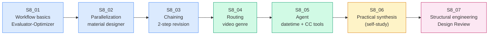

### Notebook List

| Notebook | Topic | Main Exercises | Skilljar Lesson |
| --- | --- | --- | --- |
| `S8_01_workflow_intro.ipynb` | Workflow concept + Evaluator-Optimizer | Manual Producer/Grader/Feedback | L01 |
| `S8_02_parallelization.ipynb` | Parallelization workflows | `asyncio.gather` + material designer | L02 |
| `S8_03_chaining.ipynb` | Chaining workflows | article generation → 2-step revision | L03 |
| `S8_04_routing.ipynb` | Routing workflows | 6-category video genre router | L04 |
| `S8_05_agent_tools.ipynb` | Agent + tools + environment inspection | datetime 3-tool + mini filesystem agent | L05 + L06 |
| `S8_06_practice.ipynb` (self-study) | Practical synthesis | Implement one task twice (workflow vs agent) | L07 |
| `S8_07_structural_agents.ipynb` | Architectural domain application | Step-by-step `design_review_pipeline` | §2.5 |

### Deep-dive (self-study) --- the Claude Cowork Track

| Notebook | Topic | Timing |
| --- | --- | --- |
| `CW_01_task_loop_simulation.ipynb` | Task loop simulation | During W09 |
| `CW_02_skills_and_plugins.ipynb` | Skills + plugins combination | Late W09 |
| `CW_03_ae_cowork_design.ipynb` | Architectural-engineering Cowork design | End of W09 / just before W10 |

> [!action] Deliverables
> 1. Completed `S8_01 ~ S8_07` 7 notebooks (with comments)
> 2. §2.5 `design_review_pipeline` execution log (one sample specification)
> 3. A **1-page reflection** --- *"For the problem I designed, did I pick workflow or agent, and why"* (citing L07)

---

## 🤖 CC Skill --- Parallel Development with Git Worktrees (30-min block)

### Why Worktrees

When you need to **experiment with agents and workflows in multiple branches simultaneously**, switching branches via `git checkout` mixes your working tree state. Git Worktrees are a feature that **separates multiple working trees from one repository**, letting you run different Claude Code sessions from different directories.

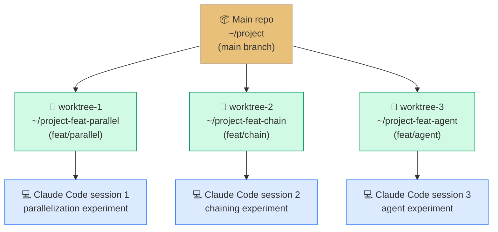

### Exercise Steps

```bash
# 1. Create 3 worktrees from the main repo
cd ~/LLM-AE-AI-W09
git worktree add ../W09-parallel feat/parallel
git worktree add ../W09-chain    feat/chain
git worktree add ../W09-agent    feat/agent

# 2. Open a separate terminal per directory and run Claude Code
cd ../W09-parallel && claude &
cd ../W09-chain    && claude &
cd ../W09-agent    && claude &

# 3. Experiment with different patterns in parallel in each session
#    - W09-parallel: S8_02 parallelization experiment
#    - W09-chain:    S8_03 chaining experiment
#    - W09-agent:    S8_05 agent experiment

# 4. Merge the best result into main
cd ~/LLM-AE-AI-W09
git merge feat/agent   # e.g., adopt the agent branch

# 5. Clean up completed worktrees
git worktree remove ../W09-parallel
git worktree remove ../W09-chain
```

### Three Benefits

| Benefit | Description |
| --- | --- |
| **Context isolation** | Each session's CLAUDE.md · conversation history · file changes are independent |
| **Parallel exploration** | Compare three approaches at the same time, pick the most successful |
| **Zero branch-switching cost** | Move between experiments with just `cd` (no stash/checkout) |

> [!tip] Worktrees + Skills Combo
> Combining with the Claude Code Skills from Week 05 is even more powerful --- create per-pattern skills like `~/.claude/skills/parallelization.md`, `~/.claude/skills/chaining.md`, and invoke the relevant skill from each worktree. The W09 Cowork track's `CW_02_skills_and_plugins.ipynb` runs this combination as an exercise.

> [!action] Worktrees Exercise Mission
> Follow the steps above to create 3 worktrees, implement the same *"design-review PDF summarizer"* in each branch as workflow/chaining/agent respectively, then submit a table comparing performance · cost · code complexity.

---

## 📚 References

> [!ref] Skilljar S8 --- Original Lessons (7 total)
> - [L01 Agents and workflows (287796)](https://anthropic.skilljar.com/claude-with-the-anthropic-api/287796)
> - [L02 Parallelization workflows (287804)](https://anthropic.skilljar.com/claude-with-the-anthropic-api/287804)
> - [L03 Chaining workflows (287800)](https://anthropic.skilljar.com/claude-with-the-anthropic-api/287800)
> - [L04 Routing workflows (287801)](https://anthropic.skilljar.com/claude-with-the-anthropic-api/287801)
> - [L05 Agents and tools (287803)](https://anthropic.skilljar.com/claude-with-the-anthropic-api/287803)
> - [L06 Environment inspection (287798)](https://anthropic.skilljar.com/claude-with-the-anthropic-api/287798)
> - [L07 Workflows vs agents (287794)](https://anthropic.skilljar.com/claude-with-the-anthropic-api/287794)

> [!ref] Anthropic Official Resources
> - [Building effective agents (Research)](https://www.anthropic.com/research/building-effective-agents) --- the source text for this lecture
> - [Agents documentation](https://docs.anthropic.com/en/docs/agents) --- the agent design guide
> - [Tool use with Claude](https://docs.anthropic.com/en/docs/build-with-claude/tool-use) --- the deep-dive continuation of the Tool Use covered in W04
> - [anthropics/courses --- agents_and_workflows](https://github.com/anthropics/courses/tree/master/agents_and_workflows) --- official exercise notebooks

> [!ref] Git Worktrees
> - [Git Worktrees Official Docs](https://git-scm.com/docs/git-worktree)
> - [Anthropic's Recommended Claude Code + Worktrees Usage](https://docs.anthropic.com/en/docs/claude-code) --- the *"Using Claude Code with Git Worktrees"* section

> [!ref] Python Async Programming
> - [Python asyncio Official Docs](https://docs.python.org/3/library/asyncio.html)
> - [AsyncAnthropic client](https://github.com/anthropics/anthropic-sdk-python#async-usage)

> [!ref] Architectural Engineering Domain (§2.5)
> - [KDS Design Standard Portal](https://www.kcsc.re.kr) --- Korea Construction Standards Center
> - [Midas Gen API Docs](https://www.midasstructure.com/) --- W11 linkage
> - Reference: [[Week_07]] MCP server → [[Week_11]] Midas MCP

---

## Related

### Previous / Next Weeks
- [[Week_08]] --- Anthropic apps (Claude Code · Computer Use): **the consumer view of finished agent products**
- [[Week_10]] --- BIM + IFC integration: **deploys the §2.5 pipeline onto IFC structural-member extraction**

### Supplementary Note (self-study deep-dive)
- [[Week_09_Cowork]] --- Claude Cowork deep-dive (explains the CW_01, CW_02, CW_03 notebooks)

### Weeks Reusing Core Concepts
- [[Week_04]] Tool Use --- foundation of the §2.2 agent loop
- [[Week_05]] RAG + Agent Skills --- the Skills combination with §2.2 + Worktrees
- [[Week_06]] Subagents + Hooks --- the extension of the §2.2 agent loop
- [[Week_07]] MCP --- the tool-supply path for the §2.5 Midas agent
- [[Week_11]] Midas MCP --- the full implementation of the §2.5 design-review pipeline

---

**Last updated**: 2026-04-20 (based on Skilljar S8 L01-L07, v1.0)
