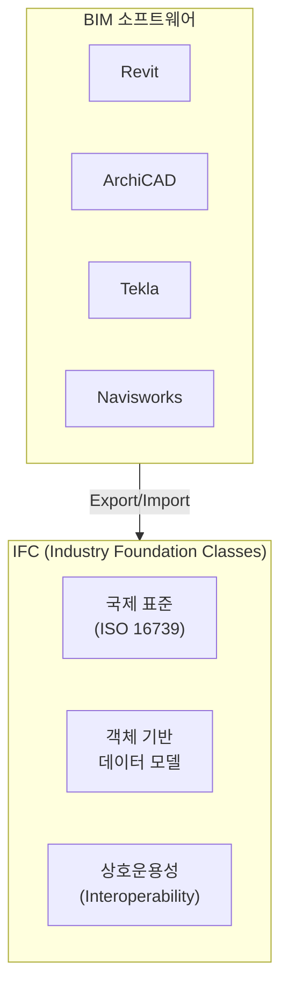
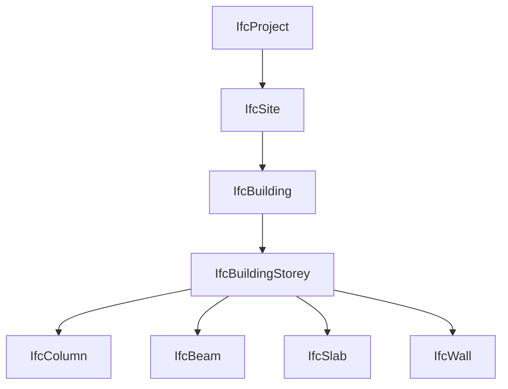
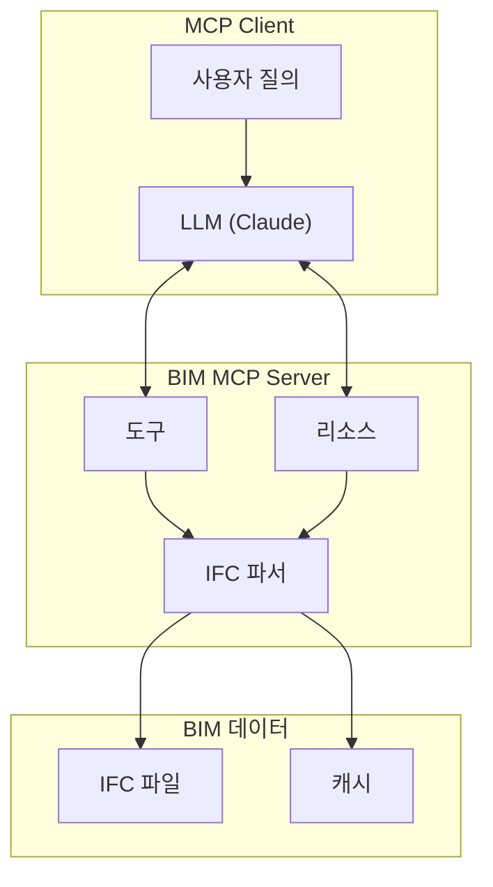

# 11주차: BIM과 IFC 데이터 활용

---

## 📌 강의 중점

- **IFC (Industry Foundation Classes)** 데이터 구조 이해
- **IFC 파싱**: Python으로 BIM 데이터 읽기
- **BIM-LLM 연동**: MCP 서버로 BIM 데이터 질의
- **구조 모델 분석**: 부재 정보 추출 및 검토

---

## 🎯 학습 목표

학습 완료 후 다음을 수행할 수 있습니다:

- IFC 파일의 구조와 데이터 체계를 이해할 수 있다
- Python으로 IFC 파일을 파싱하고 정보를 추출할 수 있다
- BIM 데이터를 활용한 MCP 서버를 구축할 수 있다
- LLM을 통해 BIM 모델을 자연어로 질의할 수 있다

---

## [Chapter 1] IFC 데이터 구조

### 1.1 IFC란?



**IFC의 특징**:
- **개방형 표준**: 특정 소프트웨어에 종속되지 않음
- **객체 기반**: 건축 요소를 객체로 표현
- **관계 정의**: 객체 간의 관계(포함, 연결 등) 표현
- **속성 집합**: 다양한 속성(Pset) 정의 가능

### 1.2 IFC 계층 구조



### 1.3 IFC 파일 형식

**STEP Physical File (SPF)** 형식:

```
ISO-10303-21;
HEADER;
FILE_DESCRIPTION(('ViewDefinition [CoordinationView]'),'2;1');
FILE_NAME('example.ifc','2024-01-01',('Author'),('Organization'),'','','');
FILE_SCHEMA(('IFC4'));
ENDSEC;
DATA;
#1=IFCPROJECT('0YvctVUKr0kugbFTf53O9L',$,'Example Project',$,$,$,$,$,#2);
#2=IFCUNITASSIGNMENT((#3,#4,#5));
#3=IFCSIUNIT(*,.LENGTHUNIT.,$,.METRE.);
#4=IFCSIUNIT(*,.AREAUNIT.,$,.SQUARE_METRE.);
#5=IFCSIUNIT(*,.VOLUMEUNIT.,$,.CUBIC_METRE.);
...
ENDSEC;
END-ISO-10303-21;
```

### 1.4 주요 IFC 엔티티

| 엔티티 | 설명 | 구조 관련 |
|--------|------|----------|
| `IfcProject` | 프로젝트 최상위 | - |
| `IfcBuilding` | 건물 | - |
| `IfcBuildingStorey` | 층 | - |
| `IfcColumn` | 기둥 | ✓ |
| `IfcBeam` | 보 | ✓ |
| `IfcSlab` | 슬래브 | ✓ |
| `IfcWall` | 벽체 | △ |
| `IfcFooting` | 기초 | ✓ |
| `IfcMember` | 일반 부재 | ✓ |

### 📚 참고 자료

- [buildingSMART IFC](https://www.buildingsmart.org/standards/bsi-standards/industry-foundation-classes/)
- [IFC Documentation](https://standards.buildingsmart.org/IFC/RELEASE/IFC4/ADD2_TC1/HTML/)
- [IFC Schema Viewer](https://technical.buildingsmart.org/standards/ifc/ifc-schema-specifications/)

---

## [Chapter 2] IFC 파싱 with Python

### 2.1 IfcOpenShell 설치 및 기본 사용

```bash
# 설치
pip install ifcopenshell
```

```python
import ifcopenshell
from typing import List, Dict, Any


def open_ifc(file_path: str) -> ifcopenshell.file:
    """IFC 파일 열기"""
    return ifcopenshell.open(file_path)


def get_project_info(ifc_file: ifcopenshell.file) -> Dict:
    """프로젝트 정보 추출"""
    project = ifc_file.by_type("IfcProject")[0]

    return {
        "name": project.Name,
        "description": project.Description,
        "global_id": project.GlobalId
    }


def get_building_info(ifc_file: ifcopenshell.file) -> List[Dict]:
    """건물 정보 추출"""
    buildings = []

    for building in ifc_file.by_type("IfcBuilding"):
        buildings.append({
            "name": building.Name,
            "global_id": building.GlobalId,
            "elevation": building.ElevationOfRefHeight
        })

    return buildings


def get_storeys(ifc_file: ifcopenshell.file) -> List[Dict]:
    """층 정보 추출"""
    storeys = []

    for storey in ifc_file.by_type("IfcBuildingStorey"):
        storeys.append({
            "name": storey.Name,
            "global_id": storey.GlobalId,
            "elevation": storey.Elevation
        })

    # 높이순 정렬
    storeys.sort(key=lambda x: x["elevation"] if x["elevation"] else 0)
    return storeys


# 사용 예시
ifc = open_ifc("sample_building.ifc")
print(f"프로젝트: {get_project_info(ifc)}")
print(f"층 수: {len(get_storeys(ifc))}")
```

### 2.2 구조 부재 추출

```python
import ifcopenshell
import ifcopenshell.util.element as element_util
from typing import List, Dict


class StructuralMemberExtractor:
    """구조 부재 추출기"""

    def __init__(self, ifc_file: ifcopenshell.file):
        self.ifc = ifc_file

    def get_columns(self) -> List[Dict]:
        """기둥 정보 추출"""
        columns = []

        for col in self.ifc.by_type("IfcColumn"):
            col_info = {
                "global_id": col.GlobalId,
                "name": col.Name,
                "type": self._get_type_name(col),
                "material": self._get_material(col),
                "location": self._get_location(col),
                "properties": self._get_properties(col)
            }
            columns.append(col_info)

        return columns

    def get_beams(self) -> List[Dict]:
        """보 정보 추출"""
        beams = []

        for beam in self.ifc.by_type("IfcBeam"):
            beam_info = {
                "global_id": beam.GlobalId,
                "name": beam.Name,
                "type": self._get_type_name(beam),
                "material": self._get_material(beam),
                "location": self._get_location(beam),
                "properties": self._get_properties(beam)
            }
            beams.append(beam_info)

        return beams

    def get_slabs(self) -> List[Dict]:
        """슬래브 정보 추출"""
        slabs = []

        for slab in self.ifc.by_type("IfcSlab"):
            slab_info = {
                "global_id": slab.GlobalId,
                "name": slab.Name,
                "type": self._get_type_name(slab),
                "material": self._get_material(slab),
                "properties": self._get_properties(slab)
            }
            slabs.append(slab_info)

        return slabs

    def _get_type_name(self, element) -> str:
        """부재 유형명 추출"""
        element_type = element_util.get_type(element)
        if element_type:
            return element_type.Name
        return "Unknown"

    def _get_material(self, element) -> str:
        """재료 정보 추출"""
        try:
            material = ifcopenshell.util.element.get_material(element)
            if material:
                if hasattr(material, "Name"):
                    return material.Name
                elif hasattr(material, "Materials"):
                    return ", ".join([m.Name for m in material.Materials if m.Name])
        except:
            pass
        return "Unknown"

    def _get_location(self, element) -> Dict:
        """위치 정보 추출"""
        try:
            placement = element.ObjectPlacement
            if placement and hasattr(placement, "RelativePlacement"):
                loc = placement.RelativePlacement.Location
                return {
                    "x": loc.Coordinates[0],
                    "y": loc.Coordinates[1],
                    "z": loc.Coordinates[2] if len(loc.Coordinates) > 2 else 0
                }
        except:
            pass
        return {"x": 0, "y": 0, "z": 0}

    def _get_properties(self, element) -> Dict:
        """속성 정보 추출"""
        props = {}

        # Property Set 추출
        for rel in element.IsDefinedBy:
            if rel.is_a("IfcRelDefinesByProperties"):
                pset = rel.RelatingPropertyDefinition
                if pset.is_a("IfcPropertySet"):
                    for prop in pset.HasProperties:
                        if hasattr(prop, "NominalValue") and prop.NominalValue:
                            props[prop.Name] = prop.NominalValue.wrappedValue

        return props

    def get_summary(self) -> Dict:
        """전체 구조 부재 요약"""
        return {
            "columns": len(self.get_columns()),
            "beams": len(self.get_beams()),
            "slabs": len(self.get_slabs()),
            "total": (
                len(self.ifc.by_type("IfcColumn")) +
                len(self.ifc.by_type("IfcBeam")) +
                len(self.ifc.by_type("IfcSlab"))
            )
        }


# 사용 예시
ifc = ifcopenshell.open("structural_model.ifc")
extractor = StructuralMemberExtractor(ifc)

print("부재 요약:", extractor.get_summary())

columns = extractor.get_columns()
for col in columns[:5]:
    print(f"기둥: {col['name']}, 유형: {col['type']}, 재료: {col['material']}")
```

### 2.3 지오메트리 분석

```python
import ifcopenshell
import ifcopenshell.geom
from typing import Dict, Tuple


def get_bounding_box(element) -> Dict:
    """부재의 바운딩 박스 계산"""
    try:
        settings = ifcopenshell.geom.settings()
        shape = ifcopenshell.geom.create_shape(settings, element)
        verts = shape.geometry.verts

        # 좌표 추출
        x_coords = verts[0::3]
        y_coords = verts[1::3]
        z_coords = verts[2::3]

        return {
            "min_x": min(x_coords),
            "max_x": max(x_coords),
            "min_y": min(y_coords),
            "max_y": max(y_coords),
            "min_z": min(z_coords),
            "max_z": max(z_coords),
            "width": max(x_coords) - min(x_coords),
            "depth": max(y_coords) - min(y_coords),
            "height": max(z_coords) - min(z_coords)
        }
    except:
        return None


def get_member_dimensions(element) -> Dict:
    """부재 치수 추출 (Profile 기반)"""
    dimensions = {}

    # IfcProfileDef에서 치수 추출 시도
    try:
        for rep in element.Representation.Representations:
            for item in rep.Items:
                if hasattr(item, "SweptArea"):
                    profile = item.SweptArea

                    if profile.is_a("IfcRectangleProfileDef"):
                        dimensions["width"] = profile.XDim
                        dimensions["height"] = profile.YDim
                        dimensions["profile_type"] = "Rectangle"

                    elif profile.is_a("IfcIShapeProfileDef"):
                        dimensions["overall_width"] = profile.OverallWidth
                        dimensions["overall_depth"] = profile.OverallDepth
                        dimensions["web_thickness"] = profile.WebThickness
                        dimensions["flange_thickness"] = profile.FlangeThickness
                        dimensions["profile_type"] = "I-Shape"

                    elif profile.is_a("IfcCircleProfileDef"):
                        dimensions["radius"] = profile.Radius
                        dimensions["profile_type"] = "Circle"
    except:
        pass

    return dimensions


# 사용 예시
ifc = ifcopenshell.open("structural_model.ifc")
for column in ifc.by_type("IfcColumn")[:3]:
    dims = get_member_dimensions(column)
    bbox = get_bounding_box(column)
    print(f"기둥 {column.Name}:")
    print(f"  치수: {dims}")
    print(f"  바운딩박스: {bbox}")
```

### 📚 참고 자료

- [IfcOpenShell Documentation](https://blenderbim.org/docs-python/ifcopenshell/)
- [IfcOpenShell GitHub](https://github.com/IfcOpenShell/IfcOpenShell)
- [BlenderBIM](https://blenderbim.org/)

---

## [Chapter 3] BIM MCP 서버 구축

### 3.1 BIM MCP 서버 아키텍처



### 3.2 BIM MCP 서버 구현

```python
# bim_mcp_server.py
"""BIM 데이터 MCP 서버"""

from mcp.server import Server
from mcp.server.stdio import stdio_server
from mcp.types import Tool, TextContent, Resource
import ifcopenshell
import json
import asyncio
from typing import Dict, List, Optional
from pathlib import Path


server = Server("bim-ifc-server")

# 전역 IFC 파일 캐시
ifc_cache: Dict[str, ifcopenshell.file] = {}


def load_ifc(file_path: str) -> ifcopenshell.file:
    """IFC 파일 로드 (캐시 사용)"""
    if file_path not in ifc_cache:
        ifc_cache[file_path] = ifcopenshell.open(file_path)
    return ifc_cache[file_path]


# 도구 정의
@server.list_tools()
async def list_tools():
    return [
        Tool(
            name="get_project_info",
            description="IFC 파일의 프로젝트 정보를 조회합니다",
            inputSchema={
                "type": "object",
                "properties": {
                    "file_path": {
                        "type": "string",
                        "description": "IFC 파일 경로"
                    }
                },
                "required": ["file_path"]
            }
        ),
        Tool(
            name="list_structural_members",
            description="구조 부재 목록을 조회합니다 (기둥, 보, 슬래브)",
            inputSchema={
                "type": "object",
                "properties": {
                    "file_path": {"type": "string"},
                    "member_type": {
                        "type": "string",
                        "enum": ["column", "beam", "slab", "all"],
                        "description": "부재 유형"
                    },
                    "storey": {
                        "type": "string",
                        "description": "특정 층 필터 (선택)"
                    }
                },
                "required": ["file_path", "member_type"]
            }
        ),
        Tool(
            name="get_member_details",
            description="특정 부재의 상세 정보를 조회합니다",
            inputSchema={
                "type": "object",
                "properties": {
                    "file_path": {"type": "string"},
                    "member_name": {
                        "type": "string",
                        "description": "부재명 또는 GlobalId"
                    }
                },
                "required": ["file_path", "member_name"]
            }
        ),
        Tool(
            name="search_by_property",
            description="속성값으로 부재를 검색합니다",
            inputSchema={
                "type": "object",
                "properties": {
                    "file_path": {"type": "string"},
                    "property_name": {"type": "string"},
                    "property_value": {"type": "string"}
                },
                "required": ["file_path", "property_name"]
            }
        ),
        Tool(
            name="get_model_statistics",
            description="BIM 모델의 통계 정보를 반환합니다",
            inputSchema={
                "type": "object",
                "properties": {
                    "file_path": {"type": "string"}
                },
                "required": ["file_path"]
            }
        )
    ]


@server.call_tool()
async def call_tool(name: str, arguments: dict):
    try:
        file_path = arguments.get("file_path", "")

        if not Path(file_path).exists():
            return [TextContent(type="text", text=f"파일을 찾을 수 없습니다: {file_path}")]

        ifc = load_ifc(file_path)

        if name == "get_project_info":
            return await get_project_info(ifc)

        elif name == "list_structural_members":
            member_type = arguments.get("member_type", "all")
            storey = arguments.get("storey")
            return await list_structural_members(ifc, member_type, storey)

        elif name == "get_member_details":
            member_name = arguments.get("member_name")
            return await get_member_details(ifc, member_name)

        elif name == "search_by_property":
            prop_name = arguments.get("property_name")
            prop_value = arguments.get("property_value")
            return await search_by_property(ifc, prop_name, prop_value)

        elif name == "get_model_statistics":
            return await get_model_statistics(ifc)

    except Exception as e:
        return [TextContent(type="text", text=f"오류 발생: {str(e)}")]


async def get_project_info(ifc: ifcopenshell.file):
    """프로젝트 정보 조회"""
    project = ifc.by_type("IfcProject")[0]
    buildings = ifc.by_type("IfcBuilding")
    storeys = ifc.by_type("IfcBuildingStorey")

    info = {
        "project_name": project.Name,
        "description": project.Description,
        "buildings": len(buildings),
        "storeys": len(storeys),
        "storey_list": [s.Name for s in storeys]
    }

    return [TextContent(type="text", text=json.dumps(info, ensure_ascii=False, indent=2))]


async def list_structural_members(ifc: ifcopenshell.file, member_type: str, storey: Optional[str]):
    """구조 부재 목록"""
    type_map = {
        "column": "IfcColumn",
        "beam": "IfcBeam",
        "slab": "IfcSlab"
    }

    members = []

    if member_type == "all":
        types = ["IfcColumn", "IfcBeam", "IfcSlab"]
    else:
        types = [type_map.get(member_type, "IfcColumn")]

    for ifc_type in types:
        for element in ifc.by_type(ifc_type):
            member_info = {
                "name": element.Name,
                "type": ifc_type.replace("Ifc", ""),
                "global_id": element.GlobalId
            }

            # 층 정보 추출
            for rel in element.ContainedInStructure:
                if rel.RelatingStructure.is_a("IfcBuildingStorey"):
                    member_info["storey"] = rel.RelatingStructure.Name
                    break

            # 층 필터링
            if storey and member_info.get("storey") != storey:
                continue

            members.append(member_info)

    return [TextContent(type="text", text=json.dumps({
        "count": len(members),
        "members": members[:50]  # 최대 50개
    }, ensure_ascii=False, indent=2))]


async def get_member_details(ifc: ifcopenshell.file, member_name: str):
    """부재 상세 정보"""
    # 이름 또는 GlobalId로 검색
    element = None
    for etype in ["IfcColumn", "IfcBeam", "IfcSlab", "IfcMember"]:
        for e in ifc.by_type(etype):
            if e.Name == member_name or e.GlobalId == member_name:
                element = e
                break
        if element:
            break

    if not element:
        return [TextContent(type="text", text=f"부재를 찾을 수 없습니다: {member_name}")]

    # 상세 정보 수집
    details = {
        "name": element.Name,
        "type": element.is_a(),
        "global_id": element.GlobalId,
        "properties": {}
    }

    # 속성 추출
    for rel in element.IsDefinedBy:
        if rel.is_a("IfcRelDefinesByProperties"):
            pset = rel.RelatingPropertyDefinition
            if pset.is_a("IfcPropertySet"):
                for prop in pset.HasProperties:
                    if hasattr(prop, "NominalValue") and prop.NominalValue:
                        details["properties"][prop.Name] = str(prop.NominalValue.wrappedValue)

    return [TextContent(type="text", text=json.dumps(details, ensure_ascii=False, indent=2))]


async def search_by_property(ifc: ifcopenshell.file, prop_name: str, prop_value: Optional[str]):
    """속성으로 검색"""
    results = []

    for element in ifc.by_type("IfcElement"):
        for rel in element.IsDefinedBy:
            if rel.is_a("IfcRelDefinesByProperties"):
                pset = rel.RelatingPropertyDefinition
                if pset.is_a("IfcPropertySet"):
                    for prop in pset.HasProperties:
                        if prop.Name == prop_name:
                            if hasattr(prop, "NominalValue") and prop.NominalValue:
                                value = str(prop.NominalValue.wrappedValue)
                                if prop_value is None or prop_value.lower() in value.lower():
                                    results.append({
                                        "name": element.Name,
                                        "type": element.is_a(),
                                        prop_name: value
                                    })

    return [TextContent(type="text", text=json.dumps({
        "count": len(results),
        "results": results[:20]
    }, ensure_ascii=False, indent=2))]


async def get_model_statistics(ifc: ifcopenshell.file):
    """모델 통계"""
    stats = {
        "entity_counts": {}
    }

    # 주요 엔티티 카운트
    entity_types = [
        "IfcColumn", "IfcBeam", "IfcSlab", "IfcWall",
        "IfcFooting", "IfcStair", "IfcDoor", "IfcWindow"
    ]

    for etype in entity_types:
        count = len(ifc.by_type(etype))
        if count > 0:
            stats["entity_counts"][etype.replace("Ifc", "")] = count

    stats["total_elements"] = sum(stats["entity_counts"].values())
    stats["storeys"] = len(ifc.by_type("IfcBuildingStorey"))

    return [TextContent(type="text", text=json.dumps(stats, ensure_ascii=False, indent=2))]


# 리소스 정의
@server.list_resources()
async def list_resources():
    return [
        Resource(
            uri="ifc://schema",
            name="IFC 스키마 정보",
            description="IFC 엔티티 타입 및 관계 정보",
            mimeType="application/json"
        )
    ]


@server.read_resource()
async def read_resource(uri: str):
    if uri == "ifc://schema":
        schema_info = {
            "structural_entities": ["IfcColumn", "IfcBeam", "IfcSlab", "IfcMember", "IfcFooting"],
            "architectural_entities": ["IfcWall", "IfcDoor", "IfcWindow", "IfcStair"],
            "common_properties": ["Name", "GlobalId", "ObjectType", "Description"]
        }
        return json.dumps(schema_info, ensure_ascii=False, indent=2)

    raise ValueError(f"Resource not found: {uri}")


async def main():
    async with stdio_server() as (read, write):
        await server.run(read, write)


if __name__ == "__main__":
    asyncio.run(main())
```

### 📚 참고 자료

- [MCP Python SDK](https://github.com/modelcontextprotocol/python-sdk)
- [IfcOpenShell Python](https://blenderbim.org/docs-python/)

---

## [Chapter 4] LLM을 통한 BIM 질의

### 4.1 자연어 BIM 질의

```python
import anthropic
import json
from typing import Dict


class BIMAssistant:
    """BIM 데이터 자연어 질의 어시스턴트"""

    def __init__(self, ifc_extractor):
        self.extractor = ifc_extractor
        self.client = anthropic.Anthropic()

    def query(self, question: str) -> str:
        """자연어 질문에 대한 답변"""

        # BIM 데이터 컨텍스트 생성
        context = self._build_context()

        prompt = f"""당신은 BIM 모델 분석 전문가입니다.
다음 BIM 모델 정보를 기반으로 질문에 답변해 주세요.

## BIM 모델 정보
{context}

## 질문
{question}

## 답변 지침
- 구체적인 수치와 부재명을 포함하세요
- 모델 데이터에 없는 정보는 "모델에서 확인할 수 없음"이라고 답변하세요
- 가능한 경우 표 형식으로 정리하세요
"""

        response = self.client.messages.create(
            model="claude-3-5-sonnet-20241022",
            max_tokens=2000,
            messages=[{"role": "user", "content": prompt}]
        )

        return response.content[0].text

    def _build_context(self) -> str:
        """BIM 데이터 컨텍스트 생성"""
        summary = self.extractor.get_summary()
        columns = self.extractor.get_columns()[:10]
        beams = self.extractor.get_beams()[:10]

        context_parts = [
            f"부재 통계: 기둥 {summary['columns']}개, 보 {summary['beams']}개, 슬래브 {summary['slabs']}개",
            "\n기둥 목록 (상위 10개):",
        ]

        for col in columns:
            context_parts.append(f"- {col['name']}: {col['type']}, {col['material']}")

        context_parts.append("\n보 목록 (상위 10개):")
        for beam in beams:
            context_parts.append(f"- {beam['name']}: {beam['type']}, {beam['material']}")

        return "\n".join(context_parts)


# 사용 예시
# extractor = StructuralMemberExtractor(ifc_file)
# assistant = BIMAssistant(extractor)
# answer = assistant.query("이 건물의 기둥은 몇 개이고, 주로 어떤 단면을 사용하나요?")
```

### 4.2 부재 검토 자동화

```python
class BIMReviewer:
    """BIM 모델 자동 검토"""

    def __init__(self, ifc_file):
        self.ifc = ifc_file
        self.client = anthropic.Anthropic()
        self.extractor = StructuralMemberExtractor(ifc_file)

    def review_columns(self) -> Dict:
        """기둥 검토"""
        columns = self.extractor.get_columns()

        # 단면 통계
        section_counts = {}
        material_counts = {}

        for col in columns:
            section = col.get("type", "Unknown")
            material = col.get("material", "Unknown")

            section_counts[section] = section_counts.get(section, 0) + 1
            material_counts[material] = material_counts.get(material, 0) + 1

        return {
            "total_count": len(columns),
            "section_distribution": section_counts,
            "material_distribution": material_counts
        }

    def check_consistency(self) -> Dict:
        """일관성 검토"""
        issues = []

        columns = self.extractor.get_columns()

        # 이름 없는 부재 체크
        unnamed = [c for c in columns if not c.get("name")]
        if unnamed:
            issues.append({
                "type": "naming",
                "severity": "warning",
                "message": f"이름이 없는 기둥 {len(unnamed)}개 발견"
            })

        # 재료 미지정 체크
        no_material = [c for c in columns if c.get("material") == "Unknown"]
        if no_material:
            issues.append({
                "type": "material",
                "severity": "error",
                "message": f"재료가 지정되지 않은 기둥 {len(no_material)}개 발견"
            })

        return {
            "issues_count": len(issues),
            "issues": issues
        }

    def generate_report(self) -> str:
        """검토 보고서 생성"""
        column_review = self.review_columns()
        consistency = self.check_consistency()

        prompt = f"""다음 BIM 모델 검토 결과를 바탕으로 검토 보고서를 작성해 주세요.

## 기둥 검토 결과
{json.dumps(column_review, ensure_ascii=False, indent=2)}

## 일관성 검토 결과
{json.dumps(consistency, ensure_ascii=False, indent=2)}

## 보고서 형식
1. 개요
2. 부재 현황
3. 발견된 이슈
4. 권고사항
"""

        response = self.client.messages.create(
            model="claude-3-5-sonnet-20241022",
            max_tokens=2000,
            messages=[{"role": "user", "content": prompt}]
        )

        return response.content[0].text
```

---

## 💻 실습 코드

### 실습: IFC 분석 도구

```python
# practice/ifc_analyzer.py
"""IFC 분석 도구"""

import ifcopenshell
import json
from pathlib import Path


def analyze_ifc(file_path: str) -> dict:
    """IFC 파일 종합 분석"""
    ifc = ifcopenshell.open(file_path)

    analysis = {
        "file_info": {
            "path": file_path,
            "schema": ifc.schema
        },
        "project": {},
        "structure": {
            "storeys": [],
            "columns": [],
            "beams": [],
            "slabs": []
        },
        "statistics": {}
    }

    # 프로젝트 정보
    project = ifc.by_type("IfcProject")[0]
    analysis["project"] = {
        "name": project.Name,
        "description": project.Description
    }

    # 층 정보
    for storey in ifc.by_type("IfcBuildingStorey"):
        analysis["structure"]["storeys"].append({
            "name": storey.Name,
            "elevation": storey.Elevation
        })

    # 구조 부재
    for col in ifc.by_type("IfcColumn")[:20]:
        analysis["structure"]["columns"].append({
            "name": col.Name,
            "global_id": col.GlobalId
        })

    for beam in ifc.by_type("IfcBeam")[:20]:
        analysis["structure"]["beams"].append({
            "name": beam.Name,
            "global_id": beam.GlobalId
        })

    # 통계
    analysis["statistics"] = {
        "columns": len(ifc.by_type("IfcColumn")),
        "beams": len(ifc.by_type("IfcBeam")),
        "slabs": len(ifc.by_type("IfcSlab")),
        "walls": len(ifc.by_type("IfcWall")),
        "storeys": len(ifc.by_type("IfcBuildingStorey"))
    }

    return analysis


if __name__ == "__main__":
    import sys

    if len(sys.argv) > 1:
        result = analyze_ifc(sys.argv[1])
        print(json.dumps(result, ensure_ascii=False, indent=2))
    else:
        print("Usage: python ifc_analyzer.py <ifc_file>")
```

---

## 📝 과제

### 과제 1: IFC 파싱 (제출)

IFC 파일에서 구조 부재 정보 추출:

**요구사항**:
1. 기둥, 보, 슬래브 추출
2. 부재별 단면, 재료 정보 포함
3. JSON 형식으로 출력

**제출물**: 코드, 샘플 IFC, 추출 결과

### 과제 2: BIM MCP 서버 (제출)

BIM 데이터 조회 MCP 서버:

**요구사항**:
1. 최소 3개 도구 구현
2. 자연어 질의 지원
3. Claude Desktop 연동 테스트

**제출물**: 서버 코드, 테스트 결과

---

## 🔗 추가 학습 자료

- [IfcOpenShell](https://ifcopenshell.org/)
- [buildingSMART IFC](https://www.buildingsmart.org/)
- [BlenderBIM Add-on](https://blenderbim.org/)

---

## 🚀 발전 전략 (Development Strategies)

### 전략 1: 실전 IFC 파일 다루기 (Real-World IFC Practice)

**목표**: 다양한 BIM 소프트웨어에서 생성된 실제 IFC 파일을 분석하고 처리하는 능력 습득

**실습 단계**:
```python
# Step 1: IFC 버전 및 소프트웨어 호환성 분석
def analyze_ifc_source(ifc_file):
    """IFC 파일의 출처 및 버전 분석"""
    print(f"Schema: {ifc_file.schema}")

    # 파일 생성 소프트웨어 확인
    header = ifc_file.wrapped_data.header
    print(f"생성 소프트웨어: {header.file_name.originating_system}")
    print(f"생성일: {header.file_name.time_stamp}")

    # IFC 버전별 차이점 확인
    if ifc_file.schema == "IFC2X3":
        print("구버전 IFC - 일부 최신 엔티티 미지원 가능")
    elif ifc_file.schema == "IFC4":
        print("최신 IFC4 - 전체 기능 지원")

# Step 2: 소프트웨어별 IFC Export 설정 최적화
"""
Revit Export 설정:
- Level of Detail: Medium/High
- Split by Building Storey: 체크
- Export Base Quantities: 체크 (물량 정보 포함)

ArchiCAD Export 설정:
- Geometry: Tessellated/BRep
- Properties: All or Custom
- Export GUID: 체크

Tekla Export 설정:
- Export all: 체크
- Include assembly structures: 체크
- Export model objects only: 해제 (속성 포함)
"""

# Step 3: 실전 데이터 처리
def extract_structural_data_robust(ifc_file):
    """다양한 IFC 파일에서 안정적으로 데이터 추출"""
    results = {
        "structural_members": [],
        "errors": []
    }

    try:
        for element_type in ["IfcColumn", "IfcBeam", "IfcSlab"]:
            for element in ifc_file.by_type(element_type):
                try:
                    member_data = {
                        "name": element.Name or "Unnamed",
                        "type": element_type,
                        "global_id": element.GlobalId,
                    }

                    # 안전한 속성 추출 (속성이 없을 수도 있음)
                    try:
                        member_data["material"] = get_material_safe(element)
                    except:
                        member_data["material"] = "Not specified"

                    results["structural_members"].append(member_data)

                except Exception as e:
                    results["errors"].append({
                        "element": element.GlobalId,
                        "error": str(e)
                    })
    except Exception as e:
        results["errors"].append({"global_error": str(e)})

    return results
```

**실전 과제**:
1. Revit, ArchiCAD, Tekla에서 각각 Export한 동일 모델 비교
2. 소프트웨어별 속성 차이 분석 (Pset 구조 비교)
3. 호환성 이슈 문서화 및 해결 방법 정리

### 전략 2: 구조 검토 자동화 워크플로우 (Automated Structural Review)

**목표**: BIM 모델의 구조 부재를 자동으로 검토하고 설계 기준 적합성을 판단

**실습 코드**:
```python
# structural_review_automation.py
import ifcopenshell
from dataclasses import dataclass
from typing import List, Dict
import json

@dataclass
class StructuralReviewCriteria:
    """구조 검토 기준"""
    min_column_size: float = 400.0  # mm
    max_column_spacing: float = 8000.0  # mm
    min_beam_depth: float = 300.0  # mm
    max_slab_thickness: float = 300.0  # mm
    required_material: str = "Concrete"

class StructuralReviewer:
    """구조 부재 자동 검토 시스템"""

    def __init__(self, ifc_file, criteria: StructuralReviewCriteria):
        self.ifc = ifc_file
        self.criteria = criteria
        self.issues = []

    def review_column_dimensions(self) -> List[Dict]:
        """기둥 치수 검토"""
        column_issues = []

        for column in self.ifc.by_type("IfcColumn"):
            dims = self.get_member_dimensions(column)

            if dims and "width" in dims:
                if dims["width"] < self.criteria.min_column_size:
                    column_issues.append({
                        "member": column.Name,
                        "issue": "기둥 단면 과소",
                        "current": f"{dims['width']}mm",
                        "required": f"최소 {self.criteria.min_column_size}mm",
                        "severity": "Critical"
                    })

        return column_issues

    def review_column_spacing(self) -> List[Dict]:
        """기둥 간격 검토"""
        spacing_issues = []
        columns = list(self.ifc.by_type("IfcColumn"))

        # 각 층별로 기둥 그룹화
        storeys = {}
        for col in columns:
            storey = self.get_storey(col)
            if storey:
                if storey not in storeys:
                    storeys[storey] = []
                location = self.get_location(col)
                storeys[storey].append({
                    "name": col.Name,
                    "x": location["x"],
                    "y": location["y"]
                })

        # 층별 최대 간격 체크
        for storey_name, cols in storeys.items():
            if len(cols) >= 2:
                max_spacing = self.calculate_max_spacing(cols)
                if max_spacing > self.criteria.max_column_spacing:
                    spacing_issues.append({
                        "storey": storey_name,
                        "issue": "기둥 간격 과다",
                        "max_spacing": f"{max_spacing:.0f}mm",
                        "limit": f"{self.criteria.max_column_spacing}mm",
                        "severity": "Warning"
                    })

        return spacing_issues

    def review_material_compliance(self) -> List[Dict]:
        """재료 적합성 검토"""
        material_issues = []

        for element_type in ["IfcColumn", "IfcBeam"]:
            for element in self.ifc.by_type(element_type):
                material = self.get_material(element)

                if self.criteria.required_material.lower() not in material.lower():
                    material_issues.append({
                        "member": element.Name,
                        "type": element_type.replace("Ifc", ""),
                        "issue": "재료 부적합",
                        "current": material,
                        "required": self.criteria.required_material,
                        "severity": "Critical"
                    })

        return material_issues

    def calculate_max_spacing(self, columns: List[Dict]) -> float:
        """기둥 간 최대 거리 계산"""
        max_dist = 0.0
        for i, col1 in enumerate(columns):
            for col2 in columns[i+1:]:
                dist = ((col1["x"] - col2["x"])**2 +
                       (col1["y"] - col2["y"])**2)**0.5
                max_dist = max(max_dist, dist)
        return max_dist

    def generate_review_report(self) -> Dict:
        """종합 검토 보고서 생성"""
        report = {
            "project": self.ifc.by_type("IfcProject")[0].Name,
            "review_date": "2024-01-01",
            "criteria": {
                "min_column_size": self.criteria.min_column_size,
                "max_column_spacing": self.criteria.max_column_spacing,
                "required_material": self.criteria.required_material
            },
            "results": {
                "column_dimensions": self.review_column_dimensions(),
                "column_spacing": self.review_column_spacing(),
                "material_compliance": self.review_material_compliance()
            }
        }

        # 전체 이슈 카운트
        total_critical = sum(
            1 for issues in report["results"].values()
            for issue in issues
            if issue.get("severity") == "Critical"
        )
        total_warnings = sum(
            1 for issues in report["results"].values()
            for issue in issues
            if issue.get("severity") == "Warning"
        )

        report["summary"] = {
            "total_critical": total_critical,
            "total_warnings": total_warnings,
            "status": "FAIL" if total_critical > 0 else "PASS"
        }

        return report

    # 헬퍼 메서드들
    def get_member_dimensions(self, element):
        # 이전 예제의 get_member_dimensions 사용
        pass

    def get_storey(self, element):
        # 부재가 속한 층 반환
        pass

    def get_location(self, element):
        # 부재 위치 반환
        pass

    def get_material(self, element):
        # 부재 재료 반환
        pass

# 사용 예시
ifc = ifcopenshell.open("structural_model.ifc")
criteria = StructuralReviewCriteria(
    min_column_size=450.0,
    max_column_spacing=7500.0,
    required_material="Concrete"
)

reviewer = StructuralReviewer(ifc, criteria)
report = reviewer.generate_review_report()

# JSON 보고서 저장
with open("review_report.json", "w", encoding="utf-8") as f:
    json.dump(report, f, ensure_ascii=False, indent=2)

print(f"검토 완료: {report['summary']['status']}")
print(f"Critical 이슈: {report['summary']['total_critical']}개")
```

**실전 과제**:
1. 실제 프로젝트의 설계 기준에 맞춘 검토 기준 설정
2. 건축구조기준(KDS) 또는 건축법 기반 자동 검토 룰 추가
3. HTML 형식의 시각적 검토 보고서 생성

### 전략 3: BIM MCP 서버 고급 기능 구현 (Advanced BIM MCP Features)

**목표**: 단순 조회를 넘어 분석, 비교, 변경 추적 기능을 갖춘 고급 MCP 서버 구축

**고급 도구 구현**:
```python
# advanced_bim_mcp_server.py
from mcp.server import Server
from mcp.types import Tool, TextContent
import ifcopenshell
import json
from typing import List, Dict, Optional
from datetime import datetime

server = Server("advanced-bim-server")

@server.list_tools()
async def list_tools():
    return [
        # 기본 도구 외 추가
        Tool(
            name="compare_models",
            description="두 IFC 모델을 비교하여 변경사항을 추출합니다",
            inputSchema={
                "type": "object",
                "properties": {
                    "original_path": {"type": "string"},
                    "modified_path": {"type": "string"},
                    "compare_type": {
                        "type": "string",
                        "enum": ["members", "properties", "geometry", "all"]
                    }
                },
                "required": ["original_path", "modified_path"]
            }
        ),
        Tool(
            name="calculate_quantities",
            description="구조 부재의 물량을 계산합니다 (콘크리트, 철근량 등)",
            inputSchema={
                "type": "object",
                "properties": {
                    "file_path": {"type": "string"},
                    "member_types": {
                        "type": "array",
                        "items": {"type": "string"}
                    },
                    "unit": {
                        "type": "string",
                        "enum": ["m3", "ton", "m2"]
                    }
                },
                "required": ["file_path"]
            }
        ),
        Tool(
            name="export_schedule",
            description="부재 일람표를 Excel 또는 CSV로 Export합니다",
            inputSchema={
                "type": "object",
                "properties": {
                    "file_path": {"type": "string"},
                    "member_type": {"type": "string"},
                    "format": {"type": "string", "enum": ["csv", "excel"]},
                    "output_path": {"type": "string"}
                },
                "required": ["file_path", "member_type", "output_path"]
            }
        ),
        Tool(
            name="spatial_query",
            description="공간 기반 부재 검색 (특정 영역 내 부재 찾기)",
            inputSchema={
                "type": "object",
                "properties": {
                    "file_path": {"type": "string"},
                    "bbox": {
                        "type": "object",
                        "properties": {
                            "min_x": {"type": "number"},
                            "max_x": {"type": "number"},
                            "min_y": {"type": "number"},
                            "max_y": {"type": "number"},
                            "min_z": {"type": "number"},
                            "max_z": {"type": "number"}
                        }
                    }
                },
                "required": ["file_path", "bbox"]
            }
        ),
        Tool(
            name="clash_detection",
            description="구조 부재 간 충돌 검사 (간단한 바운딩박스 기반)",
            inputSchema={
                "type": "object",
                "properties": {
                    "file_path": {"type": "string"},
                    "tolerance": {
                        "type": "number",
                        "description": "충돌 판정 허용 오차 (mm)"
                    }
                },
                "required": ["file_path"]
            }
        )
    ]

@server.call_tool()
async def call_tool(name: str, arguments: dict):
    if name == "compare_models":
        return await compare_models(arguments)
    elif name == "calculate_quantities":
        return await calculate_quantities(arguments)
    elif name == "export_schedule":
        return await export_schedule(arguments)
    elif name == "spatial_query":
        return await spatial_query(arguments)
    elif name == "clash_detection":
        return await clash_detection(arguments)

async def compare_models(args: dict):
    """모델 비교 구현"""
    original = ifcopenshell.open(args["original_path"])
    modified = ifcopenshell.open(args["modified_path"])

    changes = {
        "added": [],
        "removed": [],
        "modified": []
    }

    # GlobalId 기반 비교
    original_ids = {e.GlobalId for e in original.by_type("IfcColumn")}
    modified_ids = {e.GlobalId for e in modified.by_type("IfcColumn")}

    changes["added"] = list(modified_ids - original_ids)
    changes["removed"] = list(original_ids - modified_ids)

    # 공통 부재의 속성 변경 체크
    common_ids = original_ids & modified_ids
    for gid in common_ids:
        orig_elem = original.by_guid(gid)
        mod_elem = modified.by_guid(gid)

        if orig_elem.Name != mod_elem.Name:
            changes["modified"].append({
                "global_id": gid,
                "property": "Name",
                "old_value": orig_elem.Name,
                "new_value": mod_elem.Name
            })

    return [TextContent(
        type="text",
        text=json.dumps(changes, ensure_ascii=False, indent=2)
    )]

async def calculate_quantities(args: dict):
    """물량 계산 구현"""
    ifc = ifcopenshell.open(args["file_path"])

    quantities = {
        "concrete_volume_m3": 0.0,
        "formwork_area_m2": 0.0,
        "member_breakdown": {}
    }

    # 기둥 콘크리트 물량
    for col in ifc.by_type("IfcColumn"):
        try:
            # IfcQuantitySet에서 Volume 추출
            for rel in col.IsDefinedBy:
                if rel.is_a("IfcRelDefinesByProperties"):
                    qset = rel.RelatingPropertyDefinition
                    if qset.is_a("IfcElementQuantity"):
                        for qty in qset.Quantities:
                            if qty.Name == "Volume":
                                vol = qty.VolumeValue
                                quantities["concrete_volume_m3"] += vol

                                col_type = col.Name or "Unknown"
                                if col_type not in quantities["member_breakdown"]:
                                    quantities["member_breakdown"][col_type] = {
                                        "count": 0,
                                        "volume_m3": 0.0
                                    }
                                quantities["member_breakdown"][col_type]["count"] += 1
                                quantities["member_breakdown"][col_type]["volume_m3"] += vol
        except:
            pass

    return [TextContent(
        type="text",
        text=json.dumps(quantities, ensure_ascii=False, indent=2)
    )]

async def spatial_query(args: dict):
    """공간 검색 구현"""
    ifc = ifcopenshell.open(args["file_path"])
    bbox = args["bbox"]

    results = []

    for element in ifc.by_type("IfcColumn"):
        try:
            loc = get_location(element)

            if (bbox["min_x"] <= loc["x"] <= bbox["max_x"] and
                bbox["min_y"] <= loc["y"] <= bbox["max_y"] and
                bbox["min_z"] <= loc["z"] <= bbox["max_z"]):

                results.append({
                    "name": element.Name,
                    "type": "Column",
                    "location": loc
                })
        except:
            pass

    return [TextContent(
        type="text",
        text=json.dumps({
            "count": len(results),
            "members": results
        }, ensure_ascii=False, indent=2)
    )]

# 헬퍼 함수
def get_location(element):
    """부재 위치 추출"""
    # 이전 예제 코드 활용
    pass
```

**실전 과제**:
1. 모델 비교 기능으로 설계 변경 이력 관리 시스템 구축
2. 물량 계산 결과를 Excel로 Export하여 견적 시스템 연계
3. Clash Detection 결과를 시각화하는 간단한 웹 뷰어 개발

### 전략 4: LLM 기반 설계 지침 자동 검토 (AI-Powered Design Code Checking)

**목표**: LLM을 활용하여 BIM 모델이 건축법, 구조기준 등의 설계 지침을 준수하는지 자동 검토

**구현 전략**:
```python
# design_code_checker.py
import anthropic
import ifcopenshell
import json
from typing import Dict, List

class DesignCodeChecker:
    """LLM 기반 설계 기준 검토"""

    def __init__(self, ifc_file):
        self.ifc = ifc_file
        self.client = anthropic.Anthropic()
        self.design_codes = self.load_design_codes()

    def load_design_codes(self) -> Dict:
        """설계 기준 로드 (KDS, 건축법 등)"""
        return {
            "KDS_41_17": {
                "name": "건축물 내진설계기준",
                "rules": [
                    "내진등급 I등급: 중요도계수 1.5",
                    "지진구역 I: 유효지반가속도 0.22g",
                    "연성골조: 반응수정계수 R=5"
                ]
            },
            "KDS_14_31": {
                "name": "콘크리트구조 설계기준",
                "rules": [
                    "기둥 최소 단면: 250mm x 250mm",
                    "보 최소 춤: 경간의 1/12 이상",
                    "슬래브 최소 두께: 120mm 이상"
                ]
            },
            "Building_Act": {
                "name": "건축법",
                "rules": [
                    "거실 층고: 2.1m 이상",
                    "계단 유효너비: 120cm 이상",
                    "피난계단 설치: 5층 이상"
                ]
            }
        }

    def check_structural_code(self) -> Dict:
        """구조 기준 검토"""

        # 모델 데이터 수집
        model_data = self.collect_model_data()

        # LLM에 설계 기준 검토 요청
        prompt = f"""당신은 건축구조 설계 기준 검토 전문가입니다.
다음 BIM 모델 데이터를 검토하여 설계 기준 적합성을 판단해 주세요.

## BIM 모델 정보
{json.dumps(model_data, ensure_ascii=False, indent=2)}

## 적용 설계 기준
{json.dumps(self.design_codes, ensure_ascii=False, indent=2)}

## 검토 항목
1. 기둥 최소 단면 검토 (KDS 14-31: 250mm x 250mm 이상)
2. 보 최소 춤 검토 (KDS 14-31: 경간의 1/12 이상)
3. 슬래브 두께 검토 (KDS 14-31: 120mm 이상)
4. 층고 검토 (건축법: 2.1m 이상)

## 답변 형식 (JSON)
{{
  "compliance_summary": {{
    "total_checks": 10,
    "passed": 8,
    "failed": 2,
    "status": "FAIL"
  }},
  "detailed_results": [
    {{
      "check_item": "기둥 최소 단면",
      "code_reference": "KDS 14-31",
      "requirement": "250mm x 250mm 이상",
      "actual": "400mm x 400mm",
      "result": "PASS",
      "severity": "Critical"
    }},
    // ... more checks
  ],
  "recommendations": [
    "C1 기둥: 단면 200x200mm → 250x250mm로 증가 필요",
    // ... more recommendations
  ]
}}
"""

        response = self.client.messages.create(
            model="claude-3-5-sonnet-20241022",
            max_tokens=4000,
            messages=[{"role": "user", "content": prompt}]
        )

        # JSON 응답 파싱
        result_text = response.content[0].text

        # JSON 블록 추출 (```json ... ``` 형식)
        import re
        json_match = re.search(r'```json\n(.*?)\n```', result_text, re.DOTALL)
        if json_match:
            result_json = json.loads(json_match.group(1))
        else:
            # JSON 블록이 없으면 전체 텍스트를 JSON으로 파싱 시도
            result_json = json.loads(result_text)

        return result_json

    def collect_model_data(self) -> Dict:
        """모델 데이터 수집"""
        data = {
            "project": self.ifc.by_type("IfcProject")[0].Name,
            "storeys": [],
            "columns": [],
            "beams": [],
            "slabs": []
        }

        # 층 정보
        for storey in self.ifc.by_type("IfcBuildingStorey"):
            data["storeys"].append({
                "name": storey.Name,
                "elevation": storey.Elevation
            })

        # 기둥 정보
        for col in self.ifc.by_type("IfcColumn")[:20]:
            dims = self.get_dimensions(col)
            data["columns"].append({
                "name": col.Name,
                "dimensions": dims
            })

        # 보 정보
        for beam in self.ifc.by_type("IfcBeam")[:20]:
            dims = self.get_dimensions(beam)
            data["beams"].append({
                "name": beam.Name,
                "dimensions": dims
            })

        # 슬래브 정보
        for slab in self.ifc.by_type("IfcSlab")[:10]:
            props = self.get_properties(slab)
            data["slabs"].append({
                "name": slab.Name,
                "thickness": props.get("Thickness", "Unknown")
            })

        return data

    def get_dimensions(self, element):
        """부재 치수 추출"""
        # 이전 예제 활용
        pass

    def get_properties(self, element):
        """부재 속성 추출"""
        # 이전 예제 활용
        pass

    def generate_compliance_report(self):
        """적합성 보고서 생성"""
        check_result = self.check_structural_code()

        report = f"""
# 설계 기준 적합성 검토 보고서

## 검토 개요
- 프로젝트: {self.ifc.by_type("IfcProject")[0].Name}
- 검토일: {datetime.now().strftime("%Y-%m-%d")}
- 검토 결과: {check_result["compliance_summary"]["status"]}

## 검토 요약
- 전체 항목: {check_result["compliance_summary"]["total_checks"]}
- 적합: {check_result["compliance_summary"]["passed"]}
- 부적합: {check_result["compliance_summary"]["failed"]}

## 상세 검토 결과
"""

        for item in check_result["detailed_results"]:
            status_symbol = "✅" if item["result"] == "PASS" else "❌"
            report += f"\n### {status_symbol} {item['check_item']}\n"
            report += f"- 기준: {item['code_reference']}\n"
            report += f"- 요구사항: {item['requirement']}\n"
            report += f"- 실제: {item['actual']}\n"
            report += f"- 심각도: {item['severity']}\n"

        report += "\n## 개선 권고사항\n"
        for rec in check_result["recommendations"]:
            report += f"- {rec}\n"

        return report

# 사용 예시
ifc = ifcopenshell.open("building_model.ifc")
checker = DesignCodeChecker(ifc)

# 기준 검토 실행
compliance_report = checker.generate_compliance_report()
print(compliance_report)

# 보고서 저장
with open("compliance_report.md", "w", encoding="utf-8") as f:
    f.write(compliance_report)
```

**실전 과제**:
1. 실제 프로젝트에 적용되는 국내 설계 기준(KDS, 건축법) 데이터베이스 구축
2. LLM 기반 자동 검토와 Rule-based 검토의 정확도 비교
3. 부적합 항목 발견 시 자동 알림 시스템 구축 (이메일, Slack 등)

### 전략 5: IFC 데이터 시각화 및 대시보드 (IFC Data Visualization Dashboard)

**목표**: IFC 데이터를 웹 기반 대시보드로 시각화하여 비기술자도 쉽게 모델 정보를 파악

**구현 전략**:
```python
# ifc_dashboard.py
"""IFC 데이터 시각화 대시보드 (Flask + Plotly)"""

from flask import Flask, render_template, jsonify
import ifcopenshell
import plotly.graph_objects as go
import plotly.express as px
import json
from pathlib import Path

app = Flask(__name__)

class IFCDashboard:
    """IFC 데이터 대시보드"""

    def __init__(self, ifc_path: str):
        self.ifc = ifcopenshell.open(ifc_path)
        self.project_name = self.ifc.by_type("IfcProject")[0].Name

    def get_member_statistics(self) -> dict:
        """부재 통계"""
        stats = {
            "columns": len(self.ifc.by_type("IfcColumn")),
            "beams": len(self.ifc.by_type("IfcBeam")),
            "slabs": len(self.ifc.by_type("IfcSlab")),
            "walls": len(self.ifc.by_type("IfcWall"))
        }
        return stats

    def get_storey_distribution(self) -> dict:
        """층별 부재 분포"""
        storey_data = {}

        for storey in self.ifc.by_type("IfcBuildingStorey"):
            storey_name = storey.Name
            storey_data[storey_name] = {
                "columns": 0,
                "beams": 0,
                "slabs": 0
            }

            # 각 층의 부재 카운트
            for col in self.ifc.by_type("IfcColumn"):
                if self.get_storey(col) == storey_name:
                    storey_data[storey_name]["columns"] += 1

            for beam in self.ifc.by_type("IfcBeam"):
                if self.get_storey(beam) == storey_name:
                    storey_data[storey_name]["beams"] += 1

        return storey_data

    def plot_member_pie_chart(self):
        """부재 분포 파이 차트"""
        stats = self.get_member_statistics()

        fig = go.Figure(data=[go.Pie(
            labels=list(stats.keys()),
            values=list(stats.values()),
            hole=0.3
        )])

        fig.update_layout(
            title="부재 유형별 분포",
            font=dict(family="Malgun Gothic", size=14)
        )

        return fig.to_html(full_html=False)

    def plot_storey_bar_chart(self):
        """층별 부재 분포 막대 그래프"""
        storey_data = self.get_storey_distribution()

        storeys = list(storey_data.keys())
        columns = [storey_data[s]["columns"] for s in storeys]
        beams = [storey_data[s]["beams"] for s in storeys]
        slabs = [storey_data[s]["slabs"] for s in storeys]

        fig = go.Figure(data=[
            go.Bar(name="기둥", x=storeys, y=columns),
            go.Bar(name="보", x=storeys, y=beams),
            go.Bar(name="슬래브", x=storeys, y=slabs)
        ])

        fig.update_layout(
            title="층별 부재 분포",
            barmode="group",
            xaxis_title="층",
            yaxis_title="개수",
            font=dict(family="Malgun Gothic", size=14)
        )

        return fig.to_html(full_html=False)

    def plot_column_3d(self):
        """기둥 3D 위치 플롯"""
        columns = []

        for col in self.ifc.by_type("IfcColumn")[:100]:
            loc = self.get_location(col)
            columns.append({
                "name": col.Name,
                "x": loc["x"],
                "y": loc["y"],
                "z": loc["z"]
            })

        fig = go.Figure(data=[go.Scatter3d(
            x=[c["x"] for c in columns],
            y=[c["y"] for c in columns],
            z=[c["z"] for c in columns],
            mode="markers",
            marker=dict(size=8, color="red"),
            text=[c["name"] for c in columns],
            hovertemplate="<b>%{text}</b><br>X: %{x}<br>Y: %{y}<br>Z: %{z}<extra></extra>"
        )])

        fig.update_layout(
            title="기둥 3D 배치",
            scene=dict(
                xaxis_title="X (mm)",
                yaxis_title="Y (mm)",
                zaxis_title="Z (mm)"
            ),
            font=dict(family="Malgun Gothic", size=14)
        )

        return fig.to_html(full_html=False)

    def get_storey(self, element):
        """부재가 속한 층 반환"""
        try:
            for rel in element.ContainedInStructure:
                if rel.RelatingStructure.is_a("IfcBuildingStorey"):
                    return rel.RelatingStructure.Name
        except:
            pass
        return "Unknown"

    def get_location(self, element):
        """부재 위치 추출"""
        # 이전 예제 활용
        try:
            placement = element.ObjectPlacement
            if placement and hasattr(placement, "RelativePlacement"):
                loc = placement.RelativePlacement.Location
                return {
                    "x": loc.Coordinates[0],
                    "y": loc.Coordinates[1],
                    "z": loc.Coordinates[2] if len(loc.Coordinates) > 2 else 0
                }
        except:
            pass
        return {"x": 0, "y": 0, "z": 0}

# Flask 라우트
dashboard = None

@app.route("/")
def index():
    """대시보드 메인 페이지"""
    return render_template("dashboard.html", project_name=dashboard.project_name)

@app.route("/api/statistics")
def statistics():
    """부재 통계 API"""
    return jsonify(dashboard.get_member_statistics())

@app.route("/api/chart/pie")
def pie_chart():
    """파이 차트 HTML"""
    return dashboard.plot_member_pie_chart()

@app.route("/api/chart/bar")
def bar_chart():
    """막대 그래프 HTML"""
    return dashboard.plot_storey_bar_chart()

@app.route("/api/chart/3d")
def chart_3d():
    """3D 차트 HTML"""
    return dashboard.plot_column_3d()

if __name__ == "__main__":
    import sys

    if len(sys.argv) > 1:
        ifc_path = sys.argv[1]
        dashboard = IFCDashboard(ifc_path)
        app.run(debug=True, port=5000)
    else:
        print("Usage: python ifc_dashboard.py <ifc_file>")
```

**HTML 템플릿** (`templates/dashboard.html`):
```html
<!DOCTYPE html>
<html>
<head>
    <title>BIM Dashboard - {{ project_name }}</title>
    <style>
        body {
            font-family: 'Segoe UI', Arial, sans-serif;
            margin: 0;
            padding: 20px;
            background-color: #f5f5f5;
        }
        .container {
            max-width: 1400px;
            margin: 0 auto;
        }
        .header {
            background: linear-gradient(135deg, #667eea 0%, #764ba2 100%);
            color: white;
            padding: 30px;
            border-radius: 10px;
            margin-bottom: 30px;
        }
        .charts {
            display: grid;
            grid-template-columns: repeat(auto-fit, minmax(500px, 1fr));
            gap: 20px;
        }
        .chart-container {
            background: white;
            padding: 20px;
            border-radius: 10px;
            box-shadow: 0 2px 10px rgba(0,0,0,0.1);
        }
    </style>
</head>
<body>
    <div class="container">
        <div class="header">
            <h1>BIM 데이터 대시보드</h1>
            <p>프로젝트: {{ project_name }}</p>
        </div>

        <div class="charts">
            <div class="chart-container" id="pie-chart"></div>
            <div class="chart-container" id="bar-chart"></div>
            <div class="chart-container" id="3d-chart"></div>
        </div>
    </div>

    <script>
        // 차트 로드
        fetch('/api/chart/pie')
            .then(r => r.text())
            .then(html => document.getElementById('pie-chart').innerHTML = html);

        fetch('/api/chart/bar')
            .then(r => r.text())
            .then(html => document.getElementById('bar-chart').innerHTML = html);

        fetch('/api/chart/3d')
            .then(r => r.text())
            .then(html => document.getElementById('3d-chart').innerHTML = html);
    </script>
</body>
</html>
```

**실전 과제**:
1. 실시간 모델 업데이트 시 대시보드 자동 갱신 기능 추가
2. 부재 클릭 시 상세 정보 팝업 표시
3. Excel Export 기능 추가 (통계, 부재 목록 등)

### 전략 6: IFC와 AI를 활용한 설계 최적화 (Design Optimization with IFC & AI)

**목표**: IFC 모델 데이터와 LLM을 결합하여 구조 설계 최적화 제안

**구현 전략**:
```python
# design_optimizer.py
import ifcopenshell
import anthropic
import json
from typing import Dict, List

class StructuralDesignOptimizer:
    """AI 기반 구조 설계 최적화"""

    def __init__(self, ifc_file):
        self.ifc = ifc_file
        self.client = anthropic.Anthropic()

    def analyze_structural_efficiency(self) -> Dict:
        """구조 효율성 분석"""

        # 모델 데이터 수집
        columns = self.collect_column_data()
        beams = self.collect_beam_data()

        # LLM에 최적화 분석 요청
        prompt = f"""당신은 구조설계 최적화 전문가입니다.
다음 구조 모델을 분석하여 최적화 방안을 제시해 주세요.

## 현재 설계 정보
### 기둥 데이터
{json.dumps(columns[:20], ensure_ascii=False, indent=2)}

### 보 데이터
{json.dumps(beams[:20], ensure_ascii=False, indent=2)}

## 최적화 목표
1. 재료 사용량 최소화 (콘크리트 물량 감소)
2. 시공성 향상 (단면 종류 최소화)
3. 구조 성능 유지 (안전율 확보)

## 분석 항목
1. 단면 표준화 가능성
2. 과다 설계 부재 식별
3. 경제성 개선 방안

## 답변 형식 (JSON)
{{
  "optimization_summary": {{
    "potential_savings": "콘크리트 15% 감소 가능",
    "member_standardization": "12종 단면 → 6종 단면으로 통합 가능"
  }},
  "detailed_recommendations": [
    {{
      "member_group": "1층 기둥",
      "current": "500x500 (10개)",
      "proposed": "450x450 (10개)",
      "reasoning": "구조 검토 결과 450 단면으로 충분",
      "savings": "콘크리트 0.5m³ 절감"
    }}
  ],
  "standardization_plan": {{
    "column_sections": ["400x400", "500x500", "600x600"],
    "beam_sections": ["300x600", "350x700"]
  }}
}}
"""

        response = self.client.messages.create(
            model="claude-3-5-sonnet-20241022",
            max_tokens=4000,
            messages=[{"role": "user", "content": prompt}]
        )

        # JSON 파싱
        result_text = response.content[0].text
        import re
        json_match = re.search(r'```json\n(.*?)\n```', result_text, re.DOTALL)
        if json_match:
            optimization_result = json.loads(json_match.group(1))
        else:
            optimization_result = json.loads(result_text)

        return optimization_result

    def collect_column_data(self) -> List[Dict]:
        """기둥 데이터 수집"""
        columns = []
        for col in self.ifc.by_type("IfcColumn"):
            dims = self.get_dimensions(col)
            columns.append({
                "name": col.Name,
                "dimensions": dims,
                "storey": self.get_storey(col)
            })
        return columns

    def collect_beam_data(self) -> List[Dict]:
        """보 데이터 수집"""
        beams = []
        for beam in self.ifc.by_type("IfcBeam"):
            dims = self.get_dimensions(beam)
            beams.append({
                "name": beam.Name,
                "dimensions": dims,
                "storey": self.get_storey(beam)
            })
        return beams

    def generate_optimization_report(self):
        """최적화 보고서 생성"""
        optimization = self.analyze_structural_efficiency()

        report = f"""
# 구조 설계 최적화 보고서

## 최적화 요약
- 예상 절감: {optimization["optimization_summary"]["potential_savings"]}
- 단면 표준화: {optimization["optimization_summary"]["member_standardization"]}

## 상세 권고사항
"""

        for rec in optimization["detailed_recommendations"]:
            report += f"\n### {rec['member_group']}\n"
            report += f"- 현재: {rec['current']}\n"
            report += f"- 제안: {rec['proposed']}\n"
            report += f"- 근거: {rec['reasoning']}\n"
            report += f"- 절감 효과: {rec['savings']}\n"

        report += "\n## 단면 표준화 계획\n"
        report += f"### 기둥 표준 단면\n"
        for section in optimization["standardization_plan"]["column_sections"]:
            report += f"- {section}\n"

        report += f"\n### 보 표준 단면\n"
        for section in optimization["standardization_plan"]["beam_sections"]:
            report += f"- {section}\n"

        return report

    # 헬퍼 메서드
    def get_dimensions(self, element):
        pass

    def get_storey(self, element):
        pass

# 사용 예시
ifc = ifcopenshell.open("structural_model.ifc")
optimizer = StructuralDesignOptimizer(ifc)

# 최적화 분석 실행
optimization_report = optimizer.generate_optimization_report()
print(optimization_report)

# 보고서 저장
with open("optimization_report.md", "w", encoding="utf-8") as f:
    f.write(optimization_report)
```

**실전 과제**:
1. 최적화 제안을 IFC 파일에 직접 반영하는 기능 구현
2. 최적화 전후 비교 시각화 (Before/After 3D 뷰)
3. 생애주기 비용(LCC) 분석을 포함한 경제성 평가

### 전략 7: IFC 기반 협업 플랫폼 구축 (Collaborative BIM Platform)

**목표**: IFC를 중심으로 설계자, 시공자, 발주자가 협업할 수 있는 플랫폼 프로토타입 개발

**구현 전략**:
```python
# collaborative_bim_platform.py
"""IFC 기반 협업 플랫폼"""

from flask import Flask, request, jsonify, render_template
from flask_socketio import SocketIO, emit
import ifcopenshell
import json
from datetime import datetime
from typing import Dict, List

app = Flask(__name__)
socketio = SocketIO(app, cors_allowed_origins="*")

class CollaborativeBIMPlatform:
    """협업 BIM 플랫폼"""

    def __init__(self):
        self.ifc_file = None
        self.comments = []  # 부재별 코멘트
        self.issues = []  # 이슈 트래킹
        self.users_online = []  # 접속 중인 사용자

    def load_model(self, ifc_path: str):
        """IFC 모델 로드"""
        self.ifc_file = ifcopenshell.open(ifc_path)
        return {"status": "success", "message": "모델 로드 완료"}

    def add_comment(self, member_id: str, user: str, text: str):
        """부재에 코멘트 추가"""
        comment = {
            "id": len(self.comments) + 1,
            "member_id": member_id,
            "user": user,
            "text": text,
            "timestamp": datetime.now().isoformat()
        }
        self.comments.append(comment)
        return comment

    def get_comments(self, member_id: str) -> List[Dict]:
        """특정 부재의 코멘트 조회"""
        return [c for c in self.comments if c["member_id"] == member_id]

    def create_issue(self, member_id: str, title: str, description: str,
                    reporter: str, severity: str):
        """이슈 생성"""
        issue = {
            "id": len(self.issues) + 1,
            "member_id": member_id,
            "title": title,
            "description": description,
            "reporter": reporter,
            "severity": severity,  # "Low", "Medium", "High", "Critical"
            "status": "Open",
            "created_at": datetime.now().isoformat(),
            "assigned_to": None,
            "resolution": None
        }
        self.issues.append(issue)
        return issue

    def update_issue(self, issue_id: int, updates: Dict):
        """이슈 업데이트"""
        for issue in self.issues:
            if issue["id"] == issue_id:
                issue.update(updates)
                issue["updated_at"] = datetime.now().isoformat()
                return issue
        return None

    def get_member_info(self, member_id: str) -> Dict:
        """부재 정보 조회"""
        if not self.ifc_file:
            return {"error": "모델이 로드되지 않았습니다"}

        element = self.ifc_file.by_guid(member_id)

        if not element:
            return {"error": "부재를 찾을 수 없습니다"}

        return {
            "name": element.Name,
            "type": element.is_a(),
            "global_id": element.GlobalId,
            "comments_count": len(self.get_comments(member_id)),
            "issues_count": len([i for i in self.issues if i["member_id"] == member_id])
        }

# 플랫폼 인스턴스
platform = CollaborativeBIMPlatform()

# WebSocket 이벤트
@socketio.on("connect")
def handle_connect():
    """사용자 접속"""
    print("Client connected")
    emit("user_count", {"count": len(platform.users_online) + 1})

@socketio.on("disconnect")
def handle_disconnect():
    """사용자 접속 종료"""
    print("Client disconnected")

@socketio.on("add_comment")
def handle_add_comment(data):
    """코멘트 추가 (실시간 브로드캐스트)"""
    comment = platform.add_comment(
        data["member_id"],
        data["user"],
        data["text"]
    )
    emit("new_comment", comment, broadcast=True)

@socketio.on("create_issue")
def handle_create_issue(data):
    """이슈 생성 (실시간 브로드캐스트)"""
    issue = platform.create_issue(
        data["member_id"],
        data["title"],
        data["description"],
        data["reporter"],
        data["severity"]
    )
    emit("new_issue", issue, broadcast=True)

# REST API
@app.route("/api/model/load", methods=["POST"])
def load_model():
    """모델 로드 API"""
    data = request.json
    result = platform.load_model(data["ifc_path"])
    return jsonify(result)

@app.route("/api/members/<member_id>")
def get_member(member_id):
    """부재 정보 조회 API"""
    info = platform.get_member_info(member_id)
    return jsonify(info)

@app.route("/api/members/<member_id>/comments")
def get_member_comments(member_id):
    """부재 코멘트 조회 API"""
    comments = platform.get_comments(member_id)
    return jsonify({"comments": comments})

@app.route("/api/issues")
def get_issues():
    """전체 이슈 목록 API"""
    return jsonify({"issues": platform.issues})

@app.route("/api/issues/<int:issue_id>", methods=["PUT"])
def update_issue(issue_id):
    """이슈 업데이트 API"""
    updates = request.json
    issue = platform.update_issue(issue_id, updates)
    if issue:
        return jsonify(issue)
    return jsonify({"error": "이슈를 찾을 수 없습니다"}), 404

@app.route("/")
def index():
    """협업 플랫폼 메인 페이지"""
    return render_template("collaboration.html")

if __name__ == "__main__":
    socketio.run(app, debug=True, port=5001)
```

**HTML 템플릿** (`templates/collaboration.html`):
```html
<!DOCTYPE html>
<html>
<head>
    <title>BIM 협업 플랫폼</title>
    <script src="https://cdn.socket.io/4.5.4/socket.io.min.js"></script>
    <style>
        body {
            font-family: Arial, sans-serif;
            margin: 0;
            display: flex;
            height: 100vh;
        }
        .sidebar {
            width: 300px;
            background: #f0f0f0;
            padding: 20px;
            overflow-y: auto;
        }
        .main {
            flex: 1;
            padding: 20px;
        }
        .issue {
            background: white;
            padding: 15px;
            margin-bottom: 10px;
            border-left: 4px solid #667eea;
            box-shadow: 0 2px 4px rgba(0,0,0,0.1);
        }
        .issue.high {
            border-left-color: #ff4444;
        }
        .comment {
            background: #f9f9f9;
            padding: 10px;
            margin-bottom: 5px;
            border-radius: 5px;
        }
        button {
            background: #667eea;
            color: white;
            border: none;
            padding: 10px 20px;
            border-radius: 5px;
            cursor: pointer;
        }
        button:hover {
            background: #5568d3;
        }
    </style>
</head>
<body>
    <div class="sidebar">
        <h2>이슈 목록</h2>
        <div id="issues"></div>
        <button onclick="createIssue()">새 이슈 등록</button>
    </div>
    <div class="main">
        <h1>BIM 협업 플랫폼</h1>
        <div id="member-info"></div>
        <div id="comments"></div>
        <div>
            <input type="text" id="comment-input" placeholder="코멘트 입력..." style="width: 80%;">
            <button onclick="addComment()">코멘트 추가</button>
        </div>
    </div>

    <script>
        const socket = io();

        // 실시간 코멘트 수신
        socket.on('new_comment', (comment) => {
            console.log('New comment:', comment);
            loadComments();
        });

        // 실시간 이슈 수신
        socket.on('new_issue', (issue) => {
            console.log('New issue:', issue);
            loadIssues();
        });

        function addComment() {
            const text = document.getElementById('comment-input').value;
            socket.emit('add_comment', {
                member_id: 'sample-guid',
                user: '사용자1',
                text: text
            });
            document.getElementById('comment-input').value = '';
        }

        function createIssue() {
            const title = prompt('이슈 제목:');
            if (title) {
                socket.emit('create_issue', {
                    member_id: 'sample-guid',
                    title: title,
                    description: '이슈 설명',
                    reporter: '사용자1',
                    severity: 'Medium'
                });
            }
        }

        function loadIssues() {
            fetch('/api/issues')
                .then(r => r.json())
                .then(data => {
                    const issuesDiv = document.getElementById('issues');
                    issuesDiv.innerHTML = data.issues.map(i => `
                        <div class="issue ${i.severity.toLowerCase()}">
                            <strong>${i.title}</strong>
                            <p>${i.description}</p>
                            <small>${i.severity} | ${i.status}</small>
                        </div>
                    `).join('');
                });
        }

        function loadComments() {
            fetch('/api/members/sample-guid/comments')
                .then(r => r.json())
                .then(data => {
                    const commentsDiv = document.getElementById('comments');
                    commentsDiv.innerHTML = data.comments.map(c => `
                        <div class="comment">
                            <strong>${c.user}</strong>: ${c.text}
                            <br><small>${c.timestamp}</small>
                        </div>
                    `).join('');
                });
        }

        // 초기 로드
        loadIssues();
        loadComments();
    </script>
</body>
</html>
```

**실전 과제**:
1. 사용자 권한 관리 (설계자, 시공자, 발주자별 권한 분리)
2. 파일 버전 관리 (IFC 파일 변경 이력 추적)
3. 모바일 앱 연동 (현장에서 이슈 등록)

---

## 📊 발전 전략 요약

| 전략 | 난이도 | 소요시간 | 실무 적용도 | 우선순위 |
|------|--------|----------|------------|----------|
| 1. 실전 IFC 파일 다루기 | ⭐⭐ | 3시간 | 높음 | 1 |
| 2. 구조 검토 자동화 | ⭐⭐⭐ | 5시간 | 매우 높음 | 1 |
| 3. BIM MCP 고급 기능 | ⭐⭐⭐⭐ | 6시간 | 높음 | 2 |
| 4. LLM 기반 설계 기준 검토 | ⭐⭐⭐⭐ | 4시간 | 매우 높음 | 1 |
| 5. IFC 데이터 시각화 | ⭐⭐⭐ | 4시간 | 중간 | 3 |
| 6. AI 기반 설계 최적화 | ⭐⭐⭐⭐⭐ | 8시간 | 높음 | 2 |
| 7. 협업 플랫폼 구축 | ⭐⭐⭐⭐⭐ | 10시간 | 중간 | 3 |

**추천 학습 경로**:
1. **Week 1-2**: 전략 1 (실전 IFC 파일 다루기) + 전략 2 (구조 검토 자동화)
2. **Week 3**: 전략 4 (LLM 기반 설계 기준 검토)
3. **Week 4**: 전략 3 (BIM MCP 고급 기능) 또는 전략 6 (AI 기반 설계 최적화)
4. **선택적**: 전략 5, 7은 프로젝트 필요에 따라 선택

---

## 🚀 발전 전략 (Development Strategies)

### 전략 1: 실전 IFC 버전 호환성 및 데이터 품질 검증 (IFC Version Compatibility & Data Quality)

**목표**: 다양한 BIM 소프트웨어와 IFC 버전 간 호환성 문제를 해결하고 데이터 품질을 검증하는 실무 역량 강화

**핵심 개념**:
- IFC2X3 vs IFC4 스키마 차이
- 소프트웨어별(Revit, ArchiCAD, Tekla) Export 특성
- 데이터 무결성 검증 및 오류 처리

**실습 코드**:
```python
# ifc_quality_checker.py
import ifcopenshell
from typing import Dict, List, Tuple
from dataclasses import dataclass
from datetime import datetime

@dataclass
class IFCQualityReport:
    """IFC 품질 검사 보고서"""
    file_path: str
    schema_version: str
    source_software: str
    creation_date: str
    total_elements: int
    issues: List[Dict]
    warnings: List[Dict]
    quality_score: float

class IFCQualityChecker:
    """IFC 파일 품질 검증기"""

    def __init__(self, ifc_path: str):
        self.ifc = ifcopenshell.open(ifc_path)
        self.ifc_path = ifc_path
        self.issues = []
        self.warnings = []

    def check_file_metadata(self) -> Dict:
        """파일 메타데이터 검증"""
        header = self.ifc.wrapped_data.header

        metadata = {
            "schema": self.ifc.schema,
            "source_software": header.file_name.originating_system,
            "creation_date": header.file_name.time_stamp,
            "file_description": header.file_description.description[0] if header.file_description.description else "None"
        }

        # IFC 버전 검증
        if self.ifc.schema not in ["IFC2X3", "IFC4", "IFC4X3"]:
            self.issues.append({
                "severity": "high",
                "category": "schema",
                "message": f"지원되지 않는 IFC 스키마: {self.ifc.schema}"
            })

        return metadata

    def check_missing_properties(self) -> List[Dict]:
        """필수 속성 누락 검사"""
        missing_props = []

        required_props = ["Name", "GlobalId", "ObjectType"]

        for element in self.ifc.by_type("IfcBuildingElement"):
            missing = []

            for prop in required_props:
                if not hasattr(element, prop) or getattr(element, prop) is None:
                    missing.append(prop)

            if missing:
                missing_props.append({
                    "element_id": element.GlobalId if hasattr(element, "GlobalId") else "Unknown",
                    "element_type": element.is_a(),
                    "missing_properties": missing
                })

        if missing_props:
            self.warnings.append({
                "severity": "medium",
                "category": "properties",
                "message": f"{len(missing_props)}개 부재에 필수 속성 누락",
                "details": missing_props[:10]  # 최대 10개만 표시
            })

        return missing_props

    def check_geometric_validity(self) -> List[Dict]:
        """지오메트리 유효성 검사"""
        invalid_geometry = []

        for column in self.ifc.by_type("IfcColumn"):
            try:
                # 지오메트리 생성 시도
                settings = ifcopenshell.geom.settings()
                shape = ifcopenshell.geom.create_shape(settings, column)

                # 바운딩 박스 크기 검증
                verts = shape.geometry.verts
                if len(verts) < 3:
                    invalid_geometry.append({
                        "element": column.Name,
                        "global_id": column.GlobalId,
                        "issue": "지오메트리 데이터 부족"
                    })
            except Exception as e:
                invalid_geometry.append({
                    "element": column.Name if hasattr(column, "Name") else "Unknown",
                    "global_id": column.GlobalId,
                    "issue": f"지오메트리 생성 실패: {str(e)}"
                })

        if invalid_geometry:
            self.issues.append({
                "severity": "high",
                "category": "geometry",
                "message": f"{len(invalid_geometry)}개 기둥에 지오메트리 문제 발견",
                "details": invalid_geometry[:5]
            })

        return invalid_geometry

    def check_spatial_structure(self) -> Dict:
        """공간 구조 검증"""
        structure = {
            "projects": len(self.ifc.by_type("IfcProject")),
            "sites": len(self.ifc.by_type("IfcSite")),
            "buildings": len(self.ifc.by_type("IfcBuilding")),
            "storeys": len(self.ifc.by_type("IfcBuildingStorey"))
        }

        # 공간 구조 필수 요소 검증
        if structure["projects"] == 0:
            self.issues.append({
                "severity": "critical",
                "category": "structure",
                "message": "IfcProject가 없습니다 (필수)"
            })

        if structure["buildings"] == 0:
            self.warnings.append({
                "severity": "medium",
                "category": "structure",
                "message": "IfcBuilding이 없습니다"
            })

        return structure

    def check_duplicate_elements(self) -> List[Dict]:
        """중복 부재 검사"""
        duplicates = []
        seen_names = {}

        for element in self.ifc.by_type("IfcBuildingElement"):
            if hasattr(element, "Name") and element.Name:
                if element.Name in seen_names:
                    duplicates.append({
                        "name": element.Name,
                        "type": element.is_a(),
                        "global_ids": [seen_names[element.Name], element.GlobalId]
                    })
                else:
                    seen_names[element.Name] = element.GlobalId

        if duplicates:
            self.warnings.append({
                "severity": "low",
                "category": "duplicates",
                "message": f"{len(duplicates)}개 중복 이름 발견",
                "details": duplicates[:10]
            })

        return duplicates

    def calculate_quality_score(self) -> float:
        """품질 점수 계산 (0-100)"""
        base_score = 100.0

        # 감점 요소
        for issue in self.issues:
            if issue["severity"] == "critical":
                base_score -= 20
            elif issue["severity"] == "high":
                base_score -= 10

        for warning in self.warnings:
            if warning["severity"] == "medium":
                base_score -= 5
            elif warning["severity"] == "low":
                base_score -= 2

        return max(0.0, base_score)

    def generate_report(self) -> IFCQualityReport:
        """종합 품질 보고서 생성"""
        metadata = self.check_file_metadata()
        self.check_missing_properties()
        self.check_geometric_validity()
        spatial = self.check_spatial_structure()
        self.check_duplicate_elements()

        total_elements = len(self.ifc.by_type("IfcBuildingElement"))
        quality_score = self.calculate_quality_score()

        return IFCQualityReport(
            file_path=self.ifc_path,
            schema_version=metadata["schema"],
            source_software=metadata["source_software"],
            creation_date=metadata["creation_date"],
            total_elements=total_elements,
            issues=self.issues,
            warnings=self.warnings,
            quality_score=quality_score
        )

    def print_report(self):
        """보고서 출력"""
        report = self.generate_report()

        print("=" * 60)
        print("IFC 품질 검사 보고서")
        print("=" * 60)
        print(f"파일: {report.file_path}")
        print(f"스키마: {report.schema_version}")
        print(f"소스: {report.source_software}")
        print(f"생성일: {report.creation_date}")
        print(f"총 부재 수: {report.total_elements}")
        print(f"\n품질 점수: {report.quality_score:.1f}/100")

        if report.issues:
            print(f"\n🚨 이슈 ({len(report.issues)}건):")
            for issue in report.issues:
                print(f"  [{issue['severity'].upper()}] {issue['message']}")

        if report.warnings:
            print(f"\n⚠️  경고 ({len(report.warnings)}건):")
            for warning in report.warnings:
                print(f"  [{warning['severity'].upper()}] {warning['message']}")

        print("\n" + "=" * 60)

# 사용 예시
if __name__ == "__main__":
    checker = IFCQualityChecker("structural_model.ifc")
    checker.print_report()
```

**실전 과제**:
1. **다중 소프트웨어 호환성 테스트**: Revit, ArchiCAD, Tekla에서 동일 건물 Export 후 품질 비교
2. **데이터 정제 스크립트 작성**: 누락된 속성 자동 보완, 중복 제거
3. **품질 기준 커스터마이징**: 프로젝트별 검증 규칙 설정

**실무 활용**:
- BIM 데이터 인수 시 품질 검증
- 협업 프로젝트에서 데이터 표준 준수 확인
- 설계 단계별 모델 품질 추적

---

### 전략 2: 구조 부재 자동 검토 및 설계 기준 준수 검증 (Automated Code Compliance Check)

**목표**: 한국 건축구조기준(KDS)에 따라 BIM 모델의 구조 부재를 자동으로 검토하는 시스템 구축

**핵심 개념**:
- 구조 설계 기준 자동 검증
- 부재 단면 적정성 판단
- 배근 간격 및 피복두께 검토

**실습 코드**:
```python
# structural_code_checker.py
import ifcopenshell
from dataclasses import dataclass
from typing import List, Dict, Optional
import json

@dataclass
class DesignCriteria:
    """설계 기준"""
    # KDS 41 17 00 (철근콘크리트 구조)
    min_concrete_cover: float = 40.0  # mm (일반 환경)
    min_rebar_spacing: float = 25.0  # mm
    min_column_dimension: float = 300.0  # mm
    min_beam_width: float = 250.0  # mm
    min_beam_height: float = 400.0  # mm
    min_slab_thickness: float = 120.0  # mm
    max_slenderness_ratio: float = 25.0  # 세장비

@dataclass
class ComplianceIssue:
    """기준 위반 사항"""
    member_id: str
    member_name: str
    member_type: str
    code_section: str
    issue_description: str
    severity: str  # critical, high, medium, low
    current_value: Optional[float] = None
    required_value: Optional[float] = None

class StructuralCodeChecker:
    """구조 설계 기준 검토기"""

    def __init__(self, ifc_path: str, criteria: Optional[DesignCriteria] = None):
        self.ifc = ifcopenshell.open(ifc_path)
        self.criteria = criteria or DesignCriteria()
        self.issues: List[ComplianceIssue] = []

    def check_column_dimensions(self) -> List[ComplianceIssue]:
        """기둥 단면 치수 검토"""
        column_issues = []

        for column in self.ifc.by_type("IfcColumn"):
            # 단면 치수 추출
            dimensions = self._extract_dimensions(column)

            if not dimensions:
                column_issues.append(ComplianceIssue(
                    member_id=column.GlobalId,
                    member_name=column.Name or "Unknown",
                    member_type="Column",
                    code_section="KDS 41 17 00 (5.3)",
                    issue_description="단면 치수 정보 없음",
                    severity="high"
                ))
                continue

            # 최소 치수 검토
            width = dimensions.get("width", 0)
            depth = dimensions.get("depth", 0)

            if width < self.criteria.min_column_dimension:
                column_issues.append(ComplianceIssue(
                    member_id=column.GlobalId,
                    member_name=column.Name,
                    member_type="Column",
                    code_section="KDS 41 17 00 (5.3.1)",
                    issue_description=f"기둥 단면 폭이 최소 기준 미달",
                    severity="critical",
                    current_value=width,
                    required_value=self.criteria.min_column_dimension
                ))

            if depth < self.criteria.min_column_dimension:
                column_issues.append(ComplianceIssue(
                    member_id=column.GlobalId,
                    member_name=column.Name,
                    member_type="Column",
                    code_section="KDS 41 17 00 (5.3.1)",
                    issue_description=f"기둥 단면 깊이가 최소 기준 미달",
                    severity="critical",
                    current_value=depth,
                    required_value=self.criteria.min_column_dimension
                ))

        self.issues.extend(column_issues)
        return column_issues

    def check_beam_dimensions(self) -> List[ComplianceIssue]:
        """보 단면 치수 검토"""
        beam_issues = []

        for beam in self.ifc.by_type("IfcBeam"):
            dimensions = self._extract_dimensions(beam)

            if not dimensions:
                continue

            width = dimensions.get("width", 0)
            height = dimensions.get("height", 0)

            # 최소 폭 검토
            if width < self.criteria.min_beam_width:
                beam_issues.append(ComplianceIssue(
                    member_id=beam.GlobalId,
                    member_name=beam.Name,
                    member_type="Beam",
                    code_section="KDS 41 17 00 (6.2)",
                    issue_description="보 폭이 최소 기준 미달",
                    severity="high",
                    current_value=width,
                    required_value=self.criteria.min_beam_width
                ))

            # 최소 높이 검토
            if height < self.criteria.min_beam_height:
                beam_issues.append(ComplianceIssue(
                    member_id=beam.GlobalId,
                    member_name=beam.Name,
                    member_type="Beam",
                    code_section="KDS 41 17 00 (6.2)",
                    issue_description="보 높이가 최소 기준 미달",
                    severity="high",
                    current_value=height,
                    required_value=self.criteria.min_beam_height
                ))

            # 세장비 검토 (높이/폭 비율)
            if width > 0:
                slenderness = height / width
                if slenderness > self.criteria.max_slenderness_ratio:
                    beam_issues.append(ComplianceIssue(
                        member_id=beam.GlobalId,
                        member_name=beam.Name,
                        member_type="Beam",
                        code_section="KDS 41 17 00 (6.2.2)",
                        issue_description="보 세장비 초과",
                        severity="medium",
                        current_value=slenderness,
                        required_value=self.criteria.max_slenderness_ratio
                    ))

        self.issues.extend(beam_issues)
        return beam_issues

    def check_slab_thickness(self) -> List[ComplianceIssue]:
        """슬래브 두께 검토"""
        slab_issues = []

        for slab in self.ifc.by_type("IfcSlab"):
            thickness = self._extract_thickness(slab)

            if thickness and thickness < self.criteria.min_slab_thickness:
                slab_issues.append(ComplianceIssue(
                    member_id=slab.GlobalId,
                    member_name=slab.Name or "Unknown",
                    member_type="Slab",
                    code_section="KDS 41 17 00 (7.2)",
                    issue_description="슬래브 두께가 최소 기준 미달",
                    severity="critical",
                    current_value=thickness,
                    required_value=self.criteria.min_slab_thickness
                ))

        self.issues.extend(slab_issues)
        return slab_issues

    def check_concrete_cover(self) -> List[ComplianceIssue]:
        """피복두께 검토"""
        cover_issues = []

        for element in self.ifc.by_type("IfcBuildingElement"):
            # Property Set에서 피복두께 확인
            cover_thickness = self._get_property_value(element, "Pset_ConcreteElementGeneral", "ConcreteCover")

            if cover_thickness and cover_thickness < self.criteria.min_concrete_cover:
                cover_issues.append(ComplianceIssue(
                    member_id=element.GlobalId,
                    member_name=element.Name or "Unknown",
                    member_type=element.is_a(),
                    code_section="KDS 14 20 40 (4.2)",
                    issue_description="피복두께가 최소 기준 미달",
                    severity="high",
                    current_value=cover_thickness,
                    required_value=self.criteria.min_concrete_cover
                ))

        self.issues.extend(cover_issues)
        return cover_issues

    def _extract_dimensions(self, element) -> Optional[Dict]:
        """부재 치수 추출"""
        dimensions = {}

        # Quantity Set에서 치수 추출 시도
        for rel in element.IsDefinedBy:
            if rel.is_a("IfcRelDefinesByProperties"):
                prop_def = rel.RelatingPropertyDefinition

                if prop_def.is_a("IfcElementQuantity"):
                    for quantity in prop_def.Quantities:
                        if quantity.is_a("IfcQuantityLength"):
                            name = quantity.Name.lower()
                            value = quantity.LengthValue

                            if "width" in name or "폭" in name:
                                dimensions["width"] = value * 1000  # m to mm
                            elif "depth" in name or "height" in name or "높이" in name or "깊이" in name:
                                dimensions["depth"] = value * 1000
                                dimensions["height"] = value * 1000

        return dimensions if dimensions else None

    def _extract_thickness(self, element) -> Optional[float]:
        """두께 추출"""
        for rel in element.IsDefinedBy:
            if rel.is_a("IfcRelDefinesByProperties"):
                prop_def = rel.RelatingPropertyDefinition

                if prop_def.is_a("IfcElementQuantity"):
                    for quantity in prop_def.Quantities:
                        if quantity.is_a("IfcQuantityLength"):
                            if "thickness" in quantity.Name.lower() or "두께" in quantity.Name:
                                return quantity.LengthValue * 1000  # m to mm

        return None

    def _get_property_value(self, element, pset_name: str, prop_name: str) -> Optional[float]:
        """Property Set에서 값 추출"""
        for rel in element.IsDefinedBy:
            if rel.is_a("IfcRelDefinesByProperties"):
                pset = rel.RelatingPropertyDefinition

                if pset.is_a("IfcPropertySet") and pset.Name == pset_name:
                    for prop in pset.HasProperties:
                        if prop.Name == prop_name and hasattr(prop, "NominalValue"):
                            return prop.NominalValue.wrappedValue

        return None

    def generate_report(self) -> Dict:
        """검토 보고서 생성"""
        # 모든 검토 수행
        self.check_column_dimensions()
        self.check_beam_dimensions()
        self.check_slab_thickness()
        self.check_concrete_cover()

        # 심각도별 분류
        by_severity = {
            "critical": [i for i in self.issues if i.severity == "critical"],
            "high": [i for i in self.issues if i.severity == "high"],
            "medium": [i for i in self.issues if i.severity == "medium"],
            "low": [i for i in self.issues if i.severity == "low"]
        }

        report = {
            "총_이슈_수": len(self.issues),
            "심각도별_이슈": {
                "critical": len(by_severity["critical"]),
                "high": len(by_severity["high"]),
                "medium": len(by_severity["medium"]),
                "low": len(by_severity["low"])
            },
            "상세_이슈": []
        }

        for issue in self.issues:
            report["상세_이슈"].append({
                "부재명": issue.member_name,
                "부재_유형": issue.member_type,
                "기준_조항": issue.code_section,
                "문제": issue.issue_description,
                "심각도": issue.severity,
                "현재값": issue.current_value,
                "요구값": issue.required_value
            })

        return report

    def print_report(self):
        """보고서 출력"""
        report = self.generate_report()

        print("=" * 80)
        print("구조 설계 기준 검토 보고서")
        print("=" * 80)
        print(f"총 이슈 수: {report['총_이슈_수']}건")
        print(f"  - Critical: {report['심각도별_이슈']['critical']}건")
        print(f"  - High: {report['심각도별_이슈']['high']}건")
        print(f"  - Medium: {report['심각도별_이슈']['medium']}건")
        print(f"  - Low: {report['심각도별_이슈']['low']}건")
        print("\n" + "=" * 80)

        if report["상세_이슈"]:
            print("\n상세 이슈 목록:")
            for idx, issue in enumerate(report["상세_이슈"], 1):
                print(f"\n[{idx}] {issue['부재명']} ({issue['부재_유형']})")
                print(f"    기준: {issue['기준_조항']}")
                print(f"    문제: {issue['문제']}")
                print(f"    심각도: {issue['심각도'].upper()}")
                if issue['현재값'] and issue['요구값']:
                    print(f"    현재값: {issue['현재값']:.1f} | 요구값: {issue['요구값']:.1f}")

        print("\n" + "=" * 80)

# 사용 예시
if __name__ == "__main__":
    # 커스텀 기준 설정
    custom_criteria = DesignCriteria(
        min_column_dimension=400.0,  # 더 엄격한 기준
        min_beam_height=450.0
    )

    checker = StructuralCodeChecker("structural_model.ifc", custom_criteria)
    checker.print_report()

    # JSON으로 저장
    report = checker.generate_report()
    with open("code_compliance_report.json", "w", encoding="utf-8") as f:
        json.dump(report, f, ensure_ascii=False, indent=2)
```

**실전 과제**:
1. **KDS 전체 기준 구현**: 철근 간격, 정착길이, 이음길이 등 추가 검토 항목
2. **Excel 보고서 자동 생성**: openpyxl로 검토 결과를 Excel 양식으로 출력
3. **시각적 표시**: Blender + BlenderBIM으로 위반 부재 하이라이트

**실무 활용**:
- 설계 검토 단계에서 기준 위반 조기 발견
- 인허가 제출 전 자동 검증
- 구조 설계 품질 관리

---

### 전략 3: LLM 기반 BIM 데이터 질의 시스템 고도화 (Advanced LLM-BIM Query System)

**목표**: MCP 서버에 고급 분석 기능을 추가하여 복잡한 구조 분석을 자연어로 수행

**핵심 개념**:
- 다중 조건 필터링
- 공간 관계 분석 (연결된 부재 찾기)
- 통계 및 집계 쿼리

**실습 코드**:
```python
# advanced_bim_mcp_server.py
from mcp.server import Server
from mcp.types import Resource, Tool, TextContent
import ifcopenshell
import ifcopenshell.util.element as element_util
import ifcopenshell.geom
import json
from typing import List, Dict, Optional
import numpy as np

app = Server("advanced-bim-server")

# 전역 IFC 파일 관리
ifc_cache = {}

@app.list_tools()
async def list_tools():
    return [
        Tool(
            name="find_connected_members",
            description="특정 부재와 연결된 다른 부재 찾기",
            inputSchema={
                "type": "object",
                "properties": {
                    "member_name": {"type": "string", "description": "기준 부재 이름"},
                    "connection_type": {
                        "type": "string",
                        "enum": ["spatial", "structural", "all"],
                        "description": "연결 관계 유형"
                    }
                },
                "required": ["member_name"]
            }
        ),
        Tool(
            name="analyze_floor_loadpath",
            description="특정 층의 하중 전달 경로 분석",
            inputSchema={
                "type": "object",
                "properties": {
                    "storey_name": {"type": "string", "description": "층 이름"},
                    "analysis_type": {
                        "type": "string",
                        "enum": ["vertical", "horizontal", "complete"],
                        "description": "분석 유형"
                    }
                },
                "required": ["storey_name"]
            }
        ),
        Tool(
            name="check_member_interference",
            description="부재 간 간섭 검사",
            inputSchema={
                "type": "object",
                "properties": {
                    "tolerance": {
                        "type": "number",
                        "description": "간섭 허용 오차 (mm)",
                        "default": 10.0
                    }
                },
                "required": []
            }
        ),
        Tool(
            name="calculate_material_quantities",
            description="재료별 물량 집계",
            inputSchema={
                "type": "object",
                "properties": {
                    "material_type": {
                        "type": "string",
                        "description": "집계할 재료 (concrete, steel, rebar, all)"
                    },
                    "group_by": {
                        "type": "string",
                        "enum": ["storey", "member_type", "material"],
                        "description": "그룹화 기준"
                    }
                },
                "required": ["material_type"]
            }
        ),
        Tool(
            name="find_critical_members",
            description="구조적으로 중요한 부재 식별",
            inputSchema={
                "type": "object",
                "properties": {
                    "criteria": {
                        "type": "string",
                        "enum": ["size", "location", "connections", "all"],
                        "description": "중요도 판단 기준"
                    }
                },
                "required": []
            }
        ),
        Tool(
            name="export_custom_schedule",
            description="사용자 정의 물량표 생성",
            inputSchema={
                "type": "object",
                "properties": {
                    "member_types": {
                        "type": "array",
                        "items": {"type": "string"},
                        "description": "포함할 부재 유형"
                    },
                    "properties": {
                        "type": "array",
                        "items": {"type": "string"},
                        "description": "포함할 속성"
                    },
                    "format": {
                        "type": "string",
                        "enum": ["json", "csv", "markdown"],
                        "description": "출력 형식"
                    }
                },
                "required": ["member_types"]
            }
        )
    ]

@app.call_tool()
async def call_tool(name: str, arguments: dict):
    ifc_file = ifc_cache.get("current")

    if not ifc_file:
        return [TextContent(type="text", text="IFC 파일이 로드되지 않았습니다.")]

    if name == "find_connected_members":
        return await find_connected_members(ifc_file, arguments["member_name"],
                                           arguments.get("connection_type", "all"))

    elif name == "analyze_floor_loadpath":
        return await analyze_floor_loadpath(ifc_file, arguments["storey_name"],
                                           arguments.get("analysis_type", "complete"))

    elif name == "check_member_interference":
        return await check_member_interference(ifc_file, arguments.get("tolerance", 10.0))

    elif name == "calculate_material_quantities":
        return await calculate_material_quantities(ifc_file, arguments["material_type"],
                                                  arguments.get("group_by", "member_type"))

    elif name == "find_critical_members":
        return await find_critical_members(ifc_file, arguments.get("criteria", "all"))

    elif name == "export_custom_schedule":
        return await export_custom_schedule(ifc_file, arguments["member_types"],
                                          arguments.get("properties", []),
                                          arguments.get("format", "json"))

    return [TextContent(type="text", text="지원되지 않는 도구입니다.")]


async def find_connected_members(ifc: ifcopenshell.file, member_name: str,
                                connection_type: str) -> List[TextContent]:
    """연결된 부재 찾기"""
    # 기준 부재 찾기
    target_element = None
    for element_type in ["IfcColumn", "IfcBeam", "IfcSlab"]:
        for element in ifc.by_type(element_type):
            if element.Name == member_name:
                target_element = element
                break
        if target_element:
            break

    if not target_element:
        return [TextContent(type="text", text=f"부재를 찾을 수 없습니다: {member_name}")]

    connected = []

    # 공간적 연결 (같은 층)
    if connection_type in ["spatial", "all"]:
        target_storey = None
        for rel in target_element.ContainedInStructure:
            if rel.RelatingStructure.is_a("IfcBuildingStorey"):
                target_storey = rel.RelatingStructure
                break

        if target_storey:
            for rel in target_storey.ContainsElements:
                for element in rel.RelatedElements:
                    if element != target_element and element.is_a("IfcBuildingElement"):
                        connected.append({
                            "name": element.Name,
                            "type": element.is_a(),
                            "connection": "spatial (same storey)"
                        })

    # 구조적 연결 (RelConnectsElements)
    if connection_type in ["structural", "all"]:
        for rel in ifc.by_type("IfcRelConnectsElements"):
            if rel.RelatingElement == target_element:
                related = rel.RelatedElement
                connected.append({
                    "name": related.Name,
                    "type": related.is_a(),
                    "connection": "structural (direct connection)"
                })
            elif rel.RelatedElement == target_element:
                relating = rel.RelatingElement
                connected.append({
                    "name": relating.Name,
                    "type": relating.is_a(),
                    "connection": "structural (direct connection)"
                })

    result = {
        "member": member_name,
        "connected_count": len(connected),
        "connections": connected[:20]  # 최대 20개
    }

    return [TextContent(type="text", text=json.dumps(result, ensure_ascii=False, indent=2))]


async def analyze_floor_loadpath(ifc: ifcopenshell.file, storey_name: str,
                                 analysis_type: str) -> List[TextContent]:
    """층별 하중 전달 경로 분석"""
    # 층 찾기
    target_storey = None
    for storey in ifc.by_type("IfcBuildingStorey"):
        if storey.Name == storey_name:
            target_storey = storey
            break

    if not target_storey:
        return [TextContent(type="text", text=f"층을 찾을 수 없습니다: {storey_name}")]

    # 층에 포함된 부재 수집
    slabs = []
    beams = []
    columns = []

    for rel in target_storey.ContainsElements:
        for element in rel.RelatedElements:
            if element.is_a("IfcSlab"):
                slabs.append(element)
            elif element.is_a("IfcBeam"):
                beams.append(element)
            elif element.is_a("IfcColumn"):
                columns.append(element)

    loadpath_analysis = {
        "storey": storey_name,
        "analysis_type": analysis_type,
        "structural_system": {
            "slabs": len(slabs),
            "beams": len(beams),
            "columns": len(columns)
        },
        "loadpath": []
    }

    # 하중 전달 경로: 슬래브 → 보 → 기둥
    if analysis_type in ["vertical", "complete"]:
        loadpath_analysis["loadpath"].append({
            "step": 1,
            "description": f"슬래브 ({len(slabs)}개) → 하중 발생",
            "members": [s.Name for s in slabs[:5]]
        })
        loadpath_analysis["loadpath"].append({
            "step": 2,
            "description": f"보 ({len(beams)}개) → 하중 전달",
            "members": [b.Name for b in beams[:5]]
        })
        loadpath_analysis["loadpath"].append({
            "step": 3,
            "description": f"기둥 ({len(columns)}개) → 하부 전달",
            "members": [c.Name for c in columns[:5]]
        })

    return [TextContent(type="text", text=json.dumps(loadpath_analysis, ensure_ascii=False, indent=2))]


async def check_member_interference(ifc: ifcopenshell.file, tolerance: float) -> List[TextContent]:
    """부재 간섭 검사"""
    interferences = []

    # 기둥 간 간섭 검사 (간단한 바운딩 박스 기반)
    columns = list(ifc.by_type("IfcColumn"))

    for i, col1 in enumerate(columns):
        for col2 in columns[i+1:]:
            # 위치 추출
            loc1 = get_element_location(col1)
            loc2 = get_element_location(col2)

            if loc1 and loc2:
                distance = np.sqrt(
                    (loc1["x"] - loc2["x"])**2 +
                    (loc1["y"] - loc2["y"])**2
                )

                # 간섭 판정 (tolerance보다 가까우면 간섭)
                if distance < tolerance / 1000.0:  # mm to m
                    interferences.append({
                        "member1": col1.Name,
                        "member2": col2.Name,
                        "distance_mm": distance * 1000,
                        "severity": "high" if distance < tolerance / 2000.0 else "medium"
                    })

    result = {
        "total_interferences": len(interferences),
        "tolerance_mm": tolerance,
        "details": interferences[:10]
    }

    return [TextContent(type="text", text=json.dumps(result, ensure_ascii=False, indent=2))]


async def calculate_material_quantities(ifc: ifcopenshell.file, material_type: str,
                                       group_by: str) -> List[TextContent]:
    """재료별 물량 집계"""
    quantities = {}

    for element in ifc.by_type("IfcBuildingElement"):
        # 재료 정보 추출
        material = ifcopenshell.util.element.get_material(element)
        material_name = "Unknown"

        if material:
            if hasattr(material, "Name"):
                material_name = material.Name

        # 필터링
        if material_type != "all":
            if material_type.lower() not in material_name.lower():
                continue

        # 부피 추출
        volume = 0.0
        for rel in element.IsDefinedBy:
            if rel.is_a("IfcRelDefinesByProperties"):
                prop_def = rel.RelatingPropertyDefinition
                if prop_def.is_a("IfcElementQuantity"):
                    for quantity in prop_def.Quantities:
                        if quantity.is_a("IfcQuantityVolume"):
                            volume = quantity.VolumeValue
                            break

        # 그룹화
        key = ""
        if group_by == "storey":
            for rel in element.ContainedInStructure:
                if rel.RelatingStructure.is_a("IfcBuildingStorey"):
                    key = rel.RelatingStructure.Name
                    break
        elif group_by == "member_type":
            key = element.is_a()
        elif group_by == "material":
            key = material_name

        if key not in quantities:
            quantities[key] = {
                "count": 0,
                "volume_m3": 0.0
            }

        quantities[key]["count"] += 1
        quantities[key]["volume_m3"] += volume

    result = {
        "material_type": material_type,
        "group_by": group_by,
        "summary": quantities
    }

    return [TextContent(type="text", text=json.dumps(result, ensure_ascii=False, indent=2))]


async def find_critical_members(ifc: ifcopenshell.file, criteria: str) -> List[TextContent]:
    """중요 부재 식별"""
    critical_members = []

    # 크기 기준 (대형 부재)
    if criteria in ["size", "all"]:
        for column in ifc.by_type("IfcColumn"):
            dimensions = extract_dimensions(column)
            if dimensions:
                area = dimensions.get("width", 0) * dimensions.get("depth", 0)
                if area > 500 * 500:  # 500mm x 500mm 이상
                    critical_members.append({
                        "name": column.Name,
                        "type": "Column",
                        "reason": f"Large section area: {area/1000000:.2f} m²",
                        "importance": "high"
                    })

    # 위치 기준 (1층 기둥)
    if criteria in ["location", "all"]:
        for column in ifc.by_type("IfcColumn"):
            for rel in column.ContainedInStructure:
                if rel.RelatingStructure.is_a("IfcBuildingStorey"):
                    if "1" in rel.RelatingStructure.Name or "1F" in rel.RelatingStructure.Name:
                        critical_members.append({
                            "name": column.Name,
                            "type": "Column",
                            "reason": "Ground floor column (critical loadpath)",
                            "importance": "critical"
                        })

    result = {
        "criteria": criteria,
        "total_critical": len(critical_members),
        "members": critical_members[:20]
    }

    return [TextContent(type="text", text=json.dumps(result, ensure_ascii=False, indent=2))]


async def export_custom_schedule(ifc: ifcopenshell.file, member_types: List[str],
                                properties: List[str], format: str) -> List[TextContent]:
    """사용자 정의 물량표 생성"""
    schedule = []

    for member_type in member_types:
        ifc_type = f"Ifc{member_type.capitalize()}"

        for element in ifc.by_type(ifc_type):
            item = {
                "Name": element.Name,
                "Type": member_type,
                "GlobalId": element.GlobalId
            }

            # 요청된 속성 추출
            for prop_name in properties:
                value = get_property_value_safe(element, prop_name)
                item[prop_name] = value

            schedule.append(item)

    # 형식 변환
    if format == "csv":
        csv_lines = []
        if schedule:
            headers = list(schedule[0].keys())
            csv_lines.append(",".join(headers))
            for item in schedule:
                csv_lines.append(",".join([str(item[h]) for h in headers]))
        output = "\n".join(csv_lines)

    elif format == "markdown":
        if schedule:
            headers = list(schedule[0].keys())
            md_lines = ["| " + " | ".join(headers) + " |"]
            md_lines.append("|" + "---|" * len(headers))
            for item in schedule:
                md_lines.append("| " + " | ".join([str(item[h]) for h in headers]) + " |")
            output = "\n".join(md_lines)
        else:
            output = "데이터 없음"

    else:  # json
        output = json.dumps(schedule, ensure_ascii=False, indent=2)

    return [TextContent(type="text", text=output)]


# 유틸리티 함수
def get_element_location(element) -> Optional[Dict]:
    """부재 위치 추출"""
    try:
        placement = element.ObjectPlacement
        if placement and hasattr(placement, "RelativePlacement"):
            loc = placement.RelativePlacement.Location
            return {
                "x": loc.Coordinates[0],
                "y": loc.Coordinates[1],
                "z": loc.Coordinates[2] if len(loc.Coordinates) > 2 else 0
            }
    except:
        pass
    return None

def extract_dimensions(element) -> Optional[Dict]:
    """치수 추출"""
    dimensions = {}
    for rel in element.IsDefinedBy:
        if rel.is_a("IfcRelDefinesByProperties"):
            prop_def = rel.RelatingPropertyDefinition
            if prop_def.is_a("IfcElementQuantity"):
                for quantity in prop_def.Quantities:
                    if quantity.is_a("IfcQuantityLength"):
                        name = quantity.Name.lower()
                        value = quantity.LengthValue * 1000
                        if "width" in name:
                            dimensions["width"] = value
                        elif "depth" in name or "height" in name:
                            dimensions["depth"] = value
    return dimensions if dimensions else None

def get_property_value_safe(element, prop_name: str) -> str:
    """안전한 속성 값 추출"""
    for rel in element.IsDefinedBy:
        if rel.is_a("IfcRelDefinesByProperties"):
            pset = rel.RelatingPropertyDefinition
            if pset.is_a("IfcPropertySet"):
                for prop in pset.HasProperties:
                    if prop.Name == prop_name and hasattr(prop, "NominalValue"):
                        return str(prop.NominalValue.wrappedValue)
    return "N/A"


# 서버 시작
if __name__ == "__main__":
    # IFC 파일 로드
    ifc_cache["current"] = ifcopenshell.open("structural_model.ifc")

    import asyncio
    from mcp.server.stdio import stdio_server

    async def main():
        async with stdio_server() as (read_stream, write_stream):
            await app.run(read_stream, write_stream, app.create_initialization_options())

    asyncio.run(main())
```

**Claude Desktop 연동 테스트 질의**:
```
1. "C1 기둥과 연결된 모든 보를 찾아줘"
2. "2층의 하중 전달 경로를 분석해줘"
3. "부재 간섭이 있는지 10mm 허용 오차로 확인해줘"
4. "콘크리트 물량을 층별로 집계해줘"
5. "구조적으로 중요한 부재 리스트를 뽑아줘"
6. "기둥과 보의 물량표를 마크다운 형식으로 생성해줘"
```

**실전 과제**:
1. **AI 기반 설계 추천**: LLM이 부재 배치를 분석하고 개선안 제시
2. **이상 패턴 탐지**: 비정상적인 부재 배치나 치수를 자동 감지
3. **자연어 보고서**: 분석 결과를 자연어 문장으로 자동 작성

**실무 활용**:
- 설계 검토 회의에서 즉석 질의응답
- 복잡한 구조 분석을 비전문가도 수행 가능
- 설계 의사결정 지원

---

### 전략 4: IFC 데이터 3D 시각화 및 Web 기반 뷰어 (3D Visualization & Web Viewer)

**목표**: IFC 데이터를 웹 브라우저에서 3D로 시각화하고 인터랙티브하게 탐색

**핵심 개념**:
- Three.js 기반 3D 렌더링
- IFC 지오메트리를 WebGL로 변환
- 부재 선택 및 속성 표시

**실습 코드**:
```python
# ifc_to_threejs_converter.py
import ifcopenshell
import ifcopenshell.geom
import json
from typing import List, Dict

class IFCTo3DConverter:
    """IFC를 Three.js용 JSON으로 변환"""

    def __init__(self, ifc_path: str):
        self.ifc = ifcopenshell.open(ifc_path)
        self.settings = ifcopenshell.geom.settings()
        self.settings.set(self.settings.USE_WORLD_COORDS, True)

    def convert_to_threejs(self, member_types: List[str] = None) -> Dict:
        """Three.js 형식으로 변환"""
        if member_types is None:
            member_types = ["IfcColumn", "IfcBeam", "IfcSlab", "IfcWall"]

        geometries = []

        for member_type in member_types:
            for element in self.ifc.by_type(member_type):
                try:
                    shape = ifcopenshell.geom.create_shape(self.settings, element)
                    geometry = self._extract_geometry(shape, element)
                    geometries.append(geometry)
                except Exception as e:
                    print(f"지오메트리 생성 실패: {element.Name}, {e}")

        return {
            "geometries": geometries,
            "metadata": {
                "total_members": len(geometries),
                "schema": self.ifc.schema
            }
        }

    def _extract_geometry(self, shape, element) -> Dict:
        """지오메트리 데이터 추출"""
        verts = shape.geometry.verts
        faces = shape.geometry.faces

        # 정점 배열 (x, y, z 순서)
        vertices = list(verts)

        # 면 인덱스 배열
        indices = list(faces)

        # 색상 (부재 유형별)
        color = self._get_color_by_type(element.is_a())

        return {
            "id": element.GlobalId,
            "name": element.Name or "Unnamed",
            "type": element.is_a(),
            "vertices": vertices,
            "indices": indices,
            "color": color,
            "properties": self._extract_properties(element)
        }

    def _get_color_by_type(self, element_type: str) -> List[float]:
        """부재 유형별 색상"""
        colors = {
            "IfcColumn": [0.8, 0.2, 0.2],  # 빨간색
            "IfcBeam": [0.2, 0.8, 0.2],    # 초록색
            "IfcSlab": [0.7, 0.7, 0.7],    # 회색
            "IfcWall": [0.9, 0.9, 0.7]     # 연한 노란색
        }
        return colors.get(element_type, [0.5, 0.5, 0.5])

    def _extract_properties(self, element) -> Dict:
        """속성 추출"""
        props = {
            "Name": element.Name,
            "GlobalId": element.GlobalId,
            "Type": element.is_a()
        }

        # Property Sets
        for rel in element.IsDefinedBy:
            if rel.is_a("IfcRelDefinesByProperties"):
                pset = rel.RelatingPropertyDefinition
                if pset.is_a("IfcPropertySet"):
                    for prop in pset.HasProperties:
                        if hasattr(prop, "NominalValue") and prop.NominalValue:
                            props[prop.Name] = str(prop.NominalValue.wrappedValue)

        return props

    def save_json(self, output_path: str):
        """JSON 파일로 저장"""
        data = self.convert_to_threejs()
        with open(output_path, "w", encoding="utf-8") as f:
            json.dump(data, f, ensure_ascii=False, indent=2)
        print(f"JSON 저장 완료: {output_path}")

# 사용 예시
if __name__ == "__main__":
    converter = IFCTo3DConverter("structural_model.ifc")
    converter.save_json("model_3d.json")
```

**웹 뷰어 (HTML + Three.js)**:
```html
<!DOCTYPE html>
<html lang="ko">
<head>
    <meta charset="UTF-8">
    <title>BIM 3D Viewer</title>
    <style>
        body { margin: 0; overflow: hidden; font-family: Arial; }
        canvas { display: block; }
        #info {
            position: absolute;
            top: 10px;
            left: 10px;
            background: rgba(0,0,0,0.7);
            color: white;
            padding: 15px;
            border-radius: 5px;
            max-width: 300px;
        }
        #controls {
            position: absolute;
            top: 10px;
            right: 10px;
            background: rgba(0,0,0,0.7);
            color: white;
            padding: 15px;
            border-radius: 5px;
        }
        button {
            background: #4CAF50;
            color: white;
            border: none;
            padding: 10px 15px;
            margin: 5px;
            cursor: pointer;
            border-radius: 3px;
        }
        button:hover { background: #45a049; }
    </style>
</head>
<body>
    <div id="info">
        <h3>부재 정보</h3>
        <div id="member-info">부재를 클릭하세요</div>
    </div>

    <div id="controls">
        <h3>필터</h3>
        <button onclick="filterByType('IfcColumn')">기둥</button>
        <button onclick="filterByType('IfcBeam')">보</button>
        <button onclick="filterByType('IfcSlab')">슬래브</button>
        <button onclick="filterByType('all')">전체</button>
    </div>

    <script src="https://cdn.jsdelivr.net/npm/three@0.150.0/build/three.min.js"></script>
    <script src="https://cdn.jsdelivr.net/npm/three@0.150.0/examples/js/controls/OrbitControls.js"></script>

    <script>
        let scene, camera, renderer, controls;
        let modelData = null;
        let meshes = [];

        // 초기화
        function init() {
            // Scene
            scene = new THREE.Scene();
            scene.background = new THREE.Color(0xf0f0f0);

            // Camera
            camera = new THREE.PerspectiveCamera(
                75, window.innerWidth / window.innerHeight, 0.1, 1000
            );
            camera.position.set(50, 50, 50);

            // Renderer
            renderer = new THREE.WebGLRenderer({ antialias: true });
            renderer.setSize(window.innerWidth, window.innerHeight);
            document.body.appendChild(renderer.domElement);

            // Controls
            controls = new THREE.OrbitControls(camera, renderer.domElement);
            controls.enableDamping = true;

            // Lights
            const ambientLight = new THREE.AmbientLight(0xffffff, 0.6);
            scene.add(ambientLight);

            const directionalLight = new THREE.DirectionalLight(0xffffff, 0.8);
            directionalLight.position.set(50, 50, 50);
            scene.add(directionalLight);

            // Grid
            const gridHelper = new THREE.GridHelper(100, 100);
            scene.add(gridHelper);

            // Raycaster (클릭 감지)
            const raycaster = new THREE.Raycaster();
            const mouse = new THREE.Vector2();

            renderer.domElement.addEventListener('click', (event) => {
                mouse.x = (event.clientX / window.innerWidth) * 2 - 1;
                mouse.y = -(event.clientY / window.innerHeight) * 2 + 1;

                raycaster.setFromCamera(mouse, camera);
                const intersects = raycaster.intersectObjects(meshes);

                if (intersects.length > 0) {
                    const selectedObject = intersects[0].object;
                    showMemberInfo(selectedObject.userData);
                    highlightMember(selectedObject);
                }
            });

            // Load model
            loadModel('model_3d.json');

            animate();
        }

        function loadModel(url) {
            fetch(url)
                .then(response => response.json())
                .then(data => {
                    modelData = data;
                    createMeshes(data.geometries);
                });
        }

        function createMeshes(geometries) {
            geometries.forEach(geom => {
                const geometry = new THREE.BufferGeometry();

                // 정점
                const vertices = new Float32Array(geom.vertices);
                geometry.setAttribute('position', new THREE.BufferAttribute(vertices, 3));

                // 면 인덱스
                if (geom.indices && geom.indices.length > 0) {
                    geometry.setIndex(geom.indices);
                }

                geometry.computeVertexNormals();

                // 재질
                const material = new THREE.MeshPhongMaterial({
                    color: new THREE.Color(geom.color[0], geom.color[1], geom.color[2]),
                    flatShading: false,
                    side: THREE.DoubleSide
                });

                const mesh = new THREE.Mesh(geometry, material);
                mesh.userData = geom.properties;
                mesh.userData.originalColor = geom.color;

                scene.add(mesh);
                meshes.push(mesh);
            });
        }

        function showMemberInfo(properties) {
            let html = '<table>';
            for (const [key, value] of Object.entries(properties)) {
                html += `<tr><td><strong>${key}:</strong></td><td>${value}</td></tr>`;
            }
            html += '</table>';
            document.getElementById('member-info').innerHTML = html;
        }

        function highlightMember(mesh) {
            // 모든 메시 원래 색상 복원
            meshes.forEach(m => {
                const originalColor = m.userData.originalColor;
                m.material.color.setRGB(originalColor[0], originalColor[1], originalColor[2]);
            });

            // 선택된 메시 하이라이트
            mesh.material.color.set(0xffff00);  // 노란색
        }

        function filterByType(type) {
            meshes.forEach(mesh => {
                if (type === 'all') {
                    mesh.visible = true;
                } else {
                    mesh.visible = (mesh.userData.Type === type);
                }
            });
        }

        function animate() {
            requestAnimationFrame(animate);
            controls.update();
            renderer.render(scene, camera);
        }

        window.addEventListener('resize', () => {
            camera.aspect = window.innerWidth / window.innerHeight;
            camera.updateProjectionMatrix();
            renderer.setSize(window.innerWidth, window.innerHeight);
        });

        // 시작
        init();
    </script>
</body>
</html>
```

**실전 과제**:
1. **측정 도구 추가**: 부재 간 거리 측정, 각도 측정
2. **단면 뷰**: 건물을 잘라서 내부 구조 확인
3. **애니메이션**: 시공 순서 시뮬레이션

**실무 활용**:
- 클라이언트에게 설계안 웹으로 공유
- 모바일에서도 BIM 모델 확인
- 외부 협력사와의 협업

---

### 전략 5: BIM 데이터 기반 AI 설계 최적화 (AI-Driven Design Optimization)

**목표**: LLM과 최적화 알고리즘을 결합하여 구조 설계를 자동으로 개선

**핵심 개념**:
- 기둥 배치 최적화 (최소 개수, 최대 효율)
- 부재 단면 최적화 (경제성)
- LLM 기반 설계 대안 제시

**실습 코드**:
```python
# ai_design_optimizer.py
import ifcopenshell
from typing import List, Dict, Tuple
import numpy as np
from scipy.optimize import minimize
import json

class ColumnLayoutOptimizer:
    """기둥 배치 최적화"""

    def __init__(self, building_dimensions: Tuple[float, float], max_span: float = 8.0):
        self.width = building_dimensions[0]
        self.length = building_dimensions[1]
        self.max_span = max_span  # 최대 경간 (m)

    def optimize_grid(self) -> Dict:
        """격자형 기둥 배치 최적화"""
        # 목표: 최소 기둥 개수로 max_span 이내 경간 확보

        # X 방향 기둥 개수
        nx = int(np.ceil(self.width / self.max_span)) + 1
        # Y 방향 기둥 개수
        ny = int(np.ceil(self.length / self.max_span)) + 1

        # 실제 간격
        actual_span_x = self.width / (nx - 1)
        actual_span_y = self.length / (ny - 1)

        # 기둥 위치 생성
        column_positions = []
        for i in range(nx):
            for j in range(ny):
                x = i * actual_span_x
                y = j * actual_span_y
                column_positions.append({
                    "id": f"C{i+1}{j+1}",
                    "position": [x, y, 0],
                    "grid": [i+1, j+1]
                })

        return {
            "total_columns": len(column_positions),
            "grid_size": [nx, ny],
            "actual_span": [actual_span_x, actual_span_y],
            "columns": column_positions
        }

    def optimize_irregular(self, required_positions: List[Tuple[float, float]]) -> Dict:
        """불규칙 배치 최적화 (특정 위치 필요 시)"""
        # 필요한 위치에 기둥 배치 + 추가 기둥 최소화

        optimized_positions = list(required_positions)

        # Voronoi 다이어그램 기반으로 추가 기둥 위치 결정
        # (간단한 구현: 빈 공간에 균등 배치)

        return {
            "total_columns": len(optimized_positions),
            "positions": optimized_positions
        }

class MemberSectionOptimizer:
    """부재 단면 최적화"""

    def __init__(self, design_load: float, material_strength: float):
        self.load = design_load  # kN
        self.fck = material_strength  # MPa

    def optimize_column_section(self) -> Dict:
        """기둥 단면 최적화"""
        # 목표: 최소 단면적으로 설계 하중 지지

        # 단순화: Ac >= P / (0.85 * fck)
        required_area = self.load / (0.85 * self.fck) * 1000  # mm²

        # 정사각형 단면 가정
        side = np.sqrt(required_area)

        # 50mm 단위로 올림
        optimized_side = np.ceil(side / 50) * 50

        # 최소 치수 제약
        optimized_side = max(optimized_side, 300)

        return {
            "width": optimized_side,
            "depth": optimized_side,
            "area": optimized_side ** 2,
            "load_capacity": 0.85 * self.fck * (optimized_side ** 2) / 1000
        }

    def optimize_beam_section(self, span: float, load: float) -> Dict:
        """보 단면 최적화"""
        # 단순 공식: h >= span / 12 (경험적)
        min_height = (span * 1000) / 12  # mm

        # 50mm 단위 올림
        height = np.ceil(min_height / 50) * 50
        height = max(height, 400)

        # 폭은 높이의 1/2 ~ 1/3
        width = height / 2.5
        width = np.ceil(width / 50) * 50
        width = max(width, 250)

        return {
            "width": width,
            "height": height,
            "span": span,
            "load_capacity": "계산 필요"
        }

class LLMDesignAdvisor:
    """LLM 기반 설계 조언"""

    @staticmethod
    def generate_design_alternatives(current_design: Dict) -> List[Dict]:
        """현재 설계 분석 후 대안 제시"""
        alternatives = []

        # 대안 1: 기둥 간격 증가 + 보 단면 증대
        if current_design.get("column_spacing", 0) < 8.0:
            alternatives.append({
                "option": "경간 증대",
                "description": "기둥 간격을 8m로 늘리고 보 단면 증대",
                "benefits": "기둥 개수 감소, 공간 활용성 증가",
                "risks": "보 비용 증가, 처짐 검토 필요",
                "cost_impact": "+5~10%"
            })

        # 대안 2: 철골 구조 변경
        if current_design.get("material", "") == "concrete":
            alternatives.append({
                "option": "철골조 변경",
                "description": "콘크리트 대신 철골 부재 사용",
                "benefits": "공사 기간 단축, 경량화",
                "risks": "화재 등급 고려, 접합부 설계 복잡",
                "cost_impact": "+15~20%"
            })

        # 대안 3: 프리스트레스 콘크리트
        alternatives.append({
            "option": "PS 콘크리트",
            "description": "프리스트레스 콘크리트로 장경간 구현",
            "benefits": "처짐 감소, 슬래브 두께 감소",
            "risks": "시공 난이도 증가, 전문 인력 필요",
            "cost_impact": "+10~15%"
        })

        return alternatives

# 통합 사용 예시
if __name__ == "__main__":
    # 1. 기둥 배치 최적화
    layout_optimizer = ColumnLayoutOptimizer((30, 40), max_span=8.0)
    optimized_layout = layout_optimizer.optimize_grid()

    print("=" * 60)
    print("기둥 배치 최적화 결과")
    print("=" * 60)
    print(f"총 기둥 수: {optimized_layout['total_columns']}개")
    print(f"격자 크기: {optimized_layout['grid_size']}")
    print(f"실제 경간: X={optimized_layout['actual_span'][0]:.2f}m, Y={optimized_layout['actual_span'][1]:.2f}m")

    # 2. 기둥 단면 최적화
    section_optimizer = MemberSectionOptimizer(design_load=3000, material_strength=30)
    optimized_column = section_optimizer.optimize_column_section()

    print("\n" + "=" * 60)
    print("기둥 단면 최적화 결과")
    print("=" * 60)
    print(f"최적 단면: {optimized_column['width']}mm x {optimized_column['depth']}mm")
    print(f"단면적: {optimized_column['area'] / 1000000:.3f} m²")
    print(f"설계 하중 용량: {optimized_column['load_capacity']:.1f} kN")

    # 3. 보 단면 최적화
    optimized_beam = section_optimizer.optimize_beam_section(span=8.0, load=50)

    print("\n" + "=" * 60)
    print("보 단면 최적화 결과")
    print("=" * 60)
    print(f"최적 단면: {optimized_beam['width']}mm x {optimized_beam['height']}mm")
    print(f"경간: {optimized_beam['span']}m")

    # 4. LLM 설계 대안
    current_design = {
        "column_spacing": 6.0,
        "material": "concrete"
    }

    advisor = LLMDesignAdvisor()
    alternatives = advisor.generate_design_alternatives(current_design)

    print("\n" + "=" * 60)
    print("설계 대안 제시")
    print("=" * 60)
    for i, alt in enumerate(alternatives, 1):
        print(f"\n[대안 {i}] {alt['option']}")
        print(f"  설명: {alt['description']}")
        print(f"  장점: {alt['benefits']}")
        print(f"  위험: {alt['risks']}")
        print(f"  비용 영향: {alt['cost_impact']}")
```

**Claude Desktop 연동 (MCP 도구로 통합)**:
```python
@app.call_tool()
async def call_tool(name: str, arguments: dict):
    if name == "optimize_column_layout":
        width = arguments["building_width"]
        length = arguments["building_length"]
        max_span = arguments.get("max_span", 8.0)

        optimizer = ColumnLayoutOptimizer((width, length), max_span)
        result = optimizer.optimize_grid()

        return [TextContent(type="text", text=json.dumps(result, ensure_ascii=False, indent=2))]

    elif name == "suggest_design_alternatives":
        current_design = arguments["current_design"]

        advisor = LLMDesignAdvisor()
        alternatives = advisor.generate_design_alternatives(current_design)

        return [TextContent(type="text", text=json.dumps(alternatives, ensure_ascii=False, indent=2))]
```

**실전 과제**:
1. **비용 최적화**: 재료비, 공사비를 고려한 최소 비용 설계
2. **다목적 최적화**: 비용, 시공성, 내진 성능을 동시에 고려
3. **LLM 피드백 루프**: 최적화 결과를 LLM이 검토하고 재조정

**실무 활용**:
- 기본 설계 단계에서 경제적 대안 탐색
- 입찰 단계에서 VE(Value Engineering) 제안
- 설계 변경 시 최적 대안 신속 도출

---

### 전략 6: 실시간 협업 BIM 플랫폼 및 이슈 추적 (Real-Time Collaboration Platform)

**목표**: 여러 사용자가 BIM 모델을 동시에 검토하고 이슈를 실시간으로 공유하는 웹 플랫폼 구축

**핵심 개념**:
- WebSocket 기반 실시간 통신
- 부재별 코멘트 및 이슈 추적
- 알림 시스템

**실습 코드 (백엔드 - Flask + SocketIO)**:
```python
# bim_collaboration_server.py
from flask import Flask, request, jsonify, render_template
from flask_socketio import SocketIO, emit, join_room
from flask_cors import CORS
import json
from datetime import datetime
from typing import Dict, List

app = Flask(__name__)
app.config['SECRET_KEY'] = 'your-secret-key'
CORS(app)
socketio = SocketIO(app, cors_allowed_origins="*")

# 데이터 저장소 (실제로는 DB 사용)
comments_db = {}
issues_db = []
active_users = {}

@app.route('/api/members/<member_id>/comments', methods=['GET', 'POST'])
def member_comments(member_id):
    """부재별 코멘트 조회/추가"""
    if request.method == 'GET':
        comments = comments_db.get(member_id, [])
        return jsonify({"comments": comments})

    elif request.method == 'POST':
        data = request.json
        comment = {
            "id": len(comments_db.get(member_id, [])) + 1,
            "user": data.get("user", "익명"),
            "text": data["text"],
            "timestamp": datetime.now().isoformat()
        }

        if member_id not in comments_db:
            comments_db[member_id] = []

        comments_db[member_id].append(comment)

        # 실시간 브로드캐스트
        socketio.emit('new_comment', {
            "member_id": member_id,
            "comment": comment
        })

        return jsonify({"status": "success", "comment": comment})

@app.route('/api/issues', methods=['GET', 'POST'])
def issues():
    """이슈 목록 조회/생성"""
    if request.method == 'GET':
        return jsonify({"issues": issues_db})

    elif request.method == 'POST':
        data = request.json
        issue = {
            "id": len(issues_db) + 1,
            "member_id": data.get("member_id"),
            "title": data["title"],
            "description": data.get("description", ""),
            "reporter": data.get("reporter", "익명"),
            "severity": data.get("severity", "Medium"),
            "status": "Open",
            "created_at": datetime.now().isoformat(),
            "comments": []
        }

        issues_db.append(issue)

        # 실시간 브로드캐스트
        socketio.emit('new_issue', issue)

        return jsonify({"status": "success", "issue": issue})

@app.route('/api/issues/<int:issue_id>/comments', methods=['POST'])
def issue_comment(issue_id):
    """이슈에 코멘트 추가"""
    data = request.json

    for issue in issues_db:
        if issue["id"] == issue_id:
            comment = {
                "user": data.get("user", "익명"),
                "text": data["text"],
                "timestamp": datetime.now().isoformat()
            }
            issue["comments"].append(comment)

            socketio.emit('issue_updated', {
                "issue_id": issue_id,
                "comment": comment
            })

            return jsonify({"status": "success"})

    return jsonify({"status": "error", "message": "Issue not found"}), 404

@app.route('/api/issues/<int:issue_id>/status', methods=['PUT'])
def update_issue_status(issue_id):
    """이슈 상태 변경"""
    data = request.json
    new_status = data.get("status")

    for issue in issues_db:
        if issue["id"] == issue_id:
            issue["status"] = new_status

            socketio.emit('issue_updated', {
                "issue_id": issue_id,
                "status": new_status
            })

            return jsonify({"status": "success"})

    return jsonify({"status": "error"}), 404

# WebSocket 이벤트
@socketio.on('connect')
def handle_connect():
    """클라이언트 연결"""
    print(f"Client connected: {request.sid}")
    active_users[request.sid] = {
        "connected_at": datetime.now().isoformat()
    }
    emit('user_count', {"count": len(active_users)}, broadcast=True)

@socketio.on('disconnect')
def handle_disconnect():
    """클라이언트 연결 해제"""
    print(f"Client disconnected: {request.sid}")
    if request.sid in active_users:
        del active_users[request.sid]
    emit('user_count', {"count": len(active_users)}, broadcast=True)

@socketio.on('join_member')
def handle_join_member(data):
    """특정 부재 룸에 참여"""
    member_id = data.get("member_id")
    join_room(member_id)
    emit('joined', {"member_id": member_id})

@socketio.on('add_comment')
def handle_add_comment(data):
    """실시간 코멘트 추가"""
    member_id = data["member_id"]
    comment = {
        "id": len(comments_db.get(member_id, [])) + 1,
        "user": data.get("user", "익명"),
        "text": data["text"],
        "timestamp": datetime.now().isoformat()
    }

    if member_id not in comments_db:
        comments_db[member_id] = []

    comments_db[member_id].append(comment)

    emit('new_comment', {
        "member_id": member_id,
        "comment": comment
    }, broadcast=True)

@socketio.on('create_issue')
def handle_create_issue(data):
    """실시간 이슈 생성"""
    issue = {
        "id": len(issues_db) + 1,
        "member_id": data.get("member_id"),
        "title": data["title"],
        "description": data.get("description", ""),
        "reporter": data.get("reporter", "익명"),
        "severity": data.get("severity", "Medium"),
        "status": "Open",
        "created_at": datetime.now().isoformat(),
        "comments": []
    }

    issues_db.append(issue)
    emit('new_issue', issue, broadcast=True)

if __name__ == '__main__':
    socketio.run(app, debug=True, port=5000)
```

**프론트엔드 (React 예시)**:
```jsx
// BIMCollaborationApp.jsx
import React, { useState, useEffect } from 'react';
import io from 'socket.io-client';

const socket = io('http://localhost:5000');

function BIMCollaborationApp() {
    const [comments, setComments] = useState([]);
    const [issues, setIssues] = useState([]);
    const [selectedMember, setSelectedMember] = useState(null);
    const [newComment, setNewComment] = useState('');
    const [userCount, setUserCount] = useState(0);

    useEffect(() => {
        // 실시간 이벤트 리스너
        socket.on('new_comment', (data) => {
            if (data.member_id === selectedMember) {
                setComments(prev => [...prev, data.comment]);
            }
        });

        socket.on('new_issue', (issue) => {
            setIssues(prev => [...prev, issue]);
        });

        socket.on('user_count', (data) => {
            setUserCount(data.count);
        });

        return () => {
            socket.off('new_comment');
            socket.off('new_issue');
            socket.off('user_count');
        };
    }, [selectedMember]);

    const loadComments = async (memberId) => {
        const response = await fetch(`http://localhost:5000/api/members/${memberId}/comments`);
        const data = await response.json();
        setComments(data.comments);
        setSelectedMember(memberId);
    };

    const addComment = () => {
        socket.emit('add_comment', {
            member_id: selectedMember,
            user: '사용자1',
            text: newComment
        });
        setNewComment('');
    };

    const createIssue = (title) => {
        socket.emit('create_issue', {
            member_id: selectedMember,
            title: title,
            description: '이슈 설명',
            reporter: '사용자1',
            severity: 'Medium'
        });
    };

    return (
        <div className="collaboration-app">
            <header>
                <h1>BIM 협업 플랫폼</h1>
                <div>접속자: {userCount}명</div>
            </header>

            <div className="main-content">
                <div className="model-viewer">
                    {/* 3D 뷰어 (Three.js) 들어갈 위치 */}
                    <h2>3D 모델 뷰어</h2>
                    <button onClick={() => loadComments('C1-column')}>기둥 C1 선택</button>
                </div>

                <div className="comments-panel">
                    <h3>코멘트</h3>
                    {comments.map(comment => (
                        <div key={comment.id} className="comment">
                            <strong>{comment.user}</strong>: {comment.text}
                            <br/>
                            <small>{new Date(comment.timestamp).toLocaleString()}</small>
                        </div>
                    ))}

                    <input
                        type="text"
                        value={newComment}
                        onChange={(e) => setNewComment(e.target.value)}
                        placeholder="코멘트 입력..."
                    />
                    <button onClick={addComment}>추가</button>
                </div>

                <div className="issues-panel">
                    <h3>이슈 목록</h3>
                    {issues.map(issue => (
                        <div key={issue.id} className="issue">
                            <h4>{issue.title}</h4>
                            <p>{issue.description}</p>
                            <span className={`severity ${issue.severity.toLowerCase()}`}>
                                {issue.severity}
                            </span>
                            <span className="status">{issue.status}</span>
                        </div>
                    ))}

                    <button onClick={() => createIssue(prompt('이슈 제목:'))}>
                        새 이슈 등록
                    </button>
                </div>
            </div>
        </div>
    );
}

export default BIMCollaborationApp;
```

**실전 과제**:
1. **권한 관리**: 설계자, 시공자, 발주자별로 다른 권한 부여
2. **파일 버전 관리**: IFC 파일 업로드 시 버전 관리 및 변경 이력 추적
3. **모바일 앱**: React Native로 현장에서 이슈 등록 앱 개발
4. **알림 시스템**: 이메일/SMS 알림, 긴급 이슈 푸시 알림

**실무 활용**:
- 원격 협업 프로젝트
- 클라이언트와의 실시간 피드백
- 현장 문제 즉시 공유 및 해결

---

### 전략 7: 포트폴리오 프로젝트 - 종합 BIM 분석 대시보드 (Comprehensive BIM Analytics Dashboard)

**목표**: 위의 모든 전략을 통합한 종합 BIM 분석 웹 애플리케이션 구축 (포트폴리오용)

**프로젝트 구조**:
```
bim-analytics-dashboard/
│
├── backend/
│   ├── app.py                # Flask 메인 서버
│   ├── mcp_server.py         # MCP 서버
│   ├── ifc_processor.py      # IFC 처리
│   ├── code_checker.py       # 설계 기준 검토
│   └── optimizer.py          # 설계 최적화
│
├── frontend/
│   ├── src/
│   │   ├── components/
│   │   │   ├── ModelViewer3D.jsx
│   │   │   ├── Dashboard.jsx
│   │   │   ├── CodeCompliance.jsx
│   │   │   └── Collaboration.jsx
│   │   └── App.jsx
│   └── package.json
│
├── data/
│   └── sample_models/       # 샘플 IFC 파일
│
└── README.md
```

**핵심 기능**:
1. **IFC 업로드 및 파싱**: 웹에서 IFC 파일 업로드, 자동 파싱
2. **3D 시각화**: Three.js 기반 인터랙티브 뷰어
3. **설계 기준 검토**: KDS 기준 자동 검증, 보고서 생성
4. **물량 집계**: 부재별, 층별 물량 자동 계산
5. **AI 질의**: LLM으로 자연어 질의
6. **실시간 협업**: 코멘트, 이슈 추적
7. **최적화 제안**: AI 기반 설계 대안 생성

**시연 시나리오**:
1. 사용자가 IFC 파일 업로드
2. 자동으로 모델 파싱 및 3D 시각화
3. "2층 기둥 중 설계 기준 위반 항목은?" → AI가 즉시 분석 답변
4. 위반 부재를 3D 뷰어에서 하이라이트
5. "최적화된 기둥 배치 제안해줘" → AI가 대안 3개 제시
6. 사용자가 대안 선택 → 실시간으로 3D 모델 업데이트
7. Excel 보고서 자동 생성 및 다운로드

**기술 스택**:
- Backend: Python (Flask/FastAPI), IfcOpenShell, Claude API
- Frontend: React, Three.js, Socket.io
- Database: PostgreSQL (이슈 추적), Redis (캐싱)
- Deployment: Docker, AWS/GCP

**실전 과제**:
1. **GitHub 공개 프로젝트**: 포트폴리오용으로 GitHub에 공개
2. **데모 웹사이트**: Heroku/Vercel에 배포, 온라인 데모 제공
3. **사용자 가이드**: README에 상세한 사용법 및 스크린샷
4. **성능 최적화**: 대용량 IFC 파일 (50MB+) 처리 최적화

---

## 📚 학습 로드맵 및 실무 적용 전략

### Week 1-2: 기초 다지기
- 전략 1 (IFC 품질 검증) 완료
- 다양한 IFC 파일 수집 및 테스트
- 소프트웨어별 Export 설정 실습

### Week 3-4: 자동화 구축
- 전략 2 (구조 기준 검토) 완료
- KDS 기준 추가 구현
- Excel 보고서 자동 생성

### Week 5-6: AI 통합
- 전략 3 (고급 MCP 서버) 완료
- Claude Desktop 연동 테스트
- 복잡한 질의 시나리오 작성

### Week 7-8: 시각화 및 최적화
- 전략 4 (3D 뷰어) 또는 전략 5 (AI 최적화) 선택
- 웹 기반 프로토타입 개발

### Week 9-10: 협업 플랫폼 (선택)
- 전략 6 (실시간 협업) 구현
- 다중 사용자 테스트

### Week 11-12: 포트폴리오 완성
- 전략 7 (종합 대시보드) 통합
- 배포 및 문서화
- 포트폴리오 준비

---

## 🎯 실무 적용 체크리스트

### 설계 검토 단계
- [ ] IFC 파일 품질 검증 자동화
- [ ] 설계 기준 위반 사항 자동 감지
- [ ] 설계 대안 AI 제안

### 협업 단계
- [ ] 실시간 이슈 추적 시스템
- [ ] 부재별 코멘트 관리
- [ ] 3D 모델 웹 공유

### 물량 산출 단계
- [ ] 재료별 자동 집계
- [ ] 층별, 부재별 물량표 생성
- [ ] Excel 보고서 자동 생성

### 최적화 단계
- [ ] 기둥 배치 최적화
- [ ] 부재 단면 최적화
- [ ] 비용 대비 효율 분석

---

## 💡 성공 팁

1. **실제 프로젝트 데이터 사용**: 샘플 파일이 아닌 실제 프로젝트 IFC 파일로 테스트
2. **점진적 구현**: 한 번에 모든 기능을 구현하지 말고 단계별로 확장
3. **문서화 습관**: 코드에 주석, README 작성으로 포트폴리오 가치 상승
4. **오픈소스 기여**: IfcOpenShell 커뮤니티에 기여하여 네트워크 확대
5. **실무자 피드백**: 현장 엔지니어에게 시연하고 피드백 수집
6. **성능 측정**: 대용량 모델 처리 시간 측정 및 최적화
7. **에러 처리**: 다양한 IFC 버전 및 소프트웨어 호환성 대응
