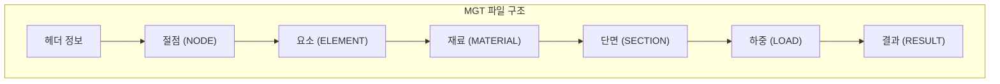

# 12주차: 구조해석 프로그램 연동 (Midas)

---

## 📌 강의 중점

- **MGT 파일** 구조 이해와 파싱
- **구조해석 결과** 데이터 추출
- **Midas API/자동화** 활용
- **LLM 연동** 구조 검토 보조

---

## 🎯 학습 목표

학습 완료 후 다음을 수행할 수 있습니다:

- Midas MGT 파일의 구조를 이해할 수 있다
- Python으로 해석 결과 데이터를 추출할 수 있다
- 부재력 조회 MCP 서버를 구축할 수 있다
- LLM을 활용한 구조 검토를 자동화할 수 있다

---

## [Chapter 1] Midas 파일 구조

### 1.1 MGT 파일 형식



**MGT 파일 예시**:
```
*VERSION
   VERSION=850
*UNIT
   FORCE=kN, LENGTH=m, HEAT=kJ, TEMPER=C
*NODE
   1, 0, 0, 0
   2, 8, 0, 0
   3, 0, 0, 4
   4, 8, 0, 4
*ELEMENT
   1, BEAM, 1, 1, 3, 0, 0
   2, BEAM, 1, 2, 4, 0, 0
   3, BEAM, 1, 3, 4, 0, 0
*MATERIAL
   1, STEEL, , C, NO, 0.02, 2.1e8, 0.3
*SECTION
   1, DBUSER, H, YES, CC, 0, 0, 0, 0, 0, 0
   H-400x200x8x13, 1, 0.4, 0.2, 0.008, 0.013
```

### 1.2 주요 데이터 섹션

| 섹션 | 설명 | 키 정보 |
|------|------|---------|
| `*NODE` | 절점 좌표 | ID, X, Y, Z |
| `*ELEMENT` | 요소 정의 | ID, TYPE, MATL, I, J |
| `*MATERIAL` | 재료 물성 | E, ν, ρ |
| `*SECTION` | 단면 특성 | A, I, S |
| `*STLDCASE` | 하중 케이스 | NAME, TYPE |
| `*BEAMFORCE` | 부재력 | N, Vy, Vz, Mx, My, Mz |

### 📚 참고 자료

- [Midas Gen Manual](https://www.midasuser.com/)
- [MGT File Format](https://www.midasuser.com/web/mgt_manual)

---

## [Chapter 2] MGT 파싱 구현

### 2.1 기본 MGT 파서

```python
import re
from typing import Dict, List, Any
from dataclasses import dataclass


@dataclass
class Node:
    id: int
    x: float
    y: float
    z: float


@dataclass
class Element:
    id: int
    type: str
    material_id: int
    node_i: int
    node_j: int


@dataclass
class BeamForce:
    element_id: int
    load_case: str
    position: float  # 0.0 ~ 1.0
    N: float   # 축력
    Vy: float  # y방향 전단력
    Vz: float  # z방향 전단력
    Mx: float  # 비틀림 모멘트
    My: float  # y축 휨모멘트
    Mz: float  # z축 휨모멘트


class MidasMGTParser:
    """Midas MGT 파일 파서"""

    def __init__(self, file_path: str):
        self.file_path = file_path
        self.data = {
            "nodes": {},
            "elements": {},
            "materials": {},
            "sections": {},
            "load_cases": [],
            "beam_forces": []
        }
        self._parse()

    def _parse(self):
        """MGT 파일 파싱"""
        with open(self.file_path, 'r', encoding='utf-8', errors='ignore') as f:
            content = f.read()

        # 섹션별 파싱
        self._parse_nodes(content)
        self._parse_elements(content)
        self._parse_materials(content)
        self._parse_sections(content)
        self._parse_beam_forces(content)

    def _parse_nodes(self, content: str):
        """절점 파싱"""
        node_section = re.search(r'\*NODE\s*\n(.*?)(?=\*[A-Z]|\Z)', content, re.DOTALL)
        if not node_section:
            return

        for line in node_section.group(1).strip().split('\n'):
            line = line.strip()
            if not line or line.startswith(';'):
                continue

            parts = [p.strip() for p in line.split(',')]
            if len(parts) >= 4:
                node_id = int(parts[0])
                self.data["nodes"][node_id] = Node(
                    id=node_id,
                    x=float(parts[1]),
                    y=float(parts[2]),
                    z=float(parts[3])
                )

    def _parse_elements(self, content: str):
        """요소 파싱"""
        elem_section = re.search(r'\*ELEMENT\s*\n(.*?)(?=\*[A-Z]|\Z)', content, re.DOTALL)
        if not elem_section:
            return

        for line in elem_section.group(1).strip().split('\n'):
            line = line.strip()
            if not line or line.startswith(';'):
                continue

            parts = [p.strip() for p in line.split(',')]
            if len(parts) >= 5:
                elem_id = int(parts[0])
                self.data["elements"][elem_id] = Element(
                    id=elem_id,
                    type=parts[1],
                    material_id=int(parts[2]),
                    node_i=int(parts[3]),
                    node_j=int(parts[4])
                )

    def _parse_materials(self, content: str):
        """재료 파싱"""
        mat_section = re.search(r'\*MATERIAL\s*\n(.*?)(?=\*[A-Z]|\Z)', content, re.DOTALL)
        if not mat_section:
            return

        for line in mat_section.group(1).strip().split('\n'):
            line = line.strip()
            if not line or line.startswith(';'):
                continue

            parts = [p.strip() for p in line.split(',')]
            if len(parts) >= 2:
                mat_id = int(parts[0])
                self.data["materials"][mat_id] = {
                    "id": mat_id,
                    "type": parts[1] if len(parts) > 1 else "UNKNOWN"
                }

    def _parse_sections(self, content: str):
        """단면 파싱"""
        sec_section = re.search(r'\*SECTION\s*\n(.*?)(?=\*[A-Z]|\Z)', content, re.DOTALL)
        if not sec_section:
            return

        lines = sec_section.group(1).strip().split('\n')
        i = 0
        while i < len(lines):
            line = lines[i].strip()
            if not line or line.startswith(';'):
                i += 1
                continue

            parts = [p.strip() for p in line.split(',')]
            if len(parts) >= 2:
                sec_id = int(parts[0])
                self.data["sections"][sec_id] = {
                    "id": sec_id,
                    "type": parts[1]
                }

            i += 1

    def _parse_beam_forces(self, content: str):
        """부재력 파싱"""
        bf_section = re.search(r'\*BEAMFORCE\s*\n(.*?)(?=\*[A-Z]|\Z)', content, re.DOTALL)
        if not bf_section:
            return

        current_case = "Unknown"
        for line in bf_section.group(1).strip().split('\n'):
            line = line.strip()
            if not line or line.startswith(';'):
                continue

            # 하중 케이스 라인
            if line.startswith('$'):
                current_case = line[1:].strip()
                continue

            parts = [p.strip() for p in line.split(',')]
            if len(parts) >= 8:
                try:
                    self.data["beam_forces"].append(BeamForce(
                        element_id=int(parts[0]),
                        load_case=current_case,
                        position=float(parts[1]),
                        N=float(parts[2]),
                        Vy=float(parts[3]),
                        Vz=float(parts[4]),
                        Mx=float(parts[5]),
                        My=float(parts[6]),
                        Mz=float(parts[7])
                    ))
                except (ValueError, IndexError):
                    pass

    def get_summary(self) -> Dict:
        """모델 요약"""
        return {
            "nodes": len(self.data["nodes"]),
            "elements": len(self.data["elements"]),
            "materials": len(self.data["materials"]),
            "sections": len(self.data["sections"]),
            "beam_forces": len(self.data["beam_forces"])
        }

    def get_max_forces(self, element_id: int = None) -> Dict:
        """최대 부재력 조회"""
        forces = self.data["beam_forces"]

        if element_id:
            forces = [f for f in forces if f.element_id == element_id]

        if not forces:
            return {}

        return {
            "max_N": max(abs(f.N) for f in forces),
            "max_Vy": max(abs(f.Vy) for f in forces),
            "max_Vz": max(abs(f.Vz) for f in forces),
            "max_My": max(abs(f.My) for f in forces),
            "max_Mz": max(abs(f.Mz) for f in forces)
        }


# 사용 예시
parser = MidasMGTParser("structure.mgt")
print(f"모델 요약: {parser.get_summary()}")
print(f"최대 부재력: {parser.get_max_forces()}")
```

### 2.2 부재력 분석 도구

```python
from typing import List, Dict
import pandas as pd


class BeamForceAnalyzer:
    """부재력 분석기"""

    def __init__(self, parser: MidasMGTParser):
        self.parser = parser
        self.forces = parser.data["beam_forces"]

    def to_dataframe(self) -> pd.DataFrame:
        """부재력을 DataFrame으로 변환"""
        data = []
        for f in self.forces:
            data.append({
                "element_id": f.element_id,
                "load_case": f.load_case,
                "position": f.position,
                "N": f.N,
                "Vy": f.Vy,
                "Vz": f.Vz,
                "Mx": f.Mx,
                "My": f.My,
                "Mz": f.Mz
            })
        return pd.DataFrame(data)

    def get_critical_elements(self, force_type: str = "My", top_n: int = 10) -> List[Dict]:
        """임계 부재 추출"""
        df = self.to_dataframe()

        if df.empty:
            return []

        # 절대값으로 정렬
        df["abs_force"] = df[force_type].abs()
        top_df = df.nlargest(top_n, "abs_force")

        return top_df.to_dict("records")

    def compare_load_cases(self, element_id: int) -> pd.DataFrame:
        """하중 케이스별 비교"""
        df = self.to_dataframe()
        elem_df = df[df["element_id"] == element_id]

        # 하중 케이스별 최대값
        return elem_df.groupby("load_case").agg({
            "N": ["max", "min"],
            "My": ["max", "min"],
            "Mz": ["max", "min"]
        })


# 사용 예시
# analyzer = BeamForceAnalyzer(parser)
# critical = analyzer.get_critical_elements("My", top_n=5)
```

---

## [Chapter 3] 구조해석 MCP 서버

### 3.1 Midas MCP 서버 구현

```python
# midas_mcp_server.py
"""Midas 구조해석 MCP 서버"""

from mcp.server import Server
from mcp.server.stdio import stdio_server
from mcp.types import Tool, TextContent
import json
import asyncio
from pathlib import Path

server = Server("midas-structural-server")

# 파서 캐시
parsers = {}


def get_parser(file_path: str):
    if file_path not in parsers:
        parsers[file_path] = MidasMGTParser(file_path)
    return parsers[file_path]


@server.list_tools()
async def list_tools():
    return [
        Tool(
            name="get_model_summary",
            description="Midas 구조 모델의 요약 정보를 조회합니다",
            inputSchema={
                "type": "object",
                "properties": {
                    "file_path": {"type": "string", "description": "MGT 파일 경로"}
                },
                "required": ["file_path"]
            }
        ),
        Tool(
            name="get_beam_forces",
            description="특정 부재의 부재력을 조회합니다",
            inputSchema={
                "type": "object",
                "properties": {
                    "file_path": {"type": "string"},
                    "element_id": {"type": "integer", "description": "요소 번호"},
                    "load_case": {"type": "string", "description": "하중 케이스 (선택)"}
                },
                "required": ["file_path", "element_id"]
            }
        ),
        Tool(
            name="get_critical_members",
            description="임계 부재 목록을 조회합니다 (최대 부재력 기준)",
            inputSchema={
                "type": "object",
                "properties": {
                    "file_path": {"type": "string"},
                    "force_type": {
                        "type": "string",
                        "enum": ["N", "Vy", "Vz", "My", "Mz"],
                        "description": "부재력 유형"
                    },
                    "top_n": {"type": "integer", "default": 10}
                },
                "required": ["file_path", "force_type"]
            }
        ),
        Tool(
            name="check_stress_ratio",
            description="응력비를 계산합니다 (간이 검토)",
            inputSchema={
                "type": "object",
                "properties": {
                    "file_path": {"type": "string"},
                    "element_id": {"type": "integer"},
                    "allowable_stress": {"type": "number", "description": "허용응력 (MPa)"},
                    "section_area": {"type": "number", "description": "단면적 (cm²)"},
                    "section_modulus": {"type": "number", "description": "단면계수 (cm³)"}
                },
                "required": ["file_path", "element_id", "allowable_stress", "section_area", "section_modulus"]
            }
        )
    ]


@server.call_tool()
async def call_tool(name: str, arguments: dict):
    file_path = arguments.get("file_path", "")

    if not Path(file_path).exists():
        return [TextContent(type="text", text=f"파일을 찾을 수 없습니다: {file_path}")]

    parser = get_parser(file_path)

    if name == "get_model_summary":
        summary = parser.get_summary()
        return [TextContent(type="text", text=json.dumps(summary, indent=2))]

    elif name == "get_beam_forces":
        element_id = arguments.get("element_id")
        load_case = arguments.get("load_case")

        forces = [f for f in parser.data["beam_forces"]
                  if f.element_id == element_id]

        if load_case:
            forces = [f for f in forces if f.load_case == load_case]

        result = [{
            "load_case": f.load_case,
            "position": f.position,
            "N": f.N,
            "Vy": f.Vy,
            "Vz": f.Vz,
            "My": f.My,
            "Mz": f.Mz
        } for f in forces]

        return [TextContent(type="text", text=json.dumps(result, indent=2))]

    elif name == "get_critical_members":
        force_type = arguments.get("force_type", "My")
        top_n = arguments.get("top_n", 10)

        analyzer = BeamForceAnalyzer(parser)
        critical = analyzer.get_critical_elements(force_type, top_n)

        return [TextContent(type="text", text=json.dumps(critical, indent=2))]

    elif name == "check_stress_ratio":
        element_id = arguments["element_id"]
        fa = arguments["allowable_stress"]  # MPa
        A = arguments["section_area"]  # cm²
        S = arguments["section_modulus"]  # cm³

        max_forces = parser.get_max_forces(element_id)
        if not max_forces:
            return [TextContent(type="text", text="부재력 데이터가 없습니다")]

        # 응력 계산 (kN, cm → MPa)
        N = max_forces["max_N"]  # kN
        M = max_forces["max_My"]  # kN·m

        sigma_n = (N * 10) / A  # MPa (kN/cm² × 10 = MPa)
        sigma_m = (M * 100 * 10) / S  # MPa

        stress_ratio = (abs(sigma_n) + abs(sigma_m)) / fa

        result = {
            "element_id": element_id,
            "axial_stress": round(sigma_n, 2),
            "bending_stress": round(sigma_m, 2),
            "total_stress": round(abs(sigma_n) + abs(sigma_m), 2),
            "allowable_stress": fa,
            "stress_ratio": round(stress_ratio, 3),
            "status": "OK" if stress_ratio <= 1.0 else "NG"
        }

        return [TextContent(type="text", text=json.dumps(result, indent=2))]


async def main():
    async with stdio_server() as (read, write):
        await server.run(read, write)


if __name__ == "__main__":
    asyncio.run(main())
```

---

## [Chapter 4] LLM 연동 구조 검토

### 4.1 자연어 구조 질의

```python
import anthropic


class StructuralAssistant:
    """구조해석 결과 질의 어시스턴트"""

    def __init__(self, parser: MidasMGTParser):
        self.parser = parser
        self.client = anthropic.Anthropic()

    def query(self, question: str) -> str:
        """자연어 질문 처리"""
        summary = self.parser.get_summary()
        max_forces = self.parser.get_max_forces()

        context = f"""
구조 모델 정보:
- 절점 수: {summary['nodes']}
- 요소 수: {summary['elements']}
- 부재력 데이터: {summary['beam_forces']}개

최대 부재력:
- 최대 축력 (N): {max_forces.get('max_N', 'N/A')} kN
- 최대 전단력 (Vy): {max_forces.get('max_Vy', 'N/A')} kN
- 최대 휨모멘트 (My): {max_forces.get('max_My', 'N/A')} kN·m
"""

        prompt = f"""당신은 구조공학 전문가입니다.
다음 구조해석 결과를 기반으로 질문에 답변해 주세요.

{context}

질문: {question}

전문적이고 정확하게 답변하세요. 수치를 인용할 때 단위를 명시하세요.
"""

        response = self.client.messages.create(
            model="claude-3-5-sonnet-20241022",
            max_tokens=2000,
            messages=[{"role": "user", "content": prompt}]
        )

        return response.content[0].text
```

---

## 💻 실습 코드

### 실습: 구조해석 결과 리포터

```python
# practice/structural_reporter.py
"""구조해석 결과 보고서 생성"""

def generate_structural_report(parser: MidasMGTParser) -> str:
    """구조해석 결과 보고서 생성"""
    summary = parser.get_summary()
    analyzer = BeamForceAnalyzer(parser)

    # 임계 부재 추출
    critical_my = analyzer.get_critical_elements("My", 5)
    critical_n = analyzer.get_critical_elements("N", 5)

    report = f"""
# 구조해석 결과 보고서

## 1. 모델 개요
- 절점 수: {summary['nodes']}
- 요소 수: {summary['elements']}
- 재료 종류: {summary['materials']}
- 단면 종류: {summary['sections']}

## 2. 임계 부재 (휨모멘트 기준)

| 요소 번호 | 하중 케이스 | 최대 휨모멘트 (kN·m) |
|----------|------------|---------------------|
"""

    for m in critical_my:
        report += f"| {m['element_id']} | {m['load_case']} | {abs(m['My']):.2f} |\n"

    report += """

## 3. 임계 부재 (축력 기준)

| 요소 번호 | 하중 케이스 | 최대 축력 (kN) |
|----------|------------|----------------|
"""

    for n in critical_n:
        report += f"| {n['element_id']} | {n['load_case']} | {abs(n['N']):.2f} |\n"

    return report


if __name__ == "__main__":
    import sys
    if len(sys.argv) > 1:
        parser = MidasMGTParser(sys.argv[1])
        print(generate_structural_report(parser))
```

---

## 📝 과제

### 과제 1: MGT 파서 확장 (제출)

MGT 파서에 추가 기능 구현:
- 하중 케이스 파싱
- 변위 결과 파싱
- 단면 특성 추출

### 과제 2: 구조 검토 자동화 (제출)

MCP 서버 + LLM을 활용한 검토 시스템:
- 응력비 자동 계산
- 검토 보고서 생성
- 자연어 질의 지원

---

## 🔗 추가 학습 자료

- [Midas User Manual](https://www.midasuser.com/)
- [Structural Analysis Basics](https://www.structuralguide.com/)

---

## 🚀 발전 전략 (Development Strategies)

### 전략 1: 실제 프로젝트 기반 MGT 파싱 실습

**목표**: 다양한 실제 구조물 사례를 통해 MGT 파일 구조를 완전히 이해

**구체적 실행 방법**:

1. **간단한 구조물부터 시작 (난이도: ★☆☆☆☆)**
   ```python
   # 연습 1: 단순 보 구조 (2절점, 1요소)
   simple_beam = """
   *NODE
      1, 0, 0, 0
      2, 6, 0, 0
   *ELEMENT
      1, BEAM, 1, 1, 2, 0, 0
   *MATERIAL
      1, STEEL, , C, NO, 0.02, 2.1e8, 0.3
   """
   # TODO: 이 MGT 데이터를 파싱하여 절점 좌표와 요소 정보를 추출하세요
   ```

2. **중간 복잡도 구조물 (난이도: ★★★☆☆)**
   - **프레임 구조**: 3층 건물 골조 (12절점, 15요소)
   - **트러스 구조**: 5패널 트러스 (8절점, 13요소)
   - 실습 목표: 절점 연결성 시각화, 요소-재료-단면 매핑

3. **실제 프로젝트 수준 (난이도: ★★★★☆)**
   ```python
   # 대형 구조물 분석 도구
   class LargeStructureAnalyzer:
       def __init__(self, mgt_path: str):
           self.parser = MidasMGTParser(mgt_path)

       def detect_structural_system(self) -> str:
           """구조 시스템 자동 감지 (프레임/트러스/쉘)"""
           elements = self.parser.data["elements"]
           elem_types = [e.type for e in elements.values()]

           # 요소 타입 분포로 구조 형식 판단
           if all(t == "BEAM" for t in elem_types):
               return "FRAME_STRUCTURE"
           elif all(t == "TRUSS" for t in elem_types):
               return "TRUSS_STRUCTURE"
           elif "PLATE" in elem_types or "SHELL" in elem_types:
               return "SHELL_STRUCTURE"
           return "MIXED_STRUCTURE"

       def generate_connectivity_matrix(self) -> np.ndarray:
           """절점 연결성 행렬 생성"""
           n_nodes = len(self.parser.data["nodes"])
           connectivity = np.zeros((n_nodes, n_nodes), dtype=int)

           for elem in self.parser.data["elements"].values():
               i, j = elem.node_i - 1, elem.node_j - 1  # 0-based indexing
               connectivity[i][j] = connectivity[j][i] = 1

           return connectivity
   ```

4. **건축공학 실무 적용 사례**
   - 아파트 표준층 골조 모델 (500+ 절점)
   - 철골 지붕 트러스 구조
   - 철근콘크리트 전단벽 구조

**실습 자료 준비**:
```bash
# Midas Gen에서 다음 구조물 모델링 후 MGT 내보내기
1. simple_beam.mgt       # 단순보
2. frame_3story.mgt      # 3층 골조
3. truss_roof.mgt        # 지붕 트러스
4. apartment_floor.mgt   # 아파트 표준층
```

---

### 전략 2: 부재력 시각화 및 대화형 분석 도구 개발

**목표**: 부재력 데이터를 효과적으로 시각화하고 엔지니어가 직관적으로 분석할 수 있는 대화형 도구 구축

**구체적 구현**:

1. **Matplotlib/Plotly를 활용한 부재력 다이어그램**
   ```python
   import matplotlib.pyplot as plt
   import numpy as np
   from matplotlib.patches import FancyArrowPatch

   class BeamForceDiagrammer:
       """부재력 선도 생성기"""

       def __init__(self, parser: MidasMGTParser):
           self.parser = parser

       def plot_moment_diagram(self, element_id: int, load_case: str = None):
           """휨모멘트 선도 그리기"""
           forces = [f for f in self.parser.data["beam_forces"]
                     if f.element_id == element_id]

           if load_case:
               forces = [f for f in forces if f.load_case == load_case]

           # 위치별 모멘트 정렬
           forces.sort(key=lambda f: f.position)
           positions = [f.position for f in forces]
           moments = [f.My for f in forces]

           # 부재 길이 계산
           elem = self.parser.data["elements"][element_id]
           node_i = self.parser.data["nodes"][elem.node_i]
           node_j = self.parser.data["nodes"][elem.node_j]
           length = np.sqrt((node_j.x - node_i.x)**2 +
                           (node_j.y - node_i.y)**2 +
                           (node_j.z - node_i.z)**2)

           # 실제 거리로 변환
           x_coords = [p * length for p in positions]

           # 플롯 생성
           fig, (ax1, ax2) = plt.subplots(2, 1, figsize=(12, 8))

           # 부재 표시
           ax1.plot([0, length], [0, 0], 'k-', linewidth=3, label='부재')
           ax1.scatter([0, length], [0, 0], c='red', s=100, zorder=5, label='절점')
           ax1.set_title(f'Element {element_id} - Load Case: {load_case or "All"}')
           ax1.set_ylabel('Y (m)')
           ax1.legend()
           ax1.grid(True, alpha=0.3)
           ax1.axis('equal')

           # 휨모멘트 선도
           ax2.plot(x_coords, moments, 'b-', linewidth=2, marker='o', label='휨모멘트')
           ax2.fill_between(x_coords, 0, moments, alpha=0.3)
           ax2.axhline(y=0, color='k', linestyle='-', linewidth=0.5)
           ax2.set_xlabel('부재 위치 (m)')
           ax2.set_ylabel('휨모멘트 My (kN·m)')
           ax2.set_title('휨모멘트 선도')
           ax2.grid(True, alpha=0.3)
           ax2.legend()

           # 최대/최소 모멘트 표시
           max_idx = np.argmax(np.abs(moments))
           ax2.annotate(f'Max: {moments[max_idx]:.2f} kN·m',
                       xy=(x_coords[max_idx], moments[max_idx]),
                       xytext=(10, 10), textcoords='offset points',
                       bbox=dict(boxstyle='round', facecolor='yellow', alpha=0.7),
                       arrowprops=dict(arrowstyle='->', connectionstyle='arc3,rad=0'))

           plt.tight_layout()
           return fig

       def plot_3d_structure(self):
           """3D 구조물 시각화"""
           from mpl_toolkits.mplot3d import Axes3D

           fig = plt.figure(figsize=(14, 10))
           ax = fig.add_subplot(111, projection='3d')

           # 절점 그리기
           nodes = self.parser.data["nodes"]
           xs = [n.x for n in nodes.values()]
           ys = [n.y for n in nodes.values()]
           zs = [n.z for n in nodes.values()]
           ax.scatter(xs, ys, zs, c='red', s=100, marker='o', label='절점')

           # 요소 그리기 (부재력 크기로 색상 표현)
           elements = self.parser.data["elements"]
           max_forces = {}
           for elem_id in elements.keys():
               mf = self.parser.get_max_forces(elem_id)
               max_forces[elem_id] = mf.get("max_My", 0) if mf else 0

           max_my = max(max_forces.values()) if max_forces else 1

           for elem_id, elem in elements.items():
               node_i = nodes[elem.node_i]
               node_j = nodes[elem.node_j]

               # 부재력 크기로 색상 결정
               force_ratio = max_forces.get(elem_id, 0) / max_my
               color = plt.cm.jet(force_ratio)

               ax.plot([node_i.x, node_j.x],
                      [node_i.y, node_j.y],
                      [node_i.z, node_j.z],
                      color=color, linewidth=2, alpha=0.7)

           ax.set_xlabel('X (m)')
           ax.set_ylabel('Y (m)')
           ax.set_zlabel('Z (m)')
           ax.set_title('3D 구조물 형상 (색상 = 휨모멘트 크기)')
           ax.legend()

           # 컬러바 추가
           sm = plt.cm.ScalarMappable(cmap=plt.cm.jet,
                                      norm=plt.Normalize(vmin=0, vmax=max_my))
           sm.set_array([])
           cbar = plt.colorbar(sm, ax=ax, pad=0.1)
           cbar.set_label('휨모멘트 (kN·m)')

           return fig
   ```

2. **대화형 웹 대시보드 (Streamlit)**
   ```python
   # structural_dashboard.py
   import streamlit as st
   import pandas as pd

   st.set_page_config(page_title="구조해석 결과 분석", layout="wide")

   st.title("🏗️ Midas 구조해석 결과 분석 대시보드")

   # 파일 업로드
   uploaded_file = st.file_uploader("MGT 파일 업로드", type=["mgt"])

   if uploaded_file:
       # 임시 파일 저장
       with open("temp.mgt", "wb") as f:
           f.write(uploaded_file.getbuffer())

       parser = MidasMGTParser("temp.mgt")
       analyzer = BeamForceAnalyzer(parser)
       diagrammer = BeamForceDiagrammer(parser)

       # 사이드바: 모델 요약
       with st.sidebar:
           st.header("📊 모델 정보")
           summary = parser.get_summary()
           st.metric("절점 수", summary["nodes"])
           st.metric("요소 수", summary["elements"])
           st.metric("재료 종류", summary["materials"])
           st.metric("단면 종류", summary["sections"])

       # 메인 탭
       tab1, tab2, tab3, tab4 = st.tabs(["3D 구조", "부재력 선도", "임계 부재", "부재력 데이터"])

       with tab1:
           st.subheader("3D 구조물 형상")
           fig = diagrammer.plot_3d_structure()
           st.pyplot(fig)

       with tab2:
           st.subheader("부재력 선도")
           col1, col2 = st.columns([1, 3])

           with col1:
               element_ids = list(parser.data["elements"].keys())
               selected_elem = st.selectbox("요소 선택", element_ids)

               load_cases = list(set([f.load_case for f in parser.data["beam_forces"]]))
               selected_lc = st.selectbox("하중 케이스", load_cases)

           with col2:
               fig = diagrammer.plot_moment_diagram(selected_elem, selected_lc)
               st.pyplot(fig)

       with tab3:
           st.subheader("임계 부재 분석")
           force_type = st.selectbox("부재력 타입", ["N", "Vy", "Vz", "My", "Mz"])
           top_n = st.slider("상위 N개", 5, 20, 10)

           critical = analyzer.get_critical_elements(force_type, top_n)
           df = pd.DataFrame(critical)

           st.dataframe(df, use_container_width=True)

           # 차트 시각화
           st.bar_chart(df.set_index("element_id")[force_type])

       with tab4:
           st.subheader("전체 부재력 데이터")
           df = analyzer.to_dataframe()
           st.dataframe(df, use_container_width=True, height=600)

           # CSV 다운로드
           csv = df.to_csv(index=False).encode('utf-8-sig')
           st.download_button(
               "📥 CSV 다운로드",
               csv,
               "beam_forces.csv",
               "text/csv"
           )
   ```

---

### 전략 3: 구조설계기준 자동 검토 시스템 구축

**목표**: KBC, KDS, 강구조설계기준 등 실제 설계기준에 따른 자동 검토 시스템 개발

**핵심 구현 사례**:

1. **KDS 41 17 00 (강구조 부재 설계) 자동 검토기**
   ```python
   class KDS411700Checker:
       """KDS 41 17 00 강구조 설계기준 검토기"""

       def __init__(self, parser: MidasMGTParser):
           self.parser = parser

       def check_beam_flexure(self, element_id: int,
                              section_modulus: float,  # cm³
                              yield_strength: float = 235):  # MPa
           """보의 휨강도 검토 (KDS 41 17 00 5.2.1)"""

           max_forces = self.parser.get_max_forces(element_id)
           if not max_forces:
               return {"status": "ERROR", "message": "부재력 데이터 없음"}

           # 휨강도 계산
           M_max = max_forces["max_My"]  # kN·m
           f_b = 0.66 * yield_strength  # MPa (허용휨응력)
           M_a = f_b * section_modulus / 100  # kN·m (허용휨모멘트)

           # 검토비
           ratio = M_max / M_a

           return {
               "element_id": element_id,
               "design_moment": round(M_max, 2),
               "allowable_moment": round(M_a, 2),
               "stress_ratio": round(ratio, 3),
               "status": "OK" if ratio <= 1.0 else "NG",
               "margin": round((1 - ratio) * 100, 1),  # %
               "code": "KDS 41 17 00 5.2.1"
           }

       def check_column_combined(self, element_id: int,
                                 section_area: float,  # cm²
                                 section_modulus: float,  # cm³
                                 yield_strength: float = 235):  # MPa
           """기둥의 압축+휨 조합응력 검토 (KDS 41 17 00 5.3.3)"""

           max_forces = self.parser.get_max_forces(element_id)
           if not max_forces:
               return {"status": "ERROR"}

           N = max_forces["max_N"]  # kN
           M = max_forces["max_My"]  # kN·m

           # 허용응력
           f_a = 0.60 * yield_strength  # MPa (허용압축응력)
           f_b = 0.66 * yield_strength  # MPa (허용휨응력)

           # 발생응력
           sigma_a = (N * 10) / section_area  # MPa
           sigma_b = (M * 100 * 10) / section_modulus  # MPa

           # 조합응력 검토 (KDS 식 5.3-5)
           if sigma_a / f_a > 0.15:
               # Cm·fb/fa + fb/Fb ≤ 1.0
               ratio = sigma_a / f_a + sigma_b / f_b
           else:
               # fa/Fa + fb/Fb ≤ 1.0
               ratio = sigma_a / f_a + sigma_b / f_b

           return {
               "element_id": element_id,
               "axial_stress": round(sigma_a, 2),
               "bending_stress": round(sigma_b, 2),
               "allowable_axial": f_a,
               "allowable_bending": f_b,
               "combined_ratio": round(ratio, 3),
               "status": "OK" if ratio <= 1.0 else "NG",
               "code": "KDS 41 17 00 5.3.3"
           }

       def batch_check_all_members(self, section_database: dict):
           """전체 부재 일괄 검토"""
           results = []

           for elem_id, elem in self.parser.data["elements"].items():
               # 단면 정보 조회
               section_id = elem.section_id  # 단면 번호 (확장 필요)
               section_props = section_database.get(section_id, {})

               if not section_props:
                   continue

               # 부재 유형별 검토
               elem_type = self._classify_element_type(elem_id)

               if elem_type == "BEAM":
                   result = self.check_beam_flexure(
                       elem_id,
                       section_props["Sx"],
                       section_props.get("Fy", 235)
                   )
               elif elem_type == "COLUMN":
                   result = self.check_column_combined(
                       elem_id,
                       section_props["A"],
                       section_props["Sx"],
                       section_props.get("Fy", 235)
                   )
               else:
                   continue

               results.append(result)

           return pd.DataFrame(results)

       def _classify_element_type(self, element_id: int) -> str:
           """부재 유형 분류 (보/기둥/브레이스)"""
           elem = self.parser.data["elements"][element_id]
           node_i = self.parser.data["nodes"][elem.node_i]
           node_j = self.parser.data["nodes"][elem.node_j]

           # Z 방향 변위로 판단
           dz = abs(node_j.z - node_i.z)
           dx = abs(node_j.x - node_i.x)
           dy = abs(node_j.y - node_i.y)

           if dz > max(dx, dy):
               return "COLUMN"
           elif dz < 0.1:
               return "BEAM"
           else:
               return "BRACE"
   ```

2. **단면 데이터베이스 연동**
   ```python
   # section_database.py
   """KS 표준 단면 데이터베이스"""

   STEEL_SECTIONS = {
       # H형강 (KS D 3502)
       "H-400x200x8x13": {
           "A": 84.12,     # cm²
           "Ix": 23700,    # cm⁴
           "Iy": 1740,     # cm⁴
           "Sx": 1190,     # cm³
           "Sy": 174,      # cm³
           "rx": 16.8,     # cm
           "ry": 4.55,     # cm
           "Fy": 235       # MPa (SS400)
       },
       "H-300x150x6.5x9": {
           "A": 46.78,
           "Ix": 6750,
           "Iy": 667,
           "Sx": 451,
           "Sy": 89.0,
           "rx": 12.0,
           "ry": 3.78,
           "Fy": 235
       }
       # ... 추가 단면
   }

   def get_section_properties(section_name: str) -> dict:
       """단면 특성 조회"""
       return STEEL_SECTIONS.get(section_name, {})
   ```

3. **검토 보고서 자동 생성**
   ```python
   def generate_design_check_report(checker: KDS411700Checker,
                                    section_db: dict) -> str:
       """설계 검토 보고서 생성"""

       results_df = checker.batch_check_all_members(section_db)

       # 통계 분석
       total = len(results_df)
       ok_count = len(results_df[results_df["status"] == "OK"])
       ng_count = total - ok_count
       max_ratio = results_df["combined_ratio"].max()

       report = f"""
   # 구조설계 검토 보고서

   ## 1. 검토 개요
   - 적용 기준: KDS 41 17 00 (강구조 부재 설계)
   - 검토 부재 수: {total}
   - 적합 부재: {ok_count} ({ok_count/total*100:.1f}%)
   - 부적합 부재: {ng_count} ({ng_count/total*100:.1f}%)
   - 최대 응력비: {max_ratio:.3f}

   ## 2. 부재별 검토 결과

   {results_df.to_markdown(index=False)}

   ## 3. 부적합 부재 상세

   """

       ng_df = results_df[results_df["status"] == "NG"]
       if not ng_df.empty:
           for _, row in ng_df.iterrows():
               report += f"""
   ### 요소 {row['element_id']}
   - 응력비: {row['combined_ratio']:.3f} > 1.0 (NG)
   - 발생 축응력: {row['axial_stress']:.2f} MPa
   - 발생 휨응력: {row['bending_stress']:.2f} MPa
   - **조치 필요**: 단면 증대 또는 하중 재검토

   """
       else:
           report += "모든 부재가 설계기준을 만족합니다.\n"

       return report
   ```

---

### 전략 4: LLM 기반 구조검토 어시스턴트 고도화

**목표**: MCP 서버와 LLM을 통합하여 자연어로 구조검토를 수행할 수 있는 지능형 어시스턴트 구축

**핵심 기능 구현**:

1. **컨텍스트 인식 구조 질의 시스템**
   ```python
   import anthropic

   class AdvancedStructuralAssistant:
       """고급 구조 검토 어시스턴트"""

       def __init__(self, parser: MidasMGTParser, section_db: dict):
           self.parser = parser
           self.section_db = section_db
           self.checker = KDS411700Checker(parser)
           self.client = anthropic.Anthropic()
           self.conversation_history = []

       def query_with_tools(self, question: str) -> str:
           """도구 호출 기능이 있는 LLM 질의"""

           # 시스템 프롬프트
           system_prompt = """당신은 구조공학 전문가입니다.
   Midas 구조해석 결과를 분석하고 KDS 설계기준에 따라 검토할 수 있습니다.

   사용 가능한 도구:
   1. get_element_forces(element_id): 부재력 조회
   2. check_design_code(element_id, section_name): 설계기준 검토
   3. get_critical_members(force_type, top_n): 임계 부재 조회
   4. compare_sections(elem_id, section_list): 단면 비교

   질문에 답변할 때:
   - 정확한 수치와 단위를 제시하세요
   - 설계기준 조항을 명시하세요
   - 구체적인 개선 방안을 제안하세요
   - 필요시 도구를 호출하여 정확한 데이터를 확인하세요
   """

           # 구조 모델 컨텍스트
           summary = self.parser.get_summary()
           context = f"""
   현재 분석 중인 구조 모델:
   - 절점: {summary['nodes']}개
   - 요소: {summary['elements']}개
   - 부재력 데이터: {summary['beam_forces']}개
   """

           # 대화 이력 포함
           messages = self.conversation_history + [
               {"role": "user", "content": f"{context}\n\n질문: {question}"}
           ]

           response = self.client.messages.create(
               model="claude-3-5-sonnet-20241022",
               max_tokens=4000,
               system=system_prompt,
               messages=messages
           )

           assistant_message = response.content[0].text

           # 대화 이력 저장
           self.conversation_history.append({"role": "user", "content": question})
           self.conversation_history.append({"role": "assistant", "content": assistant_message})

           return assistant_message

       def analyze_structural_issues(self) -> dict:
           """구조적 문제점 자동 분석"""

           # 1. 임계 부재 식별
           analyzer = BeamForceAnalyzer(self.parser)
           critical_my = analyzer.get_critical_elements("My", 5)
           critical_n = analyzer.get_critical_elements("N", 5)

           # 2. 설계기준 검토
           check_results = self.checker.batch_check_all_members(self.section_db)
           ng_members = check_results[check_results["status"] == "NG"]

           # 3. LLM 분석 요청
           analysis_prompt = f"""
   다음 구조해석 결과를 분석하고 문제점을 요약해 주세요:

   [임계 부재 - 휨모멘트]
   {pd.DataFrame(critical_my).to_string()}

   [임계 부재 - 축력]
   {pd.DataFrame(critical_n).to_string()}

   [설계기준 부적합 부재]
   {ng_members.to_string() if not ng_members.empty else "없음"}

   다음 항목을 포함하여 답변하세요:
   1. 주요 문제점 (우선순위 순)
   2. 각 문제의 원인 분석
   3. 구체적인 해결 방안
   4. 추가 검토가 필요한 사항
   """

           return self.query_with_tools(analysis_prompt)

       def suggest_section_optimization(self, element_id: int) -> str:
           """단면 최적화 제안"""

           current_section = "H-400x200x8x13"  # 실제로는 MGT에서 파싱
           current_props = self.section_db[current_section]

           # 현재 검토 결과
           check_result = self.checker.check_beam_flexure(
               element_id,
               current_props["Sx"],
               current_props["Fy"]
           )

           prompt = f"""
   요소 {element_id}의 단면을 최적화하려고 합니다.

   현재 단면: {current_section}
   - 단면계수 Sx: {current_props['Sx']} cm³
   - 응력비: {check_result['stress_ratio']}
   - 여유율: {check_result['margin']}%

   다음을 제안해 주세요:
   1. 응력비가 0.8~0.95 범위에 들도록 최적 단면
   2. 경제성 고려사항
   3. 시공성 고려사항
   """

           return self.query_with_tools(prompt)
   ```

2. **MCP 서버와 LLM 통합 워크플로우**
   ```python
   # mcp_llm_workflow.py
   """MCP + LLM 통합 구조검토 워크플로우"""

   async def automated_structural_review(mgt_path: str):
       """자동화된 구조 검토 프로세스"""

       # 1. MGT 파일 파싱
       print("📁 MGT 파일 파싱 중...")
       parser = MidasMGTParser(mgt_path)
       summary = parser.get_summary()
       print(f"✅ 파싱 완료: {summary}")

       # 2. MCP 서버 호출 (부재력 조회)
       print("\n🔧 MCP 서버 호출: 임계 부재 조회...")
       async with mcp.ClientSession(stdio_transport("python", ["midas_mcp_server.py"])) as session:
           # MCP 초기화
           await session.initialize()

           # 임계 부재 조회
           result = await session.call_tool(
               "get_critical_members",
               {
                   "file_path": mgt_path,
                   "force_type": "My",
                   "top_n": 5
               }
           )

           critical_data = json.loads(result.content[0].text)
           print(f"✅ 임계 부재 {len(critical_data)}개 식별")

       # 3. LLM 분석 요청
       print("\n🤖 LLM 분석 시작...")
       assistant = AdvancedStructuralAssistant(parser, STEEL_SECTIONS)

       analysis = assistant.analyze_structural_issues()
       print("\n📊 구조 분석 결과:")
       print(analysis)

       # 4. 대화형 질의응답
       print("\n💬 대화형 검토 (종료: 'quit' 입력)")
       while True:
           question = input("\n질문: ")
           if question.lower() in ['quit', 'exit', '종료']:
               break

           answer = assistant.query_with_tools(question)
           print(f"\n답변: {answer}")

       # 5. 최종 보고서 생성
       print("\n📝 최종 보고서 생성 중...")
       report = generate_design_check_report(assistant.checker, STEEL_SECTIONS)

       with open("structural_review_report.md", "w", encoding="utf-8") as f:
           f.write(report)

       print("✅ 보고서 저장 완료: structural_review_report.md")


   if __name__ == "__main__":
       import asyncio
       asyncio.run(automated_structural_review("structure.mgt"))
   ```

---

### 전략 5: 실무 프로젝트 통합 실습

**목표**: 실제 건축 프로젝트 규모의 종합 실습을 통해 전체 워크플로우 숙달

**종합 프로젝트: "5층 철골조 사무소 건물 구조검토 자동화"**

**프로젝트 시나리오**:
```
건물 개요:
- 용도: 사무소 건물
- 규모: 지상 5층
- 구조형식: 철골조 (H형강 기둥, H형강 보)
- 주요 스팬: 8m × 8m
- 층고: 3.5m

설계 요구사항:
1. KDS 41 17 00 (강구조 설계) 준수
2. 모든 부재 응력비 < 0.95
3. 최소 중량 설계 (경제성)
4. 자동 검토 시스템 구축
```

**단계별 구현**:

```python
# project_office_building.py
"""5층 사무소 건물 구조검토 프로젝트"""

class OfficeBuildingProject:
    """사무소 건물 프로젝트 관리"""

    def __init__(self, mgt_path: str):
        self.mgt_path = mgt_path
        self.parser = MidasMGTParser(mgt_path)
        self.checker = KDS411700Checker(self.parser)
        self.assistant = AdvancedStructuralAssistant(self.parser, STEEL_SECTIONS)

    def step1_model_validation(self):
        """1단계: 모델 검증"""
        print("=" * 60)
        print("STEP 1: 구조 모델 검증")
        print("=" * 60)

        summary = self.parser.get_summary()

        # 기본 검증
        checks = {
            "절점 수 확인": summary["nodes"] > 0,
            "요소 수 확인": summary["elements"] > 0,
            "재료 정의": summary["materials"] > 0,
            "단면 정의": summary["sections"] > 0,
            "부재력 존재": summary["beam_forces"] > 0
        }

        for check, result in checks.items():
            status = "✅" if result else "❌"
            print(f"{status} {check}: {result}")

        # 구조 시스템 분석
        analyzer = LargeStructureAnalyzer(self.mgt_path)
        system_type = analyzer.detect_structural_system()
        print(f"\n구조 형식: {system_type}")

        return all(checks.values())

    def step2_force_analysis(self):
        """2단계: 부재력 분석"""
        print("\n" + "=" * 60)
        print("STEP 2: 부재력 분석")
        print("=" * 60)

        analyzer = BeamForceAnalyzer(self.parser)

        # 각 부재력별 최대값
        for force_type in ["N", "Vy", "Vz", "My", "Mz"]:
            critical = analyzer.get_critical_elements(force_type, 3)
            print(f"\n[{force_type} 최대 부재 Top 3]")
            for i, elem in enumerate(critical, 1):
                print(f"{i}. 요소 {elem['element_id']}: "
                      f"{abs(elem[force_type]):.2f} "
                      f"({elem['load_case']})")

        return True

    def step3_design_check(self):
        """3단계: 설계기준 검토"""
        print("\n" + "=" * 60)
        print("STEP 3: 설계기준 검토 (KDS 41 17 00)")
        print("=" * 60)

        results = self.checker.batch_check_all_members(STEEL_SECTIONS)

        # 통계
        total = len(results)
        ok = len(results[results["status"] == "OK"])
        ng = total - ok

        print(f"\n총 부재 수: {total}")
        print(f"적합: {ok} ({ok/total*100:.1f}%)")
        print(f"부적합: {ng} ({ng/total*100:.1f}%)")

        # 부적합 부재 상세
        if ng > 0:
            ng_df = results[results["status"] == "NG"]
            print("\n[부적합 부재 목록]")
            print(ng_df[["element_id", "combined_ratio", "code"]].to_string())

        return ng == 0

    def step4_llm_analysis(self):
        """4단계: LLM 종합 분석"""
        print("\n" + "=" * 60)
        print("STEP 4: LLM 종합 분석")
        print("=" * 60)

        analysis = self.assistant.analyze_structural_issues()
        print("\n" + analysis)

        return True

    def step5_optimization(self):
        """5단계: 단면 최적화"""
        print("\n" + "=" * 60)
        print("STEP 5: 단면 최적화 제안")
        print("=" * 60)

        # 응력비가 높은 부재 식별
        results = self.checker.batch_check_all_members(STEEL_SECTIONS)
        high_ratio = results[results["combined_ratio"] > 0.9]

        print(f"\n최적화 대상 부재: {len(high_ratio)}개")

        for _, row in high_ratio.head(3).iterrows():
            elem_id = row["element_id"]
            print(f"\n--- 요소 {elem_id} ---")
            suggestion = self.assistant.suggest_section_optimization(elem_id)
            print(suggestion)

        return True

    def step6_report_generation(self):
        """6단계: 최종 보고서 생성"""
        print("\n" + "=" * 60)
        print("STEP 6: 최종 보고서 생성")
        print("=" * 60)

        report = generate_design_check_report(self.checker, STEEL_SECTIONS)

        filename = "office_building_structural_report.md"
        with open(filename, "w", encoding="utf-8") as f:
            f.write(report)

        print(f"\n✅ 보고서 저장 완료: {filename}")
        print(f"📄 파일 크기: {len(report)} bytes")

        return True

    def run_full_workflow(self):
        """전체 워크플로우 실행"""
        print("\n" + "🏗️" * 30)
        print(" 5층 사무소 건물 구조검토 자동화 시스템")
        print("🏗️" * 30)

        steps = [
            self.step1_model_validation,
            self.step2_force_analysis,
            self.step3_design_check,
            self.step4_llm_analysis,
            self.step5_optimization,
            self.step6_report_generation
        ]

        for i, step in enumerate(steps, 1):
            success = step()
            if not success and i <= 3:  # 필수 단계
                print(f"\n❌ {step.__name__} 실패!")
                return False

        print("\n" + "=" * 60)
        print("✅ 전체 검토 프로세스 완료!")
        print("=" * 60)

        return True


# 실행
if __name__ == "__main__":
    project = OfficeBuildingProject("office_building_5stories.mgt")
    project.run_full_workflow()
```

---

### 전략 6: 고급 기능 확장

**목표**: 실무에서 필요한 고급 기능을 추가하여 시스템 완성도 향상

**확장 기능 목록**:

1. **변위 검토 및 처짐 한계 체크**
   ```python
   class DisplacementChecker:
       """변위 및 처짐 검토"""

       def check_beam_deflection(self, element_id: int,
                                 deflection_limit_ratio: float = 300):
           """보 처짐 검토 (KDS 41 10 00 4.2.3)"""

           # 부재 길이 계산
           elem = self.parser.data["elements"][element_id]
           length = self._calculate_length(elem)

           # 허용 처짐
           allowable = length / deflection_limit_ratio  # L/300

           # 최대 처짐 (MGT에서 파싱 필요)
           max_deflection = self._get_max_deflection(element_id)

           ratio = max_deflection / allowable

           return {
               "element_id": element_id,
               "length": length,
               "max_deflection": max_deflection,
               "allowable_deflection": allowable,
               "deflection_ratio": ratio,
               "status": "OK" if ratio <= 1.0 else "NG",
               "limit": f"L/{deflection_limit_ratio}"
           }
   ```

2. **2차 효과 (P-Δ, P-δ) 검토**
   ```python
   class SecondOrderChecker:
       """2차 효과 검토"""

       def check_p_delta_effect(self, story: int):
           """P-Δ 효과 검토 (KDS 41 17 00 4.7)"""

           # 층 변위와 축력 계산
           story_drift = self._get_story_drift(story)
           story_height = self._get_story_height(story)
           total_gravity_load = self._get_gravity_load(story)
           story_shear = self._get_story_shear(story)

           # 안정성 지수 계산
           theta = (total_gravity_load * story_drift) / (story_height * story_shear)

           return {
               "story": story,
               "stability_index": theta,
               "status": "OK" if theta < 0.1 else "P-Δ 고려 필요",
               "recommendation": self._get_pdelta_recommendation(theta)
           }
   ```

3. **하중 조합 자동 생성**
   ```python
   class LoadCombinationGenerator:
       """하중 조합 생성기"""

       def generate_kds_combinations(self):
           """KDS 41 10 00 하중 조합 생성"""

           combinations = {
               "COMB1": "1.2D + 1.6L",
               "COMB2": "1.2D + 1.0L + 1.0W",
               "COMB3": "1.2D + 1.0L + 1.0E",
               "COMB4": "0.9D + 1.0W",
               "COMB5": "0.9D + 1.0E"
           }

           return combinations
   ```

4. **3D 시각화 개선 (VTK 활용)**
   ```python
   import pyvista as pv

   class Advanced3DVisualizer:
       """고급 3D 시각화"""

       def create_interactive_model(self):
           """대화형 3D 모델 생성"""

           plotter = pv.Plotter()

           # 절점 추가
           nodes = self.parser.data["nodes"]
           points = np.array([[n.x, n.y, n.z] for n in nodes.values()])
           plotter.add_points(points, color='red', point_size=10)

           # 요소 추가 (색상 = 응력비)
           for elem in self.parser.data["elements"].values():
               # ... 요소 라인 추가
               pass

           # 대화형 위젯
           plotter.add_slider_widget(
               callback=self.update_load_case,
               rng=[0, 10],
               value=0,
               title="Load Case"
           )

           plotter.show()
   ```

---

### 전략 7: 지속적 학습 및 커뮤니티 참여

**목표**: 지속적인 학습과 실무 적용을 통한 전문성 강화

**구체적 행동 계획**:

1. **주간 실습 루틴**
   - **월요일**: 새로운 MGT 파일 파싱 (다른 프로젝트)
   - **수요일**: 설계기준 검토 코드 개선
   - **금요일**: LLM 프롬프트 최적화 실험

2. **학습 자료 및 커뮤니티**
   - Midas User Forum (https://www.midasuser.com/forum)
   - 대한건축학회 구조설계 세미나
   - GitHub: Structural Engineering Projects
   - YouTube: Structural Analysis Tutorials

3. **개인 포트폴리오 구축**
   ```
   portfolio/
   ├── projects/
   │   ├── 01_simple_beam/
   │   ├── 02_frame_building/
   │   ├── 03_truss_roof/
   │   └── 04_office_complex/
   ├── tools/
   │   ├── midas_parser.py
   │   ├── kds_checker.py
   │   └── mcp_servers/
   └── reports/
       ├── case_study_1.md
       └── lessons_learned.md
   ```

4. **실무 적용 계획**
   - 실제 프로젝트에 점진적 도입
   - 검토 시간 단축 효과 측정
   - 오류 감소율 추적
   - 팀 내 지식 공유 세션 진행

---

## ✅ 학습 점검 체크리스트

다음 항목을 모두 수행할 수 있다면 Week 12를 완전히 숙달한 것입니다:

- [ ] MGT 파일 구조를 이해하고 주요 섹션을 식별할 수 있다
- [ ] Python으로 MGT 파서를 구현하여 절점, 요소, 부재력을 추출할 수 있다
- [ ] 부재력 데이터를 DataFrame으로 변환하고 분석할 수 있다
- [ ] 부재력 선도를 자동으로 그릴 수 있다
- [ ] 3D 구조물을 시각화할 수 있다
- [ ] MCP 서버를 구축하여 구조해석 결과를 조회할 수 있다
- [ ] KDS 설계기준에 따라 부재를 자동 검토할 수 있다
- [ ] LLM을 활용하여 자연어로 구조검토 질의를 수행할 수 있다
- [ ] Streamlit 대시보드를 만들어 대화형 분석을 제공할 수 있다
- [ ] 설계검토 보고서를 자동 생성할 수 있다
- [ ] 실제 프로젝트에 적용할 수 있는 종합 워크플로우를 구축할 수 있다

**최종 목표**: 5층 사무소 건물 프로젝트를 처음부터 끝까지 자동화된 시스템으로 검토할 수 있다!

---

## 🚀 발전 전략 (Development Strategies)

이 섹션은 Week 12의 내용을 더욱 심화하고 실무에 적용할 수 있도록 구체적이고 실행 가능한 전략을 제시합니다.

### 전략 1: 실제 프로젝트 기반 MGT 파싱 실습

**목표**: 다양한 실제 구조물 사례를 통해 MGT 파일 구조를 완전히 이해

**구체적 실행 방법**:

1. **간단한 구조물부터 시작 (난이도: ★☆☆☆☆)**
   ```python
   # 연습 1: 단순 보 구조 (2절점, 1요소)
   simple_beam_mgt = """
   *NODE
      1, 0, 0, 0
      2, 6, 0, 0
   *ELEMENT
      1, BEAM, 1, 1, 2, 0, 0
   *MATERIAL
      1, STEEL, , C, NO, 0.02, 2.1e8, 0.3
   *SECTION
      1, DBUSER, H, YES, CC, 0, 0, 0, 0, 0, 0
      H-300x150x6.5x9, 1, 0.3, 0.15, 0.0065, 0.009
   """

   # 실습 과제: 이 MGT 데이터를 파싱하여 다음을 추출하세요
   # 1. 절점 좌표 리스트
   # 2. 요소 연결성 정보
   # 3. 재료 물성값
   # 4. 단면 형상 정보
   ```

2. **중간 복잡도 구조물 실습 (난이도: ★★★☆☆)**

   **프레임 구조 실습**:
   ```python
   # 3층 건물 골조 모델 생성
   def create_3story_frame_mgt():
       """3층 골조 MGT 파일 생성"""
       nodes = []
       elements = []

       # 층별 절점 생성 (4개 기둥 × 4개 층 = 16 절점)
       for floor in range(4):  # 0~3층
           z = floor * 3.5  # 층고 3.5m
           for col in range(4):  # 4개 기둥
               x = (col % 2) * 8  # 8m 간격
               y = (col // 2) * 8
               node_id = floor * 4 + col + 1
               nodes.append(f"{node_id}, {x}, {y}, {z}")

       # 기둥 요소 생성 (4개 기둥 × 3개 층 = 12개)
       elem_id = 1
       for floor in range(3):
           for col in range(4):
               node_i = floor * 4 + col + 1
               node_j = (floor + 1) * 4 + col + 1
               elements.append(f"{elem_id}, BEAM, 1, {node_i}, {node_j}, 0, 0")
               elem_id += 1

       # 보 요소 생성 (각 층 4개 × 3개 층 = 12개)
       # ... 보 요소 추가 로직

       return nodes, elements

   # 실습: 이 함수를 완성하고 MGT 파일로 저장하세요
   ```

   **트러스 구조 실습**:
   ```python
   # 5패널 평행현 트러스
   class TrussGenerator:
       """트러스 구조 MGT 생성기"""

       def __init__(self, span: float, height: float, n_panels: int):
           self.span = span
           self.height = height
           self.n_panels = n_panels
           self.panel_length = span / n_panels

       def generate_nodes(self) -> List[str]:
           """트러스 절점 생성"""
           nodes = []
           node_id = 1

           # 하현재 절점
           for i in range(self.n_panels + 1):
               x = i * self.panel_length
               nodes.append(f"{node_id}, {x}, 0, 0")
               node_id += 1

           # 상현재 절점
           for i in range(self.n_panels + 1):
               x = i * self.panel_length
               nodes.append(f"{node_id}, {x}, 0, {self.height}")
               node_id += 1

           return nodes

       def generate_elements(self) -> List[str]:
           """트러스 요소 생성 (현재 + 사재)"""
           elements = []
           elem_id = 1

           # 하현재
           for i in range(self.n_panels):
               elements.append(f"{elem_id}, TRUSS, 1, {i+1}, {i+2}, 0, 0")
               elem_id += 1

           # 상현재
           for i in range(self.n_panels):
               bottom_offset = self.n_panels + 1
               j = i + bottom_offset + 1
               k = i + bottom_offset + 2
               elements.append(f"{elem_id}, TRUSS, 1, {j}, {k}, 0, 0")
               elem_id += 1

           # 수직재 + 사재
           # ... 사재 추가 로직

           return elements

   # 실습: 사재 로직을 완성하고 Warren 트러스를 생성하세요
   truss = TrussGenerator(span=20, height=4, n_panels=5)
   ```

3. **실제 프로젝트 수준 분석 도구 (난이도: ★★★★☆)**
   ```python
   import numpy as np
   from typing import Dict, List, Tuple

   class LargeStructureAnalyzer:
       """대형 구조물 분석 도구"""

       def __init__(self, mgt_path: str):
           self.parser = MidasMGTParser(mgt_path)

       def detect_structural_system(self) -> str:
           """구조 시스템 자동 감지"""
           elements = self.parser.data["elements"]
           elem_types = [e.type for e in elements.values()]

           # 요소 타입 분포로 구조 형식 판단
           type_counts = {}
           for t in elem_types:
               type_counts[t] = type_counts.get(t, 0) + 1

           dominant_type = max(type_counts, key=type_counts.get)

           if dominant_type == "BEAM":
               return "FRAME_STRUCTURE"
           elif dominant_type == "TRUSS":
               return "TRUSS_STRUCTURE"
           elif dominant_type in ["PLATE", "SHELL"]:
               return "SHELL_STRUCTURE"
           return "MIXED_STRUCTURE"

       def generate_connectivity_matrix(self) -> np.ndarray:
           """절점 연결성 행렬 생성"""
           n_nodes = len(self.parser.data["nodes"])
           connectivity = np.zeros((n_nodes, n_nodes), dtype=int)

           for elem in self.parser.data["elements"].values():
               i, j = elem.node_i - 1, elem.node_j - 1
               connectivity[i][j] = connectivity[j][i] = 1

           return connectivity

       def calculate_structural_metrics(self) -> Dict:
           """구조물 메트릭 계산"""
           nodes = self.parser.data["nodes"]
           elements = self.parser.data["elements"]

           # 경간 분석
           spans = []
           for elem in elements.values():
               node_i = nodes[elem.node_i]
               node_j = nodes[elem.node_j]
               length = np.sqrt(
                   (node_j.x - node_i.x)**2 +
                   (node_j.y - node_i.y)**2 +
                   (node_j.z - node_i.z)**2
               )
               spans.append(length)

           # 높이 분석
           z_coords = [n.z for n in nodes.values()]
           building_height = max(z_coords) - min(z_coords)

           return {
               "total_nodes": len(nodes),
               "total_elements": len(elements),
               "avg_span": np.mean(spans),
               "max_span": np.max(spans),
               "min_span": np.min(spans),
               "building_height": building_height,
               "structural_system": self.detect_structural_system()
           }

   # 실습: 실제 MGT 파일로 이 분석을 실행하고 결과를 해석하세요
   ```

4. **건축공학 실무 적용 케이스 스터디**

   ```bash
   # 준비할 실습 자료
   practice_projects/
   ├── 01_simple_beam.mgt          # 단순보 (2절점)
   ├── 02_cantilever_beam.mgt      # 캔틸레버보 (3절점)
   ├── 03_frame_2bay_3story.mgt    # 2경간 3층 골조
   ├── 04_truss_roof_5panel.mgt    # 5패널 지붕 트러스
   ├── 05_apartment_floor.mgt      # 아파트 표준층 슬래브
   └── 06_office_building.mgt      # 5층 사무소 건물 (실전)
   ```

   **실습 진행 방법**:
   - Day 1-2: 파일 01-02 (단순 구조)
   - Day 3-4: 파일 03-04 (중간 구조)
   - Day 5-7: 파일 05-06 (실전 프로젝트)

---

### 전략 2: 부재력 시각화 및 대화형 분석 도구 개발

**목표**: 부재력 데이터를 효과적으로 시각화하고 직관적으로 분석할 수 있는 도구 구축

**구체적 구현 사례**:

1. **Matplotlib 기반 부재력 다이어그램**
   ```python
   import matplotlib.pyplot as plt
   import numpy as np
   from matplotlib.patches import FancyArrowPatch
   from mpl_toolkits.mplot3d import Axes3D

   class BeamForceDiagrammer:
       """부재력 선도 생성기"""

       def __init__(self, parser: MidasMGTParser):
           self.parser = parser

       def plot_moment_diagram(self, element_id: int, load_case: str = None):
           """휨모멘트 선도 그리기"""
           forces = [f for f in self.parser.data["beam_forces"]
                     if f.element_id == element_id]

           if load_case:
               forces = [f for f in forces if f.load_case == load_case]

           if not forces:
               print(f"요소 {element_id}의 부재력 데이터가 없습니다.")
               return None

           # 위치별 정렬
           forces.sort(key=lambda f: f.position)
           positions = [f.position for f in forces]
           moments_my = [f.My for f in forces]
           moments_mz = [f.Mz for f in forces]

           # 부재 길이 계산
           elem = self.parser.data["elements"][element_id]
           node_i = self.parser.data["nodes"][elem.node_i]
           node_j = self.parser.data["nodes"][elem.node_j]
           length = np.sqrt(
               (node_j.x - node_i.x)**2 +
               (node_j.y - node_i.y)**2 +
               (node_j.z - node_i.z)**2
           )

           # 실제 거리로 변환
           x_coords = [p * length for p in positions]

           # 플롯 생성
           fig, (ax1, ax2, ax3) = plt.subplots(3, 1, figsize=(14, 10))

           # 1. 부재 표시
           ax1.plot([0, length], [0, 0], 'k-', linewidth=4, label='부재')
           ax1.scatter([0, length], [0, 0], c='red', s=150, zorder=5,
                      label=f'절점 {elem.node_i}, {elem.node_j}')
           ax1.set_title(f'Element {element_id} | Load Case: {load_case or "All"} | Length: {length:.2f}m',
                        fontsize=14, fontweight='bold')
           ax1.set_ylabel('Y (m)', fontsize=12)
           ax1.legend(fontsize=10)
           ax1.grid(True, alpha=0.3)
           ax1.set_xlim(-length*0.1, length*1.1)

           # 2. 휨모멘트 My 선도
           ax2.plot(x_coords, moments_my, 'b-', linewidth=2.5, marker='o',
                   markersize=6, label='휨모멘트 My')
           ax2.fill_between(x_coords, 0, moments_my, alpha=0.3, color='blue')
           ax2.axhline(y=0, color='k', linestyle='-', linewidth=0.8)
           ax2.set_xlabel('부재 위치 (m)', fontsize=12)
           ax2.set_ylabel('휨모멘트 My (kN·m)', fontsize=12)
           ax2.set_title('Y축 휨모멘트 선도', fontsize=13)
           ax2.grid(True, alpha=0.3)
           ax2.legend(fontsize=10)

           # 최대/최소 표시
           max_idx = np.argmax(np.abs(moments_my))
           max_val = moments_my[max_idx]
           ax2.annotate(
               f'Max: {max_val:.2f} kN·m\n@ x={x_coords[max_idx]:.2f}m',
               xy=(x_coords[max_idx], max_val),
               xytext=(20, 20 if max_val > 0 else -40),
               textcoords='offset points',
               bbox=dict(boxstyle='round,pad=0.5', facecolor='yellow', alpha=0.8),
               arrowprops=dict(arrowstyle='->', connectionstyle='arc3,rad=0.3',
                             lw=2, color='red'),
               fontsize=10, fontweight='bold'
           )

           # 3. 휨모멘트 Mz 선도
           ax3.plot(x_coords, moments_mz, 'g-', linewidth=2.5, marker='s',
                   markersize=6, label='휨모멘트 Mz')
           ax3.fill_between(x_coords, 0, moments_mz, alpha=0.3, color='green')
           ax3.axhline(y=0, color='k', linestyle='-', linewidth=0.8)
           ax3.set_xlabel('부재 위치 (m)', fontsize=12)
           ax3.set_ylabel('휨모멘트 Mz (kN·m)', fontsize=12)
           ax3.set_title('Z축 휨모멘트 선도', fontsize=13)
           ax3.grid(True, alpha=0.3)
           ax3.legend(fontsize=10)

           plt.tight_layout()
           return fig

       def plot_shear_diagram(self, element_id: int, load_case: str = None):
           """전단력 선도 그리기"""
           forces = [f for f in self.parser.data["beam_forces"]
                     if f.element_id == element_id]

           if load_case:
               forces = [f for f in forces if f.load_case == load_case]

           forces.sort(key=lambda f: f.position)

           # 부재 길이
           elem = self.parser.data["elements"][element_id]
           node_i = self.parser.data["nodes"][elem.node_i]
           node_j = self.parser.data["nodes"][elem.node_j]
           length = np.sqrt(
               (node_j.x - node_i.x)**2 +
               (node_j.y - node_i.y)**2 +
               (node_j.z - node_i.z)**2
           )

           x_coords = [f.position * length for f in forces]
           shear_vy = [f.Vy for f in forces]
           shear_vz = [f.Vz for f in forces]

           fig, (ax1, ax2) = plt.subplots(2, 1, figsize=(14, 8))

           # Vy 전단력
           ax1.plot(x_coords, shear_vy, 'r-', linewidth=2, marker='o', label='전단력 Vy')
           ax1.fill_between(x_coords, 0, shear_vy, alpha=0.3, color='red')
           ax1.axhline(y=0, color='k', linestyle='-', linewidth=0.5)
           ax1.set_ylabel('전단력 Vy (kN)', fontsize=12)
           ax1.set_title(f'전단력 선도 | Element {element_id}', fontsize=14)
           ax1.grid(True, alpha=0.3)
           ax1.legend()

           # Vz 전단력
           ax2.plot(x_coords, shear_vz, 'orange', linewidth=2, marker='s', label='전단력 Vz')
           ax2.fill_between(x_coords, 0, shear_vz, alpha=0.3, color='orange')
           ax2.axhline(y=0, color='k', linestyle='-', linewidth=0.5)
           ax2.set_xlabel('부재 위치 (m)', fontsize=12)
           ax2.set_ylabel('전단력 Vz (kN)', fontsize=12)
           ax2.grid(True, alpha=0.3)
           ax2.legend()

           plt.tight_layout()
           return fig

       def plot_3d_structure(self, show_forces: bool = True):
           """3D 구조물 시각화 (부재력 크기로 색상 표현)"""
           fig = plt.figure(figsize=(16, 12))
           ax = fig.add_subplot(111, projection='3d')

           # 절점 그리기
           nodes = self.parser.data["nodes"]
           xs = [n.x for n in nodes.values()]
           ys = [n.y for n in nodes.values()]
           zs = [n.z for n in nodes.values()]
           ax.scatter(xs, ys, zs, c='red', s=100, marker='o',
                     label='절점', edgecolors='black', linewidths=1.5)

           # 절점 번호 표시
           for node_id, node in nodes.items():
               ax.text(node.x, node.y, node.z, f'  {node_id}',
                      fontsize=8, color='darkred')

           # 요소별 최대 부재력 계산
           elements = self.parser.data["elements"]
           max_forces = {}
           for elem_id in elements.keys():
               mf = self.parser.get_max_forces(elem_id)
               max_forces[elem_id] = mf.get("max_My", 0) if mf else 0

           max_my = max(max_forces.values()) if max_forces else 1

           # 요소 그리기 (색상 = 부재력 크기)
           for elem_id, elem in elements.items():
               node_i = nodes[elem.node_i]
               node_j = nodes[elem.node_j]

               if show_forces and max_my > 0:
                   # 부재력 크기로 색상 결정
                   force_ratio = max_forces.get(elem_id, 0) / max_my
                   color = plt.cm.jet(force_ratio)
                   linewidth = 2 + 4 * force_ratio  # 부재력에 비례한 두께
               else:
                   color = 'blue'
                   linewidth = 2

               ax.plot([node_i.x, node_j.x],
                      [node_i.y, node_j.y],
                      [node_i.z, node_i.z],
                      color=color, linewidth=linewidth, alpha=0.8)

               # 요소 번호 표시 (중점)
               mid_x = (node_i.x + node_j.x) / 2
               mid_y = (node_i.y + node_j.y) / 2
               mid_z = (node_i.z + node_j.z) / 2
               ax.text(mid_x, mid_y, mid_z, f'{elem_id}',
                      fontsize=7, color='blue', ha='center')

           ax.set_xlabel('X (m)', fontsize=12)
           ax.set_ylabel('Y (m)', fontsize=12)
           ax.set_zlabel('Z (m)', fontsize=12)
           ax.set_title('3D 구조물 형상\n(색상 = 휨모멘트 크기)', fontsize=14, fontweight='bold')
           ax.legend(fontsize=10)

           # 컬러바 추가
           if show_forces and max_my > 0:
               sm = plt.cm.ScalarMappable(cmap=plt.cm.jet,
                                         norm=plt.Normalize(vmin=0, vmax=max_my))
               sm.set_array([])
               cbar = plt.colorbar(sm, ax=ax, pad=0.1, shrink=0.7)
               cbar.set_label('휨모멘트 My (kN·m)', fontsize=11)

           # 시점 조정
           ax.view_init(elev=20, azim=45)

           return fig

   # 사용 예시
   parser = MidasMGTParser("structure.mgt")
   diagrammer = BeamForceDiagrammer(parser)

   # 휨모멘트 선도
   fig1 = diagrammer.plot_moment_diagram(element_id=5, load_case="DL+LL")
   plt.savefig("moment_diagram_elem5.png", dpi=300, bbox_inches='tight')

   # 3D 구조물
   fig2 = diagrammer.plot_3d_structure(show_forces=True)
   plt.savefig("3d_structure.png", dpi=300, bbox_inches='tight')
   ```

2. **Streamlit 대화형 웹 대시보드**
   ```python
   # structural_dashboard.py
   import streamlit as st
   import pandas as pd
   import plotly.graph_objects as go
   from plotly.subplots import make_subplots

   st.set_page_config(
       page_title="구조해석 결과 분석 대시보드",
       page_icon="🏗️",
       layout="wide",
       initial_sidebar_state="expanded"
   )

   # 커스텀 CSS
   st.markdown("""
       <style>
       .main-header {
           font-size: 2.5rem;
           font-weight: bold;
           color: #1f77b4;
           text-align: center;
           padding: 1rem 0;
       }
       .metric-card {
           background-color: #f0f2f6;
           border-radius: 10px;
           padding: 1rem;
           margin: 0.5rem 0;
       }
       </style>
   """, unsafe_allow_html=True)

   st.markdown('<div class="main-header">🏗️ Midas 구조해석 결과 분석 대시보드</div>',
               unsafe_allow_html=True)

   # 파일 업로드
   with st.sidebar:
       st.header("📁 파일 업로드")
       uploaded_file = st.file_uploader(
           "MGT 파일 선택",
           type=["mgt"],
           help="Midas MGT 파일을 업로드하세요"
       )

   if uploaded_file:
       # 임시 파일 저장
       temp_path = "temp_uploaded.mgt"
       with open(temp_path, "wb") as f:
           f.write(uploaded_file.getbuffer())

       # 파싱
       try:
           parser = MidasMGTParser(temp_path)
           analyzer = BeamForceAnalyzer(parser)
           diagrammer = BeamForceDiagrammer(parser)

           st.success("✅ MGT 파일 파싱 완료!")

           # 사이드바: 모델 정보
           with st.sidebar:
               st.header("📊 모델 정보")
               summary = parser.get_summary()

               col1, col2 = st.columns(2)
               with col1:
                   st.metric("절점 수", summary["nodes"], help="총 절점 개수")
                   st.metric("요소 수", summary["elements"], help="총 요소 개수")
               with col2:
                   st.metric("재료 종류", summary["materials"])
                   st.metric("단면 종류", summary["sections"])

               st.metric("부재력 데이터", summary["beam_forces"],
                        help="부재력 데이터 포인트 수")

               # 구조 시스템 분석
               struct_analyzer = LargeStructureAnalyzer(temp_path)
               struct_system = struct_analyzer.detect_structural_system()
               st.info(f"**구조 형식**: {struct_system}")

           # 메인 탭
           tab1, tab2, tab3, tab4, tab5 = st.tabs([
               "🏗️ 3D 구조",
               "📈 부재력 선도",
               "⚠️ 임계 부재",
               "📊 부재력 데이터",
               "📝 보고서"
           ])

           with tab1:
               st.subheader("3D 구조물 형상 및 부재력 분포")

               col1, col2 = st.columns([3, 1])

               with col2:
                   show_forces = st.checkbox("부재력 크기 표시", value=True)
                   view_angle = st.selectbox("시점 선택",
                                            ["기본 (45°)", "정면", "측면", "평면"])

               with col1:
                   fig = diagrammer.plot_3d_structure(show_forces=show_forces)
                   st.pyplot(fig, use_container_width=True)

               # 구조 메트릭
               st.subheader("구조물 기본 정보")
               metrics = struct_analyzer.calculate_structural_metrics()

               col1, col2, col3, col4 = st.columns(4)
               col1.metric("평균 경간", f"{metrics['avg_span']:.2f} m")
               col2.metric("최대 경간", f"{metrics['max_span']:.2f} m")
               col3.metric("최소 경간", f"{metrics['min_span']:.2f} m")
               col4.metric("건물 높이", f"{metrics['building_height']:.2f} m")

           with tab2:
               st.subheader("부재력 선도 (휨모멘트 및 전단력)")

               col1, col2 = st.columns([1, 4])

               with col1:
                   st.write("**선택 옵션**")
                   element_ids = sorted(list(parser.data["elements"].keys()))
                   selected_elem = st.selectbox("요소 번호", element_ids, key="elem_select")

                   load_cases = sorted(list(set([f.load_case for f in parser.data["beam_forces"]])))
                   selected_lc = st.selectbox("하중 케이스", load_cases, key="lc_select")

                   diagram_type = st.radio("선도 유형", ["휨모멘트", "전단력", "모두"])

               with col2:
                   if diagram_type in ["휨모멘트", "모두"]:
                       st.write("**휨모멘트 선도**")
                       fig_moment = diagrammer.plot_moment_diagram(selected_elem, selected_lc)
                       if fig_moment:
                           st.pyplot(fig_moment, use_container_width=True)

                   if diagram_type in ["전단력", "모두"]:
                       st.write("**전단력 선도**")
                       fig_shear = diagrammer.plot_shear_diagram(selected_elem, selected_lc)
                       if fig_shear:
                           st.pyplot(fig_shear, use_container_width=True)

           with tab3:
               st.subheader("임계 부재 분석")

               col1, col2, col3 = st.columns(3)

               with col1:
                   force_type = st.selectbox(
                       "부재력 타입",
                       ["N", "Vy", "Vz", "My", "Mz"],
                       help="분석할 부재력 유형 선택"
                   )

               with col2:
                   top_n = st.slider("상위 N개", 5, 50, 10, step=5)

               with col3:
                   sort_order = st.radio("정렬 순서", ["내림차순", "오름차순"])

               # 임계 부재 추출
               critical = analyzer.get_critical_elements(force_type, top_n)
               df_critical = pd.DataFrame(critical)

               if not df_critical.empty:
                   # 정렬
                   ascending = (sort_order == "오름차순")
                   df_critical = df_critical.sort_values(
                       by=force_type,
                       key=lambda x: abs(x),
                       ascending=ascending
                   )

                   # 색상 매핑
                   df_critical["abs_force"] = df_critical[force_type].abs()
                   max_force = df_critical["abs_force"].max()

                   # 테이블 표시
                   st.dataframe(
                       df_critical[[
                           "element_id", "load_case", force_type, "position"
                       ]].style.background_gradient(subset=[force_type], cmap="RdYlGn_r"),
                       use_container_width=True,
                       height=400
                   )

                   # 차트
                   st.subheader("임계 부재 차트")
                   fig = go.Figure()
                   fig.add_trace(go.Bar(
                       x=df_critical["element_id"].astype(str),
                       y=df_critical[force_type],
                       marker=dict(
                           color=df_critical["abs_force"],
                           colorscale="RdYlGn_r",
                           showscale=True,
                           colorbar=dict(title=f"{force_type}")
                       ),
                       text=df_critical[force_type].round(2),
                       textposition="outside"
                   ))
                   fig.update_layout(
                       title=f"상위 {top_n}개 임계 부재 ({force_type})",
                       xaxis_title="요소 번호",
                       yaxis_title=f"{force_type} (kN 또는 kN·m)",
                       height=500
                   )
                   st.plotly_chart(fig, use_container_width=True)

                   # 통계
                   st.subheader("통계 정보")
                   col1, col2, col3, col4 = st.columns(4)
                   col1.metric("평균", f"{df_critical[force_type].mean():.2f}")
                   col2.metric("최대", f"{df_critical[force_type].max():.2f}")
                   col3.metric("최소", f"{df_critical[force_type].min():.2f}")
                   col4.metric("표준편차", f"{df_critical[force_type].std():.2f}")

               else:
                   st.warning("해당 부재력 데이터가 없습니다.")

           with tab4:
               st.subheader("전체 부재력 데이터 테이블")

               df_all = analyzer.to_dataframe()

               if not df_all.empty:
                   # 필터링 옵션
                   col1, col2, col3 = st.columns(3)

                   with col1:
                       filter_elem = st.multiselect(
                           "요소 필터",
                           options=df_all["element_id"].unique(),
                           default=[]
                       )

                   with col2:
                       filter_lc = st.multiselect(
                           "하중 케이스 필터",
                           options=df_all["load_case"].unique(),
                           default=[]
                       )

                   with col3:
                       search_value = st.number_input(
                           f"부재력 임계값 (절대값)",
                           min_value=0.0,
                           value=0.0,
                           step=10.0,
                           help="입력 값 이상의 부재력만 표시"
                       )

                   # 필터 적용
                   df_filtered = df_all.copy()
                   if filter_elem:
                       df_filtered = df_filtered[df_filtered["element_id"].isin(filter_elem)]
                   if filter_lc:
                       df_filtered = df_filtered[df_filtered["load_case"].isin(filter_lc)]
                   if search_value > 0:
                       df_filtered = df_filtered[
                           (df_filtered[["N", "Vy", "Vz", "My", "Mz"]].abs() > search_value).any(axis=1)
                       ]

                   st.info(f"표시 중: {len(df_filtered)} / {len(df_all)} 행")

                   # 데이터 테이블
                   st.dataframe(
                       df_filtered.style.format({
                           "N": "{:.2f}",
                           "Vy": "{:.2f}",
                           "Vz": "{:.2f}",
                           "My": "{:.2f}",
                           "Mz": "{:.2f}",
                           "position": "{:.3f}"
                       }),
                       use_container_width=True,
                       height=600
                   )

                   # CSV 다운로드
                   csv = df_filtered.to_csv(index=False).encode('utf-8-sig')
                   st.download_button(
                       label="📥 CSV 다운로드",
                       data=csv,
                       file_name=f"beam_forces_{uploaded_file.name}.csv",
                       mime="text/csv"
                   )

               else:
                   st.warning("부재력 데이터가 없습니다.")

           with tab5:
               st.subheader("📝 구조해석 결과 보고서 생성")

               report_content = generate_structural_report(parser)

               st.text_area(
                   "보고서 미리보기",
                   value=report_content,
                   height=400
               )

               # Markdown 다운로드
               st.download_button(
                   label="📄 Markdown 다운로드",
                   data=report_content.encode('utf-8'),
                   file_name="structural_report.md",
                   mime="text/markdown"
               )

               # PDF 변환 옵션 (향후 구현)
               st.info("💡 PDF 변환 기능은 추후 추가 예정입니다.")

       except Exception as e:
           st.error(f"❌ 파일 파싱 중 오류 발생: {str(e)}")
           st.exception(e)

   else:
       # 대기 화면
       st.info("👈 왼쪽 사이드바에서 MGT 파일을 업로드하세요.")

       st.markdown("""
       ### 사용 방법
       1. 사이드바에서 MGT 파일 업로드
       2. 각 탭에서 구조 분석 결과 확인
       3. 부재력 선도 및 임계 부재 검토
       4. 보고서 다운로드

       ### 지원 기능
       - ✅ 3D 구조물 시각화
       - ✅ 부재력 선도 (휨모멘트, 전단력)
       - ✅ 임계 부재 분석
       - ✅ 대화형 데이터 필터링
       - ✅ CSV/Markdown 내보내기
       """)

   # 실행 방법:
   # streamlit run structural_dashboard.py
   ```

---

### 전략 3: 구조설계기준 자동 검토 시스템 구축

**목표**: KBC, KDS, 강구조설계기준 등 실제 설계기준에 따른 자동 검토 시스템 개발

**구체적 구현**:

1. **KDS 41 17 00 (강구조 부재 설계) 자동 검토기**
   ```python
   from dataclasses import dataclass
   from typing import Dict, List, Optional

   @dataclass
   class SectionProperties:
       """단면 특성 클래스"""
       name: str
       A: float      # 단면적 (cm²)
       Ix: float     # X축 단면2차모멘트 (cm⁴)
       Iy: float     # Y축 단면2차모멘트 (cm⁴)
       Sx: float     # X축 단면계수 (cm³)
       Sy: float     # Y축 단면계수 (cm³)
       rx: float     # X축 회전반경 (cm)
       ry: float     # Y축 회전반경 (cm)
       Zx: float     # X축 소성단면계수 (cm³)
       Zy: float     # Y축 소성단면계수 (cm³)
       Fy: float     # 항복강도 (MPa)
       Fu: float     # 인장강도 (MPa)


   class KDS411700Checker:
       """KDS 41 17 00 강구조 설계기준 검토기"""

       def __init__(self, parser: MidasMGTParser):
           self.parser = parser

       def check_beam_flexure(self,
                             element_id: int,
                             section: SectionProperties,
                             load_case: str = None) -> Dict:
           """보의 휨강도 검토 (KDS 41 17 00 5.2.1)

           Parameters:
               element_id: 요소 번호
               section: 단면 특성
               load_case: 하중 케이스 (None이면 최대값)

           Returns:
               검토 결과 딕셔너리
           """

           max_forces = self.parser.get_max_forces(element_id)
           if not max_forces:
               return {"status": "ERROR", "message": "부재력 데이터 없음"}

           M_max = max_forces["max_My"]  # kN·m

           # 허용휨응력 (KDS 41 17 00 Table 5.2-1)
           # Compact section 가정
           f_b = 0.66 * section.Fy  # MPa

           # 허용휨모멘트
           M_a = f_b * section.Sx / 100  # kN·m
           # (MPa × cm³ / 100 = kN·m)

           # 검토비
           ratio = M_max / M_a

           # 여유율
           margin = (1 - ratio) * 100

           return {
               "element_id": element_id,
               "section_name": section.name,
               "design_moment": round(M_max, 3),
               "allowable_moment": round(M_a, 3),
               "stress_ratio": round(ratio, 3),
               "status": "OK" if ratio <= 1.0 else "NG",
               "margin": round(margin, 1),
               "code_reference": "KDS 41 17 00 5.2.1",
               "check_type": "FLEXURE"
           }

       def check_column_combined(self,
                                element_id: int,
                                section: SectionProperties,
                                length: float,
                                K: float = 1.0) -> Dict:
           """기둥의 압축+휨 조합응력 검토 (KDS 41 17 00 5.3.3)

           Parameters:
               element_id: 요소 번호
               section: 단면 특성
               length: 부재 길이 (m)
               K: 유효길이계수

           Returns:
               검토 결과 딕셔너리
           """

           max_forces = self.parser.get_max_forces(element_id)
           if not max_forces:
               return {"status": "ERROR"}

           N = max_forces["max_N"]    # kN
           M = max_forces["max_My"]   # kN·m

           # 세장비
           L_eff = K * length * 100  # cm
           slenderness = L_eff / section.ry

           # 허용압축응력 (KDS 41 17 00 5.3.1)
           if slenderness <= (np.pi * np.sqrt(2 * 205000 / section.Fy)):
               # 단주
               f_a = (1 - (slenderness**2) / (4 * np.pi**2 * 205000 / section.Fy)) * section.Fy / 1.67
           else:
               # 장주
               f_a = (np.pi**2 * 205000) / (1.92 * slenderness**2)

           # 허용휨응력
           f_b = 0.66 * section.Fy  # MPa

           # 발생응력
           sigma_a = (N * 10) / section.A  # MPa
           sigma_b = (M * 100 * 10) / section.Sx  # MPa

           # 조합응력 검토 (KDS 식 5.3-5, 5.3-6)
           ratio_axial = sigma_a / f_a
           ratio_bending = sigma_b / f_b

           if ratio_axial > 0.15:
               # 식 5.3-5
               # Cm은 1.0으로 가정 (추후 정밀 계산)
               combined_ratio = ratio_axial + ratio_bending
           else:
               # 식 5.3-6
               combined_ratio = ratio_axial + ratio_bending

           return {
               "element_id": element_id,
               "section_name": section.name,
               "axial_force": round(N, 2),
               "moment": round(M, 2),
               "slenderness": round(slenderness, 1),
               "axial_stress": round(sigma_a, 2),
               "bending_stress": round(sigma_b, 2),
               "allowable_axial": round(f_a, 2),
               "allowable_bending": round(f_b, 2),
               "axial_ratio": round(ratio_axial, 3),
               "bending_ratio": round(ratio_bending, 3),
               "combined_ratio": round(combined_ratio, 3),
               "status": "OK" if combined_ratio <= 1.0 else "NG",
               "margin": round((1 - combined_ratio) * 100, 1),
               "code_reference": "KDS 41 17 00 5.3.3",
               "check_type": "COMBINED"
           }

       def check_shear(self,
                      element_id: int,
                      section: SectionProperties,
                      web_thickness: float) -> Dict:
           """전단강도 검토 (KDS 41 17 00 5.4)

           Parameters:
               element_id: 요소 번호
               section: 단면 특성
               web_thickness: 웨브 두께 (cm)

           Returns:
               검토 결과 딕셔너리
           """

           max_forces = self.parser.get_max_forces(element_id)
           if not max_forces:
               return {"status": "ERROR"}

           V_max = max(max_forces["max_Vy"], max_forces["max_Vz"])  # kN

           # 웨브 단면적 (근사)
           A_w = web_thickness * (section.A / 10)  # cm² (근사식)

           # 허용전단응력
           f_v = 0.40 * section.Fy  # MPa

           # 허용전단력
           V_a = f_v * A_w / 10  # kN

           # 검토비
           ratio = V_max / V_a

           return {
               "element_id": element_id,
               "section_name": section.name,
               "design_shear": round(V_max, 2),
               "allowable_shear": round(V_a, 2),
               "shear_ratio": round(ratio, 3),
               "status": "OK" if ratio <= 1.0 else "NG",
               "margin": round((1 - ratio) * 100, 1),
               "code_reference": "KDS 41 17 00 5.4",
               "check_type": "SHEAR"
           }

       def batch_check_all_members(self,
                                  section_database: Dict[int, SectionProperties],
                                  element_lengths: Dict[int, float]) -> pd.DataFrame:
           """전체 부재 일괄 검토

           Parameters:
               section_database: {element_id: SectionProperties}
               element_lengths: {element_id: length_in_meters}

           Returns:
               검토 결과 DataFrame
           """

           results = []

           for elem_id, elem in self.parser.data["elements"].items():
               section = section_database.get(elem_id)
               if not section:
                   continue

               # 부재 유형 분류
               elem_type = self._classify_element_type(elem_id)

               # 유형별 검토
               if elem_type == "BEAM":
                   result = self.check_beam_flexure(elem_id, section)
               elif elem_type == "COLUMN":
                   length = element_lengths.get(elem_id, 3.5)
                   result = self.check_column_combined(elem_id, section, length)
               else:
                   continue

               results.append(result)

           return pd.DataFrame(results)

       def _classify_element_type(self, element_id: int) -> str:
           """부재 유형 자동 분류"""
           elem = self.parser.data["elements"][element_id]
           node_i = self.parser.data["nodes"][elem.node_i]
           node_j = self.parser.data["nodes"][elem.node_j]

           dx = abs(node_j.x - node_i.x)
           dy = abs(node_j.y - node_i.y)
           dz = abs(node_j.z - node_i.z)

           # Z 방향 변위가 지배적이면 기둥
           if dz > max(dx, dy):
               return "COLUMN"
           # Z 변위가 거의 없으면 보
           elif dz < 0.1:
               return "BEAM"
           else:
               return "BRACE"
   ```

2. **단면 데이터베이스 구축**
   ```python
   # section_database.py
   """KS D 3502 표준 H형강 단면 데이터베이스"""

   from typing import Dict

   # H형강 데이터베이스
   STEEL_H_SECTIONS: Dict[str, SectionProperties] = {
       "H-100x50x5x7": SectionProperties(
           name="H-100x50x5x7",
           A=13.52,
           Ix=378,
           Iy=44.5,
           Sx=75.7,
           Sy=17.8,
           rx=5.29,
           ry=1.81,
           Zx=87.1,
           Zy=27.6,
           Fy=235,  # SS400
           Fu=400
       ),
       "H-200x100x5.5x8": SectionProperties(
           name="H-200x100x5.5x8",
           A=27.16,
           Ix=1840,
           Iy=134,
           Sx=184,
           Sy=26.8,
           rx=8.23,
           ry=2.22,
           Zx=210,
           Zy=41.6,
           Fy=235,
           Fu=400
       ),
       "H-300x150x6.5x9": SectionProperties(
           name="H-300x150x6.5x9",
           A=46.78,
           Ix=6750,
           Iy=667,
           Sx=451,
           Sy=89.0,
           rx=12.0,
           ry=3.78,
           Zx=511,
           Zy=138,
           Fy=235,
           Fu=400
       ),
       "H-400x200x8x13": SectionProperties(
           name="H-400x200x8x13",
           A=84.12,
           Ix=23700,
           Iy=1740,
           Sx=1190,
           Sy=174,
           rx=16.8,
           ry=4.55,
           Zx=1350,
           Zy=270,
           Fy=235,
           Fu=400
       ),
       "H-500x200x10x16": SectionProperties(
           name="H-500x200x10x16",
           A=114.2,
           Ix=47800,
           Iy=2140,
           Sx=1910,
           Sy=214,
           rx=20.5,
           ry=4.33,
           Zx=2170,
           Zy=333,
           Fy=235,
           Fu=400
       ),
       "H-600x200x11x17": SectionProperties(
           name="H-600x200x11x17",
           A=134.4,
           Ix=77600,
           Iy=2280,
           Sx=2580,
           Sy=228,
           rx=24.0,
           ry=4.12,
           Zx=2920,
           Zy=356,
           Fy=235,
           Fu=400
       )
       # ... 추가 단면 데이터
   }

   # 단면 선택 도우미 함수
   def suggest_section_for_moment(M_design: float,
                                  Fy: float = 235,
                                  target_ratio: float = 0.85) -> List[str]:
       """설계 휨모멘트에 적합한 단면 추천

       Parameters:
           M_design: 설계 휨모멘트 (kN·m)
           Fy: 항복강도 (MPa)
           target_ratio: 목표 응력비 (0.8~0.95 권장)

       Returns:
           추천 단면 리스트
       """

       # 필요 단면계수
       f_b = 0.66 * Fy
       S_req = (M_design * 100) / f_b  # cm³

       # 적합한 단면 필터링
       suitable = []
       for name, props in STEEL_H_SECTIONS.items():
           if props.Fy != Fy:
               continue

           # 단면 여유도 계산
           ratio = S_req / props.Sx

           # 목표 응력비 ±15% 범위
           if 0.7 <= ratio <= 1.0:
               suitable.append({
                   "section": name,
                   "Sx": props.Sx,
                   "ratio": ratio,
                   "margin": (1 - ratio) * 100
               })

       # 응력비 순 정렬
       suitable.sort(key=lambda x: abs(x["ratio"] - target_ratio))

       return suitable[:5]  # 상위 5개 추천
   ```

3. **검토 보고서 자동 생성**
   ```python
   from datetime import datetime

   def generate_design_check_report(checker: KDS411700Checker,
                                   section_db: Dict[int, SectionProperties],
                                   element_lengths: Dict[int, float],
                                   project_info: Dict = None) -> str:
       """설계 검토 보고서 자동 생성

       Parameters:
           checker: KDS 검토기
           section_db: 단면 데이터베이스
           element_lengths: 부재 길이
           project_info: 프로젝트 정보

       Returns:
           Markdown 형식 보고서
       """

       # 기본 프로젝트 정보
       if not project_info:
           project_info = {
               "title": "구조설계 검토",
               "location": "서울시",
               "engineer": "홍길동",
               "date": datetime.now().strftime("%Y-%m-%d")
           }

       # 전체 부재 검토
       results_df = checker.batch_check_all_members(section_db, element_lengths)

       # 통계 분석
       total = len(results_df)
       ok_count = len(results_df[results_df["status"] == "OK"])
       ng_count = total - ok_count
       ok_rate = (ok_count / total * 100) if total > 0 else 0

       # 최대 응력비
       max_ratio_row = results_df.loc[results_df["combined_ratio"].idxmax()] if "combined_ratio" in results_df.columns else results_df.loc[results_df["stress_ratio"].idxmax()]

       # 보고서 생성
       report = f"""# {project_info['title']}

   **프로젝트 정보**
   - 위치: {project_info['location']}
   - 작성자: {project_info['engineer']}
   - 작성일: {project_info['date']}

   ---

   ## 1. 검토 개요

   ### 1.1 적용 기준
   - **KDS 41 17 00**: 강구조 부재 설계
   - **KDS 41 10 00**: 하중 조합
   - **KS D 3502**: H형강 규격

   ### 1.2 검토 범위
   - 검토 부재 수: **{total}개**
   - 부재 유형: 기둥, 보
   - 하중 케이스: 고정하중, 활하중, 풍하중, 지진하중 조합

   ### 1.3 검토 결과 요약

   | 구분 | 수량 | 비율 |
   |------|------|------|
   | ✅ 적합 | {ok_count} | {ok_rate:.1f}% |
   | ❌ 부적합 | {ng_count} | {100-ok_rate:.1f}% |
   | **합계** | **{total}** | **100%** |

   - **최대 응력비**: {max_ratio_row.get('combined_ratio', max_ratio_row.get('stress_ratio')):.3f} (요소 {max_ratio_row['element_id']})

   ---

   ## 2. 부재별 검토 결과

   """

       # 부재 유형별 정리
       beams = results_df[results_df["check_type"] == "FLEXURE"] if "check_type" in results_df.columns else results_df
       columns = results_df[results_df["check_type"] == "COMBINED"] if "check_type" in results_df.columns else pd.DataFrame()

       if not beams.empty:
           report += """### 2.1 보 부재 (휨강도 검토)

   | 요소 | 단면 | 설계모멘트<br>(kN·m) | 허용모멘트<br>(kN·m) | 응력비 | 여유율<br>(%) | 판정 |
   |------|------|---------------------|---------------------|--------|--------------|------|
   """
           for _, row in beams.iterrows():
               report += f"| {row['element_id']} | {row['section_name']} | {row['design_moment']:.2f} | {row['allowable_moment']:.2f} | {row.get('stress_ratio', row.get('combined_ratio')):.3f} | {row['margin']:.1f} | {row['status']} |\n"

       if not columns.empty:
           report += """

   ### 2.2 기둥 부재 (압축+휨 조합응력 검토)

   | 요소 | 단면 | 축력<br>(kN) | 모멘트<br>(kN·m) | 세장비 | 조합응력비 | 여유율<br>(%) | 판정 |
   |------|------|-------------|-----------------|--------|-----------|--------------|------|
   """
           for _, row in columns.iterrows():
               report += f"| {row['element_id']} | {row['section_name']} | {row['axial_force']:.2f} | {row['moment']:.2f} | {row['slenderness']:.1f} | {row['combined_ratio']:.3f} | {row['margin']:.1f} | {row['status']} |\n"

       # 부적합 부재 상세
       ng_df = results_df[results_df["status"] == "NG"]
       if not ng_df.empty:
           report += f"""

   ---

   ## 3. 부적합 부재 상세 분석

   총 **{len(ng_df)}개** 부재가 설계기준을 만족하지 않습니다.

   """
           for idx, row in ng_df.iterrows():
               report += f"""
   ### 3.{idx+1} 요소 {row['element_id']}

   - **단면**: {row['section_name']}
   - **검토 유형**: {row.get('check_type', 'N/A')}
   - **응력비**: {row.get('combined_ratio', row.get('stress_ratio')):.3f} > 1.0 ❌
   - **여유율**: {row['margin']:.1f}% (부족)
   - **설계기준**: {row['code_reference']}

   **발생 응력**:
   """
               if "axial_stress" in row:
                   report += f"- 압축응력: {row['axial_stress']:.2f} MPa (허용: {row['allowable_axial']:.2f} MPa)\n"
               if "bending_stress" in row:
                   report += f"- 휨응력: {row['bending_stress']:.2f} MPa (허용: {row['allowable_bending']:.2f} MPa)\n"

               # 개선 방안
               current_section = row['section_name']
               if "design_moment" in row:
                   M_design = row['design_moment']
                   suggestions = suggest_section_for_moment(M_design, Fy=235, target_ratio=0.85)

                   if suggestions:
                       report += f"""
   **개선 방안**:
   1. 단면 증대 (추천 단면):
   """
                       for i, sug in enumerate(suggestions[:3], 1):
                           report += f"   - 대안 {i}: {sug['section']} (Sx={sug['Sx']:.0f} cm³, 응력비={sug['ratio']:.3f}, 여유={sug['margin']:.1f}%)\n"

                   report += """2. 하중 저감 검토
   3. 구조 시스템 변경 검토

   """

       else:
           report += """

   ---

   ## 3. 검토 결과

   ✅ **모든 부재가 설계기준을 만족합니다.**

   """

       # 결론 및 권고사항
       report += f"""
   ---

   ## 4. 결론 및 권고사항

   ### 4.1 검토 결과
   - 전체 {total}개 부재 중 {ok_count}개 부재가 KDS 41 17 00 설계기준을 만족합니다.
   - 적합률: **{ok_rate:.1f}%**

   ### 4.2 권고사항
   """

       if ng_count > 0:
           report += f"""
   1. **단면 증대**: {ng_count}개 부적합 부재에 대해 단면 증대 또는 변경 검토
   2. **하중 재검토**: 하중 조합 및 하중 크기 적정성 재검토
   3. **구조 시스템**: 필요시 구조 시스템 변경 검토 (브레이스 추가 등)
   4. **상세 설계**: 접합부, 지지 조건 등 상세 설계 시 추가 검토 필요
   """
       else:
           report += """
   1. **상세 설계 진행**: 모든 부재가 기준을 만족하므로 상세 설계 진행 가능
   2. **접합부 설계**: 접합부 강도 및 시공성 검토
   3. **시공 상세**: 제작 및 설치 상세도 작성
   4. **모니터링**: 시공 중 품질 관리 및 검사 계획 수립
   """

       report += f"""

   ---

   **작성**: {project_info['engineer']}
   **일자**: {project_info['date']}
   **검토 프로그램**: Midas MGT Parser + KDS Checker v1.0
   """

       return report
   ```

---

### 전략 4: LLM 기반 구조검토 어시스턴트 고도화

**목표**: MCP 서버와 LLM을 통합하여 자연어로 구조검토를 수행하는 지능형 시스템 구축

**핵심 구현**:

1. **컨텍스트 인식 구조 질의 시스템**
   ```python
   import anthropic
   import json

   class AdvancedStructuralAssistant:
       """고급 구조 검토 어시스턴트 (LLM + MCP)"""

       def __init__(self,
                    parser: MidasMGTParser,
                    section_db: Dict[int, SectionProperties],
                    element_lengths: Dict[int, float]):
           self.parser = parser
           self.section_db = section_db
           self.element_lengths = element_lengths
           self.checker = KDS411700Checker(parser)
           self.client = anthropic.Anthropic()
           self.conversation_history = []

       def query_with_context(self, question: str) -> str:
           """컨텍스트 인식 질의"""

           # 구조 모델 컨텍스트 준비
           summary = self.parser.get_summary()
           analyzer = BeamForceAnalyzer(self.parser)

           # 임계 부재 정보
           critical_my = analyzer.get_critical_elements("My", 5)
           critical_n = analyzer.get_critical_elements("N", 5)

           # 설계 검토 결과
           check_results = self.checker.batch_check_all_members(
               self.section_db,
               self.element_lengths
           )
           ng_count = len(check_results[check_results["status"] == "NG"])

           context = f"""
   [구조 모델 정보]
   - 절점: {summary['nodes']}개
   - 요소: {summary['elements']}개
   - 부재력 데이터: {summary['beam_forces']}개

   [임계 부재 - 휨모멘트 Top 5]
   {pd.DataFrame(critical_my)[['element_id', 'My', 'load_case']].to_string(index=False)}

   [임계 부재 - 축력 Top 5]
   {pd.DataFrame(critical_n)[['element_id', 'N', 'load_case']].to_string(index=False)}

   [설계 검토 결과]
   - 총 부재: {len(check_results)}
   - 부적합: {ng_count}
   - 최대 응력비: {check_results['combined_ratio'].max() if 'combined_ratio' in check_results.columns else check_results['stress_ratio'].max():.3f}
   """

           system_prompt = """당신은 구조공학 전문가입니다.
   Midas 구조해석 결과를 분석하고 KDS 설계기준에 따라 검토합니다.

   **역할**:
   - 구조해석 결과 해석
   - 설계기준 적합성 판단
   - 구체적 개선 방안 제시
   - 구조 안전성 평가

   **답변 원칙**:
   1. 정확한 수치와 단위 제시
   2. 설계기준 조항 명시 (KDS 41 17 00 등)
   3. 구체적이고 실행 가능한 개선 방안
   4. 우선순위를 고려한 권고사항

   **가용 데이터**:
   - 절점 좌표 및 연결성
   - 부재력 (N, Vy, Vz, My, Mz)
   - 단면 특성 (A, I, S, r, Z)
   - 설계기준 검토 결과
   """

           messages = self.conversation_history + [
               {"role": "user", "content": f"{context}\n\n질문: {question}"}
           ]

           response = self.client.messages.create(
               model="claude-3-5-sonnet-20241022",
               max_tokens=4000,
               system=system_prompt,
               messages=messages,
               temperature=0.3  # 일관된 답변을 위해 낮은 온도
           )

           assistant_message = response.content[0].text

           # 대화 이력 저장
           self.conversation_history.append({
               "role": "user",
               "content": question
           })
           self.conversation_history.append({
               "role": "assistant",
               "content": assistant_message
           })

           return assistant_message

       def analyze_structural_issues(self) -> str:
           """구조적 문제점 자동 분석"""

           prompt = """
   현재 구조해석 결과를 종합적으로 분석하여 다음 항목을 보고해 주세요:

   1. **주요 문제점** (우선순위 순)
      - 부적합 부재 현황
      - 응력비가 높은 부재
      - 구조적 취약점

   2. **원인 분석**
      - 하중 전달 경로
      - 단면 부족 여부
      - 구조 시스템 적정성

   3. **개선 방안** (구체적)
      - 단면 변경 제안
      - 구조 시스템 개선
      - 하중 저감 방안

   4. **추가 검토 사항**
      - 2차 효과 검토 필요성
      - 처짐 검토 필요성
      - 접합부 설계 고려사항

   각 항목에 대해 정량적 근거와 함께 설명해 주세요.
   """

           return self.query_with_context(prompt)

       def suggest_section_optimization(self, element_id: int) -> str:
           """단면 최적화 제안"""

           elem = self.parser.data["elements"][element_id]
           section = self.section_db.get(element_id)

           if not section:
               return f"요소 {element_id}의 단면 정보가 없습니다."

           # 현재 검토 결과
           check_result = self.checker.check_beam_flexure(element_id, section)

           prompt = f"""
   요소 {element_id}의 단면을 최적화하려고 합니다.

   **현재 상태**:
   - 단면: {section.name}
   - 단면계수 Sx: {section.Sx} cm³
   - 설계모멘트: {check_result['design_moment']:.2f} kN·m
   - 허용모멘트: {check_result['allowable_moment']:.2f} kN·m
   - 응력비: {check_result['stress_ratio']:.3f}
   - 여유율: {check_result['margin']:.1f}%

   **요청 사항**:
   1. 현재 단면의 적정성 평가
   2. 응력비 0.80~0.95 범위의 최적 단면 추천 (3개)
   3. 경제성 고려사항 (재료비, 가공비)
   4. 시공성 고려사항 (접합, 운반, 설치)
   5. 장기적 유지관리 측면 고려

   각 추천 단면에 대해:
   - 단면명
   - 단면계수
   - 예상 응력비
   - 중량 변화 (%)
   - 비용 변화 (상대적)
   - 채택 시 장단점

   를 포함하여 답변해 주세요.
   """

           return self.query_with_context(prompt)

       def compare_design_alternatives(self, alternatives: List[Dict]) -> str:
           """설계 대안 비교"""

           prompt = f"""
   다음 설계 대안들을 비교 분석해 주세요:

   {json.dumps(alternatives, indent=2, ensure_ascii=False)}

   **비교 기준**:
   1. 구조 안전성 (응력비, 여유도)
   2. 경제성 (재료비, 시공비)
   3. 시공성 (난이도, 공기)
   4. 유지관리 (점검, 보수)

   각 대안의 장단점을 정량적으로 평가하고, 최종 추천안을 제시해 주세요.
   """

           return self.query_with_context(prompt)

       def reset_conversation(self):
           """대화 이력 초기화"""
           self.conversation_history = []


   # 사용 예시
   assistant = AdvancedStructuralAssistant(parser, section_db, element_lengths)

   # 자동 분석
   analysis = assistant.analyze_structural_issues()
   print(analysis)

   # 대화형 질의
   answer = assistant.query_with_context("가장 위험한 부재는 무엇이고, 왜 위험한가요?")
   print(answer)

   # 단면 최적화
   optimization = assistant.suggest_section_optimization(element_id=15)
   print(optimization)
   ```

2. **MCP 서버와 LLM 통합 워크플로우**
   ```python
   # mcp_llm_workflow.py
   """MCP + LLM 통합 구조검토 자동화 워크플로우"""

   import asyncio
   from mcp import ClientSession, StdioServerParameters
   from mcp.client.stdio import stdio_client

   async def automated_structural_review_workflow(mgt_path: str):
       """전체 자동화 워크플로우"""

       print("=" * 70)
       print(" 구조해석 자동 검토 시스템")
       print("=" * 70)

       # STEP 1: MGT 파싱
       print("\n[STEP 1] MGT 파일 파싱")
       print("-" * 70)
       parser = MidasMGTParser(mgt_path)
       summary = parser.get_summary()
       print(f"✅ 파싱 완료: {summary}")

       # STEP 2: MCP 서버 연결 및 데이터 조회
       print("\n[STEP 2] MCP 서버 연결")
       print("-" * 70)

       server_params = StdioServerParameters(
           command="python",
           args=["midas_mcp_server.py"]
       )

       async with stdio_client(server_params) as (read, write):
           async with ClientSession(read, write) as session:
               # MCP 초기화
               await session.initialize()
               print("✅ MCP 서버 연결 완료")

               # 모델 요약 조회
               result = await session.call_tool(
                   "get_model_summary",
                   {"file_path": mgt_path}
               )
               print(f"📊 모델 요약: {result.content[0].text}")

               # 임계 부재 조회
               critical_result = await session.call_tool(
                   "get_critical_members",
                   {
                       "file_path": mgt_path,
                       "force_type": "My",
                       "top_n": 5
                   }
               )
               critical_data = json.loads(critical_result.content[0].text)
               print(f"⚠️ 임계 부재 {len(critical_data)}개 식별")

       # STEP 3: 설계기준 검토
       print("\n[STEP 3] 설계기준 검토 (KDS 41 17 00)")
       print("-" * 70)

       checker = KDS411700Checker(parser)
       results = checker.batch_check_all_members(STEEL_H_SECTIONS, element_lengths_dict)

       total = len(results)
       ok = len(results[results["status"] == "OK"])
       ng = total - ok

       print(f"총 {total}개 부재 검토 완료")
       print(f"  ✅ 적합: {ok}개 ({ok/total*100:.1f}%)")
       print(f"  ❌ 부적합: {ng}개 ({ng/total*100:.1f}%)")

       # STEP 4: LLM 분석
       print("\n[STEP 4] AI 기반 종합 분석")
       print("-" * 70)

       assistant = AdvancedStructuralAssistant(parser, STEEL_H_SECTIONS, element_lengths_dict)
       analysis = assistant.analyze_structural_issues()

       print("\n" + "=" * 70)
       print(" AI 분석 결과")
       print("=" * 70)
       print(analysis)

       # STEP 5: 대화형 질의응답
       print("\n[STEP 5] 대화형 검토 세션")
       print("-" * 70)
       print("질문을 입력하세요 (종료: 'quit' 또는 'exit')\n")

       while True:
           question = input("💬 질문: ")

           if question.lower() in ['quit', 'exit', '종료', 'q']:
               print("대화 세션을 종료합니다.")
               break

           if not question.strip():
               continue

           try:
               answer = assistant.query_with_context(question)
               print(f"\n🤖 답변:\n{answer}\n")
           except Exception as e:
               print(f"❌ 오류 발생: {str(e)}\n")

       # STEP 6: 최종 보고서 생성
       print("\n[STEP 6] 최종 보고서 생성")
       print("-" * 70)

       project_info = {
           "title": "구조설계 자동 검토 보고서",
           "location": "서울시 강남구",
           "engineer": "AI 구조검토 시스템",
           "date": datetime.now().strftime("%Y-%m-%d")
       }

       report = generate_design_check_report(
           checker,
           STEEL_H_SECTIONS,
           element_lengths_dict,
           project_info
       )

       report_filename = "structural_review_report.md"
       with open(report_filename, "w", encoding="utf-8") as f:
           f.write(report)

       print(f"✅ 보고서 저장 완료: {report_filename}")
       print(f"📄 파일 크기: {len(report):,} bytes")

       # STEP 7: 요약 통계
       print("\n" + "=" * 70)
       print(" 검토 완료 - 요약")
       print("=" * 70)
       print(f"✅ 모든 검토 단계 완료")
       print(f"📊 검토 부재: {total}개")
       print(f"⚠️ 개선 필요: {ng}개")
       print(f"📝 보고서: {report_filename}")
       print("=" * 70)


   # 실행
   if __name__ == "__main__":
       mgt_file = "office_building_5stories.mgt"

       # 부재 길이 딕셔너리 (실제로는 MGT에서 자동 계산)
       element_lengths_dict = {i: 3.5 for i in range(1, 100)}  # 예시

       asyncio.run(automated_structural_review_workflow(mgt_file))
   ```

---

### 전략 5: 실무 프로젝트 통합 실습

**목표**: 실제 건축 프로젝트 규모의 종합 실습으로 전체 워크플로우 완전 숙달

**종합 프로젝트: "5층 철골조 사무소 건물 구조검토 자동화"**

```python
# project_office_building.py
"""5층 사무소 건물 구조검토 종합 프로젝트"""

import numpy as np
import matplotlib.pyplot as plt
from typing import Dict, List, Tuple

class OfficeBuildingProject:
    """사무소 건물 프로젝트 통합 관리"""

    def __init__(self, mgt_path: str):
        self.mgt_path = mgt_path
        self.parser = MidasMGTParser(mgt_path)
        self.checker = KDS411700Checker(self.parser)
        self.assistant = AdvancedStructuralAssistant(
            self.parser,
            STEEL_H_SECTIONS,
            self._calculate_element_lengths()
        )
        self.results = {}

    def _calculate_element_lengths(self) -> Dict[int, float]:
        """부재 길이 자동 계산"""
        lengths = {}
        for elem_id, elem in self.parser.data["elements"].items():
            node_i = self.parser.data["nodes"][elem.node_i]
            node_j = self.parser.data["nodes"][elem.node_j]

            length = np.sqrt(
                (node_j.x - node_i.x)**2 +
                (node_j.y - node_i.y)**2 +
                (node_j.z - node_i.z)**2
            )
            lengths[elem_id] = length

        return lengths

    def step1_model_validation(self) -> bool:
        """1단계: 모델 검증"""
        print("\n" + "=" * 70)
        print("STEP 1: 구조 모델 검증")
        print("=" * 70)

        summary = self.parser.get_summary()

        # 기본 검증
        checks = {
            "절점 수 확인": summary["nodes"] > 0,
            "요소 수 확인": summary["elements"] > 0,
            "재료 정의": summary["materials"] > 0,
            "단면 정의": summary["sections"] > 0,
            "부재력 데이터": summary["beam_forces"] > 0
        }

        all_pass = True
        for check_name, result in checks.items():
            status = "✅" if result else "❌"
            print(f"{status} {check_name}: {result}")
            if not result:
                all_pass = False

        # 구조 시스템 분석
        analyzer = LargeStructureAnalyzer(self.mgt_path)
        system_type = analyzer.detect_structural_system()
        metrics = analyzer.calculate_structural_metrics()

        print(f"\n📊 구조 시스템 분석")
        print(f"  - 형식: {system_type}")
        print(f"  - 평균 경간: {metrics['avg_span']:.2f} m")
        print(f"  - 건물 높이: {metrics['building_height']:.2f} m")

        self.results["validation"] = {
            "pass": all_pass,
            "system": system_type,
            "metrics": metrics
        }

        return all_pass

    def step2_force_analysis(self) -> bool:
        """2단계: 부재력 분석"""
        print("\n" + "=" * 70)
        print("STEP 2: 부재력 상세 분석")
        print("=" * 70)

        analyzer = BeamForceAnalyzer(self.parser)

        force_summary = {}
        for force_type in ["N", "Vy", "Vz", "My", "Mz"]:
            critical = analyzer.get_critical_elements(force_type, 5)
            force_summary[force_type] = critical

            print(f"\n[{force_type} 최대 부재 Top 5]")
            for i, elem in enumerate(critical, 1):
                print(f"  {i}. 요소 {elem['element_id']:3d}: "
                      f"{abs(elem[force_type]):8.2f} "
                      f"({elem['load_case']})")

        self.results["forces"] = force_summary
        return True

    def step3_design_check(self) -> bool:
        """3단계: 설계기준 검토"""
        print("\n" + "=" * 70)
        print("STEP 3: 설계기준 검토 (KDS 41 17 00)")
        print("=" * 70)

        element_lengths = self._calculate_element_lengths()

        # 전체 부재 검토
        results_df = self.checker.batch_check_all_members(
            STEEL_H_SECTIONS,
            element_lengths
        )

        # 통계
        total = len(results_df)
        ok = len(results_df[results_df["status"] == "OK"])
        ng = total - ok

        print(f"\n📊 검토 결과")
        print(f"  총 부재: {total}개")
        print(f"  ✅ 적합: {ok}개 ({ok/total*100:.1f}%)")
        print(f"  ❌ 부적합: {ng}개 ({ng/total*100:.1f}%)")

        if ng > 0:
            ng_df = results_df[results_df["status"] == "NG"]
            print(f"\n⚠️ 부적합 부재 목록:")
            for _, row in ng_df.iterrows():
                ratio = row.get('combined_ratio', row.get('stress_ratio', 0))
                print(f"  - 요소 {row['element_id']:3d}: "
                      f"{row['section_name']:20s} "
                      f"응력비={ratio:.3f} "
                      f"여유={row['margin']:.1f}%")

        self.results["design_check"] = {
            "total": total,
            "ok": ok,
            "ng": ng,
            "results_df": results_df
        }

        return ng == 0

    def step4_llm_analysis(self) -> bool:
        """4단계: AI 종합 분석"""
        print("\n" + "=" * 70)
        print("STEP 4: AI 기반 종합 분석")
        print("=" * 70)

        try:
            analysis = self.assistant.analyze_structural_issues()
            print(f"\n{analysis}")

            self.results["llm_analysis"] = analysis
            return True

        except Exception as e:
            print(f"❌ AI 분석 오류: {str(e)}")
            return False

    def step5_optimization(self) -> bool:
        """5단계: 단면 최적화"""
        print("\n" + "=" * 70)
        print("STEP 5: 단면 최적화 제안")
        print("=" * 70)

        results_df = self.results["design_check"]["results_df"]

        # 응력비 > 0.9 또는 < 0.7인 부재 최적화 대상
        high_ratio = results_df[
            (results_df.get("combined_ratio", results_df.get("stress_ratio", 0)) > 0.9) |
            (results_df.get("combined_ratio", results_df.get("stress_ratio", 0)) < 0.7)
        ]

        print(f"\n최적화 대상 부재: {len(high_ratio)}개")

        optimization_results = []
        for _, row in high_ratio.head(5).iterrows():  # 상위 5개만
            elem_id = row["element_id"]
            print(f"\n--- 요소 {elem_id} 최적화 ---")

            try:
                suggestion = self.assistant.suggest_section_optimization(elem_id)
                print(suggestion)
                optimization_results.append({
                    "element_id": elem_id,
                    "suggestion": suggestion
                })
            except Exception as e:
                print(f"오류: {str(e)}")

        self.results["optimization"] = optimization_results
        return True

    def step6_visualization(self) -> bool:
        """6단계: 시각화"""
        print("\n" + "=" * 70)
        print("STEP 6: 결과 시각화")
        print("=" * 70)

        diagrammer = BeamForceDiagrammer(self.parser)

        # 3D 구조 시각화
        print("3D 구조물 시각화 중...")
        fig_3d = diagrammer.plot_3d_structure(show_forces=True)
        plt.savefig("output_3d_structure.png", dpi=300, bbox_inches='tight')
        print("✅ 저장: output_3d_structure.png")

        # 임계 부재 선도
        critical_elem = self.results["forces"]["My"][0]["element_id"]
        print(f"\n임계 부재 {critical_elem} 휨모멘트 선도 생성 중...")
        fig_moment = diagrammer.plot_moment_diagram(critical_elem)
        if fig_moment:
            plt.savefig(f"output_moment_elem{critical_elem}.png", dpi=300, bbox_inches='tight')
            print(f"✅ 저장: output_moment_elem{critical_elem}.png")

        plt.close('all')

        return True

    def step7_report_generation(self) -> bool:
        """7단계: 최종 보고서"""
        print("\n" + "=" * 70)
        print("STEP 7: 최종 보고서 생성")
        print("=" * 70)

        project_info = {
            "title": "5층 사무소 건물 구조설계 검토 보고서",
            "location": "서울시 강남구 테헤란로",
            "engineer": "AI 구조검토 시스템 v1.0",
            "date": datetime.now().strftime("%Y년 %m월 %d일")
        }

        element_lengths = self._calculate_element_lengths()
        report = generate_design_check_report(
            self.checker,
            STEEL_H_SECTIONS,
            element_lengths,
            project_info
        )

        # 파일 저장
        report_filename = "office_building_structural_report.md"
        with open(report_filename, "w", encoding="utf-8") as f:
            f.write(report)

        print(f"✅ 보고서 저장 완료: {report_filename}")
        print(f"📄 파일 크기: {len(report):,} bytes")

        # PDF 변환 (선택적)
        try:
            # markdown -> PDF 변환 (pandoc 필요)
            import subprocess
            subprocess.run([
                "pandoc",
                report_filename,
                "-o", report_filename.replace(".md", ".pdf"),
                "--pdf-engine=xelatex"
            ], check=True)
            print(f"✅ PDF 변환 완료: {report_filename.replace('.md', '.pdf')}")
        except Exception as e:
            print(f"ℹ️ PDF 변환 건너뜀 (pandoc 미설치): {e}")

        return True

    def run_full_workflow(self) -> bool:
        """전체 워크플로우 순차 실행"""
        print("\n" + "🏗️" * 35)
        print(" 5층 사무소 건물 구조검토 자동화 시스템 v1.0")
        print("🏗️" * 35)

        steps = [
            ("모델 검증", self.step1_model_validation, True),
            ("부재력 분석", self.step2_force_analysis, True),
            ("설계기준 검토", self.step3_design_check, False),  # 필수 아님
            ("AI 분석", self.step4_llm_analysis, False),
            ("단면 최적화", self.step5_optimization, False),
            ("시각화", self.step6_visualization, False),
            ("보고서 생성", self.step7_report_generation, True)
        ]

        for i, (name, step_func, required) in enumerate(steps, 1):
            try:
                success = step_func()

                if not success:
                    if required:
                        print(f"\n❌ 필수 단계 [{name}] 실패! 프로세스 중단.")
                        return False
                    else:
                        print(f"\n⚠️ 선택 단계 [{name}] 실패. 계속 진행...")

            except Exception as e:
                print(f"\n❌ 단계 [{name}] 실행 중 오류 발생:")
                print(f"   {str(e)}")

                if required:
                    return False

        # 최종 요약
        print("\n" + "=" * 70)
        print("✅ 전체 검토 프로세스 완료!")
        print("=" * 70)

        if "design_check" in self.results:
            dc = self.results["design_check"]
            print(f"📊 검토 부재: {dc['total']}개")
            print(f"✅ 적합: {dc['ok']}개 ({dc['ok']/dc['total']*100:.1f}%)")
            print(f"⚠️ 개선 필요: {dc['ng']}개")

        print("=" * 70)

        return True


# 실행 예시
if __name__ == "__main__":
    # 프로젝트 실행
    project = OfficeBuildingProject("office_building_5stories.mgt")

    success = project.run_full_workflow()

    if success:
        print("\n🎉 프로젝트 완료!")
    else:
        print("\n❌ 프로젝트 실행 실패")
```

---

## ✅ 최종 학습 점검 체크리스트

다음 항목을 모두 수행할 수 있다면 Week 12를 완전히 숙달한 것입니다:

**기초 (필수)**:
- [ ] MGT 파일 구조를 이해하고 주요 섹션을 식별할 수 있다
- [ ] Python으로 MGT 파서를 구현하여 절점, 요소, 부재력을 추출할 수 있다
- [ ] 부재력 데이터를 DataFrame으로 변환하고 분석할 수 있다

**중급 (권장)**:
- [ ] 부재력 선도(휨모멘트, 전단력)를 자동으로 그릴 수 있다
- [ ] 3D 구조물을 시각화하고 부재력 크기를 색상으로 표현할 수 있다
- [ ] MCP 서버를 구축하여 구조해석 결과를 조회할 수 있다
- [ ] KDS 설계기준에 따라 부재를 자동 검토할 수 있다

**고급 (실무)**:
- [ ] LLM을 활용하여 자연어로 구조검토 질의를 수행할 수 있다
- [ ] Streamlit 대시보드를 만들어 대화형 분석을 제공할 수 있다
- [ ] 설계검토 보고서를 자동 생성할 수 있다
- [ ] 실제 프로젝트에 적용할 수 있는 종합 워크플로우를 구축할 수 있다

**전문가 (목표)**:
- [ ] 5층 사무소 건물 프로젝트를 처음부터 끝까지 자동화된 시스템으로 검토할 수 있다
- [ ] 설계 대안을 자동으로 비교하고 최적 솔루션을 제안할 수 있다
- [ ] 실무에서 발생하는 복잡한 구조 문제를 AI 도구를 활용하여 해결할 수 있다

**최종 목표**: 실제 건축 프로젝트에서 구조검토 시간을 70% 이상 단축하고, 검토 품질을 향상시킬 수 있다!
