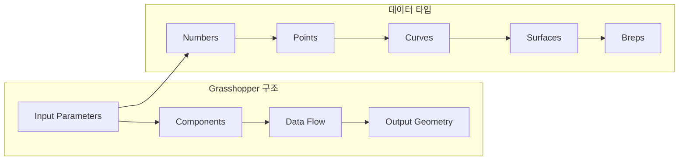
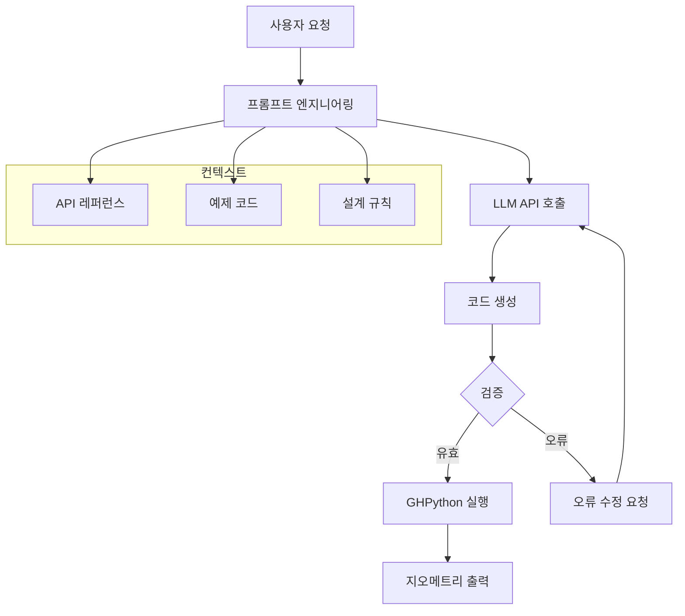
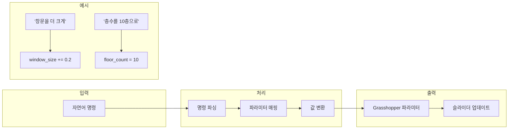
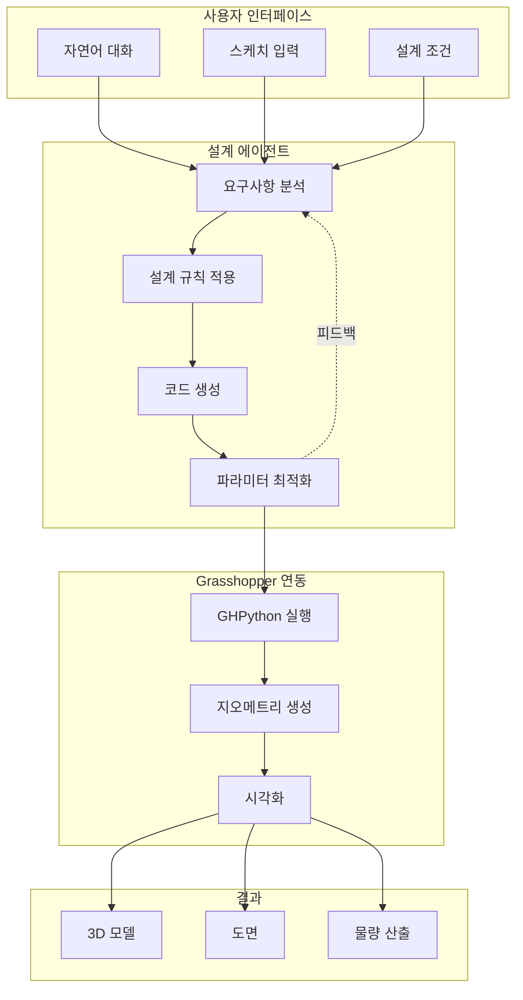

# 13주차: 파라메트릭 설계와 LLM 연동

## 📌 강의 중점

- Grasshopper와 GHPython 기초 이해
- LLM을 활용한 파라메트릭 스크립트 생성
- 자연어 기반 설계 파라미터 제어
- 설계 자동화 워크플로우 구축

## 🎯 학습 목표

이번 강의를 마치면 다음을 수행할 수 있습니다:
- Grasshopper 컴포넌트 구조와 데이터 흐름 이해
- GHPython 스크립트 작성 및 디버깅
- LLM을 통한 GHPython 코드 자동 생성
- 자연어 명령으로 설계 파라미터 조정
- 파라메트릭 설계 자동화 에이전트 구축

---

## [Chapter 1] Grasshopper와 GHPython 기초

### 1.1 Grasshopper 개요

Grasshopper는 Rhino3D의 비주얼 프로그래밍 환경으로, 노드 기반 파라메트릭 설계를 가능하게 합니다.



### 1.2 GHPython 컴포넌트

GHPython은 Grasshopper 내에서 Python 코드를 실행할 수 있는 컴포넌트입니다.

```python
# GHPython 기본 구조
"""
GHPython Component
Inputs:
    x: float - X 좌표
    y: float - Y 좌표
    z: float - Z 좌표
    radius: float - 반지름
Output:
    a: geometry - 생성된 지오메트리
"""

import Rhino.Geometry as rg

# 포인트 생성
center = rg.Point3d(x, y, z)

# 원 생성
plane = rg.Plane.WorldXY
plane.Origin = center
circle = rg.Circle(plane, radius)

# 출력
a = circle.ToNurbsCurve()
```

### 1.3 rhinoscriptsyntax vs RhinoCommon

```python
# rhinoscriptsyntax - 간단한 작업에 적합
import rhinoscriptsyntax as rs

point = rs.AddPoint(0, 0, 0)
circle = rs.AddCircle(point, 10)

# RhinoCommon - 복잡한 지오메트리 작업에 적합
import Rhino.Geometry as rg

point = rg.Point3d(0, 0, 0)
plane = rg.Plane(point, rg.Vector3d.ZAxis)
circle = rg.Circle(plane, 10)
```

### 1.4 데이터 트리 (Data Tree)

Grasshopper의 핵심 데이터 구조인 DataTree를 이해합니다.

```python
import Rhino.Geometry as rg
from Grasshopper import DataTree
from Grasshopper.Kernel.Data import GH_Path

# DataTree 생성
tree = DataTree[rg.Point3d]()

# 층별 포인트 추가
for floor in range(5):
    path = GH_Path(floor)
    for i in range(4):
        pt = rg.Point3d(i * 3, floor * 3, 0)
        tree.Add(pt, path)

# 출력
a = tree
```

### 📚 참고 자료
- [Rhino.Python Guides](https://developer.rhino3d.com/guides/rhinopython/)
- [RhinoCommon API Reference](https://developer.rhino3d.com/api/RhinoCommon/)
- [Grasshopper Primer](https://www.modelab.is/grasshopper-primer)

---

## [Chapter 2] LLM 기반 GHPython 코드 생성

### 2.1 코드 생성 시스템 아키텍처



### 2.2 GHPython 코드 생성기

```python
"""
ghpython_generator.py
LLM을 활용한 GHPython 코드 생성기
"""

from anthropic import Anthropic
from typing import Optional
import re

class GHPythonGenerator:
    """GHPython 코드 자동 생성기"""

    SYSTEM_PROMPT = """당신은 Grasshopper GHPython 전문가입니다.
사용자의 요청에 따라 GHPython 코드를 생성합니다.

규칙:
1. RhinoCommon (Rhino.Geometry) 사용
2. 입력 파라미터는 x, y, z, count, radius 등 명확한 이름 사용
3. 출력은 'a' 변수에 할당
4. 코드에 한글 주석 포함
5. 데이터 트리 사용 시 GH_Path 활용

사용 가능한 import:
- import Rhino.Geometry as rg
- from Grasshopper import DataTree
- from Grasshopper.Kernel.Data import GH_Path
- import math

응답 형식:
```python
# 코드 설명
[코드]
```

Inputs:
[입력 파라미터 설명]

Outputs:
[출력 설명]
"""

    def __init__(self, api_key: str):
        self.client = Anthropic(api_key=api_key)
        self.examples = self._load_examples()

    def _load_examples(self) -> str:
        """예제 코드 로드"""
        return """
예제 1: 그리드 포인트 생성
```python
import Rhino.Geometry as rg

points = []
for i in range(count_x):
    for j in range(count_y):
        pt = rg.Point3d(i * spacing, j * spacing, 0)
        points.append(pt)
a = points
```

예제 2: 원형 배열
```python
import Rhino.Geometry as rg
import math

circles = []
for i in range(count):
    angle = (2 * math.pi / count) * i
    x = radius * math.cos(angle)
    y = radius * math.sin(angle)
    center = rg.Point3d(x, y, 0)
    plane = rg.Plane(center, rg.Vector3d.ZAxis)
    circle = rg.Circle(plane, circle_radius)
    circles.append(circle.ToNurbsCurve())
a = circles
```

예제 3: 파라메트릭 파사드
```python
import Rhino.Geometry as rg
from Grasshopper import DataTree
from Grasshopper.Kernel.Data import GH_Path

panels = DataTree[rg.Brep]()

for i in range(floors):
    path = GH_Path(i)
    for j in range(bays):
        # 패널 코너 포인트
        pt1 = rg.Point3d(j * bay_width, 0, i * floor_height)
        pt2 = rg.Point3d((j+1) * bay_width, 0, i * floor_height)
        pt3 = rg.Point3d((j+1) * bay_width, 0, (i+1) * floor_height)
        pt4 = rg.Point3d(j * bay_width, 0, (i+1) * floor_height)

        # 패널 생성
        corners = [pt1, pt2, pt3, pt4, pt1]
        polyline = rg.Polyline(corners)
        panel = rg.Brep.CreatePlanarBreps(polyline.ToNurbsCurve(), 0.01)[0]
        panels.Add(panel, path)

a = panels
```
"""

    def generate(self, request: str, context: Optional[str] = None) -> dict:
        """GHPython 코드 생성"""

        # 컨텍스트 구성
        user_message = f"""
요청: {request}

{f"추가 컨텍스트: {context}" if context else ""}

참고 예제:
{self.examples}

위 요청에 맞는 GHPython 코드를 생성해주세요.
"""

        response = self.client.messages.create(
            model="claude-sonnet-4-20250514",
            max_tokens=2000,
            system=self.SYSTEM_PROMPT,
            messages=[{"role": "user", "content": user_message}]
        )

        content = response.content[0].text

        # 코드 추출
        code = self._extract_code(content)
        inputs = self._extract_inputs(content)

        return {
            "code": code,
            "inputs": inputs,
            "full_response": content,
            "tokens_used": response.usage.input_tokens + response.usage.output_tokens
        }

    def _extract_code(self, content: str) -> str:
        """응답에서 Python 코드 추출"""
        pattern = r'```python\n(.*?)```'
        matches = re.findall(pattern, content, re.DOTALL)
        return matches[0].strip() if matches else ""

    def _extract_inputs(self, content: str) -> list:
        """입력 파라미터 추출"""
        inputs = []
        pattern = r'Inputs:\s*(.*?)(?:Outputs:|$)'
        match = re.search(pattern, content, re.DOTALL)

        if match:
            input_text = match.group(1)
            # 파라미터 파싱
            param_pattern = r'-?\s*(\w+):\s*(\w+)\s*-\s*(.+)'
            for param_match in re.finditer(param_pattern, input_text):
                inputs.append({
                    "name": param_match.group(1),
                    "type": param_match.group(2),
                    "description": param_match.group(3).strip()
                })

        return inputs

    def validate_code(self, code: str) -> dict:
        """코드 유효성 검사"""
        errors = []
        warnings = []

        # 필수 import 체크
        if "Rhino.Geometry" not in code and "rhinoscriptsyntax" not in code:
            warnings.append("Rhino 라이브러리 import가 없습니다")

        # 출력 변수 체크
        if not re.search(r'^a\s*=', code, re.MULTILINE):
            errors.append("출력 변수 'a'에 할당이 없습니다")

        # 위험한 코드 체크
        dangerous_patterns = ['os.system', 'subprocess', 'eval(', 'exec(']
        for pattern in dangerous_patterns:
            if pattern in code:
                errors.append(f"위험한 코드 패턴 감지: {pattern}")

        return {
            "valid": len(errors) == 0,
            "errors": errors,
            "warnings": warnings
        }


# 사용 예시
if __name__ == "__main__":
    import os

    generator = GHPythonGenerator(os.getenv("ANTHROPIC_API_KEY"))

    # 코드 생성 요청
    result = generator.generate(
        request="5x5 그리드로 원을 배열하고, 각 원의 반지름이 중심에서 멀어질수록 작아지게 해주세요",
        context="건물 파사드의 원형 창문 패턴"
    )

    print("생성된 코드:")
    print(result["code"])
    print("\n입력 파라미터:")
    for inp in result["inputs"]:
        print(f"  - {inp['name']}: {inp['type']} - {inp['description']}")

    # 코드 검증
    validation = generator.validate_code(result["code"])
    print(f"\n유효성: {validation['valid']}")
    if validation["errors"]:
        print(f"오류: {validation['errors']}")
```

### 2.3 컨텍스트 기반 코드 개선

```python
"""
code_improver.py
생성된 코드의 품질 개선
"""

class CodeImprover:
    """GHPython 코드 품질 개선"""

    IMPROVEMENT_PROMPT = """다음 GHPython 코드를 개선해주세요.

현재 코드:
```python
{code}
```

개선 요청:
{improvements}

개선 시 고려사항:
1. 성능 최적화 (불필요한 반복 제거)
2. 코드 가독성
3. 에러 처리
4. 파라미터화 (하드코딩 값 제거)

개선된 코드를 ```python 블록으로 반환해주세요.
"""

    def __init__(self, client: Anthropic):
        self.client = client

    def improve(self, code: str, improvements: list[str]) -> str:
        """코드 개선"""

        response = self.client.messages.create(
            model="claude-sonnet-4-20250514",
            max_tokens=2000,
            messages=[{
                "role": "user",
                "content": self.IMPROVEMENT_PROMPT.format(
                    code=code,
                    improvements="\n".join(f"- {imp}" for imp in improvements)
                )
            }]
        )

        content = response.content[0].text

        # 개선된 코드 추출
        pattern = r'```python\n(.*?)```'
        matches = re.findall(pattern, content, re.DOTALL)

        return matches[0].strip() if matches else code

    def add_error_handling(self, code: str) -> str:
        """에러 처리 추가"""

        wrapped_code = f"""
try:
    {code.replace(chr(10), chr(10) + '    ')}
except Exception as e:
    import Rhino
    Rhino.RhinoApp.WriteLine(f"Error: {{str(e)}}")
    a = None
"""
        return wrapped_code.strip()
```

### 📚 참고 자료
- [Anthropic Claude API](https://docs.anthropic.com/claude/reference)
- [GHPython in Grasshopper](https://developer.rhino3d.com/guides/rhinopython/ghpython-component/)

---

## [Chapter 3] 자연어 기반 파라미터 제어

### 3.1 파라미터 제어 시스템



### 3.2 파라미터 매핑 시스템

```python
"""
parameter_mapper.py
자연어 명령을 Grasshopper 파라미터로 매핑
"""

from anthropic import Anthropic
from dataclasses import dataclass
from typing import Any
import json

@dataclass
class Parameter:
    """Grasshopper 파라미터"""
    name: str
    type: str  # float, int, bool, string
    current_value: Any
    min_value: Any = None
    max_value: Any = None
    description: str = ""

class ParameterMapper:
    """자연어 → 파라미터 매핑"""

    SYSTEM_PROMPT = """당신은 건축 파라메트릭 설계 전문가입니다.
사용자의 자연어 명령을 분석하여 파라미터 변경 사항을 JSON으로 반환합니다.

현재 사용 가능한 파라미터:
{parameters}

응답 형식 (JSON):
{{
    "changes": [
        {{
            "parameter": "파라미터_이름",
            "action": "set" | "increase" | "decrease",
            "value": 값 또는 변화량,
            "reason": "변경 이유"
        }}
    ],
    "understood": true | false,
    "clarification_needed": "필요시 추가 질문"
}}

규칙:
1. 파라미터 범위를 벗어나지 않도록 함
2. 모호한 표현은 적절히 해석 (크게 = +20%, 작게 = -20%)
3. 여러 파라미터가 관련되면 모두 반환
4. 이해 불가시 clarification_needed에 질문 작성
"""

    def __init__(self, api_key: str):
        self.client = Anthropic(api_key=api_key)
        self.parameters: dict[str, Parameter] = {}

    def register_parameter(self, param: Parameter):
        """파라미터 등록"""
        self.parameters[param.name] = param

    def get_parameters_description(self) -> str:
        """파라미터 목록을 문자열로 변환"""
        lines = []
        for name, param in self.parameters.items():
            range_str = ""
            if param.min_value is not None and param.max_value is not None:
                range_str = f" (범위: {param.min_value} ~ {param.max_value})"
            lines.append(
                f"- {name}: {param.type}, 현재값={param.current_value}{range_str}"
                f"\n  설명: {param.description}"
            )
        return "\n".join(lines)

    def parse_command(self, command: str) -> dict:
        """자연어 명령 파싱"""

        response = self.client.messages.create(
            model="claude-sonnet-4-20250514",
            max_tokens=1000,
            system=self.SYSTEM_PROMPT.format(
                parameters=self.get_parameters_description()
            ),
            messages=[{"role": "user", "content": command}]
        )

        content = response.content[0].text

        # JSON 추출
        try:
            # JSON 블록 찾기
            if "```json" in content:
                json_str = content.split("```json")[1].split("```")[0]
            elif "```" in content:
                json_str = content.split("```")[1].split("```")[0]
            else:
                json_str = content

            return json.loads(json_str)
        except json.JSONDecodeError:
            return {
                "changes": [],
                "understood": False,
                "clarification_needed": "명령을 이해하지 못했습니다. 다시 말씀해주세요."
            }

    def apply_changes(self, changes: list[dict]) -> dict[str, Any]:
        """파라미터 변경 적용"""

        results = {}

        for change in changes:
            param_name = change["parameter"]
            if param_name not in self.parameters:
                continue

            param = self.parameters[param_name]
            action = change["action"]
            value = change["value"]

            # 액션에 따른 처리
            if action == "set":
                new_value = value
            elif action == "increase":
                new_value = param.current_value + value
            elif action == "decrease":
                new_value = param.current_value - value
            else:
                continue

            # 범위 제한
            if param.min_value is not None:
                new_value = max(param.min_value, new_value)
            if param.max_value is not None:
                new_value = min(param.max_value, new_value)

            # 타입 변환
            if param.type == "int":
                new_value = int(new_value)
            elif param.type == "float":
                new_value = float(new_value)
            elif param.type == "bool":
                new_value = bool(new_value)

            # 업데이트
            param.current_value = new_value
            results[param_name] = new_value

        return results


# 사용 예시
if __name__ == "__main__":
    import os

    mapper = ParameterMapper(os.getenv("ANTHROPIC_API_KEY"))

    # 파라미터 등록
    mapper.register_parameter(Parameter(
        name="floor_count",
        type="int",
        current_value=5,
        min_value=1,
        max_value=50,
        description="건물 층수"
    ))

    mapper.register_parameter(Parameter(
        name="floor_height",
        type="float",
        current_value=3.5,
        min_value=2.5,
        max_value=6.0,
        description="층고 (미터)"
    ))

    mapper.register_parameter(Parameter(
        name="window_ratio",
        type="float",
        current_value=0.4,
        min_value=0.1,
        max_value=0.8,
        description="창면적비 (외벽 대비)"
    ))

    mapper.register_parameter(Parameter(
        name="bay_width",
        type="float",
        current_value=6.0,
        min_value=3.0,
        max_value=12.0,
        description="베이 폭 (미터)"
    ))

    # 자연어 명령 처리
    commands = [
        "건물을 10층으로 만들어줘",
        "창문을 좀 더 크게 해줘",
        "층고를 4미터로 설정하고 베이 폭도 좀 넓혀줘",
    ]

    for command in commands:
        print(f"\n명령: {command}")
        result = mapper.parse_command(command)

        if result["understood"]:
            changes = mapper.apply_changes(result["changes"])
            print(f"변경된 파라미터: {changes}")
            for change in result["changes"]:
                print(f"  - {change['parameter']}: {change['reason']}")
        else:
            print(f"추가 정보 필요: {result['clarification_needed']}")
```

### 3.3 Grasshopper Remote Control

```python
"""
gh_remote.py
Grasshopper 원격 제어 (Hops/Compute 연동)
"""

import httpx
from dataclasses import dataclass
from typing import Any

@dataclass
class GrasshopperParameter:
    """GH 파라미터"""
    guid: str
    name: str
    value: Any

class GrasshopperRemote:
    """Grasshopper 원격 제어"""

    def __init__(self, compute_url: str = "http://localhost:8081"):
        self.compute_url = compute_url
        self.client = httpx.Client(timeout=30.0)

    def set_slider(self, slider_guid: str, value: float) -> bool:
        """슬라이더 값 설정"""
        try:
            response = self.client.post(
                f"{self.compute_url}/slider",
                json={
                    "guid": slider_guid,
                    "value": value
                }
            )
            return response.status_code == 200
        except Exception as e:
            print(f"슬라이더 설정 오류: {e}")
            return False

    def get_parameter(self, guid: str) -> Any:
        """파라미터 값 조회"""
        try:
            response = self.client.get(
                f"{self.compute_url}/parameter/{guid}"
            )
            if response.status_code == 200:
                return response.json().get("value")
            return None
        except Exception as e:
            print(f"파라미터 조회 오류: {e}")
            return None

    def solve_definition(self, definition_path: str, inputs: dict) -> dict:
        """GH 정의 실행"""
        try:
            response = self.client.post(
                f"{self.compute_url}/grasshopper",
                json={
                    "definition": definition_path,
                    "inputs": inputs
                }
            )
            if response.status_code == 200:
                return response.json()
            return {"error": response.text}
        except Exception as e:
            return {"error": str(e)}

    def export_geometry(self, output_guid: str, format: str = "json") -> bytes:
        """지오메트리 내보내기"""
        response = self.client.get(
            f"{self.compute_url}/geometry/{output_guid}",
            params={"format": format}
        )
        return response.content if response.status_code == 200 else b""
```

### 📚 참고 자료
- [Rhino Compute](https://developer.rhino3d.com/guides/compute/)
- [Hops Component](https://developer.rhino3d.com/guides/grasshopper/hops-component/)

---

## [Chapter 4] 설계 자동화 에이전트

### 4.1 에이전트 아키텍처



### 4.2 파라메트릭 설계 에이전트

```python
"""
parametric_design_agent.py
LangGraph 기반 파라메트릭 설계 에이전트
"""

from langgraph.graph import StateGraph, END
from typing import TypedDict, Annotated, Literal
from anthropic import Anthropic
import operator

# 상태 정의
class DesignState(TypedDict):
    # 입력
    user_request: str
    design_constraints: dict

    # 처리 과정
    requirements: list[str]
    design_rules: list[str]
    generated_code: str
    parameters: dict

    # 출력
    geometry_data: dict
    validation_result: dict

    # 메시지 히스토리
    messages: Annotated[list[dict], operator.add]

class ParametricDesignAgent:
    """파라메트릭 설계 에이전트"""

    def __init__(self, api_key: str):
        self.client = Anthropic(api_key=api_key)
        self.graph = self._build_graph()
        self.code_generator = GHPythonGenerator(api_key)
        self.parameter_mapper = ParameterMapper(api_key)

    def _build_graph(self) -> StateGraph:
        """워크플로우 그래프 구성"""

        workflow = StateGraph(DesignState)

        # 노드 추가
        workflow.add_node("analyze_requirements", self.analyze_requirements)
        workflow.add_node("apply_design_rules", self.apply_design_rules)
        workflow.add_node("generate_code", self.generate_code)
        workflow.add_node("optimize_parameters", self.optimize_parameters)
        workflow.add_node("validate_design", self.validate_design)
        workflow.add_node("generate_output", self.generate_output)

        # 엣지 정의
        workflow.set_entry_point("analyze_requirements")
        workflow.add_edge("analyze_requirements", "apply_design_rules")
        workflow.add_edge("apply_design_rules", "generate_code")
        workflow.add_edge("generate_code", "optimize_parameters")
        workflow.add_edge("optimize_parameters", "validate_design")

        # 조건부 엣지
        workflow.add_conditional_edges(
            "validate_design",
            self.should_regenerate,
            {
                "regenerate": "generate_code",
                "complete": "generate_output"
            }
        )

        workflow.add_edge("generate_output", END)

        return workflow.compile()

    def analyze_requirements(self, state: DesignState) -> dict:
        """요구사항 분석"""

        response = self.client.messages.create(
            model="claude-sonnet-4-20250514",
            max_tokens=1000,
            system="""건축 설계 요구사항을 분석합니다.
사용자 요청에서 다음을 추출하세요:
1. 필수 요구사항 (must-have)
2. 선호 요구사항 (nice-to-have)
3. 제약 조건 (constraints)
4. 설계 목표 (goals)

JSON 형식으로 반환하세요.""",
            messages=[{
                "role": "user",
                "content": f"요청: {state['user_request']}\n제약조건: {state.get('design_constraints', {})}"
            }]
        )

        # 응답 파싱
        requirements = self._parse_requirements(response.content[0].text)

        return {
            "requirements": requirements,
            "messages": [{
                "role": "assistant",
                "content": f"요구사항 분석 완료: {len(requirements)}개 항목 추출"
            }]
        }

    def apply_design_rules(self, state: DesignState) -> dict:
        """설계 규칙 적용"""

        # 건축 설계 규칙 데이터베이스
        design_rules_db = {
            "floor_height": {
                "min": 2.7,
                "max": 6.0,
                "default": 3.5,
                "rule": "거주용 최소 2.7m, 상업용 권장 3.5m 이상"
            },
            "window_ratio": {
                "min": 0.1,
                "max": 0.7,
                "rule": "에너지 효율을 위해 0.3~0.5 권장"
            },
            "column_spacing": {
                "min": 6.0,
                "max": 12.0,
                "rule": "경제적 스팬 6~9m"
            }
        }

        # 요구사항에 맞는 규칙 선택
        applicable_rules = []
        for req in state.get("requirements", []):
            for rule_name, rule_data in design_rules_db.items():
                if rule_name.replace("_", " ") in req.lower():
                    applicable_rules.append(f"{rule_name}: {rule_data['rule']}")

        return {
            "design_rules": applicable_rules,
            "messages": [{
                "role": "assistant",
                "content": f"적용된 설계 규칙: {len(applicable_rules)}개"
            }]
        }

    def generate_code(self, state: DesignState) -> dict:
        """GHPython 코드 생성"""

        # 컨텍스트 구성
        context = f"""
요구사항: {state.get('requirements', [])}
설계 규칙: {state.get('design_rules', [])}
제약조건: {state.get('design_constraints', {})}
"""

        result = self.code_generator.generate(
            request=state["user_request"],
            context=context
        )

        return {
            "generated_code": result["code"],
            "messages": [{
                "role": "assistant",
                "content": f"GHPython 코드 생성 완료 ({result['tokens_used']} 토큰 사용)"
            }]
        }

    def optimize_parameters(self, state: DesignState) -> dict:
        """파라미터 최적화"""

        # 기본 파라미터 추출
        code = state.get("generated_code", "")

        # 코드에서 파라미터 추출 (간단한 휴리스틱)
        import re
        params = {}

        # 변수 할당 패턴 찾기
        assignments = re.findall(r'(\w+)\s*=\s*(\d+\.?\d*)', code)
        for name, value in assignments:
            if name not in ['i', 'j', 'k', 'x', 'y', 'z']:  # 루프 변수 제외
                params[name] = float(value)

        return {
            "parameters": params,
            "messages": [{
                "role": "assistant",
                "content": f"파라미터 추출: {list(params.keys())}"
            }]
        }

    def validate_design(self, state: DesignState) -> dict:
        """설계 검증"""

        code = state.get("generated_code", "")
        validation = self.code_generator.validate_code(code)

        # 설계 규칙 검증
        params = state.get("parameters", {})
        rule_violations = []

        # 간단한 규칙 검증
        if params.get("floor_height", 3.5) < 2.7:
            rule_violations.append("층고가 최소 기준(2.7m) 미만")

        validation["rule_violations"] = rule_violations
        validation["valid"] = validation["valid"] and len(rule_violations) == 0

        return {
            "validation_result": validation,
            "messages": [{
                "role": "assistant",
                "content": f"검증 결과: {'통과' if validation['valid'] else '실패'}"
            }]
        }

    def should_regenerate(self, state: DesignState) -> Literal["regenerate", "complete"]:
        """재생성 필요 여부 판단"""

        validation = state.get("validation_result", {})

        if not validation.get("valid", True):
            # 최대 3회 재시도
            regenerate_count = sum(
                1 for msg in state.get("messages", [])
                if "코드 생성 완료" in msg.get("content", "")
            )
            if regenerate_count < 3:
                return "regenerate"

        return "complete"

    def generate_output(self, state: DesignState) -> dict:
        """최종 출력 생성"""

        return {
            "geometry_data": {
                "code": state.get("generated_code", ""),
                "parameters": state.get("parameters", {}),
                "validation": state.get("validation_result", {})
            },
            "messages": [{
                "role": "assistant",
                "content": "설계 완료! GHPython 코드와 파라미터가 생성되었습니다."
            }]
        }

    def _parse_requirements(self, text: str) -> list[str]:
        """요구사항 파싱"""
        requirements = []

        # JSON 파싱 시도
        try:
            import json
            if "```json" in text:
                json_str = text.split("```json")[1].split("```")[0]
            else:
                json_str = text

            data = json.loads(json_str)

            for key in ["must_have", "nice_to_have", "constraints", "goals"]:
                if key in data:
                    requirements.extend(data[key])
        except:
            # 텍스트에서 직접 추출
            lines = text.split("\n")
            for line in lines:
                if line.strip().startswith("-"):
                    requirements.append(line.strip()[1:].strip())

        return requirements

    def run(self, request: str, constraints: dict = None) -> dict:
        """에이전트 실행"""

        initial_state = {
            "user_request": request,
            "design_constraints": constraints or {},
            "requirements": [],
            "design_rules": [],
            "generated_code": "",
            "parameters": {},
            "geometry_data": {},
            "validation_result": {},
            "messages": []
        }

        result = self.graph.invoke(initial_state)
        return result


# 사용 예시
if __name__ == "__main__":
    import os

    agent = ParametricDesignAgent(os.getenv("ANTHROPIC_API_KEY"))

    result = agent.run(
        request="10층 오피스 빌딩의 파사드를 설계해줘. 층고 4m, 베이 폭 8m로 하고, 창문은 가로로 긴 띠창 형태로 해줘.",
        constraints={
            "building_width": 40,
            "building_depth": 20,
            "max_window_ratio": 0.6
        }
    )

    print("\n=== 설계 결과 ===")
    print(f"생성된 코드:\n{result['geometry_data']['code']}")
    print(f"\n파라미터: {result['geometry_data']['parameters']}")
    print(f"\n대화 히스토리:")
    for msg in result["messages"]:
        print(f"  - {msg['content']}")
```

### 4.3 설계 이력 관리

```python
"""
design_history.py
설계 버전 및 이력 관리
"""

from dataclasses import dataclass, field
from datetime import datetime
from typing import Optional
import json
import hashlib

@dataclass
class DesignVersion:
    """설계 버전"""
    version_id: str
    timestamp: datetime
    code: str
    parameters: dict
    user_request: str
    parent_version: Optional[str] = None
    notes: str = ""

class DesignHistoryManager:
    """설계 이력 관리"""

    def __init__(self):
        self.versions: dict[str, DesignVersion] = {}
        self.current_version: Optional[str] = None

    def create_version(
        self,
        code: str,
        parameters: dict,
        user_request: str,
        notes: str = ""
    ) -> str:
        """새 버전 생성"""

        # 버전 ID 생성 (코드 해시 기반)
        content_hash = hashlib.md5(code.encode()).hexdigest()[:8]
        timestamp = datetime.now()
        version_id = f"v{timestamp.strftime('%Y%m%d_%H%M%S')}_{content_hash}"

        version = DesignVersion(
            version_id=version_id,
            timestamp=timestamp,
            code=code,
            parameters=parameters.copy(),
            user_request=user_request,
            parent_version=self.current_version,
            notes=notes
        )

        self.versions[version_id] = version
        self.current_version = version_id

        return version_id

    def get_version(self, version_id: str) -> Optional[DesignVersion]:
        """버전 조회"""
        return self.versions.get(version_id)

    def get_history(self) -> list[DesignVersion]:
        """전체 이력 조회"""
        return sorted(
            self.versions.values(),
            key=lambda v: v.timestamp,
            reverse=True
        )

    def rollback(self, version_id: str) -> bool:
        """특정 버전으로 롤백"""
        if version_id in self.versions:
            self.current_version = version_id
            return True
        return False

    def compare_versions(self, v1_id: str, v2_id: str) -> dict:
        """두 버전 비교"""
        v1 = self.versions.get(v1_id)
        v2 = self.versions.get(v2_id)

        if not v1 or not v2:
            return {"error": "버전을 찾을 수 없습니다"}

        # 파라미터 변경 사항
        param_changes = {}
        all_keys = set(v1.parameters.keys()) | set(v2.parameters.keys())

        for key in all_keys:
            val1 = v1.parameters.get(key)
            val2 = v2.parameters.get(key)
            if val1 != val2:
                param_changes[key] = {"from": val1, "to": val2}

        return {
            "from_version": v1_id,
            "to_version": v2_id,
            "time_diff": (v2.timestamp - v1.timestamp).total_seconds(),
            "parameter_changes": param_changes,
            "code_changed": v1.code != v2.code
        }

    def export_history(self, filepath: str):
        """이력 내보내기"""
        data = {
            "current_version": self.current_version,
            "versions": [
                {
                    "version_id": v.version_id,
                    "timestamp": v.timestamp.isoformat(),
                    "code": v.code,
                    "parameters": v.parameters,
                    "user_request": v.user_request,
                    "parent_version": v.parent_version,
                    "notes": v.notes
                }
                for v in self.versions.values()
            ]
        }

        with open(filepath, "w", encoding="utf-8") as f:
            json.dump(data, f, ensure_ascii=False, indent=2)
```

### 📚 참고 자료
- [LangGraph Documentation](https://langchain-ai.github.io/langgraph/)
- [Grasshopper Developer Guide](https://developer.rhino3d.com/guides/grasshopper/)

---

## 💻 실습: 파사드 설계 자동화

### 실습 목표
자연어 명령으로 건물 파사드를 자동 생성하는 시스템 구축

### 실습 코드

```python
"""
facade_design_lab.py
파사드 설계 자동화 실습
"""

import os
from anthropic import Anthropic

# 간단한 파사드 생성기
class FacadeDesigner:
    """파사드 설계 보조"""

    FACADE_TEMPLATE = '''import Rhino.Geometry as rg
from Grasshopper import DataTree
from Grasshopper.Kernel.Data import GH_Path
import math

# 파라미터
floors = {floors}  # 층수
bays = {bays}  # 베이 수
floor_height = {floor_height}  # 층고 (m)
bay_width = {bay_width}  # 베이 폭 (m)
window_width_ratio = {window_width_ratio}  # 창문 폭 비율
window_height_ratio = {window_height_ratio}  # 창문 높이 비율

# 결과 저장
panels = DataTree[rg.Brep]()
windows = DataTree[rg.Brep]()

for i in range(floors):
    panel_path = GH_Path(0, i)
    window_path = GH_Path(1, i)

    for j in range(bays):
        # 패널 (외벽) 생성
        p1 = rg.Point3d(j * bay_width, 0, i * floor_height)
        p2 = rg.Point3d((j + 1) * bay_width, 0, i * floor_height)
        p3 = rg.Point3d((j + 1) * bay_width, 0, (i + 1) * floor_height)
        p4 = rg.Point3d(j * bay_width, 0, (i + 1) * floor_height)

        panel_pts = [p1, p2, p3, p4, p1]
        panel_curve = rg.Polyline(panel_pts).ToNurbsCurve()
        panel = rg.Brep.CreatePlanarBreps(panel_curve, 0.01)[0]
        panels.Add(panel, panel_path)

        # 창문 생성
        win_w = bay_width * window_width_ratio
        win_h = floor_height * window_height_ratio
        win_margin_x = (bay_width - win_w) / 2
        win_margin_z = (floor_height - win_h) / 2

        w1 = rg.Point3d(j * bay_width + win_margin_x, -0.1, i * floor_height + win_margin_z)
        w2 = rg.Point3d(j * bay_width + win_margin_x + win_w, -0.1, i * floor_height + win_margin_z)
        w3 = rg.Point3d(j * bay_width + win_margin_x + win_w, -0.1, i * floor_height + win_margin_z + win_h)
        w4 = rg.Point3d(j * bay_width + win_margin_x, -0.1, i * floor_height + win_margin_z + win_h)

        win_pts = [w1, w2, w3, w4, w1]
        win_curve = rg.Polyline(win_pts).ToNurbsCurve()
        window = rg.Brep.CreatePlanarBreps(win_curve, 0.01)[0]
        windows.Add(window, window_path)

# 출력
a = panels  # 외벽 패널
b = windows  # 창문
'''

    def __init__(self, api_key: str):
        self.client = Anthropic(api_key=api_key)

    def design_facade(self, description: str) -> dict:
        """자연어 설명으로 파사드 설계"""

        response = self.client.messages.create(
            model="claude-sonnet-4-20250514",
            max_tokens=1000,
            system="""건축 파사드 설계 파라미터를 추출합니다.
사용자 설명에서 다음 파라미터를 추출하여 JSON으로 반환하세요:
- floors: 층수 (기본값: 5)
- bays: 베이 수 (기본값: 4)
- floor_height: 층고 (기본값: 3.5)
- bay_width: 베이 폭 (기본값: 6.0)
- window_width_ratio: 창문 폭 비율 0~1 (기본값: 0.6)
- window_height_ratio: 창문 높이 비율 0~1 (기본값: 0.5)

JSON만 반환하세요.""",
            messages=[{"role": "user", "content": description}]
        )

        # 파라미터 파싱
        import json
        try:
            content = response.content[0].text
            if "```" in content:
                content = content.split("```")[1]
                if content.startswith("json"):
                    content = content[4:]
            params = json.loads(content)
        except:
            params = {}

        # 기본값 적용
        defaults = {
            "floors": 5,
            "bays": 4,
            "floor_height": 3.5,
            "bay_width": 6.0,
            "window_width_ratio": 0.6,
            "window_height_ratio": 0.5
        }

        for key, default in defaults.items():
            if key not in params:
                params[key] = default

        # 코드 생성
        code = self.FACADE_TEMPLATE.format(**params)

        return {
            "parameters": params,
            "code": code,
            "description": description
        }


# 실습 실행
def main():
    api_key = os.getenv("ANTHROPIC_API_KEY")
    if not api_key:
        print("ANTHROPIC_API_KEY 환경변수를 설정하세요")
        return

    designer = FacadeDesigner(api_key)

    # 다양한 파사드 설계 테스트
    test_cases = [
        "10층 오피스 빌딩, 층고 4m, 베이 5개, 넓은 창문",
        "3층 상가건물, 층고 5m, 창문은 세로로 길게",
        "20층 주거용 타워, 표준 층고, 창문 비율 40%"
    ]

    for desc in test_cases:
        print(f"\n{'='*60}")
        print(f"요청: {desc}")
        print('='*60)

        result = designer.design_facade(desc)

        print(f"\n추출된 파라미터:")
        for key, value in result["parameters"].items():
            print(f"  - {key}: {value}")

        print(f"\n생성된 코드 미리보기:")
        print(result["code"][:500] + "...")


if __name__ == "__main__":
    main()
```

---

## 📝 과제

### 과제 1: 커스텀 파라메트릭 컴포넌트
- 자신만의 파라메트릭 요소 (계단, 난간, 루버 등) 선택
- LLM으로 GHPython 코드 생성
- 자연어로 파라미터 조절 구현

### 과제 2: 설계 규칙 엔진
- 건축법규나 설계 기준을 규칙으로 정의
- LLM이 이 규칙을 참조하여 코드 생성
- 규칙 위반 시 자동 경고 및 수정

### 제출물
- GHPython 코드 파일 (.py)
- 테스트 시나리오 및 결과 스크린샷
- 설계 규칙 정의 문서

---

## 📚 추가 참고 자료

### 공식 문서
- [Rhino Developer Docs](https://developer.rhino3d.com/)
- [Grasshopper SDK](https://developer.rhino3d.com/api/grasshopper/)
- [RhinoCommon Guides](https://developer.rhino3d.com/guides/rhinocommon/)

### 튜토리얼
- [GHPython 101](https://www.food4rhino.com/en/resource/ghpython)
- [Design Computing Course](https://www.youtube.com/playlist?list=PLvxxYImPCApUXhX3te3IK32ileXHpzKY4)

### GitHub 저장소
- [Ladybug Tools](https://github.com/ladybug-tools) - 환경 분석
- [Karamba3D](https://www.karamba3d.com/) - 구조 해석
- [Human UI](https://github.com/andrewheumann/humanui) - 커스텀 UI

### 관련 논문
- "Computational Design Thinking" - 파라메트릭 설계 이론
- "AI-Assisted Architectural Design" - AI 설계 보조 연구

---

## 🚀 발전 전략 (Development Strategies)

### 전략 1: 실전 GHPython 마스터리 워크샵

**목표**: Grasshopper와 GHPython의 실무 활용 능력 강화

**구체적 실습 과제**:

1. **기초 지오메트리 생성 연습** (1-2시간)
   ```python
   # 실습 1: 나선형 계단 생성기
   """
   요구사항:
   - 입력: 층고, 회전각, 단 높이, 반지름
   - 출력: 나선형 계단 3D 모델
   - 추가: 난간 자동 생성
   """

   # 실습 2: 파라메트릭 트러스 구조
   """
   요구사항:
   - 입력: 스팬, 높이, 부재 개수, 트러스 타입
   - 출력: 3D 트러스 구조
   - 분석: 부재 길이 및 접합부 좌표 추출
   """

   # 실습 3: 적응형 루버 시스템
   """
   요구사항:
   - 입력: 파사드 면적, 태양 각도, 루버 간격
   - 출력: 태양광에 반응하는 루버 배열
   - 최적화: 그늘 면적 최대화
   """
   ```

2. **DataTree 마스터 과제**
   - 5층 건물의 층별/베이별 데이터 구조 생성
   - 각 층의 창문 정보를 DataTree로 관리
   - 조건부 필터링 (예: 남향 창문만 선택)
   - 물량 산출 (층별 창문 면적 합계)

3. **실무 프로젝트 시뮬레이션**
   ```
   프로젝트: 복합용도 빌딩 설계

   Phase 1: 매스 스터디 (1주)
   - 대지 경계선에서 세트백 적용
   - 법정 용적률/건폐율 준수
   - 일조권 사선 제한 적용

   Phase 2: 평면 계획 (1주)
   - 코어 배치 자동화
   - 층별 평면 타입 변화
   - 피난 거리 검증

   Phase 3: 입면 설계 (1주)
   - 파사드 패턴 생성
   - 창호 비율 최적화
   - 입면 다양성 확보
   ```

**실무 팁**:
- Rhino 모델과 Grasshopper 정의를 항상 함께 저장
- 복잡한 컴포넌트는 Cluster로 묶어 재사용
- Scribble 노트로 워크플로우 문서화
- Git으로 GH 정의 파일 버전 관리

---

### 전략 2: LLM 코드 생성 파이프라인 구축

**목표**: 자연어 → GHPython 코드 자동 생성 시스템 완성

**단계별 구현**:

**Step 1: 프롬프트 라이브러리 구축**
```python
# prompt_library.py
class GHPythonPromptLibrary:
    """검증된 프롬프트 템플릿 모음"""

    TEMPLATES = {
        "geometry_generation": """
다음 지오메트리를 생성하는 GHPython 코드를 작성하세요:

지오메트리 타입: {geometry_type}
파라미터:
{parameters}

요구사항:
1. RhinoCommon (Rhino.Geometry) 사용
2. 입력 파라미터 이름: {input_names}
3. 출력 변수: a
4. 에러 처리 포함
5. 한글 주석으로 설명

예시 코드 참고:
{example_code}
""",

        "pattern_array": """
다음 배열 패턴을 생성하세요:

패턴 타입: {pattern_type}
배치 방식: {arrangement}
반복 횟수: {count}
간격/반지름: {spacing}

DataTree 구조로 출력하세요.
""",

        "optimization": """
다음 조건을 만족하도록 최적화하세요:

목표: {objective}
제약조건:
{constraints}

현재 코드:
```python
{current_code}
```

개선 방향:
1. 성능 최적화 (루프 최소화)
2. 코드 가독성
3. 파라미터화
"""
    }

    def get_prompt(self, template_name: str, **kwargs) -> str:
        """프롬프트 생성"""
        template = self.TEMPLATES.get(template_name)
        if not template:
            raise ValueError(f"템플릿 없음: {template_name}")
        return template.format(**kwargs)
```

**Step 2: 코드 검증 시스템**
```python
# code_validator.py
class GHPythonValidator:
    """생성된 코드의 품질 검증"""

    def validate_comprehensive(self, code: str) -> dict:
        """종합 검증"""
        checks = {
            "syntax": self.check_syntax(code),
            "imports": self.check_imports(code),
            "outputs": self.check_outputs(code),
            "safety": self.check_safety(code),
            "performance": self.estimate_performance(code),
            "documentation": self.check_documentation(code)
        }

        return {
            "valid": all(c["passed"] for c in checks.values()),
            "checks": checks,
            "score": self.calculate_score(checks)
        }

    def check_performance(self, code: str) -> dict:
        """성능 이슈 감지"""
        issues = []

        # 중첩 루프 체크
        nesting_level = self._count_loop_nesting(code)
        if nesting_level > 3:
            issues.append({
                "severity": "warning",
                "message": f"루프 중첩 깊이 {nesting_level} (권장: 3 이하)"
            })

        # 리스트 연산 체크
        if "append" in code and "for" in code:
            if code.count("append") > 1000:
                issues.append({
                    "severity": "error",
                    "message": "대량 append 연산 감지 (리스트 컴프리헨션 권장)"
                })

        return {
            "passed": len([i for i in issues if i["severity"] == "error"]) == 0,
            "issues": issues
        }
```

**Step 3: 반복 개선 시스템**
```python
# iterative_improver.py
class IterativeCodeImprover:
    """코드 생성 실패 시 자동 재시도"""

    def improve_with_feedback(
        self,
        initial_request: str,
        failed_code: str,
        error_messages: list[str],
        max_iterations: int = 3
    ) -> dict:
        """피드백 기반 개선"""

        for iteration in range(max_iterations):
            # 피드백 프롬프트 생성
            feedback_prompt = f"""
다음 코드에 오류가 있습니다:

원래 요청: {initial_request}

생성된 코드:
```python
{failed_code}
```

오류 메시지:
{chr(10).join(error_messages)}

문제점을 분석하고 수정된 코드를 생성하세요.

수정 시 고려사항:
1. 오류 원인 명확히 파악
2. Rhino.Geometry API 정확히 사용
3. 타입 불일치 해결
4. 경계 조건 처리
"""

            # LLM으로 개선된 코드 생성
            improved = self.generator.generate(feedback_prompt)

            # 검증
            validation = self.validator.validate_comprehensive(improved["code"])

            if validation["valid"]:
                return {
                    "success": True,
                    "code": improved["code"],
                    "iterations": iteration + 1,
                    "validation": validation
                }

            # 다음 반복을 위해 업데이트
            failed_code = improved["code"]
            error_messages = validation["checks"]["syntax"]["errors"]

        return {
            "success": False,
            "code": failed_code,
            "iterations": max_iterations,
            "message": "최대 반복 횟수 초과"
        }
```

**실전 활용 예시**:
```python
# 실제 사용 시나리오
pipeline = GHPythonPipeline(api_key=ANTHROPIC_API_KEY)

request = "건물 높이에 따라 크기가 변하는 발코니를 5층 건물에 생성해줘"

result = pipeline.generate_with_validation(
    request=request,
    context={
        "building_type": "residential",
        "floor_height": 3.0,
        "balcony_depth": 1.5
    },
    max_iterations=3
)

if result["success"]:
    print(f"✅ 코드 생성 완료 ({result['iterations']}회 반복)")
    print(f"📊 품질 점수: {result['validation']['score']}/100")

    # Grasshopper에 적용
    gh_remote.execute_code(result["code"])
else:
    print(f"❌ 생성 실패: {result['message']}")
```

---

### 전략 3: 건축 법규 기반 자동 검증 시스템

**목표**: LLM이 건축법규를 이해하고 설계 검증하는 시스템 구축

**구현 방법**:

**1. 법규 데이터베이스 구축**
```python
# building_codes.py
class BuildingCodeDatabase:
    """건축 법규 데이터베이스"""

    CODES = {
        "floor_height": {
            "residential": {
                "min": 2.1,  # 주거용 최소 층고
                "recommended": 2.3,
                "regulation": "건축법 시행령 제32조"
            },
            "office": {
                "min": 2.7,
                "recommended": 3.5,
                "regulation": "건축법 시행령 제32조"
            }
        },

        "window_area_ratio": {
            "residential": {
                "min": 0.1,  # 거실 바닥 면적의 1/10 이상
                "regulation": "건축법 시행령 제51조"
            }
        },

        "setback": {
            "general": {
                "road_width_8m": 1.5,  # 8m 도로: 1.5m 이상
                "road_width_12m": 2.0,  # 12m 도로: 2.0m 이상
                "regulation": "건축법 제58조"
            }
        },

        "evacuation_distance": {
            "residential": {
                "max_direct": 30,  # 직통계단까지 최대 30m
                "max_via_corridor": 40,  # 복도 경유 시 40m
                "regulation": "건축법 시행령 제34조"
            }
        },

        "fire_compartment": {
            "area_limit": 1000,  # 방화구획 면적 제한 (㎡)
            "regulation": "건축법 시행령 제46조"
        }
    }

    def get_code(self, category: str, sub_category: str = None):
        """법규 조회"""
        if sub_category:
            return self.CODES.get(category, {}).get(sub_category)
        return self.CODES.get(category)

    def validate_parameter(self, category: str, building_type: str, value: float) -> dict:
        """파라미터 법규 검증"""
        code = self.CODES.get(category, {}).get(building_type)

        if not code:
            return {"valid": True, "note": "해당 법규 없음"}

        violations = []
        warnings = []

        if "min" in code and value < code["min"]:
            violations.append({
                "type": "minimum_violation",
                "current": value,
                "required": code["min"],
                "regulation": code["regulation"]
            })

        if "max" in code and value > code["max"]:
            violations.append({
                "type": "maximum_violation",
                "current": value,
                "required": code["max"],
                "regulation": code["regulation"]
            })

        if "recommended" in code and value < code["recommended"]:
            warnings.append({
                "type": "below_recommended",
                "current": value,
                "recommended": code["recommended"]
            })

        return {
            "valid": len(violations) == 0,
            "violations": violations,
            "warnings": warnings
        }
```

**2. LLM 기반 법규 해석 시스템**
```python
# code_interpreter.py
class BuildingCodeInterpreter:
    """자연어 법규를 설계에 적용"""

    SYSTEM_PROMPT = """당신은 건축법규 전문가입니다.
사용자의 설계를 분석하여 관련 법규를 적용하고 위반 사항을 검출합니다.

사용 가능한 법규 데이터베이스:
{code_database}

검증 절차:
1. 설계 파라미터 추출
2. 적용 가능한 법규 식별
3. 각 법규에 대해 검증
4. 위반 사항 및 개선 방안 제시

응답 형식 (JSON):
{{
    "applicable_codes": ["법규1", "법규2"],
    "violations": [
        {{
            "code": "법규명",
            "regulation": "법령 조항",
            "current_value": 현재값,
            "required_value": 요구값,
            "severity": "critical" | "warning",
            "suggestion": "개선 방안"
        }}
    ],
    "compliance_score": 0-100
}}
"""

    def check_design(self, design_params: dict, building_type: str) -> dict:
        """설계 검증"""

        response = self.client.messages.create(
            model="claude-sonnet-4-20250514",
            max_tokens=2000,
            system=self.SYSTEM_PROMPT.format(
                code_database=self.code_db.get_all_codes()
            ),
            messages=[{
                "role": "user",
                "content": f"""
설계 파라미터:
{json.dumps(design_params, indent=2, ensure_ascii=False)}

건물 용도: {building_type}

이 설계가 건축법규를 준수하는지 검증해주세요.
"""
            }]
        )

        return self._parse_response(response.content[0].text)
```

**3. 실시간 검증 Grasshopper 컴포넌트**
```python
"""
GHPython Component: Building Code Checker
실시간으로 설계 법규 검증
"""
import Rhino.Geometry as rg
import json

# 입력 파라미터
# floor_height: float
# building_use: str
# window_area: float
# floor_area: float

# 법규 검증기 초기화
checker = BuildingCodeChecker()

# 검증 실행
results = checker.validate_all({
    "floor_height": floor_height,
    "window_area_ratio": window_area / floor_area,
    "building_type": building_use
})

# 위반 사항 시각화
violations_text = []
warnings_text = []

for v in results["violations"]:
    violations_text.append(
        f"❌ {v['code']}: 현재 {v['current_value']}, "
        f"요구 {v['required_value']} ({v['regulation']})"
    )

for w in results["warnings"]:
    warnings_text.append(
        f"⚠️ {w['code']}: {w['message']}"
    )

# 출력
a = results["compliance_score"]  # 점수 (0-100)
b = violations_text  # 위반 사항
c = warnings_text  # 경고 사항
d = results["compliant"]  # Boolean: 법규 준수 여부
```

**실전 시나리오**:
```
사용자: "15층 오피스 빌딩 설계해줘. 층고는 3.2m로."

시스템 검증:
1. 층고 검증
   ✅ 오피스 최소 층고(2.7m) 충족
   ✅ 권장 층고(3.5m)에 근접

2. 피난 규정
   ⚠️ 11층 이상: 비상용 엘리베이터 설치 필요
   ⚠️ 직통계단 2개소 이상 필요

3. 방화 규정
   ⚠️ 내화구조 적용 필요
   ⚠️ 방화구획 1000㎡마다 구획

결과: "법규 준수율 85% (경고 4건)"
```

---

### 전략 4: 대화형 설계 챗봇 개발

**목표**: 건축가와 자연스러운 대화로 설계를 진행하는 AI 에이전트 구축

**핵심 기능**:

**1. 다중 턴 대화 관리**
```python
# design_chatbot.py
from langgraph.graph import StateGraph
from langgraph.checkpoint.memory import MemorySaver

class ParametricDesignChatbot:
    """대화형 파라메트릭 설계 챗봇"""

    class ConversationState(TypedDict):
        # 대화 컨텍스트
        conversation_history: list[dict]
        current_design: dict
        design_stage: str  # "concept" | "development" | "refinement"

        # 설계 데이터
        parameters: dict
        generated_code: str
        geometry_preview: str

        # 사용자 의도
        user_intent: str
        pending_clarifications: list[str]

    def __init__(self, api_key: str):
        self.client = Anthropic(api_key=api_key)
        self.memory = MemorySaver()
        self.graph = self._build_conversation_graph()

    def _build_conversation_graph(self):
        """대화 흐름 그래프"""

        workflow = StateGraph(self.ConversationState)

        # 노드: 대화 단계
        workflow.add_node("understand_intent", self.understand_intent)
        workflow.add_node("ask_clarification", self.ask_clarification)
        workflow.add_node("update_design", self.update_design)
        workflow.add_node("generate_preview", self.generate_preview)
        workflow.add_node("suggest_improvements", self.suggest_improvements)

        # 엣지: 대화 흐름
        workflow.set_entry_point("understand_intent")

        workflow.add_conditional_edges(
            "understand_intent",
            self.needs_clarification,
            {
                "clarify": "ask_clarification",
                "proceed": "update_design"
            }
        )

        workflow.add_edge("ask_clarification", "understand_intent")
        workflow.add_edge("update_design", "generate_preview")

        workflow.add_conditional_edges(
            "generate_preview",
            self.should_suggest,
            {
                "suggest": "suggest_improvements",
                "end": END
            }
        )

        return workflow.compile(checkpointer=self.memory)

    def understand_intent(self, state: ConversationState) -> dict:
        """사용자 의도 파악"""

        last_message = state["conversation_history"][-1]["content"]

        # 대화 컨텍스트 포함
        context_prompt = f"""
현재 설계 단계: {state['design_stage']}
현재 파라미터: {json.dumps(state['parameters'], ensure_ascii=False)}

대화 이력:
{self._format_history(state['conversation_history'][-5:])}

사용자 메시지: {last_message}

사용자의 의도를 파악하세요:
1. new_design: 새로운 설계 시작
2. modify_parameter: 파라미터 수정
3. add_feature: 기능 추가
4. optimize: 최적화 요청
5. explain: 설명 요청
6. unclear: 명확하지 않음

JSON 응답:
{{
    "intent": "의도 타입",
    "extracted_params": {{}},
    "confidence": 0.0-1.0,
    "needs_clarification": true/false,
    "clarification_questions": []
}}
"""

        response = self.client.messages.create(
            model="claude-sonnet-4-20250514",
            max_tokens=1000,
            messages=[{"role": "user", "content": context_prompt}]
        )

        intent_data = self._parse_json_response(response.content[0].text)

        return {
            "user_intent": intent_data["intent"],
            "pending_clarifications": intent_data.get("clarification_questions", [])
        }

    def chat(self, user_message: str, session_id: str = "default") -> str:
        """대화 처리"""

        # 세션에서 상태 로드
        config = {"configurable": {"thread_id": session_id}}

        current_state = self.graph.get_state(config)

        if not current_state:
            # 새 세션 시작
            initial_state = {
                "conversation_history": [],
                "current_design": {},
                "design_stage": "concept",
                "parameters": {},
                "generated_code": "",
                "geometry_preview": "",
                "user_intent": "",
                "pending_clarifications": []
            }
        else:
            initial_state = current_state.values

        # 사용자 메시지 추가
        initial_state["conversation_history"].append({
            "role": "user",
            "content": user_message
        })

        # 대화 그래프 실행
        result = self.graph.invoke(initial_state, config)

        # 응답 생성
        if result["pending_clarifications"]:
            response = self._format_clarification(result["pending_clarifications"])
        else:
            response = self._format_design_update(result)

        # 응답 저장
        result["conversation_history"].append({
            "role": "assistant",
            "content": response
        })

        return response
```

**2. 맥락 인식 대화**
```python
# 실제 대화 예시

chatbot = ParametricDesignChatbot(api_key=ANTHROPIC_API_KEY)
session = "project_alpha_001"

# Turn 1
response1 = chatbot.chat("오피스 빌딩 파사드를 만들고 싶어", session)
# "좋습니다! 몇 가지 정보가 필요합니다:
#  1. 건물은 몇 층인가요?
#  2. 각 층의 높이는?
#  3. 원하시는 창문 스타일은?"

# Turn 2
response2 = chatbot.chat("10층이고 층고는 3.5m. 창문은 가로로 긴 띠창.", session)
# "알겠습니다! 10층, 층고 3.5m, 가로 띠창 스타일로 설계하겠습니다.
#  베이 폭과 창문 비율은 어떻게 할까요?"

# Turn 3
response3 = chatbot.chat("베이는 8m, 창문은 외벽의 60% 정도", session)
# "✅ 파라미터 설정 완료:
#  - 층수: 10층
#  - 층고: 3.5m
#  - 베이 폭: 8m
#  - 창문 비율: 60%
#  - 창문 스타일: 가로 띠창
#
#  [미리보기 생성 중...]
#
#  설계가 완료되었습니다. 코드를 Grasshopper에 적용할까요?"

# Turn 4
response4 = chatbot.chat("응, 그런데 창문을 좀 더 크게 해줘", session)
# "창문 비율을 70%로 조정하겠습니다.
#  [코드 재생성 중...]
#  완료! 변경 사항이 반영되었습니다."
```

**3. 프로액티브 제안**
```python
class ProactiveSuggestionEngine:
    """설계 개선 제안 엔진"""

    def analyze_and_suggest(self, design_params: dict) -> list[str]:
        """설계 분석 후 개선안 제안"""

        suggestions = []

        # 에너지 효율 체크
        if design_params.get("window_ratio", 0) > 0.7:
            suggestions.append({
                "category": "energy",
                "priority": "medium",
                "message": "창면적비가 70%를 초과합니다. 냉난방 부하가 증가할 수 있습니다.",
                "suggestion": "창면적비를 50-60%로 줄이거나 고성능 유리 적용을 권장합니다."
            })

        # 구조 효율 체크
        if design_params.get("bay_width", 0) > 10:
            suggestions.append({
                "category": "structure",
                "priority": "high",
                "message": "베이 폭이 10m를 초과합니다.",
                "suggestion": "구조적 효율을 위해 6-9m 범위를 권장합니다. 또는 중간 기둥 추가를 고려하세요."
            })

        # 법규 체크
        floor_height = design_params.get("floor_height", 0)
        building_use = design_params.get("building_type", "")

        if building_use == "office" and floor_height < 3.5:
            suggestions.append({
                "category": "regulation",
                "priority": "medium",
                "message": f"오피스 층고가 {floor_height}m입니다.",
                "suggestion": "쾌적한 업무 환경을 위해 3.5m 이상을 권장합니다."
            })

        return suggestions
```

---

### 전략 5: 멀티모달 설계 인터페이스

**목표**: 스케치, 이미지, 3D 모델을 입력으로 받아 파라메트릭 설계로 변환

**구현 단계**:

**1. 스케치 → 파라미터 추출**
```python
# sketch_analyzer.py
class SketchToParametric:
    """손그림 스케치를 파라메트릭 설계로 변환"""

    def analyze_sketch(self, image_path: str) -> dict:
        """스케치 이미지 분석"""

        # Claude Vision API로 이미지 분석
        with open(image_path, "rb") as f:
            image_data = base64.b64encode(f.read()).decode()

        response = self.client.messages.create(
            model="claude-sonnet-4-20250514",
            max_tokens=2000,
            messages=[{
                "role": "user",
                "content": [
                    {
                        "type": "image",
                        "source": {
                            "type": "base64",
                            "media_type": "image/png",
                            "data": image_data
                        }
                    },
                    {
                        "type": "text",
                        "text": """이 건축 스케치를 분석하여 파라메트릭 설계 파라미터를 추출하세요.

분석 항목:
1. 건물 형태 (직사각형, L자형, 코트야드 등)
2. 층수 (스케치에서 층 구분선 개수)
3. 주요 치수 비율 (폭:깊이:높이)
4. 입면 패턴 (창문 배치, 파사드 요소)
5. 특징적 요소 (발코니, 캐노피, 루버 등)

JSON으로 반환:
{{
    "building_shape": "형태",
    "floors": 층수,
    "proportions": {{"width": 1.0, "depth": 0.6, "height": 2.0}},
    "facade_pattern": "패턴 설명",
    "special_features": ["요소1", "요소2"]
}}
"""
                    }
                ]
            }]
        )

        return self._parse_sketch_analysis(response.content[0].text)

    def generate_from_sketch(self, sketch_analysis: dict) -> str:
        """스케치 분석 결과로 GHPython 코드 생성"""

        prompt = f"""
다음 스케치 분석 결과를 바탕으로 GHPython 코드를 생성하세요:

{json.dumps(sketch_analysis, indent=2, ensure_ascii=False)}

요구사항:
1. 스케치의 비율을 최대한 반영
2. 층수와 형태 정확히 구현
3. 특징 요소들 모두 포함
4. 파라미터화하여 조정 가능하게
"""

        return self.code_generator.generate(prompt)
```

**2. 참조 이미지 → 스타일 전이**
```python
# style_transfer.py
class ArchitecturalStyleTransfer:
    """참조 건물 이미지의 스타일을 파라메트릭 설계에 적용"""

    def extract_style_features(self, reference_image: str) -> dict:
        """참조 이미지에서 스타일 특징 추출"""

        # Claude Vision으로 건축적 특징 분석
        analysis_prompt = """
이 건물 이미지를 분석하여 파라메트릭 설계에 적용할 수 있는 특징을 추출하세요:

분석 항목:
1. 파사드 패턴 (반복 요소, 리듬, 비율)
2. 창호 시스템 (크기, 간격, 형태)
3. 재료 표현 (질감, 색상, 구조)
4. 입체감 (돌출, 후퇴, 레이어)
5. 기하학적 특징 (직선/곡선, 대칭/비대칭)

JSON 응답:
{{
    "pattern": {{
        "type": "grid | random | organic",
        "module_size": "치수 비율",
        "repetition": "규칙적 | 불규칙적"
    }},
    "windows": {{
        "aspect_ratio": 숫자,
        "spacing_ratio": 숫자,
        "shape": "rectangular | arched | custom"
    }},
    "depth": {{
        "max_projection": 숫자,
        "layering": "단일 | 다층"
    }},
    "geometry": {{
        "primary": "rectilinear | curved | faceted",
        "symmetry": "symmetric | asymmetric"
    }}
}}
"""

        features = self._analyze_image(reference_image, analysis_prompt)
        return features

    def apply_style(self, base_code: str, style_features: dict) -> str:
        """기본 설계에 스타일 적용"""

        style_prompt = f"""
다음 GHPython 코드를 참조 건물의 스타일에 맞게 수정하세요:

현재 코드:
```python
{base_code}
```

적용할 스타일 특징:
{json.dumps(style_features, indent=2, ensure_ascii=False)}

수정 방향:
1. 창호 비율을 스타일에 맞게 조정
2. 파사드 패턴 적용
3. 입체감 표현 (돌출/후퇴)
4. 전체적인 비례 조정
"""

        return self.code_generator.improve(base_code, style_prompt)
```

**3. 실시간 비전 피드백**
```python
# vision_feedback.py
class RealtimeVisionFeedback:
    """생성된 3D 모델을 시각적으로 평가하고 피드백"""

    def evaluate_design(self, rendered_image: str, target_criteria: dict) -> dict:
        """렌더링 이미지 평가"""

        evaluation_prompt = f"""
이 건축 렌더링을 다음 기준으로 평가하세요:

평가 기준:
{json.dumps(target_criteria, indent=2, ensure_ascii=False)}

평가 항목:
1. 비례와 스케일 (0-10점)
2. 파사드 통일성 (0-10점)
3. 시각적 균형 (0-10점)
4. 기능적 타당성 (0-10점)

개선 제안:
- 구체적인 수정 사항 3가지

JSON 응답:
{{
    "scores": {{
        "proportion": 점수,
        "coherence": 점수,
        "balance": 점수,
        "functionality": 점수
    }},
    "total_score": 평균점수,
    "suggestions": ["제안1", "제안2", "제안3"]
}}
"""

        return self._evaluate_image(rendered_image, evaluation_prompt)
```

**실제 워크플로우**:
```
1. 사용자가 손그림 스케치 업로드
   ↓
2. Claude Vision이 스케치 분석
   - 층수: 5층
   - 형태: 직사각형
   - 특징: 발코니, 수평 창호
   ↓
3. GHPython 코드 자동 생성
   ↓
4. Grasshopper에서 3D 모델 생성
   ↓
5. 렌더링 이미지를 Claude Vision으로 평가
   - 비례: 8/10
   - 개선: "발코니 깊이 20% 증가 권장"
   ↓
6. 자동 수정 후 재생성
   ↓
7. 최종 승인
```

---

### 전략 6: 협업 설계 플랫폼

**목표**: 여러 설계자가 LLM과 함께 실시간으로 협업하는 시스템

**구현 요소**:

**1. 버전 관리 시스템**
```python
# collaborative_design.py
class CollaborativeDesignPlatform:
    """협업 설계 플랫폼"""

    def __init__(self):
        self.active_sessions = {}
        self.version_control = DesignVersionControl()
        self.conflict_resolver = ConflictResolver()

    def create_session(self, project_id: str, participants: list[str]):
        """협업 세션 생성"""
        session = {
            "project_id": project_id,
            "participants": participants,
            "current_version": None,
            "pending_changes": {},
            "chat_history": [],
            "locked_parameters": {}
        }
        self.active_sessions[project_id] = session
        return session

    def propose_change(
        self,
        project_id: str,
        user_id: str,
        change_description: str
    ) -> dict:
        """변경 제안"""

        session = self.active_sessions[project_id]

        # LLM으로 변경 사항 분석
        analysis = self._analyze_change(
            current_design=session["current_version"],
            change_description=change_description
        )

        # 충돌 감지
        conflicts = self.conflict_resolver.detect_conflicts(
            proposed_change=analysis,
            pending_changes=session["pending_changes"]
        )

        if conflicts:
            # 충돌 해결 제안
            resolution = self._suggest_resolution(conflicts)
            return {
                "status": "conflict",
                "conflicts": conflicts,
                "resolution_suggestions": resolution
            }

        # 변경 사항 큐에 추가
        change_id = str(uuid.uuid4())
        session["pending_changes"][change_id] = {
            "user": user_id,
            "description": change_description,
            "analysis": analysis,
            "timestamp": datetime.now()
        }

        return {
            "status": "queued",
            "change_id": change_id,
            "estimated_impact": analysis["impact_score"]
        }

    def merge_changes(self, project_id: str, change_ids: list[str]):
        """변경 사항 병합"""

        session = self.active_sessions[project_id]
        changes_to_merge = [
            session["pending_changes"][cid]
            for cid in change_ids
            if cid in session["pending_changes"]
        ]

        # LLM으로 최적 병합 전략 결정
        merge_strategy = self._determine_merge_strategy(changes_to_merge)

        # 코드 병합
        merged_code = self._merge_code(
            base_code=session["current_version"]["code"],
            changes=changes_to_merge,
            strategy=merge_strategy
        )

        # 새 버전 생성
        new_version = self.version_control.create_version(
            code=merged_code,
            parent=session["current_version"]["version_id"],
            contributors=[c["user"] for c in changes_to_merge]
        )

        session["current_version"] = new_version

        # 병합된 변경 사항 제거
        for cid in change_ids:
            del session["pending_changes"][cid]

        return new_version
```

**2. 실시간 코멘트 시스템**
```python
# design_comments.py
class DesignCommentSystem:
    """설계 요소에 대한 코멘트 및 토론"""

    def add_comment(
        self,
        design_element: str,  # "floor_height", "window_pattern" 등
        comment: str,
        author: str
    ):
        """코멘트 추가"""

        # LLM으로 코멘트 분류
        analysis = self._analyze_comment(comment)

        comment_obj = {
            "id": str(uuid.uuid4()),
            "element": design_element,
            "content": comment,
            "author": author,
            "timestamp": datetime.now(),
            "type": analysis["type"],  # "question", "suggestion", "concern"
            "priority": analysis["priority"],
            "tags": analysis["tags"]
        }

        self.comments[design_element].append(comment_obj)

        # 관련 참여자에게 알림
        self._notify_participants(comment_obj)

        # 자동 응답 생성 (필요시)
        if analysis["needs_llm_response"]:
            ai_response = self._generate_ai_response(comment_obj)
            return {
                "comment": comment_obj,
                "ai_response": ai_response
            }

        return {"comment": comment_obj}

    def _generate_ai_response(self, comment: dict) -> str:
        """AI가 코멘트에 응답"""

        response_prompt = f"""
설계 요소 '{comment['element']}'에 대한 코멘트:
"{comment['content']}"

코멘트 타입: {comment['type']}
우선순위: {comment['priority']}

다음 역할로 응답하세요:
1. 질문이면 전문적인 답변 제공
2. 제안이면 기술적 타당성 평가
3. 우려사항이면 해결 방안 제시

건축 전문가로서 답변하세요.
"""

        response = self.client.messages.create(
            model="claude-sonnet-4-20250514",
            max_tokens=1000,
            messages=[{"role": "user", "content": response_prompt}]
        )

        return response.content[0].text
```

**3. 역할 기반 AI 어시스턴트**
```python
# role_based_assistants.py
class DesignTeamAssistants:
    """역할별 AI 어시스턴트"""

    ROLES = {
        "architect": {
            "focus": ["형태", "공간", "기능", "미학"],
            "concerns": ["설계 의도", "사용자 경험", "컨텍스트"]
        },
        "structural": {
            "focus": ["구조", "하중", "스팬", "안전"],
            "concerns": ["구조 효율", "시공성", "내구성"]
        },
        "mep": {
            "focus": ["설비", "배관", "전기", "공조"],
            "concerns": ["에너지 효율", "유지보수", "시스템 통합"]
        },
        "cost_estimator": {
            "focus": ["물량", "단가", "공사비"],
            "concerns": ["예산", "가치 공학", "대안 검토"]
        }
    }

    def get_role_feedback(self, role: str, design_params: dict) -> dict:
        """역할별 피드백"""

        role_config = self.ROLES[role]

        feedback_prompt = f"""
당신은 {role} 전문가입니다.

현재 설계:
{json.dumps(design_params, indent=2, ensure_ascii=False)}

당신의 전문 분야({', '.join(role_config['focus'])})에서
이 설계를 평가하고 피드백을 제공하세요.

특히 다음 사항을 고려하세요:
{', '.join(role_config['concerns'])}

응답 형식:
{{
    "overall_assessment": "평가",
    "concerns": ["우려사항1", "우려사항2"],
    "suggestions": ["제안1", "제안2"],
    "approval": true/false
}}
"""

        return self._get_llm_feedback(feedback_prompt)
```

**실제 협업 시나리오**:
```
프로젝트: 50층 복합용도 빌딩

참여자:
- 설계팀장 (김건축)
- 구조설계 (이구조)
- 설비설계 (박설비)
- AI 어시스턴트 (Claude)

타임라인:
10:00 - 김건축: "코어 위치를 중앙에서 좌측으로 이동"
10:05 - AI: 충돌 감지 - 이구조가 제안한 "기둥 간격 조정"과 충돌
10:10 - AI: 충돌 해결 제안 - "코어 이동 시 기둥 배치 자동 조정"
10:15 - 이구조: 제안 승인
10:20 - 박설비: "코어 이동하면 수직 샤프트 재배치 필요"
10:25 - AI: 설비 레이아웃 자동 재생성
10:30 - 전체 변경 사항 병합 완료

결과: 3개 변경 사항이 15분 내에 충돌 없이 통합됨
```

---

### 전략 7: 성능 분석 통합 시스템

**목표**: 파라메트릭 설계와 성능 분석(구조, 에너지, 일조 등)을 LLM으로 연결

**구현 방법**:

**1. 성능 분석 자동화**
```python
# performance_analyzer.py
class PerformanceAnalysisIntegration:
    """성능 분석 도구 통합"""

    def __init__(self):
        self.analyzers = {
            "structure": self._analyze_structure,
            "energy": self._analyze_energy,
            "daylighting": self._analyze_daylight,
            "thermal": self._analyze_thermal
        }

    def analyze_design(self, geometry_data: dict, analysis_types: list[str]) -> dict:
        """종합 성능 분석"""

        results = {}

        for analysis_type in analysis_types:
            if analysis_type in self.analyzers:
                analyzer = self.analyzers[analysis_type]
                results[analysis_type] = analyzer(geometry_data)

        # LLM으로 종합 평가
        comprehensive_evaluation = self._evaluate_performance(results)

        return {
            "analyses": results,
            "evaluation": comprehensive_evaluation,
            "optimization_suggestions": self._suggest_optimizations(results)
        }

    def _evaluate_performance(self, analysis_results: dict) -> str:
        """LLM으로 성능 종합 평가"""

        eval_prompt = f"""
다음 건축 성능 분석 결과를 종합 평가하세요:

{json.dumps(analysis_results, indent=2, ensure_ascii=False)}

평가 내용:
1. 각 분야별 성능 수준 (우수/양호/보통/미흡/불량)
2. 분야 간 상충점 (예: 자연채광 vs 열부하)
3. 전체적인 성능 균형
4. 우선 개선 대상

건축 성능 전문가 관점에서 종합적으로 평가하세요.
"""

        response = self.client.messages.create(
            model="claude-sonnet-4-20250514",
            max_tokens=2000,
            messages=[{"role": "user", "content": eval_prompt}]
        )

        return response.content[0].text

    def _suggest_optimizations(self, analysis_results: dict) -> list[dict]:
        """최적화 제안"""

        optimization_prompt = f"""
성능 분석 결과:
{json.dumps(analysis_results, indent=2, ensure_ascii=False)}

다음 형식으로 최적화 제안을 하세요:

JSON 배열:
[
    {{
        "target_parameter": "파라미터명",
        "current_value": 현재값,
        "suggested_value": 제안값,
        "expected_improvement": "예상 개선 효과",
        "trade_offs": "상충 효과",
        "priority": "high" | "medium" | "low"
    }}
]

각 성능 분야를 고려하여 균형잡힌 제안을 하세요.
"""

        response = self.client.messages.create(
            model="claude-sonnet-4-20250514",
            max_tokens=2000,
            messages=[{"role": "user", "content": optimization_prompt}]
        )

        return self._parse_json_response(response.content[0].text)

    def _analyze_structure(self, geometry_data: dict) -> dict:
        """구조 해석 (Karamba3D 연동)"""
        # Karamba3D API 호출
        return {
            "max_displacement": 15.2,  # mm
            "max_stress": 180,  # MPa
            "utilization_ratio": 0.75,
            "status": "acceptable"
        }

    def _analyze_energy(self, geometry_data: dict) -> dict:
        """에너지 분석 (Ladybug/Honeybee 연동)"""
        return {
            "annual_energy_use": 125,  # kWh/m²/year
            "heating_load": 45,
            "cooling_load": 60,
            "daylighting_autonomy": 0.65,
            "status": "good"
        }
```

**2. 최적화 루프**
```python
# optimization_loop.py
class PerformanceOptimizationLoop:
    """성능 기반 자동 최적화"""

    def optimize_design(
        self,
        initial_params: dict,
        optimization_goals: dict,
        max_iterations: int = 10
    ) -> dict:
        """반복 최적화"""

        current_params = initial_params.copy()
        history = []

        for iteration in range(max_iterations):
            # 현재 설계 생성
            code = self.code_generator.generate_from_params(current_params)
            geometry = self.execute_grasshopper(code)

            # 성능 분석
            performance = self.analyzer.analyze_design(
                geometry,
                list(optimization_goals.keys())
            )

            # 목표 달성 여부 확인
            if self._check_goals_met(performance, optimization_goals):
                return {
                    "success": True,
                    "iterations": iteration + 1,
                    "final_params": current_params,
                    "performance": performance
                }

            # LLM으로 다음 파라미터 제안
            next_params = self._suggest_next_iteration(
                current_params=current_params,
                performance=performance,
                goals=optimization_goals,
                history=history
            )

            history.append({
                "iteration": iteration,
                "params": current_params,
                "performance": performance
            })

            current_params = next_params

        return {
            "success": False,
            "iterations": max_iterations,
            "best_params": self._find_best_in_history(history),
            "message": "최대 반복 횟수 도달"
        }

    def _suggest_next_iteration(
        self,
        current_params: dict,
        performance: dict,
        goals: dict,
        history: list
    ) -> dict:
        """다음 반복 파라미터 제안"""

        suggestion_prompt = f"""
파라메트릭 설계 최적화를 진행 중입니다.

현재 파라미터:
{json.dumps(current_params, indent=2)}

현재 성능:
{json.dumps(performance['analyses'], indent=2)}

목표 성능:
{json.dumps(goals, indent=2)}

최적화 이력:
{json.dumps(history[-3:], indent=2) if history else "없음"}

목표 성능에 가까워지도록 파라미터를 조정하세요.

JSON 응답:
{{
    "adjusted_params": {{파라미터: 값}},
    "reasoning": "조정 근거",
    "expected_effect": "예상 효과"
}}
"""

        response = self.client.messages.create(
            model="claude-sonnet-4-20250514",
            max_tokens=1500,
            messages=[{"role": "user", "content": suggestion_prompt}]
        )

        suggestion = self._parse_json_response(response.content[0].text)
        return suggestion["adjusted_params"]
```

**실제 최적화 시나리오**:
```
목표: 에너지 효율 최적화

초기 설계:
- 창면적비: 50%
- 차양: 없음
- 단열: R-3.0

Iteration 1:
- 분석: 냉방 부하 높음 (80 kWh/m²)
- AI 제안: 창면적비 40%로 감소
- 적용 → 재분석

Iteration 2:
- 분석: 자연채광 부족 (DA 45%)
- AI 제안: 창면적비 45% + 수평 차양 추가
- 적용 → 재분석

Iteration 3:
- 분석: 목표 달성 (냉방 60 kWh/m², DA 65%)
- 최적화 완료

결과: 3회 반복으로 에너지 25% 절감
```

---

## 📊 학습 로드맵 (4주 집중 과정)

### Week 1: 기초 다지기
- Day 1-2: GHPython 기본 문법 및 Rhino.Geometry 마스터
- Day 3-4: DataTree 이해 및 실습
- Day 5-7: 10개 기본 컴포넌트 직접 구현 (원, 그리드, 배열 등)

### Week 2: LLM 통합
- Day 1-3: 코드 생성기 구축 및 프롬프트 최적화
- Day 4-5: 파라미터 매핑 시스템 개발
- Day 6-7: 실제 프로젝트에 적용 (파사드 설계)

### Week 3: 고급 기능
- Day 1-2: 대화형 챗봇 개발
- Day 3-4: 성능 분석 통합
- Day 5-7: 협업 시스템 구축

### Week 4: 실전 프로젝트
- 종합 프로젝트: 완전 자동화 설계 시스템 구축
- 포트폴리오 작성
- 발표 및 피드백
