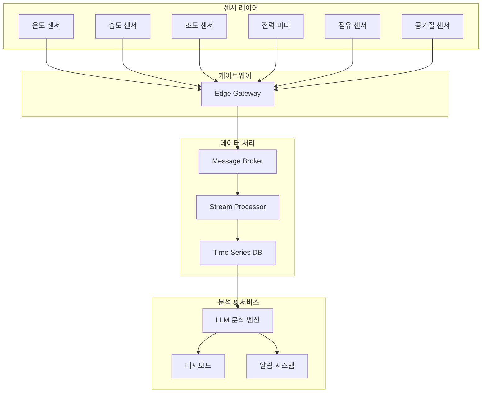
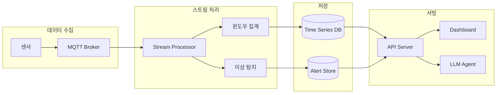
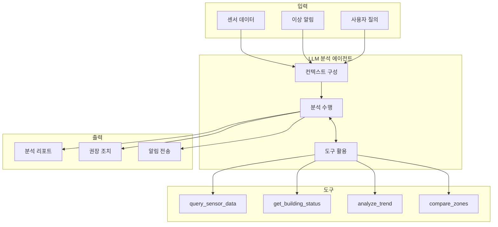
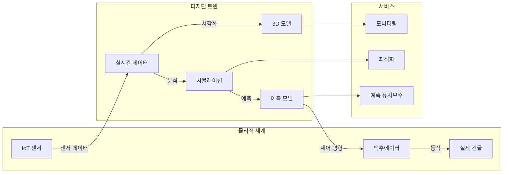

# 14주차: IoT 연동과 디지털 트윈

## 📌 강의 중점

- IoT 센서 데이터의 수집과 처리
- 실시간 데이터 파이프라인 구축
- LLM 기반 이상 탐지 및 분석
- 건물 디지털 트윈 개념과 구현

## 🎯 학습 목표

이번 강의를 마치면 다음을 수행할 수 있습니다:
- IoT 센서 데이터를 Python으로 수집 및 처리
- 실시간 데이터 스트림 파이프라인 구축
- LLM을 활용한 센서 데이터 이상 탐지
- 자연어로 건물 상태 조회 및 제어
- 간단한 디지털 트윈 시스템 구현

---

## [Chapter 1] IoT 센서와 데이터 수집

### 1.1 건물 IoT 시스템 개요



### 1.2 센서 데이터 모델

```python
"""
sensor_models.py
IoT 센서 데이터 모델 정의
"""

from dataclasses import dataclass, field
from datetime import datetime
from typing import Optional, Literal
from enum import Enum

class SensorType(str, Enum):
    """센서 유형"""
    TEMPERATURE = "temperature"
    HUMIDITY = "humidity"
    ILLUMINANCE = "illuminance"
    POWER = "power"
    OCCUPANCY = "occupancy"
    CO2 = "co2"
    PM25 = "pm25"

@dataclass
class SensorReading:
    """센서 측정값"""
    sensor_id: str
    sensor_type: SensorType
    value: float
    unit: str
    timestamp: datetime
    location: str  # 예: "B1-101" (건물-층-실)
    quality: float = 1.0  # 데이터 품질 0~1

    def to_dict(self) -> dict:
        return {
            "sensor_id": self.sensor_id,
            "sensor_type": self.sensor_type.value,
            "value": self.value,
            "unit": self.unit,
            "timestamp": self.timestamp.isoformat(),
            "location": self.location,
            "quality": self.quality
        }

@dataclass
class SensorConfig:
    """센서 설정"""
    sensor_id: str
    sensor_type: SensorType
    location: str
    min_value: float
    max_value: float
    normal_range: tuple[float, float]
    sampling_interval: int  # 초
    metadata: dict = field(default_factory=dict)

@dataclass
class BuildingZone:
    """건물 존"""
    zone_id: str
    name: str
    floor: int
    area: float  # m²
    sensors: list[str] = field(default_factory=list)
    hvac_zone: Optional[str] = None
```

### 1.3 센서 시뮬레이터

```python
"""
sensor_simulator.py
테스트용 센서 데이터 시뮬레이터
"""

import asyncio
import random
import math
from datetime import datetime, timedelta
from typing import AsyncGenerator
from dataclasses import dataclass

class SensorSimulator:
    """센서 데이터 시뮬레이터"""

    def __init__(self, config: SensorConfig):
        self.config = config
        self._base_value = sum(config.normal_range) / 2
        self._running = False

    def _generate_value(self, timestamp: datetime) -> float:
        """시간에 따른 센서 값 생성"""

        hour = timestamp.hour
        minute = timestamp.minute
        time_factor = hour + minute / 60

        # 센서 유형별 패턴
        if self.config.sensor_type == SensorType.TEMPERATURE:
            # 일간 온도 변화 패턴
            daily_variation = 3 * math.sin((time_factor - 6) * math.pi / 12)
            noise = random.gauss(0, 0.5)
            return self._base_value + daily_variation + noise

        elif self.config.sensor_type == SensorType.HUMIDITY:
            # 온도 반비례 습도
            daily_variation = -5 * math.sin((time_factor - 6) * math.pi / 12)
            noise = random.gauss(0, 2)
            return max(20, min(80, self._base_value + daily_variation + noise))

        elif self.config.sensor_type == SensorType.ILLUMINANCE:
            # 주간/야간 조도 변화
            if 7 <= hour <= 18:
                base = 500 + 300 * math.sin((time_factor - 7) * math.pi / 11)
            else:
                base = 50
            noise = random.gauss(0, 30)
            return max(0, base + noise)

        elif self.config.sensor_type == SensorType.POWER:
            # 업무시간 전력 사용 패턴
            if 9 <= hour <= 18:
                base = self._base_value * 1.5
            else:
                base = self._base_value * 0.3
            noise = random.gauss(0, base * 0.1)
            return max(0, base + noise)

        elif self.config.sensor_type == SensorType.OCCUPANCY:
            # 재실 인원 패턴
            if 9 <= hour <= 18:
                base = self._base_value * (1 - abs(hour - 13.5) / 10)
            else:
                base = 0
            noise = random.randint(-2, 2)
            return max(0, int(base + noise))

        elif self.config.sensor_type == SensorType.CO2:
            # CO2 농도 (재실과 연동)
            if 9 <= hour <= 18:
                base = 600 + 200 * math.sin((time_factor - 9) * math.pi / 9)
            else:
                base = 400
            noise = random.gauss(0, 20)
            return max(350, base + noise)

        else:
            return self._base_value + random.gauss(0, 1)

    async def stream(self) -> AsyncGenerator[SensorReading, None]:
        """센서 데이터 스트림 생성"""

        self._running = True

        while self._running:
            timestamp = datetime.now()
            value = self._generate_value(timestamp)

            reading = SensorReading(
                sensor_id=self.config.sensor_id,
                sensor_type=self.config.sensor_type,
                value=round(value, 2),
                unit=self._get_unit(),
                timestamp=timestamp,
                location=self.config.location
            )

            yield reading

            await asyncio.sleep(self.config.sampling_interval)

    def _get_unit(self) -> str:
        """센서 유형별 단위"""
        units = {
            SensorType.TEMPERATURE: "°C",
            SensorType.HUMIDITY: "%",
            SensorType.ILLUMINANCE: "lux",
            SensorType.POWER: "kW",
            SensorType.OCCUPANCY: "명",
            SensorType.CO2: "ppm",
            SensorType.PM25: "μg/m³"
        }
        return units.get(self.config.sensor_type, "")

    def stop(self):
        """스트림 중지"""
        self._running = False

    def inject_anomaly(self, anomaly_type: str = "spike"):
        """이상 데이터 주입 (테스트용)"""
        if anomaly_type == "spike":
            self._base_value *= 2
        elif anomaly_type == "drift":
            self._base_value += self.config.max_value * 0.3
        elif anomaly_type == "stuck":
            # 값이 고정됨 (별도 처리 필요)
            pass


class BuildingSimulator:
    """건물 전체 시뮬레이터"""

    def __init__(self):
        self.sensors: dict[str, SensorSimulator] = {}
        self._setup_default_sensors()

    def _setup_default_sensors(self):
        """기본 센서 구성"""

        # 1층 로비
        self._add_zone_sensors("B1-L01", "1F 로비", [
            (SensorType.TEMPERATURE, (20, 26)),
            (SensorType.HUMIDITY, (40, 60)),
            (SensorType.CO2, (400, 1000)),
            (SensorType.ILLUMINANCE, (300, 500)),
        ])

        # 2층 사무실
        self._add_zone_sensors("B1-201", "2F 사무실A", [
            (SensorType.TEMPERATURE, (22, 26)),
            (SensorType.HUMIDITY, (40, 55)),
            (SensorType.CO2, (400, 800)),
            (SensorType.OCCUPANCY, (0, 30)),
            (SensorType.POWER, (5, 20)),
        ])

        # 지하 주차장
        self._add_zone_sensors("B1-B1P", "B1 주차장", [
            (SensorType.TEMPERATURE, (10, 30)),
            (SensorType.CO2, (400, 1500)),
            (SensorType.PM25, (0, 50)),
        ])

    def _add_zone_sensors(
        self,
        location: str,
        name: str,
        sensor_specs: list[tuple]
    ):
        """존에 센서 추가"""

        for sensor_type, normal_range in sensor_specs:
            sensor_id = f"{location}_{sensor_type.value}"

            config = SensorConfig(
                sensor_id=sensor_id,
                sensor_type=sensor_type,
                location=location,
                min_value=normal_range[0] * 0.5,
                max_value=normal_range[1] * 1.5,
                normal_range=normal_range,
                sampling_interval=5,
                metadata={"zone_name": name}
            )

            self.sensors[sensor_id] = SensorSimulator(config)

    async def run_all(self, callback):
        """모든 센서 실행"""

        async def run_sensor(sensor: SensorSimulator):
            async for reading in sensor.stream():
                await callback(reading)

        tasks = [
            asyncio.create_task(run_sensor(sensor))
            for sensor in self.sensors.values()
        ]

        await asyncio.gather(*tasks)


# 사용 예시
async def main():
    simulator = BuildingSimulator()

    readings_buffer = []

    async def on_reading(reading: SensorReading):
        readings_buffer.append(reading)
        print(f"[{reading.timestamp.strftime('%H:%M:%S')}] "
              f"{reading.location} {reading.sensor_type.value}: "
              f"{reading.value} {reading.unit}")

        # 10개마다 출력
        if len(readings_buffer) >= 10:
            print(f"--- 수집된 데이터: {len(readings_buffer)}개 ---")

    # 30초간 실행
    try:
        await asyncio.wait_for(
            simulator.run_all(on_reading),
            timeout=30
        )
    except asyncio.TimeoutError:
        print("시뮬레이션 종료")


if __name__ == "__main__":
    asyncio.run(main())
```

### 📚 참고 자료
- [MQTT Protocol](https://mqtt.org/)
- [InfluxDB Time Series Database](https://www.influxdata.com/)
- [Building Automation (BACnet)](http://www.bacnet.org/)

---

## [Chapter 2] 실시간 데이터 파이프라인

### 2.1 데이터 파이프라인 아키텍처



### 2.2 스트림 처리기 구현

```python
"""
stream_processor.py
실시간 센서 데이터 스트림 처리
"""

import asyncio
from collections import defaultdict
from datetime import datetime, timedelta
from dataclasses import dataclass, field
from typing import Callable, Optional
import statistics

@dataclass
class WindowedStats:
    """윈도우 통계"""
    sensor_id: str
    window_start: datetime
    window_end: datetime
    count: int
    mean: float
    std: float
    min_value: float
    max_value: float
    latest_value: float

@dataclass
class AnomalyAlert:
    """이상 탐지 알림"""
    sensor_id: str
    timestamp: datetime
    alert_type: str  # spike, drift, stuck, out_of_range
    severity: str  # low, medium, high, critical
    current_value: float
    expected_range: tuple[float, float]
    message: str

class StreamProcessor:
    """스트림 데이터 처리기"""

    def __init__(
        self,
        window_size: int = 60,  # 초
        anomaly_threshold: float = 3.0  # 표준편차 배수
    ):
        self.window_size = window_size
        self.anomaly_threshold = anomaly_threshold

        # 센서별 데이터 버퍼
        self._buffers: dict[str, list[SensorReading]] = defaultdict(list)

        # 센서별 통계 히스토리
        self._stats_history: dict[str, list[WindowedStats]] = defaultdict(list)

        # 콜백 함수
        self._on_stats: Optional[Callable] = None
        self._on_anomaly: Optional[Callable] = None

    def on_stats(self, callback: Callable[[WindowedStats], None]):
        """통계 콜백 등록"""
        self._on_stats = callback

    def on_anomaly(self, callback: Callable[[AnomalyAlert], None]):
        """이상 탐지 콜백 등록"""
        self._on_anomaly = callback

    async def process(self, reading: SensorReading):
        """센서 데이터 처리"""

        sensor_id = reading.sensor_id
        self._buffers[sensor_id].append(reading)

        # 윈도우 크기 초과 시 처리
        buffer = self._buffers[sensor_id]
        if len(buffer) >= 2:
            window_duration = (
                buffer[-1].timestamp - buffer[0].timestamp
            ).total_seconds()

            if window_duration >= self.window_size:
                await self._process_window(sensor_id)

        # 실시간 이상 탐지
        await self._detect_anomaly(reading)

    async def _process_window(self, sensor_id: str):
        """윈도우 데이터 처리 및 집계"""

        buffer = self._buffers[sensor_id]
        if not buffer:
            return

        values = [r.value for r in buffer]

        stats = WindowedStats(
            sensor_id=sensor_id,
            window_start=buffer[0].timestamp,
            window_end=buffer[-1].timestamp,
            count=len(values),
            mean=statistics.mean(values),
            std=statistics.stdev(values) if len(values) > 1 else 0,
            min_value=min(values),
            max_value=max(values),
            latest_value=values[-1]
        )

        # 히스토리 저장
        self._stats_history[sensor_id].append(stats)

        # 최근 1시간만 유지
        cutoff = datetime.now() - timedelta(hours=1)
        self._stats_history[sensor_id] = [
            s for s in self._stats_history[sensor_id]
            if s.window_end > cutoff
        ]

        # 콜백 호출
        if self._on_stats:
            await self._on_stats(stats)

        # 버퍼 클리어 (마지막 값은 유지)
        self._buffers[sensor_id] = [buffer[-1]]

    async def _detect_anomaly(self, reading: SensorReading):
        """실시간 이상 탐지"""

        sensor_id = reading.sensor_id
        history = self._stats_history.get(sensor_id, [])

        if len(history) < 3:
            return  # 충분한 히스토리 없음

        # 최근 통계 기반 예상 범위 계산
        recent_means = [s.mean for s in history[-10:]]
        recent_stds = [s.std for s in history[-10:]]

        expected_mean = statistics.mean(recent_means)
        expected_std = max(statistics.mean(recent_stds), 0.1)  # 최소 std

        lower_bound = expected_mean - self.anomaly_threshold * expected_std
        upper_bound = expected_mean + self.anomaly_threshold * expected_std

        # 이상 탐지
        anomaly = None

        if reading.value < lower_bound or reading.value > upper_bound:
            # 범위 이탈
            deviation = abs(reading.value - expected_mean) / expected_std

            if deviation > 5:
                severity = "critical"
            elif deviation > 4:
                severity = "high"
            elif deviation > 3:
                severity = "medium"
            else:
                severity = "low"

            anomaly = AnomalyAlert(
                sensor_id=sensor_id,
                timestamp=reading.timestamp,
                alert_type="out_of_range",
                severity=severity,
                current_value=reading.value,
                expected_range=(lower_bound, upper_bound),
                message=f"{reading.sensor_type.value} 센서 이상 감지: "
                        f"{reading.value} (예상: {lower_bound:.1f}~{upper_bound:.1f})"
            )

        # 급격한 변화 (spike) 탐지
        buffer = self._buffers.get(sensor_id, [])
        if len(buffer) >= 2:
            prev_value = buffer[-2].value
            change_rate = abs(reading.value - prev_value) / max(abs(prev_value), 1)

            if change_rate > 0.5:  # 50% 이상 변화
                anomaly = AnomalyAlert(
                    sensor_id=sensor_id,
                    timestamp=reading.timestamp,
                    alert_type="spike",
                    severity="high",
                    current_value=reading.value,
                    expected_range=(prev_value * 0.8, prev_value * 1.2),
                    message=f"급격한 변화 감지: {prev_value:.1f} → {reading.value:.1f} "
                            f"({change_rate*100:.0f}% 변화)"
                )

        if anomaly and self._on_anomaly:
            await self._on_anomaly(anomaly)

    def get_current_stats(self, sensor_id: str) -> Optional[WindowedStats]:
        """현재 윈도우 통계 조회"""
        history = self._stats_history.get(sensor_id)
        return history[-1] if history else None

    def get_all_current_stats(self) -> dict[str, WindowedStats]:
        """모든 센서의 현재 통계"""
        return {
            sensor_id: history[-1]
            for sensor_id, history in self._stats_history.items()
            if history
        }


# 데이터 저장소 (간단한 메모리 기반)
class TimeSeriesStore:
    """시계열 데이터 저장소"""

    def __init__(self, max_points: int = 10000):
        self.max_points = max_points
        self._data: dict[str, list[dict]] = defaultdict(list)

    def write(self, stats: WindowedStats):
        """통계 저장"""
        point = {
            "timestamp": stats.window_end.isoformat(),
            "mean": stats.mean,
            "std": stats.std,
            "min": stats.min_value,
            "max": stats.max_value,
            "count": stats.count
        }

        self._data[stats.sensor_id].append(point)

        # 최대 포인트 수 유지
        if len(self._data[stats.sensor_id]) > self.max_points:
            self._data[stats.sensor_id] = self._data[stats.sensor_id][-self.max_points:]

    def query(
        self,
        sensor_id: str,
        start: Optional[datetime] = None,
        end: Optional[datetime] = None
    ) -> list[dict]:
        """데이터 조회"""
        data = self._data.get(sensor_id, [])

        if start:
            data = [d for d in data if d["timestamp"] >= start.isoformat()]
        if end:
            data = [d for d in data if d["timestamp"] <= end.isoformat()]

        return data

    def get_latest(self, sensor_id: str) -> Optional[dict]:
        """최신 데이터 조회"""
        data = self._data.get(sensor_id, [])
        return data[-1] if data else None
```

### 2.3 FastAPI 기반 데이터 서버

```python
"""
data_server.py
센서 데이터 API 서버
"""

from fastapi import FastAPI, WebSocket, WebSocketDisconnect
from fastapi.middleware.cors import CORSMiddleware
from contextlib import asynccontextmanager
import asyncio
import json

# 전역 상태
processor = StreamProcessor(window_size=30)
store = TimeSeriesStore()
simulator = BuildingSimulator()
active_websockets: list[WebSocket] = []

@asynccontextmanager
async def lifespan(app: FastAPI):
    """앱 시작/종료 시 실행"""

    # 콜백 설정
    async def on_stats(stats: WindowedStats):
        store.write(stats)
        # WebSocket으로 실시간 전송
        data = {
            "type": "stats",
            "sensor_id": stats.sensor_id,
            "data": {
                "mean": stats.mean,
                "std": stats.std,
                "timestamp": stats.window_end.isoformat()
            }
        }
        await broadcast(json.dumps(data))

    async def on_anomaly(alert: AnomalyAlert):
        data = {
            "type": "anomaly",
            "sensor_id": alert.sensor_id,
            "alert": {
                "type": alert.alert_type,
                "severity": alert.severity,
                "message": alert.message,
                "timestamp": alert.timestamp.isoformat()
            }
        }
        await broadcast(json.dumps(data))

    processor.on_stats(on_stats)
    processor.on_anomaly(on_anomaly)

    # 시뮬레이터 시작
    async def process_readings(reading: SensorReading):
        await processor.process(reading)

    simulator_task = asyncio.create_task(
        simulator.run_all(process_readings)
    )

    yield

    # 종료
    simulator_task.cancel()

app = FastAPI(title="Building IoT API", lifespan=lifespan)

app.add_middleware(
    CORSMiddleware,
    allow_origins=["*"],
    allow_methods=["*"],
    allow_headers=["*"]
)

async def broadcast(message: str):
    """모든 WebSocket에 메시지 전송"""
    for ws in active_websockets:
        try:
            await ws.send_text(message)
        except:
            pass

@app.get("/sensors")
async def list_sensors():
    """센서 목록 조회"""
    return {
        "sensors": list(simulator.sensors.keys())
    }

@app.get("/sensors/{sensor_id}/current")
async def get_current(sensor_id: str):
    """센서 현재 상태"""
    stats = processor.get_current_stats(sensor_id)
    if not stats:
        return {"error": "No data available"}

    return {
        "sensor_id": sensor_id,
        "mean": stats.mean,
        "std": stats.std,
        "min": stats.min_value,
        "max": stats.max_value,
        "timestamp": stats.window_end.isoformat()
    }

@app.get("/sensors/{sensor_id}/history")
async def get_history(sensor_id: str, hours: int = 1):
    """센서 히스토리 조회"""
    from datetime import datetime, timedelta

    start = datetime.now() - timedelta(hours=hours)
    data = store.query(sensor_id, start=start)

    return {
        "sensor_id": sensor_id,
        "data": data
    }

@app.get("/building/status")
async def building_status():
    """건물 전체 상태"""
    all_stats = processor.get_all_current_stats()

    # 존별로 그룹화
    zones = defaultdict(dict)
    for sensor_id, stats in all_stats.items():
        parts = sensor_id.split("_")
        zone = parts[0]
        sensor_type = parts[1] if len(parts) > 1 else "unknown"
        zones[zone][sensor_type] = {
            "value": stats.latest_value,
            "mean": stats.mean
        }

    return {"zones": dict(zones)}

@app.websocket("/ws")
async def websocket_endpoint(websocket: WebSocket):
    """실시간 데이터 WebSocket"""
    await websocket.accept()
    active_websockets.append(websocket)

    try:
        while True:
            # 클라이언트 메시지 대기 (keep-alive)
            data = await websocket.receive_text()
            # 필요시 구독 필터링 처리
    except WebSocketDisconnect:
        active_websockets.remove(websocket)
```

### 📚 참고 자료
- [FastAPI WebSockets](https://fastapi.tiangolo.com/advanced/websockets/)
- [Apache Kafka Streams](https://kafka.apache.org/documentation/streams/)
- [Redis Streams](https://redis.io/docs/data-types/streams/)

---

## [Chapter 3] LLM 기반 이상 탐지 및 분석

### 3.1 LLM 분석 에이전트 아키텍처



### 3.2 건물 분석 에이전트

```python
"""
building_analyst.py
LLM 기반 건물 데이터 분석 에이전트
"""

from anthropic import Anthropic
from datetime import datetime, timedelta
from typing import Optional
import json

class BuildingAnalyst:
    """건물 데이터 분석 에이전트"""

    TOOLS = [
        {
            "name": "query_sensor_data",
            "description": "특정 센서의 과거 데이터를 조회합니다",
            "input_schema": {
                "type": "object",
                "properties": {
                    "sensor_id": {
                        "type": "string",
                        "description": "센서 ID (예: B1-201_temperature)"
                    },
                    "hours": {
                        "type": "integer",
                        "description": "조회할 시간 범위 (시간 단위)",
                        "default": 24
                    }
                },
                "required": ["sensor_id"]
            }
        },
        {
            "name": "get_building_status",
            "description": "건물 전체의 현재 상태를 조회합니다",
            "input_schema": {
                "type": "object",
                "properties": {}
            }
        },
        {
            "name": "analyze_trend",
            "description": "센서 데이터의 트렌드를 분석합니다",
            "input_schema": {
                "type": "object",
                "properties": {
                    "sensor_id": {
                        "type": "string",
                        "description": "분석할 센서 ID"
                    },
                    "metric": {
                        "type": "string",
                        "enum": ["mean", "max", "min", "std"],
                        "description": "분석할 메트릭"
                    }
                },
                "required": ["sensor_id"]
            }
        },
        {
            "name": "compare_zones",
            "description": "여러 존의 데이터를 비교 분석합니다",
            "input_schema": {
                "type": "object",
                "properties": {
                    "zones": {
                        "type": "array",
                        "items": {"type": "string"},
                        "description": "비교할 존 ID 목록"
                    },
                    "sensor_type": {
                        "type": "string",
                        "description": "비교할 센서 유형 (temperature, humidity 등)"
                    }
                },
                "required": ["zones", "sensor_type"]
            }
        },
        {
            "name": "check_comfort_level",
            "description": "특정 존의 쾌적도를 평가합니다",
            "input_schema": {
                "type": "object",
                "properties": {
                    "zone_id": {
                        "type": "string",
                        "description": "존 ID"
                    }
                },
                "required": ["zone_id"]
            }
        }
    ]

    SYSTEM_PROMPT = """당신은 스마트 빌딩 데이터 분석 전문가입니다.
건물의 센서 데이터를 분석하고, 이상 상황을 탐지하며, 개선 방안을 제안합니다.

분석 시 고려사항:
1. 온도: 22-26°C가 쾌적 범위
2. 습도: 40-60%가 적정
3. CO2: 1000ppm 이하 유지 권장
4. 조도: 사무실 500lux 이상 권장

이상 상황 발생 시:
- 원인 분석
- 영향 평가
- 개선 조치 제안

응답은 명확하고 실용적으로 작성하세요."""

    def __init__(self, api_key: str, data_store: TimeSeriesStore, processor: StreamProcessor):
        self.client = Anthropic(api_key=api_key)
        self.store = data_store
        self.processor = processor
        self.conversation_history = []

    def _execute_tool(self, tool_name: str, tool_input: dict) -> str:
        """도구 실행"""

        if tool_name == "query_sensor_data":
            sensor_id = tool_input["sensor_id"]
            hours = tool_input.get("hours", 24)
            start = datetime.now() - timedelta(hours=hours)
            data = self.store.query(sensor_id, start=start)
            return json.dumps({"sensor_id": sensor_id, "data": data[-50:]})  # 최근 50개

        elif tool_name == "get_building_status":
            all_stats = self.processor.get_all_current_stats()
            status = {}
            for sensor_id, stats in all_stats.items():
                status[sensor_id] = {
                    "value": stats.latest_value,
                    "mean": round(stats.mean, 2),
                    "std": round(stats.std, 2)
                }
            return json.dumps(status)

        elif tool_name == "analyze_trend":
            sensor_id = tool_input["sensor_id"]
            metric = tool_input.get("metric", "mean")
            data = self.store.query(sensor_id)

            if not data:
                return json.dumps({"error": "No data available"})

            values = [d[metric] for d in data if metric in d]

            # 간단한 트렌드 분석
            if len(values) >= 2:
                first_half = values[:len(values)//2]
                second_half = values[len(values)//2:]
                trend = "increasing" if sum(second_half)/len(second_half) > sum(first_half)/len(first_half) else "decreasing"
            else:
                trend = "insufficient_data"

            return json.dumps({
                "sensor_id": sensor_id,
                "metric": metric,
                "trend": trend,
                "current": values[-1] if values else None,
                "average": sum(values)/len(values) if values else None
            })

        elif tool_name == "compare_zones":
            zones = tool_input["zones"]
            sensor_type = tool_input["sensor_type"]

            comparison = {}
            for zone in zones:
                sensor_id = f"{zone}_{sensor_type}"
                stats = self.processor.get_current_stats(sensor_id)
                if stats:
                    comparison[zone] = {
                        "value": stats.latest_value,
                        "mean": round(stats.mean, 2)
                    }

            return json.dumps(comparison)

        elif tool_name == "check_comfort_level":
            zone_id = tool_input["zone_id"]

            # 해당 존의 모든 센서 데이터 수집
            comfort_data = {}
            for sensor_type in ["temperature", "humidity", "co2", "illuminance"]:
                sensor_id = f"{zone_id}_{sensor_type}"
                stats = self.processor.get_current_stats(sensor_id)
                if stats:
                    comfort_data[sensor_type] = stats.latest_value

            # 쾌적도 평가
            score = 100
            issues = []

            if "temperature" in comfort_data:
                temp = comfort_data["temperature"]
                if temp < 20 or temp > 28:
                    score -= 30
                    issues.append(f"온도 부적합: {temp}°C")
                elif temp < 22 or temp > 26:
                    score -= 10
                    issues.append(f"온도 주의: {temp}°C")

            if "humidity" in comfort_data:
                hum = comfort_data["humidity"]
                if hum < 30 or hum > 70:
                    score -= 20
                    issues.append(f"습도 부적합: {hum}%")

            if "co2" in comfort_data:
                co2 = comfort_data["co2"]
                if co2 > 1000:
                    score -= 25
                    issues.append(f"CO2 높음: {co2}ppm")

            return json.dumps({
                "zone_id": zone_id,
                "comfort_score": max(0, score),
                "data": comfort_data,
                "issues": issues
            })

        return json.dumps({"error": f"Unknown tool: {tool_name}"})

    async def analyze(self, query: str) -> str:
        """사용자 질의 분석"""

        self.conversation_history.append({
            "role": "user",
            "content": query
        })

        response = self.client.messages.create(
            model="claude-sonnet-4-20250514",
            max_tokens=2000,
            system=self.SYSTEM_PROMPT,
            tools=self.TOOLS,
            messages=self.conversation_history
        )

        # 도구 사용 루프
        while response.stop_reason == "tool_use":
            tool_results = []

            for block in response.content:
                if block.type == "tool_use":
                    result = self._execute_tool(block.name, block.input)
                    tool_results.append({
                        "type": "tool_result",
                        "tool_use_id": block.id,
                        "content": result
                    })

            # 어시스턴트 응답 저장
            self.conversation_history.append({
                "role": "assistant",
                "content": response.content
            })

            # 도구 결과 추가
            self.conversation_history.append({
                "role": "user",
                "content": tool_results
            })

            # 다음 응답
            response = self.client.messages.create(
                model="claude-sonnet-4-20250514",
                max_tokens=2000,
                system=self.SYSTEM_PROMPT,
                tools=self.TOOLS,
                messages=self.conversation_history
            )

        # 최종 응답
        final_response = ""
        for block in response.content:
            if hasattr(block, "text"):
                final_response += block.text

        self.conversation_history.append({
            "role": "assistant",
            "content": response.content
        })

        return final_response

    async def analyze_anomaly(self, alert: AnomalyAlert) -> str:
        """이상 상황 자동 분석"""

        query = f"""
다음 이상 상황이 감지되었습니다. 분석해주세요.

센서: {alert.sensor_id}
시간: {alert.timestamp}
유형: {alert.alert_type}
심각도: {alert.severity}
현재 값: {alert.current_value}
예상 범위: {alert.expected_range[0]:.1f} ~ {alert.expected_range[1]:.1f}

1. 이 이상의 가능한 원인
2. 관련 센서 데이터 확인
3. 권장 조치
"""
        return await self.analyze(query)


# 사용 예시
async def demo_analyst():
    import os

    # 시뮬레이터와 프로세서 초기화
    store = TimeSeriesStore()
    processor = StreamProcessor()

    analyst = BuildingAnalyst(
        api_key=os.getenv("ANTHROPIC_API_KEY"),
        data_store=store,
        processor=processor
    )

    # 샘플 질의
    queries = [
        "건물 전체 상태를 확인해줘",
        "2층 사무실의 쾌적도는 어떤가요?",
        "오늘 온도 변화 트렌드를 분석해줘",
        "1층 로비와 2층 사무실의 온도를 비교해줘"
    ]

    for query in queries:
        print(f"\n질의: {query}")
        print("-" * 50)
        response = await analyst.analyze(query)
        print(response)
```

### 📚 참고 자료
- [Anthropic Tool Use](https://docs.anthropic.com/claude/docs/tool-use)
- [Time Series Analysis](https://otexts.com/fpp3/)

---

## [Chapter 4] 디지털 트윈 구현

### 4.1 디지털 트윈 개념



### 4.2 간단한 디지털 트윈 구현

```python
"""
digital_twin.py
건물 디지털 트윈 시스템
"""

from dataclasses import dataclass, field
from datetime import datetime
from typing import Optional
import asyncio

@dataclass
class PhysicalSpace:
    """물리적 공간 정보"""
    space_id: str
    name: str
    floor: int
    area: float
    height: float
    coordinates: tuple[float, float, float, float]  # x, y, width, depth
    space_type: str  # office, lobby, parking, etc.

@dataclass
class SpaceState:
    """공간 상태"""
    space_id: str
    timestamp: datetime
    temperature: Optional[float] = None
    humidity: Optional[float] = None
    co2: Optional[float] = None
    illuminance: Optional[float] = None
    occupancy: Optional[int] = None
    power_consumption: Optional[float] = None
    hvac_mode: Optional[str] = None
    lighting_level: Optional[float] = None

class BuildingDigitalTwin:
    """건물 디지털 트윈"""

    def __init__(self):
        self.spaces: dict[str, PhysicalSpace] = {}
        self.current_states: dict[str, SpaceState] = {}
        self.state_history: dict[str, list[SpaceState]] = {}

        # 컨트롤러
        self.hvac_controller: Optional[HVACController] = None
        self.lighting_controller: Optional[LightingController] = None

        # 분석기
        self.analyst: Optional[BuildingAnalyst] = None

        self._setup_default_building()

    def _setup_default_building(self):
        """기본 건물 구성"""

        # 1층
        self.add_space(PhysicalSpace(
            space_id="B1-L01",
            name="1F 로비",
            floor=1,
            area=200,
            height=4.5,
            coordinates=(0, 0, 20, 10),
            space_type="lobby"
        ))

        # 2층 사무실
        self.add_space(PhysicalSpace(
            space_id="B1-201",
            name="2F 사무실A",
            floor=2,
            area=150,
            height=3.0,
            coordinates=(0, 0, 15, 10),
            space_type="office"
        ))

        self.add_space(PhysicalSpace(
            space_id="B1-202",
            name="2F 사무실B",
            floor=2,
            area=150,
            height=3.0,
            coordinates=(15, 0, 15, 10),
            space_type="office"
        ))

        # 지하 주차장
        self.add_space(PhysicalSpace(
            space_id="B1-B1P",
            name="B1 주차장",
            floor=-1,
            area=500,
            height=2.8,
            coordinates=(0, 0, 50, 20),
            space_type="parking"
        ))

    def add_space(self, space: PhysicalSpace):
        """공간 추가"""
        self.spaces[space.space_id] = space
        self.state_history[space.space_id] = []

    def update_state(self, state: SpaceState):
        """공간 상태 업데이트"""
        self.current_states[state.space_id] = state
        self.state_history[state.space_id].append(state)

        # 최근 1000개만 유지
        if len(self.state_history[state.space_id]) > 1000:
            self.state_history[state.space_id] = \
                self.state_history[state.space_id][-1000:]

    def get_building_summary(self) -> dict:
        """건물 전체 요약"""
        summary = {
            "total_spaces": len(self.spaces),
            "total_area": sum(s.area for s in self.spaces.values()),
            "floors": sorted(set(s.floor for s in self.spaces.values())),
            "spaces_by_type": {},
            "current_conditions": {}
        }

        # 유형별 공간 수
        for space in self.spaces.values():
            summary["spaces_by_type"][space.space_type] = \
                summary["spaces_by_type"].get(space.space_type, 0) + 1

        # 현재 상태 요약
        temps = []
        humidities = []
        co2_levels = []
        total_occupancy = 0
        total_power = 0

        for state in self.current_states.values():
            if state.temperature:
                temps.append(state.temperature)
            if state.humidity:
                humidities.append(state.humidity)
            if state.co2:
                co2_levels.append(state.co2)
            if state.occupancy:
                total_occupancy += state.occupancy
            if state.power_consumption:
                total_power += state.power_consumption

        if temps:
            summary["current_conditions"]["avg_temperature"] = sum(temps) / len(temps)
        if humidities:
            summary["current_conditions"]["avg_humidity"] = sum(humidities) / len(humidities)
        if co2_levels:
            summary["current_conditions"]["max_co2"] = max(co2_levels)
        summary["current_conditions"]["total_occupancy"] = total_occupancy
        summary["current_conditions"]["total_power_kw"] = total_power

        return summary

    def get_space_3d_data(self, space_id: str) -> dict:
        """3D 시각화용 공간 데이터"""
        space = self.spaces.get(space_id)
        state = self.current_states.get(space_id)

        if not space:
            return {"error": "Space not found"}

        # 온도에 따른 색상 (파랑 → 빨강)
        color = "#808080"  # 기본 회색
        if state and state.temperature:
            temp = state.temperature
            if temp < 20:
                color = "#0000FF"  # 파랑
            elif temp < 24:
                color = "#00FF00"  # 초록
            elif temp < 26:
                color = "#FFFF00"  # 노랑
            else:
                color = "#FF0000"  # 빨강

        return {
            "space_id": space_id,
            "name": space.name,
            "geometry": {
                "x": space.coordinates[0],
                "y": space.coordinates[1],
                "z": (space.floor - 1) * 4,  # 층 높이 4m 가정
                "width": space.coordinates[2],
                "depth": space.coordinates[3],
                "height": space.height
            },
            "color": color,
            "state": {
                "temperature": state.temperature if state else None,
                "humidity": state.humidity if state else None,
                "occupancy": state.occupancy if state else None
            }
        }

    def get_all_3d_data(self) -> list[dict]:
        """전체 3D 데이터"""
        return [
            self.get_space_3d_data(space_id)
            for space_id in self.spaces
        ]


# 제어기 클래스
@dataclass
class HVACCommand:
    """HVAC 제어 명령"""
    space_id: str
    mode: str  # cooling, heating, ventilation, off
    target_temperature: Optional[float] = None
    fan_speed: str = "auto"  # low, medium, high, auto

class HVACController:
    """HVAC 제어기"""

    def __init__(self, twin: BuildingDigitalTwin):
        self.twin = twin
        self.active_commands: dict[str, HVACCommand] = {}

    async def set_temperature(self, space_id: str, target: float):
        """온도 설정"""
        state = self.twin.current_states.get(space_id)

        if not state or not state.temperature:
            return {"error": "Current state unknown"}

        current_temp = state.temperature

        if current_temp > target:
            mode = "cooling"
        elif current_temp < target:
            mode = "heating"
        else:
            mode = "off"

        command = HVACCommand(
            space_id=space_id,
            mode=mode,
            target_temperature=target
        )

        self.active_commands[space_id] = command

        return {
            "space_id": space_id,
            "action": f"Set {mode} to {target}°C",
            "current_temperature": current_temp
        }

    async def optimize_comfort(self, space_id: str):
        """쾌적도 최적화"""
        state = self.twin.current_states.get(space_id)

        actions = []

        if state:
            # 온도 최적화
            if state.temperature and (state.temperature < 22 or state.temperature > 26):
                target = 24
                await self.set_temperature(space_id, target)
                actions.append(f"온도 조정: {state.temperature}°C → {target}°C")

            # 환기 필요 여부
            if state.co2 and state.co2 > 800:
                actions.append("환기 모드 활성화 권장")

        return {
            "space_id": space_id,
            "actions": actions
        }


class LightingController:
    """조명 제어기"""

    def __init__(self, twin: BuildingDigitalTwin):
        self.twin = twin
        self.lighting_levels: dict[str, float] = {}  # 0~100%

    async def set_level(self, space_id: str, level: float):
        """조명 레벨 설정"""
        level = max(0, min(100, level))
        self.lighting_levels[space_id] = level

        return {
            "space_id": space_id,
            "lighting_level": level
        }

    async def auto_adjust(self, space_id: str):
        """자동 조명 조절"""
        state = self.twin.current_states.get(space_id)
        space = self.twin.spaces.get(space_id)

        if not state or not space:
            return {"error": "Unknown space"}

        target_lux = 500 if space.space_type == "office" else 300

        if state.illuminance:
            current_lux = state.illuminance

            if current_lux < target_lux * 0.8:
                # 조명 증가 필요
                new_level = min(100, self.lighting_levels.get(space_id, 50) + 20)
            elif current_lux > target_lux * 1.2:
                # 조명 감소 가능
                new_level = max(0, self.lighting_levels.get(space_id, 50) - 20)
            else:
                new_level = self.lighting_levels.get(space_id, 50)

            await self.set_level(space_id, new_level)

            return {
                "space_id": space_id,
                "current_lux": current_lux,
                "target_lux": target_lux,
                "lighting_level": new_level
            }

        return {"error": "No illuminance data"}
```

### 4.3 자연어 기반 건물 제어

```python
"""
building_assistant.py
자연어 기반 건물 제어 어시스턴트
"""

from anthropic import Anthropic
import json

class BuildingAssistant:
    """건물 제어 어시스턴트"""

    TOOLS = [
        {
            "name": "get_building_summary",
            "description": "건물 전체 현황을 조회합니다",
            "input_schema": {
                "type": "object",
                "properties": {}
            }
        },
        {
            "name": "get_space_status",
            "description": "특정 공간의 상태를 조회합니다",
            "input_schema": {
                "type": "object",
                "properties": {
                    "space_id": {
                        "type": "string",
                        "description": "공간 ID (예: B1-201)"
                    }
                },
                "required": ["space_id"]
            }
        },
        {
            "name": "set_temperature",
            "description": "특정 공간의 온도를 설정합니다",
            "input_schema": {
                "type": "object",
                "properties": {
                    "space_id": {
                        "type": "string",
                        "description": "공간 ID"
                    },
                    "temperature": {
                        "type": "number",
                        "description": "목표 온도 (°C)"
                    }
                },
                "required": ["space_id", "temperature"]
            }
        },
        {
            "name": "set_lighting",
            "description": "특정 공간의 조명을 설정합니다",
            "input_schema": {
                "type": "object",
                "properties": {
                    "space_id": {
                        "type": "string",
                        "description": "공간 ID"
                    },
                    "level": {
                        "type": "number",
                        "description": "조명 레벨 (0-100%)"
                    }
                },
                "required": ["space_id", "level"]
            }
        },
        {
            "name": "optimize_space",
            "description": "특정 공간의 환경을 최적화합니다",
            "input_schema": {
                "type": "object",
                "properties": {
                    "space_id": {
                        "type": "string",
                        "description": "공간 ID"
                    }
                },
                "required": ["space_id"]
            }
        },
        {
            "name": "list_spaces",
            "description": "건물 내 모든 공간 목록을 조회합니다",
            "input_schema": {
                "type": "object",
                "properties": {}
            }
        }
    ]

    SYSTEM_PROMPT = """당신은 스마트 빌딩 관리 어시스턴트입니다.
사용자의 자연어 명령을 이해하고 건물 시스템을 제어합니다.

사용 가능한 공간:
- B1-L01: 1층 로비
- B1-201: 2층 사무실A
- B1-202: 2층 사무실B
- B1-B1P: 지하 주차장

기능:
1. 건물/공간 상태 조회
2. 온도 설정 (20-28°C)
3. 조명 제어 (0-100%)
4. 환경 최적화

자연스럽게 대화하며 요청을 처리하세요."""

    def __init__(
        self,
        api_key: str,
        twin: BuildingDigitalTwin,
        hvac: HVACController,
        lighting: LightingController
    ):
        self.client = Anthropic(api_key=api_key)
        self.twin = twin
        self.hvac = hvac
        self.lighting = lighting
        self.conversation = []

    async def _execute_tool(self, tool_name: str, tool_input: dict) -> str:
        """도구 실행"""

        if tool_name == "get_building_summary":
            summary = self.twin.get_building_summary()
            return json.dumps(summary, ensure_ascii=False)

        elif tool_name == "get_space_status":
            space_id = tool_input["space_id"]
            data = self.twin.get_space_3d_data(space_id)
            return json.dumps(data, ensure_ascii=False)

        elif tool_name == "set_temperature":
            space_id = tool_input["space_id"]
            temp = tool_input["temperature"]
            result = await self.hvac.set_temperature(space_id, temp)
            return json.dumps(result, ensure_ascii=False)

        elif tool_name == "set_lighting":
            space_id = tool_input["space_id"]
            level = tool_input["level"]
            result = await self.lighting.set_level(space_id, level)
            return json.dumps(result, ensure_ascii=False)

        elif tool_name == "optimize_space":
            space_id = tool_input["space_id"]
            hvac_result = await self.hvac.optimize_comfort(space_id)
            lighting_result = await self.lighting.auto_adjust(space_id)
            return json.dumps({
                "hvac": hvac_result,
                "lighting": lighting_result
            }, ensure_ascii=False)

        elif tool_name == "list_spaces":
            spaces = [
                {"id": s.space_id, "name": s.name, "floor": s.floor}
                for s in self.twin.spaces.values()
            ]
            return json.dumps(spaces, ensure_ascii=False)

        return json.dumps({"error": f"Unknown tool: {tool_name}"})

    async def chat(self, message: str) -> str:
        """대화 처리"""

        self.conversation.append({
            "role": "user",
            "content": message
        })

        response = self.client.messages.create(
            model="claude-sonnet-4-20250514",
            max_tokens=1000,
            system=self.SYSTEM_PROMPT,
            tools=self.TOOLS,
            messages=self.conversation
        )

        # 도구 사용 처리
        while response.stop_reason == "tool_use":
            tool_results = []

            for block in response.content:
                if block.type == "tool_use":
                    result = await self._execute_tool(block.name, block.input)
                    tool_results.append({
                        "type": "tool_result",
                        "tool_use_id": block.id,
                        "content": result
                    })

            self.conversation.append({
                "role": "assistant",
                "content": response.content
            })

            self.conversation.append({
                "role": "user",
                "content": tool_results
            })

            response = self.client.messages.create(
                model="claude-sonnet-4-20250514",
                max_tokens=1000,
                system=self.SYSTEM_PROMPT,
                tools=self.TOOLS,
                messages=self.conversation
            )

        # 최종 응답
        final_text = ""
        for block in response.content:
            if hasattr(block, "text"):
                final_text += block.text

        self.conversation.append({
            "role": "assistant",
            "content": response.content
        })

        return final_text


# 대화형 데모
async def demo():
    import os

    twin = BuildingDigitalTwin()
    hvac = HVACController(twin)
    lighting = LightingController(twin)

    assistant = BuildingAssistant(
        api_key=os.getenv("ANTHROPIC_API_KEY"),
        twin=twin,
        hvac=hvac,
        lighting=lighting
    )

    print("건물 제어 어시스턴트입니다. 'quit'으로 종료합니다.")
    print("-" * 50)

    while True:
        user_input = input("\n사용자: ").strip()

        if user_input.lower() == "quit":
            break

        response = await assistant.chat(user_input)
        print(f"\n어시스턴트: {response}")


if __name__ == "__main__":
    asyncio.run(demo())
```

### 📚 참고 자료
- [Digital Twin Definition](https://www.ibm.com/topics/what-is-a-digital-twin)
- [Building Information Modeling (BIM)](https://www.autodesk.com/solutions/bim)
- [Three.js for 3D Visualization](https://threejs.org/)

---

## 💻 실습: IoT 대시보드 구축

### 실습 목표
센서 데이터를 실시간으로 모니터링하고 LLM으로 분석하는 대시보드 구축

### 실습 코드

```python
"""
iot_dashboard_lab.py
IoT 대시보드 실습
"""

import asyncio
import os
from datetime import datetime

# 통합 실습 코드
async def run_iot_demo():
    """IoT 시스템 통합 데모"""

    print("=" * 60)
    print("스마트 빌딩 IoT 시스템 데모")
    print("=" * 60)

    # 1. 시뮬레이터 초기화
    print("\n[1] 센서 시뮬레이터 초기화...")
    simulator = BuildingSimulator()
    print(f"   등록된 센서: {len(simulator.sensors)}개")

    # 2. 스트림 프로세서 초기화
    print("\n[2] 스트림 프로세서 초기화...")
    processor = StreamProcessor(window_size=10)
    store = TimeSeriesStore()

    anomaly_count = 0

    async def on_stats(stats):
        store.write(stats)

    async def on_anomaly(alert):
        nonlocal anomaly_count
        anomaly_count += 1
        print(f"   ⚠️ 이상 감지: {alert.message}")

    processor.on_stats(on_stats)
    processor.on_anomaly(on_anomaly)

    # 3. 데이터 수집 시작
    print("\n[3] 데이터 수집 시작 (30초)...")

    async def collect_data():
        async def process_reading(reading):
            await processor.process(reading)

        await simulator.run_all(process_reading)

    try:
        await asyncio.wait_for(collect_data(), timeout=30)
    except asyncio.TimeoutError:
        pass

    # 4. 수집 결과 확인
    print(f"\n[4] 데이터 수집 완료")
    all_stats = processor.get_all_current_stats()
    print(f"   처리된 센서: {len(all_stats)}개")
    print(f"   감지된 이상: {anomaly_count}건")

    # 5. 디지털 트윈 상태 업데이트
    print("\n[5] 디지털 트윈 업데이트...")
    twin = BuildingDigitalTwin()

    for sensor_id, stats in all_stats.items():
        parts = sensor_id.split("_")
        space_id = parts[0]
        sensor_type = parts[1] if len(parts) > 1 else "unknown"

        if space_id in twin.spaces:
            state = twin.current_states.get(space_id, SpaceState(
                space_id=space_id,
                timestamp=datetime.now()
            ))

            # 센서 유형별 값 설정
            if sensor_type == "temperature":
                state.temperature = stats.latest_value
            elif sensor_type == "humidity":
                state.humidity = stats.latest_value
            elif sensor_type == "co2":
                state.co2 = stats.latest_value
            elif sensor_type == "illuminance":
                state.illuminance = stats.latest_value
            elif sensor_type == "occupancy":
                state.occupancy = int(stats.latest_value)
            elif sensor_type == "power":
                state.power_consumption = stats.latest_value

            state.timestamp = datetime.now()
            twin.update_state(state)

    # 6. 건물 요약 출력
    print("\n[6] 건물 현황 요약:")
    summary = twin.get_building_summary()
    print(f"   총 공간: {summary['total_spaces']}개")
    print(f"   총 면적: {summary['total_area']}㎡")

    if "avg_temperature" in summary["current_conditions"]:
        print(f"   평균 온도: {summary['current_conditions']['avg_temperature']:.1f}°C")
    if "avg_humidity" in summary["current_conditions"]:
        print(f"   평균 습도: {summary['current_conditions']['avg_humidity']:.1f}%")
    if "max_co2" in summary["current_conditions"]:
        print(f"   최대 CO2: {summary['current_conditions']['max_co2']:.0f}ppm")

    # 7. LLM 분석 (API 키가 있는 경우)
    api_key = os.getenv("ANTHROPIC_API_KEY")
    if api_key:
        print("\n[7] LLM 분석...")
        analyst = BuildingAnalyst(api_key, store, processor)

        analysis = await analyst.analyze(
            "현재 건물 상태를 요약하고, 개선이 필요한 부분이 있다면 알려주세요."
        )
        print(f"\n분석 결과:\n{analysis}")
    else:
        print("\n[7] LLM 분석 건너뜀 (ANTHROPIC_API_KEY 없음)")

    print("\n" + "=" * 60)
    print("데모 완료")


if __name__ == "__main__":
    asyncio.run(run_iot_demo())
```

---

## 📝 과제

### 과제 1: 커스텀 센서 시뮬레이터
- 새로운 센서 유형 추가 (소음, 진동, 수질 등)
- 현실적인 패턴 시뮬레이션 (요일별, 계절별)
- 이상 상황 시나리오 구현

### 과제 2: 예측 모델 통합
- 센서 데이터 기반 미래 값 예측
- LLM을 활용한 예측 결과 해석
- 예방적 조치 제안 시스템

### 제출물
- Python 코드 파일
- 시스템 아키텍처 다이어그램
- 테스트 결과 및 분석 리포트

---

## 📚 추가 참고 자료

### 공식 문서
- [FastAPI](https://fastapi.tiangolo.com/)
- [Pydantic](https://docs.pydantic.dev/)
- [AsyncIO](https://docs.python.org/3/library/asyncio.html)

### IoT 플랫폼
- [AWS IoT Core](https://aws.amazon.com/iot-core/)
- [Azure IoT Hub](https://azure.microsoft.com/en-us/products/iot-hub/)
- [Google Cloud IoT](https://cloud.google.com/iot-core)

### 디지털 트윈
- [Azure Digital Twins](https://azure.microsoft.com/en-us/products/digital-twins/)
- [NVIDIA Omniverse](https://www.nvidia.com/en-us/omniverse/)
- [Bentley iTwin](https://www.bentley.com/software/itwin-platform/)

### 관련 논문
- "Digital Twin in the Construction Industry" - 건설 산업 디지털 트윈 동향
- "IoT-enabled Smart Buildings" - IoT 기반 스마트 빌딩 연구

---

## 🚀 발전 전략 (Development Strategies)

### 전략 1: 실제 IoT 하드웨어 통합 실습

**목표**: 시뮬레이션을 넘어 실제 센서 하드웨어와 통합 경험 확보

**구체적 실행 방법**:
```python
# Raspberry Pi + DHT22 온습도 센서 통합 예제
import Adafruit_DHT
import paho.mqtt.client as mqtt
import json
from datetime import datetime

class RealSensorInterface:
    """실제 센서 인터페이스"""

    def __init__(self, sensor_type=Adafruit_DHT.DHT22, pin=4):
        self.sensor_type = sensor_type
        self.pin = pin
        self.mqtt_client = mqtt.Client()
        self.mqtt_client.connect("localhost", 1883, 60)

    async def read_and_publish(self):
        """센서 읽기 및 MQTT 발행"""
        while True:
            humidity, temperature = Adafruit_DHT.read_retry(
                self.sensor_type, self.pin
            )

            if humidity and temperature:
                payload = {
                    "sensor_id": "real_dht22_01",
                    "temperature": round(temperature, 2),
                    "humidity": round(humidity, 2),
                    "timestamp": datetime.now().isoformat(),
                    "location": "B1-201"
                }

                self.mqtt_client.publish(
                    "building/sensors/temp_humid",
                    json.dumps(payload)
                )

                print(f"Published: {payload}")

            await asyncio.sleep(5)

# MQTT 브로커와 FastAPI 통합
from fastapi import FastAPI
import paho.mqtt.client as mqtt

app = FastAPI()
latest_readings = {}

def on_message(client, userdata, msg):
    """MQTT 메시지 수신"""
    data = json.loads(msg.payload)
    sensor_id = data["sensor_id"]
    latest_readings[sensor_id] = data

mqtt_client = mqtt.Client()
mqtt_client.on_message = on_message
mqtt_client.connect("localhost", 1883, 60)
mqtt_client.subscribe("building/sensors/#")
mqtt_client.loop_start()

@app.get("/sensors/real/{sensor_id}")
async def get_real_sensor(sensor_id: str):
    return latest_readings.get(sensor_id, {"error": "No data"})
```

**건축공학 적용**:
- 실제 건물 환경에서 온습도, CO2, 미세먼지 센서 설치 및 데이터 수집
- Arduino/ESP32를 이용한 구조물 진동 모니터링 시스템 구축
- LoRaWAN 기반 광역 건설 현장 환경 모니터링

**예상 학습 효과**: 하드웨어 프로토콜(I2C, SPI, UART) 이해, MQTT/CoAP 등 IoT 프로토콜 실전 경험

---

### 전략 2: 시계열 데이터 고급 분석 및 예측 모델

**목표**: 통계적 분석과 머신러닝을 결합한 건물 데이터 예측 시스템 구축

**구체적 실행 방법**:
```python
# Prophet을 활용한 시계열 예측
from prophet import Prophet
import pandas as pd
import numpy as np

class BuildingEnergyPredictor:
    """건물 에너지 사용량 예측"""

    def __init__(self, store: TimeSeriesStore):
        self.store = store
        self.models = {}

    def prepare_data(self, sensor_id: str, hours: int = 168) -> pd.DataFrame:
        """Prophet 형식으로 데이터 준비 (최근 1주일)"""
        data = self.store.query(
            sensor_id,
            start=datetime.now() - timedelta(hours=hours)
        )

        df = pd.DataFrame([
            {
                "ds": datetime.fromisoformat(d["timestamp"]),
                "y": d["mean"]
            }
            for d in data
        ])

        return df

    def train_and_predict(
        self,
        sensor_id: str,
        forecast_hours: int = 24
    ) -> dict:
        """모델 훈련 및 예측"""
        df = self.prepare_data(sensor_id)

        if len(df) < 48:  # 최소 2일치 데이터 필요
            return {"error": "Insufficient data"}

        # Prophet 모델 훈련
        model = Prophet(
            daily_seasonality=True,
            weekly_seasonality=True,
            changepoint_prior_scale=0.05
        )
        model.fit(df)

        # 미래 예측
        future = model.make_future_dataframe(
            periods=forecast_hours,
            freq='H'
        )
        forecast = model.predict(future)

        # 예측 결과 추출
        predictions = forecast.tail(forecast_hours)[
            ['ds', 'yhat', 'yhat_lower', 'yhat_upper']
        ].to_dict('records')

        self.models[sensor_id] = model

        return {
            "sensor_id": sensor_id,
            "predictions": predictions,
            "current_trend": "increasing" if forecast['trend'].iloc[-1] >
                            forecast['trend'].iloc[-24] else "decreasing"
        }

    async def detect_anomaly_with_prediction(
        self,
        reading: SensorReading
    ) -> Optional[AnomalyAlert]:
        """예측 기반 이상 탐지"""
        sensor_id = reading.sensor_id

        if sensor_id not in self.models:
            return None

        # 예측값 조회
        model = self.models[sensor_id]
        df_predict = pd.DataFrame([{
            'ds': reading.timestamp
        }])
        forecast = model.predict(df_predict)

        predicted = forecast['yhat'].iloc[0]
        lower = forecast['yhat_lower'].iloc[0]
        upper = forecast['yhat_upper'].iloc[0]

        # 예측 범위 벗어남 감지
        if reading.value < lower or reading.value > upper:
            deviation = abs(reading.value - predicted)
            return AnomalyAlert(
                sensor_id=sensor_id,
                timestamp=reading.timestamp,
                alert_type="prediction_deviation",
                severity="high" if deviation > abs(upper - lower) else "medium",
                current_value=reading.value,
                expected_range=(lower, upper),
                message=f"예측 범위 이탈: {reading.value:.1f} "
                        f"(예측: {predicted:.1f}, 범위: {lower:.1f}~{upper:.1f})"
            )

        return None

# LLM과 통합한 예측 분석
class PredictiveAnalyst:
    """예측 기반 분석 에이전트"""

    def __init__(
        self,
        api_key: str,
        predictor: BuildingEnergyPredictor,
        analyst: BuildingAnalyst
    ):
        self.predictor = predictor
        self.analyst = analyst
        self.api_key = api_key

    async def predictive_maintenance_report(
        self,
        space_id: str
    ) -> str:
        """예측 유지보수 리포트 생성"""
        # 전력 센서 예측
        power_sensor = f"{space_id}_power"
        predictions = self.predictor.train_and_predict(
            power_sensor,
            forecast_hours=168  # 1주일
        )

        # LLM에게 예측 결과 해석 요청
        query = f"""
다음은 {space_id} 공간의 전력 사용량 예측 결과입니다:
{json.dumps(predictions, ensure_ascii=False, indent=2)}

이 예측을 바탕으로:
1. 향후 1주일간 전력 사용 패턴 분석
2. 이상 징후나 비정상 패턴 식별
3. 에너지 절감 기회 제안
4. 예방적 유지보수가 필요한 시점 예측
"""

        return await self.analyst.analyze(query)
```

**건축공학 적용**:
- 건물 냉난방 부하 예측 및 HVAC 시스템 선제적 제어
- 구조물 변위 데이터 기반 안전성 트렌드 분석
- 건설 현장 일일 전력 소비 예측 및 발전기 용량 최적화

**예상 학습 효과**: 시계열 분석 이론 실전 적용, Prophet/ARIMA 등 예측 모델 활용, 예측 기반 의사결정 경험

---

### 전략 3: 3D 시각화 기반 디지털 트윈 대시보드

**목표**: Three.js를 활용한 실시간 3D 건물 모니터링 시스템 구축

**구체적 실행 방법**:
```python
# FastAPI + WebSocket 기반 3D 데이터 스트리밍
from fastapi import FastAPI, WebSocket
from fastapi.responses import HTMLResponse
from fastapi.staticfiles import StaticFiles

app = FastAPI()
app.mount("/static", StaticFiles(directory="static"), name="static")

@app.get("/")
async def get_3d_dashboard():
    """3D 대시보드 HTML"""
    return HTMLResponse("""
<!DOCTYPE html>
<html>
<head>
    <title>Building Digital Twin</title>
    <script src="https://cdnjs.cloudflare.com/ajax/libs/three.js/r128/three.min.js"></script>
    <script src="https://cdn.jsdelivr.net/npm/three@0.128.0/examples/js/controls/OrbitControls.js"></script>
    <style>
        body { margin: 0; overflow: hidden; font-family: Arial; }
        #info { position: absolute; top: 10px; left: 10px;
                color: white; background: rgba(0,0,0,0.7);
                padding: 10px; border-radius: 5px; }
        #canvas { width: 100%; height: 100vh; }
    </style>
</head>
<body>
    <div id="info">
        <h3>Building Digital Twin</h3>
        <div id="status">Connecting...</div>
        <div id="sensors"></div>
    </div>
    <div id="canvas"></div>

    <script>
        // Three.js 씬 설정
        const scene = new THREE.Scene();
        const camera = new THREE.PerspectiveCamera(
            75, window.innerWidth / window.innerHeight, 0.1, 1000
        );
        const renderer = new THREE.WebGLRenderer({ antialias: true });
        renderer.setSize(window.innerWidth, window.innerHeight);
        document.getElementById('canvas').appendChild(renderer.domElement);

        // 조명
        const ambientLight = new THREE.AmbientLight(0xffffff, 0.6);
        scene.add(ambientLight);
        const directionalLight = new THREE.DirectionalLight(0xffffff, 0.8);
        directionalLight.position.set(10, 20, 10);
        scene.add(directionalLight);

        // 카메라 컨트롤
        const controls = new THREE.OrbitControls(camera, renderer.domElement);
        camera.position.set(30, 30, 30);
        controls.update();

        // 건물 공간 객체 저장
        const spaceObjects = {};

        // WebSocket 연결
        const ws = new WebSocket(`ws://${window.location.host}/ws/3d`);

        ws.onmessage = (event) => {
            const data = JSON.parse(event.data);

            if (data.type === 'init') {
                // 초기 건물 구조 생성
                data.spaces.forEach(space => {
                    createSpace(space);
                });
            } else if (data.type === 'update') {
                // 실시간 상태 업데이트
                updateSpace(data.space_id, data.state);
            }
        };

        function createSpace(space) {
            const geometry = new THREE.BoxGeometry(
                space.geometry.width,
                space.geometry.height,
                space.geometry.depth
            );

            const material = new THREE.MeshPhongMaterial({
                color: space.color,
                transparent: true,
                opacity: 0.7
            });

            const mesh = new THREE.Mesh(geometry, material);
            mesh.position.set(
                space.geometry.x + space.geometry.width / 2,
                space.geometry.z + space.geometry.height / 2,
                space.geometry.y + space.geometry.depth / 2
            );

            // 테두리 추가
            const edges = new THREE.EdgesGeometry(geometry);
            const line = new THREE.LineSegments(
                edges,
                new THREE.LineBasicMaterial({ color: 0x000000 })
            );
            mesh.add(line);

            scene.add(mesh);
            spaceObjects[space.space_id] = mesh;

            // 레이블 추가 (TextGeometry 또는 CSS2DRenderer 사용 가능)
        }

        function updateSpace(spaceId, state) {
            const mesh = spaceObjects[spaceId];
            if (!mesh) return;

            // 온도에 따른 색상 변경
            if (state.temperature) {
                const temp = state.temperature;
                let color;
                if (temp < 20) color = new THREE.Color(0x0000ff);
                else if (temp < 24) color = new THREE.Color(0x00ff00);
                else if (temp < 26) color = new THREE.Color(0xffff00);
                else color = new THREE.Color(0xff0000);

                mesh.material.color = color;
            }

            // 센서 정보 UI 업데이트
            const sensorDiv = document.getElementById('sensors');
            const infoText = `
                ${spaceId}:
                Temp: ${state.temperature?.toFixed(1)}°C,
                Humid: ${state.humidity?.toFixed(1)}%
            `;
            sensorDiv.innerHTML = infoText;
        }

        // 렌더링 루프
        function animate() {
            requestAnimationFrame(animate);
            controls.update();
            renderer.render(scene, camera);
        }
        animate();

        // 윈도우 리사이즈
        window.addEventListener('resize', () => {
            camera.aspect = window.innerWidth / window.innerHeight;
            camera.updateProjectionMatrix();
            renderer.setSize(window.innerWidth, window.innerHeight);
        });
    </script>
</body>
</html>
    """)

@app.websocket("/ws/3d")
async def websocket_3d(websocket: WebSocket):
    """3D 데이터 스트리밍"""
    await websocket.accept()

    # 초기 건물 구조 전송
    twin = BuildingDigitalTwin()
    initial_data = {
        "type": "init",
        "spaces": twin.get_all_3d_data()
    }
    await websocket.send_json(initial_data)

    # 실시간 업데이트 스트림
    try:
        while True:
            await asyncio.sleep(2)

            # 현재 상태 전송
            for space_id, state in twin.current_states.items():
                update = {
                    "type": "update",
                    "space_id": space_id,
                    "state": {
                        "temperature": state.temperature,
                        "humidity": state.humidity,
                        "occupancy": state.occupancy
                    }
                }
                await websocket.send_json(update)
    except:
        pass
```

**건축공학 적용**:
- BIM 모델(IFC 파일)을 Three.js로 변환하여 실시간 센서 데이터 오버레이
- 건설 현장 3D 진척도 모니터링 (계획 vs 실제)
- 구조 해석 결과의 3D 응력/변위 시각화

**예상 학습 효과**: WebGL/Three.js 3D 프로그래밍, 실시간 데이터 시각화, BIM-IoT 통합 이해

---

### 전략 4: 건축 특화 이상 탐지 알고리즘 개발

**목표**: 건축공학 도메인 지식을 반영한 맞춤형 이상 탐지 시스템 구축

**구체적 실행 방법**:
```python
# 건축 특화 이상 탐지 규칙
from enum import Enum
from dataclasses import dataclass

class BuildingCode(Enum):
    """건축 법규 기준"""
    OFFICE_TEMP_MIN = 20  # 사무실 최저 온도 (°C)
    OFFICE_TEMP_MAX = 28  # 사무실 최고 온도 (°C)
    OFFICE_CO2_MAX = 1000  # 사무실 CO2 상한 (ppm)
    OFFICE_ILLUMINANCE_MIN = 300  # 사무실 최저 조도 (lux)
    HUMIDITY_MIN = 40  # 최저 습도 (%)
    HUMIDITY_MAX = 70  # 최고 습도 (%)

@dataclass
class StructuralSafetyCheck:
    """구조 안전성 체크"""
    vibration_threshold: float = 0.5  # cm/s
    displacement_threshold: float = 10  # mm
    strain_threshold: float = 1000  # με (마이크로 스트레인)

class ArchitecturalAnomalyDetector:
    """건축 특화 이상 탐지"""

    def __init__(self):
        self.building_code = BuildingCode
        self.structural_check = StructuralSafetyCheck()
        self.hvac_efficiency_baseline = {}

    async def check_occupant_comfort(
        self,
        space_state: SpaceState
    ) -> list[str]:
        """재실자 쾌적성 법규 준수 확인"""
        issues = []

        # 온도 체크
        if space_state.temperature:
            if space_state.temperature < self.building_code.OFFICE_TEMP_MIN.value:
                issues.append(
                    f"온도 기준 미달: {space_state.temperature}°C "
                    f"(최저 {self.building_code.OFFICE_TEMP_MIN.value}°C)"
                )
            elif space_state.temperature > self.building_code.OFFICE_TEMP_MAX.value:
                issues.append(
                    f"온도 기준 초과: {space_state.temperature}°C "
                    f"(최고 {self.building_code.OFFICE_TEMP_MAX.value}°C)"
                )

        # CO2 체크
        if space_state.co2:
            if space_state.co2 > self.building_code.OFFICE_CO2_MAX.value:
                issues.append(
                    f"환기 부족: CO2 {space_state.co2}ppm "
                    f"(기준 {self.building_code.OFFICE_CO2_MAX.value}ppm 이하)"
                )

        # 조도 체크
        if space_state.illuminance:
            if space_state.illuminance < self.building_code.OFFICE_ILLUMINANCE_MIN.value:
                issues.append(
                    f"조도 부족: {space_state.illuminance}lux "
                    f"(최소 {self.building_code.OFFICE_ILLUMINANCE_MIN.value}lux)"
                )

        # 습도 체크
        if space_state.humidity:
            if (space_state.humidity < self.building_code.HUMIDITY_MIN.value or
                space_state.humidity > self.building_code.HUMIDITY_MAX.value):
                issues.append(
                    f"습도 부적정: {space_state.humidity}% "
                    f"(권장: {self.building_code.HUMIDITY_MIN.value}-"
                    f"{self.building_code.HUMIDITY_MAX.value}%)"
                )

        return issues

    async def analyze_hvac_efficiency(
        self,
        space_id: str,
        power_consumption: float,
        cooling_load: float
    ) -> dict:
        """HVAC 효율성 분석 (COP 기반)"""
        # COP (Coefficient of Performance) = 냉방능력 / 소비전력
        cop = cooling_load / power_consumption if power_consumption > 0 else 0

        # 기준 COP (공랭식 냉방기 일반 기준: 2.5~3.5)
        baseline_cop = self.hvac_efficiency_baseline.get(space_id, 3.0)

        efficiency_ratio = cop / baseline_cop

        status = "normal"
        recommendation = ""

        if efficiency_ratio < 0.7:
            status = "critical"
            recommendation = "HVAC 시스템 점검 필요. 냉매 누출, 필터 막힘, 열교환기 오염 의심"
        elif efficiency_ratio < 0.85:
            status = "warning"
            recommendation = "HVAC 효율 저하. 필터 교체 및 정기 점검 권장"

        return {
            "space_id": space_id,
            "cop": round(cop, 2),
            "baseline_cop": baseline_cop,
            "efficiency_ratio": round(efficiency_ratio, 2),
            "status": status,
            "recommendation": recommendation
        }

    async def check_structural_vibration(
        self,
        sensor_reading: SensorReading
    ) -> Optional[AnomalyAlert]:
        """구조 진동 안전성 체크"""
        if sensor_reading.sensor_type != SensorType.VIBRATION:
            return None

        velocity = sensor_reading.value  # cm/s

        if velocity > self.structural_check.vibration_threshold:
            severity = "critical" if velocity > 1.0 else "high"

            return AnomalyAlert(
                sensor_id=sensor_reading.sensor_id,
                timestamp=sensor_reading.timestamp,
                alert_type="structural_safety",
                severity=severity,
                current_value=velocity,
                expected_range=(0, self.structural_check.vibration_threshold),
                message=f"구조 진동 기준 초과: {velocity} cm/s. "
                        f"구조 엔지니어 긴급 점검 필요"
            )

        return None

# LLM과 통합한 건축 규정 자동 해석
class BuildingCodeAssistant:
    """건축 법규 AI 어시스턴트"""

    SYSTEM_PROMPT = """당신은 건축법규 및 설비 기준 전문가입니다.
한국 건축법, 에너지절약설계기준, 실내공기질 관리법 등을 기반으로
센서 데이터의 법규 준수 여부를 판단하고 개선안을 제시합니다.

주요 참조 기준:
- 건축물의 설비기준 등에 관한 규칙
- 에너지절약형 친환경주택의 건설기준
- 실내공기질 관리법 시행규칙
- 녹색건축물 조성 지원법

법규 위반 시 구체적인 조문과 함께 개선 방안을 제시하세요."""

    def __init__(self, api_key: str, detector: ArchitecturalAnomalyDetector):
        self.client = Anthropic(api_key=api_key)
        self.detector = detector

    async def evaluate_compliance(
        self,
        space_state: SpaceState,
        space_type: str = "office"
    ) -> str:
        """법규 준수 평가 및 개선안 제시"""
        issues = await self.detector.check_occupant_comfort(space_state)

        query = f"""
다음은 {space_type} 공간의 현재 환경 상태입니다:
- 온도: {space_state.temperature}°C
- 습도: {space_state.humidity}%
- CO2: {space_state.co2}ppm
- 조도: {space_state.illuminance}lux

감지된 문제점:
{chr(10).join(f"- {issue}" for issue in issues)}

1. 관련 건축법규 및 위반 조문 명시
2. 법적 제재 수준 (경고/과태료/시정명령 등)
3. 즉시 개선 조치 사항
4. 장기적 개선 계획 제안
"""

        response = self.client.messages.create(
            model="claude-sonnet-4-20250514",
            max_tokens=1500,
            system=self.SYSTEM_PROMPT,
            messages=[{"role": "user", "content": query}]
        )

        return response.content[0].text
```

**건축공학 적용**:
- 실내공기질법 자동 모니터링 및 위반 알림 시스템
- 에너지 사용량 원단위 기준 초과 감지
- 구조물 처짐/변위 한계 상태 실시간 모니터링

**예상 학습 효과**: 건축 법규와 IoT 통합, 도메인 특화 알고리즘 설계, 규정 기반 자동화 시스템 구축

---

### 전략 5: Edge Computing 및 Fog 아키텍처 구현

**목표**: 저지연 실시간 처리를 위한 엣지 컴퓨팅 아키텍처 이해 및 구현

**구체적 실행 방법**:
```python
# Edge Gateway 구현
import asyncio
from collections import deque
from typing import Callable, Optional

class EdgeGateway:
    """엣지 게이트웨이 (로컬 전처리 및 필터링)"""

    def __init__(
        self,
        gateway_id: str,
        buffer_size: int = 1000,
        aggregation_window: int = 10  # 초
    ):
        self.gateway_id = gateway_id
        self.buffer = deque(maxlen=buffer_size)
        self.aggregation_window = aggregation_window

        # 로컬 캐시
        self.local_stats = {}

        # 업스트림 전송 필터
        self.significant_change_threshold = 0.1  # 10% 변화 시만 전송
        self.last_uploaded_values = {}

    async def process_sensor_reading(
        self,
        reading: SensorReading
    ) -> Optional[dict]:
        """엣지에서 센서 데이터 전처리"""

        # 1. 로컬 버퍼에 추가
        self.buffer.append(reading)

        # 2. 데이터 검증 (품질 체크)
        if not self._validate_reading(reading):
            print(f"Invalid reading from {reading.sensor_id}: {reading.value}")
            return None

        # 3. 로컬 통계 업데이트
        self._update_local_stats(reading)

        # 4. 중요한 변화가 있을 때만 클라우드로 전송
        if self._is_significant_change(reading):
            upload_data = {
                "gateway_id": self.gateway_id,
                "reading": reading.to_dict(),
                "local_stats": self.local_stats.get(reading.sensor_id, {})
            }
            return upload_data

        return None

    def _validate_reading(self, reading: SensorReading) -> bool:
        """센서 데이터 검증"""
        # 물리적으로 불가능한 값 필터링
        if reading.sensor_type == SensorType.TEMPERATURE:
            if reading.value < -50 or reading.value > 100:
                return False
        elif reading.sensor_type == SensorType.HUMIDITY:
            if reading.value < 0 or reading.value > 100:
                return False
        elif reading.sensor_type == SensorType.CO2:
            if reading.value < 300 or reading.value > 5000:
                return False

        # 품질 점수 체크
        if reading.quality < 0.7:
            return False

        return True

    def _update_local_stats(self, reading: SensorReading):
        """로컬 통계 업데이트 (경량)"""
        sensor_id = reading.sensor_id

        if sensor_id not in self.local_stats:
            self.local_stats[sensor_id] = {
                "count": 0,
                "sum": 0,
                "sum_sq": 0,
                "min": float('inf'),
                "max": float('-inf')
            }

        stats = self.local_stats[sensor_id]
        stats["count"] += 1
        stats["sum"] += reading.value
        stats["sum_sq"] += reading.value ** 2
        stats["min"] = min(stats["min"], reading.value)
        stats["max"] = max(stats["max"], reading.value)

        # 평균 및 표준편차 계산
        n = stats["count"]
        mean = stats["sum"] / n
        variance = (stats["sum_sq"] / n) - (mean ** 2)
        std = variance ** 0.5 if variance > 0 else 0

        stats["mean"] = mean
        stats["std"] = std

    def _is_significant_change(self, reading: SensorReading) -> bool:
        """유의미한 변화 감지 (대역폭 절약)"""
        sensor_id = reading.sensor_id
        last_value = self.last_uploaded_values.get(sensor_id)

        if last_value is None:
            # 첫 데이터는 무조건 전송
            self.last_uploaded_values[sensor_id] = reading.value
            return True

        # 상대 변화율 계산
        change_ratio = abs(reading.value - last_value) / max(abs(last_value), 1)

        if change_ratio > self.significant_change_threshold:
            self.last_uploaded_values[sensor_id] = reading.value
            return True

        return False

# Fog Computing Layer (중간 계층)
class FogNode:
    """포그 노드 (지역 분산 처리)"""

    def __init__(self, node_id: str, coverage_area: list[str]):
        self.node_id = node_id
        self.coverage_area = coverage_area  # 담당 공간 ID 리스트
        self.gateways: dict[str, EdgeGateway] = {}

        # 지역 모델 (경량 ML 모델)
        self.local_anomaly_detector = None

    async def aggregate_from_gateways(self) -> dict:
        """여러 게이트웨이 데이터 집계"""
        aggregated = {}

        for gateway_id, gateway in self.gateways.items():
            for sensor_id, stats in gateway.local_stats.items():
                space_id = sensor_id.split("_")[0]

                if space_id in self.coverage_area:
                    if space_id not in aggregated:
                        aggregated[space_id] = {}

                    aggregated[space_id][sensor_id] = {
                        "mean": stats["mean"],
                        "std": stats["std"],
                        "min": stats["min"],
                        "max": stats["max"]
                    }

        return aggregated

    async def run_local_analysis(self) -> list[dict]:
        """포그 레벨에서 간단한 분석 수행"""
        alerts = []
        aggregated = await self.aggregate_from_gateways()

        for space_id, sensors in aggregated.items():
            # 간단한 규칙 기반 분석
            temp_sensor = f"{space_id}_temperature"
            co2_sensor = f"{space_id}_co2"

            if temp_sensor in sensors and sensors[temp_sensor]["mean"] > 28:
                alerts.append({
                    "space_id": space_id,
                    "type": "high_temperature",
                    "value": sensors[temp_sensor]["mean"],
                    "action": "Increase AC power"
                })

            if co2_sensor in sensors and sensors[co2_sensor]["mean"] > 1000:
                alerts.append({
                    "space_id": space_id,
                    "type": "poor_ventilation",
                    "value": sensors[co2_sensor]["mean"],
                    "action": "Activate ventilation"
                })

        return alerts

# 통합 아키텍처
class EdgeFogCloudArchitecture:
    """엣지-포그-클라우드 통합 아키텍처"""

    def __init__(self):
        # Edge Layer
        self.edge_gateways: dict[str, EdgeGateway] = {}

        # Fog Layer
        self.fog_nodes: dict[str, FogNode] = {}

        # Cloud Layer
        self.cloud_processor = StreamProcessor()
        self.cloud_store = TimeSeriesStore()

    async def deploy_edge_gateway(
        self,
        gateway_id: str,
        sensor_ids: list[str]
    ):
        """엣지 게이트웨이 배포"""
        gateway = EdgeGateway(gateway_id)
        self.edge_gateways[gateway_id] = gateway
        print(f"Edge Gateway {gateway_id} deployed for {len(sensor_ids)} sensors")

    async def deploy_fog_node(
        self,
        node_id: str,
        coverage_area: list[str],
        gateway_ids: list[str]
    ):
        """포그 노드 배포"""
        node = FogNode(node_id, coverage_area)

        for gw_id in gateway_ids:
            if gw_id in self.edge_gateways:
                node.gateways[gw_id] = self.edge_gateways[gw_id]

        self.fog_nodes[node_id] = node
        print(f"Fog Node {node_id} deployed covering {coverage_area}")

    async def process_at_appropriate_layer(
        self,
        reading: SensorReading
    ) -> dict:
        """적절한 계층에서 처리"""
        result = {
            "processing_layer": None,
            "latency_ms": 0,
            "action": None
        }

        start_time = asyncio.get_event_loop().time()

        # 1. Edge에서 전처리
        gateway_id = f"gw_{reading.location}"
        if gateway_id in self.edge_gateways:
            gateway = self.edge_gateways[gateway_id]
            upload_data = await gateway.process_sensor_reading(reading)

            if not upload_data:
                # 로컬에서 처리 완료
                result["processing_layer"] = "edge"
                result["latency_ms"] = (asyncio.get_event_loop().time() - start_time) * 1000
                return result

        # 2. Fog에서 분석 (긴급한 경우)
        if reading.sensor_type in [SensorType.CO2, SensorType.TEMPERATURE]:
            for node in self.fog_nodes.values():
                if reading.location in node.coverage_area:
                    alerts = await node.run_local_analysis()
                    if alerts:
                        result["processing_layer"] = "fog"
                        result["action"] = alerts
                        result["latency_ms"] = (asyncio.get_event_loop().time() - start_time) * 1000
                        return result

        # 3. Cloud로 전송 (복잡한 분석)
        await self.cloud_processor.process(reading)
        result["processing_layer"] = "cloud"
        result["latency_ms"] = (asyncio.get_event_loop().time() - start_time) * 1000

        return result
```

**건축공학 적용**:
- 건설 현장 타워크레인 안전 모니터링 (엣지에서 즉시 판단)
- 스마트 시티 건물 군집 관리 (포그 레벨 지역 최적화)
- 대규모 빌딩 단지 통합 에너지 관리 시스템

**예상 학습 효과**: 분산 컴퓨팅 아키텍처 이해, 지연시간 최적화, 계층별 역할 분담 설계

---

### 전략 6: LLM 기반 자율 건물 관리 에이전트

**목표**: 다중 에이전트 협업 기반의 완전 자율 건물 관리 시스템 구축

**구체적 실행 방법**:
```python
# 다중 에이전트 시스템
from anthropic import Anthropic
from enum import Enum

class AgentRole(Enum):
    """에이전트 역할"""
    MONITOR = "monitor"  # 모니터링 전담
    ANALYST = "analyst"  # 분석 전담
    CONTROLLER = "controller"  # 제어 전담
    COORDINATOR = "coordinator"  # 조정자

class AutonomousBuildingAgent:
    """자율 건물 관리 에이전트"""

    def __init__(
        self,
        agent_id: str,
        role: AgentRole,
        api_key: str,
        twin: BuildingDigitalTwin
    ):
        self.agent_id = agent_id
        self.role = role
        self.client = Anthropic(api_key=api_key)
        self.twin = twin

        self.system_prompts = {
            AgentRole.MONITOR: """당신은 건물 모니터링 에이전트입니다.
센서 데이터를 지속적으로 감시하고 이상 징후를 탐지합니다.
발견한 문제는 즉시 분석 에이전트에게 보고하세요.""",

            AgentRole.ANALYST: """당신은 건물 데이터 분석 에이전트입니다.
모니터링 에이전트로부터 받은 이상 징후를 분석하고
근본 원인을 파악하여 제어 에이전트에게 조치 방안을 제안합니다.""",

            AgentRole.CONTROLLER: """당신은 건물 제어 에이전트입니다.
분석 에이전트의 제안을 검토하고 실제 제어 명령을 실행합니다.
안전성을 최우선으로 하며, 위험한 조치는 조정자에게 승인을 요청하세요.""",

            AgentRole.COORDINATOR: """당신은 통합 조정 에이전트입니다.
모든 에이전트의 활동을 감독하고 충돌을 조정합니다.
중대한 결정은 최종 승인 권한을 가지며, 사용자에게 리포트합니다."""
        }

    async def process(self, input_data: dict) -> dict:
        """에이전트 프로세싱"""
        system_prompt = self.system_prompts[self.role]

        # 역할별 처리 로직
        if self.role == AgentRole.MONITOR:
            return await self._monitor_building(input_data)
        elif self.role == AgentRole.ANALYST:
            return await self._analyze_issue(input_data)
        elif self.role == AgentRole.CONTROLLER:
            return await self._execute_control(input_data)
        elif self.role == AgentRole.COORDINATOR:
            return await self._coordinate_agents(input_data)

    async def _monitor_building(self, data: dict) -> dict:
        """모니터링 수행"""
        current_states = self.twin.get_building_summary()

        query = f"""
현재 건물 상태:
{json.dumps(current_states, ensure_ascii=False, indent=2)}

다음 항목을 체크하세요:
1. 법규 위반 여부
2. 이상 징후 (급격한 변화, 비정상 패턴)
3. 에너지 낭비 요소
4. 재실자 불편 사항

발견한 문제를 JSON 형식으로 리포트하세요.
"""

        response = self.client.messages.create(
            model="claude-sonnet-4-20250514",
            max_tokens=1000,
            system=self.system_prompts[AgentRole.MONITOR],
            messages=[{"role": "user", "content": query}]
        )

        return {
            "agent": self.agent_id,
            "role": "monitor",
            "findings": response.content[0].text
        }

    async def _analyze_issue(self, data: dict) -> dict:
        """이슈 분석"""
        issue_report = data.get("findings", "")

        query = f"""
모니터링 리포트:
{issue_report}

다음을 분석하세요:
1. 근본 원인 (설비 고장, 설정 오류, 외부 요인 등)
2. 영향 범위 및 심각도
3. 해결 방안 (즉시 조치, 단기 대응, 장기 개선)
4. 예상 소요 시간 및 비용

구체적인 제어 명령을 제안하세요.
"""

        response = self.client.messages.create(
            model="claude-sonnet-4-20250514",
            max_tokens=1500,
            system=self.system_prompts[AgentRole.ANALYST],
            messages=[{"role": "user", "content": query}]
        )

        return {
            "agent": self.agent_id,
            "role": "analyst",
            "analysis": response.content[0].text
        }

    async def _execute_control(self, data: dict) -> dict:
        """제어 실행"""
        analysis = data.get("analysis", "")

        query = f"""
분석 결과:
{analysis}

다음 단계를 수행하세요:
1. 제안된 조치의 안전성 검토
2. 실행 가능한 제어 명령 목록 작성
3. 각 명령의 예상 효과 및 리스크 평가
4. 승인 필요 여부 판단

JSON 형식으로 제어 플랜을 작성하세요.
"""

        response = self.client.messages.create(
            model="claude-sonnet-4-20250514",
            max_tokens=1000,
            system=self.system_prompts[AgentRole.CONTROLLER],
            messages=[{"role": "user", "content": query}]
        )

        return {
            "agent": self.agent_id,
            "role": "controller",
            "control_plan": response.content[0].text
        }

    async def _coordinate_agents(self, data: dict) -> dict:
        """에이전트 조정"""
        all_reports = data

        query = f"""
에이전트 리포트:
{json.dumps(all_reports, ensure_ascii=False, indent=2)}

조정자로서:
1. 모든 제안의 일관성 확인
2. 충돌 해결 (예: 냉방 vs 난방 동시 요청)
3. 우선순위 결정
4. 최종 실행 승인 또는 거부
5. 사용자 리포트 작성

최종 결정을 내리세요.
"""

        response = self.client.messages.create(
            model="claude-sonnet-4-20250514",
            max_tokens=1500,
            system=self.system_prompts[AgentRole.COORDINATOR],
            messages=[{"role": "user", "content": query}]
        )

        return {
            "agent": self.agent_id,
            "role": "coordinator",
            "final_decision": response.content[0].text
        }

class MultiAgentBuildingSystem:
    """다중 에이전트 건물 시스템"""

    def __init__(self, api_key: str, twin: BuildingDigitalTwin):
        self.agents = {
            AgentRole.MONITOR: AutonomousBuildingAgent(
                "monitor_01", AgentRole.MONITOR, api_key, twin
            ),
            AgentRole.ANALYST: AutonomousBuildingAgent(
                "analyst_01", AgentRole.ANALYST, api_key, twin
            ),
            AgentRole.CONTROLLER: AutonomousBuildingAgent(
                "controller_01", AgentRole.CONTROLLER, api_key, twin
            ),
            AgentRole.COORDINATOR: AutonomousBuildingAgent(
                "coordinator_01", AgentRole.COORDINATOR, api_key, twin
            )
        }

    async def run_autonomous_cycle(self) -> dict:
        """자율 관리 사이클 실행"""
        print("=" * 60)
        print("자율 건물 관리 사이클 시작")
        print("=" * 60)

        # 1. 모니터링
        print("\n[1] 모니터링 에이전트 실행...")
        monitor_result = await self.agents[AgentRole.MONITOR].process({})
        print(f"결과: {monitor_result['findings'][:200]}...")

        # 2. 분석
        print("\n[2] 분석 에이전트 실행...")
        analyst_result = await self.agents[AgentRole.ANALYST].process(monitor_result)
        print(f"결과: {analyst_result['analysis'][:200]}...")

        # 3. 제어
        print("\n[3] 제어 에이전트 실행...")
        controller_result = await self.agents[AgentRole.CONTROLLER].process(analyst_result)
        print(f"결과: {controller_result['control_plan'][:200]}...")

        # 4. 조정
        print("\n[4] 조정 에이전트 실행...")
        final_result = await self.agents[AgentRole.COORDINATOR].process({
            "monitor": monitor_result,
            "analyst": analyst_result,
            "controller": controller_result
        })
        print(f"최종 결정:\n{final_result['final_decision']}")

        print("\n" + "=" * 60)

        return final_result

# 사용 예시
async def demo_autonomous_system():
    import os

    twin = BuildingDigitalTwin()
    system = MultiAgentBuildingSystem(
        api_key=os.getenv("ANTHROPIC_API_KEY"),
        twin=twin
    )

    # 주기적으로 자율 관리 실행
    while True:
        result = await system.run_autonomous_cycle()
        await asyncio.sleep(300)  # 5분마다
```

**건축공학 적용**:
- 대형 복합건축물의 24시간 무인 관리 시스템
- 건설 현장 안전 자율 감시 및 대응 시스템
- 스마트시티 빌딩 에너지 통합 최적화

**예상 학습 효과**: AI 에이전트 오케스트레이션, 역할 기반 설계, 자율 시스템 아키텍처

---

### 전략 7: 실제 프로젝트 통합 및 포트폴리오 구축

**목표**: Week 14 내용을 활용한 실전 프로젝트 완성 및 취업 포트폴리오 제작

**구체적 실행 방법**:

**프로젝트 주제 예시**:
1. **스마트 캠퍼스 건물 에너지 관리 시스템**
   - 대학 건물 실제 데이터 수집 (전력, 공조, 조명)
   - 재실 패턴 분석 기반 HVAC 자동 제어
   - 학기/방학 별 에너지 소비 예측 및 최적화

2. **건설 현장 안전 IoT 모니터링**
   - 타워크레인 기울기/진동 센서
   - 작업자 위치 추적 (위험 구역 진입 감지)
   - 날씨 데이터 연동 안전 작업 판단

3. **오피스 빌딩 디지털 트윈**
   - 3D BIM 모델 + 실시간 센서 데이터 통합
   - 재실자 쾌적도 모니터링 및 개선
   - 예측 유지보수 스케줄링

**포트폴리오 구성 요소**:
```
project/
├── README.md                    # 프로젝트 개요 (한/영)
├── architecture.md              # 시스템 아키텍처 문서
├── docs/
│   ├── requirements.md          # 요구사항 분석
│   ├── design.md                # 설계 문서
│   └── api_reference.md         # API 문서
├── src/
│   ├── sensors/                 # 센서 인터페이스
│   ├── stream_processing/       # 실시간 처리
│   ├── ml_models/               # 예측 모델
│   ├── digital_twin/            # 디지털 트윈
│   ├── llm_agents/              # LLM 에이전트
│   └── api/                     # REST/WebSocket API
├── frontend/                    # 대시보드 UI
│   ├── public/
│   └── src/
│       ├── components/
│       └── pages/
├── tests/                       # 테스트 코드
├── deployment/                  # 배포 설정 (Docker, K8s)
├── notebooks/                   # 분석 노트북
└── demo/                        # 데모 영상 및 스크린샷
```

**실행 로드맵**:
```python
# Week 14-15: 프로젝트 구현
# Week 16: 문서화 및 발표 준비

class ProjectTimeline:
    """프로젝트 타임라인"""

    MILESTONES = {
        "Week 14": [
            "프로젝트 주제 선정 및 요구사항 정의",
            "센서 시뮬레이터 또는 실제 하드웨어 구축",
            "데이터 수집 파이프라인 구현"
        ],
        "Week 15": [
            "디지털 트윈 기본 구조 완성",
            "LLM 에이전트 통합",
            "3D 시각화 대시보드 개발"
        ],
        "Week 16": [
            "전체 시스템 통합 테스트",
            "문서화 (README, 아키텍처, API)",
            "데모 영상 제작 및 발표 자료"
        ]
    }

# GitHub 프로젝트 페이지 예시
PROJECT_README = """
# Smart Building IoT Digital Twin System

## 프로젝트 개요
건축공학과 IoT 기술을 결합한 실시간 건물 관리 시스템.
센서 데이터 수집, 이상 탐지, LLM 기반 분석, 3D 시각화 통합.

## 주요 기능
- 🌡️ 실시간 온습도/CO2/조도 모니터링
- 🤖 LLM 기반 자율 건물 관리 에이전트
- 🏗️ 3D 디지털 트윈 시각화
- 📊 시계열 예측 및 에너지 최적화
- ⚠️ 이상 탐지 및 예방적 유지보수

## 기술 스택
- Backend: Python, FastAPI, AsyncIO
- Stream Processing: Custom pipeline with windowing
- ML: Prophet (time series forecasting)
- LLM: Anthropic Claude (Tool Use)
- Frontend: Three.js, React
- Database: Time Series Store (in-memory)

## 아키텍처
[아키텍처 다이어그램 이미지]

## 데모
[데모 영상 링크]

## 실행 방법
```bash
# 1. 환경 설정
python -m venv venv
source venv/bin/activate
pip install -r requirements.txt

# 2. 환경 변수 설정
export ANTHROPIC_API_KEY=your_key_here

# 3. 서버 실행
python src/api/server.py

# 4. 대시보드 접속
open http://localhost:8000
```

## 프로젝트 구조
...

## 향후 계획
- AWS IoT Core 통합
- Kubernetes 배포
- 모바일 앱 개발
```
"""
```

**예상 학습 효과**:
- 실전 프로젝트 경험 (기획-설계-구현-배포)
- GitHub 기반 포트폴리오 구축
- 기술 문서 작성 능력 향상
- 면접 대비 프로젝트 발표 연습

---

## 🚀 추가 발전 전략 (Additional Development Strategies)

> **목표**: Week 14 내용을 더욱 실전적이고 상세하게 만들기 위한 심화 전략

### 전략 8: 실습 중심 단계별 튜토리얼 구축

**목표**: 이론을 실습으로 즉시 전환할 수 있는 구조화된 hands-on 튜토리얼 제공

**구체적 실행 방법**:

#### Lab 1: 첫 IoT 센서 연결하기 (30분)
```python
"""
lab_01_first_sensor.py
목표: 시뮬레이터를 사용해 첫 센서 데이터를 수집하고 출력
"""

# STEP 1: 기본 센서 설정
from sensor_models import SensorConfig, SensorType
from sensor_simulator import SensorSimulator
import asyncio

# TODO: 학생들이 직접 작성
config = SensorConfig(
    sensor_id="my_first_sensor",
    sensor_type=SensorType.TEMPERATURE,
    location="B1-101",
    min_value=15.0,
    max_value=30.0,
    normal_range=(20.0, 26.0),
    sampling_interval=2  # 2초마다 측정
)

# STEP 2: 시뮬레이터 생성 및 실행
async def run_first_sensor():
    simulator = SensorSimulator(config)

    count = 0
    async for reading in simulator.stream():
        print(f"[{count}] {reading.timestamp.strftime('%H:%M:%S')} - "
              f"온도: {reading.value}°C")

        count += 1
        if count >= 10:  # 10개 데이터만 수집
            simulator.stop()
            break

# STEP 3: 실행
if __name__ == "__main__":
    print("첫 IoT 센서 데이터 수집 시작!")
    asyncio.run(run_first_sensor())

# 학습 체크리스트:
# ☐ SensorConfig의 각 파라미터 의미 이해
# ☐ async/await 비동기 프로그래밍 기본 이해
# ☐ 센서 데이터 스트림 개념 파악
# ☐ 센서 타입을 HUMIDITY로 변경하여 재실행
```

#### Lab 2: 실시간 데이터 시각화 (45분)
```python
"""
lab_02_realtime_plot.py
목표: Matplotlib을 사용한 실시간 센서 데이터 그래프
"""

import asyncio
import matplotlib.pyplot as plt
from matplotlib.animation import FuncAnimation
from collections import deque
from datetime import datetime

class RealtimePlotter:
    """실시간 데이터 플로터"""

    def __init__(self, max_points: int = 50):
        self.max_points = max_points
        self.times = deque(maxlen=max_points)
        self.values = deque(maxlen=max_points)

        # 그래프 설정
        self.fig, self.ax = plt.subplots(figsize=(10, 6))
        self.line, = self.ax.plot([], [], 'b-', linewidth=2)

        self.ax.set_xlabel('Time')
        self.ax.set_ylabel('Temperature (°C)')
        self.ax.set_title('Real-time Temperature Monitoring')
        self.ax.grid(True, alpha=0.3)

    def update(self, reading):
        """새 데이터로 그래프 업데이트"""
        self.times.append(reading.timestamp)
        self.values.append(reading.value)

        if len(self.times) > 1:
            self.line.set_data(
                range(len(self.times)),
                list(self.values)
            )

            self.ax.set_xlim(0, self.max_points)
            self.ax.set_ylim(
                min(self.values) - 2,
                max(self.values) + 2
            )

            # x축 레이블을 시간으로 표시
            self.ax.set_xticklabels([
                t.strftime('%H:%M:%S')
                for t in list(self.times)[::10]
            ])

        plt.pause(0.01)  # 그래프 업데이트

    def show(self):
        plt.show(block=False)

# 사용 예시
async def demo_realtime_plot():
    from sensor_simulator import SensorSimulator, SensorConfig, SensorType

    config = SensorConfig(
        sensor_id="temp_01",
        sensor_type=SensorType.TEMPERATURE,
        location="B1-201",
        min_value=15.0,
        max_value=30.0,
        normal_range=(22.0, 26.0),
        sampling_interval=1
    )

    simulator = SensorSimulator(config)
    plotter = RealtimePlotter(max_points=30)
    plotter.show()

    count = 0
    async for reading in simulator.stream():
        plotter.update(reading)

        count += 1
        if count >= 100:  # 100개 데이터 수집
            break

    input("Press Enter to close...")

if __name__ == "__main__":
    asyncio.run(demo_realtime_plot())

# 실습 과제:
# 1. 온도 외에 습도 센서도 동시에 플로팅 (subplot 사용)
# 2. 이상치 발생 시 빨간색으로 표시
# 3. 최근 10초 평균값을 함께 표시
```

#### Lab 3: MQTT 브로커 연동 (60분)
```python
"""
lab_03_mqtt_integration.py
목표: Mosquitto MQTT 브로커를 사용한 Pub/Sub 통신
"""

import paho.mqtt.client as mqtt
import json
import asyncio
from datetime import datetime

# MQTT 설정
MQTT_BROKER = "localhost"
MQTT_PORT = 1883
MQTT_TOPIC_SENSORS = "building/sensors/#"
MQTT_TOPIC_TEMP = "building/sensors/temperature"

# Publisher (센서 역할)
class SensorPublisher:
    """센서 데이터를 MQTT로 발행"""

    def __init__(self, broker: str = MQTT_BROKER):
        self.client = mqtt.Client(client_id="sensor_publisher")
        self.client.connect(broker, MQTT_PORT, 60)
        self.client.loop_start()

    async def publish_sensor_data(self, sensor_id: str, value: float):
        """센서 데이터 발행"""
        payload = {
            "sensor_id": sensor_id,
            "value": value,
            "timestamp": datetime.now().isoformat(),
            "unit": "°C"
        }

        self.client.publish(
            MQTT_TOPIC_TEMP,
            json.dumps(payload),
            qos=1  # At least once delivery
        )

        print(f"[PUBLISH] {sensor_id}: {value}°C")

# Subscriber (데이터 수집기 역할)
class DataCollector:
    """MQTT 구독으로 데이터 수집"""

    def __init__(self, broker: str = MQTT_BROKER):
        self.client = mqtt.Client(client_id="data_collector")
        self.client.on_connect = self.on_connect
        self.client.on_message = self.on_message
        self.client.connect(broker, MQTT_PORT, 60)

        self.received_data = []

    def on_connect(self, client, userdata, flags, rc):
        """연결 성공 시 토픽 구독"""
        print(f"[COLLECTOR] Connected with result code {rc}")
        client.subscribe(MQTT_TOPIC_SENSORS)

    def on_message(self, client, userdata, msg):
        """메시지 수신 시 처리"""
        try:
            payload = json.loads(msg.payload.decode())
            self.received_data.append(payload)

            print(f"[RECEIVE] Topic: {msg.topic}")
            print(f"         Data: {payload}")
        except Exception as e:
            print(f"Error: {e}")

    def start(self):
        """구독 시작"""
        self.client.loop_start()

    def stop(self):
        """구독 중지"""
        self.client.loop_stop()

# 통합 데모
async def demo_mqtt():
    # 데이터 수집기 시작 (먼저 구독)
    collector = DataCollector()
    collector.start()

    await asyncio.sleep(2)  # 연결 대기

    # 센서 퍼블리셔 시작
    publisher = SensorPublisher()

    # 시뮬레이션: 센서 데이터 발행
    for i in range(10):
        await publisher.publish_sensor_data(
            sensor_id="temp_sensor_01",
            value=22.0 + i * 0.5
        )
        await asyncio.sleep(1)

    await asyncio.sleep(2)  # 마지막 메시지 수신 대기

    # 통계 출력
    print(f"\n총 수신 메시지: {len(collector.received_data)}개")
    collector.stop()

if __name__ == "__main__":
    print("MQTT Broker가 실행 중이어야 합니다:")
    print("$ mosquitto -v")
    print()

    asyncio.run(demo_mqtt())

# 실습 단계:
# 1. Mosquitto 설치 및 실행 (brew install mosquitto)
# 2. 위 코드 실행하여 Pub/Sub 동작 확인
# 3. 다른 터미널에서 mosquitto_sub로 직접 구독 테스트
#    $ mosquitto_sub -h localhost -t "building/sensors/#" -v
# 4. 여러 센서 타입을 동시에 발행하도록 수정
```

**건축공학 적용 시나리오**:
- **실습 1**: 건물 냉난방 시스템 센서 모니터링
- **실습 2**: 구조물 변위 실시간 추적
- **실습 3**: 건설 현장 다중 센서 네트워크 구축

**예상 학습 효과**:
- 즉시 실행 가능한 코드로 개념 이해 촉진
- 단계별 난이도 상승으로 학습 곡선 완화
- 실제 하드웨어 연동 전 시뮬레이션 경험

---

### 전략 9: 건축공학 실무 케이스 스터디 통합

**목표**: 실제 건축 프로젝트 데이터와 요구사항을 반영한 케이스 스터디 제공

**구체적 실행 방법**:

#### Case Study 1: 오피스 빌딩 에너지 효율 등급 개선
```python
"""
case_study_energy_rating.py
배경: 30년 된 오피스 빌딩(연면적 15,000m²)의 에너지 효율 등급을
      3등급에서 1등급으로 개선하는 프로젝트
"""

from dataclasses import dataclass
from typing import List, Dict
import statistics

@dataclass
class BuildingEnergyProfile:
    """건물 에너지 프로파일"""
    building_id: str
    total_area: float  # m²
    floor_count: int
    year_built: int

    # 에너지 소비 (kWh/m²·year)
    heating_consumption: float
    cooling_consumption: float
    lighting_consumption: float
    equipment_consumption: float

    # 현재 효율 등급
    current_rating: str  # 1등급 ~ 10등급

    def calculate_total_consumption(self) -> float:
        """연간 총 에너지 소비량"""
        return (
            self.heating_consumption +
            self.cooling_consumption +
            self.lighting_consumption +
            self.equipment_consumption
        )

    def calculate_primary_energy(self) -> float:
        """1차 에너지 환산 (kWh/m²·year)"""
        # 전기는 1차 에너지 환산계수 2.75 적용
        return self.calculate_total_consumption() * 2.75

    def get_target_rating(self, target: str) -> float:
        """목표 등급 달성을 위한 필요 에너지 절감량"""
        # 건축물 에너지효율등급 기준 (사무소 건물)
        rating_thresholds = {
            "1+++": 60,
            "1++": 80,
            "1+": 100,
            "1": 120,
            "2": 140,
            "3": 160,
            "4": 180,
        }

        current = self.calculate_primary_energy()
        target_value = rating_thresholds.get(target, 120)

        return max(0, current - target_value)

class EnergyImprovementAnalyzer:
    """에너지 개선 분석기"""

    def __init__(self, profile: BuildingEnergyProfile):
        self.profile = profile
        self.iot_sensors_installed = False

    def analyze_baseline(self) -> Dict:
        """현황 분석"""
        total = self.profile.calculate_total_consumption()

        breakdown = {
            "heating": {
                "value": self.profile.heating_consumption,
                "percentage": (self.profile.heating_consumption / total) * 100
            },
            "cooling": {
                "value": self.profile.cooling_consumption,
                "percentage": (self.profile.cooling_consumption / total) * 100
            },
            "lighting": {
                "value": self.profile.lighting_consumption,
                "percentage": (self.profile.lighting_consumption / total) * 100
            },
            "equipment": {
                "value": self.profile.equipment_consumption,
                "percentage": (self.profile.equipment_consumption / total) * 100
            }
        }

        return {
            "total_consumption": total,
            "primary_energy": self.profile.calculate_primary_energy(),
            "current_rating": self.profile.current_rating,
            "breakdown": breakdown
        }

    def propose_iot_solution(self) -> Dict:
        """IoT 기반 개선안 제시"""
        measures = []

        # 1. 재실 감응형 조명 제어
        lighting_saving = self.profile.lighting_consumption * 0.30  # 30% 절감
        measures.append({
            "measure": "재실 센서 기반 조명 자동 제어",
            "description": "각 공간에 재실 센서 설치, 미사용 시 자동 소등",
            "iot_devices": "재실 센서(PIR) 300개, 조도 센서 100개",
            "annual_saving_kwh_per_m2": lighting_saving,
            "investment_cost": 150_000_000,  # 원
            "payback_period_years": 3.2
        })

        # 2. 실시간 HVAC 최적 제어
        hvac_saving = (
            self.profile.heating_consumption * 0.20 +
            self.profile.cooling_consumption * 0.25
        )
        measures.append({
            "measure": "AI 기반 HVAC 최적 제어",
            "description": "온습도 센서 + 외기 센서 + 예측 모델로 사전 제어",
            "iot_devices": "온습도 센서 200개, 전력 미터 50개",
            "annual_saving_kwh_per_m2": hvac_saving,
            "investment_cost": 250_000_000,
            "payback_period_years": 4.5
        })

        # 3. 전력 모니터링 및 피크 관리
        equipment_saving = self.profile.equipment_consumption * 0.15
        measures.append({
            "measure": "실시간 전력 모니터링 시스템",
            "description": "층별/용도별 전력 사용 패턴 분석 및 피크 제어",
            "iot_devices": "스마트 전력계 150개",
            "annual_saving_kwh_per_m2": equipment_saving,
            "investment_cost": 80_000_000,
            "payback_period_years": 2.8
        })

        return {
            "measures": measures,
            "total_saving": sum(m["annual_saving_kwh_per_m2"] for m in measures),
            "total_investment": sum(m["investment_cost"] for m in measures),
            "expected_new_rating": self._calculate_new_rating(measures)
        }

    def _calculate_new_rating(self, measures: List[Dict]) -> str:
        """개선 후 예상 등급"""
        total_saving = sum(m["annual_saving_kwh_per_m2"] for m in measures)
        new_consumption = self.profile.calculate_total_consumption() - total_saving
        new_primary = new_consumption * 2.75

        # 등급 판정
        if new_primary <= 60:
            return "1+++"
        elif new_primary <= 80:
            return "1++"
        elif new_primary <= 100:
            return "1+"
        elif new_primary <= 120:
            return "1"
        else:
            return "2"

    def generate_llm_report(self, api_key: str) -> str:
        """LLM을 활용한 개선 보고서 생성"""
        from anthropic import Anthropic

        baseline = self.analyze_baseline()
        solution = self.propose_iot_solution()

        prompt = f"""
당신은 건물 에너지 컨설턴트입니다.

## 건물 정보
- 건물명: {self.profile.building_id}
- 연면적: {self.profile.total_area:,}m²
- 준공: {self.profile.year_built}년
- 현재 등급: {self.profile.current_rating}

## 현황 분석
- 연간 에너지 소비: {baseline['total_consumption']:.1f} kWh/m²
- 1차 에너지: {baseline['primary_energy']:.1f} kWh/m²
- 냉방: {baseline['breakdown']['cooling']['percentage']:.1f}%
- 난방: {baseline['breakdown']['heating']['percentage']:.1f}%
- 조명: {baseline['breakdown']['lighting']['percentage']:.1f}%

## IoT 개선안
총 절감 예상: {solution['total_saving']:.1f} kWh/m²·year
투자비: {solution['total_investment']:,}원
예상 등급: {solution['expected_new_rating']}

다음 내용을 포함한 보고서를 작성하세요:
1. 현황 진단 및 문제점
2. IoT 기반 개선 전략의 타당성
3. 단계별 구현 로드맵 (6개월 ~ 2년)
4. 투자 대비 효과 분석 (ROI, NPV)
5. 유지관리 계획 및 예상 리스크
"""

        client = Anthropic(api_key=api_key)
        response = client.messages.create(
            model="claude-sonnet-4-20250514",
            max_tokens=2000,
            messages=[{"role": "user", "content": prompt}]
        )

        return response.content[0].text

# 실제 케이스 데이터
building = BuildingEnergyProfile(
    building_id="서울 강남구 A 오피스",
    total_area=15000.0,
    floor_count=15,
    year_built=1995,
    heating_consumption=85.0,  # kWh/m²·year
    cooling_consumption=95.0,
    lighting_consumption=45.0,
    equipment_consumption=60.0,
    current_rating="3"
)

analyzer = EnergyImprovementAnalyzer(building)

# 분석 실행
print("=" * 60)
print("건물 에너지 효율 개선 케이스 스터디")
print("=" * 60)

baseline = analyzer.analyze_baseline()
print(f"\n현재 에너지 소비: {baseline['total_consumption']:.1f} kWh/m²·year")
print(f"1차 에너지: {baseline['primary_energy']:.1f} kWh/m²·year")
print(f"현재 등급: {baseline['current_rating']}")

solution = analyzer.propose_iot_solution()
print(f"\nIoT 개선 후 예상 절감: {solution['total_saving']:.1f} kWh/m²·year")
print(f"예상 등급: {solution['expected_new_rating']}")
print(f"총 투자비: {solution['total_investment']:,}원")

# 상세 개선안
print("\n상세 개선안:")
for i, measure in enumerate(solution['measures'], 1):
    print(f"\n{i}. {measure['measure']}")
    print(f"   - {measure['description']}")
    print(f"   - IoT 장비: {measure['iot_devices']}")
    print(f"   - 연간 절감: {measure['annual_saving_kwh_per_m2']:.1f} kWh/m²")
    print(f"   - 투자비: {measure['investment_cost']:,}원")
    print(f"   - 회수기간: {measure['payback_period_years']:.1f}년")

# 과제:
# 1. 태양광 발전 시스템 추가 검토
# 2. 창호 개선 효과 분석
# 3. 실제 건물 데이터로 시뮬레이션 변경
```

#### Case Study 2: 건설 현장 안전 모니터링
```python
"""
case_study_construction_safety.py
배경: 초고층 건물 건설 현장의 타워크레인 안전 관리
"""

from dataclasses import dataclass
from datetime import datetime, timedelta
from enum import Enum
import random

class SafetyLevel(Enum):
    """안전 수준"""
    SAFE = "정상"
    WARNING = "주의"
    DANGER = "위험"
    CRITICAL = "긴급"

@dataclass
class TowerCraneSafety:
    """타워크레인 안전 데이터"""
    crane_id: str
    timestamp: datetime

    # 센서 데이터
    wind_speed: float  # m/s
    tilt_x: float  # 도
    tilt_y: float  # 도
    load_weight: float  # ton
    max_capacity: float  # ton
    hook_height: float  # m

    # 환경 데이터
    temperature: float
    humidity: float
    visibility: float  # km

    def calculate_safety_level(self) -> SafetyLevel:
        """안전 수준 판정"""
        # 풍속 체크
        if self.wind_speed > 15:
            return SafetyLevel.CRITICAL
        elif self.wind_speed > 10:
            return SafetyLevel.DANGER

        # 기울기 체크
        max_tilt = max(abs(self.tilt_x), abs(self.tilt_y))
        if max_tilt > 0.5:
            return SafetyLevel.CRITICAL
        elif max_tilt > 0.3:
            return SafetyLevel.WARNING

        # 하중 체크
        load_ratio = self.load_weight / self.max_capacity
        if load_ratio > 0.9:
            return SafetyLevel.DANGER
        elif load_ratio > 0.8:
            return SafetyLevel.WARNING

        return SafetyLevel.SAFE

    def should_stop_operation(self) -> bool:
        """작업 중지 여부"""
        level = self.calculate_safety_level()
        return level in [SafetyLevel.DANGER, SafetyLevel.CRITICAL]

class ConstructionSafetyMonitor:
    """건설 현장 안전 모니터"""

    def __init__(self):
        self.alert_history: List[Dict] = []
        self.operation_log: List[Dict] = []

    async def monitor_crane(self, safety_data: TowerCraneSafety):
        """크레인 모니터링"""
        level = safety_data.calculate_safety_level()
        should_stop = safety_data.should_stop_operation()

        log_entry = {
            "crane_id": safety_data.crane_id,
            "timestamp": safety_data.timestamp,
            "safety_level": level.value,
            "wind_speed": safety_data.wind_speed,
            "tilt": max(abs(safety_data.tilt_x), abs(safety_data.tilt_y)),
            "load_ratio": safety_data.load_weight / safety_data.max_capacity,
            "action": "작업 중지" if should_stop else "정상 운영"
        }

        self.operation_log.append(log_entry)

        # 위험 상황 알림
        if level in [SafetyLevel.WARNING, SafetyLevel.DANGER, SafetyLevel.CRITICAL]:
            alert = self._generate_alert(safety_data, level)
            self.alert_history.append(alert)
            print(f"\n[{level.value}] {alert['message']}")

        return log_entry

    def _generate_alert(self, data: TowerCraneSafety, level: SafetyLevel) -> Dict:
        """알림 생성"""
        reasons = []

        if data.wind_speed > 10:
            reasons.append(f"풍속 {data.wind_speed:.1f}m/s")

        max_tilt = max(abs(data.tilt_x), abs(data.tilt_y))
        if max_tilt > 0.3:
            reasons.append(f"기울기 {max_tilt:.2f}°")

        load_ratio = data.load_weight / data.max_capacity
        if load_ratio > 0.8:
            reasons.append(f"하중률 {load_ratio*100:.0f}%")

        return {
            "crane_id": data.crane_id,
            "timestamp": data.timestamp,
            "level": level.value,
            "reasons": reasons,
            "message": f"크레인 {data.crane_id}: {', '.join(reasons)}"
        }

    async def llm_safety_analysis(self, api_key: str, hours: int = 24) -> str:
        """LLM 기반 안전 분석"""
        from anthropic import Anthropic

        # 최근 데이터 요약
        recent_logs = self.operation_log[-hours*12:]  # 5분 간격 가정
        alert_count = len([a for a in self.alert_history
                          if a['timestamp'] > datetime.now() - timedelta(hours=hours)])

        # 통계 계산
        wind_speeds = [log['wind_speed'] for log in recent_logs]
        tilts = [log['tilt'] for log in recent_logs]
        load_ratios = [log['load_ratio'] for log in recent_logs]

        prompt = f"""
당신은 건설 현장 안전 관리 전문가입니다.

## 타워크레인 운영 데이터 (최근 {hours}시간)
- 총 측정 횟수: {len(recent_logs)}회
- 알림 발생: {alert_count}건
- 평균 풍속: {statistics.mean(wind_speeds):.1f} m/s (최대 {max(wind_speeds):.1f})
- 평균 기울기: {statistics.mean(tilts):.3f}° (최대 {max(tilts):.3f})
- 평균 하중률: {statistics.mean(load_ratios)*100:.0f}% (최대 {max(load_ratios)*100:.0f}%)

## 주요 알림
{chr(10).join([f"- {a['timestamp'].strftime('%H:%M')}: {a['message']}"
               for a in self.alert_history[-5:]])}

다음 내용을 분석하세요:
1. 안전 운영 상태 평가
2. 위험 패턴 식별 (예: 특정 시간대 풍속 증가)
3. 개선 권고 사항
4. 향후 24시간 예상 리스크
"""

        client = Anthropic(api_key=api_key)
        response = client.messages.create(
            model="claude-sonnet-4-20250514",
            max_tokens=1500,
            messages=[{"role": "user", "content": prompt}]
        )

        return response.content[0].text

# 시뮬레이션 데모
async def demo_construction_safety():
    monitor = ConstructionSafetyMonitor()

    # 24시간 시뮬레이션 (5분 간격)
    base_time = datetime.now() - timedelta(hours=24)

    for i in range(288):  # 24시간 * 12회/시간
        current_time = base_time + timedelta(minutes=5*i)

        # 시간대별 풍속 패턴 (오후 풍속 증가)
        hour = current_time.hour
        base_wind = 3 + 2 * (hour - 12) / 12 if 12 <= hour <= 18 else 3

        safety_data = TowerCraneSafety(
            crane_id="TC-01",
            timestamp=current_time,
            wind_speed=max(0, base_wind + random.gauss(0, 1.5)),
            tilt_x=random.gauss(0, 0.1),
            tilt_y=random.gauss(0, 0.1),
            load_weight=random.uniform(5, 20),
            max_capacity=25.0,
            hook_height=random.uniform(50, 120),
            temperature=random.uniform(15, 30),
            humidity=random.uniform(40, 80),
            visibility=random.uniform(5, 20)
        )

        await monitor.monitor_crane(safety_data)

    # 통계 출력
    print("\n" + "=" * 60)
    print("24시간 안전 모니터링 결과")
    print("=" * 60)
    print(f"총 측정: {len(monitor.operation_log)}회")
    print(f"알림 발생: {len(monitor.alert_history)}건")

    # LLM 분석 (실제 API 키 필요)
    # report = await monitor.llm_safety_analysis(api_key="your_key")
    # print(f"\nAI 분석:\n{report}")

if __name__ == "__main__":
    import asyncio
    asyncio.run(demo_construction_safety())

# 실습 과제:
# 1. 작업자 위치 추적 센서 추가 (위험 구역 진입 감지)
# 2. 기상청 API 연동하여 실제 날씨 데이터 사용
# 3. SMS/푸시 알림 시스템 구현
```

**건축공학 실무 연결**:
- 실제 건축 법규 및 기준 반영 (에너지절약설계기준, 산업안전보건법)
- 투자 대비 효과(ROI) 분석으로 경제성 평가 능력 배양
- 프로젝트 관리 시뮬레이션을 통한 의사결정 경험

**예상 학습 효과**:
- 이론과 실무의 간극 해소
- 건축 프로젝트의 복잡성 이해
- 데이터 기반 의사결정 능력 향상

---

### 전략 10: 코드 품질 및 소프트웨어 공학 원칙 강화

**목표**: 유지보수 가능하고 확장 가능한 프로덕션급 코드 작성 능력 배양

**구체적 실행 방법**:

#### 1. 단위 테스트 및 TDD
```python
"""
test_sensor_simulator.py
목표: pytest를 사용한 센서 시뮬레이터 테스트
"""

import pytest
from datetime import datetime, timedelta
from sensor_models import SensorConfig, SensorType, SensorReading
from sensor_simulator import SensorSimulator

class TestSensorSimulator:
    """센서 시뮬레이터 테스트"""

    @pytest.fixture
    def temp_config(self):
        """온도 센서 설정 fixture"""
        return SensorConfig(
            sensor_id="test_temp_01",
            sensor_type=SensorType.TEMPERATURE,
            location="TEST-101",
            min_value=15.0,
            max_value=30.0,
            normal_range=(20.0, 26.0),
            sampling_interval=1
        )

    def test_sensor_creation(self, temp_config):
        """센서 생성 테스트"""
        simulator = SensorSimulator(temp_config)

        assert simulator.config == temp_config
        assert simulator._running is False
        assert 20.0 <= simulator._base_value <= 26.0

    @pytest.mark.asyncio
    async def test_sensor_stream_generates_readings(self, temp_config):
        """센서 스트림 데이터 생성 테스트"""
        simulator = SensorSimulator(temp_config)

        readings = []
        async for reading in simulator.stream():
            readings.append(reading)
            if len(readings) >= 5:
                simulator.stop()
                break

        assert len(readings) == 5
        assert all(isinstance(r, SensorReading) for r in readings)
        assert all(r.sensor_id == "test_temp_01" for r in readings)

    @pytest.mark.asyncio
    async def test_sensor_values_within_range(self, temp_config):
        """센서 값 범위 테스트"""
        simulator = SensorSimulator(temp_config)

        readings = []
        async for reading in simulator.stream():
            readings.append(reading)
            if len(readings) >= 20:
                simulator.stop()
                break

        values = [r.value for r in readings]

        # 대부분의 값이 정상 범위 근처에 있어야 함
        normal_count = sum(
            1 for v in values
            if temp_config.normal_range[0] - 5 <= v <= temp_config.normal_range[1] + 5
        )

        assert normal_count / len(values) > 0.8  # 80% 이상

    def test_anomaly_injection_spike(self, temp_config):
        """이상치 주입 테스트 - 스파이크"""
        simulator = SensorSimulator(temp_config)
        initial_base = simulator._base_value

        simulator.inject_anomaly("spike")

        assert simulator._base_value == initial_base * 2

    def test_anomaly_injection_drift(self, temp_config):
        """이상치 주입 테스트 - 드리프트"""
        simulator = SensorSimulator(temp_config)
        initial_base = simulator._base_value

        simulator.inject_anomaly("drift")

        expected = initial_base + temp_config.max_value * 0.3
        assert abs(simulator._base_value - expected) < 0.01

# 통합 테스트
class TestStreamProcessor:
    """스트림 프로세서 통합 테스트"""

    @pytest.fixture
    def processor(self):
        from stream_processor import StreamProcessor
        return StreamProcessor(window_size=10, anomaly_threshold=3.0)

    @pytest.mark.asyncio
    async def test_process_reading(self, processor, temp_config):
        """센서 데이터 처리 테스트"""
        reading = SensorReading(
            sensor_id="test_01",
            sensor_type=SensorType.TEMPERATURE,
            value=22.5,
            unit="°C",
            timestamp=datetime.now(),
            location="TEST-101"
        )

        await processor.process(reading)

        assert "test_01" in processor._buffers
        assert len(processor._buffers["test_01"]) == 1

    @pytest.mark.asyncio
    async def test_windowing(self, processor, temp_config):
        """윈도우 집계 테스트"""
        stats_received = []

        def on_stats(stats):
            stats_received.append(stats)

        processor.on_stats(on_stats)

        # 15초간 데이터 생성 (1초 간격)
        base_time = datetime.now()
        for i in range(15):
            reading = SensorReading(
                sensor_id="test_01",
                sensor_type=SensorType.TEMPERATURE,
                value=22.0 + i * 0.1,
                unit="°C",
                timestamp=base_time + timedelta(seconds=i),
                location="TEST-101"
            )
            await processor.process(reading)

        # 윈도우 크기(10초) 이상이므로 통계가 생성되어야 함
        assert len(stats_received) >= 1
        assert stats_received[0].count >= 10

# 실행
if __name__ == "__main__":
    pytest.main([__file__, "-v", "--cov=.", "--cov-report=html"])

# 테스트 커버리지 목표: 80% 이상
# pytest --cov=. --cov-report=term-missing
```

#### 2. 타입 힌팅 및 문서화
```python
"""
typed_sensor_system.py
목표: 타입 힌팅을 활용한 코드 안정성 향상
"""

from typing import (
    AsyncGenerator, Callable, Optional, Dict, List,
    Protocol, TypeVar, Generic
)
from dataclasses import dataclass
from datetime import datetime

# 제네릭 타입 정의
T = TypeVar('T')

class DataProcessor(Protocol[T]):
    """데이터 프로세서 인터페이스"""

    async def process(self, data: T) -> Optional[Dict]:
        """데이터 처리"""
        ...

    def validate(self, data: T) -> bool:
        """데이터 검증"""
        ...

@dataclass
class ProcessingResult(Generic[T]):
    """처리 결과"""
    success: bool
    data: Optional[T]
    error: Optional[str] = None
    metrics: Dict[str, float] = None

    def is_successful(self) -> bool:
        """성공 여부"""
        return self.success and self.error is None

class TypedSensorStream:
    """타입 안전한 센서 스트림"""

    def __init__(
        self,
        sensor_id: str,
        validator: Optional[Callable[[SensorReading], bool]] = None
    ) -> None:
        """
        Args:
            sensor_id: 센서 고유 ID
            validator: 선택적 검증 함수
        """
        self.sensor_id = sensor_id
        self.validator = validator or self._default_validator
        self._subscribers: List[Callable[[SensorReading], None]] = []

    def subscribe(
        self,
        callback: Callable[[SensorReading], None]
    ) -> None:
        """
        스트림 구독

        Args:
            callback: 데이터 수신 시 호출될 콜백 함수

        Example:
            >>> stream = TypedSensorStream("temp_01")
            >>> stream.subscribe(lambda reading: print(reading.value))
        """
        self._subscribers.append(callback)

    async def emit(self, reading: SensorReading) -> ProcessingResult[SensorReading]:
        """
        센서 데이터 발행

        Args:
            reading: 센서 측정값

        Returns:
            ProcessingResult: 처리 결과

        Raises:
            ValueError: 검증 실패 시
        """
        if not self.validator(reading):
            return ProcessingResult(
                success=False,
                data=None,
                error="Validation failed"
            )

        # 구독자들에게 브로드캐스트
        for subscriber in self._subscribers:
            try:
                subscriber(reading)
            except Exception as e:
                # 로깅 (실제로는 logging 모듈 사용)
                print(f"Subscriber error: {e}")

        return ProcessingResult(
            success=True,
            data=reading,
            metrics={"subscriber_count": len(self._subscribers)}
        )

    @staticmethod
    def _default_validator(reading: SensorReading) -> bool:
        """기본 검증 로직"""
        return reading.quality >= 0.5

# mypy를 사용한 정적 타입 체크
# $ mypy typed_sensor_system.py
```

#### 3. 설정 관리 및 환경 분리
```python
"""
config.py
목표: 환경별 설정 관리 (개발/스테이징/프로덕션)
"""

from pydantic import BaseSettings, Field, validator
from typing import Optional, List
from enum import Enum

class Environment(str, Enum):
    """환경 타입"""
    DEVELOPMENT = "development"
    STAGING = "staging"
    PRODUCTION = "production"

class Settings(BaseSettings):
    """애플리케이션 설정"""

    # 환경
    env: Environment = Field(default=Environment.DEVELOPMENT, env="APP_ENV")
    debug: bool = Field(default=True, env="DEBUG")

    # API 설정
    api_host: str = Field(default="0.0.0.0", env="API_HOST")
    api_port: int = Field(default=8000, env="API_PORT")
    api_workers: int = Field(default=4, env="API_WORKERS")

    # Anthropic API
    anthropic_api_key: str = Field(..., env="ANTHROPIC_API_KEY")
    anthropic_model: str = Field(
        default="claude-sonnet-4-20250514",
        env="ANTHROPIC_MODEL"
    )
    anthropic_max_tokens: int = Field(default=1500, env="ANTHROPIC_MAX_TOKENS")

    # MQTT 설정
    mqtt_broker: str = Field(default="localhost", env="MQTT_BROKER")
    mqtt_port: int = Field(default=1883, env="MQTT_PORT")
    mqtt_topics: List[str] = Field(
        default=["building/sensors/#"],
        env="MQTT_TOPICS"
    )

    # 데이터베이스 (추후 확장용)
    db_url: Optional[str] = Field(default=None, env="DATABASE_URL")

    # 센서 설정
    sensor_sampling_interval: int = Field(default=5, env="SENSOR_INTERVAL")
    sensor_buffer_size: int = Field(default=1000, env="SENSOR_BUFFER_SIZE")

    # 스트림 처리
    stream_window_size: int = Field(default=60, env="STREAM_WINDOW_SIZE")
    anomaly_threshold: float = Field(default=3.0, env="ANOMALY_THRESHOLD")

    # 로깅
    log_level: str = Field(default="INFO", env="LOG_LEVEL")
    log_file: Optional[str] = Field(default=None, env="LOG_FILE")

    @validator("env", pre=True)
    def validate_env(cls, v):
        """환경 검증"""
        if isinstance(v, str):
            return Environment(v.lower())
        return v

    @validator("anthropic_api_key")
    def validate_api_key(cls, v):
        """API 키 검증"""
        if not v or v == "your_api_key_here":
            raise ValueError("Valid ANTHROPIC_API_KEY required")
        return v

    def is_production(self) -> bool:
        """프로덕션 환경 여부"""
        return self.env == Environment.PRODUCTION

    class Config:
        env_file = ".env"
        env_file_encoding = "utf-8"

# 환경별 설정 오버라이드
def get_settings() -> Settings:
    """환경별 설정 로드"""
    return Settings()

# .env 파일 예시
"""
# .env.development
APP_ENV=development
DEBUG=true
ANTHROPIC_API_KEY=sk-ant-...
MQTT_BROKER=localhost
LOG_LEVEL=DEBUG

# .env.production
APP_ENV=production
DEBUG=false
ANTHROPIC_API_KEY=sk-ant-...
MQTT_BROKER=mqtt.production.com
API_WORKERS=8
LOG_LEVEL=WARNING
"""

# 사용 예시
settings = get_settings()

if settings.is_production():
    print("프로덕션 모드 - 디버그 로그 비활성화")
else:
    print(f"개발 모드 - 상세 로그 활성화 (레벨: {settings.log_level})")
```

#### 4. 에러 처리 및 로깅
```python
"""
error_handling.py
목표: 견고한 에러 처리 및 구조화된 로깅
"""

import logging
import logging.handlers
from typing import Optional, Dict, Any
from functools import wraps
from datetime import datetime
import traceback

# 구조화된 로거 설정
def setup_logger(
    name: str,
    log_file: Optional[str] = None,
    level: str = "INFO"
) -> logging.Logger:
    """
    구조화된 로거 생성

    Args:
        name: 로거 이름
        log_file: 로그 파일 경로 (선택)
        level: 로그 레벨

    Returns:
        설정된 로거
    """
    logger = logging.getLogger(name)
    logger.setLevel(getattr(logging, level.upper()))

    # 포맷터
    formatter = logging.Formatter(
        '%(asctime)s - %(name)s - %(levelname)s - '
        '%(filename)s:%(lineno)d - %(message)s',
        datefmt='%Y-%m-%d %H:%M:%S'
    )

    # 콘솔 핸들러
    console_handler = logging.StreamHandler()
    console_handler.setFormatter(formatter)
    logger.addHandler(console_handler)

    # 파일 핸들러 (옵션)
    if log_file:
        file_handler = logging.handlers.RotatingFileHandler(
            log_file,
            maxBytes=10*1024*1024,  # 10MB
            backupCount=5
        )
        file_handler.setFormatter(formatter)
        logger.addHandler(file_handler)

    return logger

# 전역 로거
logger = setup_logger("iot_system")

# 커스텀 예외 클래스
class IoTSystemError(Exception):
    """IoT 시스템 기본 예외"""
    pass

class SensorConnectionError(IoTSystemError):
    """센서 연결 오류"""
    pass

class DataValidationError(IoTSystemError):
    """데이터 검증 오류"""
    pass

class StreamProcessingError(IoTSystemError):
    """스트림 처리 오류"""
    pass

# 에러 처리 데코레이터
def handle_errors(
    default_return: Any = None,
    reraise: bool = False,
    log_traceback: bool = True
):
    """
    에러 처리 데코레이터

    Args:
        default_return: 에러 시 반환 값
        reraise: 에러 재발생 여부
        log_traceback: 트레이스백 로깅 여부
    """
    def decorator(func):
        @wraps(func)
        async def async_wrapper(*args, **kwargs):
            try:
                return await func(*args, **kwargs)
            except Exception as e:
                logger.error(
                    f"Error in {func.__name__}: {str(e)}",
                    extra={
                        "function": func.__name__,
                        "args": str(args)[:100],
                        "kwargs": str(kwargs)[:100]
                    }
                )

                if log_traceback:
                    logger.debug(traceback.format_exc())

                if reraise:
                    raise

                return default_return

        @wraps(func)
        def sync_wrapper(*args, **kwargs):
            try:
                return func(*args, **kwargs)
            except Exception as e:
                logger.error(f"Error in {func.__name__}: {str(e)}")

                if log_traceback:
                    logger.debug(traceback.format_exc())

                if reraise:
                    raise

                return default_return

        # async 함수 여부에 따라 적절한 wrapper 반환
        import asyncio
        if asyncio.iscoroutinefunction(func):
            return async_wrapper
        return sync_wrapper

    return decorator

# 사용 예시
class RobustSensorHandler:
    """견고한 센서 핸들러"""

    def __init__(self):
        self.logger = setup_logger(self.__class__.__name__)
        self.error_count = 0
        self.max_retries = 3

    @handle_errors(default_return=None, log_traceback=True)
    async def read_sensor_safe(self, sensor_id: str) -> Optional[SensorReading]:
        """
        안전한 센서 읽기 (에러 처리 포함)

        Args:
            sensor_id: 센서 ID

        Returns:
            센서 데이터 또는 None (에러 시)
        """
        self.logger.info(f"Reading sensor: {sensor_id}")

        # 센서 연결 확인
        if not self._check_connection(sensor_id):
            raise SensorConnectionError(f"Cannot connect to {sensor_id}")

        # 데이터 읽기
        reading = await self._read_from_hardware(sensor_id)

        # 검증
        if not self._validate_reading(reading):
            raise DataValidationError(f"Invalid reading from {sensor_id}")

        self.logger.info(f"Successfully read sensor: {sensor_id}")
        return reading

    async def read_sensor_with_retry(
        self,
        sensor_id: str
    ) -> Optional[SensorReading]:
        """
        재시도 로직이 있는 센서 읽기

        Args:
            sensor_id: 센서 ID

        Returns:
            센서 데이터 또는 None
        """
        for attempt in range(self.max_retries):
            try:
                return await self.read_sensor_safe(sensor_id)
            except SensorConnectionError as e:
                self.logger.warning(
                    f"Retry {attempt + 1}/{self.max_retries} for {sensor_id}: {e}"
                )

                if attempt < self.max_retries - 1:
                    await asyncio.sleep(2 ** attempt)  # Exponential backoff
                else:
                    self.logger.error(f"Failed after {self.max_retries} retries")
                    self.error_count += 1

        return None

    def _check_connection(self, sensor_id: str) -> bool:
        """센서 연결 확인 (실제 구현 필요)"""
        return True

    async def _read_from_hardware(self, sensor_id: str) -> SensorReading:
        """하드웨어에서 데이터 읽기 (실제 구현 필요)"""
        # 시뮬레이션
        return SensorReading(
            sensor_id=sensor_id,
            sensor_type=SensorType.TEMPERATURE,
            value=22.5,
            unit="°C",
            timestamp=datetime.now(),
            location="TEST"
        )

    def _validate_reading(self, reading: SensorReading) -> bool:
        """데이터 검증"""
        return reading.quality >= 0.5

# 애플리케이션 전역 에러 핸들러
class GlobalErrorHandler:
    """전역 에러 핸들러"""

    @staticmethod
    def handle_uncaught_exception(exc_type, exc_value, exc_traceback):
        """처리되지 않은 예외 핸들러"""
        if issubclass(exc_type, KeyboardInterrupt):
            # Ctrl+C는 정상 종료로 처리
            logger.info("Application interrupted by user")
            return

        logger.critical(
            "Uncaught exception",
            exc_info=(exc_type, exc_value, exc_traceback)
        )

# 전역 에러 핸들러 등록
import sys
sys.excepthook = GlobalErrorHandler.handle_uncaught_exception
```

**소프트웨어 공학 원칙 적용**:
- **SOLID 원칙**: 단일 책임, 의존성 역전
- **Clean Code**: 명확한 네이밍, 작은 함수, 주석 최소화
- **12-Factor App**: 환경 변수 설정, 로그 스트림, 무상태 프로세스

**예상 학습 효과**:
- 프로덕션급 코드 작성 능력
- 협업에 적합한 코드베이스 구조화
- 유지보수 및 디버깅 효율성 증대

---

### 전략 11: 성능 최적화 및 프로파일링

**목표**: 대규모 센서 데이터를 처리할 수 있는 고성능 시스템 구축

**구체적 실행 방법**:

#### 1. 비동기 I/O 최적화
```python
"""
performance_optimization.py
목표: asyncio를 활용한 고성능 데이터 처리
"""

import asyncio
import time
from typing import List
from concurrent.futures import ThreadPoolExecutor, ProcessPoolExecutor

class PerformanceOptimizedProcessor:
    """성능 최적화된 프로세서"""

    def __init__(self, max_workers: int = 10):
        self.max_workers = max_workers
        self.thread_pool = ThreadPoolExecutor(max_workers=max_workers)
        self.process_pool = ProcessPoolExecutor(max_workers=max_workers)

    async def process_sensors_concurrent(
        self,
        sensor_ids: List[str]
    ) -> List[SensorReading]:
        """
        여러 센서를 동시에 처리 (비동기)

        성능 비교:
        - 순차 처리: 100개 센서 × 0.1초 = 10초
        - 동시 처리: 10개 워커 × 0.1초 = 1초 (10배 빠름)
        """
        start_time = time.time()

        # 동시 실행
        tasks = [
            self._read_sensor_async(sensor_id)
            for sensor_id in sensor_ids
        ]

        results = await asyncio.gather(*tasks, return_exceptions=True)

        # 에러 필터링
        readings = [
            r for r in results
            if isinstance(r, SensorReading)
        ]

        elapsed = time.time() - start_time
        print(f"처리 시간: {elapsed:.2f}초 ({len(readings)}/{len(sensor_ids)} 성공)")

        return readings

    async def _read_sensor_async(self, sensor_id: str) -> SensorReading:
        """비동기 센서 읽기"""
        await asyncio.sleep(0.1)  # I/O 시뮬레이션

        return SensorReading(
            sensor_id=sensor_id,
            sensor_type=SensorType.TEMPERATURE,
            value=22.0,
            unit="°C",
            timestamp=datetime.now(),
            location="TEST"
        )

    async def process_with_batching(
        self,
        sensor_ids: List[str],
        batch_size: int = 100
    ) -> List[SensorReading]:
        """
        배치 처리로 메모리 효율성 증대

        대규모 센서(1000개+)를 한 번에 처리하면 메모리 부족.
        배치 단위로 나누어 처리.
        """
        all_readings = []

        for i in range(0, len(sensor_ids), batch_size):
            batch = sensor_ids[i:i+batch_size]

            batch_readings = await self.process_sensors_concurrent(batch)
            all_readings.extend(batch_readings)

            print(f"배치 {i//batch_size + 1} 완료 ({len(batch_readings)}개)")

            # 메모리 정리
            await asyncio.sleep(0)

        return all_readings

    async def process_with_semaphore(
        self,
        sensor_ids: List[str],
        max_concurrent: int = 50
    ) -> List[SensorReading]:
        """
        세마포어로 동시 실행 제한 (리소스 보호)

        너무 많은 동시 연결은 네트워크/시스템 과부하.
        세마포어로 최대 동시 실행 수 제한.
        """
        semaphore = asyncio.Semaphore(max_concurrent)

        async def limited_read(sensor_id: str):
            async with semaphore:
                return await self._read_sensor_async(sensor_id)

        tasks = [limited_read(sid) for sid in sensor_ids]
        return await asyncio.gather(*tasks)

# 벤치마크 도구
class PerformanceBenchmark:
    """성능 벤치마크"""

    @staticmethod
    async def benchmark_sequential_vs_concurrent():
        """순차 vs 동시 처리 비교"""
        sensor_ids = [f"sensor_{i:04d}" for i in range(100)]

        # 1. 순차 처리
        print("=" * 60)
        print("순차 처리 (Sequential)")
        print("=" * 60)
        start = time.time()

        results_seq = []
        for sid in sensor_ids:
            await asyncio.sleep(0.01)  # 시뮬레이션
            results_seq.append(sid)

        seq_time = time.time() - start
        print(f"소요 시간: {seq_time:.2f}초\n")

        # 2. 동시 처리
        print("=" * 60)
        print("동시 처리 (Concurrent)")
        print("=" * 60)
        start = time.time()

        async def read_concurrent(sid):
            await asyncio.sleep(0.01)
            return sid

        tasks = [read_concurrent(sid) for sid in sensor_ids]
        results_con = await asyncio.gather(*tasks)

        con_time = time.time() - start
        print(f"소요 시간: {con_time:.2f}초\n")

        # 결과 비교
        print("=" * 60)
        print(f"성능 향상: {seq_time / con_time:.1f}배")
        print("=" * 60)

# 실행
if __name__ == "__main__":
    asyncio.run(PerformanceBenchmark.benchmark_sequential_vs_concurrent())
```

#### 2. 메모리 최적화
```python
"""
memory_optimization.py
목표: 메모리 효율적인 데이터 처리
"""

import sys
from typing import Iterator, Generator
from dataclasses import dataclass, field

class MemoryEfficientDataStore:
    """메모리 효율적인 데이터 저장소"""

    def __init__(self, max_size: int = 10000):
        self.max_size = max_size
        self._data = []

    def add(self, reading: SensorReading):
        """데이터 추가 (크기 제한)"""
        if len(self._data) >= self.max_size:
            # FIFO: 오래된 데이터 제거
            self._data.pop(0)

        self._data.append(reading)

    def iterate_efficient(self) -> Generator[SensorReading, None, None]:
        """
        제너레이터를 사용한 메모리 효율적 순회

        리스트 반환 vs 제너레이터:
        - 리스트: 모든 데이터를 메모리에 로드
        - 제너레이터: 하나씩 생성하여 메모리 절약
        """
        for reading in self._data:
            yield reading

    def get_memory_usage(self) -> int:
        """현재 메모리 사용량 (바이트)"""
        return sys.getsizeof(self._data)

# 슬롯을 사용한 메모리 최적화
@dataclass(slots=True)
class OptimizedSensorReading:
    """
    __slots__를 사용한 최적화

    일반 dataclass: __dict__ 사용 → 메모리 오버헤드
    slots dataclass: 고정 속성만 저장 → 메모리 40% 절감
    """
    sensor_id: str
    value: float
    timestamp: datetime
    location: str

# 메모리 비교 테스트
def compare_memory_usage():
    """메모리 사용량 비교"""
    import sys
    from datetime import datetime

    # 일반 객체
    normal_readings = [
        SensorReading(
            sensor_id=f"sensor_{i}",
            sensor_type=SensorType.TEMPERATURE,
            value=22.0,
            unit="°C",
            timestamp=datetime.now(),
            location="TEST"
        )
        for i in range(10000)
    ]

    # 최적화 객체
    optimized_readings = [
        OptimizedSensorReading(
            sensor_id=f"sensor_{i}",
            value=22.0,
            timestamp=datetime.now(),
            location="TEST"
        )
        for i in range(10000)
    ]

    normal_size = sys.getsizeof(normal_readings)
    optimized_size = sys.getsizeof(optimized_readings)

    print(f"일반 객체: {normal_size:,} bytes")
    print(f"최적화 객체: {optimized_size:,} bytes")
    print(f"절감률: {(1 - optimized_size/normal_size)*100:.1f}%")

if __name__ == "__main__":
    compare_memory_usage()
```

#### 3. 프로파일링 및 병목 지점 탐지
```python
"""
profiling_tools.py
목표: 성능 병목 지점 식별 및 최적화
"""

import cProfile
import pstats
import time
from functools import wraps
from typing import Callable

def profile_function(func: Callable) -> Callable:
    """함수 프로파일링 데코레이터"""

    @wraps(func)
    def wrapper(*args, **kwargs):
        profiler = cProfile.Profile()
        profiler.enable()

        result = func(*args, **kwargs)

        profiler.disable()
        stats = pstats.Stats(profiler)

        print(f"\n{'='*60}")
        print(f"프로파일링 결과: {func.__name__}")
        print(f"{'='*60}")

        stats.sort_stats('cumulative')
        stats.print_stats(10)  # 상위 10개

        return result

    return wrapper

def time_function(func: Callable) -> Callable:
    """함수 실행 시간 측정 데코레이터"""

    @wraps(func)
    async def async_wrapper(*args, **kwargs):
        start = time.time()
        result = await func(*args, **kwargs)
        elapsed = time.time() - start

        print(f"{func.__name__} 실행 시간: {elapsed:.4f}초")
        return result

    @wraps(func)
    def sync_wrapper(*args, **kwargs):
        start = time.time()
        result = func(*args, **kwargs)
        elapsed = time.time() - start

        print(f"{func.__name__} 실행 시간: {elapsed:.4f}초")
        return result

    import asyncio
    if asyncio.iscoroutinefunction(func):
        return async_wrapper
    return sync_wrapper

# 사용 예시
class ProfilingExample:
    """프로파일링 예시"""

    @time_function
    async def slow_data_processing(self, count: int):
        """최적화 전 (느림)"""
        results = []
        for i in range(count):
            # 비효율적: 루프 내부에서 await
            await asyncio.sleep(0.001)
            results.append(i ** 2)
        return results

    @time_function
    async def fast_data_processing(self, count: int):
        """최적화 후 (빠름)"""
        # 효율적: gather로 동시 실행
        tasks = [
            self._process_item(i)
            for i in range(count)
        ]
        return await asyncio.gather(*tasks)

    async def _process_item(self, i: int):
        await asyncio.sleep(0.001)
        return i ** 2

# 벤치마크 실행
async def run_profiling_benchmark():
    example = ProfilingExample()

    print("최적화 전:")
    await example.slow_data_processing(100)

    print("\n최적화 후:")
    await example.fast_data_processing(100)

if __name__ == "__main__":
    asyncio.run(run_profiling_benchmark())

# 프로파일링 도구 사용법:
# 1. cProfile: python -m cProfile -s cumulative your_script.py
# 2. line_profiler: @profile 데코레이터 + kernprof
# 3. memory_profiler: @profile + python -m memory_profiler
```

**성능 최적화 체크리스트**:
- [ ] 비동기 I/O 활용 (asyncio.gather)
- [ ] 배치 처리로 네트워크 요청 최소화
- [ ] 세마포어로 동시 실행 제한
- [ ] 제너레이터로 메모리 절약
- [ ] __slots__ 사용으로 객체 크기 감소
- [ ] 프로파일링으로 병목 지점 탐지
- [ ] 캐싱으로 중복 연산 제거

**예상 학습 효과**:
- 고성능 시스템 설계 능력
- 성능 문제 진단 및 해결 능력
- 확장 가능한 아키텍처 설계 경험

---

### 전략 12: 클라우드 배포 및 DevOps 통합

**목표**: AWS/Azure를 활용한 실전 배포 및 CI/CD 파이프라인 구축

**구체적 실행 방법**:

#### 1. Docker 컨테이너화
```dockerfile
# Dockerfile
# 목표: 애플리케이션을 컨테이너로 패키징

FROM python:3.11-slim

WORKDIR /app

# 시스템 의존성 설치
RUN apt-get update && apt-get install -y \
    gcc \
    g++ \
    && rm -rf /var/lib/apt/lists/*

# Python 의존성 설치
COPY requirements.txt .
RUN pip install --no-cache-dir -r requirements.txt

# 애플리케이션 코드 복사
COPY . .

# 환경 변수
ENV PYTHONUNBUFFERED=1
ENV APP_ENV=production

# 헬스체크
HEALTHCHECK --interval=30s --timeout=3s --start-period=5s --retries=3 \
    CMD python -c "import requests; requests.get('http://localhost:8000/health')"

# 포트 노출
EXPOSE 8000

# 실행
CMD ["uvicorn", "main:app", "--host", "0.0.0.0", "--port", "8000", "--workers", "4"]
```

```yaml
# docker-compose.yml
# 목표: 다중 컨테이너 오케스트레이션

version: '3.8'

services:
  # API 서버
  api:
    build: .
    ports:
      - "8000:8000"
    environment:
      - ANTHROPIC_API_KEY=${ANTHROPIC_API_KEY}
      - MQTT_BROKER=mqtt
      - DATABASE_URL=postgresql://user:pass@db:5432/iot_db
    depends_on:
      - mqtt
      - db
    volumes:
      - ./logs:/app/logs
    restart: unless-stopped

  # MQTT 브로커
  mqtt:
    image: eclipse-mosquitto:2
    ports:
      - "1883:1883"
      - "9001:9001"
    volumes:
      - ./mosquitto/config:/mosquitto/config
      - ./mosquitto/data:/mosquitto/data
      - ./mosquitto/log:/mosquitto/log
    restart: unless-stopped

  # TimescaleDB (시계열 데이터)
  db:
    image: timescale/timescaledb:latest-pg15
    environment:
      - POSTGRES_USER=user
      - POSTGRES_PASSWORD=pass
      - POSTGRES_DB=iot_db
    ports:
      - "5432:5432"
    volumes:
      - timescale_data:/var/lib/postgresql/data
    restart: unless-stopped

  # Grafana (시각화)
  grafana:
    image: grafana/grafana:latest
    ports:
      - "3000:3000"
    environment:
      - GF_SECURITY_ADMIN_PASSWORD=admin
    volumes:
      - grafana_data:/var/lib/grafana
    depends_on:
      - db
    restart: unless-stopped

volumes:
  timescale_data:
  grafana_data:

# 실행: docker-compose up -d
# 중지: docker-compose down
# 로그: docker-compose logs -f api
```

#### 2. Kubernetes 배포
```yaml
# k8s/deployment.yaml
# 목표: Kubernetes 클러스터에 배포

apiVersion: apps/v1
kind: Deployment
metadata:
  name: iot-api
  labels:
    app: iot-api
spec:
  replicas: 3  # 3개 인스턴스로 로드 밸런싱
  selector:
    matchLabels:
      app: iot-api
  template:
    metadata:
      labels:
        app: iot-api
    spec:
      containers:
      - name: iot-api
        image: your-registry/iot-api:latest
        ports:
        - containerPort: 8000
        env:
        - name: ANTHROPIC_API_KEY
          valueFrom:
            secretKeyRef:
              name: api-secrets
              key: anthropic-key
        - name: MQTT_BROKER
          value: "mqtt-service"
        resources:
          requests:
            memory: "256Mi"
            cpu: "250m"
          limits:
            memory: "512Mi"
            cpu: "500m"
        livenessProbe:
          httpGet:
            path: /health
            port: 8000
          initialDelaySeconds: 30
          periodSeconds: 10
        readinessProbe:
          httpGet:
            path: /ready
            port: 8000
          initialDelaySeconds: 5
          periodSeconds: 5
---
apiVersion: v1
kind: Service
metadata:
  name: iot-api-service
spec:
  selector:
    app: iot-api
  ports:
  - protocol: TCP
    port: 80
    targetPort: 8000
  type: LoadBalancer
---
apiVersion: autoscaling/v2
kind: HorizontalPodAutoscaler
metadata:
  name: iot-api-hpa
spec:
  scaleTargetRef:
    apiVersion: apps/v1
    kind: Deployment
    name: iot-api
  minReplicas: 2
  maxReplicas: 10
  metrics:
  - type: Resource
    resource:
      name: cpu
      target:
        type: Utilization
        averageUtilization: 70

# 배포: kubectl apply -f k8s/
# 상태 확인: kubectl get pods
# 로그: kubectl logs -f deployment/iot-api
```

#### 3. GitHub Actions CI/CD
```yaml
# .github/workflows/ci-cd.yml
# 목표: 자동화된 테스트 및 배포

name: CI/CD Pipeline

on:
  push:
    branches: [main, develop]
  pull_request:
    branches: [main]

jobs:
  # 1. 테스트
  test:
    runs-on: ubuntu-latest

    steps:
    - uses: actions/checkout@v3

    - name: Set up Python
      uses: actions/setup-python@v4
      with:
        python-version: '3.11'

    - name: Install dependencies
      run: |
        python -m pip install --upgrade pip
        pip install -r requirements.txt
        pip install pytest pytest-cov pytest-asyncio

    - name: Run tests
      run: |
        pytest --cov=. --cov-report=xml --cov-report=term

    - name: Upload coverage
      uses: codecov/codecov-action@v3
      with:
        file: ./coverage.xml

  # 2. 린트 및 타입 체크
  lint:
    runs-on: ubuntu-latest

    steps:
    - uses: actions/checkout@v3

    - name: Set up Python
      uses: actions/setup-python@v4
      with:
        python-version: '3.11'

    - name: Install linting tools
      run: |
        pip install black flake8 mypy pylint

    - name: Run black
      run: black --check .

    - name: Run flake8
      run: flake8 . --max-line-length=100

    - name: Run mypy
      run: mypy . --ignore-missing-imports

  # 3. 도커 빌드 및 푸시
  build:
    needs: [test, lint]
    runs-on: ubuntu-latest
    if: github.ref == 'refs/heads/main'

    steps:
    - uses: actions/checkout@v3

    - name: Set up Docker Buildx
      uses: docker/setup-buildx-action@v2

    - name: Login to Docker Hub
      uses: docker/login-action@v2
      with:
        username: ${{ secrets.DOCKER_USERNAME }}
        password: ${{ secrets.DOCKER_PASSWORD }}

    - name: Build and push
      uses: docker/build-push-action@v4
      with:
        context: .
        push: true
        tags: |
          your-registry/iot-api:latest
          your-registry/iot-api:${{ github.sha }}

  # 4. Kubernetes 배포
  deploy:
    needs: build
    runs-on: ubuntu-latest
    if: github.ref == 'refs/heads/main'

    steps:
    - uses: actions/checkout@v3

    - name: Configure AWS credentials
      uses: aws-actions/configure-aws-credentials@v2
      with:
        aws-access-key-id: ${{ secrets.AWS_ACCESS_KEY_ID }}
        aws-secret-access-key: ${{ secrets.AWS_SECRET_ACCESS_KEY }}
        aws-region: ap-northeast-2

    - name: Update kubeconfig
      run: |
        aws eks update-kubeconfig --name iot-cluster --region ap-northeast-2

    - name: Deploy to Kubernetes
      run: |
        kubectl set image deployment/iot-api \
          iot-api=your-registry/iot-api:${{ github.sha }}
        kubectl rollout status deployment/iot-api
```

#### 4. 모니터링 및 로깅 (Prometheus + Grafana)
```python
"""
monitoring.py
목표: Prometheus 메트릭 노출
"""

from prometheus_client import Counter, Histogram, Gauge, generate_latest
from fastapi import FastAPI, Response
import time

app = FastAPI()

# 메트릭 정의
REQUEST_COUNT = Counter(
    'http_requests_total',
    'Total HTTP requests',
    ['method', 'endpoint', 'status']
)

REQUEST_DURATION = Histogram(
    'http_request_duration_seconds',
    'HTTP request duration',
    ['method', 'endpoint']
)

SENSOR_READINGS = Counter(
    'sensor_readings_total',
    'Total sensor readings processed',
    ['sensor_type', 'location']
)

ACTIVE_SENSORS = Gauge(
    'active_sensors',
    'Number of active sensors'
)

ANOMALIES_DETECTED = Counter(
    'anomalies_detected_total',
    'Total anomalies detected',
    ['sensor_id', 'alert_type']
)

# 미들웨어
@app.middleware("http")
async def monitor_requests(request, call_next):
    """요청 모니터링 미들웨어"""
    start_time = time.time()

    response = await call_next(request)

    duration = time.time() - start_time

    # 메트릭 기록
    REQUEST_COUNT.labels(
        method=request.method,
        endpoint=request.url.path,
        status=response.status_code
    ).inc()

    REQUEST_DURATION.labels(
        method=request.method,
        endpoint=request.url.path
    ).observe(duration)

    return response

# 메트릭 엔드포인트
@app.get("/metrics")
async def metrics():
    """Prometheus 메트릭"""
    return Response(
        content=generate_latest(),
        media_type="text/plain"
    )

# 센서 처리 시 메트릭 기록
async def process_sensor_reading(reading: SensorReading):
    """센서 데이터 처리 (메트릭 포함)"""
    SENSOR_READINGS.labels(
        sensor_type=reading.sensor_type.value,
        location=reading.location
    ).inc()

    # 이상 탐지 시
    if is_anomaly(reading):
        ANOMALIES_DETECTED.labels(
            sensor_id=reading.sensor_id,
            alert_type="threshold_exceeded"
        ).inc()
```

**DevOps 체크리스트**:
- [ ] Docker 이미지 빌드 및 레지스트리 푸시
- [ ] docker-compose로 로컬 환경 재현
- [ ] Kubernetes 클러스터에 배포
- [ ] CI/CD 파이프라인 구축 (GitHub Actions)
- [ ] 자동화된 테스트 실행
- [ ] Prometheus + Grafana 모니터링
- [ ] 로그 집계 (ELK Stack 또는 CloudWatch)
- [ ] 알림 설정 (Slack, PagerDuty)

**건축공학 적용**:
- 건설 현장의 여러 위치에 분산 배포
- 클라우드 기반 통합 모니터링 대시보드
- 재해 복구 및 고가용성 확보

**예상 학습 효과**:
- 실전 배포 경험
- DevOps 도구 체인 이해
- 운영 단계의 고려사항 학습

---

## 📚 학습 로드맵 요약

**Week 14 심화 학습 경로**:

1. **기초 단계 (1-2일)**:
   - Lab 1~3: 센서 시뮬레이터, 실시간 플로팅, MQTT 연동
   - 환경 설정 및 기본 실습

2. **중급 단계 (3-5일)**:
   - Case Study 1~2: 실무 케이스 분석
   - 코드 품질: 테스트, 타입 힌팅, 에러 처리

3. **고급 단계 (6-10일)**:
   - 성능 최적화 및 프로파일링
   - 실제 하드웨어 통합 (Raspberry Pi 등)
   - 시계열 예측 모델 구축

4. **실전 단계 (11-14일)**:
   - 3D 시각화 대시보드
   - 다중 에이전트 시스템
   - 클라우드 배포 및 DevOps

**최종 목표**: 포트폴리오급 IoT 디지털 트윈 프로젝트 완성

---
