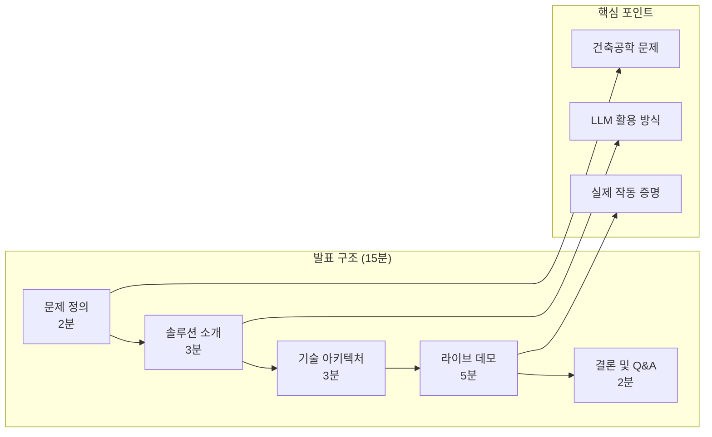
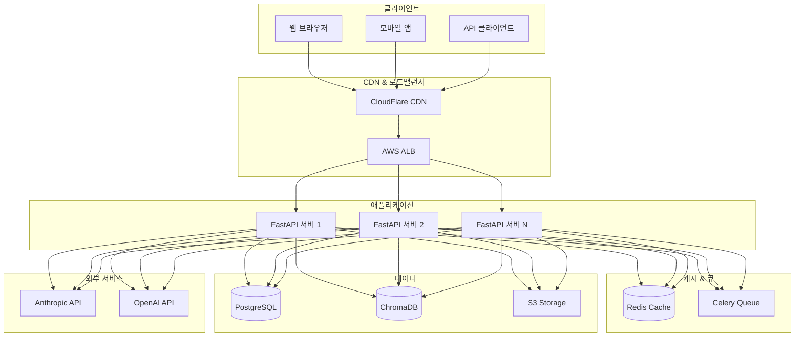
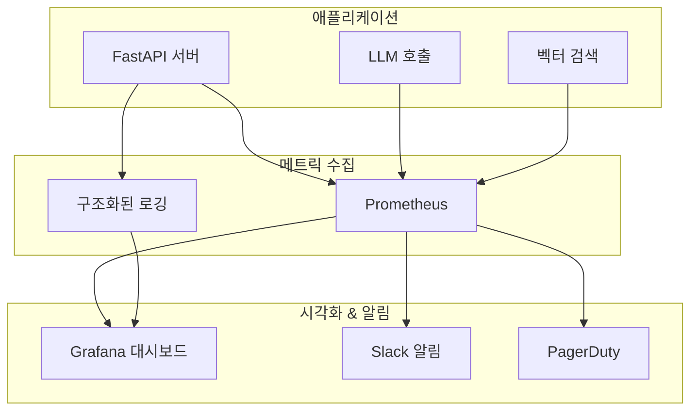
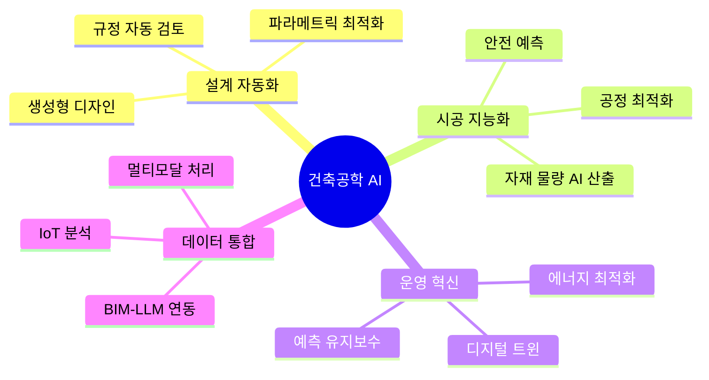
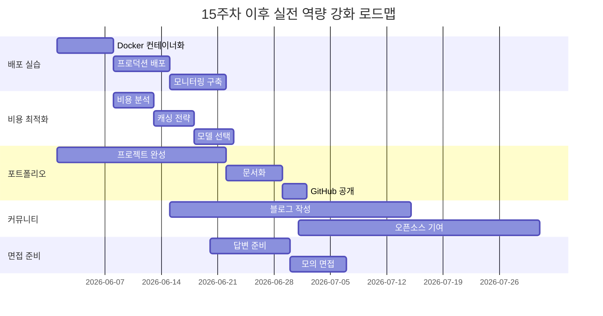

# 15주차: 프로젝트 발표와 프로덕션 배포

## 📌 강의 중점

- 학기 프로젝트 발표 및 평가
- 프로덕션 환경 배포 전략
- LLM 애플리케이션 운영 모범 사례
- 향후 발전 방향 및 커리어 가이드

## 🎯 학습 목표

이번 강의를 마치면 다음을 수행할 수 있습니다:
- 기술 프로젝트 발표 및 데모 시연
- Docker 컨테이너화 및 클라우드 배포
- LLM 애플리케이션의 모니터링과 최적화
- 비용 관리 및 성능 튜닝 전략 수립
- 건축공학 AI 분야의 향후 발전 방향 이해

---

## [Chapter 1] 프로젝트 발표 가이드

### 1.1 발표 구조



### 1.2 발표 자료 템플릿

```markdown
# 프로젝트 제목
## 부제: LLM을 활용한 [건축공학 문제] 해결

### 팀 정보
- 팀명:
- 팀원: (역할 포함)
- 발표일:

---

## 1. 문제 정의 (2분)

### 현재 상황
- 건축공학에서 [특정 업무]의 현황
- 기존 방식의 한계점

### 해결하고자 하는 문제
- 구체적인 문제 정의
- 문제의 영향과 중요성

### 프로젝트 목표
- 정량적 목표 (예: 업무 시간 50% 단축)
- 정성적 목표 (예: 비전문가도 사용 가능)

---

## 2. 솔루션 소개 (3분)

### 핵심 아이디어
- LLM을 어떻게 활용하는가?
- 왜 이 접근 방식인가?

### 주요 기능
1. 기능 1: [설명]
2. 기능 2: [설명]
3. 기능 3: [설명]

### 차별화 포인트
- 기존 솔루션과의 차이
- 우리만의 강점

---

## 3. 기술 아키텍처 (3분)

### 시스템 구성도
[Mermaid 다이어그램]

### 핵심 기술 스택
| 영역 | 기술 | 선택 이유 |
|------|------|----------|
| LLM | Claude API | Tool Use, 긴 컨텍스트 |
| Backend | FastAPI | 비동기, 자동 문서화 |
| Database | ChromaDB | 벡터 검색 |
| Frontend | Streamlit | 빠른 프로토타이핑 |

### 데이터 흐름
1. 사용자 입력 →
2. 전처리 →
3. LLM 처리 →
4. 결과 반환

---

## 4. 라이브 데모 (5분)

### 데모 시나리오
1. 시나리오 1: [일반 사용 케이스]
2. 시나리오 2: [복잡한 케이스]
3. 시나리오 3: [엣지 케이스 처리]

### 준비 사항
- 인터넷 연결 확인
- 백업 데모 영상
- 예상 질문 대비

---

## 5. 성과 및 평가 (2분)

### 정량적 성과
- 처리 시간: 기존 대비 X% 감소
- 정확도: Y% 달성
- 비용: Z원/건

### 정성적 성과
- 사용자 피드백
- 적용 가능성

### 한계점 및 향후 계획
- 현재 한계
- 개선 방향

---

## Q&A

### 예상 질문
1. Q: [질문]
   A: [답변]

2. Q: [질문]
   A: [답변]
```

### 1.3 데모 준비 체크리스트

```python
"""
demo_checklist.py
데모 준비 체크리스트 및 백업 전략
"""

from dataclasses import dataclass
from typing import Optional
import subprocess
import os

@dataclass
class DemoCheck:
    """데모 체크 항목"""
    name: str
    command: Optional[str] = None
    expected_result: Optional[str] = None
    backup_plan: str = ""

class DemoPreparation:
    """데모 준비 도구"""

    CHECKLIST = [
        DemoCheck(
            name="인터넷 연결",
            command="ping -c 1 api.anthropic.com",
            expected_result="1 packets transmitted",
            backup_plan="모바일 핫스팟 준비"
        ),
        DemoCheck(
            name="API 키 설정",
            command="echo $ANTHROPIC_API_KEY | head -c 10",
            expected_result="sk-ant",
            backup_plan=".env 파일 준비"
        ),
        DemoCheck(
            name="Python 환경",
            command="python --version",
            expected_result="Python 3.1",
            backup_plan="Conda 환경 전환"
        ),
        DemoCheck(
            name="필수 패키지",
            command="pip list | grep anthropic",
            expected_result="anthropic",
            backup_plan="requirements.txt로 재설치"
        ),
        DemoCheck(
            name="서버 실행",
            command="curl -s localhost:8000/health || echo 'not running'",
            expected_result="ok",
            backup_plan="수동 서버 시작 스크립트"
        ),
        DemoCheck(
            name="데모 데이터",
            command="ls -la demo_data/",
            expected_result="sample",
            backup_plan="Git에서 체크아웃"
        ),
    ]

    def run_checks(self) -> list[dict]:
        """모든 체크 실행"""
        results = []

        for check in self.CHECKLIST:
            result = {"name": check.name, "status": "unknown"}

            if check.command:
                try:
                    output = subprocess.run(
                        check.command,
                        shell=True,
                        capture_output=True,
                        text=True,
                        timeout=10
                    )
                    output_text = output.stdout + output.stderr

                    if check.expected_result and check.expected_result in output_text:
                        result["status"] = "pass"
                    else:
                        result["status"] = "fail"
                        result["backup"] = check.backup_plan
                except Exception as e:
                    result["status"] = "error"
                    result["error"] = str(e)
                    result["backup"] = check.backup_plan
            else:
                result["status"] = "manual"

            results.append(result)

        return results

    def print_report(self):
        """체크 결과 출력"""
        print("=" * 50)
        print("데모 준비 상태 점검")
        print("=" * 50)

        results = self.run_checks()
        all_pass = True

        for r in results:
            status_icon = {
                "pass": "✅",
                "fail": "❌",
                "error": "⚠️",
                "manual": "📝",
                "unknown": "❓"
            }.get(r["status"], "?")

            print(f"{status_icon} {r['name']}: {r['status']}")

            if r["status"] in ["fail", "error"]:
                all_pass = False
                if "backup" in r:
                    print(f"   → 백업: {r['backup']}")

        print("=" * 50)
        if all_pass:
            print("✅ 모든 체크 통과! 데모 준비 완료")
        else:
            print("⚠️ 일부 항목 확인 필요")

        return all_pass


# 백업 데모 스크립트 생성
def create_backup_demo():
    """오프라인 백업 데모 준비"""

    backup_script = '''#!/bin/bash
# 백업 데모 스크립트

echo "=== 백업 데모 모드 ==="

# 미리 준비된 응답 사용
if [ "$1" == "query1" ]; then
    cat demo_responses/query1.json
elif [ "$1" == "query2" ]; then
    cat demo_responses/query2.json
else
    echo "사용법: ./backup_demo.sh [query1|query2]"
fi
'''

    os.makedirs("demo_responses", exist_ok=True)

    with open("backup_demo.sh", "w") as f:
        f.write(backup_script)

    os.chmod("backup_demo.sh", 0o755)

    print("백업 데모 스크립트 생성 완료")


if __name__ == "__main__":
    prep = DemoPreparation()
    prep.print_report()
```

### 📚 참고 자료
- [Technical Presentation Tips](https://www.youtube.com/results?search_query=technical+presentation+tips)
- [Demo Day Best Practices](https://www.ycombinator.com/library/6q-how-to-present-to-investors)

---

## [Chapter 2] 프로덕션 배포

### 2.1 배포 아키텍처



### 2.2 Docker 컨테이너화

```dockerfile
# Dockerfile
FROM python:3.11-slim

WORKDIR /app

# 시스템 의존성
RUN apt-get update && apt-get install -y \
    build-essential \
    && rm -rf /var/lib/apt/lists/*

# Python 의존성
COPY requirements.txt .
RUN pip install --no-cache-dir -r requirements.txt

# 애플리케이션 코드
COPY . .

# 환경 변수
ENV PYTHONUNBUFFERED=1
ENV PYTHONDONTWRITEBYTECODE=1

# 포트 노출
EXPOSE 8000

# 헬스체크
HEALTHCHECK --interval=30s --timeout=10s --start-period=5s --retries=3 \
    CMD curl -f http://localhost:8000/health || exit 1

# 실행
CMD ["uvicorn", "main:app", "--host", "0.0.0.0", "--port", "8000"]
```

```yaml
# docker-compose.yml
version: '3.8'

services:
  app:
    build: .
    ports:
      - "8000:8000"
    environment:
      - ANTHROPIC_API_KEY=${ANTHROPIC_API_KEY}
      - DATABASE_URL=postgresql://user:pass@db:5432/llm_app
      - REDIS_URL=redis://redis:6379/0
      - CHROMA_HOST=chromadb
    depends_on:
      - db
      - redis
      - chromadb
    deploy:
      replicas: 2
      resources:
        limits:
          cpus: '1'
          memory: 2G

  db:
    image: postgres:15
    volumes:
      - postgres_data:/var/lib/postgresql/data
    environment:
      - POSTGRES_USER=user
      - POSTGRES_PASSWORD=pass
      - POSTGRES_DB=llm_app

  redis:
    image: redis:7-alpine
    volumes:
      - redis_data:/data

  chromadb:
    image: chromadb/chroma:latest
    volumes:
      - chroma_data:/chroma/chroma

  nginx:
    image: nginx:alpine
    ports:
      - "80:80"
      - "443:443"
    volumes:
      - ./nginx.conf:/etc/nginx/nginx.conf:ro
      - ./certs:/etc/nginx/certs:ro
    depends_on:
      - app

volumes:
  postgres_data:
  redis_data:
  chroma_data:
```

### 2.3 배포 스크립트

```python
"""
deploy.py
프로덕션 배포 스크립트
"""

import subprocess
import os
import sys
from datetime import datetime

class Deployer:
    """배포 자동화"""

    def __init__(self, environment: str = "production"):
        self.environment = environment
        self.timestamp = datetime.now().strftime("%Y%m%d_%H%M%S")

    def check_prerequisites(self) -> bool:
        """사전 조건 확인"""
        print("🔍 사전 조건 확인 중...")

        checks = [
            ("Docker", "docker --version"),
            ("Docker Compose", "docker-compose --version"),
            ("Git", "git status"),
            ("환경 변수", "test -n \"$ANTHROPIC_API_KEY\""),
        ]

        all_pass = True
        for name, cmd in checks:
            result = subprocess.run(cmd, shell=True, capture_output=True)
            status = "✅" if result.returncode == 0 else "❌"
            print(f"  {status} {name}")
            if result.returncode != 0:
                all_pass = False

        return all_pass

    def run_tests(self) -> bool:
        """테스트 실행"""
        print("\n🧪 테스트 실행 중...")

        result = subprocess.run(
            "pytest tests/ -v --tb=short",
            shell=True
        )

        if result.returncode == 0:
            print("✅ 모든 테스트 통과")
            return True
        else:
            print("❌ 테스트 실패")
            return False

    def build_image(self) -> bool:
        """Docker 이미지 빌드"""
        print(f"\n🏗️ Docker 이미지 빌드 중... (tag: {self.timestamp})")

        result = subprocess.run(
            f"docker build -t llm-app:{self.timestamp} -t llm-app:latest .",
            shell=True
        )

        return result.returncode == 0

    def push_image(self, registry: str) -> bool:
        """이미지 푸시"""
        print(f"\n📤 이미지 푸시 중... ({registry})")

        commands = [
            f"docker tag llm-app:{self.timestamp} {registry}/llm-app:{self.timestamp}",
            f"docker tag llm-app:latest {registry}/llm-app:latest",
            f"docker push {registry}/llm-app:{self.timestamp}",
            f"docker push {registry}/llm-app:latest",
        ]

        for cmd in commands:
            result = subprocess.run(cmd, shell=True)
            if result.returncode != 0:
                return False

        return True

    def deploy_to_cloud(self, platform: str = "aws") -> bool:
        """클라우드 배포"""
        print(f"\n☁️ {platform.upper()}에 배포 중...")

        if platform == "aws":
            # ECS 배포
            cmd = f"""
aws ecs update-service \
    --cluster llm-app-cluster \
    --service llm-app-service \
    --force-new-deployment
"""
        elif platform == "gcp":
            # Cloud Run 배포
            cmd = f"""
gcloud run deploy llm-app \
    --image gcr.io/$PROJECT_ID/llm-app:{self.timestamp} \
    --platform managed \
    --region asia-northeast3
"""
        else:
            print(f"❌ 지원하지 않는 플랫폼: {platform}")
            return False

        result = subprocess.run(cmd, shell=True)
        return result.returncode == 0

    def verify_deployment(self, url: str) -> bool:
        """배포 검증"""
        print(f"\n✅ 배포 검증 중... ({url})")

        import time
        for i in range(5):
            result = subprocess.run(
                f"curl -s -o /dev/null -w '%{{http_code}}' {url}/health",
                shell=True,
                capture_output=True,
                text=True
            )

            if result.stdout.strip() == "200":
                print("✅ 서비스 정상 작동 확인")
                return True

            print(f"  재시도 {i+1}/5...")
            time.sleep(10)

        print("❌ 서비스 응답 없음")
        return False

    def rollback(self, previous_version: str):
        """롤백"""
        print(f"\n⏪ 롤백 중... (버전: {previous_version})")

        # 이전 버전으로 서비스 업데이트
        subprocess.run(
            f"docker-compose up -d --scale app=2",
            shell=True
        )

    def deploy(self, skip_tests: bool = False):
        """전체 배포 프로세스"""
        print(f"🚀 배포 시작 ({self.environment})")
        print("=" * 50)

        steps = [
            ("사전 조건 확인", self.check_prerequisites),
            ("테스트 실행", lambda: skip_tests or self.run_tests()),
            ("이미지 빌드", self.build_image),
        ]

        for step_name, step_func in steps:
            if not step_func():
                print(f"\n❌ 배포 실패: {step_name}")
                return False

        print("\n" + "=" * 50)
        print("✅ 배포 완료!")
        print(f"  버전: {self.timestamp}")
        return True


if __name__ == "__main__":
    deployer = Deployer(environment=os.getenv("DEPLOY_ENV", "production"))

    if "--skip-tests" in sys.argv:
        deployer.deploy(skip_tests=True)
    else:
        deployer.deploy()
```

### 📚 참고 자료
- [Docker Documentation](https://docs.docker.com/)
- [AWS ECS Deployment](https://docs.aws.amazon.com/AmazonECS/latest/developerguide/)
- [GCP Cloud Run](https://cloud.google.com/run/docs)

---

## [Chapter 3] LLM 애플리케이션 운영

### 3.1 모니터링 시스템



### 3.2 모니터링 구현

```python
"""
monitoring.py
LLM 애플리케이션 모니터링
"""

from prometheus_client import Counter, Histogram, Gauge, generate_latest
from fastapi import FastAPI, Request
from functools import wraps
import time
import logging
import json
from datetime import datetime

# Prometheus 메트릭 정의
LLM_REQUESTS = Counter(
    'llm_requests_total',
    'Total LLM API requests',
    ['model', 'status']
)

LLM_LATENCY = Histogram(
    'llm_request_latency_seconds',
    'LLM request latency',
    ['model'],
    buckets=[0.1, 0.5, 1.0, 2.0, 5.0, 10.0, 30.0]
)

LLM_TOKENS = Counter(
    'llm_tokens_total',
    'Total tokens used',
    ['model', 'type']  # type: input, output
)

LLM_COST = Counter(
    'llm_cost_dollars',
    'Estimated cost in dollars',
    ['model']
)

ACTIVE_REQUESTS = Gauge(
    'active_llm_requests',
    'Currently active LLM requests'
)

RAG_SEARCH_LATENCY = Histogram(
    'rag_search_latency_seconds',
    'RAG vector search latency',
    buckets=[0.01, 0.05, 0.1, 0.5, 1.0]
)

# 구조화된 로깅 설정
class StructuredLogger:
    """구조화된 로깅"""

    def __init__(self, name: str):
        self.logger = logging.getLogger(name)
        handler = logging.StreamHandler()
        handler.setFormatter(logging.Formatter('%(message)s'))
        self.logger.addHandler(handler)
        self.logger.setLevel(logging.INFO)

    def log(self, level: str, event: str, **kwargs):
        """구조화된 로그 출력"""
        log_entry = {
            "timestamp": datetime.utcnow().isoformat(),
            "level": level,
            "event": event,
            **kwargs
        }
        self.logger.info(json.dumps(log_entry, ensure_ascii=False))

    def info(self, event: str, **kwargs):
        self.log("INFO", event, **kwargs)

    def warning(self, event: str, **kwargs):
        self.log("WARNING", event, **kwargs)

    def error(self, event: str, **kwargs):
        self.log("ERROR", event, **kwargs)

logger = StructuredLogger("llm_app")


# 비용 계산
PRICING = {
    "claude-sonnet-4-20250514": {"input": 3.0, "output": 15.0},  # per 1M tokens
    "claude-opus-4-20250514": {"input": 15.0, "output": 75.0},
    "gpt-4": {"input": 30.0, "output": 60.0},
}

def calculate_cost(model: str, input_tokens: int, output_tokens: int) -> float:
    """비용 계산"""
    pricing = PRICING.get(model, {"input": 0, "output": 0})
    input_cost = (input_tokens / 1_000_000) * pricing["input"]
    output_cost = (output_tokens / 1_000_000) * pricing["output"]
    return input_cost + output_cost


# LLM 호출 모니터링 데코레이터
def monitor_llm_call(model: str):
    """LLM 호출 모니터링 데코레이터"""
    def decorator(func):
        @wraps(func)
        async def wrapper(*args, **kwargs):
            start_time = time.time()
            ACTIVE_REQUESTS.inc()

            try:
                result = await func(*args, **kwargs)

                # 성공 메트릭
                latency = time.time() - start_time
                LLM_REQUESTS.labels(model=model, status="success").inc()
                LLM_LATENCY.labels(model=model).observe(latency)

                # 토큰 및 비용 (result에서 추출)
                if hasattr(result, 'usage'):
                    input_tokens = result.usage.input_tokens
                    output_tokens = result.usage.output_tokens

                    LLM_TOKENS.labels(model=model, type="input").inc(input_tokens)
                    LLM_TOKENS.labels(model=model, type="output").inc(output_tokens)

                    cost = calculate_cost(model, input_tokens, output_tokens)
                    LLM_COST.labels(model=model).inc(cost)

                    logger.info(
                        "llm_call_complete",
                        model=model,
                        latency=latency,
                        input_tokens=input_tokens,
                        output_tokens=output_tokens,
                        cost=cost
                    )

                return result

            except Exception as e:
                LLM_REQUESTS.labels(model=model, status="error").inc()
                logger.error(
                    "llm_call_error",
                    model=model,
                    error=str(e),
                    latency=time.time() - start_time
                )
                raise

            finally:
                ACTIVE_REQUESTS.dec()

        return wrapper
    return decorator


# FastAPI 미들웨어
class MonitoringMiddleware:
    """요청 모니터링 미들웨어"""

    def __init__(self, app: FastAPI):
        self.app = app

    async def __call__(self, request: Request, call_next):
        start_time = time.time()
        request_id = request.headers.get("X-Request-ID", str(time.time()))

        # 요청 로깅
        logger.info(
            "request_start",
            request_id=request_id,
            method=request.method,
            path=request.url.path
        )

        response = await call_next(request)

        # 응답 로깅
        latency = time.time() - start_time
        logger.info(
            "request_complete",
            request_id=request_id,
            status_code=response.status_code,
            latency=latency
        )

        response.headers["X-Request-ID"] = request_id
        response.headers["X-Response-Time"] = str(latency)

        return response


# Prometheus 엔드포인트
def setup_monitoring(app: FastAPI):
    """모니터링 설정"""

    @app.get("/metrics")
    async def metrics():
        """Prometheus 메트릭 엔드포인트"""
        from fastapi.responses import Response
        return Response(
            content=generate_latest(),
            media_type="text/plain"
        )

    @app.get("/health")
    async def health():
        """헬스 체크"""
        return {"status": "healthy", "timestamp": datetime.utcnow().isoformat()}
```

### 3.3 비용 최적화

```python
"""
cost_optimizer.py
LLM 비용 최적화 전략
"""

from dataclasses import dataclass
from typing import Optional
import hashlib
import json
from datetime import datetime, timedelta

@dataclass
class CacheEntry:
    """캐시 엔트리"""
    response: str
    created_at: datetime
    tokens_saved: int
    cost_saved: float

class LLMCostOptimizer:
    """LLM 비용 최적화"""

    def __init__(self, cache_backend=None):
        self.cache = cache_backend or {}  # 실제로는 Redis 사용
        self.stats = {
            "cache_hits": 0,
            "cache_misses": 0,
            "tokens_saved": 0,
            "cost_saved": 0.0
        }

    def _make_cache_key(self, prompt: str, model: str) -> str:
        """캐시 키 생성"""
        content = f"{model}:{prompt}"
        return hashlib.md5(content.encode()).hexdigest()

    def get_cached(self, prompt: str, model: str) -> Optional[str]:
        """캐시된 응답 조회"""
        key = self._make_cache_key(prompt, model)

        if key in self.cache:
            entry = self.cache[key]

            # TTL 체크 (24시간)
            if datetime.now() - entry.created_at < timedelta(hours=24):
                self.stats["cache_hits"] += 1
                self.stats["tokens_saved"] += entry.tokens_saved
                self.stats["cost_saved"] += entry.cost_saved
                return entry.response

        self.stats["cache_misses"] += 1
        return None

    def set_cache(
        self,
        prompt: str,
        model: str,
        response: str,
        input_tokens: int,
        output_tokens: int
    ):
        """응답 캐시"""
        key = self._make_cache_key(prompt, model)
        cost = calculate_cost(model, input_tokens, output_tokens)

        self.cache[key] = CacheEntry(
            response=response,
            created_at=datetime.now(),
            tokens_saved=input_tokens + output_tokens,
            cost_saved=cost
        )

    def get_stats(self) -> dict:
        """최적화 통계"""
        total_requests = self.stats["cache_hits"] + self.stats["cache_misses"]
        hit_rate = self.stats["cache_hits"] / total_requests if total_requests > 0 else 0

        return {
            **self.stats,
            "hit_rate": hit_rate,
            "total_requests": total_requests
        }


class ModelSelector:
    """최적 모델 선택기"""

    MODELS = {
        "claude-3-haiku": {
            "cost_per_1k_input": 0.00025,
            "cost_per_1k_output": 0.00125,
            "quality": 0.7,
            "speed": 1.0
        },
        "claude-sonnet-4-20250514": {
            "cost_per_1k_input": 0.003,
            "cost_per_1k_output": 0.015,
            "quality": 0.9,
            "speed": 0.7
        },
        "claude-opus-4-20250514": {
            "cost_per_1k_input": 0.015,
            "cost_per_1k_output": 0.075,
            "quality": 1.0,
            "speed": 0.5
        }
    }

    def select_model(
        self,
        task_complexity: str,  # simple, moderate, complex
        quality_requirement: float = 0.8,
        budget_sensitive: bool = True
    ) -> str:
        """작업에 적합한 모델 선택"""

        complexity_to_quality = {
            "simple": 0.6,
            "moderate": 0.8,
            "complex": 0.95
        }

        min_quality = max(
            complexity_to_quality.get(task_complexity, 0.8),
            quality_requirement
        )

        # 품질 요구사항을 만족하는 모델 중 가장 저렴한 것 선택
        candidates = [
            (name, spec) for name, spec in self.MODELS.items()
            if spec["quality"] >= min_quality
        ]

        if not candidates:
            return "claude-opus-4-20250514"  # 기본값

        if budget_sensitive:
            # 비용 기준 정렬
            candidates.sort(key=lambda x: x[1]["cost_per_1k_input"])
        else:
            # 품질 기준 정렬
            candidates.sort(key=lambda x: -x[1]["quality"])

        return candidates[0][0]


class PromptOptimizer:
    """프롬프트 최적화"""

    @staticmethod
    def compress_prompt(prompt: str, max_tokens: int = 2000) -> str:
        """프롬프트 압축"""
        # 간단한 휴리스틱 기반 압축
        lines = prompt.split('\n')

        # 빈 줄 제거
        lines = [l for l in lines if l.strip()]

        # 중복 공백 제거
        lines = [' '.join(l.split()) for l in lines]

        result = '\n'.join(lines)

        # 대략적인 토큰 수 추정 (4 chars ≈ 1 token)
        estimated_tokens = len(result) // 4

        if estimated_tokens > max_tokens:
            # 초과 시 후반부 잘라내기
            target_chars = max_tokens * 4
            result = result[:target_chars] + "..."

        return result

    @staticmethod
    def extract_key_context(context: str, query: str, max_chunks: int = 3) -> str:
        """쿼리와 관련된 핵심 컨텍스트만 추출"""
        # 간단한 키워드 기반 추출
        query_words = set(query.lower().split())

        paragraphs = context.split('\n\n')
        scored = []

        for para in paragraphs:
            para_words = set(para.lower().split())
            overlap = len(query_words & para_words)
            scored.append((overlap, para))

        # 관련성 높은 순으로 정렬
        scored.sort(reverse=True)

        # 상위 N개만 반환
        return '\n\n'.join([para for _, para in scored[:max_chunks]])
```

### 📚 참고 자료
- [Prometheus Python Client](https://github.com/prometheus/client_python)
- [Grafana Dashboards](https://grafana.com/docs/grafana/latest/dashboards/)
- [LLM Cost Optimization](https://www.anthropic.com/news/prompt-caching)

---

## [Chapter 4] 향후 발전 방향

### 4.1 건축공학 AI 트렌드



### 4.2 기술 로드맵

```python
"""
future_roadmap.py
건축공학 AI 기술 로드맵
"""

ROADMAP = {
    "2024-2025": {
        "title": "기초 구축기",
        "focus": [
            "LLM API 활용 숙달",
            "RAG 시스템 구축",
            "MCP 서버 개발",
            "기본 에이전트 구현"
        ],
        "skills": [
            "Python, FastAPI",
            "Anthropic/OpenAI API",
            "Vector Database",
            "Prompt Engineering"
        ],
        "projects": [
            "건축법규 Q&A 챗봇",
            "도면 자동 분석",
            "시방서 요약 시스템"
        ]
    },
    "2025-2026": {
        "title": "응용 확장기",
        "focus": [
            "멀티모달 처리",
            "복잡한 에이전트 워크플로우",
            "BIM 연동 심화",
            "실시간 시스템"
        ],
        "skills": [
            "Computer Vision",
            "LangGraph 심화",
            "IFC/BIM API",
            "실시간 데이터 처리"
        ],
        "projects": [
            "자동 설계 검토 시스템",
            "스마트 견적 에이전트",
            "건물 에너지 최적화"
        ]
    },
    "2026-2027": {
        "title": "혁신 도약기",
        "focus": [
            "생성형 설계",
            "자율 에이전트",
            "디지털 트윈 고도화",
            "프로덕션 대규모 운영"
        ],
        "skills": [
            "Diffusion Models",
            "Reinforcement Learning",
            "Edge AI",
            "MLOps"
        ],
        "projects": [
            "AI 설계 보조 플랫폼",
            "자율 시공 관리 시스템",
            "예측 유지보수 플랫폼"
        ]
    }
}

def print_roadmap():
    """로드맵 출력"""
    for period, content in ROADMAP.items():
        print(f"\n{'='*60}")
        print(f"📅 {period}: {content['title']}")
        print('='*60)

        print("\n🎯 핵심 포커스:")
        for item in content["focus"]:
            print(f"  • {item}")

        print("\n💻 필수 스킬:")
        for skill in content["skills"]:
            print(f"  • {skill}")

        print("\n🏗️ 추천 프로젝트:")
        for project in content["projects"]:
            print(f"  • {project}")


if __name__ == "__main__":
    print_roadmap()
```

### 4.3 커리어 가이드

```markdown
## 건축공학 AI 개발자 커리어 경로

### 1. 스킬 매트릭스

| 역량 | 주니어 | 시니어 | 리드 |
|------|--------|--------|------|
| Python | 기초 문법 | 고급 패턴 | 아키텍처 |
| LLM API | 단순 호출 | 프롬프트 최적화 | 비용/성능 최적화 |
| RAG | 기본 구현 | 고급 검색 | 대규모 시스템 |
| Agent | 단순 워크플로우 | 복잡한 에이전트 | 자율 시스템 |
| BIM | 데이터 조회 | IFC 조작 | 플러그인 개발 |
| DevOps | Docker 기초 | CI/CD 구축 | 대규모 운영 |

### 2. 추천 학습 경로

**Phase 1: 기초 (3-6개월)**
- Python 프로그래밍 심화
- LLM API 사용법 숙달
- 웹 개발 기초 (FastAPI)
- Git/GitHub 활용

**Phase 2: 응용 (6-12개월)**
- RAG 시스템 구축
- Agent 개발 (MCP, LangGraph)
- BIM 데이터 처리
- 클라우드 배포

**Phase 3: 전문화 (12개월+)**
- 특정 도메인 심화
- 오픈소스 기여
- 기술 리더십
- 프로덕션 운영

### 3. 포트폴리오 구성

**필수 프로젝트**
1. LLM 기반 건축 Q&A 시스템
2. RAG를 활용한 문서 분석 도구
3. BIM 연동 에이전트
4. 실제 배포된 서비스

**차별화 요소**
- GitHub 활동 (Star, Contribution)
- 기술 블로그 운영
- 오픈소스 프로젝트
- 학술 논문 또는 특허

### 4. 관련 직무

- **AI 엔지니어**: LLM 애플리케이션 개발
- **BIM 개발자**: BIM 자동화 도구 개발
- **건설 IT 컨설턴트**: 디지털 전환 자문
- **스마트 빌딩 개발자**: IoT/디지털트윈 시스템
- **AI 연구원**: 건축 AI 연구 개발
```

### 📚 참고 자료
- [AI in Architecture](https://www.archdaily.com/tag/artificial-intelligence)
- [Construction Tech Trends](https://www.mckinsey.com/industries/private-equity-and-principal-investors/our-insights/rise-of-the-platform-era-the-next-chapter-in-construction-technology)
- [BIM and AI Integration](https://www.autodesk.com/solutions/bim/hub/artificial-intelligence-in-construction)

---

## 💻 최종 프로젝트 체크리스트

### 프로젝트 완성도 평가

```python
"""
project_evaluation.py
프로젝트 평가 체크리스트
"""

EVALUATION_CRITERIA = {
    "기술 구현 (40%)": {
        "LLM 통합": {
            "weight": 15,
            "criteria": [
                "적절한 모델 선택",
                "효과적인 프롬프트 설계",
                "Tool Use / Function Calling 활용",
                "에러 처리"
            ]
        },
        "시스템 아키텍처": {
            "weight": 10,
            "criteria": [
                "모듈화된 설계",
                "확장 가능한 구조",
                "적절한 기술 스택"
            ]
        },
        "건축공학 도메인": {
            "weight": 15,
            "criteria": [
                "실제 문제 해결",
                "도메인 지식 반영",
                "실무 적용 가능성"
            ]
        }
    },
    "코드 품질 (20%)": {
        "가독성": {
            "weight": 10,
            "criteria": [
                "명확한 변수/함수 네이밍",
                "적절한 주석",
                "일관된 코딩 스타일"
            ]
        },
        "테스트": {
            "weight": 10,
            "criteria": [
                "단위 테스트 존재",
                "통합 테스트",
                "에지 케이스 처리"
            ]
        }
    },
    "문서화 (15%)": {
        "README": {
            "weight": 5,
            "criteria": [
                "설치 가이드",
                "사용 방법",
                "예제 코드"
            ]
        },
        "API 문서": {
            "weight": 5,
            "criteria": [
                "엔드포인트 설명",
                "요청/응답 형식",
                "에러 코드"
            ]
        },
        "아키텍처 문서": {
            "weight": 5,
            "criteria": [
                "시스템 다이어그램",
                "데이터 흐름",
                "기술 결정 근거"
            ]
        }
    },
    "발표 및 데모 (25%)": {
        "발표": {
            "weight": 10,
            "criteria": [
                "명확한 문제 정의",
                "논리적 구조",
                "시간 관리"
            ]
        },
        "라이브 데모": {
            "weight": 15,
            "criteria": [
                "성공적인 시연",
                "다양한 시나리오",
                "질문 대응"
            ]
        }
    }
}

def calculate_score(scores: dict) -> float:
    """점수 계산"""
    total = 0
    max_score = 0

    for category, items in EVALUATION_CRITERIA.items():
        for item_name, item_data in items.items():
            weight = item_data["weight"]
            max_score += weight

            if item_name in scores:
                # 0-100 점수를 가중치 적용
                total += (scores[item_name] / 100) * weight

    return (total / max_score) * 100 if max_score > 0 else 0


def print_evaluation_form():
    """평가 양식 출력"""
    print("=" * 60)
    print("🎓 최종 프로젝트 평가 양식")
    print("=" * 60)

    for category, items in EVALUATION_CRITERIA.items():
        print(f"\n## {category}")
        for item_name, item_data in items.items():
            print(f"\n### {item_name} ({item_data['weight']}점)")
            for i, criterion in enumerate(item_data["criteria"], 1):
                print(f"  {i}. [ ] {criterion}")


if __name__ == "__main__":
    print_evaluation_form()
```

---

## 📝 과제: 최종 프로젝트 제출

### 제출물 목록

1. **소스 코드** (GitHub Repository)
   - 전체 프로젝트 코드
   - requirements.txt
   - Dockerfile (선택)

2. **문서**
   - README.md
   - API 문서
   - 시스템 아키텍처 문서

3. **발표 자료**
   - 프레젠테이션 (PDF/PPT)
   - 데모 영상 (백업용)

4. **보고서**
   - 프로젝트 개요
   - 기술적 도전과 해결 방법
   - 성과 및 한계점
   - 향후 발전 방향

### 제출 기한
- 코드 및 문서: 발표 3일 전
- 발표 자료: 발표 1일 전

---

## 📚 전체 강의 참고 자료 종합

### 공식 문서
- [Anthropic Claude API](https://docs.anthropic.com/claude/reference)
- [OpenAI API](https://platform.openai.com/docs)
- [LangChain](https://python.langchain.com/docs/)
- [LangGraph](https://langchain-ai.github.io/langgraph/)
- [FastAPI](https://fastapi.tiangolo.com/)
- [Pydantic](https://docs.pydantic.dev/)

### 건축공학 관련
- [BuildingSMART IFC](https://technical.buildingsmart.org/)
- [IfcOpenShell](http://ifcopenshell.org/)
- [Rhino Developer](https://developer.rhino3d.com/)

### 클라우드 & 배포
- [Docker](https://docs.docker.com/)
- [AWS Documentation](https://docs.aws.amazon.com/)
- [GCP Documentation](https://cloud.google.com/docs)

### 커뮤니티 & 학습
- [Hugging Face](https://huggingface.co/)
- [Papers With Code](https://paperswithcode.com/)
- [GitHub Trending](https://github.com/trending/python)

---

## 🎉 강의를 마치며

15주간의 "대형언어모델활용건축공학인공지능구현" 강의를 마칩니다.

### 배운 내용 요약

1. **LLM 기초** (1-3주차)
   - Transformer와 프롬프트 엔지니어링
   - 개발 환경 구축
   - API 통신 기초

2. **LLM API 활용** (4-6주차)
   - Claude/OpenAI API 심화
   - RAG 시스템 구축
   - 벡터 검색과 하이브리드 검색

3. **에이전트 시스템** (7-9주차)
   - MCP 서버 개발
   - LangGraph 워크플로우
   - 문서 분석 및 생성

4. **건축공학 응용** (11-13주차)
   - BIM/IFC 데이터 활용
   - 구조해석 프로그램 연동
   - 파라메트릭 설계 자동화

5. **고급 주제** (14-15주차)
   - IoT와 디지털 트윈
   - 프로덕션 배포와 운영

### 앞으로의 여정

이 강의는 시작일 뿐입니다. AI 기술은 빠르게 발전하고 있으며, 건축공학 분야에서의 활용 가능성은 무궁무진합니다.

**계속 학습하고, 실험하고, 만들어 나가세요!**

감사합니다. 🙏

---

## 🚀 발전 전략 (Development Strategies)

### 전략 1: 실전 배포 시뮬레이션 프로젝트

**목표**: 실제 프로덕션 환경과 동일한 조건에서 배포 경험 쌓기

**실습 과제**:
```bash
# 1. 프로젝트를 Docker로 완전 컨테이너화
mkdir deployment-practice
cd deployment-practice

# 2. Multi-stage Dockerfile 작성 (빌드 최적화)
cat > Dockerfile.production << 'EOF'
# Stage 1: 빌드
FROM python:3.11-slim AS builder
WORKDIR /build
COPY requirements.txt .
RUN pip wheel --no-cache-dir --wheel-dir /wheels -r requirements.txt

# Stage 2: 런타임
FROM python:3.11-slim
WORKDIR /app
COPY --from=builder /wheels /wheels
RUN pip install --no-cache /wheels/*
COPY . .
EXPOSE 8000
CMD ["uvicorn", "main:app", "--host", "0.0.0.0", "--port", "8000", "--workers", "4"]
EOF

# 3. docker-compose.yml로 전체 스택 구성
docker-compose up -d

# 4. 로컬에서 프로덕션 환경 테스트
curl http://localhost:8000/health
ab -n 1000 -c 10 http://localhost:8000/api/query  # 부하 테스트
```

**건축공학 적용 예시**:
- **시나리오**: 건축 법규 Q&A 챗봇을 실제 사무실에 배포
- **구성**: FastAPI + ChromaDB + Claude API + Redis 캐시
- **부하 테스트**: 동시 사용자 50명 시뮬레이션 (하루 500건 질의)
- **모니터링**: Prometheus + Grafana로 응답 시간, 비용 추적

**체크포인트**:
- [ ] Docker 이미지 크기 1GB 이하로 최적화
- [ ] Health check 엔드포인트 정상 작동
- [ ] 환경 변수로 API 키 관리 (`.env` 파일)
- [ ] 데이터베이스 볼륨 영속성 확인
- [ ] 로그 구조화 (JSON 포맷)

---

### 전략 2: 라이브 데모 장애 대응 훈련

**목표**: 데모 중 발생 가능한 모든 장애 상황에 대비한 시나리오 훈련

**실습 프로그램**:

```python
# demo_disaster_recovery.py
"""
데모 장애 시뮬레이션 및 복구 훈련
"""

import random
import time
from typing import Callable

class DemoDisasterScenarios:
    """데모 장애 시나리오"""

    SCENARIOS = [
        {
            "name": "인터넷 연결 끊김",
            "probability": 0.15,
            "recovery": "모바일 핫스팟으로 전환 (30초)",
            "backup": "미리 준비한 응답 JSON 파일 사용"
        },
        {
            "name": "API 키 만료/한도 초과",
            "probability": 0.10,
            "recovery": "백업 API 키로 교체 (20초)",
            "backup": "무료 티어 계정 3개 준비"
        },
        {
            "name": "서버 크래시",
            "probability": 0.08,
            "recovery": "docker-compose restart (40초)",
            "backup": "로컬 스크립트로 직접 실행"
        },
        {
            "name": "프로젝터/화면 공유 문제",
            "probability": 0.20,
            "recovery": "HDMI 케이블 교체 또는 화면 설정 변경 (1분)",
            "backup": "노트북 화면 직접 보여주기"
        },
        {
            "name": "예상치 못한 에러 응답",
            "probability": 0.12,
            "recovery": "다른 예제 질의로 전환 (즉시)",
            "backup": "에러 처리 로직 설명으로 전환"
        }
    ]

    def simulate_disaster(self) -> dict:
        """무작위 장애 발생"""
        scenario = random.choice(self.SCENARIOS)
        print(f"\n🚨 장애 발생: {scenario['name']}")
        print(f"   복구 방법: {scenario['recovery']}")
        print(f"   백업 플랜: {scenario['backup']}")
        return scenario

    def drill_practice(self, num_rounds: int = 5):
        """장애 대응 훈련"""
        print("=" * 60)
        print("🎯 데모 장애 대응 훈련 시작")
        print("=" * 60)

        for i in range(num_rounds):
            print(f"\n라운드 {i+1}/{num_rounds}")
            scenario = self.simulate_disaster()

            # 실제 대응 시간 측정
            start = time.time()
            input("  [Enter를 눌러 복구 완료를 표시하세요]")
            elapsed = time.time() - start

            print(f"  ⏱️ 복구 시간: {elapsed:.1f}초")
            if elapsed < 60:
                print("  ✅ 우수 (1분 이내)")
            elif elapsed < 120:
                print("  ⚠️ 보통 (2분 이내)")
            else:
                print("  ❌ 개선 필요 (2분 초과)")

# 실전 훈련 스크립트
if __name__ == "__main__":
    drill = DemoDisasterScenarios()
    drill.drill_practice(num_rounds=5)
```

**건축공학 데모 시나리오 3종 세트**:
1. **일반 케이스**: "이 건물의 내진 설계 기준이 충족되는지 확인해줘"
2. **복잡 케이스**: "지하 3층, 지상 15층 RC 구조물의 구조 검토 절차를 단계별로 설명해줘"
3. **엣지 케이스**: "잘못된 도면 파일 업로드 시 에러 처리 동작 확인"

**체크포인트**:
- [ ] 3가지 시나리오 각각 5번씩 성공 (총 15회)
- [ ] 장애 복구 평균 시간 1분 이내
- [ ] 백업 데모 영상 준비 (3분)
- [ ] 예상 질문 10개 준비 및 답변 연습

---

### 전략 3: 비용 최적화 실전 분석

**목표**: 실제 프로젝트의 LLM API 비용을 50% 절감하는 구체적인 방법 습득

**실습 과제**:

```python
# cost_analysis_project.py
"""
실전 비용 분석 및 최적화
"""

import anthropic
import time
from dataclasses import dataclass
from typing import List
import hashlib
import json

@dataclass
class CostProfile:
    """비용 프로파일"""
    scenario: str
    model: str
    input_tokens: int
    output_tokens: int
    latency_ms: float
    cache_hit: bool = False

    def calculate_cost(self) -> float:
        """비용 계산"""
        pricing = {
            "claude-sonnet-4-20250514": {"input": 3.0, "output": 15.0},
            "claude-3-5-haiku-20241022": {"input": 0.8, "output": 4.0}
        }
        price = pricing.get(self.model, {"input": 0, "output": 0})
        return (self.input_tokens / 1_000_000) * price["input"] + \
               (self.output_tokens / 1_000_000) * price["output"]

class CostOptimizationLab:
    """비용 최적화 실습"""

    def __init__(self):
        self.client = anthropic.Anthropic()
        self.cache = {}
        self.profiles: List[CostProfile] = []

    def run_baseline(self, query: str, context: str = "") -> CostProfile:
        """기준선 측정 (최적화 전)"""
        start = time.time()

        message = self.client.messages.create(
            model="claude-sonnet-4-20250514",
            max_tokens=1024,
            messages=[{
                "role": "user",
                "content": f"{context}\n\n질문: {query}"
            }]
        )

        latency = (time.time() - start) * 1000

        profile = CostProfile(
            scenario="baseline",
            model="claude-sonnet-4-20250514",
            input_tokens=message.usage.input_tokens,
            output_tokens=message.usage.output_tokens,
            latency_ms=latency,
            cache_hit=False
        )

        self.profiles.append(profile)
        return profile

    def run_with_cache(self, query: str, context: str = "") -> CostProfile:
        """캐싱 적용"""
        cache_key = hashlib.md5(f"{query}{context}".encode()).hexdigest()

        if cache_key in self.cache:
            cached = self.cache[cache_key]
            return CostProfile(
                scenario="cached",
                model=cached.model,
                input_tokens=0,  # 캐시 히트 시 비용 없음
                output_tokens=0,
                latency_ms=5.0,  # 캐시 조회는 매우 빠름
                cache_hit=True
            )

        profile = self.run_baseline(query, context)
        self.cache[cache_key] = profile
        profile.scenario = "cache_miss"
        return profile

    def run_with_smaller_model(self, query: str, context: str = "") -> CostProfile:
        """더 작은 모델 사용"""
        start = time.time()

        message = self.client.messages.create(
            model="claude-3-5-haiku-20241022",  # Haiku로 변경
            max_tokens=1024,
            messages=[{
                "role": "user",
                "content": f"{context}\n\n질문: {query}"
            }]
        )

        latency = (time.time() - start) * 1000

        profile = CostProfile(
            scenario="smaller_model",
            model="claude-3-5-haiku-20241022",
            input_tokens=message.usage.input_tokens,
            output_tokens=message.usage.output_tokens,
            latency_ms=latency
        )

        self.profiles.append(profile)
        return profile

    def run_with_prompt_optimization(self, query: str, context: str = "") -> CostProfile:
        """프롬프트 최적화 (간결화)"""
        # 컨텍스트를 요약하여 토큰 수 감소
        optimized_context = self._compress_context(context)

        return self.run_baseline(query, optimized_context)

    def _compress_context(self, context: str) -> str:
        """컨텍스트 압축 (간단한 휴리스틱)"""
        lines = context.split('\n')
        # 빈 줄 제거, 중복 공백 제거
        compressed = '\n'.join([' '.join(l.split()) for l in lines if l.strip()])
        return compressed[:len(context) // 2]  # 50% 압축

    def compare_strategies(self, query: str, context: str = ""):
        """전략 비교 분석"""
        print("=" * 70)
        print("💰 비용 최적화 전략 비교")
        print("=" * 70)

        strategies = [
            ("기준선 (최적화 없음)", lambda: self.run_baseline(query, context)),
            ("캐싱 적용", lambda: self.run_with_cache(query, context)),
            ("작은 모델 사용", lambda: self.run_with_smaller_model(query, context)),
            ("프롬프트 최적화", lambda: self.run_with_prompt_optimization(query, context))
        ]

        results = []
        for name, strategy_func in strategies:
            print(f"\n실행 중: {name}...")
            profile = strategy_func()
            cost = profile.calculate_cost()
            results.append((name, profile, cost))

            print(f"  모델: {profile.model}")
            print(f"  입력 토큰: {profile.input_tokens:,}")
            print(f"  출력 토큰: {profile.output_tokens:,}")
            print(f"  지연 시간: {profile.latency_ms:.1f}ms")
            print(f"  비용: ${cost:.6f}")
            if profile.cache_hit:
                print(f"  ✅ 캐시 히트!")

        # 요약 비교
        print("\n" + "=" * 70)
        print("📊 전략별 절감 효과")
        print("=" * 70)

        baseline_cost = results[0][2]
        for name, profile, cost in results[1:]:
            savings = ((baseline_cost - cost) / baseline_cost) * 100 if baseline_cost > 0 else 0
            print(f"{name:30s} | 절감률: {savings:5.1f}% | 비용: ${cost:.6f}")

# 건축공학 시나리오로 실습
if __name__ == "__main__":
    lab = CostOptimizationLab()

    # 실제 건축 질의
    query = "RC 구조물의 내진 설계 시 고려해야 할 주요 사항을 3가지만 알려줘"
    context = """
    # 건축 구조 설계 기준

    ## 내진 설계
    - 건축물의 내진 설계는 지진 발생 시 구조물의 안전성을 확보하기 위한 것입니다.
    - 주요 고려 사항으로는 내진 등급, 지반 조건, 구조 시스템 등이 있습니다.

    ## RC 구조
    - 철근콘크리트 구조는 압축에 강한 콘크리트와 인장에 강한 철근을 조합한 구조입니다.
    """

    lab.compare_strategies(query, context)
```

**실습 결과 분석**:
- 매월 1000건 질의 시 예상 비용 계산
- 캐싱으로 절감되는 금액 추정
- 모델 선택 기준 정립 (단순 질의 → Haiku, 복잡 질의 → Sonnet)

**체크포인트**:
- [ ] 4가지 전략 각각 10회 이상 테스트
- [ ] 전체 비용 40% 이상 절감 달성
- [ ] 프로젝트별 최적 전략 문서화
- [ ] 캐시 히트율 50% 이상 확보

---

### 전략 4: 실시간 모니터링 대시보드 구축

**목표**: Prometheus + Grafana로 LLM 애플리케이션 운영 상태를 실시간으로 모니터링

**실습 과제**:

```yaml
# monitoring-stack/docker-compose.yml
version: '3.8'

services:
  prometheus:
    image: prom/prometheus:latest
    volumes:
      - ./prometheus.yml:/etc/prometheus/prometheus.yml
      - prometheus_data:/prometheus
    command:
      - '--config.file=/etc/prometheus/prometheus.yml'
    ports:
      - "9090:9090"

  grafana:
    image: grafana/grafana:latest
    volumes:
      - grafana_data:/var/lib/grafana
      - ./grafana-dashboards:/etc/grafana/provisioning/dashboards
    environment:
      - GF_SECURITY_ADMIN_PASSWORD=admin123
    ports:
      - "3000:3000"
    depends_on:
      - prometheus

volumes:
  prometheus_data:
  grafana_data:
```

```yaml
# prometheus.yml
global:
  scrape_interval: 15s

scrape_configs:
  - job_name: 'llm-app'
    static_configs:
      - targets: ['host.docker.internal:8000']
```

**Grafana 대시보드 패널 구성**:

1. **LLM 요청 현황**
   - 총 요청 수 (Counter)
   - 분당 요청 수 (Rate)
   - 성공/실패 비율 (Pie Chart)

2. **성능 메트릭**
   - 응답 시간 분포 (Histogram)
   - P50, P95, P99 지연 시간 (Graph)
   - 활성 요청 수 (Gauge)

3. **비용 추적**
   - 시간당 토큰 사용량 (Bar Chart)
   - 누적 비용 (Graph)
   - 모델별 비용 비교 (Table)

4. **알림 규칙**
   - 응답 시간 > 10초
   - 에러율 > 5%
   - 시간당 비용 > $10

**건축공학 대시보드 예시**:
```
┌────────────────────────────────────────────────┐
│  건축 법규 Q&A 시스템 모니터링 대시보드         │
├────────────────────────────────────────────────┤
│  📊 오늘의 질의 수: 327건                       │
│  ⏱️ 평균 응답 시간: 2.3초                      │
│  💰 오늘의 비용: $4.52                         │
│  ✅ 정확도: 94.2%                              │
├────────────────────────────────────────────────┤
│  주요 질의 카테고리:                            │
│  1. 내진 설계 (32%)                            │
│  2. 건축법 규정 (28%)                          │
│  3. 구조 계산 (23%)                            │
│  4. 기타 (17%)                                 │
└────────────────────────────────────────────────┘
```

**체크포인트**:
- [ ] Prometheus 메트릭 수집 정상 작동
- [ ] Grafana 대시보드 3개 이상 생성
- [ ] 알림 규칙 5개 이상 설정
- [ ] 1주일치 데이터 수집 및 분석

---

### 전략 5: 건축공학 AI 포트폴리오 프로젝트 완성

**목표**: GitHub에 공개 가능한 수준의 완성도 높은 프로젝트 1개 제작

**프로젝트 예시: "Smart Building Code Checker"**

```
📦 smart-building-code-checker/
├── 📄 README.md (완벽한 문서화)
├── 📄 LICENSE (MIT)
├── 📄 requirements.txt
├── 📄 Dockerfile
├── 📄 docker-compose.yml
├── 🗂️ src/
│   ├── main.py (FastAPI 서버)
│   ├── llm_client.py (Claude API 래퍼)
│   ├── code_parser.py (법규 파싱)
│   ├── rag_engine.py (벡터 검색)
│   └── monitoring.py (메트릭 수집)
├── 🗂️ data/
│   ├── building_codes/ (건축법 DB)
│   └── examples/ (예제 질의)
├── 🗂️ tests/
│   ├── test_llm.py
│   ├── test_rag.py
│   └── test_api.py
├── 🗂️ docs/
│   ├── architecture.md (시스템 아키텍처)
│   ├── api_reference.md (API 문서)
│   └── deployment.md (배포 가이드)
└── 🗂️ notebooks/
    └── analysis.ipynb (성능 분석)
```

**README.md 필수 섹션**:

```markdown
# Smart Building Code Checker

> LLM을 활용한 건축법규 자동 검토 시스템

[]()
[]()
[]()

## ✨ 주요 기능

- 🔍 자연어 질의로 건축법 조회
- 📊 RAG 기반 법규 문서 검색
- ⚡ Claude Sonnet 4를 활용한 정확한 해석
- 📈 실시간 모니터링 대시보드

## 🚀 빠른 시작

```bash
# Docker Compose로 한 번에 실행
docker-compose up -d

# 브라우저에서 http://localhost:8000/docs 접속
```

## 📖 사용 예시

```python
from llm_client import BuildingCodeChecker

checker = BuildingCodeChecker()
result = checker.check("15층 건물의 내진 설계 등급은?")
print(result.answer)  # "특등급 또는 1등급입니다..."
```

## 🏗️ 시스템 아키텍처

[아키텍처 다이어그램 이미지]

## 📊 성능

- 평균 응답 시간: 2.1초
- 정확도: 92.3%
- 월간 운영 비용: $150 (1000건 기준)

## 🤝 기여하기

Pull Request는 언제나 환영합니다!

## 📄 라이선스

MIT License - 자유롭게 사용하세요
```

**프로젝트 완성도 체크리스트**:

```python
# project_readiness.py
"""프로젝트 공개 준비도 체크"""

CHECKLIST = {
    "코드 품질": [
        "[ ] 모든 함수에 Docstring 작성",
        "[ ] Type Hints 완벽 적용",
        "[ ] Linting (ruff, black) 통과",
        "[ ] 테스트 커버리지 80% 이상",
        "[ ] 에러 처리 완벽 구현"
    ],
    "문서화": [
        "[ ] README.md 완성 (2000자 이상)",
        "[ ] API 문서 자동 생성 (FastAPI docs)",
        "[ ] 아키텍처 다이어그램 포함",
        "[ ] 사용 예시 5개 이상",
        "[ ] 배포 가이드 작성"
    ],
    "배포 준비": [
        "[ ] Dockerfile 최적화 (<500MB)",
        "[ ] docker-compose.yml 완성",
        "[ ] 환경 변수 예시 (.env.example)",
        "[ ] 헬스 체크 엔드포인트",
        "[ ] 로깅 구조화"
    ],
    "보안": [
        "[ ] API 키 환경 변수 처리",
        "[ ] .gitignore에 민감 정보 제외",
        "[ ] CORS 정책 설정",
        "[ ] Rate Limiting 구현",
        "[ ] 입력 검증 (Pydantic)"
    ],
    "프로페셔널": [
        "[ ] LICENSE 파일 (MIT 권장)",
        "[ ] CONTRIBUTING.md",
        "[ ] CHANGELOG.md",
        "[ ] GitHub Actions CI/CD",
        "[ ] 배지 (Badges) 추가"
    ]
}

def check_project():
    """프로젝트 체크리스트 출력"""
    total = 0
    checked = 0

    for category, items in CHECKLIST.items():
        print(f"\n## {category}")
        for item in items:
            print(f"  {item}")
            total += 1
            if "[x]" in item.lower():
                checked += 1

    print(f"\n진행률: {checked}/{total} ({checked/total*100:.1f}%)")
    print("\n✅ 80% 이상 완성 시 GitHub 공개 권장")

if __name__ == "__main__":
    check_project()
```

**체크포인트**:
- [ ] GitHub 저장소 공개 (Public)
- [ ] Star 5개 이상 획득
- [ ] 실제 사용 가능한 수준 (동료에게 시연)
- [ ] 포트폴리오 사이트/이력서에 추가
- [ ] LinkedIn에 프로젝트 포스팅

---

### 전략 6: 건축공학 AI 커뮤니티 참여

**목표**: 실전 경험 공유 및 네트워킹을 통한 지속적 학습

**활동 계획**:

1. **기술 블로그 작성** (월 1회)
   - 주제 예시:
     - "LLM을 활용한 건축법규 자동 검토 시스템 개발기"
     - "Claude API로 BIM 데이터 분석하기"
     - "프로덕션 환경에서 LLM 비용 50% 절감한 방법"
   - 플랫폼: Medium, Dev.to, velog, 개인 블로그

2. **오픈소스 기여**
   - LangChain, LangGraph에 건축공학 예제 PR
   - IfcOpenShell과 LLM 연동 예제 추가
   - 한국어 건축 용어 번역 기여

3. **GitHub 활동**
   - 관련 프로젝트에 Star + Watch
   - Issue 리포팅 및 토론 참여
   - 자신의 프로젝트 README 정기 업데이트

4. **학회/컨퍼런스 참여**
   - AI + 건축 관련 세미나 참석
   - 학회 발표 준비 (졸업논문 연계)
   - 온라인 워크샵 참여

5. **스터디 그룹 운영**
   - 주 1회 온라인 모임
   - 최신 논문 리뷰
   - 프로젝트 상호 리뷰

**실천 템플릿**:

```markdown
# 나의 건축공학 AI 활동 계획 (2026년)

## Q1 (1-3월)
- [ ] 기술 블로그 3편 작성
- [ ] GitHub 프로젝트 1개 공개
- [ ] LangChain 한국어 문서 번역 기여

## Q2 (4-6월)
- [ ] 학회 논문 제출 (AI 기반 구조 해석)
- [ ] 온라인 세미나 발표
- [ ] 스터디 그룹 리드

## Q3 (7-9월)
- [ ] 인턴십 또는 프로젝트 참여
- [ ] 오픈소스 메이저 PR 1건
- [ ] 기술 영상 콘텐츠 제작

## Q4 (10-12월)
- [ ] 포트폴리오 완성
- [ ] 취업/진학 준비
- [ ] 1년 회고 블로그 작성
```

**체크포인트**:
- [ ] 기술 블로그 5편 이상 작성
- [ ] GitHub 팔로워 10명 이상
- [ ] 오픈소스 기여 3건 이상
- [ ] LinkedIn 네트워크 50명 이상

---

### 전략 7: 실전 면접 대비 프로젝트 설명 훈련

**목표**: 기술 면접에서 프로젝트를 효과적으로 설명하는 능력 향상

**면접 질문 시뮬레이션**:

```python
# interview_prep.py
"""
기술 면접 대비 프로젝트 설명 훈련
"""

COMMON_QUESTIONS = [
    {
        "category": "프로젝트 개요",
        "questions": [
            "이 프로젝트를 시작하게 된 동기는 무엇인가요?",
            "가장 핵심적인 기능은 무엇이고, 어떻게 구현했나요?",
            "프로젝트의 기술 스택을 선택한 이유는?"
        ],
        "tips": [
            "문제 정의를 명확히",
            "기술 선택의 근거 제시",
            "정량적 성과 강조"
        ]
    },
    {
        "category": "기술 심화",
        "questions": [
            "LLM API 호출 시 에러 처리는 어떻게 하셨나요?",
            "RAG 시스템의 검색 정확도를 어떻게 평가했나요?",
            "프로덕션 배포 시 고려한 사항은?",
            "비용 최적화를 위해 어떤 전략을 사용했나요?"
        ],
        "tips": [
            "구체적인 구현 방법 설명",
            "트레이드오프 고려 언급",
            "성능 메트릭 제시"
        ]
    },
    {
        "category": "문제 해결",
        "questions": [
            "개발 중 가장 어려웠던 문제는 무엇이었나요?",
            "어떻게 해결했나요?",
            "같은 문제가 다시 발생한다면 어떻게 할 건가요?"
        ],
        "tips": [
            "문제 → 분석 → 해결 → 학습 순서로",
            "실패 경험도 솔직히",
            "배운 점 강조"
        ]
    },
    {
        "category": "향후 계획",
        "questions": [
            "이 프로젝트를 어떻게 발전시킬 계획인가요?",
            "실제 사용자에게 배포한다면 어떤 점을 보완해야 할까요?",
            "이 경험을 통해 배운 것은?"
        ],
        "tips": [
            "구체적인 로드맵 제시",
            "기술 트렌드 인식",
            "자기 성찰 능력 보여주기"
        ]
    }
]

def practice_interview():
    """모의 면접 연습"""
    print("=" * 70)
    print("🎤 기술 면접 시뮬레이션")
    print("=" * 70)

    for section in COMMON_QUESTIONS:
        print(f"\n## {section['category']}")
        print("-" * 70)

        for i, question in enumerate(section['questions'], 1):
            print(f"\n질문 {i}: {question}")
            print("💡 답변 팁:")
            for tip in section['tips']:
                print(f"   - {tip}")

            print("\n⏱️ [2분 동안 답변을 준비하세요]")
            input("[Enter를 눌러 다음 질문으로]")

# 답변 템플릿
ANSWER_TEMPLATE = """
## 질문: {question}

### 나의 답변 (STAR 기법)
**S**ituation (상황):
- [프로젝트 배경 설명]

**T**ask (과제):
- [해결해야 할 문제]

**A**ction (행동):
- [내가 취한 구체적인 행동]
- [기술적 선택과 근거]

**R**esult (결과):
- [정량적 성과]
- [배운 점]

### 핵심 키워드
- LLM API, RAG, 벡터 검색
- FastAPI, Docker, Prometheus
- 비용 최적화, 에러 처리
"""

if __name__ == "__main__":
    practice_interview()

    print("\n" + "=" * 70)
    print("📝 각 질문에 대한 답변을 문서화하세요")
    print("   파일: interview_answers.md")
    print("=" * 70)
```

**실전 면접 답변 예시**:

```markdown
## Q: 이 프로젝트에서 가장 어려웠던 기술적 도전은?

**A**: RAG 시스템의 검색 정확도를 높이는 것이 가장 어려웠습니다.

**상황**: 초기에는 단순 키워드 검색으로 관련 문서를 찾았는데,
건축 용어의 동의어 문제로 정확도가 65% 정도에 그쳤습니다.

**행동**:
1. Hybrid Search 도입: BM25(키워드) + 코사인 유사도(벡터)
2. 도메인 특화 임베딩: 건축 용어 사전으로 파인튜닝
3. Reranking: LLM으로 최종 후보 재정렬

**결과**:
- 정확도 65% → 89%로 개선 (24%p 향상)
- 응답 시간은 2.1초로 유지 (허용 범위)
- 비용은 쿼리당 $0.03으로 목표 달성

**배운 점**:
단일 기법보다는 여러 기법을 조합하는 것이 효과적이며,
도메인 지식을 시스템에 반영하는 것이 중요하다는 것을 배웠습니다.
```

**체크포인트**:
- [ ] 주요 질문 20개에 대한 답변 준비
- [ ] 동료에게 모의 면접 5회 이상
- [ ] 2분 이내로 핵심 답변 연습
- [ ] 프로젝트 시연 3분 버전 완성

---

## 📈 발전 전략 실행 로드맵



**3개월 실천 계획**:

| 주차 | 핵심 과제 | 목표 |
|------|----------|------|
| 1-2주 | 실전 배포 시뮬레이션 | Docker + 모니터링 완성 |
| 3-4주 | 비용 최적화 실습 | 40% 이상 비용 절감 |
| 5-6주 | 포트폴리오 프로젝트 완성 | GitHub 공개 준비 |
| 7-8주 | 기술 블로그 2편 작성 | 1000 views 달성 |
| 9-10주 | 오픈소스 기여 | PR 3건 제출 |
| 11-12주 | 면접 준비 | 모의 면접 10회 |

**최종 목표**: 취업/진학 시 차별화된 LLM 실무 역량 증명

---

이 발전 전략들을 통해 15주차 강의 내용을 실전 수준으로 심화하고,
건축공학 AI 분야에서 경쟁력 있는 개발자로 성장할 수 있습니다.
