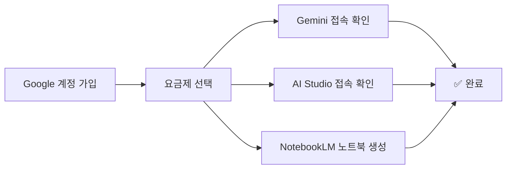

---
tags:
  - lecture/LLM
  - 2026-1
created: 2026-03-03
---

# Google AI 도구 환경 구성 가이드

> [!ref] 공식 사이트
> - [Google AI Studio](https://aistudio.google.com)
> - [Gemini](https://gemini.google.com)
> - [NotebookLM](https://notebooklm.google.com)
> - [Google AI 요금제](https://one.google.com/intl/en/about/google-ai-plans/)

---

## 1단계: Google 계정 가입

> 이미 Gmail 계정이 있다면 이 단계를 건너뛰세요.

1. [accounts.google.com](https://accounts.google.com) 접속
2. **계정 만들기** 클릭
3. 이름, 사용자 이름(이메일), 비밀번호 입력
4. 전화번호 인증 완료

---

## 2단계: Google AI 요금제 선택

> [!tip] Google AI Pro 권장 (대학생 1년 무료!)
> 수업에서 Gemini, AI Studio, NotebookLM을 적극 활용하므로 **Pro 이상**을 권장합니다.

### 요금제 비교

| 요금제 | 월 비용 | Gemini 3 Pro | NotebookLM | AI Studio | 추천 대상 |
|--------|--------|:----------:|:----------:|:---------:|----------|
| 무료 | 무료 | 기본 | 100노트북 | ✅ | 체험용 |
| AI Plus | $7.99/월 | 향상 | 향상 | ✅ | 가벼운 사용 |
| **AI Pro** | **$19.99/월** | **고급** | **500노트북** | **✅** | **수업 수강생 (권장)** |

### 🎓 대학생 무료 혜택

> [!success] 대학생은 Google AI Pro를 1년간 무료로 사용할 수 있습니다!

1. [gemini.google/students](https://gemini.google/students/) 접속
2. **학교 이메일(.ac.kr)** 로 인증
3. 자동으로 AI Pro 1년 구독 적용

> [!warning] 주의
> - 개인 Gmail이 아닌 **학교 이메일** 또는 학교 Google Workspace 계정 필요
> - 학교에서 Google Workspace for Education을 사용 중이어야 합니다
> - 혜택 확인이 안 되면 일반 가입 후 수업에 참여하세요 (무료 플랜으로도 기본 실습 가능)

### 일반 가입 방법

1. [one.google.com](https://one.google.com) 접속
2. **Google AI Pro** 플랜 선택
3. 결제 정보 입력
4. 구독 완료 확인

---

## 3단계: Gemini 사용 환경 확인

### Gemini 접속

1. [gemini.google.com](https://gemini.google.com) 접속
2. Google 계정으로 로그인
3. 채팅 화면이 나타나면 성공

### 모델 확인

1. 채팅창 상단의 **모델 선택** 드롭다운 클릭
2. **Gemini 3 Pro** 또는 **Gemini 3.1 Pro** 가 목록에 있는지 확인
3. Pro 요금제 가입자는 고급 모델 접근 가능

### 동작 테스트

아래 프롬프트를 입력하여 동작을 확인하세요:

```
건축공학에서 BIM(Building Information Modeling)의 주요 활용 분야 3가지를 간략히 설명해줘.
```

---

## 4단계: Google AI Studio 설정

### AI Studio 접속

1. [aistudio.google.com](https://aistudio.google.com) 접속
2. Google 계정으로 로그인
3. **Welcome** 화면이 나타나면 성공

### 주요 기능 확인

| 기능 | 설명 | 수업 활용 |
|------|------|----------|
| **Chat** | 대화형 프롬프트 테스트 | 프롬프트 엔지니어링 실습 |
| **Structured** | 구조화된 프롬프트 실험 | few-shot 학습, 템플릿 |
| **API Key** | API 키 발급 | Python 코드에서 Gemini 호출 |

### API 키 발급 (수업 중 안내 예정)

> [!info] API 키는 2주차 이후에 사용합니다
> 지금은 AI Studio 접속 확인만 하시면 됩니다.

참고로 발급 방법은 다음과 같습니다:

1. AI Studio 좌측 사이드바 → **Get API key** 클릭
2. **Create API key** 클릭
3. Google Cloud 프로젝트 자동 생성 (처음인 경우)
4. 발급된 키를 **안전한 곳에 메모** (노출 주의!)

> [!danger] API 키 보안 주의
> - API 키를 **GitHub, SNS, 블로그에 절대 공개하지 마세요**
> - 코드에 직접 넣지 말고, **환경 변수**로 관리하세요 (수업에서 자세히 다룹니다)

---

## 5단계: NotebookLM 설정

### NotebookLM이란?

> [!info] NotebookLM = 문서 기반 AI 연구 도우미
> PDF, 문서, 웹사이트를 업로드하면 그 내용을 기반으로 질의응답, 요약, 브리핑을 해주는 도구입니다. 수업에서 **RAG(검색 증강 생성)의 개념**을 이해하는 데 활용합니다.

### 접속 및 첫 노트북 생성

1. [notebooklm.google.com](https://notebooklm.google.com) 접속
2. Google 계정으로 로그인
3. **새 노트북** (Create) 클릭
4. 노트북 제목 입력 (예: "건축공학 AI 실습")

### 소스 추가 테스트

1. **소스 추가** (Add source) 클릭
2. 아래 중 하나를 시도:
   - **PDF 업로드**: 아무 논문 PDF 업로드
   - **웹사이트**: 관심 있는 기사 URL 붙여넣기
   - **Google Docs**: 기존 문서 연결
3. 소스가 추가되면 **채팅**에서 질문:

```
이 문서의 핵심 내용을 3줄로 요약해줘.
```

### 주요 기능

| 기능 | 설명 |
|------|------|
| **채팅** | 업로드한 소스 기반 질의응답 (출처 인용 포함) |
| **요약** | 소스 자동 요약 생성 |
| **Audio Overview** | 소스 기반 오디오 브리핑 생성 |
| **Mind Map** | 개념 관계도 자동 생성 |
| **Quiz / Flashcard** | 학습용 퀴즈·플래시카드 자동 생성 |

---

## 자주 묻는 질문 (FAQ)

### Q. 무료 플랜으로도 수업을 따라갈 수 있나요?
- **AI Studio**: 무료로 사용 가능합니다. API 호출에 일일 제한이 있지만 수업 실습에는 충분합니다.
- **NotebookLM**: 무료 플랜도 노트북 100개, 소스 50개까지 가능합니다.
- **Gemini**: 무료 플랜은 기본 모델만 사용 가능하나 실습은 가능합니다.
- 종합: **무료로도 기본 실습은 가능**하지만, 더 나은 모델과 충분한 사용량을 위해 Pro를 권장합니다.

### Q. 학교 이메일로 학생 혜택을 받을 수 없어요
- 학교에서 Google Workspace for Education을 사용하지 않는 경우 학생 인증이 불가합니다.
- 이 경우 일반 Google AI Pro 가입($19.99/월)을 고려하거나, 무료 플랜으로 시작하세요.

### Q. AI Studio에서 API 키 생성이 안 돼요
- Google Cloud 프로젝트가 필요할 수 있습니다. AI Studio에서 자동 생성을 시도하세요.
- 그래도 안 되면 [console.cloud.google.com](https://console.cloud.google.com)에서 직접 프로젝트를 생성하세요.
- 2주차 수업에서 API 키 발급을 함께 진행할 예정이니 걱정하지 마세요.

### Q. NotebookLM에서 한국어가 잘 되나요?
- 네, **한국어 PDF와 한국어 질의응답** 모두 잘 지원됩니다.
- 소스가 한국어이면 응답도 한국어로 나옵니다.

---

## 환경 구성 요약



---

> [!action] 체크리스트
> - [ ] Google 계정 가입 (또는 기존 계정 확인)
> - [ ] Google AI Pro 가입 (또는 학생 무료 혜택 신청)
> - [ ] Gemini 접속 및 모델 확인
> - [ ] Google AI Studio 접속 확인
> - [ ] NotebookLM 첫 노트북 생성 및 소스 업로드 테스트
